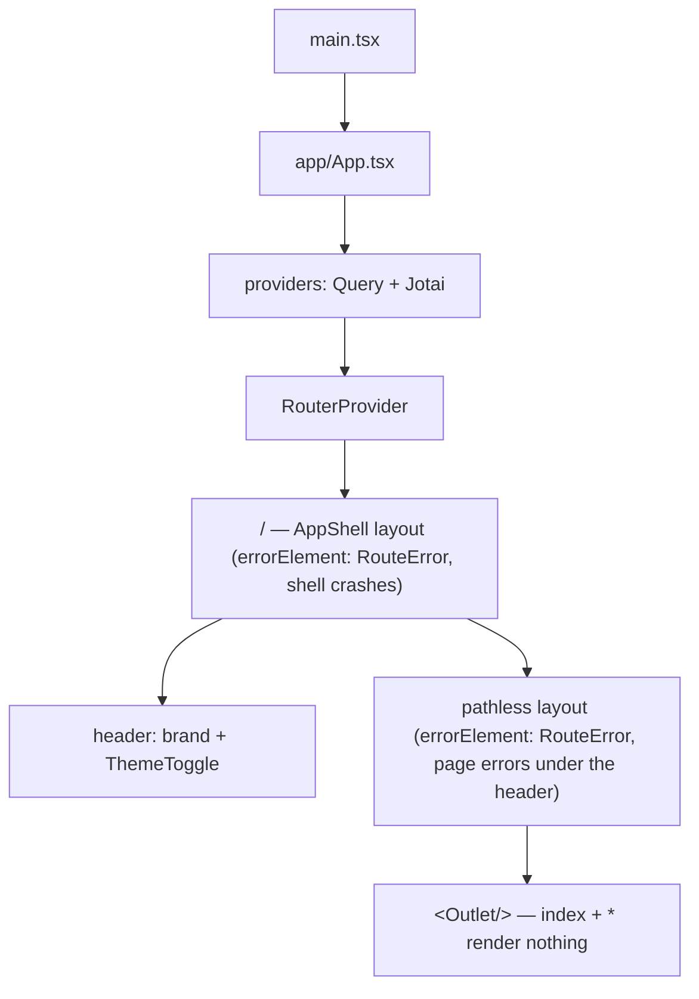
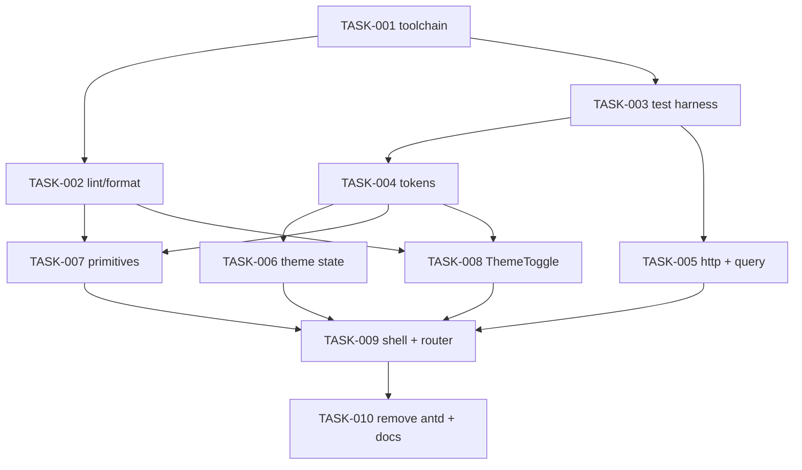

# Rebuild the frontend foundation on the new design system — Architecture

| Field | Value |
|---|---|
| REQ | REQ-001 |
| Status | validated |
| Created | 2026-10-04 |
| Related ADRs | [[architecture/adr-01-ui-layer-headless-css-modules]] (proposed), [[architecture/adr-02-server-state-tanstack-query]] (proposed) |

## Summary

`packages/frontend` is torn down and rebuilt as a React 19 + Vite 8 + TypeScript 6 app with a feature-based `src/` (`app/`, `features/`, `components/ui/`, `store/`, `services/`, `styles/`, `test/`). Design tokens are generated from `docs/design/design-system/tokens.json` into one CSS file of custom properties (light + dark), and components style themselves with CSS Modules that may only reference those properties — enforced by Stylelint and an ESLint rule. Five primitives (Button, Input, Card, Tag, ThemeToggle) are built against the design-system READMEs; ThemeToggle uses **Base UI** (headless, unstyled) for its radio-group behavior, establishing the pattern for later dialogs/menus/selects (ADR-01). Server state goes through **TanStack Query**; Jotai keeps client-only state (ADR-02). The app renders an empty shell (header + theme toggle) via React Router. antd is removed last, once the replacements exist.

## Corrections to exploration.md

Two findings in the exploration report don't match the code; this design uses the verified facts:

1. **Dev `/api` does not "already work".** The old services call relative paths (`/api/...`). In dev those hit the Vite server (port 5173), not the API (port `PORT`, default 3000). CORS doesn't help a same-origin relative call. → A Vite dev proxy is required (TASK-001).
2. **ESLint deps are not hoisted — they are not installed at all.** `eslint`, `globals`, `typescript-eslint`, `@eslint/js`, `eslint-plugin-react-hooks` are absent from root `node_modules` and from every `package.json`. The current `eslint.config.js` cannot run. → All lint/format/test deps are declared in `packages/frontend/package.json` (TASK-001).

Also: installed `vite` is 7.3.6 while `package.json` asks for `^8` — `node_modules` is stale; TASK-001 reinstalls.

## Blast radius

| Path | Why touched | Risk |
|---|---|---|
| `packages/frontend/src/**` (old) | Deleted entirely (63 files). Stays in git history. | medium — irreversible in the working tree, recoverable from git |
| `packages/frontend/package.json` + root `package-lock.json` | React 19, all new deps and scripts; antd removed last | medium — dependency surgery |
| `packages/frontend/tsconfig.json`, `tsconfig.app.json`, `tsconfig.node.json` | Stop extending root (root emits declarations → stray `vite.config.js/.d.ts/.map`); `noEmit`, stricter flags, `@/*` alias | low |
| `packages/frontend/vite.config.ts` | Alias, `/api` dev proxy, Vitest config | low |
| `packages/frontend/eslint.config.js` | Rewritten: TS type-aware, react-hooks, react-refresh, jsx-a11y, raw-color + boundary rules, prettier last | low |
| `packages/frontend/.prettierrc.json`, `.prettierignore`, `stylelint.config.js` | New | low |
| `packages/frontend/index.html` | No-flash theme script, `lang`, title, `color-scheme` meta | low |
| `packages/frontend/scripts/generate-tokens.ts` | New: tokens.json → `src/styles/tokens.css` | low |
| `packages/frontend/src/{app,features,components/ui,store,services,styles,test}/**` | New foundation code + tests + folder READMEs | — (new) |
| stray `packages/frontend/vite.config.{js,d.ts,js.map,d.ts.map}`, `dist/` | Deleted (untracked build output) | low |
| `packages/frontend/README.md` | Rewritten for the new setup | low |
| `docs/design/design-system/tokens.json` + README color table | darken light `accent`/`accent-strong` (gate decision, TASK-004) | low |
| `CLAUDE.md` (root) — Commands, Frontend sections | Describe new scripts, proxy, structure; drop "no test suite" | low |
| `.adlc/context/conventions.md` — TypeScript, Linting, Testing, new Frontend section | Document the new rules reviewers enforce | low |
| `.adlc/context/architecture.md` — frontend row | React 19, new structure | low |

Not touched: backend, `@alumni/shared`, database, `docs/design/**` (read-only input).

## Approach

### Toolchain (versions verified against the npm registry 2026-10-04)

| Concern | Choice | Note |
|---|---|---|
| Runtime | React 19.3, React DOM 19.3 | React Router 8 requires ≥19.2.7 |
| Build | Vite 8, `@vitejs/plugin-react` 6 | |
| Types | **TypeScript 6.0.x** (not 7) | `typescript-eslint` 8.71 supports TS `<6.1`; TS 7 would break type-aware lint |
| Lint | **ESLint 9.39** (not 10), `typescript-eslint` (type-checked), `eslint-plugin-react-hooks` 7, `eslint-plugin-react-refresh`, `eslint-plugin-jsx-a11y`, `eslint-config-prettier` | `jsx-a11y` peer-supports ESLint ≤9 |
| CSS lint | Stylelint 17 + `stylelint-config-standard` + `stylelint-declaration-strict-value` | Enforces tokens-only in CSS Modules |
| Format | Prettier 3 | ESLint/Stylelint formatting rules off |
| Test | Vitest 5, jsdom 29 (30 needs Node ≥24.15; 24.14.1 installed), `@testing-library/react` 16, `user-event` 14, `jest-dom`, `@vitest/coverage-v8` | |
| Routing | React Router 8 (`react-router`, data router) | |
| State | Jotai 3 (client), TanStack Query 5 (server) — ADR-02 | |
| HTTP | axios 1.x, one instance | interceptor attaches token once |
| UI behavior | Base UI (`@base-ui/react` 1.x) — ADR-01 | used now only by ThemeToggle |
| Font | `@fontsource-variable/inter` (self-hosted) | no third-party font request |

`packages/frontend/package.json` gets `"type": "module"` (ESM lint configs load cleanly) and `engines.node >=24`. Node 24.14 is installed, so `scripts/generate-tokens.ts` runs with native type-stripping (`node scripts/generate-tokens.ts`) — no tsx/ts-node.

`package.json` scripts: `dev`, `build` (`npm run typecheck && vite build`), `preview`, `typecheck` (`tsc -p tsconfig.app.json && tsc -p tsconfig.node.json`, both `noEmit`), `lint` (`eslint . && stylelint "src/**/*.css" --allow-empty-input`), `lint:fix`, `format`, `format:check`, `test` (`vitest run`), `test:watch`, `test:coverage`, `tokens` (generate), `tokens:check`.

**TypeScript flags** (resolves spec open question): frontend tsconfigs no longer extend the root. `tsconfig.app.json`: `strict`, `noUncheckedIndexedAccess`, `noImplicitOverride`, `noFallthroughCasesInSwitch`, `noUnusedLocals`, `noUnusedParameters`, `verbatimModuleSyntax`, `erasableSyntaxOnly`, `moduleDetection: force`, `noEmit`, `jsx: react-jsx`, `types: ["vite/client"]`. Vitest globals are **off**; tests import `describe/it/expect` explicitly. `tsconfig.node.json` covers `vite.config.ts` and `scripts/**` (the `.js` lint configs are linted without type info) (with `types: ["node"]`, `allowImportingTsExtensions`). `exactOptionalPropertyTypes` is **not** enabled (poor fit with third-party prop types).

**Path alias:** one alias, `@/*` → `src/*`, declared in `tsconfig.app.json` `paths` and in `vite.config.ts` `resolve.alias` (Vitest reads the same Vite config, so editor/typecheck/build/test agree). No plugin.

**Dev proxy:** `vite.config.ts` uses `loadEnv(mode, <repo root>, '')` to read **only** `PORT` (default 3000) and proxies `/api` → `http://localhost:<PORT>`. No other root `.env` values reach the client (Vite only exposes `VITE_*` to client code, and we read the value in config only).

### Folder structure

```
packages/frontend/
  index.html               no-flash theme script
  scripts/generate-tokens.ts
  src/
    main.tsx               createRoot + <App/>; imports styles/global.css
    app/                   App.tsx, providers.tsx, router.tsx, queryClient.ts,
                           AppShell/ (AppShell.tsx + .module.css), RouteError.tsx
    features/              empty (README) — one folder per domain later
    components/ui/         Button/ Input/ Card/ Tag/ ThemeToggle/ (tsx + module.css + test + index.ts)
    store/                 themeAtom.ts (+ test)
    services/              httpClient.ts, authToken.ts (+ tests)
    styles/                tokens.css (generated), global.css, contrast.test.ts
  scripts/                 generate-tokens.ts (+ .test.ts), enforcement.test.ts
    test/                  setup.ts (jest-dom, matchMedia stub, storage reset)
```

Each top-level `src/` folder gets a short `README.md` stating what belongs there and what may import it. Import rules (enforced by ESLint `no-restricted-imports` overrides):
- `components/ui/**` may not import `@/services/**`, `@/store/**`, `@/features/**`, `@/app/**`, `axios`, `@tanstack/react-query` — primitives are props-in, events-out.
- `services/**` may not import React or UI code.
- `features/**` may import ui, store, services; nothing imports `app/` except `main.tsx`.

### Design tokens (single source: `tokens.json`)

```mermaid
flowchart LR
  J[docs/design/.../tokens.json] -->|npm run tokens| G[scripts/generate-tokens.ts]
  G --> C[src/styles/tokens.css]
  C -->|var(--…)| M[*.module.css]
  T[scripts/generate-tokens.test.ts] -.regenerates + compares.-> C
  H[index.html script] -->|data-theme| R[:root]
  A[themeAtom + useApplyTheme] -->|data-theme| R
```

`generate-tokens.ts` exports a pure `renderTokensCss(json): string` and a CLI entry. Output:
- Spacing and type sizes/line-heights are emitted in **rem** (JSON px ÷ 16) so they follow the user's browser font-size setting; radii stay px.
- `:root { --space-1…8; --radius-sm/md/lg/pill; --font-sans; --text-<style>: <weight> <size>/<line> var(--font-sans); --text-<style>-size … }` — type styles as `font` shorthands so components write `font: var(--text-label)`.
- `:root, :root[data-theme="light"] { color-scheme: light; --surface-page: …; … }` and `:root[data-theme="dark"] { color-scheme: dark; … }` — light is the default when no attribute is set.
- A header comment: "Generated from tokens.json — do not edit".

`scripts/generate-tokens.test.ts` calls `renderTokensCss` on the real JSON and asserts it equals the committed `tokens.css` (fails with "run npm run tokens"), and asserts every token name in the JSON appears for both themes. `tokens:check` runs the same comparison for CI use.

`main.tsx` imports, in order, `@fontsource-variable/inter`, `@/styles/tokens.css`, `@/styles/global.css` — this is how tokens reach the browser. `global.css` (no `@import`): minimal reset, body uses `--surface-page`/`--ink-primary`/`--text-body`, `:focus-visible` uses an accent **outline** (an outline is not a shadow; Input keeps the README's border-only focus — see Risks), `prefers-reduced-motion` respected.

**Enforcement (spec AC: no raw colors, no box-shadow):**
- Stylelint on `src/**/*.css`: `color-no-hex`, `function-disallowed-list: [rgb, rgba, hsl, hsla, hwb, lab, lch, oklch, color]`, `color-named: never`, `property-disallowed-list: [box-shadow, text-shadow]`, and `scale-unlimited/declaration-strict-value` requiring `var(--…)` (or `0`/`inherit`/`currentColor`/`transparent`/`none`/`auto`) for `/color$/`, `fill`, `stroke`, `background`, `font`, `font-size`, `line-height`, `font-weight`, `padding*`, `margin*`, `gap`, `border-radius`. `src/styles/tokens.css` is in Stylelint `ignoreFiles` (generated; it's where raw values live). 1px border widths are allowed (hairline is a design-system constant, not a token).
- Import boundaries are enforced for both `@/…` and relative paths.
- ESLint on `src/**/*.{ts,tsx}` (except `src/styles/**`): `no-restricted-syntax` on string/template literals matching `/#[0-9a-f]{3,8}\b|\b(rgba?|hsla?)\(/i` and on JSX `style` props containing `boxShadow`.
- A test fixture proves both checks fire (TASK-002 lints a deliberately bad fixture in a temp dir via the Node APIs of ESLint/Stylelint and asserts errors).

### Theme

- `store/themeAtom.ts`: `themePreferenceAtom = atomWithStorage<'light'|'dark'|'system'>('alumni.theme', 'system', createJSONStorage(() => localStorage), { getOnInit: true })` with validation (unknown stored value → `'system'`).
- `features/theme/useApplyTheme.ts` (theme is the first "feature"): resolves `system` via `matchMedia('(prefers-color-scheme: dark)')`, subscribes to its `change` event while in system mode, and sets `document.documentElement.dataset.theme` to `light|dark`. Called once from `AppShell`.
- **No flash:** an inline `<script>` in `index.html` `<head>` runs before first paint: reads `localStorage['alumni.theme']` (JSON), resolves system via `matchMedia`, sets `data-theme`. Wrapped in try/catch (private mode). The storage key is a shared constant documented in both places; a test asserts `index.html` contains the same key string as `themeAtom.ts`.

### Primitives (match `docs/design/design-system/components/*/README.md`)

All are plain function components with typed props, `forwardRef` not needed (React 19 passes `ref` as a prop), CSS Modules, state via `data-*` attributes / `:disabled`. None import services/store.
- **Button** — `variant: 'primary'|'secondary'|'ghost'` (default secondary), native `<button type="button">` default, `disabled`, passes through native props.
- **Input** — `label` (required), `helperText?`, `id` generated with `useId()`, `<label htmlFor>`, `aria-describedby` → helper (text in `ink-secondary`, see Contrast); focus = background `surface-raised` + border `accent`, no outline ring (README); disabled = 50% opacity.
- **Card** — `as?: 'div'|'article'|'section'`, `surface-raised`, `border-subtle` hairline, `radius-lg`, `space-5` padding.
- **Tag** — `tone: 'neutral'|'accent'|'success'|'warning'|'error'`; status tones render a status-colored dot (`aria-hidden`) plus text in `ink-secondary` (see Contrast).
- **ThemeToggle** — controlled: `value`, `onValueChange`, built on Base UI `RadioGroup` + `Radio` (roving tabindex, arrow keys, `aria-checked`); group labelled "Theme"; options Light / Dark / System. Pill track `surface-sunken`, selected segment `surface-raised`.

### Server state + HTTP (ADR-02)

- `services/authToken.ts`: `getToken()`, `setToken()`, `clearToken()` over `localStorage['token']` — same key the backend-facing old code used. It is the **single source of truth for the token** (ADR-02); the auth REQ may hold decoded claims in an atom, never the token.
- `services/httpClient.ts`: `axios.create({ baseURL: '/api' })` + one request interceptor adding `Authorization: Bearer <token>` when a token exists. Exported `httpClient`. No endpoint functions. 401 handling is deferred to the auth REQ.
- `app/queryClient.ts`: `new QueryClient({ defaultOptions: { queries: { staleTime: 30_000, refetchOnWindowFocus: false, retry: (n, err) => n < 2 && !is4xx(err) }, mutations: { retry: false } } })`.
- `app/providers.tsx`: `QueryClientProvider` → Jotai `Provider` (explicit store, eases tests) → children. Devtools not installed in this REQ.

### Contrast

Computed from `tokens.json` (WCAG 2.x). Dark theme passes every **text** pair; its Input resting border (now `border-strong`) is 1.94:1 on the fill (see last row). Light theme does not fully match the design README's "every pairing meets 4.5:1" claim:

| Light-theme pair | Ratio | Needed | Handling in this design |
|---|---|---|---|
| `warning` text on `surface-sunken` (Tag) | 3.0 | 4.5 | **fixed by usage** — Tag text uses `ink-secondary` (4.84); status color only on the dot |
| `success` text on `surface-sunken` (Tag) | 4.0 | 4.5 | **fixed by usage** — same |
| `ink-muted` helper text on page/sunken | 3.3 / 2.8 | 4.5 | **fixed by usage** — helper text uses `ink-secondary`; `ink-muted` kept for disabled text only; placeholders also use `ink-secondary` (review fix m3) |
| `accent-ink` on `accent` (primary Button label) | 4.02 | 4.5 | ⚠ **gate decision** |
| `accent` link text on `surface-page` | 3.97 | 4.5 | ⚠ **gate decision** |
| Input resting border on `surface-sunken` / page | was `border-subtle` 1.14 / 1.51; now `border-strong` 1.44 / 1.94 on the fill, 1.60 / 1.83 on the page (review decision d1) | 3.0 (WCAG 1.4.11) | accepted: the visible label plus the sunken fill identify the field; recorded as exceptions in `contrast.test.ts`; focus border (`accent`) passes |

The accent decision (see Open questions): darken light-mode `accent` to `#975c43` (5.0:1 on page, 5.07 for the label) and `accent-strong` to roughly `#7a4734` so hover stays distinct — a change to `docs/design/design-system/tokens.json`; or keep the values and record both as accepted exceptions. ThemeToggle's selected segment (`surface-raised` on the `surface-sunken` track) is 1.19:1 light / 1.18 dark as a shape, so the selected option must also be marked by text (`ink-primary` vs `ink-secondary`, 12.5 vs 4.8) — TASK-008. `contrast.test.ts` (TASK-004) encodes whichever is chosen, so later token edits can't silently make it worse.

### App shell + router



`router.tsx`: `createBrowserRouter([{ path: '/', element: <AppShell/>, errorElement: <RouteError/>, children: [{ errorElement: <RouteError/>, children: [{ index: true, element: null }, { path: '*', element: null }] }] }])`. Two error layers (decided during implement, 2026-10-05): the outer one catches shell crashes (no header then); the path-less inner one keeps the header for page errors. No feature routes, no 404 page (spec non-goal) — unknown paths show the empty shell. `RouteError` is a minimal in-shell "Something went wrong" message, not a page. `AppShell` has a skip link to `<main id="main">`, a `<header>` with the brand name ("Alumni Network", the design system's title) and `ThemeToggle` wired to `themePreferenceAtom`. Layout: max-width container with `space-4` gutters at 360px, `space-6+` wider; header wraps instead of overflowing.

### antd removal

Old `src/` is deleted in TASK-001 (user decision: clear it out), but the `antd` / `@ant-design/icons` entries stay in `package.json` until TASK-010 — after Button/Input/Card/Tag/ThemeToggle exist — per the spec ordering. TASK-010 also greps `packages/frontend` for any remaining `antd` reference.

## Task DAG

All dependency installs and `package.json` script edits happen in **TASK-001** only (and the antd removal in TASK-010), so parallel tasks never edit `package.json` or the lockfile at the same time.

### Tier 0
- `TASK-001` — Clear old src, install the full toolchain, tsconfigs, Vite config (alias + proxy), folder skeleton + READMEs

### Tier 1
- `TASK-002` — ESLint + Stylelint + Prettier configs, token/boundary enforcement rules, enforcement self-test — depends on TASK-001
- `TASK-003` — Vitest + RTL harness (setup file, smoke test, coverage) — depends on TASK-001

### Tier 2
- `TASK-004` — Token generator, `tokens.css`, `global.css`, Inter, sync test — depends on TASK-003
- `TASK-005` — HTTP client, token store, QueryClient + providers, tests — depends on TASK-003

### Tier 3
- `TASK-006` — Theme state: atom, `useApplyTheme`, no-flash script, tests — depends on TASK-004
- `TASK-007` — Button, Input, Card, Tag primitives + tests — depends on TASK-002, TASK-004
- `TASK-008` — ThemeToggle primitive (Base UI) + tests — depends on TASK-002, TASK-004

### Tier 4
- `TASK-009` — App shell, router, error boundary, wiring + tests — depends on TASK-005, TASK-006, TASK-007, TASK-008

### Tier 5
- `TASK-010` — Remove antd, full verification run, docs (CLAUDE.md, conventions, frontend README) — depends on TASK-009



## Test strategy

Unit/component tests with Vitest + RTL + user-event in jsdom, co-located (`*.test.ts(x)` next to the source):

| File | Covers |
|---|---|
| `src/test/smoke.test.tsx` | harness works; jest-dom matchers; alias resolves |
| `scripts/enforcement.test.ts` | ESLint flags a raw hex in a `.tsx` fixture and a `boxShadow` style; Stylelint flags hex, `rgb()`, `box-shadow`, raw `padding: 12px` in a `.module.css` fixture; clean fixture passes |
| `scripts/generate-tokens.test.ts` | generated CSS equals committed file; every token present in light + dark |
| `src/store/themeAtom.test.ts` | default `system`; persists to `localStorage['alumni.theme']`; invalid stored value → `system`; key matches `index.html` |
| `src/features/theme/useApplyTheme.test.tsx` | sets `data-theme` for light/dark; system follows mocked `matchMedia`; live change event flips it; listener removed when leaving system |
| `src/services/authToken.test.ts`, `httpClient.test.ts` | token get/set/clear; interceptor adds Bearer only when a token exists; baseURL `/api` |
| `src/app/queryClient.test.ts` | defaults; no retry on 4xx |
| `components/ui/{Button,Input,Card,Tag,ThemeToggle}/*.test.tsx` | each variant renders with its data attribute/class; disabled; keyboard (Enter/Space on Button; Tab focus + label association on Input; arrow keys move selection in ThemeToggle, `aria-checked` reflects value); Tag status dot present for status tones |
| `src/app/AppShell.test.tsx` | renders header, brand, theme toggle, `<main>`; choosing Dark sets `data-theme="dark"` and persists; unknown route still renders shell |

Not automatable here and left to `/review`'s ui-reviewer (browser): 360px width with no horizontal scroll, 200% zoom, the no-flash first load with a saved Dark choice, and visual match against `docs/design/design-system/components/*/preview.html`. TASK-010 runs every script (`typecheck`, `lint`, `format:check`, `test`, `build`) and a manual `npm run dev` + `curl` through the proxy to `/api/health`.

## Convention alignment

Follows root `CLAUDE.md` "Conventions (redesign) → Frontend": React + Vite + TS rebuilt from scratch ✓; Jotai atoms in `src/store/` ✓; UI library recommended for approval at this gate (ADR-01) ✓; Scandinavian design via the design-system tokens ✓; light/dark/system toggle in header, persisted, live system mode ✓; tokens-only (lint-enforced) ✓; designs from `docs/design/` ✓; 360px / 200% zoom (checked at review) ✓; no API calls inside UI components (lint-enforced import boundary) ✓. "Components get typed props from `@alumni/shared`" applies to domain components; primitives here take generic props, so there's nothing to import yet.

Deviations, with reasons:
- **Frontend tsconfigs stop extending the root `tsconfig.json`.** The root turns on declaration/source-map emit, which is what leaves `vite.config.js/.d.ts/.map` beside source. The frontend sets its own (stricter) options with `noEmit`. Root stays unchanged for the backend.
- **Stylelint is added** although the brief named only ESLint + Prettier — ESLint can't lint CSS Modules, and the tokens-only rule must reach CSS.
- **TypeScript 6 / ESLint 9 instead of the newest majors** — plugin compatibility (above).
- `context/conventions.md` currently describes the old setup; TASK-010 updates it (spec AC).

## Risks

| Risk | Likelihood | Mitigation |
|---|---|---|
| Base UI's 1.x API changes under us (newer than Radix) | low | Only ThemeToggle uses it now; wrapper keeps Base UI behind our own props; ADR-01 names React Aria as fallback |
| `stylelint-declaration-strict-value` too strict (e.g. `1px` borders, `50%` opacity, `100%` widths) and blocks normal CSS | med | Rule scoped to color/spacing/type/radius props only; allowed keywords listed; enforcement test pins behavior |
| No-flash script and atom disagree on storage format/key | med | Shared key constant + test asserting `index.html` contains it; both use JSON |
| Input README says "no glow or outer ring", while global `:focus-visible` outline is needed for keyboard users on other controls | med | Input overrides to border-only focus per README (border color change is visible: `accent` vs `border-strong`); Buttons/toggle keep a 2px accent outline. Flagged for ui-reviewer contrast check |
| Deleting old `src/` loses useful logic (password strength, year lists) | low | User chose clear-out; all of it is in git history (`d4325b2a` and earlier) for later REQs to reuse |
| React 19 / Vite 8 / Vitest 5 combination has a rough edge in jsdom | low | TASK-003 lands the harness alone with a smoke test before anything depends on it |
| Light-theme contrast below 4.5:1 for accent text | high (measured) | Usage fixes for Tag/helper text; accent is a gate decision; `contrast.test.ts` locks the result |
| Root `.env` secrets leak through `loadEnv` | low | Config reads `PORT` only; client exposure is limited to `VITE_*` by Vite; noted in a code comment |

## Open questions

- [x] **Light-mode accent contrast** — decided at gate 2026-10-04: darken light `accent` → `#975c43`, `accent-strong` → `#7a4734` (label 5.07, links 5.0, hover 7.16, accent Tag text 6.09). Was: — primary-button label 4.02:1 and accent links 3.97:1, below 4.5:1. Darken `accent`/`accent-strong` in `tokens.json`, or accept and document. See Contrast.
- [x] **Brand name in the header** — decided at gate: "Alumni Network". Was: — using "Alumni Network" (the design system's title). Old code had `content/brand.ts`; confirm or name it at the gate. Non-blocking: one string.

## Stress-test results

Full pass by the architecture-adversary (`architecture-adversary.md`): 9 findings survived (0 critical, 5 major, 4 minor). Handling:

| ID | Finding | Action |
|---|---|---|
| ADV-001 | Enforcement test would hit a fatal parse error (type-aware ESLint on a virtual file) | fixed — TASK-002 lints fixtures without type info, asserts no fatal messages |
| ADV-002 | `npm run lint` fails after TASK-002 (no CSS yet; ESM config without `type: module`) | fixed — `--allow-empty-input`; `"type": "module"` in TASK-001 |
| ADV-003 | stylelint-config-standard rejects generated `tokens.css` and planned `@import` | fixed — `ignoreFiles` for tokens.css; no `@import` in global.css; `currentcolor` |
| ADV-004 | Nothing imported `tokens.css` | fixed — `main.tsx` imports font → tokens → global |
| ADV-005 | ADR-02 put the token in Jotai; design keeps it in a storage module | fixed — ADR-02 aligned: token in `services/authToken.ts` |
| ADV-006 | Light-theme contrast below 4.5:1 in five places | partly fixed by usage (Tag, helper text); accent is a gate decision; border accepted with reason; `contrast.test.ts` added |
| ADV-007 | jsdom 30 needs Node ≥24.15 | fixed — pin jsdom 29, `engines` |
| ADV-008 | UI boundary rule missed relative imports | fixed — patterns cover relative paths |
| ADV-009 | px tokens ignore user font-size | fixed — spacing/type emitted in rem |

## Related

- Spec: REQ-001 — resolve the folder per `core/VAULT-LAYOUT.md`
- Exploration: `exploration.md` (see corrections above)
- Concepts: [[knowledge/concepts/design-tokens]] (stub, this REQ)
- Components: [[knowledge/components/frontend]] (stub, this REQ)
- Lessons checked: none exist yet (`knowledge/lessons/` empty)
- ADRs: [[architecture/adr-01-ui-layer-headless-css-modules]], [[architecture/adr-02-server-state-tanstack-query]]
