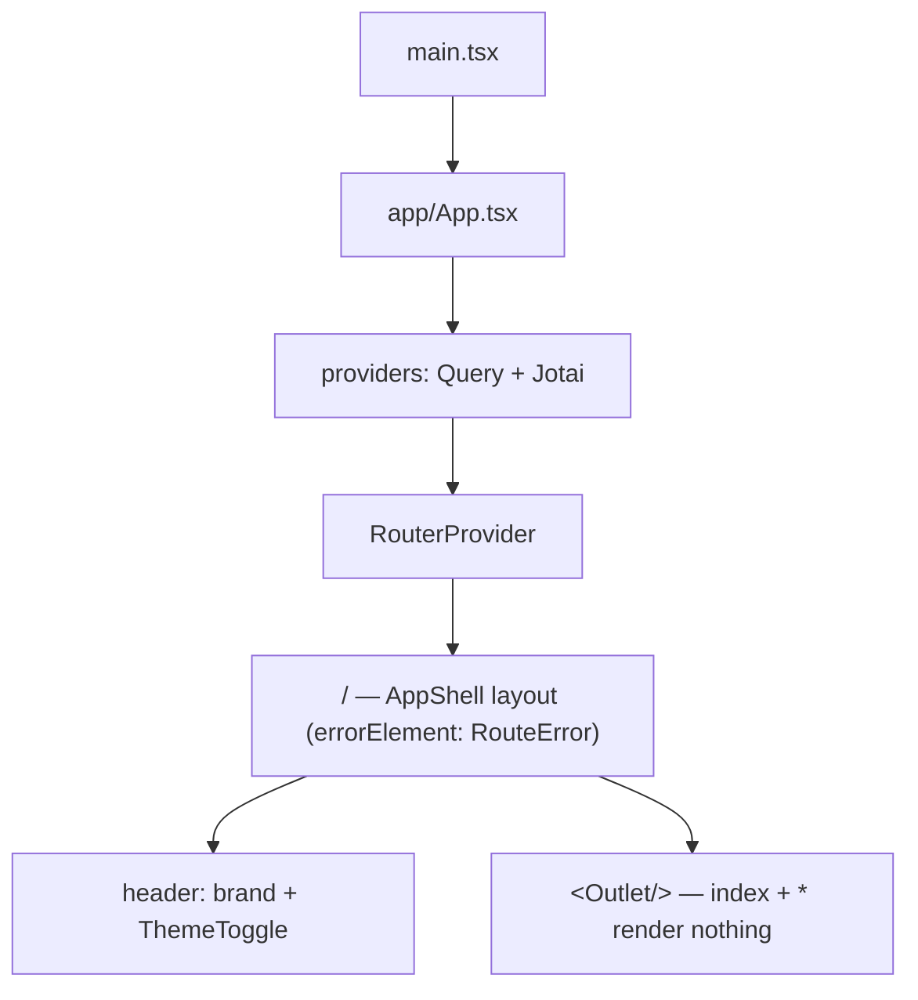
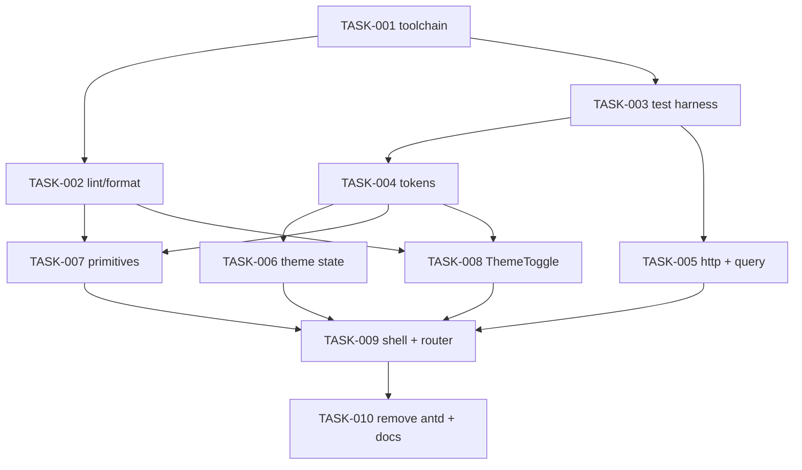

# REQ-001-frontend-foundation — Review Packet

`Packet: 115KB · round 3 · 9 files in this round`

Round-3 diff vs the committed HEAD for only the files this round touched (so eslint.config.js and enforcement.test.ts also show their round-2 changes, which you already reviewed). Spec and architecture are unchanged except the REQ architecture.md fixes noted below. **Do not re-read these via Read — cite this packet.**

## Round 3 — what changed since round 2

| ID | Disposition | Files |
|----|-------------|-------|
| n1 | fixed: `layerBan` matches only `@/<layer>`, `./**/<layer>`, `../**/<layer>` (+ `/**`); package sub-paths (`firebase/app`) no longer flagged; test files exempt from the app/ ban only (other bans kept) | eslint.config.js, enforcement.test.ts |
| n2 | fixed: symlinked `node <link> --check` runs (exit 0 "up to date"; stale temp copy → exit 1); motion test no longer pins the full token list | generate-tokens.test.ts |
| n3 | fixed (repo docs): Input = border-strong at rest, accent + raised on focus, no hover; placeholder ink-secondary; every boundary listed; motion tokens in token lists; layout sizes stay literal | design README, Input README + preview, frontend README, .adlc/context/conventions.md |
| n3 (REQ doc) | fixed by orchestrator: architecture.md Contrast table, two-layer route diagram, test file path | .adlc/specs/…/architecture.md |
| d2 | applied exactly as approved ("no styled component kit") | CLAUDE.md |
| n4 | accepted by user (pill overflows below ~200 CSS px) | — |
| left for /wrapup | tokens.json usage strings still say ink-muted for placeholders and border-subtle for inputs | tokens.json |

## Diff with full context (round 3 files vs HEAD)

```diff
diff --git a/.adlc/context/conventions.md b/.adlc/context/conventions.md
index f0e53b46..b3a266ab 100644
--- a/.adlc/context/conventions.md
+++ b/.adlc/context/conventions.md
@@ -1,114 +1,115 @@
 # Conventions
 
 Project-specific rules. The reviewer agents (`quality-reviewer`, `architecture-reviewer`) check code against this file. If a convention isn't documented here, it isn't enforced — write it down or accept that the code will drift.
 
 ## Naming
 
 - **Files:** _(e.g., kebab-case for .ts, PascalCase for .tsx components)_
 - **Variables:** _(e.g., camelCase, no single-letter except for loop indices)_
 - **Constants:** _(e.g., SCREAMING_SNAKE_CASE)_
 - **Types/interfaces:** _(e.g., PascalCase, no `I` prefix)_
 
 ## Logging
 
 - **Library:** _(e.g., pino, winston, ILogger)_
 - **Levels:** _(when to use debug, info, warn, error)_
 - **Structured fields:** _(required fields on every log line)_
 - **No `console.log` in production code.**
 
 ## Error handling
 
 - _(How errors propagate — exceptions, Result types, error codes?)_
 - _(How are unexpected errors surfaced?)_
 - _(What gets logged vs. returned vs. swallowed?)_
 
 ## Config
 
 - **Source:** _(env vars, config file, secrets manager)_
 - **Access pattern:** _(centralized config module, direct env reads?)_
 - **No magic strings or numbers** — named constants or config values.
 
 ## API conventions
 
 - **Response format:** _(e.g., `{ data, error }`, `{ success, payload }`)_
 - **Pagination:** _(cursor vs offset, page size limits)_
 - **Versioning:** _(URL path vs header vs none)_
 - **Auth:** _(bearer token, session cookie, API key)_
 
 ## Testing
 
 Frontend only (`packages/frontend`). The backend and `@alumni/shared` have no test runner yet.
 
 - **Frameworks:** Vitest 5 + React Testing Library 16 + `@testing-library/user-event` 14 + `@testing-library/jest-dom`. Run with `npm test` (`vitest run`) inside `packages/frontend`.
 - **Environment:** jsdom 29 by default (pinned: jsdom 30 needs Node ≥ 24.15). Tests under `scripts/` must start with `// @vitest-environment node` — Vitest 5 has no `environmentMatchGlobs`, so without the comment they run in jsdom.
 - **Setup (`src/test/setup.ts`):** jest-dom matchers; a `window.matchMedia` stub (default light; `setPrefersDark(bool)` from `@/test/setup` flips it and fires `change`); localStorage, `<html data-theme>` and the stub are reset before and after every test, and RTL `cleanup()` runs after each.
 - **Globals off:** import `describe`/`it`/`expect`/`vi` from `vitest` explicitly. `restoreMocks: true` is set.
 - **Test file location:** co-located — `Button.tsx` → `Button.test.tsx`; `scripts/foo.ts` → `scripts/foo.test.ts`.
 - **CSS in tests:** CSS Module class names are not hashed (`classNameStrategy: 'non-scoped'`), so tests may assert on `.primary` etc. CSS imports are stubbed (`?raw` returns `''`); read files from disk when a test needs CSS content.
 - **Mock policy:** mock at the boundary only — HTTP via axios's per-request `adapter` option (no extra mocking library), media queries via the setup stub. Test components through roles and visible text, keyboard paths with `user-event`.
 - **Guard tests** that must stay green: `scripts/generate-tokens.test.ts` (tokens.css matches tokens.json), `src/styles/contrast.test.ts` (WCAG pairs), `scripts/enforcement.test.ts` (lint rules still fire), `src/store/themeAtom.test.ts` (no-flash script and atom share the storage key).
 - **Coverage expectations:** none enforced yet. `npm run test:coverage` writes a v8 report to `coverage/` (git-ignored).
 
 ## Comments
 
 - _(When are comments expected? When are they noise?)_
 - _(TODO/FIXME format — must include a tracking link?)_
 
 ## Git
 
 - **Commit message format:** _(e.g., conventional commits: `feat(scope): description`)_
 - **Branch naming:** _(e.g., `feat/REQ-xxx-slug`, `bugfix/BUG-xx`)_
 - **PR title format:** _(typically matches the commit format)_
 
 ## TypeScript
 
 Verified against the tsconfig files on 2026-10-05.
 
 **Backend and shared** — `packages/backend`, `packages/backend/src/{api,businessLogic,dal}` and `packages/shared` extend the root `tsconfig.json` (TypeScript 5.9):
 
 - `strict: true` (implies `noImplicitAny`, `strictNullChecks`); `esModuleInterop`, `skipLibCheck`.
 - Target/module `ESNext`, `moduleResolution: bundler`; declarations, declaration maps and source maps are emitted.
 - `noUncheckedIndexedAccess` is not enabled.
 
 **Frontend** — `packages/frontend` does **not** extend the root (the root's emit settings left stray `vite.config.js/.d.ts/.map` files beside source). TypeScript **6.0** (not 7: `typescript-eslint` 8.71 supports TS < 6.1). `tsconfig.json` only references the two configs below; `npm run typecheck` runs both.
 
 - `tsconfig.app.json` (`src/`): `strict`, `noUncheckedIndexedAccess`, `noImplicitOverride`, `noFallthroughCasesInSwitch`, `noUnusedLocals`, `noUnusedParameters`, `verbatimModuleSyntax` (use `import type`), `erasableSyntaxOnly` (no enums, namespaces or parameter properties), `moduleDetection: force`, `noEmit`, `allowImportingTsExtensions`, `jsx: react-jsx`, `types: ["vite/client"]`, target `ES2022`, lib `ES2023 + DOM + DOM.Iterable`, `skipLibCheck`. Path alias `@/*` → `./src/*` via `paths` only — no `baseUrl` (TS 6 rejects it, TS5101).
 - `tsconfig.node.json` (`vite.config.ts`, `scripts/**/*.ts`): same strictness flags, `types: ["node"]`, target/lib `ES2023`, `noEmit`. The `.js` lint configs are not type-checked.
 - `exactOptionalPropertyTypes` is deliberately off (poor fit with third-party prop types).
 
 ## Linting
 
 Verified against `packages/frontend/eslint.config.js`, `stylelint.config.js` and `.prettierrc.json` on 2026-10-05. Frontend only: the backend and shared packages have no lint or format config.
 
 - **ESLint 9.39** (flat config; not 10, because `eslint-plugin-jsx-a11y` supports ESLint ≤ 9). `npm run lint` runs ESLint, then Stylelint.
   - `.ts`/`.tsx`: `@eslint/js` recommended, `typescript-eslint` **strictTypeChecked + stylisticTypeChecked** (type-aware via `projectService`), `react-hooks` recommended, `react-refresh` (Vite), `jsx-a11y` recommended. `.js` files get `@eslint/js` recommended without type info.
   - **Tokens-only rule** (`src/**/*.{ts,tsx}` except `src/styles/**`): no string/template literal matching a raw color (`#rgb…`, `rgb(`, `rgba(`, `hsl(`, `hsla(`), and no `boxShadow` in a JSX `style` prop.
-  - **Import boundaries** (`no-restricted-imports`, alias and relative forms both blocked): `src/components/ui/**` may not import `services`, `store`, `features`, `app`, `axios`, `@tanstack/react-query`; `src/services/**` may not import `react` or `components`.
+  - **Import boundaries** (`no-restricted-imports`, alias and relative forms both blocked): `src/components/ui/**` may not import `services`, `store`, `features`, `app`, `axios`, `@tanstack/react-query`; `src/services/**` may not import `react`, `components`, `store`, `features` or `app`; `src/store/**` may not import `services`, `features` or `app`; `src/features/**` and the rest of `src/components/**` may not import `app`. So nothing in `features/`, `store/`, `services/` or `components/` may import `app/`. Test files (`*.test.{ts,tsx}`) keep every ban except the `app/` one, so tests may import `app/` providers to render a component. Each layer has one `no-restricted-imports` block for source files and one for its tests, with non-overlapping globs, because flat config does not merge a rule's options across blocks (the last match wins).
   - `eslint-config-prettier` comes last (formatting rules off). `dist/` and `coverage/` are ignored.
 - **Stylelint 17** on `src/**/*.css` (`stylelint-config-standard` + `stylelint-declaration-strict-value`): `color-no-hex`, `color-named: never`, no `rgb/rgba/hsl/hsla/hwb/lab/lch/oklch/color()` functions, no `box-shadow`/`text-shadow`. Color, `fill`, `stroke`, `background`, `font`, `font-size`, `line-height`, `font-weight`, `padding*`, `margin*`, `*gap`, `border-radius` must use `var(--…)` or a keyword (`0`, `inherit`, `initial`, `unset`, `currentcolor`, `transparent`, `none`, `auto`, `100%`). 1px hairline border widths are allowed. CSS Module class names must be camelCase. `src/styles/tokens.css` (generated) is exempt.
 - **Prettier 3**: single quotes, semicolons, trailing commas everywhere, print width 100. Ignores `dist`, `coverage`, `package-lock.json`, `src/styles/tokens.css`. `npm run format:check` must pass.
 - `scripts/enforcement.test.ts` lints bad fixtures through the ESLint and Stylelint Node APIs to prove these rules still fire. Change a rule → update that test.
 
 ## Frontend
 
 Applies to `packages/frontend` (rebuilt in REQ-001). Each `src/` folder has a `README.md` with its own rules; this is the summary.
 
 - **Folder purposes:**
-  - `app/` — App root, providers (TanStack Query → Jotai), router, shared `QueryClient`, `AppShell` layout, `RouteError`. Imported only by `main.tsx`.
+  - `app/` — App root, providers (TanStack Query → Jotai), router, shared `QueryClient`, `AppShell` layout, `RouteError`. Nothing in `features/`, `store/`, `services/` or `components/` may import it; in practice only `main.tsx` does.
   - `features/<domain>/` — a domain's hooks, queries and domain components; wires primitives to state and services. May not import `app/`.
   - `components/ui/<Name>/` — design-system primitives, one folder each with `Name.tsx`, `Name.module.css`, `Name.test.tsx`, `index.ts`. Props in, events out.
   - `store/` — Jotai atoms for client-only state. Server data goes in TanStack Query, never in an atom.
   - `services/` — `httpClient.ts` (the one axios instance, `baseURL: '/api'`) and `authToken.ts` (the only home of the auth token, `localStorage['token']`). No React.
   - `styles/` — generated `tokens.css`, `global.css`. `test/` — Vitest setup only; production code never imports it.
 - **Import boundaries:** see Linting (lint-enforced). Use the `@/` alias for cross-folder imports.
 - **HTTP:** every API call goes through `httpClient`; its request interceptor is the only place `Authorization` is set. Never build auth headers at a call site, and never call axios from `components/ui/`.
 - **State (ADR-02):** server state → TanStack Query with the shared `QueryClient` (30 s stale time, no refetch on focus, retries ≤ 2 and never on 4xx, mutations not retried). Client-only state → Jotai atoms in `store/`.
 - **UI (ADR-01):** no component library. Primitives are our own, styled with CSS Modules using only design tokens. Behavior for complex widgets (dialogs, menus, selects, radio groups) comes from Base UI (`@base-ui/react`, headless), wrapped behind our own props; only `ThemeToggle` uses it today.
-- **Tokens workflow:** `docs/design/design-system/tokens.json` is the single source. Edit it, run `npm run tokens` to regenerate `src/styles/tokens.css`, run `npm test` (stale-file and contrast tests). Never edit `tokens.css` by hand. Spacing and type are emitted in rem, radii in px; type styles are `font` shorthands (`font: var(--text-label)`). `main.tsx` imports the Inter font, then `tokens.css`, then `global.css`.
+- **Tokens workflow:** `docs/design/design-system/tokens.json` is the single source for colors, spacing, type, radii and motion (`--duration-fast`, `--easing-standard`). Edit it, run `npm run tokens` to regenerate `src/styles/tokens.css`, run `npm test` (stale-file and contrast tests). Never edit `tokens.css` by hand. Spacing and type are emitted in rem, radii in px; type styles are `font` shorthands (`font: var(--text-label)`). `main.tsx` imports the Inter font, then `tokens.css`, then `global.css`.
+- **Motion and layout sizes:** transitions use `var(--duration-fast) var(--easing-standard)` by convention (no lint rule checks it). Layout sizes stay literal and are not tokens (decided in REQ-001 review): e.g. the 72rem content width, the 6px tag dot, 0.5 disabled opacity. Add a token only when a value is shared design language, not a one-off size.
 - **Theme:** `themePreferenceAtom` (`light | dark | system`, `localStorage['alumni.theme']`, JSON) + `useApplyTheme` set `<html data-theme>`. The inline script in `index.html` must use the same key (a test checks it). Components get light/dark values only through tokens; today no component CSS uses a `[data-theme]` selector.
 - **Focus:** global `:focus-visible` is a 2px accent outline. Input is the exception: its focus signal is the accent border (no ring), per the design README.
 - **Package setup:** ESM (`"type": "module"`), Node ≥ 24 (`npm run tokens` runs a `.ts` file with Node's type stripping). React must stay a single copy — after dependency changes check `npm ls react`.
 
 ## Anything else specific to this codebase
 
 - _(stack-specific quirks, framework conventions, team preferences)_
diff --git a/CLAUDE.md b/CLAUDE.md
index 90fecadc..c2f36560 100644
--- a/CLAUDE.md
+++ b/CLAUDE.md
@@ -1,109 +1,109 @@
 # ADLC Toolkit — pipeline conventions
 
 This repository uses the **ADLC toolkit**: a spec-driven development pipeline with a human approval gate at every phase boundary. You are running inside Claude Code.
 
 **Knowledge vault:** `.adlc/` holds specs, architecture, conventions, decisions (ADRs), lessons, gotchas, and glossary. Read `.adlc/context/conventions.md`, `.adlc/context/project-overview.md`, and `.adlc/now.md` before non-trivial work. The toolkit itself lives at `.adlc-toolkit/`. Work records under `specs/`, `bugs/`, and `sprints/` may be flat or bucketed by month and author — `.adlc-toolkit/core/VAULT-LAYOUT.md` is the only place that grammar is written down; resolve paths through it rather than assuming a shape.
 
 **The seven principles (full text: `.adlc-toolkit/ETHOS.md`):**
 1. **You decide; the assistant drafts.** Every phase boundary pauses for the user. Git writes follow `.adlc/config.yml` → `git.mode` (default `manual` = the assistant drafts; you run git).
 2. **Spec first, code second.** Never implement without a validated spec.
 3. **Read-only reviewers.** Review/audit agents are read-only on your code — they write only their own findings, never source. The user decides what gets fixed.
 4. **Knowledge compounds.** Every change leaves the vault smarter — lessons, gotchas, concepts, ADRs.
 5. **Process is explicit.** Skill steps are a protocol, not a guideline. No shortcuts; no `--no-verify`.
 6. **Offer choices, don't ask open-ended questions.** When you need a decision from the user, present discrete labeled options with a recommendation. On Claude, use the `AskUserQuestion` tool; elsewhere, a short numbered list inline. The user can always go off-menu.
 7. **Speak plainly.** Everything shown to the user follows `.adlc-toolkit/core/VOICE.md`: everyday words, toolkit terms glossed on first use, machine tags beside a plain sentence, every option stating its consequence.
 
 **Git policy — set by `.adlc/config.yml` → `git.mode` (default `manual`):** In `manual`, never run git writes — read git state and draft the commit message, PR body, and merge checklist for the user. In `commit`, you may `git add`/`git commit` on the REQ's feature branch after that phase's gate is approved; in `commit+push`, you also `git push` that branch (fast-forward only). **Invariant in every mode:** only the REQ's own feature branch — never a protected branch (`git.protect`, e.g. main/master/release/*), never force-push, rebase, amend published commits, `reset --hard` away commits, delete branches, `gh pr create`/`gh pr merge`, or `--no-verify`. Where any skill or agent below says "the user commits" or "never commit," that is the `manual`-mode description.
 
 **Workflow:** `spec → architect → implement → review → wrapup`, each ending in a gate. Run the commands below, or the whole pipeline with `proceed`. Bugs use `bugfix`. **Small changes use `task`** — a slim two-gate pipeline that still writes a REQ to the vault and escalates to `proceed` if the work turns out large, so small work is never done outside the ADLC. See per-command stubs for how each maps in Claude Code.
 
 ---
 
 ## What this is
 
 Alumni System: an alumni networking/social platform (login, posts feed with comments, alumni profiles). npm workspaces monorepo with a React/Vite frontend, an Express/Postgres backend split into layered sub-packages, and a shared types package.
 
 ## Commands
 
 Run from the repo root unless noted.
 
 - `npm run dev` — runs both the API and frontend concurrently (dev only).
 - `npm run dev:api` — runs the API alone (`tsx watch server.ts` inside `packages/backend/src/api`), auto-reloads on change.
 - `npm run dev:frontend` — runs the Vite dev server alone (`packages/frontend`, port 5173; `/api` is proxied to the API, so start the API too).
 
 Frontend scripts, run inside `packages/frontend` (full list and details in `packages/frontend/README.md`):
 
 - `npm run build` — `npm run typecheck && vite build`. `npm run preview` serves the result.
 - `npm run typecheck` — `tsc` on `tsconfig.app.json` and `tsconfig.node.json` (both `noEmit`).
 - `npm run lint` / `lint:fix` — ESLint (type-aware) on TS/JS, then Stylelint on `src/**/*.css`.
 - `npm run format` / `format:check` — Prettier.
 - `npm test` — Vitest single run (`test:watch`, `test:coverage` also exist). Tests are co-located `*.test.ts(x)`.
 - `npm run tokens` — regenerate `src/styles/tokens.css` from `docs/design/design-system/tokens.json`; `tokens:check` exits 1 if it is stale.
 
 The backend and `@alumni/shared` have no test, lint or format scripts yet.
 
 ### Rebuilding businessLogic/dal after editing them
 
 `@alumni/businesslogic`'s `package.json` points `main` at `./dist/index.js` (a compiled build), not its TypeScript source, so **the API process does not pick up changes to `packages/backend/src/businessLogic/src/**` until that package is recompiled** (`tsc` inside `packages/backend/src/businessLogic`, using its local `tsconfig.json`). `@alumni/dal`'s `main` points straight at `index.ts`, so `dal` changes are picked up live by `tsx watch` without a build step. When editing business logic, rebuild before assuming the running API reflects your change.
 
 ## Environment
 
-A single `.env` at the repo root is read by both the API server and the DB pool config (each loads it via a relative `dotenv.config({ path: ... })`, so the required relative path differs by file — see `packages/backend/src/api/server.ts` and `packages/backend/src/dal/config/db.ts`). Required vars: `DB_HOST`, `DB_PORT`, `DB_NAME`, `DB_USER`, `DB_PASSWORD`, `PORT`, `JWT_SECRET`. Postgres is the only datastore (raw `pg` queries, no ORM/migration tool). Schema changes are hand-written, idempotent SQL files in `db/migrations/` applied with `psql -f` (there's no runner and no record of which migrations have run).
+A single `.env` at the repo root is read by both the API server and the DB pool config (each loads it via a relative `dotenv.config({ path: ... })`, so the required relative path differs by file — see `packages/backend/src/api/server.ts` and `packages/backend/src/dal/config/db.ts`). Required vars: `DB_HOST`, `DB_PORT`, `DB_NAME`, `DB_USER`, `DB_PASSWORD`, `PORT`, `JWT_SECRET`. Postgres is the only datastore (raw `pg` queries, no ORM/migration tool). Schema changes are hand-written, idempotent SQL files in `db/migrations/` applied with `psql -f` (there's no runner and no record of which migrations have run). The frontend's `vite.config.ts` also reads the root `.env`, but only `PORT` (for the `/api` dev proxy); nothing from it reaches browser code.
 
 ## Architecture
 
 > This section describes the code as it stood before the redesign. Where it disagrees with **Conventions (redesign)** below, the conventions win.
 
 ### Backend: strict layered pipeline
 
 `packages/backend/src` contains three independent npm workspaces that form one request pipeline. Each layer only imports from the layer directly below it via its workspace package name (never reach across a layer):
 
 ```
 routes (Express Router) → controllers → businessLogic Managers → dal Query classes → pg Pool
       @alumni/api                         @alumni/businesslogic         @alumni/dal
 ```
 
 - **`api/`** (`@alumni/api`) — Express app wiring. `app.ts` mounts routers under `/api/*`; `server.ts` is the entrypoint (`dotenv.config` + `app.listen`). `routes/*Routes.ts` map HTTP verbs/paths straight to named exports in `controllers/*Controller.ts`. Controllers parse `req`/`res`, construct DTOs, call a `*Manager`, and translate results/errors into HTTP responses (each controller function has its own try/catch → status code, no shared error-handling middleware). `Middleware/authMiddleware.ts` (note the filename's mixed case: `authMIddleware.ts`) verifies the JWT and sets `req.user`; `Middleware/roleMiddleware.ts` (`requireRole(...roles)`) gates by `req.user.role`. `types/express.d.ts` augments `Express.Request` with `user: { sub, role }`. **Not all routes currently apply `authMiddleware`/`requireRole`** — check each route file rather than assuming auth is enforced.
 - **`businessLogic/`** (`@alumni/businesslogic`) — one `*Manager` class per domain (`PostManager`, `CommentManager`, `AlumniManager`, `UserManager`), each a thin pass-through to a corresponding `dal` `*Query` class. This is where cross-entity rules would go (e.g. `PostManager.updateCommentCount`) but most methods today are 1:1 delegations. `TestManager.ts` is scratch/manual-test code (commented-out calls), not a real module.
 - **`dal/`** (`@alumni/dal`) — data access. `config/db.ts` creates the single shared `pg.Pool`. `dto/*DTO.ts` are plain classes (constructor-based, `id!: number` set after construction) implementing `BaseDTO`; they double as the shape passed into `Query` methods and as parsed rows returned from queries — controllers build a DTO instance even for read/delete calls just to carry an id. `query/*Query.ts` hold the raw parameterized SQL (`pool.query('...', [params])`) — this is the only place SQL should live. `index.ts` re-exports the public DTOs/Queries other packages should import.
 
 Each backend sub-package is its own workspace with its own `package.json`/`tsconfig.json` (extending the root `tsconfig.json`), and is linked into the root `node_modules/@alumni/*` via npm workspace symlinks — import via the package name (`@alumni/businesslogic`, `@alumni/dal`), never by relative path across package boundaries.
 
 ### Shared types
 
 `packages/shared` (`@alumni/shared`) exports plain TypeScript interfaces/types (`alumni.types.ts`, `comment.types.ts`, `post.types.ts`, `user.types.ts`) consumed by the frontend for API response shapes (e.g. `import type { Post } from "@alumni/shared"`). It has no runtime code. Note this is a parallel, separate type surface from the backend's `dal` DTOs (classes with constructors) — they aren't the same types, so keep them in sync manually when a shape changes.
 
 ### Frontend
 
 `packages/frontend` was rebuilt from scratch in REQ-001 (this subsection describes the new code, not the pre-redesign one). React 19 + Vite 8 + TypeScript 6 (own strict tsconfigs, not extending the root), ESM package. Details: `packages/frontend/README.md`.
 
 - **Structure** (`src/`, each folder has a README with its import rules): `app/` (App, providers, router, `queryClient.ts`, `AppShell` layout, `RouteError`), `features/` (one folder per domain; `theme/` is the first), `components/ui/` (primitives: Button, Input, Card, Tag, ThemeToggle), `store/` (Jotai atoms), `services/` (`httpClient.ts`, `authToken.ts`), `styles/` (generated `tokens.css`, `global.css`), `test/` (Vitest setup). Path alias `@/` → `src/`. Today the app renders only the shell: header with "Alumni Network" and the theme toggle; there are no feature routes yet.
 - **Import boundaries** are lint-enforced: `components/ui/` may not import services, store, features, app, axios or TanStack Query; `services/` may not import React or UI; only `main.tsx` imports `app/`.
 - **HTTP:** one axios instance, `services/httpClient.ts` (`baseURL: '/api'`). Its single request interceptor adds `Authorization: Bearer <token>` from `services/authToken.ts` (`localStorage['token']`, the only home of the token). Call sites never build auth headers. 401 handling is not built yet (auth REQ).
 - **State (ADR-02):** server data goes through TanStack Query (shared `QueryClient` in `app/queryClient.ts`); Jotai atoms in `store/` hold client-only state (e.g. `themePreferenceAtom`, persisted under `localStorage['alumni.theme']`).
 - **UI (ADR-01):** no third-party component library. Primitives are our own components styled with CSS Modules that may use only design tokens (`var(--…)`), enforced by Stylelint and ESLint. Base UI (headless) supplies behavior where needed; only `ThemeToggle` uses it so far. Tokens are generated from `docs/design/design-system/tokens.json` by `npm run tokens`.
 - **Routing:** React Router 8 data router (`react-router`). Two `errorElement` layers: the outer one on the `/` layout catches shell crashes; an inner pathless route shows `RouteError` inside the shell for page errors.
 - **Dev proxy:** `vite.config.ts` proxies `/api` to `http://localhost:<PORT>` (`PORT` read from the root `.env`, default 3000; nothing else from that file reaches the client). Run the API alongside Vite (root `npm run dev`).
 
 ## Conventions (redesign)
 
 ### Workflow
 - Use the ADLC pipeline (/spec, /architect, /implement, /review, /wrapup).
 - Never write code before the spec and architecture gates are approved.
 
 ### Backend
 - npm workspaces; layers stay routes -> controllers -> Managers -> Query classes.
 - Controllers are classes; routes bind instance methods.
 - One shared error middleware; no per-method try/catch for HTTP mapping.
 - Every non-public route uses authMiddleware, plus requireRole where needed.
 
 ### Frontend
 - React + Vite + TypeScript, rebuilt from scratch.
-- State: Jotai atoms in src/store/.
-- UI library: Claude may recommend one; I approve it at the architect gate.
+- State: server data via TanStack Query; client-only state in Jotai atoms in src/store/ (ADR-02).
+- UI: no styled component kit. Own primitives in src/components/ui/ styled with CSS Modules on design tokens; Base UI (headless) for complex behavior (ADR-01). New libraries are approved at the architect gate.
 - Scandinavian design: neutral palette, generous whitespace, clean typography, few accents.
 - Theme: light, dark, system; toggle in header; choice persisted; follows prefers-color-scheme in system mode.
 - All colors/spacing/type come from design tokens; no hardcoded values in components.
 - Designs live in docs/design/ (Claude Design bundle); follow them.
 - Responsive from 360px up; no layout breaks at 200% zoom.
 - Components get typed props from @alumni/shared; no API calls inside UI components.
diff --git a/docs/design/design-system/README.md b/docs/design/design-system/README.md
index d4bb75f5..6e0f2302 100644
--- a/docs/design/design-system/README.md
+++ b/docs/design/design-system/README.md
@@ -1,75 +1,84 @@
 # Alumni Network — Design System
 
 A Scandinavian-inspired system for an alumni network product: warm neutrals instead of stark white-and-black, one muted accent carrying all the emphasis, generous whitespace, and quiet borders standing in for shadows.
 
 ## Principles
 
 - **Warm, not cold.** Neutrals lean warm (off-white, warm charcoal) rather than clinical grey — paper and ink, not screen and plastic.
 - **One accent, used sparingly.** A single dusty terracotta carries every call-to-action, link and selected state. Nothing else competes with it; success/warning/error stay muted and small.
 - **Space does the work.** Hierarchy comes from whitespace and type scale before it comes from color or weight. When in doubt, add space rather than a border or a shadow.
 - **Borders, not shadows.** Surfaces are separated by a 1px hairline (`border-subtle`), never a drop shadow. It's the single biggest signal of the "quiet" feel — don't reach for `box-shadow`.
 - **Light and dark are equally considered.** Dark mode is a warm charcoal, not pure black, so the same warmth carries through; every token has a value in both themes.
 
 ## Color
 
 Two themes, one accent. Light is warm off-white and charcoal ink; dark is warm charcoal and off-white ink — a straight inversion, not a different palette.
 
 | Token | Light | Dark | Use |
 | --- | --- | --- | --- |
 | `surface-page` | `#faf7f2` | `#1d1a17` | Page background |
 | `surface-raised` | `#ffffff` | `#272320` | Cards, modals, menus |
 | `surface-sunken` | `#f0ebe3` | `#171412` | Inset wells, input backgrounds |
 | `border-subtle` | `#e4dcd0` | `#3a352f` | Default hairline border |
 | `border-strong` | `#cfc4b4` | `#4c453c` | Hover/focus borders, control resting border |
 | `ink-primary` | `#2b2724` | `#f1ece4` | Primary text |
 | `ink-secondary` | `#6b6560` | `#b7afa5` | Secondary text, labels |
 | `ink-muted` | `#948c84` | `#837b72` | Placeholder, disabled |
 | `accent` | `#975c43` | `#d08a66` | The one accent — buttons, links, active state |
 | `accent-strong` | `#7a4734` | `#e4a07c` | Hover/pressed accent |
 | `accent-ink` | `#fdf8f3` | `#1d1a17` | Text on a solid accent fill |
 | `accent-soft` | `#f3e4d9` | `#3a2c23` | Accent tint — selected tags, highlighted rows |
 | `success` | `#5f7a56` | `#93b188` | Positive status |
 | `warning` | `#a9813f` | `#d7ac6e` | Caution status |
 | `error` | `#a3503f` | `#d1796a` | Error / destructive |
 
 Every text/surface pairing above meets 4.5:1 in both themes (checked at the sizes the type scale actually uses).
 
 ## Typography
 
 One family — a clean, humanist sans (Inter, falling back to the system sans stack) — carries everything. Hierarchy comes from size and generous line-height, not from switching typefaces.
 
 | Style | Size / line-height | Weight | Use |
 | --- | --- | --- | --- |
 | `display` | 44px / 52px | 600 | Page-level hero headings, used sparingly |
 | `heading-lg` | 28px / 36px | 600 | Section headings |
 | `heading-md` | 20px / 28px | 600 | Card and dialog titles |
 | `heading-sm` | 16px / 24px | 600 | Compact headings |
 | `body` | 16px / 26px | 400 | Default reading text |
 | `body-sm` | 14px / 22px | 400 | Secondary text, helper text |
 | `label` | 13px / 18px | 500 | Form labels, button and tag text |
 | `caption` | 12px / 16px | 500 | Timestamps, counts |
 
 ## Spacing
 
 An 4px-rooted scale, deliberately generous at the top end so pages can breathe: `space-1` (4px) through `space-8` (64px). Cards and buttons default to `space-4` (16px) padding; sections separate by `space-6`–`space-7` (32–48px).
 
 ## Radius
 
 Soft, not sharp, and never a full pill unless the control is round by nature:
 
 - `radius-sm` (4px) — tags, chips, checkboxes
 - `radius-md` (8px) — buttons, inputs
 - `radius-lg` (14px) — cards, modals
 - `radius-pill` (999px) — the theme toggle track, avatar badges
 
+## Motion
+
+Quiet and short — motion only softens a state change, it never decorates:
+
+- `duration-fast` (150ms) — hover and state-color transitions on controls
+- `easing-standard` (`ease`) — the timing curve for those transitions; no bounce or overshoot
+
+The app turns transitions off under `prefers-reduced-motion: reduce`.
+
 ## Components
 
 - **Button** — primary (solid accent), secondary (bordered), and ghost (text-only) variants, all `radius-md`, `space-4` horizontal padding.
-- **Input** — a labeled text field with a `border-subtle` resting state that deepens to `border-strong`/`accent` on focus — no glow, just a clearer line.
+- **Input** — a labeled text field on `surface-sunken` with a `border-strong` resting border; on focus the border switches to `accent` and the fill to `surface-raised` — no hover step, no glow, just a clearer line. Placeholder and helper text use `ink-secondary` so they reach 4.5:1.
 - **Card** — `surface-raised` on a `border-subtle` hairline, `radius-lg`, generous `space-5` internal padding. No shadow.
 - **Tag** — small `radius-sm` pill-ish chip in neutral, accent-soft (selected), or a status tone.
 - **ThemeToggle** — a three-way light / dark / system switch, `radius-pill` track, that actually flips `data-theme` on the page so you can see every token above respond live.
 
 ## What this is
 
 A from-brief system, not pulled from an existing codebase — built to the spec given (warm neutrals, one muted accent, generous whitespace, soft borders). If there's an existing alumni-network codebase to reconcile this against later, that's a separate sync pass.
diff --git a/docs/design/design-system/components/Input/README.md b/docs/design/design-system/components/Input/README.md
index f2b6bf43..0f352949 100644
--- a/docs/design/design-system/components/Input/README.md
+++ b/docs/design/design-system/components/Input/README.md
@@ -1,3 +1,5 @@
-A labeled text field. Rests on `surface-sunken` with a `border-subtle` hairline — slightly recessed, so it reads as "fillable" next to a card's `surface-raised`.
+A labeled text field. Rests on `surface-sunken` with a `border-strong` border — slightly recessed, so it reads as "fillable" next to a card's `surface-raised`.
 
-On focus the background lifts to `surface-raised` and the border becomes `accent` — no glow or outer ring, the line itself is the only focus signal. Disabled fields drop to 50% opacity and keep their value visible but non-interactive. Helper text sits below in `caption`/`ink-muted`.
+On focus the background lifts to `surface-raised` and the border becomes `accent` — no glow or outer ring, the line itself is the only focus signal. There is no hover change. Disabled fields drop to 50% opacity and keep their value visible but non-interactive. Helper text sits below in `caption`/`ink-secondary`; the placeholder is `ink-secondary` too, while the value stays `ink-primary`, so a placeholder still reads as a hint.
+
+This departs from the original bundle on purpose (REQ-001, decision d1): the bundle rested on `border-subtle` with a hover step to `border-strong`, and used `ink-muted` for placeholder and helper text. The stronger border makes the field's edge easier to find, and `ink-secondary` brings the text to 4.5:1. The resting border is still under 3:1 in both themes; that is an accepted exception, pinned in `packages/frontend/src/styles/contrast.test.ts`.
diff --git a/docs/design/design-system/components/Input/preview.html b/docs/design/design-system/components/Input/preview.html
index caac5d13..bbc4733f 100644
--- a/docs/design/design-system/components/Input/preview.html
+++ b/docs/design/design-system/components/Input/preview.html
@@ -1,39 +1,38 @@
 <!-- @dsCard group="Forms" height=200 subtitle="Resting, focus and disabled" -->
 <!DOCTYPE html>
 <html>
 <head>
 <meta charset="utf-8" />
 <style>
   .stage { display: flex; flex-direction: column; gap: var(--space-5); padding: var(--space-5); max-width: 320px; font-family: 'Inter', -apple-system, BlinkMacSystemFont, 'Segoe UI', sans-serif; }
   .field { display: flex; flex-direction: column; gap: var(--space-2); }
   label { font-size: 13px; line-height: 18px; font-weight: 500; color: var(--ink-secondary); }
   input {
     font-family: inherit; font-size: 16px; color: var(--ink-primary); background: var(--surface-sunken);
-    border: 1px solid var(--border-subtle); border-radius: var(--radius-md); padding: var(--space-3) var(--space-4);
-    outline: none; transition: border-color .15s ease, background-color .15s ease;
+    border: 1px solid var(--border-strong); border-radius: var(--radius-md); padding: var(--space-3) var(--space-4);
+    outline: none; transition: border-color var(--duration-fast) var(--easing-standard), background-color var(--duration-fast) var(--easing-standard);
   }
-  input::placeholder { color: var(--ink-muted); }
-  input:hover { border-color: var(--border-strong); }
+  input::placeholder { color: var(--ink-secondary); }
   input:focus { border-color: var(--accent); background: var(--surface-raised); }
   input[disabled] { opacity: .5; cursor: not-allowed; }
-  .hint { font-size: 12px; line-height: 16px; color: var(--ink-muted); }
+  .hint { font-size: 12px; line-height: 16px; color: var(--ink-secondary); }
 </style>
 </head>
 <body style="margin:0; background: var(--surface-page);">
   <div class="stage">
     <div class="field">
       <label for="f1">Full name</label>
       <input id="f1" placeholder="Jordan Alvarez" />
       <span class="hint">As it should appear on your alumni profile.</span>
     </div>
     <div class="field">
       <label for="f2">Graduation year</label>
       <input id="f2" value="2019" />
     </div>
     <div class="field">
       <label for="f3">Student ID</label>
       <input id="f3" value="Locked" disabled />
     </div>
   </div>
 </body>
 </html>
diff --git a/packages/frontend/README.md b/packages/frontend/README.md
index 8fa5718f..80ab3808 100644
--- a/packages/frontend/README.md
+++ b/packages/frontend/README.md
@@ -1,120 +1,122 @@
 # @alumni/frontend
 
 The Alumni Network web app: React 19 + Vite 8 + TypeScript 6. Right now it renders an empty app shell (header with the brand name and a theme toggle) on top of the new design system. Feature screens (login, feed, profiles) come in later REQs.
 
 ## Stack
 
 | Concern       | Choice                                                                    | Why / note                                                                   |
 | ------------- | ------------------------------------------------------------------------- | ---------------------------------------------------------------------------- |
 | UI runtime    | React 19.3, React DOM 19.3                                                | React Router 8 needs ≥ 19.2.7                                                |
 | Build         | Vite 8, `@vitejs/plugin-react` 6                                          | Dev server proxies `/api` to the API                                         |
 | Types         | TypeScript **6.0** (not 7)                                                | `typescript-eslint` 8.71 supports TS < 6.1; TS 7 would break type-aware lint |
 | Routing       | React Router 8 (`react-router`, data router)                              |                                                                              |
 | State         | Jotai 3 (client-only state), TanStack Query 5 (server state)              | ADR-02                                                                       |
 | HTTP          | axios, one instance (`src/services/httpClient.ts`)                        | Attaches the auth header in one interceptor                                  |
 | UI behavior   | Base UI (`@base-ui/react`), headless                                      | ADR-01. Only `ThemeToggle` uses it today                                     |
 | Styling       | CSS Modules + design tokens (CSS custom properties)                       | No component library; no raw colors or shadows                               |
 | Font          | Inter, self-hosted via `@fontsource-variable/inter`                       | No third-party font request                                                  |
 | Lint / format | ESLint **9** (not 10), Stylelint 17, Prettier 3                           | `eslint-plugin-jsx-a11y` only supports ESLint ≤ 9                            |
 | Tests         | Vitest 5, React Testing Library 16, user-event 14, jest-dom, **jsdom 29** | jsdom 30 needs Node ≥ 24.15; jsdom is pinned to 29 so Node 24.14 works       |
 
 The package is ESM (`"type": "module"` in `package.json`) so the `.js` lint configs load as modules. It needs Node 24 or later (`engines.node`): `npm run tokens` runs a `.ts` file directly with Node's built-in type stripping (no `tsx`/`ts-node`).
 
 ## Scripts
 
 Run inside `packages/frontend` (or from the repo root with `--workspace=packages/frontend`).
 
 | Script                  | What it does                                                                               |
 | ----------------------- | ------------------------------------------------------------------------------------------ |
 | `npm run dev`           | Vite dev server on port 5173; `/api` is proxied to the API (see below)                     |
 | `npm run build`         | `typecheck`, then `vite build` into `dist/`                                                |
 | `npm run preview`       | Serve the production build locally                                                         |
 | `npm run typecheck`     | `tsc` on `tsconfig.app.json` (app code) and `tsconfig.node.json` (Vite config, `scripts/`) |
 | `npm run lint`          | ESLint on all TS/JS, then Stylelint on `src/**/*.css`                                      |
 | `npm run lint:fix`      | Same, with auto-fix                                                                        |
 | `npm run format`        | Prettier, write                                                                            |
 | `npm run format:check`  | Prettier, check only                                                                       |
 | `npm test`              | Vitest, single run                                                                         |
 | `npm run test:watch`    | Vitest, watch mode                                                                         |
 | `npm run test:coverage` | Vitest with a v8 coverage report in `coverage/` (git-ignored)                              |
 | `npm run tokens`        | Regenerate `src/styles/tokens.css` from `docs/design/design-system/tokens.json`            |
 | `npm run tokens:check`  | Exit 1 if `tokens.css` is out of date (for CI)                                             |
 
 From the repo root, `npm run dev` starts the API and this dev server together; `npm run dev:frontend` starts this one alone.
 
 ### Dev proxy
 
 API calls use relative paths under `/api` (the axios instance has `baseURL: '/api'`). In dev, `vite.config.ts` proxies `/api` to `http://localhost:<PORT>`, where `PORT` comes from the repo-root `.env` (default 3000). Only `PORT` is read from that file, and only inside the Vite config; nothing else in it reaches the browser. Start the API too, or `/api` calls fail with a proxy error.
 
 ## Folder map
 
 ```
 packages/frontend/
   index.html          inline no-flash theme script, then /src/main.tsx
   scripts/            generate-tokens.ts (+ test), enforcement.test.ts (lint rules self-test)
   src/
     main.tsx          imports the font, tokens.css, global.css (in that order), renders <App/>
     app/              App, providers, router, QueryClient, AppShell layout, RouteError
     features/         one folder per domain; theme/ (useApplyTheme) is the first
     components/ui/    design-system primitives: Button, Input, Card, Tag, ThemeToggle
     store/            Jotai atoms for client-only state (themeAtom)
     services/         httpClient (axios), authToken (token in localStorage)
     styles/           tokens.css (generated), global.css, contrast test
     test/             Vitest setup and harness smoke test
 ```
 
 Each folder's README says what belongs there and what may import it:
 [app](src/app/README.md) · [features](src/features/README.md) · [components/ui](src/components/ui/README.md) · [store](src/store/README.md) · [services](src/services/README.md) · [styles](src/styles/README.md) · [test](src/test/README.md)
 
 **Path alias:** `@/` means `src/` (`import { Button } from '@/components/ui/Button'`). It is declared in `tsconfig.app.json` (`paths`) and in `vite.config.ts` (`resolve.alias`); Vitest reads the Vite config, so the editor, typecheck, build and tests all agree.
 
 **Import boundaries** (enforced by ESLint for both `@/…` and relative paths):
 
 - `components/ui/` must not import `services/`, `store/`, `features/`, `app/`, `axios` or `@tanstack/react-query`. Primitives are props in, events out.
-- `services/` must not import React or `components/`.
-- Only `main.tsx` imports `app/`.
+- `services/` must not import React, `components/`, `store/`, `features/` or `app/`. Services return data to the caller.
+- `store/` must not import `services/`, `features/` or `app/`. Features wire atoms to services.
+- Nothing in `features/`, `store/`, `services/` or `components/` may import `app/` (in practice only `main.tsx` does). Test files (`*.test.ts(x)`) are exempt from this one ban only, so tests may import `app/` providers to render a component.
 
 **Server state vs client state (ADR-02):** data from the API goes through TanStack Query, using the shared `QueryClient` from `app/queryClient.ts` (30 s stale time, no refetch on window focus, up to 2 retries but never on a 4xx). Jotai atoms in `store/` hold client-only state. The auth token lives only in `services/authToken.ts` (`localStorage['token']`), never in an atom; `httpClient` adds `Authorization: Bearer <token>` in its one request interceptor, so call sites never build auth headers.
 
 **Route errors:** the router has two `errorElement` layers. The outer one, on the `/` layout route, catches a crash in the shell itself (the header is gone). The inner one, on a pathless child route, catches page errors and shows `RouteError` inside the shell, with the header still there.
 
 ## Design tokens
 
-`docs/design/design-system/tokens.json` is the single source for colors, spacing, type and radii. `scripts/generate-tokens.ts` turns it into `src/styles/tokens.css`: CSS custom properties for both themes.
+`docs/design/design-system/tokens.json` is the single source for colors, spacing, type, radii and motion (`--duration-fast`, `--easing-standard`). `scripts/generate-tokens.ts` turns it into `src/styles/tokens.css`: CSS custom properties for both themes.
 
 - Spacing and type sizes/line-heights are emitted in **rem** (px ÷ 16), so they follow the user's browser font-size setting. Radii stay in px.
 - Type styles are `font` shorthands: write `font: var(--text-label)`.
 - Light values sit on `:root` and `:root[data-theme='light']`; dark values on `:root[data-theme='dark']`.
 
 To change a token:
 
 1. Edit `docs/design/design-system/tokens.json`.
 2. Run `npm run tokens`.
 3. Run `npm test`. `scripts/generate-tokens.test.ts` fails if `tokens.css` is stale, and `src/styles/contrast.test.ts` fails if a text/background pair drops below WCAG contrast.
 
 Never edit `tokens.css` by hand. `npm run tokens:check` and the test both catch it.
 
-The light accent was darkened at the architecture gate (`accent` `#975c43`, `accent-strong` `#7a4734`) so button labels and links reach 4.5:1. One recorded exception: the Input's resting border (`border-subtle` on `surface-sunken`) is below 3:1 in both themes; the label and the sunken fill mark the field. The contrast test pins that exception and fails if the pair ever starts passing, so the exception gets removed.
+The light accent was darkened at the architecture gate (`accent` `#975c43`, `accent-strong` `#7a4734`) so button labels and links reach 4.5:1. One recorded exception: the Input's resting border (`border-strong`, against both its `surface-sunken` fill and `surface-page`) is below 3:1 in both themes; the label and the sunken fill mark the field. The contrast test pins both pairs at their recorded ratios, fails if either gets worse, and fails if a pair ever starts passing, so the exception gets removed.
 
 ### Rules that enforce tokens
 
 - **Stylelint** (`src/**/*.css`): no hex colors, no named colors, no color functions (`rgb()`, `hsl()`, `oklch()`, …), no `box-shadow`/`text-shadow`. Color, background, font, font-size/weight, line-height, padding, margin, gap and border-radius must use `var(--…)` (or a keyword such as `0`, `inherit`, `transparent`, `none`, `auto`). CSS Module class names are camelCase. `tokens.css` is exempt: it is generated and is where raw values live.
 - **ESLint** (`src/**/*.{ts,tsx}`, except `src/styles/`): no raw color strings in TS/TSX and no `boxShadow` in a JSX `style` prop.
+- Motion tokens are a convention, not a lint rule: write `transition: … var(--duration-fast) var(--easing-standard)`, but a raw `0.2s` still lints clean.
 - `scripts/enforcement.test.ts` lints deliberately bad fixtures to prove both rule sets still fire.
 
 ## Theme
 
 Three choices: Light, Dark, System, picked with the toggle in the header.
 
 - The choice is stored in `localStorage['alumni.theme']` as JSON (`themePreferenceAtom` in `src/store/themeAtom.ts`). An unknown or garbled value reads back as `system`. Storage that throws (private mode) never breaks the app; the choice just isn't saved.
 - `useApplyTheme` (`src/features/theme/`) sets `data-theme="light|dark"` on `<html>`. In System mode it follows `prefers-color-scheme` and updates live when the OS setting changes.
 - **No flash:** an inline script in `index.html` reads the same key and sets `data-theme` before first paint. The key appears in both places; `src/store/themeAtom.test.ts` checks they match.
 
 ## Testing
 
 - Tests sit next to the code: `Button.tsx` → `Button.test.tsx`.
 - Default environment is jsdom. `src/test/setup.ts` adds the jest-dom matchers, a controllable `matchMedia` stub (`setPrefersDark` from `@/test/setup`), and resets localStorage, `data-theme` and the stub before and after every test.
 - Tests in `scripts/` run in Node: their first line must be `// @vitest-environment node`. Vitest 5 has no `environmentMatchGlobs`, so without that line they run in jsdom.
 - Vitest globals are off: import `describe`/`it`/`expect` from `vitest`.
 - CSS Module class names are not hashed in tests (`.primary`, not `._primary_x1y2`), so tests can assert on them.
 - Vitest stubs CSS imports (`import css from './x.css?raw'` is `''` in tests); read the file from disk if a test needs its contents.
diff --git a/packages/frontend/eslint.config.js b/packages/frontend/eslint.config.js
index 06cc2862..2d119103 100644
--- a/packages/frontend/eslint.config.js
+++ b/packages/frontend/eslint.config.js
@@ -1,110 +1,163 @@
 import js from '@eslint/js';
 import globals from 'globals';
 import jsxA11y from 'eslint-plugin-jsx-a11y';
 import reactHooks from 'eslint-plugin-react-hooks';
 import reactRefresh from 'eslint-plugin-react-refresh';
 import tseslint from 'typescript-eslint';
 import prettierConfig from 'eslint-config-prettier';
 import { defineConfig, globalIgnores } from 'eslint/config';
 
 // Raw colors are only allowed in the token layer (src/styles/**).
-const RAW_COLOR = '/#[0-9a-f]{3,8}\\b|\\b(rgba?|hsla?)\\(/i';
+// Only the valid CSS hex lengths (3, 4, 6, 8) count, and the match must not run
+// on into a word or a dash, so '#feed-list' or '#abcde' are not flagged. A bare
+// '#feed' IS a valid color and is still flagged in ordinary strings; it is
+// allowed only as a JSX href/to value, where it can only be an in-page anchor.
+const RAW_COLOR = '/#(?:[0-9a-f]{3,4}|[0-9a-f]{6}|[0-9a-f]{8})(?![\\w-])|\\b(rgba?|hsla?)\\(/i';
+const ANCHOR_ATTR = 'JSXAttribute[name.name=/^(href|to)$/] > Literal';
 const RAW_COLOR_MESSAGE = 'Use a design token (var(--…)) instead of a raw color';
 const BOX_SHADOW_MESSAGE = 'Shadows are not part of the design system; do not set boxShadow';
 
+// Import boundaries between src/ layers. ESLint flat config does not merge a
+// rule's options across matching blocks (the last block wins), so each layer
+// gets exactly one no-restricted-imports block for its source files and one
+// for its test files, and no two of these blocks' file globs overlap.
+// Each layer is banned in its alias form and its relative form (ADV-008),
+// including bare-folder imports such as '../services'. Relative globs start
+// with './' or '../' so package sub-paths such as 'firebase/app' never match.
+function layerBan(layer, message) {
+  const forms = [`@/${layer}`, `./**/${layer}`, `../**/${layer}`];
+  return { group: forms.flatMap((form) => [form, `${form}/**`]), message };
+}
+
+// Nothing imports app/ except main.tsx (app/ wires features, so a feature
+// importing app/ would be a cycle). Tests are exempt: rendering a component
+// under test needs the app's providers.
+const NO_APP = layerBan('app', 'Only src/main.tsx may import from app/.');
+
+const TEST_FILES = ['**/*.test.{ts,tsx}'];
+
+/**
+ * The no-restricted-imports blocks for one layer: source files get every ban;
+ * test files get every ban except NO_APP.
+ */
+function layerBoundary({ files, ignores = [], paths = [], patterns }) {
+  const rule = (list) => ['error', { paths, patterns: list }];
+  const testPatterns = patterns.filter((pattern) => pattern !== NO_APP);
+  const blocks = [
+    {
+      files,
+      ignores: [...ignores, ...TEST_FILES],
+      rules: { 'no-restricted-imports': rule(patterns) },
+    },
+  ];
+  if (paths.length > 0 || testPatterns.length > 0) {
+    blocks.push({
+      files: files.map((glob) => glob.replace('*.{ts,tsx}', '*.test.{ts,tsx}')),
+      ignores,
+      rules: { 'no-restricted-imports': rule(testPatterns) },
+    });
+  }
+  return blocks;
+}
+
 // UI primitives must stay presentational: no data, state, or app wiring.
-// Each group lists the alias form and the relative form (ADV-008).
-const UI_FORBIDDEN_LAYERS = ['services', 'store', 'features', 'app'];
+const UI_FORBIDDEN_LAYERS = ['services', 'store', 'features'];
 
 export default defineConfig([
   globalIgnores(['dist', 'coverage']),
   {
     files: ['**/*.{ts,tsx}'],
     extends: [
       js.configs.recommended,
       tseslint.configs.strictTypeChecked,
       tseslint.configs.stylisticTypeChecked,
       reactHooks.configs.flat.recommended,
       reactRefresh.configs.vite,
       jsxA11y.flatConfigs.recommended,
     ],
     languageOptions: {
       globals: globals.browser,
       parserOptions: {
         projectService: true,
         tsconfigRootDir: import.meta.dirname,
       },
     },
   },
   {
     files: ['*.config.{js,ts}', 'scripts/**/*.ts'],
     languageOptions: {
       globals: globals.node,
     },
   },
   {
     files: ['**/*.js'],
     extends: [js.configs.recommended, tseslint.configs.disableTypeChecked],
     languageOptions: {
       globals: globals.node,
     },
   },
   {
     files: ['src/**/*.{ts,tsx}'],
     ignores: ['src/styles/**'],
     rules: {
       'no-restricted-syntax': [
         'error',
-        { selector: `Literal[value=${RAW_COLOR}]`, message: RAW_COLOR_MESSAGE },
+        {
+          selector: `Literal[value=${RAW_COLOR}]:not(${ANCHOR_ATTR})`,
+          message: RAW_COLOR_MESSAGE,
+        },
         { selector: `TemplateElement[value.raw=${RAW_COLOR}]`, message: RAW_COLOR_MESSAGE },
         {
           selector: "JSXAttribute[name.name='style'] Property[key.name='boxShadow']",
           message: BOX_SHADOW_MESSAGE,
         },
         {
           selector: "JSXAttribute[name.name='style'] Property[key.value='boxShadow']",
           message: BOX_SHADOW_MESSAGE,
         },
       ],
     },
   },
-  {
+  ...layerBoundary({
     files: ['src/components/ui/**/*.{ts,tsx}'],
-    rules: {
-      'no-restricted-imports': [
-        'error',
-        {
-          paths: [
-            { name: 'axios', message: 'UI primitives must not make HTTP calls.' },
-            {
-              name: '@tanstack/react-query',
-              message: 'UI primitives must not fetch server state.',
-            },
-          ],
-          patterns: UI_FORBIDDEN_LAYERS.map((layer) => ({
-            group: [`@/${layer}`, `@/${layer}/**`, `**/${layer}`, `**/${layer}/**`],
-            message: `UI primitives must not import from ${layer}/ — pass data in through props.`,
-          })),
-        },
-      ],
-    },
-  },
-  {
+    paths: [
+      { name: 'axios', message: 'UI primitives must not make HTTP calls.' },
+      { name: '@tanstack/react-query', message: 'UI primitives must not fetch server state.' },
+    ],
+    patterns: [
+      ...UI_FORBIDDEN_LAYERS.map((layer) =>
+        layerBan(
+          layer,
+          `UI primitives must not import from ${layer}/ — pass data in through props.`,
+        ),
+      ),
+      NO_APP,
+    ],
+  }),
+  ...layerBoundary({
     files: ['src/services/**/*.{ts,tsx}'],
-    rules: {
-      'no-restricted-imports': [
-        'error',
-        {
-          paths: [{ name: 'react', message: 'Services are framework-free; do not import React.' }],
-          patterns: [
-            {
-              group: ['@/components', '@/components/**', '**/components', '**/components/**'],
-              message: 'Services must not import UI components.',
-            },
-          ],
-        },
-      ],
-    },
-  },
+    paths: [{ name: 'react', message: 'Services are framework-free; do not import React.' }],
+    patterns: [
+      layerBan('components', 'Services must not import UI components.'),
+      layerBan('store', 'Services must not import store/ — return data to the caller.'),
+      layerBan('features', 'Services must not import features/ — features call services.'),
+      NO_APP,
+    ],
+  }),
+  ...layerBoundary({
+    files: ['src/store/**/*.{ts,tsx}'],
+    patterns: [
+      layerBan('services', 'Store atoms must not call services — features wire them.'),
+      layerBan('features', 'Store must not import features/ — features read the store.'),
+      NO_APP,
+    ],
+  }),
+  ...layerBoundary({ files: ['src/features/**/*.{ts,tsx}'], patterns: [NO_APP] }),
+  // components/ui has its own, stricter blocks above.
+  ...layerBoundary({
+    files: ['src/components/**/*.{ts,tsx}'],
+    ignores: ['src/components/ui/**'],
+    patterns: [NO_APP],
+  }),
   prettierConfig,
 ]);
diff --git a/packages/frontend/scripts/enforcement.test.ts b/packages/frontend/scripts/enforcement.test.ts
index d182ec05..e0155b97 100644
--- a/packages/frontend/scripts/enforcement.test.ts
+++ b/packages/frontend/scripts/enforcement.test.ts
@@ -1,144 +1,266 @@
 // @vitest-environment node
 // Proves the tokens-only and import-boundary lint rules actually fire.
 // Fixtures are linted in memory; nothing is written under src/.
 import path from 'node:path';
 import { ESLint, type Linter } from 'eslint';
 import stylelint from 'stylelint';
 import tseslint from 'typescript-eslint';
 import { beforeAll, describe, expect, it } from 'vitest';
 
 const frontendRoot = path.resolve(import.meta.dirname, '..');
 const fixtureDir = 'src/components/ui/__fixture__';
 
 // Loading ESLint, its plugins and Stylelint cold takes seconds, more when the
 // full suite's jsdom workers compete for CPU. Do it once here with a generous
 // timeout so each test keeps the default per-test timeout.
 const SETUP_TIMEOUT_MS = 60_000;
 
 let eslint: ESLint;
 
 beforeAll(async () => {
   // Type-aware linting needs the file on disk; the enforcement rules are purely
   // syntactic, so turn type information off for in-memory fixtures.
   eslint = new ESLint({
     cwd: frontendRoot,
     overrideConfig: {
       languageOptions: { parserOptions: { projectService: false, project: null } },
       rules: tseslint.configs.disableTypeChecked.rules,
     },
   });
   // Warm-up: resolves the config and loads every plugin before the timed tests.
   await eslint.lintText('export {};\n', { filePath: path.join(fixtureDir, 'Warmup.tsx') });
   await stylelintRules('.warmup {\n  margin: 0;\n}\n');
 }, SETUP_TIMEOUT_MS);
 
-async function eslintMessages(code: string, file = 'Bad.tsx'): Promise<Linter.LintMessage[]> {
-  const [result] = await eslint.lintText(code, { filePath: path.join(fixtureDir, file) });
+async function eslintMessages(
+  code: string,
+  file = 'Bad.tsx',
+  dir = fixtureDir,
+): Promise<Linter.LintMessage[]> {
+  const [result] = await eslint.lintText(code, { filePath: path.join(dir, file) });
   if (!result) throw new Error('ESLint returned no result');
   expect(result.messages.every((m) => !m.fatal)).toBe(true);
   return result.messages;
 }
 
 function ruleIds(messages: { ruleId?: string | null; rule?: string }[]): string[] {
   return messages.map((m) => m.ruleId ?? m.rule ?? '');
 }
 
 async function stylelintRules(code: string): Promise<string[]> {
   const { results } = await stylelint.lint({
     code,
     codeFilename: path.join(frontendRoot, fixtureDir, 'Bad.module.css'),
     configFile: path.join(frontendRoot, 'stylelint.config.js'),
   });
   const [result] = results;
   if (!result) throw new Error('Stylelint returned no result');
   return ruleIds(result.warnings);
 }
 
 describe('ESLint enforcement', () => {
   it('rejects a raw hex color in a string literal', async () => {
     const messages = await eslintMessages("export const accent = '#975c43';\n");
     expect(ruleIds(messages)).toContain('no-restricted-syntax');
   });
 
   it('rejects an rgb() color in a template literal', async () => {
     const messages = await eslintMessages('export const ink = `rgb(0 0 0)`;\n');
     expect(ruleIds(messages)).toContain('no-restricted-syntax');
   });
 
   it('rejects boxShadow in a JSX style prop', async () => {
     const code = "export function Bad() {\n  return <div style={{ boxShadow: 'none' }} />;\n}\n";
     const messages = await eslintMessages(code);
     expect(ruleIds(messages)).toContain('no-restricted-syntax');
   });
 
   it('rejects an alias import of services from components/ui', async () => {
     const messages = await eslintMessages(
       "import { x } from '@/services/x';\nexport const y = x;\n",
     );
     expect(ruleIds(messages)).toContain('no-restricted-imports');
   });
 
   it('rejects a relative import of services from components/ui', async () => {
     const messages = await eslintMessages(
       "import { x } from '../../../services/x';\nexport const y = x;\n",
     );
     expect(ruleIds(messages)).toContain('no-restricted-imports');
   });
 
   it('rejects store, axios and react-query imports from components/ui', async () => {
     const code = [
       "import { a } from '@/store/themeAtom';",
       "import axios from 'axios';",
       "import { useQuery } from '@tanstack/react-query';",
       'export const all = [a, axios, useQuery];',
       '',
     ].join('\n');
     const ids = ruleIds(await eslintMessages(code));
     expect(ids.filter((id) => id === 'no-restricted-imports')).toHaveLength(3);
   });
 
+  it('rejects a 4-digit hex word such as #feed in a plain string (it is a valid color)', async () => {
+    const messages = await eslintMessages("export const tag = '#feed';\n");
+    expect(ruleIds(messages)).toContain('no-restricted-syntax');
+  });
+
+  it.each([
+    ['an in-page href anchor', 'export const A = () => <a href="#feed">Feed</a>;\n'],
+    ['a hex-looking word that runs on with a dash', "export const id = '#feed-list';\n"],
+    ['a 5-letter hex-looking word (not a valid color length)', "export const id = '#faded';\n"],
+  ])('does not flag %s as a raw color', async (_label, code) => {
+    expect(ruleIds(await eslintMessages(code))).not.toContain('no-restricted-syntax');
+  });
+
   it('accepts a clean primitive', async () => {
     const code = [
       "import styles from './Clean.module.css';",
       '',
       'export function Clean() {',
       "  return <div className={styles.root} style={{ color: 'var(--ink-primary)' }} />;",
       '}',
       '',
     ].join('\n');
     expect(await eslintMessages(code, 'Clean.tsx')).toEqual([]);
   });
 });
 
+// Each layer's banned imports, in alias and relative (incl. bare-folder) form.
+// Fixture files sit one level below the layer folder: src/<layer>/__fixture__/.
+const BOUNDARY_CASES: [layerDir: string, banned: string[]][] = [
+  ['features', ['@/app/providers', '../../app/providers', '../../app']],
+  [
+    'store',
+    [
+      '@/app/queryClient',
+      '../../app',
+      '@/services/x',
+      '../../services',
+      '@/features/x',
+      '../../features/x',
+    ],
+  ],
+  [
+    'services',
+    [
+      '@/app/x',
+      '../../app',
+      '@/store/themeAtom',
+      '../../store',
+      '@/features/x',
+      '../../features',
+      '@/components/ui/Button',
+      '../../components',
+    ],
+  ],
+  ['components', ['@/app/x', '../../app']],
+];
+
+describe('ESLint layer boundaries', () => {
+  it.each(
+    BOUNDARY_CASES.flatMap(([layer, banned]) => banned.map((spec) => [layer, spec] as const)),
+  )('rejects src/%s importing %s', async (layer, spec) => {
+    const code = `import { x } from '${spec}';\nexport const y = x;\n`;
+    const messages = await eslintMessages(code, 'Bad.ts', `src/${layer}/__fixture__`);
+    expect(ruleIds(messages)).toContain('no-restricted-imports');
+  });
+
+  it('rejects a react import from services', async () => {
+    const code = "import { useState } from 'react';\nexport const y = useState;\n";
+    const messages = await eslintMessages(code, 'Bad.ts', 'src/services/__fixture__');
+    expect(ruleIds(messages)).toContain('no-restricted-imports');
+  });
+
+  it.each([
+    ['features', "import { a } from '@/store/themeAtom';\nimport { s } from '@/services/x';"],
+    ['services', "import { t } from './authToken';"],
+    ['store', "import { atom } from 'jotai';"],
+    ['components', "import { Button } from '@/components/ui/Button';"],
+  ])('allows the permitted imports in src/%s', async (layer, imports) => {
+    const code = `${imports}\nexport {};\n`;
+    const messages = await eslintMessages(code, 'Ok.ts', `src/${layer}/__fixture__`);
+    expect(ruleIds(messages)).not.toContain('no-restricted-imports');
+  });
+});
+
+describe('ESLint layer boundaries: package sub-paths and tests', () => {
+  it.each([
+    ['features', 'firebase/app'],
+    ['features', 'some-lib/services'],
+    ['components/ui', 'firebase/app'],
+    ['components/ui', 'some-lib/services'],
+    ['store', 'some-lib/features'],
+    ['services', 'some-lib/components'],
+  ])('allows src/%s importing the package sub-path %s', async (layer, spec) => {
+    const code = `import { x } from '${spec}';\nexport const y = x;\n`;
+    const messages = await eslintMessages(code, 'Ok.ts', `src/${layer}/__fixture__`);
+    expect(ruleIds(messages)).not.toContain('no-restricted-imports');
+  });
+
+  it.each(['features', 'components', 'components/ui', 'store', 'services'])(
+    'allows a test file in src/%s to import @/app/providers',
+    async (layer) => {
+      const code = "import { x } from '@/app/providers';\nexport const y = x;\n";
+      const messages = await eslintMessages(code, 'Ok.test.tsx', `src/${layer}/__fixture__`);
+      expect(ruleIds(messages)).not.toContain('no-restricted-imports');
+    },
+  );
+
+  it.each(['@/app/x', '../../app/x'])(
+    'still rejects a feature source file importing %s',
+    async (spec) => {
+      const code = `import { x } from '${spec}';\nexport const y = x;\n`;
+      const messages = await eslintMessages(code, 'Bad.ts', 'src/features/__fixture__');
+      expect(ruleIds(messages)).toContain('no-restricted-imports');
+    },
+  );
+
+  it.each([
+    ['components/ui', "import axios from 'axios';"],
+    ['components/ui', "import { s } from '@/services/x';"],
+    ['services', "import { useState } from 'react';"],
+    ['store', "import { s } from '../../services/x';"],
+  ])('keeps the other bans for test files in src/%s (%s)', async (layer, imports) => {
+    const code = `${imports}\nexport {};\n`;
+    const messages = await eslintMessages(code, 'Bad.test.tsx', `src/${layer}/__fixture__`);
+    expect(ruleIds(messages)).toContain('no-restricted-imports');
+  });
+});
+
 describe('Stylelint enforcement', () => {
   it.each([
     ['a hex color', '.box {\n  color: #fff;\n}\n', 'color-no-hex'],
     ['an rgb() color', '.box {\n  color: rgb(0 0 0);\n}\n', 'function-disallowed-list'],
     ['a named color', '.box {\n  color: red;\n}\n', 'color-named'],
     ['box-shadow', '.box {\n  box-shadow: none;\n}\n', 'property-disallowed-list'],
     ['raw padding', '.box {\n  padding: 12px;\n}\n', 'scale-unlimited/declaration-strict-value'],
+    ['raw margin', '.box {\n  margin-top: 8px;\n}\n', 'scale-unlimited/declaration-strict-value'],
+    ['raw gap', '.box {\n  gap: 8px;\n}\n', 'scale-unlimited/declaration-strict-value'],
+    ['a non-camelCase class name', '.Bad_Name {\n  margin: 0;\n}\n', 'selector-class-pattern'],
     [
       'raw font-size',
       '.box {\n  font-size: 14px;\n}\n',
       'scale-unlimited/declaration-strict-value',
     ],
   ])('rejects %s', async (_label, code, rule) => {
     expect(await stylelintRules(code)).toContain(rule);
   });
 
   it('accepts token-only CSS', async () => {
     const code = [
       '.cardRoot {',
       '  padding: var(--space-3);',
       '  margin: 0;',
       '  border: 1px solid var(--border-subtle);',
       '  border-radius: var(--radius-lg);',
       '  color: currentcolor;',
       '  background: transparent;',
       '  width: 100%;',
       '}',
       '',
     ].join('\n');
     expect(await stylelintRules(code)).toEqual([]);
   });
 });
diff --git a/packages/frontend/scripts/generate-tokens.test.ts b/packages/frontend/scripts/generate-tokens.test.ts
index 09f12909..759ebeeb 100644
--- a/packages/frontend/scripts/generate-tokens.test.ts
+++ b/packages/frontend/scripts/generate-tokens.test.ts
@@ -1,81 +1,153 @@
 // @vitest-environment node
-import { describe, expect, it } from 'vitest';
+import { spawnSync } from 'node:child_process';
+import { copyFileSync, mkdirSync, mkdtempSync, rmSync, symlinkSync, writeFileSync } from 'node:fs';
+import { tmpdir } from 'node:os';
+import path from 'node:path';
+import { afterEach, describe, expect, it } from 'vitest';
 import tokensJson from '../../../docs/design/design-system/tokens.json';
 import { readTokensCss, renderTokensCss, type TokensJson } from './generate-tokens.ts';
 
 const tokens: TokensJson = tokensJson;
 const rendered = renderTokensCss(tokens);
 
 /** The body of the CSS rule whose selector list ends with `selectorEnd`. */
 function ruleBody(css: string, selectorEnd: string): string {
   const start = css.indexOf(`${selectorEnd} {`);
   if (start === -1) throw new Error(`no rule for ${selectorEnd}`);
   const open = css.indexOf('{', start);
   return css.slice(open + 1, css.indexOf('}', open));
 }
 
 function countDeclarations(css: string, name: string): number {
   return css.split('\n').filter((line) => line.trim().startsWith(`--${name}:`)).length;
 }
 
 describe('tokens.css', () => {
   it('matches what the generator renders from tokens.json', () => {
     expect(readTokensCss(), 'tokens.css is stale — run npm run tokens').toBe(rendered);
   });
 
   it('renders the same output every time', () => {
     expect(renderTokensCss(tokens)).toBe(rendered);
   });
 
   it('defines every color token in both themes, light being the default', () => {
     expect(tokens.color.tokens).toHaveLength(15);
     expect(rendered).toContain(":root,\n:root[data-theme='light'] {");
 
     for (const theme of ['light', 'dark']) {
       const body = ruleBody(rendered, `:root[data-theme='${theme}']`);
       expect(body).toContain(`color-scheme: ${theme};`);
       for (const token of tokens.color.tokens) {
         expect(body).toContain(`--${token.name}: ${token.value[theme] ?? 'missing'};`);
       }
     }
     for (const token of tokens.color.tokens) {
       expect(countDeclarations(rendered, token.name)).toBe(2);
     }
   });
 
   it('defines each spacing, radius and type token exactly once', () => {
     const spacing = tokens.spacing.tokens.map((t) => t.name);
     const radius = tokens.radius.tokens.map((t) => t.name);
     const styles = tokens.type.groups.flatMap((g) => g.styles.map((s) => s.name));
     expect(spacing).toHaveLength(8);
     expect(radius).toHaveLength(4);
     expect(styles).toHaveLength(8);
 
     for (const name of [...spacing, ...radius, 'font-sans']) {
       expect(countDeclarations(rendered, name), name).toBe(1);
     }
     for (const style of styles) {
       for (const suffix of ['', '-size', '-line', '-weight']) {
         expect(countDeclarations(rendered, `text-${style}${suffix}`), style + suffix).toBe(1);
       }
     }
   });
 
+  it('emits each motion token once, durations in ms', () => {
+    const motion = tokens.motion.tokens.map((t) => t.name);
+    expect(motion).toContain('duration-fast');
+    for (const name of motion) {
+      expect(countDeclarations(rendered, name), name).toBe(1);
+    }
+    expect(rendered).toContain('--duration-fast: 150ms;');
+    expect(rendered).toContain('--easing-standard: ease;');
+  });
+
+  it('rejects a duration that is not ms', () => {
+    const bad: TokensJson = {
+      ...tokens,
+      motion: { tokens: [{ name: 'duration-fast', value: '0.15s' }] },
+    };
+    expect(() => renderTokensCss(bad)).toThrow(/expected a ms value/);
+  });
+
   it('converts spacing and type to rem, keeps radii in px', () => {
     expect(rendered).toContain('--space-4: 1rem;');
     expect(rendered).toContain('--text-body: 400 1rem/1.625rem var(--font-sans);');
     expect(rendered).toContain('--radius-lg: 14px;');
   });
 
   it("puts the self-hosted 'Inter Variable' face first in the font stack", () => {
     expect(rendered).toMatch(/--font-sans: 'Inter Variable', 'Inter', /);
   });
 
   it('rejects a token value that is not px', () => {
     const bad: TokensJson = {
       ...tokens,
       spacing: { tokens: [{ name: 'space-1', value: '1rem' }] },
     };
     expect(() => renderTokensCss(bad)).toThrow(/expected a px value/);
   });
 });
+
+describe('generate-tokens CLI', () => {
+  const scriptPath = path.resolve(import.meta.dirname, 'generate-tokens.ts');
+  const tokensJsonPath = path.resolve(
+    import.meta.dirname,
+    '../../../docs/design/design-system/tokens.json',
+  );
+  const tempDirs: string[] = [];
+
+  function tempDir(): string {
+    const dir = mkdtempSync(path.join(tmpdir(), 'generate-tokens-'));
+    tempDirs.push(dir);
+    return dir;
+  }
+
+  /** Runs `node <symlink to script> --check` from a fresh temp dir. */
+  function checkViaSymlink(target: string) {
+    const link = path.join(tempDir(), 'generate-tokens.ts');
+    symlinkSync(target, link);
+    return spawnSync(process.execPath, [link, '--check'], { encoding: 'utf8' });
+  }
+
+  afterEach(() => {
+    for (const dir of tempDirs.splice(0)) rmSync(dir, { recursive: true, force: true });
+  });
+
+  it('runs the check when started through a symlink', () => {
+    const result = checkViaSymlink(scriptPath);
+    expect(result.stdout).toContain('tokens.css is up to date');
+    expect(result.status).toBe(0);
+  });
+
+  it('exits 1 through a symlink when tokens.css is stale', () => {
+    // A copy of the repo layout in a temp dir, so the real tokens.css is never touched.
+    const root = tempDir();
+    const frontend = path.join(root, 'packages/frontend');
+    const designDir = path.join(root, 'docs/design/design-system');
+    mkdirSync(path.join(frontend, 'scripts'), { recursive: true });
+    mkdirSync(path.join(frontend, 'src/styles'), { recursive: true });
+    mkdirSync(designDir, { recursive: true });
+    writeFileSync(path.join(frontend, 'package.json'), '{ "type": "module" }\n');
+    copyFileSync(scriptPath, path.join(frontend, 'scripts/generate-tokens.ts'));
+    copyFileSync(tokensJsonPath, path.join(designDir, 'tokens.json'));
+    writeFileSync(path.join(frontend, 'src/styles/tokens.css'), ':root {}\n');
+
+    const result = checkViaSymlink(path.join(frontend, 'scripts/generate-tokens.ts'));
+    expect(result.stderr).toContain('tokens.css is stale');
+    expect(result.status).toBe(1);
+  });
+});
```

## REQ spec

# Rebuild the frontend foundation on the new design system

| Field | Value |
|---|---|
| REQ | REQ-001 |
| Status | validated |
| Phase | spec |
| Created | 2026-10-04 |
| Primary repo | alumni-system |
| Touched repos | alumni-system |
| Related | — (vault has no lessons, gotchas, ADRs or concepts yet) |

## Problem

The frontend in `packages/frontend` was built screen-by-screen on antd, with no tests, a stock lint setup, no formatter, no path aliases, and a flat `components/ pages/ hooks/` layout. It does not follow the redesign conventions in the root `CLAUDE.md` ("Conventions (redesign)"): no design tokens, no light/dark/system theme, no Scandinavian look, and UI components that call the API directly. A new design system now exists in `docs/design/design-system/` (tokens + Button, Input, Card, Tag, ThemeToggle), but nothing in the code uses it. Every page built on the current base would have to be rebuilt later, so the base has to be replaced first.

## Goal

`packages/frontend` is a fresh React 19 + Vite + TypeScript app with an industry-standard toolchain (strict TypeScript, ESLint + Prettier, Vitest + React Testing Library, React Router, path aliases) and a feature-based folder structure. The design system's tokens drive every color, space, radius and type style; the five documented components exist as tested UI primitives; and the app renders an empty shell — a header with a working light/dark/system theme toggle — that later REQs can add pages to. The old antd-based code and the antd dependency are gone. The UI library choice and the TanStack Query decision are recorded as ADRs (architecture decision records — the vault's "why we chose this" notes).

## Non-goals

- No feature pages or flows: no login, register, feed, directory, profile, about, or 404 screens. Those are later REQs.
- No backend changes. The API, `@alumni/shared` types, and the database are untouched.
- No endpoint wrappers (auth/posts/alumni/comments API calls) — only the shared plumbing they will sit on.

## Acceptance criteria

**Clean slate**
- [ ] Everything in `packages/frontend/src` from before this REQ is removed (pages, components, layouts, hooks, services, store, utils, content, theme). It stays reachable in git history.
- [ ] `antd` and `@ant-design/icons` are no longer dependencies, and no file in `packages/frontend` imports them. This removal happens only after the replacement primitives below exist.
- [ ] React and React DOM are on version 19, with matching type packages.

**Toolchain** — each runs from `packages/frontend` and passes on a clean checkout:
- [ ] `npm run typecheck` — TypeScript with `strict: true`, zero errors.
- [ ] `npm run lint` — ESLint (flat config, TypeScript + React + hooks + accessibility rules), zero errors.
- [ ] `npm run format:check` — Prettier reports no unformatted files; `npm run format` fixes them. ESLint and Prettier do not fight (no rule conflicts).
- [ ] `npm test` — Vitest + React Testing Library, runs once and exits with a pass.
- [ ] `npm run build` — produces a production bundle in `dist/` and writes no compiled files (e.g. `vite.config.js`, `.d.ts`, `.map`) next to source.
- [ ] `npm run dev` serves the app, and a relative `/api/...` request from the browser reaches the local API server.

**Structure**
- [ ] `src/` is organized as `app/`, `features/`, `components/ui/`, `store/`, `services/`, `styles/` (plus a test-setup location), and each folder's purpose is written down in a short README or the conventions doc.
- [ ] Imports use path aliases (e.g. `@/components/ui/Button`) instead of long relative paths, and the aliases work the same in the editor, typecheck, build, and tests.
- [ ] UI primitives in `components/ui/` make no API calls and import nothing from `services/`.

**Design tokens and theme**
- [ ] Every color, spacing, radius and type-style token in `docs/design/design-system/tokens.json` is available to components, with both light and dark values.
- [ ] An automated check (lint rule or test) fails when a file under `src/` outside `styles/` contains a raw color value (hex, `rgb()`, `hsl()`), so "tokens only" is enforced, not just intended.
- [ ] No component uses `box-shadow` (the design system says borders, not shadows).
- [ ] The header has a three-way Light / Dark / System toggle matching the ThemeToggle spec. The chosen mode survives a page reload.
- [ ] In System mode the page follows `prefers-color-scheme`, and changes live when the OS setting changes, without a reload.
- [ ] On first load with a saved Dark choice, the page never flashes the light theme before switching.

**UI primitives** — Button, Input, Card, Tag, ThemeToggle exist in `components/ui/` and match their READMEs in `docs/design/design-system/components/`:
- [ ] Button: primary / secondary / ghost variants; disabled state; keyboard-operable.
- [ ] Input: visible label tied to the field, helper text, focus state (accent border, no glow), disabled state.
- [ ] Card: raised surface, hairline border, large radius, no shadow.
- [ ] Tag: neutral, accent, and success / warning / error status forms; status shows a dot as well as color.
- [ ] ThemeToggle: as above, operable by keyboard and announced correctly by a screen reader (current choice is exposed).
- [ ] Each primitive has at least one React Testing Library test covering its variants and its keyboard/accessible behavior.

**App shell**
- [ ] The app renders a shell — header (brand name + theme toggle) and an empty main area — through React Router, with no feature routes.
- [ ] The shell works from 360px wide upward with no horizontal scroll, and does not break at 200% browser zoom.

**Server-state and HTTP plumbing**
- [ ] If TanStack Query is adopted (see ADR below), its provider is wired into the app root with project defaults; if not, the ADR says what replaces it.
- [ ] One shared HTTP client module in `services/` attaches the auth token in one place (not per call site). No endpoint functions yet.

**Decisions recorded**
- [ ] An ADR records the UI-library choice (component library vs. headless primitives vs. hand-built), with the options compared against this design system and why the winner fits.
- [ ] An ADR records whether to use TanStack Query for server state alongside Jotai, and the line between the two (what lives in Query vs. in atoms).
- [ ] The vault's `context/conventions.md` (frontend sections) and the root `CLAUDE.md` frontend notes and Commands section describe the new setup, not the old one.

## Assumptions

- The design system in `docs/design/design-system/` is final enough to build primitives from. It is currently untracked in git (`?? docs/`); it will be committed with or before this REQ. — `STATUS: needs verification`
- Clearing out the old frontend is acceptable even though the app will show only an empty shell until pages are rebuilt (confirmed by the user at spec time, 2026-10-04).
- React 19 upgrade is in scope (confirmed by the user at spec time, 2026-10-04).
- The backend API listens on the `PORT` from the root `.env`, which the dev setup can read to point `/api` at it. — `STATUS: needs verification`
- Inter is the intended font; how it is loaded (self-hosted vs. a font service vs. system fallback only) is an architect decision.

## Open questions

None blocking. Left for `/architect`, and shown at that gate:

- [ ] Which UI approach (e.g. a headless primitive library vs. a styled kit vs. hand-built) — recommendation with reasons, recorded as an ADR.
- [ ] Use TanStack Query or not — recommendation with reasons, recorded as an ADR.
- [ ] How tokens reach components (CSS custom properties, CSS Modules, a CSS-in-JS or utility layer), and how `tokens.json` stays the single source.
- [ ] Which extra strictness flags beyond `strict` (e.g. `noUncheckedIndexedAccess`) to turn on.

## Out of scope (for now)

- Rebuilding any page (login, register, feed, directory, profiles, about, forgot-password, 404) — one REQ per area later.
- The design system's `Cover` brand illustration (`components/Cover/preview.html`) — it is artwork, not a UI primitive.
- Primitives the design system doesn't document yet (modal, menu, avatar, select, toast). Add them when the first page needs them.
- Lint, format, or tests for the backend and shared packages.
- CI pipeline wiring.
- End-to-end browser tests (Playwright etc.).

## Related

- Concepts: —
- Components: —
- Lessons: —
- ADRs: — (two to be proposed at `/architect`)

## Backlinks

_(populated by /wrapup or manually)_


## REQ architecture

# Rebuild the frontend foundation on the new design system — Architecture

| Field | Value |
|---|---|
| REQ | REQ-001 |
| Status | validated |
| Created | 2026-10-04 |
| Related ADRs | [[architecture/adr-01-ui-layer-headless-css-modules]] (proposed), [[architecture/adr-02-server-state-tanstack-query]] (proposed) |

## Summary

`packages/frontend` is torn down and rebuilt as a React 19 + Vite 8 + TypeScript 6 app with a feature-based `src/` (`app/`, `features/`, `components/ui/`, `store/`, `services/`, `styles/`, `test/`). Design tokens are generated from `docs/design/design-system/tokens.json` into one CSS file of custom properties (light + dark), and components style themselves with CSS Modules that may only reference those properties — enforced by Stylelint and an ESLint rule. Five primitives (Button, Input, Card, Tag, ThemeToggle) are built against the design-system READMEs; ThemeToggle uses **Base UI** (headless, unstyled) for its radio-group behavior, establishing the pattern for later dialogs/menus/selects (ADR-01). Server state goes through **TanStack Query**; Jotai keeps client-only state (ADR-02). The app renders an empty shell (header + theme toggle) via React Router. antd is removed last, once the replacements exist.

## Corrections to exploration.md

Two findings in the exploration report don't match the code; this design uses the verified facts:

1. **Dev `/api` does not "already work".** The old services call relative paths (`/api/...`). In dev those hit the Vite server (port 5173), not the API (port `PORT`, default 3000). CORS doesn't help a same-origin relative call. → A Vite dev proxy is required (TASK-001).
2. **ESLint deps are not hoisted — they are not installed at all.** `eslint`, `globals`, `typescript-eslint`, `@eslint/js`, `eslint-plugin-react-hooks` are absent from root `node_modules` and from every `package.json`. The current `eslint.config.js` cannot run. → All lint/format/test deps are declared in `packages/frontend/package.json` (TASK-001).

Also: installed `vite` is 7.3.6 while `package.json` asks for `^8` — `node_modules` is stale; TASK-001 reinstalls.

## Blast radius

| Path | Why touched | Risk |
|---|---|---|
| `packages/frontend/src/**` (old) | Deleted entirely (63 files). Stays in git history. | medium — irreversible in the working tree, recoverable from git |
| `packages/frontend/package.json` + root `package-lock.json` | React 19, all new deps and scripts; antd removed last | medium — dependency surgery |
| `packages/frontend/tsconfig.json`, `tsconfig.app.json`, `tsconfig.node.json` | Stop extending root (root emits declarations → stray `vite.config.js/.d.ts/.map`); `noEmit`, stricter flags, `@/*` alias | low |
| `packages/frontend/vite.config.ts` | Alias, `/api` dev proxy, Vitest config | low |
| `packages/frontend/eslint.config.js` | Rewritten: TS type-aware, react-hooks, react-refresh, jsx-a11y, raw-color + boundary rules, prettier last | low |
| `packages/frontend/.prettierrc.json`, `.prettierignore`, `stylelint.config.js` | New | low |
| `packages/frontend/index.html` | No-flash theme script, `lang`, title, `color-scheme` meta | low |
| `packages/frontend/scripts/generate-tokens.ts` | New: tokens.json → `src/styles/tokens.css` | low |
| `packages/frontend/src/{app,features,components/ui,store,services,styles,test}/**` | New foundation code + tests + folder READMEs | — (new) |
| stray `packages/frontend/vite.config.{js,d.ts,js.map,d.ts.map}`, `dist/` | Deleted (untracked build output) | low |
| `packages/frontend/README.md` | Rewritten for the new setup | low |
| `docs/design/design-system/tokens.json` + README color table | darken light `accent`/`accent-strong` (gate decision, TASK-004) | low |
| `CLAUDE.md` (root) — Commands, Frontend sections | Describe new scripts, proxy, structure; drop "no test suite" | low |
| `.adlc/context/conventions.md` — TypeScript, Linting, Testing, new Frontend section | Document the new rules reviewers enforce | low |
| `.adlc/context/architecture.md` — frontend row | React 19, new structure | low |

Not touched: backend, `@alumni/shared`, database, `docs/design/**` (read-only input).

## Approach

### Toolchain (versions verified against the npm registry 2026-10-04)

| Concern | Choice | Note |
|---|---|---|
| Runtime | React 19.3, React DOM 19.3 | React Router 8 requires ≥19.2.7 |
| Build | Vite 8, `@vitejs/plugin-react` 6 | |
| Types | **TypeScript 6.0.x** (not 7) | `typescript-eslint` 8.71 supports TS `<6.1`; TS 7 would break type-aware lint |
| Lint | **ESLint 9.39** (not 10), `typescript-eslint` (type-checked), `eslint-plugin-react-hooks` 7, `eslint-plugin-react-refresh`, `eslint-plugin-jsx-a11y`, `eslint-config-prettier` | `jsx-a11y` peer-supports ESLint ≤9 |
| CSS lint | Stylelint 17 + `stylelint-config-standard` + `stylelint-declaration-strict-value` | Enforces tokens-only in CSS Modules |
| Format | Prettier 3 | ESLint/Stylelint formatting rules off |
| Test | Vitest 5, jsdom 29 (30 needs Node ≥24.15; 24.14.1 installed), `@testing-library/react` 16, `user-event` 14, `jest-dom`, `@vitest/coverage-v8` | |
| Routing | React Router 8 (`react-router`, data router) | |
| State | Jotai 3 (client), TanStack Query 5 (server) — ADR-02 | |
| HTTP | axios 1.x, one instance | interceptor attaches token once |
| UI behavior | Base UI (`@base-ui/react` 1.x) — ADR-01 | used now only by ThemeToggle |
| Font | `@fontsource-variable/inter` (self-hosted) | no third-party font request |

`packages/frontend/package.json` gets `"type": "module"` (ESM lint configs load cleanly) and `engines.node >=24`. Node 24.14 is installed, so `scripts/generate-tokens.ts` runs with native type-stripping (`node scripts/generate-tokens.ts`) — no tsx/ts-node.

`package.json` scripts: `dev`, `build` (`npm run typecheck && vite build`), `preview`, `typecheck` (`tsc -p tsconfig.app.json && tsc -p tsconfig.node.json`, both `noEmit`), `lint` (`eslint . && stylelint "src/**/*.css" --allow-empty-input`), `lint:fix`, `format`, `format:check`, `test` (`vitest run`), `test:watch`, `test:coverage`, `tokens` (generate), `tokens:check`.

**TypeScript flags** (resolves spec open question): frontend tsconfigs no longer extend the root. `tsconfig.app.json`: `strict`, `noUncheckedIndexedAccess`, `noImplicitOverride`, `noFallthroughCasesInSwitch`, `noUnusedLocals`, `noUnusedParameters`, `verbatimModuleSyntax`, `erasableSyntaxOnly`, `moduleDetection: force`, `noEmit`, `jsx: react-jsx`, `types: ["vite/client"]`. Vitest globals are **off**; tests import `describe/it/expect` explicitly. `tsconfig.node.json` covers `vite.config.ts` and `scripts/**` (the `.js` lint configs are linted without type info) (with `types: ["node"]`, `allowImportingTsExtensions`). `exactOptionalPropertyTypes` is **not** enabled (poor fit with third-party prop types).

**Path alias:** one alias, `@/*` → `src/*`, declared in `tsconfig.app.json` `paths` and in `vite.config.ts` `resolve.alias` (Vitest reads the same Vite config, so editor/typecheck/build/test agree). No plugin.

**Dev proxy:** `vite.config.ts` uses `loadEnv(mode, <repo root>, '')` to read **only** `PORT` (default 3000) and proxies `/api` → `http://localhost:<PORT>`. No other root `.env` values reach the client (Vite only exposes `VITE_*` to client code, and we read the value in config only).

### Folder structure

```
packages/frontend/
  index.html               no-flash theme script
  scripts/generate-tokens.ts
  src/
    main.tsx               createRoot + <App/>; imports styles/global.css
    app/                   App.tsx, providers.tsx, router.tsx, queryClient.ts,
                           AppShell/ (AppShell.tsx + .module.css), RouteError.tsx
    features/              empty (README) — one folder per domain later
    components/ui/         Button/ Input/ Card/ Tag/ ThemeToggle/ (tsx + module.css + test + index.ts)
    store/                 themeAtom.ts (+ test)
    services/              httpClient.ts, authToken.ts (+ tests)
    styles/                tokens.css (generated), global.css, tokens.test.ts
    test/                  setup.ts (jest-dom, matchMedia stub, storage reset)
```

Each top-level `src/` folder gets a short `README.md` stating what belongs there and what may import it. Import rules (enforced by ESLint `no-restricted-imports` overrides):
- `components/ui/**` may not import `@/services/**`, `@/store/**`, `@/features/**`, `@/app/**`, `axios`, `@tanstack/react-query` — primitives are props-in, events-out.
- `services/**` may not import React or UI code.
- `features/**` may import ui, store, services; nothing imports `app/` except `main.tsx`.

### Design tokens (single source: `tokens.json`)

```mermaid
flowchart LR
  J[docs/design/.../tokens.json] -->|npm run tokens| G[scripts/generate-tokens.ts]
  G --> C[src/styles/tokens.css]
  C -->|var(--…)| M[*.module.css]
  T[tokens.test.ts] -.regenerates + compares.-> C
  H[index.html script] -->|data-theme| R[:root]
  A[themeAtom + useApplyTheme] -->|data-theme| R
```

`generate-tokens.ts` exports a pure `renderTokensCss(json): string` and a CLI entry. Output:
- Spacing and type sizes/line-heights are emitted in **rem** (JSON px ÷ 16) so they follow the user's browser font-size setting; radii stay px.
- `:root { --space-1…8; --radius-sm/md/lg/pill; --font-sans; --text-<style>: <weight> <size>/<line> var(--font-sans); --text-<style>-size … }` — type styles as `font` shorthands so components write `font: var(--text-label)`.
- `:root, :root[data-theme="light"] { color-scheme: light; --surface-page: …; … }` and `:root[data-theme="dark"] { color-scheme: dark; … }` — light is the default when no attribute is set.
- A header comment: "Generated from tokens.json — do not edit".

`tokens.test.ts` calls `renderTokensCss` on the real JSON and asserts it equals the committed `tokens.css` (fails with "run npm run tokens"), and asserts every token name in the JSON appears for both themes. `tokens:check` runs the same comparison for CI use.

`main.tsx` imports, in order, `@fontsource-variable/inter`, `@/styles/tokens.css`, `@/styles/global.css` — this is how tokens reach the browser. `global.css` (no `@import`): minimal reset, body uses `--surface-page`/`--ink-primary`/`--text-body`, `:focus-visible` uses an accent **outline** (an outline is not a shadow; Input keeps the README's border-only focus — see Risks), `prefers-reduced-motion` respected.

**Enforcement (spec AC: no raw colors, no box-shadow):**
- Stylelint on `src/**/*.css`: `color-no-hex`, `function-disallowed-list: [rgb, rgba, hsl, hsla, hwb, lab, lch, oklch, color]`, `color-named: never`, `property-disallowed-list: [box-shadow, text-shadow]`, and `scale-unlimited/declaration-strict-value` requiring `var(--…)` (or `0`/`inherit`/`currentColor`/`transparent`/`none`/`auto`) for `/color$/`, `fill`, `stroke`, `background`, `font`, `font-size`, `line-height`, `font-weight`, `padding*`, `margin*`, `gap`, `border-radius`. `src/styles/tokens.css` is in Stylelint `ignoreFiles` (generated; it's where raw values live). 1px border widths are allowed (hairline is a design-system constant, not a token).
- Import boundaries are enforced for both `@/…` and relative paths.
- ESLint on `src/**/*.{ts,tsx}` (except `src/styles/**`): `no-restricted-syntax` on string/template literals matching `/#[0-9a-f]{3,8}\b|\b(rgba?|hsla?)\(/i` and on JSX `style` props containing `boxShadow`.
- A test fixture proves both checks fire (TASK-002 lints a deliberately bad fixture in a temp dir via the Node APIs of ESLint/Stylelint and asserts errors).

### Theme

- `store/themeAtom.ts`: `themePreferenceAtom = atomWithStorage<'light'|'dark'|'system'>('alumni.theme', 'system', createJSONStorage(() => localStorage), { getOnInit: true })` with validation (unknown stored value → `'system'`).
- `features/theme/useApplyTheme.ts` (theme is the first "feature"): resolves `system` via `matchMedia('(prefers-color-scheme: dark)')`, subscribes to its `change` event while in system mode, and sets `document.documentElement.dataset.theme` to `light|dark`. Called once from `AppShell`.
- **No flash:** an inline `<script>` in `index.html` `<head>` runs before first paint: reads `localStorage['alumni.theme']` (JSON), resolves system via `matchMedia`, sets `data-theme`. Wrapped in try/catch (private mode). The storage key is a shared constant documented in both places; a test asserts `index.html` contains the same key string as `themeAtom.ts`.

### Primitives (match `docs/design/design-system/components/*/README.md`)

All are plain function components with typed props, `forwardRef` not needed (React 19 passes `ref` as a prop), CSS Modules, state via `data-*` attributes / `:disabled`. None import services/store.
- **Button** — `variant: 'primary'|'secondary'|'ghost'` (default secondary), native `<button type="button">` default, `disabled`, passes through native props.
- **Input** — `label` (required), `helperText?`, `id` generated with `useId()`, `<label htmlFor>`, `aria-describedby` → helper (text in `ink-secondary`, see Contrast); focus = background `surface-raised` + border `accent`, no outline ring (README); disabled = 50% opacity.
- **Card** — `as?: 'div'|'article'|'section'`, `surface-raised`, `border-subtle` hairline, `radius-lg`, `space-5` padding.
- **Tag** — `tone: 'neutral'|'accent'|'success'|'warning'|'error'`; status tones render a status-colored dot (`aria-hidden`) plus text in `ink-secondary` (see Contrast).
- **ThemeToggle** — controlled: `value`, `onValueChange`, built on Base UI `RadioGroup` + `Radio` (roving tabindex, arrow keys, `aria-checked`); group labelled "Theme"; options Light / Dark / System. Pill track `surface-sunken`, selected segment `surface-raised`.

### Server state + HTTP (ADR-02)

- `services/authToken.ts`: `getToken()`, `setToken()`, `clearToken()` over `localStorage['token']` — same key the backend-facing old code used. It is the **single source of truth for the token** (ADR-02); the auth REQ may hold decoded claims in an atom, never the token.
- `services/httpClient.ts`: `axios.create({ baseURL: '/api' })` + one request interceptor adding `Authorization: Bearer <token>` when a token exists. Exported `httpClient`. No endpoint functions. 401 handling is deferred to the auth REQ.
- `app/queryClient.ts`: `new QueryClient({ defaultOptions: { queries: { staleTime: 30_000, refetchOnWindowFocus: false, retry: (n, err) => n < 2 && !is4xx(err) }, mutations: { retry: false } } })`.
- `app/providers.tsx`: `QueryClientProvider` → Jotai `Provider` (explicit store, eases tests) → children. Devtools not installed in this REQ.

### Contrast

Computed from `tokens.json` (WCAG 2.x). Dark theme passes every **text** pair; its Input resting border is 1.51:1 (see last row). Light theme does not fully match the design README's "every pairing meets 4.5:1" claim:

| Light-theme pair | Ratio | Needed | Handling in this design |
|---|---|---|---|
| `warning` text on `surface-sunken` (Tag) | 3.0 | 4.5 | **fixed by usage** — Tag text uses `ink-secondary` (4.84); status color only on the dot |
| `success` text on `surface-sunken` (Tag) | 4.0 | 4.5 | **fixed by usage** — same |
| `ink-muted` helper text on page/sunken | 3.3 / 2.8 | 4.5 | **fixed by usage** — helper text uses `ink-secondary`; `ink-muted` kept for placeholders and disabled text |
| `accent-ink` on `accent` (primary Button label) | 4.02 | 4.5 | ⚠ **gate decision** |
| `accent` link text on `surface-page` | 3.97 | 4.5 | ⚠ **gate decision** |
| `border-subtle` Input border on `surface-sunken` | 1.14 light / 1.51 dark | 3.0 (WCAG 1.4.11) | accepted: the visible label plus the sunken fill identify the field; focus border (`accent`) is 3.97 |

The accent decision (see Open questions): darken light-mode `accent` to `#975c43` (5.0:1 on page, 5.07 for the label) and `accent-strong` to roughly `#7a4734` so hover stays distinct — a change to `docs/design/design-system/tokens.json`; or keep the values and record both as accepted exceptions. ThemeToggle's selected segment (`surface-raised` on the `surface-sunken` track) is 1.19:1 light / 1.18 dark as a shape, so the selected option must also be marked by text (`ink-primary` vs `ink-secondary`, 12.5 vs 4.8) — TASK-008. `contrast.test.ts` (TASK-004) encodes whichever is chosen, so later token edits can't silently make it worse.

### App shell + router



`router.tsx`: `createBrowserRouter([{ path: '/', element: <AppShell/>, errorElement: <RouteError/>, children: [{ errorElement: <RouteError/>, children: [{ index: true, element: null }, { path: '*', element: null }] }] }])`. Two error layers (decided during implement, 2026-10-05): the outer one catches shell crashes (no header then); the path-less inner one keeps the header for page errors. No feature routes, no 404 page (spec non-goal) — unknown paths show the empty shell. `RouteError` is a minimal in-shell "Something went wrong" message, not a page. `AppShell` has a skip link to `<main id="main">`, a `<header>` with the brand name ("Alumni Network", the design system's title) and `ThemeToggle` wired to `themePreferenceAtom`. Layout: max-width container with `space-4` gutters at 360px, `space-6+` wider; header wraps instead of overflowing.

### antd removal

Old `src/` is deleted in TASK-001 (user decision: clear it out), but the `antd` / `@ant-design/icons` entries stay in `package.json` until TASK-010 — after Button/Input/Card/Tag/ThemeToggle exist — per the spec ordering. TASK-010 also greps `packages/frontend` for any remaining `antd` reference.

## Task DAG

All dependency installs and `package.json` script edits happen in **TASK-001** only (and the antd removal in TASK-010), so parallel tasks never edit `package.json` or the lockfile at the same time.

### Tier 0
- `TASK-001` — Clear old src, install the full toolchain, tsconfigs, Vite config (alias + proxy), folder skeleton + READMEs

### Tier 1
- `TASK-002` — ESLint + Stylelint + Prettier configs, token/boundary enforcement rules, enforcement self-test — depends on TASK-001
- `TASK-003` — Vitest + RTL harness (setup file, smoke test, coverage) — depends on TASK-001

### Tier 2
- `TASK-004` — Token generator, `tokens.css`, `global.css`, Inter, sync test — depends on TASK-003
- `TASK-005` — HTTP client, token store, QueryClient + providers, tests — depends on TASK-003

### Tier 3
- `TASK-006` — Theme state: atom, `useApplyTheme`, no-flash script, tests — depends on TASK-004
- `TASK-007` — Button, Input, Card, Tag primitives + tests — depends on TASK-002, TASK-004
- `TASK-008` — ThemeToggle primitive (Base UI) + tests — depends on TASK-002, TASK-004

### Tier 4
- `TASK-009` — App shell, router, error boundary, wiring + tests — depends on TASK-005, TASK-006, TASK-007, TASK-008

### Tier 5
- `TASK-010` — Remove antd, full verification run, docs (CLAUDE.md, conventions, frontend README) — depends on TASK-009



## Test strategy

Unit/component tests with Vitest + RTL + user-event in jsdom, co-located (`*.test.ts(x)` next to the source):

| File | Covers |
|---|---|
| `src/test/smoke.test.tsx` | harness works; jest-dom matchers; alias resolves |
| `scripts/enforcement.test.ts` | ESLint flags a raw hex in a `.tsx` fixture and a `boxShadow` style; Stylelint flags hex, `rgb()`, `box-shadow`, raw `padding: 12px` in a `.module.css` fixture; clean fixture passes |
| `scripts/generate-tokens.test.ts` | generated CSS equals committed file; every token present in light + dark |
| `src/store/themeAtom.test.ts` | default `system`; persists to `localStorage['alumni.theme']`; invalid stored value → `system`; key matches `index.html` |
| `src/features/theme/useApplyTheme.test.tsx` | sets `data-theme` for light/dark; system follows mocked `matchMedia`; live change event flips it; listener removed when leaving system |
| `src/services/authToken.test.ts`, `httpClient.test.ts` | token get/set/clear; interceptor adds Bearer only when a token exists; baseURL `/api` |
| `src/app/queryClient.test.ts` | defaults; no retry on 4xx |
| `components/ui/{Button,Input,Card,Tag,ThemeToggle}/*.test.tsx` | each variant renders with its data attribute/class; disabled; keyboard (Enter/Space on Button; Tab focus + label association on Input; arrow keys move selection in ThemeToggle, `aria-checked` reflects value); Tag status dot present for status tones |
| `src/app/AppShell.test.tsx` | renders header, brand, theme toggle, `<main>`; choosing Dark sets `data-theme="dark"` and persists; unknown route still renders shell |

Not automatable here and left to `/review`'s ui-reviewer (browser): 360px width with no horizontal scroll, 200% zoom, the no-flash first load with a saved Dark choice, and visual match against `docs/design/design-system/components/*/preview.html`. TASK-010 runs every script (`typecheck`, `lint`, `format:check`, `test`, `build`) and a manual `npm run dev` + `curl` through the proxy to `/api/health`.

## Convention alignment

Follows root `CLAUDE.md` "Conventions (redesign) → Frontend": React + Vite + TS rebuilt from scratch ✓; Jotai atoms in `src/store/` ✓; UI library recommended for approval at this gate (ADR-01) ✓; Scandinavian design via the design-system tokens ✓; light/dark/system toggle in header, persisted, live system mode ✓; tokens-only (lint-enforced) ✓; designs from `docs/design/` ✓; 360px / 200% zoom (checked at review) ✓; no API calls inside UI components (lint-enforced import boundary) ✓. "Components get typed props from `@alumni/shared`" applies to domain components; primitives here take generic props, so there's nothing to import yet.

Deviations, with reasons:
- **Frontend tsconfigs stop extending the root `tsconfig.json`.** The root turns on declaration/source-map emit, which is what leaves `vite.config.js/.d.ts/.map` beside source. The frontend sets its own (stricter) options with `noEmit`. Root stays unchanged for the backend.
- **Stylelint is added** although the brief named only ESLint + Prettier — ESLint can't lint CSS Modules, and the tokens-only rule must reach CSS.
- **TypeScript 6 / ESLint 9 instead of the newest majors** — plugin compatibility (above).
- `context/conventions.md` currently describes the old setup; TASK-010 updates it (spec AC).

## Risks

| Risk | Likelihood | Mitigation |
|---|---|---|
| Base UI's 1.x API changes under us (newer than Radix) | low | Only ThemeToggle uses it now; wrapper keeps Base UI behind our own props; ADR-01 names React Aria as fallback |
| `stylelint-declaration-strict-value` too strict (e.g. `1px` borders, `50%` opacity, `100%` widths) and blocks normal CSS | med | Rule scoped to color/spacing/type/radius props only; allowed keywords listed; enforcement test pins behavior |
| No-flash script and atom disagree on storage format/key | med | Shared key constant + test asserting `index.html` contains it; both use JSON |
| Input README says "no glow or outer ring", while global `:focus-visible` outline is needed for keyboard users on other controls | med | Input overrides to border-only focus per README (border color change is visible: `accent` vs `border-subtle`); Buttons/toggle keep a 2px accent outline. Flagged for ui-reviewer contrast check |
| Deleting old `src/` loses useful logic (password strength, year lists) | low | User chose clear-out; all of it is in git history (`d4325b2a` and earlier) for later REQs to reuse |
| React 19 / Vite 8 / Vitest 5 combination has a rough edge in jsdom | low | TASK-003 lands the harness alone with a smoke test before anything depends on it |
| Light-theme contrast below 4.5:1 for accent text | high (measured) | Usage fixes for Tag/helper text; accent is a gate decision; `contrast.test.ts` locks the result |
| Root `.env` secrets leak through `loadEnv` | low | Config reads `PORT` only; client exposure is limited to `VITE_*` by Vite; noted in a code comment |

## Open questions

- [x] **Light-mode accent contrast** — decided at gate 2026-10-04: darken light `accent` → `#975c43`, `accent-strong` → `#7a4734` (label 5.07, links 5.0, hover 7.16, accent Tag text 6.09). Was: — primary-button label 4.02:1 and accent links 3.97:1, below 4.5:1. Darken `accent`/`accent-strong` in `tokens.json`, or accept and document. See Contrast.
- [x] **Brand name in the header** — decided at gate: "Alumni Network". Was: — using "Alumni Network" (the design system's title). Old code had `content/brand.ts`; confirm or name it at the gate. Non-blocking: one string.

## Stress-test results

Full pass by the architecture-adversary (`architecture-adversary.md`): 9 findings survived (0 critical, 5 major, 4 minor). Handling:

| ID | Finding | Action |
|---|---|---|
| ADV-001 | Enforcement test would hit a fatal parse error (type-aware ESLint on a virtual file) | fixed — TASK-002 lints fixtures without type info, asserts no fatal messages |
| ADV-002 | `npm run lint` fails after TASK-002 (no CSS yet; ESM config without `type: module`) | fixed — `--allow-empty-input`; `"type": "module"` in TASK-001 |
| ADV-003 | stylelint-config-standard rejects generated `tokens.css` and planned `@import` | fixed — `ignoreFiles` for tokens.css; no `@import` in global.css; `currentcolor` |
| ADV-004 | Nothing imported `tokens.css` | fixed — `main.tsx` imports font → tokens → global |
| ADV-005 | ADR-02 put the token in Jotai; design keeps it in a storage module | fixed — ADR-02 aligned: token in `services/authToken.ts` |
| ADV-006 | Light-theme contrast below 4.5:1 in five places | partly fixed by usage (Tag, helper text); accent is a gate decision; border accepted with reason; `contrast.test.ts` added |
| ADV-007 | jsdom 30 needs Node ≥24.15 | fixed — pin jsdom 29, `engines` |
| ADV-008 | UI boundary rule missed relative imports | fixed — patterns cover relative paths |
| ADV-009 | px tokens ignore user font-size | fixed — spacing/type emitted in rem |

## Related

- Spec: REQ-001 — resolve the folder per `core/VAULT-LAYOUT.md`
- Exploration: `exploration.md` (see corrections above)
- Concepts: [[knowledge/concepts/design-tokens]] (stub, this REQ)
- Components: [[knowledge/components/frontend]] (stub, this REQ)
- Lessons checked: none exist yet (`knowledge/lessons/` empty)
- ADRs: [[architecture/adr-01-ui-layer-headless-css-modules]], [[architecture/adr-02-server-state-tanstack-query]]


## Codebase exploration — blast radius + vault references

## 2. Blast radius

| Path | Why touched | Risk |
|---|---|---|
| `packages/frontend/src/` | All pages, components, hooks, services, layouts, stores, utils, and content will be deleted per AC "Everything in `packages/frontend/src` from before this REQ is removed". | **high** — complete deletion; but git history preserved and this is the goal. No other package imports from frontend src. |
| `packages/frontend/package.json` | React 18.2.0 → 19 (peer dep version bump); antd + @ant-design/icons removed; new build tooling added (Vitest, React Testing Library, Prettier, ESLint plugins, TS strict flags, path-alias plugins for Vite/esbuild). | **high** — dependency surgery; build script changed from `tsc && vite build` to maintain. |
| `packages/frontend/tsconfig.app.json` | May need `compilerOptions.paths` entry for `@/*` alias pointing to `./src`. `baseUrl` + `paths` are needed for alias resolution in editor and tsc. | **medium** — tsconfig.node.json unaffected. Root tsconfig.json may or may not need `paths` (only if shared across all packages). |
| `packages/frontend/eslint.config.js` | Already exists and references packages not in frontend `package.json`: `eslint`, `globals`, `typescript-eslint`, `eslint-plugin-react-hooks`, `eslint-plugin-react-refresh`. These are hoisted to root `node_modules` from root `package.json` devDependencies. Addition of accessibility rules (e.g., `jsx-a11y`) and stricter React rules (no direct API calls in components) will expand config. | **low** — config extends, no code deletion. Hoisting works; no change needed unless those packages are removed from root. |
| `packages/frontend/index.html` | Can remain unchanged: has `<div id="root"></div>` and script src pointing to `main.tsx`, which matches React 19 entry pattern. | **low** — no changes needed. Pure HTML; Vite will inject the build output the same way. |
| `packages/frontend/public/` | Public assets (`favicon.svg`, `icons.svg`) stay. Will be copied to dist/ by Vite build. | **low** — no changes. |
| `.adlc/context/conventions.md` | Frontend section describes old antd-based state management, missing test framework, and no design token enforcement. Needs rewrite to document new build (Vitest + RTL, design-token-only colors, lint rules for no raw colors, path aliases, strict TypeScript flags). | **medium** — documentation-only change; doesn't affect code. Reviewer agents will use this to validate. |
| `/CLAUDE.md` (root) | "Frontend" section (lines 69–76) and "Commands" section (lines 26–40) describe old antd state, lack of test setup, and Vite dev server with no proxy. Must update to describe new build, new Commands (npm run typecheck, npm run lint, npm run format, npm run test), and that a Vite proxy to `/api` is now configured (or a note on relative path dev behavior). Also "Conventions (redesign)" lines 90–99 are target state and should remain. | **medium** — documentation updates for onboarding and CI/CD. Violations won't break the build but will confuse the team. |
| `packages/frontend/.gitignore` | Already lists compiled files (`vite.config.js`, `.d.ts`, `.map`) emitted by root tsconfig.json. No change needed; existing entries cover new emitted files. | **low** — pattern already correct. |
| `packages/backend/src/api/app.ts` | CORS is enabled with default settings (`cors()` with no options) — allows all origins and credentials. Vite dev server makes requests from `http://localhost:5173` (or similar) to `http://localhost:3000/api/*`; CORS will work without change. No frontend-specific change needed. | **low** — backend unchanged; relying on existing CORS open-ness. If CORS config tightens later, Vite proxy configuration in frontend may be needed. |
| `packages/shared/package.json` | `main` points to `src/index.ts` (source, no build). Frontend continues to import types from `@alumni/shared`. Frontend new types (e.g., component prop types, theme context shapes) may be added to `packages/shared` later or kept in frontend; decision is for architect. | **low** — shared package doesn't change for this REQ. Frontend consumes it as-is. |
| Root `.gitignore` | Already lists `packages/frontend/vite.config.js*` compiled artifacts. No new entries needed unless a new temp-file pattern emerges. | **low** — existing pattern sufficient. |
| Root `tsconfig.json` | Has `declaration: true`, `declarationMap: true`, `sourceMap: true`, which causes TypeScript to emit `.d.ts`, `.d.ts.map`, `.js.map` files next to source. This is why `vite.config.ts` → `vite.config.js` + `.d.ts` files. Frontend package doesn't need these for Vite build (Vite handles TS natively); root tsconfig could exclude these flags from frontend's `tsconfig.app.json` by setting them to false locally, but they're already ignored by git. No frontend-facing change needed; if desired, root tsconfig could move these to backend-only config. | **low** — working as designed; root config unaffected for this REQ. |

## Vault references

None. Vault is newly initialized; no prior lessons, gotchas, ADRs, or concepts yet.


_(the full recon narrative is not here — it goes to reflector alone)_
