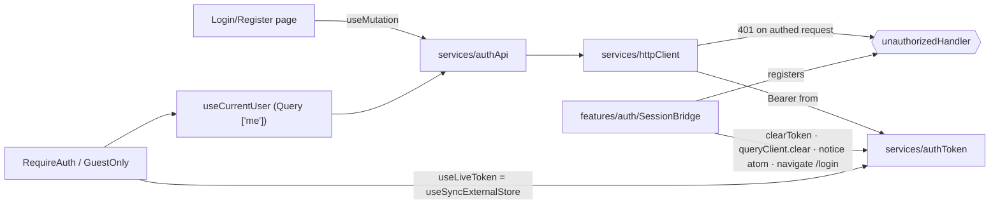
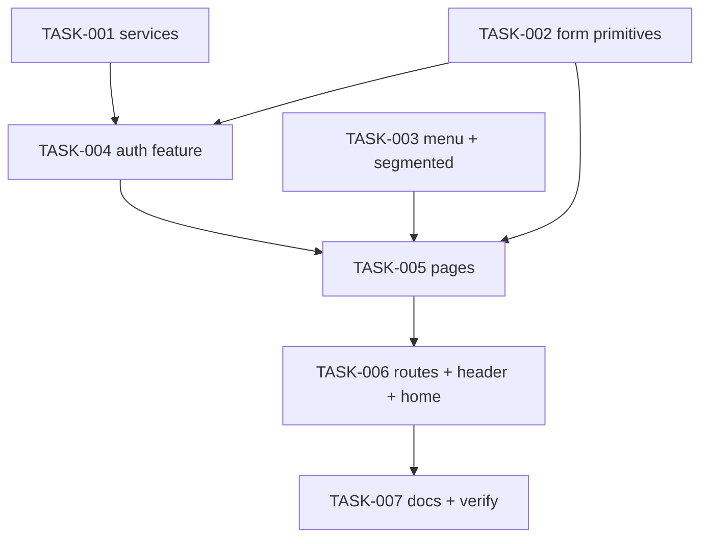

# Login, sign-up and session handling — Architecture

| Field | Value |
|---|---|
| REQ | REQ-002 |
| Status | validated |
| Created | 2026-10-05 |
| Related ADRs | [[architecture/adr-01-ui-layer-headless-css-modules\|ADR-01]], [[architecture/adr-02-server-state-tanstack-query\|ADR-02]] (accepted) · [[architecture/adr-03-frontend-session-and-401-handling\|ADR-03]], [[architecture/adr-04-forms-without-a-library\|ADR-04]] (accepted) |

## Summary

Adds login, student/alumni sign-up, session handling and route guards to `packages/frontend`, on the REQ-001 foundation. Endpoint functions go in `services/authApi.ts`. The token store becomes subscribable and can tell when the token has expired. The shared HTTP client gains a single 401 hook that the app registers, keeping `services/` free of app imports. Session logic (current user, login and register mutations, logout, guards) lives in `features/auth/`. Pages live in `features/auth/` and `features/home/`. The primitive set grows by error-state Input, busy Button, ButtonLink, Alert, Menu (Base UI) and SegmentedControl (Base UI); ThemeToggle is rebuilt on SegmentedControl. No backend changes. `@alumni/shared` gains two response types.

## Blast radius

| Path | Why touched | Risk |
|---|---|---|
| `packages/frontend/src/services/authToken.ts` (+ test) | `subscribe()`, change notifications, cross-tab `storage` event, `isTokenExpired()` (padding, finite exp, 10 s leeway), pure `getLiveToken()` | medium (auth) |
| `packages/frontend/src/services/httpClient.ts` (+ test) | response interceptor + `setUnauthorizedHandler()` | medium (auth) |
| `packages/frontend/src/services/authApi.ts` (+ test) | new: `login`, `register`, `getMe` | low |
| `packages/shared/src/types/user.types.ts` | add `LoginResponse`, `RegisterResponse` (types only) | low (outside frontend) |
| `packages/frontend/src/components/ui/Input/*` | `error` prop: aria-invalid, error text, error border | low |
| `packages/frontend/src/components/ui/Button/*` | `loading` prop; new `ButtonLink` (react-router `Link`, Button styles) | low |
| `packages/frontend/src/components/ui/Alert/*` | new: inline message, tone error/info | low |
| `packages/frontend/src/components/ui/Menu/*` | new: Base UI Menu wrapper | medium (a11y) |
| `packages/frontend/src/components/ui/SegmentedControl/*` | new: Base UI RadioGroup pill, generic options | low |
| `packages/frontend/src/components/ui/ThemeToggle/*` | rebuilt on SegmentedControl; same props and tests | low |
| `packages/frontend/src/styles/contrast.test.ts` | add `error` text pairs | low |
| `packages/frontend/src/store/sessionNoticeAtom.ts` (+ test) | new: one-shot "session expired" notice (not persisted) | low |
| `packages/frontend/src/features/auth/**` | new: queries, mutations, logout, SessionBridge, guards, validation, Login/Register pages | high (core) |
| `packages/frontend/src/features/home/**` | new: signed-in home | low |
| `packages/frontend/src/app/router.tsx`, `app/AppShell/*`, `app/providers.tsx` | routes + guard layouts; header auth area + user menu; SessionBridge mount | medium |
| `packages/frontend/README.md`, `CLAUDE.md` (Frontend section only), `.adlc/context/conventions.md` (Frontend, Forms) | document session/401 pattern and forms rule | low |

Not touched: backend, database, `docs/design/**` (read-only), the ESLint/Stylelint configs (current boundaries already allow everything below).

## Approach

### Data and session flow



**Token store (`services/authToken.ts`)** stays the only home of the token (ADR-02). It adds:
- `subscribe(listener)`, called on `setToken` / `clearToken` and on the browser's `storage` event for key `token`, so another tab's logout is seen.
- `isTokenExpired(token, nowMs)`, which decodes the JWT payload: base64url, with `-`/`_` swapped and padding restored, then JSON. The token counts as **expired** when the payload is malformed, when `exp` is missing or not a finite number, or when `exp * 1000 <= nowMs + 10_000`. The 10-second leeway covers clock skew.
- `getLiveToken()`, a **pure read**. It returns the token if it is present and not expired, otherwise `null`, and has no side effects, so it is safe as a `useSyncExternalStore` snapshot (ADV-002).

**HTTP client (`services/httpClient.ts`)** gains:
- `setUnauthorizedHandler(fn: ((requestToken: string) => void) | null)`.
- One response interceptor. On status **401**, if the request carried a Bearer token and its URL isn't `/auth/login` or `/auth/register`, it calls the handler **with that request's token**, then re-throws. No import of store, features or app.

**SessionBridge (`features/auth/SessionBridge.tsx`)** is a render-nothing component mounted once inside the router (in `AppShell`). It has three responsibilities:
1. **On mount: boot cleanup.** If a stored token is expired, it calls `clearToken()` silently. This is the "expired on load" path; no notice, no render-time side effect (ADV-002).
2. **Registers the 401 handler.** The handler acts **only if `requestToken === getToken()`**, so a late 401 from an older token or after a deliberate logout is ignored. That check replaces any burst guard: after the first 401 the token is cleared, so the rest of a burst no longer matches (ADV-001). When it acts:
   - it calls `clearToken()`;
   - it sets `sessionNoticeAtom` to `'expired'`;
   - it navigates to `/login` with `replace` and `state.from` taken from a location **ref** updated on every render, so it is never stale (ADV-008).
3. **Subscribes to the token store.** Whenever the token *value* changes (null→T, T→null, A→B, including other tabs) it calls `queryClient.clear()`. A previous user's cached profile can never be shown after logout, login or an account switch (ADV-005).

**Current user** is `useCurrentUser()`, `useQuery({ queryKey: ['me'], queryFn: getMe, enabled: !!useLiveToken() })` typed with `MyProfile`, where `useLiveToken = useSyncExternalStore(subscribe, getLiveToken)`. There is no atom copy (ADR-02).

**Mutations: `useLogin()` / `useRegister()`.** On success they only:
1. call `setToken(token)`;
2. clear `sessionNoticeAtom`.

They don't fetch `/me` and don't navigate (ADV-003, ADV-004).
- A `/me` failure after a successful sign-up can't be shown as a form error, and a retry can't turn into "account already exists".
- `GuestOnly` sees the token appear and **owns the post-login navigation**.
- The response's `user` is not trusted as `MyProfile`; `RequireAuth` loads `['me']`.

**Logout: `useLogout()`.**
1. Calls `clearToken()` first, so any in-flight 401 no longer matches and no "expired" notice appears.
2. Navigates to `/login`. The bridge clears the cache through its subscription.

**Session notice.** `LoginPage` shows the notice and clears it on unmount, so it doesn't reappear on a later visit to `/login` (ADV-008). A successful login also clears it.

**Redirect-back** uses only `location.state.from` (in-app state, never a URL parameter). That makes an open redirect through a crafted link impossible. `from` is used only if its pathname starts with `/` and is not `/login` or `/register`.

### Guards and routes

`router.tsx` keeps `createRoutes(pageRoutes)` and the two error layers (L-REQ-001-7). The inner path-less layout gets two child layouts:

```
/ (AppShell, errorElement)            ← SessionBridge + header live here
└─ pathless (errorElement)
   ├─ GuestOnly  → /login (LoginPage), /register (RegisterPage)
   ├─ RequireAuth → index (HomePage)          ← first protected route
   └─ *  → null (unchanged)
```

- **`RequireAuth`** renders `<Outlet/>` when there's a live token and `useCurrentUser` has succeeded.
  - No live token: `<Navigate to="/login" replace state={{ from: location }}/>`.
  - While loading: a quiet "Loading…" line (`role="status"`).
  - Non-401 query error: an `Alert` with **Retry** and **Log out** buttons. A 401 is handled by the bridge (ADV-006).
- **`GuestOnly`** with a live token: `<Navigate to={resolveFrom(location.state) ?? '/'} replace/>`. Otherwise `<Outlet/>`. This makes it the single owner of post-login navigation (ADV-003).

### Forms (ADR-04)

There's no form library. Each form uses:
- Controlled state in the page component.
- A pure `validateLogin(values)` / `validateRegister(values, now)` in `features/auth/validation.ts`. These return `Partial<Record<field, message>>` and mirror backend rules and messages: email pattern, password at least 8 **characters** (`.length`, as the backend checks) and at most 72 **UTF-8 bytes** (ADV-009), name ≤100, university ≤150, department ≤100, expected year this year to this year + 8.
- `useMutation` for submit.

On submit:
1. Validate. If there are errors, show them per field (`Input error`) and focus the first invalid field.
2. Otherwise `mutate`.

Server errors are mapped to the form:
- Login 401 → form-level `Alert`, "Email or password is incorrect". The password field is cleared.
- Register 409 → error on the email field, plus a link to `/login`.
- Any 400 → its `message` in a form-level Alert.
- Network or 5xx → "Couldn't reach the server, try again".

Error mapping lives in `features/auth/authErrors.ts` (pure, tested). The submit button gets `loading`, which disables it and sets `aria-busy`, so it can't be pressed twice.

### Screens

Screens are composed from primitives on tokens only; there are no designs in `docs/design/` (spec assumption, confirmed at the spec gate).
- **Auth layout:** a centered `Card` (`as="section"`), `max-width: min(100%, 26rem)`, with a `heading-lg` title and `space-5` field rhythm. A single primary button, plus a secondary text link ("No account? Sign up" / "Already have an account? Log in").
- **Register:** a `SegmentedControl` labelled "I am a…", with the options Student and Alumni, shown above the fields. Choosing Student reveals Department and "Expected graduation year". The year is an `Input` with `type="number"`, `inputMode="numeric"`, `min` and `max`. Fields hidden by a role switch keep their values but are not validated or sent.
- **Home:** `heading-lg` "Welcome, {name}", a `body` line with the role ("You're signed in as a student"), and an `ink-secondary` line saying more is coming.
- **Header:**
  - Guest: `ButtonLink` ghost "Log in" and `ButtonLink` primary "Sign up".
  - Signed in: `Menu` trigger showing the name, with items for the name and role as a non-interactive label and "Log out". While `['me']` is loading or has failed, the trigger reads "Account" and still offers "Log out" (ADV-006).
  - The theme toggle stays. On narrow widths the auth area wraps under the brand, the same as the toggle.

### New and extended primitives (ADR-01)

- **Input:** `error?: string`. Sets `aria-invalid`; the error text gets an id added to `aria-describedby`, in `--error` (4.69:1 on sunken in light, ≥4.5 in dark; added to the contrast test); the border is `--error`; focus still wins.
- **Button:** `loading?: boolean`. Adds `aria-busy`, disables the button, keeps the label, and adds an `aria-hidden` dot.
- **`ButtonLink`:** the same variants, rendering react-router `Link`. `components/ui` may import react-router; the lint bans only services, store, features, app, axios and Query.
- **Alert:** `tone: 'error' | 'info'`. Error uses `role="alert"` and info uses `role="status"`. A neutral `surface-sunken` box with a 1px border in the tone colour and a tone dot, text in `ink-primary`. Status reads through colour plus the dot, same as Tag.
- **Menu:** wraps Base UI `Menu.Root/Trigger/Portal/Positioner/Popup/Item`. The popup is `surface-raised` with a `border-subtle` hairline, `radius-md`, and **no shadow**. Items have a `:focus-visible` / `[data-highlighted]` style (G05: check the actual data attributes in 1.8 before styling).
- **SegmentedControl:** the generic version of today's ThemeToggle internals: `options`, `value`, `onValueChange`, `label`. The `::after` width reservation and `cx` carry over. ThemeToggle becomes a thin wrapper and its existing tests must pass unchanged.

### Shared types

`@alumni/shared/user.types.ts` adds:
- `export interface LoginResponse { token: string }`
- `export interface RegisterResponse { token: string; user: PublicUser }`

`AuthResponse` stays for compatibility, with a comment pointing at the two new types. `getMe` is typed `MyProfile` (`alumni.types.ts`).

## Task DAG

### Tier 0
- `TASK-001`: Session plumbing in services: token store (subscribe, expiry, live token), 401 handler hook, `authApi`, shared response types.
- `TASK-002`: Form primitives: Input `error`, Button `loading`, `ButtonLink`, `Alert`, contrast pairs.
- `TASK-003`: Menu and SegmentedControl primitives (Base UI); ThemeToggle rebuilt on SegmentedControl.

### Tier 1
- `TASK-004`: Auth feature layer: session notice atom, `useLiveToken`, `useCurrentUser`, login, register and logout hooks, SessionBridge, guards, validation, error mapping. Depends on TASK-001 and TASK-002 (guards use `Alert`).

### Tier 2
- `TASK-005`: Login and Register pages, plus the auth layout. Depends on TASK-002, TASK-003 and TASK-004.

### Tier 3
- `TASK-006`: Router wiring, header auth area and user menu, signed-in Home, SessionBridge mount. Depends on TASK-005.

### Tier 4
- `TASK-007`: Docs and full verification. Depends on TASK-006.



No dependency changes, so no task edits `package.json` or the lockfile. Tier-0 tasks touch disjoint files: TASK-002 owns `contrast.test.ts` and `components/ui/README.md`; TASK-003 doesn't edit them.

## Test strategy

Vitest + RTL + user-event, co-located; axios is mocked at the adapter (as in REQ-001):

| File | Covers |
|---|---|
| `services/authToken.test.ts` | subscribe/notify on set and clear; `storage` event; `isTokenExpired` (valid, expired, within the 10 s leeway, malformed, missing or non-numeric exp, unpadded base64url); `getLiveToken` has no side effects |
| `services/httpClient.test.ts` | handler called with the request's token on a 401 from an authed request; not called for `/auth/login`, `/auth/register` or requests without a token; error still rejected; handler unset → no-op |
| `services/authApi.test.ts` | correct method, URL and body; typed returns |
| `features/auth/validation.test.ts` | every rule and message, both roles; year bounds use the injected `now`; 72-byte password limit with multibyte characters |
| `features/auth/authErrors.test.ts` | 401, 409, 400, network and 5xx mapping |
| `features/auth/session.test.tsx` | `useCurrentUser` disabled without a token; login stores the token, clears the notice and navigates to `from` or `/`; logout clears the token and cache; bridge: 401 with the current token → token cleared, notice set, at `/login`; a stale-token 401 or one after logout → ignored, no notice; two parallel 401s → one navigation; a second expiry later in the same session → handled again; a token change (including a cross-tab `storage` event) → cache cleared; an expired token at boot → cleared silently |
| `features/auth/guards.test.tsx` | guest → `/login` with `from`; returns after login; signed-in → `/login` redirects home; loading and error states |
| `features/auth/LoginPage.test.tsx`, `RegisterPage.test.tsx` | success, 401, 409, network error, field validation and focus, busy and no double submit, role switch shows the student fields |
| `components/ui/{Input,Button,Alert,Menu,SegmentedControl}/*.test.tsx` | new props and roles; Menu keyboard (open with Enter/ArrowDown, Escape closes, focus returns) |
| `components/ui/ThemeToggle/ThemeToggle.test.tsx` | unchanged, must still pass |
| `app/AppShell/AppShell.test.tsx` | guest header links; signed-in user menu; Log out flow |
| `features/home/HomePage.test.tsx` | greets by name and role |
| `styles/contrast.test.ts` | `error` on `surface-sunken`, `surface-raised` and `surface-page`, both themes |

Browser checks (ui-reviewer, or the main session as in REQ-001): login → home → reload → logout; an expired token (edited in DevTools) → notice; 360px and 200% zoom on the three screens; keyboard through the forms and the user menu.

## Convention alignment

- Layers: endpoint functions in `services/`, hooks in `features/`, primitives props-only (ADR-02, lint). `services/` gets the 401 hook by **registration**, not import (L-REQ-001-4).
- CSS Modules on tokens only (L-REQ-001-5); new text pairs go into the contrast test (L-REQ-001-6).
- Route errors stay in two layers, and routes are built by the factory (L-REQ-001-7).
- Base UI focus and names follow G05.
- `components/ui/ButtonLink` imports `react-router`: allowed by the lint, and the only router import in `ui/`.

## Risks

| Risk | Likelihood | Mitigation |
|---|---|---|
| 401 handler loops (the `/api/me` 401 triggers navigation, which re-triggers `/me`) | med | the handler acts only when the request's token equals the current one; the token is cleared before navigating; `useCurrentUser` is disabled without a live token; tested |
| Token in localStorage is readable by injected scripts (XSS) | known | Accepted in ADR-02/03 (backend uses bearer tokens); React escapes output; no `dangerouslySetInnerHTML`; recorded as a follow-up (httpOnly cookie needs backend work) |
| Client validation drifts from backend rules | med | Validators mirror `validation.ts` messages; server 400 messages still shown; unit tests pin the rules |
| Base UI Menu data attributes differ from docs (G05 pattern) | med | TASK-003 reads the 1.8 types before styling |
| Refactoring ThemeToggle breaks REQ-001 behaviour | low | Existing ThemeToggle tests unchanged and required to pass |
| Number input for the year has awkward UX | low | `min`/`max` + validation; revisit with a Select primitive if needed |

## Stress-test results

Full pass (`architecture-adversary.md`): 9 findings survived, 0 critical, 5 major, 4 minor. **All 9 fixed in this design:**
- ADV-001: token-matched 401 handler, no burst guard.
- ADV-002: pure snapshot, boot cleanup in an effect.
- ADV-003: `GuestOnly` owns post-login navigation.
- ADV-004: mutations don't fetch `/me`.
- ADV-005: cache cleared on any token change.
- ADV-006: Log out stays reachable when `/me` fails.
- ADV-007: decoding edge cases specified.
- ADV-008: location ref, notice consumed.
- ADV-009: TASK-004 depends on TASK-002; TASK-006 owns the AppShell test updates; password minimum counts characters.

## Open questions

- None blocking. ADR-03 and ADR-04 are proposed for your decision at the gate.

## Related

- Spec: REQ-002 — resolve per `core/VAULT-LAYOUT.md`
- Exploration: `exploration.md`
- Concepts: [[knowledge/concepts/design-tokens]]
- Components: [[knowledge/components/frontend]]
- Lessons checked: [[knowledge/lessons/LESSON-REQ-001-4]], [[knowledge/lessons/LESSON-REQ-001-5]], [[knowledge/lessons/LESSON-REQ-001-6]], [[knowledge/lessons/LESSON-REQ-001-7]], [[knowledge/lessons/LESSON-REQ-001-9]]; gotchas [[knowledge/gotchas#^g05|G05]], [[knowledge/gotchas#^g07|G07]]
- ADRs: ADR-01, ADR-02 (accepted); ADR-03, ADR-04 (proposed)
