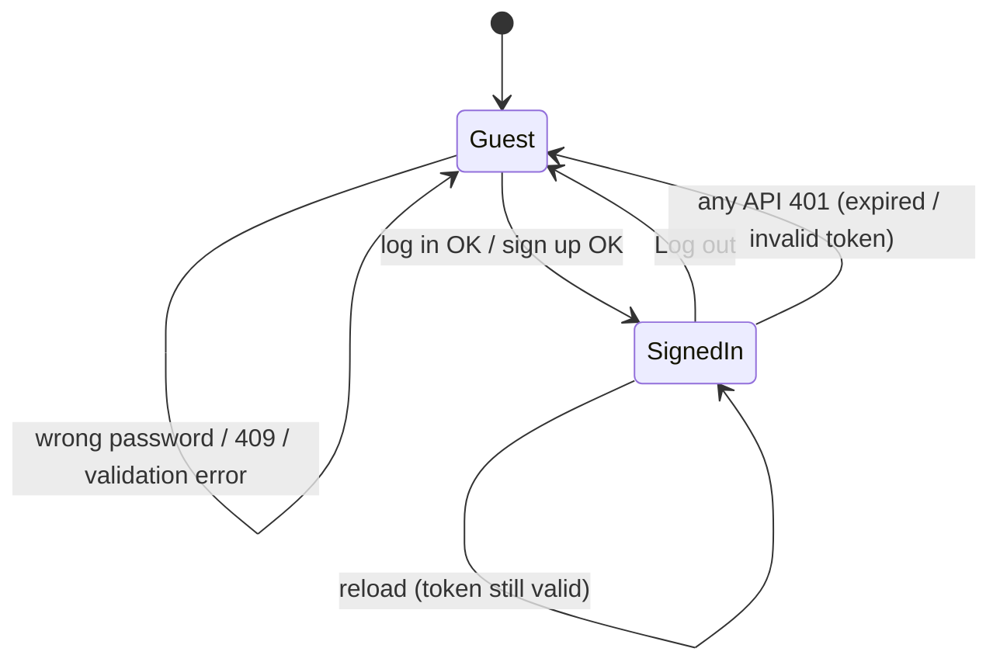

# Login, sign-up and session handling on the new frontend

| Field | Value |
|---|---|
| REQ | REQ-002 |
| Status | validated |
| Phase | spec |
| Created | 2026-10-05 |
| Primary repo | alumni-system |
| Touched repos | alumni-system |
| Related | [[architecture/adr-01-ui-layer-headless-css-modules\|ADR-01]], [[architecture/adr-02-server-state-tanstack-query\|ADR-02]], [[knowledge/lessons/LESSON-REQ-001-7]], [[knowledge/lessons/LESSON-REQ-001-9]], [[knowledge/lessons/LESSON-REQ-001-6]], [[knowledge/gotchas#^g05\|G05]] |

## Problem

After REQ-001 the frontend is an empty shell. Nobody can log in or create an account, so nothing behind authentication can be built or used. Every API route except `/api/auth/*` returns 401 without a token. The backend already supports login and student/alumni sign-up. The old antd screens for both were deleted in REQ-001 and live only in git history.

## Goal

A visitor can create a student or alumni account, or log in, on the new design system. After either, they land on a simple signed-in home that greets them by name. The header shows who is signed in and offers Log out. The session survives a reload, and it ends cleanly when the user logs out or the token expires or is rejected. Signed-in-only screens are protected by a route guard that later page REQs reuse. Guests trying to reach them are sent to login and returned afterwards. Logged-in users who open login or sign-up are sent home.

## Non-goals

- No password reset or "forgot password" flow. The backend has no endpoint for it.
- No backend changes: auth routes, token format, the 1-hour expiry and the `{ token }` login response stay as they are.
- No profile editing, alumni career fields, feed, directory or admin screens.
- No token refresh, "remember me", or move away from bearer tokens in localStorage (ADR-02 keeps the token in `services/authToken.ts`).

## Acceptance criteria

**Log in**
- [ ] `/login` shows email and password fields and a "Log in" button. It links to sign-up.
- [ ] Valid credentials store the token and land the user on the signed-in home, or on the page they originally asked for (see Guards).
- [ ] Wrong credentials (401) show one plain message, "Email or password is incorrect", without saying which one was wrong. The entered email stays; the password field clears.
- [ ] Network or 5xx failure shows a distinct "Couldn't reach the server, try again" message. The form stays usable.
- [ ] While submitting, the button shows a busy state and can't be pressed twice.
- [ ] Empty or badly formed email, and an empty password, are caught before submit with field-level messages.

**Sign up**
- [ ] `/register` lets the user choose Student or Alumni first, then shows only the backend-required fields:
  - Both roles: name, email, password and university.
  - Students also: department and expected graduation year, limited to this year through this year + 8.
- [ ] Client-side checks mirror the backend rules, with field-level messages:
  - Password 8–72 characters.
  - Email shape.
  - Required fields.
  - Length limits: name ≤100, university ≤150, department ≤100.
- [ ] Success (201) stores the returned token and lands the user on the signed-in home.
- [ ] A duplicate email (409) shows "An account with this email already exists" on the email field and links to login.
- [ ] Other 400 messages from the backend show on the form, never as a crash.
- [ ] Busy state and double-submit guard, as for login.

**Session**
- [ ] Reloading any page keeps the user signed in while the token is valid.
- [ ] The current user (name, role) comes from `GET /api/me`, loaded through TanStack Query (ADR-02). No UI component calls the API directly.
- [ ] Log out clears the token and all cached user data, then sends the user to `/login`.
- [ ] Any API response of 401 while signed in has the same effect as Log out, with a one-line notice: "Your session has expired, please log in again". A 401 from the login request itself doesn't trigger it.
- [ ] A token that is already expired on load, with no network call needed, is treated as signed out.

**Guards and navigation**
- [ ] A reusable guard protects signed-in routes. The signed-in home is the first route that uses it.
- [ ] A guest opening a protected route goes to `/login`, and after logging in returns to that route.
- [ ] A signed-in user opening `/login` or `/register` goes to the signed-in home.
- [ ] The header shows "Log in" and "Sign up" links for guests. For signed-in users it shows a user menu with the user's name and a "Log out" item. The menu is keyboard-operable and announced correctly.

**Signed-in home**
- [ ] It greets the user by name, e.g. "Welcome, Amina", and states their role. It has a short line saying more is coming.

**Quality bar (from the redesign conventions and REQ-001)**
- [ ] Built from the design-system primitives and tokens only, in light and dark.
- [ ] Every form field has a visible label. Errors are announced (`aria-live` or `aria-describedby`), and focus moves to the first invalid field on a failed submit.
- [ ] Works from 360px wide; no layout break at 200% zoom.
- [ ] Unit and component tests cover:
  - the success, 401, 409, network-error and validation paths for both forms;
  - the guard redirects;
  - logout and global-401 handling.
  - `typecheck`, `lint`, `format:check`, `test` and `build` pass.

## Flow

## Assumptions

- The backend contract is as read on 2026-10-05:
  - `POST /api/auth/login` returns `{ token }`, or 401 `{ message: "Invalid" }`.
  - `POST /api/auth/register` returns 201 `{ token, user }`, a 400 `{ message }`, or a 409.
  - `GET /api/me` returns the profile, or 401.
  - The JWT payload is `{ sub, role, exp }` with a 1-hour expiry.
- The shared `AuthResponse` type (`token` + `user`) doesn't match the login response, which carries only `token`. The frontend will rely on `/api/me` for the user, not on the login body. `STATUS: needs verification`, decided at /architect whether to add a narrower type to `@alumni/shared`.
- `docs/design/` has no screen designs for login, sign-up or home, only tokens and component specs. Screens are composed from those, following the Scandinavian principles. `STATUS: needs verification`; the user may want to design them in Claude Design first.
- The user menu needs a menu/popover primitive that REQ-001 didn't build. Per ADR-01 it should come from Base UI.
- Choices confirmed by the user at spec time (2026-10-05): required sign-up fields only; land on a simple welcome home.

## Open questions

None blocking. For `/architect`:

- [ ] Where session state lives. Candidates: a Query for `/api/me` plus the token module, with a small atom for the "session expired" notice. This must stay inside the ADR-02 line.
- [ ] How the global 401 is wired: an axios response interceptor that calls a logout handler, without `services/` importing store or features (lint-enforced).
- [ ] Whether to decode the JWT `exp` client-side for the expired-on-load check, or treat the first 401 as the signal.
- [ ] New primitives needed: menu (Base UI), select or segmented control for role, maybe an inline error message or alert. Plus their tokens.
- [ ] Form handling: plain controlled inputs, or a small form library. A new dependency needs approval at the architect gate.

## Out of scope (for now)

- Password reset; email verification; social login; admin account creation.
- Alumni optional career fields at sign-up, which belong in the My Profile REQ.
- Login/logout timestamps (`updateLoginTime`/`updateLogoutTime` endpoints exist, but nothing calls them).
- University suggestions list (`content/universities.ts` was empty in the old app).

## Related

- Concepts: [[knowledge/concepts/design-tokens]]
- Components: [[knowledge/components/frontend]]
- Lessons: [[knowledge/lessons/LESSON-REQ-001-7]] (route error layers and route factory) · [[knowledge/lessons/LESSON-REQ-001-9]] (Jotai storage atoms) · [[knowledge/lessons/LESSON-REQ-001-6]] (contrast sweeps) · [[knowledge/lessons/LESSON-REQ-001-5]] (CSS Modules only) · [[knowledge/lessons/LESSON-REQ-001-4]] (import boundaries)
- Gotchas: [[knowledge/gotchas#^g05|G05]] (Base UI focus and names)
- ADRs: [[architecture/adr-01-ui-layer-headless-css-modules|ADR-01]], [[architecture/adr-02-server-state-tanstack-query|ADR-02]]

## Backlinks

_(populated by /wrapup or manually)_
