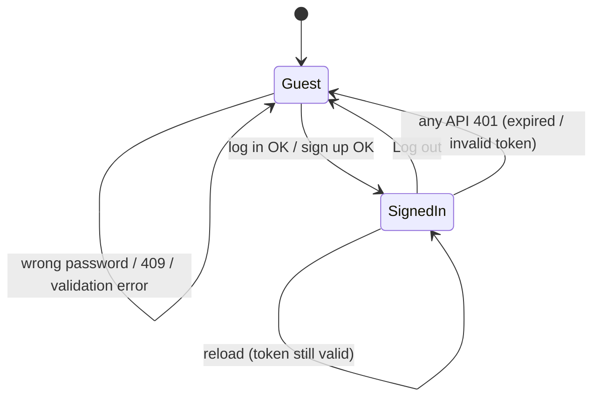
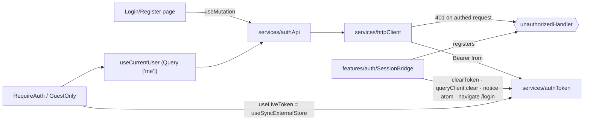
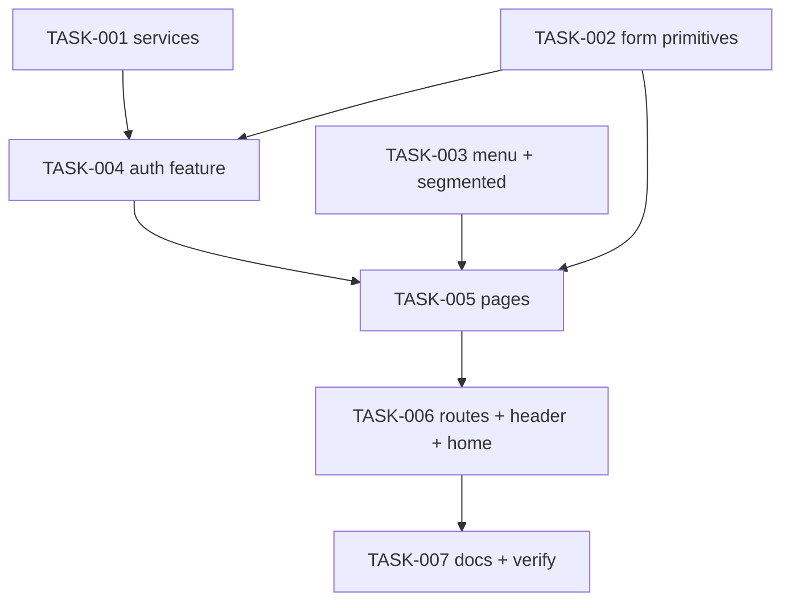

# REQ-002-auth-login-register — Review Packet

`Packet: 129KB · round 2 · 12 files in this round`

This packet contains the diff with full file context, the REQ spec, the REQ architecture, and the exploration report's blast radius and vault references. **Do not re-read these via Read — cite this packet.**

**Your own required reading is not a packet gap.** `context/conventions.md`, the vault (lessons, gotchas, ADRs, concepts), and any source file outside the diff that this change interacts with are your mandate. Read them freely; do not report them.

**`Packet-gap` means the packet's own contents fell short** — the diff, spec, or architecture was missing or insufficient for a call you had to make. Then, and only then, add `**Packet-gap:** <path> — <why the packet didn't cover it>` to your section, whether or not it produced a finding. Kept this narrow the signal is actionable and we act on it; applied to your required reading it fires on every run and tells us nothing.

## Round 2 — what changed since round 1

Round-1 findings and their disposition (full text in review-log.md):

| ID | Orig | Finding | Disposition |
|----|------|---------|-------------|
| m1 | CORR-001 | Blocked storage: login "succeeds" silently | fixed this round — please verify |
| m2 | CORR-002 | Mid-session expiry: no notice, token left | fixed this round — please verify |
| m3 | CORR-003 | Logout may carry state.from | not reproduced — test added; please verify the test |
| m4 | UI-001 | Focus drops to body after failed submit | fixed this round — please verify |
| m5–m9, t1, t2 | various | docs/tidy-ups | deferred by user (not in this round) |
| m10–m12 | ARCH-001, REFL-001/002 | needs-decision | user's call / wrapup |

Files in this round:
- `packages/frontend/src/features/auth/LoginPage.test.tsx`
- `packages/frontend/src/features/auth/LoginPage.tsx`
- `packages/frontend/src/features/auth/RegisterPage.test.tsx`
- `packages/frontend/src/features/auth/RegisterPage.tsx`
- `packages/frontend/src/features/auth/SessionBridge.tsx`
- `packages/frontend/src/features/auth/authErrors.test.ts`
- `packages/frontend/src/features/auth/authErrors.ts`
- `packages/frontend/src/features/auth/session.test.tsx`
- `packages/frontend/src/features/auth/useLogin.ts`
- `packages/frontend/src/features/auth/useRegister.ts`
- `packages/frontend/src/services/authToken.test.ts`
- `packages/frontend/src/services/authToken.ts`

## Diff with full context (round 2: uncommitted fixes vs HEAD 4ce92892)

```diff
diff --git a/packages/frontend/src/features/auth/LoginPage.test.tsx b/packages/frontend/src/features/auth/LoginPage.test.tsx
index 25a86d4d..2265f3fd 100644
--- a/packages/frontend/src/features/auth/LoginPage.test.tsx
+++ b/packages/frontend/src/features/auth/LoginPage.test.tsx
@@ -1,303 +1,335 @@
 import { render, screen, waitFor } from '@testing-library/react';
 import userEvent from '@testing-library/user-event';
 import {
   AxiosError,
   type AxiosAdapter,
   type AxiosResponse,
   type InternalAxiosRequestConfig,
 } from 'axios';
 import { createStore } from 'jotai';
 import { StrictMode } from 'react';
 import { createMemoryRouter, type InitialEntry, type RouteObject } from 'react-router';
 import { RouterProvider } from 'react-router/dom';
-import { afterEach, describe, expect, it } from 'vitest';
+import { afterEach, describe, expect, it, vi } from 'vitest';
 import { AppProviders } from '@/app/providers';
 import { createQueryClient } from '@/app/queryClient';
-import { getToken } from '@/services/authToken';
+import { getToken, TOKEN_STORAGE_KEY } from '@/services/authToken';
 import { httpClient } from '@/services/httpClient';
 import { sessionNoticeAtom } from '@/store/sessionNoticeAtom';
+import { LOGIN_NOT_SAVED_MESSAGE } from './authErrors';
 import { GuestOnly } from './guards';
 import { LoginPage, SESSION_EXPIRED_MESSAGE } from './LoginPage';
 
 // ---- a fake API at the axios adapter (the REQ-001 test policy) ----
 
 function base64url(value: object): string {
   return window
     .btoa(JSON.stringify(value))
     .replace(/=+$/, '')
     .replace(/\+/g, '-')
     .replace(/\//g, '_');
 }
 
 /** A JWT-shaped token valid for an hour, so GuestOnly sees a live session. */
 function makeToken(): string {
   const exp = Math.floor(Date.now() / 1000) + 3600;
   return `${base64url({ alg: 'HS256' })}.${base64url({ sub: 1, exp })}.sig`;
 }
 
 type Responder = (config: InternalAxiosRequestConfig) => Promise<AxiosResponse>;
 
 const ok: Responder = (config) =>
   Promise.resolve({
     data: { token: makeToken() },
     status: 200,
     statusText: 'OK',
     headers: {},
     config,
   });
 
 function fail(status: number, message = 'Invalid'): Responder {
   return (config) =>
     Promise.reject(
       new AxiosError('Request failed', AxiosError.ERR_BAD_REQUEST, config, null, {
         data: { message },
         status,
         statusText: String(status),
         headers: {},
         config,
       }),
     );
 }
 
 const networkDown: Responder = (config) =>
   Promise.reject(new AxiosError('Network Error', AxiosError.ERR_NETWORK, config));
 
 const originalAdapter = httpClient.defaults.adapter;
 const loginBodies: unknown[] = [];
 
 function mockLogin(respond: Responder): void {
   const adapter: AxiosAdapter = (config) => {
     if (config.method !== 'post' || config.url !== '/auth/login') {
       return Promise.reject(new Error(`Unmocked: ${config.method ?? ''} ${config.url ?? ''}`));
     }
     loginBodies.push(JSON.parse(String(config.data)));
     return respond(config);
   };
   httpClient.defaults.adapter = adapter;
 }
 
 afterEach(() => {
   httpClient.defaults.adapter = originalAdapter;
   loginBodies.length = 0;
 });
 
+/** Makes the browser refuse to store the token, as with blocked site storage. */
+function blockTokenStorage(): void {
+  const realSetItem = Storage.prototype.setItem.bind(window.localStorage);
+  vi.spyOn(Storage.prototype, 'setItem').mockImplementation((key: string, value: string) => {
+    if (key === TOKEN_STORAGE_KEY) throw new DOMException('denied', 'SecurityError');
+    realSetItem(key, value);
+  });
+}
+
 // ---- the page behind the real GuestOnly guard ----
 
 const routes: RouteObject[] = [
   {
     path: '/',
     children: [
       {
         element: <GuestOnly />,
         children: [
           { path: 'login', element: <LoginPage /> },
           { path: 'register', element: <h1>Register page</h1> },
         ],
       },
       { index: true, element: <h1>Home page</h1> },
       { path: 'posts', element: <h1>Posts page</h1> },
     ],
   },
 ];
 
 function renderLogin(entry: InitialEntry = '/login', { strict = false, notice = false } = {}) {
   const store = createStore();
   if (notice) store.set(sessionNoticeAtom, 'expired');
   const router = createMemoryRouter(routes, { initialEntries: [entry] });
   const tree = (
     <AppProviders queryClient={createQueryClient()} store={store}>
       <RouterProvider router={router} />
     </AppProviders>
   );
   render(strict ? <StrictMode>{tree}</StrictMode> : tree);
   return { router, store, user: userEvent.setup() };
 }
 
 function emailField() {
   return screen.getByLabelText('Email');
 }
 
 function passwordField() {
   return screen.getByLabelText('Password');
 }
 
 function submitButton() {
   return screen.getByRole('button', { name: 'Log in' });
 }
 
 describe('LoginPage', () => {
   it('shows labeled email and password fields, one Log in button and a sign-up link', () => {
     renderLogin();
 
     expect(screen.getByRole('region', { name: 'Log in' })).toBeInTheDocument();
     expect(emailField()).toHaveAttribute('type', 'email');
     expect(emailField()).toHaveAttribute('autocomplete', 'email');
     expect(passwordField()).toHaveAttribute('type', 'password');
     expect(passwordField()).toHaveAttribute('autocomplete', 'current-password');
     expect(screen.getAllByRole('button')).toHaveLength(1);
     expect(submitButton()).toHaveAttribute('type', 'submit');
     expect(screen.getByRole('link', { name: 'Sign up' })).toHaveAttribute('href', '/register');
   });
 
   it('stores the token on success and GuestOnly sends the user home', async () => {
     mockLogin(ok);
     const { router, user } = renderLogin();
 
     await user.type(emailField(), '  amina@example.com ');
     await user.type(passwordField(), 'correct horse');
     await user.click(submitButton());
 
     expect(await screen.findByRole('heading', { name: 'Home page' })).toBeInTheDocument();
     expect(router.state.location.pathname).toBe('/');
     expect(getToken()).not.toBeNull();
     expect(loginBodies).toEqual([{ email: 'amina@example.com', password: 'correct horse' }]);
   });
 
   it('returns the user to the page they first asked for', async () => {
     mockLogin(ok);
     const { router, user } = renderLogin({
       pathname: '/login',
       state: { from: { pathname: '/posts', search: '?page=2' } },
     });
 
     await user.type(emailField(), 'amina@example.com');
     await user.type(passwordField(), 'correct horse');
     await user.click(submitButton());
 
     expect(await screen.findByRole('heading', { name: 'Posts page' })).toBeInTheDocument();
     expect(router.state.location.pathname + router.state.location.search).toBe('/posts?page=2');
   });
 
   it('on 401 shows one message, keeps the email and clears the password', async () => {
     mockLogin(fail(401));
     const { user } = renderLogin();
 
     await user.type(emailField(), 'amina@example.com');
     await user.type(passwordField(), 'wrong password');
     await user.click(submitButton());
 
     expect(await screen.findByRole('alert')).toHaveTextContent('Email or password is incorrect');
     expect(emailField()).toHaveValue('amina@example.com');
     expect(passwordField()).toHaveValue('');
     expect(getToken()).toBeNull();
+    // Focus goes to the cleared password, not to the page (UI-001).
+    expect(passwordField()).toHaveFocus();
   });
 
   it.each([
     ['a network failure', networkDown],
     ['a 5xx', fail(503, 'Service Unavailable')],
   ])('on %s says the server could not be reached and stays usable', async (_label, respond) => {
     mockLogin(respond);
     const { user } = renderLogin();
 
     await user.type(emailField(), 'amina@example.com');
     await user.type(passwordField(), 'correct horse');
     await user.click(submitButton());
 
-    expect(await screen.findByRole('alert')).toHaveTextContent(
-      "Couldn't reach the server, try again",
-    );
+    const alert = await screen.findByRole('alert');
+    expect(alert).toHaveTextContent("Couldn't reach the server, try again");
+    expect(alert).toHaveFocus();
     expect(passwordField()).toHaveValue('correct horse');
     expect(submitButton()).toBeEnabled();
 
     // Trying again works once the server is back.
     mockLogin(ok);
     await user.click(submitButton());
     expect(await screen.findByRole('heading', { name: 'Home page' })).toBeInTheDocument();
   });
 
+  it('says so when the browser will not store the sign-in, and stays on the form', async () => {
+    mockLogin(ok);
+    blockTokenStorage();
+    const { router, user } = renderLogin();
+
+    await user.type(emailField(), 'amina@example.com');
+    await user.type(passwordField(), 'correct horse');
+    await user.click(submitButton());
+
+    const alert = await screen.findByRole('alert');
+    expect(alert).toHaveTextContent(LOGIN_NOT_SAVED_MESSAGE);
+    expect(alert).toHaveFocus();
+    expect(router.state.location.pathname).toBe('/login');
+    expect(getToken()).toBeNull();
+    expect(passwordField()).toHaveValue('correct horse');
+    expect(submitButton()).toBeEnabled();
+  });
+
   it('shows a 400 message from the server on the form', async () => {
     mockLogin(fail(400, 'Email is not valid'));
     const { user } = renderLogin();
 
     await user.type(emailField(), 'amina@example.com');
     await user.type(passwordField(), 'pw');
     await user.click(submitButton());
 
-    expect(await screen.findByRole('alert')).toHaveTextContent('Email is not valid');
+    const alert = await screen.findByRole('alert');
+    expect(alert).toHaveTextContent('Email is not valid');
+    expect(alert).toHaveFocus();
   });
 
   it('catches an empty form before submit and focuses the first invalid field', async () => {
     mockLogin(ok);
     const { user } = renderLogin();
 
     await user.click(submitButton());
 
     expect(emailField()).toHaveAccessibleDescription('Email is required');
     expect(emailField()).toHaveAttribute('aria-invalid', 'true');
     expect(passwordField()).toHaveAccessibleDescription('Password is required');
     expect(emailField()).toHaveFocus();
     expect(loginBodies).toHaveLength(0);
   });
 
   it('flags a badly formed email, and focuses the password when only it is missing', async () => {
     mockLogin(ok);
     const { user } = renderLogin();
 
     await user.type(emailField(), 'not-an-email');
     await user.type(passwordField(), 'pw');
     await user.click(submitButton());
     expect(emailField()).toHaveAccessibleDescription('Email is not valid');
     expect(emailField()).toHaveFocus();
 
     await user.clear(emailField());
     await user.type(emailField(), 'amina@example.com');
     // Typing clears that field's message.
     expect(emailField()).not.toHaveAttribute('aria-invalid');
     await user.clear(passwordField());
     await user.click(submitButton());
     expect(passwordField()).toHaveAccessibleDescription('Password is required');
     expect(passwordField()).toHaveFocus();
     expect(loginBodies).toHaveLength(0);
   });
 
   it('shows a busy button while submitting and sends only one request', async () => {
     let release!: () => void;
     mockLogin(
       (config) =>
         new Promise((resolve) => {
           release = () => {
             void ok(config).then(resolve);
           };
         }),
     );
     const { user } = renderLogin();
 
     await user.type(emailField(), 'amina@example.com');
     await user.type(passwordField(), 'correct horse');
     await user.click(submitButton());
 
     await waitFor(() => {
       expect(submitButton()).toHaveAttribute('aria-busy', 'true');
     });
     expect(submitButton()).toBeDisabled();
     await user.click(submitButton());
     await user.type(passwordField(), '{Enter}');
     expect(loginBodies).toHaveLength(1);
 
     release();
     expect(await screen.findByRole('heading', { name: 'Home page' })).toBeInTheDocument();
     expect(loginBodies).toHaveLength(1);
   });
 
   it.each([false, true])(
     'shows the session-expired notice once, then not on a return (StrictMode: %s)',
     async (strict) => {
       const { router, store, user } = renderLogin('/login', { strict, notice: true });
 
       expect(screen.getByRole('status')).toHaveTextContent(SESSION_EXPIRED_MESSAGE);
 
       await user.click(screen.getByRole('link', { name: 'Sign up' }));
       expect(await screen.findByRole('heading', { name: 'Register page' })).toBeInTheDocument();
       expect(store.get(sessionNoticeAtom)).toBeNull();
 
       await router.navigate('/login');
       expect(await screen.findByRole('region', { name: 'Log in' })).toBeInTheDocument();
       expect(screen.queryByRole('status')).not.toBeInTheDocument();
     },
   );
 
   it('shows no notice when none is set', () => {
     renderLogin('/login', { strict: true });
     expect(screen.queryByRole('status')).not.toBeInTheDocument();
   });
 });
diff --git a/packages/frontend/src/features/auth/LoginPage.tsx b/packages/frontend/src/features/auth/LoginPage.tsx
index bbd7ac0d..8d0482dd 100644
--- a/packages/frontend/src/features/auth/LoginPage.tsx
+++ b/packages/frontend/src/features/auth/LoginPage.tsx
@@ -1,125 +1,135 @@
 import { useAtomValue, useSetAtom } from 'jotai';
 import { useEffect, useRef, useState, type ChangeEvent, type SubmitEvent } from 'react';
 import { flushSync } from 'react-dom';
 import { Alert } from '@/components/ui/Alert';
 import { Button } from '@/components/ui/Button';
 import { Input } from '@/components/ui/Input';
 import { sessionNoticeAtom } from '@/store/sessionNoticeAtom';
 import { INVALID_CREDENTIALS_MESSAGE, mapLoginError, UNEXPECTED_MESSAGE } from './authErrors';
 import { AuthLayout } from './AuthLayout';
 import { useLogin } from './useLogin';
 import { validateLogin, type LoginErrors, type LoginValues } from './validation';
 import styles from './LoginPage.module.css';
 
 export const SESSION_EXPIRED_MESSAGE = 'Your session has expired, please log in again';
 
 type LoginField = keyof LoginValues;
 const FIELD_ORDER: readonly LoginField[] = ['email', 'password'];
 
 /**
  * /login. Validates on submit (field messages, focus on the first invalid
  * field), then logs in. It never navigates: GuestOnly redirects once the
  * token is stored (ADV-003).
  */
 export function LoginPage() {
   const login = useLogin();
   const liveNotice = useAtomValue(sessionNoticeAtom);
   const setNotice = useSetAtom(sessionNoticeAtom);
   // Keep the notice that brought the user here: StrictMode's trial unmount
   // runs the cleanup below once, which clears the atom right after mount.
   const [noticeAtMount] = useState(liveNotice);
   const notice = liveNotice ?? noticeAtMount;
 
   // Consume the notice so it doesn't show again on a later visit (ADV-008).
   useEffect(
     () => () => {
       setNotice(null);
     },
     [setNotice],
   );
 
   const [values, setValues] = useState<LoginValues>({ email: '', password: '' });
   const [errors, setErrors] = useState<LoginErrors>({});
   const [formError, setFormError] = useState<string | null>(null);
   const emailRef = useRef<HTMLInputElement>(null);
   const passwordRef = useRef<HTMLInputElement>(null);
+  const formErrorRef = useRef<HTMLDivElement>(null);
 
   function focusField(field: LoginField) {
     (field === 'email' ? emailRef : passwordRef).current?.focus();
   }
 
   function handleChange(field: LoginField) {
     return (event: ChangeEvent<HTMLInputElement>) => {
       const { value } = event.target;
       setValues((prev) => ({ ...prev, [field]: value }));
       setErrors((prev) => ({ ...prev, [field]: undefined }));
     };
   }
 
   function handleSubmit(event: SubmitEvent<HTMLFormElement>) {
     event.preventDefault();
     if (login.isPending) return;
 
     const nextErrors = validateLogin(values);
     const firstInvalid = FIELD_ORDER.find((field) => nextErrors[field] !== undefined);
     // Render the messages before moving focus, so the field is announced
     // together with its error.
     flushSync(() => {
       setErrors(nextErrors);
       setFormError(null);
     });
     if (firstInvalid) {
       focusField(firstInvalid);
       return;
     }
 
     login.mutate(
       { email: values.email.trim(), password: values.password },
       {
         onError: (error) => {
           const message = mapLoginError(error).form ?? UNEXPECTED_MESSAGE;
-          setFormError(message);
-          // Wrong credentials: keep the email, clear the password.
-          if (message === INVALID_CREDENTIALS_MESSAGE) {
-            setValues((prev) => ({ ...prev, password: '' }));
-          }
+          const wrongCredentials = message === INVALID_CREDENTIALS_MESSAGE;
+          flushSync(() => {
+            setFormError(message);
+            // Wrong credentials: keep the email, clear the password.
+            if (wrongCredentials) setValues((prev) => ({ ...prev, password: '' }));
+          });
+          // The busy button was disabled, which dropped focus to the page;
+          // put it where the user acts next (UI-001).
+          if (wrongCredentials) focusField('password');
+          else formErrorRef.current?.focus();
         },
       },
     );
   }
 
   return (
     <AuthLayout
       title="Log in"
       footer={{ prompt: 'No account?', linkLabel: 'Sign up', to: '/register' }}
     >
       {notice === 'expired' && <Alert tone="info">{SESSION_EXPIRED_MESSAGE}</Alert>}
       <form noValidate className={styles.form} onSubmit={handleSubmit}>
-        {formError !== null && <Alert tone="error">{formError}</Alert>}
+        {formError !== null && (
+          <Alert ref={formErrorRef} tabIndex={-1} tone="error">
+            {formError}
+          </Alert>
+        )}
         <Input
           ref={emailRef}
           label="Email"
           name="email"
           type="email"
           autoComplete="email"
           value={values.email}
           error={errors.email}
           onChange={handleChange('email')}
         />
         <Input
           ref={passwordRef}
           label="Password"
           name="password"
           type="password"
           autoComplete="current-password"
           value={values.password}
           error={errors.password}
           onChange={handleChange('password')}
         />
         <Button type="submit" variant="primary" loading={login.isPending} className={styles.submit}>
           Log in
         </Button>
       </form>
     </AuthLayout>
   );
 }
diff --git a/packages/frontend/src/features/auth/RegisterPage.test.tsx b/packages/frontend/src/features/auth/RegisterPage.test.tsx
index 2966bdf5..7b4a1712 100644
--- a/packages/frontend/src/features/auth/RegisterPage.test.tsx
+++ b/packages/frontend/src/features/auth/RegisterPage.test.tsx
@@ -1,384 +1,413 @@
 import { render, screen, waitFor } from '@testing-library/react';
 import userEvent from '@testing-library/user-event';
 import {
   AxiosError,
   type AxiosAdapter,
   type AxiosResponse,
   type InternalAxiosRequestConfig,
 } from 'axios';
 import { createStore } from 'jotai';
 import { createMemoryRouter, type InitialEntry, type RouteObject } from 'react-router';
 import { RouterProvider } from 'react-router/dom';
-import { afterEach, describe, expect, it } from 'vitest';
+import { afterEach, describe, expect, it, vi } from 'vitest';
 import { AppProviders } from '@/app/providers';
 import { createQueryClient } from '@/app/queryClient';
-import { getToken } from '@/services/authToken';
+import { getToken, TOKEN_STORAGE_KEY } from '@/services/authToken';
 import { httpClient } from '@/services/httpClient';
+import { REGISTER_NOT_SAVED_MESSAGE } from './authErrors';
 import { GuestOnly } from './guards';
 import { RegisterPage, ROLE_LABEL } from './RegisterPage';
 
 // ---- a fake API at the axios adapter (the REQ-001 test policy) ----
 
 function base64url(value: object): string {
   return window
     .btoa(JSON.stringify(value))
     .replace(/=+$/, '')
     .replace(/\+/g, '-')
     .replace(/\//g, '_');
 }
 
 /** A JWT-shaped token valid for an hour, so GuestOnly sees a live session. */
 function makeToken(): string {
   const exp = Math.floor(Date.now() / 1000) + 3600;
   return `${base64url({ alg: 'HS256' })}.${base64url({ sub: 1, exp })}.sig`;
 }
 
 type Responder = (config: InternalAxiosRequestConfig) => Promise<AxiosResponse>;
 
 const created: Responder = (config) =>
   Promise.resolve({
     data: { token: makeToken(), user: { id: 1, name: 'Amina', email: 'a@b.co', role: 'student' } },
     status: 201,
     statusText: 'Created',
     headers: {},
     config,
   });
 
 function fail(status: number, message: string): Responder {
   return (config) =>
     Promise.reject(
       new AxiosError('Request failed', AxiosError.ERR_BAD_REQUEST, config, null, {
         data: { message },
         status,
         statusText: String(status),
         headers: {},
         config,
       }),
     );
 }
 
 const networkDown: Responder = (config) =>
   Promise.reject(new AxiosError('Network Error', AxiosError.ERR_NETWORK, config));
 
 const originalAdapter = httpClient.defaults.adapter;
 const registerBodies: unknown[] = [];
 
 function mockRegister(respond: Responder): void {
   const adapter: AxiosAdapter = (config) => {
     if (config.method !== 'post' || config.url !== '/auth/register') {
       return Promise.reject(new Error(`Unmocked: ${config.method ?? ''} ${config.url ?? ''}`));
     }
     registerBodies.push(JSON.parse(String(config.data)));
     return respond(config);
   };
   httpClient.defaults.adapter = adapter;
 }
 
 afterEach(() => {
   httpClient.defaults.adapter = originalAdapter;
   registerBodies.length = 0;
 });
 
+/** Makes the browser refuse to store the token, as with blocked site storage. */
+function blockTokenStorage(): void {
+  const realSetItem = Storage.prototype.setItem.bind(window.localStorage);
+  vi.spyOn(Storage.prototype, 'setItem').mockImplementation((key: string, value: string) => {
+    if (key === TOKEN_STORAGE_KEY) throw new DOMException('denied', 'SecurityError');
+    realSetItem(key, value);
+  });
+}
+
 // ---- the page behind the real GuestOnly guard ----
 
 const routes: RouteObject[] = [
   {
     path: '/',
     children: [
       {
         element: <GuestOnly />,
         children: [
           { path: 'login', element: <h1>Login page</h1> },
           { path: 'register', element: <RegisterPage /> },
         ],
       },
       { index: true, element: <h1>Home page</h1> },
       { path: 'posts', element: <h1>Posts page</h1> },
     ],
   },
 ];
 
 function renderRegister(entry: InitialEntry = '/register') {
   const router = createMemoryRouter(routes, { initialEntries: [entry] });
   render(
     <AppProviders queryClient={createQueryClient()} store={createStore()}>
       <RouterProvider router={router} />
     </AppProviders>,
   );
   return { router, user: userEvent.setup() };
 }
 
 const thisYear = new Date().getFullYear();
 
 const field = (label: string) => screen.getByLabelText(label);
 const queryField = (label: string) => screen.queryByLabelText(label);
 const submitButton = () => screen.getByRole('button', { name: 'Sign up' });
 
 type User = ReturnType<typeof userEvent.setup>;
 
 async function fillCommon(user: User): Promise<void> {
   await user.type(field('Name'), ' Amina ');
   await user.type(field('Email'), 'amina@example.com');
   await user.type(field('Password'), 'correct horse');
   await user.type(field('University'), 'Dhaka University');
 }
 
 async function fillStudent(user: User): Promise<void> {
   await fillCommon(user);
   await user.type(field('Department'), 'CSE');
   await user.type(field('Expected graduation year'), String(thisYear + 2));
 }
 
 describe('RegisterPage', () => {
   it('asks for the role first (Student by default) and shows the student fields', () => {
     renderRegister();
 
     expect(screen.getByRole('region', { name: 'Sign up' })).toBeInTheDocument();
     const group = screen.getByRole('radiogroup', { name: ROLE_LABEL });
     expect(group).toBeInTheDocument();
     expect(screen.getByRole('radio', { name: 'Student' })).toBeChecked();
     expect(screen.getByRole('radio', { name: 'Alumni' })).not.toBeChecked();
     // The role choice comes before the first text field.
     expect(group.compareDocumentPosition(field('Name'))).toBe(Node.DOCUMENT_POSITION_FOLLOWING);
 
     expect(field('Name')).toHaveAttribute('autocomplete', 'name');
     expect(field('Email')).toHaveAttribute('type', 'email');
     expect(field('Password')).toHaveAttribute('autocomplete', 'new-password');
     expect(field('Password')).toHaveAccessibleDescription('At least 8 characters');
     expect(field('University')).toBeInTheDocument();
     expect(field('Department')).toBeInTheDocument();
     const year = field('Expected graduation year');
     expect(year).toHaveAttribute('type', 'number');
     expect(year).toHaveAttribute('inputmode', 'numeric');
     expect(year).toHaveAttribute('min', String(thisYear));
     expect(year).toHaveAttribute('max', String(thisYear + 8));
 
     expect(screen.getAllByRole('button')).toHaveLength(1);
     expect(screen.getByRole('link', { name: 'Log in' })).toHaveAttribute('href', '/login');
   });
 
   it('hides the student fields for Alumni and keeps their values for a switch back', async () => {
     const { user } = renderRegister();
 
     await user.type(field('Department'), 'CSE');
     await user.click(screen.getByRole('radio', { name: 'Alumni' }));
     expect(queryField('Department')).not.toBeInTheDocument();
     expect(queryField('Expected graduation year')).not.toBeInTheDocument();
 
     await user.click(screen.getByRole('radio', { name: 'Student' }));
     expect(field('Department')).toHaveValue('CSE');
   });
 
   it('signs up a student: sends the student fields, stores the token, lands home', async () => {
     mockRegister(created);
     const { router, user } = renderRegister();
 
     await fillStudent(user);
     await user.click(submitButton());
 
     expect(await screen.findByRole('heading', { name: 'Home page' })).toBeInTheDocument();
     expect(router.state.location.pathname).toBe('/');
     expect(getToken()).not.toBeNull();
     expect(registerBodies).toEqual([
       {
         role: 'student',
         name: 'Amina',
         email: 'amina@example.com',
         password: 'correct horse',
         university: 'Dhaka University',
         department: 'CSE',
         expected_graduation_year: String(thisYear + 2),
       },
     ]);
   });
 
   it('signs up an alumnus without the hidden student fields, even if they were filled', async () => {
     mockRegister(created);
     const { user } = renderRegister();
 
     await fillStudent(user);
     await user.click(screen.getByRole('radio', { name: 'Alumni' }));
     await user.click(submitButton());
 
     expect(await screen.findByRole('heading', { name: 'Home page' })).toBeInTheDocument();
     expect(registerBodies).toEqual([
       {
         role: 'alumni',
         name: 'Amina',
         email: 'amina@example.com',
         password: 'correct horse',
         university: 'Dhaka University',
       },
     ]);
   });
 
   it('returns the user to a safe `from` after sign-up', async () => {
     mockRegister(created);
     const { router, user } = renderRegister({
       pathname: '/register',
       state: { from: { pathname: '/posts' } },
     });
 
     await fillStudent(user);
     await user.click(submitButton());
 
     expect(await screen.findByRole('heading', { name: 'Posts page' })).toBeInTheDocument();
     expect(router.state.location.pathname).toBe('/posts');
   });
 
   it('catches an empty form before submit and focuses the first invalid field', async () => {
     mockRegister(created);
     const { user } = renderRegister();
 
     await user.click(submitButton());
 
     expect(field('Name')).toHaveAccessibleDescription('Name is required');
     expect(field('Email')).toHaveAccessibleDescription('Email is required');
     expect(field('Password')).toHaveAccessibleDescription(
       'Password must be at least 8 characters At least 8 characters',
     );
     expect(field('University')).toHaveAccessibleDescription('University is required');
     expect(field('Department')).toHaveAccessibleDescription('Department is required');
     expect(field('Expected graduation year')).toHaveAccessibleDescription(
       'Expected graduation year is required',
     );
     expect(field('Name')).toHaveFocus();
     expect(registerBodies).toHaveLength(0);
   });
 
   it('focuses the first invalid field further down the form', async () => {
     mockRegister(created);
     const { user } = renderRegister();
 
     await fillCommon(user);
     await user.type(field('Department'), 'CSE');
     await user.type(field('Expected graduation year'), String(thisYear + 9));
     await user.click(submitButton());
 
     const year = field('Expected graduation year');
     expect(year).toHaveAccessibleDescription(
       `Expected graduation year must be between ${String(thisYear)} and ${String(thisYear + 8)}`,
     );
     expect(year).toHaveFocus();
     expect(registerBodies).toHaveLength(0);
   });
 
   it('checks email shape and the length limits', async () => {
     mockRegister(created);
     const { user } = renderRegister();
 
     await user.click(screen.getByRole('radio', { name: 'Alumni' }));
     await user.type(field('Name'), 'Amina');
     await user.type(field('Email'), 'amina@');
     await user.type(field('Password'), 'short');
     await user.click(field('University'));
     await user.paste('u'.repeat(151));
     await user.click(submitButton());
 
     expect(field('Email')).toHaveAccessibleDescription('Email is not valid');
     expect(field('Password')).toHaveAccessibleDescription(
       'Password must be at least 8 characters At least 8 characters',
     );
     expect(field('University')).toHaveAccessibleDescription(
       'University must be at most 150 characters',
     );
     expect(field('Email')).toHaveFocus();
     expect(registerBodies).toHaveLength(0);
   });
 
   it('does not validate the hidden student fields for Alumni', async () => {
     mockRegister(created);
     const { user } = renderRegister();
 
     await user.click(submitButton());
     expect(field('Department')).toHaveAttribute('aria-invalid', 'true');
 
     await user.click(screen.getByRole('radio', { name: 'Alumni' }));
     await fillCommon(user);
     await user.click(submitButton());
 
     expect(await screen.findByRole('heading', { name: 'Home page' })).toBeInTheDocument();
     expect(registerBodies).toHaveLength(1);
   });
 
   it('on 409 puts the message on the email field with a link to log in', async () => {
     mockRegister(fail(409, 'Conflict'));
     const { user } = renderRegister();
 
     await fillStudent(user);
     await user.click(submitButton());
 
     const email = field('Email');
     await waitFor(() => {
       expect(email).toHaveAttribute('aria-invalid', 'true');
     });
     expect(email).toHaveAccessibleDescription(
       'An account with this email already exists Log in instead',
     );
     expect(email).toHaveFocus();
     expect(screen.getByRole('link', { name: 'Log in instead' })).toHaveAttribute('href', '/login');
     expect(screen.queryByRole('alert')).not.toBeInTheDocument();
     expect(getToken()).toBeNull();
 
     // Editing the email clears the message and the link.
     await user.type(email, 'x');
     expect(email).not.toHaveAttribute('aria-invalid');
     expect(screen.queryByRole('link', { name: 'Log in instead' })).not.toBeInTheDocument();
   });
 
+  it('says the account exists but the sign-in was not saved when storage is blocked', async () => {
+    mockRegister(created);
+    blockTokenStorage();
+    const { router, user } = renderRegister();
+
+    await fillStudent(user);
+    await user.click(submitButton());
+
+    const alert = await screen.findByRole('alert');
+    expect(alert).toHaveTextContent(REGISTER_NOT_SAVED_MESSAGE);
+    expect(alert).toHaveFocus();
+    expect(router.state.location.pathname).toBe('/register');
+    expect(getToken()).toBeNull();
+    expect(submitButton()).toBeEnabled();
+  });
+
   it('shows a 400 message from the server on the form', async () => {
     mockRegister(fail(400, 'University is required'));
     const { user } = renderRegister();
 
     await fillStudent(user);
     await user.click(submitButton());
 
-    expect(await screen.findByRole('alert')).toHaveTextContent('University is required');
+    const alert = await screen.findByRole('alert');
+    expect(alert).toHaveTextContent('University is required');
+    // Focus goes to the message, not to the page (UI-001).
+    expect(alert).toHaveFocus();
     expect(submitButton()).toBeEnabled();
   });
 
   it.each([
     ['a network failure', networkDown],
     ['a 5xx', fail(500, 'Internal Server Error')],
   ])('on %s says the server could not be reached and stays usable', async (_label, respond) => {
     mockRegister(respond);
     const { user } = renderRegister();
 
     await fillStudent(user);
     await user.click(submitButton());
 
-    expect(await screen.findByRole('alert')).toHaveTextContent(
-      "Couldn't reach the server, try again",
-    );
+    const alert = await screen.findByRole('alert');
+    expect(alert).toHaveTextContent("Couldn't reach the server, try again");
+    expect(alert).toHaveFocus();
     expect(field('Password')).toHaveValue('correct horse');
     expect(submitButton()).toBeEnabled();
   });
 
   it('shows a busy button while submitting and sends only one request', async () => {
     let release!: () => void;
     mockRegister(
       (config) =>
         new Promise((resolve) => {
           release = () => {
             void created(config).then(resolve);
           };
         }),
     );
     const { user } = renderRegister();
 
     await fillStudent(user);
     await user.click(submitButton());
 
     await waitFor(() => {
       expect(submitButton()).toHaveAttribute('aria-busy', 'true');
     });
     expect(submitButton()).toBeDisabled();
     await user.click(submitButton());
     await user.type(field('University'), '{Enter}');
     expect(registerBodies).toHaveLength(1);
 
     release();
     expect(await screen.findByRole('heading', { name: 'Home page' })).toBeInTheDocument();
     expect(registerBodies).toHaveLength(1);
   });
 });
diff --git a/packages/frontend/src/features/auth/RegisterPage.tsx b/packages/frontend/src/features/auth/RegisterPage.tsx
index a7144729..9eafdd33 100644
--- a/packages/frontend/src/features/auth/RegisterPage.tsx
+++ b/packages/frontend/src/features/auth/RegisterPage.tsx
@@ -1,235 +1,244 @@
 import type { SignupRole } from '@alumni/shared';
 import { useRef, useState, type ChangeEvent, type RefObject, type SubmitEvent } from 'react';
 import { flushSync } from 'react-dom';
 import { Link } from 'react-router';
 import { Alert } from '@/components/ui/Alert';
 import { Button } from '@/components/ui/Button';
 import { Input } from '@/components/ui/Input';
 import { SegmentedControl, type SegmentedControlOption } from '@/components/ui/SegmentedControl';
 import { mapRegisterError, UNEXPECTED_MESSAGE } from './authErrors';
 import { AuthLayout } from './AuthLayout';
 import { useRegister } from './useRegister';
 import {
   EXPECTED_YEAR_SPAN,
   toRegisterInput,
   validateRegister,
   type RegisterErrors,
   type RegisterValues,
 } from './validation';
 import styles from './RegisterPage.module.css';
 
 export const ROLE_LABEL = 'I am a…';
 
 const ROLE_OPTIONS: readonly SegmentedControlOption<SignupRole>[] = [
   { value: 'student', label: 'Student' },
   { value: 'alumni', label: 'Alumni' },
 ];
 
 type RegisterField = keyof RegisterErrors;
 
 // Form order: the first invalid field in this list gets focus.
 const FIELD_ORDER: readonly RegisterField[] = [
   'name',
   'email',
   'password',
   'university',
   'department',
   'expected_graduation_year',
 ];
 
 const INITIAL_VALUES: RegisterValues = {
   role: 'student',
   name: '',
   email: '',
   password: '',
   university: '',
   department: '',
   expected_graduation_year: '',
 };
 
 /**
  * /register. Role first (Student by default), then only the fields the
  * backend needs for that role. Fields hidden by a role switch keep their
  * values but are neither validated nor sent. Like LoginPage it never
  * navigates: GuestOnly redirects once the token is stored (ADV-003).
  */
 export function RegisterPage() {
   const registerUser = useRegister();
   const [values, setValues] = useState<RegisterValues>(INITIAL_VALUES);
   const [errors, setErrors] = useState<RegisterErrors>({});
   const [formError, setFormError] = useState<string | null>(null);
   // Set by a 409, so the email error can offer a link to log in.
   const [emailTaken, setEmailTaken] = useState(false);
   const nameRef = useRef<HTMLInputElement>(null);
   const emailRef = useRef<HTMLInputElement>(null);
   const passwordRef = useRef<HTMLInputElement>(null);
   const universityRef = useRef<HTMLInputElement>(null);
   const departmentRef = useRef<HTMLInputElement>(null);
   const yearRef = useRef<HTMLInputElement>(null);
+  const formErrorRef = useRef<HTMLDivElement>(null);
 
   const isStudent = values.role === 'student';
   const thisYear = new Date().getFullYear();
 
   function focusField(field: RegisterField) {
     const refs: Record<RegisterField, RefObject<HTMLInputElement | null>> = {
       name: nameRef,
       email: emailRef,
       password: passwordRef,
       university: universityRef,
       department: departmentRef,
       expected_graduation_year: yearRef,
     };
     refs[field].current?.focus();
   }
 
   function handleChange(field: RegisterField) {
     return (event: ChangeEvent<HTMLInputElement>) => {
       const { value } = event.target;
       setValues((prev) => ({ ...prev, [field]: value }));
       setErrors((prev) => ({ ...prev, [field]: undefined }));
       if (field === 'email') setEmailTaken(false);
     };
   }
 
   function handleRoleChange(role: SignupRole) {
     setValues((prev) => ({ ...prev, role }));
     // Student-only messages would be stale when the fields come back.
     setErrors((prev) => ({ ...prev, department: undefined, expected_graduation_year: undefined }));
   }
 
   function handleSubmit(event: SubmitEvent<HTMLFormElement>) {
     event.preventDefault();
     if (registerUser.isPending) return;
 
     const nextErrors = validateRegister(values);
     const firstInvalid = FIELD_ORDER.find((field) => nextErrors[field] !== undefined);
     // Render the messages before moving focus, so the field is announced
     // together with its error.
     flushSync(() => {
       setErrors(nextErrors);
       setFormError(null);
       setEmailTaken(false);
     });
     if (firstInvalid) {
       focusField(firstInvalid);
       return;
     }
 
     registerUser.mutate(toRegisterInput(values), {
       onError: (error) => {
         const mapped = mapRegisterError(error);
         const emailError = mapped.fields?.email;
         if (emailError !== undefined) {
           flushSync(() => {
             setErrors((prev) => ({ ...prev, email: emailError }));
             setEmailTaken(true);
           });
           focusField('email');
           return;
         }
-        setFormError(mapped.form ?? UNEXPECTED_MESSAGE);
+        flushSync(() => {
+          setFormError(mapped.form ?? UNEXPECTED_MESSAGE);
+        });
+        // The busy button was disabled, which dropped focus to the page (UI-001).
+        formErrorRef.current?.focus();
       },
     });
   }
 
   return (
     <AuthLayout
       title="Sign up"
       footer={{ prompt: 'Already have an account?', linkLabel: 'Log in', to: '/login' }}
     >
       <form noValidate className={styles.form} onSubmit={handleSubmit}>
-        {formError !== null && <Alert tone="error">{formError}</Alert>}
+        {formError !== null && (
+          <Alert ref={formErrorRef} tabIndex={-1} tone="error">
+            {formError}
+          </Alert>
+        )}
         <div className={styles.role}>
           {/* The radiogroup carries the same text as its accessible name. */}
           <span aria-hidden="true" className={styles.roleLabel}>
             {ROLE_LABEL}
           </span>
           <SegmentedControl<SignupRole>
             label={ROLE_LABEL}
             options={ROLE_OPTIONS}
             value={values.role}
             onValueChange={handleRoleChange}
           />
         </div>
         <Input
           ref={nameRef}
           label="Name"
           name="name"
           autoComplete="name"
           value={values.name}
           error={errors.name}
           onChange={handleChange('name')}
         />
         <Input
           ref={emailRef}
           label="Email"
           name="email"
           type="email"
           autoComplete="email"
           value={values.email}
           error={errors.email}
           helperText={
             emailTaken ? (
               <Link to="/login" className={styles.link}>
                 Log in instead
               </Link>
             ) : undefined
           }
           onChange={handleChange('email')}
         />
         <Input
           ref={passwordRef}
           label="Password"
           name="password"
           type="password"
           autoComplete="new-password"
           helperText="At least 8 characters"
           value={values.password}
           error={errors.password}
           onChange={handleChange('password')}
         />
         <Input
           ref={universityRef}
           label="University"
           name="university"
           autoComplete="organization"
           value={values.university}
           error={errors.university}
           onChange={handleChange('university')}
         />
         {isStudent && (
           <>
             <Input
               ref={departmentRef}
               label="Department"
               name="department"
               value={values.department}
               error={errors.department}
               onChange={handleChange('department')}
             />
             <Input
               ref={yearRef}
               label="Expected graduation year"
               name="expected_graduation_year"
               type="number"
               inputMode="numeric"
               min={thisYear}
               max={thisYear + EXPECTED_YEAR_SPAN}
               value={values.expected_graduation_year}
               error={errors.expected_graduation_year}
               onChange={handleChange('expected_graduation_year')}
             />
           </>
         )}
         <Button
           type="submit"
           variant="primary"
           loading={registerUser.isPending}
           className={styles.submit}
         >
           Sign up
         </Button>
       </form>
     </AuthLayout>
   );
 }
diff --git a/packages/frontend/src/features/auth/SessionBridge.tsx b/packages/frontend/src/features/auth/SessionBridge.tsx
index d6e76081..4f400517 100644
--- a/packages/frontend/src/features/auth/SessionBridge.tsx
+++ b/packages/frontend/src/features/auth/SessionBridge.tsx
@@ -1,66 +1,118 @@
 import { useQueryClient } from '@tanstack/react-query';
 import { useSetAtom } from 'jotai';
-import { useEffect, useLayoutEffect, useRef } from 'react';
+import { useCallback, useEffect, useLayoutEffect, useRef } from 'react';
 import { useLocation, useNavigate } from 'react-router';
-import { clearToken, getToken, isTokenExpired, subscribe } from '@/services/authToken';
+import {
+  clearToken,
+  getToken,
+  getTokenExpiresAt,
+  isTokenExpired,
+  subscribe,
+} from '@/services/authToken';
 import { setUnauthorizedHandler } from '@/services/httpClient';
 import { sessionNoticeAtom } from '@/store/sessionNoticeAtom';
 
+// The largest delay setTimeout accepts (2^31 - 1 ms).
+const MAX_TIMER_DELAY_MS = 2_147_483_647;
+
 /**
  * Connects the token store and the HTTP client to the app (ADR-03). Renders
  * nothing; mount it once, inside the router.
  *
  * 1. On mount, silently drops a stored token that has already expired.
  * 2. Handles a 401 from an authed request, but only if the request carried the
  *    current token: a late 401 from an older token, or one after logout, is
  *    ignored, and the rest of a burst no longer matches once the first clears
  *    the token (ADV-001).
- * 3. Clears the whole query cache whenever the token value changes, in this tab
+ * 3. Ends the session the same way when the live token reaches its expiry
+ *    while the app is open: a timer per token, reset when the token changes
+ *    (CORR-002). A token that is already expired when it appears gets no
+ *    timer: it counts as signed out with no notice, as on load (step 1).
+ * 4. Clears the whole query cache whenever the token value changes, in this tab
  *    or another, so no previous user's data survives (ADV-005).
  */
 export function SessionBridge(): null {
   const queryClient = useQueryClient();
   const setNotice = useSetAtom(sessionNoticeAtom);
   const navigate = useNavigate();
   const location = useLocation();
 
-  // The 401 handler is registered once, so it reads the latest location from
-  // a ref instead of a stale closure (ADV-008).
+  // The 401 handler and expiry timer are set up once, so they read the latest
+  // location from a ref instead of a stale closure (ADV-008).
   const locationRef = useRef(location);
   useLayoutEffect(() => {
     locationRef.current = location;
   });
 
+  // Log out with the "session expired" notice, back to this page after login.
+  const expireSession = useCallback(() => {
+    clearToken();
+    setNotice('expired');
+    void navigate('/login', {
+      replace: true,
+      state: { from: locationRef.current },
+      flushSync: true,
+    });
+  }, [navigate, setNotice]);
+
   useEffect(() => {
     const token = getToken();
     if (token !== null && isTokenExpired(token)) clearToken();
   }, []);
 
   useEffect(() => {
     setUnauthorizedHandler((requestToken) => {
       if (requestToken !== getToken()) return;
-      clearToken();
-      setNotice('expired');
-      void navigate('/login', {
-        replace: true,
-        state: { from: locationRef.current },
-        flushSync: true,
-      });
+      expireSession();
     });
     return () => {
       setUnauthorizedHandler(null);
     };
-  }, [navigate, setNotice]);
+  }, [expireSession]);
+
+  useEffect(() => {
+    let timer: ReturnType<typeof setTimeout> | undefined;
+    let watched: string | null = null;
+
+    const arm = (token: string, expiresAt: number) => {
+      // setTimeout overflows past ~24.8 days; a longer wait re-arms on firing.
+      const delay = Math.min(Math.max(expiresAt - Date.now(), 0), MAX_TIMER_DELAY_MS);
+      timer = setTimeout(() => {
+        timer = undefined;
+        if (getToken() !== token) return;
+        if (isTokenExpired(token)) expireSession();
+        else arm(token, expiresAt);
+      }, delay);
+    };
+
+    const watch = () => {
+      const token = getToken();
+      if (token === watched) return;
+      watched = token;
+      clearTimeout(timer);
+      timer = undefined;
+      if (token === null || isTokenExpired(token)) return;
+      const expiresAt = getTokenExpiresAt(token);
+      if (expiresAt !== null) arm(token, expiresAt);
+    };
+
+    watch();
+    const unsubscribe = subscribe(watch);
+    return () => {
+      unsubscribe();
+      clearTimeout(timer);
+    };
+  }, [expireSession]);
 
   useEffect(() => {
     let lastSeen = getToken();
     return subscribe(() => {
       const current = getToken();
       if (current === lastSeen) return;
       lastSeen = current;
       queryClient.clear();
     });
   }, [queryClient]);
 
   return null;
 }
diff --git a/packages/frontend/src/features/auth/authErrors.test.ts b/packages/frontend/src/features/auth/authErrors.test.ts
index 67eb56cc..b374a377 100644
--- a/packages/frontend/src/features/auth/authErrors.test.ts
+++ b/packages/frontend/src/features/auth/authErrors.test.ts
@@ -1,95 +1,109 @@
 import { AxiosError, AxiosHeaders, type InternalAxiosRequestConfig } from 'axios';
 import { describe, expect, it } from 'vitest';
 import {
   EMAIL_TAKEN_MESSAGE,
   INVALID_CREDENTIALS_MESSAGE,
+  LOGIN_NOT_SAVED_MESSAGE,
+  REGISTER_NOT_SAVED_MESSAGE,
+  TokenNotSavedError,
   UNEXPECTED_MESSAGE,
   UNREACHABLE_MESSAGE,
   mapLoginError,
   mapRegisterError,
 } from './authErrors';
 
 const config = { headers: new AxiosHeaders() } as InternalAxiosRequestConfig;
 
 function httpError(status: number, data: unknown = {}): AxiosError {
   return new AxiosError('Request failed', AxiosError.ERR_BAD_REQUEST, config, null, {
     data,
     status,
     statusText: String(status),
     headers: {},
     config,
   });
 }
 
 const networkError = new AxiosError('Network Error', AxiosError.ERR_NETWORK, config, {});
 
 describe('mapLoginError', () => {
   it('maps 401 to the one wrong-credentials message, whatever the server said', () => {
     expect(mapLoginError(httpError(401, { message: 'Invalid' }))).toEqual({
       form: INVALID_CREDENTIALS_MESSAGE,
     });
     expect(INVALID_CREDENTIALS_MESSAGE).toBe('Email or password is incorrect');
   });
 
   it("shows a 400's server message on the form", () => {
     expect(mapLoginError(httpError(400, { message: 'Email is required' }))).toEqual({
       form: 'Email is required',
     });
   });
 
   it('maps network errors and 5xx to the unreachable message', () => {
     expect(UNREACHABLE_MESSAGE).toBe("Couldn't reach the server, try again");
     expect(mapLoginError(networkError)).toEqual({ form: UNREACHABLE_MESSAGE });
     expect(mapLoginError(httpError(500, { message: 'boom' }))).toEqual({
       form: UNREACHABLE_MESSAGE,
     });
     expect(mapLoginError(httpError(503))).toEqual({ form: UNREACHABLE_MESSAGE });
   });
 
   it('treats 409 on login as any other client error', () => {
     expect(mapLoginError(httpError(409, { message: 'Conflict' }))).toEqual({ form: 'Conflict' });
   });
 });
 
 describe('mapRegisterError', () => {
   it('puts 409 on the email field', () => {
     expect(mapRegisterError(httpError(409, { message: 'anything' }))).toEqual({
       fields: { email: EMAIL_TAKEN_MESSAGE },
     });
     expect(EMAIL_TAKEN_MESSAGE).toBe('An account with this email already exists');
   });
 
   it("shows a 400's server message on the form", () => {
     expect(
       mapRegisterError(httpError(400, { message: 'Role must be "student" or "alumni"' })),
     ).toEqual({ form: 'Role must be "student" or "alumni"' });
   });
 
   it('maps network errors and 5xx to the unreachable message', () => {
     expect(mapRegisterError(networkError)).toEqual({ form: UNREACHABLE_MESSAGE });
     expect(mapRegisterError(httpError(500, { message: 'Registration failed' }))).toEqual({
       form: UNREACHABLE_MESSAGE,
     });
   });
 
   it('does not treat a 401 on sign-up as wrong credentials', () => {
     expect(mapRegisterError(httpError(401, { message: 'Invalid' }))).toEqual({ form: 'Invalid' });
   });
 });
 
 describe('fallbacks', () => {
   it.each([
     ['no body', undefined],
     ['a string body', 'Bad Request'],
     ['a non-string message', { message: 42 }],
     ['an empty message', { message: '  ' }],
   ])('uses the generic message for a 400 with %s', (_label, data) => {
     expect(mapLoginError(httpError(400, data))).toEqual({ form: UNEXPECTED_MESSAGE });
     expect(mapRegisterError(httpError(400, data))).toEqual({ form: UNEXPECTED_MESSAGE });
   });
 
   it('uses the generic message for an error that is not from axios', () => {
     expect(mapLoginError(new Error('bug'))).toEqual({ form: UNEXPECTED_MESSAGE });
     expect(mapRegisterError('nope')).toEqual({ form: UNEXPECTED_MESSAGE });
   });
 });
+
+describe('a token the browser would not store', () => {
+  it('asks the user to allow site storage, and on sign-up says the account exists', () => {
+    expect(mapLoginError(new TokenNotSavedError())).toEqual({ form: LOGIN_NOT_SAVED_MESSAGE });
+    expect(mapRegisterError(new TokenNotSavedError())).toEqual({
+      form: REGISTER_NOT_SAVED_MESSAGE,
+    });
+    expect(LOGIN_NOT_SAVED_MESSAGE).toMatch(/allows site storage/);
+    expect(REGISTER_NOT_SAVED_MESSAGE).toMatch(/account was created/);
+  });
+});
diff --git a/packages/frontend/src/features/auth/authErrors.ts b/packages/frontend/src/features/auth/authErrors.ts
index d99c188e..2775db9c 100644
--- a/packages/frontend/src/features/auth/authErrors.ts
+++ b/packages/frontend/src/features/auth/authErrors.ts
@@ -1,44 +1,69 @@
 import { isAxiosError } from 'axios';
 
 export const INVALID_CREDENTIALS_MESSAGE = 'Email or password is incorrect';
 export const EMAIL_TAKEN_MESSAGE = 'An account with this email already exists';
 export const UNREACHABLE_MESSAGE = "Couldn't reach the server, try again";
 export const UNEXPECTED_MESSAGE = 'Something went wrong, try again';
+export const LOGIN_NOT_SAVED_MESSAGE =
+  "Couldn't save your sign-in. Check that your browser allows site storage, then try again.";
+// Sign-up: the account exists by now, so trying sign-up again would hit "email taken".
+export const REGISTER_NOT_SAVED_MESSAGE =
+  "Your account was created, but we couldn't save your sign-in. Check that your browser allows site storage, then log in.";
+
+/**
+ * The server accepted the login or sign-up, but the browser refused to store
+ * the token (storage blocked or full), so there is no session.
+ */
+export class TokenNotSavedError extends Error {
+  constructor() {
+    super('The auth token could not be saved to storage');
+    this.name = 'TokenNotSavedError';
+  }
+}
 
 /** What a failed submit shows: a form-level message and/or a field message. */
 export interface AuthFormError {
   form?: string;
   fields?: { email?: string };
 }
 
 type AuthForm = 'login' | 'register';
 
 function serverMessage(data: unknown): string | undefined {
   if (typeof data !== 'object' || data === null || !('message' in data)) return undefined;
   const { message } = data;
   return typeof message === 'string' && message.trim() !== '' ? message : undefined;
 }
 
 function mapAuthError(error: unknown, form: AuthForm): AuthFormError {
+  if (error instanceof TokenNotSavedError) {
+    return { form: form === 'login' ? LOGIN_NOT_SAVED_MESSAGE : REGISTER_NOT_SAVED_MESSAGE };
+  }
   if (!isAxiosError(error)) return { form: UNEXPECTED_MESSAGE };
   // No response: offline, DNS, CORS, timeout.
   if (error.response === undefined) return { form: UNREACHABLE_MESSAGE };
 
   const { status } = error.response;
   const data: unknown = error.response.data;
   if (status >= 500) return { form: UNREACHABLE_MESSAGE };
   // The backend says "Invalid" for both cases; never reveal which field was wrong.
   if (form === 'login' && status === 401) return { form: INVALID_CREDENTIALS_MESSAGE };
   if (form === 'register' && status === 409) return { fields: { email: EMAIL_TAKEN_MESSAGE } };
   return { form: serverMessage(data) ?? UNEXPECTED_MESSAGE };
 }
 
-/** Login: 401 → wrong credentials; 400 → the server's message; network/5xx → unreachable. */
+/**
+ * Login: 401 → wrong credentials; 400 → the server's message; network/5xx →
+ * unreachable; token not saved → check browser storage.
+ */
 export function mapLoginError(error: unknown): AuthFormError {
   return mapAuthError(error, 'login');
 }
 
-/** Sign-up: 409 → on the email field; 400 → the server's message; network/5xx → unreachable. */
+/**
+ * Sign-up: 409 → on the email field; 400 → the server's message; network/5xx
+ * → unreachable; token not saved → account made, check storage, then log in.
+ */
 export function mapRegisterError(error: unknown): AuthFormError {
   return mapAuthError(error, 'register');
 }
diff --git a/packages/frontend/src/features/auth/session.test.tsx b/packages/frontend/src/features/auth/session.test.tsx
index dd1c5c70..3b915e48 100644
--- a/packages/frontend/src/features/auth/session.test.tsx
+++ b/packages/frontend/src/features/auth/session.test.tsx
@@ -1,615 +1,705 @@
 import type { MyProfile, RegisterInput } from '@alumni/shared';
 import { act, render, renderHook, screen, waitFor } from '@testing-library/react';
 import userEvent from '@testing-library/user-event';
 import {
   AxiosError,
   type AxiosAdapter,
   type AxiosResponse,
   type InternalAxiosRequestConfig,
 } from 'axios';
 import { createStore } from 'jotai';
 import { StrictMode, type ReactNode } from 'react';
 import { createMemoryRouter, Outlet, type InitialEntry, type RouteObject } from 'react-router';
 import { RouterProvider } from 'react-router/dom';
-import { afterEach, beforeEach, describe, expect, it } from 'vitest';
+import { afterEach, beforeEach, describe, expect, it, vi } from 'vitest';
 import { AppProviders } from '@/app/providers';
 import { createQueryClient } from '@/app/queryClient';
+import { routes as appRoutes } from '@/app/router';
 import { getToken, setToken, TOKEN_STORAGE_KEY } from '@/services/authToken';
 import { httpClient, setUnauthorizedHandler } from '@/services/httpClient';
 import { sessionNoticeAtom } from '@/store/sessionNoticeAtom';
 import { GuestOnly, RequireAuth } from './guards';
 import { SessionBridge } from './SessionBridge';
 import { CURRENT_USER_QUERY_KEY, useCurrentUser } from './useCurrentUser';
 import { useLogin } from './useLogin';
 import { useLogout } from './useLogout';
 import { useRegister } from './useRegister';
 
 // ---- tokens and a fake API (axios adapter mock, per the test policy) ----
 
 function base64url(value: object): string {
   return window
     .btoa(JSON.stringify(value))
     .replace(/=+$/, '')
     .replace(/\+/g, '-')
     .replace(/\//g, '_');
 }
 
 let tokenSerial = 0;
 
 /** A JWT-shaped token expiring `seconds` from now (negative = already expired). */
 function makeToken(seconds = 3600): string {
   tokenSerial += 1;
   const exp = Math.floor(Date.now() / 1000) + seconds;
   return `${base64url({ alg: 'HS256' })}.${base64url({ sub: tokenSerial, exp })}.sig`;
 }
 
 type Responder = (config: InternalAxiosRequestConfig) => Promise<AxiosResponse>;
 
 function ok(data: unknown, status = 200): Responder {
   return (config) => Promise.resolve({ data, status, statusText: 'OK', headers: {}, config });
 }
 
 function httpError(config: InternalAxiosRequestConfig, status: number): AxiosError {
   return new AxiosError('Request failed', AxiosError.ERR_BAD_REQUEST, config, null, {
     data: { message: 'nope' },
     status,
     statusText: String(status),
     headers: {},
     config,
   });
 }
 
 function fail(status: number): Responder {
   return (config) => Promise.reject(httpError(config, status));
 }
 
 function profile(name: string): MyProfile {
   return {
     user_id: 1,
     name,
     email: `${name.toLowerCase()}@example.com`,
     role: 'student',
     alumni_id: null,
     has_alumni_profile: false,
     student_id: 1,
     has_student_profile: true,
   };
 }
 
 const originalAdapter = httpClient.defaults.adapter;
 const apiCalls: string[] = [];
 
 /** Routes requests by "METHOD /url"; an unmocked request fails the test loudly. */
 function mockApi(handlers: Record<string, Responder>): void {
   const adapter: AxiosAdapter = (config) => {
     const key = `${(config.method ?? 'get').toUpperCase()} ${config.url ?? ''}`;
     apiCalls.push(key);
     const handler = handlers[key];
     if (!handler) return Promise.reject(new Error(`Unmocked request: ${key}`));
     return handler(config);
   };
   httpClient.defaults.adapter = adapter;
 }
 
 /** Fires an authed request whose 401 goes through the real interceptor. */
 async function request401(): Promise<void> {
   await act(async () => {
     await httpClient.get('/posts').catch(() => undefined);
   });
 }
 
 // ---- a small app: the real bridge and guards, probe pages ----
 
 function SignedInPage({ title }: { title: string }) {
   const { data } = useCurrentUser();
   const logout = useLogout();
   return (
     <section>
       <h1>{title}</h1>
       <p>Signed in as {data?.name}</p>
       <button type="button" onClick={logout}>
         Log out
       </button>
     </section>
   );
 }
 
 type Settled = { ok: true; value: unknown } | { ok: false; error: unknown };
 
 // Each submit's outcome, captured so a rejection is never left unhandled.
 const submissions: Promise<Settled>[] = [];
 
 function track(promise: Promise<unknown>): void {
   submissions.push(
     promise.then(
       (value) => ({ ok: true, value }),
       (error: unknown) => ({ ok: false, error }),
     ),
   );
 }
 
 function LoginProbe() {
   const login = useLogin();
   return (
     <section>
       <h1>Login</h1>
       <p>login: {login.status}</p>
       <button
         type="button"
         onClick={() => {
           track(login.mutateAsync({ email: 'a@b.co', password: 'pw' }));
         }}
       >
         Log in
       </button>
     </section>
   );
 }
 
 const REGISTER_INPUT: RegisterInput = {
   role: 'alumni',
   name: 'Amina',
   email: 'amina@example.com',
   password: 'correct horse',
   university: 'Dhaka University',
 };
 
 function RegisterProbe() {
   const register = useRegister();
   return (
     <section>
       <h1>Register</h1>
       <button
         type="button"
         onClick={() => {
           track(register.mutateAsync(REGISTER_INPUT));
         }}
       >
         Sign up
       </button>
     </section>
   );
 }
 
 const testRoutes: RouteObject[] = [
   {
     path: '/',
     element: (
       <>
         <SessionBridge />
         <Outlet />
       </>
     ),
     children: [
       {
         element: <GuestOnly />,
         children: [
           { path: 'login', element: <LoginProbe /> },
           { path: 'register', element: <RegisterProbe /> },
         ],
       },
       {
         element: <RequireAuth />,
         children: [
           { index: true, element: <SignedInPage title="Home" /> },
           { path: 'page', element: <SignedInPage title="Page" /> },
           { path: 'other', element: <SignedInPage title="Other" /> },
         ],
       },
     ],
   },
 ];
 
 function testQueryClient() {
   const client = createQueryClient();
   client.setDefaultOptions({
     ...client.getDefaultOptions(),
     queries: { ...client.getDefaultOptions().queries, retryDelay: 0 },
   });
   return client;
 }
 
 function renderApp(entry: InitialEntry, { strict = false } = {}) {
   const queryClient = testQueryClient();
   const store = createStore();
   const router = createMemoryRouter(testRoutes, { initialEntries: [entry] });
 
   // Every location change after the first render, as path + search + hash.
   const visits: string[] = [];
   let lastKey = router.state.location.key;
   router.subscribe(({ location }) => {
     if (location.key === lastKey) return;
     lastKey = location.key;
     visits.push(location.pathname + location.search + location.hash);
   });
 
   const app = (
     <AppProviders queryClient={queryClient} store={store}>
       <RouterProvider router={router} />
     </AppProviders>
   );
   const { unmount } = render(strict ? <StrictMode>{app}</StrictMode> : app);
   return { router, queryClient, store, visits, unmount };
 }
 
 /** Signs in with a live token and waits until the page shows the user. */
 async function renderSignedIn(path = '/page', options?: { strict?: boolean }) {
   const token = makeToken();
   setToken(token);
   const rendered = renderApp(path, options);
   await screen.findByText('Signed in as Amina');
   return { ...rendered, token };
 }
 
 beforeEach(() => {
   apiCalls.length = 0;
   submissions.length = 0;
   mockApi({ 'GET /me': ok(profile('Amina')), 'GET /posts': fail(401) });
 });
 
 afterEach(() => {
   httpClient.defaults.adapter = originalAdapter;
   setUnauthorizedHandler(null);
 });
 
 // ---- tests ----
 
 describe('useCurrentUser', () => {
   function wrapper({ children }: { children: ReactNode }) {
     return (
       <AppProviders queryClient={testQueryClient()} store={createStore()}>
         {children}
       </AppProviders>
     );
   }
 
   it('does not fetch without a live token, then loads /me once one appears', async () => {
     const { result } = renderHook(() => useCurrentUser(), { wrapper });
 
     expect(result.current.fetchStatus).toBe('idle');
     expect(apiCalls).toEqual([]);
 
     act(() => {
       setToken(makeToken());
     });
 
     await waitFor(() => {
       expect(result.current.data?.name).toBe('Amina');
     });
     expect(apiCalls).toEqual(['GET /me']);
   });
 
   it('does not fetch with an expired token', () => {
     setToken(makeToken(-60));
     const { result } = renderHook(() => useCurrentUser(), { wrapper });
 
     expect(result.current.fetchStatus).toBe('idle');
     expect(apiCalls).toEqual([]);
   });
 });
 
 describe('login and sign-up', () => {
   it('stores the token, clears the notice, and GuestOnly goes straight to `from`', async () => {
     const token = makeToken();
     mockApi({ 'POST /auth/login': ok({ token }), 'GET /me': ok(profile('Amina')) });
     const user = userEvent.setup();
     const { router, store, visits } = renderApp({
       pathname: '/login',
       state: { from: { pathname: '/page', search: '?tab=2', hash: '#top' } },
     });
     act(() => {
       store.set(sessionNoticeAtom, 'expired');
     });
 
     await user.click(screen.getByRole('button', { name: 'Log in' }));
 
     expect(await screen.findByRole('heading', { name: 'Page' })).toBeInTheDocument();
     expect(getToken()).toBe(token);
     expect(store.get(sessionNoticeAtom)).toBeNull();
     expect(router.state.location.pathname + router.state.location.search).toBe('/page?tab=2');
     expect(router.state.location.hash).toBe('#top');
     // Exactly one navigation, and never a flash of Home on the way.
     expect(visits).toEqual(['/page?tab=2#top']);
     await expect(submissions[0]).resolves.toEqual({ ok: true, value: { token } });
   });
 
   it('goes home after login when there is no `from`', async () => {
     mockApi({ 'POST /auth/login': ok({ token: makeToken() }), 'GET /me': ok(profile('Amina')) });
     const user = userEvent.setup();
     const { visits } = renderApp('/login');
 
     await user.click(screen.getByRole('button', { name: 'Log in' }));
 
     expect(await screen.findByRole('heading', { name: 'Home' })).toBeInTheDocument();
     expect(visits).toEqual(['/']);
   });
 
   it('does not fetch /me inside the mutation', async () => {
     let releaseMe!: () => void;
     mockApi({
       'POST /auth/login': ok({ token: makeToken() }),
       'GET /me': (config) =>
         new Promise((resolve) => {
           releaseMe = () => {
             resolve({ data: profile('Amina'), status: 200, statusText: 'OK', headers: {}, config });
           };
         }),
     });
     const user = userEvent.setup();
     renderApp('/login');
 
     await user.click(screen.getByRole('button', { name: 'Log in' }));
 
     // The mutation settles while /me is still pending; RequireAuth shows loading.
     await expect(submissions[0]).resolves.toMatchObject({ ok: true });
     expect(await screen.findByRole('status')).toHaveTextContent('Loading…');
     act(() => {
       releaseMe();
     });
     expect(await screen.findByText('Signed in as Amina')).toBeInTheDocument();
   });
 
   it('a wrong-password 401 fails the mutation without the session-expired path', async () => {
     mockApi({ 'POST /auth/login': fail(401) });
     const user = userEvent.setup();
     const { router, store, visits } = renderApp('/login');
 
     await user.click(screen.getByRole('button', { name: 'Log in' }));
 
     expect(await screen.findByText('login: error')).toBeInTheDocument();
     await expect(submissions[0]).resolves.toMatchObject({ ok: false, error: { status: 401 } });
     expect(getToken()).toBeNull();
     expect(store.get(sessionNoticeAtom)).toBeNull();
     expect(router.state.location.pathname).toBe('/login');
     expect(visits).toEqual([]);
   });
 
   it('a /me failure after sign-up leaves the user signed in, with no form error', async () => {
     const token = makeToken();
     mockApi({
       'POST /auth/register': ok({ token, user: { id: 1, name: 'Amina' } }, 201),
       'GET /me': fail(500),
     });
     const user = userEvent.setup();
     renderApp('/register');
 
     await user.click(screen.getByRole('button', { name: 'Sign up' }));
 
     await expect(submissions[0]).resolves.toEqual({
       ok: true,
       value: { token, user: { id: 1, name: 'Amina' } },
     });
     expect(await screen.findByRole('alert')).toHaveTextContent("Couldn't load your account");
     expect(getToken()).toBe(token);
   });
 
   it("a sign-up 401 doesn't trigger the session-expired path", async () => {
     mockApi({ 'POST /auth/register': fail(401) });
     const user = userEvent.setup();
     const { store } = renderApp('/register');
 
     await user.click(screen.getByRole('button', { name: 'Sign up' }));
 
     await expect(submissions[0]).resolves.toMatchObject({ ok: false, error: { status: 401 } });
     expect(store.get(sessionNoticeAtom)).toBeNull();
     expect(screen.getByRole('heading', { name: 'Register' })).toBeInTheDocument();
   });
 });
 
 describe('logout', () => {
   it('clears the token and the cache and goes to /login without a notice', async () => {
     const user = userEvent.setup();
     const { router, queryClient, store } = await renderSignedIn();
 
     await user.click(screen.getByRole('button', { name: 'Log out' }));
 
     expect(await screen.findByRole('heading', { name: 'Login' })).toBeInTheDocument();
     expect(getToken()).toBeNull();
     expect(queryClient.getQueryData(CURRENT_USER_QUERY_KEY)).toBeUndefined();
     expect(store.get(sessionNoticeAtom)).toBeNull();
     expect(router.state.location.pathname).toBe('/login');
   });
+
+  it('from the header menu on "/" leaves no `from`, so the next login lands on "/"', async () => {
+    mockApi({ 'GET /me': ok(profile('Amina')), 'POST /auth/login': ok({ token: makeToken() }) });
+    setToken(makeToken());
+    const user = userEvent.setup();
+    const router = createMemoryRouter(appRoutes, { initialEntries: ['/'] });
+    render(
+      <AppProviders queryClient={testQueryClient()} store={createStore()}>
+        <RouterProvider router={router} />
+      </AppProviders>,
+    );
+    await screen.findByRole('heading', { name: 'Welcome, Amina' });
+
+    await user.click(screen.getByRole('button', { name: 'Amina' }));
+    await user.click(await screen.findByRole('menuitem', { name: 'Log out' }));
+    await screen.findByRole('textbox', { name: 'Email' });
+
+    expect(router.state.location.pathname).toBe('/login');
+    expect(router.state.location.state ?? {}).not.toHaveProperty('from');
+
+    await user.type(screen.getByRole('textbox', { name: 'Email' }), 'amina@example.com');
+    await user.type(screen.getByLabelText('Password'), 'correct-horse');
+    await user.click(screen.getByRole('button', { name: 'Log in' }));
+
+    expect(await screen.findByRole('heading', { name: 'Welcome, Amina' })).toBeInTheDocument();
+    expect(router.state.location.pathname).toBe('/');
+  });
 });
 
 describe('SessionBridge', () => {
   it('a 401 with the current token logs out, empties the cache and sets the notice', async () => {
     const { router, queryClient, store } = await renderSignedIn('/page');
     // Navigate after the bridge mounted: `from` must be the latest page, not the first.
     await act(async () => {
       await router.navigate('/other?x=1');
     });
     await screen.findByRole('heading', { name: 'Other' });
 
     await request401();
 
     expect(await screen.findByRole('heading', { name: 'Login' })).toBeInTheDocument();
     expect(getToken()).toBeNull();
     expect(queryClient.getQueryCache().getAll()).toEqual([]);
     expect(store.get(sessionNoticeAtom)).toBe('expired');
     expect(router.state.location.pathname).toBe('/login');
     expect(router.state.location.state).toMatchObject({
       from: { pathname: '/other', search: '?x=1' },
     });
   });
 
   it('ignores a 401 from an older token when a new login happened meanwhile', async () => {
     const { router, store } = await renderSignedIn('/page');
     const newToken = makeToken();
     mockApi({
       'GET /me': ok(profile('Amina')),
       'GET /posts': (config) => {
         // The request carried the old token; a new login lands before it fails.
         setToken(newToken);
         return fail(401)(config);
       },
     });
 
     await request401();
 
     expect(getToken()).toBe(newToken);
     expect(store.get(sessionNoticeAtom)).toBeNull();
     expect(router.state.location.pathname).toBe('/page');
   });
 
   it('ignores a 401 that arrives after a deliberate logout', async () => {
     const user = userEvent.setup();
     let sent = false;
     let reject401!: () => void;
     mockApi({
       'GET /me': ok(profile('Amina')),
       'GET /posts': (config) =>
         new Promise((_resolve, reject) => {
           sent = true;
           reject401 = () => {
             reject(httpError(config, 401));
           };
         }),
     });
     const token = makeToken();
     setToken(token);
     const { store, visits } = renderApp('/page');
     await screen.findByText('Signed in as Amina');
 
     const inFlight = httpClient.get('/posts').catch(() => undefined);
     await waitFor(() => {
       expect(sent).toBe(true);
     });
     await user.click(screen.getByRole('button', { name: 'Log out' }));
     await screen.findByRole('heading', { name: 'Login' });
     await act(async () => {
       reject401();
       await inFlight;
     });
 
     expect(store.get(sessionNoticeAtom)).toBeNull();
     expect(visits.filter((path) => path === '/login')).toHaveLength(1);
   });
 
   it('two simultaneous 401s cause one navigation', async () => {
     const { visits, store } = await renderSignedIn('/page');
 
     await act(async () => {
       await Promise.all([
         httpClient.get('/posts').catch(() => undefined),
         httpClient.get('/posts').catch(() => undefined),
       ]);
     });
 
     await screen.findByRole('heading', { name: 'Login' });
     expect(visits).toEqual(['/login']);
     expect(store.get(sessionNoticeAtom)).toBe('expired');
   });
 
   it('handles a second expiry later in the same page session', async () => {
     const { router, store } = await renderSignedIn('/page');
     await request401();
     await screen.findByRole('heading', { name: 'Login' });
 
     // Log in again (GuestOnly returns to /page), then that session expires too.
     act(() => {
       store.set(sessionNoticeAtom, null);
       setToken(makeToken());
     });
     await screen.findByRole('heading', { name: 'Page' });
     await request401();
 
     expect(await screen.findByRole('heading', { name: 'Login' })).toBeInTheDocument();
     expect(getToken()).toBeNull();
     expect(store.get(sessionNoticeAtom)).toBe('expired');
     expect(router.state.location.pathname).toBe('/login');
   });
 
   it('keeps working under StrictMode (register, unregister, register)', async () => {
     const { store } = await renderSignedIn('/page', { strict: true });
 
     await request401();
 
     expect(await screen.findByRole('heading', { name: 'Login' })).toBeInTheDocument();
     expect(store.get(sessionNoticeAtom)).toBe('expired');
   });
 
   it('stops handling 401s once unmounted', async () => {
     const { token, unmount } = await renderSignedIn('/page');
 
     unmount();
     await request401();
 
     expect(getToken()).toBe(token);
   });
 
   describe('clears the cache when the token changes', () => {
     let tokenB = '';
 
     beforeEach(() => {
       // /me answers with the user the request's token belongs to.
       mockApi({
         'GET /me': (config) => {
           const name = config.headers.Authorization === `Bearer ${tokenB}` ? 'Bilal' : 'Amina';
           return ok(profile(name))(config);
         },
       });
     });
 
     it('on an in-tab switch from one token to another', async () => {
       await renderSignedIn('/page');
       tokenB = makeToken();
 
       act(() => {
         setToken(tokenB);
       });
 
       // Without the clear, the fresh (30 s) cached Amina would still show.
       expect(await screen.findByText('Signed in as Bilal')).toBeInTheDocument();
     });
 
     it("on another tab's login (storage event)", async () => {
       await renderSignedIn('/page');
       tokenB = makeToken();
 
       act(() => {
         window.localStorage.setItem(TOKEN_STORAGE_KEY, tokenB);
         window.dispatchEvent(
           new StorageEvent('storage', { key: TOKEN_STORAGE_KEY, newValue: tokenB }),
         );
       });
 
       expect(await screen.findByText('Signed in as Bilal')).toBeInTheDocument();
     });
 
     it("on another tab's logout (storage event)", async () => {
       const { queryClient, store } = await renderSignedIn('/page');
 
       act(() => {
         window.localStorage.removeItem(TOKEN_STORAGE_KEY);
         window.dispatchEvent(new StorageEvent('storage', { key: TOKEN_STORAGE_KEY }));
       });
 
       expect(await screen.findByRole('heading', { name: 'Login' })).toBeInTheDocument();
       expect(queryClient.getQueryData(CURRENT_USER_QUERY_KEY)).toBeUndefined();
       expect(store.get(sessionNoticeAtom)).toBeNull();
     });
   });
 
+  describe('ends the session when the token expires while signed in', () => {
+    // Faked before any token is made, so Date.now and the timer share one clock.
+    beforeEach(() => {
+      vi.useFakeTimers({ shouldAdvanceTime: true });
+    });
+
+    afterEach(() => {
+      vi.useRealTimers();
+    });
+
+    /** Moves the clock forward by `ms` and runs the timers that fall due. */
+    function advance(ms: number): void {
+      act(() => {
+        vi.advanceTimersByTime(ms);
+      });
+    }
+
+    // makeToken() expires in 3600 s; the 10 s leeway makes it dead at 3590 s.
+    const LIVE_FOR_MS = 3_590_000;
+
+    it('like a 401: clears the token, sets the notice, goes to /login with `from`', async () => {
+      const { router, queryClient, store } = await renderSignedIn('/page');
+
+      advance(LIVE_FOR_MS - 5_000);
+      expect(screen.getByRole('heading', { name: 'Page' })).toBeInTheDocument();
+      advance(5_000);
+
+      expect(await screen.findByRole('heading', { name: 'Login' })).toBeInTheDocument();
+      expect(getToken()).toBeNull();
+      expect(store.get(sessionNoticeAtom)).toBe('expired');
+      expect(queryClient.getQueryCache().getAll()).toEqual([]);
+      expect(router.state.location.state).toMatchObject({ from: { pathname: '/page' } });
+    });
+
+    it("follows a new token: the old token's expiry no longer ends the session", async () => {
+      const { store } = await renderSignedIn('/page');
+      advance(1_800_000);
+      act(() => {
+        setToken(makeToken());
+      });
+      await screen.findByText('Signed in as Amina');
+
+      advance(LIVE_FOR_MS - 1_800_000);
+      expect(screen.getByRole('heading', { name: 'Page' })).toBeInTheDocument();
+      expect(store.get(sessionNoticeAtom)).toBeNull();
+
+      advance(1_800_000);
+      expect(await screen.findByRole('heading', { name: 'Login' })).toBeInTheDocument();
+      expect(store.get(sessionNoticeAtom)).toBe('expired');
+    });
+
+    it('does nothing once unmounted', async () => {
+      const { store, token, unmount } = await renderSignedIn('/page');
+      unmount();
+
+      advance(LIVE_FOR_MS);
+
+      expect(getToken()).toBe(token);
+      expect(store.get(sessionNoticeAtom)).toBeNull();
+    });
+  });
+
   it('silently clears a token that is already expired at boot', async () => {
     window.localStorage.setItem(TOKEN_STORAGE_KEY, makeToken(-60));
     const { router, store, visits } = renderApp('/login');
 
     await waitFor(() => {
       expect(getToken()).toBeNull();
     });
     expect(store.get(sessionNoticeAtom)).toBeNull();
     expect(router.state.location.pathname).toBe('/login');
     expect(visits).toEqual([]);
     expect(apiCalls).toEqual([]);
   });
 
   it('sends an expired-at-boot visitor of a protected page to /login without a notice', async () => {
     window.localStorage.setItem(TOKEN_STORAGE_KEY, makeToken(-60));
     const { router, store } = renderApp('/page');
 
     expect(await screen.findByRole('heading', { name: 'Login' })).toBeInTheDocument();
     expect(getToken()).toBeNull();
     expect(store.get(sessionNoticeAtom)).toBeNull();
     expect(router.state.location.state).toMatchObject({ from: { pathname: '/page' } });
   });
 });
diff --git a/packages/frontend/src/features/auth/useLogin.ts b/packages/frontend/src/features/auth/useLogin.ts
index f80cf403..611a4db3 100644
--- a/packages/frontend/src/features/auth/useLogin.ts
+++ b/packages/frontend/src/features/auth/useLogin.ts
@@ -1,26 +1,32 @@
 import { useMutation } from '@tanstack/react-query';
 import { useSetAtom } from 'jotai';
 import { login } from '@/services/authApi';
 import { setToken } from '@/services/authToken';
 import { sessionNoticeAtom } from '@/store/sessionNoticeAtom';
+import { TokenNotSavedError } from './authErrors';
 
 export interface LoginCredentials {
   email: string;
   password: string;
 }
 
 /**
- * Log-in mutation. On success it only stores the token and clears the session
- * notice: no /me fetch and no navigation. GuestOnly sees the token appear and
- * owns the redirect (ADV-003/004).
+ * Log-in mutation. It only stores the token and clears the session notice: no
+ * /me fetch and no navigation. GuestOnly sees the token appear and owns the
+ * redirect (ADV-003/004). If the browser refuses to store the token, the
+ * mutation fails with TokenNotSavedError.
  */
 export function useLogin() {
   const setNotice = useSetAtom(sessionNoticeAtom);
   return useMutation({
-    mutationFn: ({ email, password }: LoginCredentials) => login(email, password),
-    onSuccess: ({ token }) => {
-      setToken(token);
+    mutationFn: async ({ email, password }: LoginCredentials) => {
+      const response = await login(email, password);
+      // A token that can't be stored is no session: fail the submit (CORR-001).
+      if (!setToken(response.token)) throw new TokenNotSavedError();
+      return response;
+    },
+    onSuccess: () => {
       setNotice(null);
     },
   });
 }
diff --git a/packages/frontend/src/features/auth/useRegister.ts b/packages/frontend/src/features/auth/useRegister.ts
index 9c097353..91268f57 100644
--- a/packages/frontend/src/features/auth/useRegister.ts
+++ b/packages/frontend/src/features/auth/useRegister.ts
@@ -1,22 +1,27 @@
 import type { RegisterInput } from '@alumni/shared';
 import { useMutation } from '@tanstack/react-query';
 import { useSetAtom } from 'jotai';
 import { register } from '@/services/authApi';
 import { setToken } from '@/services/authToken';
 import { sessionNoticeAtom } from '@/store/sessionNoticeAtom';
+import { TokenNotSavedError } from './authErrors';
 
 /**
- * Sign-up mutation. Same rule as useLogin: on success only store the token and
- * clear the notice. The returned `user` is not used as the profile; RequireAuth
+ * Sign-up mutation. Same rule as useLogin: only store the token and clear the
+ * notice, failing with TokenNotSavedError if the token can't be stored. The returned `user` is not used as the profile; RequireAuth
  * loads ['me'], so a /me failure never shows up as a sign-up error (ADV-004).
  */
 export function useRegister() {
   const setNotice = useSetAtom(sessionNoticeAtom);
   return useMutation({
-    mutationFn: (input: RegisterInput) => register(input),
-    onSuccess: ({ token }) => {
-      setToken(token);
+    mutationFn: async (input: RegisterInput) => {
+      const response = await register(input);
+      // A token that can't be stored is no session: fail the submit (CORR-001).
+      if (!setToken(response.token)) throw new TokenNotSavedError();
+      return response;
+    },
+    onSuccess: () => {
       setNotice(null);
     },
   });
 }
diff --git a/packages/frontend/src/services/authToken.test.ts b/packages/frontend/src/services/authToken.test.ts
index a6aa44ae..fdea2d91 100644
--- a/packages/frontend/src/services/authToken.test.ts
+++ b/packages/frontend/src/services/authToken.test.ts
@@ -1,189 +1,203 @@
 import { describe, expect, it, vi } from 'vitest';
 import {
   TOKEN_STORAGE_KEY,
   clearToken,
   getLiveToken,
   getToken,
+  getTokenExpiresAt,
   isTokenExpired,
   setToken,
   subscribe,
 } from './authToken';
 
 // Builds an unsigned JWT-shaped token with a base64url (unpadded) payload.
 function makeToken(payload: unknown): string {
   const json = typeof payload === 'string' ? payload : JSON.stringify(payload);
   const bytes = new TextEncoder().encode(json);
   const binary = Array.from(bytes, (byte) => String.fromCharCode(byte)).join('');
   const base64url = window.btoa(binary).replace(/\+/g, '-').replace(/\//g, '_').replace(/=+$/, '');
   return `header.${base64url}.signature`;
 }
 
 const NOW = 1_800_000_000_000;
 const nowSec = NOW / 1000;
 
 describe('authToken', () => {
   it('uses the "token" storage key', () => {
     expect(TOKEN_STORAGE_KEY).toBe('token');
   });
 
   it('returns null when no token is stored', () => {
     expect(getToken()).toBeNull();
   });
 
   it('stores, reads and clears the token in localStorage', () => {
-    setToken('abc');
+    expect(setToken('abc')).toBe(true);
     expect(getToken()).toBe('abc');
     expect(window.localStorage.getItem('token')).toBe('abc');
 
     clearToken();
     expect(getToken()).toBeNull();
   });
 
-  it('does not throw when storage is unavailable', () => {
+  it('does not throw when storage is unavailable, and reports the failed write', () => {
     const fail = () => {
       throw new DOMException('denied', 'SecurityError');
     };
     vi.spyOn(Storage.prototype, 'getItem').mockImplementation(fail);
     vi.spyOn(Storage.prototype, 'setItem').mockImplementation(fail);
     vi.spyOn(Storage.prototype, 'removeItem').mockImplementation(fail);
+    const listener = vi.fn();
+    const unsubscribe = subscribe(listener);
 
-    expect(() => {
-      setToken('abc');
-    }).not.toThrow();
+    expect(setToken('abc')).toBe(false);
+    expect(listener).not.toHaveBeenCalled();
+    unsubscribe();
     expect(getToken()).toBeNull();
     expect(() => {
       clearToken();
     }).not.toThrow();
   });
 });
 
 describe('subscribe', () => {
   it('notifies on setToken and clearToken', () => {
     const listener = vi.fn();
     const unsubscribe = subscribe(listener);
 
     setToken('abc');
     expect(listener).toHaveBeenCalledTimes(1);
     clearToken();
     expect(listener).toHaveBeenCalledTimes(2);
 
     unsubscribe();
   });
 
   it('notifies on a storage event for the token key from another tab', () => {
     const listener = vi.fn();
     const unsubscribe = subscribe(listener);
 
     window.dispatchEvent(new StorageEvent('storage', { key: TOKEN_STORAGE_KEY }));
     expect(listener).toHaveBeenCalledTimes(1);
 
     // Another tab calling localStorage.clear() sends key === null.
     window.dispatchEvent(new StorageEvent('storage', { key: null }));
     expect(listener).toHaveBeenCalledTimes(2);
 
     unsubscribe();
   });
 
   it('ignores storage events for other keys', () => {
     const listener = vi.fn();
     const unsubscribe = subscribe(listener);
 
     window.dispatchEvent(new StorageEvent('storage', { key: 'alumni.theme' }));
     expect(listener).not.toHaveBeenCalled();
 
     unsubscribe();
   });
 
   it('stops notifying after unsubscribe', () => {
     const listener = vi.fn();
     const unsubscribe = subscribe(listener);
     unsubscribe();
 
     setToken('abc');
     clearToken();
     window.dispatchEvent(new StorageEvent('storage', { key: TOKEN_STORAGE_KEY }));
     expect(listener).not.toHaveBeenCalled();
   });
 });
 
 describe('isTokenExpired', () => {
   it('is false for an exp in the future (beyond the leeway)', () => {
     expect(isTokenExpired(makeToken({ exp: nowSec + 3600 }), NOW)).toBe(false);
   });
 
   it('is true for an exp in the past', () => {
     expect(isTokenExpired(makeToken({ exp: nowSec - 1 }), NOW)).toBe(true);
   });
 
   it('is true within the 10 s leeway and false just past it', () => {
     expect(isTokenExpired(makeToken({ exp: nowSec + 10 }), NOW)).toBe(true);
     expect(isTokenExpired(makeToken({ exp: nowSec + 5 }), NOW)).toBe(true);
     expect(isTokenExpired(makeToken({ exp: nowSec + 11 }), NOW)).toBe(false);
   });
 
   it('is true when exp is missing or not a finite number', () => {
     expect(isTokenExpired(makeToken({ sub: 1 }), NOW)).toBe(true);
     expect(isTokenExpired(makeToken({ exp: String(nowSec + 3600) }), NOW)).toBe(true);
     expect(isTokenExpired(makeToken({ exp: null }), NOW)).toBe(true);
     // JSON can't carry Infinity; 1e400 parses to it.
     expect(isTokenExpired(makeToken('{"exp":1e400}'), NOW)).toBe(true);
   });
 
   it('is true for malformed tokens', () => {
     expect(isTokenExpired('', NOW)).toBe(true);
     expect(isTokenExpired('not-a-jwt', NOW)).toBe(true);
     expect(isTokenExpired('a.!!!.c', NOW)).toBe(true);
     expect(isTokenExpired(makeToken('not json'), NOW)).toBe(true);
     expect(isTokenExpired(makeToken('null'), NOW)).toBe(true);
     expect(isTokenExpired(makeToken('42'), NOW)).toBe(true);
   });
 
   it('decodes unpadded base64url payloads that use - and _', () => {
     // '?>?' encodes to base64 'Pz4/' → base64url 'Pz4_'; payload lengths vary the padding.
     for (const filler of ['', 'a', 'ab', '?>?', 'ü']) {
       const token = makeToken({ exp: nowSec + 3600, filler });
       expect(token.split('.')[1]).not.toMatch(/=/);
       expect(isTokenExpired(token, NOW)).toBe(false);
     }
     const urlSafe = makeToken({ exp: nowSec + 3600, filler: '?>?>?>' });
     expect(urlSafe).toMatch(/[-_]/);
     expect(isTokenExpired(urlSafe, NOW)).toBe(false);
   });
 
   it('defaults nowMs to the current time', () => {
     const realNowSec = Math.floor(Date.now() / 1000);
     expect(isTokenExpired(makeToken({ exp: realNowSec + 3600 }))).toBe(false);
     expect(isTokenExpired(makeToken({ exp: realNowSec - 3600 }))).toBe(true);
   });
 });
 
+describe('getTokenExpiresAt', () => {
+  it('is exp minus the 10 s leeway, in milliseconds', () => {
+    expect(getTokenExpiresAt(makeToken({ exp: nowSec + 3600 }))).toBe(NOW + 3_590_000);
+  });
+
+  it('is null for a malformed token or a missing exp', () => {
+    expect(getTokenExpiresAt('not-a-jwt')).toBeNull();
+    expect(getTokenExpiresAt(makeToken({ sub: 1 }))).toBeNull();
+  });
+});
+
 describe('getLiveToken', () => {
   const live = () => makeToken({ exp: Math.floor(Date.now() / 1000) + 3600 });
   const expired = () => makeToken({ exp: Math.floor(Date.now() / 1000) - 3600 });
 
   it('returns null when no token is stored', () => {
     expect(getLiveToken()).toBeNull();
   });
 
   it('returns a stored live token', () => {
     const token = live();
     setToken(token);
     expect(getLiveToken()).toBe(token);
   });
 
   it('returns null for an expired or malformed token without side effects', () => {
     const listener = vi.fn();
     const unsubscribe = subscribe(listener);
 
     for (const token of [expired(), 'garbage']) {
       window.localStorage.setItem(TOKEN_STORAGE_KEY, token);
       listener.mockClear();
 
       expect(getLiveToken()).toBeNull();
       expect(getToken()).toBe(token);
       expect(listener).not.toHaveBeenCalled();
     }
 
     unsubscribe();
   });
 });
diff --git a/packages/frontend/src/services/authToken.ts b/packages/frontend/src/services/authToken.ts
index 1fad64dc..c748748b 100644
--- a/packages/frontend/src/services/authToken.ts
+++ b/packages/frontend/src/services/authToken.ts
@@ -1,97 +1,112 @@
 // Single source of truth for the auth token (ADR-02). Other code may hold
 // decoded claims, but never a copy of the token itself.
 export const TOKEN_STORAGE_KEY = 'token';
 
 // Treat a token as expired this long before its `exp`, to absorb clock skew.
 const EXPIRY_LEEWAY_MS = 10_000;
 
 type Listener = () => void;
 
 const listeners = new Set<Listener>();
 
 function notify(): void {
   for (const listener of [...listeners]) listener();
 }
 
 export function getToken(): string | null {
   try {
     return window.localStorage.getItem(TOKEN_STORAGE_KEY);
   } catch {
     return null;
   }
 }
 
-export function setToken(token: string): void {
+/**
+ * Stores the token and notifies listeners. Returns false, and changes nothing,
+ * when storage refuses the write (blocked, private mode, quota): the caller
+ * must tell the user, since without a stored token there is no session.
+ */
+export function setToken(token: string): boolean {
   try {
     window.localStorage.setItem(TOKEN_STORAGE_KEY, token);
   } catch {
-    // Storage unavailable (private mode, quota, disabled): the token is not persisted.
+    return false;
   }
   notify();
+  return true;
 }
 
 export function clearToken(): void {
   try {
     window.localStorage.removeItem(TOKEN_STORAGE_KEY);
   } catch {
     // Storage unavailable: nothing to clear.
   }
   notify();
 }
 
 /**
  * Calls `listener` whenever the token may have changed: on setToken/clearToken
  * in this tab, and on another tab's change to the same key (the `storage`
  * event; `key === null` means that tab cleared all of localStorage).
  * Returns the unsubscribe function.
  */
 export function subscribe(listener: Listener): () => void {
   listeners.add(listener);
   const onStorage = (event: StorageEvent) => {
     if (event.key === TOKEN_STORAGE_KEY || event.key === null) listener();
   };
   window.addEventListener('storage', onStorage);
   return () => {
     listeners.delete(listener);
     window.removeEventListener('storage', onStorage);
   };
 }
 
 function decodePayload(token: string): unknown {
   const segment = token.split('.')[1];
   if (!segment) return null;
   const base64 = segment.replace(/-/g, '+').replace(/_/g, '/');
   const padded = base64 + '='.repeat((4 - (base64.length % 4)) % 4);
   const binary = window.atob(padded);
   const bytes = Uint8Array.from(binary, (char) => char.charCodeAt(0));
   return JSON.parse(new TextDecoder().decode(bytes)) as unknown;
 }
 
 /**
- * True when the token can't be trusted as live: malformed payload, missing or
- * non-numeric `exp`, or `exp` within EXPIRY_LEEWAY_MS of `nowMs`.
- * Reads the claim only; the signature is the server's job.
+ * The moment (ms since epoch) from which the token counts as expired: its
+ * `exp` minus EXPIRY_LEEWAY_MS. Null for a malformed payload or a missing or
+ * non-numeric `exp`. Reads the claim only; the signature is the server's job.
  */
-export function isTokenExpired(token: string, nowMs: number = Date.now()): boolean {
+export function getTokenExpiresAt(token: string): number | null {
   let payload: unknown;
   try {
     payload = decodePayload(token);
   } catch {
-    return true;
+    return null;
   }
-  if (typeof payload !== 'object' || payload === null) return true;
+  if (typeof payload !== 'object' || payload === null) return null;
   const exp = (payload as { exp?: unknown }).exp;
-  if (typeof exp !== 'number' || !Number.isFinite(exp)) return true;
-  return exp * 1000 <= nowMs + EXPIRY_LEEWAY_MS;
+  if (typeof exp !== 'number' || !Number.isFinite(exp)) return null;
+  return exp * 1000 - EXPIRY_LEEWAY_MS;
+}
+
+/**
+ * True when the token can't be trusted as live: malformed payload, missing or
+ * non-numeric `exp`, or `exp` within EXPIRY_LEEWAY_MS of `nowMs`.
+ */
+export function isTokenExpired(token: string, nowMs: number = Date.now()): boolean {
+  const expiresAt = getTokenExpiresAt(token);
+  return expiresAt === null || expiresAt <= nowMs;
 }
 
 /**
  * The stored token if present and not expired, otherwise null.
  * A pure read: it never clears storage or notifies, so it is safe as a
  * useSyncExternalStore snapshot (expired-token cleanup happens elsewhere).
  */
 export function getLiveToken(): string | null {
   const token = getToken();
   if (!token || isTokenExpired(token)) return null;
   return token;
 }
```

## REQ spec

# Login, sign-up and session handling on the new frontend

| Field | Value |
|---|---|
| REQ | REQ-002 |
| Status | validated |
| Phase | spec |
| Created | 2026-10-05 |
| Primary repo | alumni-system |
| Touched repos | alumni-system |
| Related | [[architecture/adr-01-ui-layer-headless-css-modules\|ADR-01]], [[architecture/adr-02-server-state-tanstack-query\|ADR-02]], [[knowledge/lessons/LESSON-REQ-001-7]], [[knowledge/lessons/LESSON-REQ-001-9]], [[knowledge/lessons/LESSON-REQ-001-6]], [[knowledge/gotchas#^g05\|G05]] |

## Problem

After REQ-001 the frontend is an empty shell. Nobody can log in or create an account, so nothing behind authentication can be built or used. Every API route except `/api/auth/*` returns 401 without a token. The backend already supports login and student/alumni sign-up. The old antd screens for both were deleted in REQ-001 and live only in git history.

## Goal

A visitor can create a student or alumni account, or log in, on the new design system. After either, they land on a simple signed-in home that greets them by name. The header shows who is signed in and offers Log out. The session survives a reload, and it ends cleanly when the user logs out or the token expires or is rejected. Signed-in-only screens are protected by a route guard that later page REQs reuse. Guests trying to reach them are sent to login and returned afterwards. Logged-in users who open login or sign-up are sent home.

## Non-goals

- No password reset or "forgot password" flow. The backend has no endpoint for it.
- No backend changes: auth routes, token format, the 1-hour expiry and the `{ token }` login response stay as they are.
- No profile editing, alumni career fields, feed, directory or admin screens.
- No token refresh, "remember me", or move away from bearer tokens in localStorage (ADR-02 keeps the token in `services/authToken.ts`).

## Acceptance criteria

**Log in**
- [ ] `/login` shows email and password fields and a "Log in" button. It links to sign-up.
- [ ] Valid credentials store the token and land the user on the signed-in home, or on the page they originally asked for (see Guards).
- [ ] Wrong credentials (401) show one plain message, "Email or password is incorrect", without saying which one was wrong. The entered email stays; the password field clears.
- [ ] Network or 5xx failure shows a distinct "Couldn't reach the server, try again" message. The form stays usable.
- [ ] While submitting, the button shows a busy state and can't be pressed twice.
- [ ] Empty or badly formed email, and an empty password, are caught before submit with field-level messages.

**Sign up**
- [ ] `/register` lets the user choose Student or Alumni first, then shows only the backend-required fields:
  - Both roles: name, email, password and university.
  - Students also: department and expected graduation year, limited to this year through this year + 8.
- [ ] Client-side checks mirror the backend rules, with field-level messages:
  - Password 8–72 characters.
  - Email shape.
  - Required fields.
  - Length limits: name ≤100, university ≤150, department ≤100.
- [ ] Success (201) stores the returned token and lands the user on the signed-in home.
- [ ] A duplicate email (409) shows "An account with this email already exists" on the email field and links to login.
- [ ] Other 400 messages from the backend show on the form, never as a crash.
- [ ] Busy state and double-submit guard, as for login.

**Session**
- [ ] Reloading any page keeps the user signed in while the token is valid.
- [ ] The current user (name, role) comes from `GET /api/me`, loaded through TanStack Query (ADR-02). No UI component calls the API directly.
- [ ] Log out clears the token and all cached user data, then sends the user to `/login`.
- [ ] Any API response of 401 while signed in has the same effect as Log out, with a one-line notice: "Your session has expired, please log in again". A 401 from the login request itself doesn't trigger it.
- [ ] A token that is already expired on load, with no network call needed, is treated as signed out.

**Guards and navigation**
- [ ] A reusable guard protects signed-in routes. The signed-in home is the first route that uses it.
- [ ] A guest opening a protected route goes to `/login`, and after logging in returns to that route.
- [ ] A signed-in user opening `/login` or `/register` goes to the signed-in home.
- [ ] The header shows "Log in" and "Sign up" links for guests. For signed-in users it shows a user menu with the user's name and a "Log out" item. The menu is keyboard-operable and announced correctly.

**Signed-in home**
- [ ] It greets the user by name, e.g. "Welcome, Amina", and states their role. It has a short line saying more is coming.

**Quality bar (from the redesign conventions and REQ-001)**
- [ ] Built from the design-system primitives and tokens only, in light and dark.
- [ ] Every form field has a visible label. Errors are announced (`aria-live` or `aria-describedby`), and focus moves to the first invalid field on a failed submit.
- [ ] Works from 360px wide; no layout break at 200% zoom.
- [ ] Unit and component tests cover:
  - the success, 401, 409, network-error and validation paths for both forms;
  - the guard redirects;
  - logout and global-401 handling.
  - `typecheck`, `lint`, `format:check`, `test` and `build` pass.

## Flow



## Assumptions

- The backend contract is as read on 2026-10-05:
  - `POST /api/auth/login` returns `{ token }`, or 401 `{ message: "Invalid" }`.
  - `POST /api/auth/register` returns 201 `{ token, user }`, a 400 `{ message }`, or a 409.
  - `GET /api/me` returns the profile, or 401.
  - The JWT payload is `{ sub, role, exp }` with a 1-hour expiry.
- The shared `AuthResponse` type (`token` + `user`) doesn't match the login response, which carries only `token`. The frontend will rely on `/api/me` for the user, not on the login body. `STATUS: needs verification`, decided at /architect whether to add a narrower type to `@alumni/shared`.
- `docs/design/` has no screen designs for login, sign-up or home, only tokens and component specs. Screens are composed from those, following the Scandinavian principles. `STATUS: needs verification`; the user may want to design them in Claude Design first.
- The user menu needs a menu/popover primitive that REQ-001 didn't build. Per ADR-01 it should come from Base UI.
- Choices confirmed by the user at spec time (2026-10-05): required sign-up fields only; land on a simple welcome home.

## Open questions

None blocking. For `/architect`:

- [ ] Where session state lives. Candidates: a Query for `/api/me` plus the token module, with a small atom for the "session expired" notice. This must stay inside the ADR-02 line.
- [ ] How the global 401 is wired: an axios response interceptor that calls a logout handler, without `services/` importing store or features (lint-enforced).
- [ ] Whether to decode the JWT `exp` client-side for the expired-on-load check, or treat the first 401 as the signal.
- [ ] New primitives needed: menu (Base UI), select or segmented control for role, maybe an inline error message or alert. Plus their tokens.
- [ ] Form handling: plain controlled inputs, or a small form library. A new dependency needs approval at the architect gate.

## Out of scope (for now)

- Password reset; email verification; social login; admin account creation.
- Alumni optional career fields at sign-up, which belong in the My Profile REQ.
- Login/logout timestamps (`updateLoginTime`/`updateLogoutTime` endpoints exist, but nothing calls them).
- University suggestions list (`content/universities.ts` was empty in the old app).

## Related

- Concepts: [[knowledge/concepts/design-tokens]]
- Components: [[knowledge/components/frontend]]
- Lessons: [[knowledge/lessons/LESSON-REQ-001-7]] (route error layers and route factory) · [[knowledge/lessons/LESSON-REQ-001-9]] (Jotai storage atoms) · [[knowledge/lessons/LESSON-REQ-001-6]] (contrast sweeps) · [[knowledge/lessons/LESSON-REQ-001-5]] (CSS Modules only) · [[knowledge/lessons/LESSON-REQ-001-4]] (import boundaries)
- Gotchas: [[knowledge/gotchas#^g05|G05]] (Base UI focus and names)
- ADRs: [[architecture/adr-01-ui-layer-headless-css-modules|ADR-01]], [[architecture/adr-02-server-state-tanstack-query|ADR-02]]

## Backlinks

_(populated by /wrapup or manually)_

## REQ architecture

# Login, sign-up and session handling — Architecture

| Field | Value |
|---|---|
| REQ | REQ-002 |
| Status | validated |
| Created | 2026-10-05 |
| Related ADRs | [[architecture/adr-01-ui-layer-headless-css-modules\|ADR-01]], [[architecture/adr-02-server-state-tanstack-query\|ADR-02]] (accepted) · [[architecture/adr-03-frontend-session-and-401-handling\|ADR-03]], [[architecture/adr-04-forms-without-a-library\|ADR-04]] (accepted) |

## Summary

Adds login, student/alumni sign-up, session handling and route guards to `packages/frontend`, on the REQ-001 foundation. Endpoint functions go in `services/authApi.ts`. The token store becomes subscribable and can tell when the token has expired. The shared HTTP client gains a single 401 hook that the app registers, keeping `services/` free of app imports. Session logic (current user, login and register mutations, logout, guards) lives in `features/auth/`. Pages live in `features/auth/` and `features/home/`. The primitive set grows by error-state Input, busy Button, ButtonLink, Alert, Menu (Base UI) and SegmentedControl (Base UI); ThemeToggle is rebuilt on SegmentedControl. No backend changes. `@alumni/shared` gains two response types.

## Blast radius

| Path | Why touched | Risk |
|---|---|---|
| `packages/frontend/src/services/authToken.ts` (+ test) | `subscribe()`, change notifications, cross-tab `storage` event, `isTokenExpired()` (padding, finite exp, 10 s leeway), pure `getLiveToken()` | medium (auth) |
| `packages/frontend/src/services/httpClient.ts` (+ test) | response interceptor + `setUnauthorizedHandler()` | medium (auth) |
| `packages/frontend/src/services/authApi.ts` (+ test) | new: `login`, `register`, `getMe` | low |
| `packages/shared/src/types/user.types.ts` | add `LoginResponse`, `RegisterResponse` (types only) | low (outside frontend) |
| `packages/frontend/src/components/ui/Input/*` | `error` prop: aria-invalid, error text, error border | low |
| `packages/frontend/src/components/ui/Button/*` | `loading` prop; new `ButtonLink` (react-router `Link`, Button styles) | low |
| `packages/frontend/src/components/ui/Alert/*` | new: inline message, tone error/info | low |
| `packages/frontend/src/components/ui/Menu/*` | new: Base UI Menu wrapper | medium (a11y) |
| `packages/frontend/src/components/ui/SegmentedControl/*` | new: Base UI RadioGroup pill, generic options | low |
| `packages/frontend/src/components/ui/ThemeToggle/*` | rebuilt on SegmentedControl; same props and tests | low |
| `packages/frontend/src/styles/contrast.test.ts` | add `error` text pairs | low |
| `packages/frontend/src/store/sessionNoticeAtom.ts` (+ test) | new: one-shot "session expired" notice (not persisted) | low |
| `packages/frontend/src/features/auth/**` | new: queries, mutations, logout, SessionBridge, guards, validation, Login/Register pages | high (core) |
| `packages/frontend/src/features/home/**` | new: signed-in home | low |
| `packages/frontend/src/app/router.tsx`, `app/AppShell/*`, `app/providers.tsx` | routes + guard layouts; header auth area + user menu; SessionBridge mount | medium |
| `packages/frontend/README.md`, `CLAUDE.md` (Frontend section only), `.adlc/context/conventions.md` (Frontend, Forms) | document session/401 pattern and forms rule | low |

Not touched: backend, database, `docs/design/**` (read-only), the ESLint/Stylelint configs (current boundaries already allow everything below).

## Approach

### Data and session flow



**Token store (`services/authToken.ts`)** stays the only home of the token (ADR-02). It adds:
- `subscribe(listener)`, called on `setToken` / `clearToken` and on the browser's `storage` event for key `token`, so another tab's logout is seen.
- `isTokenExpired(token, nowMs)`, which decodes the JWT payload: base64url, with `-`/`_` swapped and padding restored, then JSON. The token counts as **expired** when the payload is malformed, when `exp` is missing or not a finite number, or when `exp * 1000 <= nowMs + 10_000`. The 10-second leeway covers clock skew.
- `getLiveToken()`, a **pure read**. It returns the token if it is present and not expired, otherwise `null`, and has no side effects, so it is safe as a `useSyncExternalStore` snapshot (ADV-002).

**HTTP client (`services/httpClient.ts`)** gains:
- `setUnauthorizedHandler(fn: ((requestToken: string) => void) | null)`.
- One response interceptor. On status **401**, if the request carried a Bearer token and its URL isn't `/auth/login` or `/auth/register`, it calls the handler **with that request's token**, then re-throws. No import of store, features or app.

**SessionBridge (`features/auth/SessionBridge.tsx`)** is a render-nothing component mounted once inside the router (in `AppShell`). It has three responsibilities:
1. **On mount: boot cleanup.** If a stored token is expired, it calls `clearToken()` silently. This is the "expired on load" path; no notice, no render-time side effect (ADV-002).
2. **Registers the 401 handler.** The handler acts **only if `requestToken === getToken()`**, so a late 401 from an older token or after a deliberate logout is ignored. That check replaces any burst guard: after the first 401 the token is cleared, so the rest of a burst no longer matches (ADV-001). When it acts:
   - it calls `clearToken()`;
   - it sets `sessionNoticeAtom` to `'expired'`;
   - it navigates to `/login` with `replace` and `state.from` taken from a location **ref** updated on every render, so it is never stale (ADV-008).
3. **Subscribes to the token store.** Whenever the token *value* changes (null→T, T→null, A→B, including other tabs) it calls `queryClient.clear()`. A previous user's cached profile can never be shown after logout, login or an account switch (ADV-005).

**Current user** is `useCurrentUser()`, `useQuery({ queryKey: ['me'], queryFn: getMe, enabled: !!useLiveToken() })` typed with `MyProfile`, where `useLiveToken = useSyncExternalStore(subscribe, getLiveToken)`. There is no atom copy (ADR-02).

**Mutations: `useLogin()` / `useRegister()`.** On success they only:
1. call `setToken(token)`;
2. clear `sessionNoticeAtom`.

They don't fetch `/me` and don't navigate (ADV-003, ADV-004).
- A `/me` failure after a successful sign-up can't be shown as a form error, and a retry can't turn into "account already exists".
- `GuestOnly` sees the token appear and **owns the post-login navigation**.
- The response's `user` is not trusted as `MyProfile`; `RequireAuth` loads `['me']`.

**Logout: `useLogout()`.**
1. Calls `clearToken()` first, so any in-flight 401 no longer matches and no "expired" notice appears.
2. Navigates to `/login`. The bridge clears the cache through its subscription.

**Session notice.** `LoginPage` shows the notice and clears it on unmount, so it doesn't reappear on a later visit to `/login` (ADV-008). A successful login also clears it.

**Redirect-back** uses only `location.state.from` (in-app state, never a URL parameter). That makes an open redirect through a crafted link impossible. `from` is used only if its pathname starts with `/` and is not `/login` or `/register`.

### Guards and routes

`router.tsx` keeps `createRoutes(pageRoutes)` and the two error layers (L-REQ-001-7). The inner path-less layout gets two child layouts:

```
/ (AppShell, errorElement)            ← SessionBridge + header live here
└─ pathless (errorElement)
   ├─ GuestOnly  → /login (LoginPage), /register (RegisterPage)
   ├─ RequireAuth → index (HomePage)          ← first protected route
   └─ *  → null (unchanged)
```

- **`RequireAuth`** renders `<Outlet/>` when there's a live token and `useCurrentUser` has succeeded.
  - No live token: `<Navigate to="/login" replace state={{ from: location }}/>`.
  - While loading: a quiet "Loading…" line (`role="status"`).
  - Non-401 query error: an `Alert` with **Retry** and **Log out** buttons. A 401 is handled by the bridge (ADV-006).
- **`GuestOnly`** with a live token: `<Navigate to={resolveFrom(location.state) ?? '/'} replace/>`. Otherwise `<Outlet/>`. This makes it the single owner of post-login navigation (ADV-003).

### Forms (ADR-04)

There's no form library. Each form uses:
- Controlled state in the page component.
- A pure `validateLogin(values)` / `validateRegister(values, now)` in `features/auth/validation.ts`. These return `Partial<Record<field, message>>` and mirror backend rules and messages: email pattern, password at least 8 **characters** (`.length`, as the backend checks) and at most 72 **UTF-8 bytes** (ADV-009), name ≤100, university ≤150, department ≤100, expected year this year to this year + 8.
- `useMutation` for submit.

On submit:
1. Validate. If there are errors, show them per field (`Input error`) and focus the first invalid field.
2. Otherwise `mutate`.

Server errors are mapped to the form:
- Login 401 → form-level `Alert`, "Email or password is incorrect". The password field is cleared.
- Register 409 → error on the email field, plus a link to `/login`.
- Any 400 → its `message` in a form-level Alert.
- Network or 5xx → "Couldn't reach the server, try again".

Error mapping lives in `features/auth/authErrors.ts` (pure, tested). The submit button gets `loading`, which disables it and sets `aria-busy`, so it can't be pressed twice.

### Screens

Screens are composed from primitives on tokens only; there are no designs in `docs/design/` (spec assumption, confirmed at the spec gate).
- **Auth layout:** a centered `Card` (`as="section"`), `max-width: min(100%, 26rem)`, with a `heading-lg` title and `space-5` field rhythm. A single primary button, plus a secondary text link ("No account? Sign up" / "Already have an account? Log in").
- **Register:** a `SegmentedControl` labelled "I am a…", with the options Student and Alumni, shown above the fields. Choosing Student reveals Department and "Expected graduation year". The year is an `Input` with `type="number"`, `inputMode="numeric"`, `min` and `max`. Fields hidden by a role switch keep their values but are not validated or sent.
- **Home:** `heading-lg` "Welcome, {name}", a `body` line with the role ("You're signed in as a student"), and an `ink-secondary` line saying more is coming.
- **Header:**
  - Guest: `ButtonLink` ghost "Log in" and `ButtonLink` primary "Sign up".
  - Signed in: `Menu` trigger showing the name, with items for the name and role as a non-interactive label and "Log out". While `['me']` is loading or has failed, the trigger reads "Account" and still offers "Log out" (ADV-006).
  - The theme toggle stays. On narrow widths the auth area wraps under the brand, the same as the toggle.

### New and extended primitives (ADR-01)

- **Input:** `error?: string`. Sets `aria-invalid`; the error text gets an id added to `aria-describedby`, in `--error` (4.69:1 on sunken in light, ≥4.5 in dark; added to the contrast test); the border is `--error`; focus still wins.
- **Button:** `loading?: boolean`. Adds `aria-busy`, disables the button, keeps the label, and adds an `aria-hidden` dot.
- **`ButtonLink`:** the same variants, rendering react-router `Link`. `components/ui` may import react-router; the lint bans only services, store, features, app, axios and Query.
- **Alert:** `tone: 'error' | 'info'`. Error uses `role="alert"` and info uses `role="status"`. A neutral `surface-sunken` box with a 1px border in the tone colour and a tone dot, text in `ink-primary`. Status reads through colour plus the dot, same as Tag.
- **Menu:** wraps Base UI `Menu.Root/Trigger/Portal/Positioner/Popup/Item`. The popup is `surface-raised` with a `border-subtle` hairline, `radius-md`, and **no shadow**. Items have a `:focus-visible` / `[data-highlighted]` style (G05: check the actual data attributes in 1.8 before styling).
- **SegmentedControl:** the generic version of today's ThemeToggle internals: `options`, `value`, `onValueChange`, `label`. The `::after` width reservation and `cx` carry over. ThemeToggle becomes a thin wrapper and its existing tests must pass unchanged.

### Shared types

`@alumni/shared/user.types.ts` adds:
- `export interface LoginResponse { token: string }`
- `export interface RegisterResponse { token: string; user: PublicUser }`

`AuthResponse` stays for compatibility, with a comment pointing at the two new types. `getMe` is typed `MyProfile` (`alumni.types.ts`).

## Task DAG

### Tier 0
- `TASK-001`: Session plumbing in services: token store (subscribe, expiry, live token), 401 handler hook, `authApi`, shared response types.
- `TASK-002`: Form primitives: Input `error`, Button `loading`, `ButtonLink`, `Alert`, contrast pairs.
- `TASK-003`: Menu and SegmentedControl primitives (Base UI); ThemeToggle rebuilt on SegmentedControl.

### Tier 1
- `TASK-004`: Auth feature layer: session notice atom, `useLiveToken`, `useCurrentUser`, login, register and logout hooks, SessionBridge, guards, validation, error mapping. Depends on TASK-001 and TASK-002 (guards use `Alert`).

### Tier 2
- `TASK-005`: Login and Register pages, plus the auth layout. Depends on TASK-002, TASK-003 and TASK-004.

### Tier 3
- `TASK-006`: Router wiring, header auth area and user menu, signed-in Home, SessionBridge mount. Depends on TASK-005.

### Tier 4
- `TASK-007`: Docs and full verification. Depends on TASK-006.



No dependency changes, so no task edits `package.json` or the lockfile. Tier-0 tasks touch disjoint files: TASK-002 owns `contrast.test.ts` and `components/ui/README.md`; TASK-003 doesn't edit them.

## Test strategy

Vitest + RTL + user-event, co-located; axios is mocked at the adapter (as in REQ-001):

| File | Covers |
|---|---|
| `services/authToken.test.ts` | subscribe/notify on set and clear; `storage` event; `isTokenExpired` (valid, expired, within the 10 s leeway, malformed, missing or non-numeric exp, unpadded base64url); `getLiveToken` has no side effects |
| `services/httpClient.test.ts` | handler called with the request's token on a 401 from an authed request; not called for `/auth/login`, `/auth/register` or requests without a token; error still rejected; handler unset → no-op |
| `services/authApi.test.ts` | correct method, URL and body; typed returns |
| `features/auth/validation.test.ts` | every rule and message, both roles; year bounds use the injected `now`; 72-byte password limit with multibyte characters |
| `features/auth/authErrors.test.ts` | 401, 409, 400, network and 5xx mapping |
| `features/auth/session.test.tsx` | `useCurrentUser` disabled without a token; login stores the token, clears the notice and navigates to `from` or `/`; logout clears the token and cache; bridge: 401 with the current token → token cleared, notice set, at `/login`; a stale-token 401 or one after logout → ignored, no notice; two parallel 401s → one navigation; a second expiry later in the same session → handled again; a token change (including a cross-tab `storage` event) → cache cleared; an expired token at boot → cleared silently |
| `features/auth/guards.test.tsx` | guest → `/login` with `from`; returns after login; signed-in → `/login` redirects home; loading and error states |
| `features/auth/LoginPage.test.tsx`, `RegisterPage.test.tsx` | success, 401, 409, network error, field validation and focus, busy and no double submit, role switch shows the student fields |
| `components/ui/{Input,Button,Alert,Menu,SegmentedControl}/*.test.tsx` | new props and roles; Menu keyboard (open with Enter/ArrowDown, Escape closes, focus returns) |
| `components/ui/ThemeToggle/ThemeToggle.test.tsx` | unchanged, must still pass |
| `app/AppShell/AppShell.test.tsx` | guest header links; signed-in user menu; Log out flow |
| `features/home/HomePage.test.tsx` | greets by name and role |
| `styles/contrast.test.ts` | `error` on `surface-sunken`, `surface-raised` and `surface-page`, both themes |

Browser checks (ui-reviewer, or the main session as in REQ-001): login → home → reload → logout; an expired token (edited in DevTools) → notice; 360px and 200% zoom on the three screens; keyboard through the forms and the user menu.

## Convention alignment

- Layers: endpoint functions in `services/`, hooks in `features/`, primitives props-only (ADR-02, lint). `services/` gets the 401 hook by **registration**, not import (L-REQ-001-4).
- CSS Modules on tokens only (L-REQ-001-5); new text pairs go into the contrast test (L-REQ-001-6).
- Route errors stay in two layers, and routes are built by the factory (L-REQ-001-7).
- Base UI focus and names follow G05.
- `components/ui/ButtonLink` imports `react-router`: allowed by the lint, and the only router import in `ui/`.

## Risks

| Risk | Likelihood | Mitigation |
|---|---|---|
| 401 handler loops (the `/api/me` 401 triggers navigation, which re-triggers `/me`) | med | the handler acts only when the request's token equals the current one; the token is cleared before navigating; `useCurrentUser` is disabled without a live token; tested |
| Token in localStorage is readable by injected scripts (XSS) | known | Accepted in ADR-02/03 (backend uses bearer tokens); React escapes output; no `dangerouslySetInnerHTML`; recorded as a follow-up (httpOnly cookie needs backend work) |
| Client validation drifts from backend rules | med | Validators mirror `validation.ts` messages; server 400 messages still shown; unit tests pin the rules |
| Base UI Menu data attributes differ from docs (G05 pattern) | med | TASK-003 reads the 1.8 types before styling |
| Refactoring ThemeToggle breaks REQ-001 behaviour | low | Existing ThemeToggle tests unchanged and required to pass |
| Number input for the year has awkward UX | low | `min`/`max` + validation; revisit with a Select primitive if needed |

## Stress-test results

Full pass (`architecture-adversary.md`): 9 findings survived, 0 critical, 5 major, 4 minor. **All 9 fixed in this design:**
- ADV-001: token-matched 401 handler, no burst guard.
- ADV-002: pure snapshot, boot cleanup in an effect.
- ADV-003: `GuestOnly` owns post-login navigation.
- ADV-004: mutations don't fetch `/me`.
- ADV-005: cache cleared on any token change.
- ADV-006: Log out stays reachable when `/me` fails.
- ADV-007: decoding edge cases specified.
- ADV-008: location ref, notice consumed.
- ADV-009: TASK-004 depends on TASK-002; TASK-006 owns the AppShell test updates; password minimum counts characters.

## Open questions

- None blocking. ADR-03 and ADR-04 are proposed for your decision at the gate.

## Related

- Spec: REQ-002 — resolve per `core/VAULT-LAYOUT.md`
- Exploration: `exploration.md`
- Concepts: [[knowledge/concepts/design-tokens]]
- Components: [[knowledge/components/frontend]]
- Lessons checked: [[knowledge/lessons/LESSON-REQ-001-4]], [[knowledge/lessons/LESSON-REQ-001-5]], [[knowledge/lessons/LESSON-REQ-001-6]], [[knowledge/lessons/LESSON-REQ-001-7]], [[knowledge/lessons/LESSON-REQ-001-9]]; gotchas [[knowledge/gotchas#^g05|G05]], [[knowledge/gotchas#^g07|G07]]
- ADRs: ADR-01, ADR-02 (accepted); ADR-03, ADR-04 (proposed)

## Codebase exploration — blast radius + vault references

## 2. Blast radius

| Path | Why touched | Risk |
|---|---|---|
| `packages/frontend/src/app/providers.tsx` | QueryClientProvider already present; response interceptor for 401 handling wired here or in httpClient | low (adds middleware setup, no config change) |
| `packages/frontend/src/services/httpClient.ts` | Add axios response interceptor for global 401 handling (logout + redirect) without importing store/features | medium (new interceptor, careful: must not break import boundaries per ESLint) |
| `packages/frontend/src/services/authToken.ts` | Unchanged; continues as single source of truth for token in localStorage | low (read-only for new code) |
| `packages/frontend/src/app/AppShell/AppShell.tsx` | Add user menu header section for signed-in users (avatar + menu), show login/signup links for guests | medium (layout changes to header; new conditional rendering) |
| `packages/frontend/src/app/router.tsx` | Add `/login` and `/register` routes; add route guard for protected pages | medium (new routes, new guard component) |
| `packages/frontend/src/store/` | Create `sessionAtom.ts` for decoded user (id, role) and "session expired" notice; optional if decoded client-side | low (new file; read-only boundary for services) |
| `packages/frontend/src/features/` | Create `auth/` folder: `useLoginMutation.ts`, `useRegisterMutation.ts`, `useCurrentUserQuery.ts`, `LoginPage.tsx`, `RegisterPage.tsx`, `HomePage.tsx` (simple welcome) | high (new feature folder, new queries/mutations, new pages, form state handling) |
| `packages/frontend/src/components/ui/` | May need: error state variant for Input, or inline error component; possibly select/segmented control for role choice, menu/popover wrapper | high (new primitives or Input extension needed) |
| `packages/frontend/src/test/` | Add test utilities for auth mocking (mock httpClient 401 responses, stub current user query) | low (new helpers, no existing test changes) |
| `packages/frontend/eslint.config.js` | No changes needed; existing boundaries already prevent services from importing store | low (verification: services can't import store, so response interceptor must not set atom directly) |

## Vault references

Pages from the knowledge vault relevant to this REQ:

- [[knowledge/gotchas#^g05|G05]] — Base UI Radio: focus via `:focus-visible`, name from text content. When building role choice UI (radio group or select), use Base UI's `radio-group` and `radio`; focus state must use `:focus-visible` pseudo-class in CSS, not a data attribute.
- [[knowledge/gotchas#^g01|G01]] — Theme storage key duplicated in `index.html` inline script and `themeAtom.ts`. Similar pattern may apply to session state if you use `atomWithStorage` for auth; coordinate storage keys and test reload scenarios with `vi.resetModules()`.
- [[knowledge/lessons/LESSON-REQ-001-7]] — Route error layers: page errors on a path-less child route. Use the existing two-layer pattern in `router.tsx` for error boundaries; new protected/guest guard routes fit inside the page layer.
- [[knowledge/lessons/LESSON-REQ-001-9]] — Guard Jotai storage atoms against throwing storage (private mode, quota). If session state uses `atomWithStorage`, wrap getItem/setItem/subscribe in try/catch as done in `themeAtom.ts`.
- [[knowledge/lessons/LESSON-REQ-001-4]] — Import-boundary lint: services cannot import store or features. The 401 response interceptor in `httpClient.ts` (a service) cannot directly set an atom; either use a callback pattern or handle redirect/logout outside the interceptor.
- [[knowledge/lessons/LESSON-REQ-001-5]] — No inline styles in components; use CSS Modules. All form styling (input borders, error colors, labels) must be in `.module.css` files with design tokens.
- [[knowledge/lessons/LESSON-REQ-001-6]] — When changing a token for contrast, sweep all uses and pin the pairs. If form error text uses a new token, verify contrast against all backgrounds (light/dark themes).
- [[concepts/design-tokens]] — All colors, spacing, type sizes come from `src/styles/tokens.css` (generated from `tokens.json`). Login/register/home pages must build entirely from tokens; no hardcoded values.
- [[components/frontend]] — Frontend structure: `src/app/` (shell, router, providers), `src/features/` (domains), `src/components/ui/` (primitives), `src/store/` (Jotai atoms), `src/services/` (HTTP, token).
- [[architecture/adr-01-ui-layer-headless-css-modules|ADR-01]] — UI on Base UI + CSS Modules. Menu (Base UI `menu` + CSS) and role picker (Base UI `radio-group` + CSS) are new components following this pattern.
- [[architecture/adr-02-server-state-tanstack-query|ADR-02]] — TanStack Query for server state, Jotai for client-only state. `GET /api/me` is a Query (reusable across pages); login/register are Mutations; session token stays in `authToken.ts` (not in an atom). Global 401 handling is mentioned as an open question belonging to the auth REQ.


_(the full recon narrative is not here — it goes to reflector alone)_
