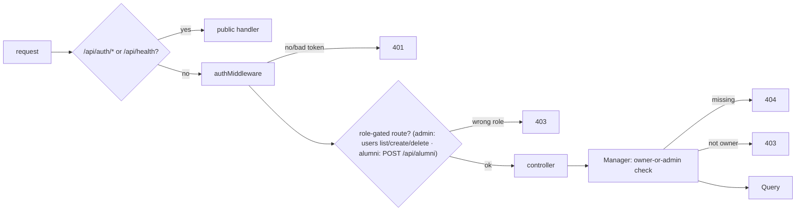
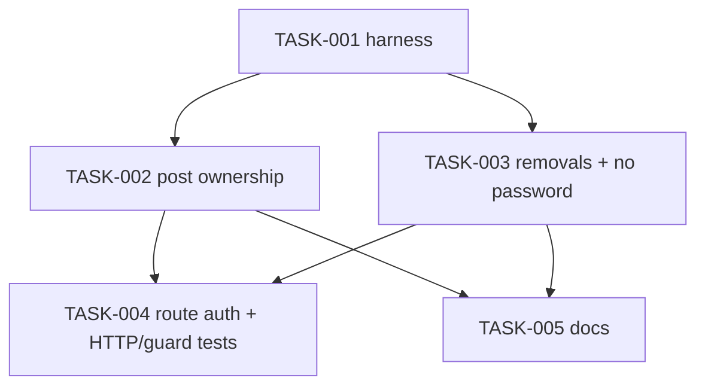

# Require sign-in on every non-public backend route — Architecture

| Field | Value |
|---|---|
| REQ | REQ-003 |
| Status | validated |
| Created | 2026-10-05 |
| Related ADRs | [[architecture/adr-05-backend-tests-vitest-supertest\|ADR-05]] (accepted) · [[architecture/adr-03-frontend-session-and-401-handling\|ADR-03]] |

## Summary

Lock down the Express API in `packages/backend/src/api`. Every router except `/api/auth` and `/api/health` gets `authMiddleware` at the top, as `MeRoutes` already does. Admin-only routes add `requireRole("admin")`. Post ownership moves into `PostManager`, following the owner-or-admin pattern `CommentManager.deleteComment` already uses. The four lookup and login/logout-time routes and their dead methods are deleted. User queries stop returning the password column. The backend gets its first test setup (Vitest + supertest, ADR-05): HTTP tests for every route, a guard test that fails when an unprotected route appears, and unit tests for the new manager and query logic.

## Blast radius

From `exploration.md`. The route count was corrected to 26, and the claim that `db.ts` blocks on import was corrected (see Risks).

| Path | Why touched | Risk |
|---|---|---|
| `packages/backend/src/api/server.ts` | exit with a clear message if `JWT_SECRET` is empty | low |
| `packages/backend/src/api/routes/UserRoutes.ts` | `router.use(authMiddleware)`; admin on `GET /`, `POST /`; drop email + login/logout routes | med |
| `packages/backend/src/api/routes/AlumniRoutes.ts` | `router.use(authMiddleware)`; `requireRole("alumni")` on `POST /`; drop email route | low |
| `packages/backend/src/api/routes/PostRoutes.ts` | `router.use(authMiddleware)` | low |
| `packages/backend/src/api/routes/CommentRoutes.ts` | `router.use(authMiddleware)` (replaces the per-route one) | low |
| `packages/backend/src/api/Middleware/roleMiddleware.ts` | 401 when `req.user` is missing (AC9) | low |
| `packages/backend/src/api/controllers/PostController.ts` | pass `req.user` as requester; map `AppError` | med |
| `packages/backend/src/api/controllers/UserController.ts` | delete `findUserByEmail`, `updateLoginTime`, `updateLogoutTime` handlers | low |
| `packages/backend/src/api/controllers/AlumniController.ts` | delete `findAlumniByEmail`; `createAlumni` uses `req.user.sub` | low |
| `packages/backend/src/businessLogic/src/PostManager.ts` | `createNewPost(userId, body)`, `updatePost(requester, id, body)`, `deletePost(requester, id)` with 404/403 | med |
| `packages/backend/src/businessLogic/src/UserManager.ts` | delete `updateLoginTime`, `updateLogoutTime` | low |
| `packages/backend/src/businessLogic/src/AlumniManager.ts` | delete `findAlumniByEmail` | low |
| `packages/backend/src/dal/query/PostQuery.ts` | add `findPostById` | low |
| `packages/backend/src/dal/query/UserQuery.ts` | `createUser`/`findUserById`/`getAllUsers` select `PUBLIC_USER_COLUMNS`; delete login/logout-time methods | med |
| `packages/backend/src/dal/query/AlumniQuery.ts` | delete `findAlumniByEmail` | low |
| `packages/backend/package.json`, `vitest.config.ts` (new), root `package.json` | test runner, scripts, dev deps | low |
| `packages/backend/src/**/*.test.ts` (new) | tests (see Test strategy) | — |
| `CLAUDE.md`, `.adlc/context/conventions.md` | auth + backend testing now true (AC13) | low |

The frontend is not in the blast radius: it calls only `/auth/login`, `/auth/register` and `/me`, and none of those change.

## Approach

**Auth wiring: one line per router.** Each of `UserRoutes`, `AlumniRoutes`, `PostRoutes` and `CommentRoutes` starts with `router.use(authMiddleware)`, copying `MeRoutes`. Doing it per router, not per route, makes "forgot the middleware" impossible for any route added to these files later. `AuthRoutes` and the health handler in `app.ts` stay untouched and are the only public surface. `requireRole("admin")` goes on `GET /api/users`, `POST /api/users` and (already there) `DELETE /api/users/:id`. `requireRole` returns 401 when `req.user` is missing, instead of throwing on `req.user.role`. Status codes follow the spec: 401 means a token problem only, because the frontend's 401 handler logs the user out (ADR-03, L-REQ-002-1); every "not allowed" is 403.

**Ownership lives in the manager.** `PostManager` mirrors `CommentManager`:
- `createNewPost(userId, body)`: the author is always `userId`. Caption and media pass through as today: no new content rules (spec non-goal).
- `updatePost(requester, postId, body)` and `deletePost(requester, postId)`: `requireId` → `postQuery.findPostById` → 404 if missing → 403 unless `post.user_id === requester.id || requester.role === "admin"` → act.

The `UPDATE` statement never touches `user_id`, so an admin edit keeps the original author (AC7). `PostController` passes `{ id: req.user.sub, role: req.user.role }` and maps errors with the same `sendError` shape `CommentController` uses (`AppError` → its status, else 500). Controllers stay functions with their own try/catch; the class and error-middleware refactor is a non-goal.

**No password leaves the database layer.** `UserQuery.createUser` (`RETURNING`), `findUserById` and `getAllUsers` select `PUBLIC_USER_COLUMNS` (already defined, already used by `register`). `findUserByEmail` keeps `SELECT *` because `login` needs the hash, but after this REQ no route returns its result.

**Removals.** Delete each route, its controller handler and its manager/query method, after checking nothing else calls them. That covers `findAlumniByEmail` (all three layers), `updateLoginTime` and `updateLogoutTime` (all three layers), and the `findUserByEmail` controller only (the manager and query methods stay for login). Removed paths get Express's default 404 for a signed-in caller. Because `router.use(authMiddleware)` runs before routing, a guest gets 401 (AC4, corrected after the stress-test). `POST /api/users` gains validation with the existing `validation.ts` helpers, since it is now the only way to create an admin (AC8b). `POST /api/alumni` is limited to `requireRole("alumni")` (decided at the architect gate), returns 409 if the caller already has a profile, and runs `validateAlumniFields`, the same rules as editing a profile (AC6).

**Tests (ADR-05).** One Vitest project at `packages/backend` (the `@alumni/backend` workspace) covers all three sub-packages, with co-located `*.test.ts` like the frontend. `vitest.config.ts` aliases `@alumni/businesslogic` to `src/businessLogic/src/index.ts`, so tests run against source rather than the stale-prone `dist/`. It also sets `JWT_SECRET` and dummy `DB_*` values in `test.env` before any module loads. Three levels, each mocked at one boundary:
1. **HTTP** (supertest against the real `app`): `vi.mock("@alumni/businesslogic")` replaces the managers with fakes, keeping the real `AppError`. Tokens are signed with the test secret. This covers 401/403/404 per route, removed routes, and the body's `user_id` being ignored (the fake manager is asserted to receive the token's `sub`).
2. **Manager unit** (`PostManager.test.ts`): `vi.mock("@alumni/dal")` gives a fake `PostQuery`. This covers owner, admin, other user (403) and missing post (404).
3. **Query unit** (`UserQuery.test.ts`): `vi.mock` of `../config/db.js` with a recording `pool.query`. It asserts that `createUser`, `findUserById` and `getAllUsers` never select or return `password`. No real Postgres is involved anywhere.

**Guard test** (`routeGuard.test.ts`): it walks `app._router.stack` (Express 4.22) recursively, mounted routers included, and builds the full method + path list. It then sends every route a request with no token, `:params` filled with `1`, and asserts 401 unless the route is on the public allowlist (`POST /api/auth/login`, `POST /api/auth/register`, `GET /api/health`). It also asserts the list has at least 23 routes (the count after removals) and contains `DELETE /api/comments/:id`, so a broken walker can't pass silently. Every top-level layer of `app._router.stack` must be either a known middleware (`query`, `expressInit`, `corsMiddleware`, `jsonParser`), a route, or one of the six mounted routers. Anything else (a later `app.use(handler)`, `express.static`, a sub-app) fails the test, because the walker can't probe it.

## Task DAG

### Tier 0
- `TASK-001` — Backend test harness (Vitest + supertest, config, scripts, smoke test)

### Tier 1
- `TASK-002` — Post ownership: `findPostById`, `PostManager` owner-or-admin, `PostController` (depends on TASK-001)
- `TASK-003` — Remove lookup + login/logout routes and dead methods; no password in user queries; `createAlumni` from token (depends on TASK-001)

### Tier 2
- `TASK-004` — Auth on every router, `requireRole` 401 hardening, HTTP tests per route + guard test (depends on TASK-002, TASK-003)
- `TASK-005` — Docs: `CLAUDE.md`, `context/conventions.md` (depends on TASK-002, TASK-003)

TASK-002 and TASK-003 touch different files and can run in parallel. TASK-003 edits `UserRoutes`/`AlumniRoutes` only to delete lines; TASK-004 then adds the auth wiring on top.

## Test strategy

| File (new) | Level | Covers |
|---|---|---|
| `packages/backend/src/api/health.test.ts` | HTTP smoke | harness works; AC1 health; AC10 |
| `packages/backend/src/businessLogic/src/PostManager.test.ts` | unit | AC5, AC7 (owner, admin, other → 403, missing → 404, author unchanged on admin edit) |
| `packages/backend/src/dal/query/UserQuery.test.ts` | unit | AC8 at the source: the select/returning list is exactly `PUBLIC_USER_COLUMNS` |
| `packages/backend/src/dal/query/PostQuery.test.ts` | unit | AC7 at the source: `updatePost` SQL never sets `user_id`; `findPostById` shape |
| `packages/backend/src/businessLogic/src/UserManager.test.ts` | unit | AC8b `createUser` validation |
| `packages/backend/src/api/test/authHelpers.ts` | helper | `tokenFor({ sub, role })`, an expired token, a bad-signature token |
| `packages/backend/src/api/routes/routes.test.ts` | HTTP | AC1–AC9 per the spec's route table: no token, bad token, expired token, wrong role, right role, removed routes 404 with/without token, `user_id` in body ignored, no `password` in `/api/users` responses, `requireRole` without user → 401 |
| `packages/backend/src/api/routes/routeGuard.test.ts` | HTTP | AC12 |

Run with `npm test` in `packages/backend`, or `npm run test:backend` from the root. Done means `npm test` is green, and `tsc --noEmit` passes for `businessLogic` (after `tsc` rebuilds its `dist/`) and for `api`.

## Convention alignment

- Layering stays routes → controllers → Managers → Query classes. Ownership is a business rule, so it goes in the Manager, as with comments. SQL stays in `dal/query`.
- "Every non-public route uses authMiddleware, plus requireRole where needed" becomes true and test-enforced.
- **Deliberate deviation:** controllers stay function exports with per-function try/catch. The redesign convention (classes + one shared error middleware) is a non-goal of the spec. `PostController` borrows `CommentController`'s `sendError` shape so the later refactor has one pattern to collapse.
- New dev dependencies (`vitest`, `supertest`, `@types/supertest`) need approval at this gate: ADR-05.

## Risks

| Risk | Likelihood | Mitigation |
|---|---|---|
| Explorer said `db.ts` connects synchronously on import. **Corrected:** `verifyConnection()` is async, fire-and-forget, and only logs on failure; `new Pool()` doesn't connect. Importing `app` in tests logs an error and continues. | — | HTTP and manager tests mock above the pool, so no query runs. TASK-001 also mocks `dal/config/db` globally in a setup file so the stray connection attempt and log don't happen. |
| Running API serves stale behavior because `@alumni/businesslogic` resolves to `dist/` | high if forgotten | TASK-002/003 acceptance includes `tsc` in `businessLogic`; tests alias to source, so they can't hide a stale build, and the build check catches type drift. |
| Role is read from the JWT, so a demoted or deleted admin keeps admin rights for up to 1 hour (token lifetime) | low | Accepted: revocation is a spec non-goal. Recorded in ADR-05's consequences and as a follow-up. |
| `JWT_SECRET` missing at runtime: every authed call returns 401, which the frontend treats as "session expired" for everyone; login returns 500 | low | Fails closed (no bypass). `server.ts` now refuses to start without it (TASK-004). |
| Guard test depends on Express 4 internals (`app._router.stack`) | low | It asserts it found ≥ N routes, including a known one, so an Express 5 upgrade fails loudly instead of passing empty. Noted in ADR-05. |
| Something outside the repo (a script, Postman collection) calls removed or locked routes | low | Spec assumption, flagged `needs verification`. Frontend checked. Called out in the PR body. |
| `vi.mock` of a workspace package doesn't apply because Vite treats it as external | med | The alias to source makes it a local module, which `vi.mock` handles. TASK-001's smoke test includes one mocked-manager assertion to prove it early. |

## Stress-test outcome

Full pass (trigger: auth surface + new ADR). 8 findings: 0 critical, 1 major, 7 minor. All were handled before the gate:

| Finding | Action |
|---|---|
| ADV-001 (major): removed routes give 401, not 404, without a token | **Fixed:** spec AC4 now says 404 signed in, 401 guest; TASK-004 tests match |
| ADV-002: guard walker can't see non-route `app.use` handlers | **Fixed:** guard also allowlists the top-level middleware; floor raised to 23 routes |
| ADV-003: role comes from the JWT for up to 1 h | **Accepted + documented:** Risks + ADR-05 consequences; revocation is a non-goal |
| ADV-004: `POST /api/alumni` body unvalidated | **Fixed:** `validateAlumniFields` (AC6). Gate decision: alumni only, 409 if a profile exists |
| ADV-005: `createUser` (admin creation) unvalidated | **Fixed:** new AC8b + TASK-003 |
| ADV-006: AC7/AC8 tests partly test their own fakes | **Fixed:** `PostQuery.test.ts`; `UserQuery.test.ts` asserts the exact column list |
| ADV-007: missing `JWT_SECRET` looks like mass logout | **Fixed:** `server.ts` refuses to start without it (TASK-004) |
| ADV-008: TASK-002 invented post validation | **Fixed:** dropped; "post content rules" added to spec non-goals |

## Open questions

- None blocking.

## Related

- Spec: REQ-003
- Concepts: [[concepts/session-and-401]]
- Components: —
- Lessons checked: [[knowledge/lessons/LESSON-REQ-002-1-401-only-if-token-matches|L-REQ-002-1]] (401 vs 403), [[knowledge/lessons/LESSON-REQ-001-3-vitest5-node-tests-in-scripts|L-REQ-001-3]] (Vitest 5 environment), [[knowledge/lessons/LESSON-REQ-001-8-adr-changes-update-claude-conventions|L-REQ-001-8]] (ADR → CLAUDE.md + conventions)
- ADRs: [[architecture/adr-05-backend-tests-vitest-supertest|ADR-05]] (accepted), [[architecture/adr-03-frontend-session-and-401-handling|ADR-03]]
