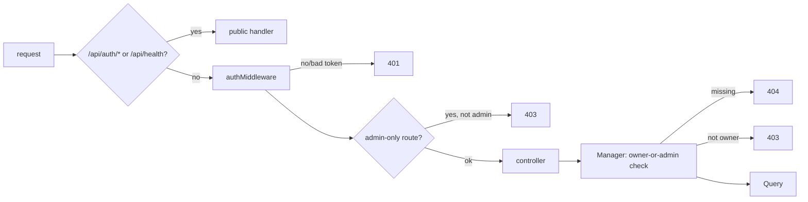
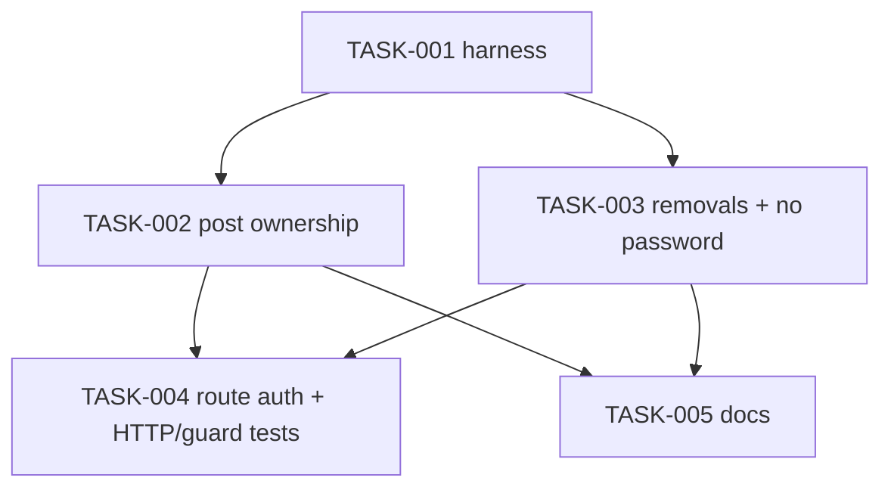

# REQ-003-backend-route-auth — Review Packet

`Packet: 43KB · round 5 · 4 files`

This packet contains the diff with full file context, the REQ spec, the REQ architecture, and the exploration report's blast radius and vault references. **Do not re-read these via Read — cite this packet.**

**Your own required reading is not a packet gap.** `context/conventions.md`, the vault (lessons, gotchas, ADRs, concepts), and any source file outside the diff that this change interacts with are your mandate. Read them freely; do not report them.

**`Packet-gap` means the packet's own contents fell short** — the diff, spec, or architecture was missing or insufficient for a call you had to make. Then, and only then, add `**Packet-gap:** <path> — <why the packet didn't cover it>` to your section, whether or not it produced a finding. Kept this narrow the signal is actionable and we act on it; applied to your required reading it fires on every run and tells us nothing.

Note: the user committed the whole REQ as one commit (e15fe2d5) rather than the five drafted in commits-draft.md; review the code, not the commit split.

## Round 5 — what changed since round 4

| ID | Disposition | Fixed by |
|---|---|---|
| m4 → AC14 | pulled in at the review gate, fixed | PostManager.updatePost builds a patch from present keys (omitted keeps, null clears, non-string 400, empty 400; 404/403 before validation); PostQuery.updatePost builds SET from an allowlist, parameterized, never user_id |

Files in this round: PostManager.ts, PostQuery.ts and their tests. Diff is vs e15fe2d5, so it also shows earlier-round edits to these files (already reviewed). AC14 is in the REQ spec below.

## Diff with full context (round 5 files, vs e15fe2d5)

```diff
diff --git a/packages/backend/src/businessLogic/src/PostManager.test.ts b/packages/backend/src/businessLogic/src/PostManager.test.ts
index b069b505..5416e7c4 100644
--- a/packages/backend/src/businessLogic/src/PostManager.test.ts
+++ b/packages/backend/src/businessLogic/src/PostManager.test.ts
@@ -1,143 +1,174 @@
 import { beforeEach, describe, expect, it, vi } from 'vitest';
-import { AppError } from './errors';
 import { PostManager } from './PostManager';
+import { expectAppError } from '../../test/expectAppError';
 
 // A fake PostQuery: every PostManager gets this same object. The real PostDTO is kept.
 const query = vi.hoisted(() => ({
   findPostById: vi.fn(),
   createPost: vi.fn(),
   updatePost: vi.fn(),
   deletePost: vi.fn(),
   getPostsByUserId: vi.fn(),
 }));
 
 vi.mock('@alumni/dal', async (importOriginal) => ({
   ...(await importOriginal<typeof import('@alumni/dal')>()),
   PostQuery: class {
     constructor() {
       return query;
     }
   },
 }));
 
 const AUTHOR = { id: 7, role: 'alumni' };
 const ADMIN = { id: 1, role: 'admin' };
 const OTHER = { id: 8, role: 'student' };
 const STORED_POST = { id: 42, user_id: 7, caption: 'old', media_url: null, comment_count: 3 };
 
-async function expectAppError(promise: Promise<unknown>, status: number) {
-  const error = await promise.then(
-    () => undefined,
-    (e: unknown) => e,
-  );
-  expect(error).toBeInstanceOf(AppError);
-  expect((error as AppError).status).toBe(status);
-}
-
 describe('PostManager', () => {
   let manager: PostManager;
 
   beforeEach(() => {
     Object.values(query).forEach((fn) => fn.mockReset());
     query.findPostById.mockResolvedValue({ ...STORED_POST });
-    query.updatePost.mockImplementation(async (post) => ({ ...post }));
+    query.updatePost.mockImplementation(async (id, patch) => ({ ...STORED_POST, ...patch, id }));
     manager = new PostManager();
   });
 
   describe('createNewPost', () => {
     it('makes the signed-in user the author and ignores body.user_id', async () => {
       query.createPost.mockImplementation(async (post) => post);
 
       await manager.createNewPost(7, { user_id: 99, caption: 'hello', media_url: 'https://x.test/a.png' });
 
       const stored = query.createPost.mock.calls[0]![0];
       expect(stored.user_id).toBe(7);
       expect(stored.caption).toBe('hello');
       expect(stored.media_url).toBe('https://x.test/a.png');
       expect(stored.comment_count).toBe(0);
     });
   });
 
   describe('updatePost', () => {
     it('lets the author edit their post', async () => {
       const updated = await manager.updatePost(AUTHOR, '42', { caption: 'new', media_url: 'https://x.test/b.png' });
 
       expect(query.findPostById).toHaveBeenCalledWith(42);
-      const sent = query.updatePost.mock.calls[0]![0];
-      expect(sent).toMatchObject({ id: 42, user_id: 7, caption: 'new', media_url: 'https://x.test/b.png' });
-      expect(updated).toMatchObject({ id: 42, caption: 'new' });
+      expect(query.updatePost).toHaveBeenCalledWith(42, { caption: 'new', media_url: 'https://x.test/b.png' });
+      expect(updated).toMatchObject({ id: 42, user_id: 7, caption: 'new' });
     });
 
     it("lets an admin edit someone else's post without changing its author", async () => {
       await manager.updatePost(ADMIN, 42, { caption: 'moderated', user_id: 1 });
 
-      const sent = query.updatePost.mock.calls[0]![0];
-      expect(sent.id).toBe(42);
-      expect(sent.user_id).toBe(7);
-      expect(sent.caption).toBe('moderated');
+      expect(query.updatePost).toHaveBeenCalledWith(42, { caption: 'moderated' });
+    });
+
+    // AC14: only the fields sent change.
+    it('keeps an omitted field: sends only the keys present', async () => {
+      await manager.updatePost(AUTHOR, 42, { media_url: 'https://x.test/c.png' });
+      expect(query.updatePost).toHaveBeenCalledWith(42, { media_url: 'https://x.test/c.png' });
+    });
+
+    it('clears a field sent as null', async () => {
+      await manager.updatePost(AUTHOR, 42, { caption: null });
+      expect(query.updatePost).toHaveBeenCalledWith(42, { caption: null });
+    });
+
+    it('stores text as sent, like create (no trimming)', async () => {
+      await manager.updatePost(AUTHOR, 42, { caption: '  hi  ', media_url: '' });
+      expect(query.updatePost).toHaveBeenCalledWith(42, { caption: '  hi  ', media_url: '' });
+    });
+
+    it.each([
+      ['caption', 5],
+      ['caption', { a: 1 }],
+      ['caption', true],
+      ['media_url', 0],
+      ['media_url', ['x']],
+      ['media_url', false],
+    ])('returns 400 when %s is %j', async (key, value) => {
+      await expectAppError(manager.updatePost(AUTHOR, 42, { [key]: value }), 400);
+      expect(query.updatePost).not.toHaveBeenCalled();
+    });
+
+    it.each([{}, { user_id: 1 }])('returns 400 "Nothing to update" for %j', async (body) => {
+      const error = await expectAppError(manager.updatePost(AUTHOR, 42, body), 400);
+      expect(error.message).toBe('Nothing to update');
+      expect(query.updatePost).not.toHaveBeenCalled();
+    });
+
+    it('checks 404 before validating the body', async () => {
+      query.findPostById.mockResolvedValue(undefined);
+      await expectAppError(manager.updatePost(AUTHOR, 999, { caption: 5 }), 404);
+    });
+
+    it('checks 403 before validating the body', async () => {
+      await expectAppError(manager.updatePost(OTHER, 42, {}), 403);
+      await expectAppError(manager.updatePost(OTHER, 42, { caption: 5 }), 403);
     });
 
     it('returns 403 for another user and does not update', async () => {
       await expectAppError(manager.updatePost(OTHER, 42, { caption: 'hijack' }), 403);
       expect(query.updatePost).not.toHaveBeenCalled();
     });
 
     it('returns 404 for a missing post', async () => {
       query.findPostById.mockResolvedValue(undefined);
 
       await expectAppError(manager.updatePost(AUTHOR, 999, { caption: 'x' }), 404);
       expect(query.updatePost).not.toHaveBeenCalled();
     });
 
     // requireId treats a malformed id as "not found" (404), same as comments.
     it.each(['abc', '0', '-1', '1.5', undefined])('rejects bad id %s without a lookup', async (id) => {
       await expectAppError(manager.updatePost(AUTHOR, id, { caption: 'x' }), 404);
       expect(query.findPostById).not.toHaveBeenCalled();
       expect(query.updatePost).not.toHaveBeenCalled();
     });
   });
 
   describe('deletePost', () => {
     it('lets the author delete their post', async () => {
       await manager.deletePost(AUTHOR, '42');
       expect(query.deletePost).toHaveBeenCalledWith(42);
     });
 
     it("lets an admin delete someone else's post", async () => {
       await manager.deletePost(ADMIN, 42);
       expect(query.deletePost).toHaveBeenCalledWith(42);
     });
 
     it('returns 403 for another user and does not delete', async () => {
       await expectAppError(manager.deletePost(OTHER, 42), 403);
       expect(query.deletePost).not.toHaveBeenCalled();
     });
 
     it('returns 404 for a missing post', async () => {
       query.findPostById.mockResolvedValue(undefined);
 
       await expectAppError(manager.deletePost(AUTHOR, 999), 404);
       expect(query.deletePost).not.toHaveBeenCalled();
     });
 
     it('rejects a bad id without a lookup', async () => {
       await expectAppError(manager.deletePost(AUTHOR, 'abc'), 404);
       expect(query.findPostById).not.toHaveBeenCalled();
       expect(query.deletePost).not.toHaveBeenCalled();
     });
   });
 
   describe('getPostsByUserId', () => {
     it('passes a plain numeric id to the query', async () => {
       query.getPostsByUserId.mockResolvedValue([]);
 
       await expect(manager.getPostsByUserId('7')).resolves.toEqual([]);
       expect(query.getPostsByUserId).toHaveBeenCalledWith(7);
     });
 
     it('rejects a bad id', async () => {
       await expectAppError(manager.getPostsByUserId('abc'), 404);
       expect(query.getPostsByUserId).not.toHaveBeenCalled();
     });
   });
 });
diff --git a/packages/backend/src/businessLogic/src/PostManager.ts b/packages/backend/src/businessLogic/src/PostManager.ts
index 271cb942..d84d8fcc 100644
--- a/packages/backend/src/businessLogic/src/PostManager.ts
+++ b/packages/backend/src/businessLogic/src/PostManager.ts
@@ -1,61 +1,66 @@
 import { PostDTO, PostQuery } from "@alumni/dal";
 import { AppError } from "./errors.js";
 import { requireId } from "./validation.js";
 
 type Requester = { id: number; role: string };
 
 export class PostManager {
   postQuery: PostQuery;
 
   constructor() {
     this.postQuery = new PostQuery();
   }
 
   // The author is always the authenticated user; a user_id in the body is never read.
   // Caption and media pass through unchanged (no content rules, see REQ-003 non-goals).
   public async createNewPost(userId: number, body: Record<string, unknown>) {
     const post = new PostDTO(userId, 0, body.caption as string | undefined, body.media_url as string | undefined);
     return this.postQuery.createPost(post);
   }
 
   // Only the post's author or an admin may edit it. The author stays the same.
+  // Ownership is checked before the body, so a non-owner never sees validation errors.
+  // Only the fields sent change (AC14): omitted keeps, null clears, text is stored as sent (like create).
   public async updatePost(requester: Requester, postId: unknown, body: Record<string, unknown>) {
     const existing = await this.findOwnedPost(requester, postId);
-    const post = new PostDTO(
-      existing.user_id,
-      existing.comment_count,
-      body.caption as string | undefined,
-      body.media_url as string | undefined,
-    );
-    post.id = existing.id;
-    return this.postQuery.updatePost(post);
+    const patch: { caption?: string | null; media_url?: string | null } = {};
+    for (const key of ["caption", "media_url"] as const) {
+      if (!Object.prototype.hasOwnProperty.call(body, key)) continue;
+      const value = body[key];
+      if (value !== null && typeof value !== "string") {
+        throw new AppError(400, `${key === "caption" ? "Caption" : "Media URL"} must be text or null`);
+      }
+      patch[key] = value;
+    }
+    if (Object.keys(patch).length === 0) throw new AppError(400, "Nothing to update");
+    return this.postQuery.updatePost(existing.id, patch);
   }
 
   // Only the post's author or an admin may delete it.
   public async deletePost(requester: Requester, postId: unknown) {
     const existing = await this.findOwnedPost(requester, postId);
     await this.postQuery.deletePost(existing.id);
   }
 
   public async getAllPosts(limit?: number, offset?: number) {
     return this.postQuery.getAllPosts(limit, offset);
   }
 
   public async getPostsByUserId(userId: unknown) {
     return this.postQuery.getPostsByUserId(requireId(userId, "User"));
   }
 
   public async updateCommentCount(post: PostDTO) {
     return this.postQuery.updateCommentCount(post.id, post.comment_count);
   }
 
   private async findOwnedPost(requester: Requester, postId: unknown): Promise<PostDTO> {
     const id = requireId(postId, "Post");
     const post = await this.postQuery.findPostById(id);
     if (!post) throw new AppError(404, "Post not found");
     if (post.user_id !== requester.id && requester.role !== "admin") {
       throw new AppError(403, "You can only change your own posts");
     }
     return post;
   }
 }
diff --git a/packages/backend/src/dal/query/PostQuery.test.ts b/packages/backend/src/dal/query/PostQuery.test.ts
index d514c649..20106093 100644
--- a/packages/backend/src/dal/query/PostQuery.test.ts
+++ b/packages/backend/src/dal/query/PostQuery.test.ts
@@ -1,42 +1,76 @@
 import { beforeEach, describe, expect, it, vi } from 'vitest';
-import pool from '../config/db';
-import { PostDTO } from '../dto/PostDTO';
+import pool from '../config/db.js';
 import { PostQuery } from './PostQuery';
 
 // pool is the fake from src/test/setup.ts; these tests check the SQL we send it.
 const poolQuery = vi.mocked(pool.query) as unknown as ReturnType<typeof vi.fn>;
 
 describe('PostQuery', () => {
   beforeEach(() => {
     poolQuery.mockReset();
   });
 
   it('findPostById selects one post by id', async () => {
     const row = { id: 42, user_id: 7 };
     poolQuery.mockResolvedValue({ rows: [row] });
 
     await expect(new PostQuery().findPostById(42)).resolves.toEqual(row);
 
     const [sql, params] = poolQuery.mock.calls[0]!;
     expect(sql).toMatch(/SELECT \* FROM posts WHERE id = \$1/);
     expect(params).toEqual([42]);
   });
 
   it('findPostById returns undefined when no row matches', async () => {
     poolQuery.mockResolvedValue({ rows: [] });
     await expect(new PostQuery().findPostById(999)).resolves.toBeUndefined();
   });
 
-  it('updatePost never writes user_id', async () => {
-    poolQuery.mockResolvedValue({ rows: [{}] });
-    const post = new PostDTO(99, 0, 'caption', 'https://x.test/a.png');
-    post.id = 42;
+  describe('updatePost', () => {
+    it('sets both fields, then updated_at, and never user_id', async () => {
+      poolQuery.mockResolvedValue({ rows: [{ id: 42 }] });
 
-    await new PostQuery().updatePost(post);
+      await expect(
+        new PostQuery().updatePost(42, { caption: 'caption', media_url: 'https://x.test/a.png' }),
+      ).resolves.toEqual({ id: 42 });
 
-    const [sql, params] = poolQuery.mock.calls[0]!;
-    expect(sql).not.toMatch(/user_id/i);
-    expect(params).toEqual(['caption', 'https://x.test/a.png', 42]);
-    expect(params).not.toContain(99);
+      const [sql, params] = poolQuery.mock.calls[0]!;
+      expect(sql).toMatch(/UPDATE posts SET caption=\$1, media_url=\$2, updated_at=NOW\(\)\s+WHERE id=\$3 RETURNING \*/);
+      expect(sql).not.toMatch(/user_id/i);
+      expect(params).toEqual(['caption', 'https://x.test/a.png', 42]);
+    });
+
+    it('sets only media_url when caption is omitted', async () => {
+      poolQuery.mockResolvedValue({ rows: [{}] });
+
+      await new PostQuery().updatePost(42, { media_url: 'https://x.test/b.png' });
+
+      const [sql, params] = poolQuery.mock.calls[0]!;
+      expect(sql).toMatch(/SET media_url=\$1, updated_at=NOW\(\)\s+WHERE id=\$2/);
+      expect(sql).not.toMatch(/caption/);
+      expect(params).toEqual(['https://x.test/b.png', 42]);
+    });
+
+    it('passes null as a parameter to clear a field', async () => {
+      poolQuery.mockResolvedValue({ rows: [{}] });
+
+      await new PostQuery().updatePost(42, { caption: null });
+
+      const [sql, params] = poolQuery.mock.calls[0]!;
+      expect(sql).toMatch(/SET caption=\$1, updated_at=NOW\(\)\s+WHERE id=\$2/);
+      expect(sql).not.toMatch(/media_url/);
+      expect(params).toEqual([null, 42]);
+    });
+
+    it('ignores keys outside the allowlist and never interpolates values', async () => {
+      poolQuery.mockResolvedValue({ rows: [{}] });
+      const patch = { caption: "x'; DROP TABLE posts; --", user_id: 99 } as unknown as { caption: string };
+
+      await new PostQuery().updatePost(42, patch);
+
+      const [sql, params] = poolQuery.mock.calls[0]!;
+      expect(sql).not.toMatch(/user_id|DROP/i);
+      expect(params).toEqual(["x'; DROP TABLE posts; --", 42]);
+    });
   });
 });
diff --git a/packages/backend/src/dal/query/PostQuery.ts b/packages/backend/src/dal/query/PostQuery.ts
index 92e70836..056bd5aa 100644
--- a/packages/backend/src/dal/query/PostQuery.ts
+++ b/packages/backend/src/dal/query/PostQuery.ts
@@ -1,87 +1,96 @@
 import pool from "../config/db.js";
 import { PostDTO } from "../dto/PostDTO.js";
 
-
+// The post columns an edit may change.
+const POST_PATCH_COLUMNS = ["caption", "media_url"] as const;
+export type PostPatch = { caption?: string | null; media_url?: string | null };
 
 export class PostQuery {
     constructor() {
     }
     public async createPost(post: PostDTO): Promise<PostDTO> {
         const info = await pool.query(
             'INSERT INTO posts (user_id,caption,media_url,comment_count)VALUES ($1,$2,$3,$4) RETURNING * ',
             [
                 post.user_id,
                 post.caption,
                 post.media_url,
                 post.comment_count
             ]
         );
         return info.rows[0];
     }
 
 public async getAllPosts(limit: number = 50, offset: number = 0): Promise<PostDTO[]> {
     const info = await pool.query(
         `SELECT posts.*, users.name AS author_name, users.photo_url AS author_photo
          FROM posts
          JOIN users ON posts.user_id = users.id
          ORDER BY posts.created_at DESC
          LIMIT $1 OFFSET $2`,
         [limit, offset]
     );
     return info.rows;
 }
 
     public async getPostsByUserId(user_id: number): Promise<PostDTO[]> {
         const info = await pool.query(
             `SELECT posts.*, users.name AS author_name, users.photo_url AS author_photo
              FROM posts
              JOIN users ON posts.user_id = users.id
              WHERE posts.user_id = $1
              ORDER BY posts.created_at DESC`,
             [
                 user_id
             ]
         );
         return info.rows;
     }
 
     public async findPostById(id: number): Promise<PostDTO | undefined> {
         const info = await pool.query('SELECT * FROM posts WHERE id = $1', [id]);
         return info.rows[0];
     }
 
-    // Never sets user_id: an admin editing someone's post keeps the original author.
-    public async updatePost(post: PostDTO): Promise<PostDTO> {
+    // Sets only the columns present in the patch (AC14); omitted ones keep their value.
+    // Column names come from a fixed allowlist and values are parameters. Never sets
+    // user_id: an admin editing someone's post keeps the original author.
+    public async updatePost(id: number, patch: PostPatch): Promise<PostDTO> {
+        const sets: string[] = [];
+        const params: unknown[] = [];
+        for (const column of POST_PATCH_COLUMNS) {
+            if (Object.prototype.hasOwnProperty.call(patch, column)) {
+                params.push(patch[column]);
+                sets.push(`${column}=$${params.length}`);
+            }
+        }
+        params.push(id);
         const info = await pool.query(
-            `UPDATE posts SET caption=$1, media_url=$2, updated_at=NOW()
-            WHERE id=$3 RETURNING *`,
-            [
-                post.caption,
-                post.media_url,
-                post.id
-            ]
+            `UPDATE posts SET ${[...sets, 'updated_at=NOW()'].join(', ')}
+            WHERE id=$${params.length} RETURNING *`,
+            params
         );
         return info.rows[0];
     }
 
     public async deletePost(id: number): Promise<void> {
         await pool.query(
             'DELETE FROM posts WHERE id = $1',
             [
                 id
             ]
         );
     }
 
     public async updateCommentCount(id: number, comment_count: number): Promise<void> {
         await pool.query(
             'UPDATE posts SET comment_count=$1 WHERE id=$2',
             [
                 comment_count,
                 id
             ]
         );
 
     }
 }
 
```

## REQ spec

# Require sign-in on every non-public backend route

| Field | Value |
|---|---|
| REQ | REQ-003 |
| Status | in-progress |
| Phase | spec |
| Created | 2026-10-05 |
| Primary repo | alumni-system |
| Touched repos | alumni-system |
| Related | [[architecture/adr-03-frontend-session-and-401-handling\|ADR-03]] · [[concepts/session-and-401]] · [[knowledge/lessons/LESSON-REQ-002-1-401-only-if-token-matches\|L-REQ-002-1]] |

## Problem

Most of the API can be called without signing in, and some of it can be called as somebody else. Checked against `packages/backend/src/api/routes/*.ts` on 2026-10-05:

- `GET /api/users`, `GET /api/users/:id` and `GET /api/users/email/:email` are public and return `SELECT *` from `users`, so anyone can read every user's email and **bcrypt password hash**.
- `POST /api/users` is public and accepts any `role`, so anyone can create an **admin** account.
- `PUT /api/posts/:id` and `DELETE /api/posts/:id` are public with no owner check: anyone can edit or delete any post. `POST /api/posts` takes the author from the request body, so anyone can post as anyone.
- `PUT /api/users/:id/login` and `/logout` are public and let anyone overwrite any user's login/logout times.
- `POST /api/alumni` is public and takes `user_id` from the body. `GET /api/alumni`, `GET /api/alumni/email/:email`, `GET /api/posts`, `GET /api/posts/user/:id` and `GET /api/posts/:id/comments` are public.

The project convention ("every non-public route uses authMiddleware, plus requireRole where needed") is written down but not enforced, and nothing stops a new route from shipping unprotected. The backend has no automated tests.

## Goal

Every backend route except `POST /api/auth/login`, `POST /api/auth/register` and `GET /api/health` rejects a request without a valid token. Admin-only actions also reject non-admins. Posts can be edited or deleted only by their author or an admin, and are always created as the signed-in user. No response from any endpoint contains a password hash. The email-lookup and login/logout-time routes are gone. Automated backend tests prove each of these, and a test fails if someone later adds a route without auth.

## Non-goals

- Turning controllers into classes and adding the shared error middleware from the redesign conventions. Separate REQ; this one changes who may call what, not how errors are mapped.
- Post content rules. Create and update keep today's behaviour (no new required fields or length limits); only who may call them changes.
- Rate limiting, refresh tokens, token revocation, or changing the 1-hour token lifetime.
- Any frontend change. The frontend only calls `/auth/login`, `/auth/register` and `/me`, all of which keep working as today.
- Recording login/logout times some other way. The routes are removed; nothing replaces them in this REQ.

## Acceptance criteria

Status codes: no or invalid token → **401**; signed in but not allowed → **403**; target doesn't exist → **404** (checked before ownership, for an allowed role). 401 stays reserved for token problems so the frontend's session handling (ADR-03) still logs the user out only when it should.

**Public routes**
- [ ] AC1. `POST /api/auth/login`, `POST /api/auth/register` and `GET /api/health` work without a token, as today.

**Every other route requires a token**
- [ ] AC2. Every other route returns 401 without a token and 401 with an invalid or expired token. That covers all routes under `/api/users`, `/api/alumni`, `/api/posts`, `/api/comments` and `/api/me`.

**Route-by-route rules**

| Route | Who may call it |
|---|---|
| `GET /api/users` | admin |
| `POST /api/users` | admin (the only way to create an admin) |
| `GET /api/users/:id` | any signed-in user |
| `PUT /api/users/:id` | the user themselves (unchanged) |
| `DELETE /api/users/:id` | admin (unchanged) |
| `GET /api/users/email/:email` | removed |
| `PUT /api/users/:id/login`, `PUT /api/users/:id/logout` | removed |
| `GET /api/alumni`, `GET /api/alumni/:id` | any signed-in user |
| `POST /api/alumni` | alumni users only, for themselves, once (decided at the architect gate) |
| `PUT /api/alumni/:id` | the owner (unchanged) |
| `GET /api/alumni/email/:email` | removed |
| `GET /api/posts`, `GET /api/posts/user/:id`, `GET /api/posts/:id/comments` | any signed-in user |
| `POST /api/posts`, `POST /api/posts/:id/comments` | any signed-in user, as themselves |
| `PUT /api/posts/:id`, `DELETE /api/posts/:id` | the post's author or an admin |
| `DELETE /api/comments/:id` | the comment's author or an admin (unchanged) |
| `/api/me/*` | the signed-in user (unchanged) |

- [ ] AC3. Admin-only routes in the table return 403 for a signed-in student or alumni user, and succeed for an admin.
- [ ] AC4. Removed routes return 404 for a signed-in caller and 401 without a token (auth runs before routing, so a guest learns nothing about which paths exist), and their controller, manager and query methods are deleted if nothing else uses them.
- [ ] AC5. `POST /api/posts` stores the signed-in user as the author. A `user_id` in the body is ignored.
- [ ] AC6. `POST /api/alumni` creates the profile for the signed-in user. A `user_id` in the body is ignored, and the profile fields are validated with the same rules as editing a profile. Students and admins get 403; a caller who already has a profile gets 409.
- [ ] AC7. `PUT /api/posts/:id` and `DELETE /api/posts/:id` succeed for the author and for an admin, return 403 for any other signed-in user (post unchanged), and 404 for a post that doesn't exist. An admin editing someone's post does not change its author.
- [ ] AC8. No response body from any endpoint includes a `password` field (checked at least for every `/api/users` route and `POST /api/users`).
- [ ] AC8b. `POST /api/users` validates name, email, password and `role` (one of `admin`, `alumni`, `student`) with the same rules as sign-up, and returns 400 on bad input.
- [ ] AC9. `requireRole` returns 401 instead of throwing when it runs on a request with no signed-in user.

**Tests**
- [ ] AC10. The backend has a test command (`npm test` in the backend package, or from the root) that runs without a live Postgres database.
- [ ] AC11. Tests cover AC1–AC9: for every route, the no-token case; for admin-only and owner-only routes, the allowed and forbidden cases.
- [ ] AC12. A guard test lists every route registered on the Express app and fails if any route outside the public list (AC1) can be reached without a token. Adding an unprotected route makes this test fail.
- [ ] AC13. `CLAUDE.md`'s backend notes (the line saying not all routes apply `authMiddleware`) and the vault's `context/conventions.md` (API auth and backend testing) describe the new state.

## Assumptions

- No other client (mobile app, scripts, seed tooling) calls the routes being removed or locked down. The frontend calls only `/auth/login`, `/auth/register` and `/me` (checked in `packages/frontend/src/services/` on 2026-10-05). — `STATUS: needs verification`
- `register` already creates the user's alumni or student row, so `POST /api/alumni` is rarely needed; keeping it for signed-in users (for themselves) is enough.
- Admin accounts are made directly in the database or via `POST /api/users` by an existing admin. Bootstrapping the first admin is not this REQ's problem.
- Any signed-in user may read any other user's basic public info (`GET /api/users/:id`) and the alumni directory, since this is a members' network.

## Open questions

None. Resolved at the spec gate (2026-10-05):

- [x] Email lookups: **removed** (both `/users/email/:email` and `/alumni/email/:email`).
- [x] Reading posts, comments and the alumni directory: **signed-in users only**.

## Out of scope (for now)

- Controllers as classes + one shared error middleware (redesign convention).
- Pagination or field trimming on `GET /api/users` and `GET /api/alumni` beyond removing the password.
- Students' own profile routes (none exist yet).
- Auditing other business rules (e.g. comment count drift).

## Related

- Concepts: [[concepts/session-and-401]]
- Components: —
- Lessons: [[knowledge/lessons/LESSON-REQ-002-1-401-only-if-token-matches|L-REQ-002-1]] (the frontend logs out only on a 401 for the current token; 403 must stay distinct)
- ADRs: [[architecture/adr-03-frontend-session-and-401-handling|ADR-03]]

## Backlinks

_(populated by /wrapup or manually)_

## REQ architecture

# Require sign-in on every non-public backend route — Architecture

| Field | Value |
|---|---|
| REQ | REQ-003 |
| Status | validated |
| Created | 2026-10-05 |
| Related ADRs | [[architecture/adr-05-backend-tests-vitest-supertest\|ADR-05]] (accepted) · [[architecture/adr-03-frontend-session-and-401-handling\|ADR-03]] |

## Summary

Lock down the Express API in `packages/backend/src/api`. Every router except `/api/auth` and `/api/health` gets `authMiddleware` at the top, as `MeRoutes` already does. Admin-only routes add `requireRole("admin")`. Post ownership moves into `PostManager`, following the owner-or-admin pattern `CommentManager.deleteComment` already uses. The four lookup and login/logout-time routes and their dead methods are deleted. User queries stop returning the password column. The backend gets its first test setup (Vitest + supertest, ADR-05): HTTP tests for every route, a guard test that fails when an unprotected route appears, and unit tests for the new manager and query logic.

## Blast radius

From `exploration.md`. The route count was corrected to 26, and the claim that `db.ts` blocks on import was corrected (see Risks).

| Path | Why touched | Risk |
|---|---|---|
| `packages/backend/src/api/server.ts` | exit with a clear message if `JWT_SECRET` is empty | low |
| `packages/backend/src/api/routes/UserRoutes.ts` | `router.use(authMiddleware)`; admin on `GET /`, `POST /`; drop email + login/logout routes | med |
| `packages/backend/src/api/routes/AlumniRoutes.ts` | `router.use(authMiddleware)`; drop email route | low |
| `packages/backend/src/api/routes/PostRoutes.ts` | `router.use(authMiddleware)` | low |
| `packages/backend/src/api/routes/CommentRoutes.ts` | `router.use(authMiddleware)` (replaces the per-route one) | low |
| `packages/backend/src/api/Middleware/roleMiddleware.ts` | 401 when `req.user` is missing (AC9) | low |
| `packages/backend/src/api/controllers/PostController.ts` | pass `req.user` as requester; map `AppError` | med |
| `packages/backend/src/api/controllers/UserController.ts` | delete `findUserByEmail`, `updateLoginTime`, `updateLogoutTime` handlers | low |
| `packages/backend/src/api/controllers/AlumniController.ts` | delete `findAlumniByEmail`; `createAlumni` uses `req.user.sub` | low |
| `packages/backend/src/businessLogic/src/PostManager.ts` | `createNewPost(userId, body)`, `updatePost(requester, id, body)`, `deletePost(requester, id)` with 404/403 | med |
| `packages/backend/src/businessLogic/src/UserManager.ts` | delete `updateLoginTime`, `updateLogoutTime` | low |
| `packages/backend/src/businessLogic/src/AlumniManager.ts` | delete `findAlumniByEmail` | low |
| `packages/backend/src/dal/query/PostQuery.ts` | add `findPostById` | low |
| `packages/backend/src/dal/query/UserQuery.ts` | `createUser`/`findUserById`/`getAllUsers` select `PUBLIC_USER_COLUMNS`; delete login/logout-time methods | med |
| `packages/backend/src/dal/query/AlumniQuery.ts` | delete `findAlumniByEmail` | low |
| `packages/backend/package.json`, `vitest.config.ts` (new), root `package.json` | test runner, scripts, dev deps | low |
| `packages/backend/src/**/*.test.ts` (new) | tests (see Test strategy) | — |
| `CLAUDE.md`, `.adlc/context/conventions.md` | auth + backend testing now true (AC13) | low |

The frontend is not in the blast radius: it calls only `/auth/login`, `/auth/register` and `/me`, and none of those change.

## Approach

**Auth wiring: one line per router.** Each of `UserRoutes`, `AlumniRoutes`, `PostRoutes` and `CommentRoutes` starts with `router.use(authMiddleware)`, copying `MeRoutes`. Doing it per router, not per route, makes "forgot the middleware" impossible for any route added to these files later. `AuthRoutes` and the health handler in `app.ts` stay untouched and are the only public surface. `requireRole("admin")` goes on `GET /api/users`, `POST /api/users` and (already there) `DELETE /api/users/:id`. `requireRole` returns 401 when `req.user` is missing, instead of throwing on `req.user.role`. Status codes follow the spec: 401 means a token problem only, because the frontend's 401 handler logs the user out (ADR-03, L-REQ-002-1); every "not allowed" is 403.

**Ownership lives in the manager.** `PostManager` mirrors `CommentManager`:
- `createNewPost(userId, body)`: the author is always `userId`. Caption and media pass through as today: no new content rules (spec non-goal).
- `updatePost(requester, postId, body)` and `deletePost(requester, postId)`: `requireId` → `postQuery.findPostById` → 404 if missing → 403 unless `post.user_id === requester.id || requester.role === "admin"` → act.

The `UPDATE` statement never touches `user_id`, so an admin edit keeps the original author (AC7). `PostController` passes `{ id: req.user.sub, role: req.user.role }` and maps errors with the same `sendError` shape `CommentController` uses (`AppError` → its status, else 500). Controllers stay functions with their own try/catch; the class and error-middleware refactor is a non-goal.

**No password leaves the database layer.** `UserQuery.createUser` (`RETURNING`), `findUserById` and `getAllUsers` select `PUBLIC_USER_COLUMNS` (already defined, already used by `register`). `findUserByEmail` keeps `SELECT *` because `login` needs the hash, but after this REQ no route returns its result.

**Removals.** Delete each route, its controller handler and its manager/query method, after checking nothing else calls them. That covers `findAlumniByEmail` (all three layers), `updateLoginTime` and `updateLogoutTime` (all three layers), and the `findUserByEmail` controller only (the manager and query methods stay for login). Removed paths get Express's default 404 for a signed-in caller. Because `router.use(authMiddleware)` runs before routing, a guest gets 401 (AC4, corrected after the stress-test). `POST /api/users` gains validation with the existing `validation.ts` helpers, since it is now the only way to create an admin (AC8b). `POST /api/alumni` is limited to `requireRole("alumni")` (decided at the architect gate), returns 409 if the caller already has a profile, and runs `validateAlumniFields`, the same rules as editing a profile (AC6).



**Tests (ADR-05).** One Vitest project at `packages/backend` (the `@alumni/backend` workspace) covers all three sub-packages, with co-located `*.test.ts` like the frontend. `vitest.config.ts` aliases `@alumni/businesslogic` to `src/businessLogic/src/index.ts`, so tests run against source rather than the stale-prone `dist/`. It also sets `JWT_SECRET` and dummy `DB_*` values in `test.env` before any module loads. Three levels, each mocked at one boundary:
1. **HTTP** (supertest against the real `app`): `vi.mock("@alumni/businesslogic")` replaces the managers with fakes, keeping the real `AppError`. Tokens are signed with the test secret. This covers 401/403/404 per route, removed routes, and the body's `user_id` being ignored (the fake manager is asserted to receive the token's `sub`).
2. **Manager unit** (`PostManager.test.ts`): `vi.mock("@alumni/dal")` gives a fake `PostQuery`. This covers owner, admin, other user (403) and missing post (404).
3. **Query unit** (`UserQuery.test.ts`): `vi.mock` of `../config/db.js` with a recording `pool.query`. It asserts that `createUser`, `findUserById` and `getAllUsers` never select or return `password`. No real Postgres is involved anywhere.

**Guard test** (`routeGuard.test.ts`): it walks `app._router.stack` (Express 4.22) recursively, mounted routers included, and builds the full method + path list. It then sends every route a request with no token, `:params` filled with `1`, and asserts 401 unless the route is on the public allowlist (`POST /api/auth/login`, `POST /api/auth/register`, `GET /api/health`). It also asserts the list has at least 23 routes (the count after removals) and contains `DELETE /api/comments/:id`, so a broken walker can't pass silently. Every top-level layer of `app._router.stack` must be either a known middleware (`query`, `expressInit`, `corsMiddleware`, `jsonParser`), a route, or one of the six mounted routers. Anything else (a later `app.use(handler)`, `express.static`, a sub-app) fails the test, because the walker can't probe it.

## Task DAG

### Tier 0
- `TASK-001` — Backend test harness (Vitest + supertest, config, scripts, smoke test)

### Tier 1
- `TASK-002` — Post ownership: `findPostById`, `PostManager` owner-or-admin, `PostController` (depends on TASK-001)
- `TASK-003` — Remove lookup + login/logout routes and dead methods; no password in user queries; `createAlumni` from token (depends on TASK-001)

### Tier 2
- `TASK-004` — Auth on every router, `requireRole` 401 hardening, HTTP tests per route + guard test (depends on TASK-002, TASK-003)
- `TASK-005` — Docs: `CLAUDE.md`, `context/conventions.md` (depends on TASK-002, TASK-003)



TASK-002 and TASK-003 touch different files and can run in parallel. TASK-003 edits `UserRoutes`/`AlumniRoutes` only to delete lines; TASK-004 then adds the auth wiring on top.

## Test strategy

| File (new) | Level | Covers |
|---|---|---|
| `packages/backend/src/api/health.test.ts` | HTTP smoke | harness works; AC1 health; AC10 |
| `packages/backend/src/businessLogic/src/PostManager.test.ts` | unit | AC5, AC7 (owner, admin, other → 403, missing → 404, author unchanged on admin edit) |
| `packages/backend/src/dal/query/UserQuery.test.ts` | unit | AC8 at the source: the select/returning list is exactly `PUBLIC_USER_COLUMNS` |
| `packages/backend/src/dal/query/PostQuery.test.ts` | unit | AC7 at the source: `updatePost` SQL never sets `user_id`; `findPostById` shape |
| `packages/backend/src/businessLogic/src/UserManager.test.ts` | unit | AC8b `createUser` validation |
| `packages/backend/src/api/test/authHelpers.ts` | helper | `tokenFor({ sub, role })`, an expired token, a bad-signature token |
| `packages/backend/src/api/routes/routes.test.ts` | HTTP | AC1–AC9 per the spec's route table: no token, bad token, expired token, wrong role, right role, removed routes 404 with/without token, `user_id` in body ignored, no `password` in `/api/users` responses, `requireRole` without user → 401 |
| `packages/backend/src/api/routes/routeGuard.test.ts` | HTTP | AC12 |

Run with `npm test` in `packages/backend`, or `npm run test:backend` from the root. Done means `npm test` is green, and `tsc --noEmit` passes for `businessLogic` (after `tsc` rebuilds its `dist/`) and for `api`.

## Convention alignment

- Layering stays routes → controllers → Managers → Query classes. Ownership is a business rule, so it goes in the Manager, as with comments. SQL stays in `dal/query`.
- "Every non-public route uses authMiddleware, plus requireRole where needed" becomes true and test-enforced.
- **Deliberate deviation:** controllers stay function exports with per-function try/catch. The redesign convention (classes + one shared error middleware) is a non-goal of the spec. `PostController` borrows `CommentController`'s `sendError` shape so the later refactor has one pattern to collapse.
- New dev dependencies (`vitest`, `supertest`, `@types/supertest`) need approval at this gate: ADR-05.

## Risks

| Risk | Likelihood | Mitigation |
|---|---|---|
| Explorer said `db.ts` connects synchronously on import. **Corrected:** `verifyConnection()` is async, fire-and-forget, and only logs on failure; `new Pool()` doesn't connect. Importing `app` in tests logs an error and continues. | — | HTTP and manager tests mock above the pool, so no query runs. TASK-001 also mocks `dal/config/db` globally in a setup file so the stray connection attempt and log don't happen. |
| Running API serves stale behavior because `@alumni/businesslogic` resolves to `dist/` | high if forgotten | TASK-002/003 acceptance includes `tsc` in `businessLogic`; tests alias to source, so they can't hide a stale build, and the build check catches type drift. |
| Role is read from the JWT, so a demoted or deleted admin keeps admin rights for up to 1 hour (token lifetime) | low | Accepted: revocation is a spec non-goal. Recorded in ADR-05's consequences and as a follow-up. |
| `JWT_SECRET` missing at runtime: every authed call returns 401, which the frontend treats as "session expired" for everyone; login returns 500 | low | Fails closed (no bypass). `server.ts` now refuses to start without it (TASK-004). |
| Guard test depends on Express 4 internals (`app._router.stack`) | low | It asserts it found ≥ N routes, including a known one, so an Express 5 upgrade fails loudly instead of passing empty. Noted in ADR-05. |
| Something outside the repo (a script, Postman collection) calls removed or locked routes | low | Spec assumption, flagged `needs verification`. Frontend checked. Called out in the PR body. |
| `vi.mock` of a workspace package doesn't apply because Vite treats it as external | med | The alias to source makes it a local module, which `vi.mock` handles. TASK-001's smoke test includes one mocked-manager assertion to prove it early. |

## Stress-test outcome

Full pass (trigger: auth surface + new ADR). 8 findings: 0 critical, 1 major, 7 minor. All were handled before the gate:

| Finding | Action |
|---|---|
| ADV-001 (major): removed routes give 401, not 404, without a token | **Fixed:** spec AC4 now says 404 signed in, 401 guest; TASK-004 tests match |
| ADV-002: guard walker can't see non-route `app.use` handlers | **Fixed:** guard also allowlists the top-level middleware; floor raised to 23 routes |
| ADV-003: role comes from the JWT for up to 1 h | **Accepted + documented:** Risks + ADR-05 consequences; revocation is a non-goal |
| ADV-004: `POST /api/alumni` body unvalidated | **Fixed:** `validateAlumniFields` (AC6). Gate decision: alumni only, 409 if a profile exists |
| ADV-005: `createUser` (admin creation) unvalidated | **Fixed:** new AC8b + TASK-003 |
| ADV-006: AC7/AC8 tests partly test their own fakes | **Fixed:** `PostQuery.test.ts`; `UserQuery.test.ts` asserts the exact column list |
| ADV-007: missing `JWT_SECRET` looks like mass logout | **Fixed:** `server.ts` refuses to start without it (TASK-004) |
| ADV-008: TASK-002 invented post validation | **Fixed:** dropped; "post content rules" added to spec non-goals |

## Open questions

- None blocking.

## Related

- Spec: REQ-003
- Concepts: [[concepts/session-and-401]]
- Components: —
- Lessons checked: [[knowledge/lessons/LESSON-REQ-002-1-401-only-if-token-matches|L-REQ-002-1]] (401 vs 403), [[knowledge/lessons/LESSON-REQ-001-3-vitest5-node-tests-in-scripts|L-REQ-001-3]] (Vitest 5 environment), [[knowledge/lessons/LESSON-REQ-001-8-adr-changes-update-claude-conventions|L-REQ-001-8]] (ADR → CLAUDE.md + conventions)
- ADRs: [[architecture/adr-05-backend-tests-vitest-supertest|ADR-05]] (accepted), [[architecture/adr-03-frontend-session-and-401-handling|ADR-03]]

## Codebase exploration — blast radius + vault references


_(the full recon narrative is not here — it goes to reflector alone)_
