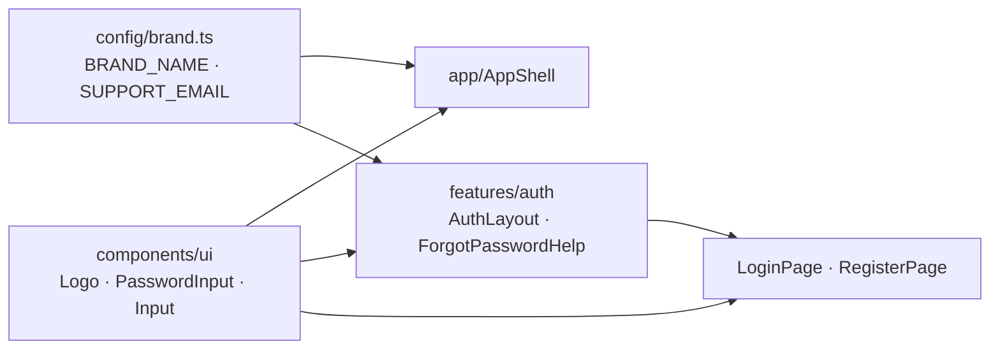
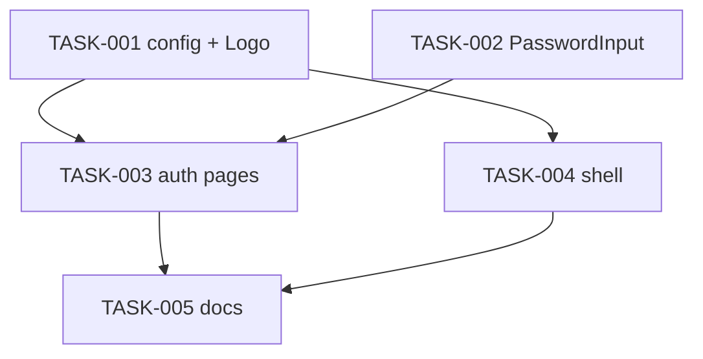

# Rebrand to Alma and restyle login, sign-up and the app shell — Architecture

| Field | Value |
|---|---|
| REQ | REQ-004 |
| Status | validated |
| Created | 2026-10-06 |
| Related ADRs | [[architecture/adr-01-ui-layer-headless-css-modules\|ADR-01]] (own primitives on CSS Modules + tokens) |

## Summary

Frontend only. The brand constants (`BRAND_NAME = 'Alma'`, the support email) move out of `app/` into a new leaf folder, `src/config/`, so that both `app/` and `features/auth` can import them; today `features/` may not import `app/`. Two new primitives are added in `components/ui/`:
- `Logo`: an inline SVG whose colours come from CSS-module classes on tokens, never the hex fills in the brand files.
- `PasswordInput`: an `Input` with a show/hide button.

`AuthLayout` becomes the designs' two-column frame: a brand panel plus a form column, with the panel hidden on phones. `LoginPage` and `RegisterPage` get the new markup and CSS, but their hooks, validators, mutations and error mapping are untouched. `LoginPage` gains the "Forgot password?" support message. The `AppShell` header follows S1, without nav links. No route, token, palette or backend change.

## Blast radius

| Path | Why touched | Risk |
|---|---|---|
| `packages/frontend/src/config/brand.ts` (new) | `BRAND_NAME`, `SUPPORT_EMAIL`, `PASSWORD_RESET_SUBJECT`, `supportMailto()` | low |
| `packages/frontend/src/config/README.md` (new) | folder rules: leaf, constants only, imports nothing internal | low |
| `packages/frontend/src/app/brand.ts` | deleted (moved to `config/`) | low |
| `packages/frontend/eslint.config.js` | `config/` may import nothing from `app`/`features`/`components`/`store`/`services` | med |
| `packages/frontend/scripts/enforcement.test.ts` | fixture proving the `config/` ban fires (L-REQ-001-4) | low |
| `packages/frontend/index.html` | `<title>Alma</title>`; favicon link unchanged (`/favicon.svg`) | low |
| `packages/frontend/public/favicon.svg` | replaced with `docs/design/brand/favicon.svg` | low |
| `packages/frontend/src/components/ui/Logo/` (new: tsx, css, test, index) | the brand mark + optional wordmark; `label` prop for its accessible name | low |
| `packages/frontend/src/components/ui/PasswordInput/` (new: tsx, css, test, index) | `Input` + toggle button; local `visible` state | med |
| `packages/frontend/src/components/ui/Input/Input.tsx`, `.module.css` | optional `endAdornment?: ReactNode` inside the field, and `labelAction?: ReactNode` on the label row | med |
| `packages/frontend/src/components/ui/README.md` | lists Logo, PasswordInput | low |
| `packages/frontend/src/features/auth/AuthLayout.tsx`, `.module.css` | two-column layout, brand panel (logo, tagline, 3 neutral points), phone stack | med |
| `packages/frontend/src/features/auth/LoginPage.tsx`, `.module.css` | design markup; `PasswordInput`; "Forgot password?" disclosure | med |
| `packages/frontend/src/features/auth/ForgotPasswordHelp.tsx` (new) + test | the AC5 message and `mailto:` link | low |
| `packages/frontend/src/features/auth/RegisterPage.tsx`, `.module.css` | design markup; `PasswordInput` | med |
| `packages/frontend/src/features/auth/LoginPage.test.tsx`, `RegisterPage.test.tsx` | add AC5/AC6 cases; existing ones unchanged | low |
| `packages/frontend/src/app/AppShell/AppShell.tsx`, `.module.css`, `HeaderAuth.tsx` | S1 header: `Logo`, account menu, theme toggle; no nav | med |
| `packages/frontend/src/app/AppShell/AppShell.test.tsx` | `'Alumni Network'` → `'Alma'` (3 assertions, lines 138/173/183) | low |
| `packages/frontend/src/styles/contrast.test.ts` | add any new fg/bg pair the restyle introduces (L-REQ-001-6) | low |
| `packages/frontend/README.md`, `CLAUDE.md`, `.adlc/context/conventions.md` | brand name, `config/` folder + boundary, new primitives | low |

About 25 files, all inside `packages/frontend` plus two docs. No backend file.

## Approach

**Brand constants in a leaf folder.** `src/config/brand.ts` exports `BRAND_NAME = 'Alma'`, `SUPPORT_EMAIL = 'support@alma.app'`, `PASSWORD_RESET_SUBJECT = 'Password reset request'`, and a pure `supportMailto(subject)` that returns `mailto:${SUPPORT_EMAIL}?subject=${encodeURIComponent(subject)}`. `config/` is a leaf: lint bans it from importing `app`, `features`, `components`, `store` and `services`, and bans `components/ui` from importing `config` (ui stays prop-driven: Logo takes its `label` as a prop). Docs state exactly this list (ADV-007). The ESLint boundary block plus an enforcement fixture make the rule real, as with the other layers (L-REQ-001-4). This is why `app/brand.ts` moves: `features/auth/AuthLayout` needs the name too, and features may not import `app/`.

**Logo without hex.** `components/ui/Logo` renders the mark's geometry from `docs/design/brand/alma-mark.svg`:
- The rounded square takes `class={styles.mark}`, styled `fill: var(--accent)`.
- The "A" stroke takes `stroke: var(--accent-ink)`.
- An optional wordmark `` (not SVG `<text>`) uses `font: var(--text-heading-sm)` and `color: currentColor`.

Props are `label: string` (accessible name, or wordmark text), `showWordmark?: boolean`, `decorative?: boolean` (whole logo `aria-hidden`, for the auth panel) and `size?: 'sm' | 'md'`, with sizes as literal layout values per the "layout sizes stay literal" convention. The SVG is `aria-hidden`, and the wrapper carries `role="img"` + `aria-label` when there's no wordmark. The `accent-ink`-on-`accent` pair is already in `contrast.test.ts`.

**Favicon is the one hex exception.** `public/favicon.svg` is a static file the browser renders outside the page, so it can't read CSS variables. It is copied verbatim from `docs/design/brand/favicon.svg`. Stylelint and ESLint don't scan `public/`, and the convention gets a line saying the favicon is a design asset, not component code.

**PasswordInput.**
- `Input` gains `endAdornment?: ReactNode`, rendered after the `<input>` inside a new `.control` wrapper. The wrapper is relative, `width: 100%`, `min-width: 0`, and the input keeps `width: 100%` / `box-sizing: border-box`, so password and email fields stay the same width. The input gets right padding only when an adornment exists. `Input` also gains `labelAction?: ReactNode`, rendered at the end of a label row (flex, space-between) after the `<label>`, so "Forgot password?" sits on the password label row as in the design (ADV-004). Label, error and helper wiring is unchanged, so existing Input tests stay valid.
- `PasswordInput` = `Input` with `type={visible ? 'text' : 'password'}` plus a `<button type="button" aria-label={visible ? 'Hide password' : 'Show password'}>` holding an inline eye or eye-off icon (`currentColor`). There is no `aria-pressed`: a name that flips together with a pressed state is the known anti-pattern, and AC6 asks for the flipping name (ADV-003).
- It forwards every Input prop (`ref`, `error`, `autoComplete`), so pages swap `<Input type="password">` for `<PasswordInput>` and nothing else changes. Focus stays in the input after toggling, and the button is reachable by Tab.

**Auth frame.** `AuthLayout` keeps its props (`title`, `footer`, `children`) and gains no logic. Markup:
- `
` holds a plain `
` (not `<aside>`: it would be a complementary landmark nested in `<main>`, ADV-005). It holds a **decorative** Logo with wordmark (no accessible name; the header already names the app), a tagline, and three neutral points.
- A `<section aria-labelledby>` form column follows, with the h1, children and footer link.

Desktop (≥ 60rem) is a two-column grid at 45/55. Below that the panel is hidden. There is no second, compact logo: the shell header already shows it (ADV-006). Panel copy is shared (AC3):
- tagline "Stay close to the people you studied with."
- points "Find classmates and mentors in your field" · "Share news with your alumni network" · "Your profile is visible only to signed-in members".

None of this states a count. The panel background is a gate decision (Open questions).

**Pages.** `LoginPage` and `RegisterPage` keep their state, validators, `useLogin`/`useRegister`, `authErrors` mapping, focus-on-error and submit flow line for line. Only the JSX structure, class names and the password field change. `RegisterPage` keeps its Student/Alumni `SegmentedControl` and conditional fields. `LoginPage` adds `ForgotPasswordHelp` next to the password field:
- a `<button type="button" aria-expanded aria-controls>` labelled "Forgot password?"
- a region that, when open, shows the AC5 sentence with `<a href={supportMailto(PASSWORD_RESET_SUBJECT)}>{SUPPORT_EMAIL}</a>`.

There is no navigation and no request. The sign-up design's "Forgot password?" next to the password field is **not** carried over: it makes no sense on sign-up.

**Shell.** `AppShell` replaces `{BRAND_NAME}` with `<Link to="/"><Logo label={BRAND_NAME} showWordmark /></Link>`. The header layout follows S1: logo left; account menu (`HeaderAuth`, unchanged behaviour) and `ThemeToggle` right; hairline under the header; S1 spacing in tokens. There are no nav links (AC7). The `<a>` keeps the current accessible text "Alma", so the brand test assertions only change text.

## Task DAG

### Tier 0
- `TASK-001`: `config/brand.ts` + boundary lint + enforcement fixture; delete `app/brand.ts`; title + favicon; `Logo` primitive
- `TASK-002`: `Input` `endAdornment` + `PasswordInput` primitive

### Tier 1
- `TASK-003`: `AuthLayout` frame + `LoginPage` (incl. `ForgotPasswordHelp`) + `RegisterPage` restyle (depends on TASK-001, TASK-002)
- `TASK-004`: `AppShell` header to S1 + brand test text (depends on TASK-001)

### Tier 2
- `TASK-005`: docs (`README.md`, `CLAUDE.md`, `conventions.md`, folder READMEs) (depends on TASK-001..004)

## Test strategy

| File | Covers |
|---|---|
| `components/ui/Logo/Logo.test.tsx` (new) | accessible name with and without wordmark; no hex in rendered markup |
| `components/ui/PasswordInput/PasswordInput.test.tsx` (new) | AC6: toggles `type`; name flips Show/Hide; no `aria-pressed`; keyboard (Tab to button, Enter/Space); focus stays in the input; error/label wiring passes through |
| `components/ui/Input/Input.test.tsx` | existing cases unchanged + one for `endAdornment` |
| `features/auth/ForgotPasswordHelp.test.tsx` (new) | AC5: collapsed by default; expands on click/Enter; exact message; `href` is `mailto:support@alma.app?subject=Password%20reset%20request`; `aria-expanded` |
| `LoginPage.test.tsx`, `RegisterPage.test.tsx` | existing cases unchanged (proves AC4); one case each that the password field has a show/hide button |
| `app/AppShell/AppShell.test.tsx` | only the 3 brand-text assertions change; one asserts no nav landmark/links |
| `scripts/enforcement.test.ts` | `config/` importing `@/app` / `@/features` is a lint error |
| `src/styles/contrast.test.ts` | any new pair (e.g. panel text on the chosen panel surface) |
| guard tests | `generate-tokens`, `contrast`, `enforcement`, `themeAtom` stay green |

Done means the frontend's `npm run typecheck`, `npm run lint`, `npm run format:check` and `npm test` all pass. A grep for `Alumni Network` in `packages/frontend` returns nothing, and a grep for `#[0-9a-f]{3,6}` in `src/` finds only `tokens.css`.

## Convention alignment

- ADR-01: own primitives, CSS Modules on tokens; Base UI isn't needed (a toggle button and a disclosure are plain HTML).
- Tokens only: colours, spacing and type use `var(--…)`. Layout sizes (panel split, breakpoints, logo px size) stay literal per the "layout sizes stay literal" rule.
- Import boundaries: new `config/` leaf, lint-enforced with a fixture (L-REQ-001-4). `components/ui` stays prop-driven.
- Forms (ADR-04): untouched; `PasswordInput` is a drop-in for `Input`.
- **Deviations from the designs**, by decision: no nav links (AC7); no "Remember me"; neutral copy instead of counts; no "Forgot password?" on sign-up; auth pages stay inside the shell header (no route change, AC4). The login design is a full-bleed page without the app header. Because logic and tests stay as they are, the pages also keep (ADV-008):
  - today's headings ("Log in" / "Sign up", not "Create your account"); the region name is what tests find
  - today's error presentation (per-field errors + the existing alert), not the sign-up design's summary banner
  - the busy button label "Log in" with the Button `loading` state, not "Logging in…"
  - error input styling from the existing `Input` (no new error tint)

## Risks

| Risk | Likelihood | Mitigation |
|---|---|---|
| Two existing tests assert "exactly one button" (LoginPage.test:147, RegisterPage.test:166); AC5/AC6 add buttons | certain | Narrow both to "exactly one submit button"; named in AC4 (ADV-001). |
| Restyle changes accessible names or roles that existing auth tests rely on | med | Keep every label, button text, heading and alert role; only class names and wrappers change. Run the auth tests after each page. |
| New text/background pairs fail WCAG (L-REQ-001-6) | med | Add every new pair to `contrast.test.ts`; sweep all uses if a token pair changes. |
| `endAdornment` padding overlaps long input values or breaks at 200% zoom | low | Padding only when an adornment exists; button sized in rem; check at 360px and 200%. |
| `config/` boundary lint has a gap (relative vs alias import) | low | Both forms in the fixture, as the other boundaries do. |
| Favicon hex flagged later as a token violation | low | Documented as the one design-asset exception; outside the linted `src/`. |

## Stress-test outcome

Full pass (trigger: UI surface + large blast radius). 8 findings: 1 critical, 2 major, 5 minor, all handled:

| Finding | Action |
|---|---|
| ADV-001 (critical): "exactly one button" tests break | **Fixed in the plan:** AC4 now names the two narrowed assertions; TASK-003 does it. **Needs your OK** (your brief said tests unchanged). |
| ADV-002 (major): TASK-001 breaks AppShell brand tests before TASK-004 | **Fixed:** the 3 brand assertions move into TASK-001 |
| ADV-003 (major): `aria-pressed` + flipping name; `.control` width; focus test | **Fixed:** no `aria-pressed`; `.control` full width; test focuses the input first |
| ADV-004 (major): "Forgot password?" has no slot on the label row | **Fixed:** `Input` gains `labelAction`; test compares `textContent` |
| ADV-005: `<aside>` nested in `<main>` | **Fixed:** plain `div` |
| ADV-006: logo shown 2–3 times; hidden logos stay in the a11y tree in tests | **Fixed:** panel logo decorative; no compact phone logo |
| ADV-007: config/ docs vs lint mismatch | **Fixed:** exact ban list in docs; ui → config ban added |
| ADV-008: design states the pages won't carry | **Accepted + documented** under Deviations |

## Decisions (architect gate, 2026-10-06)

- Brand panel: `--surface-sunken` with `--ink-*` text on both pages and both themes. The login design's near-black panel is not used, and there are no new tokens.
- Auth pages stay inside `AppShell` (header with logo, Log in/Sign up, theme toggle); no router change.
- The two "exactly one button" assertions are narrowed to "exactly one submit button" (ADV-001).

## Revision (implement gate, 2026-10-06)

The user asked for the login and sign-up layout to follow the login design more closely. This reverses two architect-gate decisions:
- Auth pages leave `AppShell`. They render without the app header, with only a theme toggle top-right.
- The form loses its `Card`.

**Routing.** `createRoutes` builds a path-less **root layout** at `/` (`app/RootLayout.tsx`, new). It mounts `useApplyTheme()` and `SessionBridge` **once for every page**, auth pages included: the expired-token drop, cache clear on token change, and the 401 → `/login` notice must keep working (ADR-03). It has the outer `errorElement` and two children:
1. `AuthShell` (`app/AuthShell/`, new): `<main>` + a top-right `ThemeToggle`, wrapping the inner error layer and the `GuestOnly` routes.
2. `AppShell` (header, minus `SessionBridge`/`useApplyTheme`): wraps the inner error layer, `RequireAuth` and `*`.

Test-provided `pageRoutes` keep going under `AppShell`, so existing route tests don't change. Two error layers remain on both branches (L-REQ-001-7).

**AuthLayout.** It is a full-height grid: `45fr 55fr` from 60rem, edge to edge, no radius, panel on `--surface-sunken`.
- The panel is a column with `justify-content: space-between`: Logo (named, since there's no header now) at the top; headline (`--text-heading-lg`) and the 3 neutral points in the middle; "© 2026 Alma" (`--text-caption`, `--ink-muted`) at the bottom.
- Below 60rem the panel collapses to its logo row only (same DOM node, so there's never a second logo); headline, points and footer are hidden.
- The form column centres a `max-width: 380px` block (literal layout size) with no Card or border. The heading `h1` (`--text-heading-md`) is followed directly by the prompt line (`New here? Create an account` / `Already have an account? Log in`), then the form. The footer link moves up there.
- `AuthLayout` gains an optional `headline` prop; login passes "Welcome back to your alumni network.", and sign-up passes "Stay connected with your alumni network." from its design.
- The h1 stays "Log in" / "Sign up" (tests find the region by it). The headline is a `
`, so the page keeps one h1 on every width.

**Theme toggle.** `AuthShell` renders the existing `ThemeToggle` top-right, absolutely positioned, with `--space-4`/`--space-5` insets. Its size and labels don't change.

**Tests.** Router, guard and session tests should pass unchanged, since `SessionBridge` still mounts once and the paths are the same. Add tests for: no `banner` landmark on `/login` and `/register`; one theme toggle there; the prompt link sits right after the h1; "© 2026 Alma" is in the panel.

**Browser check.** Once implemented, compare `/login` and `/register` (light and dark, 1440px and 390px) side by side with the design files, and fix layout differences.

## Revision 2 (implement gate, 2026-10-06)

User-requested, after the browser comparison:
1. **"Forgot password?" moves below the password field, right-aligned.** `ForgotPasswordHelp` renders after the `PasswordInput` (not as `labelAction`), and its message appears below it. If nothing else uses `Input`'s `labelAction`, remove the prop and its tests (no dead API).
2. **A compact theme toggle on auth pages.** `ThemeToggle` gains `variant?: 'full' | 'compact'` (default `full`, which `AppShell` keeps). Compact renders icon-only segments: sun, moon, and monitor (inline SVG, `currentColor`). Each keeps the accessible name "Light" / "Dark" / "System" via `aria-label`, so existing role/name queries still work. A **Base UI Tooltip** shows that name on hover and focus (ADR-01: Base UI for behaviour; already a dependency). `AuthShell` uses `variant="compact"`.
3. **Email placeholder** "you@university.edu" on the login and sign-up email fields.
4. **Input height ≈ the design's 41px, tokens only.** `Input` padding goes `--space-3` → `--space-2` (block) and line-height → `--text-body-sm-line` (22px), font size staying `--text-body` (16px, so iOS doesn't zoom on focus): 40px total. The design's literal 11px has no token. `Input` is only used on auth pages today, so this is safe app-wide. The adornment stays vertically centred.

Browser check: login and sign-up in light mode at 1440px and at phone width.

## Related

- Spec: REQ-004
- Concepts: [[concepts/design-tokens]]
- Components: [[knowledge/components/frontend]]
- Lessons checked: [[knowledge/lessons/LESSON-REQ-001-4-import-boundary-lint-must-match-docs|L-REQ-001-4]], [[knowledge/lessons/LESSON-REQ-001-5-css-modules-only-no-inline-styles|L-REQ-001-5]], [[knowledge/lessons/LESSON-REQ-001-6-contrast-changes-sweep-all-uses|L-REQ-001-6]], [[knowledge/lessons/LESSON-REQ-002-7-restore-focus-after-failed-submit|L-REQ-002-7]] (focus after failed submit must survive the restyle), [[knowledge/lessons/LESSON-REQ-002-6-docs-task-lists-every-folder-readme|L-REQ-002-6]]
- Gotchas: [[knowledge/gotchas#^g04|G04]] (Stylelint numbers, `:where()`), [[knowledge/gotchas#^g10|G10]] (type-aware lint)
- ADRs: [[architecture/adr-01-ui-layer-headless-css-modules|ADR-01]], [[architecture/adr-04-forms-without-a-library|ADR-04]]
