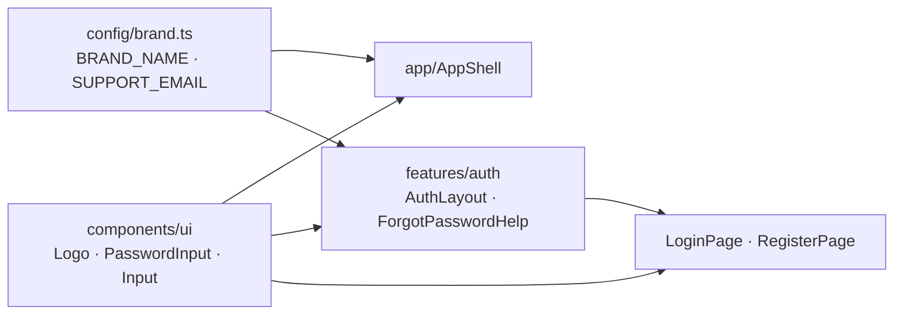
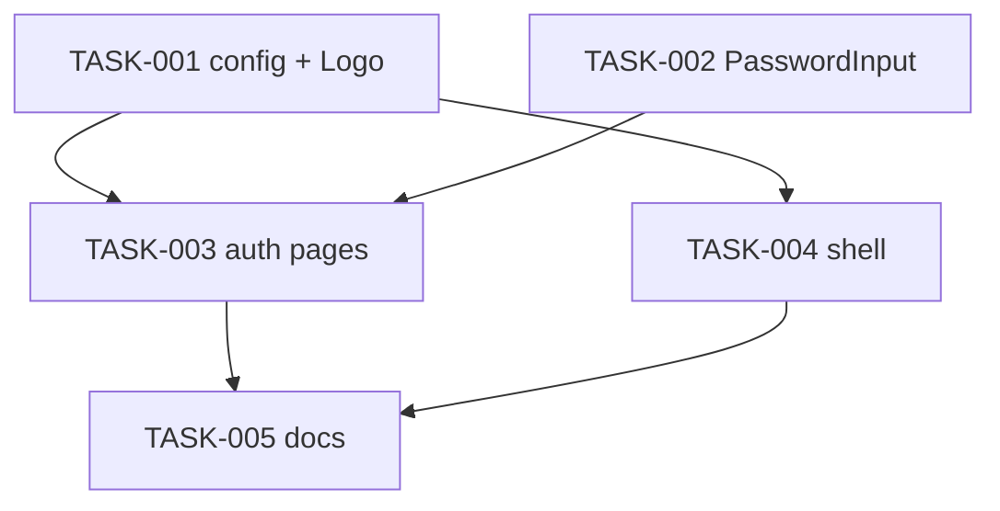

# REQ-004-alma-rebrand-auth-shell — Review Packet

`Packet: 98KB · round 2 · 13 files in this round`

This packet contains the diff with full file context, the REQ spec, the REQ architecture, and the exploration report's blast radius and vault references. **Do not re-read these via Read — cite this packet.**

**Your own required reading is not a packet gap.** `context/conventions.md`, the vault (lessons, gotchas, ADRs, concepts), and any source file outside the diff that this change interacts with are your mandate. Read them freely; do not report them.

**`Packet-gap` means the packet's own contents fell short** — the diff, spec, or architecture was missing or insufficient for a call you had to make. Then, and only then, add `**Packet-gap:** <path> — <why the packet didn't cover it>` to your section.

Note: the architecture has a base design plus two "Revision" sections decided at the implement gate; the revisions win where they conflict. The REQ was committed as one commit (c0318e3f).

## Round 2 — what changed since round 1

| ID | Disposition | Fixed by |
|---|---|---|
| M1 | fixed | PasswordInput icon --ink-secondary (hover --ink-primary); pair in contrast.test.ts at NON_TEXT |
| m1 | fixed | 3 SegmentedControl tests (icon option, mixed set, tooltip on focus) |
| m2 | fixed | © year from new Date().getFullYear(); LoginPage/RegisterPage tests compute it |
| m3 | fixed | compact segments ≥ 2.5rem, --space-1 gap via .track:has(.iconOption) |
| m4 | fixed | AuthShell .toggle position: fixed from 60rem |
| m5 | fixed | redundant color: inherit removed |
| t1 | fixed | tooltip delay commented; AuthShell doc comment; index.html title test in config/brand.test.ts; AuthLayout phone top padding recalculated (not dropped) because the 3rem toggle would touch the logo |
| M2, m6–m9, t2 | needs decision / wrap-up | not in this round |

Round 1 is committed as c0318e3f; this diff is the uncommitted working tree vs that commit.

## Diff with full context (round 2, vs c0318e3f)

```diff
diff --git a/packages/frontend/src/app/AuthShell/AuthShell.module.css b/packages/frontend/src/app/AuthShell/AuthShell.module.css
index caa839a2..962842ae 100644
--- a/packages/frontend/src/app/AuthShell/AuthShell.module.css
+++ b/packages/frontend/src/app/AuthShell/AuthShell.module.css
@@ -1,33 +1,42 @@
 /* Auth page frame: full height, no header. The theme toggle sits in the
-   top-right corner, above the page; the page itself fills <main>. */
+   top-right corner, above the page; the page itself fills <main>. On phones
+   it scrolls away with the page (the page clears room for it under the
+   toggle); from 60rem it is fixed, so it stays put beside the pinned brand
+   panel while a long form (sign-up) scrolls. */
 
 .shell {
   position: relative;
   display: flex;
   flex-direction: column;
   min-height: 100vh;
 }
 
 .toggle {
   position: absolute;
   top: var(--space-4);
   right: var(--space-4);
   z-index: 1;
 }
 
 .main {
   display: flex;
   flex: 1;
   flex-direction: column;
 }
 
 .main:focus {
   outline: none;
 }
 
 @media (width >= 48rem) {
   .toggle {
     top: var(--space-5);
     right: var(--space-5);
   }
 }
+
+@media (width >= 60rem) {
+  .toggle {
+    position: fixed;
+  }
+}
diff --git a/packages/frontend/src/app/AuthShell/AuthShell.tsx b/packages/frontend/src/app/AuthShell/AuthShell.tsx
index 5536aef3..74119269 100644
--- a/packages/frontend/src/app/AuthShell/AuthShell.tsx
+++ b/packages/frontend/src/app/AuthShell/AuthShell.tsx
@@ -1,26 +1,25 @@
 import { useAtom } from 'jotai';
 import { Outlet } from 'react-router';
 import { ThemeToggle } from '@/components/ui/ThemeToggle';
 import { themePreferenceAtom } from '@/store/themeAtom';
 import styles from './AuthShell.module.css';
 
 /**
  * Layout route for /login and /register: no app header, only the compact
- * (icon-only) theme toggle
- * in the top-right corner over a full-height page (docs/design/screens/login).
- * No skip link: there is no header to skip.
+ * (icon-only) theme toggle in the top-right corner over a full-height page
+ * (docs/design/screens/login). No skip link: there is no header to skip.
  */
 export function AuthShell() {
   const [preference, setPreference] = useAtom(themePreferenceAtom);
 
   return (
     <div className={styles.shell}>
       <div className={styles.toggle}>
         <ThemeToggle value={preference} onValueChange={setPreference} variant="compact" />
       </div>
       <main id="main" tabIndex={-1} className={styles.main}>
         <Outlet />
       </main>
     </div>
   );
 }
diff --git a/packages/frontend/src/components/ui/Logo/Logo.module.css b/packages/frontend/src/components/ui/Logo/Logo.module.css
index b8f875b1..953f228b 100644
--- a/packages/frontend/src/components/ui/Logo/Logo.module.css
+++ b/packages/frontend/src/components/ui/Logo/Logo.module.css
@@ -1,33 +1,31 @@
 /* Design: docs/design/brand/alma-mark.svg. The file's hex fills are replaced
    by tokens so the mark follows the theme. Mark sizes are literal layout sizes. */
 
 .logo {
   display: inline-flex;
   align-items: center;
   gap: var(--space-2);
-  color: inherit;
 }
 
 .svg {
   flex: none;
   width: 1.75rem;
   height: 1.75rem;
 }
 
 .logo[data-size='md'] .svg {
   width: 2.25rem;
   height: 2.25rem;
 }
 
 .mark {
   fill: var(--accent);
 }
 
 .glyph {
   stroke: var(--accent-ink);
 }
 
 .wordmark {
   font: var(--text-heading-sm);
-  color: inherit;
 }
diff --git a/packages/frontend/src/components/ui/PasswordInput/PasswordInput.module.css b/packages/frontend/src/components/ui/PasswordInput/PasswordInput.module.css
index 0b9d70f1..1d4317d1 100644
--- a/packages/frontend/src/components/ui/PasswordInput/PasswordInput.module.css
+++ b/packages/frontend/src/components/ui/PasswordInput/PasswordInput.module.css
@@ -1,33 +1,36 @@
 /* The show/hide button inside a PasswordInput. Square, sized in rem so it
    scales with zoom; Input reserves end padding for it (.withAdornment). */
 
 .toggle {
   appearance: none;
   display: inline-flex;
   align-items: center;
   justify-content: center;
   inline-size: 2.5rem;
   block-size: 2.5rem;
   padding: 0;
   border: 0;
   border-radius: var(--radius-sm);
   background: transparent;
-  color: var(--ink-muted);
+
+  /* ink-secondary, not ink-muted: the icon is the control's only visible
+     cue and ink-muted on the sunken fill is under 3:1 in the light theme. */
+  color: var(--ink-secondary);
   cursor: pointer;
   transition: color var(--duration-fast) var(--easing-standard);
 }
 
 /* :where() keeps the hover at single-class weight (G04). */
 .toggle:where(:hover) {
-  color: var(--ink-secondary);
+  color: var(--ink-primary);
 }
 
 .icon {
   inline-size: 1.25rem;
   block-size: 1.25rem;
   fill: none;
   stroke: currentcolor;
   stroke-width: 2;
   stroke-linecap: round;
   stroke-linejoin: round;
 }
diff --git a/packages/frontend/src/components/ui/SegmentedControl/SegmentedControl.module.css b/packages/frontend/src/components/ui/SegmentedControl/SegmentedControl.module.css
index 4232fb1f..28facbe4 100644
--- a/packages/frontend/src/components/ui/SegmentedControl/SegmentedControl.module.css
+++ b/packages/frontend/src/components/ui/SegmentedControl/SegmentedControl.module.css
@@ -1,95 +1,104 @@
 /* Design: docs/design/design-system/components/ThemeToggle (generalised in
    REQ-002). Pill track with a raised segment for the current choice. The raised
    segment alone is ~1.2:1 against the track, so the checked option is also
    marked by its text: ink-primary and the heavier heading weight. Each option
    reserves the width of its bold label (see ::after) so the pill does not
    change width when the selection moves. */
 
 .track {
   display: inline-flex;
   gap: calc(var(--space-1) / 2);
   padding: calc(var(--space-1) - 1px);
   background: var(--surface-sunken);
   border: 1px solid var(--border-subtle);
   border-radius: var(--radius-pill);
 }
 
 .option {
   display: inline-grid;
   place-items: center;
   padding: var(--space-1) var(--space-3);
   border: 1px solid transparent;
   border-radius: var(--radius-pill);
   background: transparent;
   color: var(--ink-secondary);
   font: var(--text-label);
   cursor: pointer;
   user-select: none;
   transition:
     background-color var(--duration-fast) var(--easing-standard),
     color var(--duration-fast) var(--easing-standard);
 }
 
 /* A hidden, zero-height copy of the label at the checked weight, stacked under
    the real text in the grid: the option is always as wide as its bold label.
    The empty alt text keeps it out of the accessible name. */
 .option::after {
   content: attr(data-label) / '';
   height: 0;
   overflow: hidden;
   visibility: hidden;
   font-weight: var(--text-heading-sm-weight);
   pointer-events: none;
 }
 
 .option:hover {
   color: var(--ink-primary);
 }
 
 .option[data-checked] {
   background: var(--surface-raised);
   border-color: var(--border-subtle);
   color: var(--ink-primary);
   font-weight: var(--text-heading-sm-weight);
 }
 
 .option:focus-visible {
   outline: 2px solid var(--accent);
   outline-offset: 2px;
 }
 
 @media (prefers-reduced-motion: reduce) {
   .option {
     transition: none;
   }
 }
 
-/* Icon-only segment (option.icon): square padding, no reserved label width.
-   The icon is decorative and sized in rem so it scales with zoom. */
+/* Icon-only segment (option.icon, the compact ThemeToggle): square padding,
+   no reserved label width. The icon is decorative and sized in rem so it
+   scales with zoom. Each segment is at least 2.5rem square and the segments
+   sit --space-1 apart, so the pill works as a touch target in a phone's
+   corner. Text-only tracks keep their tighter gap. */
+.track:has(.iconOption) {
+  gap: var(--space-1);
+}
+
 .iconOption {
-  padding: var(--space-1);
+  min-inline-size: 2.5rem;
+  min-block-size: 2.5rem;
+  padding: var(--space-2);
 }
 
 .iconOption::after {
   content: none;
 }
 
 .iconOption svg {
   inline-size: 1.25rem;
   block-size: 1.25rem;
 }
 
 /* The icon option's name, shown on hover and focus. Flat like Menu: a raised
    surface with a hairline border and no shadow. */
 .tooltipPositioner {
   z-index: 10;
 }
 
 .tooltip {
   padding: var(--space-1) var(--space-2);
   background: var(--surface-raised);
   border: 1px solid var(--border-subtle);
   border-radius: var(--radius-sm);
   color: var(--ink-primary);
   font: var(--text-caption);
 }
diff --git a/packages/frontend/src/components/ui/SegmentedControl/SegmentedControl.test.tsx b/packages/frontend/src/components/ui/SegmentedControl/SegmentedControl.test.tsx
index b1fe5315..96deadc9 100644
--- a/packages/frontend/src/components/ui/SegmentedControl/SegmentedControl.test.tsx
+++ b/packages/frontend/src/components/ui/SegmentedControl/SegmentedControl.test.tsx
@@ -1,115 +1,182 @@
 import { useState } from 'react';
 import { render, screen } from '@testing-library/react';
 import userEvent from '@testing-library/user-event';
 import { describe, expect, it, vi } from 'vitest';
 import { SegmentedControl } from './SegmentedControl';
 
 type Role = 'student' | 'alumni';
 
 const OPTIONS = [
   { value: 'student', label: 'Student' },
   { value: 'alumni', label: 'Alumni' },
 ] as const;
 
 function Controlled({ onChange }: { onChange: (value: Role) => void }) {
   const [value, setValue] = useState<Role>('student');
   return (
     <SegmentedControl<Role>
       label="I am a…"
       options={OPTIONS}
       value={value}
       onValueChange={(next) => {
         setValue(next);
         onChange(next);
       }}
     />
   );
 }
 
 describe('SegmentedControl', () => {
   it('renders a named radiogroup with one radio per option, in order', () => {
     render(
       <SegmentedControl<Role>
         label="I am a…"
         options={OPTIONS}
         value="alumni"
         onValueChange={vi.fn()}
       />,
     );
 
     expect(screen.getByRole('radiogroup', { name: 'I am a…' })).toBeInTheDocument();
     // Query by role: Base UI also renders hidden native inputs (G05).
     expect(screen.getAllByRole('radio').map((radio) => radio.textContent)).toEqual([
       'Student',
       'Alumni',
     ]);
     expect(screen.getByRole('radio', { name: 'Alumni' })).toHaveAttribute('aria-checked', 'true');
     expect(screen.getByRole('radio', { name: 'Student' })).toHaveAttribute('aria-checked', 'false');
   });
 
   it('reserves the bold label width through data-label', () => {
     render(
       <SegmentedControl<Role>
         label="I am a…"
         options={OPTIONS}
         value="student"
         onValueChange={vi.fn()}
       />,
     );
 
     expect(screen.getByRole('radio', { name: 'Student' })).toHaveAttribute('data-label', 'Student');
   });
 
   it('calls onValueChange on click and stays controlled', async () => {
     const user = userEvent.setup();
     const onValueChange = vi.fn();
     render(
       <SegmentedControl<Role>
         label="I am a…"
         options={OPTIONS}
         value="student"
         onValueChange={onValueChange}
       />,
     );
 
     await user.click(screen.getByRole('radio', { name: 'Alumni' }));
 
     expect(onValueChange).toHaveBeenCalledTimes(1);
     expect(onValueChange).toHaveBeenCalledWith('alumni');
     expect(screen.getByRole('radio', { name: 'Student' })).toHaveAttribute('aria-checked', 'true');
   });
 
   it('Tab reaches the checked option and arrow keys move the selection', async () => {
     const user = userEvent.setup();
     const onChange = vi.fn();
     render(<Controlled onChange={onChange} />);
 
     await user.tab();
     expect(screen.getByRole('radio', { name: 'Student' })).toHaveFocus();
 
     await user.keyboard('{ArrowRight}');
     expect(onChange).toHaveBeenLastCalledWith('alumni');
     expect(screen.getByRole('radio', { name: 'Alumni' })).toHaveFocus();
     expect(screen.getByRole('radio', { name: 'Alumni' })).toHaveAttribute('aria-checked', 'true');
 
     await user.keyboard('{ArrowLeft}');
     expect(onChange).toHaveBeenLastCalledWith('student');
     expect(screen.getByRole('radio', { name: 'Student' })).toHaveFocus();
   });
 
   it('passes className to the track', () => {
     render(
       <SegmentedControl<Role>
         label="I am a…"
         options={OPTIONS}
         value="student"
         onValueChange={vi.fn()}
         className="extra"
       />,
     );
 
     const group = screen.getByRole('radiogroup', { name: 'I am a…' });
     expect(group).toHaveClass('track');
     expect(group).toHaveClass('extra');
   });
+
+  describe('icon options', () => {
+    type View = 'list' | 'grid';
+
+    const ICON_OPTIONS = [
+      { value: 'list', label: 'List', icon: <svg data-testid="list-icon" aria-hidden="true" /> },
+      { value: 'grid', label: 'Grid', icon: <svg data-testid="grid-icon" aria-hidden="true" /> },
+    ] as const;
+
+    it('names an icon option by its label and shows only the icon', () => {
+      render(
+        <SegmentedControl<View>
+          label="View"
+          options={ICON_OPTIONS}
+          value="grid"
+          onValueChange={vi.fn()}
+        />,
+      );
+
+      const list = screen.getByRole('radio', { name: 'List' });
+      expect(list).toHaveTextContent('');
+      expect(list).toContainElement(screen.getByTestId('list-icon'));
+      expect(list).toHaveClass('iconOption');
+      expect(list).not.toHaveAttribute('data-label');
+      expect(screen.getByRole('radio', { name: 'Grid' })).toHaveAttribute('aria-checked', 'true');
+      // The label is not on screen until the tooltip opens.
+      expect(screen.queryByText('List')).not.toBeInTheDocument();
+    });
+
+    it('mixes icon and text options in one group, in order', async () => {
+      const user = userEvent.setup();
+      const onValueChange = vi.fn();
+      render(
+        <SegmentedControl<View>
+          label="View"
+          options={[ICON_OPTIONS[0], { value: 'grid', label: 'Grid' }]}
+          value="list"
+          onValueChange={onValueChange}
+        />,
+      );
+
+      expect(screen.getAllByRole('radio').map((radio) => radio.textContent)).toEqual(['', 'Grid']);
+      expect(screen.getByRole('radio', { name: 'List' })).toHaveClass('iconOption');
+      const grid = screen.getByRole('radio', { name: 'Grid' });
+      expect(grid).not.toHaveClass('iconOption');
+      expect(grid).toHaveAttribute('data-label', 'Grid');
+
+      await user.click(grid);
+      expect(onValueChange).toHaveBeenCalledWith('grid');
+    });
+
+    it('shows the label in a tooltip when an icon option gets keyboard focus', async () => {
+      const user = userEvent.setup();
+      render(
+        <SegmentedControl<View>
+          label="View"
+          options={ICON_OPTIONS}
+          value="grid"
+          onValueChange={vi.fn()}
+        />,
+      );
+
+      await user.tab();
+      expect(screen.getByRole('radio', { name: 'Grid' })).toHaveFocus();
+      expect(await screen.findByText('Grid')).toBeVisible();
+    });
+  });
 });
diff --git a/packages/frontend/src/components/ui/SegmentedControl/SegmentedControl.tsx b/packages/frontend/src/components/ui/SegmentedControl/SegmentedControl.tsx
index ac5fe2d8..8f5a5581 100644
--- a/packages/frontend/src/components/ui/SegmentedControl/SegmentedControl.tsx
+++ b/packages/frontend/src/components/ui/SegmentedControl/SegmentedControl.tsx
@@ -1,92 +1,95 @@
 import type { ReactNode } from 'react';
 import { Radio } from '@base-ui/react/radio';
 import { RadioGroup } from '@base-ui/react/radio-group';
 import { Tooltip } from '@base-ui/react/tooltip';
 import { cx } from '../cx';
 import styles from './SegmentedControl.module.css';
 
 export interface SegmentedControlOption<T extends string> {
   value: T;
   /** Visible text, or with `icon` the option's accessible name and tooltip. */
   label: string;
   /**
    * Shows this icon instead of the label text (decorative: mark it
    * aria-hidden). The label still names the option and appears in a tooltip
    * on hover and focus.
    */
   icon?: ReactNode;
 }
 
 export interface SegmentedControlProps<T extends string> {
   /** Accessible name for the radio group. */
   label: string;
   options: readonly SegmentedControlOption<T>[];
   value: T;
   onValueChange: (value: T) => void;
   className?: string;
 }
 
 /**
  * Controlled single choice shown as a pill of segments. A radio group under
  * the hood: Tab reaches the checked option, arrow keys move and select.
  */
 export function SegmentedControl<T extends string>({
   label,
   options,
   value,
   onValueChange,
   className,
 }: SegmentedControlProps<T>) {
   return (
     <RadioGroup<T>
       aria-label={label}
       value={value}
       onValueChange={(next) => {
         onValueChange(next);
       }}
       className={cx(styles.track, className)}
     >
       {options.map((option) =>
         option.icon === undefined ? (
           <Radio.Root<T>
             key={option.value}
             value={option.value}
             className={styles.option}
             // Read by the CSS ::after that reserves the bold label's width.
             data-label={option.label}
           >
             {option.label}
           </Radio.Root>
         ) : (
           <IconOption key={option.value} option={option} />
         ),
       )}
     </RadioGroup>
   );
 }
 
 /** An icon-only segment: named by aria-label, with the same text in a tooltip. */
 function IconOption<T extends string>({ option }: { option: SegmentedControlOption<T> }) {
   return (
     <Tooltip.Root>
+      {/* 300ms, half Base UI's 600ms default: the tooltip is the only visible
+          text for an icon segment, so it should come up sooner, but not for
+          a pointer that is only passing over the pill. */}
       <Tooltip.Trigger
         delay={300}
         render={
           <Radio.Root<T>
             value={option.value}
             aria-label={option.label}
             className={cx(styles.option, styles.iconOption)}
           />
         }
       >
         {option.icon}
       </Tooltip.Trigger>
       <Tooltip.Portal>
         {/* 4px = --space-1; Base UI takes the offset as a number. */}
         <Tooltip.Positioner sideOffset={4} className={styles.tooltipPositioner}>
           <Tooltip.Popup className={styles.tooltip}>{option.label}</Tooltip.Popup>
         </Tooltip.Positioner>
       </Tooltip.Portal>
     </Tooltip.Root>
   );
 }
diff --git a/packages/frontend/src/config/brand.test.ts b/packages/frontend/src/config/brand.test.ts
index fdc227d4..e064472c 100644
--- a/packages/frontend/src/config/brand.test.ts
+++ b/packages/frontend/src/config/brand.test.ts
@@ -1,15 +1,25 @@
 import { describe, expect, it } from 'vitest';
-import { PASSWORD_RESET_SUBJECT, SUPPORT_EMAIL, supportMailto } from './brand';
+import indexHtml from '../../index.html?raw';
+import { BRAND_NAME, PASSWORD_RESET_SUBJECT, SUPPORT_EMAIL, supportMailto } from './brand';
+
+// index.html is static, so its <title> can't import BRAND_NAME; this keeps the
+// two from drifting apart (same idea as the theme key test, G01).
+describe('index.html', () => {
+  it('uses BRAND_NAME as the tab title', () => {
+    const doc = new DOMParser().parseFromString(indexHtml, 'text/html');
+    expect(doc.title).toBe(BRAND_NAME);
+  });
+});
 
 describe('supportMailto', () => {
   it('builds a mailto link to the support address', () => {
     expect(supportMailto('Hi')).toBe(`mailto:${SUPPORT_EMAIL}?subject=Hi`);
   });
 
   it('URL-encodes the subject', () => {
     expect(supportMailto(PASSWORD_RESET_SUBJECT)).toBe(
       'mailto:support@alma.app?subject=Password%20reset%20request',
     );
     expect(supportMailto('a&b=c?')).toBe('mailto:support@alma.app?subject=a%26b%3Dc%3F');
   });
 });
diff --git a/packages/frontend/src/features/auth/AuthLayout.module.css b/packages/frontend/src/features/auth/AuthLayout.module.css
index b225cb4e..33141998 100644
--- a/packages/frontend/src/features/auth/AuthLayout.module.css
+++ b/packages/frontend/src/features/auth/AuthLayout.module.css
@@ -1,158 +1,164 @@
 /* Login and sign-up frame (docs/design/screens/login, signup), tokens only.
    Phones and narrow windows (incl. 200% zoom): the logo row, centred, then
    the form. From 60rem: a full-height grid, brand panel and form column at
    45/55, edge to edge. The panel is surface-sunken with ink text in both
    themes (architect-gate decision), not the design's dark panel. The design's
    24px/34px headings map to heading-md/heading-lg. Layout sizes stay literal. */
 
 .layout {
   display: grid;
   flex: 1;
   grid-template-columns: minmax(0, 1fr);
   align-content: start;
   gap: var(--space-6);
   padding-block-end: var(--space-6);
 }
 
-/* Narrow: only the logo row shows. The top padding clears the theme toggle. */
+/* Narrow: only the logo row shows. The top padding is here, not in
+   AuthShell, because it is the logo row that must clear AuthShell's theme
+   toggle: below ~27rem the centred logo and the top-right toggle share the
+   same columns, so the logo starts under the toggle (its top offset
+   --space-4, plus its 3rem height with 2.5rem segments, plus a --space-3
+   gap). From 60rem the panel has its own padding and the toggle sits over
+   the form column, so nothing is reserved there. */
 .panel {
   display: flex;
   flex-direction: column;
   align-items: center;
   min-width: 0;
-  padding: var(--space-8) var(--space-5) 0;
+  padding: calc(var(--space-4) + 3rem + var(--space-3)) var(--space-5) 0;
   color: var(--ink-primary);
 }
 
 .column {
   display: flex;
   justify-content: center;
   min-width: 0;
   padding-inline: var(--space-5);
 }
 
 /* No card or border: a plain centred block. */
 .form {
   display: flex;
   flex-direction: column;
   gap: var(--space-6);
   width: min(100%, 380px);
   min-width: 0;
 }
 
 .intro {
   display: flex;
   flex-direction: column;
   gap: var(--space-1);
   text-align: center;
 }
 
 .title {
   font: var(--text-heading-md);
   color: var(--ink-primary);
 }
 
 .prompt {
   font: var(--text-body-sm);
   color: var(--ink-secondary);
 }
 
 .link {
   color: var(--accent);
   font: var(--text-label);
 }
 
 .pitch {
   display: none;
   flex-direction: column;
   gap: var(--space-6);
 }
 
 .headline {
   /* Wraps after "your", as in the login design. */
   max-width: 20rem;
   font: var(--text-heading-lg);
   color: var(--ink-primary);
 }
 
 .points {
   display: flex;
   flex-direction: column;
   gap: var(--space-4);
   margin: 0;
   padding: 0;
   list-style: none;
 }
 
 .point {
   display: flex;
   align-items: flex-start;
   gap: var(--space-3);
   font: var(--text-body-sm);
   color: var(--ink-secondary);
 }
 
 /* ink-secondary, not the design's muted grey: ink-muted on surface-sunken is
    under 4.5:1 in the light theme. */
 .copyright {
   display: none;
   font: var(--text-caption);
   color: var(--ink-secondary);
 }
 
 /* A bullet, not information: the text beside it says everything. As tall as
    one text line, so the mark centres on the first line however the text wraps. */
 .check {
   flex: none;
   width: 1.125rem;
   height: var(--text-body-sm-line);
   fill: none;
   stroke: var(--accent);
   stroke-width: 2;
   stroke-linecap: round;
   stroke-linejoin: round;
 }
 
 @media (width >= 60rem) {
   .layout {
     grid-template-columns: minmax(0, 45fr) minmax(0, 55fr);
     align-content: stretch;
     gap: 0;
     padding-block-end: 0;
   }
 
   /* Pinned to the viewport, so the logo and the copyright line stay put
      while a long form (sign-up) scrolls past. */
   .panel {
     position: sticky;
     top: 0;
     align-self: start;
     align-items: stretch;
     justify-content: space-between;
     gap: var(--space-7);
     min-height: 100vh;
     padding: var(--space-7);
     background: var(--surface-sunken);
   }
 
   .pitch {
     display: flex;
   }
 
   .copyright {
     display: block;
   }
 
   .logo {
     align-self: flex-start;
   }
 
   .column {
     align-items: center;
     padding: var(--space-7);
   }
 
   .intro {
     text-align: start;
   }
 }
diff --git a/packages/frontend/src/features/auth/AuthLayout.tsx b/packages/frontend/src/features/auth/AuthLayout.tsx
index 1dc8b5bb..ecd71c4c 100644
--- a/packages/frontend/src/features/auth/AuthLayout.tsx
+++ b/packages/frontend/src/features/auth/AuthLayout.tsx
@@ -1,95 +1,95 @@
 import { useId, type ReactNode } from 'react';
 import { Link } from 'react-router';
 import { Logo } from '@/components/ui/Logo';
 import { BRAND_NAME } from '@/config/brand';
 import styles from './AuthLayout.module.css';
 
 export interface AuthLayoutFooter {
   /** Plain lead-in, e.g. "New here?". */
   prompt: string;
   /** Link text, e.g. "Create an account". */
   linkLabel: string;
   /** Where the link goes. */
   to: string;
 }
 
 export interface AuthLayoutProps {
   /** The page heading; also the form section's accessible name. */
   title: string;
   /** The line right under the heading that links to the other auth page. */
   footer: AuthLayoutFooter;
   /** The brand panel's large line (wide screens only). */
   headline?: string;
   children: ReactNode;
 }
 
 const DEFAULT_HEADLINE = 'Stay close to the people you studied with.';
 
-const COPYRIGHT = `© 2026 ${BRAND_NAME}`;
-
 // Neutral on purpose: no member or university counts (spec AC3).
 const POINTS: readonly string[] = [
   'Find classmates and mentors in your field',
   'Share news with your alumni network',
   'Your profile is visible only to signed-in members',
 ];
 
 /**
  * Frame for the login and sign-up pages (docs/design/screens/login, signup).
  * From 60rem: a full-height brand panel (logo, headline and points, ©) beside
  * the form. Below that the panel is only its logo row, above the form. The
  * logo is named (its wordmark) because these pages have no app header. The
  * panel is a plain div, not <aside>, so <main> holds no nested landmark, and
  * the headline is a <p>, so the form's h1 is the page's only h1.
  */
 export function AuthLayout({
   title,
   footer,
   headline = DEFAULT_HEADLINE,
   children,
 }: AuthLayoutProps) {
   const titleId = useId();
   return (
     <div className={styles.layout}>
       <div className={styles.panel}>
         <Logo showWordmark size="md" label={BRAND_NAME} className={styles.logo} />
         <div className={styles.pitch}>
           <p className={styles.headline}>{headline}</p>
           <ul className={styles.points}>
             {POINTS.map((point) => (
               <li key={point} className={styles.point}>
                 <CheckIcon />
                 {point}
               </li>
             ))}
           </ul>
         </div>
-        <p className={styles.copyright}>{COPYRIGHT}</p>
+        <p className={styles.copyright}>
+          © {new Date().getFullYear()} {BRAND_NAME}
+        </p>
       </div>
       <div className={styles.column}>
         <section aria-labelledby={titleId} className={styles.form}>
           <div className={styles.intro}>
             <h1 id={titleId} className={styles.title}>
               {title}
             </h1>
             <p className={styles.prompt}>
               {footer.prompt}{' '}
               <Link to={footer.to} className={styles.link}>
                 {footer.linkLabel}
               </Link>
             </p>
           </div>
           {children}
         </section>
       </div>
     </div>
   );
 }
 
 function CheckIcon() {
   return (
     <svg className={styles.check} viewBox="0 0 24 24" aria-hidden="true" focusable="false">
       <polyline points="20 6 9 17 4 12" />
     </svg>
   );
 }
diff --git a/packages/frontend/src/features/auth/LoginPage.test.tsx b/packages/frontend/src/features/auth/LoginPage.test.tsx
index 5e8a62e2..160602da 100644
--- a/packages/frontend/src/features/auth/LoginPage.test.tsx
+++ b/packages/frontend/src/features/auth/LoginPage.test.tsx
@@ -1,395 +1,395 @@
 import { render, screen, waitFor } from '@testing-library/react';
 import userEvent from '@testing-library/user-event';
 import {
   AxiosError,
   type AxiosAdapter,
   type AxiosResponse,
   type InternalAxiosRequestConfig,
 } from 'axios';
 import { createStore } from 'jotai';
 import { StrictMode } from 'react';
 import { createMemoryRouter, type InitialEntry, type RouteObject } from 'react-router';
 import { RouterProvider } from 'react-router/dom';
 import { afterEach, describe, expect, it, vi } from 'vitest';
 import { AppProviders } from '@/app/providers';
 import { createQueryClient } from '@/app/queryClient';
 import { getToken, TOKEN_STORAGE_KEY } from '@/services/authToken';
 import { httpClient } from '@/services/httpClient';
 import { sessionNoticeAtom } from '@/store/sessionNoticeAtom';
 import { LOGIN_NOT_SAVED_MESSAGE } from './authErrors';
 import { GuestOnly } from './guards';
 import { LoginPage, SESSION_EXPIRED_MESSAGE } from './LoginPage';
 
 // ---- a fake API at the axios adapter (the REQ-001 test policy) ----
 
 function base64url(value: object): string {
   return window
     .btoa(JSON.stringify(value))
     .replace(/=+$/, '')
     .replace(/\+/g, '-')
     .replace(/\//g, '_');
 }
 
 /** A JWT-shaped token valid for an hour, so GuestOnly sees a live session. */
 function makeToken(): string {
   const exp = Math.floor(Date.now() / 1000) + 3600;
   return `${base64url({ alg: 'HS256' })}.${base64url({ sub: 1, exp })}.sig`;
 }
 
 type Responder = (config: InternalAxiosRequestConfig) => Promise<AxiosResponse>;
 
 const ok: Responder = (config) =>
   Promise.resolve({
     data: { token: makeToken() },
     status: 200,
     statusText: 'OK',
     headers: {},
     config,
   });
 
 function fail(status: number, message = 'Invalid'): Responder {
   return (config) =>
     Promise.reject(
       new AxiosError('Request failed', AxiosError.ERR_BAD_REQUEST, config, null, {
         data: { message },
         status,
         statusText: String(status),
         headers: {},
         config,
       }),
     );
 }
 
 const networkDown: Responder = (config) =>
   Promise.reject(new AxiosError('Network Error', AxiosError.ERR_NETWORK, config));
 
 const originalAdapter = httpClient.defaults.adapter;
 const loginBodies: unknown[] = [];
 
 function mockLogin(respond: Responder): void {
   const adapter: AxiosAdapter = (config) => {
     if (config.method !== 'post' || config.url !== '/auth/login') {
       return Promise.reject(new Error(`Unmocked: ${config.method ?? ''} ${config.url ?? ''}`));
     }
     loginBodies.push(JSON.parse(String(config.data)));
     return respond(config);
   };
   httpClient.defaults.adapter = adapter;
 }
 
 afterEach(() => {
   httpClient.defaults.adapter = originalAdapter;
   loginBodies.length = 0;
 });
 
 /** Makes the browser refuse to store the token, as with blocked site storage. */
 function blockTokenStorage(): void {
   const realSetItem = Storage.prototype.setItem.bind(window.localStorage);
   vi.spyOn(Storage.prototype, 'setItem').mockImplementation((key: string, value: string) => {
     if (key === TOKEN_STORAGE_KEY) throw new DOMException('denied', 'SecurityError');
     realSetItem(key, value);
   });
 }
 
 // ---- the page behind the real GuestOnly guard ----
 
 const routes: RouteObject[] = [
   {
     path: '/',
     children: [
       {
         element: <GuestOnly />,
         children: [
           { path: 'login', element: <LoginPage /> },
           { path: 'register', element: <h1>Register page</h1> },
         ],
       },
       { index: true, element: <h1>Home page</h1> },
       { path: 'posts', element: <h1>Posts page</h1> },
     ],
   },
 ];
 
 function renderLogin(entry: InitialEntry = '/login', { strict = false, notice = false } = {}) {
   const store = createStore();
   if (notice) store.set(sessionNoticeAtom, 'expired');
   const router = createMemoryRouter(routes, { initialEntries: [entry] });
   const tree = (
     <AppProviders queryClient={createQueryClient()} store={store}>
       <RouterProvider router={router} />
     </AppProviders>
   );
   render(strict ? <StrictMode>{tree}</StrictMode> : tree);
   return { router, store, user: userEvent.setup() };
 }
 
 function emailField() {
   return screen.getByLabelText('Email');
 }
 
 function passwordField() {
   return screen.getByLabelText('Password');
 }
 
 function submitButton() {
   return screen.getByRole('button', { name: 'Log in' });
 }
 
 describe('LoginPage', () => {
   it('shows labeled email and password fields, one Log in button and a sign-up link', () => {
     renderLogin();
 
     expect(screen.getByRole('region', { name: 'Log in' })).toBeInTheDocument();
     expect(emailField()).toHaveAttribute('type', 'email');
     expect(emailField()).toHaveAttribute('autocomplete', 'email');
     expect(passwordField()).toHaveAttribute('type', 'password');
     expect(passwordField()).toHaveAttribute('autocomplete', 'current-password');
     expect(
       screen.getAllByRole('button').filter((button) => button.getAttribute('type') === 'submit'),
     ).toHaveLength(1);
     expect(submitButton()).toHaveAttribute('type', 'submit');
     expect(screen.getByRole('link', { name: 'Create an account' })).toHaveAttribute(
       'href',
       '/register',
     );
   });
 
   it('stores the token on success and GuestOnly sends the user home', async () => {
     mockLogin(ok);
     const { router, user } = renderLogin();
 
     await user.type(emailField(), '  amina@example.com ');
     await user.type(passwordField(), 'correct horse');
     await user.click(submitButton());
 
     expect(await screen.findByRole('heading', { name: 'Home page' })).toBeInTheDocument();
     expect(router.state.location.pathname).toBe('/');
     expect(getToken()).not.toBeNull();
     expect(loginBodies).toEqual([{ email: 'amina@example.com', password: 'correct horse' }]);
   });
 
   it('returns the user to the page they first asked for', async () => {
     mockLogin(ok);
     const { router, user } = renderLogin({
       pathname: '/login',
       state: { from: { pathname: '/posts', search: '?page=2' } },
     });
 
     await user.type(emailField(), 'amina@example.com');
     await user.type(passwordField(), 'correct horse');
     await user.click(submitButton());
 
     expect(await screen.findByRole('heading', { name: 'Posts page' })).toBeInTheDocument();
     expect(router.state.location.pathname + router.state.location.search).toBe('/posts?page=2');
   });
 
   it('on 401 shows one message, keeps the email and clears the password', async () => {
     mockLogin(fail(401));
     const { user } = renderLogin();
 
     await user.type(emailField(), 'amina@example.com');
     await user.type(passwordField(), 'wrong password');
     await user.click(submitButton());
 
     expect(await screen.findByRole('alert')).toHaveTextContent('Email or password is incorrect');
     expect(emailField()).toHaveValue('amina@example.com');
     expect(passwordField()).toHaveValue('');
     expect(getToken()).toBeNull();
     // Focus goes to the cleared password, not to the page (UI-001).
     expect(passwordField()).toHaveFocus();
   });
 
   it.each([
     ['a network failure', networkDown],
     ['a 5xx', fail(503, 'Service Unavailable')],
   ])('on %s says the server could not be reached and stays usable', async (_label, respond) => {
     mockLogin(respond);
     const { user } = renderLogin();
 
     await user.type(emailField(), 'amina@example.com');
     await user.type(passwordField(), 'correct horse');
     await user.click(submitButton());
 
     const alert = await screen.findByRole('alert');
     expect(alert).toHaveTextContent("Couldn't reach the server, try again");
     expect(alert).toHaveFocus();
     expect(passwordField()).toHaveValue('correct horse');
     expect(submitButton()).toBeEnabled();
 
     // Trying again works once the server is back.
     mockLogin(ok);
     await user.click(submitButton());
     expect(await screen.findByRole('heading', { name: 'Home page' })).toBeInTheDocument();
   });
 
   it('says so when the browser will not store the sign-in, and stays on the form', async () => {
     mockLogin(ok);
     blockTokenStorage();
     const { router, user } = renderLogin();
 
     await user.type(emailField(), 'amina@example.com');
     await user.type(passwordField(), 'correct horse');
     await user.click(submitButton());
 
     const alert = await screen.findByRole('alert');
     expect(alert).toHaveTextContent(LOGIN_NOT_SAVED_MESSAGE);
     expect(alert).toHaveFocus();
     expect(router.state.location.pathname).toBe('/login');
     expect(getToken()).toBeNull();
     expect(passwordField()).toHaveValue('correct horse');
     expect(submitButton()).toBeEnabled();
   });
 
   it('shows a 400 message from the server on the form', async () => {
     mockLogin(fail(400, 'Email is not valid'));
     const { user } = renderLogin();
 
     await user.type(emailField(), 'amina@example.com');
     await user.type(passwordField(), 'pw');
     await user.click(submitButton());
 
     const alert = await screen.findByRole('alert');
     expect(alert).toHaveTextContent('Email is not valid');
     expect(alert).toHaveFocus();
   });
 
   it('catches an empty form before submit and focuses the first invalid field', async () => {
     mockLogin(ok);
     const { user } = renderLogin();
 
     await user.click(submitButton());
 
     expect(emailField()).toHaveAccessibleDescription('Email is required');
     expect(emailField()).toHaveAttribute('aria-invalid', 'true');
     expect(passwordField()).toHaveAccessibleDescription('Password is required');
     expect(emailField()).toHaveFocus();
     expect(loginBodies).toHaveLength(0);
   });
 
   it('flags a badly formed email, and focuses the password when only it is missing', async () => {
     mockLogin(ok);
     const { user } = renderLogin();
 
     await user.type(emailField(), 'not-an-email');
     await user.type(passwordField(), 'pw');
     await user.click(submitButton());
     expect(emailField()).toHaveAccessibleDescription('Email is not valid');
     expect(emailField()).toHaveFocus();
 
     await user.clear(emailField());
     await user.type(emailField(), 'amina@example.com');
     // Typing clears that field's message.
     expect(emailField()).not.toHaveAttribute('aria-invalid');
     await user.clear(passwordField());
     await user.click(submitButton());
     expect(passwordField()).toHaveAccessibleDescription('Password is required');
     expect(passwordField()).toHaveFocus();
     expect(loginBodies).toHaveLength(0);
   });
 
   it('shows a busy button while submitting and sends only one request', async () => {
     let release!: () => void;
     mockLogin(
       (config) =>
         new Promise((resolve) => {
           release = () => {
             void ok(config).then(resolve);
           };
         }),
     );
     const { user } = renderLogin();
 
     await user.type(emailField(), 'amina@example.com');
     await user.type(passwordField(), 'correct horse');
     await user.click(submitButton());
 
     await waitFor(() => {
       expect(submitButton()).toHaveAttribute('aria-busy', 'true');
     });
     expect(submitButton()).toBeDisabled();
     await user.click(submitButton());
     await user.type(passwordField(), '{Enter}');
     expect(loginBodies).toHaveLength(1);
 
     release();
     expect(await screen.findByRole('heading', { name: 'Home page' })).toBeInTheDocument();
     expect(loginBodies).toHaveLength(1);
   });
 
   it.each([false, true])(
     'shows the session-expired notice once, then not on a return (StrictMode: %s)',
     async (strict) => {
       const { router, store, user } = renderLogin('/login', { strict, notice: true });
 
       expect(screen.getByRole('status')).toHaveTextContent(SESSION_EXPIRED_MESSAGE);
 
       await user.click(screen.getByRole('link', { name: 'Create an account' }));
       expect(await screen.findByRole('heading', { name: 'Register page' })).toBeInTheDocument();
       expect(store.get(sessionNoticeAtom)).toBeNull();
 
       await router.navigate('/login');
       expect(await screen.findByRole('region', { name: 'Log in' })).toBeInTheDocument();
       expect(screen.queryByRole('status')).not.toBeInTheDocument();
     },
   );
 
   it('shows no notice when none is set', () => {
     renderLogin('/login', { strict: true });
     expect(screen.queryByRole('status')).not.toBeInTheDocument();
   });
 
   it('has a show/hide button on the password field and the forgot-password help', async () => {
     const { user } = renderLogin();
 
     await user.click(screen.getByRole('button', { name: 'Show password' }));
     expect(passwordField()).toHaveAttribute('type', 'text');
     await user.click(screen.getByRole('button', { name: 'Hide password' }));
     expect(passwordField()).toHaveAttribute('type', 'password');
 
     const forgot = screen.getByRole('button', { name: 'Forgot password?' });
     expect(forgot).toHaveAttribute('type', 'button');
     await user.click(forgot);
     expect(forgot).toHaveAttribute('aria-expanded', 'true');
     expect(screen.getByRole('link', { name: 'support@alma.app' })).toBeInTheDocument();
   });
 
   it('puts the sign-up prompt right under the heading, and the brand panel beside the form', () => {
     renderLogin();
 
     const heading = screen.getByRole('heading', { level: 1, name: 'Log in' });
     expect(screen.getAllByRole('heading', { level: 1 })).toHaveLength(1);
     const prompt = heading.nextElementSibling;
     expect(prompt).toHaveTextContent('New here? Create an account');
     expect(prompt).toContainElement(screen.getByRole('link', { name: 'Create an account' }));
     // The prompt comes before the form's first field.
     expect(prompt?.compareDocumentPosition(emailField())).toBe(Node.DOCUMENT_POSITION_FOLLOWING);
 
     expect(screen.getByText('Welcome back to your alumni network.')).toBeInTheDocument();
-    expect(screen.getByText('© 2026 Alma')).toBeInTheDocument();
+    expect(screen.getByText(`© ${String(new Date().getFullYear())} Alma`)).toBeInTheDocument();
     expect(screen.getByText('Alma', { selector: 'span' })).toBeInTheDocument();
   });
 
   it('puts "Forgot password?" right after the password field, with its message below it', async () => {
     const { user } = renderLogin();
 
     const forgot = screen.getByRole('button', { name: 'Forgot password?' });
     // The password field's wrapper is followed directly by the help block.
     const passwordWrapper = passwordField().closest('.field');
     expect(passwordWrapper?.nextElementSibling).toContainElement(forgot);
     // Tab order: password, its show/hide button, then the help.
     passwordField().focus();
     await user.tab();
     expect(screen.getByRole('button', { name: 'Show password' })).toHaveFocus();
     await user.tab();
     expect(forgot).toHaveFocus();
 
     await user.click(forgot);
     const link = screen.getByRole('link', { name: 'support@alma.app' });
     expect(forgot.compareDocumentPosition(link)).toBe(Node.DOCUMENT_POSITION_FOLLOWING);
   });
 
   it('suggests a university address in the email field', () => {
     renderLogin();
     expect(emailField()).toHaveAttribute('placeholder', 'you@university.edu');
   });
 });
diff --git a/packages/frontend/src/features/auth/RegisterPage.test.tsx b/packages/frontend/src/features/auth/RegisterPage.test.tsx
index 3e893c2c..35524fa9 100644
--- a/packages/frontend/src/features/auth/RegisterPage.test.tsx
+++ b/packages/frontend/src/features/auth/RegisterPage.test.tsx
@@ -1,446 +1,446 @@
 import { render, screen, waitFor } from '@testing-library/react';
 import userEvent from '@testing-library/user-event';
 import {
   AxiosError,
   type AxiosAdapter,
   type AxiosResponse,
   type InternalAxiosRequestConfig,
 } from 'axios';
 import { createStore } from 'jotai';
 import { createMemoryRouter, type InitialEntry, type RouteObject } from 'react-router';
 import { RouterProvider } from 'react-router/dom';
 import { afterEach, describe, expect, it, vi } from 'vitest';
 import { AppProviders } from '@/app/providers';
 import { createQueryClient } from '@/app/queryClient';
 import { getToken, TOKEN_STORAGE_KEY } from '@/services/authToken';
 import { httpClient } from '@/services/httpClient';
 import { REGISTER_NOT_SAVED_MESSAGE } from './authErrors';
 import { GuestOnly } from './guards';
 import { RegisterPage, ROLE_LABEL } from './RegisterPage';
 
 // ---- a fake API at the axios adapter (the REQ-001 test policy) ----
 
 function base64url(value: object): string {
   return window
     .btoa(JSON.stringify(value))
     .replace(/=+$/, '')
     .replace(/\+/g, '-')
     .replace(/\//g, '_');
 }
 
 /** A JWT-shaped token valid for an hour, so GuestOnly sees a live session. */
 function makeToken(): string {
   const exp = Math.floor(Date.now() / 1000) + 3600;
   return `${base64url({ alg: 'HS256' })}.${base64url({ sub: 1, exp })}.sig`;
 }
 
 type Responder = (config: InternalAxiosRequestConfig) => Promise<AxiosResponse>;
 
 const created: Responder = (config) =>
   Promise.resolve({
     data: { token: makeToken(), user: { id: 1, name: 'Amina', email: 'a@b.co', role: 'student' } },
     status: 201,
     statusText: 'Created',
     headers: {},
     config,
   });
 
 function fail(status: number, message: string): Responder {
   return (config) =>
     Promise.reject(
       new AxiosError('Request failed', AxiosError.ERR_BAD_REQUEST, config, null, {
         data: { message },
         status,
         statusText: String(status),
         headers: {},
         config,
       }),
     );
 }
 
 const networkDown: Responder = (config) =>
   Promise.reject(new AxiosError('Network Error', AxiosError.ERR_NETWORK, config));
 
 const originalAdapter = httpClient.defaults.adapter;
 const registerBodies: unknown[] = [];
 
 function mockRegister(respond: Responder): void {
   const adapter: AxiosAdapter = (config) => {
     if (config.method !== 'post' || config.url !== '/auth/register') {
       return Promise.reject(new Error(`Unmocked: ${config.method ?? ''} ${config.url ?? ''}`));
     }
     registerBodies.push(JSON.parse(String(config.data)));
     return respond(config);
   };
   httpClient.defaults.adapter = adapter;
 }
 
 afterEach(() => {
   httpClient.defaults.adapter = originalAdapter;
   registerBodies.length = 0;
 });
 
 /** Makes the browser refuse to store the token, as with blocked site storage. */
 function blockTokenStorage(): void {
   const realSetItem = Storage.prototype.setItem.bind(window.localStorage);
   vi.spyOn(Storage.prototype, 'setItem').mockImplementation((key: string, value: string) => {
     if (key === TOKEN_STORAGE_KEY) throw new DOMException('denied', 'SecurityError');
     realSetItem(key, value);
   });
 }
 
 // ---- the page behind the real GuestOnly guard ----
 
 const routes: RouteObject[] = [
   {
     path: '/',
     children: [
       {
         element: <GuestOnly />,
         children: [
           { path: 'login', element: <h1>Login page</h1> },
           { path: 'register', element: <RegisterPage /> },
         ],
       },
       { index: true, element: <h1>Home page</h1> },
       { path: 'posts', element: <h1>Posts page</h1> },
     ],
   },
 ];
 
 function renderRegister(entry: InitialEntry = '/register') {
   const router = createMemoryRouter(routes, { initialEntries: [entry] });
   render(
     <AppProviders queryClient={createQueryClient()} store={createStore()}>
       <RouterProvider router={router} />
     </AppProviders>,
   );
   return { router, user: userEvent.setup() };
 }
 
 const thisYear = new Date().getFullYear();
 
 const field = (label: string) => screen.getByLabelText(label);
 const queryField = (label: string) => screen.queryByLabelText(label);
 const submitButton = () => screen.getByRole('button', { name: 'Sign up' });
 
 type User = ReturnType<typeof userEvent.setup>;
 
 async function fillCommon(user: User): Promise<void> {
   await user.type(field('Name'), ' Amina ');
   await user.type(field('Email'), 'amina@example.com');
   await user.type(field('Password'), 'correct horse');
   await user.type(field('University'), 'Dhaka University');
 }
 
 async function fillStudent(user: User): Promise<void> {
   await fillCommon(user);
   await user.type(field('Department'), 'CSE');
   await user.type(field('Expected graduation year'), String(thisYear + 2));
 }
 
 describe('RegisterPage', () => {
   it('asks for the role first (Student by default) and shows the student fields', () => {
     renderRegister();
 
     expect(screen.getByRole('region', { name: 'Sign up' })).toBeInTheDocument();
     const group = screen.getByRole('radiogroup', { name: ROLE_LABEL });
     expect(group).toBeInTheDocument();
     expect(screen.getByRole('radio', { name: 'Student' })).toBeChecked();
     expect(screen.getByRole('radio', { name: 'Alumni' })).not.toBeChecked();
     // The role choice comes before the first text field.
     expect(group.compareDocumentPosition(field('Name'))).toBe(Node.DOCUMENT_POSITION_FOLLOWING);
 
     expect(field('Name')).toHaveAttribute('autocomplete', 'name');
     expect(field('Email')).toHaveAttribute('type', 'email');
     expect(field('Password')).toHaveAttribute('autocomplete', 'new-password');
     expect(field('Password')).toHaveAccessibleDescription('At least 8 characters');
     expect(field('University')).toBeInTheDocument();
     expect(field('Department')).toBeInTheDocument();
     const year = field('Expected graduation year');
     expect(year).toHaveAttribute('type', 'number');
     expect(year).toHaveAttribute('inputmode', 'numeric');
     expect(year).toHaveAttribute('min', String(thisYear));
     expect(year).toHaveAttribute('max', String(thisYear + 8));
 
     expect(
       screen.getAllByRole('button').filter((button) => button.getAttribute('type') === 'submit'),
     ).toHaveLength(1);
     expect(screen.getByRole('link', { name: 'Log in' })).toHaveAttribute('href', '/login');
   });
 
   it('hides the student fields for Alumni and keeps their values for a switch back', async () => {
     const { user } = renderRegister();
 
     await user.type(field('Department'), 'CSE');
     await user.click(screen.getByRole('radio', { name: 'Alumni' }));
     expect(queryField('Department')).not.toBeInTheDocument();
     expect(queryField('Expected graduation year')).not.toBeInTheDocument();
 
     await user.click(screen.getByRole('radio', { name: 'Student' }));
     expect(field('Department')).toHaveValue('CSE');
   });
 
   it('signs up a student: sends the student fields, stores the token, lands home', async () => {
     mockRegister(created);
     const { router, user } = renderRegister();
 
     await fillStudent(user);
     await user.click(submitButton());
 
     expect(await screen.findByRole('heading', { name: 'Home page' })).toBeInTheDocument();
     expect(router.state.location.pathname).toBe('/');
     expect(getToken()).not.toBeNull();
     expect(registerBodies).toEqual([
       {
         role: 'student',
         name: 'Amina',
         email: 'amina@example.com',
         password: 'correct horse',
         university: 'Dhaka University',
         department: 'CSE',
         expected_graduation_year: String(thisYear + 2),
       },
     ]);
   });
 
   it('signs up an alumnus without the hidden student fields, even if they were filled', async () => {
     mockRegister(created);
     const { user } = renderRegister();
 
     await fillStudent(user);
     await user.click(screen.getByRole('radio', { name: 'Alumni' }));
     await user.click(submitButton());
 
     expect(await screen.findByRole('heading', { name: 'Home page' })).toBeInTheDocument();
     expect(registerBodies).toEqual([
       {
         role: 'alumni',
         name: 'Amina',
         email: 'amina@example.com',
         password: 'correct horse',
         university: 'Dhaka University',
       },
     ]);
   });
 
   it('returns the user to a safe `from` after sign-up', async () => {
     mockRegister(created);
     const { router, user } = renderRegister({
       pathname: '/register',
       state: { from: { pathname: '/posts' } },
     });
 
     await fillStudent(user);
     await user.click(submitButton());
 
     expect(await screen.findByRole('heading', { name: 'Posts page' })).toBeInTheDocument();
     expect(router.state.location.pathname).toBe('/posts');
   });
 
   it('catches an empty form before submit and focuses the first invalid field', async () => {
     mockRegister(created);
     const { user } = renderRegister();
 
     await user.click(submitButton());
 
     expect(field('Name')).toHaveAccessibleDescription('Name is required');
     expect(field('Email')).toHaveAccessibleDescription('Email is required');
     expect(field('Password')).toHaveAccessibleDescription(
       'Password must be at least 8 characters At least 8 characters',
     );
     expect(field('University')).toHaveAccessibleDescription('University is required');
     expect(field('Department')).toHaveAccessibleDescription('Department is required');
     expect(field('Expected graduation year')).toHaveAccessibleDescription(
       'Expected graduation year is required',
     );
     expect(field('Name')).toHaveFocus();
     expect(registerBodies).toHaveLength(0);
   });
 
   it('focuses the first invalid field further down the form', async () => {
     mockRegister(created);
     const { user } = renderRegister();
 
     await fillCommon(user);
     await user.type(field('Department'), 'CSE');
     await user.type(field('Expected graduation year'), String(thisYear + 9));
     await user.click(submitButton());
 
     const year = field('Expected graduation year');
     expect(year).toHaveAccessibleDescription(
       `Expected graduation year must be between ${String(thisYear)} and ${String(thisYear + 8)}`,
     );
     expect(year).toHaveFocus();
     expect(registerBodies).toHaveLength(0);
   });
 
   it('checks email shape and the length limits', async () => {
     mockRegister(created);
     const { user } = renderRegister();
 
     await user.click(screen.getByRole('radio', { name: 'Alumni' }));
     await user.type(field('Name'), 'Amina');
     await user.type(field('Email'), 'amina@');
     await user.type(field('Password'), 'short');
     await user.click(field('University'));
     await user.paste('u'.repeat(151));
     await user.click(submitButton());
 
     expect(field('Email')).toHaveAccessibleDescription('Email is not valid');
     expect(field('Password')).toHaveAccessibleDescription(
       'Password must be at least 8 characters At least 8 characters',
     );
     expect(field('University')).toHaveAccessibleDescription(
       'University must be at most 150 characters',
     );
     expect(field('Email')).toHaveFocus();
     expect(registerBodies).toHaveLength(0);
   });
 
   it('does not validate the hidden student fields for Alumni', async () => {
     mockRegister(created);
     const { user } = renderRegister();
 
     await user.click(submitButton());
     expect(field('Department')).toHaveAttribute('aria-invalid', 'true');
 
     await user.click(screen.getByRole('radio', { name: 'Alumni' }));
     await fillCommon(user);
     await user.click(submitButton());
 
     expect(await screen.findByRole('heading', { name: 'Home page' })).toBeInTheDocument();
     expect(registerBodies).toHaveLength(1);
   });
 
   it('on 409 puts the message on the email field with a link to log in', async () => {
     mockRegister(fail(409, 'Conflict'));
     const { user } = renderRegister();
 
     await fillStudent(user);
     await user.click(submitButton());
 
     const email = field('Email');
     await waitFor(() => {
       expect(email).toHaveAttribute('aria-invalid', 'true');
     });
     expect(email).toHaveAccessibleDescription(
       'An account with this email already exists Log in instead',
     );
     expect(email).toHaveFocus();
     expect(screen.getByRole('link', { name: 'Log in instead' })).toHaveAttribute('href', '/login');
     expect(screen.queryByRole('alert')).not.toBeInTheDocument();
     expect(getToken()).toBeNull();
 
     // Editing the email clears the message and the link.
     await user.type(email, 'x');
     expect(email).not.toHaveAttribute('aria-invalid');
     expect(screen.queryByRole('link', { name: 'Log in instead' })).not.toBeInTheDocument();
   });
 
   it('says the account exists but the sign-in was not saved when storage is blocked', async () => {
     mockRegister(created);
     blockTokenStorage();
     const { router, user } = renderRegister();
 
     await fillStudent(user);
     await user.click(submitButton());
 
     const alert = await screen.findByRole('alert');
     expect(alert).toHaveTextContent(REGISTER_NOT_SAVED_MESSAGE);
     expect(alert).toHaveFocus();
     expect(router.state.location.pathname).toBe('/register');
     expect(getToken()).toBeNull();
     expect(submitButton()).toBeEnabled();
   });
 
   it('shows a 400 message from the server on the form', async () => {
     mockRegister(fail(400, 'University is required'));
     const { user } = renderRegister();
 
     await fillStudent(user);
     await user.click(submitButton());
 
     const alert = await screen.findByRole('alert');
     expect(alert).toHaveTextContent('University is required');
     // Focus goes to the message, not to the page (UI-001).
     expect(alert).toHaveFocus();
     expect(submitButton()).toBeEnabled();
   });
 
   it.each([
     ['a network failure', networkDown],
     ['a 5xx', fail(500, 'Internal Server Error')],
   ])('on %s says the server could not be reached and stays usable', async (_label, respond) => {
     mockRegister(respond);
     const { user } = renderRegister();
 
     await fillStudent(user);
     await user.click(submitButton());
 
     const alert = await screen.findByRole('alert');
     expect(alert).toHaveTextContent("Couldn't reach the server, try again");
     expect(alert).toHaveFocus();
     expect(field('Password')).toHaveValue('correct horse');
     expect(submitButton()).toBeEnabled();
   });
 
   it('shows a busy button while submitting and sends only one request', async () => {
     let release!: () => void;
     mockRegister(
       (config) =>
         new Promise((resolve) => {
           release = () => {
             void created(config).then(resolve);
           };
         }),
     );
     const { user } = renderRegister();
 
     await fillStudent(user);
     await user.click(submitButton());
 
     await waitFor(() => {
       expect(submitButton()).toHaveAttribute('aria-busy', 'true');
     });
     expect(submitButton()).toBeDisabled();
     await user.click(submitButton());
     await user.type(field('University'), '{Enter}');
     expect(registerBodies).toHaveLength(1);
 
     release();
     expect(await screen.findByRole('heading', { name: 'Home page' })).toBeInTheDocument();
     expect(registerBodies).toHaveLength(1);
   });
 
   it('has a show/hide button on the password field and no forgot-password help', async () => {
     const { user } = renderRegister();
 
     await user.click(screen.getByRole('button', { name: 'Show password' }));
     expect(field('Password')).toHaveAttribute('type', 'text');
     await user.click(screen.getByRole('button', { name: 'Hide password' }));
     expect(field('Password')).toHaveAttribute('type', 'password');
     expect(screen.queryByRole('button', { name: 'Forgot password?' })).not.toBeInTheDocument();
   });
 
   it('puts the log-in prompt right under the heading, and the brand panel beside the form', () => {
     renderRegister();
 
     const heading = screen.getByRole('heading', { level: 1, name: 'Sign up' });
     expect(screen.getAllByRole('heading', { level: 1 })).toHaveLength(1);
     const prompt = heading.nextElementSibling;
     expect(prompt).toHaveTextContent('Already have an account? Log in');
     expect(prompt).toContainElement(screen.getByRole('link', { name: 'Log in' }));
     expect(
       prompt?.compareDocumentPosition(screen.getByRole('radiogroup', { name: ROLE_LABEL })),
     ).toBe(Node.DOCUMENT_POSITION_FOLLOWING);
 
     expect(screen.getByText('Stay connected with your alumni network.')).toBeInTheDocument();
-    expect(screen.getByText('© 2026 Alma')).toBeInTheDocument();
+    expect(screen.getByText(`© ${String(thisYear)} Alma`)).toBeInTheDocument();
   });
 
   it('suggests a university address in the email field', () => {
     renderRegister();
     expect(field('Email')).toHaveAttribute('placeholder', 'you@university.edu');
   });
 });
diff --git a/packages/frontend/src/styles/contrast.test.ts b/packages/frontend/src/styles/contrast.test.ts
index 32d437be..513f0f0b 100644
--- a/packages/frontend/src/styles/contrast.test.ts
+++ b/packages/frontend/src/styles/contrast.test.ts
@@ -1,120 +1,121 @@
 // @vitest-environment node
 // WCAG 2.x contrast for the color pairs the UI primitives actually use, in both
 // themes. The pair list and the accepted exceptions mirror REQ-001
 // architecture.md → Contrast. A token edit that drops a pair below its minimum
 // (or makes an accepted exception worse than its recorded ratio) fails here.
 import { describe, expect, it } from 'vitest';
 import tokensJson from '../../../../docs/design/design-system/tokens.json';
 
 type Theme = 'light' | 'dark';
 
 const colors = new Map(tokensJson.color.tokens.map((t) => [t.name, t.value]));
 
 function color(name: string, theme: Theme): string {
   const value = colors.get(name)?.[theme];
   if (!value) throw new Error(`unknown color token ${name}`);
   return value;
 }
 
 function channel(hex: string, offset: number): number {
   const c = parseInt(hex.slice(offset, offset + 2), 16) / 255;
   return c <= 0.04045 ? c / 12.92 : ((c + 0.055) / 1.055) ** 2.4;
 }
 
 function luminance(hex: string): number {
   return 0.2126 * channel(hex, 1) + 0.7152 * channel(hex, 3) + 0.0722 * channel(hex, 5);
 }
 
 function contrastRatio(a: string, b: string): number {
   const [hi, lo] = [luminance(a), luminance(b)].sort((x, y) => y - x) as [number, number];
   return (hi + 0.05) / (lo + 0.05);
 }
 
 const TEXT = 4.5; // WCAG 1.4.3, normal-size text
 const NON_TEXT = 3; // WCAG 1.4.11, UI component boundaries and focus indicators
 
 interface Pair {
   fg: string;
   bg: string;
   min: number;
   use: string;
 }
 
 const PAIRS: Pair[] = [
   { fg: 'ink-primary', bg: 'surface-page', min: TEXT, use: 'body text' },
   { fg: 'ink-primary', bg: 'surface-raised', min: TEXT, use: 'text in a Card' },
   { fg: 'ink-primary', bg: 'surface-sunken', min: TEXT, use: 'Input value text' },
   { fg: 'ink-secondary', bg: 'surface-page', min: TEXT, use: 'helper text, labels' },
   { fg: 'ink-secondary', bg: 'surface-raised', min: TEXT, use: 'helper text in a Card' },
   { fg: 'ink-secondary', bg: 'surface-sunken', min: TEXT, use: 'neutral/status Tag text' },
   { fg: 'ink-secondary', bg: 'surface-sunken', min: TEXT, use: 'Input placeholder, at rest' },
   { fg: 'ink-secondary', bg: 'surface-raised', min: TEXT, use: 'Input placeholder, focused' },
   { fg: 'accent', bg: 'surface-page', min: TEXT, use: 'link text, skip link' },
   { fg: 'accent', bg: 'surface-raised', min: TEXT, use: 'skip link, RouteError link in a Card' },
   { fg: 'accent-strong', bg: 'surface-raised', min: TEXT, use: 'secondary Button label, hover' },
   { fg: 'accent-strong', bg: 'surface-sunken', min: TEXT, use: 'ghost Button label, hover' },
   { fg: 'accent-ink', bg: 'accent', min: TEXT, use: 'primary Button label' },
   { fg: 'accent-ink', bg: 'accent-strong', min: TEXT, use: 'primary Button label, hover' },
   { fg: 'accent-strong', bg: 'accent-soft', min: TEXT, use: 'accent Tag text' },
   { fg: 'error', bg: 'surface-page', min: TEXT, use: 'Input error text on the page' },
   { fg: 'error', bg: 'surface-raised', min: TEXT, use: 'Input error text in a Card' },
   { fg: 'error', bg: 'surface-sunken', min: TEXT, use: 'Input error text on a sunken panel' },
   { fg: 'ink-primary', bg: 'surface-sunken', min: TEXT, use: 'Alert text' },
   { fg: 'ink-primary', bg: 'accent-soft', min: TEXT, use: 'highlighted Menu item' },
   { fg: 'accent', bg: 'surface-page', min: NON_TEXT, use: 'focus outline' },
   { fg: 'accent', bg: 'surface-raised', min: NON_TEXT, use: 'Input focus border' },
   { fg: 'accent', bg: 'surface-sunken', min: NON_TEXT, use: 'auth panel check marks, Logo' },
+  { fg: 'ink-secondary', bg: 'surface-sunken', min: NON_TEXT, use: 'show/hide password icon' },
 ];
 
 // Accepted exceptions: the ratio is the floor recorded in architecture.md;
 // the test fails if a token change makes the pair any worse.
 const EXCEPTIONS: (Pair & { recorded: Record<Theme, number>; reason: string })[] = [
   // The Input's resting border is border-strong (not the design's
   // border-subtle) to make the edge easier to find; still under 3:1 on
   // either side of the line.
   {
     fg: 'border-strong',
     bg: 'surface-sunken',
     min: NON_TEXT,
     use: 'Input resting border, against its fill',
     recorded: { light: 1.44, dark: 1.94 },
     reason: 'the visible label and the sunken fill identify the field (non-text)',
   },
   {
     fg: 'border-strong',
     bg: 'surface-page',
     min: NON_TEXT,
     use: 'Input resting border, against the page',
     recorded: { light: 1.6, dark: 1.83 },
     reason: 'the visible label and the sunken fill identify the field (non-text)',
   },
 ];
 
 describe.each<Theme>(['light', 'dark'])('%s theme contrast', (theme) => {
   it.each(PAIRS)('$fg on $bg ($use) meets $min:1', ({ fg, bg, min }) => {
     const ratio = contrastRatio(color(fg, theme), color(bg, theme));
     expect(ratio, `${fg} on ${bg} is ${ratio.toFixed(2)}:1`).toBeGreaterThanOrEqual(min);
   });
 
   it.each(EXCEPTIONS)(
     '$fg on $bg ($use) is an accepted exception and no worse than recorded',
     ({ fg, bg, min, recorded }) => {
       const ratio = contrastRatio(color(fg, theme), color(bg, theme));
       expect(ratio, `${fg} on ${bg} is ${ratio.toFixed(2)}:1`).toBeGreaterThanOrEqual(
         recorded[theme],
       );
       // If it now passes, drop the exception so the pair is held to the minimum.
       expect(ratio).toBeLessThan(min);
     },
   );
 });
 
 describe('contrastRatio', () => {
   it('matches the WCAG reference values', () => {
     const black = '#000000';
     const white = '#ffffff';
     expect(contrastRatio(black, white)).toBeCloseTo(21, 5);
     expect(contrastRatio(white, white)).toBe(1);
     expect(contrastRatio(white, black)).toBe(contrastRatio(black, white));
   });
 });
```

## REQ spec

# Rebrand to Alma and restyle login, sign-up and the app shell

| Field | Value |
|---|---|
| REQ | REQ-004 |
| Status | validated (decisions taken at the task plan gate, 2026-10-06; escalated to /proceed) |
| Created | 2026-10-06 |
| Related | [[architecture/adr-01-ui-layer-headless-css-modules\|ADR-01]] · [[concepts/design-tokens]] · [[knowledge/lessons/LESSON-REQ-001-5-css-modules-only-no-inline-styles\|L-REQ-001-5]] · [[knowledge/lessons/LESSON-REQ-001-6-contrast-changes-sweep-all-uses\|L-REQ-001-6]] |

## Goal

The app is called **Alma** everywhere: tab title, favicon, header logo. The login page, sign-up page and app shell match `docs/design/screens/login`, `signup` and `app/S1`, built from design tokens only. Login, registration, validation, session handling and routing behave exactly as they do today.

## Acceptance criteria

- [ ] AC1. "Alumni Network" no longer appears in the UI or `index.html`. `BRAND_NAME` is "Alma"; the header and auth pages show the Alma logo; the tab uses `docs/design/brand/favicon.svg`.
- [ ] AC2. Login, sign-up and the shell match their designs (layout, spacing, type, light/dark, 360px phone) using only `var(--…)` tokens: no hex or raw values from the design files (Stylelint + ESLint stay green).
- [ ] AC3. The made-up figures ("50,000+ alumni across 180 universities", "12,400+ verified alumni…") are replaced with neutral copy. "Remember me" is not shown (the backend has no support).
- [ ] AC5. "Forgot password?" stays on the login page. Activating it shows a short inline message: "Contact support at support@alma.app from your registered email address, and we'll help you reset your password." The address is a `mailto:` link with the subject "Password reset request" pre-filled. The address lives in one exported constant, so changing it is a one-line edit. No navigation, no API call.
- [ ] AC6. The password field on login and sign-up has a show/hide button: it toggles `type` between password and text, has an accessible name that reflects the state ("Show password" / "Hide password"), and is keyboard-operable. Covered by a test.
- [ ] AC7. The app-shell header follows S1 (Alma logo, account menu, theme toggle) but has **no nav links** until their pages exist.
- [ ] AC4. No logic changes: hooks, validators, mutations, guards and routes untouched. Existing tests pass with only two kinds of edits: brand-text assertions ("Alumni Network" → "Alma", 3 in AppShell.test), and the two "page has exactly one button" assertions (LoginPage.test:147, RegisterPage.test:166) narrowed to "exactly one submit button", because AC5 and AC6 add buttons. New tests cover AC5 and AC6. The show/hide button and the forgot-password message are the only new behaviour.

- [ ] AC8 (implement-gate revision, 2026-10-06). Login and sign-up match the layout of `docs/design/screens/login/Main.dc.html` / `Desktop-Dark.dc.html`:
  - full-height split; the brand panel is the left 45%, edge to edge, no radius
  - no app header on auth pages, only a small theme toggle top-right
  - the panel is space-between: logo top, headline + trust points middle, "© 2026 Alma" bottom
  - the form has no card or border, is centred, max-width 380px
  - the "Log in" / "Sign up" heading has its "New here? Create an account" / "Already have an account? Log in" line directly below it
  - the panel headline is "Welcome back to your alumni network." on login (sign-up keeps its own design headline)
  - tokens only: heading `--text-heading-md`, headline `--text-heading-lg` (the design's 24/34px have no token); panel on `--surface-sunken`

## Scope / non-goals

- In: `index.html`, `public/favicon.svg`, `app/brand.ts`, a Logo, `AppShell`, `features/auth` layout and page markup and CSS.
- Out (revision note: auth pages now leave the app header, which needs a router layout change, approved 2026-10-06): new routes or pages (Directory, Feed, Admin) and their nav links, a real password-reset flow, remember-me, token or palette changes, backend.

## Approach

- Brand: `BRAND_NAME = 'Alma'`; title; favicon from `docs/design/brand/favicon.svg`. Add a `Logo` component (inline SVG, mark fill `var(--accent)`, wordmark `currentColor`) instead of the hex-filled file.
- Auth pages: restyle `AuthLayout` (brand panel + form column) and `LoginPage`/`RegisterPage` markup and CSS to the designs, reusing the `Button`/`Input`/`SegmentedControl` primitives.
- Shell: restyle the `AppShell` header to S1 (logo, auth menu, theme toggle), with no nav links.
- About 12–14 files across `app/`, `features/auth/` and `components/ui/`. Tests: update brand assertions; add a Logo test.

## Decisions (task plan gate, 2026-10-06)

- Nav links: left out of the shell until their pages exist.
- "Forgot password?": kept; shows a support message with a `mailto:support@alma.app?subject=Password%20reset%20request` link; address in one config constant.
- Show/hide password: built, with a test.

## Open questions (for /architect)

- `favicon.svg` and the logo file have hex fills, and a favicon can't read CSS tokens. Decide whether the static favicon is an allowed exception and the in-app logo is a token-driven component.
- Where the support-email constant lives (`app/brand.ts` next to `BRAND_NAME`, or `features/auth`), given the import-boundary lint.

## REQ architecture

# Rebrand to Alma and restyle login, sign-up and the app shell — Architecture

| Field | Value |
|---|---|
| REQ | REQ-004 |
| Status | validated |
| Created | 2026-10-06 |
| Related ADRs | [[architecture/adr-01-ui-layer-headless-css-modules\|ADR-01]] (own primitives on CSS Modules + tokens) |

## Summary

Frontend only. The brand constants (`BRAND_NAME = 'Alma'`, the support email) move out of `app/` into a new leaf folder, `src/config/`, so that both `app/` and `features/auth` can import them; today `features/` may not import `app/`. Two new primitives are added in `components/ui/`:
- `Logo`: an inline SVG whose colours come from CSS-module classes on tokens, never the hex fills in the brand files.
- `PasswordInput`: an `Input` with a show/hide button.

`AuthLayout` becomes the designs' two-column frame: a brand panel plus a form column, with the panel hidden on phones. `LoginPage` and `RegisterPage` get the new markup and CSS, but their hooks, validators, mutations and error mapping are untouched. `LoginPage` gains the "Forgot password?" support message. The `AppShell` header follows S1, without nav links. No route, token, palette or backend change.

## Blast radius

| Path | Why touched | Risk |
|---|---|---|
| `packages/frontend/src/config/brand.ts` (new) | `BRAND_NAME`, `SUPPORT_EMAIL`, `PASSWORD_RESET_SUBJECT`, `supportMailto()` | low |
| `packages/frontend/src/config/README.md` (new) | folder rules: leaf, constants only, imports nothing internal | low |
| `packages/frontend/src/app/brand.ts` | deleted (moved to `config/`) | low |
| `packages/frontend/eslint.config.js` | `config/` may import nothing from `app`/`features`/`components`/`store`/`services` | med |
| `packages/frontend/scripts/enforcement.test.ts` | fixture proving the `config/` ban fires (L-REQ-001-4) | low |
| `packages/frontend/index.html` | `<title>Alma</title>`; favicon link unchanged (`/favicon.svg`) | low |
| `packages/frontend/public/favicon.svg` | replaced with `docs/design/brand/favicon.svg` | low |
| `packages/frontend/src/components/ui/Logo/` (new: tsx, css, test, index) | the brand mark + optional wordmark; `label` prop for its accessible name | low |
| `packages/frontend/src/components/ui/PasswordInput/` (new: tsx, css, test, index) | `Input` + toggle button; local `visible` state | med |
| `packages/frontend/src/components/ui/Input/Input.tsx`, `.module.css` | optional `endAdornment?: ReactNode` inside the field, and `labelAction?: ReactNode` on the label row | med |
| `packages/frontend/src/components/ui/README.md` | lists Logo, PasswordInput | low |
| `packages/frontend/src/features/auth/AuthLayout.tsx`, `.module.css` | two-column layout, brand panel (logo, tagline, 3 neutral points), phone stack | med |
| `packages/frontend/src/features/auth/LoginPage.tsx`, `.module.css` | design markup; `PasswordInput`; "Forgot password?" disclosure | med |
| `packages/frontend/src/features/auth/ForgotPasswordHelp.tsx` (new) + test | the AC5 message and `mailto:` link | low |
| `packages/frontend/src/features/auth/RegisterPage.tsx`, `.module.css` | design markup; `PasswordInput` | med |
| `packages/frontend/src/features/auth/LoginPage.test.tsx`, `RegisterPage.test.tsx` | add AC5/AC6 cases; existing ones unchanged | low |
| `packages/frontend/src/app/AppShell/AppShell.tsx`, `.module.css`, `HeaderAuth.tsx` | S1 header: `Logo`, account menu, theme toggle; no nav | med |
| `packages/frontend/src/app/AppShell/AppShell.test.tsx` | `'Alumni Network'` → `'Alma'` (3 assertions, lines 138/173/183) | low |
| `packages/frontend/src/styles/contrast.test.ts` | add any new fg/bg pair the restyle introduces (L-REQ-001-6) | low |
| `packages/frontend/README.md`, `CLAUDE.md`, `.adlc/context/conventions.md` | brand name, `config/` folder + boundary, new primitives | low |

About 25 files, all inside `packages/frontend` plus two docs. No backend file.

## Approach

**Brand constants in a leaf folder.** `src/config/brand.ts` exports `BRAND_NAME = 'Alma'`, `SUPPORT_EMAIL = 'support@alma.app'`, `PASSWORD_RESET_SUBJECT = 'Password reset request'`, and a pure `supportMailto(subject)` that returns `mailto:${SUPPORT_EMAIL}?subject=${encodeURIComponent(subject)}`. `config/` is a leaf: lint bans it from importing `app`, `features`, `components`, `store` and `services`, and bans `components/ui` from importing `config` (ui stays prop-driven: Logo takes its `label` as a prop). Docs state exactly this list (ADV-007). The ESLint boundary block plus an enforcement fixture make the rule real, as with the other layers (L-REQ-001-4). This is why `app/brand.ts` moves: `features/auth/AuthLayout` needs the name too, and features may not import `app/`.

**Logo without hex.** `components/ui/Logo` renders the mark's geometry from `docs/design/brand/alma-mark.svg`:
- The rounded square takes `class={styles.mark}`, styled `fill: var(--accent)`.
- The "A" stroke takes `stroke: var(--accent-ink)`.
- An optional wordmark `<span>` (not SVG `<text>`) uses `font: var(--text-heading-sm)` and `color: currentColor`.

Props are `label: string` (accessible name, or wordmark text), `showWordmark?: boolean`, `decorative?: boolean` (whole logo `aria-hidden`, for the auth panel) and `size?: 'sm' | 'md'`, with sizes as literal layout values per the "layout sizes stay literal" convention. The SVG is `aria-hidden`, and the wrapper carries `role="img"` + `aria-label` when there's no wordmark. The `accent-ink`-on-`accent` pair is already in `contrast.test.ts`.

**Favicon is the one hex exception.** `public/favicon.svg` is a static file the browser renders outside the page, so it can't read CSS variables. It is copied verbatim from `docs/design/brand/favicon.svg`. Stylelint and ESLint don't scan `public/`, and the convention gets a line saying the favicon is a design asset, not component code.

**PasswordInput.**
- `Input` gains `endAdornment?: ReactNode`, rendered after the `<input>` inside a new `.control` wrapper. The wrapper is relative, `width: 100%`, `min-width: 0`, and the input keeps `width: 100%` / `box-sizing: border-box`, so password and email fields stay the same width. The input gets right padding only when an adornment exists. `Input` also gains `labelAction?: ReactNode`, rendered at the end of a label row (flex, space-between) after the `<label>`, so "Forgot password?" sits on the password label row as in the design (ADV-004). Label, error and helper wiring is unchanged, so existing Input tests stay valid.
- `PasswordInput` = `Input` with `type={visible ? 'text' : 'password'}` plus a `<button type="button" aria-label={visible ? 'Hide password' : 'Show password'}>` holding an inline eye or eye-off icon (`currentColor`). There is no `aria-pressed`: a name that flips together with a pressed state is the known anti-pattern, and AC6 asks for the flipping name (ADV-003).
- It forwards every Input prop (`ref`, `error`, `autoComplete`), so pages swap `<Input type="password">` for `<PasswordInput>` and nothing else changes. Focus stays in the input after toggling, and the button is reachable by Tab.

**Auth frame.** `AuthLayout` keeps its props (`title`, `footer`, `children`) and gains no logic. Markup:
- `<div className={styles.layout}>` holds a plain `<div className={styles.panel}>` (not `<aside>`: it would be a complementary landmark nested in `<main>`, ADV-005). It holds a **decorative** Logo with wordmark (no accessible name; the header already names the app), a tagline, and three neutral points.
- A `<section aria-labelledby>` form column follows, with the h1, children and footer link.

Desktop (≥ 60rem) is a two-column grid at 45/55. Below that the panel is hidden. There is no second, compact logo: the shell header already shows it (ADV-006). Panel copy is shared (AC3):
- tagline "Stay close to the people you studied with."
- points "Find classmates and mentors in your field" · "Share news with your alumni network" · "Your profile is visible only to signed-in members".

None of this states a count. The panel background is a gate decision (Open questions).

**Pages.** `LoginPage` and `RegisterPage` keep their state, validators, `useLogin`/`useRegister`, `authErrors` mapping, focus-on-error and submit flow line for line. Only the JSX structure, class names and the password field change. `RegisterPage` keeps its Student/Alumni `SegmentedControl` and conditional fields. `LoginPage` adds `ForgotPasswordHelp` next to the password field:
- a `<button type="button" aria-expanded aria-controls>` labelled "Forgot password?"
- a region that, when open, shows the AC5 sentence with `<a href={supportMailto(PASSWORD_RESET_SUBJECT)}>{SUPPORT_EMAIL}</a>`.

There is no navigation and no request. The sign-up design's "Forgot password?" next to the password field is **not** carried over: it makes no sense on sign-up.

**Shell.** `AppShell` replaces `<span>{BRAND_NAME}</span>` with `<Link to="/"><Logo label={BRAND_NAME} showWordmark /></Link>`. The header layout follows S1: logo left; account menu (`HeaderAuth`, unchanged behaviour) and `ThemeToggle` right; hairline under the header; S1 spacing in tokens. There are no nav links (AC7). The `<a>` keeps the current accessible text "Alma", so the brand test assertions only change text.



## Task DAG

### Tier 0
- `TASK-001`: `config/brand.ts` + boundary lint + enforcement fixture; delete `app/brand.ts`; title + favicon; `Logo` primitive
- `TASK-002`: `Input` `endAdornment` + `PasswordInput` primitive

### Tier 1
- `TASK-003`: `AuthLayout` frame + `LoginPage` (incl. `ForgotPasswordHelp`) + `RegisterPage` restyle (depends on TASK-001, TASK-002)
- `TASK-004`: `AppShell` header to S1 + brand test text (depends on TASK-001)

### Tier 2
- `TASK-005`: docs (`README.md`, `CLAUDE.md`, `conventions.md`, folder READMEs) (depends on TASK-001..004)



## Test strategy

| File | Covers |
|---|---|
| `components/ui/Logo/Logo.test.tsx` (new) | accessible name with and without wordmark; no hex in rendered markup |
| `components/ui/PasswordInput/PasswordInput.test.tsx` (new) | AC6: toggles `type`; name flips Show/Hide; no `aria-pressed`; keyboard (Tab to button, Enter/Space); focus stays in the input; error/label wiring passes through |
| `components/ui/Input/Input.test.tsx` | existing cases unchanged + one for `endAdornment` |
| `features/auth/ForgotPasswordHelp.test.tsx` (new) | AC5: collapsed by default; expands on click/Enter; exact message; `href` is `mailto:support@alma.app?subject=Password%20reset%20request`; `aria-expanded` |
| `LoginPage.test.tsx`, `RegisterPage.test.tsx` | existing cases unchanged (proves AC4); one case each that the password field has a show/hide button |
| `app/AppShell/AppShell.test.tsx` | only the 3 brand-text assertions change; one asserts no nav landmark/links |
| `scripts/enforcement.test.ts` | `config/` importing `@/app` / `@/features` is a lint error |
| `src/styles/contrast.test.ts` | any new pair (e.g. panel text on the chosen panel surface) |
| guard tests | `generate-tokens`, `contrast`, `enforcement`, `themeAtom` stay green |

Done means the frontend's `npm run typecheck`, `npm run lint`, `npm run format:check` and `npm test` all pass. A grep for `Alumni Network` in `packages/frontend` returns nothing, and a grep for `#[0-9a-f]{3,6}` in `src/` finds only `tokens.css`.

## Convention alignment

- ADR-01: own primitives, CSS Modules on tokens; Base UI isn't needed (a toggle button and a disclosure are plain HTML).
- Tokens only: colours, spacing and type use `var(--…)`. Layout sizes (panel split, breakpoints, logo px size) stay literal per the "layout sizes stay literal" rule.
- Import boundaries: new `config/` leaf, lint-enforced with a fixture (L-REQ-001-4). `components/ui` stays prop-driven.
- Forms (ADR-04): untouched; `PasswordInput` is a drop-in for `Input`.
- **Deviations from the designs**, by decision: no nav links (AC7); no "Remember me"; neutral copy instead of counts; no "Forgot password?" on sign-up; auth pages stay inside the shell header (no route change, AC4). The login design is a full-bleed page without the app header. Because logic and tests stay as they are, the pages also keep (ADV-008):
  - today's headings ("Log in" / "Sign up", not "Create your account"); the region name is what tests find
  - today's error presentation (per-field errors + the existing alert), not the sign-up design's summary banner
  - the busy button label "Log in" with the Button `loading` state, not "Logging in…"
  - error input styling from the existing `Input` (no new error tint)

## Risks

| Risk | Likelihood | Mitigation |
|---|---|---|
| Two existing tests assert "exactly one button" (LoginPage.test:147, RegisterPage.test:166); AC5/AC6 add buttons | certain | Narrow both to "exactly one submit button"; named in AC4 (ADV-001). |
| Restyle changes accessible names or roles that existing auth tests rely on | med | Keep every label, button text, heading and alert role; only class names and wrappers change. Run the auth tests after each page. |
| New text/background pairs fail WCAG (L-REQ-001-6) | med | Add every new pair to `contrast.test.ts`; sweep all uses if a token pair changes. |
| `endAdornment` padding overlaps long input values or breaks at 200% zoom | low | Padding only when an adornment exists; button sized in rem; check at 360px and 200%. |
| `config/` boundary lint has a gap (relative vs alias import) | low | Both forms in the fixture, as the other boundaries do. |
| Favicon hex flagged later as a token violation | low | Documented as the one design-asset exception; outside the linted `src/`. |

## Stress-test outcome

Full pass (trigger: UI surface + large blast radius). 8 findings: 1 critical, 2 major, 5 minor, all handled:

| Finding | Action |
|---|---|
| ADV-001 (critical): "exactly one button" tests break | **Fixed in the plan:** AC4 now names the two narrowed assertions; TASK-003 does it. **Needs your OK** (your brief said tests unchanged). |
| ADV-002 (major): TASK-001 breaks AppShell brand tests before TASK-004 | **Fixed:** the 3 brand assertions move into TASK-001 |
| ADV-003 (major): `aria-pressed` + flipping name; `.control` width; focus test | **Fixed:** no `aria-pressed`; `.control` full width; test focuses the input first |
| ADV-004 (major): "Forgot password?" has no slot on the label row | **Fixed:** `Input` gains `labelAction`; test compares `textContent` |
| ADV-005: `<aside>` nested in `<main>` | **Fixed:** plain `div` |
| ADV-006: logo shown 2–3 times; hidden logos stay in the a11y tree in tests | **Fixed:** panel logo decorative; no compact phone logo |
| ADV-007: config/ docs vs lint mismatch | **Fixed:** exact ban list in docs; ui → config ban added |
| ADV-008: design states the pages won't carry | **Accepted + documented** under Deviations |

## Decisions (architect gate, 2026-10-06)

- Brand panel: `--surface-sunken` with `--ink-*` text on both pages and both themes. The login design's near-black panel is not used, and there are no new tokens.
- Auth pages stay inside `AppShell` (header with logo, Log in/Sign up, theme toggle); no router change.
- The two "exactly one button" assertions are narrowed to "exactly one submit button" (ADV-001).

## Revision (implement gate, 2026-10-06)

The user asked for the login and sign-up layout to follow the login design more closely. This reverses two architect-gate decisions:
- Auth pages leave `AppShell`. They render without the app header, with only a theme toggle top-right.
- The form loses its `Card`.

**Routing.** `createRoutes` builds a path-less **root layout** at `/` (`app/RootLayout.tsx`, new). It mounts `useApplyTheme()` and `SessionBridge` **once for every page**, auth pages included: the expired-token drop, cache clear on token change, and the 401 → `/login` notice must keep working (ADR-03). It has the outer `errorElement` and two children:
1. `AuthShell` (`app/AuthShell/`, new): `<main>` + a top-right `ThemeToggle`, wrapping the inner error layer and the `GuestOnly` routes.
2. `AppShell` (header, minus `SessionBridge`/`useApplyTheme`): wraps the inner error layer, `RequireAuth` and `*`.

Test-provided `pageRoutes` keep going under `AppShell`, so existing route tests don't change. Two error layers remain on both branches (L-REQ-001-7).

**AuthLayout.** It is a full-height grid: `45fr 55fr` from 60rem, edge to edge, no radius, panel on `--surface-sunken`.
- The panel is a column with `justify-content: space-between`: Logo (named, since there's no header now) at the top; headline (`--text-heading-lg`) and the 3 neutral points in the middle; "© 2026 Alma" (`--text-caption`, `--ink-muted`) at the bottom.
- Below 60rem the panel collapses to its logo row only (same DOM node, so there's never a second logo); headline, points and footer are hidden.
- The form column centres a `max-width: 380px` block (literal layout size) with no Card or border. The heading `h1` (`--text-heading-md`) is followed directly by the prompt line (`New here? Create an account` / `Already have an account? Log in`), then the form. The footer link moves up there.
- `AuthLayout` gains an optional `headline` prop; login passes "Welcome back to your alumni network.", and sign-up passes "Stay connected with your alumni network." from its design.
- The h1 stays "Log in" / "Sign up" (tests find the region by it). The headline is a `<p>`, so the page keeps one h1 on every width.

**Theme toggle.** `AuthShell` renders the existing `ThemeToggle` top-right, absolutely positioned, with `--space-4`/`--space-5` insets. Its size and labels don't change.

**Tests.** Router, guard and session tests should pass unchanged, since `SessionBridge` still mounts once and the paths are the same. Add tests for: no `banner` landmark on `/login` and `/register`; one theme toggle there; the prompt link sits right after the h1; "© 2026 Alma" is in the panel.

**Browser check.** Once implemented, compare `/login` and `/register` (light and dark, 1440px and 390px) side by side with the design files, and fix layout differences.

## Revision 2 (implement gate, 2026-10-06)

User-requested, after the browser comparison:
1. **"Forgot password?" moves below the password field, right-aligned.** `ForgotPasswordHelp` renders after the `PasswordInput` (not as `labelAction`), and its message appears below it. If nothing else uses `Input`'s `labelAction`, remove the prop and its tests (no dead API).
2. **A compact theme toggle on auth pages.** `ThemeToggle` gains `variant?: 'full' | 'compact'` (default `full`, which `AppShell` keeps). Compact renders icon-only segments: sun, moon, and monitor (inline SVG, `currentColor`). Each keeps the accessible name "Light" / "Dark" / "System" via `aria-label`, so existing role/name queries still work. A **Base UI Tooltip** shows that name on hover and focus (ADR-01: Base UI for behaviour; already a dependency). `AuthShell` uses `variant="compact"`.
3. **Email placeholder** "you@university.edu" on the login and sign-up email fields.
4. **Input height ≈ the design's 41px, tokens only.** `Input` padding goes `--space-3` → `--space-2` (block) and line-height → `--text-body-sm-line` (22px), font size staying `--text-body` (16px, so iOS doesn't zoom on focus): 40px total. The design's literal 11px has no token. `Input` is only used on auth pages today, so this is safe app-wide. The adornment stays vertically centred.

Browser check: login and sign-up in light mode at 1440px and at phone width.

## Related

- Spec: REQ-004
- Concepts: [[concepts/design-tokens]]
- Components: [[knowledge/components/frontend]]
- Lessons checked: [[knowledge/lessons/LESSON-REQ-001-4-import-boundary-lint-must-match-docs|L-REQ-001-4]], [[knowledge/lessons/LESSON-REQ-001-5-css-modules-only-no-inline-styles|L-REQ-001-5]], [[knowledge/lessons/LESSON-REQ-001-6-contrast-changes-sweep-all-uses|L-REQ-001-6]], [[knowledge/lessons/LESSON-REQ-002-7-restore-focus-after-failed-submit|L-REQ-002-7]] (focus after failed submit must survive the restyle), [[knowledge/lessons/LESSON-REQ-002-6-docs-task-lists-every-folder-readme|L-REQ-002-6]]
- Gotchas: [[knowledge/gotchas#^g04|G04]] (Stylelint numbers, `:where()`), [[knowledge/gotchas#^g10|G10]] (type-aware lint)
- ADRs: [[architecture/adr-01-ui-layer-headless-css-modules|ADR-01]], [[architecture/adr-04-forms-without-a-library|ADR-04]]

## Codebase exploration — blast radius + vault references

## 2. Blast radius

| Path | Why touched | Risk |
|---|---|---|
| `packages/frontend/index.html` (title) | Brand text change | **low** — purely additive (cosmetic) |
| `packages/frontend/public/favicon.svg` | Replace with Alma mark from design folder | **low** — file replacement only |
| `packages/frontend/src/app/brand.ts` | `BRAND_NAME = 'Alma'` | **low** — constant rename, one site of use |
| `packages/frontend/src/app/AppShell/AppShell.tsx` (line 27, brand text) | Replace with Logo component inline SVG | **medium** — renders logo instead of text; component doesn't exist yet |
| `packages/frontend/src/app/AppShell/AppShell.module.css` | Restyle header layout to S1 design (60–64px, logo + spacing, account menu right, theme toggle) | **medium** — layout/spacing/type changes; existing tests assert on text render |
| `packages/frontend/src/app/AppShell/HeaderAuth.tsx` | No code changes; result styled by new CSS in AppShell.module.css | **low** — CSS-only restyle |
| `packages/frontend/src/app/AppShell/AppShell.test.tsx` | Update assertions: "Alumni Network" → "Alma" (lines 138, 173) | **low** — update expected text in 2 places |
| `packages/frontend/src/features/auth/AuthLayout.tsx` + `.module.css` | Restyle to 2-column brand-panel + form layout on desktop, stacked on phone; brand panel dark bg with logo, copy, testimonials; form column with card | **high** — major layout restructure with brand panel (new DOM/CSS) |
| `packages/frontend/src/features/auth/AuthLayout.module.css` | Full restyle: add brand panel, adjust card width/spacing to design; currently `max-width: 26rem` centered card only | **high** — adds brand panel, changes overall structure |
| `packages/frontend/src/features/auth/LoginPage.tsx` | Add show/hide password button + toggle logic; add "Forgot password?" link with support-email mailto; remove "Remember me" (not in spec) | **medium** — new UI elements and interactions (AC5, AC6) |
| `packages/frontend/src/features/auth/LoginPage.module.css` | Restyle form column to design (spacing, type, input styling with show/hide button layout) | **medium** — CSS changes for layout, password field wrapper |
| `packages/frontend/src/features/auth/LoginPage.test.tsx` | Update "Alumni Network" text assertion (line 142); add test for password show/hide button (AC6); add test for forgot-password mailto link (AC5) | **medium** — update brand text, add 2–3 new test cases |
| `packages/frontend/src/features/auth/RegisterPage.tsx` | Add show/hide password button + toggle logic to password field; restyle markup if needed for new Input adornment | **medium** — add password toggle, align input styling with Login |
| `packages/frontend/src/features/auth/RegisterPage.module.css` | Restyle to match signup design (2-column brand panel + form on desktop, stacked on phone) | **high** — major layout change |
| `packages/frontend/src/features/auth/RegisterPage.test.tsx` | Update "Alumni Network" text assertion; add password show/hide test; align with LoginPage test pattern | **medium** — update brand text, add test case |
| `packages/frontend/src/components/ui/Input/Input.tsx` | Add optional `adornment?: ReactNode` prop for trailing button | **low** — new optional prop, existing behaviour unchanged |
| `packages/frontend/src/components/ui/Input/Input.module.css` | Add wrapper `.field-with-adornment` or similar; input padding adjustment for trailing button | **low** — new CSS class, no breaking changes |
| `packages/frontend/src/components/ui/Input/Input.test.tsx` | Add test for adornment prop rendering | **low** — new test case, existing tests untouched |

**Test files that exercise changed code:**
- `packages/frontend/src/app/AppShell/AppShell.test.tsx` — 7 tests on header, theme, shell render, auth links, user menu
- `packages/frontend/src/features/auth/LoginPage.test.tsx` — 9 tests on form fields, validation, login flow, error handling
- `packages/frontend/src/features/auth/RegisterPage.test.tsx` — 10+ tests on role selection, field visibility, validation, signup flow
- `packages/frontend/src/components/ui/Input/Input.test.tsx` — 10 tests on label, helper, error, value, disabled state

## Vault references

Pages from the knowledge vault relevant to this REQ:

- [[knowledge/gotchas#^g03|G03]] — Frontend tsconfigs don't extend root; Logo's component location must respect this.
- [[knowledge/gotchas#^g04|G04]] — Stylelint rejects bare type values (`font-weight: 600`); all Auth layout CSS must use tokens.
- [[knowledge/gotchas#^g05|G05]] — Base UI Radio focus via `:focus-visible`; ThemeToggle already uses this; no change needed.
- [[knowledge/gotchas#^g09|G09]] — Base UI Menu styling uses `[data-highlighted]`; account menu already correct; no change.
- [[knowledge/gotchas#^g10|G10]] — Type-aware ESLint rules: form handlers take `SubmitEvent<HTMLFormElement>`, optional bools use `|| true`, axios errors `throw`. LoginPage/RegisterPage already follow; password toggle handler will too.
- [[knowledge/lessons/LESSON-REQ-001-5|L-REQ-001-5]] — CSS Modules only, no inline styles (they bypass Stylelint). All AuthLayout + Login/Register styling must be in `.module.css`; Logo component's inline SVG will require special handling or exemption (see open question below).
- [[knowledge/lessons/LESSON-REQ-001-6|L-REQ-001-6]] — Contrast sweeps: when a token changes (not applicable here; tokens stable) or a new color pair is introduced (logo mark with `--accent`), test all foreground/background pairs and pin accepted pairs in `contrast.test.ts`.
- [[architecture/adr-01-ui-layer-headless-css-modules|ADR-01]] — UI primitives are Base UI headless + CSS Modules on tokens. Logo and Input adornment will follow this: no styled third-party components, own CSS Modules.
- [[architecture/adr-03-frontend-session-and-401-handling|ADR-03]] — Session handling, logout, redirect logic. No changes needed.

