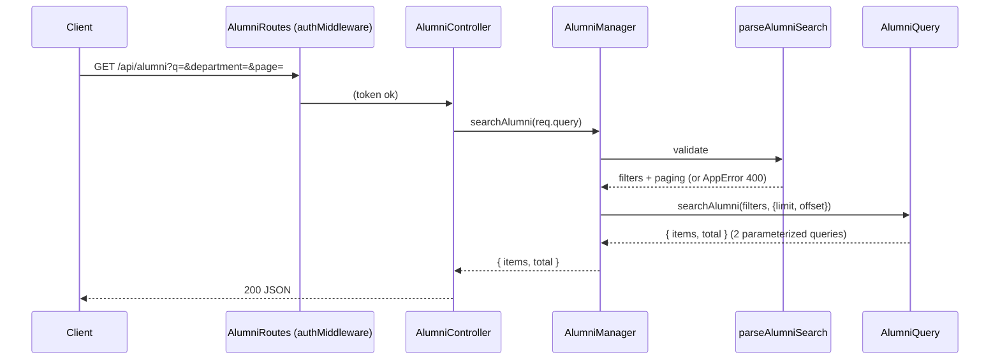

# Search, filters and paging for the alumni directory API — Architecture

| Field | Value |
|---|---|
| REQ | REQ-005 |
| Status | validated |
| Created | 2026-10-06 |
| Related ADRs | [[architecture/adr-05-backend-tests-vitest-supertest\|ADR-05]] |

## Summary

`GET /api/alumni` changes from "all rows as an array" to a searched, filtered, paged list returning `{ items, total }`:
- The controller hands `req.query` to `AlumniManager.searchAlumni`.
- A pure validator (`parseAlumniSearch` in `validation.ts`) turns it into typed filters, or throws `AppError(400)`.
- `AlumniQuery.searchAlumni` builds a WHERE clause from a fixed set of fragments with bound parameters, and runs a page query plus a count query.

The route already sits behind `router.use(authMiddleware)`. Nothing else in the API changes. Work happens in the worktree `.worktrees/REQ-005-alumni-search-filters` (branch `feat/REQ-005-alumni-search-filters` off `redesign`).

## Blast radius

| Path | Why touched | Risk |
|---|---|---|
| `packages/backend/src/dal/query/AlumniQuery.ts` | replace `getAllAlumni()` with `searchAlumni(filters, paging)`; export `AlumniSearchFilters` | med (SQL) |
| `packages/backend/src/dal/query/AlumniQuery.test.ts` | SQL + params per filter, combos, escaping, paging, count | low |
| `packages/backend/src/dal/index.ts` | export the new types | low |
| `packages/backend/src/businessLogic/src/validation.ts` (+ test) | `parseAlumniSearch(query)` → `{ filters, page, pageSize }` or `AppError(400)` | med |
| `packages/backend/src/businessLogic/src/AlumniManager.ts` (+ test) | `searchAlumni(query)` replaces `getAllAlumni()` | low |
| `packages/backend/src/api/controllers/AlumniController.ts` | `getAllAlumni` handler → `searchAlumni` (route path unchanged) | low |
| `packages/backend/src/api/routes/AlumniRoutes.ts` | handler rename only | low |
| `packages/backend/src/api/routes/routes.test.ts` | `getAllAlumni` mock → `searchAlumni` returning `{ items: [], total: 0 }` (around line 239 and the role-table entry around line 453); new shape/400/401 cases | low |
| `packages/shared/src/types/alumni.types.ts` | `AlumniListResponse { items: AlumniListItem[]; total: number }` | low |
| `.adlc/context/conventions.md`, `CLAUDE.md` | API: list endpoints use `page`/`pageSize` → `{ items, total }` | low |

## Approach

**Validation (businessLogic).** `parseAlumniSearch(query: Record<string, unknown>)`:
- Every accepted key must be a `string` if present. Anything else (an array from `?q=a&q=b`, or an object from `?q[x]=1`, both produced by Express's default `qs` parser) gives `AppError(400, "<param> must be a single value")`.
- `q`: trimmed. Empty means absent; more than 100 characters gives 400.
- `department` ≤ 100 and `university` ≤ 150 characters (the column lengths); trimmed, empty means absent.
- `graduationYear`: `/^\d{4}$/` and between 1900 and this year + 10, else 400; becomes a number.
- `page`: `/^\d+$/`, from 1 to 10000; default 1. `pageSize`: `/^\d+$/`, from 1 to 100; default 20. Otherwise 400. An empty or whitespace-only value (`?page=`, `?pageSize=%20`) counts as absent, so the default applies, consistent with an empty `q` (ADV-002).
- Unknown keys, including `field`, are ignored.
- The result is `{ filters: { q?, department?, university?, graduationYear? }, page, pageSize }`.

`AlumniManager.searchAlumni(query)` runs it and calls `alumniQuery.searchAlumni(filters, { limit: pageSize, offset: (page-1)*pageSize })`. Because validation comes first, a 400 never reaches the query.

**SQL (dal only).** `searchAlumni` builds `conditions: string[]` and `params: unknown[]` from a fixed set of fragments. Column names are never taken from input.

| Filter | Fragment (`$n` = next param) | Param |
|---|---|---|
| `q` | `(u.name ILIKE $n OR a.current_company ILIKE $n OR a.job_title ILIKE $n)` (one param reused) | `%${escapeLike(q)}%` |
| `department` | `lower(a.department) = lower($n)` | value |
| `university` | `lower(u.university) = lower($n)` | value |
| `graduationYear` | `a.graduation_year = $n` | number |

`escapeLike` prefixes `\`, `%` and `_` with `\`. There is **no `ESCAPE` clause**: backslash is already Postgres's default LIKE/ILIKE escape character, and writing `ESCAPE '\'` inside a JS template literal sends `ESCAPE ''` (the `\'` collapses), which Postgres rejects, so every `q` request would 500 while the mocked tests still passed (ADV-001). A manual check against a real database is on the review checklist. Then:
- `WHERE` is `conditions.join(' AND ')`, or omitted when empty.
- Items: `SELECT ${LIST_COLUMNS} FROM alumni a JOIN users u ON a.user_id = u.id ${where} ORDER BY u.name, a.id LIMIT $x OFFSET $y`.
- Total: `SELECT COUNT(*)::int AS total FROM alumni a JOIN users u ON a.user_id = u.id ${where}`, with the same params minus limit and offset.
- Both run with `Promise.all`; the method returns `{ items, total }`.

A separate count query (rather than `COUNT(*) OVER()`) keeps `total` correct on a page past the end (AC5), where the window version returns no rows. The two queries aren't in one transaction, so `total` can be off by a row that changes between them. That's acceptable for a directory.

**Response.** The controller returns `200` and the `{ items, total }` from the manager; errors go through `sendError` (AppError → 400). `packages/shared` gains `AlumniListResponse` for the future S2 screen.

## Task DAG

### Tier 0
- `TASK-001`: `AlumniQuery.searchAlumni` + `escapeLike` + query tests
- `TASK-002`: `parseAlumniSearch` + validation tests

### Tier 1
- `TASK-003`: manager, controller, route rename, route tests, shared type (depends on TASK-001, TASK-002)

### Tier 2
- `TASK-004`: docs (conventions API pagination + response format, CLAUDE.md) (depends on TASK-003)

## Test strategy

| File | Covers |
|---|---|
| `dal/query/AlumniQuery.test.ts` | no filters (no WHERE; ORDER BY name, id; LIMIT/OFFSET params); each filter's fragment + param; all filters together (param numbering); `q` with `%`, `_`, `\` escaped; count query shares the WHERE and params minus paging; returns `{ items, total }` from the two results; no input text ever appears in the SQL string |
| `businessLogic/src/validation.test.ts` | defaults; trimming and empty `q`; length limits; `graduationYear` bounds and format; `page`/`pageSize` bounds, non-numeric, `1.5`, `-1`, `0`, `101`; arrays and objects → 400; `field` and unknown keys ignored |
| `businessLogic/src/AlumniManager.test.ts` | offset math (`page 3`, `pageSize 10` → offset 20); a 400 never calls the query |
| `api/routes/routes.test.ts` | 200 `{ items, total }`; the query string reaches the manager; a 400 body is `{ message }`; 401 without token (the guard already covers it) |

Run `npm test` and `npm run typecheck` in `packages/backend` inside the worktree, after `npm install` at the worktree root (it has no `node_modules`).

## Convention alignment

- Layering: validation and paging maths in the manager/validation layer; SQL only in `AlumniQuery` (AC7).
- Errors: `AppError(400)` via `sendError` (L-REQ-003-3).
- Tests: three levels, one mocked boundary each (ADR-05, L-REQ-003-1).
- New convention, written into conventions.md: list endpoints page with `page`/`pageSize` (default 20, max 100) and return `{ items, total }`.

## Risks

| Risk | Likelihood | Mitigation |
|---|---|---|
| SQL injection through the dynamic WHERE | low | Fragments are constants; every value is a `$n` param; a test asserts no user text appears in the SQL string |
| `%`/`_` acting as wildcards | med | `escapeLike` (backslash, Postgres's default escape; no `ESCAPE` clause); tested |
| Response shape change breaks an unknown client | low | Frontend doesn't call it (checked); Postman flagged in PR, as in REQ-003 |
| Slow `ILIKE '%…%'` scans on a big table | low (small table) | Out of scope; trigram index later |
| Deep pages (`OFFSET` large) | low | `page` capped at 10000 |

## Stress-test outcome

Full pass (sensitive: dynamic SQL, public response contract). 2 findings, both fixed:

| Finding | Action |
|---|---|
| ADV-001 (major): `ESCAPE '\'` in a template literal becomes `ESCAPE ''`, so every `q` request 500s; mocked tests can't see it | **Fixed:** no `ESCAPE` clause (backslash is the default); a test asserts the SQL has no `ESCAPE` and the param is escaped; manual `psql` check (`q=100%`, `q=a_b`) on the review checklist |
| ADV-002 (minor): page cap not in AC6; empty `?page=` undecided | **Fixed:** cap added to AC6; empty `page`/`pageSize` = absent → default, tested |

Note (corrected at review): `alumni.graduation_year` is `integer` (base schema in `db/backups/`, an untracked folder; migration 003 only renames it). The `VARCHAR(10)` column is `students.expected_graduation_year`. Binding a number is correct.

## Open questions

- None.

## Related

- Spec: REQ-005
- Components: [[knowledge/components/backend]]
- Lessons checked: [[knowledge/lessons/LESSON-REQ-003-1-partial-mocks-of-workspace-packages|L-REQ-003-1]], [[knowledge/lessons/LESSON-REQ-003-3-migrate-every-handler-in-a-touched-file|L-REQ-003-3]], [[knowledge/lessons/LESSON-REQ-003-4-source-alias-needs-typecheck|L-REQ-003-4]]
- Gotchas: [[knowledge/gotchas#^g13|G13]], [[knowledge/gotchas#^g15|G15]]
- ADRs: [[architecture/adr-05-backend-tests-vitest-supertest|ADR-05]]
