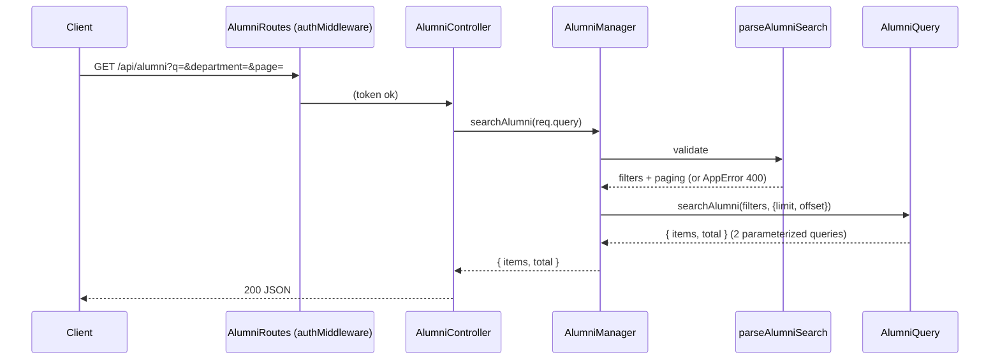

# REQ-005-alumni-search-filters — Review Packet

`Packet: 86KB · round 2`

This packet contains the diff, the REQ spec, the REQ architecture, and the exploration report's blast radius and vault references. **Do not re-read these via Read — cite this packet.**

**Your own required reading is not a packet gap.** `context/conventions.md`, the vault, and source outside the diff are your mandate.

**`Packet-gap` means the packet's own contents fell short.** Then add `**Packet-gap:** <path> — <why>` to your section.

Work path is the git worktree /Users/munifmubtashim/Alumni_System/.worktrees/REQ-005-alumni-search-filters (branch feat/REQ-005-alumni-search-filters, one commit 67ca0355 off redesign). Read files there, not in the main checkout (which is on another REQ's branch).

## Round 2 — what changed since round 1

| ID | Disposition | Fixed by |
|---|---|---|
| m1 | fixed | optionalText rejects \u0000 → 400 (all text fields) |
| m2 | fixed | parseAlumniSearch uses optionalYear + Number() |
| m3 | fixed | NAME_MAX, DEPARTMENT_MAX, UNIVERSITY_MAX shared with profile validators |
| m4, m6 | fixed | dal/dto/AlumniSearchDTO.ts: AlumniSearchFilters, AlumniPaging, AlumniListRow (no email), AlumniListPage |
| m5 | fixed | conventions.md Pagination line reworded |
| m7 | fixed (user decision) | Alumni.graduation_year and AlumniDTO.graduation_year → number \| null; createAlumni passes Number(); AlumniQuery.updateAlumni takes AlumniEditableFields |
| t1 | fixed | query test finds calls by SQL text |
| m8, t2 | wrap-up | — |

Round 1 is committed as 67ca0355; this diff is the uncommitted working tree vs that commit.

## Diff with full context (round 2, vs 67ca0355)

```diff
diff --git a/.adlc/context/conventions.md b/.adlc/context/conventions.md
index e36fe0c4..350b7762 100644
--- a/.adlc/context/conventions.md
+++ b/.adlc/context/conventions.md
@@ -1,150 +1,150 @@
 # Conventions
 
 Project-specific rules. The reviewer agents (`quality-reviewer`, `architecture-reviewer`) check code against this file. If a convention isn't documented here, it isn't enforced — write it down or accept that the code will drift.
 
 ## Naming
 
 > **STATUS: needs verification** — read from the frontend as built in REQ-001 (2026-10-05); confirm these are the rules you want enforced.
 
 - **Files (frontend):** one folder per UI component in PascalCase (`components/ui/Button/`) with `Button.tsx`, `Button.module.css`, `Button.test.tsx`, `index.ts`; other modules camelCase (`httpClient.ts`, `themeAtom.ts`, `useApplyTheme.ts`); tests co-located as `*.test.ts(x)`.
 - **Variables / functions:** camelCase; hooks start with `use`; Jotai atoms end with `Atom`.
 - **Constants:** SCREAMING_SNAKE_CASE for module-level constants (`THEME_STORAGE_KEY`, `TOKEN_STORAGE_KEY`).
 - **Types/interfaces:** PascalCase, no `I` prefix (`ThemePreference`, `ButtonProps`).
 
 ## Logging
 
 - **Library:** _(e.g., pino, winston, ILogger)_
 - **Levels:** _(when to use debug, info, warn, error)_
 - **Structured fields:** _(required fields on every log line)_
 - **No `console.log` in production code.**
 
 ## Error handling
 
 - _(How errors propagate — exceptions, Result types, error codes?)_
 - _(How are unexpected errors surfaced?)_
 - _(What gets logged vs. returned vs. swallowed?)_
 
 ## Config
 
 - **Source:** _(env vars, config file, secrets manager)_
 - **Access pattern:** _(centralized config module, direct env reads?)_
 - **No magic strings or numbers** — named constants or config values.
 
 ## API conventions
 
 - **Response format:** success bodies are the resource itself, no envelope, except paged lists, which send `{ items, total }` (see **Pagination**; today only `GET /api/alumni`) (deletes send `{ message }`; `POST /api/auth/login` sends 200 `{ token }`; `POST /api/auth/register` sends 201 `{ token, user }`, `user` without the password). Error bodies are always `{ message }`: controllers' `catch` (and the `/auth/login` handler in `AuthRoutes.ts`) calls `api/controllers/sendError.ts`, which sends an `AppError`'s status and message, and a 500 `{ message: "Something went wrong" }` for anything else — never raw error text (pg messages etc.). A wrong email or password is `AppError(401, "Invalid")`. `MeController` still has its own copy of `sendError` (known follow-up: switch it to the shared one).
 - **Ids:** `requireId` (businessLogic `validation.ts`) treats an id that is not a positive integer, or is above 2147483647 (the Postgres `integer` max), as malformed and answers 404 without querying.
 - **Deleting users:** `DELETE /api/users/:id` returns 409 `{ message: "This user still has posts or comments" }` while the user still has posts or comments (foreign key).
-- **Pagination (REQ-005):** offset paging with query params `page` (1 to 10000, default 1) and `pageSize` (1 to 100, default 20); the query runs `LIMIT pageSize OFFSET (page - 1) * pageSize`. The body is `{ items, total }`: `items` is the current page, `total` counts every row that matches the filters (not just this page). Bad input answers 400 `{ message }` (`AppError` from the Manager): a value that is not a whole number in range, or a repeated or nested param (`?page=1&page=2`, `?page[x]=1`, which Express's qs parser turns into an array or object). An empty or blank value counts as absent, so the default applies. Unknown params are ignored. Results need a stable order with a unique tiebreaker (`ORDER BY u.name, a.id`) so pages don't overlap. Parsing lives in businessLogic `validation.ts` (`parseAlumniSearch`, `DEFAULT_PAGE_SIZE`, `MAX_PAGE_SIZE`, `MAX_PAGE`); reuse it for the next paged list.
+- **Pagination (REQ-005):** offset paging with query params `page` (1 to 10000, default 1) and `pageSize` (1 to 100, default 20); the query runs `LIMIT pageSize OFFSET (page - 1) * pageSize`. The body is `{ items, total }`: `items` is the current page, `total` counts every row that matches the filters (not just this page). Bad input answers 400 `{ message }` (`AppError` from the Manager): a value that is not a whole number in range, or a repeated or nested param (`?page=1&page=2`, `?page[x]=1`, which Express's qs parser turns into an array or object). An empty or blank value counts as absent, so the default applies. Unknown params are ignored. Results need a stable order with a unique tiebreaker (`ORDER BY u.name, a.id`) so pages don't overlap. Parsing lives in businessLogic `validation.ts`: `parseAlumniSearch` (alumni-specific) uses the exported `DEFAULT_PAGE_SIZE`, `MAX_PAGE_SIZE`, `MAX_PAGE` and two private helpers, `singleQueryValue` and `pagingNumber`. When the second paged list arrives, export those helpers (or extract a shared `parsePaging`) and reuse them; don't copy them.
   - **`GET /api/alumni`** (signed-in users, behind `authMiddleware`): filters `q` (≤ 100 chars; case-insensitive substring match on name, current company or job title; `%` and `_` match literally), `department` (≤ 100) and `university` (≤ 150) (both whole-value, case-insensitive match), `graduationYear` (4 digits, 1900 to current year + 10, else 400). Text is trimmed; filters combine with AND. Items never include `email` (shared type `AlumniListItem`; body `AlumniListResponse`).
 - **Versioning:** _(URL path vs header vs none)_
 - **Auth (REQ-003):** bearer JWT in `Authorization: Bearer <token>`, verified by `authMiddleware`, which sets `req.user = { sub, role }`. Public routes are only `POST /api/auth/login`, `POST /api/auth/register` and `GET /api/health`. Every other router starts with `router.use(authMiddleware)` (not per route), so a route added later is protected automatically. Role gates use `requireRole(...)` per route: `requireRole("admin")` on `GET`/`POST /api/users` and `DELETE /api/users/:id`, `requireRole("alumni")` on `POST /api/alumni`; `requireRole` answers 401 if `req.user` is missing.
   - **Status codes:** 401 = token problem only (missing, malformed, bad signature, expired), because the frontend logs out on any 401 (ADR-03). 403 = signed in but not allowed (wrong role, not the owner). 404 = the thing doesn't exist. Never return 401 for "not allowed".
   - **Identity comes from the token,** never the body: the author/owner id is `req.user.sub` (a `user_id` in the body is ignored).
   - **Ownership checks live in Managers**: load the row, `AppError(404)` if missing, then `AppError(403)` unless allowed. Posts and comments are owner-or-admin (`PostManager`, `CommentManager`; controllers pass `{ id: req.user.sub, role: req.user.role }`). A user's own account and alumni profile are owner-only, admins included (`updateOwnUser`, `updateOwnAlumni`; controllers pass `req.user.sub`). Controllers map `AppError` through `sendError`.
   - **Guard test:** `packages/backend/src/api/routes/routeGuard.test.ts` walks every route on the Express app and fails if one outside the public list answers without a token. A new public route must be added to its allowlist on purpose; a new top-level `app.use(...)` handler must be added to its known-middleware list.
   - The role is read from the JWT, so a demoted admin keeps admin rights until the token expires (≤ 1 h). No revocation yet (ADR-05 consequences).
 
 ## Testing
 
 Two Vitest suites: frontend (`packages/frontend`) and backend (`packages/backend`, see **Backend** below). `@alumni/shared` has no tests.
 
 ### Frontend
 
 - **Frameworks:** Vitest 5 + React Testing Library 16 + `@testing-library/user-event` 14 + `@testing-library/jest-dom`. Run with `npm test` (`vitest run`) inside `packages/frontend`.
 - **Environment:** jsdom 29 by default (pinned: jsdom 30 needs Node ≥ 24.15). Tests under `scripts/` must start with `// @vitest-environment node` — Vitest 5 has no `environmentMatchGlobs`, so without the comment they run in jsdom.
 - **Setup (`src/test/setup.ts`):** jest-dom matchers; a `window.matchMedia` stub (default light; `setPrefersDark(bool)` from `@/test/setup` flips it and fires `change`); localStorage, `<html data-theme>` and the stub are reset before and after every test, and RTL `cleanup()` runs after each.
 - **Globals off:** import `describe`/`it`/`expect`/`vi` from `vitest` explicitly. `restoreMocks: true` is set.
 - **Test file location:** co-located — `Button.tsx` → `Button.test.tsx`; `scripts/foo.ts` → `scripts/foo.test.ts`.
 - **CSS in tests:** CSS Module class names are not hashed (`classNameStrategy: 'non-scoped'`), so tests may assert on `.primary` etc. CSS imports are stubbed (`?raw` returns `''`); read files from disk when a test needs CSS content.
 - **Mock policy:** mock at the boundary only — HTTP via axios's per-request `adapter` option (no extra mocking library), media queries via the setup stub. Test components through roles and visible text, keyboard paths with `user-event`.
 - **Guard tests** that must stay green: `scripts/generate-tokens.test.ts` (tokens.css matches tokens.json), `src/styles/contrast.test.ts` (WCAG pairs), `scripts/enforcement.test.ts` (lint rules still fire), `src/store/themeAtom.test.ts` (no-flash script and atom share the storage key).
 - **Coverage expectations:** none enforced yet. `npm run test:coverage` writes a v8 report to `coverage/` (git-ignored).
 
 ### Backend
 
 Decided in [[architecture/adr-05-backend-tests-vitest-supertest|ADR-05]] (REQ-003).
 
 - **Frameworks:** Vitest 5 + supertest 7. Run `npm test` (`vitest run`) or `npm run test:watch` inside `packages/backend`, or `npm run test:backend` from the root. No database is needed or touched.
 - **Config (`packages/backend/vitest.config.ts`):** one project for `api`, `businessLogic` and `dal`; `environment: 'node'`; includes `src/**/*.test.ts`; `restoreMocks: true`; globals off (import from `vitest`). `test.env` sets `JWT_SECRET` and dummy `DB_*` values before any module loads (`UserController` reads `JWT_SECRET` at import time, and dotenv never overrides a set variable), so don't set them inside a test.
 - **`@alumni/businesslogic` is aliased to its source** (`src/businessLogic/src/index.ts`), not the compiled `dist/` its `package.json` points at. Tests never need a rebuild, but a green run says nothing about `dist/`; the running API still needs `tsc` in `businessLogic`. `@alumni/dal` and `@alumni/api` resolve through workspace symlinks to source already.
 - **Setup (`src/test/setup.ts`):** mocks `dal/config/db` globally with a fake pool (`query`, `connect`), so no test opens a connection.
 - **Three levels, each mocks exactly one boundary:**
   - **HTTP** (supertest on the real `app`, no open port): mock `@alumni/businesslogic` managers. Use a factory with `importOriginal` that keeps the real `AppError` (a plain automock replaces it too). Proves middleware, roles, status codes and which identity reaches the manager.
   - **Manager unit** (`*Manager.test.ts`): mock `@alumni/dal` query classes. Proves business rules (ownership, validation, 409 mapping).
   - **Query unit** (`*Query.test.ts`): use the setup's fake pool and assert on the recorded SQL and params. Proves SQL shape (e.g. no `password` column, `updatePost` never sets `user_id`).
 - **Tokens:** `src/api/test/authHelpers.ts` gives `tokenFor({ sub, role })`, `expiredToken()`, `badSignatureToken()` and `bearer(token)`, all signed with the test secret.
 - **Shared helpers:** `src/api/test/routeList.ts` derives the route list from the real app (`listRoutes`, `guardedRoutes`, `PUBLIC_ROUTES`, `toRequest`), used by the guard and route tests, so no test keeps a route list by hand. `src/test/expectAppError.ts` asserts a promise or function fails with an `AppError` of a given status (always `await` it).
 - **Type-check:** Vitest doesn't type-check. Run `npm run typecheck` in `packages/backend` (or `typecheck:backend` from the root): `tsc --noEmit` on each package, then `tsconfig.test.json`, which covers test files and, like Vitest, resolves `@alumni/businesslogic` to source (so it says nothing about `dist/` either).
 - **Test file location:** co-located (`PostManager.ts` → `PostManager.test.ts`); route tests in `src/api/routes/`.
 - **Guard test** that must stay green: `src/api/routes/routeGuard.test.ts` (every non-public route answers 401 without a token). It reads Express 4 internals (`app._router.stack`) and asserts a minimum route count, so an Express 5 upgrade breaks it loudly; fix the walker, don't delete it.
 - **Not covered:** real SQL against Postgres (no migration runner to build a schema). Revisit when one exists.
 
 ## Comments
 
 - _(When are comments expected? When are they noise?)_
 - _(TODO/FIXME format — must include a tracking link?)_
 
 ## Git
 
 > **STATUS: needs verification** — the pattern used in REQ-001 (2026-10-05).
 
 - **Commit message format:** Conventional Commits with the REQ tag: `feat(frontend): … [REQ-001]`, `fix(…)`, `docs(adlc): …`.
 - **Branch naming:** `feat/REQ-NNN-<slug>` (bugs: `bugfix/BUG-NNN-<slug>`).
 - **PR title format:** same as the commit format.
 
 ## TypeScript
 
 Verified against the tsconfig files on 2026-10-05.
 
 **Backend and shared** — `packages/backend`, `packages/backend/src/{api,businessLogic,dal}` and `packages/shared` extend the root `tsconfig.json` (TypeScript 5.9):
 
 - `strict: true` (implies `noImplicitAny`, `strictNullChecks`); `esModuleInterop`, `skipLibCheck`.
 - Target/module `ESNext`, `moduleResolution: bundler`; declarations, declaration maps and source maps are emitted.
 - `noUncheckedIndexedAccess` is not enabled.
 
 **Frontend** — `packages/frontend` does **not** extend the root (the root's emit settings left stray `vite.config.js/.d.ts/.map` files beside source). TypeScript **6.0** (not 7: `typescript-eslint` 8.71 supports TS < 6.1). `tsconfig.json` only references the two configs below; `npm run typecheck` runs both.
 
 - `tsconfig.app.json` (`src/`): `strict`, `noUncheckedIndexedAccess`, `noImplicitOverride`, `noFallthroughCasesInSwitch`, `noUnusedLocals`, `noUnusedParameters`, `verbatimModuleSyntax` (use `import type`), `erasableSyntaxOnly` (no enums, namespaces or parameter properties), `moduleDetection: force`, `noEmit`, `allowImportingTsExtensions`, `jsx: react-jsx`, `types: ["vite/client"]`, target `ES2022`, lib `ES2023 + DOM + DOM.Iterable`, `skipLibCheck`. Path alias `@/*` → `./src/*` via `paths` only — no `baseUrl` (TS 6 rejects it, TS5101).
 - `tsconfig.node.json` (`vite.config.ts`, `scripts/**/*.ts`): same strictness flags, `types: ["node"]`, target/lib `ES2023`, `noEmit`. The `.js` lint configs are not type-checked.
 - `exactOptionalPropertyTypes` is deliberately off (poor fit with third-party prop types).
 
 ## Linting
 
 Verified against `packages/frontend/eslint.config.js`, `stylelint.config.js` and `.prettierrc.json` on 2026-10-05. Frontend only: the backend and shared packages have no lint or format config.
 
 - **ESLint 9.39** (flat config; not 10, because `eslint-plugin-jsx-a11y` supports ESLint ≤ 9). `npm run lint` runs ESLint, then Stylelint.
   - `.ts`/`.tsx`: `@eslint/js` recommended, `typescript-eslint` **strictTypeChecked + stylisticTypeChecked** (type-aware via `projectService`), `react-hooks` recommended, `react-refresh` (Vite), `jsx-a11y` recommended. `.js` files get `@eslint/js` recommended without type info.
   - **Tokens-only rule** (`src/**/*.{ts,tsx}` except `src/styles/**`): no string/template literal matching a raw color (`#rgb…`, `rgb(`, `rgba(`, `hsl(`, `hsla(`), and no `boxShadow` in a JSX `style` prop.
   - **Import boundaries** (`no-restricted-imports`, alias and relative forms both blocked): `src/components/ui/**` may not import `services`, `store`, `features`, `app`, `axios`, `@tanstack/react-query`; `src/services/**` may not import `react`, `components`, `store`, `features` or `app`; `src/store/**` may not import `services`, `features` or `app`; `src/features/**` and the rest of `src/components/**` may not import `app`. So nothing in `features/`, `store/`, `services/` or `components/` may import `app/`. Test files (`*.test.{ts,tsx}`) keep every ban except the `app/` one, so tests may import `app/` providers to render a component. Each layer has one `no-restricted-imports` block for source files and one for its tests, with non-overlapping globs, because flat config does not merge a rule's options across blocks (the last match wins).
   - `eslint-config-prettier` comes last (formatting rules off). `dist/` and `coverage/` are ignored.
 - **Stylelint 17** on `src/**/*.css` (`stylelint-config-standard` + `stylelint-declaration-strict-value`): `color-no-hex`, `color-named: never`, no `rgb/rgba/hsl/hsla/hwb/lab/lch/oklch/color()` functions, no `box-shadow`/`text-shadow`. Color, `fill`, `stroke`, `background`, `font`, `font-size`, `line-height`, `font-weight`, `padding*`, `margin*`, `*gap`, `border-radius` must use `var(--…)` or a keyword (`0`, `inherit`, `initial`, `unset`, `currentcolor`, `transparent`, `none`, `auto`, `100%`). 1px hairline border widths are allowed. CSS Module class names must be camelCase. `src/styles/tokens.css` (generated) is exempt.
 - **Prettier 3**: single quotes, semicolons, trailing commas everywhere, print width 100. Ignores `dist`, `coverage`, `package-lock.json`, `src/styles/tokens.css`. `npm run format:check` must pass.
 - `scripts/enforcement.test.ts` lints bad fixtures through the ESLint and Stylelint Node APIs to prove these rules still fire. Change a rule → update that test.
 
 ## Frontend
 
 Applies to `packages/frontend` (rebuilt in REQ-001). Each `src/` folder has a `README.md` with its own rules; this is the summary.
 
 - **Folder purposes:**
   - `app/` — App root, providers (TanStack Query → Jotai), router, shared `QueryClient`, `AppShell` layout, `RouteError`. Nothing in `features/`, `store/`, `services/` or `components/` may import it; in practice only `main.tsx` does.
   - `features/<domain>/` — a domain's hooks, queries and domain components; wires primitives to state and services. May not import `app/`.
   - `components/ui/<Name>/` — design-system primitives, one folder each with `Name.tsx`, `Name.module.css`, `Name.test.tsx`, `index.ts`. Props in, events out.
   - `store/` — Jotai atoms for client-only state. Server data goes in TanStack Query, never in an atom.
   - `services/` — `httpClient.ts` (the one axios instance, `baseURL: '/api'`), `authToken.ts` (the only home of the auth token, `localStorage['token']`) and endpoint functions (`authApi.ts`). No React.
   - `styles/` — generated `tokens.css`, `global.css`. `test/` — Vitest setup only; production code never imports it.
 - **Import boundaries:** see Linting (lint-enforced). Use the `@/` alias for cross-folder imports.
 - **HTTP:** every API call goes through `httpClient`; its request interceptor is the only place `Authorization` is set. Never build auth headers at a call site, and never call axios from `components/ui/`. Endpoint functions live in `services/` and only return data; storing tokens, caching and navigation belong to the calling feature.
 - **401 handling (ADR-03):** `httpClient` has one response interceptor that, on a 401 from a request that carried a token (except `/auth/login` and `/auth/register`), calls the handler registered with `setUnauthorizedHandler(fn)` and re-throws. Only `features/auth/SessionBridge` registers it; never add another 401 interceptor or log out from a call site. The handler acts only if the failed request's token is still the current one. Code that ends a session calls `clearToken()` before navigating, and navigations to `/login` pass `flushSync: true` (needs `RouterProvider` from `react-router/dom`). Signed-in pages go under `RequireAuth`, guest-only pages under `GuestOnly`; redirect-back uses only `location.state.from` through `resolveFrom`, never a URL parameter.
 - **Forms (ADR-04):** no form library. Controlled state in the page, pure tested validators in `features/<x>/validation.ts` whose messages mirror the backend's, `useMutation` for submit, server errors mapped by a pure function (e.g. `authErrors.ts`). On submit with errors, show them per field via `Input error` and focus the first invalid field; the submit button gets `loading`. Revisit when a form passes ~8 fields or needs dynamic field arrays.
 - **State (ADR-02):** server state → TanStack Query with the shared `QueryClient` (30 s stale time, no refetch on focus, retries ≤ 2 and never on 4xx, mutations not retried). Client-only state → Jotai atoms in `store/`.
 - **UI (ADR-01):** no component library. Primitives are our own, styled with CSS Modules using only design tokens. Behavior for complex widgets (dialogs, menus, selects, radio groups) comes from Base UI (`@base-ui/react`, headless), wrapped behind our own props; today `Menu` and `SegmentedControl` use it (`ThemeToggle` is built on `SegmentedControl`).
 - **Tokens workflow:** `docs/design/design-system/tokens.json` is the single source for colors, spacing, type, radii and motion (`--duration-fast`, `--easing-standard`). Edit it, run `npm run tokens` to regenerate `src/styles/tokens.css`, run `npm test` (stale-file and contrast tests). Never edit `tokens.css` by hand. Spacing and type are emitted in rem, radii in px; type styles are `font` shorthands (`font: var(--text-label)`). `main.tsx` imports the Inter font, then `tokens.css`, then `global.css`.
 - **Motion and layout sizes:** transitions use `var(--duration-fast) var(--easing-standard)` by convention (no lint rule checks it). Layout sizes stay literal and are not tokens (decided in REQ-001 review): e.g. the 72rem content width, the 6px tag dot, 0.5 disabled opacity. Add a token only when a value is shared design language, not a one-off size.
 - **Theme:** `themePreferenceAtom` (`light | dark | system`, `localStorage['alumni.theme']`, JSON) + `useApplyTheme` set `<html data-theme>`. The inline script in `index.html` must use the same key (a test checks it). Components get light/dark values only through tokens; today no component CSS uses a `[data-theme]` selector.
 - **Focus:** global `:focus-visible` is a 2px accent outline. Input is the exception: its focus signal is the accent border (no ring), per the design README.
 - **Package setup:** ESM (`"type": "module"`), Node ≥ 24 (`npm run tokens` runs a `.ts` file with Node's type stripping). React must stay a single copy — after dependency changes check `npm ls react`.
 
 ## Anything else specific to this codebase
 
 - _(stack-specific quirks, framework conventions, team preferences)_
diff --git a/packages/backend/src/businessLogic/src/AlumniManager.test.ts b/packages/backend/src/businessLogic/src/AlumniManager.test.ts
index 130089f5..d07d1fa0 100644
--- a/packages/backend/src/businessLogic/src/AlumniManager.test.ts
+++ b/packages/backend/src/businessLogic/src/AlumniManager.test.ts
@@ -1,183 +1,183 @@
 import { beforeEach, describe, expect, it, vi } from 'vitest';
 import { AlumniQuery } from '@alumni/dal';
 import { AlumniManager } from './AlumniManager.js';
 import { expectAppError } from '../../test/expectAppError';
 
 vi.mock('@alumni/dal', async (importOriginal) => {
   const actual = await importOriginal<typeof import('@alumni/dal')>();
   // Keep the real AlumniDTO (a plain class); fake only the query.
   return { ...actual, AlumniQuery: vi.fn(function (this: Record<string, unknown>) {
     this.findAlumniByUserId = vi.fn();
     this.createAlumni = vi.fn();
     this.findAlumniById = vi.fn();
     this.updateAlumni = vi.fn();
     this.searchAlumni = vi.fn();
   }) };
 });
 
 describe('AlumniManager.createAlumni (POST /api/alumni)', () => {
   let manager: AlumniManager;
   let query: { findAlumniByUserId: ReturnType<typeof vi.fn>; createAlumni: ReturnType<typeof vi.fn> };
 
   beforeEach(() => {
     manager = new AlumniManager();
     query = manager.alumniQuery as unknown as typeof query;
     query.findAlumniByUserId.mockResolvedValue(undefined);
     query.createAlumni.mockImplementation(async (row) => ({ id: 10, ...row }));
   });
 
   it('creates the profile for the given user id and ignores user_id in the body', async () => {
     await manager.createAlumni(42, { user_id: 99, department: 'CSE', graduation_year: '2020' });
 
     expect(query.findAlumniByUserId).toHaveBeenCalledWith(42);
     const row = query.createAlumni.mock.calls[0][0];
     expect(row.user_id).toBe(42);
     expect(row.department).toBe('CSE');
-    expect(row.graduation_year).toBe('2020');
+    expect(row.graduation_year).toBe(2020);
   });
 
   it('returns 409 when the user already has a profile, without inserting', async () => {
     query.findAlumniByUserId.mockResolvedValue({ id: 3, user_id: 42 });
 
     await expectAppError(manager.createAlumni(42, {}), 409);
     expect(query.createAlumni).not.toHaveBeenCalled();
   });
 
   it('returns 409 when a concurrent create hits the unique user_id', async () => {
     query.createAlumni.mockRejectedValue(Object.assign(new Error('dup'), { code: '23505' }));
 
     await expectAppError(manager.createAlumni(42, {}), 409);
   });
 
   it.each([
     ['bad graduation year', { graduation_year: '20x0' }],
     ['non-http LinkedIn URL', { linkedin_url: 'javascript:alert(1)' }],
     ['department too long', { department: 'x'.repeat(101) }],
   ])('returns 400 on %s, without inserting', async (_label, body) => {
     await expectAppError(manager.createAlumni(42, body), 400);
     expect(query.createAlumni).not.toHaveBeenCalled();
   });
 
   it('lets other database errors through unchanged', async () => {
     const boom = new Error('connection lost');
     query.createAlumni.mockRejectedValue(boom);
 
     await expect(manager.createAlumni(42, {})).rejects.toBe(boom);
   });
 });
 
 describe('AlumniManager.findAlumniById (GET /api/alumni/:id)', () => {
   let manager: AlumniManager;
   let findAlumniById: ReturnType<typeof vi.fn>;
 
   beforeEach(() => {
     manager = new AlumniManager();
     findAlumniById = (manager.alumniQuery as unknown as { findAlumniById: ReturnType<typeof vi.fn> }).findAlumniById;
   });
 
   it('returns the row for a known id', async () => {
     findAlumniById.mockResolvedValue({ id: 3 });
     await expect(manager.findAlumniById('3')).resolves.toEqual({ id: 3 });
     expect(findAlumniById).toHaveBeenCalledWith(3);
   });
 
   it('unknown id → 404', async () => {
     findAlumniById.mockResolvedValue(undefined);
     await expectAppError(manager.findAlumniById('999'), 404);
   });
 
   it('malformed id → 404 without touching the DB', async () => {
     await expectAppError(manager.findAlumniById('abc'), 404);
     expect(findAlumniById).not.toHaveBeenCalled();
   });
 });
 
 describe('AlumniManager.updateOwnAlumni (PUT /api/alumni/:id): owner only', () => {
   type Fn = ReturnType<typeof vi.fn>;
   let manager: AlumniManager;
   let query: { findAlumniById: Fn; updateAlumni: Fn };
   const body = { user_id: 99, department: 'CSE', job_title: 'Engineer' };
 
   beforeEach(() => {
     manager = new AlumniManager();
     query = manager.alumniQuery as unknown as typeof query;
     query.findAlumniById.mockResolvedValue({ id: 3, user_id: 42 });
     query.updateAlumni.mockImplementation(async (id, fields) => ({ id, user_id: 42, ...fields }));
   });
 
   it('owner → updates the editable fields; user_id in the body is ignored', async () => {
     await expect(manager.updateOwnAlumni(42, '3', body)).resolves.toMatchObject({ id: 3, user_id: 42 });
     expect(query.findAlumniById).toHaveBeenCalledWith(3);
     const [id, fields] = query.updateAlumni.mock.calls[0];
     expect(id).toBe(3);
     expect(fields).toMatchObject({ department: 'CSE', job_title: 'Engineer' });
     expect(fields).not.toHaveProperty('user_id');
   });
 
   it('another user → 403 without updating', async () => {
     await expectAppError(manager.updateOwnAlumni(8, '3', body), 403);
     expect(query.updateAlumni).not.toHaveBeenCalled();
   });
 
   // The manager gets only the requester's id, not their role, so an admin is just another user here.
   it('an admin editing someone else → 403 too', async () => {
     await expectAppError(manager.updateOwnAlumni(1, '3', body), 403);
     expect(query.updateAlumni).not.toHaveBeenCalled();
   });
 
   it('unknown id → 404 without updating', async () => {
     query.findAlumniById.mockResolvedValue(undefined);
     await expectAppError(manager.updateOwnAlumni(42, '999', body), 404);
     expect(query.updateAlumni).not.toHaveBeenCalled();
   });
 
   it('malformed id → 404 without touching the DB', async () => {
     await expectAppError(manager.updateOwnAlumni(42, 'abc', body), 404);
     expect(query.findAlumniById).not.toHaveBeenCalled();
   });
 
   it('owner with a bad field → 400 without updating', async () => {
     await expectAppError(manager.updateOwnAlumni(42, '3', { graduation_year: '20x0' }), 400);
     expect(query.updateAlumni).not.toHaveBeenCalled();
   });
 });
 
 describe('AlumniManager.searchAlumni (GET /api/alumni)', () => {
   let manager: AlumniManager;
   let searchAlumni: ReturnType<typeof vi.fn>;
 
   beforeEach(() => {
     manager = new AlumniManager();
     searchAlumni = (manager.alumniQuery as unknown as { searchAlumni: ReturnType<typeof vi.fn> }).searchAlumni;
   });
 
   it('returns the query page as it is', async () => {
     const page = { items: [{ id: 1 }], total: 1 };
     searchAlumni.mockResolvedValue(page);
     await expect(manager.searchAlumni({})).resolves.toBe(page);
   });
 
   it('no paging params → limit 20, offset 0', async () => {
     searchAlumni.mockResolvedValue({ items: [], total: 0 });
     await manager.searchAlumni({});
     expect(searchAlumni).toHaveBeenCalledWith({}, { limit: 20, offset: 0 });
   });
 
   it('page 3, pageSize 10 → offset 20; filters are passed validated', async () => {
     searchAlumni.mockResolvedValue({ items: [], total: 0 });
     await manager.searchAlumni({ q: ' Ana ', department: 'CSE', graduationYear: '2020', page: '3', pageSize: '10' });
     expect(searchAlumni).toHaveBeenCalledWith(
       { q: 'Ana', department: 'CSE', graduationYear: 2020 },
       { limit: 10, offset: 20 },
     );
   });
 
   it.each([
     ['pageSize over 100', { pageSize: '101' }],
     ['page not a number', { page: 'abc' }],
     ['q repeated', { q: ['a', 'b'] }],
   ])('%s → 400 without calling the query', async (_label, query) => {
     await expectAppError(manager.searchAlumni(query), 400);
     expect(searchAlumni).not.toHaveBeenCalled();
   });
 });
diff --git a/packages/backend/src/businessLogic/src/AlumniManager.ts b/packages/backend/src/businessLogic/src/AlumniManager.ts
index be5f76c7..b13ebb47 100644
--- a/packages/backend/src/businessLogic/src/AlumniManager.ts
+++ b/packages/backend/src/businessLogic/src/AlumniManager.ts
@@ -1,59 +1,60 @@
 import { AlumniDTO, AlumniQuery } from "@alumni/dal";
 import { AppError, isUniqueViolation } from "./errors.js";
 import { parseAlumniSearch, requireId, validateAlumniFields } from "./validation.js";
 
 export class AlumniManager {
   alumniQuery: AlumniQuery;
 
   constructor() {
     this.alumniQuery = new AlumniQuery();
   }
 
   // POST /api/alumni: creates the caller's own profile. `userId` comes from the token, never the body.
   public async createAlumni(userId: number, body: Record<string, unknown>) {
     const existing = await this.alumniQuery.findAlumniByUserId(userId);
     if (existing) throw new AppError(409, "You already have an alumni profile");
     const f = validateAlumniFields(body);
     const alumni = new AlumniDTO(
       userId,
       f.department,
-      f.graduation_year,
+      // validateAlumniFields returns the year as text; the column is INTEGER, so pass a number.
+      f.graduation_year === undefined ? undefined : Number(f.graduation_year),
       f.current_company,
       f.job_title,
       f.experience,
       f.bio,
       f.linkedin_url,
     );
     try {
       return await this.alumniQuery.createAlumni(alumni);
     } catch (error) {
       // alumni.user_id is UNIQUE: a concurrent create for the same user lands here.
       if (isUniqueViolation(error)) {
         throw new AppError(409, "You already have an alumni profile");
       }
       throw error;
     }
   }
 
   // GET /api/alumni/:id. A malformed or unknown id is 404.
   public async findAlumniById(id: unknown) {
     const alumni = await this.alumniQuery.findAlumniById(requireId(id, "Alumni"));
     if (!alumni) throw new AppError(404, "Alumni not found");
     return alumni;
   }
 
   // PUT /api/alumni/:id: only the row's owner may edit it (admins included). user_id can't change.
   public async updateOwnAlumni(requesterId: number, alumniId: unknown, body: Record<string, unknown>) {
     const id = requireId(alumniId, "Alumni");
     const existing = await this.alumniQuery.findAlumniById(id);
     if (!existing) throw new AppError(404, "Alumni not found");
     if (existing.user_id !== requesterId) throw new AppError(403, "You can only edit your own profile");
     return this.alumniQuery.updateAlumni(id, validateAlumniFields(body));
   }
 
   // GET /api/alumni: validates the raw query string first (AppError 400), so bad input never reaches SQL.
   public async searchAlumni(query: Record<string, unknown>) {
     const { filters, page, pageSize } = parseAlumniSearch(query);
     return this.alumniQuery.searchAlumni(filters, { limit: pageSize, offset: (page - 1) * pageSize });
   }
 }
diff --git a/packages/backend/src/businessLogic/src/validation.test.ts b/packages/backend/src/businessLogic/src/validation.test.ts
index 44321478..9aee3fdd 100644
--- a/packages/backend/src/businessLogic/src/validation.test.ts
+++ b/packages/backend/src/businessLogic/src/validation.test.ts
@@ -1,116 +1,153 @@
 import { describe, expect, it } from 'vitest';
-import { DEFAULT_PAGE_SIZE, MAX_PAGE, MAX_PAGE_SIZE, parseAlumniSearch } from './validation.js';
+import {
+  DEFAULT_PAGE_SIZE,
+  MAX_PAGE,
+  MAX_PAGE_SIZE,
+  optionalText,
+  parseAlumniSearch,
+  validateAlumniFields,
+  validateUserBasics,
+} from './validation.js';
 import { expectAppError } from '../../test/expectAppError';
 
 describe('parseAlumniSearch (GET /api/alumni query)', () => {
   it('applies the defaults when nothing is given', () => {
     expect(parseAlumniSearch({})).toEqual({ filters: {}, page: 1, pageSize: DEFAULT_PAGE_SIZE });
     expect(DEFAULT_PAGE_SIZE).toBe(20);
   });
 
   it('returns every filter, trimmed, with graduationYear as a number', () => {
     expect(
       parseAlumniSearch({
         q: '  ada  ',
         department: ' Computer Science ',
         university: ' Dhaka University ',
         graduationYear: ' 2020 ',
         page: '3',
         pageSize: '10',
       }),
     ).toEqual({
       filters: { q: 'ada', department: 'Computer Science', university: 'Dhaka University', graduationYear: 2020 },
       page: 3,
       pageSize: 10,
     });
   });
 
   it.each(['', '   '])('ignores an empty q, department, university and graduationYear (%j)', (blank) => {
     expect(
       parseAlumniSearch({ q: blank, department: blank, university: blank, graduationYear: blank }).filters,
     ).toEqual({});
   });
 
   it('ignores unknown keys, including field', () => {
     expect(parseAlumniSearch({ field: 'password', sort: 'name', q: 'x' })).toEqual({
       filters: { q: 'x' },
       page: 1,
       pageSize: DEFAULT_PAGE_SIZE,
     });
   });
 
   describe('length limits', () => {
     it.each([
       ['q', 100],
       ['department', 100],
       ['university', 150],
     ])('accepts %s at %i characters and rejects one more', async (param, max) => {
       expect(parseAlumniSearch({ [param]: 'a'.repeat(max) }).filters).toEqual({ [param]: 'a'.repeat(max) });
       await expectAppError(() => parseAlumniSearch({ [param]: 'a'.repeat(max + 1) }), 400);
     });
 
     it('measures q after trimming', () => {
       expect(parseAlumniSearch({ q: `  ${'a'.repeat(100)}  ` }).filters.q).toHaveLength(100);
     });
   });
 
+  describe('NUL characters', () => {
+    // Postgres rejects \u0000 in text, which would surface as a 500 instead of a 400.
+    it.each(['q', 'department', 'university'])('rejects a NUL character in %s', async (param) => {
+      const error = await expectAppError(() => parseAlumniSearch({ [param]: 'a\u0000b' }), 400);
+      expect(error.message).toBe(`${param} contains an invalid character`);
+    });
+
+    it('rejects a NUL character in graduationYear', async () => {
+      await expectAppError(() => parseAlumniSearch({ graduationYear: '2020\u0000' }), 400);
+    });
+  });
+
   describe('graduationYear', () => {
     const maxYear = new Date().getFullYear() + 10;
 
     it.each(['1900', String(maxYear)])('accepts %s', (year) => {
       expect(parseAlumniSearch({ graduationYear: year }).filters.graduationYear).toBe(Number(year));
     });
 
     it.each(['1899', String(maxYear + 1), '20', '20201', '2020.0', '2o20', '-2020', 'abcd'])(
       'rejects %j',
       async (year) => {
         await expectAppError(() => parseAlumniSearch({ graduationYear: year }), 400);
       },
     );
   });
 
   describe('page and pageSize', () => {
     // `?page=` arrives as '' and `?pageSize=%20` as ' '.
     it.each(['', ' ', ' \t '])('treats an empty page/pageSize (%j) as absent', (blank) => {
       expect(parseAlumniSearch({ page: blank, pageSize: blank })).toEqual({
         filters: {},
         page: 1,
         pageSize: DEFAULT_PAGE_SIZE,
       });
     });
 
     it('accepts the bounds', () => {
       expect(parseAlumniSearch({ page: '1', pageSize: '1' })).toMatchObject({ page: 1, pageSize: 1 });
       expect(parseAlumniSearch({ page: String(MAX_PAGE), pageSize: String(MAX_PAGE_SIZE) })).toMatchObject({
         page: 10000,
         pageSize: 100,
       });
     });
 
     it.each(['0', '-1', '1.5', 'abc', '1e2', '0x10', '10001'])('rejects page %j', async (page) => {
       const error = await expectAppError(() => parseAlumniSearch({ page }), 400);
       expect(error.message).toBe('page must be a whole number from 1 to 10000');
     });
 
     it.each(['0', '-1', '1.5', 'abc', '101'])('rejects pageSize %j', async (pageSize) => {
       const error = await expectAppError(() => parseAlumniSearch({ pageSize }), 400);
       expect(error.message).toBe('pageSize must be a whole number from 1 to 100');
     });
   });
 
   describe('repeated or nested parameters', () => {
     it.each(['q', 'department', 'university', 'graduationYear', 'page', 'pageSize'])(
       'rejects an array or object for %s',
       async (param) => {
         const asArray = await expectAppError(() => parseAlumniSearch({ [param]: ['a', 'b'] }), 400);
         expect(asArray.message).toBe(`${param} must be a single value`);
         const asObject = await expectAppError(() => parseAlumniSearch({ [param]: { x: '1' } }), 400);
         expect(asObject.message).toBe(`${param} must be a single value`);
       },
     );
 
     it('ignores an array in an unknown key', () => {
       expect(parseAlumniSearch({ field: ['a', 'b'] }).filters).toEqual({});
     });
   });
 });
+
+describe('optionalText', () => {
+  it('rejects a NUL character anywhere, even one trimming would not remove', async () => {
+    await expectAppError(() => optionalText('\u0000', 'Bio', 10), 400);
+    const error = await expectAppError(() => optionalText('a\u0000b', 'Bio', 10), 400);
+    expect(error.message).toBe('Bio contains an invalid character');
+  });
+
+  it('still trims and returns ordinary text', () => {
+    expect(optionalText('  hi  ', 'Bio', 10)).toBe('hi');
+  });
+
+  it('protects the profile validators too', async () => {
+    await expectAppError(() => validateAlumniFields({ bio: 'x\u0000' }), 400);
+    await expectAppError(() => validateUserBasics({ name: 'Ada\u0000' }), 400);
+  });
+});
diff --git a/packages/backend/src/businessLogic/src/validation.ts b/packages/backend/src/businessLogic/src/validation.ts
index 2dcd4478..82a063fb 100644
--- a/packages/backend/src/businessLogic/src/validation.ts
+++ b/packages/backend/src/businessLogic/src/validation.ts
@@ -1,160 +1,162 @@
 import type { AlumniEditableFields, AlumniSearchFilters, StudentEditableFields, UserBasicsFields } from "@alumni/dal";
 import { AppError } from "./errors.js";
 
 export const EMAIL_PATTERN = /^[^\s@]+@[^\s@]+\.[^\s@]+$/;
 
+// Length limits shared by the profile validators and the directory search.
+export const NAME_MAX = 100;
+export const DEPARTMENT_MAX = 100;
+export const UNIVERSITY_MAX = 150;
+
 export function optionalText(value: unknown, field: string, max: number): string | undefined {
   if (value === undefined || value === null) return undefined;
   if (typeof value !== "string") throw new AppError(400, `${field} must be text`);
+  // Postgres text can't hold a NUL byte; letting one through turns a bad request into a 500.
+  if (value.includes("\u0000")) throw new AppError(400, `${field} contains an invalid character`);
   const trimmed = value.trim();
   if (trimmed.length > max) throw new AppError(400, `${field} must be at most ${max} characters`);
   return trimmed || undefined;
 }
 
 export function requiredText(value: unknown, field: string, max: number): string {
   const text = optionalText(value, field, max);
   if (!text) throw new AppError(400, `${field} is required`);
   return text;
 }
 
 // 4-digit year between 1900 and ten years from now; numbers are accepted too.
 export function optionalYear(value: unknown, field: string): string | undefined {
   const year = optionalText(typeof value === "number" ? String(value) : value, field, 10);
   if (!year) return undefined;
   const n = Number(year);
   if (!/^\d{4}$/.test(year) || n < 1900 || n > new Date().getFullYear() + 10) {
     throw new AppError(400, `${field} is not valid`);
   }
   return year;
 }
 
 export function optionalWebUrl(value: unknown, field: string): string | undefined {
   const url = optionalText(value, field, 255);
   if (url && !/^https?:\/\/\S+$/i.test(url)) {
     throw new AppError(400, `${field} must start with http:// or https://`);
   }
   return url;
 }
 
 // 8–72 characters (bcrypt only uses the first 72 bytes).
 export function validateNewPassword(value: unknown, field = "Password"): string {
   if (typeof value !== "string" || value.length < 8) {
     throw new AppError(400, `${field} must be at least 8 characters`);
   }
   if (Buffer.byteLength(value, "utf8") > 72) throw new AppError(400, `${field} is too long`);
   return value;
 }
 
 export function requiredEmail(value: unknown): string {
   const email = requiredText(value, "Email", 100);
   if (!EMAIL_PATTERN.test(email)) throw new AppError(400, "Email is not valid");
   return email;
 }
 
 // Profile fields every account may edit on itself. Email and password have their own checks (UserManager); role is never accepted.
 export function validateUserBasics(body: Record<string, unknown>): UserBasicsFields {
   return {
-    name: requiredText(body.name, "Name", 100),
+    name: requiredText(body.name, "Name", NAME_MAX),
     photo_url: optionalWebUrl(body.photo_url, "Photo URL"),
-    university: optionalText(body.university, "University", 150),
+    university: optionalText(body.university, "University", UNIVERSITY_MAX),
   };
 }
 
 // Expected graduation year for students: this year … this year + 8.
 export function requiredExpectedYear(value: unknown): string {
   const field = "Expected graduation year";
   const year = optionalText(typeof value === "number" ? String(value) : value, field, 10);
   if (!year) throw new AppError(400, `${field} is required`);
   const thisYear = new Date().getFullYear();
   const n = Number(year);
   if (!/^\d{4}$/.test(year) || n < thisYear || n > thisYear + 8) {
     throw new AppError(400, `${field} must be between ${thisYear} and ${thisYear + 8}`);
   }
   return year;
 }
 
 // Student details: department + expected year are required; the alumni-style details are optional
 // (full replace: omitted ones are cleared). user_id/id are never accepted.
 export function validateStudentFields(body: Record<string, unknown>): StudentEditableFields {
   const { department: _department, graduation_year: _year, ...details } = validateAlumniFields(body);
   return {
     ...details,
-    department: requiredText(body.department, "Department", 100),
+    department: requiredText(body.department, "Department", DEPARTMENT_MAX),
     expected_graduation_year: requiredExpectedYear(body.expected_graduation_year),
   };
 }
 
 // Editable alumni fields (full replace: omitted fields are cleared). user_id/id are never accepted.
 export function validateAlumniFields(body: Record<string, unknown>): AlumniEditableFields {
   return {
-    department: optionalText(body.department, "Department", 100),
+    department: optionalText(body.department, "Department", DEPARTMENT_MAX),
     graduation_year: optionalYear(body.graduation_year, "Graduation year"),
     current_company: optionalText(body.current_company, "Company", 100),
     job_title: optionalText(body.job_title, "Job title", 100),
     experience: optionalText(body.experience, "Experience", 5000),
     bio: optionalText(body.bio, "Bio", 2000),
     linkedin_url: optionalWebUrl(body.linkedin_url, "LinkedIn URL"),
   };
 }
 
 // Largest Postgres `integer` (int4); a bigger id can't match a row and would make the query error.
 export const MAX_DB_ID = 2147483647;
 
 export function requireId(value: unknown, what: string): number {
   const id = Number(value);
   if (!Number.isInteger(id) || id <= 0 || id > MAX_DB_ID) throw new AppError(404, `${what} not found`);
   return id;
 }
 
 // Alumni directory search (GET /api/alumni). Paging limits: pageSize default 20, max 100; page capped at 10000 to bound OFFSET.
 export const DEFAULT_PAGE_SIZE = 20;
 export const MAX_PAGE_SIZE = 100;
 export const MAX_PAGE = 10000;
 
 export interface AlumniSearch {
   filters: AlumniSearchFilters;
   page: number;
   pageSize: number;
 }
 
 // A query-string value must be one string; Express's qs parser turns `?a=1&a=2` into an array and `?a[x]=1` into an object.
 function singleQueryValue(value: unknown, param: string): string | undefined {
   if (value === undefined) return undefined;
   if (typeof value !== "string") throw new AppError(400, `${param} must be a single value`);
   return value;
 }
 
 // Whole number from 1 to max; empty or whitespace-only counts as absent, so the default applies.
 function pagingNumber(value: unknown, param: string, fallback: number, max: number): number {
   const text = singleQueryValue(value, param)?.trim();
   if (!text) return fallback;
   const n = Number(text);
   if (!/^\d+$/.test(text) || n < 1 || n > max) {
     throw new AppError(400, `${param} must be a whole number from 1 to ${max}`);
   }
   return n;
 }
 
 // Parses req.query for the alumni directory into typed filters + paging, or throws AppError(400). Unknown keys are ignored.
 export function parseAlumniSearch(query: Record<string, unknown>): AlumniSearch {
   const filters: AlumniSearchFilters = {};
-  const q = optionalText(singleQueryValue(query.q, "q"), "q", 100);
+  // q is matched against name, company and job title, which all share the 100-character limit.
+  const q = optionalText(singleQueryValue(query.q, "q"), "q", NAME_MAX);
   if (q) filters.q = q;
-  const department = optionalText(singleQueryValue(query.department, "department"), "department", 100);
+  const department = optionalText(singleQueryValue(query.department, "department"), "department", DEPARTMENT_MAX);
   if (department) filters.department = department;
-  const university = optionalText(singleQueryValue(query.university, "university"), "university", 150);
+  const university = optionalText(singleQueryValue(query.university, "university"), "university", UNIVERSITY_MAX);
   if (university) filters.university = university;
-  const year = singleQueryValue(query.graduationYear, "graduationYear")?.trim();
-  if (year) {
-    const n = Number(year);
-    if (!/^\d{4}$/.test(year) || n < 1900 || n > new Date().getFullYear() + 10) {
-      throw new AppError(400, "graduationYear is not valid");
-    }
-    filters.graduationYear = n;
-  }
+  const year = optionalYear(singleQueryValue(query.graduationYear, "graduationYear"), "graduationYear");
+  if (year) filters.graduationYear = Number(year);
   return {
     filters,
     page: pagingNumber(query.page, "page", 1, MAX_PAGE),
     pageSize: pagingNumber(query.pageSize, "pageSize", DEFAULT_PAGE_SIZE, MAX_PAGE_SIZE),
   };
 }
diff --git a/packages/backend/src/dal/dto/AlumniDTO.ts b/packages/backend/src/dal/dto/AlumniDTO.ts
index 4fe18e51..502bbc0b 100644
--- a/packages/backend/src/dal/dto/AlumniDTO.ts
+++ b/packages/backend/src/dal/dto/AlumniDTO.ts
@@ -1,41 +1,41 @@
 import type { BaseDTO } from "./baseDTO";
 export class AlumniDTO implements BaseDTO {
   id!: number;
   user_id: number;
   department?: string;
-  graduation_year?: string;
+  graduation_year?: number | null; // INTEGER column, nullable
   current_company?: string;
   job_title?: string;
   experience?: string;
   bio?: string;
   linkedin_url?: string;
   created_at: Date;
   updated_at: Date;
   // Joined from users on reads; never includes the password.
   name?: string;
   email?: string;
   photo_url?: string;
 
   constructor(
     user_id: number,
     department?: string,
-    graduation_year?: string,
+    graduation_year?: number,
     current_company?: string,
     job_title?: string,
     experience?: string,
     bio?: string,
     linkedin_url?: string,
   ) {
     this.user_id = user_id;
     this.department = department;
     this.graduation_year = graduation_year;
     this.current_company = current_company;
     this.job_title = job_title;
     this.experience = experience;
     this.bio = bio;
     this.linkedin_url = linkedin_url;
     const now = new Date();
     this.created_at = now;
     this.updated_at = now;
   }
 }
diff --git a/packages/backend/src/dal/index.ts b/packages/backend/src/dal/index.ts
index 96c9974b..7447f8e9 100644
--- a/packages/backend/src/dal/index.ts
+++ b/packages/backend/src/dal/index.ts
@@ -1,10 +1,10 @@
 export { PostDTO } from "./dto/PostDTO"
 export { AlumniDTO } from "./dto/AlumniDTO"
+export type { AlumniSearchFilters, AlumniPaging, AlumniListRow, AlumniListPage } from "./dto/AlumniSearchDTO"
 export { UserDTO } from "./dto/UserDTO"
 export { CommentDTO } from "./dto/CommentDTO"
 export { UserQuery } from "./query/UserQuery"
 export { PostQuery } from "./query/PostQuery"
 export { AlumniQuery } from "./query/AlumniQuery"
-export type { AlumniSearchFilters, AlumniPaging, AlumniPage } from "./query/AlumniQuery"
 export { CommentQuery } from "./query/CommentQuery"
 export type { RegisterUserFields, AlumniProfileFields, PublicUserRow, MyProfileRow, UserBasicsFields, AlumniEditableFields, StudentProfileFields, StudentEditableFields } from "./dto/RegisterDTO"
diff --git a/packages/backend/src/dal/query/AlumniQuery.test.ts b/packages/backend/src/dal/query/AlumniQuery.test.ts
index 08fb7e7f..9ec99808 100644
--- a/packages/backend/src/dal/query/AlumniQuery.test.ts
+++ b/packages/backend/src/dal/query/AlumniQuery.test.ts
@@ -1,187 +1,187 @@
 import { beforeEach, describe, expect, it, vi } from 'vitest';
 import pool from '../config/db.js';
 import { AlumniQuery, escapeLike } from './AlumniQuery';
 
 // The pool is replaced by src/test/setup.ts; we only record the SQL each method sends.
 const query = vi.mocked(pool.query);
 const sqlOfLastCall = () => String(query.mock.calls.at(-1)?.[0]);
 
 describe('AlumniQuery.findAlumniByUserId (the 409 check on POST /api/alumni)', () => {
   const alumniQuery = new AlumniQuery();
 
   beforeEach(() => {
     query.mockResolvedValue({ rows: [] } as never);
   });
 
   it('selects from alumni by user_id, not by id, with the user id as the only parameter', async () => {
     await alumniQuery.findAlumniByUserId(42);
 
     expect(sqlOfLastCall()).toMatch(/FROM alumni\s+WHERE user_id = \$1/i);
     expect(sqlOfLastCall()).not.toMatch(/WHERE\s+(a\.)?id\s*=/i);
     expect(query.mock.calls.at(-1)?.[1]).toEqual([42]);
   });
 
   it('returns the first row when the user has a profile', async () => {
     const row = { id: 3, user_id: 42, department: 'CSE' };
     query.mockResolvedValue({ rows: [row] } as never);
 
     await expect(alumniQuery.findAlumniByUserId(42)).resolves.toBe(row);
   });
 
   it('returns undefined when the user has no profile', async () => {
     await expect(alumniQuery.findAlumniByUserId(42)).resolves.toBeUndefined();
   });
 });
 
 describe('escapeLike', () => {
   it('prefixes backslash, percent and underscore with a backslash and leaves other text alone', () => {
     expect(escapeLike('100%')).toBe('100\\%');
     expect(escapeLike('a_b')).toBe('a\\_b');
     expect(escapeLike('c:\\dir')).toBe('c:\\\\dir');
     expect(escapeLike("O'Brien")).toBe("O'Brien");
   });
 });
 
 describe('AlumniQuery.searchAlumni (GET /api/alumni)', () => {
   const alumniQuery = new AlumniQuery();
   const paging = { limit: 20, offset: 40 };
 
-  // Promise.all starts the items query first, then the count query.
-  const call = (n: 0 | 1) => {
-    const c = query.mock.calls.at(n - 2);
+  // Find each call by its SQL, not its position, so reordering the two queries can't swap them.
+  const call = (isCount: boolean) => {
+    const c = query.mock.calls.findLast(([sql]) => /COUNT\(/.test(String(sql)) === isCount);
     return { sql: String(c?.[0]), params: (c?.[1] ?? []) as unknown[] };
   };
-  const items = () => call(0);
-  const count = () => call(1);
+  const items = () => call(false);
+  const count = () => call(true);
 
   beforeEach(() => {
     query.mockImplementation(((sql: string) =>
       Promise.resolve(
         /COUNT\(\*\)/.test(sql) ? { rows: [{ total: 0 }] } : { rows: [] },
       )) as never);
   });
 
   it('with no filters sends no WHERE, orders by name then id, and binds only limit and offset', async () => {
     await alumniQuery.searchAlumni({}, paging);
 
     expect(query).toHaveBeenCalledTimes(2);
     expect(items().sql).not.toMatch(/WHERE/i);
     expect(items().sql).toMatch(/FROM alumni a JOIN users u ON a\.user_id = u\.id/);
     expect(items().sql).toMatch(/ORDER BY u\.name, a\.id LIMIT \$1 OFFSET \$2$/);
     expect(items().params).toEqual([20, 40]);
     expect(count().sql).toMatch(/^SELECT COUNT\(\*\)::int AS total FROM alumni a JOIN users u ON a\.user_id = u\.id\s*$/);
     expect(count().params).toEqual([]);
   });
 
   it('keeps the public list columns (no email, no password)', async () => {
     await alumniQuery.searchAlumni({}, paging);
 
     expect(items().sql).toMatch(/^SELECT a\.\*, u\.name, u\.photo_url, u\.university FROM/);
     expect(items().sql).not.toMatch(/email|password/i);
   });
 
   it('q searches name, company and job title with one reused, wrapped parameter', async () => {
     await alumniQuery.searchAlumni({ q: 'ann' }, paging);
 
     expect(items().sql).toContain(
       'WHERE (u.name ILIKE $1 OR a.current_company ILIKE $1 OR a.job_title ILIKE $1)',
     );
     expect(items().params).toEqual(['%ann%', 20, 40]);
   });
 
   it('department matches case-insensitively on a.department', async () => {
     await alumniQuery.searchAlumni({ department: 'CSE' }, paging);
 
     expect(items().sql).toContain('WHERE lower(a.department) = lower($1)');
     expect(items().params).toEqual(['CSE', 20, 40]);
   });
 
   it('university matches case-insensitively on u.university', async () => {
     await alumniQuery.searchAlumni({ university: 'BUET' }, paging);
 
     expect(items().sql).toContain('WHERE lower(u.university) = lower($1)');
     expect(items().params).toEqual(['BUET', 20, 40]);
   });
 
   it('graduationYear matches exactly on a.graduation_year', async () => {
     await alumniQuery.searchAlumni({ graduationYear: 2020 }, paging);
 
     expect(items().sql).toContain('WHERE a.graduation_year = $1');
     expect(items().params).toEqual([2020, 20, 40]);
   });
 
   it('all four filters join with AND and number their parameters in order, paging last', async () => {
     await alumniQuery.searchAlumni(
       { q: 'dev', department: 'CSE', university: 'BUET', graduationYear: 2019 },
       paging,
     );
 
     expect(items().sql).toContain(
       'WHERE (u.name ILIKE $1 OR a.current_company ILIKE $1 OR a.job_title ILIKE $1)' +
         ' AND lower(a.department) = lower($2)' +
         ' AND lower(u.university) = lower($3)' +
         ' AND a.graduation_year = $4 ',
     );
     expect(items().sql).toMatch(/LIMIT \$5 OFFSET \$6$/);
     expect(items().params).toEqual(['%dev%', 'CSE', 'BUET', 2019, 20, 40]);
   });
 
   it('the count query shares the WHERE and params, minus limit and offset', async () => {
     await alumniQuery.searchAlumni(
       { q: 'dev', department: 'CSE', university: 'BUET', graduationYear: 2019 },
       paging,
     );
 
     const where = /WHERE .*?(?= ORDER BY)/.exec(items().sql)?.[0];
     expect(where).toBeDefined();
     expect(count().sql.trimEnd().endsWith(String(where))).toBe(true);
     expect(count().sql).not.toMatch(/LIMIT|OFFSET|ORDER BY/);
     expect(count().params).toEqual(['%dev%', 'CSE', 'BUET', 2019]);
   });
 
   it('sends no ESCAPE clause and escapes %, _ and \\ in q with a backslash (ADV-001)', async () => {
     await alumniQuery.searchAlumni({ q: '50%_off\\now' }, paging);
 
     expect(items().sql).not.toMatch(/ESCAPE/i);
     expect(count().sql).not.toMatch(/ESCAPE/i);
     expect(items().params[0]).toBe('%50\\%\\_off\\\\now%');
     expect(count().params[0]).toBe('%50\\%\\_off\\\\now%');
   });
 
   it('never puts input text in the SQL string, only in params', async () => {
     const q = "x'); DROP TABLE users; --";
     await alumniQuery.searchAlumni(
       { q, department: q, university: q, graduationYear: 2020 },
       paging,
     );
 
     for (const c of [items(), count()]) {
       expect(c.sql).not.toContain('DROP TABLE');
       expect(c.sql).not.toContain("x')");
       expect(c.sql).not.toContain('--');
       expect(c.params).toContain(q);
     }
     expect(items().params[0]).toBe(`%${q}%`);
   });
 
   it('returns the item rows and the total from the two results', async () => {
     const rows = [{ id: 1, name: 'Ann' }, { id: 2, name: 'Bo' }];
     query.mockImplementation(((sql: string) =>
       Promise.resolve(
         /COUNT\(\*\)/.test(sql) ? { rows: [{ total: 57 }] } : { rows },
       )) as never);
 
     await expect(alumniQuery.searchAlumni({}, paging)).resolves.toEqual({ items: rows, total: 57 });
   });
 
   it('keeps total on a page past the end, where there are no item rows (AC5)', async () => {
     query.mockImplementation(((sql: string) =>
       Promise.resolve(
         /COUNT\(\*\)/.test(sql) ? { rows: [{ total: 3 }] } : { rows: [] },
       )) as never);
 
     await expect(
       alumniQuery.searchAlumni({}, { limit: 20, offset: 200 }),
     ).resolves.toEqual({ items: [], total: 3 });
   });
 });
diff --git a/packages/backend/src/dal/query/AlumniQuery.ts b/packages/backend/src/dal/query/AlumniQuery.ts
index 72cd110d..40be2a8e 100644
--- a/packages/backend/src/dal/query/AlumniQuery.ts
+++ b/packages/backend/src/dal/query/AlumniQuery.ts
@@ -1,126 +1,110 @@
 import pool from "../config/db";
 import { AlumniDTO } from "../dto/AlumniDTO.js";
+import type { AlumniEditableFields } from "../dto/RegisterDTO.js";
+import type { AlumniListPage, AlumniPaging, AlumniSearchFilters } from "../dto/AlumniSearchDTO.js";
 
 // Public user columns joined onto alumni rows. Email is only exposed on single-profile reads.
 const LIST_COLUMNS = "a.*, u.name, u.photo_url, u.university";
 const PROFILE_COLUMNS = "a.*, u.name, u.email, u.photo_url, u.university";
 const LIST_FROM = "FROM alumni a JOIN users u ON a.user_id = u.id";
 
-// Validated filters for the directory search. Every field is optional; absent means "no filter".
-export interface AlumniSearchFilters {
-  q?: string;
-  department?: string;
-  university?: string;
-  graduationYear?: number;
-}
-
-export interface AlumniPaging {
-  limit: number;
-  offset: number;
-}
-
-export interface AlumniPage {
-  items: AlumniDTO[];
-  total: number;
-}
-
 // Makes %, _ and \ match literally in a LIKE/ILIKE pattern. Backslash is Postgres's default
 // LIKE escape character, so the SQL carries no ESCAPE clause (ESCAPE '\' inside a JS template
 // literal would be sent as ESCAPE '', which Postgres rejects).
 export function escapeLike(text: string): string {
   return text.replace(/[\\%_]/g, (ch) => `\\${ch}`);
 }
 
 export class AlumniQuery {
   constructor() { }
 
   public async createAlumni(alumni: AlumniDTO): Promise<AlumniDTO> {
     const info = await pool.query(
       "INSERT INTO alumni (user_id, department, graduation_year, current_company, job_title, experience, bio, linkedin_url) VALUES ($1,$2,$3,$4,$5,$6,$7,$8) RETURNING *",
       [
         alumni.user_id,
         alumni.department,
         alumni.graduation_year,
         alumni.current_company,
         alumni.job_title,
         alumni.experience,
         alumni.bio,
         alumni.linkedin_url,
       ],
     );
     return info.rows[0];
   }
   // The caller's own alumni row, if any (one profile per user on create).
   public async findAlumniByUserId(userId: number): Promise<AlumniDTO | undefined> {
     const info = await pool.query("SELECT * FROM alumni WHERE user_id = $1 ORDER BY id LIMIT 1", [userId]);
     return info.rows[0];
   }
 
   public async findAlumniById(id: number): Promise<AlumniDTO> {
     const info = await pool.query(
       `SELECT ${PROFILE_COLUMNS} FROM alumni a JOIN users u ON a.user_id = u.id WHERE a.id = $1`,
       [id]
     );
     return info.rows[0];
   }
 
   public async updateAlumni(
     id: number,
-    alumni: Partial<AlumniDTO>,
+    alumni: AlumniEditableFields,
   ): Promise<AlumniDTO> {
     const info = await pool.query(
       `UPDATE alumni SET department=$1 ,graduation_year=$2 ,  current_company=$3 ,job_title=$4 ,experience=$5 ,bio=$6 ,linkedin_url=$7 , updated_at=NOW() WHERE id=$8 RETURNING *`,
       [
         alumni.department,
         alumni.graduation_year,
         alumni.current_company,
         alumni.job_title,
         alumni.experience,
         alumni.bio,
         alumni.linkedin_url,
         id
       ],
     );
     return info.rows[0];
   }
 
   // Searched, filtered, paged directory list. Fragments are constants; every input value is a
   // bound parameter, so no request text ever reaches the SQL string.
-  public async searchAlumni(filters: AlumniSearchFilters, paging: AlumniPaging): Promise<AlumniPage> {
+  public async searchAlumni(filters: AlumniSearchFilters, paging: AlumniPaging): Promise<AlumniListPage> {
     const conditions: string[] = [];
     const params: unknown[] = [];
     const next = (value: unknown): string => {
       params.push(value);
       return `$${params.length}`;
     };
 
     if (filters.q !== undefined) {
       const p = next(`%${escapeLike(filters.q)}%`);
       conditions.push(`(u.name ILIKE ${p} OR a.current_company ILIKE ${p} OR a.job_title ILIKE ${p})`);
     }
     if (filters.department !== undefined) {
       conditions.push(`lower(a.department) = lower(${next(filters.department)})`);
     }
     if (filters.university !== undefined) {
       conditions.push(`lower(u.university) = lower(${next(filters.university)})`);
     }
     if (filters.graduationYear !== undefined) {
       conditions.push(`a.graduation_year = ${next(filters.graduationYear)}`);
     }
 
     const where = conditions.length > 0 ? `WHERE ${conditions.join(" AND ")}` : "";
     const countParams = [...params];
     const limit = next(paging.limit);
     const offset = next(paging.offset);
 
     const [itemsResult, countResult] = await Promise.all([
       pool.query(
         `SELECT ${LIST_COLUMNS} ${LIST_FROM} ${where} ORDER BY u.name, a.id LIMIT ${limit} OFFSET ${offset}`,
         params,
       ),
       pool.query(`SELECT COUNT(*)::int AS total ${LIST_FROM} ${where}`, countParams),
     ]);
 
     return { items: itemsResult.rows, total: countResult.rows[0]?.total ?? 0 };
   }
 }
diff --git a/packages/shared/src/types/alumni.types.ts b/packages/shared/src/types/alumni.types.ts
index a93776be..9708befe 100644
--- a/packages/shared/src/types/alumni.types.ts
+++ b/packages/shared/src/types/alumni.types.ts
@@ -1,85 +1,85 @@
 import type { User } from "./user.types";
 
 export interface Alumni {
   id: number;
   user_id: number;
-  graduation_year?: string;
+  graduation_year?: number | null; // INTEGER column; null when not set
   department?: string;
   current_company?: string;
   job_title?: string;
   experience?: string;
   bio?: string;
   linkedin_url?: string;
   created_at?: Date;
   updated_at?: Date;
   // Joined from users. `email` is only returned by GET /api/alumni/:id.
   name?: string;
   email?: string;
   photo_url?: string;
   university?: string;
 }
 
 // One row of GET /api/alumni: the profile plus the joined public user columns (never email).
 export type AlumniListItem = Omit<Alumni, "email">;
 
 // GET /api/alumni?q=&department=&university=&graduationYear=&page=&pageSize=
 // page defaults to 1 (max 10000), pageSize to 20 (max 100). total counts every match, not just this page.
 export interface AlumniListResponse {
   items: AlumniListItem[];
   total: number;
 }
 
 // GET/PUT /api/me: the caller's account plus their alumni or students row, if they have one.
 // Every role gets a profile; alumni fields are empty when has_alumni_profile is false,
 // student fields when has_student_profile is false.
 export interface MyProfile {
   user_id: number;
   name: string;
   email: string;
   photo_url?: string;
   role: User["role"];
   university?: string;
   alumni_id: number | null;
   has_alumni_profile: boolean;
   student_id: number | null;
   has_student_profile: boolean;
   // department, company, job title, experience, bio and LinkedIn: from the alumni or the student profile.
   department?: string;
   expected_graduation_year?: string; // students only
   graduation_year?: string;
   current_company?: string;
   job_title?: string;
   experience?: string;
   bio?: string;
   linkedin_url?: string;
   created_at?: Date;
   login_at?: Date;
   updated_at?: Date; // latest change to the account or alumni profile
 }
 
 // PUT /api/me replaces all of these; omitted optional fields are cleared (an omitted email is kept).
 // Everyone can change name, email, photo_url and university. Alumni and students (with a profile row)
 // also edit company, job title, LinkedIn, bio and experience. Alumni edit department + graduation_year;
 // students must send department + expected_graduation_year.
 // Changing the email requires current_password. Role cannot be changed; password has its own endpoint.
 export interface UpdateMyProfileInput {
   name: string;
   email?: string;
   current_password?: string;
   photo_url?: string;
   university?: string;
   department?: string;
   expected_graduation_year?: string;
   graduation_year?: string;
   current_company?: string;
   job_title?: string;
   experience?: string;
   bio?: string;
   linkedin_url?: string;
 }
 
 // PUT /api/me/password (204 on success). new_password: 8–72 characters, different from the current one.
 export interface ChangePasswordInput {
   current_password: string;
   new_password: string;
 }
```

## New files (full contents)

### packages/backend/src/dal/dto/AlumniSearchDTO.ts

```
// Shapes for the alumni directory search (GET /api/alumni).
import type { AlumniDTO } from "./AlumniDTO";

// Validated filters for the directory search. Every field is optional; absent means "no filter".
export interface AlumniSearchFilters {
  q?: string;
  department?: string;
  university?: string;
  graduationYear?: number;
}

export interface AlumniPaging {
  limit: number;
  offset: number;
}

// One list row: the profile plus public user columns, never email.
export type AlumniListRow = Omit<AlumniDTO, "email">;

// One page of results. Sent as-is; the API shape is AlumniListResponse in @alumni/shared, keep them in sync.
export interface AlumniListPage {
  items: AlumniListRow[];
  total: number;
}
```


## REQ spec

# Search, filters and paging for the alumni directory API

| Field | Value |
|---|---|
| REQ | REQ-005 |
| Status | validated |
| Phase | spec |
| Created | 2026-10-06 |
| Primary repo | alumni-system |
| Touched repos | alumni-system |
| Related | [[knowledge/components/backend]] · [[architecture/adr-05-backend-tests-vitest-supertest\|ADR-05]] · [[knowledge/gotchas#^g14\|G14]] · [[knowledge/gotchas#^g15\|G15]] · [[REQ-003]] |

## Problem

`GET /api/alumni` returns every alumni profile as one array, ordered by name (checked 2026-10-06: `AlumniQuery.getAllAlumni`, no parameters). There is no way to search, filter or page. The directory screen (`docs/design/screens/app/S2-*`: "Showing 1–6 of 142 alumni", filters for department, graduation year and university) can't be built on it, and the response grows with every member.

## Goal

`GET /api/alumni` accepts optional query parameters for text search, filters and paging, and returns `{ items, total }`: one page of matching profiles, plus the number of all matches. All filtering happens in parameterized SQL in `AlumniQuery`. The route stays behind `authMiddleware`.

## Non-goals

- The directory screen itself (frontend).
- Full-text search, ranking or fuzzy matching. Plain case-insensitive "contains" is enough for now.
- New database columns or indexes (no migration in this REQ).
- Sorting options. Results stay ordered by name.

## Acceptance criteria

- [ ] AC1. `GET /api/alumni` with no parameters returns `{ items, total }`: the first page of all alumni, ordered by name (ties broken by id), with `total` = the number of all alumni. Each item has the same fields as today's list rows.
- [ ] AC2. `q` matches, case-insensitively, any part of the alumni's **name**, **current company** or **job title**. `%` and `_` in `q` are matched literally, not as wildcards. `q` is trimmed; an empty `q` is ignored.
- [ ] AC3. `department` and `university` match case-insensitively and in full: `department=computer science` matches "Computer Science", not "Computer Science Education". `graduationYear` matches exactly.
- [ ] AC4. Parameters combine with AND; `q` and the filters can be used together.
- [ ] AC5. `page` (default 1) and `pageSize` (default 20, max 100) select the page; `total` ignores paging. A page past the end returns `items: []` with the real `total`.
- [ ] AC6. Invalid input returns **400** with `{ message }` and runs no query: non-numeric, zero or negative `page`/`pageSize`; `pageSize` above 100; `page` above 10000 (a cap on deep offsets); a `graduationYear` that isn't a 4-digit year; any value over its length limit; a repeated parameter (`?q=a&q=b`). Unknown parameters are ignored. An empty value (`?page=`, `?q=`) counts as not given, so the default applies.
- [ ] AC7. All SQL lives in `AlumniQuery`, and every user value is a bound parameter (never concatenated into the SQL text). The WHERE clause is built only from a fixed set of fragments.
- [ ] AC8. The route stays behind `authMiddleware`: no token → 401. The guard test still passes.
- [ ] AC9. Tests:
  - query tests assert the generated SQL and parameters for each filter, combinations, wildcard escaping and paging
  - manager tests cover validation and defaults
  - route tests cover the response shape, 400s and 401

## Assumptions

- Nothing consumes `GET /api/alumni` yet, so changing the response from an array to `{ items, total }` breaks no caller. The frontend calls only `/auth/*` and `/me` (checked 2026-10-06). — `STATUS: needs verification` (also the Postman cloud collections, as in REQ-003)
- University comes from `users.university`; department, graduation year, company and job title come from the `alumni` row.
- `graduationYear` is a single year, not a range. The S2 design shows a range ("2015–2020"); a range can be added later without breaking this API.

## Open questions

None. Resolved at the spec gate (2026-10-06):

- [x] `field` is **dropped** from this REQ. No column stores a field of study; add it later together with a migration. A `field` parameter is ignored like any unknown parameter.

## Out of scope (for now)

- A `field` (field of study) filter, which needs a new column first.
- Graduation-year ranges, sorting, and filtering by mentorship status or role.
- An index on `lower(u.name)` etc. (worth it once the table is large).
- The S2 directory page.

## Related

- Components: [[knowledge/components/backend]]
- Lessons: [[knowledge/lessons/LESSON-REQ-003-1-partial-mocks-of-workspace-packages|L-REQ-003-1]], [[knowledge/lessons/LESSON-REQ-003-2-protect-at-router-prove-with-walker|L-REQ-003-2]], [[knowledge/lessons/LESSON-REQ-003-3-migrate-every-handler-in-a-touched-file|L-REQ-003-3]]
- Gotchas: [[knowledge/gotchas#^g14|G14]] (`requireId` → 404), [[knowledge/gotchas#^g15|G15]] (schema only in backups)
- ADRs: [[architecture/adr-05-backend-tests-vitest-supertest|ADR-05]]

## Backlinks

_(populated by /wrapup or manually)_

## REQ architecture

# Search, filters and paging for the alumni directory API — Architecture

| Field | Value |
|---|---|
| REQ | REQ-005 |
| Status | validated |
| Created | 2026-10-06 |
| Related ADRs | [[architecture/adr-05-backend-tests-vitest-supertest\|ADR-05]] |

## Summary

`GET /api/alumni` changes from "all rows as an array" to a searched, filtered, paged list returning `{ items, total }`:
- The controller hands `req.query` to `AlumniManager.searchAlumni`.
- A pure validator (`parseAlumniSearch` in `validation.ts`) turns it into typed filters, or throws `AppError(400)`.
- `AlumniQuery.searchAlumni` builds a WHERE clause from a fixed set of fragments with bound parameters, and runs a page query plus a count query.

The route already sits behind `router.use(authMiddleware)`. Nothing else in the API changes. Work happens in the worktree `.worktrees/REQ-005-alumni-search-filters` (branch `feat/REQ-005-alumni-search-filters` off `redesign`).

## Blast radius

| Path | Why touched | Risk |
|---|---|---|
| `packages/backend/src/dal/query/AlumniQuery.ts` | replace `getAllAlumni()` with `searchAlumni(filters, paging)`; export `AlumniSearchFilters` | med (SQL) |
| `packages/backend/src/dal/query/AlumniQuery.test.ts` | SQL + params per filter, combos, escaping, paging, count | low |
| `packages/backend/src/dal/index.ts` | export the new types | low |
| `packages/backend/src/businessLogic/src/validation.ts` (+ test) | `parseAlumniSearch(query)` → `{ filters, page, pageSize }` or `AppError(400)` | med |
| `packages/backend/src/businessLogic/src/AlumniManager.ts` (+ test) | `searchAlumni(query)` replaces `getAllAlumni()` | low |
| `packages/backend/src/api/controllers/AlumniController.ts` | `getAllAlumni` handler → `searchAlumni` (route path unchanged) | low |
| `packages/backend/src/api/routes/AlumniRoutes.ts` | handler rename only | low |
| `packages/backend/src/api/routes/routes.test.ts` | `getAllAlumni` mock → `searchAlumni` returning `{ items: [], total: 0 }` (around line 239 and the role-table entry around line 453); new shape/400/401 cases | low |
| `packages/shared/src/types/alumni.types.ts` | `AlumniListResponse { items: AlumniListItem[]; total: number }` | low |
| `.adlc/context/conventions.md`, `CLAUDE.md` | API: list endpoints use `page`/`pageSize` → `{ items, total }` | low |

## Approach

**Validation (businessLogic).** `parseAlumniSearch(query: Record<string, unknown>)`:
- Every accepted key must be a `string` if present. Anything else (an array from `?q=a&q=b`, or an object from `?q[x]=1`, both produced by Express's default `qs` parser) gives `AppError(400, "<param> must be a single value")`.
- `q`: trimmed. Empty means absent; more than 100 characters gives 400.
- `department` ≤ 100 and `university` ≤ 150 characters (the column lengths); trimmed, empty means absent.
- `graduationYear`: `/^\d{4}$/` and between 1900 and this year + 10, else 400; becomes a number.
- `page`: `/^\d+$/`, from 1 to 10000; default 1. `pageSize`: `/^\d+$/`, from 1 to 100; default 20. Otherwise 400. An empty or whitespace-only value (`?page=`, `?pageSize=%20`) counts as absent, so the default applies, consistent with an empty `q` (ADV-002).
- Unknown keys, including `field`, are ignored.
- The result is `{ filters: { q?, department?, university?, graduationYear? }, page, pageSize }`.

`AlumniManager.searchAlumni(query)` runs it and calls `alumniQuery.searchAlumni(filters, { limit: pageSize, offset: (page-1)*pageSize })`. Because validation comes first, a 400 never reaches the query.

**SQL (dal only).** `searchAlumni` builds `conditions: string[]` and `params: unknown[]` from a fixed set of fragments. Column names are never taken from input.

| Filter | Fragment (`$n` = next param) | Param |
|---|---|---|
| `q` | `(u.name ILIKE $n OR a.current_company ILIKE $n OR a.job_title ILIKE $n)` (one param reused) | `%${escapeLike(q)}%` |
| `department` | `lower(a.department) = lower($n)` | value |
| `university` | `lower(u.university) = lower($n)` | value |
| `graduationYear` | `a.graduation_year = $n` | number |

`escapeLike` prefixes `\`, `%` and `_` with `\`. There is **no `ESCAPE` clause**: backslash is already Postgres's default LIKE/ILIKE escape character, and writing `ESCAPE '\'` inside a JS template literal sends `ESCAPE ''` (the `\'` collapses), which Postgres rejects, so every `q` request would 500 while the mocked tests still passed (ADV-001). A manual check against a real database is on the review checklist. Then:
- `WHERE` is `conditions.join(' AND ')`, or omitted when empty.
- Items: `SELECT ${LIST_COLUMNS} FROM alumni a JOIN users u ON a.user_id = u.id ${where} ORDER BY u.name, a.id LIMIT $x OFFSET $y`.
- Total: `SELECT COUNT(*)::int AS total FROM alumni a JOIN users u ON a.user_id = u.id ${where}`, with the same params minus limit and offset.
- Both run with `Promise.all`; the method returns `{ items, total }`.

A separate count query (rather than `COUNT(*) OVER()`) keeps `total` correct on a page past the end (AC5), where the window version returns no rows. The two queries aren't in one transaction, so `total` can be off by a row that changes between them. That's acceptable for a directory.

**Response.** The controller returns `200` and the `{ items, total }` from the manager; errors go through `sendError` (AppError → 400). `packages/shared` gains `AlumniListResponse` for the future S2 screen.



## Task DAG

### Tier 0
- `TASK-001`: `AlumniQuery.searchAlumni` + `escapeLike` + query tests
- `TASK-002`: `parseAlumniSearch` + validation tests

### Tier 1
- `TASK-003`: manager, controller, route rename, route tests, shared type (depends on TASK-001, TASK-002)

### Tier 2
- `TASK-004`: docs (conventions API pagination + response format, CLAUDE.md) (depends on TASK-003)

## Test strategy

| File | Covers |
|---|---|
| `dal/query/AlumniQuery.test.ts` | no filters (no WHERE; ORDER BY name, id; LIMIT/OFFSET params); each filter's fragment + param; all filters together (param numbering); `q` with `%`, `_`, `\` escaped; count query shares the WHERE and params minus paging; returns `{ items, total }` from the two results; no input text ever appears in the SQL string |
| `businessLogic/src/validation.test.ts` | defaults; trimming and empty `q`; length limits; `graduationYear` bounds and format; `page`/`pageSize` bounds, non-numeric, `1.5`, `-1`, `0`, `101`; arrays and objects → 400; `field` and unknown keys ignored |
| `businessLogic/src/AlumniManager.test.ts` | offset math (`page 3`, `pageSize 10` → offset 20); a 400 never calls the query |
| `api/routes/routes.test.ts` | 200 `{ items, total }`; the query string reaches the manager; a 400 body is `{ message }`; 401 without token (the guard already covers it) |

Run `npm test` and `npm run typecheck` in `packages/backend` inside the worktree, after `npm install` at the worktree root (it has no `node_modules`).

## Convention alignment

- Layering: validation and paging maths in the manager/validation layer; SQL only in `AlumniQuery` (AC7).
- Errors: `AppError(400)` via `sendError` (L-REQ-003-3).
- Tests: three levels, one mocked boundary each (ADR-05, L-REQ-003-1).
- New convention, written into conventions.md: list endpoints page with `page`/`pageSize` (default 20, max 100) and return `{ items, total }`.

## Risks

| Risk | Likelihood | Mitigation |
|---|---|---|
| SQL injection through the dynamic WHERE | low | Fragments are constants; every value is a `$n` param; a test asserts no user text appears in the SQL string |
| `%`/`_` acting as wildcards | med | `escapeLike` (backslash, Postgres's default escape; no `ESCAPE` clause); tested |
| Response shape change breaks an unknown client | low | Frontend doesn't call it (checked); Postman flagged in PR, as in REQ-003 |
| Slow `ILIKE '%…%'` scans on a big table | low (small table) | Out of scope; trigram index later |
| Deep pages (`OFFSET` large) | low | `page` capped at 10000 |

## Stress-test outcome

Full pass (sensitive: dynamic SQL, public response contract). 2 findings, both fixed:

| Finding | Action |
|---|---|
| ADV-001 (major): `ESCAPE '\'` in a template literal becomes `ESCAPE ''`, so every `q` request 500s; mocked tests can't see it | **Fixed:** no `ESCAPE` clause (backslash is the default); a test asserts the SQL has no `ESCAPE` and the param is escaped; manual `psql` check (`q=100%`, `q=a_b`) on the review checklist |
| ADV-002 (minor): page cap not in AC6; empty `?page=` undecided | **Fixed:** cap added to AC6; empty `page`/`pageSize` = absent → default, tested |

Note: `alumni.graduation_year` is `VARCHAR(10)` in the current schema (exploration). A numeric parameter compares fine, because `pg` sends it as text and Postgres infers varchar.

## Open questions

- None.

## Related

- Spec: REQ-005
- Components: [[knowledge/components/backend]]
- Lessons checked: [[knowledge/lessons/LESSON-REQ-003-1-partial-mocks-of-workspace-packages|L-REQ-003-1]], [[knowledge/lessons/LESSON-REQ-003-3-migrate-every-handler-in-a-touched-file|L-REQ-003-3]], [[knowledge/lessons/LESSON-REQ-003-4-source-alias-needs-typecheck|L-REQ-003-4]]
- Gotchas: [[knowledge/gotchas#^g13|G13]], [[knowledge/gotchas#^g15|G15]]
- ADRs: [[architecture/adr-05-backend-tests-vitest-supertest|ADR-05]]

## Codebase exploration — blast radius + vault references

## 2. Blast radius

| Path | Why touched | Risk |
|---|---|---|
| `packages/backend/src/dal/query/AlumniQuery.ts` `getAllAlumni()` | Rewrites to accept 7 parameters and return `{ items: AlumniDTO[], total: number }` instead of `AlumniDTO[]` | **high** — changes method signature and return type |
| `packages/backend/src/businessLogic/src/AlumniManager.ts` `getAllAlumni()` | Adds validation layer: calls `optionalText`, `optionalYear`, `validatePageParams` (new); passes params to query; returns the envelope | **high** — signature and return type change |
| `packages/backend/src/api/controllers/AlumniController.ts` `getAllAlumni()` | Parses `req.query` into params (q, department, university, graduationYear, page, pageSize); passes to manager; responds with `res.json(envelope)` | **med** — adds logic but only to one controller method |
| `packages/backend/src/api/routes/AlumniRoutes.ts` | No code changes; route already protected by `authMiddleware` (line 14) — AC8 checks it still does | **low** — verify, don't modify |
| `packages/backend/src/dal/query/AlumniQuery.test.ts` | Adds test cases for new method signature and each filter combination, wildcard escaping, and paging | **med** — new test file content |
| `packages/backend/src/businessLogic/src/AlumniManager.test.ts` | Adds tests for validation (400 on bad page/pageSize/graduationYear), defaults, combination filters | **med** — new test cases inside existing file |
| `packages/backend/src/api/routes/routes.test.ts` lines ~225-240 | Updates mock for `getAllAlumni` to return `{ items: [], total: 0 }` instead of `[]`; response shape assertions if any | **med** — change mock return and possibly assertions |
| `packages/backend/src/api/routes/routeGuard.test.ts` | No change needed — route already guarded, just verify test still passes | **low** |

---

## 7. Vault references

Key references that apply:

- **[[knowledge/gotchas#^g14|G14]]** — `requireId` answers 404 (not 400) for malformed id. Not directly used in this REQ (no `:id` in the query params), but the validation pattern it sets (404 vs 400) shapes how we handle id validation elsewhere.

- **[[knowledge/gotchas#^g15|G15]]** — Base schema constraints live only in backups, not migrations. The `alumni` table has a `UNIQUE (user_id)` constraint and `users` has a role, but we don't insert/delete in this REQ, so no 23505/23503 handling needed here.

- **[[knowledge/gotchas#^g13|G13]]** — Backend tests mock the pg pool by resolved source path; the one mock at `src/test/setup.ts` covers all query files. When writing `AlumniQuery` tests, assert on `pool.query` calls directly.

- **[[architecture/adr-05-backend-tests-vitest-supertest|ADR-05]]** — Backend test strategy: HTTP tests mock Managers (keep real `AppError`), Manager tests mock Queries, Query tests mock the pool and assert SQL + params. This REQ touches all three levels.

- **[[knowledge/lessons/LESSON-REQ-003-1-partial-mocks-of-workspace-packages|L-REQ-003-1]]** — Partial mocks of workspace packages: `vi.mock` with `importOriginal` to keep some classes real while faking others.

- **[[knowledge/lessons/LESSON-REQ-003-2-protect-at-router-prove-with-walker|L-REQ-003-2]]** — Auth protection lives at the router level (`router.use(authMiddleware)`), not per route. The route guard test proves it.

- **[[knowledge/lessons/LESSON-REQ-003-3-migrate-every-handler-in-a-touched-file|L-REQ-003-3]]** — When editing a file with multiple handlers, migrate every one (error handling, response shape). Here: `getAllAlumni` is the only handler being changed in `AlumniController`, but check if its error path (sendError) is consistent with the rest of the file.

---

