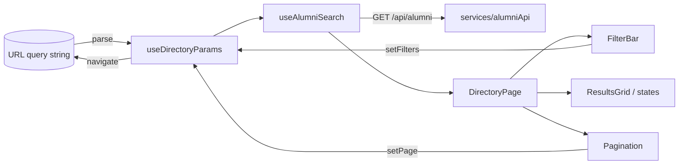
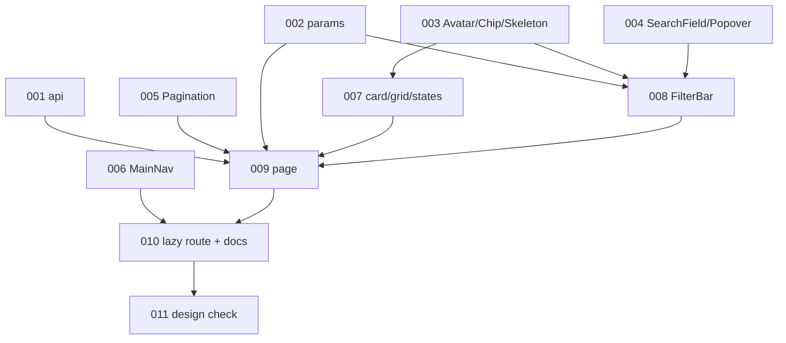

# Alumni directory page — Architecture

| Field | Value |
|---|---|
| REQ | REQ-006 |
| Status | validated |
| Created | 2026-10-06 |
| Related ADRs | [[architecture/adr-01-ui-layer-headless-css-modules\|ADR-01]] · [[architecture/adr-02-server-state-tanstack-query\|ADR-02]] · [[architecture/adr-03-frontend-session-and-401-handling\|ADR-03]] · [[architecture/adr-08-route-code-splitting-and-url-list-state\|ADR-08]] |

## Summary

Frontend only (`packages/frontend`); no backend change. A new `features/directory/` holds the page, built on the REQ-005 `GET /api/alumni` through a new `services/alumniApi.ts` and one TanStack Query hook. The URL query string is the single source of truth for search, filters and page. The route is loaded with React Router's `lazy`, so the page is its own chunk. Five new primitives go in `components/ui/` (Avatar, Chip, Skeleton, SearchField, Popover); the page-specific pieces (card, grid, filter bar, pagination, states) stay in the feature. The app header gains a "Directory" link.

## Blast radius

| Path (under `packages/frontend/src/`) | Why touched | Risk |
|---|---|---|
| `services/alumniApi.ts` (+ test) | new `searchAlumni(params)`; omits empty params | low |
| `features/directory/*` | new: params parsing, `useDirectoryParams`, `useAlumniSearch`, `useDebouncedCallback`, `AlumniCard`, `ResultsGrid`, `FilterBar`, `Pagination`, `DirectoryStates`, `DirectoryPage` (+ CSS Modules, tests) | medium |
| `components/ui/{Avatar,Chip,Skeleton,SearchField,Popover}/*` | new primitives (CSS Modules on tokens, tests); `Popover` wraps Base UI | medium |
| `app/router.tsx` | `directory` route with `lazy`; `HydrateFallback` | medium |
| `app/AppShell/AppShell.tsx`, `AppShell.module.css`, new `MainNav.tsx` | "Directory" nav link, active state, signed-in only | medium |
| `app/AppShell/AppShell.test.tsx`, `app/*.test.tsx` touching nav | the "banner's only nav is the Account one" assertion changes | low |
| `app/README.md`, `features/README.md`, `components/ui/README.md`, `packages/frontend/README.md`, root `CLAUDE.md` (Frontend section) | document new feature, primitives, lazy-route rule | low |
| `.adlc/architecture/adr-08-*.md`, `decisions.md` | proposed ADR | low |

Not touched: backend, `@alumni/shared` (REQ-005 already exports `AlumniListItem`, `AlumniListResponse`), `tokens.json` (see Risks), lint config.

**Work path.** Worktree `.worktrees/REQ-006-alumni-directory-page` on `feat/REQ-006-alumni-directory-page`, branched from `feat/REQ-005-alumni-search-filters` (user decision). It has no `node_modules`, and Node would otherwise resolve up into the main checkout's copy, whose `@alumni/shared` lacks the REQ-005 types. So `/implement` runs `npm install` at the worktree root **before TASK-001** (it is a prerequisite for every task), then `npm run typecheck` once to confirm the baseline. The root `.env` (gitignored) is copied from the main checkout for the TASK-011 API run; it is never committed or shown. The PR is retargeted to `redesign` once REQ-005 merges.

## Approach

**Layering.** `services/alumniApi.ts` (HTTP, no React) → `features/directory/useAlumniSearch` (TanStack Query) → `DirectoryPage` → feature components → `components/ui/*`. Matches ADR-02 and the lint-enforced import boundaries; nothing in `features/directory` imports `app/`; UI primitives take typed props and never call the API.

**URL as state (ADR-08).** `parseDirectoryParams(URLSearchParams) → { q, department, university, graduationYear, page }` is a pure function: it trims text, drops empty values, ignores anything the API would answer 400 to (a non-integer or `< 1` or `> 10000` page, a year that isn't 4 digits within 1900 to current year + 10, text over the API's limits: q 100, department 100, university 150, text containing a NUL or other control character, which the API answers with 400, G23) and never rewrites the URL. `useDirectoryParams()` wraps `useSearchParams` and offers `setFilters(patch)` (always resets `page`), `setPage`, `clearAll`. Filter and page changes **push** history entries (back/forward works); the typed search text updates the URL with **replace**, debounced 300 ms (`useDebouncedCallback`), so typing doesn't flood history. The search box keeps local text. The URL write is scheduled from the input's change handler with a cancellable 300 ms timer (not from an effect watching a debounced value), and any external change of the URL's `q` (back/forward, Clear all, Apply of another filter) cancels the pending timer and sets the box to the new `q`. So a stale pending write can never undo Back or Clear all (ADV-001). `useDebouncedCallback` is dropped in favour of `useDebouncedCallback` with `cancel`. The box has `maxLength` equal to the API limit (100).

**Data.** `useAlumniSearch(params)` is `useQuery({ queryKey: ['alumni','search', params], queryFn })`. No `keepPreviousData`: the spec wants skeletons rather than stale results shown as current. The page size is a constant `DIRECTORY_PAGE_SIZE = 12` (divides evenly into 2, 3 and 4 columns). Existing client defaults apply (30 s stale, no 4xx retry); a 401 reaches the session handler as before (ADR-03). `total` and the page number derive "Showing a–b of N" and "Page x of y"; `totalPages = ceil(total / 12)`.

**Page states.** One `DirectoryPage` switches on query status: *loading* → `ResultsGrid` of `Skeleton` cards (`aria-busy`); *error* → `Alert` + Retry (`refetch`); *empty* → the S2-NoResults layout when any search or filter is active (copy names them, "Clear filters" button), a plain "No alumni yet" when none is; *page past the end* (`total > 0`, `items` empty, `page > 1`) → empty layout whose button goes to page 1; *results* → grid + `Pagination` (hidden when `totalPages ≤ 1`). The heading row's count is `aria-live="polite"`; it shows only for a loaded page that has items (nothing while loading, the error, or the past-the-end state).

**Filters.** `FilterBar` = `SearchField` (visually hidden label "Search alumni", search icon) + a row of: a removable `Chip` for every active filter (name "Department: Computer Science", remove button named "Remove Department: Computer Science"), a pill `Popover` trigger for every inactive filter (University ▾, Department ▾, Grad. year ▾) holding a labeled input and an Apply button (Enter submits; the year field validates 4 digits inline). `Popover` has a controlled `open`/`onOpenChange` so Apply can close it. Focus rules (ADV-002): after Apply, focus goes to the new chip's remove button (the trigger is gone); after removing a chip, focus goes to that filter's pill trigger, which reappears in its place; after Clear all, focus goes to the search box; Escape returns focus to the trigger. Each has a test, and "Clear all" when anything is active. The API has no list of values, so department and university are free text (spec assumption). "Field" is left out.

**Cards.** `AlumniCard` is one `<a>` (React Router `Link`) to `/alumni/:id`: `Avatar` (photo or initials), name (ellipsis), "Class of YYYY", department, "job title, company" (missing parts omitted). No Mentor tag. Until the profile page exists the link lands on the existing catch-all page.

**Header nav.** New `MainNav` (`<nav aria-label="Main">`) inside the AppShell header, rendered for signed-in users only (Directory is behind sign-in), using `NavLink` so it is active on `/directory` and below. **Phone:** the link stays in the header (it wraps under the brand, as the header already does) instead of S1-Phone's bottom tab bar, which would hold one tab until Feed/Profile/Admin exist. A deviation from S1-Phone, flagged at the gate.

**Lazy route (ADR-08).** `{ path: 'directory', lazy: async () => ({ Component: (await import('@/features/directory/DirectoryPage')).DirectoryPage }) }` under the existing `RequireAuth` group. Nothing outside the dynamic import may import `features/directory` (a guard test scans every file under `src/` except `features/directory/**` itself and tests, for a static import of `features/directory`). A `HydrateFallback` (a small "Loading…" status) is set as a static property on the `directory` route object itself, not on the value `lazy` returns and not on the root: React Router cuts rendering at the nearest route with a fallback, so only this placement keeps the shell visible while the chunk loads (ADV-003). A failed chunk fetch lands on the existing inner `RouteError`; a test covers a rejecting `lazy`. Verified by `npm run build`: a separate chunk exists and the entry chunk has none of the page's code.

**Design fidelity.** Tokens only. Where a design value has no token (22px heading, 20px card padding, 11px/9px toggle padding) the nearest token is used, and `TASK-011` lists every residual difference found side by side. Brand stays "Alma" (REQ-004), not the design's "Alumni Network"; the content column stays the shell's 72rem; the header's existing user menu and theme toggle stay. These are known, deliberate differences from the S2 files: the phone nav link in the header instead of the bottom tab bar, and one heading "Alumni Directory" on every width (the phone design says "Directory").

### Diagrams

`STATUS: needs verification` (drawn from the design, not yet built).

## Task DAG

### Tier 0
- `TASK-001` — `services/alumniApi.ts`
- `TASK-002` — directory URL params: pure parse/serialize + `useDirectoryParams` + `useDebouncedCallback`
- `TASK-003` — UI primitives: Avatar, Chip, Skeleton
- `TASK-004` — UI primitives: SearchField, Popover
- `TASK-005` — `Pagination`
- `TASK-006` — header `MainNav` + active state + AppShell test update

### Tier 1
- `TASK-007` — `AlumniCard`, `ResultsGrid`, empty/error states — depends on TASK-003
- `TASK-008` — `FilterBar` — depends on TASK-002, TASK-003, TASK-004

### Tier 2
- `TASK-009` — `useAlumniSearch` + `DirectoryPage` + page tests — depends on TASK-001, 002, 005, 007, 008

### Tier 3
- `TASK-010` — lazy route, `HydrateFallback`, chunk guard test, READMEs/CLAUDE.md — depends on TASK-006, TASK-009

### Tier 4
- `TASK-011` — side-by-side design check in the browser and fixes — depends on TASK-010

AC coverage: AC1 → 010 · AC2 → 006 · AC3 → 010 · AC4 → 001, 009 · AC5 → 002, 008, 009 · AC6 → 008 · AC7 → 002, 008 · AC8 → 003, 007 · AC9 → 007, 009 · AC10 → 005, 009 · AC11 → 007, 009 · AC12 → 011 · AC13, AC14 → every UI task (lint, axe-style role checks) · AC15 → each task's tests, final run in 010/011.

## Test strategy

Vitest + RTL, co-located, mock at the axios adapter only (existing policy).

- `services/alumniApi.test.ts`: query string built from params; empty/undefined omitted; returns the body.
- `features/directory/params.test.ts`: parse (valid, empty, whitespace, `page=abc|0|-1|10001|1.5`, `graduationYear=20|abcd|1899|future`, over-length text, repeated params), serialize round trip, `setFilters` resets page.
- `useDebouncedCallback` with fake timers.
- Primitive tests: Avatar (photo, initials, one-word name, empty), Chip (remove button name, callback), SearchField (label, clear), Popover (open/close, focus return, Escape), Skeleton (decorative).
- `Pagination.test.tsx`: ellipsis windows (1 page hidden, 2, 5, 24; first/last/middle), Prev/Next disabled at ends, "Page x of y".
- `AlumniCard.test.tsx`: link target, missing job/company/year combos, photo vs initials. `FilterBar.test.tsx`: set/remove each filter, year validation, Clear all, Enter submits, search debounce.
- `DirectoryPage.test.tsx` (memory router + fake API): loading skeletons, results + count, empty (filtered and unfiltered), page-past-end, error + Retry, URL → request params, back/forward, 401 → session notice (existing handler).
- `AppShell.test.tsx` updates: nav shown only signed in, active on `/directory`, Account-nav assertion adjusted.
- Guard test `app/lazyRoutes.test.ts` (node-style file read): `router.tsx` has no static import of `@/features/directory`; `directory` route defines `lazy`.
- Build check (task 010): `npm run build`, then confirm a `DirectoryPage` chunk in `dist/assets` and no page code in the entry chunk. Also `typecheck`, `lint`, `format:check`, `tokens:check`.
- Browser check (task 011): needs the API and a Postgres with a few alumni rows. If no database is available, a throwaway stub of `GET /api/alumni` outside the repo (scratchpad) feeds the page; any such stub is deleted afterwards.

## Convention alignment

- Layers, import boundaries, TanStack Query for server data, URL (not Jotai) for list state, no UI kit, CSS Modules on tokens only, Base UI for the popover: ADR-01, ADR-02, conventions "Frontend".
- Typed props from `@alumni/shared`; no API calls inside UI components (`components/ui` never imports services).
- New library: **none** (`@base-ui/react` already installed; its Popover is new to us).
- Deviation: lazy routes are new; ADR-08 records the rule.

## Risks

| Risk | Likelihood | Mitigation |
|---|---|---|
| A static import of the directory feature leaks the page into the entry chunk | med | guard test + build check; only the dynamic import references the page file |
| No token for some design values (22px heading, 20px padding) so the page looks slightly off | high | nearest token; TASK-011 lists residuals; adding tokens would need a `tokens.json` change and an architect-gate decision (not planned) |
| Typing a filter that doesn't match the exact whole value gives empty results (API matches department/university in full) | med | helper text under the inputs ("exact name, any capitals"); empty state names the filter and offers Clear |
| Browser check needs a database | med | stub server fallback (Test strategy); say so in the report if used |
| Direct visit shows nothing while the lazy chunk loads | low | `HydrateFallback` |
| Deep links with a stale page number | low | page-past-end state with a way back |
| Worktree lacks `node_modules` | certain | `npm install` at worktree root first |

## Open questions

- [ ] Phone nav: header link (planned) vs. the S1-Phone bottom tab bar — confirm at this gate.
- [ ] Approve ADR-08.

## Related

- Spec: REQ-006 — `.adlc/specs/2026-10/m/REQ-006-alumni-directory-page/requirement.md`
- Exploration: `exploration.md` (one correction: S1 has no Desktop-Light file, which doesn't matter here; its claim that Tag could serve as the filter chip is rejected — a removable chip is a new primitive)
- Components: [[knowledge/components/frontend]]
- Lessons checked: [[knowledge/lessons/LESSON-REQ-001-5-css-modules-only-no-inline-styles|L-REQ-001-5]] · [[knowledge/lessons/LESSON-REQ-002-6-docs-task-lists-every-folder-readme|L-REQ-002-6]] (docs task lists every README) · [[knowledge/lessons/LESSON-REQ-004-2-check-design-colours-against-token-pairs|L-REQ-004-2]] · [[knowledge/lessons/LESSON-REQ-005-1-paged-list-endpoints|L-REQ-005-1]]
- Gotchas checked: [[knowledge/gotchas#^g04|G04]] (Stylelint bare numbers, `:where()` hovers) · [[knowledge/gotchas#^g09|G09]] (Base UI `[data-highlighted]`) · [[knowledge/gotchas#^g10|G10]] · [[knowledge/gotchas#^g11|G11]] (axios adapter 401) · [[knowledge/gotchas#^g18|G18]] (never set `display` on an element toggled with `hidden`: applies to the width-based show/hide of the count and page numbers)
- ADRs: ADR-01, ADR-02, ADR-03, ADR-07, ADR-08
