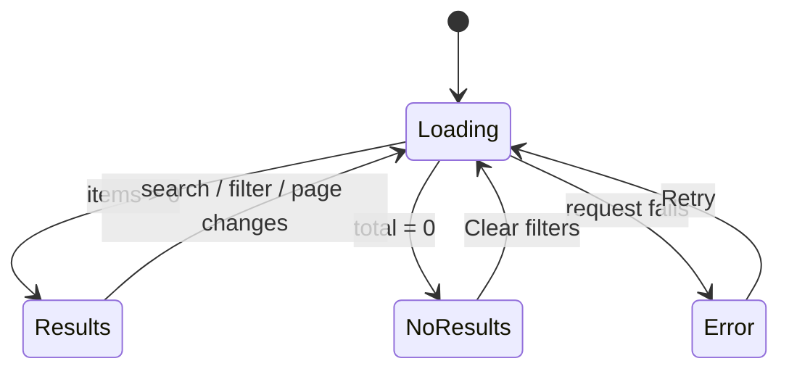

# Alumni directory page (/directory)

| Field | Value |
|---|---|
| REQ | REQ-006 |
| Status | validated |
| Phase | spec |
| Created | 2026-10-06 |
| Primary repo | alumni-system |
| Touched repos | alumni-system |
| Related | REQ-005 (search API) · [[architecture/adr-01-ui-layer-headless-css-modules\|ADR-01]] · [[architecture/adr-02-server-state-tanstack-query\|ADR-02]] · [[architecture/adr-03-frontend-session-and-401-handling\|ADR-03]] |

## Problem

A signed-in user has no way to find other alumni. The API can now search, filter and page (REQ-005), but the frontend has no directory screen and no navigation to one. Designs exist: `docs/design/screens/app/S2-Desktop-{Light,Dark}`, `S2-Phone-{Light,Dark}`, `S2-NoResults`, with the header link in `S1-*`.

## Goal

A signed-in user opens **Directory** from the app header and lands on `/directory`: a page that matches the S2 designs (desktop and phone, light and dark, no-results state). They search by text, narrow by graduation year, department and university, page through results shown as cards, and open a card to reach `/alumni/:id`. Search, filters and page live in the URL, so a reload or a shared link shows the same results. The page is loaded on demand (its own code chunk).

## Non-goals

- The alumni profile page at `/alumni/:id` (a later REQ). Cards link there; until then it shows the existing not-found page.
- A "Field" (field of study) filter, and the "Mentor / Available" tag on cards. No backend column holds either.
- Any backend change. REQ-005's `GET /api/alumni` is used as it is.
- The other header links in S1 (Feed, My Profile, Admin) and the phone bottom tab bar's other tabs. Only "Directory" is added.
- Sorting options. Results stay ordered by name, as the API returns them.

## Acceptance criteria

- [ ] AC1. `/directory` is reachable only when signed in (a guest is sent to `/login` and back after login). It renders inside the existing app shell.
- [ ] AC2. The app header shows a **Directory** link on desktop that goes to `/directory` and is marked active (design: S1/S2 `nav-link active`) while on `/directory` or below it.
- [ ] AC3. The `/directory` route is lazy-loaded: the production build emits it as a separate chunk, and the entry chunk does not contain the directory page code.
- [ ] AC4. Data comes from `GET /api/alumni` through TanStack Query. The request carries `q`, `department`, `university`, `graduationYear`, `page` and a fixed `pageSize`; empty values are not sent.
- [ ] AC5. The search box sets `q`. Typing is debounced before it changes the URL and the request. Changing `q` or any filter resets to page 1.
- [ ] AC6. Filters for graduation year, department and university can be set and cleared individually. Each active filter shows as a removable chip; "Clear all" removes every filter and the search text. Graduation year accepts one 4-digit year (the API takes a single year; the design's range is not built).
- [ ] AC7. `q`, `department`, `university`, `graduationYear` and `page` are kept in the URL query string. Loading a URL with them restores the search box, chips and results; browser back/forward steps through them. An invalid value in the URL (e.g. `page=abc`, `graduationYear=20`) is ignored rather than sent to the API.
- [ ] AC8. Each result is a card showing avatar, name, "Class of YYYY", department, and "job title, company" (parts that are missing are left out, with no stray comma). The avatar shows the photo if there is one, else initials. The whole card is a link to `/alumni/:id`.
- [ ] AC9. The cards sit in the S2 grid (auto-fill, 260px minimum). The heading line shows "Showing a–b of N alumni" on desktop and "N alumni" on phone, as in the designs.
- [ ] AC10. Pagination follows the designs: desktop shows Prev, page numbers with an ellipsis, Next; phone shows Prev, "Page x of y", Next. Prev is disabled on page 1 and Next on the last page. A page past the end (e.g. a stale URL) shows the empty state with a way back, not a blank page. Pagination is hidden when there is one page or none.
- [ ] AC11. States: **loading** (skeleton cards in the grid, the previous results are not shown as if current); **empty** (the S2-NoResults layout, "Clear filters" button, text names the active search and filters; with no search and no filters at all, a plain "No alumni yet" message instead); **error** (message with a Retry button; a 401 still logs the user out through the existing handler, ADR-03).
- [ ] AC12. The page matches the S2 designs for desktop light, desktop dark, phone light, phone dark and no-results. Checked by putting the running page and the design file side by side in a browser, with differences fixed or listed.
- [ ] AC13. Every colour, space and font value comes from design tokens (`var(--…)`). No hex values from the design files appear in source; lint and stylelint pass.
- [ ] AC14. Accessible: the search box and each filter have labels; chips' remove buttons have names ("Remove Department: Computer Science"); the results count is announced politely; card links have readable names; keyboard users can reach and use everything. Works from 360px wide and at 200% zoom without layout breaks.
- [ ] AC15. Tests cover: URL ↔ state parsing and invalid values; the API call function; the page's loading, results, empty, error and pagination states; filter chips and Clear all; the header link and its active state; that the route is lazy. `npm test`, `typecheck`, `lint`, `format:check` and `build` pass in `packages/frontend`.

## Flow

## Assumptions

- `GET /api/alumni` from REQ-005 is available to this work: it returns `{ items, total }`, items are `AlumniListItem` (`@alumni/shared`), `pageSize` max 100, `page` max 10000. — `STATUS: needs verification`: REQ-005 is built and wrapped up on branch `feat/REQ-005-alumni-search-filters` but **not yet merged** into `redesign` (checked 2026-10-06). `/architect` must settle the base before any code is written.
- The API offers no list of distinct departments or universities, so department and university are typed as text (exact, case-insensitive match, per REQ-005 AC3), not picked from a list. The design's dropdown look is kept (a pill button that opens a small panel with an input); the options list is not.
- One fixed page size (the design's 6 cards per page shows a count of 24 pages for 142 alumni; a size that fills the grid, such as 12, is a design call for `/architect`).
- Card avatar uses `photo_url` when present, otherwise initials from the name, per S2.
- Phone: S2-Phone shows its own bottom tab bar. The existing app shell has no such bar, so the phone view gets the Directory link some other way (decided at `/architect`); the bottom bar's other tabs are not built. — `STATUS: needs verification`

## Open questions

None that block the gate. Decisions to confirm are listed in the gate card.

## Out of scope (for now)

- Graduation-year range filter (needs an API change).
- `/alumni/:id` profile page, Feed, My Profile and Admin pages and their nav links.
- Mentorship tag and Field filter (need new backend columns).
- Option lists for department / university (needs a distinct-values endpoint).

## Related

- Components: [[knowledge/components/frontend]]
- Designs: `docs/design/screens/app/S1-*`, `S2-*`
- API: REQ-005 (`.adlc/specs/2026-10/m/REQ-005-alumni-search-filters/requirement.md` on its branch)

## Backlinks

_(populated by /wrapup or manually)_
