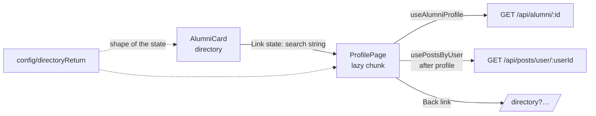
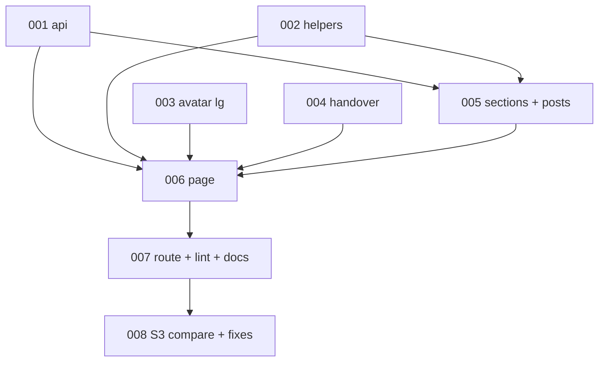

# Alumni profile page — Architecture

| Field | Value |
|---|---|
| REQ | REQ-008 |
| Status | validated |
| Created | 2026-10-07 |
| Related ADRs | [[architecture/adr-01-ui-layer-headless-css-modules\|ADR-01]] · [[architecture/adr-02-server-state-tanstack-query\|ADR-02]] · [[architecture/adr-03-frontend-session-and-401-handling\|ADR-03]] · [[architecture/adr-06-config-leaf-layer\|ADR-06]] · [[architecture/adr-08-route-code-splitting-and-url-list-state\|ADR-08]] (extended, no new ADR) |

## Summary

Frontend-only change. A new lazy feature folder `features/profile/` renders `/alumni/:id` from two existing endpoints (`GET /api/alumni/:id`, `GET /api/posts/user/:userId`). Two new call functions go in `services/alumniApi.ts`. The directory card passes its current search string to the profile through router state, and a tiny pure helper in `config/` is the one place that knows the shape of that handover, so the profile's "Back to directory" link can restore the search, filters and page. Backend, database and `@alumni/shared` are untouched. Elements the data cannot fill (location, mentorship, degree, year range, job dates) are not built (spec AC5).

## Blast radius

| Path | Why touched | Risk |
|---|---|---|
| `packages/frontend/src/features/profile/**` (new) | Page, header, back link, sections, post card, hooks, helpers, CSS Modules, tests | low |
| `packages/frontend/src/services/alumniApi.ts` (+ test) | `getAlumniProfile(id)`, `getPostsByUser(userId)` | low |
| `packages/frontend/src/services/httpErrors.ts` (new, + test) | `isNotFoundError(err)` so the page can tell 404 from other failures | low |
| `packages/frontend/src/config/directoryReturn.ts` (new, + test) | The handover contract: `directoryReturnState(search)` and `directoryReturnPath(state)` | low |
| `packages/frontend/src/features/directory/AlumniCard.tsx` (+ test) | Link gets `state` carrying the current `location.search` | low |
| `packages/frontend/src/components/ui/Avatar/*` (+ test) | New `lg` size (S3 84px header avatar) | low |
| `packages/frontend/src/app/router.tsx` | `PROFILE_ROUTE` lazy route `alumni/:id` under `RequireAuth` | low |
| `packages/frontend/src/app/lazyRoutes.test.ts` | Guard generalised from one lazy feature to a list (`directory`, `profile`) | low |
| `packages/frontend/eslint.config.js` | Lazy-import ban covers `features/profile` too | low |
| `packages/frontend/src/features/README.md`, `config/README.md`, `components/ui/README.md`, `packages/frontend/README.md`, `CLAUDE.md` (Frontend section), `.adlc/architecture/adr-08-…` | Docs describe the lazy features and boundaries; they must say profile is lazy too | low |

## Approach

**Data.** `useAlumniProfile(id)` (key `['alumni','profile',id]`) and `usePostsByUser(userId)` (key `['posts','user',userId]`, `enabled` once the profile is loaded, because the posts endpoint takes the profile's `user_id`, not the alumni id). The posts request therefore waits for the profile: one extra round trip, accepted (see Risks). No `placeholderData`: a new id never shows the previous person (AC11). The query client's default retry skips 4xx, so a 404 ends at once. The posts section renders only the newest 5 (client `slice`; the API returns every post unpaged).

**Page states.** `ProfilePage` reads `:id`, then: profile pending → `ProfileSkeleton`; `isNotFoundError` → `NotFound` (Alert plus Back link); other error → `LoadError` (message + Retry that refetches, ADR-03 keeps 401 global); success → header and sections. The posts section owns its own pending/error/empty states so a posts failure never hides the profile. Every state has a named `h1` and a document title, not only success (ADV-005): loading shows a visually hidden `h1` "Loading profile" with the status line; not found shows `h1` "Profile not found"; error shows `h1` "Couldn't load this profile". Title follows ("Profile · Alma" while loading, "Profile not found · Alma", etc.). Focus goes to whichever `h1` is current when the state changes (including on arrival from a card click, whose link has unmounted). Heading focus: on arrival the `h1` (`tabIndex={-1}`) takes focus once the profile is shown, and the document title is set to the name via React 19's `<title>`; skeleton → content swap does not strand focus ([[knowledge/lessons/LESSON-REQ-006-2-list-skeletons-strand-focus|L-REQ-006-2]]). Loading is announced through a `role="status"` visually hidden line, skeletons are `aria-hidden`.

**Sections** are small components under `features/profile/`: `ProfileHeader`, `AboutSection`, `EducationSection`, `EmploymentSection`, `RecentPosts` (with `PostCard`). Education/Employment share a `Timeline` (`<ul>` of `<li>`, dot and connecting line drawn in CSS). Each section returns `null` when its data is empty (AC6–AC8). `experience` is rendered as a plain text paragraph (React escapes it; never HTML). Pure helpers in `profile/format.ts`: `headline`, `educationLine`, `employmentTitle`, `safeLinkedInUrl` (parses with `URL`, only `http:`/`https:`), `commentCountText`; `relativeTime.ts` uses `Intl.RelativeTimeFormat` (seconds–weeks), falling back to `Intl.DateTimeFormat` for anything over 5 weeks old. Relative time stays in `features/profile` until a second feature needs it (explorer open question 1).

**Back link and handover.** `config/directoryReturn.ts` (a leaf, pure, no React):
`directoryReturnState(search: string): { directorySearch: string }` and `directoryReturnPath(state: unknown): string`. The second returns `/directory` plus the stored string only when `state` is an object whose `directorySearch` is a string that is empty or starts with `?` and has no `#`; anything else gives plain `/directory` (direct visits, reloads in a fresh tab, tampered state). `AlumniCard` gets `useLocation()` and sets `state={directoryReturnState(location.search)}`. The profile uses `directoryReturnPath(location.state)` as the `Link` target. Router state survives a reload of the profile in the same tab, and falls back cleanly otherwise (AC10). Directory's own URL parsing (`params.ts`) ignores bad values already, so a stale string cannot break the directory. The page does not import `features/directory` and `directory` does not import `features/profile` (both lazy, ADR-08); `config/` is the shared meeting point (ADR-06).

**Phone top bar (ADV-001).** `AppShell` already renders its logo bar above `<main>` on phone (S2 phone has the same bar and shipped with it). S3 phone shows only the "arrow + Profile" bar. Default: keep the shell bar and render the back arrow + "Profile" as a slim row at the top of the page (a deliberate difference, listed). The alternative (a route-aware shell bar that swaps the logo bar for the Profile bar on `/alumni/:id`) touches `AppShell`, its tests and BottomTabs; it is a gate choice.

**Back link layout.** One `Link` (name "Back to directory", chevron icon). From 48rem the text shows. Below 48rem the text is visually hidden (CSS clip, not `display:none`, [[knowledge/gotchas#^g18|G18]]) and a separate `aria-hidden` "Profile" title sits beside the arrow, matching S3 phone's bar (arrow link + "Profile") without breaking the accessible name.

**Off-scale values (ADV-003).** Spacing that is not on the `--space-*` scale (S3 uses 10, 14, 18, 20, 28px) is written as `calc()` of `--space-*`, as `AppShell` does. Fixed sizes (860px page width, 9/10px dots, 72/84px avatar) are rem literals in `inline-size`/`block-size`/`max-inline-size`, which stylelint does not restrict (Avatar does the same). Phone initials (S3 24px) use the nearest type token. If stylelint still rejects a value, use the nearest token and list it in the comparison; never disable the rule.

**Layout and tokens.** The page caps at 860px (S3), `--space-*` for gaps, `--surface-raised`/`--border-subtle`/`--radius-lg` for post cards, `--accent` for links and timeline dots, `--ink-*` for text, `--text-*` for type. `Avatar` gains `size="lg"`; phone shrinks it with a profile-scoped rule. The header centres on phone (S3) and is a row on desktop.

**Known design-versus-token gaps** (listed, not hard-coded; each goes in the S3 difference report, TASK-008):

- Accent: design `#ad6a4d` vs token `--accent` `#975c43` (contrast-driven, [[knowledge/lessons/LESSON-REQ-004-2-check-design-colours-against-token-pairs|L-REQ-004-2]]).
- Card radius: design 12px vs `--radius-lg` 14px.
- Type sizes: design uses 24/19 (name), 16/15 (section headings), 15, 14/13, 12/11 px; tokens offer 28, 20, 16, 14, 13, 12. The nearest token is used (name: `--text-heading-lg` 28px on desktop and `--text-heading-md` 20px on phone, section headings `--text-heading-sm` 16px, body `--text-body-sm`/`--text-label`, meta `--text-caption`), unless the gate chooses to add 24px/19px tokens (open question). Differences are reported.
- Phone: S3 shows the "Profile" tab active in a four-tab bar; the shell's bar has only Directory (REQ-007). Not built.
- Omitted by decision (AC5): location, mentorship badge, degree, year range, job dates, multi-job history.

STATUS: needs verification (re-draw if the handover changes during implement)

## Task DAG

### Tier 0
- `TASK-001` — API functions, `isNotFoundError`
- `TASK-002` — format and relative-time helpers
- `TASK-003` — Avatar `lg` size
- `TASK-004` — directory return handover (`config/` + `AlumniCard`)

### Tier 1
- `TASK-005` — timeline, About/Education/Employment, RecentPosts + PostCard + posts hook (depends on 001, 002)

### Tier 2
- `TASK-006` — ProfilePage: hooks, header, back link, states (depends on 001, 002, 003, 004, 005)

### Tier 3
- `TASK-007` — lazy route, lint ban, lazy guard test, docs (depends on 006)

### Tier 4
- `TASK-008` — S3 side-by-side check in a browser, difference list, fixes (depends on 007)

## Test strategy

Vitest + Testing Library, co-located (as REQ-006). New files: `services/alumniApi.test.ts` (extend), `services/httpErrors.test.ts`, `config/directoryReturn.test.ts`, `components/ui/Avatar/Avatar.test.tsx` (extend), `features/directory/AlumniCard.test.tsx` (extend: state on the link), `features/profile/format.test.ts`, `relativeTime.test.ts` (fixed "now" injected), `Timeline.test.tsx`, sections tests, `RecentPosts.test.tsx` (pending/error+retry/empty/list, cap of 5, singular/plural), `ProfilePage.test.tsx` (loading, success, 404 for unknown and malformed id, 500 with Retry, 401, id change shows skeleton not old person, sections hidden when empty, back link with and without state, posts failure keeps profile, safe LinkedIn), `app/lazyRoutes.test.ts` (extended). No backend tests (no backend change). The visual comparison (TASK-008) is manual in a browser and recorded in `s3-comparison.md`. `npm test`, `typecheck`, `lint`, `format:check`, `build` (check `dist/assets` for a profile chunk) all in `packages/frontend`.

## Convention alignment

- Feature folder with its own README import rules; page loaded with `lazy` + static `HydrateFallback` (ADR-08).
- Server data in TanStack Query, API calls in `services/` (ADR-02); no calls inside UI components.
- CSS Modules on tokens only; Base UI not needed (no new complex behavior) (ADR-01).
- 401 stays with the global handler (ADR-03).
- Boundary: `config/` holds the cross-feature contract and stays a leaf (ADR-06). `components/ui/Avatar` gets a size only, no data.
- No new ADR: ADR-08's rule is extended to a second lazy feature, recorded as an amendment in T7 along with the docs.

## Risks

| Risk | Likelihood | Mitigation |
|---|---|---|
| Posts request waits for the profile (waterfall), and the API returns all posts unpaged | med | Show the newest 5 only; skeletons in the posts section while loading; a later REQ can add a `limit` to the API |
| `GET /api/alumni/:id` returns the person's email to every signed-in user | existing | Not displayed or put in test fixtures as visible text; filed as separate privacy follow-up (spec out of scope) |
| Token and type-size gaps make the page differ from S3 in small ways | high | Listed individually in the comparison report; none hard-coded |
| AC12 amended (ADV-002): allowed deliberate-difference classes named in the spec | — | Needs your OK at this gate |
| Router state is lost in a new tab, so Back goes to a plain `/directory` | med | By design (AC10); same behaviour as the auth redirect |
| `experience` is unbounded free text | low | Rendered as text with `white-space: pre-line` and wrapped; long words break (`overflow-wrap`) |
| Posts with no caption (media-only) | low | Show date and count only, no placeholder text; media is not shown |
| A profile whose alumni row exists but user fields are blank | low | Name falls back to empty-safe initials; headline and sections hide cleanly |

## Open questions

- [x] Heading sizes: nearest tokens (decided at the architect gate, 2026-10-07). Differences are listed in `s3-comparison.md`.
- [x] Phone top bar: keep the shell bar, slim in-page "arrow + Profile" row (decided at the gate).
- [x] AC12 amendment confirmed at the gate.

## Related

- Spec: REQ-008 — `.adlc/specs/2026-10/m/REQ-008-alumni-profile-page/requirement.md`
- Concepts: [[knowledge/concepts/route-layout]] · [[knowledge/concepts/design-tokens]]
- Lessons checked: [[knowledge/lessons/LESSON-REQ-006-1-url-mirrored-input-own-write|L-REQ-006-1]] · [[knowledge/lessons/LESSON-REQ-006-2-list-skeletons-strand-focus|L-REQ-006-2]] · [[knowledge/lessons/LESSON-REQ-006-3-client-copies-of-api-limits|L-REQ-006-3]] · [[knowledge/lessons/LESSON-REQ-004-2-check-design-colours-against-token-pairs|L-REQ-004-2]] · [[knowledge/lessons/LESSON-REQ-007-1-sticky-bottom-bar-needs-scroll-padding|L-REQ-007-1]] · [[knowledge/lessons/LESSON-REQ-001-5-css-modules-only-no-inline-styles|L-REQ-001-5]]
- Gotchas: [[knowledge/gotchas#^g14|G14]] · [[knowledge/gotchas#^g18|G18]] · [[knowledge/gotchas#^g12|G12]]
- ADRs: ADR-01, 02, 03, 06, 08
