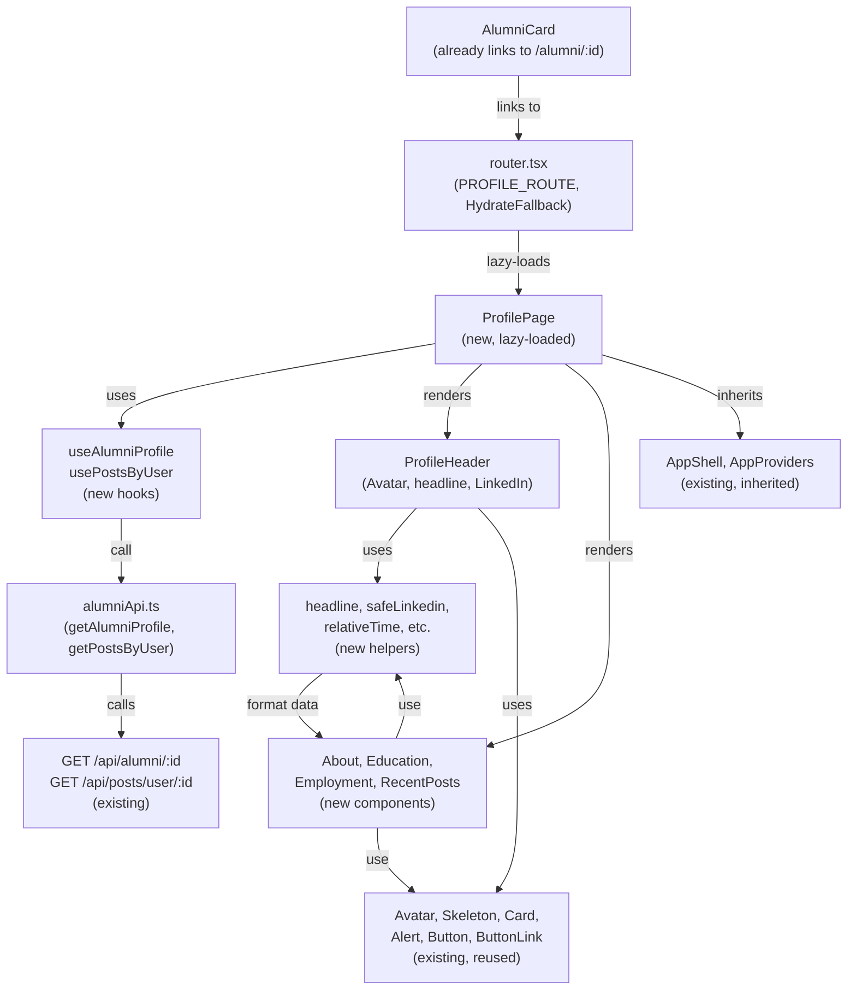

# REQ-008 — Codebase exploration

| Field | Value |
|---|---|
| Generated | 2026-10-06 |
| By | codebase-explorer |
| Repo(s) scanned | alumni-system |

## 1. Similar existing implementations

| Path | What it does | Recommended action |
|---|---|---|
| `packages/frontend/src/features/directory/DirectoryPage.tsx` | List page with loading, error, empty, and results states; URL query string state; skeletons during load; error retry button; live region for announcements | follow: Same shell structure, state pattern, loading/error/empty states; note AC11 distinction (specific not-found message vs generic error) |
| `packages/frontend/src/features/directory/AlumniCard.tsx` | Shows one alumnus with avatar, name, class year, department, job title; composes Avatar and Skeleton components; guards against blank/missing values | follow: Adapt profile header as a larger version (h1, headline, links); reuse `present()` and `jobLine()` helpers for data safety |
| `packages/frontend/src/components/ui/Avatar/Avatar.tsx` | Round photo or initials; size variants (md, sm, xs); photo fallback on load error; aria-hidden as decorative | follow: Use md size for profile header (84×84px in S3); falls back to initials if no photo |
| `packages/frontend/src/components/ui/Card/Card.tsx` | Raised surface, border, radius; polymorphic element (div/article/section) | follow: Wrap each section (About, Education, Employment, Recent posts) in a Card or reuse Card for layout |
| `packages/frontend/src/components/ui/Skeleton/Skeleton.tsx` | Shapes: line, block, circle; pulsing gray; aria-hidden; sized by className | follow: Profile header, section skeletons (shape="line" for text, "block" for larger areas) during load |
| `packages/frontend/src/components/ui/Alert/Alert.tsx` | Error or info tone; optional title; dot indicator (error shows dot, info does not per color spec); aria-live | follow: Error and not-found states (tone="error"); inline posts load error (no retry hides other content per AC9) |
| `packages/frontend/src/components/ui/Button/Button.tsx` and `ButtonLink.tsx` | Button variants (primary, secondary, ghost); loading state; ButtonLink wraps react-router Link | follow: "Back to directory" link as ButtonLink; "Retry" button in error states |
| `packages/frontend/src/components/ui/Tag/Tag.tsx` | Tone: neutral, accent, success, warning, error; status tones show a dot; text stays secondary color | follow: Could use for "0 comments" or "1 comment" badges, though a plain line may be simpler per design |
| `packages/frontend/src/app/RouteError.tsx` | Minimal error boundary; logs to console; Card wrapper; single "Go to home page" link | follow: Same pattern; a failed profile chunk shows this inside the shell |
| `packages/frontend/src/app/HydrateFallback.tsx` | "Loading…" with role="status"; shown while lazy route code loads on direct visit; set on route object, not as element | follow: Reuse as-is on the lazy profile route |
| `packages/frontend/src/app/AppShell/AppShell.tsx` | Header with logo, nav (desktop), theme toggle, account menu; main outlet; BottomTabs (phone); skip link | profile page renders as an outlet child, inherits the shell |
| `packages/frontend/src/features/directory/useAlumniSearch.ts` | TanStack Query hook; takes DirectoryParams; returns data, isPending, isError, isFetching, refetch | follow: Create `useAlumniProfile` hook for single profile; `usePostsByUser` for posts; same pattern |
| `packages/frontend/src/features/directory/DirectoryPage.test.tsx` (lines 121–130) | Test render helper: `renderAt(path)` sets token, creates router with createMemoryRouter, renders AppProviders with fresh QueryClient + store, returns router for assertions | follow: Same pattern for profile page tests; mock both `/alumni/:id` and `/posts/user/:id` endpoints |
| `packages/frontend/src/services/alumniApi.ts` | `searchAlumni(params)` calls `httpClient.get('/alumni', { params })` | follow: Add `getAlumniProfile(id)` and `getPostsByUser(userId)` functions here |

## 2. Blast radius

| Path | Why touched | Risk |
|---|---|---|
| `packages/frontend/src/features/profile/ProfilePage.tsx` (new file) | New page component; one lazy route will import it via dynamic import; renders header, sections, back link | **low** (new file, additive) |
| `packages/frontend/src/features/profile/*.tsx` (new folder) | Subcomponents: ProfileHeader, sections (About, Education, Employment, RecentPosts), helpers (headline, initials, safeLinkedin, relativeTime, commentCountText) | **low** (new folder, additive) |
| `packages/frontend/src/services/alumniApi.ts` | Add `getAlumniProfile(id)` and `getPostsByUser(userId)` functions | **low** (new functions, additive) |
| `packages/frontend/src/app/router.tsx` | Add new lazy route like DIRECTORY_ROUTE; PROFILE_ROUTE object with HydrateFallback | **low** (new route, additive to DEFAULT_PAGE_ROUTES children) |
| `packages/frontend/src/app/lazyRoutes.test.ts` | Profile feature must not be statically imported anywhere outside router.tsx; test enforces lazy loading | **low** (new test case, existing test file modified) |
| `packages/frontend/src/features/directory/AlumniCard.tsx` | Already links to `/alumni/${alumnus.id}`; no change needed | **low** (link already exists, no modification) |
| `packages/frontend/src/features/directory/AlumniCard.test.tsx` | Tests that card links to the correct id; may need to verify link target | **low** (existing test, no change likely needed) |
| `packages/frontend/src/components/ui/*` (Avatar, Skeleton, Card, Alert, Button, ButtonLink) | Reused as-is; no modifications | **low** (no change) |
| `packages/frontend/src/styles/tokens.css` | All profile colors, spacing, font sizes already present (accent, success, ink-primary, ink-secondary, ink-muted, border-subtle, surface-*, space-*, text-*, radius-*) | **low** (no change) |
| `packages/frontend/src/app/providers.tsx` | AppProviders already available; profile page tests inject fresh QueryClient and store | **low** (no change) |
| `packages/backend/src/api/routes/AlumniRoutes.ts` | GET /api/alumni/:id already mounted at line 17; endpoint behind authMiddleware | **low** (no change) |
| `packages/backend/src/api/controllers/AlumniController.ts` | `findAlumniById` already exported (line 5 import, line 26 handler) | **low** (no change) |
| `packages/backend/src/businessLogic/src/AlumniManager.ts` | `findAlumniById` method (lines 39–44) calls `requireId` and returns 404 or AlumniDTO with user fields (name, email, photo_url) | **low** (no change) |
| `packages/backend/src/api/routes/PostRoutes.ts` | GET /api/posts/user/:id already mounted at line 18; endpoint behind authMiddleware | **low** (no change) |
| `packages/backend/src/api/controllers/PostController.ts` | `getPostsByUserId` already exported (line 5 import, line 28 handler) | **low** (no change) |
| `packages/backend/src/businessLogic/src/PostManager.ts` | `getPostsByUserId` method (lines 49–51) calls `requireId` and returns PostDTO[] ordered DESC by created_at | **low** (no change) |
| `packages/shared/src/types/alumni.types.ts` | Alumni interface holds all profile data; AlumniListItem omits email (list only); types already match backend DTOs | **low** (no change) |
| `packages/shared/src/types/post.types.ts` | Post interface has caption, media_url, comment_count, created_at, author_name, author_photo | **low** (no change) |

## 3. Integration points

### Route entry point
- **`packages/frontend/src/app/router.tsx`:** Add PROFILE_ROUTE (lazy with dynamic import, HydrateFallback) to DEFAULT_PAGE_ROUTES children, mounted as `path: 'alumni/:id'` under RequireAuth. Card in DirectoryPage already links to `/alumni/{id}`.

### API calls
- **`packages/frontend/src/services/alumniApi.ts`:** Add two new functions:
  - `getAlumniProfile(id: number | string): Promise<Alumni>` — calls GET `/api/alumni/${id}`, returns profile with user fields (name, email, photo_url, university, graduation_year, etc.).
  - `getPostsByUser(userId: number | string): Promise<Post[]>` — calls GET `/api/posts/user/${userId}`, returns array sorted DESC by created_at.

### Hooks
- Create `useAlumniProfile(id)` and `usePostsByUser(userId)` TanStack Query hooks (in the profile feature) following the pattern of `useAlumniSearch`.

### Data safety helpers
- `headline(alumni)`: Builds "Job title at Company · Class of YYYY", omitting missing parts and stray separators (reuse AlumniCard's `present()` and `jobLine()` logic).
- `initialsOf(name)`: Extract first and last word initials (already exists in Avatar, may need separate utility).
- `safeLinkedin(url)`: Validates URL is http/https before rendering as link; otherwise hidden.
- `relativeTime(isoDate)`: Converts `created_at` to "3 days ago"; falls back to a date string for old posts. **No existing utility; needs implementation.**
- `commentCountText(count)`: Formats "0 comments", "1 comment", "14 comments" (simple pluralization).

### HTTP and auth
- **`packages/frontend/src/services/httpClient.ts`:** Already handles auth headers and 401 via response interceptor; no change needed.
- 401 response goes through `setUnauthorizedHandler` (SessionBridge) and logs out the user per ADR-03.

### Shared state and shell
- **`packages/frontend/src/app/AppShell/AppShell.tsx`:** Profile page renders as an Outlet child; inherits header, theme, auth state.
- **`packages/frontend/src/app/providers.tsx`:** Profile page tests inject `createQueryClient()` and `createStore()` via AppProviders.

### Navigation and state restoration
- **Back link:** Uses `location.state.from` pattern (see `packages/frontend/src/features/auth/redirect.ts`). DirectoryPage sets state when navigating away; profile page reads it on mount and falls back to `/directory` if absent.
- **Directory state in URL:** `DirectoryPage` reads and writes query string via `useDirectoryParams()` (params.ts, useDirectoryParams.ts). Back link must preserve full URL including search string (pathname + search).

### Cross-cutting concerns
- **Error handling:** A 4xx or 5xx on `/alumni/:id` or `/posts/user/:id` is caught by axios interceptor and shown as an Alert. 401 is handled globally (logs out). A failed chunk load shows RouteError.
- **Loading announcement:** Sections use Skeleton with aria-hidden; page loads set aria-busy or role="status" where appropriate.
- **Focus management:** Profile page should focus the h1 on load (similar to DirectoryPage paginator behavior, lesson L-REQ-006-2). Back link gets focus on initial render if no direct id link.

## 4. Test coverage

| Test file | Scenarios covered | Gaps for new code |
|---|---|---|
| `packages/frontend/src/features/directory/DirectoryPage.test.tsx` | Renders with loaded results, navigates pages, applies filters, handles 401 on load, retries on error, shows empty states. Mock pattern: axios adapter, renderAt(path) helper, setToken, router state assertion. | New profile test file needs: (1) Single profile loaded; (2) 404 (malformed id, unknown id); (3) Network/5xx error with Retry; (4) Posts loading, error, empty; (5) All sections hidden when data absent; (6) Back link with saved directory state; (7) Lazy route enforcement; (8) Relative time formatting; (9) Headline construction; (10) Safe LinkedIn link; (11) Comment count pluralization |
| `packages/frontend/src/app/lazyRoutes.test.ts` | Checks no static import of `features/directory` outside router.tsx. Fails if the directory page is in the entry chunk. | Add similar check for profile feature: no static import of `features/profile` outside router.tsx; dynamic import in PROFILE_ROUTE; HydrateFallback set on route object |
| `packages/frontend/src/services/alumniApi.test.ts` | Mocks httpClient; tests `searchAlumni` with valid and invalid params. Pattern: `vi.spyOn(httpClient, 'get')`, assert call + return value. | New: `getAlumniProfile(id)` and `getPostsByUser(userId)` functions; test valid id, malformed id (no call expected, should not throw), network error pass-through |
| `packages/frontend/src/components/ui/*/*.test.tsx` (Avatar, Skeleton, Card, Alert, Button, ButtonLink) | Component rendering, props, event handlers, accessibility. | No change; components are tested and reused as-is |
| (none yet for relative-time, headline, initials, safe-linkedin, comment-count helpers) | | New: Pure function tests for each helper; edge cases (null/undefined, empty strings, long strings, URL formats, date ranges) |
| (none yet for profile/PostCard or timeline) | | If a new PostCard component is created, test its rendering, comment count text, relative time display |

### Test helper gaps
- **QueryClient setup:** Existing `createQueryClient()` in `packages/frontend/src/app/queryClient.ts` can be reused (already injected in DirectoryPage tests).
- **Render helper:** DirectoryPage pattern (`renderAt(path)`, `setToken`, `createMemoryRouter`, `AppProviders`) is reusable; profile tests follow the same pattern.
- **API mock pattern:** DirectoryPage uses axios adapter; profile tests should do the same for `/alumni/:id` and `/posts/user/:id`.

## Mermaid dependency sketch

## Vault references

Pages from the knowledge vault relevant to this REQ:

- [[knowledge/gotchas#^g14|G14]] — `requireId` answers 404 for malformed or out-of-range ids; AC11 must not expect 400
- [[knowledge/lessons/LESSON-REQ-006-1-url-mirrored-input-own-write]] — Back link must preserve full URL including search params via `location.state.from` pattern
- [[knowledge/lessons/LESSON-REQ-006-2-list-skeletons-strand-focus]] — Profile page header should have `tabIndex={-1}` and be focused on load to manage focus when sections swap to skeletons
- [[concepts/route-layout]] (if exists) — Profile page inherits AppShell layout and two error layers (outer on root, inner on shell)
- [[concepts/design-tokens]] (if exists) — All colors, spacing, fonts come from tokens.css; no hardcoded values

## Open questions

1. **Relative-time helpers:** Should relative time ("3 days ago") be a utility function in `packages/frontend/src/services/` or inside the profile feature? Placed in services for reuse by other features (e.g., Feed, comments).
2. **Timeline component:** Should Education and Employment use a `<ul>` (list) or `
` structure for semantics? AC14 says "timelines are lists"; should a dedicated Timeline component be created or inline `<ul>` with list items?
3. **LinkedIn URL validation:** Safe URL check: should we validate the full URL or just prefix-check for `http(s)://`? Spec says "not an http(s) address", implying full validation.
4. **Post card layout:** The S3 design shows post cards with caption, date, comment count. Should a new `PostCard` component be created or is a plain `<article>` with styled text sufficient?
5. **Empty state handling:** When a post request fails inline (AC9), what text and Retry button label? "Posts failed to load" with "Retry"? Or "Couldn't load recent posts"?
6. **Back link text on phone:** AC10 says "arrow + 'Profile'" on phone, but the S3 phone design shows a back arrow at the top. Should it be a `<button>` in a header bar or a regular link? The S3 HTML design files should clarify.

---

_No changes to source or config files during exploration._
