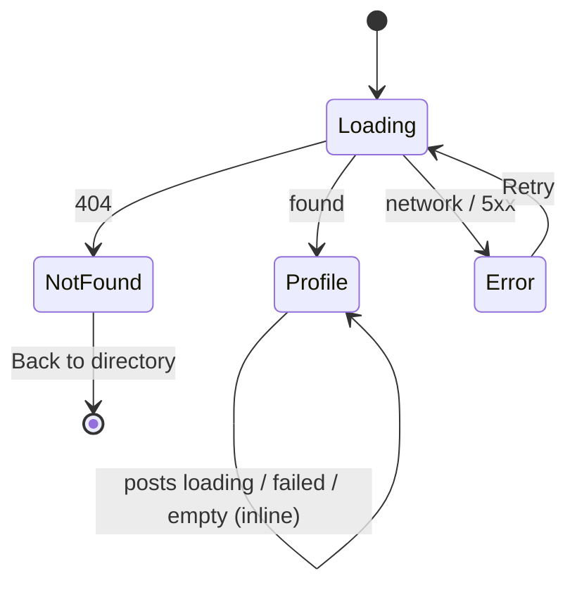

# Alumni profile page (/alumni/:id)

| Field | Value |
|---|---|
| REQ | REQ-008 |
| Status | validated |
| Phase | spec |
| Created | 2026-10-06 |
| Primary repo | alumni-system |
| Touched repos | alumni-system |
| Related | REQ-006 (directory; its cards link here) · REQ-007 (app shell) · [[architecture/adr-01-ui-layer-headless-css-modules\|ADR-01]] · [[architecture/adr-02-server-state-tanstack-query\|ADR-02]] · [[architecture/adr-03-frontend-session-and-401-handling\|ADR-03]] · [[architecture/adr-08-route-code-splitting-and-url-list-state\|ADR-08]] |

## Problem

Every card in the directory links to `/alumni/:id`, and that address shows the not-found page. A signed-in user who finds someone in the directory cannot read their profile. The API can already return one profile (`GET /api/alumni/:id`) and one person's posts (`GET /api/posts/user/:userId`), and designs exist: `docs/design/screens/app/S3-Desktop-{Light,Dark}` and `S3-Phone-{Light,Dark}`.

## Goal

A signed-in user opens a directory card and lands on `/alumni/:id`: a page that matches the S3 designs (desktop and phone, light and dark) for every part the data supports. It shows the header (avatar, name, headline, LinkedIn link), About, Education, Employment, and Recent posts, plus a "Back to directory" link that returns to the exact search, filters and page they left. It has loading, not-found and error states. The page is loaded on demand (its own code chunk). **Parts of the S3 design that no stored data can fill are left out, not invented** (see "Data coverage").

## Data coverage (what the API can and cannot fill)

Checked against `AlumniDTO`, the `users` join, `PostQuery` and the seed data on 2026-10-06.

| S3 element | Available? | What the page does |
|---|---|---|
| Avatar, name | Yes: `users.photo_url`, `users.name` | Shown (photo, else initials) |
| Headline "Design Lead at Terra Climate · Class of 2017" | Yes: `job_title`, `current_company`, `graduation_year` | Shown; missing parts dropped, no stray separators |
| LinkedIn link | Yes: `linkedin_url` | Shown only when set |
| **Location** ("Lisbon, Portugal") | **No** column anywhere | **Left out** |
| **"Available for mentorship" badge** | **No** column anywhere | **Left out** |
| About | Yes: `bio` | Shown; section hidden when empty |
| **Education timeline** (school, degree, start–end years) | **Partial**: `users.university`, `department`, `graduation_year`. No degree, no start year | One entry: university as the title, "department · Class of YYYY" as the line under it. No range, no degree |
| **Employment timeline** (several jobs with dates) | **Partial**: only the current job (`job_title`, `current_company`). No history, no dates. `experience` is one free-text field | One entry: "job title · company", no dates. Plus `experience` shown as a paragraph (gate decision 2) |
| Recent posts (text, "3 days ago", "14 comments") | Yes: `GET /api/posts/user/:userId` (caption, `created_at`, `comment_count`) | Shown, newest first, capped (number set at `/architect`) |

`GET /api/alumni/:id` also returns the person's email to any signed-in user. The page does not display it.

## Non-goals

- Any backend, database or shared-type change. Location, mentorship, degree, start years and job history are **not** added; they need new columns and their own REQ.
- Editing a profile (S5 "My Profile") and any admin actions.
- The Feed page (S4). Post cards on this page are not links, because no `/feed` page exists yet.
- The header's other nav links (Feed, My Profile, Admin) and the phone bottom bar's other tabs.
- Showing another person's email, or a "message" / "connect" action.

## Acceptance criteria

- [ ] AC1. `/alumni/:id` is reachable only when signed in (a guest is sent to `/login` and back after login). It renders inside the existing app shell. Clicking a directory card opens it.
- [ ] AC2. The route is lazy-loaded (ADR-08): the production build emits it as its own chunk, the entry chunk does not contain the profile page code, and nothing outside the feature folder imports it statically. A chunk that fails to load shows the inner route error.
- [ ] AC3. Data comes through TanStack Query: one call for the profile (`GET /api/alumni/:id`) and one for the posts (`GET /api/posts/user/:userId`, using the profile's `user_id`). The call functions live in `services/`; no API call sits inside a UI component.
- [ ] AC4. **Header.** Shows avatar (photo if present, else initials), the name as the page's `h1`, the headline `job title at company · Class of YYYY` (any missing part is left out, with no stray "at" or "·"), and a LinkedIn link that opens in a new tab with `rel="noopener noreferrer"`. A missing LinkedIn value shows no link. A LinkedIn value that is not an `http(s)` address is not rendered as a link.
- [ ] AC5. **No invented data.** The page never shows a location, a mentorship badge, a degree, a year range, or dates for employment, since no data holds them. No placeholder text stands in for them.
- [ ] AC6. **About** shows `bio`; the section is not rendered when `bio` is empty.
- [ ] AC7. **Education** shows one timeline entry built from university, department and graduation year as described in the table; the section is not rendered when all three are empty. Parts that are missing are left out cleanly.
- [ ] AC8. **Employment** shows one timeline entry "job title · company" (either part alone if the other is missing), then the person's free-text `experience` as a paragraph in the timeline's text style (gate decision 2). The section is not rendered when job title, company and `experience` are all empty. `experience` is shown as plain text, never as markup.
- [ ] AC9. **Recent posts** lists the person's posts newest first: caption, relative time ("3 days ago") and comment count ("14 comments", "1 comment", "0 comments"), in the S3 card style. While posts load the section shows skeleton cards; a failed posts request shows an inline message with Retry **without** hiding the rest of the profile; a person with no posts shows a short "No posts yet" line.
- [ ] AC10. **Back to directory.** The link returns to `/directory` with the same search text, filters and page the user had when they opened the card. Opening `/alumni/:id` directly (a typed or shared link, a reload) falls back to plain `/directory`. The link is a real link (keyboard and middle-click work). On phone it appears as the S3 phone top bar (arrow + "Profile").
- [ ] AC11. **States.** *Loading*: skeletons shaped like the header and sections (not a blank page). *Not found*: an unknown id or a malformed one (the API answers 404 for both) shows a not-found message with a "Back to directory" link, not the generic error. *Error* (network, 5xx): message with a Retry button; a 401 still logs the user out through the existing handler (ADR-03). Changing from one profile id to another never shows the previous person's data as current.
- [ ] AC12. The page matches the S3 designs for desktop light, desktop dark, phone light and phone dark, for every element the data supports. Checked before finishing by putting the running page next to each design file in a browser at desktop and phone width, in light and dark; **every difference is listed in the verification report and fixed**, or named as deliberate. The only allowed deliberate classes are: the omitted elements in AC5; a design colour or radius that differs from the design token chosen for contrast (e.g. accent, card radius); the nearest type token where the design size has no token; and the shell's own parts that the design frame lacks (phone logo bar, a Profile tab in the bottom bar). *(Amended at the architect gate, 2026-10-07, after adversary finding ADV-002.)*
- [ ] AC13. Every colour, space, size and font value comes from design tokens (`var(--…)`). No hex value from the design files appears in source; lint and stylelint pass. Where the design uses a colour the tokens do not hold, that is reported at `/architect`, not hard-coded.
- [ ] AC14. Accessible: one `h1`; section headings in order; timelines are lists; the avatar is decorative or named once; the loading state is announced politely; links have readable names; focus order is sensible; works from 360px wide and at 200% zoom with no layout break. The document title names the person.
- [ ] AC15. Tests cover: the two API call functions; the pure helpers (headline, initials, safe LinkedIn, relative time, comment count wording); the page's loading, success, not-found and error states; each section hidden when its data is empty; the posts section's own loading, error and empty states; the Back link with and without saved directory state; the directory card handing over its search state; and that the route is lazy. `npm test`, `typecheck`, `lint`, `format:check` and `build` pass in `packages/frontend`.

## Flow

## Assumptions

- `GET /api/alumni/:id` and `GET /api/posts/user/:userId` behave as read on 2026-10-06 (both behind `authMiddleware`, any signed-in user may call them). The post list is not paged by the API; the page shows only the newest few. — `STATUS: needs verification` (`/architect` re-reads both controllers)
- `users.university` can be empty; then Education shows department and year only, or is hidden.
- The page title and headline use the same name the directory shows.
- The "Recent posts" relative time ("3 days ago") is computed in the browser from `created_at`; a date older than the design's examples (months, years) falls back to a plain date.
- Handing the directory's search state to the profile page is a change inside `features/directory` (the card), not an API change. How is `/architect`'s call (ADR-08 says list state lives in the URL, and a profile link must not break reload).
- The phone view uses the S3 phone top bar (arrow + "Profile") in place of the desktop text link. The bottom tab bar already exists from REQ-007. — `STATUS: needs verification` (S3 phone shows "Profile" tab active; the shell has no Profile tab)

## Open questions

None. Decided at the spec gate (2026-10-06): (1) elements with no data are left out, no backend change; (2) the free-text `experience` is shown under Employment.

## Out of scope (for now)

- Adding location, mentorship availability, degree, start year or job history (new columns, an API change, and edit forms in S5).
- Pagination or "see all posts" for a person.
- A Feed page that post cards could link to.
- Hiding the email from `GET /api/alumni/:id`. Not shown here, but still sent to any signed-in user; worth its own privacy REQ.

## Related

- Concepts: [[knowledge/concepts/route-layout]] · [[knowledge/concepts/design-tokens]]
- Lessons: [[knowledge/lessons/LESSON-REQ-006-1-url-mirrored-input-own-write|L-REQ-006-1]] · [[knowledge/lessons/LESSON-REQ-006-2-list-skeletons-strand-focus|L-REQ-006-2]] · [[knowledge/lessons/LESSON-REQ-004-2-check-design-colours-against-token-pairs|L-REQ-004-2]] · [[knowledge/lessons/LESSON-REQ-007-1-sticky-bottom-bar-needs-scroll-padding|L-REQ-007-1]]
- Gotchas: [[knowledge/gotchas#^g14|G14]] (malformed id is a 404)
- Designs: `docs/design/screens/app/S3-*`

## Backlinks

_(populated by /wrapup or manually)_
