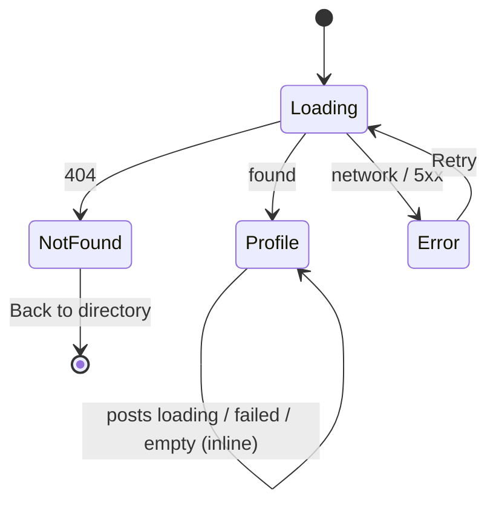
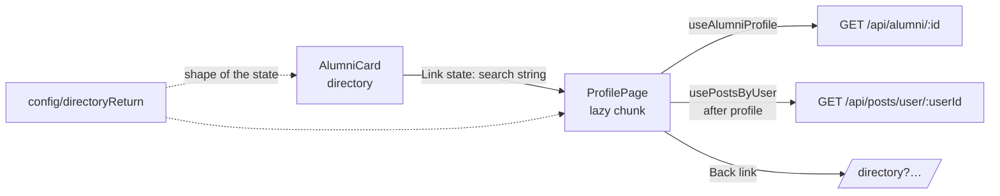
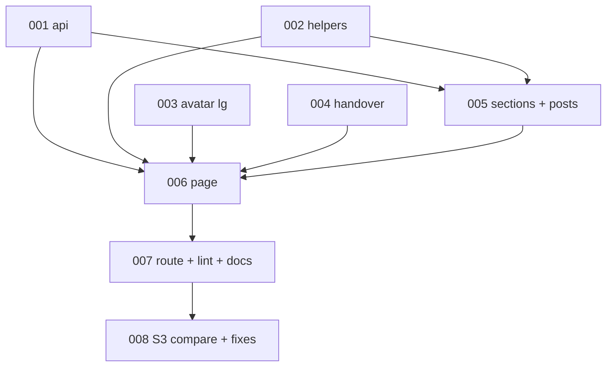

# REQ-008-alumni-profile-page — Review Packet (round 2)

`Packet: 82KB · round 2 · 14 files in this round · excluded: none matched`

This is a fix round. Round 1 findings are in `verification.md` (digest m1–m11). The fixes for m1–m6 are uncommitted in the working tree; the diff below is working tree vs the branch HEAD (the round-1 code), limited to the files this round touched. Spec, architecture and exploration sections are unchanged from round 1.

## Round 2 — what changed since round 1

| Finding | Disposition | Where |
|---|---|---|
| m1 CORR-001 failed refetch replaced loaded data with error view | fixed | ProfilePage.tsx, RecentPosts.tsx |
| m2 CORR-002 focus theft | fixed | ProfilePage.tsx |
| m3 UI-002 phone "Profile" text not in the link | fixed | BackLink.tsx/.css |
| m4 UI-001 posts alert narrower than cards | fixed | RecentPosts.module.css |
| m5 REFL-004 status line inside aria-busy | fixed | RecentPosts.tsx |
| m6 ARCH-002 + QUAL-004 hard-coded paths; profilePath() | fixed | config/directoryReturn.ts, navItems.tsx, HomePage.tsx, AlumniCard.tsx |
| m7–m11 | your call, not in this round | — |

Files in this round:
- packages/frontend/src/app/AppShell/navItems.tsx
- packages/frontend/src/config/README.md
- packages/frontend/src/config/directoryReturn.test.ts
- packages/frontend/src/config/directoryReturn.ts
- packages/frontend/src/features/directory/AlumniCard.tsx
- packages/frontend/src/features/home/HomePage.tsx
- packages/frontend/src/features/profile/BackLink.module.css
- packages/frontend/src/features/profile/BackLink.test.tsx
- packages/frontend/src/features/profile/BackLink.tsx
- packages/frontend/src/features/profile/ProfilePage.test.tsx
- packages/frontend/src/features/profile/ProfilePage.tsx
- packages/frontend/src/features/profile/RecentPosts.module.css
- packages/frontend/src/features/profile/RecentPosts.test.tsx
- packages/frontend/src/features/profile/RecentPosts.tsx

## Diff with full context (round 2: working tree vs branch HEAD)

```diff
diff --git a/packages/frontend/src/app/AppShell/navItems.tsx b/packages/frontend/src/app/AppShell/navItems.tsx
index ab2c034e..0a5db540 100644
--- a/packages/frontend/src/app/AppShell/navItems.tsx
+++ b/packages/frontend/src/app/AppShell/navItems.tsx
@@ -1,18 +1,19 @@
 import type { ReactNode } from 'react';
+import { DIRECTORY_PATH } from '@/config/directoryReturn';
 import { GridIcon } from './NavIcons';
 
 export interface NavItem {
   to: string;
   label: string;
   /** Tab-bar icon (decorative; the label names the link). */
   icon: ReactNode;
 }
 
 /**
  * The app's sections, shared by the header nav (desktop) and the bottom tab
  * bar (phone). Only pages that exist are listed: add Feed, Profile and Admin
  * here when their pages are built (S1 shows all four).
  */
 export const NAV_ITEMS: readonly NavItem[] = [
-  { to: '/directory', label: 'Directory', icon: <GridIcon /> },
+  { to: DIRECTORY_PATH, label: 'Directory', icon: <GridIcon /> },
 ];
diff --git a/packages/frontend/src/config/README.md b/packages/frontend/src/config/README.md
index b0435b81..b6357796 100644
--- a/packages/frontend/src/config/README.md
+++ b/packages/frontend/src/config/README.md
@@ -1,11 +1,11 @@
 # config/
 
 **Purpose:** app-wide constants that more than one layer needs, such as the brand name and support email (`brand.ts`). Constants and small pure helpers only (e.g. `supportMailto(subject)`): no React, no state, no I/O.
 
-It is also the meeting point for contracts between features that may not import each other. `directoryReturn.ts` owns the router state a directory card hands to the profile page (`directoryReturnState(search)`) and turns it back into the "Back to directory" target (`directoryReturnPath(state)`, plain `DIRECTORY_PATH` for anything unexpected). The state's key name lives only there.
+It is also the meeting point for contracts between features that may not import each other. `directoryReturn.ts` owns the directory and profile paths (`DIRECTORY_PATH`, and `profilePath(id)`, which URL-encodes the id), and the router state a directory card hands to the profile page (`directoryReturnState(search)`), which it turns back into the "Back to directory" target (`directoryReturnPath(state)`, plain `DIRECTORY_PATH` for anything unexpected). These paths and the state's key name live only there.
 
 **May import:** nothing internal. This folder is a leaf.
 
 **Must not import:** `@/app/**`, `@/features/**`, `@/components/**`, `@/store/**`, `@/services/**` (enforced by ESLint, for `@/…` and relative paths alike).
 
 **Imported by:** `app/` and `features/`. `components/ui/` may not import it (primitives take text such as the brand name as props).
diff --git a/packages/frontend/src/config/directoryReturn.test.ts b/packages/frontend/src/config/directoryReturn.test.ts
index 112ec6f4..dbb227a5 100644
--- a/packages/frontend/src/config/directoryReturn.test.ts
+++ b/packages/frontend/src/config/directoryReturn.test.ts
@@ -1,45 +1,64 @@
 import { describe, expect, it } from 'vitest';
-import { DIRECTORY_PATH, directoryReturnPath, directoryReturnState } from './directoryReturn';
+import {
+  DIRECTORY_PATH,
+  directoryReturnPath,
+  directoryReturnState,
+  profilePath,
+} from './directoryReturn';
 
 describe('directoryReturnState', () => {
   it('wraps the search string', () => {
     expect(directoryReturnState('?q=ann')).toEqual({ directorySearch: '?q=ann' });
   });
 
   it('round-trips through directoryReturnPath', () => {
     expect(directoryReturnPath(directoryReturnState('?q=ann&page=2'))).toBe(
       '/directory?q=ann&page=2',
     );
   });
 });
 
 describe('directoryReturnPath', () => {
   it('is /directory', () => {
     expect(DIRECTORY_PATH).toBe('/directory');
   });
 
   it('restores a stored search exactly', () => {
     expect(directoryReturnPath({ directorySearch: '?q=ann&page=2' })).toBe(
       '/directory?q=ann&page=2',
     );
   });
 
   it('gives /directory for an empty search', () => {
     expect(directoryReturnPath({ directorySearch: '' })).toBe('/directory');
   });
 
   it.each([
     ['null', null],
     ['undefined', undefined],
     ['a number', 42],
     ['a string', '?q=ann'],
     ['an object without the key', { other: '?q=ann' }],
     ['a non-string value', { directorySearch: 5 }],
     ['a null value', { directorySearch: null }],
     ['a value not starting with ?', { directorySearch: 'x' }],
     ['a path', { directorySearch: '/admin' }],
     ['a value with a hash', { directorySearch: '?a#b' }],
   ])('gives /directory for %s', (_label, state) => {
     expect(directoryReturnPath(state)).toBe('/directory');
   });
 });
+
+describe('profilePath', () => {
+  it('builds the path for a number id', () => {
+    expect(profilePath(7)).toBe('/alumni/7');
+  });
+
+  it('builds the path for a string id', () => {
+    expect(profilePath('42')).toBe('/alumni/42');
+  });
+
+  it('encodes odd characters so they stay in one path segment', () => {
+    expect(profilePath('a/b?c#d e')).toBe('/alumni/a%2Fb%3Fc%23d%20e');
+  });
+});
diff --git a/packages/frontend/src/config/directoryReturn.ts b/packages/frontend/src/config/directoryReturn.ts
index e048dcf4..604e2db1 100644
--- a/packages/frontend/src/config/directoryReturn.ts
+++ b/packages/frontend/src/config/directoryReturn.ts
@@ -1,37 +1,42 @@
 /**
  * The handover between the directory and the profile page (REQ-008).
  *
  * A directory card passes its current search string (`?q=…&page=…`) as router
  * state; the profile's "Back to directory" link reads it back so the search,
  * filters and page come back. This file is the only place that knows the
  * state's shape, so the two lazy features never import each other (ADR-08).
  */
 
 /** Where the directory lives. */
 export const DIRECTORY_PATH = '/directory';
 
+/** The profile page URL for an alumni id (`/alumni/<id>`, id URL-encoded). */
+export function profilePath(id: number | string): string {
+  return `/alumni/${encodeURIComponent(String(id))}`;
+}
+
 /** Router state a directory card hands to the profile page. */
 export interface DirectoryReturnState {
   directorySearch: string;
 }
 
 /** The state to put on a link from the directory, given `location.search`. */
 export function directoryReturnState(search: string): DirectoryReturnState {
   return { directorySearch: search };
 }
 
 /**
  * The "Back to directory" target for some router `state`. Restores the stored
  * search only when it is a string that is empty or starts with `?` and has no
  * `#`; anything else (no state, a reload in a fresh tab, tampered state) gives
  * the plain directory.
  */
 export function directoryReturnPath(state: unknown): string {
   if (typeof state !== 'object' || state === null || !('directorySearch' in state)) {
     return DIRECTORY_PATH;
   }
   const search = state.directorySearch;
   if (typeof search !== 'string' || search.includes('#')) return DIRECTORY_PATH;
   if (search !== '' && !search.startsWith('?')) return DIRECTORY_PATH;
   return DIRECTORY_PATH + search;
 }
diff --git a/packages/frontend/src/features/directory/AlumniCard.tsx b/packages/frontend/src/features/directory/AlumniCard.tsx
index 5df524c7..93b15fa8 100644
--- a/packages/frontend/src/features/directory/AlumniCard.tsx
+++ b/packages/frontend/src/features/directory/AlumniCard.tsx
@@ -1,79 +1,75 @@
 import type { AlumniListItem } from '@alumni/shared';
 import { Link, useLocation } from 'react-router';
 import { Avatar } from '@/components/ui/Avatar';
 import { Skeleton } from '@/components/ui/Skeleton';
-import { directoryReturnState } from '@/config/directoryReturn';
+import { directoryReturnState, profilePath } from '@/config/directoryReturn';
 import styles from './AlumniCard.module.css';
 
 export interface AlumniCardProps {
   alumnus: AlumniListItem;
 }
 
 /** Trimmed text, or undefined when it is missing or blank. */
 function present(value: string | null | undefined): string | undefined {
   const trimmed = value?.trim();
   return trimmed === undefined || trimmed === '' ? undefined : trimmed;
 }
 
 /** "Job title, Company", leaving out whichever part is missing (no stray comma). */
 function jobLine(alumnus: Pick<AlumniListItem, 'job_title' | 'current_company'>) {
   const parts = [present(alumnus.job_title), present(alumnus.current_company)].filter(
     (part): part is string => part !== undefined,
   );
   return parts.length > 0 ? parts.join(', ') : undefined;
 }
 
 /**
  * One directory result: the whole card is a single link to the profile.
  * The avatar is aria-hidden, so the link reads as the name, then the details.
  * No Mentor tag (not in this REQ's data). The link carries the current search
  * as router state so the profile's back link can restore it (REQ-008).
  */
 export function AlumniCard({ alumnus }: AlumniCardProps) {
   const { search } = useLocation();
   const name = present(alumnus.name) ?? '';
   const year = alumnus.graduation_year ?? undefined;
   const department = present(alumnus.department);
   const job = jobLine(alumnus);
 
   return (
-    <Link
-      to={`/alumni/${String(alumnus.id)}`}
-      state={directoryReturnState(search)}
-      className={styles.card}
-    >
+    <Link to={profilePath(alumnus.id)} state={directoryReturnState(search)} className={styles.card}>
       <div className={styles.header}>
         <Avatar name={name} photoUrl={present(alumnus.photo_url)} />
         <div className={styles.identity}>
           <p className={styles.name}>{name}</p>
           {year !== undefined && <p className={styles.meta}>Class of {year}</p>}
         </div>
       </div>
       {(department !== undefined || job !== undefined) && (
         <div className={styles.details}>
           {department !== undefined && <p className={styles.meta}>{department}</p>}
           {job !== undefined && <p className={styles.job}>{job}</p>}
         </div>
       )}
     </Link>
   );
 }
 
 /** A placeholder in the card's shape, shown while results load. Decorative. */
 export function AlumniCardSkeleton() {
   return (
     <div aria-hidden="true" className={styles.card} data-skeleton="">
       <div className={styles.header}>
         <Skeleton shape="circle" />
         <div className={styles.identity}>
           <Skeleton className={styles.skeletonName} />
           <Skeleton className={styles.skeletonMeta} />
         </div>
       </div>
       <div className={styles.details}>
         <Skeleton className={styles.skeletonMeta} />
         <Skeleton className={styles.skeletonJob} />
       </div>
     </div>
   );
 }
diff --git a/packages/frontend/src/features/home/HomePage.tsx b/packages/frontend/src/features/home/HomePage.tsx
index a2d113b8..059cd312 100644
--- a/packages/frontend/src/features/home/HomePage.tsx
+++ b/packages/frontend/src/features/home/HomePage.tsx
@@ -1,58 +1,59 @@
 import { Link } from 'react-router';
+import { DIRECTORY_PATH } from '@/config/directoryReturn';
 import { useCurrentUser } from '@/features/auth';
 import styles from './HomePage.module.css';
 
 interface QuickLink {
   to: string;
   title: string;
   description: string;
 }
 
 /**
  * The cards under the greeting (docs/design/screens/app/S1-*). Only pages
  * that exist are listed; add the feed, profile and admin cards when those
  * pages are built.
  */
 const QUICK_LINKS: readonly QuickLink[] = [
   {
-    to: '/directory',
+    to: DIRECTORY_PATH,
     title: 'Browse the directory',
     description: 'Find classmates by year, department or field',
   },
 ];
 
 /** "Amina Rao" -> "Amina". A blank name gives "" (the greeting then has no name). */
 function firstNameOf(name: string): string {
   return name.trim().split(/\s+/)[0] ?? '';
 }
 
 /**
  * The signed-in home. Rendered under RequireAuth, which waits for ['me'], so
  * the profile is already in the cache here.
  */
 export function HomePage() {
   const { data: user } = useCurrentUser();
   if (!user) return null;
   const firstName = firstNameOf(user.name);
 
   return (
     <section className={styles.home} aria-labelledby="home-title">
       <div className={styles.intro}>
         <h1 id="home-title" className={styles.title}>
           {firstName ? `Welcome back, ${firstName}` : 'Welcome back'}
         </h1>
         <p className={styles.subtitle}>Here&apos;s what&apos;s happening in your alumni network.</p>
       </div>
       <ul className={styles.cards}>
         {QUICK_LINKS.map((link) => (
           <li key={link.to} className={styles.item}>
             <Link to={link.to} className={styles.card}>
               <span className={styles.cardTitle}>{link.title}</span>
               <span className={styles.cardText}>{link.description}</span>
             </Link>
           </li>
         ))}
       </ul>
     </section>
   );
 }
diff --git a/packages/frontend/src/features/profile/BackLink.module.css b/packages/frontend/src/features/profile/BackLink.module.css
index cd9651af..e5fcea94 100644
--- a/packages/frontend/src/features/profile/BackLink.module.css
+++ b/packages/frontend/src/features/profile/BackLink.module.css
@@ -1,74 +1,79 @@
 /* Design: docs/design/screens/app/S3-Desktop-Light (chevron + "Back to
    directory", 13px medium, accent, 6px gap) and S3-Phone-Light (20px chevron
    in ink, "Profile" 14px semibold, 10px gap). On phone this is a slim row in
    the page under the shell's own bar (gate decision), not S3's separate bar.
    Off-scale gaps are calc() of tokens: 6px = space-1 + space-1 / 2,
-   10px = space-2 + space-1 / 2. The phone link gets space-1 padding (negative
-   margin keeps the layout) so its target is 28px, not 20px. The label is
-   clipped below 48rem, never display:none (G18). */
+   10px = space-2 + space-1 / 2. On phone the "Profile" title sits inside the
+   link, so the word is tappable too; the clipped label is absolutely
+   positioned there, so it takes no flex gap. The phone link gets space-1
+   padding (negative margin keeps the layout) so its target is 28px tall. The
+   label is clipped below 48rem, never display:none (G18). */
 
 .row {
   display: flex;
   align-items: center;
-  gap: calc(var(--space-2) + var(--space-1) / 2);
 }
 
 .link {
   display: inline-flex;
   align-items: center;
   gap: calc(var(--space-1) + var(--space-1) / 2);
   padding: var(--space-1);
   margin: calc(var(--space-1) * -1);
   color: var(--ink-primary);
   font: var(--text-label);
   line-height: var(--text-caption-line); /* S3's link text box is 16px tall */
   text-decoration: none;
   border-radius: var(--radius-sm);
 }
 
 .icon {
   flex: none;
   inline-size: 1.25rem;
   block-size: 1.25rem;
 }
 
 .title {
   color: var(--ink-primary);
   font-size: var(--text-body-sm-size);
   font-weight: var(--text-heading-sm-weight);
   line-height: var(--text-body-sm-line);
 }
 
 @media (width < 48rem) {
+  .link {
+    gap: calc(var(--space-2) + var(--space-1) / 2);
+  }
+
   .label {
     position: absolute;
     width: 1px;
     height: 1px;
     padding: 0;
     overflow: hidden;
     clip-path: inset(50%);
     white-space: nowrap;
     border: 0;
   }
 }
 
 @media (width >= 48rem) {
   .link {
     padding: 0;
     margin: 0;
     color: var(--accent);
   }
 
   .link:hover {
     color: var(--accent-strong);
   }
 
   .icon {
     inline-size: 0.875rem;
     block-size: 0.875rem;
   }
 
   .title {
     display: none;
   }
 }
diff --git a/packages/frontend/src/features/profile/BackLink.test.tsx b/packages/frontend/src/features/profile/BackLink.test.tsx
index 306bd95f..cf52e09e 100644
--- a/packages/frontend/src/features/profile/BackLink.test.tsx
+++ b/packages/frontend/src/features/profile/BackLink.test.tsx
@@ -1,55 +1,62 @@
 import { render, screen } from '@testing-library/react';
 import userEvent from '@testing-library/user-event';
 import { MemoryRouter, Route, Routes, useLocation } from 'react-router';
 import { describe, expect, it } from 'vitest';
 import { directoryReturnState } from '@/config/directoryReturn';
 import { BackLink } from './BackLink';
 
 function DirectoryProbe() {
   const location = useLocation();
   return <p>At {location.pathname + location.search}</p>;
 }
 
 function renderAt(state?: unknown) {
   return render(
     <MemoryRouter initialEntries={[{ pathname: '/alumni/7', state }]}>
       <Routes>
         <Route path="/alumni/:id" element={<BackLink />} />
         <Route path="/directory" element={<DirectoryProbe />} />
       </Routes>
     </MemoryRouter>,
   );
 }
 
 const link = () => screen.getByRole('link', { name: 'Back to directory' });
 
 describe('BackLink', () => {
   it('goes back to the search the card was clicked from', async () => {
     renderAt(directoryReturnState('?q=ann&page=2'));
     expect(link()).toHaveAttribute('href', '/directory?q=ann&page=2');
 
     await userEvent.setup().click(link());
     expect(screen.getByText('At /directory?q=ann&page=2')).toBeInTheDocument();
   });
 
   it.each([undefined, null, { directorySearch: 'q=ann' }, { directorySearch: '?q=a#x' }])(
     'goes to the plain directory without a usable state (%j)',
     (state) => {
       renderAt(state);
       expect(link()).toHaveAttribute('href', '/directory');
     },
   );
 
   it('is the only link, named "Back to directory" (its text is in the DOM at every width)', () => {
     renderAt();
     expect(screen.getAllByRole('link')).toHaveLength(1);
-    expect(link()).toHaveTextContent(/^Back to directory$/);
+    expect(link()).toHaveAccessibleName('Back to directory');
+    expect(screen.getByText('Back to directory')).not.toHaveAttribute('aria-hidden');
   });
 
-  it('keeps the phone "Profile" title out of the accessibility tree', () => {
+  it('puts the phone "Profile" title inside the link, out of the accessibility tree', () => {
     renderAt();
     const title = screen.getByText('Profile');
     expect(title).toHaveAttribute('aria-hidden', 'true');
-    expect(link()).not.toContainElement(title);
+    expect(link()).toContainElement(title);
+  });
+
+  it('follows the link when the "Profile" title is tapped', async () => {
+    renderAt(directoryReturnState('?q=ann'));
+    await userEvent.setup().click(screen.getByText('Profile'));
+    expect(screen.getByText('At /directory?q=ann')).toBeInTheDocument();
   });
 });
diff --git a/packages/frontend/src/features/profile/BackLink.tsx b/packages/frontend/src/features/profile/BackLink.tsx
index 92762aa9..71193cb1 100644
--- a/packages/frontend/src/features/profile/BackLink.tsx
+++ b/packages/frontend/src/features/profile/BackLink.tsx
@@ -1,40 +1,41 @@
 import { Link, useLocation } from 'react-router';
 import { directoryReturnPath } from '@/config/directoryReturn';
 import styles from './BackLink.module.css';
 
 /**
  * The profile's top row: one link back to the directory, restoring the search,
  * filters and page the card was clicked from (router state, REQ-008 AC10).
  * From 48rem: chevron + "Back to directory" (S3 desktop). Below 48rem: the
- * chevron alone, its text visually hidden (clip, not display:none, so the name
- * stays), with an aria-hidden "Profile" title beside it (S3 phone's bar). The
+ * chevron and the "Profile" title (S3 phone's bar), both inside the link so the
+ * word is part of the tap target; "Back to directory" is visually hidden (clip,
+ * not display:none, so the name stays) and "Profile" is aria-hidden, so the
  * link's name is "Back to directory" at both widths.
  */
 export function BackLink() {
   // location.state is typed `any`; directoryReturnPath checks its shape.
   const state: unknown = useLocation().state;
 
   return (
     <div className={styles.row}>
       <Link to={directoryReturnPath(state)} className={styles.link}>
         <svg
           className={styles.icon}
           viewBox="0 0 24 24"
           fill="none"
           stroke="currentColor"
           strokeWidth={2}
           strokeLinecap="round"
           strokeLinejoin="round"
           aria-hidden="true"
           focusable={false}
         >
           <polyline points="15 18 9 12 15 6" />
         </svg>
         <span className={styles.label}>Back to directory</span>
+        <span className={styles.title} aria-hidden="true">
+          Profile
+        </span>
       </Link>
-      <span className={styles.title} aria-hidden="true">
-        Profile
-      </span>
     </div>
   );
 }
diff --git a/packages/frontend/src/features/profile/ProfilePage.test.tsx b/packages/frontend/src/features/profile/ProfilePage.test.tsx
index f958b59e..ffa96b0b 100644
--- a/packages/frontend/src/features/profile/ProfilePage.test.tsx
+++ b/packages/frontend/src/features/profile/ProfilePage.test.tsx
@@ -1,329 +1,364 @@
 import type { Alumni, MyProfile, Post } from '@alumni/shared';
 import { act, render, screen, waitFor, within } from '@testing-library/react';
 import userEvent from '@testing-library/user-event';
 import {
   AxiosError,
   type AxiosAdapter,
   type AxiosResponse,
   type InternalAxiosRequestConfig,
 } from 'axios';
 import { createStore } from 'jotai';
 import { createMemoryRouter, type InitialEntry } from 'react-router';
 // react-router/dom's RouterProvider wires flushSync, as App.tsx does.
 import { RouterProvider } from 'react-router/dom';
 import { afterEach, beforeEach, describe, expect, it } from 'vitest';
 import { AppProviders } from '@/app/providers';
 import { createQueryClient } from '@/app/queryClient';
 import { createRoutes } from '@/app/router';
 import { directoryReturnState } from '@/config/directoryReturn';
 import { RequireAuth, SESSION_EXPIRED_MESSAGE } from '@/features/auth';
 import { getToken, setToken } from '@/services/authToken';
 import { httpClient, setUnauthorizedHandler } from '@/services/httpClient';
 import { ProfilePage } from './ProfilePage';
 import { LOAD_ERROR_HEADING, LOADING_HEADING, NOT_FOUND_HEADING } from './ProfileStates';
 
 // ---- a fake API at the axios adapter (the REQ-001 test policy) ----
 // The token builder repeats the one in DirectoryPage.test.tsx and five other
 // files (G26); a shared src/test/ helper is the open follow-up QUAL-002.
 
 function base64url(value: object): string {
   return window
     .btoa(JSON.stringify(value))
     .replace(/=+$/, '')
     .replace(/\+/g, '-')
     .replace(/\//g, '_');
 }
 
 /** A JWT-shaped token that expires in an hour. */
 function makeToken(): string {
   const exp = Math.floor(Date.now() / 1000) + 3600;
   return `${base64url({ alg: 'HS256' })}.${base64url({ sub: 1, exp })}.sig`;
 }
 
 const ME: MyProfile = {
   user_id: 1,
   name: 'Sam Moreau',
   email: 'sam@example.com',
   role: 'alumni',
   alumni_id: 1,
   has_alumni_profile: true,
   student_id: null,
   has_student_profile: false,
 };
 
 const AMIRA: Alumni = {
   id: 7,
   user_id: 70,
   name: 'Amira Mendes',
   email: 'amira@example.com',
   job_title: 'Design Lead',
   current_company: 'Terra Climate',
   graduation_year: 2017,
   department: 'Product Design',
   university: 'University of Toronto',
   bio: 'Design lead focused on climate-tech products.',
   experience: 'Ten years in product design.',
   linkedin_url: 'https://www.linkedin.com/in/amira',
 };
 
 const BORIS: Alumni = { id: 8, user_id: 80, name: 'Boris Okafor' };
 
 const POSTS: Post[] = [
   {
     id: 1,
     user_id: 70,
     caption: 'Hiring a product designer.',
     comment_count: 14,
     created_at: new Date().toISOString() as unknown as Date,
   },
 ];
 
 type Responder = (config: InternalAxiosRequestConfig) => Promise<AxiosResponse>;
 
 function ok(data: unknown): Responder {
   return (config) => Promise.resolve({ data, status: 200, statusText: 'OK', headers: {}, config });
 }
 
 function fail(status: number): Responder {
   return (config) =>
     Promise.reject(
       new AxiosError('Request failed', AxiosError.ERR_BAD_REQUEST, config, null, {
         data: { message: 'nope' },
         status,
         statusText: String(status),
         headers: {},
         config,
       }),
     );
 }
 
 /** A responder that waits until `release()` is called. */
 function held(data: unknown) {
   let release: () => void = () => undefined;
   const responder: Responder = (config) =>
     new Promise((resolve) => {
       release = () => {
         resolve({ data, status: 200, statusText: 'OK', headers: {}, config });
       };
     });
   return {
     responder,
     release: () => {
       release();
     },
   };
 }
 
 const originalAdapter = httpClient.defaults.adapter;
+/** The QueryClient of the latest renderAt, for driving background refetches. */
+let currentClient = createQueryClient();
 const requests: string[] = [];
 
 interface Api {
   /** Answers per alumni id (`'7'`, `'abc'`); each call takes the next one, the last repeats. */
   profile: Record<string, Responder[]>;
   posts?: Responder;
 }
 
 function mockApi({ profile, posts = ok(POSTS) }: Api): void {
   const calls: Record<string, number> = {};
   const adapter: AxiosAdapter = (config) => {
     const url = config.url ?? '';
     requests.push(url);
     if (url === '/me') return ok(ME)(config);
     if (url.startsWith('/posts/user/')) return posts(config);
     const match = /^\/alumni\/([^/]+)$/.exec(url);
     const id = match?.[1] === undefined ? undefined : decodeURIComponent(match[1]);
     const answers = id === undefined ? undefined : profile[id];
     if (id === undefined || answers === undefined) {
       return Promise.reject(new Error(`Unmocked request: ${url}`));
     }
     const n = (calls[id] = (calls[id] ?? 0) + 1);
     const answer = answers[Math.min(n, answers.length) - 1];
     if (answer === undefined) return Promise.reject(new Error(`No answer: ${url}`));
     return answer(config);
   };
   httpClient.defaults.adapter = adapter;
 }
 
 const PAGE_ROUTES = [
   {
     element: <RequireAuth />,
     children: [
       { path: 'alumni/:id', element: <ProfilePage /> },
       { path: 'directory', element: <p>Directory stub</p> },
     ],
   },
 ];
 
 /** Signed in, at `entry`, with the real shells, session bridge and login page. */
 function renderAt(entry: InitialEntry) {
   setToken(makeToken());
   const client = createQueryClient();
   // Errors end at once here; the app's retry policy is tested in queryClient.test.ts.
   client.setDefaultOptions({ queries: { ...client.getDefaultOptions().queries, retry: false } });
+  currentClient = client;
   const router = createMemoryRouter(createRoutes(PAGE_ROUTES), { initialEntries: [entry] });
   render(
     <AppProviders queryClient={client} store={createStore()}>
       <RouterProvider router={router} />
     </AppProviders>,
   );
   return router;
 }
 
 const h1 = (name: string) => screen.findByRole('heading', { level: 1, name });
 
 async function expectFocusAndTitle(name: string, title: string) {
   const heading = await h1(name);
   await waitFor(() => {
     expect(heading).toHaveFocus();
   });
   await waitFor(() => {
     expect(document.title).toBe(title);
   });
 }
 
 const backLink = () => screen.getByRole('link', { name: 'Back to directory' });
 
 beforeEach(() => {
   requests.length = 0;
 });
 
 afterEach(() => {
   httpClient.defaults.adapter = originalAdapter;
   setUnauthorizedHandler(null);
 });
 
 describe('ProfilePage', () => {
   it('shows the profile, focuses its h1 and titles the tab with the name', async () => {
     mockApi({ profile: { '7': [ok(AMIRA)] } });
     renderAt('/alumni/7');
 
     await expectFocusAndTitle('Amira Mendes', 'Amira Mendes · Alma');
     expect(screen.getAllByRole('heading', { level: 1 })).toHaveLength(1);
     expect(screen.getByText('Design Lead at Terra Climate · Class of 2017')).toBeInTheDocument();
     for (const name of ['About', 'Education', 'Employment', 'Recent posts']) {
       expect(screen.getByRole('region', { name })).toBeInTheDocument();
     }
     expect(await screen.findByText('Hiring a product designer.')).toBeInTheDocument();
     expect(requests).toContain('/alumni/7');
     // The posts endpoint takes the profile's user_id, not the alumni id.
     expect(requests).toContain('/posts/user/70');
     expect(screen.getByRole('main')).not.toHaveTextContent('amira@example.com');
   });
 
   it('shows a focused "Loading profile" h1, a status line and the loading title', async () => {
     const answer = held(AMIRA);
     mockApi({ profile: { '7': [answer.responder] } });
     renderAt('/alumni/7');
 
     await expectFocusAndTitle(LOADING_HEADING, 'Profile · Alma');
     expect(screen.getByRole('status')).toHaveTextContent('Loading profile…');
     expect(backLink()).toBeInTheDocument();
 
     act(() => {
       answer.release();
     });
     await expectFocusAndTitle('Amira Mendes', 'Amira Mendes · Alma');
   });
 
   it.each(['999', 'abc'])('shows "Profile not found" for /alumni/%s (the API 404s)', async (id) => {
     mockApi({ profile: { [id]: [fail(404)] } });
     renderAt(`/alumni/${id}`);
 
     await expectFocusAndTitle(NOT_FOUND_HEADING, 'Profile not found · Alma');
     expect(backLink()).toHaveAttribute('href', '/directory');
     expect(screen.queryByRole('button', { name: 'Retry' })).not.toBeInTheDocument();
     expect(requests).toContain(`/alumni/${id}`);
   });
 
   it('shows the load error on a 500, and Retry loads the profile', async () => {
     mockApi({ profile: { '7': [fail(500), ok(AMIRA)] } });
     const user = userEvent.setup();
     renderAt('/alumni/7');
 
     await expectFocusAndTitle(LOAD_ERROR_HEADING, "Couldn't load this profile · Alma");
     await user.click(screen.getByRole('button', { name: 'Retry' }));
 
     await expectFocusAndTitle('Amira Mendes', 'Amira Mendes · Alma');
     expect(requests.filter((url) => url === '/alumni/7')).toHaveLength(2);
   });
 
+  it('keeps the profile when a background refetch fails', async () => {
+    mockApi({ profile: { '7': [ok(AMIRA), fail(500)] } });
+    renderAt('/alumni/7');
+    await expectFocusAndTitle('Amira Mendes', 'Amira Mendes · Alma');
+
+    const key = ['alumni', 'profile', '7'];
+    await act(() => currentClient.refetchQueries({ queryKey: key }));
+
+    expect(currentClient.getQueryState(key)?.status).toBe('error');
+    expect(requests.filter((url) => url === '/alumni/7')).toHaveLength(2);
+    expect(screen.getByRole('heading', { level: 1, name: 'Amira Mendes' })).toBeInTheDocument();
+    expect(screen.queryByText(LOAD_ERROR_HEADING)).not.toBeInTheDocument();
+  });
+
+  it('leaves focus on the Back link when the user tabbed to it while loading', async () => {
+    const answer = held(AMIRA);
+    mockApi({ profile: { '7': [answer.responder] } });
+    const user = userEvent.setup();
+    renderAt('/alumni/7');
+    await expectFocusAndTitle(LOADING_HEADING, 'Profile · Alma');
+
+    // The Back link sits just before the focused h1.
+    await user.tab({ shift: true });
+    expect(backLink()).toHaveFocus();
+
+    act(() => {
+      answer.release();
+    });
+    await h1('Amira Mendes');
+    expect(backLink()).toHaveFocus();
+  });
+
   it('a 401 ends the session through the existing handler', async () => {
     mockApi({ profile: { '7': [fail(401)] } });
     const router = renderAt('/alumni/7');
 
     expect(await screen.findByText(SESSION_EXPIRED_MESSAGE)).toBeInTheDocument();
     expect(router.state.location.pathname).toBe('/login');
     expect(getToken()).toBeNull();
   });
 
   it('a new id shows the loading state, never the previous person', async () => {
     const boris = held(BORIS);
     mockApi({ profile: { '7': [ok(AMIRA)], '8': [boris.responder] } });
     const router = renderAt('/alumni/7');
     await h1('Amira Mendes');
 
     await act(() => router.navigate('/alumni/8'));
     await expectFocusAndTitle(LOADING_HEADING, 'Profile · Alma');
     expect(screen.queryByText('Amira Mendes')).not.toBeInTheDocument();
 
     act(() => {
       boris.release();
     });
     await expectFocusAndTitle('Boris Okafor', 'Boris Okafor · Alma');
   });
 
   it('keeps the profile when the posts fail', async () => {
     mockApi({ profile: { '7': [ok(AMIRA)] }, posts: fail(500) });
     renderAt('/alumni/7');
 
     const posts = await screen.findByRole('region', { name: 'Recent posts' });
     expect(await within(posts).findByRole('alert')).toHaveTextContent("Posts didn't load");
     expect(screen.getByRole('heading', { level: 1, name: 'Amira Mendes' })).toBeInTheDocument();
     expect(screen.getByRole('region', { name: 'About' })).toBeInTheDocument();
   });
 
   it('hides every part a sparse profile has no data for', async () => {
     mockApi({ profile: { '8': [ok(BORIS)] }, posts: ok([]) });
     renderAt('/alumni/8');
 
     await h1('Boris Okafor');
     for (const name of ['About', 'Education', 'Employment']) {
       expect(screen.queryByRole('region', { name })).not.toBeInTheDocument();
     }
     expect(screen.queryByText(/Class of| at /)).not.toBeInTheDocument();
     expect(screen.queryByRole('link', { name: /LinkedIn/ })).not.toBeInTheDocument();
     expect(await screen.findByText('No posts yet')).toBeInTheDocument();
   });
 
   it('shows a javascript: LinkedIn value as no link at all', async () => {
     mockApi({ profile: { '7': [ok({ ...AMIRA, linkedin_url: 'javascript:alert(1)' })] } });
     renderAt('/alumni/7');
 
     await h1('Amira Mendes');
     expect(screen.queryByRole('link', { name: /LinkedIn/ })).not.toBeInTheDocument();
     expect(document.querySelector('a[href^="javascript"]')).toBeNull();
   });
 
   it('links back to the directory search the card was clicked from', async () => {
     mockApi({ profile: { '7': [ok(AMIRA)] } });
     const router = renderAt({
       pathname: '/alumni/7',
       state: directoryReturnState('?q=ann&page=2'),
     });
 
     await h1('Amira Mendes');
     expect(backLink()).toHaveAttribute('href', '/directory?q=ann&page=2');
     await userEvent.setup().click(backLink());
     expect(router.state.location.pathname + router.state.location.search).toBe(
       '/directory?q=ann&page=2',
     );
   });
 
   it('links back to the plain directory without router state', async () => {
     mockApi({ profile: { '7': [ok(AMIRA)] } });
     renderAt('/alumni/7');
 
     await h1('Amira Mendes');
     expect(backLink()).toHaveAttribute('href', '/directory');
   });
 });
diff --git a/packages/frontend/src/features/profile/ProfilePage.tsx b/packages/frontend/src/features/profile/ProfilePage.tsx
index ec00a0e2..932c870e 100644
--- a/packages/frontend/src/features/profile/ProfilePage.tsx
+++ b/packages/frontend/src/features/profile/ProfilePage.tsx
@@ -1,73 +1,82 @@
 import { useEffect, useRef, type ReactNode } from 'react';
 import { useParams } from 'react-router';
 import { isNotFoundError } from '@/services/httpErrors';
 import { AboutSection } from './AboutSection';
 import { BackLink } from './BackLink';
 import { EducationSection } from './EducationSection';
 import { EmploymentSection } from './EmploymentSection';
 import { ProfileHeader } from './ProfileHeader';
 import { ProfileLoadError, ProfileNotFound, ProfileSkeleton } from './ProfileStates';
 import { RecentPosts } from './RecentPosts';
 import { useAlumniProfile } from './useAlumniProfile';
 import styles from './ProfilePage.module.css';
 
 type View = 'loading' | 'notFound' | 'error' | 'profile';
 
 /**
  * One alumni profile at `/alumni/:id` (S3). The id comes from the URL; the
  * profile query decides the state: loading, not found (a 404, which the API
  * also gives for a malformed id), load error with Retry, or the profile. Each
  * state has its own h1, and focus moves to it whenever the state or the id
- * changes, so focus is never left on a node that unmounted (L-REQ-006-2).
- * Recent posts owns its own states, so a posts failure keeps the profile.
+ * changes, so focus is never left on a node that unmounted (L-REQ-006-2). It
+ * moves only when focus is on the body or on a node that left the page (a
+ * clicked directory card, a Retry that succeeded); a control the user tabbed
+ * to, such as the Back link, keeps it. A failed background refetch keeps the
+ * profile already shown (TanStack Query keeps `data` and sets `isError`); only
+ * a 404 replaces it. Recent posts owns its own states, so a posts failure
+ * keeps the profile.
  */
 export function ProfilePage() {
   const { id } = useParams();
   const headingRef = useRef<HTMLHeadingElement>(null);
   const profile = useAlumniProfile(id);
 
   let view: View;
   if (id === undefined || id === '') view = 'notFound';
   else if (profile.isPending) view = 'loading';
-  else if (profile.isError) view = isNotFoundError(profile.error) ? 'notFound' : 'error';
+  else if (profile.isError && isNotFoundError(profile.error)) view = 'notFound';
+  else if (profile.isError && profile.data === undefined) view = 'error';
   else view = 'profile';
 
   useEffect(() => {
-    headingRef.current?.focus();
+    const active = document.activeElement;
+    if (active === null || active === document.body || !active.isConnected) {
+      headingRef.current?.focus();
+    }
   }, [id, view]);
 
   let body: ReactNode;
   if (view === 'loading') {
     body = <ProfileSkeleton headingRef={headingRef} />;
   } else if (view === 'notFound') {
     body = <ProfileNotFound headingRef={headingRef} />;
   } else if (view === 'error') {
     body = (
       <ProfileLoadError
         headingRef={headingRef}
         retrying={profile.isFetching}
         onRetry={() => {
           void profile.refetch();
         }}
       />
     );
   } else if (profile.data !== undefined) {
     const alumni = profile.data;
     body = (
       <>
         <ProfileHeader alumni={alumni} headingRef={headingRef} />
         <AboutSection alumni={alumni} />
         <EducationSection alumni={alumni} />
         <EmploymentSection alumni={alumni} />
         <RecentPosts userId={alumni.user_id} />
       </>
     );
   }
 
   return (
     <div className={styles.page}>
       <BackLink />
       {body}
     </div>
   );
 }
diff --git a/packages/frontend/src/features/profile/RecentPosts.module.css b/packages/frontend/src/features/profile/RecentPosts.module.css
index 42a1a08c..68d3e9e7 100644
--- a/packages/frontend/src/features/profile/RecentPosts.module.css
+++ b/packages/frontend/src/features/profile/RecentPosts.module.css
@@ -1,71 +1,75 @@
 /* Design: S3 Recent posts (desktop and phone). Card radius is --radius-lg
    (design 12px; token 14px). Off-scale spacing is calc() of tokens: card
    padding 14px phone / 16px desktop, caption-to-meta gap 6px / 8px. Caption
    label size on phone, text-body-sm from 48rem (design 13px / 14px); meta text-caption (design 11px / 12px)
    in ink-muted. Cards are not links (no post page yet), so no hover state.
    .card overrides Card's padding and gap: Card's CSS loads first (it is in
-   the main bundle via RouteError), so these same-specificity rules win. */
+   the main bundle via RouteError), so these same-specificity rules win.
+   .error: the alert spans the column like the post cards; Retry sits under
+   it, start-aligned (as on ProfileLoadError). */
 
 .list {
   display: flex;
   flex-direction: column;
   gap: var(--space-3);
   margin: 0;
   padding: 0;
   list-style: none;
 }
 
 .card {
   gap: calc(var(--space-1) + var(--space-1) / 2);
   padding: calc(var(--space-3) + var(--space-1) / 2);
   min-width: 0;
 }
 
 .caption {
   margin: 0;
   color: var(--ink-primary);
   font: var(--text-body-sm);
   font-size: var(--text-label-size);
   overflow-wrap: anywhere;
   white-space: pre-line;
 }
 
 .meta {
   margin: 0;
   color: var(--ink-muted);
   font: var(--text-caption);
   font-weight: var(--text-body-weight);
 }
 
 .skeletonMeta {
   inline-size: 40%;
   block-size: var(--text-caption-line);
 }
 
 .empty {
   margin: 0;
   color: var(--ink-secondary);
   font: var(--text-body-sm);
 }
 
 .error {
   display: flex;
   flex-direction: column;
-  align-items: flex-start;
+  align-items: stretch;
   gap: var(--space-3);
+  min-width: 0;
 }
 
 .retry {
+  align-self: flex-start;
   padding: var(--space-2) var(--space-4);
 }
 
 @media (width >= 48rem) {
   .card {
     gap: var(--space-2);
     padding: var(--space-4);
   }
 
   .caption {
     font-size: var(--text-body-sm-size);
   }
 }
diff --git a/packages/frontend/src/features/profile/RecentPosts.test.tsx b/packages/frontend/src/features/profile/RecentPosts.test.tsx
index 1a9ed568..39b1434f 100644
--- a/packages/frontend/src/features/profile/RecentPosts.test.tsx
+++ b/packages/frontend/src/features/profile/RecentPosts.test.tsx
@@ -1,198 +1,215 @@
 import type { Post } from '@alumni/shared';
 import { QueryClientProvider } from '@tanstack/react-query';
-import { render, screen, within } from '@testing-library/react';
+import { act, render, screen, within } from '@testing-library/react';
 import userEvent from '@testing-library/user-event';
 import {
   AxiosError,
   type AxiosAdapter,
   type AxiosResponse,
   type InternalAxiosRequestConfig,
 } from 'axios';
 import { afterEach, beforeEach, describe, expect, it } from 'vitest';
 import { createQueryClient } from '@/app/queryClient';
 import { httpClient } from '@/services/httpClient';
 import { RecentPosts, RECENT_POSTS_LIMIT } from './RecentPosts';
 
 // ---- a fake API at the axios adapter (the REQ-001 test policy) ----
 
 type Responder = (config: InternalAxiosRequestConfig) => Promise<AxiosResponse>;
 
 const ok =
   (data: unknown): Responder =>
   (config) =>
     Promise.resolve({ data, status: 200, statusText: 'OK', headers: {}, config });
 
 const fail =
   (status: number): Responder =>
   (config) =>
     Promise.reject(
       new AxiosError('Request failed', AxiosError.ERR_BAD_RESPONSE, config, null, {
         data: { message: 'nope' },
         status,
         statusText: String(status),
         headers: {},
         config,
       }),
     );
 
 /** Never answers: the query stays pending. */
 const never: Responder = () => new Promise<AxiosResponse>(() => undefined);
 
 const originalAdapter = httpClient.defaults.adapter;
 const requests: string[] = [];
 
 /** Each GET /posts/user/:id takes the next responder; the last one repeats. */
 function mockPosts(...responders: Responder[]): void {
   const adapter: AxiosAdapter = (config) => {
     const url = config.url ?? '';
     if (!url.startsWith('/posts/user/')) return Promise.reject(new Error(`Unmocked: ${url}`));
     requests.push(url);
     const responder = responders[Math.min(requests.length, responders.length) - 1];
     if (responder === undefined) return Promise.reject(new Error('no responder'));
     return responder(config);
   };
   httpClient.defaults.adapter = adapter;
 }
 
 const DAY_MS = 24 * 60 * 60 * 1000;
 
 /** A post `daysAgo` days old. */
 function post(id: number, overrides: Partial<Post> = {}, daysAgo = 3): Post {
   return {
     id,
     user_id: 7,
     caption: `Post ${String(id)}`,
     comment_count: 2,
     created_at: new Date(Date.now() - daysAgo * DAY_MS).toISOString() as unknown as Date,
     ...overrides,
   };
 }
 
 function renderPosts(userId = 7) {
   const client = createQueryClient();
   // Errors end at once here; the app's retry policy is tested in queryClient.test.ts.
   client.setDefaultOptions({
     queries: { ...client.getDefaultOptions().queries, retry: false },
   });
-  return render(
+  render(
     <QueryClientProvider client={client}>
       <RecentPosts userId={userId} />
     </QueryClientProvider>,
   );
+  return client;
 }
 
 const region = () => screen.getByRole('region', { name: 'Recent posts' });
 
 beforeEach(() => {
   requests.length = 0;
 });
 
 afterEach(() => {
   httpClient.defaults.adapter = originalAdapter;
 });
 
 describe('RecentPosts', () => {
   it("asks for the profile's user id", async () => {
     mockPosts(ok([post(1)]));
     renderPosts(42);
     await screen.findByText('Post 1');
     expect(requests).toEqual(['/posts/user/42']);
   });
 
   it('shows skeleton cards and a loading status while posts load', () => {
     mockPosts(never);
     renderPosts();
     expect(screen.getByRole('heading', { level: 2, name: 'Recent posts' })).toBeInTheDocument();
     expect(within(region()).getByRole('status')).toHaveTextContent('Loading posts…');
-    expect(region().querySelector('[aria-busy="true"]')).not.toBeNull();
+    const busy = region().querySelector('[aria-busy="true"]');
+    expect(busy).not.toBeNull();
+    // A live region inside a busy subtree may not be announced (REFL-004).
+    expect(busy?.contains(within(region()).getByRole('status'))).toBe(false);
     expect(screen.queryByRole('article')).not.toBeInTheDocument();
   });
 
   it('shows an inline error with Retry, and Retry loads the posts', async () => {
     mockPosts(fail(500), ok([post(1)]));
     const user = userEvent.setup();
     renderPosts();
 
     const alert = await within(region()).findByRole('alert');
     expect(alert).toHaveTextContent("Posts didn't load");
     await user.click(within(region()).getByRole('button', { name: 'Retry' }));
 
     expect(await within(region()).findByText('Post 1')).toBeInTheDocument();
     expect(within(region()).queryByRole('alert')).not.toBeInTheDocument();
     expect(requests).toHaveLength(2);
   });
 
+  it('keeps the loaded posts when a background refetch fails', async () => {
+    mockPosts(ok([post(1)]), fail(500));
+    const client = renderPosts();
+    await within(region()).findByText('Post 1');
+
+    await act(() => client.refetchQueries({ queryKey: ['posts', 'user', 7] }));
+
+    expect(client.getQueryState(['posts', 'user', 7])?.status).toBe('error');
+    expect(requests).toHaveLength(2);
+    expect(within(region()).getByText('Post 1')).toBeInTheDocument();
+    expect(within(region()).queryByRole('alert')).not.toBeInTheDocument();
+  });
+
   it('says "No posts yet" when the person has none', async () => {
     mockPosts(ok([]));
     renderPosts();
     expect(await within(region()).findByText('No posts yet')).toBeInTheDocument();
     expect(screen.queryByRole('list')).not.toBeInTheDocument();
   });
 
   it(`shows only the newest ${String(RECENT_POSTS_LIMIT)} of 7 posts, in API order`, async () => {
     mockPosts(ok([1, 2, 3, 4, 5, 6, 7].map((id) => post(id))));
     renderPosts();
     await screen.findByText('Post 1');
     const articles = within(region()).getAllByRole('article');
     expect(articles).toHaveLength(5);
     expect(articles.map((a) => a.querySelector('p')?.textContent)).toEqual([
       'Post 1',
       'Post 2',
       'Post 3',
       'Post 4',
       'Post 5',
     ]);
     expect(screen.queryByText('Post 6')).not.toBeInTheDocument();
   });
 
   it('says "1 comment" for one and "14 comments" for many', async () => {
     mockPosts(ok([post(1, { comment_count: 1 }), post(2, { comment_count: 14 })]));
     renderPosts();
     await screen.findByText('Post 1');
     const [first, second] = within(region()).getAllByRole('article');
     expect(first).toHaveTextContent('3 days ago · 1 comment');
     expect(first).not.toHaveTextContent('1 comments');
     expect(second).toHaveTextContent('3 days ago · 14 comments');
   });
 
   it('puts the date in a <time> element with a machine-readable dateTime', async () => {
     const created = '2026-10-01T09:30:00.000Z';
     mockPosts(ok([post(1, { created_at: created as unknown as Date })]));
     renderPosts();
     await screen.findByText('Post 1');
     const time = region().querySelector('time');
     expect(time?.getAttribute('dateTime')).toBe(created);
   });
 
   it('leaves out the caption of a post without one, keeping time and count', async () => {
     mockPosts(ok([post(1, { caption: '   ', comment_count: 0 })]));
     renderPosts();
     const article = await within(region()).findByRole('article');
     expect(article.querySelectorAll('p')).toHaveLength(1);
     expect(article).toHaveTextContent(/^3 days ago · 0 comments$/);
   });
 
   it('leaves out the time and its separator when the date is missing or invalid', async () => {
     mockPosts(
       ok([
         post(1, { created_at: undefined, comment_count: 3 }),
         post(2, { created_at: 'not a date' as unknown as Date, comment_count: 1 }),
       ]),
     );
     renderPosts();
     await screen.findByText('Post 1');
     const [first, second] = within(region()).getAllByRole('article');
     expect(first?.querySelector('time')).toBeNull();
     expect(first).toHaveTextContent(/3 comments$/);
     expect(first).not.toHaveTextContent('·');
     expect(second).not.toHaveTextContent(/·|NaN|Invalid/);
   });
 
   it('renders markup in a caption as literal text and is not a link', async () => {
     mockPosts(ok([post(1, { caption: '<b>x</b>' })]));
     renderPosts();
     expect(await within(region()).findByText('<b>x</b>')).toBeInTheDocument();
     expect(region().querySelector('b')).toBeNull();
     expect(within(region()).queryByRole('link')).not.toBeInTheDocument();
   });
 });
diff --git a/packages/frontend/src/features/profile/RecentPosts.tsx b/packages/frontend/src/features/profile/RecentPosts.tsx
index ead6f380..ffc34ab9 100644
--- a/packages/frontend/src/features/profile/RecentPosts.tsx
+++ b/packages/frontend/src/features/profile/RecentPosts.tsx
@@ -1,86 +1,89 @@
 import { useId, type ReactNode } from 'react';
 import { Alert } from '@/components/ui/Alert';
 import { Button } from '@/components/ui/Button';
 import { Card } from '@/components/ui/Card';
 import { Skeleton } from '@/components/ui/Skeleton';
 import { VisuallyHidden } from '@/components/ui/VisuallyHidden';
 import { PostCard } from './PostCard';
 import styles from './RecentPosts.module.css';
 import sectionStyles from './Section.module.css';
 import { usePostsByUser } from './usePostsByUser';
 
 /** How many of the person's posts the profile shows (the API returns them all). */
 export const RECENT_POSTS_LIMIT = 5;
 const SKELETON_COUNT = 2;
 
 export interface RecentPostsProps {
   /** The profile's `user_id` (the posts endpoint does not take the alumni id). */
   userId: number;
 }
 
 /**
  * Recent posts: the newest five, each as a PostCard. It owns its states, so a
  * posts failure never hides the rest of the profile (AC9): skeleton cards while
  * loading, an inline message with Retry on error, "No posts yet" when empty.
+ * A failed background refetch keeps the posts already shown. The loading status
+ * line sits outside the aria-busy skeletons so it is announced (as in
+ * ProfileStates).
  */
 export function RecentPosts({ userId }: RecentPostsProps) {
   const headingId = useId();
   const posts = usePostsByUser(userId);
 
   let body: ReactNode;
   if (posts.isPending) {
     body = (
-      <div aria-busy="true">
+      <>
         <VisuallyHidden as="p" role="status">
           Loading posts…
         </VisuallyHidden>
-        <div className={styles.list}>
+        <div className={styles.list} aria-busy="true">
           {Array.from({ length: SKELETON_COUNT }, (_, index) => (
             <Card key={index} className={styles.card} aria-hidden="true">
               <Skeleton />
               <Skeleton className={styles.skeletonMeta} />
             </Card>
           ))}
         </div>
-      </div>
+      </>
     );
-  } else if (posts.isError) {
+  } else if (posts.isError && posts.data === undefined) {
     body = (
       <div className={styles.error}>
         <Alert tone="error" title="Posts didn't load">
           Something went wrong on our side or with the connection. Try again in a moment.
         </Alert>
         <Button
           className={styles.retry}
           loading={posts.isFetching}
           onClick={() => {
             void posts.refetch();
           }}
         >
           Retry
         </Button>
       </div>
     );
   } else if (posts.data.length === 0) {
     body = <p className={styles.empty}>No posts yet</p>;
   } else {
     body = (
       <ul className={styles.list}>
         {posts.data.slice(0, RECENT_POSTS_LIMIT).map((post) => (
           <li key={post.id}>
             <PostCard post={post} />
           </li>
         ))}
       </ul>
     );
   }
 
   return (
     <section className={sectionStyles.section} aria-labelledby={headingId}>
       <h2 id={headingId} className={sectionStyles.heading}>
         Recent posts
       </h2>
       {body}
     </section>
   );
 }
```

## REQ spec

# Alumni profile page (/alumni/:id)

| Field | Value |
|---|---|
| REQ | REQ-008 |
| Status | validated |
| Phase | spec |
| Created | 2026-10-06 |
| Primary repo | alumni-system |
| Touched repos | alumni-system |
| Related | REQ-006 (directory; its cards link here) · REQ-007 (app shell) · [[architecture/adr-01-ui-layer-headless-css-modules\|ADR-01]] · [[architecture/adr-02-server-state-tanstack-query\|ADR-02]] · [[architecture/adr-03-frontend-session-and-401-handling\|ADR-03]] · [[architecture/adr-08-route-code-splitting-and-url-list-state\|ADR-08]] |

## Problem

Every card in the directory links to `/alumni/:id`, and that address shows the not-found page. A signed-in user who finds someone in the directory cannot read their profile. The API can already return one profile (`GET /api/alumni/:id`) and one person's posts (`GET /api/posts/user/:userId`), and designs exist: `docs/design/screens/app/S3-Desktop-{Light,Dark}` and `S3-Phone-{Light,Dark}`.

## Goal

A signed-in user opens a directory card and lands on `/alumni/:id`: a page that matches the S3 designs (desktop and phone, light and dark) for every part the data supports. It shows the header (avatar, name, headline, LinkedIn link), About, Education, Employment, and Recent posts, plus a "Back to directory" link that returns to the exact search, filters and page they left. It has loading, not-found and error states. The page is loaded on demand (its own code chunk). **Parts of the S3 design that no stored data can fill are left out, not invented** (see "Data coverage").

## Data coverage (what the API can and cannot fill)

Checked against `AlumniDTO`, the `users` join, `PostQuery` and the seed data on 2026-10-06.

| S3 element | Available? | What the page does |
|---|---|---|
| Avatar, name | Yes: `users.photo_url`, `users.name` | Shown (photo, else initials) |
| Headline "Design Lead at Terra Climate · Class of 2017" | Yes: `job_title`, `current_company`, `graduation_year` | Shown; missing parts dropped, no stray separators |
| LinkedIn link | Yes: `linkedin_url` | Shown only when set |
| **Location** ("Lisbon, Portugal") | **No** column anywhere | **Left out** |
| **"Available for mentorship" badge** | **No** column anywhere | **Left out** |
| About | Yes: `bio` | Shown; section hidden when empty |
| **Education timeline** (school, degree, start–end years) | **Partial**: `users.university`, `department`, `graduation_year`. No degree, no start year | One entry: university as the title, "department · Class of YYYY" as the line under it. No range, no degree |
| **Employment timeline** (several jobs with dates) | **Partial**: only the current job (`job_title`, `current_company`). No history, no dates. `experience` is one free-text field | One entry: "job title · company", no dates. Plus `experience` shown as a paragraph (gate decision 2) |
| Recent posts (text, "3 days ago", "14 comments") | Yes: `GET /api/posts/user/:userId` (caption, `created_at`, `comment_count`) | Shown, newest first, capped (number set at `/architect`) |

`GET /api/alumni/:id` also returns the person's email to any signed-in user. The page does not display it.

## Non-goals

- Any backend, database or shared-type change. Location, mentorship, degree, start years and job history are **not** added; they need new columns and their own REQ.
- Editing a profile (S5 "My Profile") and any admin actions.
- The Feed page (S4). Post cards on this page are not links, because no `/feed` page exists yet.
- The header's other nav links (Feed, My Profile, Admin) and the phone bottom bar's other tabs.
- Showing another person's email, or a "message" / "connect" action.

## Acceptance criteria

- [ ] AC1. `/alumni/:id` is reachable only when signed in (a guest is sent to `/login` and back after login). It renders inside the existing app shell. Clicking a directory card opens it.
- [ ] AC2. The route is lazy-loaded (ADR-08): the production build emits it as its own chunk, the entry chunk does not contain the profile page code, and nothing outside the feature folder imports it statically. A chunk that fails to load shows the inner route error.
- [ ] AC3. Data comes through TanStack Query: one call for the profile (`GET /api/alumni/:id`) and one for the posts (`GET /api/posts/user/:userId`, using the profile's `user_id`). The call functions live in `services/`; no API call sits inside a UI component.
- [ ] AC4. **Header.** Shows avatar (photo if present, else initials), the name as the page's `h1`, the headline `job title at company · Class of YYYY` (any missing part is left out, with no stray "at" or "·"), and a LinkedIn link that opens in a new tab with `rel="noopener noreferrer"`. A missing LinkedIn value shows no link. A LinkedIn value that is not an `http(s)` address is not rendered as a link.
- [ ] AC5. **No invented data.** The page never shows a location, a mentorship badge, a degree, a year range, or dates for employment, since no data holds them. No placeholder text stands in for them.
- [ ] AC6. **About** shows `bio`; the section is not rendered when `bio` is empty.
- [ ] AC7. **Education** shows one timeline entry built from university, department and graduation year as described in the table; the section is not rendered when all three are empty. Parts that are missing are left out cleanly.
- [ ] AC8. **Employment** shows one timeline entry "job title · company" (either part alone if the other is missing), then the person's free-text `experience` as a paragraph in the timeline's text style (gate decision 2). The section is not rendered when job title, company and `experience` are all empty. `experience` is shown as plain text, never as markup.
- [ ] AC9. **Recent posts** lists the person's posts newest first: caption, relative time ("3 days ago") and comment count ("14 comments", "1 comment", "0 comments"), in the S3 card style. While posts load the section shows skeleton cards; a failed posts request shows an inline message with Retry **without** hiding the rest of the profile; a person with no posts shows a short "No posts yet" line.
- [ ] AC10. **Back to directory.** The link returns to `/directory` with the same search text, filters and page the user had when they opened the card. Opening `/alumni/:id` directly (a typed or shared link, a reload) falls back to plain `/directory`. The link is a real link (keyboard and middle-click work). On phone it appears as the S3 phone top bar (arrow + "Profile").
- [ ] AC11. **States.** *Loading*: skeletons shaped like the header and sections (not a blank page). *Not found*: an unknown id or a malformed one (the API answers 404 for both) shows a not-found message with a "Back to directory" link, not the generic error. *Error* (network, 5xx): message with a Retry button; a 401 still logs the user out through the existing handler (ADR-03). Changing from one profile id to another never shows the previous person's data as current.
- [ ] AC12. The page matches the S3 designs for desktop light, desktop dark, phone light and phone dark, for every element the data supports. Checked before finishing by putting the running page next to each design file in a browser at desktop and phone width, in light and dark; **every difference is listed in the verification report and fixed**, or named as deliberate. The only allowed deliberate classes are: the omitted elements in AC5; a design colour or radius that differs from the design token chosen for contrast (e.g. accent, card radius); the nearest type token where the design size has no token; and the shell's own parts that the design frame lacks (phone logo bar, a Profile tab in the bottom bar). *(Amended at the architect gate, 2026-10-07, after adversary finding ADV-002.)*
- [ ] AC13. Every colour, space, size and font value comes from design tokens (`var(--…)`). No hex value from the design files appears in source; lint and stylelint pass. Where the design uses a colour the tokens do not hold, that is reported at `/architect`, not hard-coded.
- [ ] AC14. Accessible: one `h1`; section headings in order; timelines are lists; the avatar is decorative or named once; the loading state is announced politely; links have readable names; focus order is sensible; works from 360px wide and at 200% zoom with no layout break. The document title names the person.
- [ ] AC15. Tests cover: the two API call functions; the pure helpers (headline, initials, safe LinkedIn, relative time, comment count wording); the page's loading, success, not-found and error states; each section hidden when its data is empty; the posts section's own loading, error and empty states; the Back link with and without saved directory state; the directory card handing over its search state; and that the route is lazy. `npm test`, `typecheck`, `lint`, `format:check` and `build` pass in `packages/frontend`.

## Flow



## Assumptions

- `GET /api/alumni/:id` and `GET /api/posts/user/:userId` behave as read on 2026-10-06 (both behind `authMiddleware`, any signed-in user may call them). The post list is not paged by the API; the page shows only the newest few. — `STATUS: needs verification` (`/architect` re-reads both controllers)
- `users.university` can be empty; then Education shows department and year only, or is hidden.
- The page title and headline use the same name the directory shows.
- The "Recent posts" relative time ("3 days ago") is computed in the browser from `created_at`; a date older than the design's examples (months, years) falls back to a plain date.
- Handing the directory's search state to the profile page is a change inside `features/directory` (the card), not an API change. How is `/architect`'s call (ADR-08 says list state lives in the URL, and a profile link must not break reload).
- The phone view uses the S3 phone top bar (arrow + "Profile") in place of the desktop text link. The bottom tab bar already exists from REQ-007. — `STATUS: needs verification` (S3 phone shows "Profile" tab active; the shell has no Profile tab)

## Open questions

None. Decided at the spec gate (2026-10-06): (1) elements with no data are left out, no backend change; (2) the free-text `experience` is shown under Employment.

## Out of scope (for now)

- Adding location, mentorship availability, degree, start year or job history (new columns, an API change, and edit forms in S5).
- Pagination or "see all posts" for a person.
- A Feed page that post cards could link to.
- Hiding the email from `GET /api/alumni/:id`. Not shown here, but still sent to any signed-in user; worth its own privacy REQ.

## Related

- Concepts: [[knowledge/concepts/route-layout]] · [[knowledge/concepts/design-tokens]]
- Lessons: [[knowledge/lessons/LESSON-REQ-006-1-url-mirrored-input-own-write|L-REQ-006-1]] · [[knowledge/lessons/LESSON-REQ-006-2-list-skeletons-strand-focus|L-REQ-006-2]] · [[knowledge/lessons/LESSON-REQ-004-2-check-design-colours-against-token-pairs|L-REQ-004-2]] · [[knowledge/lessons/LESSON-REQ-007-1-sticky-bottom-bar-needs-scroll-padding|L-REQ-007-1]]
- Gotchas: [[knowledge/gotchas#^g14|G14]] (malformed id is a 404)
- Designs: `docs/design/screens/app/S3-*`

## Backlinks

_(populated by /wrapup or manually)_

## REQ architecture

# Alumni profile page — Architecture

| Field | Value |
|---|---|
| REQ | REQ-008 |
| Status | validated |
| Created | 2026-10-07 |
| Related ADRs | [[architecture/adr-01-ui-layer-headless-css-modules\|ADR-01]] · [[architecture/adr-02-server-state-tanstack-query\|ADR-02]] · [[architecture/adr-03-frontend-session-and-401-handling\|ADR-03]] · [[architecture/adr-06-config-leaf-layer\|ADR-06]] · [[architecture/adr-08-route-code-splitting-and-url-list-state\|ADR-08]] (extended, no new ADR) |

## Summary

Frontend-only change. A new lazy feature folder `features/profile/` renders `/alumni/:id` from two existing endpoints (`GET /api/alumni/:id`, `GET /api/posts/user/:userId`). Two new call functions go in `services/alumniApi.ts`. The directory card passes its current search string to the profile through router state, and a tiny pure helper in `config/` is the one place that knows the shape of that handover, so the profile's "Back to directory" link can restore the search, filters and page. Backend, database and `@alumni/shared` are untouched. Elements the data cannot fill (location, mentorship, degree, year range, job dates) are not built (spec AC5).

## Blast radius

| Path | Why touched | Risk |
|---|---|---|
| `packages/frontend/src/features/profile/**` (new) | Page, header, back link, sections, post card, hooks, helpers, CSS Modules, tests | low |
| `packages/frontend/src/services/alumniApi.ts` (+ test) | `getAlumniProfile(id)`, `getPostsByUser(userId)` | low |
| `packages/frontend/src/services/httpErrors.ts` (new, + test) | `isNotFoundError(err)` so the page can tell 404 from other failures | low |
| `packages/frontend/src/config/directoryReturn.ts` (new, + test) | The handover contract: `directoryReturnState(search)` and `directoryReturnPath(state)` | low |
| `packages/frontend/src/features/directory/AlumniCard.tsx` (+ test) | Link gets `state` carrying the current `location.search` | low |
| `packages/frontend/src/components/ui/Avatar/*` (+ test) | New `lg` size (S3 84px header avatar) | low |
| `packages/frontend/src/app/router.tsx` | `PROFILE_ROUTE` lazy route `alumni/:id` under `RequireAuth` | low |
| `packages/frontend/src/app/lazyRoutes.test.ts` | Guard generalised from one lazy feature to a list (`directory`, `profile`) | low |
| `packages/frontend/eslint.config.js` | Lazy-import ban covers `features/profile` too | low |
| `packages/frontend/src/features/README.md`, `config/README.md`, `components/ui/README.md`, `packages/frontend/README.md`, `CLAUDE.md` (Frontend section), `.adlc/architecture/adr-08-…` | Docs describe the lazy features and boundaries; they must say profile is lazy too | low |

## Approach

**Data.** `useAlumniProfile(id)` (key `['alumni','profile',id]`) and `usePostsByUser(userId)` (key `['posts','user',userId]`, `enabled` once the profile is loaded, because the posts endpoint takes the profile's `user_id`, not the alumni id). The posts request therefore waits for the profile: one extra round trip, accepted (see Risks). No `placeholderData`: a new id never shows the previous person (AC11). The query client's default retry skips 4xx, so a 404 ends at once. The posts section renders only the newest 5 (client `slice`; the API returns every post unpaged).

**Page states.** `ProfilePage` reads `:id`, then: profile pending → `ProfileSkeleton`; `isNotFoundError` → `NotFound` (Alert plus Back link); other error → `LoadError` (message + Retry that refetches, ADR-03 keeps 401 global); success → header and sections. The posts section owns its own pending/error/empty states so a posts failure never hides the profile. Every state has a named `h1` and a document title, not only success (ADV-005): loading shows a visually hidden `h1` "Loading profile" with the status line; not found shows `h1` "Profile not found"; error shows `h1` "Couldn't load this profile". Title follows ("Profile · Alma" while loading, "Profile not found · Alma", etc.). Focus goes to whichever `h1` is current when the state changes (including on arrival from a card click, whose link has unmounted). Heading focus: on arrival the `h1` (`tabIndex={-1}`) takes focus once the profile is shown, and the document title is set to the name via React 19's `<title>`; skeleton → content swap does not strand focus ([[knowledge/lessons/LESSON-REQ-006-2-list-skeletons-strand-focus|L-REQ-006-2]]). Loading is announced through a `role="status"` visually hidden line, skeletons are `aria-hidden`.

**Sections** are small components under `features/profile/`: `ProfileHeader`, `AboutSection`, `EducationSection`, `EmploymentSection`, `RecentPosts` (with `PostCard`). Education/Employment share a `Timeline` (`<ul>` of `<li>`, dot and connecting line drawn in CSS). Each section returns `null` when its data is empty (AC6–AC8). `experience` is rendered as a plain text paragraph (React escapes it; never HTML). Pure helpers in `profile/format.ts`: `headline`, `educationLine`, `employmentTitle`, `safeLinkedInUrl` (parses with `URL`, only `http:`/`https:`), `commentCountText`; `relativeTime.ts` uses `Intl.RelativeTimeFormat` (seconds–weeks), falling back to `Intl.DateTimeFormat` for anything over 5 weeks old. Relative time stays in `features/profile` until a second feature needs it (explorer open question 1).

**Back link and handover.** `config/directoryReturn.ts` (a leaf, pure, no React):
`directoryReturnState(search: string): { directorySearch: string }` and `directoryReturnPath(state: unknown): string`. The second returns `/directory` plus the stored string only when `state` is an object whose `directorySearch` is a string that is empty or starts with `?` and has no `#`; anything else gives plain `/directory` (direct visits, reloads in a fresh tab, tampered state). `AlumniCard` gets `useLocation()` and sets `state={directoryReturnState(location.search)}`. The profile uses `directoryReturnPath(location.state)` as the `Link` target. Router state survives a reload of the profile in the same tab, and falls back cleanly otherwise (AC10). Directory's own URL parsing (`params.ts`) ignores bad values already, so a stale string cannot break the directory. The page does not import `features/directory` and `directory` does not import `features/profile` (both lazy, ADR-08); `config/` is the shared meeting point (ADR-06).

**Phone top bar (ADV-001).** `AppShell` already renders its logo bar above `<main>` on phone (S2 phone has the same bar and shipped with it). S3 phone shows only the "arrow + Profile" bar. Default: keep the shell bar and render the back arrow + "Profile" as a slim row at the top of the page (a deliberate difference, listed). The alternative (a route-aware shell bar that swaps the logo bar for the Profile bar on `/alumni/:id`) touches `AppShell`, its tests and BottomTabs; it is a gate choice.

**Back link layout.** One `Link` (name "Back to directory", chevron icon). From 48rem the text shows. Below 48rem the text is visually hidden (CSS clip, not `display:none`, [[knowledge/gotchas#^g18|G18]]) and a separate `aria-hidden` "Profile" title sits beside the arrow, matching S3 phone's bar (arrow link + "Profile") without breaking the accessible name.

**Off-scale values (ADV-003).** Spacing that is not on the `--space-*` scale (S3 uses 10, 14, 18, 20, 28px) is written as `calc()` of `--space-*`, as `AppShell` does. Fixed sizes (860px page width, 9/10px dots, 72/84px avatar) are rem literals in `inline-size`/`block-size`/`max-inline-size`, which stylelint does not restrict (Avatar does the same). Phone initials (S3 24px) use the nearest type token. If stylelint still rejects a value, use the nearest token and list it in the comparison; never disable the rule.

**Layout and tokens.** The page caps at 860px (S3), `--space-*` for gaps, `--surface-raised`/`--border-subtle`/`--radius-lg` for post cards, `--accent` for links and timeline dots, `--ink-*` for text, `--text-*` for type. `Avatar` gains `size="lg"`; phone shrinks it with a profile-scoped rule. The header centres on phone (S3) and is a row on desktop.

**Known design-versus-token gaps** (listed, not hard-coded; each goes in the S3 difference report, TASK-008):

- Accent: design `#ad6a4d` vs token `--accent` `#975c43` (contrast-driven, [[knowledge/lessons/LESSON-REQ-004-2-check-design-colours-against-token-pairs|L-REQ-004-2]]).
- Card radius: design 12px vs `--radius-lg` 14px.
- Type sizes: design uses 24/19 (name), 16/15 (section headings), 15, 14/13, 12/11 px; tokens offer 28, 20, 16, 14, 13, 12. The nearest token is used (name: `--text-heading-lg` 28px on desktop and `--text-heading-md` 20px on phone, section headings `--text-heading-sm` 16px, body `--text-body-sm`/`--text-label`, meta `--text-caption`), unless the gate chooses to add 24px/19px tokens (open question). Differences are reported.
- Phone: S3 shows the "Profile" tab active in a four-tab bar; the shell's bar has only Directory (REQ-007). Not built.
- Omitted by decision (AC5): location, mentorship badge, degree, year range, job dates, multi-job history.


STATUS: needs verification (re-draw if the handover changes during implement)

## Task DAG

### Tier 0
- `TASK-001` — API functions, `isNotFoundError`
- `TASK-002` — format and relative-time helpers
- `TASK-003` — Avatar `lg` size
- `TASK-004` — directory return handover (`config/` + `AlumniCard`)

### Tier 1
- `TASK-005` — timeline, About/Education/Employment, RecentPosts + PostCard + posts hook (depends on 001, 002)

### Tier 2
- `TASK-006` — ProfilePage: hooks, header, back link, states (depends on 001, 002, 003, 004, 005)

### Tier 3
- `TASK-007` — lazy route, lint ban, lazy guard test, docs (depends on 006)

### Tier 4
- `TASK-008` — S3 side-by-side check in a browser, difference list, fixes (depends on 007)



## Test strategy

Vitest + Testing Library, co-located (as REQ-006). New files: `services/alumniApi.test.ts` (extend), `services/httpErrors.test.ts`, `config/directoryReturn.test.ts`, `components/ui/Avatar/Avatar.test.tsx` (extend), `features/directory/AlumniCard.test.tsx` (extend: state on the link), `features/profile/format.test.ts`, `relativeTime.test.ts` (fixed "now" injected), `Timeline.test.tsx`, sections tests, `RecentPosts.test.tsx` (pending/error+retry/empty/list, cap of 5, singular/plural), `ProfilePage.test.tsx` (loading, success, 404 for unknown and malformed id, 500 with Retry, 401, id change shows skeleton not old person, sections hidden when empty, back link with and without state, posts failure keeps profile, safe LinkedIn), `app/lazyRoutes.test.ts` (extended). No backend tests (no backend change). The visual comparison (TASK-008) is manual in a browser and recorded in `s3-comparison.md`. `npm test`, `typecheck`, `lint`, `format:check`, `build` (check `dist/assets` for a profile chunk) all in `packages/frontend`.

## Convention alignment

- Feature folder with its own README import rules; page loaded with `lazy` + static `HydrateFallback` (ADR-08).
- Server data in TanStack Query, API calls in `services/` (ADR-02); no calls inside UI components.
- CSS Modules on tokens only; Base UI not needed (no new complex behavior) (ADR-01).
- 401 stays with the global handler (ADR-03).
- Boundary: `config/` holds the cross-feature contract and stays a leaf (ADR-06). `components/ui/Avatar` gets a size only, no data.
- No new ADR: ADR-08's rule is extended to a second lazy feature, recorded as an amendment in T7 along with the docs.

## Risks

| Risk | Likelihood | Mitigation |
|---|---|---|
| Posts request waits for the profile (waterfall), and the API returns all posts unpaged | med | Show the newest 5 only; skeletons in the posts section while loading; a later REQ can add a `limit` to the API |
| `GET /api/alumni/:id` returns the person's email to every signed-in user | existing | Not displayed or put in test fixtures as visible text; filed as separate privacy follow-up (spec out of scope) |
| Token and type-size gaps make the page differ from S3 in small ways | high | Listed individually in the comparison report; none hard-coded |
| AC12 amended (ADV-002): allowed deliberate-difference classes named in the spec | — | Needs your OK at this gate |
| Router state is lost in a new tab, so Back goes to a plain `/directory` | med | By design (AC10); same behaviour as the auth redirect |
| `experience` is unbounded free text | low | Rendered as text with `white-space: pre-line` and wrapped; long words break (`overflow-wrap`) |
| Posts with no caption (media-only) | low | Show date and count only, no placeholder text; media is not shown |
| A profile whose alumni row exists but user fields are blank | low | Name falls back to empty-safe initials; headline and sections hide cleanly |

## Open questions

- [x] Heading sizes: nearest tokens (decided at the architect gate, 2026-10-07). Differences are listed in `s3-comparison.md`.
- [x] Phone top bar: keep the shell bar, slim in-page "arrow + Profile" row (decided at the gate).
- [x] AC12 amendment confirmed at the gate.

## Related

- Spec: REQ-008 — `.adlc/specs/2026-10/m/REQ-008-alumni-profile-page/requirement.md`
- Concepts: [[knowledge/concepts/route-layout]] · [[knowledge/concepts/design-tokens]]
- Lessons checked: [[knowledge/lessons/LESSON-REQ-006-1-url-mirrored-input-own-write|L-REQ-006-1]] · [[knowledge/lessons/LESSON-REQ-006-2-list-skeletons-strand-focus|L-REQ-006-2]] · [[knowledge/lessons/LESSON-REQ-006-3-client-copies-of-api-limits|L-REQ-006-3]] · [[knowledge/lessons/LESSON-REQ-004-2-check-design-colours-against-token-pairs|L-REQ-004-2]] · [[knowledge/lessons/LESSON-REQ-007-1-sticky-bottom-bar-needs-scroll-padding|L-REQ-007-1]] · [[knowledge/lessons/LESSON-REQ-001-5-css-modules-only-no-inline-styles|L-REQ-001-5]]
- Gotchas: [[knowledge/gotchas#^g14|G14]] · [[knowledge/gotchas#^g18|G18]] · [[knowledge/gotchas#^g12|G12]]
- ADRs: ADR-01, 02, 03, 06, 08

## Codebase exploration — blast radius + vault references

## 2. Blast radius

| Path | Why touched | Risk |
|---|---|---|
| `packages/frontend/src/features/profile/ProfilePage.tsx` (new file) | New page component; one lazy route will import it via dynamic import; renders header, sections, back link | **low** (new file, additive) |
| `packages/frontend/src/features/profile/*.tsx` (new folder) | Subcomponents: ProfileHeader, sections (About, Education, Employment, RecentPosts), helpers (headline, initials, safeLinkedin, relativeTime, commentCountText) | **low** (new folder, additive) |
| `packages/frontend/src/services/alumniApi.ts` | Add `getAlumniProfile(id)` and `getPostsByUser(userId)` functions | **low** (new functions, additive) |
| `packages/frontend/src/app/router.tsx` | Add new lazy route like DIRECTORY_ROUTE; PROFILE_ROUTE object with HydrateFallback | **low** (new route, additive to DEFAULT_PAGE_ROUTES children) |
| `packages/frontend/src/app/lazyRoutes.test.ts` | Profile feature must not be statically imported anywhere outside router.tsx; test enforces lazy loading | **low** (new test case, existing test file modified) |
| `packages/frontend/src/features/directory/AlumniCard.tsx` | Already links to `/alumni/${alumnus.id}`; no change needed | **low** (link already exists, no modification) |
| `packages/frontend/src/features/directory/AlumniCard.test.tsx` | Tests that card links to the correct id; may need to verify link target | **low** (existing test, no change likely needed) |
| `packages/frontend/src/components/ui/*` (Avatar, Skeleton, Card, Alert, Button, ButtonLink) | Reused as-is; no modifications | **low** (no change) |
| `packages/frontend/src/styles/tokens.css` | All profile colors, spacing, font sizes already present (accent, success, ink-primary, ink-secondary, ink-muted, border-subtle, surface-*, space-*, text-*, radius-*) | **low** (no change) |
| `packages/frontend/src/app/providers.tsx` | AppProviders already available; profile page tests inject fresh QueryClient and store | **low** (no change) |
| `packages/backend/src/api/routes/AlumniRoutes.ts` | GET /api/alumni/:id already mounted at line 17; endpoint behind authMiddleware | **low** (no change) |
| `packages/backend/src/api/controllers/AlumniController.ts` | `findAlumniById` already exported (line 5 import, line 26 handler) | **low** (no change) |
| `packages/backend/src/businessLogic/src/AlumniManager.ts` | `findAlumniById` method (lines 39–44) calls `requireId` and returns 404 or AlumniDTO with user fields (name, email, photo_url) | **low** (no change) |
| `packages/backend/src/api/routes/PostRoutes.ts` | GET /api/posts/user/:id already mounted at line 18; endpoint behind authMiddleware | **low** (no change) |
| `packages/backend/src/api/controllers/PostController.ts` | `getPostsByUserId` already exported (line 5 import, line 28 handler) | **low** (no change) |
| `packages/backend/src/businessLogic/src/PostManager.ts` | `getPostsByUserId` method (lines 49–51) calls `requireId` and returns PostDTO[] ordered DESC by created_at | **low** (no change) |
| `packages/shared/src/types/alumni.types.ts` | Alumni interface holds all profile data; AlumniListItem omits email (list only); types already match backend DTOs | **low** (no change) |
| `packages/shared/src/types/post.types.ts` | Post interface has caption, media_url, comment_count, created_at, author_name, author_photo | **low** (no change) |

## Vault references

Pages from the knowledge vault relevant to this REQ:

- [[knowledge/gotchas#^g14|G14]] — `requireId` answers 404 for malformed or out-of-range ids; AC11 must not expect 400
- [[knowledge/lessons/LESSON-REQ-006-1-url-mirrored-input-own-write]] — Back link must preserve full URL including search params via `location.state.from` pattern
- [[knowledge/lessons/LESSON-REQ-006-2-list-skeletons-strand-focus]] — Profile page header should have `tabIndex={-1}` and be focused on load to manage focus when sections swap to skeletons
- [[concepts/route-layout]] (if exists) — Profile page inherits AppShell layout and two error layers (outer on root, inner on shell)
- [[concepts/design-tokens]] (if exists) — All colors, spacing, fonts come from tokens.css; no hardcoded values


_(the full recon narrative is not here — it goes to reflector alone)_
