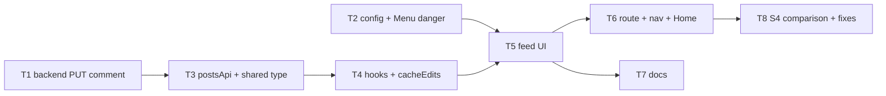

# REQ-009 Post feed page — Architecture

| Field | Value |
|---|---|
| REQ | REQ-009 |
| Status | validated |
| Created | 2026-10-07 |
| Related ADRs | [[architecture/adr-09-optimistic-updates-by-cache-edit\|ADR-09]] (proposed), ADR-01, ADR-02, ADR-03, ADR-06, ADR-08 |

## Summary

Add a lazy `/feed` page (design S4) with a composer, post cards, expandable comment threads with replies, owner-or-admin edit/delete, and optimistic create/comment. One backend addition: `PUT /api/comments/:id` so a comment can be edited (the API has only create and delete for comments). Feed joins the header nav, phone tab bar and Home cards. The explorer reported `comments.updated_at` missing; that is wrong (`CommentDTO` has it, the seed data sets it), so **no migration**.

## Blast radius

| Path | Why touched | Risk |
|---|---|---|
| `packages/backend/src/api/routes/CommentRoutes.ts` | add `PUT /:id` | medium |
| `packages/backend/src/api/controllers/CommentController.ts` | `updateComment` handler | medium |
| `packages/backend/src/businessLogic/src/CommentManager.ts` | `updateComment` (owner-or-admin, content only) | medium |
| `packages/backend/src/businessLogic/src/CommentManager.test.ts` (new) | manager tests | low |
| `packages/backend/src/dal/query/CommentQuery.ts` | `updateComment` SQL, sets `updated_at` | medium |
| `packages/backend/src/dal/query/PostQuery.ts` (+ test) | `getAllPosts` order gets `posts.id DESC` tie-break so offset paging is stable (ADV-004) | low |
| `packages/backend/src/api/routes/routes.test.ts`, `routeGuard.test.ts` | new route must answer 401 without a token | low |
| `packages/shared/src/types/comment.types.ts` | `UpdateCommentInput` | low |
| `packages/frontend/src/services/postsApi.ts` + test (new) | posts and comments endpoints | low |
| `packages/frontend/src/config/relativeTime.ts` + test (moved from `features/profile/`) | shared by profile and feed (L-REQ-008-6) | low |
| `packages/frontend/src/config/feedPath.ts` (new) | `FEED_PATH` for nav, Home, router | low |
| `packages/frontend/src/features/profile/RecentPosts.tsx`, `PostCard.tsx` | import path of `relativeTime` | low |
| `packages/frontend/src/components/ui/Menu/` | `MenuItem tone="danger"` for "Delete post" | low |
| `packages/frontend/src/features/feed/**` (new) | the page | medium |
| `packages/frontend/src/app/router.tsx`, `lazyRoutes.test.ts`, `eslint.config.js` | `FEED_ROUTE`, lazy ban for `features/feed` | medium |
| `packages/frontend/src/app/AppShell/navItems.tsx`, `NavIcons.tsx` | Feed link and tab (chat icon) | low |
| `packages/frontend/src/features/home/HomePage.tsx` + test | Feed quick-link card | low |
| Docs: `CLAUDE.md` (root), `packages/frontend/README.md`, `src/features/README.md`, `src/services/README.md`, `src/config/README.md`, `.adlc/context/conventions-api.md`, `conventions-frontend.md` | feed feature, comment-edit endpoint | low |

## Approach

**Backend.** `PUT /api/comments/:id` mirrors `PostManager.updatePost`: `requireId`, load comment (404), owner-or-admin (403, "You can only change your own comments"), body `{ content }` validated with `requiredText(…, "Comment", 2000)` like create, one statement, `WITH u AS (UPDATE comments SET content=$1, updated_at=NOW() WHERE id=$2 RETURNING *) SELECT u.*, users.name AS author_name, users.photo_url AS author_photo FROM u JOIN users ON users.id=u.user_id`, so the response has the list-row shape; zero rows means 404 (the comment was deleted meanwhile), never 200 with an empty body. `parent_id`, `post_id` and `user_id` can never change. Ownership order matches posts: the owner check runs before body validation. No count change, so no transaction.

**Frontend data.** `services/postsApi.ts` (no React): `listPosts({limit, offset})`, `createPost`, `updatePost`, `deletePost`, `listComments`, `createComment({content, parent_id?})`, `updateComment`, `deleteComment`. `features/feed/` hooks: `usePosts` (`useInfiniteQuery`, key `['feed','posts']`, 20 per page; offset and "is the last page full" are computed from the raw server page lengths, never from the deduped list), `useComments(postId, enabled)` (key `['feed','comments',postId]`, fetched only when a thread is open; the two keys share no prefix, so a feed edit or invalidate never touches threads), and one mutation hook per action. Optimistic updates follow ADR-09: pure `cacheEdits.ts` functions (add/replace/remove post, bump comment count, add/replace/remove comment), `onMutate` cancels and edits, `onError` applies the inverse edit and shows an inline error, `onSettled` invalidates only when it is the last mutation running on that key. Temp ids are negative with a stable client key; a pending item shows no menu, thread toggle or Reply. The author fields for an optimistic create come from `useCurrentUser()` (`user_id`, `name`, `photo_url`), because `POST /api/posts` returns the bare row.

**Permissions.** `permissions.ts`: `canModify(me, authorId) = me.user_id === authorId || me.role === 'admin'`. This only decides what to show; the API stays the judge and a 403 shows the error text. Matches REQ-003: posts and comments are owner-or-admin for both edit and delete.

**UI.** `FeedPage` (`h1 Feed`, `Composer`, list, states), `PostCard` (author `Avatar` + name as `Link` to `/alumni/:user_id`, `<time>`, text, `Menu` with Edit / Delete, count toggle button "N comments" / "Hide comments"), `CommentThread` (comments, one-level replies indented, "Reply" sets the parent, reply box as a pill input), inline edit (textarea with Save / Cancel) for posts and comments, `FeedStates` (skeletons, "No posts yet" empty state per S4-EmptyFeed, error with Retry, load-more). Every colour, space and type value is a token; layout sizes (640px column, avatar sizes via existing `Avatar` sizes) stay literal as per conventions. Composer placeholder follows S4 ("What's on your mind, <first name>?" on desktop, shorter on phone via the same text for both is acceptable; any difference is listed in the final comparison). Delete is removed at once and put back on failure; whether a post with comments asks first is Open question 1.

**Routing and nav.** `FEED_ROUTE` in `router.tsx` built exactly like `PROFILE_ROUTE` (lazy import by file path, `HydrateFallback` on the route object, no `index.ts`); add `feed` to `LAZY_FEATURES` and the ESLint ban. `NAV_ITEMS` gets `{ to: FEED_PATH, label: 'Feed', icon }`; desktop `MainNav` and phone `BottomTabs` both read it. Home gets a "Catch up on the feed" card.

**Final comparison (user request).** Last task: run the app and the `S4-*` design files, screenshot each at 1440 and 390 wide, light and dark, plus the empty state; list every difference in `ui-evidence/s4-comparison.md`; fix them or record why not (designs say "Alumni Network"/"A" logo and show Admin and My Profile nav; the built shell is Alma with only existing pages, a deliberate earlier decision).

## Task DAG

T1, T2 → T3 → T4 → T5 → T6, T7 → T8 (T3 needs T1 only for the contract it calls; T2 and T1 are independent.)

| Task | Tier | Depends |
|---|---|---|
| TASK-001 backend comment edit | 0 | — |
| TASK-002 shared helpers: relativeTime move, FEED_PATH, Menu danger | 0 | — |
| TASK-003 postsApi service + shared type | 1 | 001 |
| TASK-004 feed data layer (hooks, cacheEdits, permissions) | 2 | 003 |
| TASK-005 feed UI | 3 | 002, 004 |
| TASK-006 route, nav, tab, Home card, lazy checks | 4 | 005 |
| TASK-007 docs | 4 | 005 |
| TASK-008 S4 comparison and fixes | 5 | 006, 007 |

## Test strategy

- Backend: `CommentManager.test.ts` (new): update by owner ok, by admin ok, other user 403, missing 404, empty/oversized content 400, owner check before validation, `parent_id`/`post_id`/`user_id` in body ignored; `routes.test.ts` guard for `PUT /api/comments/:id` without token → 401 (route guard test walks it automatically); a `CommentQuery` SQL test in the style of `PostQuery.test.ts` if one exists.
- `postsApi.test.ts`: URL, params, body, error pass-through per function (fake adapter, per G26).
- `cacheEdits.test.ts`: every edit function, including negative-id replace and count bump/decrement (never below 0).
- `permissions.test.ts`: owner, admin, other, student.
- Component tests (`FeedPage`, `Composer`, `PostCard`, `CommentThread`, `FeedStates`): loading, empty, error+Retry, load-more, new post shows before the server answers and rolls back with an error, comment same, expand/collapse, menu shown only for owner/admin, edit save/cancel, delete, author link `href="/alumni/7"`, a 403 shows the API message.
- `lazyRoutes.test.ts` (add feed), `HomePage.test.tsx`, `MainNav`/`BottomTabs` tests (Feed present, current on `/feed`), `Menu.test.tsx` (danger item), moved `relativeTime.test.ts`.
- Gate commands: `npm test` (frontend), `npm run test:backend`, both typechecks, `npm run lint`, `npm run format:check`, `npm run build` (feed is its own chunk). Rebuild `businessLogic` `dist` (CLAUDE.md) after T1 before manual checks.

## Convention alignment

Layers kept (route → controller → manager → query; no HTTP mapping in managers beyond `AppError`); controllers use the existing try/`sendError` style of that file. Frontend: tokens only (lint-enforced), CSS Modules, no API calls in `components/ui`, lazy route per ADR-08, no feature imports another feature (the shared helper moves to `config/`, ADR-06), types from `@alumni/shared`. Deviation: none. ADR-09 is new and proposed.

## Stress-test outcome (architecture-adversary, 9 findings: 0 critical, 5 major, 4 minor)

| ID | Handling |
|---|---|
| ADV-001 rollback with overlapping mutations | Fixed: inverse-edit rollback, invalidate only on the last running mutation (ADR-09 text, TASK-004) |
| ADV-002 `['posts']` prefix hits comment keys | Fixed: keys `['feed','posts']` / `['feed','comments',id]`, exact-key edits (TASK-004) |
| ADV-003 pending items can be opened/replied to | Fixed: toggle, Reply and menu disabled while the id is negative; stable client key (TASK-005) |
| ADV-004 unstable offset paging | Fixed: `id DESC` tie-break added in `PostQuery.getAllPosts`; offset/"full page" from raw lengths (TASK-001, TASK-004) |
| ADV-005 delete: cascade, no confirm, 404 rollback | Partly fixed: a 404 on delete counts as success (TASK-004). Confirm step is an open question for you (below) |
| ADV-006 UPDATE then SELECT race | Fixed: single CTE statement, 0 rows is 404 (TASK-001) |
| ADV-007 odd data and states | Fixed in TASK-004/005: client trims posts, blank disables Post, client caps post text at 2000 (API has no cap; not changed), `white-space: pre-wrap` + `overflow-wrap: anywhere`, a 404 on a thread shows "This post is no longer available" and refetches the feed; `['me']` is guaranteed loaded by `RequireAuth` |
| ADV-008 admin edit looks like the author wrote it | Accepted: REQ-003 lets admins edit; the card shows an "edited" mark when `updated_at` is later than `created_at` (more than 1 s) (TASK-005) |
| ADV-009 restore after a 401 resurrects old data | Fixed: skip rollback when no live token remains (ADR-09, TASK-004) |

## Risks

- **Comment edit is a public API change** with ownership rules: covered by manager tests and the route guard test; the endpoint cannot change `user_id`/`post_id`/`parent_id`.
- **Dist trap:** the API serves `businessLogic/dist`; T1 must rebuild it before any browser check or the UI will see 404 on edit.
- **Optimistic bugs:** wrong count after rollback; mitigated by pure edit functions tested alone and by always refetching on settle.
- **Pagination by offset** still shifts when posts are added or deleted meanwhile; the tie-break keeps order stable, and a repeated id is dropped on display.
- **Design vs shell drift** (brand name, nav items): handled and recorded in the final comparison, not silently "fixed".
- `GET /api/posts` returns every post with no `total`; Load more is the best the API allows.

## Open questions

1. **Decided at the gate: inline confirm for a post with at least one comment.** (Was: Delete has no confirmation in S4, and deleting a post also deletes all its comments (cascade). Recommended: no confirm for comments; for a post with at least one comment, an inline "Delete this post and its N comments?" with Delete / Cancel in the card. Alternative: no confirm anywhere (matches S4 exactly).)
2. Edit mode is not in S4; it is built inline (textarea, Save/Cancel) from existing primitives and will show up as a "difference" in the final list.
3. The "Edit"/"Delete" for comments: S4 shows no comment menu; built as a small text action row ("Reply · Edit · Delete") beside the time, shown only to owner/admin.
