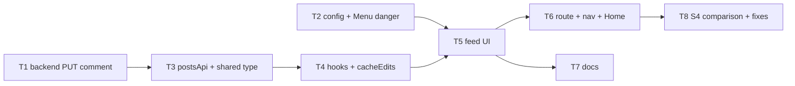

# REQ-009-post-feed-page — Review Packet

`Packet: 173KB · 105 files changed (30 vault files under .adlc/ not included) · diff context 25 lines · excluded from the diff: all *.test.ts(x) files, all *.md docs, and .adlc/ (vault, screenshots) — see list below`

Excluded files (read them directly; tests and docs are required reading for correctness/quality, not a packet gap): .adlc/architecture/adr-09-optimistic-updates-by-cache-edit.md (+37/−0), .adlc/context/conventions-api.md (+2/−1), .adlc/context/conventions-frontend.md (+5/−5), .adlc/decisions.md (+1/−0), .adlc/hot.md (+4/−0), .adlc/index.md (+1/−0), .adlc/specs/2026-10/m/REQ-009-post-feed-page/architecture-adversary.md (+134/−0), .adlc/specs/2026-10/m/REQ-009-post-feed-page/architecture.md (+124/−0), .adlc/specs/2026-10/m/REQ-009-post-feed-page/exploration.md (+161/−0), .adlc/specs/2026-10/m/REQ-009-post-feed-page/lesson-candidates.md (+105/−0), .adlc/specs/2026-10/m/REQ-009-post-feed-page/tasks/TASK-001.md (+62/−0), .adlc/specs/2026-10/m/REQ-009-post-feed-page/tasks/TASK-002.md (+48/−0), .adlc/specs/2026-10/m/REQ-009-post-feed-page/tasks/TASK-003.md (+44/−0), .adlc/specs/2026-10/m/REQ-009-post-feed-page/tasks/TASK-004.md (+65/−0), .adlc/specs/2026-10/m/REQ-009-post-feed-page/tasks/TASK-005.md (+73/−0), .adlc/specs/2026-10/m/REQ-009-post-feed-page/tasks/TASK-006.md (+44/−0), .adlc/specs/2026-10/m/REQ-009-post-feed-page/tasks/TASK-007.md (+39/−0), .adlc/specs/2026-10/m/REQ-009-post-feed-page/tasks/TASK-008.md (+45/−0), .adlc/specs/2026-10/m/REQ-009-post-feed-page/tasks/TASK-009.md (+42/−0), .adlc/specs/2026-10/m/REQ-009-post-feed-page/ui-evidence/s4-comparison.md (+34/−0), CLAUDE.md (+8/−7), packages/backend/src/api/routes/routeGuard.test.ts (+1/−0), packages/backend/src/api/routes/routes.test.ts (+15/−0), packages/backend/src/businessLogic/src/CommentManager.test.ts (+121/−0), packages/backend/src/dal/query/CommentQuery.test.ts (+83/−0), packages/backend/src/dal/query/PostQuery.test.ts (+41/−0), packages/frontend/README.md (+18/−8), packages/frontend/scripts/enforcement.test.ts (+9/−2), packages/frontend/src/app/AppShell/AppShell.test.tsx (+98/−7), packages/frontend/src/app/README.md (+4/−4), packages/frontend/src/app/lazyRoutes.test.ts (+15/−1), packages/frontend/src/components/ui/Menu/Menu.test.tsx (+27/−0), packages/frontend/src/components/ui/README.md (+1/−1), packages/frontend/src/config/README.md (+2/−0), packages/frontend/src/{features/profile (+0/−0), packages/frontend/src/features/README.md (+3/−2), packages/frontend/src/features/feed/CommentThread.test.tsx (+237/−0), packages/frontend/src/features/feed/Composer.test.tsx (+105/−0), packages/frontend/src/features/feed/FeedPage.test.tsx (+230/−0), packages/frontend/src/features/feed/FeedStates.test.tsx (+60/−0), packages/frontend/src/features/feed/PostCard.test.tsx (+213/−0), packages/frontend/src/features/feed/README.md (+19/−0), packages/frontend/src/features/feed/cacheEdits.test.ts (+202/−0), packages/frontend/src/features/feed/feedErrors.test.ts (+43/−0), packages/frontend/src/features/feed/feedFormat.test.ts (+110/−0), packages/frontend/src/features/feed/permissions.test.ts (+30/−0), packages/frontend/src/features/feed/useFeedMutations.test.tsx (+518/−0), packages/frontend/src/features/feed/usePosts.test.tsx (+105/−0), packages/frontend/src/features/feed/useWideScreen.test.tsx (+47/−0), packages/frontend/src/features/home/HomePage.test.tsx (+5/−3), packages/frontend/src/features/profile/README.md (+1/−1), packages/frontend/src/services/README.md (+1/−0), packages/frontend/src/services/postsApi.test.ts (+175/−0). The vault's own changes (.adlc/**) and 10 screenshots under ui-evidence are not in the packet.

This packet contains the diff (25 lines of context; new files appear in full), the REQ spec, and the REQ architecture. Base branch is `redesign`. **Do not re-read these via Read — cite this packet.**

**Your own required reading is not a packet gap.** `context/conventions.md`, the vault (lessons, gotchas, ADRs, concepts), and any source file outside the diff that this change interacts with are your mandate.

**`Packet-gap` means the packet's own contents fell short** — the diff, spec, or architecture was missing or insufficient for a call you had to make. Then, and only then, add `**Packet-gap:** <path> — <why>` to your section.

## Diff (vs redesign)

```diff
diff --git a/CLAUDE.md b/CLAUDE.md
index 4a81870f..309b8013 100644
--- a/CLAUDE.md
+++ b/CLAUDE.md
@@ -46,73 +46,74 @@ Backend tests (Vitest + supertest, ADR-05; no database needed):
 - `npm run typecheck:backend` from the root, or `npm run typecheck` inside `packages/backend` — `tsc --noEmit` on `api`, `businessLogic` and `dal`, then on `tsconfig.test.json`, which also type-checks the test files (Vitest strips types without checking them).
 
 The backend and `@alumni/shared` have no lint or format scripts yet, and `@alumni/shared` has no tests.
 
 ### Rebuilding businessLogic/dal after editing them
 
 `@alumni/businesslogic`'s `package.json` points `main` at `./dist/index.js` (a compiled build), not its TypeScript source, so **the API process does not pick up changes to `packages/backend/src/businessLogic/src/**` until that package is recompiled** (`tsc` inside `packages/backend/src/businessLogic`, using its local `tsconfig.json`). `@alumni/dal`'s `main` points straight at `index.ts`, so `dal` changes are picked up live by `tsx watch` without a build step. When editing business logic, rebuild before assuming the running API reflects your change. The backend tests and `typecheck` don't need the rebuild: `vitest.config.ts` (alias) and `tsconfig.test.json` (`paths`) both resolve `@alumni/businesslogic` to its source, so neither a green test run nor a clean type-check says anything about whether `dist/` is current. The running API still needs it.
 
 ## Environment
 
 A single `.env` at the repo root is read by both the API server and the DB pool config (each loads it via a relative `dotenv.config({ path: ... })`, so the required relative path differs by file — see `packages/backend/src/api/server.ts` and `packages/backend/src/dal/config/db.ts`). Required vars: `DB_HOST`, `DB_PORT`, `DB_NAME`, `DB_USER`, `DB_PASSWORD`, `PORT`, `JWT_SECRET` (`server.ts` refuses to start without `JWT_SECRET`). Postgres is the only datastore (raw `pg` queries, no ORM/migration tool). Schema changes are hand-written, idempotent SQL files in `db/migrations/` applied with `psql -f` (there's no runner and no record of which migrations have run). The frontend's `vite.config.ts` also reads the root `.env`, but only `PORT` (for the `/api` dev proxy); nothing from it reaches browser code.
 
 ## Architecture
 
 > This section describes the code as it stood before the redesign. Where it disagrees with **Conventions (redesign)** below, the conventions win.
 
 ### Backend: strict layered pipeline
 
 `packages/backend/src` contains three independent npm workspaces that form one request pipeline. Each layer only imports from the layer directly below it via its workspace package name (never reach across a layer):
 
 ```
 routes (Express Router) → controllers → businessLogic Managers → dal Query classes → pg Pool
       @alumni/api                         @alumni/businesslogic         @alumni/dal
 ```
 
-- **`api/`** (`@alumni/api`) — Express app wiring. `app.ts` mounts routers under `/api/*`; `server.ts` is the entrypoint (`dotenv.config` + `app.listen`). `routes/*Routes.ts` map HTTP verbs/paths straight to named exports in `controllers/*Controller.ts`. Controllers parse `req`/`res`, construct DTOs, call a `*Manager`, and translate results into HTTP responses. Each handler's `catch` calls the shared `controllers/sendError.ts`: an `AppError` becomes its status + `{ message }`, anything else a 500 `{ message: "Something went wrong" }` (raw error text never reaches the client). There is still no Express error middleware (a later REQ). The `/auth/login` handler in `AuthRoutes.ts` uses `sendError` too (a wrong email or password is `AppError(401, "Invalid")`); `MeController` still has its own copy of `sendError` (known follow-up). `Middleware/authMiddleware.ts` (note the filename's mixed case: `authMIddleware.ts`) verifies the JWT and sets `req.user`; `Middleware/roleMiddleware.ts` (`requireRole(...roles)`) gates by `req.user.role`. `types/express.d.ts` augments `Express.Request` with `user: { sub, role }`. **Auth:** only `POST /api/auth/login`, `POST /api/auth/register` and `GET /api/health` are public. Every other router starts with `router.use(authMiddleware)`, so any route added to it is protected too. Admin-only routes add `requireRole("admin")` (`GET`/`POST /api/users`, `DELETE /api/users/:id`); `POST /api/alumni` adds `requireRole("alumni")`. Status codes: 401 = token problem only (missing, bad, expired; the frontend logs out on it, ADR-03), 403 = signed in but not allowed, 404 = missing. Ownership checks live in the Managers, not controllers or routes: posts and comments are owner-or-admin; a user's own account and alumni profile are owner-only (admins included). `routes/routeGuard.test.ts` walks every route on the Express app and fails if one outside the public list answers without a token. **`GET /api/alumni`** (signed in) takes `q` (name, company or job title, case-insensitive substring), `department`, `university` (both whole-value, case-insensitive), `graduationYear` (4 digits, 1900 to now + 10), `page` (default 1, max 10000) and `pageSize` (default 20, max 100), and returns `{ items, total }`; bad values, repeated or nested params answer 400, empty values mean absent, unknown params are ignored (details: `.adlc/context/conventions-api.md` → Pagination).
+- **`api/`** (`@alumni/api`) — Express app wiring. `app.ts` mounts routers under `/api/*`; `server.ts` is the entrypoint (`dotenv.config` + `app.listen`). `routes/*Routes.ts` map HTTP verbs/paths straight to named exports in `controllers/*Controller.ts`. Controllers parse `req`/`res`, construct DTOs, call a `*Manager`, and translate results into HTTP responses. Each handler's `catch` calls the shared `controllers/sendError.ts`: an `AppError` becomes its status + `{ message }`, anything else a 500 `{ message: "Something went wrong" }` (raw error text never reaches the client). There is still no Express error middleware (a later REQ). The `/auth/login` handler in `AuthRoutes.ts` uses `sendError` too (a wrong email or password is `AppError(401, "Invalid")`); `MeController` still has its own copy of `sendError` (known follow-up). `Middleware/authMiddleware.ts` (note the filename's mixed case: `authMIddleware.ts`) verifies the JWT and sets `req.user`; `Middleware/roleMiddleware.ts` (`requireRole(...roles)`) gates by `req.user.role`. `types/express.d.ts` augments `Express.Request` with `user: { sub, role }`. **Auth:** only `POST /api/auth/login`, `POST /api/auth/register` and `GET /api/health` are public. Every other router starts with `router.use(authMiddleware)`, so any route added to it is protected too. Admin-only routes add `requireRole("admin")` (`GET`/`POST /api/users`, `DELETE /api/users/:id`); `POST /api/alumni` adds `requireRole("alumni")`. Status codes: 401 = token problem only (missing, bad, expired; the frontend logs out on it, ADR-03), 403 = signed in but not allowed, 404 = missing. Ownership checks live in the Managers, not controllers or routes: posts and comments are owner-or-admin (edit and delete; `PUT /api/comments/:id` changes only `content`, never the author, post or parent); a user's own account and alumni profile are owner-only (admins included). `routes/routeGuard.test.ts` walks every route on the Express app and fails if one outside the public list answers without a token. **`GET /api/alumni`** (signed in) takes `q` (name, company or job title, case-insensitive substring), `department`, `university` (both whole-value, case-insensitive), `graduationYear` (4 digits, 1900 to now + 10), `page` (default 1, max 10000) and `pageSize` (default 20, max 100), and returns `{ items, total }`; bad values, repeated or nested params answer 400, empty values mean absent, unknown params are ignored (details: `.adlc/context/conventions-api.md` → Pagination). **`GET /api/posts`** (`limit` 1 to 100, default 50; `offset`) is newest first with an `id` tie-break so offset pages don't overlap; post and comment rows carry `author_name`, `author_photo` and `author_alumni_id` (the author's `alumni.id`, which `/alumni/:id` takes; null when they have no alumni profile).
 - **`businessLogic/`** (`@alumni/businesslogic`) — one `*Manager` class per domain (`PostManager`, `CommentManager`, `AlumniManager`, `UserManager`), each a thin pass-through to a corresponding `dal` `*Query` class. This is where business rules go: ownership (`PostManager` and `CommentManager` check owner-or-admin and throw `AppError` 404/403), validation, password hashing and checks (`UserManager` owns them: register, createUser, changeMyPassword, the login compare) and cross-entity rules (e.g. `PostManager.updateCommentCount`); many methods are still 1:1 delegations. `TestManager.ts` is scratch/manual-test code (commented-out calls), not a real module.
 - **`dal/`** (`@alumni/dal`) — data access. `config/db.ts` creates the single shared `pg.Pool`. `dto/*DTO.ts` are plain classes (constructor-based, `id!: number` set after construction) implementing `BaseDTO`; they double as the shape passed into `Query` methods and as parsed rows returned from queries — controllers build a DTO instance even for read/delete calls just to carry an id. `query/*Query.ts` hold the raw parameterized SQL (`pool.query('...', [params])`) — this is the only place SQL should live. `index.ts` re-exports the public DTOs/Queries other packages should import.
 
 Each backend sub-package is its own workspace with its own `package.json`/`tsconfig.json` (extending the root `tsconfig.json`), and is linked into the root `node_modules/@alumni/*` via npm workspace symlinks — import via the package name (`@alumni/businesslogic`, `@alumni/dal`), never by relative path across package boundaries.
 
 ### Shared types
 
 `packages/shared` (`@alumni/shared`) exports plain TypeScript interfaces/types (`alumni.types.ts`, `comment.types.ts`, `post.types.ts`, `user.types.ts`) consumed by the frontend for API response shapes (e.g. `import type { Post } from "@alumni/shared"`). It has no runtime code. Note this is a parallel, separate type surface from the backend's `dal` DTOs (classes with constructors) — they aren't the same types, so keep them in sync manually when a shape changes.
 
 ### Frontend
 
 `packages/frontend` was rebuilt from scratch in REQ-001 (this subsection describes the new code, not the pre-redesign one). The product is branded **Alma** (REQ-004). React 19 + Vite 8 + TypeScript 6 (own strict tsconfigs, not extending the root), ESM package. Details: `packages/frontend/README.md`.
 
-- **Structure** (`src/`, each folder has a README with its import rules): `app/` (App, providers, router, `queryClient.ts`, `RootLayout`, `AuthShell` and `AppShell` layouts, `MainNav`, `HydrateFallback`, `RouteError`), `config/` (app-wide constants and small pure contracts: `brand.ts` with `BRAND_NAME`, `SUPPORT_EMAIL`, `supportMailto`; `directoryReturn.ts` with `DIRECTORY_PATH`, `profilePath`, the directory-to-profile router-state handover), `features/` (one folder per domain: `theme/`, `auth/`, `home/`, `directory/`, `profile/`), `components/ui/` (primitives: Button, ButtonLink, Input, PasswordInput, Logo, Card, Tag, Alert, Menu, SegmentedControl, ThemeToggle, Avatar, Chip, Skeleton, SearchField, Popover, VisuallyHidden), `store/` (Jotai atoms), `services/` (`httpClient.ts`, `authToken.ts`, `authApi.ts`, `alumniApi.ts`, `httpErrors.ts`), `styles/` (generated `tokens.css`, `global.css`), `test/` (Vitest setup). Path alias `@/` → `src/`.
+- **Structure** (`src/`, each folder has a README with its import rules): `app/` (App, providers, router, `queryClient.ts`, `RootLayout`, `AuthShell` and `AppShell` layouts, `MainNav`, `HydrateFallback`, `RouteError`), `config/` (app-wide constants and small pure contracts: `brand.ts` with `BRAND_NAME`, `SUPPORT_EMAIL`, `supportMailto`; `directoryReturn.ts` with `DIRECTORY_PATH`, `profilePath`, the directory-to-profile router-state handover; `feedPath.ts` with `FEED_PATH`; `relativeTime.ts`, shared by profile and feed), `features/` (one folder per domain: `theme/`, `auth/`, `home/`, `directory/`, `profile/`, `feed/`), `components/ui/` (primitives: Button, ButtonLink, Input, PasswordInput, Logo, Card, Tag, Alert, Menu, SegmentedControl, ThemeToggle, Avatar, Chip, Skeleton, SearchField, Popover, VisuallyHidden), `store/` (Jotai atoms), `services/` (`httpClient.ts`, `authToken.ts`, `authApi.ts`, `alumniApi.ts`, `postsApi.ts`, `httpErrors.ts`), `styles/` (generated `tokens.css`, `global.css`), `test/` (Vitest setup). Path alias `@/` → `src/`.
 - **Import boundaries** are lint-enforced (with a test per boundary): `components/ui/` may not import services, store, features, config, app, axios or TanStack Query (brand text reaches `Logo` as a prop); `services/` may not import React, components, store, features or app; `store/` may not import services, features or app; `config/` is a leaf (may not import app, features, components, store or services); nothing in `features/`, `store/`, `services/` or `components/` imports `app/` (only `main.tsx` does; test files may import `app/` providers).
-- **HTTP:** one axios instance, `services/httpClient.ts` (`baseURL: '/api'`). Its single request interceptor adds `Authorization: Bearer <token>` from `services/authToken.ts` (`localStorage['token']`, the only home of the token). Call sites never build auth headers. Endpoint functions live in `services/` (`authApi.ts`: `login`, `register`, `getMe`; `alumniApi.ts`: `searchAlumni`, `getAlumniProfile`, `getPostsByUser`; `httpErrors.ts`: `isNotFoundError`).
+- **HTTP:** one axios instance, `services/httpClient.ts` (`baseURL: '/api'`). Its single request interceptor adds `Authorization: Bearer <token>` from `services/authToken.ts` (`localStorage['token']`, the only home of the token). Call sites never build auth headers. Endpoint functions live in `services/` (`authApi.ts`: `login`, `register`, `getMe`; `alumniApi.ts`: `searchAlumni`, `getAlumniProfile`, `getPostsByUser`; `postsApi.ts`: `listPosts`, `createPost`, `updatePost`, `deletePost`, `listComments`, `createComment`, `updateComment`, `deleteComment`; `httpErrors.ts`: `isNotFoundError`).
 - **Session and 401s (ADR-03):** `authToken.ts` is subscribable (`subscribe`, also fires on another tab's `storage` change) and has `isTokenExpired` / pure `getLiveToken`. `httpClient`'s response interceptor calls the one handler registered with `setUnauthorizedHandler(fn)` on a 401 from a request that carried a token (not `/auth/login`/`/auth/register`), passing that token; `services/` never imports app code. `features/auth/SessionBridge` (mounted once in `app/RootLayout`, above both shells) registers it and acts only if the token still matches: clear token, set `sessionNoticeAtom`, go to `/login`. It also drops an expired token on load and clears the query cache on any token change. Current user is the `['me']` query (`useCurrentUser`); login/register mutations only store the token. `App.tsx` must import `RouterProvider` from `react-router/dom` (flushSync, one redirect).
-- **State (ADR-02):** server data goes through TanStack Query (shared `QueryClient` in `app/queryClient.ts`); Jotai atoms in `store/` hold client-only state (e.g. `themePreferenceAtom`, persisted under `localStorage['alumni.theme']`).
+- **State (ADR-02):** server data goes through TanStack Query (shared `QueryClient` in `app/queryClient.ts`); Jotai atoms in `store/` hold client-only state (e.g. `themePreferenceAtom`, persisted under `localStorage['alumni.theme']`). Optimistic writes edit the query cache (ADR-09): `onMutate` writes the expected result, `onError` applies the inverse edit, `onSettled` invalidates only when the last mutation on that key settles.
 - **UI (ADR-01):** no third-party component library. Primitives are our own components styled with CSS Modules that may use only design tokens (`var(--…)`), enforced by Stylelint and ESLint. Base UI (headless) supplies behavior where needed: `Menu`, `SegmentedControl` (which `ThemeToggle` is built on), the Tooltip on icon-only segments and `Popover`. `ThemeToggle` has `variant` `full` (words) and `compact` (icons named Light / Dark / System, with a tooltip; used by both `AuthShell` and the `AppShell` header). Forms (ADR-04) use controlled state, pure validators in `features/<x>/validation.ts` and `useMutation`; no form library until a form passes ~8 fields. Tokens are generated from `docs/design/design-system/tokens.json` by `npm run tokens`. `public/favicon.svg` is the one design asset with raw hex (the browser can't apply tokens to it; copied from `docs/design/brand/`).
-- **Routing:** React Router 8 data router (`react-router`). The path-less `RootLayout` at `/` applies the theme and mounts `SessionBridge` once for every page, and holds two shells: `AuthShell` (no header, only a compact top-right theme toggle) for `GuestOnly` → `/login`, `/register` (a signed-in user is sent on), and `AppShell` (header, and a bottom tab bar on phones) for `RequireAuth` → `/` (Home; a guest goes to `/login`), `/directory`, `/alumni/:id`, `*` and test pages. Two `errorElement` layers on each branch: the outer one on `/` catches shell crashes; an inner pathless route in each shell shows `RouteError` inside its `<main>` for page errors. Redirect-back after login uses only `location.state.from` (never a URL parameter), checked by `resolveFrom`. The `AppShell` header shows the `Logo` (linking home), Log in / Sign up for guests, and when signed in `MainNav` (`<nav aria-label="Main">`, desktop only, a "Directory" link marked current on `/directory` and below with an accent underline), the compact icon-only `ThemeToggle`, and an avatar Menu (initials, name, email, Log out). Below 48rem `BottomTabs` (`<nav aria-label="Main tabs">`, sticky) replaces `MainNav`; both read `NAV_ITEMS` in `app/AppShell/navItems.tsx`, which lists only pages that exist (REQ-007, after `docs/design/screens/app/S1-*`). `main` is full width; each page caps its own width. Home (`features/home`) greets "Welcome back, <first name>" and shows a quick-link card per existing page (`QUICK_LINKS`). Log-in and sign-up have no header and share `features/auth/AuthLayout` (full-height 45/55 split from 60rem: brand panel with logo, headline, points and ©; the form, no card, with the heading and its prompt line on top; below 60rem only the panel's logo row); "Forgot password?" shows a support mailto message, no reset flow.
-- **Lazy routes (ADR-08):** large pages load with the route's `lazy`, so each is its own chunk; Home stays eager. Two lazy pages: `DIRECTORY_ROUTE` (`/directory`, `import('@/features/directory/DirectoryPage')`) and `PROFILE_ROUTE` (`/alumni/:id`, `import('@/features/profile/ProfilePage')`) in `app/router.tsx`. Nothing else in `src/` may import either feature statically, not even the other one (neither has an `index.ts`; an ESLint rule bans each outside its own folder and tests, `import type` excepted, and `app/lazyRoutes.test.ts` reads every non-test file and fails on one; both run one check per feature from the `LAZY_FEATURES` list). `HydrateFallback` ("Loading…" in `<main>`) must be a static property of the lazy route object itself: the router stops rendering at the nearest route with a fallback, so on the root it would hide the shell. A chunk that fails to load shows the inner `RouteError`. Check with `npm run build` that the page is a separate chunk in `dist/assets`.
+- **Routing:** React Router 8 data router (`react-router`). The path-less `RootLayout` at `/` applies the theme and mounts `SessionBridge` once for every page, and holds two shells: `AuthShell` (no header, only a compact top-right theme toggle) for `GuestOnly` → `/login`, `/register` (a signed-in user is sent on), and `AppShell` (header, and a bottom tab bar on phones) for `RequireAuth` → `/` (Home; a guest goes to `/login`), `/directory`, `/alumni/:id`, `/feed`, `*` and test pages. Two `errorElement` layers on each branch: the outer one on `/` catches shell crashes; an inner pathless route in each shell shows `RouteError` inside its `<main>` for page errors. Redirect-back after login uses only `location.state.from` (never a URL parameter), checked by `resolveFrom`. The `AppShell` header shows the `Logo` (linking home), Log in / Sign up for guests, and when signed in `MainNav` (`<nav aria-label="Main">`, desktop only, "Directory" and "Feed" links, each marked current on its path and below with an accent underline), the compact icon-only `ThemeToggle`, and an avatar Menu (initials, name, email, Log out). Below 48rem `BottomTabs` (`<nav aria-label="Main tabs">`, sticky) replaces `MainNav`; both read `NAV_ITEMS` in `app/AppShell/navItems.tsx`, which lists only pages that exist (REQ-007, after `docs/design/screens/app/S1-*`). `main` is full width; each page caps its own width. Home (`features/home`) greets "Welcome back, <first name>" and shows a quick-link card per existing page (`QUICK_LINKS`: "Browse the directory" and "Catch up on the feed"). Log-in and sign-up have no header and share `features/auth/AuthLayout` (full-height 45/55 split from 60rem: brand panel with logo, headline, points and ©; the form, no card, with the heading and its prompt line on top; below 60rem only the panel's logo row); "Forgot password?" shows a support mailto message, no reset flow.
+- **Lazy routes (ADR-08):** large pages load with the route's `lazy`, so each is its own chunk; Home stays eager. Three lazy pages: `DIRECTORY_ROUTE` (`/directory`, `import('@/features/directory/DirectoryPage')`), `PROFILE_ROUTE` (`/alumni/:id`, `import('@/features/profile/ProfilePage')`) and `FEED_ROUTE` (`/feed`, `import('@/features/feed/FeedPage')`) in `app/router.tsx`. Nothing else in `src/` may import any of them statically, not even another lazy feature (none has an `index.ts`; an ESLint rule bans each outside its own folder and tests, `import type` excepted, and `app/lazyRoutes.test.ts` reads every non-test file and fails on one; both run one check per feature from the `LAZY_FEATURES` list). `HydrateFallback` ("Loading…" in `<main>`) must be a static property of the lazy route object itself: the router stops rendering at the nearest route with a fallback, so on the root it would hide the shell. A chunk that fails to load shows the inner `RouteError`. Check with `npm run build` that the page is a separate chunk in `dist/assets`.
 - **Directory (REQ-006):** `features/directory` lists alumni from `GET /api/alumni`, 12 per page. Search text, filters and page live in the URL query string (ADR-08), parsed by the pure `params.ts`, which ignores any value the API would reject; filters and pages push history, typed search replaces the URL after 300 ms. `useAlumniSearch` is the TanStack Query hook. States: skeletons, error with Retry, no matches with Clear filters, no alumni yet, page past the end.
-- **Profile (REQ-008):** `features/profile` shows `/alumni/:id` from `GET /api/alumni/:id` and `GET /api/posts/user/:userId` (newest 5): header, About, Education, Employment, Recent posts; a section with no data is hidden, a posts failure keeps the profile. 404 (unknown or malformed id) shows "Profile not found". "Back to directory" restores the directory search through router state, whose shape only `config/directoryReturn` knows (the two lazy features never import each other).
+- **Profile (REQ-008):** `features/profile` shows `/alumni/:id` from `GET /api/alumni/:id` and `GET /api/posts/user/:userId` (newest 5): header, About, Education, Employment, Recent posts; a section with no data is hidden, a posts failure keeps the profile. 404 (unknown or malformed id) shows "Profile not found". "Back to directory" restores the directory search through router state, whose shape only `config/directoryReturn` knows (lazy features never import each other).
+- **Feed (REQ-009):** `features/feed` shows `/feed` from `GET /api/posts` (20 per page, Load more): a composer, post cards with comment threads (one level of replies), and edit/delete for the author or an admin (the API stays the judge; a refused write shows its message). New posts and comments appear before the server answers and roll back on failure (ADR-09). A post with comments asks inline before it is deleted. The author name links to `/alumni/<author_alumni_id>` only when that is set. Details: `packages/frontend/src/features/feed/README.md`.
 - **Dev proxy:** `vite.config.ts` proxies `/api` to `http://localhost:<PORT>` (`PORT` read from the root `.env`, default 3000; nothing else from that file reaches the client). Run the API alongside Vite (root `npm run dev`).
 
 ## Conventions (redesign)
 
 ### Workflow
 - Use the ADLC pipeline (/spec, /architect, /implement, /review, /wrapup).
 - Never write code before the spec and architecture gates are approved.
 
 ### Backend
 - npm workspaces; layers stay routes -> controllers -> Managers -> Query classes.
 - Controllers are classes; routes bind instance methods.
 - One shared error middleware; no per-method try/catch for HTTP mapping.
 - Every non-public route uses authMiddleware, plus requireRole where needed.
 
 ### Frontend
 - React + Vite + TypeScript, rebuilt from scratch.
 - State: server data via TanStack Query; client-only state in Jotai atoms in src/store/ (ADR-02).
 - UI: no styled component kit. Own primitives in src/components/ui/ styled with CSS Modules on design tokens; Base UI (headless) for complex behavior (ADR-01). New libraries are approved at the architect gate.
 - Scandinavian design: neutral palette, generous whitespace, clean typography, few accents.
 - Theme: light, dark, system; toggle in header; choice persisted; follows prefers-color-scheme in system mode.
 - All colors/spacing/type come from design tokens; no hardcoded values in components.
 - Designs live in docs/design/ (Claude Design bundle); follow them.
 - Responsive from 360px up; no layout breaks at 200% zoom.
 - Components get typed props from @alumni/shared; no API calls inside UI components.
diff --git a/packages/backend/src/api/controllers/CommentController.ts b/packages/backend/src/api/controllers/CommentController.ts
index 22c6dc40..d5a98333 100644
--- a/packages/backend/src/api/controllers/CommentController.ts
+++ b/packages/backend/src/api/controllers/CommentController.ts
@@ -1,34 +1,48 @@
 import { Request, Response } from "express";
 import { CommentManager } from "@alumni/businesslogic";
 import { sendError } from "./sendError";
 
 const commentManager = new CommentManager();
 
 // GET /api/posts/:id/comments
 export const getPostComments = async (req: Request, res: Response) => {
   try {
     res.status(200).json(await commentManager.getCommentsForPost(req.params.id));
   } catch (error) {
     sendError(res, error);
   }
 };
 
 // POST /api/posts/:id/comments (requires authMiddleware)
 export const addComment = async (req: Request, res: Response) => {
   try {
     const comment = await commentManager.addComment(Number(req.user.sub), req.params.id, req.body ?? {});
     res.status(201).json(comment);
   } catch (error) {
     sendError(res, error);
   }
 };
 
+// PUT /api/comments/:id (requires authMiddleware)
+export const updateComment = async (req: Request, res: Response) => {
+  try {
+    const comment = await commentManager.updateComment(
+      { id: Number(req.user.sub), role: req.user.role },
+      req.params.id,
+      req.body ?? {},
+    );
+    res.status(200).json(comment);
+  } catch (error) {
+    sendError(res, error);
+  }
+};
+
 // DELETE /api/comments/:id (requires authMiddleware)
 export const deleteComment = async (req: Request, res: Response) => {
   try {
     await commentManager.deleteComment({ id: Number(req.user.sub), role: req.user.role }, req.params.id);
     res.status(200).json({ message: "Comment deleted successfully" });
   } catch (error) {
     sendError(res, error);
   }
 };
diff --git a/packages/backend/src/api/routes/CommentRoutes.ts b/packages/backend/src/api/routes/CommentRoutes.ts
index 39878719..033f556a 100644
--- a/packages/backend/src/api/routes/CommentRoutes.ts
+++ b/packages/backend/src/api/routes/CommentRoutes.ts
@@ -1,11 +1,12 @@
 import { Router } from "express";
-import { deleteComment } from "../controllers/CommentController";
+import { deleteComment, updateComment } from "../controllers/CommentController";
 import { authMiddleware } from "../Middleware/authMIddleware";
 
 // Listing and creating comments live under /api/posts/:id/comments (see PostRoutes).
 const router = Router();
 
 router.use(authMiddleware);
+router.put("/:id", updateComment);
 router.delete("/:id", deleteComment);
 
 export default router;
diff --git a/packages/backend/src/businessLogic/src/CommentManager.ts b/packages/backend/src/businessLogic/src/CommentManager.ts
index e81c531f..048e258a 100644
--- a/packages/backend/src/businessLogic/src/CommentManager.ts
+++ b/packages/backend/src/businessLogic/src/CommentManager.ts
@@ -13,36 +13,53 @@ export class CommentManager {
     return this.commentQuery.getCommentsByPost(requireId(postId, "Post"));
   }
 
   // The author is always the authenticated user; nothing in the body can change that.
   // `parent_id` makes it a reply; threads are one level deep, so a reply to a reply
   // is attached to the top-level comment.
   public async addComment(userId: number, postId: unknown, body: Record<string, unknown>) {
     const id = requireId(postId, "Post");
     const content = requiredText(body.content, "Comment", 2000);
     let parentId: number | null = null;
     if (body.parent_id !== undefined && body.parent_id !== null) {
       const parent = await this.commentQuery.findCommentById(requireId(body.parent_id, "Comment"));
       if (!parent) throw new AppError(404, "Comment not found");
       if (parent.post_id !== id) throw new AppError(400, "You can only reply to a comment on the same post");
       parentId = parent.parent_id ?? parent.id;
     }
     try {
       return await this.commentQuery.createComment(new CommentDTO(userId, id, content, parentId));
     } catch (error) {
       // comments_post_id_fkey: the post doesn't exist
       if ((error as { code?: string }).code === "23503") throw new AppError(404, "Post not found");
       throw error;
     }
   }
 
+  // Only the comment's author or an admin may edit it, and only its text: the author,
+  // post and parent stay. Ownership is checked before the body, so a non-owner never
+  // sees validation errors.
+  public async updateComment(requester: { id: number; role: string }, commentId: unknown, body: Record<string, unknown>) {
+    const id = requireId(commentId, "Comment");
+    const comment = await this.commentQuery.findCommentById(id);
+    if (!comment) throw new AppError(404, "Comment not found");
+    if (comment.user_id !== requester.id && requester.role !== "admin") {
+      throw new AppError(403, "You can only change your own comments");
+    }
+    const content = requiredText(body.content, "Comment", 2000);
+    const updated = await this.commentQuery.updateComment(id, content);
+    // Deleted between the lookup and the update.
+    if (!updated) throw new AppError(404, "Comment not found");
+    return updated;
+  }
+
   // Only the comment's author or an admin may delete it.
   public async deleteComment(requester: { id: number; role: string }, commentId: unknown) {
     const id = requireId(commentId, "Comment");
     const comment = await this.commentQuery.findCommentById(id);
     if (!comment) throw new AppError(404, "Comment not found");
     if (comment.user_id !== requester.id && requester.role !== "admin") {
       throw new AppError(403, "You can only delete your own comments");
     }
     await this.commentQuery.deleteComment(id, comment.post_id);
   }
 }
diff --git a/packages/backend/src/dal/query/CommentQuery.ts b/packages/backend/src/dal/query/CommentQuery.ts
index 2f5e871b..70531ab0 100644
--- a/packages/backend/src/dal/query/CommentQuery.ts
+++ b/packages/backend/src/dal/query/CommentQuery.ts
@@ -1,52 +1,69 @@
 import pool from "../config/db.js";
 import { CommentDTO } from "../dto/CommentDTO.js";
 
-// Comment row + public author fields (never the password).
-const COMMENT_COLUMNS = `c.*, u.name AS author_name, u.photo_url AS author_photo`;
+// Comment row + public author fields (never the password). author_alumni_id is the
+// author's alumni.id for the /alumni/:id link, null without an alumni row; a scalar
+// subquery (lowest id, as findAlumniByUserId) so rows are never duplicated.
+const COMMENT_COLUMNS = `c.*, u.name AS author_name, u.photo_url AS author_photo,
+         (SELECT MIN(a.id) FROM alumni a WHERE a.user_id = c.user_id) AS author_alumni_id`;
 
 export class CommentQuery {
     constructor() {
 
     }
 
     public async getCommentsByPost(postId: number): Promise<CommentDTO[]> {
         const info = await pool.query(
             `SELECT ${COMMENT_COLUMNS}
              FROM comments c JOIN users u ON u.id = c.user_id
              WHERE c.post_id = $1
              ORDER BY c.created_at ASC, c.id ASC`,
             [postId]
         );
         return info.rows;
     }
 
     public async findCommentById(id: number): Promise<CommentDTO | undefined> {
         const info = await pool.query('SELECT * FROM comments WHERE id = $1', [id]);
         return info.rows[0];
     }
 
+    // Changes only the text and updated_at; user_id, post_id and parent_id never change.
+    // One statement, so a comment deleted since the caller's lookup gives no row (undefined),
+    // never an empty body. The result has the same author fields as the list rows.
+    public async updateComment(id: number, content: string): Promise<CommentDTO | undefined> {
+        const info = await pool.query(
+            `WITH c AS (
+                UPDATE comments SET content = $1, updated_at = NOW() WHERE id = $2 RETURNING *
+             )
+             SELECT ${COMMENT_COLUMNS} FROM c JOIN users u ON u.id = c.user_id`,
+            [content, id]
+        );
+        return info.rows[0];
+    }
+
     // Inserts the comment and recounts posts.comment_count in one transaction.
     public async createComment(comment: CommentDTO): Promise<CommentDTO> {
         const client = await pool.connect();
         try {
             await client.query('BEGIN');
             const inserted = await client.query(
                 'INSERT INTO comments (user_id, post_id, parent_id, content) VALUES ($1, $2, $3, $4) RETURNING id',
                 [comment.user_id, comment.post_id, comment.parent_id, comment.content]
             );
             await client.query(
                 'UPDATE posts SET comment_count = (SELECT COUNT(*) FROM comments WHERE post_id = $1) WHERE id = $1',
                 [comment.post_id]
             );
             const row = await client.query(
                 `SELECT ${COMMENT_COLUMNS} FROM comments c JOIN users u ON u.id = c.user_id WHERE c.id = $1`,
                 [inserted.rows[0].id]
             );
             await client.query('COMMIT');
             return row.rows[0];
         } catch (error) {
             await client.query('ROLLBACK');
             throw error;
         } finally {
             client.release();
         }
diff --git a/packages/backend/src/dal/query/PostQuery.ts b/packages/backend/src/dal/query/PostQuery.ts
index 056bd5aa..c7ae17e3 100644
--- a/packages/backend/src/dal/query/PostQuery.ts
+++ b/packages/backend/src/dal/query/PostQuery.ts
@@ -1,63 +1,70 @@
 import pool from "../config/db.js";
 import { PostDTO } from "../dto/PostDTO.js";
 
 // The post columns an edit may change.
 const POST_PATCH_COLUMNS = ["caption", "media_url"] as const;
 export type PostPatch = { caption?: string | null; media_url?: string | null };
 
+// Post row + public author fields. author_alumni_id is the author's alumni.id (the id
+// /alumni/:id takes), null for a user with no alumni row. A scalar subquery picking the
+// lowest id (as findAlumniByUserId does), so a second alumni row never duplicates a post.
+const POST_COLUMNS = `posts.*, users.name AS author_name, users.photo_url AS author_photo,
+         (SELECT MIN(a.id) FROM alumni a WHERE a.user_id = posts.user_id) AS author_alumni_id`;
+
 export class PostQuery {
     constructor() {
     }
     public async createPost(post: PostDTO): Promise<PostDTO> {
         const info = await pool.query(
             'INSERT INTO posts (user_id,caption,media_url,comment_count)VALUES ($1,$2,$3,$4) RETURNING * ',
             [
                 post.user_id,
                 post.caption,
                 post.media_url,
                 post.comment_count
             ]
         );
         return info.rows[0];
     }
 
+// The id tie-break keeps offset paging stable when posts share a created_at.
 public async getAllPosts(limit: number = 50, offset: number = 0): Promise<PostDTO[]> {
     const info = await pool.query(
-        `SELECT posts.*, users.name AS author_name, users.photo_url AS author_photo
+        `SELECT ${POST_COLUMNS}
          FROM posts
          JOIN users ON posts.user_id = users.id
-         ORDER BY posts.created_at DESC
+         ORDER BY posts.created_at DESC, posts.id DESC
          LIMIT $1 OFFSET $2`,
         [limit, offset]
     );
     return info.rows;
 }
 
     public async getPostsByUserId(user_id: number): Promise<PostDTO[]> {
         const info = await pool.query(
-            `SELECT posts.*, users.name AS author_name, users.photo_url AS author_photo
+            `SELECT ${POST_COLUMNS}
              FROM posts
              JOIN users ON posts.user_id = users.id
              WHERE posts.user_id = $1
              ORDER BY posts.created_at DESC`,
             [
                 user_id
             ]
         );
         return info.rows;
     }
 
     public async findPostById(id: number): Promise<PostDTO | undefined> {
         const info = await pool.query('SELECT * FROM posts WHERE id = $1', [id]);
         return info.rows[0];
     }
 
     // Sets only the columns present in the patch (AC14); omitted ones keep their value.
     // Column names come from a fixed allowlist and values are parameters. Never sets
     // user_id: an admin editing someone's post keeps the original author.
     public async updatePost(id: number, patch: PostPatch): Promise<PostDTO> {
         const sets: string[] = [];
         const params: unknown[] = [];
         for (const column of POST_PATCH_COLUMNS) {
             if (Object.prototype.hasOwnProperty.call(patch, column)) {
                 params.push(patch[column]);
diff --git a/packages/frontend/eslint.config.js b/packages/frontend/eslint.config.js
index 1b4930ad..f2c2f5bf 100644
--- a/packages/frontend/eslint.config.js
+++ b/packages/frontend/eslint.config.js
@@ -52,51 +52,51 @@ function layerBoundary({ files, ignores = [], paths = [], patterns }) {
   ];
   if (paths.length > 0 || testPatterns.length > 0) {
     blocks.push({
       files: files.map((glob) => glob.replace('*.{ts,tsx}', '*.test.{ts,tsx}')),
       ignores,
       rules: { 'no-restricted-imports': rule(testPatterns) },
     });
   }
   return blocks;
 }
 
 // UI primitives must stay presentational: no data, state, or app wiring. They
 // also take brand text as props rather than reading config/.
 const UI_FORBIDDEN_LAYERS = ['services', 'store', 'features', 'config'];
 
 // config/ is a leaf: constants that app/ and features/ share, importing nothing internal.
 const CONFIG_FORBIDDEN_LAYERS = ['features', 'components', 'store', 'services'];
 
 // ADR-08: each lazy feature reaches the app only through the router's lazy
 // import(), so it stays in its own chunk. This uses the typescript-eslint copy
 // of no-restricted-imports, a separate rule from the layer blocks above, so it
 // can cover all of src/ without overriding them; it also lets `import type`
 // through (erased at build). Dynamic import() is never matched. '../<name>' and
 // '../../<name>' are the sibling forms used from inside features/.
 // src/app/lazyRoutes.test.ts is the second layer of this guard.
-const LAZY_FEATURES = ['directory', 'profile'];
+const LAZY_FEATURES = ['directory', 'profile', 'feed'];
 
 function lazyBan(feature) {
   return {
     group: [
       `@/features/${feature}`,
       `./**/features/${feature}`,
       `../**/features/${feature}`,
       `../${feature}`,
       `../../${feature}`,
     ].flatMap((form) => [form, `${form}/**`]),
     allowTypeImports: true,
     message: `features/${feature} is lazy-loaded (ADR-08): reach it only through the router's import().`,
   };
 }
 
 // One check per lazy feature (ADV-006): a feature's own folder is exempt from
 // its own ban only, so one lazy feature can never import another statically.
 // The rule's options do not merge across blocks, so each region of src/ gets
 // one block with the full list of bans that apply there, and no two overlap.
 function lazyFeatureBoundaries() {
   const folders = LAZY_FEATURES.map((feature) => `src/features/${feature}/**`);
   const block = (files, ignores, banned) => ({
     files,
     ignores: [...ignores, ...TEST_FILES],
     rules: {
diff --git a/packages/frontend/src/app/AppShell/NavIcons.tsx b/packages/frontend/src/app/AppShell/NavIcons.tsx
index 9f0f29c3..5f455e1b 100644
--- a/packages/frontend/src/app/AppShell/NavIcons.tsx
+++ b/packages/frontend/src/app/AppShell/NavIcons.tsx
@@ -1,22 +1,30 @@
-// Line icons from docs/design/screens/app/S1-Phone-*; stroke follows the text colour.
+// Line icons from docs/design/screens/app/S1-Phone-* and S4-Phone-*; stroke follows the text colour.
 const ICON_PROPS = {
   viewBox: '0 0 24 24',
   fill: 'none',
   stroke: 'currentColor',
   strokeWidth: 2,
   strokeLinecap: 'round',
   strokeLinejoin: 'round',
   'aria-hidden': true,
   focusable: false,
 } as const;
 
 export function GridIcon() {
   return (
     <svg {...ICON_PROPS}>
       <rect x="3" y="3" width="7" height="7" rx="1" />
       <rect x="14" y="3" width="7" height="7" rx="1" />
       <rect x="3" y="14" width="7" height="7" rx="1" />
       <rect x="14" y="14" width="7" height="7" rx="1" />
     </svg>
   );
 }
+
+export function ChatBubbleIcon() {
+  return (
+    <svg {...ICON_PROPS}>
+      <path d="M21 15a2 2 0 0 1-2 2H7l-4 4V5a2 2 0 0 1 2-2h14a2 2 0 0 1 2 2z" />
+    </svg>
+  );
+}
diff --git a/packages/frontend/src/app/AppShell/navItems.tsx b/packages/frontend/src/app/AppShell/navItems.tsx
index 0a5db540..abc3afd3 100644
--- a/packages/frontend/src/app/AppShell/navItems.tsx
+++ b/packages/frontend/src/app/AppShell/navItems.tsx
@@ -1,19 +1,21 @@
 import type { ReactNode } from 'react';
 import { DIRECTORY_PATH } from '@/config/directoryReturn';
-import { GridIcon } from './NavIcons';
+import { FEED_PATH } from '@/config/feedPath';
+import { ChatBubbleIcon, GridIcon } from './NavIcons';
 
 export interface NavItem {
   to: string;
   label: string;
   /** Tab-bar icon (decorative; the label names the link). */
   icon: ReactNode;
 }
 
 /**
  * The app's sections, shared by the header nav (desktop) and the bottom tab
- * bar (phone). Only pages that exist are listed: add Feed, Profile and Admin
- * here when their pages are built (S1 shows all four).
+ * bar (phone), in S1's order. Only pages that exist are listed: add My Profile
+ * and Admin here when their pages are built (S1 shows all four).
  */
 export const NAV_ITEMS: readonly NavItem[] = [
   { to: DIRECTORY_PATH, label: 'Directory', icon: <GridIcon /> },
+  { to: FEED_PATH, label: 'Feed', icon: <ChatBubbleIcon /> },
 ];
diff --git a/packages/frontend/src/app/router.tsx b/packages/frontend/src/app/router.tsx
index 0446801d..ac39f42a 100644
--- a/packages/frontend/src/app/router.tsx
+++ b/packages/frontend/src/app/router.tsx
@@ -29,58 +29,72 @@ const AUTH_ROUTES: RouteObject[] = [
  * `<main>` until the chunk arrives. A failed chunk load shows RouteError.
  */
 export const DIRECTORY_ROUTE: RouteObject = {
   path: 'directory',
   HydrateFallback,
   lazy: async () => {
     const { DirectoryPage } = await import('@/features/directory/DirectoryPage');
     return { Component: DirectoryPage };
   },
 };
 
 /**
  * The alumni profile page, the second lazy page (ADR-08), built the same way
  * as `DIRECTORY_ROUTE`: only this dynamic import may reference
  * `features/profile`, and `HydrateFallback` sits on this route object.
  */
 export const PROFILE_ROUTE: RouteObject = {
   path: 'alumni/:id',
   HydrateFallback,
   lazy: async () => {
     const { ProfilePage } = await import('@/features/profile/ProfilePage');
     return { Component: ProfilePage };
   },
 };
 
+/**
+ * The post feed, the third lazy page (ADR-08), built the same way as
+ * `DIRECTORY_ROUTE`: only this dynamic import may reference `features/feed`,
+ * and `HydrateFallback` sits on this route object.
+ */
+export const FEED_ROUTE: RouteObject = {
+  path: 'feed',
+  HydrateFallback,
+  lazy: async () => {
+    const { FeedPage } = await import('@/features/feed/FeedPage');
+    return { Component: FeedPage };
+  },
+};
+
 /**
  * Pages inside AppShell (header). Home is the first signed-in page; the
- * directory and the profile are lazy. Any unknown path shows the empty shell.
+ * directory, the profile and the feed are lazy. Any unknown path shows the empty shell.
  */
 const DEFAULT_PAGE_ROUTES: RouteObject[] = [
   {
     element: <RequireAuth />,
-    children: [{ index: true, element: <HomePage /> }, DIRECTORY_ROUTE, PROFILE_ROUTE],
+    children: [{ index: true, element: <HomePage /> }, DIRECTORY_ROUTE, PROFILE_ROUTE, FEED_ROUTE],
   },
   { path: '*', element: null },
 ];
 
 /**
  * Builds the route tree. RootLayout (theme + SessionBridge, once for every
  * page) holds two shells: AuthShell for the guest pages, AppShell for the
  * rest. Two error layers on each branch: the outer `errorElement` catches a
  * crash in a shell (no shell then); each shell's path-less inner route shows
  * page errors inside its `<main>`. Tests pass extra pages, which go under
  * AppShell.
  */
 export function createRoutes(pageRoutes: RouteObject[] = DEFAULT_PAGE_ROUTES): RouteObject[] {
   return [
     {
       path: '/',
       element: <RootLayout />,
       errorElement: <RouteError />,
       children: [
         {
           element: <AuthShell />,
           children: [{ errorElement: <RouteError />, children: AUTH_ROUTES }],
         },
         {
           element: <AppShell />,
diff --git a/packages/frontend/src/components/ui/Menu/Menu.module.css b/packages/frontend/src/components/ui/Menu/Menu.module.css
index f0b5f3e6..c23f9f98 100644
--- a/packages/frontend/src/components/ui/Menu/Menu.module.css
+++ b/packages/frontend/src/components/ui/Menu/Menu.module.css
@@ -38,47 +38,59 @@
   min-width: 12rem;
   padding: var(--space-2);
   background: var(--surface-raised);
   border: 1px solid var(--border-subtle);
   border-radius: var(--radius-md);
   color: var(--ink-primary);
   outline: none;
 }
 
 .item {
   display: flex;
   align-items: center;
   padding: var(--space-2) var(--space-3);
   border-radius: var(--radius-sm);
   font: var(--text-body-sm);
   cursor: pointer;
   user-select: none;
   outline: none;
 }
 
 .item[data-highlighted],
 .item:focus-visible {
   background: var(--accent-soft);
 }
 
+/* Destructive item. --error on --accent-soft is under 4.5:1 in both themes,
+   so the highlighted danger item sits on --surface-sunken instead (a tested
+   pair in styles/contrast.test.ts). */
+.item[data-tone='danger'] {
+  color: var(--error);
+}
+
+.item[data-tone='danger'][data-highlighted],
+.item[data-tone='danger']:focus-visible {
+  background: var(--surface-sunken);
+}
+
 .item[data-disabled] {
   cursor: not-allowed;
   color: var(--ink-muted);
 }
 
 .label {
   padding: var(--space-2) var(--space-3);
   color: var(--ink-secondary);
   font: var(--text-caption);
 }
 
 .separator {
   block-size: 1px;
   margin: var(--space-1) 0;
   background: var(--border-subtle);
 }
 
 @media (prefers-reduced-motion: reduce) {
   .trigger {
     transition: none;
   }
 }
diff --git a/packages/frontend/src/components/ui/Menu/Menu.tsx b/packages/frontend/src/components/ui/Menu/Menu.tsx
index 3d37a401..d40bf7d1 100644
--- a/packages/frontend/src/components/ui/Menu/Menu.tsx
+++ b/packages/frontend/src/components/ui/Menu/Menu.tsx
@@ -20,56 +20,64 @@ export interface MenuProps {
  * Dropdown menu. Enter, Space or ArrowDown on the trigger opens it; arrow keys
  * move between items; Enter picks one and closes; Escape closes and returns
  * focus to the trigger. Base UI supplies the behaviour; its types stay inside.
  */
 export function Menu({ trigger, label, children, align = 'start', className }: MenuProps) {
   return (
     <BaseMenu.Root>
       <BaseMenu.Trigger className={cx(styles.trigger, className)} aria-label={label}>
         {trigger}
       </BaseMenu.Trigger>
       <BaseMenu.Portal>
         {/* 4px = --space-1; Base UI takes the offset as a number. */}
         <BaseMenu.Positioner align={align} sideOffset={4} className={styles.positioner}>
           <BaseMenu.Popup className={styles.popup}>{children}</BaseMenu.Popup>
         </BaseMenu.Positioner>
       </BaseMenu.Portal>
     </BaseMenu.Root>
   );
 }
 
 export interface MenuItemProps {
   children: ReactNode;
   /** Called when the item is picked by click, Enter or Space. The menu then closes. */
   onSelect: () => void;
   disabled?: boolean;
+  /** `danger` colours the item with the error token, for destructive actions such as "Delete post". */
+  tone?: 'default' | 'danger';
 }
 
-export function MenuItem({ children, onSelect, disabled = false }: MenuItemProps) {
+export function MenuItem({
+  children,
+  onSelect,
+  disabled = false,
+  tone = 'default',
+}: MenuItemProps) {
   return (
     <BaseMenu.Item
       className={styles.item}
+      data-tone={tone}
       disabled={disabled}
       onClick={() => {
         onSelect();
       }}
     >
       {children}
     </BaseMenu.Item>
   );
 }
 
 export interface MenuLabelProps {
   children: ReactNode;
 }
 
 /** Non-interactive text inside the popup (e.g. who is signed in). Not focusable. */
 export function MenuLabel({ children }: MenuLabelProps) {
   return (
     <BaseMenu.Group>
       <BaseMenu.GroupLabel className={styles.label}>{children}</BaseMenu.GroupLabel>
     </BaseMenu.Group>
   );
 }
 
 /** A hairline between groups of items, or between a label and the items. */
 export function MenuSeparator() {
diff --git a/packages/frontend/src/config/feedPath.ts b/packages/frontend/src/config/feedPath.ts
new file mode 100644
index 00000000..d52d499d
--- /dev/null
+++ b/packages/frontend/src/config/feedPath.ts
@@ -0,0 +1,2 @@
+/** Path of the post feed page; the router, the nav and Home all link here. */
+export const FEED_PATH = '/feed';
diff --git a/packages/frontend/src/features/profile/relativeTime.ts b/packages/frontend/src/config/relativeTime.ts
similarity index 100%
rename from packages/frontend/src/features/profile/relativeTime.ts
rename to packages/frontend/src/config/relativeTime.ts
diff --git a/packages/frontend/src/features/feed/Byline.module.css b/packages/frontend/src/features/feed/Byline.module.css
new file mode 100644
index 00000000..4344c5cd
--- /dev/null
+++ b/packages/frontend/src/features/feed/Byline.module.css
@@ -0,0 +1,7 @@
+/* The avatar link: as big as the avatar inside it, never shrunk by the row. */
+
+.avatarLink {
+  display: inline-flex;
+  flex: none;
+  border-radius: var(--radius-pill);
+}
diff --git a/packages/frontend/src/features/feed/Byline.tsx b/packages/frontend/src/features/feed/Byline.tsx
new file mode 100644
index 00000000..122a6761
--- /dev/null
+++ b/packages/frontend/src/features/feed/Byline.tsx
@@ -0,0 +1,76 @@
+import { Link } from 'react-router';
+import { Avatar, type AvatarSize } from '@/components/ui/Avatar';
+import { relativeTime } from '@/config/relativeTime';
+import { authorProfilePath, isEdited, isoDate } from './feedFormat';
+import styles from './Byline.module.css';
+
+/** Shown when a row came back without its joined author name. */
+export const UNKNOWN_AUTHOR = 'Unknown member';
+
+export interface AuthorProps {
+  name: string | undefined;
+  photo?: string | null;
+  /** The author's alumni id; without one the author is plain text. */
+  alumniId: number | null | undefined;
+  className?: string;
+}
+
+/**
+ * The author's avatar, linked to their profile when they have one. The link is
+ * a mouse shortcut only (out of the tab order and hidden): the name beside it
+ * is the same link for keyboards and screen readers.
+ */
+export function AuthorAvatar({
+  name,
+  photo,
+  alumniId,
+  className,
+  size,
+}: AuthorProps & { size: AvatarSize }) {
+  const href = authorProfilePath(alumniId);
+  const avatar = (
+    <Avatar name={name ?? UNKNOWN_AUTHOR} photoUrl={photo} size={size} className={className} />
+  );
+  if (href === undefined) return avatar;
+  return (
+    <Link to={href} tabIndex={-1} aria-hidden="true" className={styles.avatarLink}>
+      {avatar}
+    </Link>
+  );
+}
+
+/** The author's name, a link to their profile when they have one. */
+export function AuthorName({ name, alumniId, className }: Omit<AuthorProps, 'photo'>) {
+  const href = authorProfilePath(alumniId);
+  const text = name ?? UNKNOWN_AUTHOR;
+  if (href === undefined) return <span className={className}>{text}</span>;
+  return (
+    <Link to={href} className={className}>
+      {text}
+    </Link>
+  );
+}
+
+export interface TimestampProps {
+  created: Date | string | undefined;
+  updated: Date | string | undefined;
+  /** The time "3 days ago" is measured from; defaults to now. */
+  now?: Date;
+}
+
+/**
+ * "3 days ago" in a `<time dateTime>`, then "· edited" when the row was saved
+ * more than a second after it was created (an admin edit shows too).
+ * Nothing for a missing or invalid date.
+ */
+export function Timestamp({ created, updated, now }: TimestampProps) {
+  const dateTime = isoDate(created);
+  const when = dateTime === undefined ? '' : relativeTime(dateTime, now);
+  if (dateTime === undefined || when === '') return null;
+  return (
+    <>
+      <time dateTime={dateTime}>{when}</time>
+      {isEdited(created, updated) && ' · edited'}
+    </>
+  );
+}
diff --git a/packages/frontend/src/features/feed/CommentThread.module.css b/packages/frontend/src/features/feed/CommentThread.module.css
new file mode 100644
index 00000000..fb568fe6
--- /dev/null
+++ b/packages/frontend/src/features/feed/CommentThread.module.css
@@ -0,0 +1,211 @@
+/* Design: S4 thread. A hairline on top (the design's lighter line has no
+   token: border-subtle), padding-top 4px phone / 6px desktop, rows 12px /
+   14px apart. Comment: avatar 24px / 28px (Avatar xs is 32px, so
+   `.comment .avatar[data-size='xs']` overrides it with a selector more
+   specific than Avatar's own, G30), gap 8px / 10px, text 12px / 13px
+   (text-caption size / text-label size, regular), the name bold, meta 11px
+   (text-caption). Meta and actions use ink-secondary, not the design's
+   ink-muted, which is under 4.5:1 on surface-raised. Replies indent by the
+   avatar width plus the gap. Reply box: a pill input (padding 7px 12px /
+   8px 14px), 16px text below 48rem so iOS does not zoom, text-label size from
+   48rem. Off-scale values are calc() of tokens. */
+
+.thread {
+  display: flex;
+  flex-direction: column;
+  gap: var(--space-3);
+  padding-block-start: var(--space-1);
+  border-block-start: 1px solid var(--border-subtle);
+  min-width: 0;
+}
+
+.list,
+.replies {
+  display: flex;
+  flex-direction: column;
+  gap: var(--space-3);
+  margin: 0;
+  padding: 0;
+  list-style: none;
+}
+
+.entry {
+  display: flex;
+  flex-direction: column;
+  gap: var(--space-3);
+}
+
+.replies {
+  padding-inline-start: calc(1.5rem + var(--space-2));
+}
+
+.comment {
+  display: flex;
+  align-items: flex-start;
+  gap: var(--space-2);
+  min-width: 0;
+}
+
+.comment .avatar[data-size='xs'],
+.replyBox .avatar[data-size='xs'] {
+  inline-size: 1.5rem;
+  block-size: 1.5rem;
+  font: var(--text-caption);
+  font-weight: var(--text-heading-sm-weight);
+}
+
+.body {
+  display: flex;
+  flex: 1 1 auto;
+  flex-direction: column;
+  gap: var(--space-1);
+  min-width: 0;
+}
+
+.text {
+  margin: 0;
+  color: var(--ink-primary);
+  font: var(--text-caption);
+  font-weight: var(--text-body-weight);
+  overflow-wrap: anywhere;
+  white-space: pre-wrap;
+}
+
+.name {
+  color: var(--ink-primary);
+  font-weight: var(--text-heading-sm-weight);
+  text-decoration: none;
+  border-radius: var(--radius-sm);
+}
+
+a.name:hover {
+  color: var(--accent-strong);
+  text-decoration: underline;
+}
+
+.meta {
+  margin: 0;
+  color: var(--ink-secondary);
+  font: var(--text-caption);
+  font-weight: var(--text-body-weight);
+}
+
+.action {
+  appearance: none;
+  padding: 0;
+  border: 0;
+  border-radius: var(--radius-sm);
+  background: transparent;
+  color: var(--ink-secondary);
+  font: inherit;
+  cursor: pointer;
+}
+
+.action:hover {
+  color: var(--accent-strong);
+  text-decoration: underline;
+}
+
+.notice {
+  margin: 0;
+  color: var(--ink-secondary);
+  font: var(--text-body-sm);
+}
+
+.loadError {
+  display: flex;
+  flex-direction: column;
+  align-items: stretch;
+  gap: var(--space-3);
+}
+
+.loadError .retry,
+.replyBox .send {
+  align-self: flex-start;
+  padding: var(--space-2) var(--space-3);
+}
+
+.skeletonAvatar {
+  inline-size: 1.5rem;
+  block-size: 1.5rem;
+}
+
+.skeletonLine {
+  inline-size: 70%;
+}
+
+.replyBox {
+  display: flex;
+  align-items: center;
+  gap: var(--space-2);
+  min-width: 0;
+}
+
+.input {
+  flex: 1 1 auto;
+  min-inline-size: 0;
+  padding: calc(var(--space-1) + var(--space-1) * 3 / 4) var(--space-3);
+  border: 1px solid var(--border-strong);
+  border-radius: var(--radius-pill);
+  background: var(--surface-sunken);
+  color: var(--ink-primary);
+  font: var(--text-body);
+  line-height: var(--text-label-line);
+  transition:
+    border-color var(--duration-fast) var(--easing-standard),
+    background-color var(--duration-fast) var(--easing-standard);
+}
+
+.input::placeholder {
+  color: var(--ink-secondary);
+}
+
+.input:focus,
+.input:focus-visible {
+  outline: none;
+  border-color: var(--accent);
+  background: var(--surface-raised);
+}
+
+@media (width >= 48rem) {
+  .thread {
+    gap: calc(var(--space-3) + var(--space-1) / 2);
+    padding-block-start: calc(var(--space-1) + var(--space-1) / 2);
+  }
+
+  .list,
+  .replies,
+  .entry {
+    gap: calc(var(--space-3) + var(--space-1) / 2);
+  }
+
+  .replies {
+    padding-inline-start: calc(1.75rem + var(--space-2) + var(--space-1) / 2);
+  }
+
+  .comment,
+  .replyBox {
+    gap: calc(var(--space-2) + var(--space-1) / 2);
+  }
+
+  .comment .avatar[data-size='xs'],
+  .replyBox .avatar[data-size='xs'] {
+    inline-size: 1.75rem;
+    block-size: 1.75rem;
+  }
+
+  .text {
+    font-size: var(--text-label-size);
+    line-height: var(--text-label-line);
+  }
+
+  .input {
+    padding: var(--space-2) calc(var(--space-3) + var(--space-1) / 2);
+    font-size: var(--text-label-size);
+  }
+
+  .skeletonAvatar {
+    inline-size: 1.75rem;
+    block-size: 1.75rem;
+  }
+}
diff --git a/packages/frontend/src/features/feed/CommentThread.tsx b/packages/frontend/src/features/feed/CommentThread.tsx
new file mode 100644
index 00000000..5ff14460
--- /dev/null
+++ b/packages/frontend/src/features/feed/CommentThread.tsx
@@ -0,0 +1,342 @@
+import type { MyProfile } from '@alumni/shared';
+import { useQueryClient } from '@tanstack/react-query';
+import { useEffect, useId, useRef, useState, type SubmitEvent } from 'react';
+import { Alert } from '@/components/ui/Alert';
+import { Avatar } from '@/components/ui/Avatar';
+import { Button } from '@/components/ui/Button';
+import { Skeleton } from '@/components/ui/Skeleton';
+import { VisuallyHidden } from '@/components/ui/VisuallyHidden';
+import { isNotFoundError } from '@/services/httpErrors';
+import { AuthorAvatar, AuthorName, Timestamp, UNKNOWN_AUTHOR } from './Byline';
+import type { FeedComment } from './cacheEdits';
+import { COMMENT_MAX_LENGTH, POSTS_QUERY_KEY } from './constants';
+import { EditBox } from './EditBox';
+import { firstName, groupThread, itemKey } from './feedFormat';
+import { canModify } from './permissions';
+import { useComments } from './useComments';
+import { useCreateComment, useDeleteComment, useUpdateComment } from './useFeedMutations';
+import styles from './CommentThread.module.css';
+
+/** Shown in place of the thread when the post was deleted meanwhile (a 404). */
+export const POST_GONE_MESSAGE = 'This post is no longer available';
+
+const SKELETON_COUNT = 2;
+
+type Me = Pick<MyProfile, 'user_id' | 'role' | 'name' | 'photo_url'>;
+
+/** Who a new comment answers: the top-level comment it goes under and the name shown. */
+interface ReplyTarget {
+  parentId: number;
+  name: string;
+}
+
+interface CommentRowProps {
+  comment: FeedComment;
+  /** The top-level comment a reply to this row goes under (threads are one level deep). */
+  threadParentId: number;
+  me: Me | undefined;
+  onReply: (target: ReplyTarget) => void;
+  onSave: (id: number, content: string) => void;
+  onDelete: (id: number) => void;
+}
+
+/**
+ * One comment: avatar, bold name and text, then "<time> · Reply · Edit · Delete".
+ * Edit and Delete only for the author or an admin; a pending comment (negative
+ * id) has no actions. Edit opens an inline box; Save or Cancel puts focus back
+ * on the Edit button.
+ */
+function CommentRow({ comment, threadParentId, me, onReply, onSave, onDelete }: CommentRowProps) {
+  const [editing, setEditing] = useState(false);
+  const editRef = useRef<HTMLButtonElement>(null);
+  const pending = comment.id < 0;
+  const mayModify = !pending && canModify(me, comment.user_id);
+  const name = comment.author_name ?? UNKNOWN_AUTHOR;
+
+  function closeEdit() {
+    setEditing(false);
+    requestAnimationFrame(() => {
+      editRef.current?.focus();
+    });
+  }
+
+  return (
+    <div className={styles.comment}>
+      <AuthorAvatar
+        name={comment.author_name}
+        photo={comment.author_photo}
+        alumniId={comment.author_alumni_id}
+        size="xs"
+        className={styles.avatar}
+      />
+      <div className={styles.body}>
+        {editing ? (
+          <EditBox
+            label="Edit comment"
+            initial={comment.content}
+            maxLength={COMMENT_MAX_LENGTH}
+            size="compact"
+            onSave={(content) => {
+              onSave(comment.id, content);
+              closeEdit();
+            }}
+            onCancel={closeEdit}
+          />
+        ) : (
+          <p className={styles.text}>
+            <AuthorName
+              name={comment.author_name}
+              alumniId={comment.author_alumni_id}
+              className={styles.name}
+            />{' '}
+            {comment.content}
+          </p>
+        )}
+        <p className={styles.meta}>
+          <Timestamp created={comment.created_at} updated={comment.updated_at} />
+          {!pending && (
+            <>
+              {' · '}
+              <button
+                type="button"
+                className={styles.action}
+                onClick={() => {
+                  onReply({ parentId: threadParentId, name });
+                }}
+              >
+                Reply <VisuallyHidden>to {name}</VisuallyHidden>
+              </button>
+            </>
+          )}
+          {mayModify && !editing && (
+            <>
+              {' · '}
+              <button
+                ref={editRef}
+                type="button"
+                className={styles.action}
+                onClick={() => {
+                  setEditing(true);
+                }}
+              >
+                Edit <VisuallyHidden>comment by {name}</VisuallyHidden>
+              </button>
+              {' · '}
+              <button
+                type="button"
+                className={styles.action}
+                onClick={() => {
+                  onDelete(comment.id);
+                }}
+              >
+                Delete <VisuallyHidden>comment by {name}</VisuallyHidden>
+              </button>
+            </>
+          )}
+        </p>
+      </div>
+    </div>
+  );
+}
+
+export interface CommentThreadProps {
+  postId: number;
+  /** The signed-in user: the reply box avatar and who may edit or delete. */
+  me: Me | undefined;
+  /** The thread element's id, for the toggle's aria-controls. */
+  id?: string;
+}
+
+/**
+ * A post's comments, oldest first, replies indented under their comment, and
+ * a reply box (a pill input with the user's avatar). Loads when it mounts (the
+ * card mounts it only while open). New comments show at once and put the text
+ * back on failure; deletes are immediate. A 404 means the post is gone: say so
+ * and refetch the feed. Write state lives here, not in the rows, because a
+ * deleted row unmounts before its rollback.
+ */
+export function CommentThread({ postId, me, id }: CommentThreadProps) {
+  const inputId = useId();
+  const inputRef = useRef<HTMLInputElement>(null);
+  const client = useQueryClient();
+  const comments = useComments(postId, true);
+  const create = useCreateComment(postId);
+  const update = useUpdateComment(postId);
+  const remove = useDeleteComment(postId);
+  const [text, setText] = useState('');
+  const [replyTo, setReplyTo] = useState<ReplyTarget | null>(null);
+
+  const gone = comments.isError && isNotFoundError(comments.error);
+
+  useEffect(() => {
+    if (gone) void client.invalidateQueries({ queryKey: POSTS_QUERY_KEY, exact: true });
+  }, [gone, client]);
+
+  if (gone) {
+    return (
+      <div id={id} className={styles.thread}>
+        <p className={styles.notice}>{POST_GONE_MESSAGE}</p>
+      </div>
+    );
+  }
+
+  const list = comments.data ?? [];
+  const entries = groupThread(list);
+
+  function submit(event: SubmitEvent<HTMLFormElement>) {
+    event.preventDefault();
+    const content = text.trim();
+    if (content === '') return;
+    const target = replyTo;
+    create.mutate(target === null ? { content } : { content, parent_id: target.parentId }, {
+      onError: () => {
+        setText((current) => (current === '' ? content : current));
+        setReplyTo((current) => current ?? target);
+      },
+    });
+    setText('');
+    setReplyTo(null);
+  }
+
+  function rowProps(comment: FeedComment, threadParentId: number) {
+    return {
+      comment,
+      threadParentId,
+      me,
+      onReply: (target: ReplyTarget) => {
+        setReplyTo(target);
+        inputRef.current?.focus();
+      },
+      onSave: (commentId: number, content: string) => {
+        update.mutate({ id: commentId, content });
+      },
+      onDelete: (commentId: number) => {
+        remove.mutate({ id: commentId });
+        inputRef.current?.focus();
+      },
+    };
+  }
+
+  const replyFirst = replyTo === null ? undefined : (firstName(replyTo.name) ?? replyTo.name);
+  const placeholder =
+    replyFirst !== undefined
+      ? `Reply to ${replyFirst}…`
+      : list.length === 0
+        ? 'Write a comment…'
+        : 'Write a reply…';
+  const errorMessage = create.errorMessage ?? update.errorMessage ?? remove.errorMessage;
+  const errorTitle =
+    create.errorMessage !== null
+      ? "Your comment wasn't posted"
+      : update.errorMessage !== null
+        ? "Your edit wasn't saved"
+        : "The comment wasn't deleted";
+
+  return (
+    <div id={id} className={styles.thread}>
+      {comments.isPending && (
+        <>
+          <VisuallyHidden as="p" role="status">
+            Loading comments…
+          </VisuallyHidden>
+          <div className={styles.list} aria-busy="true">
+            {Array.from({ length: SKELETON_COUNT }, (_, index) => (
+              <div key={index} className={styles.comment} aria-hidden="true">
+                <Skeleton shape="circle" className={styles.skeletonAvatar} />
+                <Skeleton className={styles.skeletonLine} />
+              </div>
+            ))}
+          </div>
+        </>
+      )}
+      {comments.isError && comments.data === undefined && (
+        <div className={styles.loadError}>
+          <Alert tone="error" title="Comments didn't load">
+            Something went wrong on our side or with the connection. Try again in a moment.
+          </Alert>
+          <Button
+            className={styles.retry}
+            loading={comments.isFetching}
+            onClick={() => {
+              void comments.refetch();
+            }}
+          >
+            Retry
+          </Button>
+        </div>
+      )}
+      {entries.length > 0 && (
+        <ul className={styles.list}>
+          {entries.map(({ comment, replies }) => (
+            <li key={itemKey(comment)} className={styles.entry}>
+              <CommentRow {...rowProps(comment, comment.id)} />
+              {replies.length > 0 && (
+                <ul className={styles.replies}>
+                  {replies.map((reply) => (
+                    <li key={itemKey(reply)}>
+                      <CommentRow {...rowProps(reply, comment.id)} />
+                    </li>
+                  ))}
+                </ul>
+              )}
+            </li>
+          ))}
+        </ul>
+      )}
+      {errorMessage !== null && (
+        <Alert tone="error" title={errorTitle}>
+          {errorMessage}
+        </Alert>
+      )}
+      {!(comments.isError && comments.data === undefined) && (
+        <form className={styles.replyBox} onSubmit={submit}>
+          <Avatar
+            name={me?.name ?? ''}
+            photoUrl={me?.photo_url}
+            size="xs"
+            className={styles.avatar}
+          />
+          <VisuallyHidden as="label" htmlFor={inputId}>
+            {replyTo === null ? 'Write a comment' : `Reply to ${replyTo.name}`}
+          </VisuallyHidden>
+          <input
+            ref={inputRef}
+            id={inputId}
+            type="text"
+            className={styles.input}
+            value={text}
+            maxLength={COMMENT_MAX_LENGTH}
+            placeholder={placeholder}
+            autoComplete="off"
+            onChange={(event) => {
+              setText(event.target.value);
+            }}
+            onKeyDown={(event) => {
+              if (event.key === 'Escape' && replyTo !== null) {
+                event.preventDefault();
+                setReplyTo(null);
+              }
+            }}
+          />
+          {replyTo !== null && (
+            <Button
+              variant="ghost"
+              className={styles.send}
+              onClick={() => {
+                setReplyTo(null);
+                inputRef.current?.focus();
+              }}
+            >
+              Cancel <VisuallyHidden>reply</VisuallyHidden>
+            </Button>
+          )}
+          {text.trim() !== '' && (
+            <Button type="submit" variant="ghost" className={styles.send}>
+              Send
+            </Button>
+          )}
+        </form>
+      )}
+    </div>
+  );
+}
diff --git a/packages/frontend/src/features/feed/Composer.module.css b/packages/frontend/src/features/feed/Composer.module.css
new file mode 100644
index 00000000..49e37380
--- /dev/null
+++ b/packages/frontend/src/features/feed/Composer.module.css
@@ -0,0 +1,91 @@
+/* Design: S4 composer. Phone (S4-Phone-Light): no avatar, padding 14px, gap
+   10px. Desktop: avatar (36px; nearest Avatar size xs, 32px) beside the field,
+   padding 16px, gap 12px. Off-scale values are calc() of tokens: 14px =
+   space-3 + space-1 / 2, 10px = space-2 + space-1 / 2.
+   .card overrides Card's padding and gap: Card's CSS is in the main bundle
+   (via RouteError), so this same-specificity rule in the lazy chunk wins (G30).
+   The field follows the Input primitive (sunken fill, border-strong, accent
+   border on focus, ink-secondary placeholder) rather than the design's white
+   field with a subtle border, for contrast. 16px text below 48rem (no iOS zoom),
+   text-body-sm (design 14px) from 48rem. Post: 9px 18px in the design, the
+   Retry padding here (space-2 space-4). */
+
+.card {
+  flex-direction: row;
+  align-items: flex-start;
+  gap: var(--space-3);
+  padding: calc(var(--space-3) + var(--space-1) / 2);
+  min-width: 0;
+}
+
+/* Two classes: more specific than Avatar's own display rule (G30). */
+.card .avatar {
+  display: none;
+}
+
+.form {
+  display: flex;
+  flex: 1 1 auto;
+  flex-direction: column;
+  gap: calc(var(--space-2) + var(--space-1) / 2);
+  min-width: 0;
+}
+
+.field {
+  inline-size: 100%;
+  min-inline-size: 0;
+  resize: vertical;
+  padding: calc(var(--space-2) + var(--space-1) / 2) var(--space-3);
+  border: 1px solid var(--border-strong);
+  border-radius: var(--radius-md);
+  background: var(--surface-sunken);
+  color: var(--ink-primary);
+  font: var(--text-body);
+  overflow-wrap: anywhere;
+  transition:
+    border-color var(--duration-fast) var(--easing-standard),
+    background-color var(--duration-fast) var(--easing-standard);
+}
+
+.field::placeholder {
+  color: var(--ink-secondary);
+}
+
+.field:focus,
+.field:focus-visible {
+  outline: none;
+  border-color: var(--accent);
+  background: var(--surface-raised);
+}
+
+.actions {
+  display: flex;
+  flex-wrap: wrap;
+  align-items: center;
+  justify-content: flex-end;
+  gap: var(--space-3);
+}
+
+.count {
+  margin: 0;
+  color: var(--ink-secondary);
+  font: var(--text-caption);
+}
+
+.actions .post {
+  padding: var(--space-2) var(--space-4);
+}
+
+@media (width >= 48rem) {
+  .card {
+    padding: var(--space-4);
+  }
+
+  .card .avatar {
+    display: inline-flex;
+  }
+
+  .field {
+    font: var(--text-body-sm);
+  }
+}
diff --git a/packages/frontend/src/features/feed/Composer.tsx b/packages/frontend/src/features/feed/Composer.tsx
new file mode 100644
index 00000000..170406d2
--- /dev/null
+++ b/packages/frontend/src/features/feed/Composer.tsx
@@ -0,0 +1,92 @@
+import type { MyProfile } from '@alumni/shared';
+import { useId, useRef, useState, type SubmitEvent } from 'react';
+import { Alert } from '@/components/ui/Alert';
+import { Avatar } from '@/components/ui/Avatar';
+import { Button } from '@/components/ui/Button';
+import { Card } from '@/components/ui/Card';
+import { VisuallyHidden } from '@/components/ui/VisuallyHidden';
+import { POST_MAX_LENGTH } from './constants';
+import { composerPlaceholder, postRemaining } from './feedFormat';
+import { useWideScreen } from './useWideScreen';
+import { useCreatePost } from './useFeedMutations';
+import styles from './Composer.module.css';
+
+export interface ComposerProps {
+  /** The signed-in user (avatar and the placeholder's first name). */
+  me: Pick<MyProfile, 'name' | 'photo_url'> | undefined;
+}
+
+/**
+ * New post box at the top of the feed. The post shows at once (optimistic) and
+ * the field clears, keeping focus; if the API refuses, the post is taken back,
+ * the text returns to an empty field and the error shows under it. Post is
+ * disabled while the text is blank; the text is capped at POST_MAX_LENGTH and
+ * the characters left show only near the cap.
+ */
+export function Composer({ me }: ComposerProps) {
+  const wide = useWideScreen();
+  const fieldId = useId();
+  const countId = useId();
+  const fieldRef = useRef<HTMLTextAreaElement>(null);
+  const [text, setText] = useState('');
+  const create = useCreatePost();
+  const blank = text.trim() === '';
+  const remaining = postRemaining(text);
+
+  function submit(event: SubmitEvent<HTMLFormElement>) {
+    event.preventDefault();
+    if (blank) return;
+    const caption = text;
+    create.mutate(
+      { caption },
+      {
+        onError: () => {
+          setText((current) => (current === '' ? caption : current));
+        },
+      },
+    );
+    setText('');
+    fieldRef.current?.focus();
+  }
+
+  return (
+    <Card className={styles.card}>
+      <Avatar name={me?.name ?? ''} photoUrl={me?.photo_url} size="xs" className={styles.avatar} />
+      <form className={styles.form} onSubmit={submit}>
+        <VisuallyHidden as="label" htmlFor={fieldId}>
+          Write a post
+        </VisuallyHidden>
+        <textarea
+          ref={fieldRef}
+          id={fieldId}
+          className={styles.field}
+          rows={2}
+          value={text}
+          maxLength={POST_MAX_LENGTH}
+          placeholder={composerPlaceholder(wide ? me?.name : undefined)}
+          aria-describedby={remaining.show ? countId : undefined}
+          onChange={(event) => {
+            setText(event.target.value);
+          }}
+        />
+        {create.errorMessage !== null && (
+          <Alert tone="error" title="Your post wasn't shared">
+            {create.errorMessage}
+          </Alert>
+        )}
+        <div className={styles.actions}>
+          {remaining.show && (
+            <p id={countId} className={styles.count}>
+              {remaining.left === 1
+                ? '1 character left'
+                : `${String(remaining.left)} characters left`}
+            </p>
+          )}
+          <Button type="submit" variant="primary" className={styles.post} disabled={blank}>
+            Post
+          </Button>
+        </div>
+      </form>
+    </Card>
+  );
+}
diff --git a/packages/frontend/src/features/feed/EditBox.module.css b/packages/frontend/src/features/feed/EditBox.module.css
new file mode 100644
index 00000000..0e0f1dc2
--- /dev/null
+++ b/packages/frontend/src/features/feed/EditBox.module.css
@@ -0,0 +1,57 @@
+/* Inline edit (not in S4). The field follows the Input primitive: sunken fill,
+   border-strong at rest, accent border and raised fill on focus (no ring).
+   16px text below 48rem so iOS does not zoom on focus; text-body-sm (the
+   post text size) from 48rem. Buttons use the Retry padding (space-2 space-4);
+   `.actions .button` is more specific than Button's own rule (G30). */
+
+.form {
+  display: flex;
+  flex-direction: column;
+  gap: calc(var(--space-2) + var(--space-1) / 2);
+  min-width: 0;
+}
+
+.field {
+  inline-size: 100%;
+  min-inline-size: 0;
+  resize: vertical;
+  padding: calc(var(--space-2) + var(--space-1) / 2) var(--space-3);
+  border: 1px solid var(--border-strong);
+  border-radius: var(--radius-md);
+  background: var(--surface-sunken);
+  color: var(--ink-primary);
+  font: var(--text-body);
+  overflow-wrap: anywhere;
+  transition:
+    border-color var(--duration-fast) var(--easing-standard),
+    background-color var(--duration-fast) var(--easing-standard);
+}
+
+.field:focus,
+.field:focus-visible {
+  outline: none;
+  border-color: var(--accent);
+  background: var(--surface-raised);
+}
+
+.actions {
+  display: flex;
+  flex-wrap: wrap;
+  justify-content: flex-end;
+  gap: var(--space-2);
+}
+
+.actions .button {
+  padding: var(--space-2) var(--space-4);
+}
+
+@media (width >= 48rem) {
+  .field {
+    font: var(--text-body-sm);
+  }
+
+  .compact .field {
+    font: var(--text-label);
+    font-weight: var(--text-body-weight);
+  }
+}
diff --git a/packages/frontend/src/features/feed/EditBox.tsx b/packages/frontend/src/features/feed/EditBox.tsx
new file mode 100644
index 00000000..3e546ee0
--- /dev/null
+++ b/packages/frontend/src/features/feed/EditBox.tsx
@@ -0,0 +1,88 @@
+import { useEffect, useId, useRef, useState, type SubmitEvent } from 'react';
+import { Button } from '@/components/ui/Button';
+import { VisuallyHidden } from '@/components/ui/VisuallyHidden';
+import { cx } from '@/components/ui/cx';
+import styles from './EditBox.module.css';
+
+export interface EditBoxProps {
+  /** The field's accessible name, e.g. "Edit post". */
+  label: string;
+  /** The text being edited. */
+  initial: string;
+  maxLength: number;
+  /** Called with the trimmed text; Save is disabled while it is blank or unchanged. */
+  onSave: (text: string) => void;
+  onCancel: () => void;
+  /** `compact` is the smaller comment version. */
+  size?: 'regular' | 'compact';
+}
+
+/**
+ * Inline edit for a post or comment: a textarea with Save and Cancel. It takes
+ * focus when it opens (a frame later, after a closing menu has put focus back
+ * on its trigger); Escape cancels. Not in S4: built from our own primitives.
+ */
+export function EditBox({
+  label,
+  initial,
+  maxLength,
+  onSave,
+  onCancel,
+  size = 'regular',
+}: EditBoxProps) {
+  const id = useId();
+  const [draft, setDraft] = useState(initial);
+  const fieldRef = useRef<HTMLTextAreaElement>(null);
+  const trimmed = draft.trim();
+  const canSave = trimmed !== '' && trimmed !== initial.trim();
+
+  useEffect(() => {
+    const frame = requestAnimationFrame(() => {
+      const field = fieldRef.current;
+      if (!field) return;
+      field.focus();
+      field.setSelectionRange(field.value.length, field.value.length);
+    });
+    return () => {
+      cancelAnimationFrame(frame);
+    };
+  }, []);
+
+  function submit(event: SubmitEvent<HTMLFormElement>) {
+    event.preventDefault();
+    if (canSave) onSave(trimmed);
+  }
+
+  return (
+    <form className={cx(styles.form, size === 'compact' && styles.compact)} onSubmit={submit}>
+      <VisuallyHidden as="label" htmlFor={id}>
+        {label}
+      </VisuallyHidden>
+      <textarea
+        ref={fieldRef}
+        id={id}
+        className={styles.field}
+        value={draft}
+        maxLength={maxLength}
+        rows={size === 'compact' ? 2 : 3}
+        onChange={(event) => {
+          setDraft(event.target.value);
+        }}
+        onKeyDown={(event) => {
+          if (event.key === 'Escape') {
+            event.preventDefault();
+            onCancel();
+          }
+        }}
+      />
+      <div className={styles.actions}>
+        <Button className={styles.button} onClick={onCancel}>
+          Cancel
+        </Button>
+        <Button type="submit" variant="primary" className={styles.button} disabled={!canSave}>
+          Save
+        </Button>
+      </div>
+    </form>
+  );
+}
diff --git a/packages/frontend/src/features/feed/FeedPage.module.css b/packages/frontend/src/features/feed/FeedPage.module.css
new file mode 100644
index 00000000..88867d1b
--- /dev/null
+++ b/packages/frontend/src/features/feed/FeedPage.module.css
@@ -0,0 +1,38 @@
+/* Design: S4 page column, max 640px (40rem, a layout size), centred. Title
+   18px phone / 22px desktop: text-heading-sm / text-heading-md (as the
+   directory). Gaps 16px / 20px: space-4 / space-5 (nearest). Posts 16px apart.
+   The shell gives the page padding (REQ-007). */
+
+.page {
+  width: min(100%, 40rem);
+  margin-inline: auto;
+  display: flex;
+  flex-direction: column;
+  gap: var(--space-4);
+  min-width: 0;
+}
+
+.title {
+  margin: 0;
+  color: var(--ink-primary);
+  font: var(--text-heading-sm);
+}
+
+.list {
+  display: flex;
+  flex-direction: column;
+  gap: var(--space-4);
+  margin: 0;
+  padding: 0;
+  list-style: none;
+}
+
+@media (width >= 48rem) {
+  .page {
+    gap: var(--space-5);
+  }
+
+  .title {
+    font: var(--text-heading-md);
+  }
+}
diff --git a/packages/frontend/src/features/feed/FeedPage.tsx b/packages/frontend/src/features/feed/FeedPage.tsx
new file mode 100644
index 00000000..10881cda
--- /dev/null
+++ b/packages/frontend/src/features/feed/FeedPage.tsx
@@ -0,0 +1,103 @@
+import { useRef, useState, type ReactNode } from 'react';
+import { Alert } from '@/components/ui/Alert';
+import { BRAND_NAME } from '@/config/brand';
+import { useCurrentUser } from '@/features/auth';
+import type { FeedPost } from './cacheEdits';
+import { Composer } from './Composer';
+import { itemKey } from './feedFormat';
+import { EmptyFeed, FeedLoadError, FeedSkeleton, LoadMore } from './FeedStates';
+import { PostCard } from './PostCard';
+import { useDeletePost } from './useFeedMutations';
+import { usePosts } from './usePosts';
+import styles from './FeedPage.module.css';
+
+/**
+ * The feed at `/feed` (S4): title, composer, then the posts newest first with
+ * Load more, or one state (skeletons, error with Retry, "No posts yet").
+ * Delete state lives here, not in the card, because a deleted card unmounts
+ * before a failure puts it back: a post with comments asks first, inline in
+ * its card ("Delete this post and its N comments?"); one without is removed at
+ * once. After a delete, focus moves to the page heading (the card is gone).
+ */
+export function FeedPage() {
+  const headingRef = useRef<HTMLHeadingElement>(null);
+  const { data: me } = useCurrentUser();
+  const posts = usePosts();
+  const remove = useDeletePost();
+  const [confirmId, setConfirmId] = useState<number | null>(null);
+
+  function deleteNow(post: FeedPost) {
+    setConfirmId(null);
+    remove.mutate({ id: post.id });
+    requestAnimationFrame(() => {
+      headingRef.current?.focus();
+    });
+  }
+
+  function requestDelete(post: FeedPost) {
+    if ((post.comment_count ?? 0) > 0) setConfirmId(post.id);
+    else deleteNow(post);
+  }
+
+  let body: ReactNode;
+  if (posts.isPending) {
+    body = <FeedSkeleton />;
+  } else if (posts.isError && posts.data === undefined) {
+    body = (
+      <FeedLoadError
+        retrying={posts.isFetching}
+        onRetry={() => {
+          void posts.refetch();
+        }}
+      />
+    );
+  } else if (posts.data.length === 0) {
+    body = <EmptyFeed />;
+  } else {
+    body = (
+      <>
+        <ul className={styles.list}>
+          {posts.data.map((post) => (
+            <li key={itemKey(post)}>
+              <PostCard
+                post={post}
+                me={me}
+                onDelete={requestDelete}
+                confirmingDelete={confirmId === post.id}
+                onConfirmDelete={deleteNow}
+                onCancelDelete={() => {
+                  setConfirmId(null);
+                }}
+              />
+            </li>
+          ))}
+        </ul>
+        {posts.hasNextPage && (
+          <LoadMore
+            loading={posts.isFetchingNextPage}
+            failed={posts.isFetchNextPageError}
+            onLoadMore={() => {
+              void posts.fetchNextPage();
+            }}
+          />
+        )}
+      </>
+    );
+  }
+
+  return (
+    <div className={styles.page}>
+      <title>{`Feed · ${BRAND_NAME}`}</title>
+      <h1 ref={headingRef} className={styles.title} tabIndex={-1}>
+        Feed
+      </h1>
+      <Composer me={me} />
+      {remove.errorMessage !== null && (
+        <Alert tone="error" title="The post wasn't deleted">
+          {remove.errorMessage}
+        </Alert>
+      )}
+      {body}
+    </div>
+  );
+}
diff --git a/packages/frontend/src/features/feed/FeedStates.module.css b/packages/frontend/src/features/feed/FeedStates.module.css
new file mode 100644
index 00000000..a9e02334
--- /dev/null
+++ b/packages/frontend/src/features/feed/FeedStates.module.css
@@ -0,0 +1,128 @@
+/* Feed states. Skeleton cards follow the post card (padding 16px / 18px,
+   32px avatar). Empty state: S4-EmptyFeed (as S2-NoResults): 72px vertical
+   padding (nearest token space-8, 64px), 64px circle (space-8) on
+   surface-sunken, 28px icon (1.75rem) in ink-muted (decorative, aria-hidden),
+   heading 17px (text-heading-sm), text 14px (text-body-sm) in ink-secondary,
+   360px column (22.5rem), 6px heading gap (calc of tokens).
+   Buttons use the Retry padding; `.error .button` and `.more .button` are
+   more specific than Button's own rule (G30). */
+
+.list {
+  display: flex;
+  flex-direction: column;
+  gap: var(--space-4);
+}
+
+.card {
+  gap: calc(var(--space-2) + var(--space-1) / 2);
+  padding: var(--space-4);
+}
+
+.skeletonHeader {
+  display: flex;
+  align-items: center;
+  gap: calc(var(--space-2) + var(--space-1) / 2);
+}
+
+.skeletonAvatar {
+  inline-size: 2rem;
+  block-size: 2rem;
+}
+
+.skeletonByline {
+  display: flex;
+  flex: 1 1 auto;
+  flex-direction: column;
+  gap: var(--space-1);
+}
+
+.skeletonName {
+  inline-size: 40%;
+}
+
+.skeletonTime {
+  inline-size: 20%;
+  block-size: var(--text-caption-line);
+}
+
+.skeletonShort {
+  inline-size: 60%;
+}
+
+.empty {
+  display: flex;
+  flex-direction: column;
+  align-items: center;
+  justify-content: center;
+  gap: var(--space-4);
+  padding: var(--space-8) 0;
+  text-align: center;
+}
+
+.iconCircle {
+  display: flex;
+  flex: none;
+  align-items: center;
+  justify-content: center;
+  inline-size: var(--space-8);
+  block-size: var(--space-8);
+  border-radius: var(--radius-pill);
+  background: var(--surface-sunken);
+  color: var(--ink-muted);
+}
+
+.icon {
+  inline-size: 1.75rem;
+  block-size: 1.75rem;
+}
+
+.copy {
+  display: flex;
+  flex-direction: column;
+  align-items: center;
+  gap: calc(var(--space-1) + var(--space-1) / 2);
+}
+
+.heading {
+  margin: 0;
+  color: var(--ink-primary);
+  font: var(--text-heading-sm);
+}
+
+.text {
+  max-inline-size: 22.5rem;
+  margin: 0;
+  color: var(--ink-secondary);
+  font: var(--text-body-sm);
+  overflow-wrap: anywhere;
+}
+
+.error {
+  display: flex;
+  flex-direction: column;
+  align-items: stretch;
+  gap: var(--space-3);
+}
+
+.more {
+  display: flex;
+  flex-direction: column;
+  align-items: center;
+  gap: var(--space-3);
+}
+
+.error .button {
+  align-self: flex-start;
+  padding: var(--space-2) var(--space-4);
+}
+
+.more .button {
+  padding: var(--space-2) var(--space-4);
+}
+
+@media (width >= 48rem) {
+  .card {
+    gap: var(--space-3);
+    padding: calc(var(--space-4) + var(--space-1) / 2);
+  }
+}
diff --git a/packages/frontend/src/features/feed/FeedStates.tsx b/packages/frontend/src/features/feed/FeedStates.tsx
new file mode 100644
index 00000000..8d9145e7
--- /dev/null
+++ b/packages/frontend/src/features/feed/FeedStates.tsx
@@ -0,0 +1,108 @@
+import { Alert } from '@/components/ui/Alert';
+import { Button } from '@/components/ui/Button';
+import { Card } from '@/components/ui/Card';
+import { Skeleton } from '@/components/ui/Skeleton';
+import { VisuallyHidden } from '@/components/ui/VisuallyHidden';
+import styles from './FeedStates.module.css';
+
+const SKELETON_COUNT = 3;
+
+export const EMPTY_HEADING = 'No posts yet';
+
+/**
+ * Loading: a polite status line, then decorative skeleton cards. The status
+ * line sits outside the aria-busy region so it is announced (G30).
+ */
+export function FeedSkeleton() {
+  return (
+    <>
+      <VisuallyHidden as="p" role="status">
+        Loading posts…
+      </VisuallyHidden>
+      <div className={styles.list} aria-busy="true">
+        {Array.from({ length: SKELETON_COUNT }, (_, index) => (
+          <Card key={index} className={styles.card} aria-hidden="true">
+            <div className={styles.skeletonHeader}>
+              <Skeleton shape="circle" className={styles.skeletonAvatar} />
+              <div className={styles.skeletonByline}>
+                <Skeleton className={styles.skeletonName} />
+                <Skeleton className={styles.skeletonTime} />
+              </div>
+            </div>
+            <Skeleton />
+            <Skeleton className={styles.skeletonShort} />
+          </Card>
+        ))}
+      </div>
+    </>
+  );
+}
+
+/** S4-EmptyFeed: chat icon in a circle, "No posts yet" and a nudge to post. */
+export function EmptyFeed() {
+  return (
+    <div className={styles.empty}>
+      <span className={styles.iconCircle} aria-hidden="true">
+        <svg
+          className={styles.icon}
+          viewBox="0 0 24 24"
+          fill="none"
+          stroke="currentColor"
+          strokeWidth={2}
+          strokeLinecap="round"
+          strokeLinejoin="round"
+          focusable={false}
+        >
+          <path d="M21 15a2 2 0 0 1-2 2H7l-4 4V5a2 2 0 0 1 2-2h14a2 2 0 0 1 2 2z" />
+        </svg>
+      </span>
+      <div className={styles.copy}>
+        <h2 className={styles.heading}>{EMPTY_HEADING}</h2>
+        <p className={styles.text}>
+          When alumni and students start sharing updates, they'll show up here. Be the first to post
+          something.
+        </p>
+      </div>
+    </div>
+  );
+}
+
+export interface FeedLoadErrorProps {
+  onRetry: () => void;
+  /** True while the retry is in flight: the button shows busy and is disabled. */
+  retrying?: boolean;
+}
+
+/** The feed failed to load: a message and Retry. A 401 never gets here (ADR-03). */
+export function FeedLoadError({ onRetry, retrying = false }: FeedLoadErrorProps) {
+  return (
+    <div className={styles.error}>
+      <Alert tone="error" title="The feed didn't load">
+        Something went wrong on our side or with the connection. Try again in a moment.
+      </Alert>
+      <Button className={styles.button} loading={retrying} onClick={onRetry}>
+        Retry
+      </Button>
+    </div>
+  );
+}
+
+export interface LoadMoreProps {
+  onLoadMore: () => void;
+  /** True while the next page loads. */
+  loading: boolean;
+  /** True when loading the next page failed; Load more then retries it. */
+  failed: boolean;
+}
+
+/** "Load more" under the list (the API has no total: a short page ends it). */
+export function LoadMore({ onLoadMore, loading, failed }: LoadMoreProps) {
+  return (
+    <div className={styles.more}>
+      {failed && <Alert tone="error">More posts didn't load. Try again in a moment.</Alert>}
+      <Button className={styles.button} loading={loading} onClick={onLoadMore}>
+        Load more
+      </Button>
+    </div>
+  );
+}
diff --git a/packages/frontend/src/features/feed/PostCard.module.css b/packages/frontend/src/features/feed/PostCard.module.css
new file mode 100644
index 00000000..d468709f
--- /dev/null
+++ b/packages/frontend/src/features/feed/PostCard.module.css
@@ -0,0 +1,154 @@
+/* Design: S4 post card. Padding 16px phone / 18px desktop, rows 10px / 12px
+   apart. Avatar 32px / 36px: Avatar xs (32px) at both sizes, the nearest
+   existing size. Name 13px / 14px semibold, time 11px / 12px (text-caption)
+   in ink-secondary, not the design's ink-muted, which is under 4.5:1 on
+   surface-raised. Text 13px / 14px at line-height 1.6 (text-label size /
+   text-body-sm), keeping the author's line breaks. Toggle 12px / 13px medium
+   in ink-secondary. Off-scale values are calc() of tokens. `.card` overrides
+   Card's padding and gap: Card's CSS is in the main bundle (via RouteError),
+   so this rule in the lazy chunk wins (G30). Overrides of Menu and Button
+   use two-class selectors, more specific than the primitives' own. */
+
+.card {
+  gap: calc(var(--space-2) + var(--space-1) / 2);
+  padding: var(--space-4);
+  min-width: 0;
+}
+
+.header {
+  display: flex;
+  align-items: flex-start;
+  gap: calc(var(--space-2) + var(--space-1) / 2);
+  min-width: 0;
+}
+
+.byline {
+  display: flex;
+  flex: 1 1 auto;
+  flex-direction: column;
+  align-items: flex-start;
+  min-width: 0;
+}
+
+.name {
+  color: var(--ink-primary);
+  font: var(--text-label);
+  font-weight: var(--text-heading-sm-weight);
+  text-decoration: none;
+  overflow-wrap: anywhere;
+  border-radius: var(--radius-sm);
+}
+
+a.name:hover {
+  color: var(--accent-strong);
+  text-decoration: underline;
+}
+
+.time {
+  margin: 0;
+  color: var(--ink-secondary);
+  font: var(--text-caption);
+  font-weight: var(--text-body-weight);
+}
+
+.menu {
+  flex: none;
+  margin-inline-start: auto;
+}
+
+.menu .menuTrigger {
+  padding: var(--space-1);
+  color: var(--ink-secondary);
+}
+
+.dots {
+  inline-size: 1rem;
+  block-size: 1rem;
+}
+
+.text {
+  margin: 0;
+  color: var(--ink-primary);
+  font: var(--text-body-sm);
+  font-size: var(--text-label-size);
+  overflow-wrap: anywhere;
+  white-space: pre-wrap;
+}
+
+.toggle {
+  appearance: none;
+  align-self: flex-start;
+  padding: 0;
+  border: 0;
+  border-radius: var(--radius-sm);
+  background: transparent;
+  color: var(--ink-secondary);
+  font: var(--text-caption);
+  cursor: pointer;
+}
+
+.toggle:hover:where(:not(:disabled)) {
+  color: var(--accent-strong);
+}
+
+.toggle:disabled {
+  cursor: default;
+}
+
+.confirm {
+  display: flex;
+  flex-wrap: wrap;
+  align-items: center;
+  justify-content: space-between;
+  gap: var(--space-3);
+  padding: var(--space-3);
+  border-radius: var(--radius-md);
+  background: var(--surface-sunken);
+}
+
+.question {
+  margin: 0;
+  color: var(--ink-primary);
+  font: var(--text-body-sm);
+}
+
+.confirmActions {
+  display: flex;
+  flex-wrap: wrap;
+  gap: var(--space-2);
+}
+
+.confirmActions .confirmButton {
+  padding: var(--space-2) var(--space-4);
+}
+
+.confirmActions .danger[data-variant='secondary'] {
+  border-color: var(--error);
+  color: var(--error);
+}
+
+.confirmActions .danger[data-variant='secondary']:hover {
+  border-color: var(--error);
+  color: var(--error);
+  text-decoration: underline;
+}
+
+@media (width >= 48rem) {
+  .card {
+    gap: var(--space-3);
+    padding: calc(var(--space-4) + var(--space-1) / 2);
+  }
+
+  .name {
+    font-size: var(--text-body-sm-size);
+    line-height: var(--text-body-sm-line);
+  }
+
+  .text {
+    font-size: var(--text-body-sm-size);
+  }
+
+  .toggle {
+    font: var(--text-label);
+  }
+}
diff --git a/packages/frontend/src/features/feed/PostCard.tsx b/packages/frontend/src/features/feed/PostCard.tsx
new file mode 100644
index 00000000..08fddf79
--- /dev/null
+++ b/packages/frontend/src/features/feed/PostCard.tsx
@@ -0,0 +1,208 @@
+import type { MyProfile } from '@alumni/shared';
+import { useEffect, useId, useRef, useState } from 'react';
+import { Alert } from '@/components/ui/Alert';
+import { Button } from '@/components/ui/Button';
+import { Card } from '@/components/ui/Card';
+import { cx } from '@/components/ui/cx';
+import { Menu, MenuItem } from '@/components/ui/Menu';
+import { AuthorAvatar, AuthorName, Timestamp } from './Byline';
+import type { FeedPost } from './cacheEdits';
+import { CommentThread } from './CommentThread';
+import { POST_MAX_LENGTH } from './constants';
+import { EditBox } from './EditBox';
+import { commentToggleLabel, deletePostQuestion } from './feedFormat';
+import { canModify } from './permissions';
+import { useUpdatePost } from './useFeedMutations';
+import styles from './PostCard.module.css';
+
+export interface PostCardProps {
+  post: FeedPost;
+  me: Pick<MyProfile, 'user_id' | 'role' | 'name' | 'photo_url'> | undefined;
+  /** Asked to delete (from the menu). The page decides whether to confirm first. */
+  onDelete: (post: FeedPost) => void;
+  /** True while the page shows the inline "Delete this post and its N comments?". */
+  confirmingDelete?: boolean;
+  onConfirmDelete?: (post: FeedPost) => void;
+  onCancelDelete?: () => void;
+  /** The time "3 days ago" is measured from; defaults to now. */
+  now?: Date;
+}
+
+function DotsIcon() {
+  return (
+    <svg
+      className={styles.dots}
+      viewBox="0 0 24 24"
+      fill="currentColor"
+      aria-hidden="true"
+      focusable={false}
+    >
+      <circle cx="12" cy="5" r="2" />
+      <circle cx="12" cy="12" r="2" />
+      <circle cx="12" cy="19" r="2" />
+    </svg>
+  );
+}
+
+/**
+ * One feed post (S4): author (linked to their profile when they have one),
+ * time, text, the comment-count toggle and, when open, its thread. The "Post
+ * actions" menu (Edit post, Delete post) shows only to the author or an admin
+ * and never on a pending post (negative id), whose toggle is disabled too.
+ * Edit is inline; Save or Cancel puts focus back on the menu button.
+ */
+export function PostCard({
+  post,
+  me,
+  onDelete,
+  confirmingDelete = false,
+  onConfirmDelete,
+  onCancelDelete,
+  now,
+}: PostCardProps) {
+  const threadId = useId();
+  const questionId = useId();
+  const [open, setOpen] = useState(false);
+  const [editing, setEditing] = useState(false);
+  const menuRef = useRef<HTMLDivElement>(null);
+  const cancelRef = useRef<HTMLButtonElement>(null);
+  const update = useUpdatePost();
+  const pending = post.id < 0;
+  const mayModify = !pending && canModify(me, post.user_id);
+  const count = post.comment_count ?? 0;
+
+  function focusMenu() {
+    requestAnimationFrame(() => {
+      menuRef.current?.querySelector('button')?.focus();
+    });
+  }
+
+  useEffect(() => {
+    if (!confirmingDelete) return;
+    // A frame later: the closing menu first returns focus to its trigger.
+    const frame = requestAnimationFrame(() => {
+      cancelRef.current?.focus();
+    });
+    return () => {
+      cancelAnimationFrame(frame);
+    };
+  }, [confirmingDelete]);
+
+  return (
+    <Card as="article" className={styles.card}>
+      <div className={styles.header}>
+        <AuthorAvatar
+          name={post.author_name}
+          photo={post.author_photo}
+          alumniId={post.author_alumni_id}
+          size="xs"
+        />
+        <div className={styles.byline}>
+          <AuthorName
+            name={post.author_name}
+            alumniId={post.author_alumni_id}
+            className={styles.name}
+          />
+          <p className={styles.time}>
+            <Timestamp created={post.created_at} updated={post.updated_at} now={now} />
+          </p>
+        </div>
+        {mayModify && (
+          <div ref={menuRef} className={styles.menu}>
+            <Menu
+              trigger={<DotsIcon />}
+              label="Post actions"
+              align="end"
+              className={styles.menuTrigger}
+            >
+              <MenuItem
+                onSelect={() => {
+                  setEditing(true);
+                }}
+              >
+                Edit post
+              </MenuItem>
+              <MenuItem
+                tone="danger"
+                onSelect={() => {
+                  onDelete(post);
+                }}
+              >
+                Delete post
+              </MenuItem>
+            </Menu>
+          </div>
+        )}
+      </div>
+
+      {editing ? (
+        <EditBox
+          label="Edit post"
+          initial={post.caption ?? ''}
+          maxLength={POST_MAX_LENGTH}
+          onSave={(caption) => {
+            update.mutate({ id: post.id, caption });
+            setEditing(false);
+            focusMenu();
+          }}
+          onCancel={() => {
+            setEditing(false);
+            focusMenu();
+          }}
+        />
+      ) : (
+        post.caption !== undefined &&
+        post.caption.trim() !== '' && <p className={styles.text}>{post.caption}</p>
+      )}
+
+      {update.errorMessage !== null && (
+        <Alert tone="error" title="Your edit wasn't saved">
+          {update.errorMessage}
+        </Alert>
+      )}
+
+      {confirmingDelete && (
+        <div className={styles.confirm} role="group" aria-labelledby={questionId}>
+          <p id={questionId} className={styles.question}>
+            {deletePostQuestion(count)}
+          </p>
+          <div className={styles.confirmActions}>
+            <Button
+              ref={cancelRef}
+              className={styles.confirmButton}
+              onClick={() => {
+                onCancelDelete?.();
+                focusMenu();
+              }}
+            >
+              Cancel
+            </Button>
+            <Button
+              className={cx(styles.confirmButton, styles.danger)}
+              onClick={() => {
+                onConfirmDelete?.(post);
+              }}
+            >
+              Delete
+            </Button>
+          </div>
+        </div>
+      )}
+
+      <button
+        type="button"
+        className={styles.toggle}
+        aria-expanded={open}
+        aria-controls={open ? threadId : undefined}
+        disabled={pending}
+        onClick={() => {
+          setOpen((value) => !value);
+        }}
+      >
+        {commentToggleLabel(count, open)}
+      </button>
+
+      {open && !pending && <CommentThread id={threadId} postId={post.id} me={me} />}
+    </Card>
+  );
+}
diff --git a/packages/frontend/src/features/feed/cacheEdits.ts b/packages/frontend/src/features/feed/cacheEdits.ts
new file mode 100644
index 00000000..4f2891be
--- /dev/null
+++ b/packages/frontend/src/features/feed/cacheEdits.ts
@@ -0,0 +1,202 @@
+import type { Comment, Post } from '@alumni/shared';
+import type { InfiniteData } from '@tanstack/react-query';
+
+/**
+ * Pure edits of the feed's query cache (ADR-09). Each takes the cached value
+ * and returns a new one, never changing its input. An edit that finds nothing
+ * to change returns the input as is; `undefined` in (nothing cached) gives
+ * `undefined` out, which `setQueryData` treats as "leave the cache alone".
+ */
+
+/** A post or comment in the cache. A pending create has a negative `id` and a `clientKey`. */
+export type FeedPost = Post & { clientKey?: string };
+export type FeedComment = Comment & { clientKey?: string };
+
+/**
+ * One loaded page. `fetched` is how many posts the server sent for it; it
+ * never changes with cache edits, so the next offset and "is there more"
+ * stay right after adds and removes.
+ */
+export interface PostsPage {
+  posts: FeedPost[];
+  fetched: number;
+}
+
+/** The `['feed','posts']` cache: pages keyed by their offset. */
+export type PostsData = InfiniteData<PostsPage, number>;
+
+/** Where a post sat, so a removal can be put back exactly. */
+export interface PostPosition {
+  pageIndex: number;
+  index: number;
+}
+
+/** A comment and the index it had in its thread. */
+export interface CommentAt {
+  comment: FeedComment;
+  index: number;
+}
+
+function mapPages(data: PostsData, edit: (posts: FeedPost[]) => FeedPost[]): PostsData {
+  const pages = data.pages.map((page) => {
+    const posts = edit(page.posts);
+    return posts === page.posts ? page : { ...page, posts };
+  });
+  return pages.some((page, i) => page !== data.pages[i]) ? { ...data, pages } : data;
+}
+
+/** The posts to show: all pages in order, each id once (offset paging can repeat one). */
+export function feedPosts(data: PostsData): FeedPost[] {
+  const seen = new Set<number>();
+  const out: FeedPost[] = [];
+  for (const page of data.pages) {
+    for (const post of page.posts) {
+      if (seen.has(post.id)) continue;
+      seen.add(post.id);
+      out.push(post);
+    }
+  }
+  return out;
+}
+
+/** Puts a new post at the top of the first page. */
+export function addPost(data: PostsData | undefined, post: FeedPost): PostsData | undefined {
+  if (!data) return data;
+  const [first, ...rest] = data.pages;
+  if (!first) return { ...data, pages: [{ posts: [post], fetched: 0 }], pageParams: [0] };
+  return { ...data, pages: [{ ...first, posts: [post, ...first.posts] }, ...rest] };
+}
+
+/** Merges `patch` into the post with `id` (also how a temp post takes its server id). */
+export function replacePost(
+  data: PostsData | undefined,
+  id: number,
+  patch: Partial<FeedPost>,
+): PostsData | undefined {
+  if (!data) return data;
+  return mapPages(data, (posts) =>
+    posts.some((p) => p.id === id)
+      ? posts.map((p) => (p.id === id ? { ...p, ...patch } : p))
+      : posts,
+  );
+}
+
+/** Where the post with `id` is, or undefined. */
+export function findPost(
+  data: PostsData | undefined,
+  id: number,
+): (PostPosition & { post: FeedPost }) | undefined {
+  if (!data) return undefined;
+  for (const [pageIndex, page] of data.pages.entries()) {
+    const index = page.posts.findIndex((p) => p.id === id);
+    const post = page.posts[index];
+    if (post) return { pageIndex, index, post };
+  }
+  return undefined;
+}
+
+/** Removes the post with `id` from every page. */
+export function removePost(data: PostsData | undefined, id: number): PostsData | undefined {
+  if (!data) return data;
+  return mapPages(data, (posts) =>
+    posts.some((p) => p.id === id) ? posts.filter((p) => p.id !== id) : posts,
+  );
+}
+
+/**
+ * Puts a removed post back at `at` (clamped to the page). Does nothing if a
+ * post with that id is already there, so a refetch that brought it back
+ * does not show it twice.
+ */
+export function insertPost(
+  data: PostsData | undefined,
+  post: FeedPost,
+  at: PostPosition,
+): PostsData | undefined {
+  if (!data || findPost(data, post.id)) return data;
+  const page = data.pages[at.pageIndex];
+  if (!page) return addPost(data, post);
+  const posts = [...page.posts];
+  posts.splice(Math.min(at.index, posts.length), 0, post);
+  const pages = data.pages.map((p, i) => (i === at.pageIndex ? { ...p, posts } : p));
+  return { ...data, pages };
+}
+
+/** Adds `delta` to a post's `comment_count`, never going below 0. */
+export function bumpCommentCount(
+  data: PostsData | undefined,
+  postId: number,
+  delta: number,
+): PostsData | undefined {
+  if (!data) return data;
+  return mapPages(data, (posts) =>
+    posts.some((p) => p.id === postId)
+      ? posts.map((p) =>
+          p.id === postId
+            ? { ...p, comment_count: Math.max(0, (p.comment_count ?? 0) + delta) }
+            : p,
+        )
+      : posts,
+  );
+}
+
+/** Adds a comment at the end of a loaded thread (threads are oldest first). */
+export function addComment(
+  list: FeedComment[] | undefined,
+  comment: FeedComment,
+): FeedComment[] | undefined {
+  if (!list) return list;
+  return [...list, comment];
+}
+
+/** Merges `patch` into the comment with `id`. */
+export function replaceComment(
+  list: FeedComment[] | undefined,
+  id: number,
+  patch: Partial<FeedComment>,
+): FeedComment[] | undefined {
+  if (!list?.some((c) => c.id === id)) return list;
+  return list.map((c) => (c.id === id ? { ...c, ...patch } : c));
+}
+
+/**
+ * The comment with `id` and its replies, with their indexes: what a delete
+ * removes (the API deletes replies with their parent).
+ */
+export function commentWithReplies(list: FeedComment[] | undefined, id: number): CommentAt[] {
+  if (!list) return [];
+  const out: CommentAt[] = [];
+  list.forEach((comment, index) => {
+    if (comment.id === id || comment.parent_id === id) out.push({ comment, index });
+  });
+  return out;
+}
+
+/** Removes the comment with `id` and its replies. */
+export function removeComment(
+  list: FeedComment[] | undefined,
+  id: number,
+): FeedComment[] | undefined {
+  if (!list?.some((c) => c.id === id || c.parent_id === id)) return list;
+  return list.filter((c) => c.id !== id && c.parent_id !== id);
+}
+
+/**
+ * Puts removed comments back at their old indexes (lowest first), skipping
+ * any id already in the list.
+ */
+export function insertComments(
+  list: FeedComment[] | undefined,
+  removed: CommentAt[],
+): FeedComment[] | undefined {
+  if (!list) return list;
+  const out = [...list];
+  const sorted = [...removed].sort((a, b) => a.index - b.index);
+  let changed = false;
+  for (const { comment, index } of sorted) {
+    if (out.some((c) => c.id === comment.id)) continue;
+    out.splice(Math.min(index, out.length), 0, comment);
+    changed = true;
+  }
+  return changed ? out : list;
+}
diff --git a/packages/frontend/src/features/feed/constants.ts b/packages/frontend/src/features/feed/constants.ts
new file mode 100644
index 00000000..d38a78e5
--- /dev/null
+++ b/packages/frontend/src/features/feed/constants.ts
@@ -0,0 +1,46 @@
+/** Posts per `GET /api/posts` page. The API clamps `limit` to 1..100. */
+export const FEED_PAGE_SIZE = 20;
+
+/**
+ * Longest comment the API accepts: a hand copy of
+ * `requiredText(body.content, "Comment", 2000)` in
+ * `packages/backend/src/businessLogic/src/CommentManager.ts` (L-REQ-006-3).
+ */
+export const COMMENT_MAX_LENGTH = 2000;
+
+/**
+ * Longest post text the client sends. The API has no cap on `caption`
+ * (`PostManager.createNewPost`); this is the client's own limit, kept equal
+ * to the comment limit.
+ */
+export const POST_MAX_LENGTH = 2000;
+
+/**
+ * Query keys (ADR-09). The two share no prefix beyond `feed`, so an edit or
+ * invalidate of the post list never touches a thread, and every cache edit
+ * uses the exact key.
+ */
+export const POSTS_QUERY_KEY = ['feed', 'posts'] as const;
+
+export function commentsQueryKey(postId: number) {
+  return ['feed', 'comments', postId] as const;
+}
+
+/**
+ * Mutation keys. Every feed mutation starts with `feed`, post mutations with
+ * `feed, posts`, comment mutations with `feed, comments, <postId>`, so
+ * `isMutating` can tell when the last one on a key settles.
+ */
+export const FEED_MUTATION_KEY = ['feed'] as const;
+
+export function postMutationKey(action: 'create' | 'update' | 'delete') {
+  return ['feed', 'posts', action] as const;
+}
+
+export function commentsMutationKey(postId: number) {
+  return ['feed', 'comments', postId] as const;
+}
+
+export function commentMutationKey(postId: number, action: 'create' | 'update' | 'delete') {
+  return ['feed', 'comments', postId, action] as const;
+}
diff --git a/packages/frontend/src/features/feed/feedErrors.ts b/packages/frontend/src/features/feed/feedErrors.ts
new file mode 100644
index 00000000..97964525
--- /dev/null
+++ b/packages/frontend/src/features/feed/feedErrors.ts
@@ -0,0 +1,20 @@
+import { isAxiosError } from 'axios';
+import { UNEXPECTED_MESSAGE, UNREACHABLE_MESSAGE } from '@/features/auth';
+
+function serverMessage(data: unknown): string | undefined {
+  if (typeof data !== 'object' || data === null || !('message' in data)) return undefined;
+  const { message } = data;
+  return typeof message === 'string' && message.trim() !== '' ? message : undefined;
+}
+
+/**
+ * The text a failed feed write shows. A 4xx shows the API's own message as is
+ * (a 403 "You can only change your own comments", a 404 "Post not found");
+ * no response or a 5xx means the server could not be reached.
+ */
+export function feedErrorMessage(error: unknown): string {
+  if (!isAxiosError(error)) return UNEXPECTED_MESSAGE;
+  if (error.response === undefined) return UNREACHABLE_MESSAGE;
+  if (error.response.status >= 500) return UNREACHABLE_MESSAGE;
+  return serverMessage(error.response.data) ?? UNEXPECTED_MESSAGE;
+}
diff --git a/packages/frontend/src/features/feed/feedFormat.ts b/packages/frontend/src/features/feed/feedFormat.ts
new file mode 100644
index 00000000..f1ca999d
--- /dev/null
+++ b/packages/frontend/src/features/feed/feedFormat.ts
@@ -0,0 +1,99 @@
+import { profilePath } from '@/config/directoryReturn';
+import type { FeedComment } from './cacheEdits';
+import { POST_MAX_LENGTH } from './constants';
+
+/** A save less than this long after the create is not an edit (the row's own clock). */
+const EDITED_AFTER_MS = 1000;
+
+/** The composer's character count shows once this few characters are left. */
+export const COUNT_SHOWN_FROM = 200;
+
+function time(value: Date | string | undefined): number | undefined {
+  if (value === undefined) return undefined;
+  const ms = new Date(value).getTime();
+  return Number.isNaN(ms) ? undefined : ms;
+}
+
+/** An ISO timestamp for `<time dateTime>`, or undefined for a missing or invalid date. */
+export function isoDate(value: Date | string | undefined): string | undefined {
+  const ms = time(value);
+  return ms === undefined ? undefined : new Date(ms).toISOString();
+}
+
+/** True when the row was saved more than a second after it was created. */
+export function isEdited(created: Date | string | undefined, updated: Date | string | undefined) {
+  const from = time(created);
+  const to = time(updated);
+  return from !== undefined && to !== undefined && to - from > EDITED_AFTER_MS;
+}
+
+/** The thread toggle: "Hide comments" when open, "Comment" for none, else "N comment(s)". */
+export function commentToggleLabel(count: number, open: boolean): string {
+  if (open) return 'Hide comments';
+  if (count <= 0) return 'Comment';
+  return count === 1 ? '1 comment' : `${String(count)} comments`;
+}
+
+/** "Delete this post and its N comment(s)?" for the inline confirm. */
+export function deletePostQuestion(count: number): string {
+  return `Delete this post and its ${count === 1 ? '1 comment' : `${String(count)} comments`}?`;
+}
+
+/** The first word of a name, or undefined for a blank one. */
+export function firstName(name: string | undefined): string | undefined {
+  const first = name?.trim().split(/\s+/)[0];
+  return first === undefined || first === '' ? undefined : first;
+}
+
+/** The composer prompt, with the first name when there is one. */
+export function composerPlaceholder(name: string | undefined): string {
+  const first = firstName(name);
+  return first === undefined ? "What's on your mind?" : `What's on your mind, ${first}?`;
+}
+
+/** Characters left in a post, and whether to show that number yet. */
+export function postRemaining(text: string): { left: number; show: boolean } {
+  const left = POST_MAX_LENGTH - text.length;
+  return { left, show: left <= COUNT_SHOWN_FROM };
+}
+
+/**
+ * The author's profile link: the alumni id (what `/alumni/:id` takes), never
+ * the user id. No alumni profile (a student, an admin) gives no link.
+ */
+export function authorProfilePath(alumniId: number | null | undefined): string | undefined {
+  return typeof alumniId === 'number' ? profilePath(alumniId) : undefined;
+}
+
+/** A top-level comment and its replies, in thread order. */
+export interface ThreadEntry {
+  comment: FeedComment;
+  replies: FeedComment[];
+}
+
+/**
+ * Groups a thread (oldest first) into top-level comments with their replies
+ * (one level deep). A reply whose parent is not an earlier top-level comment
+ * in the list shows on its own, so nothing is ever dropped.
+ */
+export function groupThread(list: FeedComment[]): ThreadEntry[] {
+  const entries: ThreadEntry[] = [];
+  const topLevel = new Map<number, ThreadEntry>();
+  for (const comment of list) {
+    const parent = comment.parent_id ?? null;
+    const entry = parent === null ? undefined : topLevel.get(parent);
+    if (entry) {
+      entry.replies.push(comment);
+    } else {
+      const own: ThreadEntry = { comment, replies: [] };
+      entries.push(own);
+      topLevel.set(comment.id, own);
+    }
+  }
+  return entries;
+}
+
+/** The React key of a post or comment: the client key outlives the temp id. */
+export function itemKey(item: { id: number; clientKey?: string }): string {
+  return item.clientKey ?? String(item.id);
+}
diff --git a/packages/frontend/src/features/feed/permissions.ts b/packages/frontend/src/features/feed/permissions.ts
new file mode 100644
index 00000000..278f2ef2
--- /dev/null
+++ b/packages/frontend/src/features/feed/permissions.ts
@@ -0,0 +1,14 @@
+import type { MyProfile } from '@alumni/shared';
+
+/**
+ * Whether to offer Edit and Delete on a post or comment: its author, or an
+ * admin (REQ-003). This only decides what to show; the API still checks and
+ * answers 403 if the user may not.
+ */
+export function canModify(
+  me: Pick<MyProfile, 'user_id' | 'role'> | undefined,
+  authorId: number,
+): boolean {
+  if (!me) return false;
+  return me.user_id === authorId || me.role === 'admin';
+}
diff --git a/packages/frontend/src/features/feed/testKit.ts b/packages/frontend/src/features/feed/testKit.ts
new file mode 100644
index 00000000..4dc9c038
--- /dev/null
+++ b/packages/frontend/src/features/feed/testKit.ts
@@ -0,0 +1,171 @@
+/*
+ * Test-only helpers for the feed's component tests (imported by *.test.tsx
+ * here, never by app code). One copy for the five feed component tests: the
+ * token builder and adapter switch are otherwise repeated per file (G26;
+ * the app-wide src/test/ helper is the open follow-up QUAL-002).
+ */
+import type { Comment, MyProfile, Post } from '@alumni/shared';
+import { QueryClient, QueryClientProvider } from '@tanstack/react-query';
+import { render } from '@testing-library/react';
+import { AxiosError, type AxiosResponse, type InternalAxiosRequestConfig } from 'axios';
+import { createElement, type ReactElement } from 'react';
+import { MemoryRouter } from 'react-router';
+import { CURRENT_USER_QUERY_KEY } from '@/features/auth';
+import { setToken } from '@/services/authToken';
+import { httpClient } from '@/services/httpClient';
+
+function base64url(value: object): string {
+  return window
+    .btoa(JSON.stringify(value))
+    .replace(/=+$/, '')
+    .replace(/\+/g, '-')
+    .replace(/\//g, '_');
+}
+
+/** Stores a JWT-shaped token that expires in an hour (rollback needs a live token). */
+export function signIn(): void {
+  const exp = Math.floor(Date.now() / 1000) + 3600;
+  setToken(`${base64url({ alg: 'HS256' })}.${base64url({ sub: 1, exp })}.sig`);
+}
+
+export const ME: MyProfile = {
+  user_id: 1,
+  name: 'Sophia Martins',
+  email: 'sophia@example.com',
+  role: 'alumni',
+  alumni_id: 11,
+  has_alumni_profile: true,
+  student_id: null,
+  has_student_profile: false,
+};
+
+export const ADMIN: MyProfile = { ...ME, user_id: 2, name: 'Ada Admin', role: 'admin' };
+
+const HOUR = 3_600_000;
+
+export function makePost(id: number, extra: Partial<Post> = {}): Post {
+  const created = new Date(Date.now() - 3 * 24 * HOUR).toISOString();
+  return {
+    id,
+    user_id: 70,
+    caption: `Post ${String(id)}`,
+    comment_count: 0,
+    author_name: 'Amira Mendes',
+    author_alumni_id: 7,
+    created_at: created as unknown as Date,
+    updated_at: created as unknown as Date,
+    ...extra,
+  };
+}
+
+export function makeComment(id: number, extra: Partial<Comment> = {}): Comment {
+  const created = new Date(Date.now() - 2 * 24 * HOUR).toISOString();
+  return {
+    id,
+    user_id: 80,
+    post_id: 1,
+    parent_id: null,
+    content: `Comment ${String(id)}`,
+    author_name: 'Jonas Kessler',
+    author_alumni_id: 8,
+    created_at: created as unknown as Date,
+    updated_at: created as unknown as Date,
+    ...extra,
+  };
+}
+
+type Reply = { ok: unknown } | { fail: number; message?: string };
+
+interface Held {
+  key: string;
+  config: InternalAxiosRequestConfig;
+  ok: (data?: unknown) => void;
+  fail: (status: number, message?: string) => void;
+}
+
+function respond(config: InternalAxiosRequestConfig, reply: Reply): Promise<AxiosResponse> {
+  if ('ok' in reply) {
+    return Promise.resolve({ data: reply.ok, status: 200, statusText: 'OK', headers: {}, config });
+  }
+  // A custom adapter must reject non-2xx itself (G26).
+  return Promise.reject(
+    new AxiosError('Request failed', AxiosError.ERR_BAD_REQUEST, config, null, {
+      data: { message: reply.message ?? 'nope' },
+      status: reply.fail,
+      statusText: String(reply.fail),
+      headers: {},
+      config,
+    }),
+  );
+}
+
+/**
+ * A fake API at the axios adapter. `on('get /posts', reply...)` answers in
+ * order and repeats the last reply; `hold('post /posts')` makes the next such
+ * request wait until the test answers it. Unknown requests fail with 500.
+ */
+export function fakeApi() {
+  const replies = new Map<string, Reply[]>();
+  const holds = new Set<string>();
+  const held: Held[] = [];
+  const calls: InternalAxiosRequestConfig[] = [];
+
+  httpClient.defaults.adapter = (config) => {
+    calls.push(config);
+    const key = `${config.method ?? 'get'} ${config.url ?? ''}`;
+    if (holds.has(key)) {
+      holds.delete(key);
+      return new Promise<AxiosResponse>((resolve, reject) => {
+        held.push({
+          key,
+          config,
+          ok: (data) => {
+            respond(config, { ok: data }).then(resolve, reject);
+          },
+          fail: (status, message) => {
+            respond(config, { fail: status, message }).then(resolve, reject);
+          },
+        });
+      });
+    }
+    const queue = replies.get(key);
+    const reply = queue && queue.length > 1 ? queue.shift() : queue?.[0];
+    return respond(config, reply ?? { fail: 500 });
+  };
+
+  return {
+    calls,
+    on(key: string, ...answers: Reply[]) {
+      replies.set(key, answers);
+    },
+    hold(key: string) {
+      holds.add(key);
+    },
+    /** The held request for `key`, once it has been sent. */
+    held(key: string): Held | undefined {
+      return held.find((h) => h.key === key);
+    },
+    /** How many requests went to `key`. */
+    count(key: string): number {
+      return calls.filter((c) => `${c.method ?? 'get'} ${c.url ?? ''}` === key).length;
+    },
+  };
+}
+
+export const originalAdapter = httpClient.defaults.adapter;
+
+/** A query client for tests: no retries; `['me']` seeded (unless null) so it never refetches. */
+export function testClient(me: MyProfile | null = ME): QueryClient {
+  const client = new QueryClient({
+    defaultOptions: { queries: { retry: false, staleTime: Infinity }, mutations: { retry: false } },
+  });
+  if (me) client.setQueryData(CURRENT_USER_QUERY_KEY, me);
+  return client;
+}
+
+/** Renders `ui` with a query client and a memory router. */
+export function renderWith(ui: ReactElement, client: QueryClient) {
+  return render(
+    createElement(QueryClientProvider, { client }, createElement(MemoryRouter, null, ui)),
+  );
+}
diff --git a/packages/frontend/src/features/feed/useComments.ts b/packages/frontend/src/features/feed/useComments.ts
new file mode 100644
index 00000000..c2a33b68
--- /dev/null
+++ b/packages/frontend/src/features/feed/useComments.ts
@@ -0,0 +1,17 @@
+import { useQuery } from '@tanstack/react-query';
+import { listComments } from '@/services/postsApi';
+import type { FeedComment } from './cacheEdits';
+import { commentsQueryKey } from './constants';
+
+/**
+ * One post's comments, oldest first, from `GET /api/posts/:id/comments`.
+ * Fetched only while `enabled` (the thread is open). The key shares no prefix
+ * with the post list, so feed edits never touch it (ADR-09).
+ */
+export function useComments(postId: number, enabled: boolean) {
+  return useQuery<FeedComment[]>({
+    queryKey: commentsQueryKey(postId),
+    queryFn: () => listComments(postId),
+    enabled,
+  });
+}
diff --git a/packages/frontend/src/features/feed/useFeedMutations.ts b/packages/frontend/src/features/feed/useFeedMutations.ts
new file mode 100644
index 00000000..d3b196db
--- /dev/null
+++ b/packages/frontend/src/features/feed/useFeedMutations.ts
@@ -0,0 +1,355 @@
+import type { Comment, CreateCommentInput, Post } from '@alumni/shared';
+import { useMutation, useQueryClient, type QueryClient } from '@tanstack/react-query';
+import { useCurrentUser } from '@/features/auth';
+import { getLiveToken } from '@/services/authToken';
+import { isNotFoundError } from '@/services/httpErrors';
+import {
+  createComment,
+  createPost,
+  deleteComment,
+  deletePost,
+  updateComment,
+  updatePost,
+} from '@/services/postsApi';
+import {
+  addComment,
+  addPost,
+  bumpCommentCount,
+  commentWithReplies,
+  findPost,
+  insertComments,
+  insertPost,
+  removeComment,
+  removePost,
+  replaceComment,
+  replacePost,
+  type CommentAt,
+  type FeedComment,
+  type FeedPost,
+  type PostPosition,
+  type PostsData,
+} from './cacheEdits';
+import {
+  commentMutationKey,
+  commentsMutationKey,
+  commentsQueryKey,
+  FEED_MUTATION_KEY,
+  POSTS_QUERY_KEY,
+  postMutationKey,
+} from './constants';
+import { feedErrorMessage } from './feedErrors';
+
+/*
+ * Optimistic writes for the feed, the ADR-09 way:
+ * - onMutate cancels reads of the exact key, then edits the cache;
+ * - onError applies the inverse edit (never a snapshot restore, so two
+ *   overlapping writes cannot undo each other), unless no live token is left:
+ *   after a 401 SessionBridge has cleared the cache and is leaving the page;
+ * - onSettled refetches a key only when this is the last running mutation on it,
+ *   so a refetch cannot drop another write's pending row.
+ * Mutations are not retried (ADR-02). Each hook adds `errorMessage`, the text to
+ * show for a failure.
+ */
+
+let tempSerial = 0;
+
+/** A negative id for a pending create and a client key that outlives it. */
+function nextTemp(): { id: number; clientKey: string } {
+  tempSerial += 1;
+  return { id: -tempSerial, clientKey: `temp-${String(tempSerial)}` };
+}
+
+function editPosts(
+  client: QueryClient,
+  edit: (data: PostsData | undefined) => PostsData | undefined,
+) {
+  client.setQueryData<PostsData>(POSTS_QUERY_KEY, edit);
+}
+
+function editComments(
+  client: QueryClient,
+  postId: number,
+  edit: (list: FeedComment[] | undefined) => FeedComment[] | undefined,
+) {
+  client.setQueryData<FeedComment[]>(commentsQueryKey(postId), edit);
+}
+
+/** Rollback runs only while a live token remains (ADR-09). */
+function canRollBack(): boolean {
+  return getLiveToken() !== null;
+}
+
+/** Refetches the post list when no other feed write is still running. */
+async function settlePosts(client: QueryClient) {
+  if (client.isMutating({ mutationKey: FEED_MUTATION_KEY }) === 1) {
+    await client.invalidateQueries({ queryKey: POSTS_QUERY_KEY, exact: true });
+  }
+}
+
+/** Refetches a thread when no other write on it is still running. */
+async function settleComments(client: QueryClient, postId: number) {
+  if (client.isMutating({ mutationKey: commentsMutationKey(postId) }) === 1) {
+    await client.invalidateQueries({ queryKey: commentsQueryKey(postId), exact: true });
+  }
+}
+
+function withMessage<T extends { error: unknown }>(
+  mutation: T,
+): T & { errorMessage: string | null } {
+  return {
+    ...mutation,
+    errorMessage: mutation.error === null ? null : feedErrorMessage(mutation.error),
+  };
+}
+
+// ---- posts ----
+
+export interface CreatePostVars {
+  caption: string;
+}
+
+/** New post: shows at the top at once with the signed-in user as author. */
+export function useCreatePost() {
+  const client = useQueryClient();
+  const { data: me } = useCurrentUser();
+  const mutation = useMutation({
+    mutationKey: postMutationKey('create'),
+    mutationFn: ({ caption }: CreatePostVars) => createPost({ caption: caption.trim() }),
+    onMutate: async ({ caption }: CreatePostVars) => {
+      if (!me) return undefined;
+      await client.cancelQueries({ queryKey: POSTS_QUERY_KEY, exact: true });
+      const temp = nextTemp();
+      const post: FeedPost = {
+        ...temp,
+        user_id: me.user_id,
+        caption: caption.trim(),
+        comment_count: 0,
+        created_at: new Date(),
+        updated_at: new Date(),
+        author_name: me.name,
+        author_photo: me.photo_url,
+        author_alumni_id: me.alumni_id,
+      };
+      editPosts(client, (data) => addPost(data, post));
+      return temp;
+    },
+    onSuccess: (saved: Post, _vars, temp) => {
+      // The API answers with the bare row: keep the author fields of the temp post.
+      if (temp)
+        editPosts(client, (data) =>
+          replacePost(data, temp.id, { ...saved, clientKey: temp.clientKey }),
+        );
+    },
+    onError: (_error, _vars, temp) => {
+      if (temp && canRollBack()) editPosts(client, (data) => removePost(data, temp.id));
+    },
+    onSettled: () => settlePosts(client),
+  });
+  return withMessage(mutation);
+}
+
+export interface UpdatePostVars {
+  id: number;
+  caption: string;
+}
+
+/** Edit a post's text; shown at once, put back on failure. */
+export function useUpdatePost() {
+  const client = useQueryClient();
+  const mutation = useMutation({
+    mutationKey: postMutationKey('update'),
+    mutationFn: ({ id, caption }: UpdatePostVars) => updatePost(id, { caption: caption.trim() }),
+    onMutate: async ({ id, caption }: UpdatePostVars) => {
+      await client.cancelQueries({ queryKey: POSTS_QUERY_KEY, exact: true });
+      const found = findPost(client.getQueryData<PostsData>(POSTS_QUERY_KEY), id);
+      if (!found) return undefined;
+      const before = { caption: found.post.caption, updated_at: found.post.updated_at };
+      editPosts(client, (data) =>
+        replacePost(data, id, { caption: caption.trim(), updated_at: new Date() }),
+      );
+      return before;
+    },
+    onSuccess: (saved: Post, { id }) => {
+      editPosts(client, (data) =>
+        replacePost(data, id, { caption: saved.caption, updated_at: saved.updated_at }),
+      );
+    },
+    onError: (_error, { id }, before) => {
+      if (before && canRollBack()) editPosts(client, (data) => replacePost(data, id, before));
+    },
+    onSettled: () => settlePosts(client),
+  });
+  return withMessage(mutation);
+}
+
+export interface DeletePostVars {
+  id: number;
+}
+
+/** Delete a post (its comments go with it). A 404 means it is already gone: success. */
+export function useDeletePost() {
+  const client = useQueryClient();
+  const mutation = useMutation({
+    mutationKey: postMutationKey('delete'),
+    mutationFn: async ({ id }: DeletePostVars) => {
+      try {
+        await deletePost(id);
+      } catch (error) {
+        if (!isNotFoundError(error)) throw error;
+      }
+    },
+    onMutate: async ({ id }: DeletePostVars) => {
+      await client.cancelQueries({ queryKey: POSTS_QUERY_KEY, exact: true });
+      const found = findPost(client.getQueryData<PostsData>(POSTS_QUERY_KEY), id);
+      if (!found) return undefined;
+      editPosts(client, (data) => removePost(data, id));
+      const at: PostPosition = { pageIndex: found.pageIndex, index: found.index };
+      return { post: found.post, at };
+    },
+    onSuccess: (_data, { id }) => {
+      client.removeQueries({ queryKey: commentsQueryKey(id), exact: true });
+    },
+    onError: (_error, _vars, removed) => {
+      if (removed && canRollBack())
+        editPosts(client, (data) => insertPost(data, removed.post, removed.at));
+    },
+    onSettled: () => settlePosts(client),
+  });
+  return withMessage(mutation);
+}
+
+// ---- comments ----
+
+/** New comment or reply on `postId`: shown at once and counted on the post. */
+export function useCreateComment(postId: number) {
+  const client = useQueryClient();
+  const { data: me } = useCurrentUser();
+  const mutation = useMutation({
+    mutationKey: commentMutationKey(postId, 'create'),
+    mutationFn: (input: CreateCommentInput) => createComment(postId, input),
+    onMutate: async (input: CreateCommentInput) => {
+      await client.cancelQueries({ queryKey: commentsQueryKey(postId), exact: true });
+      await client.cancelQueries({ queryKey: POSTS_QUERY_KEY, exact: true });
+      const temp = me ? nextTemp() : undefined;
+      if (temp && me) {
+        const comment: FeedComment = {
+          ...temp,
+          user_id: me.user_id,
+          post_id: postId,
+          parent_id: input.parent_id ?? null,
+          content: input.content,
+          created_at: new Date(),
+          updated_at: new Date(),
+          author_name: me.name,
+          author_photo: me.photo_url,
+          author_alumni_id: me.alumni_id,
+        };
+        editComments(client, postId, (list) => addComment(list, comment));
+      }
+      editPosts(client, (data) => bumpCommentCount(data, postId, 1));
+      return { temp };
+    },
+    onSuccess: (saved: Comment, _vars, ctx) => {
+      const temp = ctx.temp;
+      if (temp) {
+        editComments(client, postId, (list) =>
+          replaceComment(list, temp.id, { ...saved, clientKey: temp.clientKey }),
+        );
+      }
+    },
+    onError: (_error, _vars, ctx) => {
+      if (!ctx || !canRollBack()) return;
+      const temp = ctx.temp;
+      if (temp) editComments(client, postId, (list) => removeComment(list, temp.id));
+      editPosts(client, (data) => bumpCommentCount(data, postId, -1));
+    },
+    onSettled: async () => {
+      await settleComments(client, postId);
+      await settlePosts(client);
+    },
+  });
+  return withMessage(mutation);
+}
+
+export interface UpdateCommentVars {
+  id: number;
+  content: string;
+}
+
+/** Edit a comment's text; shown at once, put back on failure. */
+export function useUpdateComment(postId: number) {
+  const client = useQueryClient();
+  const mutation = useMutation({
+    mutationKey: commentMutationKey(postId, 'update'),
+    mutationFn: ({ id, content }: UpdateCommentVars) => updateComment(id, { content }),
+    onMutate: async ({ id, content }: UpdateCommentVars) => {
+      await client.cancelQueries({ queryKey: commentsQueryKey(postId), exact: true });
+      const list = client.getQueryData<FeedComment[]>(commentsQueryKey(postId));
+      const current = list?.find((c) => c.id === id);
+      if (!current) return undefined;
+      const before = { content: current.content, updated_at: current.updated_at };
+      editComments(client, postId, (l) =>
+        replaceComment(l, id, { content, updated_at: new Date() }),
+      );
+      return before;
+    },
+    onSuccess: (saved: Comment, { id }) => {
+      editComments(client, postId, (list) => replaceComment(list, id, saved));
+    },
+    onError: (_error, { id }, before) => {
+      if (before && canRollBack())
+        editComments(client, postId, (list) => replaceComment(list, id, before));
+    },
+    onSettled: () => settleComments(client, postId),
+  });
+  return withMessage(mutation);
+}
+
+export interface DeleteCommentVars {
+  id: number;
+}
+
+/**
+ * Delete a comment and its replies; the post's count drops by as many. A 404
+ * means it is already gone: success.
+ */
+export function useDeleteComment(postId: number) {
+  const client = useQueryClient();
+  const mutation = useMutation({
+    mutationKey: commentMutationKey(postId, 'delete'),
+    mutationFn: async ({ id }: DeleteCommentVars) => {
+      try {
+        await deleteComment(id);
+      } catch (error) {
+        if (!isNotFoundError(error)) throw error;
+      }
+    },
+    onMutate: async ({ id }: DeleteCommentVars) => {
+      await client.cancelQueries({ queryKey: commentsQueryKey(postId), exact: true });
+      await client.cancelQueries({ queryKey: POSTS_QUERY_KEY, exact: true });
+      const removed: CommentAt[] = commentWithReplies(
+        client.getQueryData<FeedComment[]>(commentsQueryKey(postId)),
+        id,
+      );
+      // Thread not loaded: count the one comment we know about. The count
+      // never drops below 0, so remember what was really taken off.
+      const wanted = Math.max(removed.length, 1);
+      const posts = client.getQueryData<PostsData>(POSTS_QUERY_KEY);
+      const before = findPost(posts, postId)?.post.comment_count ?? 0;
+      const count = Math.min(before, wanted);
+      editComments(client, postId, (list) => removeComment(list, id));
+      editPosts(client, (data) => bumpCommentCount(data, postId, -wanted));
+      return { removed, count };
+    },
+    onError: (_error, _vars, ctx) => {
+      if (!ctx || !canRollBack()) return;
+      editComments(client, postId, (list) => insertComments(list, ctx.removed));
+      editPosts(client, (data) => bumpCommentCount(data, postId, ctx.count));
+    },
+    onSettled: async () => {
+      await settleComments(client, postId);
+      await settlePosts(client);
+    },
+  });
+  return withMessage(mutation);
+}
diff --git a/packages/frontend/src/features/feed/usePosts.ts b/packages/frontend/src/features/feed/usePosts.ts
new file mode 100644
index 00000000..bef9e9b4
--- /dev/null
+++ b/packages/frontend/src/features/feed/usePosts.ts
@@ -0,0 +1,32 @@
+import { useInfiniteQuery } from '@tanstack/react-query';
+import { listPosts } from '@/services/postsApi';
+import { feedPosts, type PostsPage } from './cacheEdits';
+import { FEED_PAGE_SIZE, POSTS_QUERY_KEY } from './constants';
+
+async function fetchPage({ pageParam }: { pageParam: number }): Promise<PostsPage> {
+  const posts = await listPosts({ limit: FEED_PAGE_SIZE, offset: pageParam });
+  return { posts, fetched: posts.length };
+}
+
+/**
+ * The next offset is this page's offset plus what the server sent for it
+ * (never the edited or deduped list); a short page means the end.
+ */
+function nextOffset(lastPage: PostsPage, _all: PostsPage[], lastOffset: number) {
+  return lastPage.fetched === FEED_PAGE_SIZE ? lastOffset + lastPage.fetched : undefined;
+}
+
+/**
+ * The feed, newest first, `FEED_PAGE_SIZE` posts per page from
+ * `GET /api/posts`. `data` is the flat list to show, each id once: a post
+ * added or removed meanwhile shifts offset paging, so a page can repeat one.
+ */
+export function usePosts() {
+  return useInfiniteQuery({
+    queryKey: POSTS_QUERY_KEY,
+    queryFn: fetchPage,
+    initialPageParam: 0,
+    getNextPageParam: nextOffset,
+    select: feedPosts,
+  });
+}
diff --git a/packages/frontend/src/features/feed/useWideScreen.ts b/packages/frontend/src/features/feed/useWideScreen.ts
new file mode 100644
index 00000000..260a4fd0
--- /dev/null
+++ b/packages/frontend/src/features/feed/useWideScreen.ts
@@ -0,0 +1,23 @@
+import { useSyncExternalStore } from 'react';
+
+/** The same breakpoint the feed's CSS uses for its desktop layout (48rem). */
+const WIDE_QUERY = '(width >= 48rem)';
+
+function subscribe(onChange: () => void): () => void {
+  if (typeof window.matchMedia !== 'function') return () => undefined;
+  const list = window.matchMedia(WIDE_QUERY);
+  list.addEventListener('change', onChange);
+  return () => {
+    list.removeEventListener('change', onChange);
+  };
+}
+
+function getSnapshot(): boolean {
+  // Without matchMedia (tests, very old browsers) assume the desktop layout.
+  return typeof window.matchMedia !== 'function' || window.matchMedia(WIDE_QUERY).matches;
+}
+
+/** True at the desktop layout, false on a phone. Follows the window as it resizes. */
+export function useWideScreen(): boolean {
+  return useSyncExternalStore(subscribe, getSnapshot, () => true);
+}
diff --git a/packages/frontend/src/features/home/HomePage.tsx b/packages/frontend/src/features/home/HomePage.tsx
index 059cd312..c07c144f 100644
--- a/packages/frontend/src/features/home/HomePage.tsx
+++ b/packages/frontend/src/features/home/HomePage.tsx
@@ -1,47 +1,53 @@
 import { Link } from 'react-router';
 import { DIRECTORY_PATH } from '@/config/directoryReturn';
+import { FEED_PATH } from '@/config/feedPath';
 import { useCurrentUser } from '@/features/auth';
 import styles from './HomePage.module.css';
 
 interface QuickLink {
   to: string;
   title: string;
   description: string;
 }
 
 /**
  * The cards under the greeting (docs/design/screens/app/S1-*). Only pages
- * that exist are listed; add the feed, profile and admin cards when those
- * pages are built.
+ * that exist are listed; add the profile and admin cards when those pages are
+ * built.
  */
 const QUICK_LINKS: readonly QuickLink[] = [
   {
     to: DIRECTORY_PATH,
     title: 'Browse the directory',
     description: 'Find classmates by year, department or field',
   },
+  {
+    to: FEED_PATH,
+    title: 'Catch up on the feed',
+    description: 'See what alumni and students are sharing',
+  },
 ];
 
 /** "Amina Rao" -> "Amina". A blank name gives "" (the greeting then has no name). */
 function firstNameOf(name: string): string {
   return name.trim().split(/\s+/)[0] ?? '';
 }
 
 /**
  * The signed-in home. Rendered under RequireAuth, which waits for ['me'], so
  * the profile is already in the cache here.
  */
 export function HomePage() {
   const { data: user } = useCurrentUser();
   if (!user) return null;
   const firstName = firstNameOf(user.name);
 
   return (
     <section className={styles.home} aria-labelledby="home-title">
       <div className={styles.intro}>
         <h1 id="home-title" className={styles.title}>
           {firstName ? `Welcome back, ${firstName}` : 'Welcome back'}
         </h1>
         <p className={styles.subtitle}>Here&apos;s what&apos;s happening in your alumni network.</p>
       </div>
       <ul className={styles.cards}>
diff --git a/packages/frontend/src/features/profile/PostCard.tsx b/packages/frontend/src/features/profile/PostCard.tsx
index 909bd73c..ad44e68d 100644
--- a/packages/frontend/src/features/profile/PostCard.tsx
+++ b/packages/frontend/src/features/profile/PostCard.tsx
@@ -1,29 +1,29 @@
 import type { Post } from '@alumni/shared';
 import { Card } from '@/components/ui/Card';
+import { relativeTime } from '@/config/relativeTime';
 import { commentCountText, present } from './format';
-import { relativeTime } from './relativeTime';
 import styles from './RecentPosts.module.css';
 
 export interface PostCardProps {
   post: Pick<Post, 'caption' | 'created_at' | 'comment_count'>;
   /** The time "3 days ago" is measured from; defaults to now. */
   now?: Date;
 }
 
 /** An ISO timestamp for `<time dateTime>`, or undefined for a missing or invalid date. */
 function isoDate(value: Date | string | undefined): string | undefined {
   if (value === undefined) return undefined;
   const date = new Date(value);
   return Number.isNaN(date.getTime()) ? undefined : date.toISOString();
 }
 
 /**
  * One post in Recent posts: the caption (left out when blank), then
  * "<relative time> · <N comments>". Not a link: there is no post page yet.
  * The time is left out, with its separator, when the date is missing or invalid.
  */
 export function PostCard({ post, now }: PostCardProps) {
   const caption = present(post.caption);
   const dateTime = isoDate(post.created_at);
   const when = dateTime === undefined ? '' : relativeTime(dateTime, now);
 
diff --git a/packages/frontend/src/services/postsApi.ts b/packages/frontend/src/services/postsApi.ts
new file mode 100644
index 00000000..00e79e80
--- /dev/null
+++ b/packages/frontend/src/services/postsApi.ts
@@ -0,0 +1,71 @@
+import type { Comment, CreateCommentInput, Post, UpdateCommentInput } from '@alumni/shared';
+import { httpClient } from './httpClient';
+
+// GET /api/posts paging. The API clamps limit to 1..100 (default 50) and offset
+// to 0 or more; the page size is the caller's choice.
+export interface ListPostsParams {
+  limit: number;
+  offset: number;
+}
+
+// Body of POST /api/posts and PUT /api/posts/:id. The author comes from the
+// token, never the body.
+export interface PostInput {
+  caption: string;
+}
+
+// One path segment from an id. Ids are numbers today, but encoding keeps a
+// stray "/" or "?" from ever changing which endpoint is called.
+function segment(id: number): string {
+  return encodeURIComponent(String(id));
+}
+
+// GET /api/posts, newest first, with author_name and author_photo joined in.
+export async function listPosts(params: ListPostsParams): Promise<Post[]> {
+  const res = await httpClient.get<Post[]>('/posts', {
+    params: { limit: params.limit, offset: params.offset },
+  });
+  return res.data;
+}
+
+// POST /api/posts. Answers 201 with the bare row (no author fields).
+export async function createPost(input: PostInput): Promise<Post> {
+  const res = await httpClient.post<Post>('/posts', input);
+  return res.data;
+}
+
+// PUT /api/posts/:id. Owner or admin.
+export async function updatePost(id: number, input: PostInput): Promise<Post> {
+  const res = await httpClient.put<Post>(`/posts/${segment(id)}`, input);
+  return res.data;
+}
+
+// DELETE /api/posts/:id. Owner or admin. The API answers 200 with a message,
+// which nothing reads.
+export async function deletePost(id: number): Promise<void> {
+  await httpClient.delete(`/posts/${segment(id)}`);
+}
+
+// GET /api/posts/:id/comments, with author fields joined in.
+export async function listComments(postId: number): Promise<Comment[]> {
+  const res = await httpClient.get<Comment[]>(`/posts/${segment(postId)}/comments`);
+  return res.data;
+}
+
+// POST /api/posts/:id/comments. parent_id makes it a reply (one level deep).
+export async function createComment(postId: number, input: CreateCommentInput): Promise<Comment> {
+  const res = await httpClient.post<Comment>(`/posts/${segment(postId)}/comments`, input);
+  return res.data;
+}
+
+// PUT /api/comments/:id. Owner or admin; only the text changes. Returns the
+// comment with its author fields.
+export async function updateComment(id: number, input: UpdateCommentInput): Promise<Comment> {
+  const res = await httpClient.put<Comment>(`/comments/${segment(id)}`, input);
+  return res.data;
+}
+
+// DELETE /api/comments/:id. Owner or admin; the message body is ignored.
+export async function deleteComment(id: number): Promise<void> {
+  await httpClient.delete(`/comments/${segment(id)}`);
+}
diff --git a/packages/shared/src/types/comment.types.ts b/packages/shared/src/types/comment.types.ts
index a09b2948..5ea280cf 100644
--- a/packages/shared/src/types/comment.types.ts
+++ b/packages/shared/src/types/comment.types.ts
@@ -1,19 +1,26 @@
 export interface Comment {
   id: number;
   user_id: number;
   post_id: number;
   parent_id?: number | null;
   content: string;
   created_at?: Date;
   updated_at?: Date;
   // Joined from users on reads.
   author_name?: string;
   author_photo?: string;
+  // The author's alumni.id (what /alumni/:id takes), null when they have no alumni profile.
+  author_alumni_id?: number | null;
 }
 
 // POST /api/posts/:id/comments — the author comes from the JWT, not the body.
 // `parent_id` makes it a reply (threads are one level deep).
 export interface CreateCommentInput {
   content: string;
   parent_id?: number;
 }
+
+// PUT /api/comments/:id — owner or admin; only the text changes (author, post and parent stay).
+export interface UpdateCommentInput {
+  content: string;
+}
diff --git a/packages/shared/src/types/post.types.ts b/packages/shared/src/types/post.types.ts
index 12127b3d..19eb30a9 100644
--- a/packages/shared/src/types/post.types.ts
+++ b/packages/shared/src/types/post.types.ts
@@ -1,11 +1,13 @@
 export interface Post {
   id: number;
   user_id: number;
   caption?: string;
   media_url?: string;
   comment_count?: number;
   created_at?: Date;
   updated_at?: Date;
   author_name?: string;
   author_photo?: string;
+  // The author's alumni.id (what /alumni/:id takes), null when they have no alumni profile.
+  author_alumni_id?: number | null;
 }
\ No newline at end of file
```

## REQ spec

---
id: REQ-009
title: Post feed page (/feed, design S4)
status: approved
created: 2026-10-07
---

# REQ-009 — Post feed page

## Goal
A signed-in user opens `/feed` and sees the community posts, writes a post, reads and adds comments, and edits or deletes their own (admins: anyone's). It matches `docs/design/screens/app/S4-*` in light and dark, desktop and phone, including the empty state. Feed is in the header nav, the phone tab bar and a Home quick-link card.

## Acceptance criteria
1. `/feed` (lazy route, ADR-08) lists posts newest first from `GET /api/posts`: author name (links to `/alumni/:id`), relative time, text, comment count. Skeletons while loading, "No posts yet" empty state (S4-EmptyFeed), error state with Retry.
2. Composer at the top creates a post and the post shows at once (optimistic), rolled back with an error if the API refuses. Comment count toggles a thread (`GET /api/posts/:id/comments`) with a reply box; a new comment shows at once (optimistic) and bumps the count.
3. Edit and delete appear only for the owner or an admin, on posts and on comments, matching REQ-003 (owner-or-admin; the API stays the judge, a 403 shows an error).
4. Nav link, bottom tab and Home quick-link card for Feed. Tokens only; tests for the above.
5. Final check: screenshots next to every S4 design (desktop and phone, light and dark, empty), every difference listed and fixed.

## Scope / non-goals
- Not touched: auth, existing endpoints' behaviour, profile/directory pages, My Profile and Admin pages (their nav items stay out until built).
- No pagination UI beyond a "Load more" on limit/offset (API has no total); no images (`media_url`), no likes.

## API gaps (found in recon)
- **No way to edit a comment.** There is only `DELETE /api/comments/:id`. Comment edit needs a new `PUT /api/comments/:id` (owner-or-admin, same rules as posts) in routes, controller, CommentManager, CommentQuery, plus `updated_at` handling.
- `POST /api/posts` returns the bare row (no `author_name`/`author_photo`): the client fills them from the signed-in user. No API change needed.
- `GET /api/posts` has `limit`/`offset` but no `total`: "Load more" ends when a page comes back short. No API change needed.
- Design shows a "Reply" link on comments; the API supports it (`parent_id`, one level deep). Planned: Reply sets the parent, replies indent under it.

## Approach
- `services/postsApi.ts` (list, create, update, delete posts; list, create, delete comments; `updateComment` if the endpoint is added); types from `@alumni/shared`.
- `features/feed/`: `FeedPage`, `Composer`, `PostCard`, `CommentThread`, states, TanStack Query hooks with optimistic `onMutate`/rollback; owner-or-admin check from `['me']` (`useCurrentUser`); reuse `Avatar`, `Menu`, `Skeleton`, `Alert`, `Button`, and the profile's `relativeTime` (move to `config/` or a shared spot, since features may not import each other).
- `app/router.tsx` `FEED_ROUTE` (lazy, HydrateFallback on the route object), `navItems.tsx`, `HomePage` `QUICK_LINKS`, `lazyRoutes` list, README/CLAUDE.md lines.
- Backend (only if the comment-edit endpoint is approved): `PUT /api/comments/:id` + tests.

## Related
- REQ-003 (post/comment ownership rules), REQ-007 (app shell, `NAV_ITEMS`), REQ-008 (profile, `relativeTime`, lazy-route pattern), ADR-02, ADR-08.


## REQ architecture

# REQ-009 Post feed page — Architecture

| Field | Value |
|---|---|
| REQ | REQ-009 |
| Status | validated |
| Created | 2026-10-07 |
| Related ADRs | [[architecture/adr-09-optimistic-updates-by-cache-edit\|ADR-09]] (proposed), ADR-01, ADR-02, ADR-03, ADR-06, ADR-08 |

## Summary

Add a lazy `/feed` page (design S4) with a composer, post cards, expandable comment threads with replies, owner-or-admin edit/delete, and optimistic create/comment. One backend addition: `PUT /api/comments/:id` so a comment can be edited (the API has only create and delete for comments). Feed joins the header nav, phone tab bar and Home cards. The explorer reported `comments.updated_at` missing; that is wrong (`CommentDTO` has it, the seed data sets it), so **no migration**.

## Blast radius

| Path | Why touched | Risk |
|---|---|---|
| `packages/backend/src/api/routes/CommentRoutes.ts` | add `PUT /:id` | medium |
| `packages/backend/src/api/controllers/CommentController.ts` | `updateComment` handler | medium |
| `packages/backend/src/businessLogic/src/CommentManager.ts` | `updateComment` (owner-or-admin, content only) | medium |
| `packages/backend/src/businessLogic/src/CommentManager.test.ts` (new) | manager tests | low |
| `packages/backend/src/dal/query/CommentQuery.ts` | `updateComment` SQL, sets `updated_at` | medium |
| `packages/backend/src/dal/query/CommentQuery.ts`, `PostQuery.ts` (+ tests), `packages/shared/src/types/post.types.ts`, `comment.types.ts` | return `author_alumni_id` (LEFT JOIN alumni, null for students) so the author link can point at `/alumni/:alumniId` (TASK-009; added after implementation found `/alumni/:id` takes the alumni id, not the user id) | low |
| `packages/backend/src/dal/query/PostQuery.ts` (+ test) | `getAllPosts` order gets `posts.id DESC` tie-break so offset paging is stable (ADV-004) | low |
| `packages/backend/src/api/routes/routes.test.ts`, `routeGuard.test.ts` | new route must answer 401 without a token | low |
| `packages/shared/src/types/comment.types.ts` | `UpdateCommentInput` | low |
| `packages/frontend/src/services/postsApi.ts` + test (new) | posts and comments endpoints | low |
| `packages/frontend/src/config/relativeTime.ts` + test (moved from `features/profile/`) | shared by profile and feed (L-REQ-008-6) | low |
| `packages/frontend/src/config/feedPath.ts` (new) | `FEED_PATH` for nav, Home, router | low |
| `packages/frontend/src/features/profile/RecentPosts.tsx`, `PostCard.tsx` | import path of `relativeTime` | low |
| `packages/frontend/src/components/ui/Menu/` | `MenuItem tone="danger"` for "Delete post" | low |
| `packages/frontend/src/features/feed/**` (new) | the page | medium |
| `packages/frontend/src/app/router.tsx`, `lazyRoutes.test.ts`, `eslint.config.js` | `FEED_ROUTE`, lazy ban for `features/feed` | medium |
| `packages/frontend/src/app/AppShell/navItems.tsx`, `NavIcons.tsx` | Feed link and tab (chat icon) | low |
| `packages/frontend/src/features/home/HomePage.tsx` + test | Feed quick-link card | low |
| Docs: `CLAUDE.md` (root), `packages/frontend/README.md`, `src/features/README.md`, `src/services/README.md`, `src/config/README.md`, `.adlc/context/conventions-api.md`, `conventions-frontend.md` | feed feature, comment-edit endpoint | low |

## Approach

**Backend.** `PUT /api/comments/:id` mirrors `PostManager.updatePost`: `requireId`, load comment (404), owner-or-admin (403, "You can only change your own comments"), body `{ content }` validated with `requiredText(…, "Comment", 2000)` like create, one statement, `WITH u AS (UPDATE comments SET content=$1, updated_at=NOW() WHERE id=$2 RETURNING *) SELECT u.*, users.name AS author_name, users.photo_url AS author_photo FROM u JOIN users ON users.id=u.user_id`, so the response has the list-row shape; zero rows means 404 (the comment was deleted meanwhile), never 200 with an empty body. `parent_id`, `post_id` and `user_id` can never change. Ownership order matches posts: the owner check runs before body validation. No count change, so no transaction.

**Frontend data.** `services/postsApi.ts` (no React): `listPosts({limit, offset})`, `createPost`, `updatePost`, `deletePost`, `listComments`, `createComment({content, parent_id?})`, `updateComment`, `deleteComment`. `features/feed/` hooks: `usePosts` (`useInfiniteQuery`, key `['feed','posts']`, 20 per page; offset and "is the last page full" are computed from the raw server page lengths, never from the deduped list), `useComments(postId, enabled)` (key `['feed','comments',postId]`, fetched only when a thread is open; the two keys share no prefix, so a feed edit or invalidate never touches threads), and one mutation hook per action. Optimistic updates follow ADR-09: pure `cacheEdits.ts` functions (add/replace/remove post, bump comment count, add/replace/remove comment), `onMutate` cancels and edits, `onError` applies the inverse edit and shows an inline error, `onSettled` invalidates only when it is the last mutation running on that key. Temp ids are negative with a stable client key; a pending item shows no menu, thread toggle or Reply. The author fields for an optimistic create come from `useCurrentUser()` (`user_id`, `name`, `photo_url`), because `POST /api/posts` returns the bare row.

**Permissions.** `permissions.ts`: `canModify(me, authorId) = me.user_id === authorId || me.role === 'admin'`. This only decides what to show; the API stays the judge and a 403 shows the error text. Matches REQ-003: posts and comments are owner-or-admin for both edit and delete.

**UI.** `FeedPage` (`h1 Feed`, `Composer`, list, states), `PostCard` (author `Avatar` + name as `Link` to `/alumni/:author_alumni_id` (plain text when it is null, e.g. a student), `<time>`, text, `Menu` with Edit / Delete, count toggle button "N comments" / "Hide comments"), `CommentThread` (comments, one-level replies indented, "Reply" sets the parent, reply box as a pill input), inline edit (textarea with Save / Cancel) for posts and comments, `FeedStates` (skeletons, "No posts yet" empty state per S4-EmptyFeed, error with Retry, load-more). Every colour, space and type value is a token; layout sizes (640px column, avatar sizes via existing `Avatar` sizes) stay literal as per conventions. Composer placeholder follows S4 ("What's on your mind, <first name>?" on desktop, shorter on phone via the same text for both is acceptable; any difference is listed in the final comparison). Delete is removed at once and put back on failure; whether a post with comments asks first is Open question 1.

**Routing and nav.** `FEED_ROUTE` in `router.tsx` built exactly like `PROFILE_ROUTE` (lazy import by file path, `HydrateFallback` on the route object, no `index.ts`); add `feed` to `LAZY_FEATURES` and the ESLint ban. `NAV_ITEMS` gets `{ to: FEED_PATH, label: 'Feed', icon }`; desktop `MainNav` and phone `BottomTabs` both read it. Home gets a "Catch up on the feed" card.

**Final comparison (user request).** Last task: run the app and the `S4-*` design files, screenshot each at 1440 and 390 wide, light and dark, plus the empty state; list every difference in `ui-evidence/s4-comparison.md`; fix them or record why not (designs say "Alumni Network"/"A" logo and show Admin and My Profile nav; the built shell is Alma with only existing pages, a deliberate earlier decision).



## Task DAG

T1, T2 → T3, T9 → T4 → T5 → T6, T7 → T8 (T9 added during implement: author_alumni_id) (T3 needs T1 only for the contract it calls; T2 and T1 are independent.)

| Task | Tier | Depends |
|---|---|---|
| TASK-001 backend comment edit | 0 | — |
| TASK-002 shared helpers: relativeTime move, FEED_PATH, Menu danger | 0 | — |
| TASK-003 postsApi service + shared type | 1 | 001 |
| TASK-004 feed data layer (hooks, cacheEdits, permissions) | 2 | 003 |
| TASK-005 feed UI | 3 | 002, 004 |
| TASK-006 route, nav, tab, Home card, lazy checks | 4 | 005 |
| TASK-007 docs | 4 | 005 |
| TASK-009 author_alumni_id on posts and comments (added during implement) | 2 | 001 |
| TASK-008 S4 comparison and fixes | 5 | 006, 007 |

## Test strategy

- Backend: `CommentManager.test.ts` (new): update by owner ok, by admin ok, other user 403, missing 404, empty/oversized content 400, owner check before validation, `parent_id`/`post_id`/`user_id` in body ignored; `routes.test.ts` guard for `PUT /api/comments/:id` without token → 401 (route guard test walks it automatically); a `CommentQuery` SQL test in the style of `PostQuery.test.ts` if one exists.
- `postsApi.test.ts`: URL, params, body, error pass-through per function (fake adapter, per G26).
- `cacheEdits.test.ts`: every edit function, including negative-id replace and count bump/decrement (never below 0).
- `permissions.test.ts`: owner, admin, other, student.
- Component tests (`FeedPage`, `Composer`, `PostCard`, `CommentThread`, `FeedStates`): loading, empty, error+Retry, load-more, new post shows before the server answers and rolls back with an error, comment same, expand/collapse, menu shown only for owner/admin, edit save/cancel, delete, author link `href="/alumni/7"`, a 403 shows the API message.
- `lazyRoutes.test.ts` (add feed), `HomePage.test.tsx`, `MainNav`/`BottomTabs` tests (Feed present, current on `/feed`), `Menu.test.tsx` (danger item), moved `relativeTime.test.ts`.
- Gate commands: `npm test` (frontend), `npm run test:backend`, both typechecks, `npm run lint`, `npm run format:check`, `npm run build` (feed is its own chunk). Rebuild `businessLogic` `dist` (CLAUDE.md) after T1 before manual checks.

## Convention alignment

Layers kept (route → controller → manager → query; no HTTP mapping in managers beyond `AppError`); controllers use the existing try/`sendError` style of that file. Frontend: tokens only (lint-enforced), CSS Modules, no API calls in `components/ui`, lazy route per ADR-08, no feature imports another feature (the shared helper moves to `config/`, ADR-06), types from `@alumni/shared`. Deviation: none. ADR-09 is new and proposed.

## Stress-test outcome (architecture-adversary, 9 findings: 0 critical, 5 major, 4 minor)

| ID | Handling |
|---|---|
| ADV-001 rollback with overlapping mutations | Fixed: inverse-edit rollback, invalidate only on the last running mutation (ADR-09 text, TASK-004) |
| ADV-002 `['posts']` prefix hits comment keys | Fixed: keys `['feed','posts']` / `['feed','comments',id]`, exact-key edits (TASK-004) |
| ADV-003 pending items can be opened/replied to | Fixed: toggle, Reply and menu disabled while the id is negative; stable client key (TASK-005) |
| ADV-004 unstable offset paging | Fixed: `id DESC` tie-break added in `PostQuery.getAllPosts`; offset/"full page" from raw lengths (TASK-001, TASK-004) |
| ADV-005 delete: cascade, no confirm, 404 rollback | Partly fixed: a 404 on delete counts as success (TASK-004). Confirm step is an open question for you (below) |
| ADV-006 UPDATE then SELECT race | Fixed: single CTE statement, 0 rows is 404 (TASK-001) |
| ADV-007 odd data and states | Fixed in TASK-004/005: client trims posts, blank disables Post, client caps post text at 2000 (API has no cap; not changed), `white-space: pre-wrap` + `overflow-wrap: anywhere`, a 404 on a thread shows "This post is no longer available" and refetches the feed; `['me']` is guaranteed loaded by `RequireAuth` |
| ADV-008 admin edit looks like the author wrote it | Accepted: REQ-003 lets admins edit; the card shows an "edited" mark when `updated_at` is later than `created_at` (more than 1 s) (TASK-005) |
| ADV-009 restore after a 401 resurrects old data | Fixed: skip rollback when no live token remains (ADR-09, TASK-004) |

## Correction found during implement

The plan said authors link to `/alumni/:user_id`. Wrong: `GET /api/alumni/:id` matches `alumni.id`. Fix is TASK-009 (additive field, user-approved). The adversary and I both missed it; lesson candidate recorded.

## Risks

- **Comment edit is a public API change** with ownership rules: covered by manager tests and the route guard test; the endpoint cannot change `user_id`/`post_id`/`parent_id`.
- **Dist trap:** the API serves `businessLogic/dist`; T1 must rebuild it before any browser check or the UI will see 404 on edit.
- **Optimistic bugs:** wrong count after rollback; mitigated by pure edit functions tested alone and by always refetching on settle.
- **Pagination by offset** still shifts when posts are added or deleted meanwhile; the tie-break keeps order stable, and a repeated id is dropped on display.
- **Design vs shell drift** (brand name, nav items): handled and recorded in the final comparison, not silently "fixed".
- `GET /api/posts` returns every post with no `total`; Load more is the best the API allows.

## Open questions

1. **Decided at the gate: inline confirm for a post with at least one comment.** (Was: Delete has no confirmation in S4, and deleting a post also deletes all its comments (cascade). Recommended: no confirm for comments; for a post with at least one comment, an inline "Delete this post and its N comments?" with Delete / Cancel in the card. Alternative: no confirm anywhere (matches S4 exactly).)
2. Edit mode is not in S4; it is built inline (textarea, Save/Cancel) from existing primitives and will show up as a "difference" in the final list.
3. The "Edit"/"Delete" for comments: S4 shows no comment menu; built as a small text action row ("Reply · Edit · Delete") beside the time, shown only to owner/admin.


## Codebase exploration — blast radius + vault references

## 2. Blast radius

| Path | Why touched | Risk |
|---|---|---|
| `packages/frontend/src/features/feed/FeedPage.tsx` (new) | Entry point for lazy route; queries posts, renders composer and post list with optimistic mutations | low — new file, no existing code depends on it |
| `packages/frontend/src/features/feed/Composer.tsx` (new) | Creates a new post; uses `useMutation` with optimistic onMutate | low — new file |
| `packages/frontend/src/features/feed/PostThread.tsx` (new) or modify `PostCard.tsx` | Shows a post with toggleable comment list and reply box; handles comment mutations | low — new if in feed, or extend PostCard; if PostCard is modified the profile's RecentPosts will also render the new UI (acceptable, test it) |
| `packages/frontend/src/config/relativeTime.ts` (move from profile) | Utility function used by both profile and feed; currently at `packages/frontend/src/features/profile/relativeTime.ts` | medium — moving a file breaks relative imports in profile (one file imports it); the profile feature has no index.ts so only RecentPosts imports it; only change needed is RecentPosts' import path (`@/config/relativeTime` instead of `./relativeTime`) |
| `packages/frontend/src/services/postsApi.ts` (new) | API functions for posts and comments CRUD; called by feed/profile features and tests | low — new file, mirrors alumniApi structure |
| `packages/frontend/src/app/router.tsx` | Add `FEED_ROUTE` (lazy) to routes array; add it to `lazyRoutes.test.ts` | medium — adds to protected routes and lazy route checks; must follow exact pattern or tests fail |
| `packages/frontend/src/app/AppShell/navItems.tsx` | Add feed nav item when implemented | low — one constant array entry; existing tests auto-pass |
| `packages/frontend/src/features/home/HomePage.tsx` | Add feed card to `QUICK_LINKS` array | low — new array entry |
| `packages/frontend/README.md` (update) | Document feed feature folder and import rules | low — documentation only |
| `packages/backend/src/api/routes/CommentRoutes.ts` | Add `PUT /api/comments/:id` route (if comment-edit endpoint approved) | high — new route; requires new controller, manager method and query method; touches data model |
| `packages/backend/src/api/controllers/CommentController.ts` | Add `updateComment` handler mapping to manager (if PUT route approved) | high — new handler with ownership checks and sendError pattern |
| `packages/backend/src/businessLogic/src/CommentManager.ts` | Add `updateComment` method (owner-or-admin, AC14 partial patch logic) | high — modifies business logic; must handle ownership like PostManager.updatePost; touches controller above it |
| `packages/backend/src/dal/query/CommentQuery.ts` | Add `updateComment` SQL query; mirror PostQuery.updatePost pattern | high — new SQL; must be parameterized and handle `updated_at` column |
| `db/migrations/00X_add_comment_updated_at.sql` (new, if comment-edit approved) | Add `updated_at TIMESTAMP DEFAULT NOW()` column to comments table; idempotent (use `ALTER TABLE ... ADD COLUMN IF NOT EXISTS`) | high — schema change; must be applied before API can reference the column; migrations are hand-applied with `psql -f` |
| `packages/backend/src/dal/dto/CommentDTO.ts` | May need `updated_at` field added if it's not already there (verify) | medium — DTO reflects schema; if column is added, DTO must match or queries fail |
| `packages/frontend/src/components/ui/Avatar/Avatar.tsx`, `Menu.tsx`, `Button.tsx`, `Input.tsx`, `Skeleton.tsx`, `Alert.tsx`, `Card.tsx` (existing) | Used by feed composer, post card, thread, states | low — no changes, only consumption; props are already typed from `@alumni/shared` |
| `packages/frontend/src/features/auth/useCurrentUser.ts` | Feed composer needs `['me']` query to check `role` and `id` for owner-or-admin; `MyProfile` already includes role and id fields | low — read-only use, no changes needed |
| `packages/backend/src/api/routes/routes.test.ts` | Tests all routes for auth, including new PUT /api/comments/:id if added | low — test infrastructure auto-discovers routes; may need one additional route added to `PROTECTED` array if new endpoint exists |
| `packages/backend/src/businessLogic/src/PostManager.test.ts`, `CommentManager.test.ts` (new) | Test post/comment CRUD; if CommentManager gains updateComment, tests must cover it (similar to PostManager.updatePost tests) | medium — new test coverage gap for updateComment if endpoint is added |

## Vault references

- [[knowledge/gotchas#^g30|G30]] — role status lines inside aria-busy containers break screen readers; RecentPosts.tsx already uses the correct pattern (aria-busy on skeleton only, status outside)
- [[knowledge/gotchas#^g29|G29]] — test traps for profile page; some apply to feed too (locale in Intl formatters, fake timers with shouldAdvanceTime, error state retry backoff)
- [[knowledge/gotchas#^g28|G28]] — type-aware lint traps: bare numbers in template URLs, skipToken, async state reads, line-height values; feed will hit these too
- [[architecture/adr-08-route-code-splitting-and-url-list-state|ADR-08]] — lazy routes must have no static imports outside their folder; `app/lazyRoutes.test.ts` enforces it
- [[architecture/adr-02-server-state-tanstack-query|ADR-02]] — server state goes through TanStack Query; feed uses it for posts and comments list
- [[architecture/adr-03-frontend-session-and-401-handling|ADR-03]] — 401 handling is global via SessionBridge; feed doesn't add new auth logic
- [[architecture/adr-01-ui-layer-headless-css-modules|ADR-01]] — primitives only use design tokens; feed reuses existing ones
- [[knowledge/lessons/LESSON-REQ-008-6-copying-between-lazy-features-needs-a-home|L-REQ-008-6]] — `relativeTime` duplication between profile and feed must use a shared home; moving to `config/` solves it (both features can import `@/config` per import-boundary rules)


_(the full recon narrative is not here; it goes to reflector alone)_
