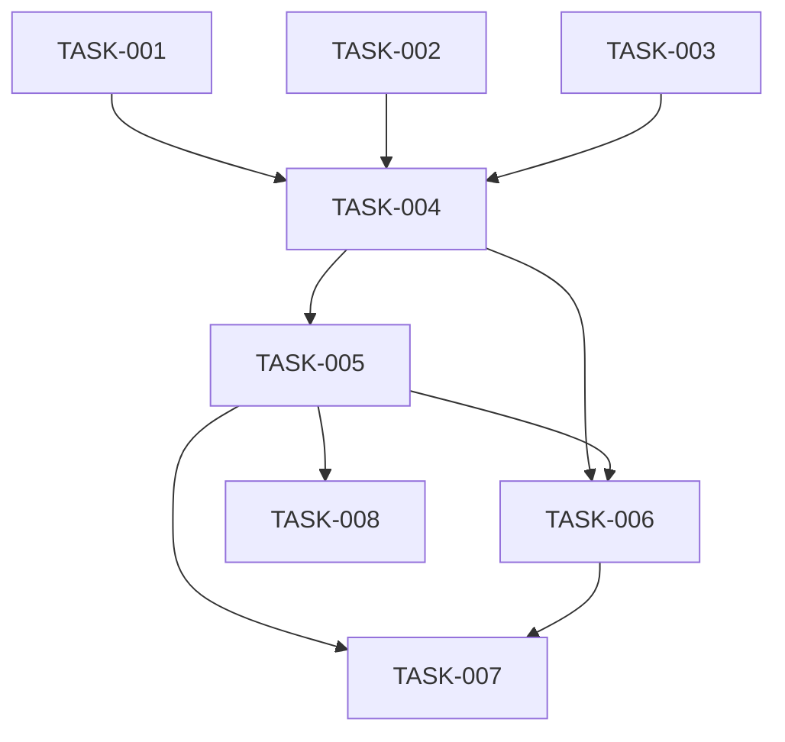

# My Profile page (/me) — Architecture

| Field | Value |
|---|---|
| REQ | REQ-010 |
| Status | validated |
| Created | 2026-10-07 |
| Related ADRs | [[ADR-01]] [[ADR-02]] [[ADR-03]] [[ADR-04]] [[ADR-06]] [[ADR-08]] [[ADR-09]] (no new ADR) |

## Summary

Frontend only. A new lazy feature `features/me/` renders `/me` inside `AppShell`: a form filled from `GET /api/me` (the existing `['me']` query), split into section cards, with a sticky save bar that shows only while the form differs from the saved profile, a leave warning, and a success toast. Save sends `PUT /api/me` and, if a new password was typed, `PUT /api/me/password`. Two small primitives are added (`Textarea`, `Toast`) in `components/ui/`; navigation gains "My Profile" in the avatar menu, `NAV_ITEMS` (header and tab bar) and Home. No backend, schema or shared-type changes: the types `MyProfile`, `UpdateMyProfileInput` and `ChangePasswordInput` already exist.

## Blast radius

| Path | Why touched | Risk |
|---|---|---|
| `packages/frontend/src/features/me/**` (new) | page, form sections, save bar, leave prompt, validation, error mapper, mutation hook, README, tests | medium |
| `packages/frontend/src/components/ui/Textarea/**`, `Toast/**` (new), `components/ui/README.md` | two primitives | low |
| `packages/frontend/src/config/mePath.ts` (new) | `ME_PATH`, leaf constant like `FEED_PATH` | low |
| `packages/frontend/src/services/authApi.ts` (+ test) | `updateMyProfile`, `changePassword` | low |
| `packages/frontend/src/app/router.tsx`, `app/lazyRoutes.test.ts`, `eslint.config.js` (`LAZY_FEATURES`) | `ME_ROUTE` for `/me`, lazy rules | medium |
| `packages/frontend/src/app/AppShell/{navItems.tsx,NavIcons.tsx,HeaderAuth.tsx}` (+ tests) | nav entry, icon, avatar menu items | medium |
| `packages/frontend/src/features/home/HomePage.tsx` (+ test) | third quick-link card | low |
| READMEs: `app/README.md`, `features/README.md`, `packages/frontend/README.md`, root `CLAUDE.md` Frontend section | lazy-page count, new feature, nav list | low |
| Vault: ADR-08 count, `concepts/route-layout.md`, `components/frontend.md` | lazy-page count (LESSON-REQ-009-4) | low |

Not touched: backend, `db/`, `packages/shared`, `tokens.json` (see Toast below).

## Approach

**Feature layout** (`features/me/`): `MePage` (loading skeleton, error + Retry, then the form), `ProfileForm` (holds `values`, `errors`, dirty state, submit), section components `PersonalSection`, `EducationSection`, `CareerSection`, `PasswordSection` (each a section card, role decides which render), `SaveBar`, `LeavePrompt`, pure `validation.ts` (+ `toValues`, `toInput`, `isDirty`), `profileErrors.ts`, hooks `useUpdateProfile`, `useLeaveGuard`. Imports follow ADR-06/08: `@/components/ui`, `@/config`, `@/services`, `@/store`; not `@/app`, not other lazy features. `useCurrentUser` lives in `features/auth` (already imported by `app/` and not lazy), so the page uses it for `['me']`.

**Role kind.** `kind = has_alumni_profile ? 'alumni' : has_student_profile ? 'student' : 'none'` (same precedence as `UserManager.updateMe`). Fields: all kinds: name, university. alumni and student: department, about (bio), job title, company, LinkedIn URL, experience; alumni adds graduation year; students add expected graduation year (required, with department). `none` (admin): Personal (name, university) and Password only; Education and Career are hidden.

**Values and dirty.** Form values are strings (as typed). `toValues(profile)` builds the baseline, `isDirty(values, baseline, passwordFields)` compares trimmed values and any non-empty password field. Hidden fields are never sent. `toInput` always sends every shown field **and the stored `photo_url`** (PUT clears an omitted one, confirmed in `UserQuery.updateMyProfile`), and never sends `email`.

**Validation** mirrors `businessLogic/validation.ts` with the same messages, with the limits as named constants in `validation.ts` (LESSON-REQ-006-3: the client keeps copies of API limits; a test pins each against the documented number). Errors show after blur or a Save attempt; failed Save focuses the first invalid field after `flushSync` (RegisterPage pattern). Password: all three fields are checked only when any is filled; current required, new 8 to 72 UTF-8 bytes, different from current, confirmation equal.

**Save = one mutation, two calls** (LESSON-REQ-002-3, must-succeed steps inside `mutationFn`): `mutationFn` calls `updateMyProfile`; if a new password was entered it then calls `changePassword`. If the second call fails it does not throw: it returns `{ profile, passwordError }` so the saved profile is applied while the error is shown on the password section. On success the hook `setQueryData(['me'], profile)` and invalidates `['alumni']` (the user's `/alumni/:id` and directory lists) and `['posts']` (feed and profile cards carry author name and photo). Not optimistic: the save bar shows "Saving…" and waits (ADR-09 optimistic edits are for feed-style actions; a validated, rarely-failing form that the user watches does not need it, and rollback of a form is worse UX than waiting).

**Server errors** (`profileErrors.ts`): 400/409 text goes to the field whose label starts the message (`Name…`, `Graduation year…`, `LinkedIn URL…`), `Current password is incorrect` goes to the current-password field, anything else to a form-level Alert; network or 5xx gets the shared "Couldn't reach the server" text; 401 is left to `SessionBridge` (ADR-03).

**Save bar and leave warning.** `SaveBar` is a sticky bottom bar rendered only while dirty (S5: "You have unsaved changes", Discard, Save changes; stacked full-width buttons on phone). `main` gets bottom padding while it is shown so it never covers the last field (LESSON-REQ-007-1) and it sits above the phone `BottomTabs`. `useLeaveGuard(isDirty)` uses React Router 8 `useBlocker` for in-app links and Back, plus a `beforeunload` listener for reload and tab close, both active only while dirty and not while a save is in flight. A blocked navigation shows `LeavePrompt` inside the save bar region ("Leave without saving?" Keep editing / Leave); there is no dialog primitive and none is added. After a successful save the baseline is reset first, so leaving right after is not blocked.

**Toast.** `components/ui/Toast`: presentational, `role="status"`, fixed top-right (full-width inset on phone), shown/hidden by the caller, auto-dismiss handled by the caller's state (4 s, and on dismiss button). It uses existing tokens only: surface `ink-primary` with text `surface-page` (an inverse pair that already exists in both themes) and a check icon in `currentColor`. S5's green check on dark ground and the soft shadow are not tokens, so they are listed as expected differences and the contrast pair is checked (G33) before shipping; if the pair fails, a `surface-inverse` token is added in `tokens.json` in that task. The toast lives in the page, not app-wide, since nothing else needs one yet.

**Textarea.** Same label, helper and error contract as `Input`, shares its CSS rules by duplication in its own module (CSS Modules cannot compose across components under the token lint), `rows` default 4, vertical resize, character limit only enforced by validation (no counter).

**Navigation.** `ME_PATH = '/me'` in `config/mePath.ts`. `NAV_ITEMS` gets `{ to: ME_PATH, label: 'My Profile', icon: <PersonIcon/> }` after Feed, matching S1's order; `MainNav` and `BottomTabs` pick it up. `HeaderAuth` menu: name/email label, "View profile" (only when `alumni_id !== null`, goes to `profilePath(alumni_id)` from `config/directoryReturn`), "My Profile", separator, "Log out". Home gets a "My Profile" card.

**Route.** `ME_ROUTE` (`path: 'me'`, static `HydrateFallback`, `lazy` import of `@/features/me/MePage`) inside `RequireAuth`; `LAZY_FEATURES` gets `'me'` in `eslint.config.js` and `lazyRoutes.test.ts`; the "six lists" from LESSON-REQ-009-4 are all updated (task 5).

**Phone top bar.** Below 48rem the page renders S5's bar (back arrow to Home, "My Profile"), following `profile/BackLink`'s hidden-text pattern; from 48rem the `h1` "My Profile" is shown instead (S5 desktop).

### Diagrams

```mermaid
flowchart LR
  Page[MePage] -->|useCurrentUser ['me']| API1[GET /api/me]
  Page --> Form[ProfileForm]
  Form -->|useUpdateProfile| M{mutationFn}
  M -->|1| PUT1[PUT /api/me]
  M -->|2 if new password| PUT2[PUT /api/me/password]
  M -->|onSuccess| Cache[setQueryData me + invalidate alumni, posts]
  Form --> Guard[useLeaveGuard: useBlocker + beforeunload]
```

### Changes after the stress test (ADV-001 to ADV-008, all fixed)

- **ADV-001 (phone overlap):** `AppShell` exposes the tab bar height as a CSS custom property (`--tab-bar-height`, 0 from 48rem); `SaveBar` sticks at `bottom: var(--tab-bar-height)` and the page's bottom padding uses it. Added to TASK-004; screenshot-checked in TASK-007.
- **ADV-002 (401 vs guard):** `useLeaveGuard`'s `shouldBlock` reads dirty from a ref and calls `getToken()` synchronously; it never blocks when no live token remains or when the target is `/login`. Test: a 401 logout while dirty is not blocked and shows no prompt.
- **ADV-003 (password blocked by profile rules):** Save first compares profile fields to the baseline. If none changed, `PUT /api/me` is skipped, only the password fields are validated and `changePassword` is called. If some changed, both run as before. Tests for both paths, including a student with an invalid stored value changing only the password.
- **ADV-004 (remount wipes state):** `ProfileForm` is keyed on `user_id` only; the baseline lives in form state and is replaced from the mutation result; the toast and the password error live in the component that owns the mutation. Test: profile saved, password rejected keeps the password error and the typed password.
- **ADV-005:** `profileErrors.ts` uses an explicit prefix-to-field table (Name, University, Department, Graduation year, Expected graduation year, Company, Job title, LinkedIn URL, Experience, Bio, Photo URL, Current password, New password).
- **ADV-006:** `features/me` may import `features/auth` (only the three lazy features are banned; TASK-001 confirms in `eslint.config.js`). `MenuItem` has only `onSelect`, so `HeaderAuth` uses `useNavigate`.
- **ADV-007:** TASK-007 also checks 360 px, 200% zoom and system theme. Home card title becomes "My Profile" (description carries the pitch).
- **ADV-008:** Leaving while a save is in flight is blocked as if dirty until the mutation settles, so a password failure or the toast is not lost silently.

## Task DAG

### Tier 0
- `TASK-001` — validation, values/dirty/input mapping, error mapper, API functions (pure, tested)
- `TASK-002` — `Textarea` and `Toast` primitives
- `TASK-003` — `ME_PATH`, nav entry and icon, avatar menu items, Home card

### Tier 1
- `TASK-004` — `features/me` UI: page, form, sections, save bar, leave guard, mutation hook, styles, README (depends on 001, 002, 003)

### Tier 2
- `TASK-005` — lazy route wiring and the six-list updates (depends on 004)
- `TASK-006` — page-level tests: roles, dirty/discard, save, errors, partial failure, leave warning, toast, cache refresh (depends on 004, 005)

### Tier 3
- `TASK-007` — S5 comparison: screenshots next to S5 at desktop/phone, light/dark, unsaved and toast states, difference list, fixes (depends on all)
- `TASK-008` — docs and vault: CLAUDE.md Frontend section, READMEs, vault copies (depends on 005; can run with 007)



## Test strategy

- Pure: `features/me/validation.test.ts` (every rule and message, year ranges with injected `now`, password byte limit, role kinds, `isDirty`, `toInput` keeps `photo_url`, never sends email, trims), `profileErrors.test.ts`.
- Services: `authApi.test.ts` additions (PUT bodies and 204).
- Primitives: `Textarea.test.tsx`, `Toast.test.tsx` (role, label/error wiring, dismiss).
- Nav: updates to `AppShell.test.tsx`, `HeaderAuth` (menu items, "View profile" hidden without an alumni id), `HomePage.test.tsx`, `MainNav`/`BottomTabs` current marking on `/me`.
- Page: `MePage.test.tsx` and `ProfileForm.test.tsx` with a custom axios adapter (G11): loading, error and Retry; alumni, student and no-profile forms; bar hidden until edit, Discard; invalid Save focuses first error; server 400 on a field; wrong current password; success shows toast, clears bar, and updates caches; password step failing after profile success; `useBlocker` prompt on in-app navigation with Keep/Leave, none when clean or after save; `beforeunload` registered only while dirty.
- Lazy rules: `lazyRoutes.test.ts` entry for `me`; ESLint ban verified by lint.
- Gates: typecheck, lint, tests, `tokens:check`, `npm run build` (check `/me` is its own chunk).
- Visual: TASK-007 compares to S5 in a real browser at 1440 and 390 wide, light and dark.

## Convention alignment

Forms controlled with pure validators and `useMutation` (ADR-04); server data in TanStack Query, no atom copy of the profile (ADR-02); tokens-only CSS Modules, no inline styles (ADR-01, LESSON-REQ-001-5); lazy route with its own ban and test (ADR-08); `config/` leaf for `ME_PATH` (ADR-06); tokens win over S5 hex (screens README). Deviation: none. Not optimistic on purpose, reason above.

## Risks

- **S5 elements that are not tokens** (soft shadow on the save bar and toast, green check on dark toast, 22px/15px type sizes): use the nearest token and list each as an expected difference; do not invent tokens except an inverse surface if contrast fails.
- **Dirty detection false positives** (trimming, numeric years, a `null` from the API vs `''`): `toValues` normalises both sides; covered by tests.
- **Partial save** (profile saved, password rejected): handled by returning the first result and keeping the password fields with an error; bar stays visible only if other fields remain dirty (password typed counts as dirty until it succeeds).
- **`useBlocker` and the unsaved-then-401 logout**: `SessionBridge` navigates to `/login` on a 401; the guard must not trap that. Guard allows navigation to `/login` when no token remains.
- **Photo cleared by mistake**: `toInput` always sends the stored `photo_url`; test pins it.
- **Mentorship, headline, location, degree, start year, photo upload** absent by decision; S5 diff list will name them.

## Open questions

- None blocking. Wording of the Home card ("My Profile": "Keep your details current so classmates can find you") is the implementer's draft, reviewed at the verify gate.
