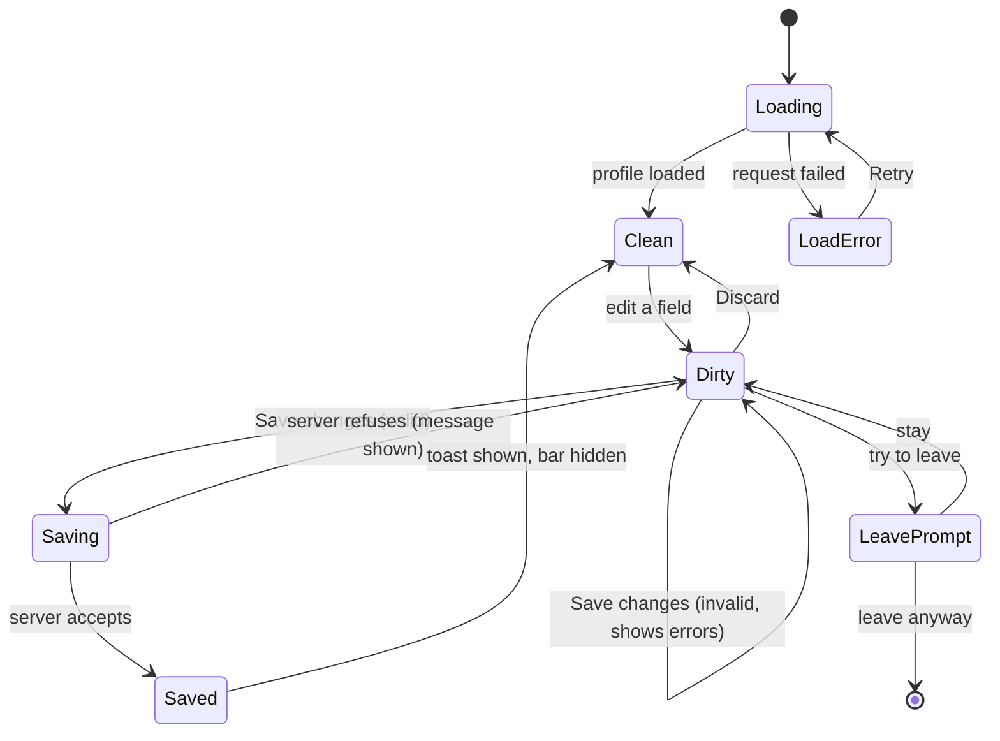

# My Profile page (/me)

| Field | Value |
|---|---|
| REQ | REQ-010 |
| Status | validated |
| Phase | spec |
| Created | 2026-10-07 |
| Primary repo | alumni-system |
| Touched repos | alumni-system |
| Related | design `docs/design/screens/app/S5-*`; [[ADR-01]] [[ADR-02]] [[ADR-04]] [[ADR-08]] [[ADR-09]]; [[LESSON-REQ-006-3-client-copies-of-api-limits]] [[LESSON-REQ-007-1-sticky-bottom-bar-needs-scroll-padding]] [[LESSON-REQ-009-4-adding-a-lazy-feature-touches-six-lists]] [[LESSON-REQ-004-2-check-design-colours-against-token-pairs]]; gotchas G33 |

## Problem

A signed-in user cannot edit their own profile in the new frontend. The API already has `GET /api/me`, `PUT /api/me` and `PUT /api/me/password`, and the public profile at `/alumni/:id` shows what is stored, but nothing in the app lets people correct their name, add a job, or change their password. The avatar menu has only "Log out", and the nav, tab bar and Home have no way to reach a profile editor. Design S5 exists and has not been built.

## Goal

A signed-in user opens **My Profile** at `/me` (from the avatar menu, the header nav, the phone tab bar, or a Home quick-link card), edits their own details in five sections (Personal, Education, Career, Mentorship, Change password), sees a sticky save bar only while there are unsaved changes, is warned before leaving with unsaved changes, gets inline validation that matches the backend rules, and sees a success toast after saving. Which fields appear depends on role (student, alumni, or an account with no profile row), as in sign-up. After saving, `/alumni/:id` shows the new data. The page matches S5 (desktop and phone, light and dark, unsaved-changes and toast states), using design tokens only.

## What the API supports and what S5 shows (gaps)

Checked against `MeController`, `UserManager.updateMe`, `validation.ts` and the shared `MyProfile` type. Per instruction, nothing is invented: design-only items are listed here for your decision.

| S5 element | In the API? | Proposal |
|---|---|---|
| Full name, University | yes (`name`, `university`) | build |
| Graduation year (alumni) / Expected graduation year (students) | yes | build, by role |
| Department | yes | build (not in S5; sign-up has it, students require it) |
| Current role, Company, LinkedIn URL | yes (`job_title`, `current_company`, `linkedin_url`) | build |
| Experience (free text) | yes (`experience`, max 5000) | build, in Career (asked for; not in S5) |
| About / bio | yes (`bio`, max 2000; shown in About on `/alumni/:id`) | build, in Personal as "About" (not in S5) |
| Change password (current, new, confirm) | yes, separate `PUT /api/me/password` | build; one Save runs both calls |
| **Headline** | **no** (public headline is derived from job title and company) | omit; show nothing |
| **Location** | **no** | omit |
| **Degree** | **no** | omit |
| **Start year** | **no** | omit |
| **Mentorship toggle** | **no** (no column, no endpoint, no badge or mentor search) | omit the section's control; needs a migration and API work |
| **Change photo** | **no upload**; only `photo_url` (http/https URL) | omit the button; avatar shows initials |

## Non-goals

- No new backend columns, migrations or endpoints in this REQ (headline, location, degree, start year, mentorship, photo upload each need their own REQ).
- No email change (the API needs the current password for it; S5 has no email field).
- No Admin page, no About page, no account deletion.
- No new third-party library.

## Acceptance criteria

- [ ] `/me` is a signed-in route inside `AppShell`; a guest is sent to `/login`. It is lazy-loaded as its own chunk (`npm run build` shows it in `dist/assets`) and nothing else imports it statically.
- [ ] The form is filled from `GET /api/me` through TanStack Query; it shows a loading skeleton, and an error state with Retry.
- [ ] Sections in S5 order: Personal, Education, Career, Change password (Mentorship is omitted: no API support, decided at the spec gate). A section with no editable field for this role is not shown.
- [ ] Alumni (with an alumni row) see: name, About; university, department, graduation year; job title, company, LinkedIn URL, experience. Students (with a students row) see: name, About; university, department, expected graduation year; job title, company, LinkedIn URL, experience. An account with no profile row (e.g. admin) sees name and university, and Change password only.
- [ ] Each field validates inline with the backend's rules and messages (required, max lengths, 4-digit year 1900 to this year + 10, student expected year this year to this year + 8, LinkedIn must start with http:// or https://, new password 8 to 72 UTF-8 bytes and different from the current one, confirmation matches). Errors show after the field is touched or Save is tried; focus goes to the first invalid field on a failed Save.
- [ ] The sticky save bar ("You have unsaved changes", Discard, Save changes) appears only while the form differs from the saved profile. Discard restores the saved values. The page content keeps enough bottom padding that the bar never covers the last field.
- [ ] Leaving the page (in-app link, back button, tab close or reload) with unsaved changes asks for confirmation; with no unsaved changes it never asks. Saving or discarding clears the warning.
- [ ] Save sends `PUT /api/me` with the role's fields, then, if a new password was entered, `PUT /api/me/password`. On success the success toast ("Profile updated successfully") shows, the save bar goes away, and the password fields clear. If the password call fails after the profile saved, the profile changes stay saved, the error shows on the password section, and the toast is not shown for the failed part.
- [ ] A server 400/409 message shows next to the form (and on the field when it names one); a "Current password is incorrect" answer shows on the current-password field. A 401 is handled by the existing session logic (ADR-03).
- [ ] After a successful save, the `/me` data, the matching `/alumni/:id` profile and directory lists are refreshed, so `/alumni/:id` shows the new data without a manual reload.
- [ ] The avatar menu gains "View profile" (to `/alumni/<alumni_id>`, shown only when the user has an alumni profile) and "My Profile" (to `/me`), above "Log out". The header `MainNav`, the phone `BottomTabs` and the Home quick-links each gain a "My Profile" entry; the nav entry is marked current on `/me`.
- [ ] Layout follows S5: content column max 680px centred, section cards, two-column rows on desktop and one column on phone; the phone shows S5's top bar with back arrow and "My Profile".
- [ ] Only design tokens are used (no hex from the design files, no inline styles); contrast pairs are checked against tokens (lesson REQ-004-2, gotcha G33). Works from 360px and at 200% zoom, in light, dark and system themes.
- [ ] Tests cover validation (pure), the form states (dirty, discard, save, errors, password failure), role-dependent fields, the leave warning, the toast, the menu/nav/tab/Home additions, and the lazy-route rules. `npm run build`, typecheck, lint, tests and `tokens:check` pass.
- [ ] Before finishing: screenshots of the built page next to S5 at desktop and phone width, light and dark, plus the unsaved and toast states; every difference is listed and fixed or explained (differences that come from the gaps above are listed as expected).

## Flow

## Assumptions

- `GET /api/me` returns everything needed, including `has_alumni_profile`, `has_student_profile` and `alumni_id` (verified in the shared `MyProfile` type).
- `PUT /api/me` is a full replace for the role's fields (omitted optional fields are cleared), so the form always sends every field it shows. Email is omitted (kept).
- `PUT /api/me` requires `name`; it takes `photo_url` as optional and clears it when omitted, so the form must send the stored `photo_url` back unchanged or Save would erase it. `STATUS: needs verification` (architect confirms with the DAL).
- Students have no `/alumni/:id` page (no alumni row), so "View profile" is hidden for them and the "public profile shows new data" criterion applies to alumni.
- The design's fonts, brand name ("Alumni Network") and accent colour are older than the current Alma tokens; tokens win (README in `docs/design/screens`).

## Open questions

- [x] Gaps: build only what the API supports (decided at the spec gate 2026-10-07). Mentorship section is omitted until it has a control.

## Out of scope (for now)

- Headline, location, degree, start year, mentorship availability (with its directory badge and mentor search), photo upload. Each needs a column and API change first.
- Email change, account deletion, notification settings.
- Admin page (S6) and About page (S7); their nav entries stay out until they exist.

## Related

- Concepts: [[optimistic-cache-edits]], [[detail-page-pattern]], [[route-layout]], [[design-tokens]]
- Components: Menu, Avatar, Input, PasswordInput, Button, Alert, Skeleton (existing); new primitives likely: Textarea, Switch, Toast (decided at the architect gate)
- Lessons: see header row
- ADRs: [[ADR-01]] (UI layer), [[ADR-02]] (state), [[ADR-04]] (forms), [[ADR-08]] (lazy routes), [[ADR-09]] (cache edits)

## Backlinks

_(populated by /wrapup)_
