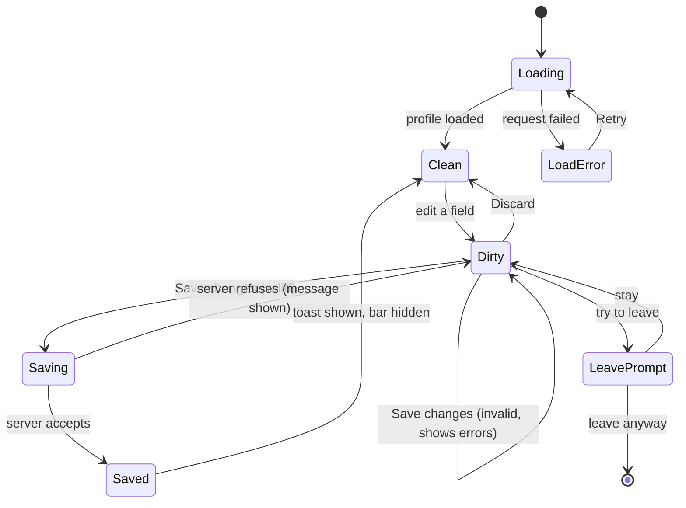
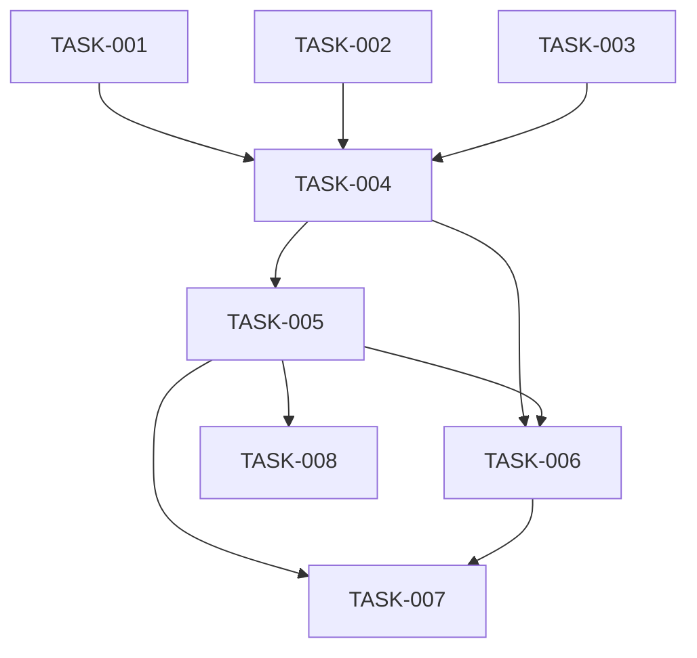

# REQ-010-my-profile-page — Review Packet

`Packet: 165KB · 55 code files changed (tests excluded from the diff, listed below) · diff 135KB · excluded test files: packages/frontend/scripts/enforcement.test.ts (+12/−2), packages/frontend/src/app/AppShell/AppShell.test.tsx (+161/−10), packages/frontend/src/app/lazyRoutes.test.ts (+16/−1), packages/frontend/src/components/ui/Textarea/Textarea.test.tsx (+112/−0), packages/frontend/src/components/ui/Toast/Toast.test.tsx (+81/−0), packages/frontend/src/features/home/HomePage.test.tsx (+5/−2), packages/frontend/src/features/me/MePage.test.tsx (+430/−0), packages/frontend/src/features/me/ProfileForm.test.tsx (+480/−0), packages/frontend/src/features/me/SaveBar.test.tsx (+85/−0), packages/frontend/src/features/me/profileErrors.test.ts (+87/−0), packages/frontend/src/features/me/useLeaveGuard.test.tsx (+148/−0), packages/frontend/src/features/me/useUpdateProfile.test.tsx (+139/−0), packages/frontend/src/features/me/validation.test.ts (+485/−0), packages/frontend/src/services/authApi.test.ts (+53/−4)`

This packet contains the diff (code only: packages/**) with full file context, the REQ spec, the REQ architecture, and the exploration report's blast radius and vault references. **Do not re-read these via Read — cite this packet.** Test files (`*.test.ts`, `*.test.tsx`) are NOT in the diff to keep the packet under ceiling: read them directly when judging coverage; that is required reading, not a packet gap. Base for the diff is commit 7e88dcbf (the merged REQ-009 tip; the branch was cut from it).

**Your own required reading is not a packet gap.** `context/conventions.md`, the vault (lessons, gotchas, ADRs, concepts), and any source file outside the diff that this change interacts with are your mandate. Read them freely; do not report them.

**`Packet-gap` means the packet's own contents fell short** — add `**Packet-gap:** <path> — <why>` to your section only then.

## Diff with 30 lines of context (new files are whole) (vs 7e88dcbf)

```diff
diff --git a/packages/frontend/README.md b/packages/frontend/README.md
index 51cc36bd..8de3211e 100644
--- a/packages/frontend/README.md
+++ b/packages/frontend/README.md
@@ -1,147 +1,147 @@
 # @alumni/frontend
 
-Alma, the alumni network web app: React 19 + Vite 8 + TypeScript 6. It has a shell (header with the Alma logo and name, log-in/sign-up links or a user menu, and a theme toggle), log-in and sign-up pages (a brand panel beside the form on wide screens), a signed-in Home page, the alumni Directory (search, filters, pages), an alumni Profile page and the post Feed, on top of the design system.
+Alma, the alumni network web app: React 19 + Vite 8 + TypeScript 6. It has a shell (header with the Alma logo and name, log-in/sign-up links or a user menu, and a theme toggle), log-in and sign-up pages (a brand panel beside the form on wide screens), a signed-in Home page, the alumni Directory (search, filters, pages), an alumni Profile page, the post Feed and My Profile (edit your own profile), on top of the design system.
 
 ## Stack
 
 | Concern       | Choice                                                                    | Why / note                                                                   |
 | ------------- | ------------------------------------------------------------------------- | ---------------------------------------------------------------------------- |
 | UI runtime    | React 19.3, React DOM 19.3                                                | React Router 8 needs ≥ 19.2.7                                                |
 | Build         | Vite 8, `@vitejs/plugin-react` 6                                          | Dev server proxies `/api` to the API                                         |
 | Types         | TypeScript **6.0** (not 7)                                                | `typescript-eslint` 8.71 supports TS < 6.1; TS 7 would break type-aware lint |
 | Routing       | React Router 8 (`react-router`, data router)                              |                                                                              |
 | State         | Jotai 3 (client-only state), TanStack Query 5 (server state)              | ADR-02                                                                       |
 | HTTP          | axios, one instance (`src/services/httpClient.ts`)                        | Attaches the auth header in one interceptor                                  |
 | UI behavior   | Base UI (`@base-ui/react`), headless                                      | ADR-01. Used by `Menu`, `SegmentedControl` (so `ThemeToggle`) and `Popover`  |
 | Styling       | CSS Modules + design tokens (CSS custom properties)                       | No component library; no raw colors or shadows                               |
 | Font          | Inter, self-hosted via `@fontsource-variable/inter`                       | No third-party font request                                                  |
 | Lint / format | ESLint **9** (not 10), Stylelint 17, Prettier 3                           | `eslint-plugin-jsx-a11y` only supports ESLint ≤ 9                            |
 | Tests         | Vitest 5, React Testing Library 16, user-event 14, jest-dom, **jsdom 29** | jsdom 30 needs Node ≥ 24.15; jsdom is pinned to 29 so Node 24.14 works       |
 
 The package is ESM (`"type": "module"` in `package.json`) so the `.js` lint configs load as modules. It needs Node 24 or later (`engines.node`): `npm run tokens` runs a `.ts` file directly with Node's built-in type stripping (no `tsx`/`ts-node`).
 
 ## Scripts
 
 Run inside `packages/frontend` (or from the repo root with `--workspace=packages/frontend`).
 
 | Script                  | What it does                                                                               |
 | ----------------------- | ------------------------------------------------------------------------------------------ |
 | `npm run dev`           | Vite dev server on port 5173; `/api` is proxied to the API (see below)                     |
 | `npm run build`         | `typecheck`, then `vite build` into `dist/`                                                |
 | `npm run preview`       | Serve the production build locally                                                         |
 | `npm run typecheck`     | `tsc` on `tsconfig.app.json` (app code) and `tsconfig.node.json` (Vite config, `scripts/`) |
 | `npm run lint`          | ESLint on all TS/JS, then Stylelint on `src/**/*.css`                                      |
 | `npm run lint:fix`      | Same, with auto-fix                                                                        |
 | `npm run format`        | Prettier, write                                                                            |
 | `npm run format:check`  | Prettier, check only                                                                       |
 | `npm test`              | Vitest, single run                                                                         |
 | `npm run test:watch`    | Vitest, watch mode                                                                         |
 | `npm run test:coverage` | Vitest with a v8 coverage report in `coverage/` (git-ignored)                              |
 | `npm run tokens`        | Regenerate `src/styles/tokens.css` from `docs/design/design-system/tokens.json`            |
 | `npm run tokens:check`  | Exit 1 if `tokens.css` is out of date (for CI)                                             |
 
 From the repo root, `npm run dev` starts the API and this dev server together; `npm run dev:frontend` starts this one alone.
 
 ### Dev proxy
 
 API calls use relative paths under `/api` (the axios instance has `baseURL: '/api'`). In dev, `vite.config.ts` proxies `/api` to `http://localhost:<PORT>`, where `PORT` comes from the repo-root `.env` (default 3000). Only `PORT` is read from that file, and only inside the Vite config; nothing else in it reaches the browser. Start the API too, or `/api` calls fail with a proxy error.
 
 ## Folder map
 
 ```
 packages/frontend/
   index.html          <title>Alma</title>, inline no-flash theme script, then /src/main.tsx
   public/             favicon.svg (copied from docs/design/brand/; the one raw-hex design asset)
   scripts/            generate-tokens.ts (+ test), enforcement.test.ts (lint rules self-test)
   src/
     main.tsx          imports the font, tokens.css, global.css (in that order), renders <App/>
     app/              App, providers, router, QueryClient, RootLayout, AuthShell and AppShell layouts,
                       MainNav, BottomTabs, HydrateFallback, RouteError
     config/           app-wide constants and small pure contracts: brand.ts (BRAND_NAME, SUPPORT_EMAIL,
                       supportMailto), directoryReturn.ts (DIRECTORY_PATH, profilePath, the directory-to-profile
-                      router-state handover), feedPath.ts (FEED_PATH), relativeTime.ts
+                      router-state handover), feedPath.ts (FEED_PATH), mePath.ts (ME_PATH), relativeTime.ts
     features/         one folder per domain: theme/, auth/ (session, guards, pages), home/,
-                      directory/, profile/ and feed/ (lazy-loaded directory, alumni profile and
-                      post feed pages)
+                      directory/, profile/, feed/ and me/ (lazy-loaded directory, alumni profile,
+                      post feed and My Profile pages)
     components/ui/    design-system primitives: Button, ButtonLink, Input, PasswordInput, Logo,
                       Card, Tag, Alert, Menu, SegmentedControl, ThemeToggle, Avatar, Chip,
                       Skeleton, SearchField, Popover
     store/            Jotai atoms for client-only state (themeAtom, sessionNoticeAtom)
     services/         httpClient (axios), authToken (token in localStorage), authApi, alumniApi,
                       postsApi, httpErrors
     styles/           tokens.css (generated), global.css, contrast test
     test/             Vitest setup and harness smoke test
 ```
 
 Each folder's README says what belongs there and what may import it:
 [app](src/app/README.md) · [config](src/config/README.md) · [features](src/features/README.md) · [components/ui](src/components/ui/README.md) · [store](src/store/README.md) · [services](src/services/README.md) · [styles](src/styles/README.md) · [test](src/test/README.md)
 
 **Path alias:** `@/` means `src/` (`import { Button } from '@/components/ui/Button'`). It is declared in `tsconfig.app.json` (`paths`) and in `vite.config.ts` (`resolve.alias`); Vitest reads the Vite config, so the editor, typecheck, build and tests all agree.
 
 **Import boundaries** (enforced by ESLint for both `@/…` and relative paths):
 
 - `components/ui/` must not import `services/`, `store/`, `features/`, `config/`, `app/`, `axios` or `@tanstack/react-query`. Primitives are props in, events out (the brand name reaches `Logo` as a prop).
 - `services/` must not import React, `components/`, `store/`, `features/` or `app/`. Services return data to the caller.
 - `store/` must not import `services/`, `features/` or `app/`. Features wire atoms to services.
 - `config/` is a leaf: it must not import `app/`, `features/`, `components/`, `store/` or `services/`. `app/` and `features/` read it.
 - Nothing in `features/`, `store/`, `services/` or `components/` may import `app/` (in practice only `main.tsx` does). Test files (`*.test.ts(x)`) are exempt from this one ban only, so tests may import `app/` providers to render a component.
 
 **Server state vs client state (ADR-02):** data from the API goes through TanStack Query, using the shared `QueryClient` from `app/queryClient.ts` (30 s stale time, no refetch on window focus, up to 2 retries but never on a 4xx). Jotai atoms in `store/` hold client-only state. The auth token lives only in `services/authToken.ts` (`localStorage['token']`), never in an atom; `httpClient` adds `Authorization: Bearer <token>` in its one request interceptor, so call sites never build auth headers.
 
 **Route errors:** the router has two `errorElement` layers on each branch. The outer one, on the `/` root layout, catches a crash in a shell itself (the shell is gone). The inner one, on a pathless child route inside each shell (`AuthShell`, `AppShell`), catches page errors and shows `RouteError` inside that shell's `<main>`.
 
 ## Auth and session
 
 ADR-03. Log in, sign up (student or alumni), stay signed in across reloads, log out, and get sent to `/login` with a notice when the session ends.
 
-- **Routes** (`app/router.tsx`): `GuestOnly` wraps `/login` and `/register`; `RequireAuth` wraps `/` (Home), `/directory`, `/alumni/:id` and `/feed`. An unknown path shows the empty shell. `RootLayout` holds two shells: `AuthShell` (no header, theme toggle top-right) for `/login` and `/register`, `AppShell` (header) for everything else.
+- **Routes** (`app/router.tsx`): `GuestOnly` wraps `/login` and `/register`; `RequireAuth` wraps `/` (Home), `/directory`, `/alumni/:id`, `/feed` and `/me`. An unknown path shows the empty shell. `RootLayout` holds two shells: `AuthShell` (no header, theme toggle top-right) for `/login` and `/register`, `AppShell` (header) for everything else.
 - **Endpoints:** `services/authApi.ts` has `login`, `register` and `getMe` (`GET /me`). They only return data.
 - **Token store:** `services/authToken.ts` keeps the token in `localStorage['token']`. `subscribe(listener)` fires on `setToken`/`clearToken` and on another tab's change. `isTokenExpired(token)` decodes the JWT `exp` (10 s leeway; a malformed token counts as expired). `getLiveToken()` returns the token only if it is present and not expired, with no side effects. `features/auth` reads it with `useLiveToken()` / `useHasSession()` (`useSyncExternalStore`).
 - **401s:** `httpClient` has one response interceptor. On a 401 from a request that carried a token (not `/auth/login` or `/auth/register`), it calls the handler registered with `setUnauthorizedHandler(fn)`, passing that request's token, then re-throws. `services/` never imports app or feature code.
 - **SessionBridge** (`features/auth/SessionBridge.tsx`, mounted once in `app/RootLayout`, above both shells, renders nothing):
   1. on load, silently drops a stored token that has expired;
   2. registers the 401 handler, which acts only if the failed request's token is still the current one (so a burst of 401s, or a late 401 after logout, causes one redirect at most): clear the token, set `sessionNoticeAtom` to `'expired'`, go to `/login` with `state.from`;
   3. clears the whole query cache whenever the token changes (login, logout, another tab), so no previous user's data is shown.
 - **Current user:** `useCurrentUser()` is the `['me']` query, enabled only with a live token. There is no atom copy.
 - **Login and sign-up:** `useLogin` / `useRegister` only store the token and clear the notice. They do not fetch `/me` or navigate; `GuestOnly` sees the token and sends the user on.
 - **Guards:** `RequireAuth` sends a guest to `/login` (saving the location as `state.from`), shows "Loading…" while `['me']` loads, and on a non-401 error shows an Alert with Retry and Log out. `GuestOnly` sends a signed-in user to `resolveFrom(location.state) ?? '/'`.
 - **Redirect-back** uses only `location.state.from`, never a URL parameter, so a crafted link can't redirect off-site. `resolveFrom` accepts only an app path (one leading `/`, not `/login` or `/register`).
 - **Logout:** `useLogout()` clears the token first, then goes to `/login`; the bridge clears the cache. The header menu and the RequireAuth error state both offer it.
 - **Session notice:** `LoginPage` shows "Your session has expired, please log in again" and clears it when it unmounts.
 - **`react-router/dom`:** `App.tsx` imports `RouterProvider` from `react-router/dom`, not `react-router`. The bridge and `useLogout` navigate with `flushSync: true`; without the DOM provider, `RequireAuth` fires a second redirect. Tests that check navigation counts must use it too.
 
 ## Directory and lazy routes
 
 REQ-006, ADR-08. `/directory` (signed in; the header's "Directory" link) lists alumni from `GET /api/alumni`, 12 per page.
 
-- **Lazy routes:** `app/router.tsx` loads the directory (`import('@/features/directory/DirectoryPage')`), the profile at `/alumni/:id` (`import('@/features/profile/ProfilePage')`) and the feed at `/feed` (`FEED_ROUTE`, `import('@/features/feed/FeedPage')`) with the route's `lazy`, so each is a separate chunk in `dist/assets`. Nothing else may import any of them statically, not even another lazy feature: ESLint rejects it (tests and `import type` excepted), and `src/app/lazyRoutes.test.ts` reads every non-test file in `src/` and fails if one does. Both checks run once per feature and leave out only that feature's own folder. New large pages follow the same pattern (add them to `LAZY_FEATURES` in `eslint.config.js` and in the test); Home stays eager.
+- **Lazy routes:** `app/router.tsx` loads the directory (`import('@/features/directory/DirectoryPage')`), the profile at `/alumni/:id` (`import('@/features/profile/ProfilePage')`) the feed at `/feed` (`FEED_ROUTE`, `import('@/features/feed/FeedPage')`) and My Profile at `/me` (`ME_ROUTE`, `import('@/features/me/MePage')`) with the route's `lazy`, so each is a separate chunk in `dist/assets`. Nothing else may import any of them statically, not even another lazy feature: ESLint rejects it (tests and `import type` excepted), and `src/app/lazyRoutes.test.ts` reads every non-test file in `src/` and fails if one does. Both checks run once per feature and leave out only that feature's own folder. New large pages follow the same pattern (add them to `LAZY_FEATURES` in `eslint.config.js` and in the test); Home stays eager.
 - **`HydrateFallback`** ("Loading…" in `<main>`) is a static property of each lazy route object itself. The router stops rendering at the nearest route with a fallback, so on the root it would hide the shell. A click from another page shows no fallback; a chunk that fails to load shows `RouteError` inside the shell.
 - **URL is the state:** search text, department, university, graduation year and page live in the query string, so a reload, a shared link and back/forward all work. `features/directory/params.ts` parses it (pure, tested) and ignores any value the API would reject. Filters and page changes push a history entry; typed search replaces the URL after 300 ms, and an outside change (Back, Clear all) cancels a pending write.
 - **States:** skeleton cards while loading, an error with Retry, "no matches" with Clear filters, "No alumni yet", and a page past the end with a way back to page 1. The count line ("Showing 1–12 of 40 alumni", "40 alumni" on phones) is a polite live region.
 - **Header:** after S1. `MainNav` (desktop) shows the Directory and Feed links (`NAV_ITEMS`) to signed-in users only, each marked current on its path and below with an accent underline. On phones a sticky bottom tab bar (`BottomTabs`) replaces it. The compact `ThemeToggle` and the avatar menu (name, email, Log out) sit on the right.
 
 ## Profile page
 
 REQ-008. `/alumni/:id` (signed in; every directory card links to it) shows one alumnus from `GET /api/alumni/:id` and their newest 5 posts from `GET /api/posts/user/:userId` (the profile's `user_id`), after the S3 designs.
 
 - **Sections:** header (avatar, name, "job title at company · Class of YYYY", LinkedIn link when it is an http(s) address), About, Education (university, department, class year), Employment (job title and company, then the free-text experience), Recent posts. A section with no data is not rendered. Location, the mentorship badge, degree, year ranges and job history are not shown: nothing stores them.
 - **States:** loading skeletons, "Profile not found" (unknown or malformed id: the API answers 404), error with Retry; posts have their own loading, error and empty states and never hide the profile. A failed background refetch keeps what is already shown.
 - **Back link:** "Back to directory" restores the search, filters and page the user left (the card passes `location.search` in router state; `config/directoryReturn.ts` owns the contract). A direct visit goes to plain `/directory`. On phones it shows as an arrow and "Profile" under the shell's top bar.
 - **Accessibility:** every state has an `h1` and a tab title; focus moves to the heading only when focus was on the page body or on something that disappeared.
 - More: `src/features/profile/README.md`.
 
 ## Feed
 
 REQ-009, ADR-09. `/feed` (signed in; the header's "Feed" link, the Feed tab on phones and Home's "Catch up on the feed" card) shows posts from `GET /api/posts`, newest first, 20 per page with Load more, after the S4 designs.
 
 - **Writing:** the composer posts trimmed text (Post stays disabled while blank). Comments and one level of replies live in a thread under each card, fetched only when it is opened. The author or an admin sees Edit and Delete (posts in the "Post actions" menu, comments in the "Reply · Edit · Delete" row); the API still decides, and a refused write shows its message. A post with comments asks inline before deletion ("Delete this post and its N comments?").
 - **Optimistic writes (ADR-09):** new posts and comments, edits and deletes show at once and are undone if the API refuses. `onMutate` edits the cache with a pure function from `cacheEdits.ts`, `onError` applies the inverse edit (no whole-cache snapshot), `onSettled` invalidates only when it is the last mutation on that key. Keys are `['feed','posts']` and `['feed','comments',postId]`. A pending item (negative id) has no menu, Reply or thread toggle.
 - **Author link:** the name links to `/alumni/<author_alumni_id>` (the alumni id, not the user id) and is plain text when the author has no alumni profile.
 - More: `src/features/feed/README.md`.
 
 ## Forms
 
 ADR-04: no form library for now.
 
 - Controlled state in the page component.
 - Pure, tested validators in `features/<x>/validation.ts` (`validateLogin`, `validateRegister(values, now)`) return a field → message map. Rules and messages mirror the backend (password at least 8 characters and at most 72 UTF-8 bytes, length limits, expected year from this year to this year + 8).
diff --git a/packages/frontend/eslint.config.js b/packages/frontend/eslint.config.js
index f2c2f5bf..e5105650 100644
--- a/packages/frontend/eslint.config.js
+++ b/packages/frontend/eslint.config.js
@@ -47,61 +47,61 @@ function layerBoundary({ files, ignores = [], paths = [], patterns }) {
     {
       files,
       ignores: [...ignores, ...TEST_FILES],
       rules: { 'no-restricted-imports': rule(patterns) },
     },
   ];
   if (paths.length > 0 || testPatterns.length > 0) {
     blocks.push({
       files: files.map((glob) => glob.replace('*.{ts,tsx}', '*.test.{ts,tsx}')),
       ignores,
       rules: { 'no-restricted-imports': rule(testPatterns) },
     });
   }
   return blocks;
 }
 
 // UI primitives must stay presentational: no data, state, or app wiring. They
 // also take brand text as props rather than reading config/.
 const UI_FORBIDDEN_LAYERS = ['services', 'store', 'features', 'config'];
 
 // config/ is a leaf: constants that app/ and features/ share, importing nothing internal.
 const CONFIG_FORBIDDEN_LAYERS = ['features', 'components', 'store', 'services'];
 
 // ADR-08: each lazy feature reaches the app only through the router's lazy
 // import(), so it stays in its own chunk. This uses the typescript-eslint copy
 // of no-restricted-imports, a separate rule from the layer blocks above, so it
 // can cover all of src/ without overriding them; it also lets `import type`
 // through (erased at build). Dynamic import() is never matched. '../<name>' and
 // '../../<name>' are the sibling forms used from inside features/.
 // src/app/lazyRoutes.test.ts is the second layer of this guard.
-const LAZY_FEATURES = ['directory', 'profile', 'feed'];
+const LAZY_FEATURES = ['directory', 'profile', 'feed', 'me'];
 
 function lazyBan(feature) {
   return {
     group: [
       `@/features/${feature}`,
       `./**/features/${feature}`,
       `../**/features/${feature}`,
       `../${feature}`,
       `../../${feature}`,
     ].flatMap((form) => [form, `${form}/**`]),
     allowTypeImports: true,
     message: `features/${feature} is lazy-loaded (ADR-08): reach it only through the router's import().`,
   };
 }
 
 // One check per lazy feature (ADV-006): a feature's own folder is exempt from
 // its own ban only, so one lazy feature can never import another statically.
 // The rule's options do not merge across blocks, so each region of src/ gets
 // one block with the full list of bans that apply there, and no two overlap.
 function lazyFeatureBoundaries() {
   const folders = LAZY_FEATURES.map((feature) => `src/features/${feature}/**`);
   const block = (files, ignores, banned) => ({
     files,
     ignores: [...ignores, ...TEST_FILES],
     rules: {
       '@typescript-eslint/no-restricted-imports': ['error', { patterns: banned.map(lazyBan) }],
     },
   });
   return [
     block(['src/**/*.{ts,tsx}'], folders, LAZY_FEATURES),
diff --git a/packages/frontend/src/app/AppShell/AppShell.module.css b/packages/frontend/src/app/AppShell/AppShell.module.css
index d395c3cf..4229119e 100644
--- a/packages/frontend/src/app/AppShell/AppShell.module.css
+++ b/packages/frontend/src/app/AppShell/AppShell.module.css
@@ -1,40 +1,51 @@
 /* App frame after docs/design/screens/app/S1-*. Phone: a top bar (logo, theme
    toggle, avatar) and a bottom tab bar (BottomTabs). From 48rem: a 4rem
    header, full width, with the nav beside the logo and the toggle and avatar
    menu on the right. Content sits in a full-width column with S1's gutters;
    each page caps its own width. Everything wraps rather than overflowing, down
    to 360px and at 200% zoom.
    Sizes with no token use a calc() of tokens: 14px = space-3 + space-1 / 2,
    20px = space-4 + space-1. */
 
+/* --tab-bar-height: how tall BottomTabs is on phones (0 from 48rem, where it
+   is hidden), so a page's own fixed bottom bar can sit just above it (ADV-001,
+   REQ-010). The sum mirrors BottomTabs.module.css: hairline, bar padding
+   (space-1 top, space-2 + space-1 / 2 bottom), tab padding (space-2 twice),
+   the 1.25rem icon, the space-1 gap and one caption line. BottomTabs uses it
+   as its min height, so the two never disagree by more than a wrapped label. */
 .shell {
+  --tab-bar-height: calc(
+    1px + var(--space-1) + var(--space-2) * 2 + 1.25rem + var(--space-1) +
+      var(--text-caption-line) + var(--space-2) + var(--space-1) / 2
+  );
+
   display: flex;
   flex-direction: column;
   min-height: 100vh;
 }
 
 /* Off-screen until focused, then shown in the top-left corner. */
 .skipLink {
   position: absolute;
   top: 0;
   left: 0;
   z-index: 2;
   padding: var(--space-2) var(--space-4);
   background: var(--surface-raised);
   color: var(--accent);
   font: var(--text-label);
   border: 1px solid var(--border-subtle);
   border-radius: var(--radius-md);
   transform: translateY(-200%);
 }
 
 .skipLink:focus {
   transform: none;
 }
 
 .header {
   display: flex;
   flex-wrap: wrap;
   align-items: center;
   justify-content: space-between;
   gap: var(--space-3) var(--space-4);
@@ -104,60 +115,64 @@ span.avatar[data-size='xs'] {
 
 /* S1-Phone shows the avatar alone. */
 .chevron {
   display: none;
   inline-size: 0.875rem;
   block-size: 0.875rem;
 }
 
 /* Who is signed in, inside the account menu: name, then email. */
 .menuName {
   display: block;
   color: var(--ink-primary);
   font: var(--text-label);
 }
 
 .menuEmail {
   display: block;
   overflow-wrap: anywhere;
 }
 
 .main {
   flex: 1;
   padding: calc(var(--space-4) + var(--space-1)) var(--space-4);
 }
 
 .main:focus {
   outline: none;
 }
 
 @media (width >= 48rem) {
+  .shell {
+    --tab-bar-height: 0px;
+  }
+
   .header {
     flex-wrap: nowrap;
     gap: var(--space-5);
     min-height: calc(4rem + 1px);
     padding: 0 var(--space-6);
   }
 
   .headerStart {
     gap: var(--space-6);
   }
 
   .brand svg {
     inline-size: 1.75rem;
     block-size: 1.75rem;
   }
 
   /* S1-Desktop puts 10px between the mark and the name (phone: 8px). */
   .brand > span {
     gap: calc(var(--space-2) + var(--space-1) / 2);
   }
 
   .brand span:last-child {
     font: var(--text-heading-sm);
   }
 
   span.avatar[data-size='xs'] {
     inline-size: 2rem;
     block-size: 2rem;
     font: var(--text-label);
     font-weight: var(--text-heading-sm-weight);
diff --git a/packages/frontend/src/app/AppShell/BottomTabs.module.css b/packages/frontend/src/app/AppShell/BottomTabs.module.css
index 64db1387..cbe481b3 100644
--- a/packages/frontend/src/app/AppShell/BottomTabs.module.css
+++ b/packages/frontend/src/app/AppShell/BottomTabs.module.css
@@ -1,43 +1,46 @@
 /* Phone tab bar, after docs/design/screens/app/S1-Phone-*: raised surface,
    hairline on top, equal-width tabs with a 20px icon over the label, secondary
    ink (the design's ink-muted is under 4.5:1 at this size, as the system's
    README notes for placeholders) with the current tab in the accent colour. Sticks to the bottom of the
    shell. Nearest tokens: caption type (12px) for the design's 11px label;
    the design's 10px bottom padding is space-2 + half a space-1.
-   Hidden from 48rem, where the header nav is shown instead. */
+   Hidden from 48rem, where the header nav is shown instead. Its height is
+   --tab-bar-height, set on the shell (AppShell.module.css). */
 
 .tabs {
   position: sticky;
   bottom: 0;
   z-index: 1;
   display: flex;
+  box-sizing: border-box;
+  min-block-size: var(--tab-bar-height);
   padding: var(--space-1) var(--space-2) calc(var(--space-2) + var(--space-1) / 2);
   background: var(--surface-raised);
   border-top: 1px solid var(--border-subtle);
 }
 
 .tab {
   display: flex;
   flex: 1;
   flex-direction: column;
   align-items: center;
   gap: var(--space-1);
   padding: var(--space-2) 0;
   color: var(--ink-secondary);
   font: var(--text-caption);
   text-decoration: none;
   border-radius: var(--radius-md);
 }
 
 .tab svg {
   inline-size: 1.25rem;
   block-size: 1.25rem;
 }
 
 .active {
   color: var(--accent);
 }
 
 @media (width >= 48rem) {
   .tabs {
     display: none;
diff --git a/packages/frontend/src/app/AppShell/HeaderAuth.tsx b/packages/frontend/src/app/AppShell/HeaderAuth.tsx
index ef760dd9..da741f41 100644
--- a/packages/frontend/src/app/AppShell/HeaderAuth.tsx
+++ b/packages/frontend/src/app/AppShell/HeaderAuth.tsx
@@ -1,81 +1,91 @@
+import { useNavigate } from 'react-router';
 import { ButtonLink } from '@/components/ui/Button';
 import { Avatar } from '@/components/ui/Avatar';
 import { Menu, MenuItem, MenuLabel, MenuSeparator } from '@/components/ui/Menu';
+import { profilePath } from '@/config/directoryReturn';
+import { ME_PATH } from '@/config/mePath';
 import { useCurrentUser, useHasSession, useLogout } from '@/features/auth';
 import styles from './AppShell.module.css';
 
 /**
  * The header's auth area. Guests get Log in and Sign up links. A signed-in
- * user gets an avatar menu (initials, chevron) that shows their name and email
- * above Log out; while ['me'] is loading or has failed the button reads
- * "Account menu" and still offers Log out (ADV-006). View profile and Admin
- * settings join it when those pages exist.
+ * user gets an avatar menu (initials, chevron): their name and email, View
+ * profile (their public /alumni/:id page, only with an alumni row, so never
+ * for a student), My Profile (/me), then Log out. While ['me'] is loading or
+ * has failed the button reads "Account menu" and still offers My Profile and
+ * Log out (ADV-006). Admin settings join it when that page exists.
  */
 export function HeaderAuth() {
   const hasSession = useHasSession();
 
   if (!hasSession) {
     return (
       <nav aria-label="Account" className={styles.authLinks}>
         <ButtonLink to="/login" variant="ghost">
           Log in
         </ButtonLink>
         <ButtonLink to="/register" variant="primary">
           Sign up
         </ButtonLink>
       </nav>
     );
   }
   return <UserMenu />;
 }
 
 function UserMenu() {
   const { data: user } = useCurrentUser();
   const logout = useLogout();
+  const navigate = useNavigate();
+  const alumniId = user?.alumni_id ?? null;
   const trimmed = user?.name.trim() ?? '';
   const avatarName = trimmed.length > 0 ? trimmed : '?';
 
   return (
     <Menu
       label={user?.name ? `Account menu for ${user.name}` : 'Account menu'}
       trigger={
         <>
           {/* "?" until the profile loads, so the button is never an empty circle. */}
           <Avatar name={avatarName} size="xs" className={styles.avatar} />
           <ChevronIcon />
         </>
       }
       align="end"
       className={styles.accountButton}
     >
       {user && (
         <>
           <MenuLabel>
             <span className={styles.menuName}>{user.name}</span>
             <span className={styles.menuEmail}>{user.email}</span>
           </MenuLabel>
-          <MenuSeparator />
+          {alumniId !== null && (
+            <MenuItem onSelect={() => void navigate(profilePath(alumniId))}>View profile</MenuItem>
+          )}
         </>
       )}
+      <MenuItem onSelect={() => void navigate(ME_PATH)}>My Profile</MenuItem>
+      <MenuSeparator />
       <MenuItem onSelect={logout}>Log out</MenuItem>
     </Menu>
   );
 }
 
 function ChevronIcon() {
   return (
     <svg
       className={styles.chevron}
       viewBox="0 0 24 24"
       fill="none"
       stroke="currentColor"
       strokeWidth={2}
       strokeLinecap="round"
       strokeLinejoin="round"
       aria-hidden="true"
       focusable="false"
     >
       <polyline points="6 9 12 15 18 9" />
     </svg>
   );
 }
diff --git a/packages/frontend/src/app/AppShell/NavIcons.tsx b/packages/frontend/src/app/AppShell/NavIcons.tsx
index 5f455e1b..ff3d5773 100644
--- a/packages/frontend/src/app/AppShell/NavIcons.tsx
+++ b/packages/frontend/src/app/AppShell/NavIcons.tsx
@@ -1,30 +1,39 @@
 // Line icons from docs/design/screens/app/S1-Phone-* and S4-Phone-*; stroke follows the text colour.
 const ICON_PROPS = {
   viewBox: '0 0 24 24',
   fill: 'none',
   stroke: 'currentColor',
   strokeWidth: 2,
   strokeLinecap: 'round',
   strokeLinejoin: 'round',
   'aria-hidden': true,
   focusable: false,
 } as const;
 
 export function GridIcon() {
   return (
     <svg {...ICON_PROPS}>
       <rect x="3" y="3" width="7" height="7" rx="1" />
       <rect x="14" y="3" width="7" height="7" rx="1" />
       <rect x="3" y="14" width="7" height="7" rx="1" />
       <rect x="14" y="14" width="7" height="7" rx="1" />
     </svg>
   );
 }
 
 export function ChatBubbleIcon() {
   return (
     <svg {...ICON_PROPS}>
       <path d="M21 15a2 2 0 0 1-2 2H7l-4 4V5a2 2 0 0 1 2-2h14a2 2 0 0 1 2 2z" />
     </svg>
   );
 }
+
+export function PersonIcon() {
+  return (
+    <svg {...ICON_PROPS}>
+      <circle cx="12" cy="8" r="4" />
+      <path d="M4 21c0-4 3.5-7 8-7s8 3 8 7" />
+    </svg>
+  );
+}
diff --git a/packages/frontend/src/app/AppShell/navItems.tsx b/packages/frontend/src/app/AppShell/navItems.tsx
index abc3afd3..b7dc956f 100644
--- a/packages/frontend/src/app/AppShell/navItems.tsx
+++ b/packages/frontend/src/app/AppShell/navItems.tsx
@@ -1,21 +1,23 @@
 import type { ReactNode } from 'react';
 import { DIRECTORY_PATH } from '@/config/directoryReturn';
 import { FEED_PATH } from '@/config/feedPath';
-import { ChatBubbleIcon, GridIcon } from './NavIcons';
+import { ME_PATH } from '@/config/mePath';
+import { ChatBubbleIcon, GridIcon, PersonIcon } from './NavIcons';
 
 export interface NavItem {
   to: string;
   label: string;
   /** Tab-bar icon (decorative; the label names the link). */
   icon: ReactNode;
 }
 
 /**
  * The app's sections, shared by the header nav (desktop) and the bottom tab
- * bar (phone), in S1's order. Only pages that exist are listed: add My Profile
- * and Admin here when their pages are built (S1 shows all four).
+ * bar (phone), in S1's order. Only pages that exist are listed: add Admin
+ * here when its page is built (S1 shows all four).
  */
 export const NAV_ITEMS: readonly NavItem[] = [
   { to: DIRECTORY_PATH, label: 'Directory', icon: <GridIcon /> },
   { to: FEED_PATH, label: 'Feed', icon: <ChatBubbleIcon /> },
+  { to: ME_PATH, label: 'My Profile', icon: <PersonIcon /> },
 ];
diff --git a/packages/frontend/src/app/README.md b/packages/frontend/src/app/README.md
index 121b33cc..0b6a5816 100644
--- a/packages/frontend/src/app/README.md
+++ b/packages/frontend/src/app/README.md
@@ -1,17 +1,17 @@
 # app/
 
 **Purpose:** the application root:
 
 - `App.tsx`: renders `RouterProvider` from `react-router/dom`, not `react-router`, so logout's `flushSync` navigation works (gotcha G08).
 - Providers for TanStack Query and Jotai, and the shared `QueryClient`.
-- The router: the path-less `RootLayout` holds two shells. `AuthShell` wraps `GuestOnly` → `/login`, `/register`; `AppShell` wraps `RequireAuth` → `/` (Home), `/directory`, `/alumni/:id` and `/feed`, plus the unknown-path route and test pages. Both guards come from `features/auth`.
-- Lazy routes (ADR-08): `/directory` (`DIRECTORY_ROUTE`), `/alumni/:id` (`PROFILE_ROUTE`) and `/feed` (`FEED_ROUTE`, REQ-009) are loaded with the route's `lazy`, so each page is its own chunk. Only the route's dynamic `import()` may reference `features/directory`, `features/profile` or `features/feed`; an ESLint rule (`@typescript-eslint/no-restricted-imports` in `eslint.config.js`; `import type` is allowed) rejects a static import of any of them anywhere else in `src/` except tests, and `lazyRoutes.test.ts` scans every non-test file in `src/` as a second check. Both checks run once per feature, leaving out only that feature's own folder, so the lazy features cannot import each other. A new large page is added to the `LAZY_FEATURES` list in both places.
+- The router: the path-less `RootLayout` holds two shells. `AuthShell` wraps `GuestOnly` → `/login`, `/register`; `AppShell` wraps `RequireAuth` → `/` (Home), `/directory`, `/alumni/:id`, `/feed` and `/me`, plus the unknown-path route and test pages. Both guards come from `features/auth`.
+- Lazy routes (ADR-08): `/directory` (`DIRECTORY_ROUTE`), `/alumni/:id` (`PROFILE_ROUTE`) `/feed` (`FEED_ROUTE`, REQ-009) and `/me` (`ME_ROUTE`, REQ-010) are loaded with the route's `lazy`, so each page is its own chunk. Only the route's dynamic `import()` may reference `features/directory`, `features/profile`, `features/feed` or `features/me`; an ESLint rule (`@typescript-eslint/no-restricted-imports` in `eslint.config.js`; `import type` is allowed) rejects a static import of any of them anywhere else in `src/` except tests, and `lazyRoutes.test.ts` scans every non-test file in `src/` as a second check. Both checks run once per feature, leaving out only that feature's own folder, so the lazy features cannot import each other. A new large page is added to the `LAZY_FEATURES` list in both places.
 - `HydrateFallback`: the "Loading…" line shown in `<main>` while a lazy page's code loads on a direct visit. Set it as a static property of the lazy route object itself, never on the root or on what `lazy` returns: the router stops rendering at the nearest route that has one, so anywhere higher hides the shell. A client-side click to a lazy page shows no fallback (the old page stays until the code arrives). A chunk that fails to load shows the inner `RouteError`.
 - `RootLayout`: applies the theme and mounts `SessionBridge` once for every page, auth pages included. Don't mount it in a shell.
 - The `AuthShell` layout: no header, only the `ThemeToggle` in the top-right corner, and `<main id="main">`.
 - The `AppShell` layout: the header holds the `Logo` (with `BRAND_NAME` from `@/config/brand`, linking home), `MainNav` (`<nav aria-label="Main">`, desktop only), the compact icon-only `ThemeToggle` (the one the login page uses) and `HeaderAuth` (Log in / Sign up for guests; for a signed-in user an avatar menu with their name, email and Log out). On phones (< 48rem) the nav is `BottomTabs` (`<nav aria-label="Main tabs">`, sticky at the bottom). Both read one `NAV_ITEMS` list (`navItems.tsx`), which holds only pages that exist (Directory and Feed): add Profile and Admin there when built. The shell follows `docs/design/screens/app/S1-*`; `main` is full width with S1 gutters and each page caps its own width (Home 65rem, Directory 72rem centred, Feed 40rem).
 - The route error element.
 
-**May import:** anything in `src/` (`@/config/**`, `@/features/**` except `features/directory`, `features/profile` and `features/feed`, which only their lazy route's dynamic import reaches, `@/components/ui/**`, `@/store/**`, `@/services/**`, `@/styles/**`).
+**May import:** anything in `src/` (`@/config/**`, `@/features/**` except `features/directory`, `features/profile`, `features/feed` and `features/me`, which only their lazy route's dynamic import reaches, `@/components/ui/**`, `@/store/**`, `@/services/**`, `@/styles/**`).
 
 **Imported by:** only `src/main.tsx`. Nothing else may import from `app/`.
diff --git a/packages/frontend/src/app/router.tsx b/packages/frontend/src/app/router.tsx
index ac39f42a..23f419f7 100644
--- a/packages/frontend/src/app/router.tsx
+++ b/packages/frontend/src/app/router.tsx
@@ -38,68 +38,89 @@ export const DIRECTORY_ROUTE: RouteObject = {
 };
 
 /**
  * The alumni profile page, the second lazy page (ADR-08), built the same way
  * as `DIRECTORY_ROUTE`: only this dynamic import may reference
  * `features/profile`, and `HydrateFallback` sits on this route object.
  */
 export const PROFILE_ROUTE: RouteObject = {
   path: 'alumni/:id',
   HydrateFallback,
   lazy: async () => {
     const { ProfilePage } = await import('@/features/profile/ProfilePage');
     return { Component: ProfilePage };
   },
 };
 
 /**
  * The post feed, the third lazy page (ADR-08), built the same way as
  * `DIRECTORY_ROUTE`: only this dynamic import may reference `features/feed`,
  * and `HydrateFallback` sits on this route object.
  */
 export const FEED_ROUTE: RouteObject = {
   path: 'feed',
   HydrateFallback,
   lazy: async () => {
     const { FeedPage } = await import('@/features/feed/FeedPage');
     return { Component: FeedPage };
   },
 };
 
+/**
+ * The signed-in user's own profile form, the fourth lazy page (ADR-08,
+ * REQ-010), built the same way as `DIRECTORY_ROUTE`: only this dynamic import
+ * may reference `features/me`, and `HydrateFallback` sits on this route object.
+ */
+export const ME_ROUTE: RouteObject = {
+  path: 'me',
+  HydrateFallback,
+  lazy: async () => {
+    const { MePage } = await import('@/features/me/MePage');
+    return { Component: MePage };
+  },
+};
+
 /**
  * Pages inside AppShell (header). Home is the first signed-in page; the
- * directory, the profile and the feed are lazy. Any unknown path shows the empty shell.
+ * directory, the profile, the feed and My Profile are lazy. Any unknown path
+ * shows the empty shell.
  */
 const DEFAULT_PAGE_ROUTES: RouteObject[] = [
   {
     element: <RequireAuth />,
-    children: [{ index: true, element: <HomePage /> }, DIRECTORY_ROUTE, PROFILE_ROUTE, FEED_ROUTE],
+    children: [
+      { index: true, element: <HomePage /> },
+      DIRECTORY_ROUTE,
+      PROFILE_ROUTE,
+      FEED_ROUTE,
+      ME_ROUTE,
+    ],
   },
   { path: '*', element: null },
 ];
 
 /**
  * Builds the route tree. RootLayout (theme + SessionBridge, once for every
  * page) holds two shells: AuthShell for the guest pages, AppShell for the
  * rest. Two error layers on each branch: the outer `errorElement` catches a
  * crash in a shell (no shell then); each shell's path-less inner route shows
  * page errors inside its `<main>`. Tests pass extra pages, which go under
  * AppShell.
  */
 export function createRoutes(pageRoutes: RouteObject[] = DEFAULT_PAGE_ROUTES): RouteObject[] {
   return [
     {
       path: '/',
       element: <RootLayout />,
       errorElement: <RouteError />,
       children: [
         {
           element: <AuthShell />,
           children: [{ errorElement: <RouteError />, children: AUTH_ROUTES }],
         },
         {
           element: <AppShell />,
           children: [{ errorElement: <RouteError />, children: pageRoutes }],
         },
       ],
     },
   ];
diff --git a/packages/frontend/src/components/ui/README.md b/packages/frontend/src/components/ui/README.md
index b2b0ed77..e9de0e39 100644
--- a/packages/frontend/src/components/ui/README.md
+++ b/packages/frontend/src/components/ui/README.md
@@ -1,29 +1,31 @@
 # components/ui/
 
-**Purpose:** design-system primitives (Button, ButtonLink, Input, PasswordInput, Logo, Card, Tag, Alert, Menu, SegmentedControl, ThemeToggle, Avatar, Chip, Skeleton, SearchField, Popover, VisuallyHidden). Each lives in its own folder with `Name.tsx`, `Name.module.css`, `Name.test.tsx`, and `index.ts`. Primitives are props-in, events-out: typed props, styles only from design tokens (`var(--…)`), no data fetching.
+**Purpose:** design-system primitives (Button, ButtonLink, Input, Textarea, PasswordInput, Logo, Card, Tag, Alert, Menu, SegmentedControl, ThemeToggle, Avatar, Chip, Skeleton, SearchField, Popover, Toast, VisuallyHidden). Each lives in its own folder with `Name.tsx`, `Name.module.css`, `Name.test.tsx`, and `index.ts`. Primitives are props-in, events-out: typed props, styles only from design tokens (`var(--…)`), no data fetching.
 
 | Primitive                                           | What it is                                                                                                                                                                                                                                                                                                                                                                                                                      |
 | --------------------------------------------------- | ------------------------------------------------------------------------------------------------------------------------------------------------------------------------------------------------------------------------------------------------------------------------------------------------------------------------------------------------------------------------------------------------------------------------------- |
 | `Button`                                            | `primary` / `secondary` / `ghost`; `loading` disables it, sets `aria-busy` and shows a dot                                                                                                                                                                                                                                                                                                                                      |
 | `ButtonLink`                                        | Button styles on a react-router `Link` (lives in `Button/`); no `loading`/`disabled`                                                                                                                                                                                                                                                                                                                                            |
 | `Input`                                             | labelled text field (~40px tall) with `helperText` and `error` (`aria-invalid`, error text in `aria-describedby`); optional `endAdornment` (a control inside the field's end edge)                                                                                                                                                                                                                                              |
+| `Textarea`                                          | labelled multi-line field with Input's `helperText` / `error` contract (`aria-invalid`, error text in `aria-describedby`); `rows` defaults to 4, resizes vertically                                                                                                                                                                                                                                                             |
 | `PasswordInput`                                     | `Input` with a show/hide button (`aria-label` flips Show/Hide password, no `aria-pressed`); focus stays in the input; takes every `Input` prop except `type`                                                                                                                                                                                                                                                                    |
 | `Logo`                                              | inline-SVG brand mark coloured by tokens; props `label`, `showWordmark`, `decorative`, `size`                                                                                                                                                                                                                                                                                                                                   |
 | `Card`                                              | raised surface; `as` picks the element                                                                                                                                                                                                                                                                                                                                                                                          |
 | `Tag`                                               | small status label with a tone dot                                                                                                                                                                                                                                                                                                                                                                                              |
 | `Alert`                                             | inline message; `tone="error"` is `role="alert"`, `tone="info"` is `role="status"`; optional `title`                                                                                                                                                                                                                                                                                                                            |
 | `Menu` / `MenuItem` / `MenuLabel` / `MenuSeparator` | Base UI Menu: a dropdown with keyboard support (Enter/ArrowDown open, Escape closes and returns focus). `Menu` takes `trigger`, `align` and `label` (the trigger's accessible name when it holds only an avatar or icon); each `MenuItem` has `onSelect` and an optional `tone="danger"` (error color, e.g. "Delete post"); `MenuLabel` is a non-interactive heading; `MenuSeparator` a hairline                                |
 | `SegmentedControl<T>`                               | Base UI RadioGroup pill: `label`, `options`, `value`, `onValueChange`. An option with an `icon` shows only the icon, is named by its `label` (`aria-label`) and shows the label in a Base UI Tooltip on hover and focus                                                                                                                                                                                                         |
 | `ThemeToggle`                                       | Light / Dark / System, a thin wrapper over `SegmentedControl`. `variant="full"` (default; unused by the app since REQ-007) shows the words; `variant="compact"` (auth pages and the app header) shows sun / moon / monitor icons, same radio names, tooltip on hover and focus                                                                                                                                                  |
 | `Avatar`                                            | round photo (``) or initials (first letter of the first and last word) on accent-soft; `name`, `photoUrl`, `size` `lg` (5.25rem, the profile header) / `md` (2.75rem) / `sm` (2.5rem) / `xs` (2rem, the header account button); falls back to initials if the photo fails; `aria-hidden` (the name sits beside it)                                                                                                  |
 | `Chip`                                              | accent-soft pill for an active filter with an x button; `onRemove`, `removeLabel` (the button's accessible name), `removeButtonRef` to move focus to it                                                                                                                                                                                                                                                                         |
 | `Skeleton`                                          | `aria-hidden` loading placeholder on surface-sunken with a slow pulse (off under reduced motion); `shape` `line` / `block` / `circle`; size it with a `className` (the defaults yield)                                                                                                                                                                                                                                          |
 | `SearchField`                                       | `<input type="search">` with a leading search icon and a visually hidden `label` (its accessible name); 16px text so iOS doesn't zoom; native props and `ref` go to the input                                                                                                                                                                                                                                                   |
 | `Popover`                                           | Base UI Popover: a pill trigger with a chevron opening a non-modal panel (a dialog named by `label`) on surface-raised. Click/Enter/Space open it and focus the first field; Escape or an outside click closes it and returns focus to the trigger. Controlled (`open` + `onOpenChange`) or uncontrolled (`defaultOpen`); `finalFocus` (e.g. `false` when the caller moves focus itself), `initialFocus`, `triggerRef`, `align` |
+| `Toast`                                             | success message pinned top-right (full width on phones): message in a `role="status"` region, decorative check, dismiss button (`onDismiss`, `dismissLabel`); ink-primary surface with surface-page text; short enter animation, off under reduced motion; the caller shows it and owns any timer                                                                                                                               |
 | `VisuallyHidden`                                    | Text not drawn on screen but read by assistive tech (the one copy of that CSS): a span by default, `as="label"` for a hidden field label (SearchField), `as="p"` with `role="status"` for a polite message (results grid)                                                                                                                                                                                                       |
 
 **May import:** React, `@base-ui/react`, `react-router` (ButtonLink renders its `Link`), other `components/ui/` primitives, and `@/styles/**`.
 
 **Must not import:** `@/services/**`, `@/store/**`, `@/features/**`, `@/config/**`, `@/app/**`, `axios`, `@tanstack/react-query` (enforced by ESLint, for `@/…` and relative paths alike). Brand text such as the product name comes in as a prop (`Logo label`).
 
 **Imported by:** `features/` and `app/`.
diff --git a/packages/frontend/src/components/ui/Textarea/Textarea.module.css b/packages/frontend/src/components/ui/Textarea/Textarea.module.css
new file mode 100644
index 00000000..95590226
--- /dev/null
+++ b/packages/frontend/src/components/ui/Textarea/Textarea.module.css
@@ -0,0 +1,69 @@
+/* Same look as Input (components/ui/Input/Input.module.css), duplicated here
+   because CSS Modules cannot compose across components under the token lint.
+   Keep the two in step: border-strong at rest, accent border and raised fill
+   on focus, error border when aria-invalid, ink-secondary helper and
+   placeholder (4.5:1). Differences: body line height (multi-line text reads
+   better on the 26px line), vertical resize only, and no end adornment. */
+
+.field {
+  display: flex;
+  flex-direction: column;
+  gap: var(--space-2);
+}
+
+.label {
+  font: var(--text-label);
+  color: var(--ink-secondary);
+}
+
+/* 16px text so iOS does not zoom on focus. */
+.textarea {
+  font: var(--text-body);
+  color: var(--ink-primary);
+  background: var(--surface-sunken);
+  border: 1px solid var(--border-strong);
+  border-radius: var(--radius-md);
+  width: 100%;
+  min-width: 0;
+  box-sizing: border-box;
+  padding: var(--space-2) var(--space-4);
+  resize: vertical;
+  outline: none;
+  transition:
+    border-color var(--duration-fast) var(--easing-standard),
+    background-color var(--duration-fast) var(--easing-standard);
+}
+
+.textarea::placeholder {
+  color: var(--ink-secondary);
+}
+
+/* :where() keeps this at single-class weight, so the focus rule below wins (G04). */
+.textarea:where([aria-invalid='true']) {
+  border-color: var(--error);
+}
+
+/* The accent border is the only focus signal (no ring), as on Input. */
+.textarea:focus,
+.textarea:focus-visible {
+  outline: none;
+  border-color: var(--accent);
+  background: var(--surface-raised);
+}
+
+.textarea:disabled {
+  opacity: 0.5;
+  cursor: not-allowed;
+}
+
+.helper {
+  margin: 0;
+  font: var(--text-caption);
+  color: var(--ink-secondary);
+}
+
+.error {
+  margin: 0;
+  font: var(--text-caption);
+  color: var(--error);
+}
diff --git a/packages/frontend/src/components/ui/Textarea/Textarea.tsx b/packages/frontend/src/components/ui/Textarea/Textarea.tsx
new file mode 100644
index 00000000..4a5e6347
--- /dev/null
+++ b/packages/frontend/src/components/ui/Textarea/Textarea.tsx
@@ -0,0 +1,66 @@
+import { useId, type ComponentPropsWithRef, type ReactNode } from 'react';
+import { cx } from '../cx';
+import styles from './Textarea.module.css';
+
+export interface TextareaProps extends ComponentPropsWithRef<'textarea'> {
+  /** Visible label, tied to the textarea with htmlFor. */
+  label: ReactNode;
+  /** Hint shown below the field; becomes the textarea's accessible description. */
+  helperText?: ReactNode;
+  /**
+   * Error message for this field. When set, the textarea is marked aria-invalid
+   * and the message is added to its accessible description (before the helper).
+   */
+  error?: string;
+}
+
+/**
+ * A labeled multi-line text field, with Input's label, helper and error
+ * contract. Native textarea props (and `className`) go to the <textarea>;
+ * `rows` defaults to 4 and the user can resize it vertically.
+ */
+export function Textarea({
+  label,
+  helperText,
+  error,
+  id,
+  className,
+  rows = 4,
+  'aria-describedby': describedBy,
+  'aria-invalid': ariaInvalid,
+  ...rest
+}: TextareaProps) {
+  const generatedId = useId();
+  const textareaId = id ?? generatedId;
+  const helperId = `${textareaId}-helper`;
+  const errorId = `${textareaId}-error`;
+  const hasHelper = helperText !== undefined && helperText !== null && helperText !== '';
+  const hasError = error !== undefined && error !== '';
+  const describedByIds = cx(describedBy, hasError && errorId, hasHelper && helperId) || undefined;
+
+  return (
+    <div className={styles.field}>
+      <label className={styles.label} htmlFor={textareaId}>
+        {label}
+      </label>
+      <textarea
+        {...rest}
+        id={textareaId}
+        rows={rows}
+        aria-invalid={hasError ? true : ariaInvalid}
+        aria-describedby={describedByIds}
+        className={cx(styles.textarea, className)}
+      />
+      {hasError && (
+        <p id={errorId} className={styles.error}>
+          {error}
+        </p>
+      )}
+      {hasHelper && (
+        <p id={helperId} className={styles.helper}>
+          {helperText}
+        </p>
+      )}
+    </div>
+  );
+}
diff --git a/packages/frontend/src/components/ui/Textarea/index.ts b/packages/frontend/src/components/ui/Textarea/index.ts
new file mode 100644
index 00000000..7edb405e
--- /dev/null
+++ b/packages/frontend/src/components/ui/Textarea/index.ts
@@ -0,0 +1,2 @@
+export { Textarea } from './Textarea';
+export type { TextareaProps } from './Textarea';
diff --git a/packages/frontend/src/components/ui/Toast/Toast.module.css b/packages/frontend/src/components/ui/Toast/Toast.module.css
new file mode 100644
index 00000000..8d30e772
--- /dev/null
+++ b/packages/frontend/src/components/ui/Toast/Toast.module.css
@@ -0,0 +1,105 @@
+/* Design: docs/design/screens/app/S5-UnsavedToast. An inverse pill: ink-primary
+   surface with surface-page text, the existing inverse pair in both themes
+   (same ratio as body text, so it passes 4.5:1; see contrast.test.ts).
+   Expected differences from S5, each because there is no token for it: no
+   soft shadow (box-shadow is banned), the check is currentcolor rather than
+   S5's light green, radius-lg (14px) for S5's 10px, and the enter animation
+   runs for duration-fast (150ms) instead of 250ms. S5 has no dismiss button;
+   it is added so the message can be closed by keyboard and pointer.
+   Phone: inset full width below the top edge. From 48rem: top-right corner,
+   S5's 24px / 32px offsets (space-5 / space-6). Above the header (z 2) and
+   menus and popovers (z 10). */
+
+.toast {
+  position: fixed;
+  z-index: 20;
+  inset-block-start: var(--space-3);
+  inset-inline: var(--space-3);
+  display: flex;
+  align-items: center;
+  gap: var(--space-3);
+  padding: var(--space-2) var(--space-2) var(--space-2) var(--space-4);
+  border-radius: var(--radius-lg);
+  background: var(--ink-primary);
+  color: var(--surface-page);
+  animation: toast-in var(--duration-fast) var(--easing-standard);
+}
+
+@media (width >= 48rem) {
+  .toast {
+    inset-block-start: var(--space-5);
+    inset-inline: auto var(--space-6);
+    max-inline-size: calc(100vw - 2 * var(--space-6));
+  }
+}
+
+.check {
+  flex: none;
+  inline-size: 1rem;
+  block-size: 1rem;
+  fill: none;
+  stroke: currentcolor;
+  stroke-width: 2.5;
+  stroke-linecap: round;
+  stroke-linejoin: round;
+}
+
+/* Grows to fill the phone width; a long message wraps instead of overflowing. */
+.message {
+  flex: 1 1 auto;
+  min-inline-size: 0;
+  margin: 0;
+  font: var(--text-label);
+  overflow-wrap: anywhere;
+}
+
+/* 2.75rem square: a touch-sized target inside the pill. */
+.dismiss {
+  appearance: none;
+  display: inline-flex;
+  flex: none;
+  align-items: center;
+  justify-content: center;
+  inline-size: 2.75rem;
+  block-size: 2.75rem;
+  padding: 0;
+  border: 0;
+  border-radius: var(--radius-pill);
+  background: transparent;
+  color: inherit;
+  cursor: pointer;
+}
+
+/* The global accent focus ring is too faint on ink-primary, so the ring here
+   uses the toast's own text colour (surface-page), the same 4.5:1+ pair. */
+.dismiss:focus-visible {
+  outline-color: currentcolor;
+  outline-offset: 0;
+}
+
+.icon {
+  inline-size: 0.875rem;
+  block-size: 0.875rem;
+  fill: none;
+  stroke: currentcolor;
+  stroke-width: 2.5;
+  stroke-linecap: round;
+}
+
+@keyframes toast-in {
+  from {
+    opacity: 0;
+    transform: translateY(calc(-1 * var(--space-2)));
+  }
+
+  to {
+    opacity: 1;
+    transform: none;
+  }
+}
+
+@media (prefers-reduced-motion: reduce) {
+  .toast {
+    animation: none;
+  }
+}
diff --git a/packages/frontend/src/components/ui/Toast/Toast.tsx b/packages/frontend/src/components/ui/Toast/Toast.tsx
new file mode 100644
index 00000000..4a6e0722
--- /dev/null
+++ b/packages/frontend/src/components/ui/Toast/Toast.tsx
@@ -0,0 +1,43 @@
+import type { ComponentPropsWithRef, ReactNode } from 'react';
+import { cx } from '../cx';
+import styles from './Toast.module.css';
+
+export interface ToastProps extends Omit<ComponentPropsWithRef<'div'>, 'children' | 'role'> {
+  /** The message, e.g. "Profile updated successfully". */
+  children: ReactNode;
+  /** Called when the dismiss (x) button is pressed. */
+  onDismiss: () => void;
+  /** Accessible name of the dismiss button, e.g. "Dismiss". */
+  dismissLabel: string;
+}
+
+/**
+ * A short success message pinned to the top of the screen (top-right from
+ * 48rem, full width on a phone), with a decorative check and a dismiss button.
+ * Purely presentational: the caller decides when it shows and owns any
+ * auto-dismiss timer. Only the message sits in the role="status" region, so
+ * the dismiss button's name is not read out with it.
+ */
+export function Toast({ children, onDismiss, dismissLabel, className, ...rest }: ToastProps) {
+  return (
+    <div {...rest} className={cx(styles.toast, className)}>
+      <svg className={styles.check} viewBox="0 0 24 24" aria-hidden="true" focusable="false">
+        <polyline points="20 6 9 17 4 12" />
+      </svg>
+      <p role="status" className={styles.message}>
+        {children}
+      </p>
+      <button
+        type="button"
+        className={styles.dismiss}
+        aria-label={dismissLabel}
+        onClick={onDismiss}
+      >
+        <svg className={styles.icon} viewBox="0 0 24 24" aria-hidden="true" focusable="false">
+          <line x1="18" y1="6" x2="6" y2="18" />
+          <line x1="6" y1="6" x2="18" y2="18" />
+        </svg>
+      </button>
+    </div>
+  );
+}
diff --git a/packages/frontend/src/components/ui/Toast/index.ts b/packages/frontend/src/components/ui/Toast/index.ts
new file mode 100644
index 00000000..67348dba
--- /dev/null
+++ b/packages/frontend/src/components/ui/Toast/index.ts
@@ -0,0 +1,2 @@
+export { Toast } from './Toast';
+export type { ToastProps } from './Toast';
diff --git a/packages/frontend/src/config/README.md b/packages/frontend/src/config/README.md
index 81658671..ded2e193 100644
--- a/packages/frontend/src/config/README.md
+++ b/packages/frontend/src/config/README.md
@@ -1,13 +1,13 @@
 # config/
 
 **Purpose:** app-wide constants that more than one layer needs, such as the brand name and support email (`brand.ts`). Constants and small pure helpers only (e.g. `supportMailto(subject)`): no React, no state, no I/O.
 
 It is also the meeting point for contracts between features that may not import each other. `directoryReturn.ts` owns the directory and profile paths (`DIRECTORY_PATH`, and `profilePath(id)`, which URL-encodes the id), and the router state a directory card hands to the profile page (`directoryReturnState(search)`), which it turns back into the "Back to directory" target (`directoryReturnPath(state)`, plain `DIRECTORY_PATH` for anything unexpected). These paths and the state's key name live only there.
 
-`feedPath.ts` holds `FEED_PATH` (`/feed`) for the router, the nav and Home. `relativeTime.ts` turns a post or comment time into "5 minutes ago" (a plain date past 5 weeks); the profile and feed pages both use it, and as lazy features neither may import the other's copy.
+`feedPath.ts` holds `FEED_PATH` (`/feed`) for the router, the nav and Home. `mePath.ts` holds `ME_PATH` (`/me`) for the router, the nav, the avatar menu and Home. `relativeTime.ts` turns a post or comment time into "5 minutes ago" (a plain date past 5 weeks); the profile and feed pages both use it, and as lazy features neither may import the other's copy.
 
 **May import:** nothing internal. This folder is a leaf.
 
 **Must not import:** `@/app/**`, `@/features/**`, `@/components/**`, `@/store/**`, `@/services/**` (enforced by ESLint, for `@/…` and relative paths alike).
 
 **Imported by:** `app/` and `features/`. `components/ui/` may not import it (primitives take text such as the brand name as props).
diff --git a/packages/frontend/src/config/mePath.ts b/packages/frontend/src/config/mePath.ts
new file mode 100644
index 00000000..b9741587
--- /dev/null
+++ b/packages/frontend/src/config/mePath.ts
@@ -0,0 +1,2 @@
+/** The signed-in user's own profile page, for the router, the nav, the avatar menu and Home. */
+export const ME_PATH = '/me';
diff --git a/packages/frontend/src/features/README.md b/packages/frontend/src/features/README.md
index 537e8765..0a71217b 100644
--- a/packages/frontend/src/features/README.md
+++ b/packages/frontend/src/features/README.md
@@ -1,16 +1,17 @@
 # features/
 
 **Purpose:** one folder per domain. A feature owns its hooks, queries, and domain components, and wires UI primitives to state and services.
 
 **Features today:**
 
 - `theme/` — applies the light/dark/system preference to the page.
 - `auth/` — session (token, current user, 401 handling via `SessionBridge`), route guards (`RequireAuth`, `GuestOnly`), login and sign-up pages in a shared `AuthLayout` (full-height page with no app header: brand panel beside the form from 60rem, only its logo row above the form below that), and `ForgotPasswordHelp` (support mailto message).
 - `home/` — the signed-in home page: greeting and a quick-link card per existing page (the directory and the feed).
 - `directory/` — the alumni directory page at `/directory` (REQ-006): search, filters and page live in the URL query string (`params.ts` parses it and ignores anything the API would reject; `useDirectoryParams` writes it back, filters and pages push history, typed search replaces it after 300 ms), `useAlumniSearch` (TanStack Query over `services/alumniApi`), and the page's own pieces (`AlumniCard`, `ResultsGrid`, `FilterBar`, `Pagination`, `DirectoryStates`). It has no `index.ts`: the page is loaded lazily, so nothing outside this folder may import it statically (ADR-08, enforced by ESLint and by `app/lazyRoutes.test.ts`).
 - `profile/` — the alumni profile page at `/alumni/:id` (REQ-008): header, About, Education, Employment and Recent posts from `GET /api/alumni/:id` and `GET /api/posts/user/:userId`, with a "Back to directory" link that restores the directory search through `config/directoryReturn`. Lazy like `directory/` and also without an `index.ts` (ADR-08).
 - `feed/` — the post feed at `/feed` (REQ-009): composer, posts with Load more, comment threads with one level of replies, edit and delete for the author or an admin, and optimistic writes that edit the query cache and undo on failure (ADR-09). Lazy and without an `index.ts`, like `directory/` and `profile/` (ADR-08). Details in its own README.
+- `me/` — the signed-in user's own profile form at `/me` (REQ-010): section cards from the `['me']` query, a sticky save bar while the form has unsaved changes, a leave warning and a success toast; Save sends `PUT /api/me` and, if a new password was typed, `PUT /api/me/password`. Lazy and without an `index.ts`, like the other three (ADR-08). Details in its own README.
 
 **May import:** `@/components/ui/**`, `@/config/**`, `@/store/**`, `@/services/**`, `@/styles/**`, and types from `@alumni/shared`. Not `@/app/**`.
 
-**Imported by:** `app/` and other features. Exception: the lazy features `directory/`, `profile/` and `feed/` are reached only through their route's dynamic import in `app/router.tsx`. No other file may import them statically, and that includes each other: they meet only through `config/` (e.g. `relativeTime.ts`, which profile and feed both use).
+**Imported by:** `app/` and other features. Exception: the lazy features `directory/`, `profile/`, `feed/` and `me/` are reached only through their route's dynamic import in `app/router.tsx`. No other file may import them statically, and that includes each other: they meet only through `config/` (e.g. `relativeTime.ts`, which profile and feed both use).
diff --git a/packages/frontend/src/features/home/HomePage.tsx b/packages/frontend/src/features/home/HomePage.tsx
index c07c144f..76862323 100644
--- a/packages/frontend/src/features/home/HomePage.tsx
+++ b/packages/frontend/src/features/home/HomePage.tsx
@@ -1,58 +1,63 @@
 import { Link } from 'react-router';
 import { DIRECTORY_PATH } from '@/config/directoryReturn';
 import { FEED_PATH } from '@/config/feedPath';
+import { ME_PATH } from '@/config/mePath';
 import { useCurrentUser } from '@/features/auth';
 import styles from './HomePage.module.css';
 
 interface QuickLink {
   to: string;
   title: string;
   description: string;
 }
 
 /**
  * The cards under the greeting (docs/design/screens/app/S1-*). Only pages
- * that exist are listed; add the profile and admin cards when those pages are
- * built.
+ * that exist are listed; add the admin card when that page is built.
  */
 const QUICK_LINKS: readonly QuickLink[] = [
   {
     to: DIRECTORY_PATH,
     title: 'Browse the directory',
     description: 'Find classmates by year, department or field',
   },
   {
     to: FEED_PATH,
     title: 'Catch up on the feed',
     description: 'See what alumni and students are sharing',
   },
+  {
+    to: ME_PATH,
+    title: 'My Profile',
+    description: 'Keep your details current so classmates can find you',
+  },
 ];
 
 /** "Amina Rao" -> "Amina". A blank name gives "" (the greeting then has no name). */
 function firstNameOf(name: string): string {
   return name.trim().split(/\s+/)[0] ?? '';
 }
 
 /**
  * The signed-in home. Rendered under RequireAuth, which waits for ['me'], so
  * the profile is already in the cache here.
  */
 export function HomePage() {
   const { data: user } = useCurrentUser();
   if (!user) return null;
   const firstName = firstNameOf(user.name);
 
   return (
     <section className={styles.home} aria-labelledby="home-title">
       <div className={styles.intro}>
         <h1 id="home-title" className={styles.title}>
           {firstName ? `Welcome back, ${firstName}` : 'Welcome back'}
         </h1>
         <p className={styles.subtitle}>Here&apos;s what&apos;s happening in your alumni network.</p>
       </div>
       <ul className={styles.cards}>
         {QUICK_LINKS.map((link) => (
           <li key={link.to} className={styles.item}>
             <Link to={link.to} className={styles.card}>
               <span className={styles.cardTitle}>{link.title}</span>
               <span className={styles.cardText}>{link.description}</span>
diff --git a/packages/frontend/src/features/me/CareerSection.tsx b/packages/frontend/src/features/me/CareerSection.tsx
new file mode 100644
index 00000000..b3d3a586
--- /dev/null
+++ b/packages/frontend/src/features/me/CareerSection.tsx
@@ -0,0 +1,38 @@
+import { useId } from 'react';
+import { Input } from '@/components/ui/Input';
+import { Textarea } from '@/components/ui/Textarea';
+import type { BindField } from './fields';
+import type { ProfileKind } from './validation';
+import styles from './Section.module.css';
+
+export interface CareerSectionProps {
+  bind: BindField;
+  kind: ProfileKind;
+}
+
+/** Current role, company, LinkedIn URL and experience. Hidden for an account with no profile row. */
+export function CareerSection({ bind, kind }: CareerSectionProps) {
+  const headingId = useId();
+  if (kind === 'none') return null;
+
+  return (
+    <section aria-labelledby={headingId} className={styles.card}>
+      <h2 id={headingId} className={styles.heading}>
+        Career
+      </h2>
+      <div className={styles.row}>
+        <Input label="Current role" autoComplete="organization-title" {...bind('job_title')} />
+        <Input label="Company" autoComplete="organization" {...bind('current_company')} />
+      </div>
+      <Input
+        label="LinkedIn URL"
+        type="url"
+        inputMode="url"
+        autoComplete="url"
+        placeholder="https://www.linkedin.com/in/your-name"
+        {...bind('linkedin_url')}
+      />
+      <Textarea label="Experience" rows={5} {...bind('experience')} />
+    </section>
+  );
+}
diff --git a/packages/frontend/src/features/me/EducationSection.tsx b/packages/frontend/src/features/me/EducationSection.tsx
new file mode 100644
index 00000000..30644aa2
--- /dev/null
+++ b/packages/frontend/src/features/me/EducationSection.tsx
@@ -0,0 +1,50 @@
+import { useId } from 'react';
+import { Input } from '@/components/ui/Input';
+import type { BindField } from './fields';
+import type { ProfileKind } from './validation';
+import styles from './Section.module.css';
+
+export interface EducationSectionProps {
+  bind: BindField;
+  kind: ProfileKind;
+}
+
+/**
+ * University, department and the year: graduation year for alumni, expected
+ * graduation year for students (required, with department). Hidden for an
+ * account with no profile row, whose University is in Personal.
+ */
+export function EducationSection({ bind, kind }: EducationSectionProps) {
+  const headingId = useId();
+  if (kind === 'none') return null;
+  const isStudent = kind === 'student';
+
+  return (
+    <section aria-labelledby={headingId} className={styles.card}>
+      <h2 id={headingId} className={styles.heading}>
+        Education
+      </h2>
+      <div className={styles.row}>
+        <Input label="University" autoComplete="organization" {...bind('university')} />
+        <Input label="Department" {...bind('department')} />
+      </div>
+      <div className={styles.row}>
+        {isStudent ? (
+          <Input
+            label="Expected graduation year"
+            inputMode="numeric"
+            autoComplete="off"
+            {...bind('expected_graduation_year')}
+          />
+        ) : (
+          <Input
+            label="Graduation year"
+            inputMode="numeric"
+            autoComplete="off"
+            {...bind('graduation_year')}
+          />
+        )}
+      </div>
+    </section>
+  );
+}
diff --git a/packages/frontend/src/features/me/InfoIcon.tsx b/packages/frontend/src/features/me/InfoIcon.tsx
new file mode 100644
index 00000000..df8784b1
--- /dev/null
+++ b/packages/frontend/src/features/me/InfoIcon.tsx
@@ -0,0 +1,12 @@
+import styles from './SaveBar.module.css';
+
+/** S5's circled "i" before the save bar's message. Decorative. */
+export function InfoIcon() {
+  return (
+    <svg className={styles.icon} viewBox="0 0 24 24" aria-hidden="true" focusable="false">
+      <circle cx="12" cy="12" r="10" />
+      <line x1="12" y1="8" x2="12" y2="12" />
+      <line x1="12" y1="16" x2="12.01" y2="16" />
+    </svg>
+  );
+}
diff --git a/packages/frontend/src/features/me/LeavePrompt.tsx b/packages/frontend/src/features/me/LeavePrompt.tsx
new file mode 100644
index 00000000..b728dd2a
--- /dev/null
+++ b/packages/frontend/src/features/me/LeavePrompt.tsx
@@ -0,0 +1,45 @@
+import { useEffect, useId, useRef } from 'react';
+import { Button } from '@/components/ui/Button';
+import { InfoIcon } from './InfoIcon';
+import styles from './SaveBar.module.css';
+
+export const LEAVE_PROMPT_TEXT = 'Leave without saving? Your changes will be lost.';
+
+export interface LeavePromptProps {
+  /** Keep editing: cancel the blocked navigation. */
+  onStay: () => void;
+  /** Leave: let the blocked navigation go on; unsaved changes are lost. */
+  onLeave: () => void;
+}
+
+/**
+ * Shown in the save bar's place when a navigation is blocked by unsaved
+ * changes (useLeaveGuard). There is no dialog primitive, so it is a labelled
+ * group, not a modal. Focus moves to "Keep editing" when it appears: the user
+ * just pressed a link elsewhere, and the safe choice is under their hand.
+ */
+export function LeavePrompt({ onStay, onLeave }: LeavePromptProps) {
+  const labelId = useId();
+  const stayRef = useRef<HTMLButtonElement>(null);
+
+  useEffect(() => {
+    stayRef.current?.focus();
+  }, []);
+
+  return (
+    <div role="group" aria-labelledby={labelId} className={styles.content}>
+      <p id={labelId} className={styles.message}>
+        <InfoIcon />
+        {LEAVE_PROMPT_TEXT}
+      </p>
+      <div className={styles.actions}>
+        <Button variant="secondary" className={styles.action} onClick={onLeave}>
+          Leave
+        </Button>
+        <Button ref={stayRef} variant="primary" className={styles.action} onClick={onStay}>
+          Keep editing
+        </Button>
+      </div>
+    </div>
+  );
+}
diff --git a/packages/frontend/src/features/me/MePage.module.css b/packages/frontend/src/features/me/MePage.module.css
new file mode 100644
index 00000000..eb0eb075
--- /dev/null
+++ b/packages/frontend/src/features/me/MePage.module.css
@@ -0,0 +1,121 @@
+/* Design: docs/design/screens/app/S5-Desktop-Light and S5-Phone-Light. A
+   680px column (42.5rem, so it scales with zoom), centred; the shell's <main>
+   gives S5's outer padding. Gaps 16px phone (space-4), 24px from 48rem
+   (space-5). The h1 is text-heading-md (20px), the nearest token for S5's
+   22px.
+   Phone (below 48rem): S5's bar is a slim row at the top of the page, under
+   the shell's own header (as on the profile page): a 20px chevron and the
+   "My Profile" title (14px semibold), 10px apart (space-2 + space-1 / 2),
+   both inside the link. The h1 is clipped there, never display:none (G18),
+   so it stays the heading and the focus target. From 48rem the row goes and
+   the h1 shows. */
+
+.page {
+  display: flex;
+  flex-direction: column;
+  gap: var(--space-4);
+  width: min(100%, 42.5rem);
+  min-width: 0;
+  margin-inline: auto;
+}
+
+.phoneBar {
+  display: flex;
+  align-items: center;
+}
+
+.back {
+  display: inline-flex;
+  align-items: center;
+  gap: calc(var(--space-2) + var(--space-1) / 2);
+  padding: var(--space-1);
+  margin: calc(var(--space-1) * -1);
+  color: var(--ink-primary);
+  font-size: var(--text-body-sm-size);
+  font-weight: var(--text-heading-sm-weight);
+  line-height: var(--text-body-sm-line);
+  text-decoration: none;
+  border-radius: var(--radius-sm);
+}
+
+.backIcon {
+  flex: none;
+  inline-size: 1.25rem;
+  block-size: 1.25rem;
+  fill: none;
+  stroke: currentcolor;
+  stroke-width: 2;
+  stroke-linecap: round;
+  stroke-linejoin: round;
+}
+
+.heading {
+  margin: 0;
+  font: var(--text-heading-md);
+}
+
+.heading:focus {
+  outline: none;
+}
+
+.error {
+  display: flex;
+  flex-direction: column;
+  gap: var(--space-4);
+}
+
+.retry {
+  align-self: flex-start;
+}
+
+.skeleton {
+  display: flex;
+  flex-direction: column;
+  gap: var(--space-4);
+}
+
+.skeletonCard {
+  display: flex;
+  flex-direction: column;
+  gap: var(--space-3);
+  padding: var(--space-4);
+  background: var(--surface-raised);
+  border: 1px solid var(--border-subtle);
+  border-radius: var(--radius-lg);
+}
+
+.skeletonHeading {
+  inline-size: 30%;
+  block-size: var(--text-heading-sm-line);
+}
+
+.skeletonField {
+  block-size: 2.75rem;
+}
+
+@media (width < 48rem) {
+  .heading {
+    position: absolute;
+    width: 1px;
+    height: 1px;
+    padding: 0;
+    overflow: hidden;
+    clip-path: inset(50%);
+    white-space: nowrap;
+    border: 0;
+  }
+}
+
+@media (width >= 48rem) {
+  .page {
+    gap: var(--space-5);
+  }
+
+  .phoneBar {
+    display: none;
+  }
+
+  .skeleton {
+    gap: var(--space-5);
+  }
+}
diff --git a/packages/frontend/src/features/me/MePage.tsx b/packages/frontend/src/features/me/MePage.tsx
new file mode 100644
index 00000000..fea0afeb
--- /dev/null
+++ b/packages/frontend/src/features/me/MePage.tsx
@@ -0,0 +1,101 @@
+import { useEffect, useRef } from 'react';
+import { Link } from 'react-router';
+import { Alert } from '@/components/ui/Alert';
+import { Button } from '@/components/ui/Button';
+import { Skeleton } from '@/components/ui/Skeleton';
+import { VisuallyHidden } from '@/components/ui/VisuallyHidden';
+import { BRAND_NAME } from '@/config/brand';
+import { useCurrentUser } from '@/features/auth';
+import { ProfileForm } from './ProfileForm';
+import styles from './MePage.module.css';
+
+export const ME_HEADING = 'My Profile';
+export const LOAD_ERROR_TEXT = "We couldn't load your profile. Try again in a moment.";
+
+type View = 'loading' | 'error' | 'form';
+
+/**
+ * /me (S5): the signed-in user's own profile editor, from the ['me'] query
+ * that the header already uses. Loading shows skeleton cards, a failed first
+ * load an error with Retry; once the profile is there the form stays, even if
+ * a background refetch fails. ProfileForm is keyed on `user_id` only, so a
+ * refetch or the save's own cache write never remounts it (ADV-004).
+ *
+ * Below 48rem the page starts with S5's phone bar (a back arrow home and the
+ * "My Profile" title, both one link named "Back to home"); the h1 is then
+ * visually hidden but still the page's heading. From 48rem the bar goes and
+ * the h1 shows. Focus moves to the h1 when the view changes only if focus was
+ * lost (LESSON-REQ-008-2).
+ */
+export function MePage() {
+  const me = useCurrentUser();
+  const headingRef = useRef<HTMLHeadingElement>(null);
+
+  let view: View;
+  if (me.data !== undefined) view = 'form';
+  else if (me.isError) view = 'error';
+  else view = 'loading';
+
+  useEffect(() => {
+    const active = document.activeElement;
+    if (active === null || active === document.body || !active.isConnected) {
+      headingRef.current?.focus();
+    }
+  }, [view]);
+
+  return (
+    <div className={styles.page}>
+      <title>{`${ME_HEADING} · ${BRAND_NAME}`}</title>
+      <div className={styles.phoneBar}>
+        <Link to="/" className={styles.back}>
+          <svg className={styles.backIcon} viewBox="0 0 24 24" aria-hidden="true" focusable={false}>
+            <polyline points="15 18 9 12 15 6" />
+          </svg>
+          <VisuallyHidden>Back to home</VisuallyHidden>
+          <span aria-hidden="true">{ME_HEADING}</span>
+        </Link>
+      </div>
+      <h1 ref={headingRef} tabIndex={-1} className={styles.heading}>
+        {ME_HEADING}
+      </h1>
+      {view === 'loading' && <MeSkeleton />}
+      {view === 'error' && (
+        <div className={styles.error}>
+          <Alert tone="error">{LOAD_ERROR_TEXT}</Alert>
+          <Button
+            className={styles.retry}
+            loading={me.isFetching}
+            onClick={() => {
+              void me.refetch();
+            }}
+          >
+            Retry
+          </Button>
+        </div>
+      )}
+      {me.data !== undefined && (
+        <ProfileForm key={me.data.user_id} profile={me.data} headingRef={headingRef} />
+      )}
+    </div>
+  );
+}
+
+/** Loading: a polite status line and decorative card skeletons (aria-busy only on them, G30). */
+function MeSkeleton() {
+  return (
+    <>
+      <VisuallyHidden as="p" role="status">
+        Loading your profile…
+      </VisuallyHidden>
+      <div className={styles.skeleton} aria-hidden="true" aria-busy="true">
+        {[0, 1, 2].map((card) => (
+          <div key={card} className={styles.skeletonCard}>
+            <Skeleton className={styles.skeletonHeading} />
+            <Skeleton className={styles.skeletonField} shape="block" />
+            <Skeleton className={styles.skeletonField} shape="block" />
+          </div>
+        ))}
+      </div>
+    </>
+  );
+}
diff --git a/packages/frontend/src/features/me/PasswordSection.tsx b/packages/frontend/src/features/me/PasswordSection.tsx
new file mode 100644
index 00000000..7ef10b3c
--- /dev/null
+++ b/packages/frontend/src/features/me/PasswordSection.tsx
@@ -0,0 +1,52 @@
+import { useId, type Ref } from 'react';
+import { Alert } from '@/components/ui/Alert';
+import { PasswordInput } from '@/components/ui/PasswordInput';
+import type { BindField } from './fields';
+import styles from './Section.module.css';
+
+export interface PasswordSectionProps {
+  bind: BindField;
+  /** A password-change failure that names no field (shown in this section, not at the top). */
+  formError: string | null;
+  formErrorRef?: Ref<HTMLDivElement>;
+}
+
+/**
+ * Change password: current, new and confirmation. All three blank means "keep
+ * it"; typing in any of them makes the form dirty and checks all three.
+ */
+export function PasswordSection({ bind, formError, formErrorRef }: PasswordSectionProps) {
+  const headingId = useId();
+
+  return (
+    <section aria-labelledby={headingId} className={styles.card}>
+      <h2 id={headingId} className={styles.heading}>
+        Password
+      </h2>
+      <p className={styles.intro}>Leave these blank to keep your current password.</p>
+      {formError !== null && (
+        <Alert ref={formErrorRef} tabIndex={-1} tone="error">
+          {formError}
+        </Alert>
+      )}
+      <PasswordInput
+        label="Current password"
+        autoComplete="current-password"
+        {...bind('current_password')}
+      />
+      <div className={styles.row}>
+        <PasswordInput
+          label="New password"
+          autoComplete="new-password"
+          helperText="At least 8 characters"
+          {...bind('new_password')}
+        />
+        <PasswordInput
+          label="Confirm new password"
+          autoComplete="new-password"
+          {...bind('confirm_password')}
+        />
+      </div>
+    </section>
+  );
+}
diff --git a/packages/frontend/src/features/me/PersonalSection.tsx b/packages/frontend/src/features/me/PersonalSection.tsx
new file mode 100644
index 00000000..5ec40abf
--- /dev/null
+++ b/packages/frontend/src/features/me/PersonalSection.tsx
@@ -0,0 +1,50 @@
+import { useId } from 'react';
+import { Avatar } from '@/components/ui/Avatar';
+import { Input } from '@/components/ui/Input';
+import { Textarea } from '@/components/ui/Textarea';
+import type { BindField } from './fields';
+import type { ProfileKind } from './validation';
+import styles from './Section.module.css';
+
+export interface PersonalSectionProps {
+  bind: BindField;
+  kind: ProfileKind;
+  /** The saved name and photo, for the avatar (initials when there is no photo). */
+  savedName: string;
+  photoUrl: string | null | undefined;
+}
+
+/**
+ * Name and About for alumni and students. An account with no profile row
+ * (kind 'none', e.g. an admin) has no Education section, so its University
+ * field sits here, beside the name (architecture: Role kind). There is no
+ * photo upload in the API, so S5's "Change photo" is left out.
+ */
+export function PersonalSection({ bind, kind, savedName, photoUrl }: PersonalSectionProps) {
+  const headingId = useId();
+  const name = <Input label="Full name" autoComplete="name" {...bind('name')} />;
+
+  return (
+    <section aria-labelledby={headingId} className={styles.card}>
+      <h2 id={headingId} className={styles.heading}>
+        Personal
+      </h2>
+      <Avatar name={savedName} photoUrl={photoUrl} className={styles.avatar} />
+      {kind === 'none' ? (
+        <div className={styles.row}>
+          {name}
+          <Input label="University" autoComplete="organization" {...bind('university')} />
+        </div>
+      ) : (
+        <>
+          {name}
+          <Textarea
+            label="About"
+            helperText="A few lines about you, shown on your public profile."
+            {...bind('bio')}
+          />
+        </>
+      )}
+    </section>
+  );
+}
diff --git a/packages/frontend/src/features/me/ProfileForm.module.css b/packages/frontend/src/features/me/ProfileForm.module.css
new file mode 100644
index 00000000..12287da8
--- /dev/null
+++ b/packages/frontend/src/features/me/ProfileForm.module.css
@@ -0,0 +1,43 @@
+/* The /me form: section cards on S5's rhythm (16px phone, 24px from 48rem).
+   --save-bar-height is the save bar's own height (SaveBar.module.css reads it
+   for the bar and its in-flow spacer), summed from the tokens it is built of:
+   hairline, vertical padding, and on phone the message line plus the space-2
+   gap above the buttons; the button is Button's padding, label line and border.
+   While the bar shows, every control gets a matching scroll margin, so a field
+   focused near the bottom scrolls clear of the bar (LESSON-REQ-007-1; html's
+   scroll padding already clears the phone tab bar). */
+
+.form {
+  --save-button-height: calc(var(--space-3) * 2 + var(--text-label-line) + 2px);
+  --save-bar-height: calc(
+    1px + var(--space-3) * 2 + var(--text-caption-line) + var(--space-2) + var(--save-button-height)
+  );
+
+  display: flex;
+  flex-direction: column;
+  gap: var(--space-4);
+  min-width: 0;
+}
+
+/* S5-UnsavedToast's "all saved" caption: 13px secondary text, centred. */
+.allSaved {
+  margin: 0;
+  font: var(--text-label);
+  font-weight: var(--text-body-weight);
+  color: var(--ink-secondary);
+  text-align: center;
+}
+
+.withBar :where(input, textarea, button) {
+  scroll-margin-block-end: calc(var(--save-bar-height) + var(--space-4));
+}
+
+@media (width >= 48rem) {
+  .form {
+    --save-bar-height: calc(
+      1px + (var(--space-3) + var(--space-1) / 2) * 2 + var(--save-button-height)
+    );
+
+    gap: var(--space-5);
+  }
+}
diff --git a/packages/frontend/src/features/me/ProfileForm.tsx b/packages/frontend/src/features/me/ProfileForm.tsx
new file mode 100644
index 00000000..5fc8a9ff
--- /dev/null
+++ b/packages/frontend/src/features/me/ProfileForm.tsx
@@ -0,0 +1,317 @@
+import type { MyProfile } from '@alumni/shared';
+import { useEffect, useRef, useState, type RefObject, type SubmitEvent } from 'react';
+import { flushSync } from 'react-dom';
+import { Alert } from '@/components/ui/Alert';
+import { cx } from '@/components/ui/cx';
+import { Toast } from '@/components/ui/Toast';
+import { CareerSection } from './CareerSection';
+import { EducationSection } from './EducationSection';
+import type { BindField } from './fields';
+import type { LeavePromptProps } from './LeavePrompt';
+import { PasswordSection } from './PasswordSection';
+import { PersonalSection } from './PersonalSection';
+import { mapProfileError } from './profileErrors';
+import { SaveBar } from './SaveBar';
+import { useLeaveGuard } from './useLeaveGuard';
+import { useUpdateProfile, type SaveResult } from './useUpdateProfile';
+import {
+  EMPTY_PASSWORD_VALUES,
+  PASSWORD_FIELDS,
+  isDirty,
+  planSave,
+  profileFields,
+  profileKind,
+  toPasswordInput,
+  toUpdateInput,
+  toValues,
+  type MeErrors,
+  type MeField,
+  type PasswordField,
+  type PasswordValues,
+  type ProfileValues,
+} from './validation';
+import styles from './ProfileForm.module.css';
+
+/** How long the success toast stays (it can also be dismissed). */
+export const TOAST_MS = 4000;
+export const PROFILE_SAVED_TEXT = 'Profile updated successfully';
+export const PASSWORD_SAVED_TEXT = 'Password changed successfully';
+export const TOAST_DISMISS_LABEL = 'Dismiss';
+/** S5-UnsavedToast's caption under the cards, after a save, while nothing is unsaved. */
+export const ALL_SAVED_TEXT = 'All sections saved — no unsaved changes.';
+
+function isPasswordField(field: MeField): field is PasswordField {
+  return field === 'current_password' || field === 'new_password' || field === 'confirm_password';
+}
+
+function focusIsLost(): boolean {
+  const active = document.activeElement;
+  return active === null || active === document.body || !active.isConnected;
+}
+
+export interface ProfileFormProps {
+  /** The profile from ['me'] when the form mounted. Later refetches are ignored (ADV-004). */
+  profile: MyProfile;
+  /** The page's h1: focus goes there when the save bar's button unmounts under it. */
+  headingRef: RefObject<HTMLHeadingElement | null>;
+}
+
+/**
+ * The /me editor. MePage keys it on `user_id` only, so it initialises once;
+ * from then on the saved profile (the baseline for "unsaved changes", the
+ * photo_url sent back on save) lives in this component's state and is replaced
+ * from the mutation's result, never from a refetch (ADV-004). The mutation,
+ * the toast and the password error live here too, so a refetch of ['me'] after
+ * a save never remounts the form and loses them.
+ *
+ * Sections follow S5's order: Personal, Education, Career, Password; the
+ * account's kind decides which render (Mentorship is left out by decision).
+ * Errors show after a field is left or Save is tried; a failed Save focuses
+ * the first invalid field after flushSync, so it is read with its message.
+ */
+export function ProfileForm({ profile, headingRef }: ProfileFormProps) {
+  const [saved, setSaved] = useState(profile);
+  const [baseline, setBaseline] = useState<ProfileValues>(() => toValues(profile));
+  const [values, setValues] = useState<ProfileValues>(baseline);
+  const [password, setPassword] = useState<PasswordValues>(EMPTY_PASSWORD_VALUES);
+  const [errors, setErrors] = useState<MeErrors>({});
+  const [formError, setFormError] = useState<string | null>(null);
+  const [passwordFormError, setPasswordFormError] = useState<string | null>(null);
+  const [toast, setToast] = useState<{ id: number; text: string } | null>(null);
+  const toastCount = useRef(0);
+  // A save succeeded in this visit: the "all saved" caption may show while clean.
+  const [savedOnce, setSavedOnce] = useState(false);
+  const formRef = useRef<HTMLFormElement>(null);
+  const formErrorRef = useRef<HTMLDivElement>(null);
+  const passwordErrorRef = useRef<HTMLDivElement>(null);
+
+  const save = useUpdateProfile();
+  const kind = profileKind(saved);
+  const visibleFields: readonly MeField[] = [...profileFields(kind), ...PASSWORD_FIELDS];
+  const dirty = isDirty(values, baseline, kind, password);
+  // A save in flight blocks leaving too, so its outcome is never lost unseen (ADV-008).
+  const guarding = dirty || save.isPending;
+  const blocker = useLeaveGuard(guarding);
+
+  // A blocked navigation whose reason is gone (the save it waited for settled
+  // with nothing left unsaved, or the edits were typed back): drop the prompt
+  // and stay, so the toast is seen; the user can follow the link again.
+  useEffect(() => {
+    if (blocker.state === 'blocked' && !guarding) blocker.reset();
+  }, [blocker, guarding]);
+
+  useEffect(() => {
+    if (toast === null) return;
+    const timer = setTimeout(() => {
+      setToast(null);
+    }, TOAST_MS);
+    return () => {
+      clearTimeout(timer);
+    };
+  }, [toast]);
+
+  function focusField(field: MeField) {
+    const element = formRef.current?.elements.namedItem(field);
+    if (element instanceof HTMLElement) element.focus();
+  }
+
+  function focusHeadingIfLost() {
+    if (focusIsLost()) headingRef.current?.focus();
+  }
+
+  function showToast(text: string) {
+    toastCount.current += 1;
+    setToast({ id: toastCount.current, text });
+  }
+
+  const bind: BindField = (field) => ({
+    name: field,
+    value: isPasswordField(field) ? password[field] : values[field],
+    error: errors[field],
+    onChange: (event) => {
+      const { value } = event.target;
+      if (isPasswordField(field)) {
+        setPassword((prev) => ({ ...prev, [field]: value }));
+        setPasswordFormError(null);
+      } else {
+        setValues((prev) => ({ ...prev, [field]: value }));
+      }
+      setErrors((prev) => ({ ...prev, [field]: undefined }));
+    },
+    onBlur: () => {
+      // Same rules as Save. Only adds a message: leaving a field must not wipe
+      // a server error (e.g. "Current password is incorrect") shown on it.
+      const message = planSave(values, baseline, kind, password).errors[field];
+      if (message !== undefined) setErrors((prev) => ({ ...prev, [field]: message }));
+    },
+  });
+
+  function handleDiscard() {
+    flushSync(() => {
+      setValues(baseline);
+      setPassword(EMPTY_PASSWORD_VALUES);
+      setErrors({});
+      setFormError(null);
+      setPasswordFormError(null);
+    });
+    // Discard unmounted with the bar.
+    focusHeadingIfLost();
+  }
+
+  function applyResult(
+    result: SaveResult,
+    submittedValues: ProfileValues,
+    submittedPassword: PasswordValues,
+  ) {
+    const passwordMapped =
+      result.passwordError === null ? null : mapProfileError(result.passwordError, PASSWORD_FIELDS);
+    const toastText = result.profile
+      ? PROFILE_SAVED_TEXT
+      : result.passwordChanged
+        ? PASSWORD_SAVED_TEXT
+        : null;
+
+    flushSync(() => {
+      if (result.profile) {
+        const next = toValues(result.profile);
+        setSaved(result.profile);
+        setBaseline(next);
+        // Keep anything typed while the save was in flight.
+        setValues((current) => (current === submittedValues ? next : current));
+      }
+      if (result.passwordChanged) {
+        setPassword((current) => (current === submittedPassword ? EMPTY_PASSWORD_VALUES : current));
+      }
+      if (passwordMapped?.fields) {
+        const fields = passwordMapped.fields;
+        setErrors((prev) => ({ ...prev, ...fields }));
+      }
+      if (passwordMapped?.form !== undefined) setPasswordFormError(passwordMapped.form);
+      if (toastText !== null) {
+        showToast(toastText);
+        setSavedOnce(true);
+      }
+    });
+
+    // The typed password stays, with its error, so it can be fixed and saved again.
+    const passwordField = PASSWORD_FIELDS.find((f) => passwordMapped?.fields?.[f] !== undefined);
+    if (passwordField !== undefined) focusField(passwordField);
+    else if (passwordMapped?.form !== undefined) passwordErrorRef.current?.focus();
+    else focusHeadingIfLost();
+  }
+
+  function handleSubmit(event: SubmitEvent<HTMLFormElement>) {
+    event.preventDefault();
+    if (save.isPending) return;
+
+    const plan = planSave(values, baseline, kind, password);
+    if (!plan.saveProfile && !plan.savePassword) return;
+    const firstInvalid = visibleFields.find((field) => plan.errors[field] !== undefined);
+    // Render the messages before moving focus, so the field is read with its error.
+    flushSync(() => {
+      setErrors(plan.errors);
+      setFormError(null);
+      setPasswordFormError(null);
+    });
+    if (firstInvalid !== undefined) {
+      focusField(firstInvalid);
+      return;
+    }
+
+    const submittedValues = values;
+    const submittedPassword = password;
+    save.mutate(
+      {
+        profile: plan.saveProfile ? toUpdateInput(values, kind, saved.photo_url) : null,
+        password: plan.savePassword ? toPasswordInput(password) : null,
+      },
+      {
+        onSuccess: (result) => {
+          applyResult(result, submittedValues, submittedPassword);
+        },
+        onError: (error) => {
+          // PUT /api/me failed, so the password call never ran. A 401 maps to
+          // nothing: SessionBridge logs out (ADR-03).
+          const mapped = mapProfileError(error, visibleFields);
+          const fieldErrors = mapped.fields;
+          const field = visibleFields.find((f) => fieldErrors?.[f] !== undefined);
+          if (fieldErrors !== undefined && field !== undefined) {
+            flushSync(() => {
+              setErrors((prev) => ({ ...prev, ...fieldErrors }));
+            });
+            focusField(field);
+            return;
+          }
+          if (mapped.form === undefined) return;
+          const message = mapped.form;
+          flushSync(() => {
+            setFormError(message);
+          });
+          formErrorRef.current?.focus();
+        },
+      },
+    );
+  }
+
+  // Shown only while there is still a reason to block: the reset above reaches
+  // the router in a later transition render, so without `guarding` here the
+  // prompt would stay on screen next to the "saved" toast until it lands.
+  let prompt: LeavePromptProps | null = null;
+  if (blocker.state === 'blocked' && guarding) {
+    prompt = {
+      onStay: () => {
+        blocker.reset();
+      },
+      onLeave: () => {
+        blocker.proceed();
+      },
+    };
+  }
+  const showBar = dirty || prompt !== null;
+
+  return (
+    <>
+      <form
+        ref={formRef}
+        noValidate
+        className={cx(styles.form, showBar && styles.withBar)}
+        onSubmit={handleSubmit}
+      >
+        {formError !== null && (
+          <Alert ref={formErrorRef} tabIndex={-1} tone="error">
+            {formError}
+          </Alert>
+        )}
+        <PersonalSection
+          bind={bind}
+          kind={kind}
+          savedName={saved.name}
+          photoUrl={saved.photo_url}
+        />
+        <EducationSection bind={bind} kind={kind} />
+        <CareerSection bind={bind} kind={kind} />
+        <PasswordSection
+          bind={bind}
+          formError={passwordFormError}
+          formErrorRef={passwordErrorRef}
+        />
+        {savedOnce && !dirty && <p className={styles.allSaved}>{ALL_SAVED_TEXT}</p>}
+        {showBar && <SaveBar saving={save.isPending} onDiscard={handleDiscard} prompt={prompt} />}
+      </form>
+      {toast !== null && (
+        <Toast
+          key={toast.id}
+          dismissLabel={TOAST_DISMISS_LABEL}
+          onDismiss={() => {
+            flushSync(() => {
+              setToast(null);
+            });
+            focusHeadingIfLost();
+          }}
+        >
+          {toast.text}
+        </Toast>
+      )}
+    </>
+  );
+}
diff --git a/packages/frontend/src/features/me/README.md b/packages/frontend/src/features/me/README.md
new file mode 100644
index 00000000..5b51ce28
--- /dev/null
+++ b/packages/frontend/src/features/me/README.md
@@ -0,0 +1,18 @@
+# features/me/
+
+**Purpose:** the signed-in user's own profile editor at `/me` (REQ-010, design `docs/design/screens/app/S5-*`).
+
+**What is here:**
+
+- `MePage` — reads the `['me']` query (`useCurrentUser`) and shows skeleton cards, a first-load error with Retry, or `ProfileForm`. Tab title "My Profile · Alma". Below 48rem a slim top bar (back arrow and title, one link "Back to home") replaces the visible h1, which stays in the page clipped (never `display: none`). Focus goes to the h1 on a view change only when focus was lost (LESSON-REQ-008-2).
+- `ProfileForm` — the controlled form (ADR-04). Keyed on `user_id` only, so a refetch or the save's own cache write never remounts it (ADV-004): the saved profile, the baseline for "unsaved changes", the toast and the password error live in its state and are replaced from the save's result. Errors show when a field is left or Save is tried; a failed Save focuses the first invalid field after `flushSync`. Discard restores the baseline and clears the password fields. After a save in this visit, and only while nothing is unsaved, a caption under the cards reads "All sections saved — no unsaved changes." (S5-UnsavedToast); the success toast (the `Toast` primitive) closes after 4 s or on Dismiss.
+- Sections, in S5's order: `PersonalSection`, `EducationSection`, `CareerSection`, `PasswordSection` (labelled regions with an h2; shared `Section.module.css`). The account's kind (`profileKind`: alumni, student, none) decides which show: an account with no profile row gets Personal (name and University) and Password only. Mentorship and "Change photo" are left out by decision (no API for them); email is never shown or sent.
+- `SaveBar` — the fixed "Unsaved changes" region with Discard and Save (the form's submit button), shown only while dirty or while a navigation waits for an answer. `LeavePrompt` takes its place then: "Leave" / "Keep editing" (focus starts on Keep editing). `InfoIcon` is the bar's decorative icon.
+- Hooks: `useUpdateProfile` (one `useMutation`: `PUT /api/me` when a profile field changed, then `PUT /api/me/password` when a password was typed; a password failure is returned, not thrown; on success it writes `['me']` and invalidates `['alumni']` and `['posts']`, unless the session is gone; not optimistic). `useLeaveGuard(active)` (`useBlocker` plus `beforeunload`, only while dirty or saving; never blocks without a live token, to `/login`, or on the same path, so a 401 logout is never held up, ADV-002).
+- Pure helpers: `validation.ts` (`planSave`, `isDirty`, `toValues`, `toUpdateInput`, `toPasswordInput`, the client copies of the API limits), `profileErrors.ts` (`mapProfileError`: a server message naming a field lands on that field), `fields.ts` (the `BindField` contract the sections use).
+
+**Phone layout:** the save bar sits at `bottom: var(--tab-bar-height)`, a custom property `AppShell` sets on the shell (0 from 48rem) and `BottomTabs` uses as its min height, so the bar never covers the tab bar (ADV-001). An in-flow spacer of `--save-bar-height` and matching scroll margins on the controls keep the last field clear of the bar (LESSON-REQ-007-1).
+
+**May import:** `@/components/ui/**`, `@/config/**`, `@/services/**`, `@/store/**`, `@/styles/**`, `@/features/auth` (its public `index.ts`), and types from `@alumni/shared`. Not `@/app/**` (tests may import its providers). Not another lazy feature (`directory`, `profile`, `feed`).
+
+**Imported by:** only the lazy route's dynamic `import()` in `app/router.tsx` (ADR-08). There is no `index.ts`; nothing else may import this folder statically.
diff --git a/packages/frontend/src/features/me/SaveBar.module.css b/packages/frontend/src/features/me/SaveBar.module.css
new file mode 100644
index 00000000..384b6718
--- /dev/null
+++ b/packages/frontend/src/features/me/SaveBar.module.css
@@ -0,0 +1,95 @@
+/* Design: docs/design/screens/app/S5-Desktop-Light and S5-Phone-Light (the
+   bottom bar). Shared by SaveBar and LeavePrompt, which takes the bar's place.
+   Fixed to the bottom of the viewport, full width, above the phone tab bar
+   (--tab-bar-height from AppShell, 0 from 48rem). Its height is
+   --save-bar-height (set on ProfileForm's form, which also gives the fields a
+   matching scroll margin); the in-flow .spacer reserves that height plus a
+   space-4 gap, so the last field is never under the bar.
+   Phone: message line, then Discard and Save side by side at equal width.
+   From 48rem: message left, buttons right.
+   Nearest tokens: padding 12px / 16px phone (space-3 / space-4), 14px / 32px
+   desktop (space-3 + space-1 / 2, space-6); the message is accent-strong (S5's
+   darker accent; 4.5:1+ on surface-raised in both themes). Expected
+   differences: no soft shadow (box-shadow is banned), Button's own padding. */
+
+.spacer {
+  block-size: calc(var(--save-bar-height) + var(--space-4));
+}
+
+.bar {
+  position: fixed;
+  inset-inline: 0;
+  bottom: var(--tab-bar-height, 0);
+  z-index: 1;
+  box-sizing: border-box;
+  min-block-size: var(--save-bar-height);
+  padding: var(--space-3) var(--space-4);
+  background: var(--surface-raised);
+  border-top: 1px solid var(--border-subtle);
+}
+
+.content {
+  display: flex;
+  flex-direction: column;
+  gap: var(--space-2);
+}
+
+.message {
+  display: flex;
+  align-items: center;
+  gap: calc(var(--space-1) + var(--space-1) / 2);
+  margin: 0;
+  color: var(--accent-strong);
+  font: var(--text-caption);
+}
+
+.icon {
+  flex: none;
+  inline-size: 0.8125rem;
+  block-size: 0.8125rem;
+  fill: none;
+  stroke: currentcolor;
+  stroke-width: 2;
+  stroke-linecap: round;
+  stroke-linejoin: round;
+}
+
+.actions {
+  display: flex;
+  gap: var(--space-2);
+}
+
+.action {
+  flex: 1 1 0;
+}
+
+@media (width >= 48rem) {
+  .bar {
+    padding: calc(var(--space-3) + var(--space-1) / 2) var(--space-6);
+  }
+
+  .content {
+    flex-flow: row wrap;
+    align-items: center;
+    justify-content: space-between;
+    gap: var(--space-3) var(--space-5);
+  }
+
+  .message {
+    gap: var(--space-2);
+    font: var(--text-label);
+  }
+
+  .icon {
+    inline-size: 0.875rem;
+    block-size: 0.875rem;
+  }
+
+  .actions {
+    gap: calc(var(--space-2) + var(--space-1) / 2);
+  }
+
+  .action {
+    flex: none;
+  }
+}
diff --git a/packages/frontend/src/features/me/SaveBar.tsx b/packages/frontend/src/features/me/SaveBar.tsx
new file mode 100644
index 00000000..0a151775
--- /dev/null
+++ b/packages/frontend/src/features/me/SaveBar.tsx
@@ -0,0 +1,81 @@
+import { useEffect, useRef } from 'react';
+import { Button } from '@/components/ui/Button';
+import { InfoIcon } from './InfoIcon';
+import { LeavePrompt, type LeavePromptProps } from './LeavePrompt';
+import styles from './SaveBar.module.css';
+
+export const SAVE_BAR_LABEL = 'Unsaved changes';
+export const UNSAVED_TEXT = 'You have unsaved changes';
+
+export interface SaveBarProps {
+  /** True while the save is in flight: Save shows "Saving…" and both buttons wait. */
+  saving: boolean;
+  /** Restore the saved values. */
+  onDiscard: () => void;
+  /** Set while a navigation is blocked: the bar asks "Leave without saving?" instead. */
+  prompt?: LeavePromptProps | null;
+}
+
+/**
+ * S5's sticky save bar, rendered by ProfileForm only while there are unsaved
+ * changes (or a blocked navigation is waiting for an answer). It must sit
+ * inside the <form>: "Save changes" is its submit button.
+ *
+ * The bar is fixed to the bottom of the viewport, above the phone tab bar
+ * (`bottom: var(--tab-bar-height)` from AppShell). A spacer of the same height
+ * stays in the page flow, so the bar never covers the last field
+ * (LESSON-REQ-007-1). When the prompt closes with focus lost (its buttons
+ * unmounted), focus goes to Save changes.
+ */
+export function SaveBar({ saving, onDiscard, prompt = null }: SaveBarProps) {
+  const saveRef = useRef<HTMLButtonElement>(null);
+  const prompting = prompt !== null;
+  const wasPrompting = useRef(prompting);
+
+  useEffect(() => {
+    if (wasPrompting.current && !prompting) {
+      const active = document.activeElement;
+      if (active === null || active === document.body || !active.isConnected) {
+        saveRef.current?.focus();
+      }
+    }
+    wasPrompting.current = prompting;
+  }, [prompting]);
+
+  return (
+    <>
+      <div className={styles.spacer} aria-hidden="true" />
+      <section aria-label={SAVE_BAR_LABEL} className={styles.bar}>
+        {prompt !== null ? (
+          <LeavePrompt onStay={prompt.onStay} onLeave={prompt.onLeave} />
+        ) : (
+          <div className={styles.content}>
+            <p className={styles.message}>
+              <InfoIcon />
+              {UNSAVED_TEXT}
+            </p>
+            <div className={styles.actions}>
+              <Button
+                variant="secondary"
+                className={styles.action}
+                disabled={saving}
+                onClick={onDiscard}
+              >
+                Discard
+              </Button>
+              <Button
+                ref={saveRef}
+                type="submit"
+                variant="primary"
+                className={styles.action}
+                loading={saving}
+              >
+                {saving ? 'Saving…' : 'Save changes'}
+              </Button>
+            </div>
+          </div>
+        )}
+      </section>
+    </>
+  );
+}
diff --git a/packages/frontend/src/features/me/Section.module.css b/packages/frontend/src/features/me/Section.module.css
new file mode 100644
index 00000000..d53a42f9
--- /dev/null
+++ b/packages/frontend/src/features/me/Section.module.css
@@ -0,0 +1,60 @@
+/* Shared by the /me section cards (Personal, Education, Career, Password).
+   Design: docs/design/screens/app/S5-Desktop-Light and S5-Phone-Light
+   (.section-card, .row2). Card: surface-raised, border-subtle hairline,
+   radius-lg (14px). Padding 16px phone (space-4), 22px from 48rem
+   (space-5 - space-1 / 2); gap 12px phone (space-3), 16px from 48rem
+   (space-4). Two-column rows from 48rem, one column below (and so at 200% zoom
+   on a desktop window); row gap 14px (space-3 + space-1 / 2).
+   Nearest tokens: the heading is text-heading-sm (16px) for S5's 14px / 15px.
+   S5's 56px / 48px avatar: 3rem phone, 3.5rem from 48rem. */
+
+.card {
+  display: flex;
+  flex-direction: column;
+  gap: var(--space-3);
+  min-width: 0;
+  padding: var(--space-4);
+  background: var(--surface-raised);
+  border: 1px solid var(--border-subtle);
+  border-radius: var(--radius-lg);
+}
+
+.heading {
+  margin: 0;
+  font: var(--text-heading-sm);
+}
+
+.intro {
+  margin: 0;
+  color: var(--ink-secondary);
+  font: var(--text-label);
+}
+
+.row {
+  display: grid;
+  grid-template-columns: minmax(0, 1fr);
+  gap: var(--space-3) calc(var(--space-3) + var(--space-1) / 2);
+}
+
+/* Qualified with the span and data-size so it outranks the Avatar's own size rule (G30). */
+span.avatar[data-size] {
+  align-self: flex-start;
+  inline-size: 3rem;
+  block-size: 3rem;
+}
+
+@media (width >= 48rem) {
+  .card {
+    gap: var(--space-4);
+    padding: calc(var(--space-5) - var(--space-1) / 2);
+  }
+
+  .row {
+    grid-template-columns: repeat(2, minmax(0, 1fr));
+  }
+
+  span.avatar[data-size] {
+    inline-size: 3.5rem;
+    block-size: 3.5rem;
+  }
+}
diff --git a/packages/frontend/src/features/me/fields.ts b/packages/frontend/src/features/me/fields.ts
new file mode 100644
index 00000000..723b5c9a
--- /dev/null
+++ b/packages/frontend/src/features/me/fields.ts
@@ -0,0 +1,14 @@
+import type { ChangeEvent } from 'react';
+import type { MeField } from './validation';
+
+/** What one form field needs from ProfileForm: spread onto Input, PasswordInput or Textarea. */
+export interface FieldBinding {
+  name: MeField;
+  value: string;
+  error: string | undefined;
+  onChange: (event: ChangeEvent<HTMLInputElement | HTMLTextAreaElement>) => void;
+  onBlur: () => void;
+}
+
+/** ProfileForm's binder: the sections ask it for each field they render. */
+export type BindField = (field: MeField) => FieldBinding;
diff --git a/packages/frontend/src/features/me/profileErrors.ts b/packages/frontend/src/features/me/profileErrors.ts
new file mode 100644
index 00000000..57975115
--- /dev/null
+++ b/packages/frontend/src/features/me/profileErrors.ts
@@ -0,0 +1,72 @@
+import { isAxiosError } from 'axios';
+import { UNEXPECTED_MESSAGE, UNREACHABLE_MESSAGE } from '@/features/auth';
+import type { MeErrors, MeField } from './validation';
+
+/**
+ * Shown instead of the server's "Photo URL ..." text: the form has no photo
+ * field (the stored link is sent back unchanged), so there is nothing to fix here.
+ */
+export const PHOTO_URL_MESSAGE =
+  "Your saved photo link isn't a valid web address, so the profile can't be saved. Contact support to fix it.";
+
+/** What a failed save shows: a form-level message and/or field messages. */
+export interface ProfileFormError {
+  form?: string;
+  fields?: MeErrors;
+}
+
+// Backend message prefixes (businessLogic/src/validation.ts field names and
+// UserManager.updateMe / changeMyPassword) to form fields. An explicit table,
+// because the UI labels differ (Bio is "About", Job title is "Current role").
+// Longer prefixes first, so "Expected graduation year" never matches a shorter one.
+const FIELD_PREFIXES: readonly (readonly [string, MeField])[] = [
+  ['Expected graduation year', 'expected_graduation_year'],
+  ['Graduation year', 'graduation_year'],
+  ['Current password', 'current_password'],
+  ['New password', 'new_password'],
+  ['LinkedIn URL', 'linkedin_url'],
+  ['University', 'university'],
+  ['Department', 'department'],
+  ['Experience', 'experience'],
+  ['Job title', 'job_title'],
+  ['Company', 'current_company'],
+  ['Name', 'name'],
+  ['Bio', 'bio'],
+];
+
+function serverMessage(data: unknown): string | undefined {
+  if (typeof data !== 'object' || data === null || !('message' in data)) return undefined;
+  const { message } = data;
+  return typeof message === 'string' && message.trim() !== '' ? message : undefined;
+}
+
+function fieldFor(message: string): MeField | undefined {
+  return FIELD_PREFIXES.find(([prefix]) => message.startsWith(`${prefix} `))?.[1];
+}
+
+/**
+ * Maps a failed PUT /api/me or PUT /api/me/password:
+ * - a 4xx whose message names a field goes on that field ("Current password is
+ *   incorrect" on current_password); a field not in `visible` goes on the form;
+ * - "Photo URL ..." gets plain wording on the form;
+ * - any other 4xx shows the server's message on the form;
+ * - network errors and 5xx get the shared "couldn't reach the server" text;
+ * - 401 maps to nothing: SessionBridge logs the user out (ADR-03).
+ */
+export function mapProfileError(error: unknown, visible?: readonly MeField[]): ProfileFormError {
+  if (!isAxiosError(error)) return { form: UNEXPECTED_MESSAGE };
+  if (error.response === undefined) return { form: UNREACHABLE_MESSAGE };
+
+  const { status } = error.response;
+  if (status === 401) return {};
+  if (status >= 500) return { form: UNREACHABLE_MESSAGE };
+
+  const message = serverMessage(error.response.data);
+  if (message === undefined) return { form: UNEXPECTED_MESSAGE };
+  if (message.startsWith('Photo URL ')) return { form: PHOTO_URL_MESSAGE };
+  const field = fieldFor(message);
+  if (field !== undefined && (visible === undefined || visible.includes(field))) {
+    return { fields: { [field]: message } };
+  }
+  return { form: message };
+}
diff --git a/packages/frontend/src/features/me/useLeaveGuard.ts b/packages/frontend/src/features/me/useLeaveGuard.ts
new file mode 100644
index 00000000..4395e416
--- /dev/null
+++ b/packages/frontend/src/features/me/useLeaveGuard.ts
@@ -0,0 +1,54 @@
+import { useCallback, useEffect, useLayoutEffect, useRef } from 'react';
+import { useBlocker, type Blocker, type BlockerFunction } from 'react-router';
+import { getLiveToken } from '@/services/authToken';
+
+/** Where SessionBridge and logout send a user whose session ended. */
+const LOGIN_PATH = '/login';
+
+/**
+ * Warns before leaving a page with unsaved work while `active` is true (the
+ * form is dirty, or a save is still in flight: ADV-008).
+ *
+ * - In-app links and Back: React Router's `useBlocker`. The caller shows a
+ *   prompt while `blocker.state === 'blocked'` and calls `proceed()` or
+ *   `reset()`.
+ * - Reload and tab close: a `beforeunload` listener, registered only while
+ *   active, so a clean page never asks.
+ *
+ * Never blocks when the session is gone or the target is /login (ADV-002): a
+ * 401 logout clears the token and then navigates, so `shouldBlock` reads the
+ * token synchronously at navigation time, and `active` from a ref so the one
+ * stable blocker function always sees the latest value. A
+ * navigation that stays on the same path (e.g. the nav's own "My Profile"
+ * link) is not blocked either: it does not leave the form.
+ */
+export function useLeaveGuard(active: boolean): Blocker {
+  const activeRef = useRef(active);
+  useLayoutEffect(() => {
+    activeRef.current = active;
+  });
+
+  const shouldBlock = useCallback<BlockerFunction>(
+    ({ currentLocation, nextLocation }) =>
+      activeRef.current &&
+      getLiveToken() !== null &&
+      nextLocation.pathname !== LOGIN_PATH &&
+      nextLocation.pathname !== currentLocation.pathname,
+    [],
+  );
+  const blocker = useBlocker(shouldBlock);
+
+  useEffect(() => {
+    if (!active) return;
+    const warn = (event: BeforeUnloadEvent) => {
+      // preventDefault is what asks for the browser's own "Leave site?" prompt.
+      event.preventDefault();
+    };
+    window.addEventListener('beforeunload', warn);
+    return () => {
+      window.removeEventListener('beforeunload', warn);
+    };
+  }, [active]);
+
+  return blocker;
+}
diff --git a/packages/frontend/src/features/me/useUpdateProfile.ts b/packages/frontend/src/features/me/useUpdateProfile.ts
new file mode 100644
index 00000000..cb31c17d
--- /dev/null
+++ b/packages/frontend/src/features/me/useUpdateProfile.ts
@@ -0,0 +1,67 @@
+import type { ChangePasswordInput, MyProfile, UpdateMyProfileInput } from '@alumni/shared';
+import { useMutation, useQueryClient } from '@tanstack/react-query';
+import { CURRENT_USER_QUERY_KEY } from '@/features/auth';
+import { changePassword, updateMyProfile } from '@/services/authApi';
+import { getLiveToken } from '@/services/authToken';
+
+/** One Save: either part may be skipped (planSave decides), never both. */
+export interface SaveRequest {
+  /** PUT /api/me body, or null when no profile field changed (ADV-003). */
+  profile: UpdateMyProfileInput | null;
+  /** PUT /api/me/password body, or null when no password was typed. */
+  password: ChangePasswordInput | null;
+}
+
+export interface SaveResult {
+  /** The saved profile from PUT /api/me, or null when that call was skipped. */
+  profile: MyProfile | null;
+  /** True when PUT /api/me/password ran and succeeded. */
+  passwordChanged: boolean;
+  /** The password call's error, when it failed; the profile part still counts. */
+  passwordError: unknown;
+}
+
+// Query keys whose rows carry the user's name, photo or profile fields:
+// ['alumni', ...] (the directory and /alumni/:id) and ['posts', ...] (feed and
+// profile cards show the author's name and photo).
+const STALE_AFTER_PROFILE_SAVE = [['alumni'], ['posts']] as const;
+
+/**
+ * Save for /me: one mutation, two calls (LESSON-REQ-002-3). PUT /api/me runs
+ * first when a profile field changed; a failure there throws and nothing else
+ * runs. PUT /api/me/password runs next when a password was typed; its failure
+ * is returned, not thrown, so a profile that did save is still applied while
+ * the error shows on the password section. Not optimistic (architecture: a
+ * watched form waits instead of rolling back).
+ *
+ * The cache work lives here, not in the caller's mutate() callbacks, so it
+ * still happens if the user leaves the page while the save is in flight.
+ */
+export function useUpdateProfile() {
+  const queryClient = useQueryClient();
+  return useMutation({
+    mutationFn: async (request: SaveRequest): Promise<SaveResult> => {
+      const profile = request.profile ? await updateMyProfile(request.profile) : null;
+      let passwordChanged = false;
+      let passwordError: unknown = null;
+      if (request.password) {
+        try {
+          await changePassword(request.password);
+          passwordChanged = true;
+        } catch (error: unknown) {
+          passwordError = error;
+        }
+      }
+      return { profile, passwordChanged, passwordError };
+    },
+    onSuccess: ({ profile }) => {
+      // A 401 on the password call has already logged out and cleared the
+      // cache (SessionBridge); writing the old profile back would outlive it.
+      if (profile === null || getLiveToken() === null) return;
+      queryClient.setQueryData(CURRENT_USER_QUERY_KEY, profile);
+      for (const queryKey of STALE_AFTER_PROFILE_SAVE) {
+        void queryClient.invalidateQueries({ queryKey });
+      }
+    },
+  });
+}
diff --git a/packages/frontend/src/features/me/validation.ts b/packages/frontend/src/features/me/validation.ts
new file mode 100644
index 00000000..ec3032d6
--- /dev/null
+++ b/packages/frontend/src/features/me/validation.ts
@@ -0,0 +1,347 @@
+import type { ChangePasswordInput, MyProfile, UpdateMyProfileInput } from '@alumni/shared';
+
+// Rules and messages mirror the backend, so the client and the server agree:
+// businessLogic/src/validation.ts (optionalText, requiredText, optionalYear,
+// requiredExpectedYear, optionalWebUrl, validateNewPassword, validateAlumniFields,
+// validateStudentFields, NAME_MAX, UNIVERSITY_MAX, DEPARTMENT_MAX) and
+// UserManager.updateMe / changeMyPassword. These numbers are hand copies
+// (@alumni/shared has no runtime code); the server's own 400 message is still
+// shown if they ever drift (ADR-04).
+
+export const NAME_MAX = 100;
+export const UNIVERSITY_MAX = 150;
+export const DEPARTMENT_MAX = 100;
+export const COMPANY_MAX = 100;
+export const JOB_TITLE_MAX = 100;
+export const BIO_MAX = 2000;
+export const EXPERIENCE_MAX = 5000;
+export const LINKEDIN_URL_MAX = 255;
+/** optionalYear() first runs the text check with a 10-character limit. */
+export const YEAR_TEXT_MAX = 10;
+export const YEAR_MIN = 1900;
+/** Graduation year: up to this year + 10. */
+export const GRADUATION_YEAR_SPAN = 10;
+/** Expected graduation year (students): this year to this year + 8. */
+export const EXPECTED_YEAR_SPAN = 8;
+export const PASSWORD_MIN_CHARS = 8;
+/** bcrypt only uses the first 72 bytes, so the backend caps the UTF-8 length. */
+export const PASSWORD_MAX_BYTES = 72;
+
+/** Client-only: the API has no confirmation field. */
+export const PASSWORD_MISMATCH_MESSAGE = "Passwords don't match";
+
+/**
+ * Which profile the account has. Alumni wins over student, as in
+ * UserManager.updateMe; 'none' is an account with neither row (e.g. admin).
+ */
+export type ProfileKind = 'alumni' | 'student' | 'none';
+
+/** The profile fields as typed (strings). */
+export interface ProfileValues {
+  name: string;
+  bio: string;
+  university: string;
+  department: string;
+  graduation_year: string;
+  expected_graduation_year: string;
+  job_title: string;
+  current_company: string;
+  linkedin_url: string;
+  experience: string;
+}
+
+export interface PasswordValues {
+  current_password: string;
+  new_password: string;
+  confirm_password: string;
+}
+
+export type ProfileField = keyof ProfileValues;
+export type PasswordField = keyof PasswordValues;
+export type MeField = ProfileField | PasswordField;
+
+export type ProfileErrors = Partial<Record<ProfileField, string>>;
+export type PasswordErrors = Partial<Record<PasswordField, string>>;
+export type MeErrors = Partial<Record<MeField, string>>;
+
+export const EMPTY_PASSWORD_VALUES: PasswordValues = {
+  current_password: '',
+  new_password: '',
+  confirm_password: '',
+};
+
+export const PASSWORD_FIELDS: readonly PasswordField[] = [
+  'current_password',
+  'new_password',
+  'confirm_password',
+];
+
+// Shown fields per kind, in form order: Personal, Education, Career.
+const FIELDS: Record<ProfileKind, readonly ProfileField[]> = {
+  alumni: [
+    'name',
+    'bio',
+    'university',
+    'department',
+    'graduation_year',
+    'job_title',
+    'current_company',
+    'linkedin_url',
+    'experience',
+  ],
+  student: [
+    'name',
+    'bio',
+    'university',
+    'department',
+    'expected_graduation_year',
+    'job_title',
+    'current_company',
+    'linkedin_url',
+    'experience',
+  ],
+  none: ['name', 'university'],
+};
+
+export function profileKind(profile: MyProfile): ProfileKind {
+  if (profile.has_alumni_profile) return 'alumni';
+  if (profile.has_student_profile) return 'student';
+  return 'none';
+}
+
+/** The profile fields this kind of account sees and sends, in form order. */
+export function profileFields(kind: ProfileKind): readonly ProfileField[] {
+  return FIELDS[kind];
+}
+
+// The API can answer null for an empty column, and a year may arrive as a number.
+function text(value: unknown): string {
+  if (typeof value === 'string') return value;
+  if (typeof value === 'number') return String(value);
+  return '';
+}
+
+/** Form values from the stored profile; null or missing becomes ''. */
+export function toValues(profile: MyProfile): ProfileValues {
+  return {
+    name: text(profile.name),
+    bio: text(profile.bio),
+    university: text(profile.university),
+    department: text(profile.department),
+    graduation_year: text(profile.graduation_year),
+    expected_graduation_year: text(profile.expected_graduation_year),
+    job_title: text(profile.job_title),
+    current_company: text(profile.current_company),
+    linkedin_url: text(profile.linkedin_url),
+    experience: text(profile.experience),
+  };
+}
+
+// Mirrors optionalText(): NUL rejected, then the trimmed length.
+function optionalTextError(value: string, field: string, max: number): string | undefined {
+  if (value.includes('\u0000')) return `${field} contains an invalid character`;
+  if (value.trim().length > max) return `${field} must be at most ${String(max)} characters`;
+  return undefined;
+}
+
+// Mirrors requiredText().
+function requiredTextError(value: string, field: string, max: number): string | undefined {
+  const textError = optionalTextError(value, field, max);
+  if (textError) return textError;
+  if (!value.trim()) return `${field} is required`;
+  return undefined;
+}
+
+// Mirrors optionalYear(): 4 digits, 1900 to this year + 10.
+function optionalYearError(value: string, field: string, now: Date): string | undefined {
+  const textError = optionalTextError(value, field, YEAR_TEXT_MAX);
+  if (textError) return textError;
+  const year = value.trim();
+  if (!year) return undefined;
+  const n = Number(year);
+  if (!/^\d{4}$/.test(year) || n < YEAR_MIN || n > now.getFullYear() + GRADUATION_YEAR_SPAN) {
+    return `${field} is not valid`;
+  }
+  return undefined;
+}
+
+// Mirrors requiredExpectedYear(): this year to this year + 8.
+function expectedYearError(value: string, now: Date): string | undefined {
+  const field = 'Expected graduation year';
+  const textError = requiredTextError(value, field, YEAR_TEXT_MAX);
+  if (textError) return textError;
+  const year = value.trim();
+  const thisYear = now.getFullYear();
+  const last = thisYear + EXPECTED_YEAR_SPAN;
+  const n = Number(year);
+  if (!/^\d{4}$/.test(year) || n < thisYear || n > last) {
+    return `${field} must be between ${String(thisYear)} and ${String(last)}`;
+  }
+  return undefined;
+}
+
+// Mirrors optionalWebUrl().
+function webUrlError(value: string, field: string): string | undefined {
+  const textError = optionalTextError(value, field, LINKEDIN_URL_MAX);
+  if (textError) return textError;
+  const url = value.trim();
+  if (url && !/^https?:\/\/\S+$/i.test(url)) return `${field} must start with http:// or https://`;
+  return undefined;
+}
+
+// Mirrors validateNewPassword(value, "New password"): the minimum counts
+// characters, the maximum UTF-8 bytes. Copied from features/auth/validation
+// (whose wording says "Password") because the field name differs here.
+function newPasswordError(value: string): string | undefined {
+  if (value.length < PASSWORD_MIN_CHARS) {
+    return `New password must be at least ${String(PASSWORD_MIN_CHARS)} characters`;
+  }
+  if (new TextEncoder().encode(value).length > PASSWORD_MAX_BYTES) {
+    return 'New password is too long';
+  }
+  return undefined;
+}
+
+function fieldError(
+  field: ProfileField,
+  values: ProfileValues,
+  kind: ProfileKind,
+  now: Date,
+): string | undefined {
+  const value = values[field];
+  switch (field) {
+    case 'name':
+      return requiredTextError(value, 'Name', NAME_MAX);
+    case 'bio':
+      return optionalTextError(value, 'Bio', BIO_MAX);
+    case 'university':
+      return optionalTextError(value, 'University', UNIVERSITY_MAX);
+    case 'department':
+      return kind === 'student'
+        ? requiredTextError(value, 'Department', DEPARTMENT_MAX)
+        : optionalTextError(value, 'Department', DEPARTMENT_MAX);
+    case 'graduation_year':
+      return optionalYearError(value, 'Graduation year', now);
+    case 'expected_graduation_year':
+      return expectedYearError(value, now);
+    case 'job_title':
+      return optionalTextError(value, 'Job title', JOB_TITLE_MAX);
+    case 'current_company':
+      return optionalTextError(value, 'Company', COMPANY_MAX);
+    case 'linkedin_url':
+      return webUrlError(value, 'LinkedIn URL');
+    case 'experience':
+      return optionalTextError(value, 'Experience', EXPERIENCE_MAX);
+  }
+}
+
+/**
+ * Profile checks for the fields this kind shows, in form order. Hidden fields
+ * are never checked. `now` sets the allowed year ranges (injectable for tests).
+ */
+export function validateProfile(
+  values: ProfileValues,
+  kind: ProfileKind,
+  now: Date = new Date(),
+): ProfileErrors {
+  const errors: ProfileErrors = {};
+  for (const field of FIELDS[kind]) {
+    const message = fieldError(field, values, kind, now);
+    if (message !== undefined) errors[field] = message;
+  }
+  return errors;
+}
+
+/** True when any of the three password fields has text. */
+export function hasPasswordInput(password: PasswordValues): boolean {
+  return PASSWORD_FIELDS.some((field) => password[field] !== '');
+}
+
+/**
+ * Password checks, only when any of the three fields is filled (all empty means
+ * "not changing it"). Passwords are checked as typed, never trimmed.
+ */
+export function validatePasswordChange(password: PasswordValues): PasswordErrors {
+  if (!hasPasswordInput(password)) return {};
+  const errors: PasswordErrors = {};
+  if (password.current_password === '') errors.current_password = 'Current password is required';
+  const newError = newPasswordError(password.new_password);
+  if (newError) errors.new_password = newError;
+  else if (password.new_password === password.current_password) {
+    errors.new_password = 'New password must be different from the current one';
+  }
+  if (password.confirm_password !== password.new_password) {
+    errors.confirm_password = PASSWORD_MISMATCH_MESSAGE;
+  }
+  return errors;
+}
+
+/** True when any field this kind shows differs from the baseline (trimmed). */
+export function isProfileChanged(
+  values: ProfileValues,
+  baseline: ProfileValues,
+  kind: ProfileKind,
+): boolean {
+  return FIELDS[kind].some((field) => values[field].trim() !== baseline[field].trim());
+}
+
+/** Unsaved changes: a shown profile field differs, or a password field has text. */
+export function isDirty(
+  values: ProfileValues,
+  baseline: ProfileValues,
+  kind: ProfileKind,
+  password: PasswordValues,
+): boolean {
+  return isProfileChanged(values, baseline, kind) || hasPasswordInput(password);
+}
+
+export interface SavePlan {
+  /** PUT /api/me is needed: a profile field changed. */
+  saveProfile: boolean;
+  /** PUT /api/me/password is needed: a password field has text. */
+  savePassword: boolean;
+  /** Errors in form order; when non-empty, nothing is sent. */
+  errors: MeErrors;
+}
+
+/**
+ * What one Save does. When no profile field changed, PUT /api/me is skipped and
+ * only the password fields are checked, so a stored value the rules now reject
+ * (e.g. a student's past expected year) never blocks a password change (ADV-003).
+ */
+export function planSave(
+  values: ProfileValues,
+  baseline: ProfileValues,
+  kind: ProfileKind,
+  password: PasswordValues,
+  now: Date = new Date(),
+): SavePlan {
+  const saveProfile = isProfileChanged(values, baseline, kind);
+  const savePassword = hasPasswordInput(password);
+  const errors: MeErrors = {
+    ...(saveProfile ? validateProfile(values, kind, now) : {}),
+    ...validatePasswordChange(password),
+  };
+  return { saveProfile, savePassword, errors };
+}
+
+/**
+ * The PUT /api/me body: every field this kind shows, trimmed (an empty one is
+ * sent as '' and cleared, since the endpoint is a full replace), plus the stored
+ * photo_url so Save never erases it. Never email, never a hidden field.
+ */
+export function toUpdateInput(
+  values: ProfileValues,
+  kind: ProfileKind,
+  photoUrl: string | null | undefined,
+): UpdateMyProfileInput {
+  const input: UpdateMyProfileInput = { name: values.name.trim() };
+  for (const field of FIELDS[kind]) input[field] = values[field].trim();
+  if (typeof photoUrl === 'string') input.photo_url = photoUrl;
+  return input;
+}
+
+/** The PUT /api/me/password body, as typed. */
+export function toPasswordInput(password: PasswordValues): ChangePasswordInput {
+  return { current_password: password.current_password, new_password: password.new_password };
+}
diff --git a/packages/frontend/src/services/authApi.ts b/packages/frontend/src/services/authApi.ts
index 5a02500e..76da7660 100644
--- a/packages/frontend/src/services/authApi.ts
+++ b/packages/frontend/src/services/authApi.ts
@@ -1,20 +1,38 @@
-import type { LoginResponse, MyProfile, RegisterInput, RegisterResponse } from '@alumni/shared';
+import type {
+  ChangePasswordInput,
+  LoginResponse,
+  MyProfile,
+  RegisterInput,
+  RegisterResponse,
+  UpdateMyProfileInput,
+} from '@alumni/shared';
 import { httpClient } from './httpClient';
 
 // Endpoint functions only: storing the token, caching and navigation belong to
 // the callers (features/auth).
 
 export async function login(email: string, password: string): Promise<LoginResponse> {
   const res = await httpClient.post<LoginResponse>('/auth/login', { email, password });
   return res.data;
 }
 
 export async function register(input: RegisterInput): Promise<RegisterResponse> {
   const res = await httpClient.post<RegisterResponse>('/auth/register', input);
   return res.data;
 }
 
 export async function getMe(): Promise<MyProfile> {
   const res = await httpClient.get<MyProfile>('/me');
   return res.data;
 }
+
+// PUT /api/me is a full replace: omitted optional fields are cleared.
+export async function updateMyProfile(input: UpdateMyProfileInput): Promise<MyProfile> {
+  const res = await httpClient.put<MyProfile>('/me', input);
+  return res.data;
+}
+
+// PUT /api/me/password answers 204 with no body.
+export async function changePassword(input: ChangePasswordInput): Promise<void> {
+  await httpClient.put('/me/password', input);
+}
```

## REQ spec

# My Profile page (/me)

| Field | Value |
|---|---|
| REQ | REQ-010 |
| Status | validated |
| Phase | spec |
| Created | 2026-10-07 |
| Primary repo | alumni-system |
| Touched repos | alumni-system |
| Related | design `docs/design/screens/app/S5-*`; [[ADR-01]] [[ADR-02]] [[ADR-04]] [[ADR-08]] [[ADR-09]]; [[LESSON-REQ-006-3-client-copies-of-api-limits]] [[LESSON-REQ-007-1-sticky-bottom-bar-needs-scroll-padding]] [[LESSON-REQ-009-4-adding-a-lazy-feature-touches-six-lists]] [[LESSON-REQ-004-2-check-design-colours-against-token-pairs]]; gotchas G33 |

## Problem

A signed-in user cannot edit their own profile in the new frontend. The API already has `GET /api/me`, `PUT /api/me` and `PUT /api/me/password`, and the public profile at `/alumni/:id` shows what is stored, but nothing in the app lets people correct their name, add a job, or change their password. The avatar menu has only "Log out", and the nav, tab bar and Home have no way to reach a profile editor. Design S5 exists and has not been built.

## Goal

A signed-in user opens **My Profile** at `/me` (from the avatar menu, the header nav, the phone tab bar, or a Home quick-link card), edits their own details in five sections (Personal, Education, Career, Mentorship, Change password), sees a sticky save bar only while there are unsaved changes, is warned before leaving with unsaved changes, gets inline validation that matches the backend rules, and sees a success toast after saving. Which fields appear depends on role (student, alumni, or an account with no profile row), as in sign-up. After saving, `/alumni/:id` shows the new data. The page matches S5 (desktop and phone, light and dark, unsaved-changes and toast states), using design tokens only.

## What the API supports and what S5 shows (gaps)

Checked against `MeController`, `UserManager.updateMe`, `validation.ts` and the shared `MyProfile` type. Per instruction, nothing is invented: design-only items are listed here for your decision.

| S5 element | In the API? | Proposal |
|---|---|---|
| Full name, University | yes (`name`, `university`) | build |
| Graduation year (alumni) / Expected graduation year (students) | yes | build, by role |
| Department | yes | build (not in S5; sign-up has it, students require it) |
| Current role, Company, LinkedIn URL | yes (`job_title`, `current_company`, `linkedin_url`) | build |
| Experience (free text) | yes (`experience`, max 5000) | build, in Career (asked for; not in S5) |
| About / bio | yes (`bio`, max 2000; shown in About on `/alumni/:id`) | build, in Personal as "About" (not in S5) |
| Change password (current, new, confirm) | yes, separate `PUT /api/me/password` | build; one Save runs both calls |
| **Headline** | **no** (public headline is derived from job title and company) | omit; show nothing |
| **Location** | **no** | omit |
| **Degree** | **no** | omit |
| **Start year** | **no** | omit |
| **Mentorship toggle** | **no** (no column, no endpoint, no badge or mentor search) | omit the section's control; needs a migration and API work |
| **Change photo** | **no upload**; only `photo_url` (http/https URL) | omit the button; avatar shows initials |

## Non-goals

- No new backend columns, migrations or endpoints in this REQ (headline, location, degree, start year, mentorship, photo upload each need their own REQ).
- No email change (the API needs the current password for it; S5 has no email field).
- No Admin page, no About page, no account deletion.
- No new third-party library.

## Acceptance criteria

- [ ] `/me` is a signed-in route inside `AppShell`; a guest is sent to `/login`. It is lazy-loaded as its own chunk (`npm run build` shows it in `dist/assets`) and nothing else imports it statically.
- [ ] The form is filled from `GET /api/me` through TanStack Query; it shows a loading skeleton, and an error state with Retry.
- [ ] Sections in S5 order: Personal, Education, Career, Change password (Mentorship is omitted: no API support, decided at the spec gate). A section with no editable field for this role is not shown.
- [ ] Alumni (with an alumni row) see: name, About; university, department, graduation year; job title, company, LinkedIn URL, experience. Students (with a students row) see: name, About; university, department, expected graduation year; job title, company, LinkedIn URL, experience. An account with no profile row (e.g. admin) sees name and university, and Change password only.
- [ ] Each field validates inline with the backend's rules and messages (required, max lengths, 4-digit year 1900 to this year + 10, student expected year this year to this year + 8, LinkedIn must start with http:// or https://, new password 8 to 72 UTF-8 bytes and different from the current one, confirmation matches). Errors show after the field is touched or Save is tried; focus goes to the first invalid field on a failed Save.
- [ ] The sticky save bar ("You have unsaved changes", Discard, Save changes) appears only while the form differs from the saved profile. Discard restores the saved values. The page content keeps enough bottom padding that the bar never covers the last field.
- [ ] Leaving the page (in-app link, back button, tab close or reload) with unsaved changes asks for confirmation; with no unsaved changes it never asks. Saving or discarding clears the warning.
- [ ] Save sends `PUT /api/me` with the role's fields, then, if a new password was entered, `PUT /api/me/password`. On success the success toast ("Profile updated successfully") shows, the save bar goes away, and the password fields clear. If the password call fails after the profile saved, the profile changes stay saved, the error shows on the password section, and the toast is not shown for the failed part.
- [ ] A server 400/409 message shows next to the form (and on the field when it names one); a "Current password is incorrect" answer shows on the current-password field. A 401 is handled by the existing session logic (ADR-03).
- [ ] After a successful save, the `/me` data, the matching `/alumni/:id` profile and directory lists are refreshed, so `/alumni/:id` shows the new data without a manual reload.
- [ ] The avatar menu gains "View profile" (to `/alumni/<alumni_id>`, shown only when the user has an alumni profile) and "My Profile" (to `/me`), above "Log out". The header `MainNav`, the phone `BottomTabs` and the Home quick-links each gain a "My Profile" entry; the nav entry is marked current on `/me`.
- [ ] Layout follows S5: content column max 680px centred, section cards, two-column rows on desktop and one column on phone; the phone shows S5's top bar with back arrow and "My Profile".
- [ ] Only design tokens are used (no hex from the design files, no inline styles); contrast pairs are checked against tokens (lesson REQ-004-2, gotcha G33). Works from 360px and at 200% zoom, in light, dark and system themes.
- [ ] Tests cover validation (pure), the form states (dirty, discard, save, errors, password failure), role-dependent fields, the leave warning, the toast, the menu/nav/tab/Home additions, and the lazy-route rules. `npm run build`, typecheck, lint, tests and `tokens:check` pass.
- [ ] Before finishing: screenshots of the built page next to S5 at desktop and phone width, light and dark, plus the unsaved and toast states; every difference is listed and fixed or explained (differences that come from the gaps above are listed as expected).

## Flow



## Assumptions

- `GET /api/me` returns everything needed, including `has_alumni_profile`, `has_student_profile` and `alumni_id` (verified in the shared `MyProfile` type).
- `PUT /api/me` is a full replace for the role's fields (omitted optional fields are cleared), so the form always sends every field it shows. Email is omitted (kept).
- `PUT /api/me` requires `name`; it takes `photo_url` as optional and clears it when omitted, so the form must send the stored `photo_url` back unchanged or Save would erase it. `STATUS: needs verification` (architect confirms with the DAL).
- Students have no `/alumni/:id` page (no alumni row), so "View profile" is hidden for them and the "public profile shows new data" criterion applies to alumni.
- The design's fonts, brand name ("Alumni Network") and accent colour are older than the current Alma tokens; tokens win (README in `docs/design/screens`).

## Open questions

- [x] Gaps: build only what the API supports (decided at the spec gate 2026-10-07). Mentorship section is omitted until it has a control.

## Out of scope (for now)

- Headline, location, degree, start year, mentorship availability (with its directory badge and mentor search), photo upload. Each needs a column and API change first.
- Email change, account deletion, notification settings.
- Admin page (S6) and About page (S7); their nav entries stay out until they exist.

## Related

- Concepts: [[optimistic-cache-edits]], [[detail-page-pattern]], [[route-layout]], [[design-tokens]]
- Components: Menu, Avatar, Input, PasswordInput, Button, Alert, Skeleton (existing); new primitives likely: Textarea, Switch, Toast (decided at the architect gate)
- Lessons: see header row
- ADRs: [[ADR-01]] (UI layer), [[ADR-02]] (state), [[ADR-04]] (forms), [[ADR-08]] (lazy routes), [[ADR-09]] (cache edits)

## Backlinks

_(populated by /wrapup)_

## REQ architecture

# My Profile page (/me) — Architecture

| Field | Value |
|---|---|
| REQ | REQ-010 |
| Status | validated |
| Created | 2026-10-07 |
| Related ADRs | [[ADR-01]] [[ADR-02]] [[ADR-03]] [[ADR-04]] [[ADR-06]] [[ADR-08]] [[ADR-09]] (no new ADR) |

## Summary

Frontend only. A new lazy feature `features/me/` renders `/me` inside `AppShell`: a form filled from `GET /api/me` (the existing `['me']` query), split into section cards, with a sticky save bar that shows only while the form differs from the saved profile, a leave warning, and a success toast. Save sends `PUT /api/me` and, if a new password was typed, `PUT /api/me/password`. Two small primitives are added (`Textarea`, `Toast`) in `components/ui/`; navigation gains "My Profile" in the avatar menu, `NAV_ITEMS` (header and tab bar) and Home. No backend, schema or shared-type changes: the types `MyProfile`, `UpdateMyProfileInput` and `ChangePasswordInput` already exist.

## Blast radius

| Path | Why touched | Risk |
|---|---|---|
| `packages/frontend/src/features/me/**` (new) | page, form sections, save bar, leave prompt, validation, error mapper, mutation hook, README, tests | medium |
| `packages/frontend/src/components/ui/Textarea/**`, `Toast/**` (new), `components/ui/README.md` | two primitives | low |
| `packages/frontend/src/config/mePath.ts` (new) | `ME_PATH`, leaf constant like `FEED_PATH` | low |
| `packages/frontend/src/services/authApi.ts` (+ test) | `updateMyProfile`, `changePassword` | low |
| `packages/frontend/src/app/router.tsx`, `app/lazyRoutes.test.ts`, `eslint.config.js` (`LAZY_FEATURES`) | `ME_ROUTE` for `/me`, lazy rules | medium |
| `packages/frontend/src/app/AppShell/{navItems.tsx,NavIcons.tsx,HeaderAuth.tsx}` (+ tests) | nav entry, icon, avatar menu items | medium |
| `packages/frontend/src/features/home/HomePage.tsx` (+ test) | third quick-link card | low |
| READMEs: `app/README.md`, `features/README.md`, `packages/frontend/README.md`, root `CLAUDE.md` Frontend section | lazy-page count, new feature, nav list | low |
| Vault: ADR-08 count, `concepts/route-layout.md`, `components/frontend.md` | lazy-page count (LESSON-REQ-009-4) | low |

Not touched: backend, `db/`, `packages/shared`, `tokens.json` (see Toast below).

## Approach

**Feature layout** (`features/me/`): `MePage` (loading skeleton, error + Retry, then the form), `ProfileForm` (holds `values`, `errors`, dirty state, submit), section components `PersonalSection`, `EducationSection`, `CareerSection`, `PasswordSection` (each a section card, role decides which render), `SaveBar`, `LeavePrompt`, pure `validation.ts` (+ `toValues`, `toInput`, `isDirty`), `profileErrors.ts`, hooks `useUpdateProfile`, `useLeaveGuard`. Imports follow ADR-06/08: `@/components/ui`, `@/config`, `@/services`, `@/store`; not `@/app`, not other lazy features. `useCurrentUser` lives in `features/auth` (already imported by `app/` and not lazy), so the page uses it for `['me']`.

**Role kind.** `kind = has_alumni_profile ? 'alumni' : has_student_profile ? 'student' : 'none'` (same precedence as `UserManager.updateMe`). Fields: all kinds: name, university. alumni and student: department, about (bio), job title, company, LinkedIn URL, experience; alumni adds graduation year; students add expected graduation year (required, with department). `none` (admin): Personal (name, university) and Password only; Education and Career are hidden.

**Values and dirty.** Form values are strings (as typed). `toValues(profile)` builds the baseline, `isDirty(values, baseline, passwordFields)` compares trimmed values and any non-empty password field. Hidden fields are never sent. `toInput` always sends every shown field **and the stored `photo_url`** (PUT clears an omitted one, confirmed in `UserQuery.updateMyProfile`), and never sends `email`.

**Validation** mirrors `businessLogic/validation.ts` with the same messages, with the limits as named constants in `validation.ts` (LESSON-REQ-006-3: the client keeps copies of API limits; a test pins each against the documented number). Errors show after blur or a Save attempt; failed Save focuses the first invalid field after `flushSync` (RegisterPage pattern). Password: all three fields are checked only when any is filled; current required, new 8 to 72 UTF-8 bytes, different from current, confirmation equal.

**Save = one mutation, two calls** (LESSON-REQ-002-3, must-succeed steps inside `mutationFn`): `mutationFn` calls `updateMyProfile`; if a new password was entered it then calls `changePassword`. If the second call fails it does not throw: it returns `{ profile, passwordError }` so the saved profile is applied while the error is shown on the password section. On success the hook `setQueryData(['me'], profile)` and invalidates `['alumni']` (the user's `/alumni/:id` and directory lists) and `['posts']` (feed and profile cards carry author name and photo). Not optimistic: the save bar shows "Saving…" and waits (ADR-09 optimistic edits are for feed-style actions; a validated, rarely-failing form that the user watches does not need it, and rollback of a form is worse UX than waiting).

**Server errors** (`profileErrors.ts`): 400/409 text goes to the field whose label starts the message (`Name…`, `Graduation year…`, `LinkedIn URL…`), `Current password is incorrect` goes to the current-password field, anything else to a form-level Alert; network or 5xx gets the shared "Couldn't reach the server" text; 401 is left to `SessionBridge` (ADR-03).

**Save bar and leave warning.** `SaveBar` is a sticky bottom bar rendered only while dirty (S5: "You have unsaved changes", Discard, Save changes; stacked full-width buttons on phone). `main` gets bottom padding while it is shown so it never covers the last field (LESSON-REQ-007-1) and it sits above the phone `BottomTabs`. `useLeaveGuard(isDirty)` uses React Router 8 `useBlocker` for in-app links and Back, plus a `beforeunload` listener for reload and tab close, both active only while dirty and not while a save is in flight. A blocked navigation shows `LeavePrompt` inside the save bar region ("Leave without saving?" Keep editing / Leave); there is no dialog primitive and none is added. After a successful save the baseline is reset first, so leaving right after is not blocked.

**Toast.** `components/ui/Toast`: presentational, `role="status"`, fixed top-right (full-width inset on phone), shown/hidden by the caller, auto-dismiss handled by the caller's state (4 s, and on dismiss button). It uses existing tokens only: surface `ink-primary` with text `surface-page` (an inverse pair that already exists in both themes) and a check icon in `currentColor`. S5's green check on dark ground and the soft shadow are not tokens, so they are listed as expected differences and the contrast pair is checked (G33) before shipping; if the pair fails, a `surface-inverse` token is added in `tokens.json` in that task. The toast lives in the page, not app-wide, since nothing else needs one yet.

**Textarea.** Same label, helper and error contract as `Input`, shares its CSS rules by duplication in its own module (CSS Modules cannot compose across components under the token lint), `rows` default 4, vertical resize, character limit only enforced by validation (no counter).

**Navigation.** `ME_PATH = '/me'` in `config/mePath.ts`. `NAV_ITEMS` gets `{ to: ME_PATH, label: 'My Profile', icon: <PersonIcon/> }` after Feed, matching S1's order; `MainNav` and `BottomTabs` pick it up. `HeaderAuth` menu: name/email label, "View profile" (only when `alumni_id !== null`, goes to `profilePath(alumni_id)` from `config/directoryReturn`), "My Profile", separator, "Log out". Home gets a "My Profile" card.

**Route.** `ME_ROUTE` (`path: 'me'`, static `HydrateFallback`, `lazy` import of `@/features/me/MePage`) inside `RequireAuth`; `LAZY_FEATURES` gets `'me'` in `eslint.config.js` and `lazyRoutes.test.ts`; the "six lists" from LESSON-REQ-009-4 are all updated (task 5).

**Phone top bar.** Below 48rem the page renders S5's bar (back arrow to Home, "My Profile"), following `profile/BackLink`'s hidden-text pattern; from 48rem the `h1` "My Profile" is shown instead (S5 desktop).

### Diagrams

```mermaid
flowchart LR
  Page[MePage] -->|useCurrentUser ['me']| API1[GET /api/me]
  Page --> Form[ProfileForm]
  Form -->|useUpdateProfile| M{mutationFn}
  M -->|1| PUT1[PUT /api/me]
  M -->|2 if new password| PUT2[PUT /api/me/password]
  M -->|onSuccess| Cache[setQueryData me + invalidate alumni, posts]
  Form --> Guard[useLeaveGuard: useBlocker + beforeunload]
```

### Changes after the stress test (ADV-001 to ADV-008, all fixed)

- **ADV-001 (phone overlap):** `AppShell` exposes the tab bar height as a CSS custom property (`--tab-bar-height`, 0 from 48rem); `SaveBar` sticks at `bottom: var(--tab-bar-height)` and the page's bottom padding uses it. Added to TASK-004; screenshot-checked in TASK-007.
- **ADV-002 (401 vs guard):** `useLeaveGuard`'s `shouldBlock` reads dirty from a ref and calls `getToken()` synchronously; it never blocks when no live token remains or when the target is `/login`. Test: a 401 logout while dirty is not blocked and shows no prompt.
- **ADV-003 (password blocked by profile rules):** Save first compares profile fields to the baseline. If none changed, `PUT /api/me` is skipped, only the password fields are validated and `changePassword` is called. If some changed, both run as before. Tests for both paths, including a student with an invalid stored value changing only the password.
- **ADV-004 (remount wipes state):** `ProfileForm` is keyed on `user_id` only; the baseline lives in form state and is replaced from the mutation result; the toast and the password error live in the component that owns the mutation. Test: profile saved, password rejected keeps the password error and the typed password.
- **ADV-005:** `profileErrors.ts` uses an explicit prefix-to-field table (Name, University, Department, Graduation year, Expected graduation year, Company, Job title, LinkedIn URL, Experience, Bio, Photo URL, Current password, New password).
- **ADV-006:** `features/me` may import `features/auth` (only the three lazy features are banned; TASK-001 confirms in `eslint.config.js`). `MenuItem` has only `onSelect`, so `HeaderAuth` uses `useNavigate`.
- **ADV-007:** TASK-007 also checks 360 px, 200% zoom and system theme. Home card title becomes "My Profile" (description carries the pitch).
- **ADV-008:** Leaving while a save is in flight is blocked as if dirty until the mutation settles, so a password failure or the toast is not lost silently.

## Task DAG

### Tier 0
- `TASK-001` — validation, values/dirty/input mapping, error mapper, API functions (pure, tested)
- `TASK-002` — `Textarea` and `Toast` primitives
- `TASK-003` — `ME_PATH`, nav entry and icon, avatar menu items, Home card

### Tier 1
- `TASK-004` — `features/me` UI: page, form, sections, save bar, leave guard, mutation hook, styles, README (depends on 001, 002, 003)

### Tier 2
- `TASK-005` — lazy route wiring and the six-list updates (depends on 004)
- `TASK-006` — page-level tests: roles, dirty/discard, save, errors, partial failure, leave warning, toast, cache refresh (depends on 004, 005)

### Tier 3
- `TASK-007` — S5 comparison: screenshots next to S5 at desktop/phone, light/dark, unsaved and toast states, difference list, fixes (depends on all)
- `TASK-008` — docs and vault: CLAUDE.md Frontend section, READMEs, vault copies (depends on 005; can run with 007)



## Test strategy

- Pure: `features/me/validation.test.ts` (every rule and message, year ranges with injected `now`, password byte limit, role kinds, `isDirty`, `toInput` keeps `photo_url`, never sends email, trims), `profileErrors.test.ts`.
- Services: `authApi.test.ts` additions (PUT bodies and 204).
- Primitives: `Textarea.test.tsx`, `Toast.test.tsx` (role, label/error wiring, dismiss).
- Nav: updates to `AppShell.test.tsx`, `HeaderAuth` (menu items, "View profile" hidden without an alumni id), `HomePage.test.tsx`, `MainNav`/`BottomTabs` current marking on `/me`.
- Page: `MePage.test.tsx` and `ProfileForm.test.tsx` with a custom axios adapter (G11): loading, error and Retry; alumni, student and no-profile forms; bar hidden until edit, Discard; invalid Save focuses first error; server 400 on a field; wrong current password; success shows toast, clears bar, and updates caches; password step failing after profile success; `useBlocker` prompt on in-app navigation with Keep/Leave, none when clean or after save; `beforeunload` registered only while dirty.
- Lazy rules: `lazyRoutes.test.ts` entry for `me`; ESLint ban verified by lint.
- Gates: typecheck, lint, tests, `tokens:check`, `npm run build` (check `/me` is its own chunk).
- Visual: TASK-007 compares to S5 in a real browser at 1440 and 390 wide, light and dark.

## Convention alignment

Forms controlled with pure validators and `useMutation` (ADR-04); server data in TanStack Query, no atom copy of the profile (ADR-02); tokens-only CSS Modules, no inline styles (ADR-01, LESSON-REQ-001-5); lazy route with its own ban and test (ADR-08); `config/` leaf for `ME_PATH` (ADR-06); tokens win over S5 hex (screens README). Deviation: none. Not optimistic on purpose, reason above.

## Risks

- **S5 elements that are not tokens** (soft shadow on the save bar and toast, green check on dark toast, 22px/15px type sizes): use the nearest token and list each as an expected difference; do not invent tokens except an inverse surface if contrast fails.
- **Dirty detection false positives** (trimming, numeric years, a `null` from the API vs `''`): `toValues` normalises both sides; covered by tests.
- **Partial save** (profile saved, password rejected): handled by returning the first result and keeping the password fields with an error; bar stays visible only if other fields remain dirty (password typed counts as dirty until it succeeds).
- **`useBlocker` and the unsaved-then-401 logout**: `SessionBridge` navigates to `/login` on a 401; the guard must not trap that. Guard allows navigation to `/login` when no token remains.
- **Photo cleared by mistake**: `toInput` always sends the stored `photo_url`; test pins it.
- **Mentorship, headline, location, degree, start year, photo upload** absent by decision; S5 diff list will name them.

## Open questions

- None blocking. Wording of the Home card ("My Profile": "Keep your details current so classmates can find you") is the implementer's draft, reviewed at the verify gate.

## Codebase exploration — blast radius + vault references

## 1. Lazy feature structure (REQ-008 feed, REQ-009 profile patterns)

### Router and route definition
- **File:** `packages/frontend/src/app/router.tsx`
- **Pattern:** Each lazy page is an exported `const ROUTE_OBJECT` with properties:
  - `path: string` — the URL path
  - `lazy: async () => { … import … }` — dynamic import that returns `{ Component }`
  - `HydrateFallback: ReactNode` — loading fallback, **must be on the route object itself** (not `loadingComponent`), so a direct visit keeps the shell
- **Examples:**
  ```tsx
  export const DIRECTORY_ROUTE: RouteObject = {
    path: 'directory',
    HydrateFallback,
    lazy: async () => {
      const { DirectoryPage } = await import('@/features/directory/DirectoryPage');
      return { Component: DirectoryPage };
    },
  };
  ```
  - PROFILE_ROUTE: `path: 'alumni/:id'`, imports `DirectoryPage`
  - FEED_ROUTE: `path: 'feed'`, imports `FeedPage`
- **Incorporated into routes:** All three are children of `RequireAuth` (signed-in guard), alongside `HomePage` (eager, not lazy).

### ESLint enforcement
- **File:** `packages/frontend/eslint.config.js` (not inspected; referenced in lesson)
- **Rule:** Bans static imports of lazy feature modules outside their own folder. Only the router's dynamic `import()` is allowed.

### Test enforcement
- **File:** `packages/frontend/src/app/lazyRoutes.test.ts`
- **Data structure:** `LAZY_FEATURES` array (lines 19–38) with one object per lazy page:
  ```ts
  { name: 'directory', route: DIRECTORY_ROUTE, path: 'directory', dynamicImport: "import('@/features/directory/DirectoryPage')" },
  { name: 'profile', route: PROFILE_ROUTE, path: 'alumni/:id', dynamicImport: "import('@/features/profile/ProfilePage')" },
  { name: 'feed', route: FEED_ROUTE, path: 'feed', dynamicImport: "import('@/features/feed/FeedPage')" },
  ```
- **Tests:** One per lazy feature verifying:
  - No static imports of that feature outside its folder
  - The router still references it via the dynamic import
  - The route is in the tree with `lazy` and `HydrateFallback` set
- **When adding REQ-010:** A new entry must be added to `LAZY_FEATURES`, the test will then check for static import violations, presence in router.tsx, and the route structure.

### The six places to update (from LESSON-REQ-009-4)
When a new lazy feature is added, update:
1. `router.tsx` — add the route object and include it in the tree
2. `lazyRoutes.test.ts` — add entry to `LAZY_FEATURES` array
3. `eslint.config.js` — add to the lazy feature list (rule config not inspected)
4. `app/README.md` — update the count of lazy pages
5. `features/README.md` — update the count of lazy pages
6. `frontend/README.md` — update the count of lazy pages
7. **Vault copies (documentation):** ADR-08's count, the `route-layout.md` concept, and `components/frontend.md`

---

## 2. AppShell navigation and avatar menu

### NavItems definition
- **File:** `packages/frontend/src/app/AppShell/navItems.tsx`
- **Structure:**
  ```ts
  interface NavItem {
    to: string;
    label: string;
    icon: ReactNode;  // for BottomTabs
  }
  
  export const NAV_ITEMS: readonly NavItem[] = [
    { to: DIRECTORY_PATH, label: 'Directory', icon: <GridIcon /> },
    { to: FEED_PATH, label: 'Feed', icon: <ChatBubbleIcon /> },
  ];
  ```
- **Usage:** Shared by `MainNav` (desktop header) and `BottomTabs` (phone tab bar).
- **Update for REQ-010:** Add `/me` entry with label "My Profile" and an icon (profile or person icon needs to be designed or imported).

### MainNav (desktop header navigation)
- **File:** `packages/frontend/src/app/AppShell/MainNav.tsx`
- **Pattern:**
  - Renders only if signed in (`useHasSession()`)
  - Maps `NAV_ITEMS` to `<NavLink>` elements
  - Hidden by CSS below `48rem` (phone breakpoint)
  - `NavLink` marks the current path (and below) with `aria-current="page"`
