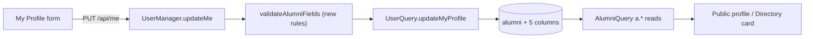
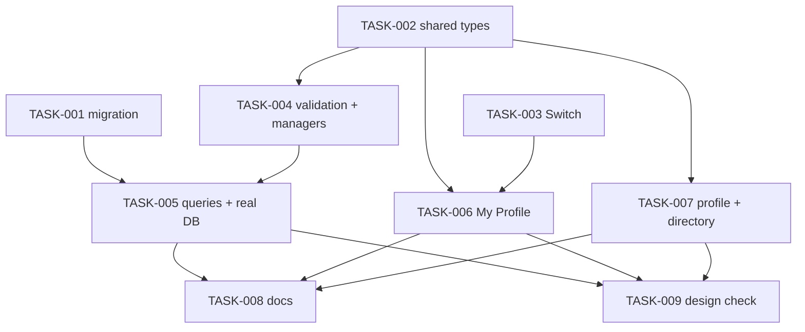

# Alumni profile: headline, location, degree, start year, mentorship — Architecture

| Field | Value |
|---|---|
| REQ | REQ-011 |
| Status | validated |
| Created | 2026-10-07 |
| Related ADRs | [[architecture/adr-01-ui-layer-headless-css-modules\|ADR-01]] · [[architecture/adr-04-forms-without-a-library\|ADR-04]] · [[architecture/adr-05-backend-tests-vitest-supertest\|ADR-05]] · [[architecture/adr-09-optimistic-updates-by-cache-edit\|ADR-09]] (no new ADR) |

## Summary

Five new columns on `alumni` (migration `004`), carried through the existing layers with no new routes: `validateAlumniFields` validates them, `AlumniQuery` and `UserQuery` store and read them, the shared types expose them. In the frontend, My Profile gains four inputs and a Mentorship card with a new `Switch` primitive; the public profile shows headline, location, degree with years and a badge; the directory card shows a "Mentor" tag. Everything stays alumni-only (spec decision).

## Blast radius

| Path | Why touched | Risk |
|---|---|---|
| `db/migrations/004_alumni_profile_fields.sql` (new) | Five columns, idempotent | high |
| `packages/shared/src/types/alumni.types.ts` | `Alumni`, `MyProfile`, `UpdateMyProfileInput` (+ `AlumniListItem` follows). New fields are optional in the types so the ~15 existing fixtures keep compiling; the API always sends `mentorship_available` as a boolean (AC2) | medium |
| `backend/src/dal/dto/AlumniDTO.ts`, `RegisterDTO.ts` | New fields on the DTO and on `AlumniEditableFields` | medium |
| `backend/src/businessLogic/src/validation.ts` | New limits, boolean rule, year order; **`validateStudentFields` spreads `validateAlumniFields`, so the new alumni-only fields must be stripped there** | high |
| `backend/src/businessLogic/src/AlumniManager.ts` | `createAlumni` builds a positional `AlumniDTO`; pass new fields | medium |
| `backend/src/businessLogic/src/UserManager.ts` | `register` / `updateMe` use validated fields; check they flow | medium |
| `backend/src/dal/query/AlumniQuery.ts` | INSERT, UPDATE; `a.*` selects already include new columns | high |
| `backend/src/dal/query/UserQuery.ts` | `updateMyProfile` UPDATE and `MY_PROFILE_SQL` (read the five from `a.`, not COALESCE) | high |
| `backend/src/**/*.test.ts` (validation, AlumniManager, UserManager, AlumniQuery, UserQuery, routes) | Cover AC2–AC6 | medium |
| `frontend/src/components/ui/Switch/` (new), `ui/README.md` | Base UI Switch primitive | medium |
| `frontend/src/features/me/` `validation.ts`, `fields.ts`, `ProfileForm.tsx`, `PersonalSection.tsx`, `EducationSection.tsx`, new `MentorshipSection.tsx`, CSS, tests, README | Form fields, state, save payload | high |
| `frontend/src/features/profile/` `ProfileHeader.tsx`, `EducationSection.tsx`, `format.ts`, tests, README | Show headline, location, badge, degree + years | medium |
| `frontend/src/features/directory/AlumniCard.tsx` (+ css, test, comment) | Mentor tag | low |
| `CLAUDE.md`, `.adlc/context/conventions-api.md`, feature READMEs | "Not built" paragraph, API shape, field lists (L-REQ-010-5) | low |

## Approach

**Backend.** Nothing new at the route or controller level. `validateAlumniFields` is the single point every alumni write goes through (`register`, `createAlumni`, `updateOwnAlumni`, `updateMe`); it gets `headline` (120), `location` (100), `degree` (100) via `optionalText`, `start_year` via `optionalYear`, and a new `optionalBoolean` helper that returns `false` when omitted and 400 for anything that is not `true`/`false`. The order rule (start after graduation → 400) lives in the same function; its message starts with "Graduation year …" so the frontend's G38 mapper puts it on the Graduation year field, which is visible at every width. `AlumniEditableFields.mentorship_available` is a `boolean`; `start_year` is text like `graduation_year`, converted with `Number()` before the INTEGER column. `validateAlumniFields` is split into a shared part (company, job title, experience, bio, LinkedIn) and the alumni-only part (department, graduation year, the five new fields); `validateStudentFields` calls only the shared part, so a student body is never validated against fields it cannot set (ADV-003). `createAlumni` stops passing eight positional arguments and hands the validated fields to the query. Owner-only needs no new code: it is `updateOwnAlumni`'s existing check; tests prove it for the new fields.

**SQL.** `AlumniQuery.createAlumni`/`updateAlumni` add five columns; list and profile reads use `a.*`, which already carries them. `UserQuery.updateMyProfile` adds five columns to the alumni UPDATE, and `MY_PROFILE_SQL` selects them from `a.` only (students have none, so no COALESCE; they come back null / false). `mentorship_available` must never come back null (AC2): `NOT NULL DEFAULT false` plus selecting `COALESCE(a.mentorship_available, false)` in `MY_PROFILE_SQL`, where a missing alumni row would otherwise give null. Registration inserts rely on the column defaults.

**Migration.** `004_alumni_profile_fields.sql`, same header style as 003: `BEGIN; ALTER TABLE alumni ADD COLUMN IF NOT EXISTS …; COMMIT;`. Types: `headline VARCHAR(120)`, `location VARCHAR(100)`, `degree VARCHAR(100)`, `start_year INTEGER`, `mentorship_available BOOLEAN NOT NULL DEFAULT false`. No `CHECK` constraints; the API owns the rules, as with every other column. Adding a NOT NULL column with a constant default is metadata-only on current Postgres, so existing rows are not rewritten. Proven against a real database (L-REQ-005-2), twice.

**Frontend, My Profile.** `ProfileValues` stays the one form-state object; it gains four strings and one boolean, `mentorship_available`. The boolean is excluded from the string binder (`bind`) and from text validation; `MentorshipSection` receives `checked` and `onChange` directly from `ProfileForm`. `isDirty` and `toValues`/`toUpdateInput` treat it by value. `FIELDS.alumni` lists the four new text fields in form order; student and none do not, so nothing is shown or sent for them (`toUpdateInput` sends the boolean for alumni only). Limits are hand copies with the backend source named (L-REQ-006-3). Start year is rendered in the DOM at every width and hidden below 48rem by a CSS Module rule (the codebase has no media-query hook; CSS is the existing pattern, e.g. `--tab-bar-height`/shell breakpoints). `display:none` removes it from the tab order and the accessibility tree; the value is kept and sent unchanged. G18: don't set `display` on an element also toggled with `hidden`.

**Switch primitive.** `components/ui/Switch` wraps Base UI `Switch` (already a dependency; ADR-01 says Base UI supplies behavior, our CSS Module on tokens supplies looks), label and help text as props, no imports from services/features. Keyboard (Space) and `role="switch"` + `aria-checked` come from Base UI (AC10). Colour pairs go into `contrast.test.ts` (G33, L-REQ-004-2).

**Frontend, public profile and directory.** A pure `degreeLine(degree, start, graduation)` in `features/profile/format.ts` builds "B.Sc. Product Design · 2013–2017" (one year alone, or degree alone, when the rest is missing). `ProfileHeader` shows headline under the name, location beside it and the badge (reusing `Tag`); each hides when empty. `AlumniCard` adds a `Tag` "Mentor" when `mentorship_available === true`; its exact slot comes from S2. The profile/directory refresh after a save already works through REQ-010's cache invalidation with real keys; T6 adds a test for the new fields (L-REQ-010-1).

### Diagrams

## Task DAG

### Tier 0
- `TASK-001` — migration 004
- `TASK-002` — shared types
- `TASK-003` — Switch primitive

### Tier 1
- `TASK-004` — backend DTOs, validation, managers (depends on TASK-002)
- `TASK-006` — My Profile fields and Mentorship card (depends on TASK-002, TASK-003)
- `TASK-007` — public profile and directory card (depends on TASK-002)

### Tier 2
- `TASK-005` — backend queries, route tests, real-DB migration run (depends on TASK-001, TASK-004)

### Tier 3
- `TASK-008` — docs (depends on TASK-005, TASK-006, TASK-007)
- `TASK-009` — design comparison screenshots and fixes (depends on TASK-005, TASK-006, TASK-007)

## Test strategy

- `validation.test.ts`: limits, NUL, `start_year` format, order rule (message starts "Graduation year"), `mentorship_available` true/false/omitted/`"true"`/`1`/`null`; student fields do not carry the alumni-only keys.
- `AlumniManager.test.ts`, `UserManager.test.ts`: create/update/updateMe pass the five fields to the query; non-owner and admin → 403 with the query not called.
- `AlumniQuery.test.ts`, `UserQuery.test.ts`: SQL and parameter order (mocked pool, G13).
- `routes.test.ts`: GET `/api/alumni/:id`, `GET /api/alumni`, `GET`/`PUT /api/me`, `PUT`/`POST /api/alumni` bodies and 400s; guest 401, other user and admin 403 on `PUT /api/alumni/:id`.
- Real Postgres (a throwaway database): apply 003-era schema + `004` twice, check columns, defaults, existing row preserved, one INSERT/UPDATE/SELECT round trip through the real queries. Output saved to `ui-evidence/` is not needed; the command log goes into the task.
- Frontend: `Switch.test.tsx`, `contrast.test.ts` pairs, `me/validation.test.ts`, `ProfileForm.test.tsx` (fields per kind, dirty, payload, server 400 mapped), `format.test.ts`, `ProfileHeader.test.tsx`, `EducationSection.test.tsx`, `AlumniCard.test.tsx`, and a refresh test after save.
- AC15: real browser screenshots at 1440 and 390 px, light and dark, next to S2/S3/S5 in `ui-evidence/`.

## Convention alignment

Layers unchanged (routes → controllers → Managers → Query → pg). SQL only in `dal/query`. Parameterised queries. Hand-written idempotent migration with `psql -f`. No new library; Base UI Switch under ADR-01. UI primitive imports nothing from features/services. CSS Modules with tokens only. Controlled form state and pure validators (ADR-04). Lazy features still import nothing from each other (`format.ts` stays in `features/profile`; the directory card only reads the shared type). No deviations.

## Risks

| Risk | Likelihood | Mitigation |
|---|---|---|
| Student `PUT /api/me` validated against (or carrying) alumni-only keys via the spread | med | Split the validator; test that junk new fields in a student body are ignored (200) |
| `mentorship_available` null in `GET /api/me` for users without an alumni row | med | `COALESCE(…, false)` in `MY_PROFILE_SQL`; test |
| Mocked SQL tests miss a column or parameter-order slip | med | Real-database run in TASK-005 (L-REQ-005-2) |
| Hidden Start year on phone blocks a save with an error the user cannot see | low | Order error is placed on Graduation year (visible); `FIELD_PREFIXES` maps the new fields; a hidden Start year error falls back to the form-level message; width behaviour is checked in TASK-009 screenshots (jsdom cannot see CSS hiding) |
| Full-replace `PUT` resets the switch for a client that omits it | low | Documented (spec assumption); our client always sends it |
| Migration run against a database older than 003 | low | Same prerequisite as today; header says so |
| Code deployed before `004` is applied: `GET /api/me` and the alumni UPDATEs fail with 500 for everyone | med | Apply 004 before starting the new API; stated in TASK-001's header and the wrapup merge checklist. Rollback = revert the code and leave the (harmless, additive) columns; never `DROP COLUMN` |

## Open questions

- [ ] Exact position of the Mentor tag on the S2 card (taken from the design in TASK-007).

## Related

- Spec: REQ-011 (`.adlc/specs/2026-10/m/REQ-011-profile-headline-location-mentorship/requirement.md`)
- Concepts: none
- Components: `features/me`, `features/profile`, `features/directory`, `components/ui`
- Lessons checked: [[knowledge/lessons/LESSON-REQ-005-2-mocked-sql-tests-need-one-real-run]] · [[knowledge/lessons/LESSON-REQ-006-3-client-copies-of-api-limits]] · [[knowledge/lessons/LESSON-REQ-010-1-invalidate-other-features-cache-with-real-keys]] · [[knowledge/lessons/LESSON-REQ-010-5-nav-and-menu-changes-touch-every-readme-list]] · [[knowledge/lessons/LESSON-REQ-004-2-check-design-colours-against-token-pairs]] · [[knowledge/lessons/LESSON-REQ-008-5-design-line-height-vs-stylelint]] · gotchas G13, G18, G22, G33, G38
- ADRs: ADR-01, ADR-04, ADR-05, ADR-09
