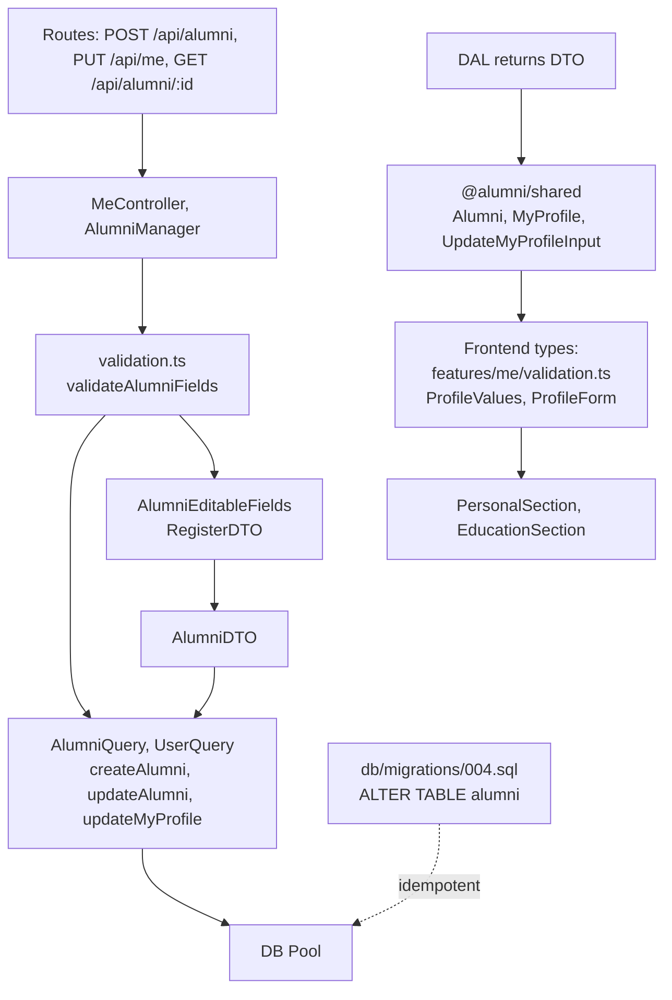

# REQ-011 — Codebase exploration

| Field | Value |
|---|---|
| Generated | 2026-10-07 |
| By | codebase-explorer (inline) |
| Repo(s) scanned | Alumni System |

## 1. Similar existing implementations

| Path | What it does | Recommended action |
|---|---|---|
| `/packages/backend/src/dal/query/AlumniQuery.ts` (lines 21-69) | `createAlumni()` and `updateAlumni()` INSERT/UPDATE alumni rows with all current columns (department, graduation_year, current_company, job_title, experience, bio, linkedin_url). The pattern uses bound parameters and returns the full DTO. | **Follow exactly.** Add the five new columns to the INSERT and UPDATE statements in the same positions. `AlumniEditableFields` interface controls the field set. |
| `/packages/backend/src/businessLogic/src/validation.ts` (lines 95–105) | `validateAlumniFields()` returns an `AlumniEditableFields` object after checking each field with helpers (optionalText, optionalYear, optionalWebUrl). Each field's limit (e.g., 100 chars for company) is named in a constant checked by both backend and a copied version in the frontend. | **Extend it.** Add `headline`, `location`, `degree` to the function's return and to the loop that checks them. Add `mentorship_available` with a new boolean validator. Copy limits to frontend `features/me/validation.ts` next to existing ones (lesson L-REQ-006-3). |
| `/packages/backend/src/businessLogic/src/UserManager.ts` (lines 195–219) | `updateMe()` receives the full-replace body, validates basics/alumni/student fields separately, and calls `UserQuery.updateMyProfile()` with all of them. The validation happens before the query. | **Follow pattern.** AlumniEditableFields validation will pick up the new fields; pass them through to the query. |
| `/packages/backend/src/dal/query/UserQuery.ts` (lines 146–208) | `updateMyProfile()` wraps user + alumni/student updates in one transaction. The alumni block updates 7 columns, one per parameter. The SQL runs UPDATE then reads the full profile back with `MY_PROFILE_SQL` (lines 106–122). | **Extend both SQL blocks.** Add five new columns to the UPDATE statement (line 167–168), pass five new parameters ($9–$13), and read them back in `MY_PROFILE_SQL` (join from alumni, lines 113–117). |
| `/packages/backend/src/dal/dto/RegisterDTO.ts` (lines 71–79) | `AlumniEditableFields` interface lists the fields an alumni user may change: department, graduation_year, current_company, job_title, experience, bio, linkedin_url (no photo, no id). | **Extend it.** Add headline, location, degree, start_year (as string or number?), mentorship_available (boolean) to the interface. |
| `/packages/backend/src/dal/dto/AlumniDTO.ts` (lines 1–41) | Constructor-based DTO with all alumni columns as properties. Used by queries to build and return rows. | **Extend it.** Add the five new columns as properties in the constructor and as class fields. |
| `/packages/shared/src/types/alumni.types.ts` (lines 3–30) | `Alumni` interface with all columns (id, user_id, graduation_year, department, etc.). `AlumniListItem` and `MyProfile` extend or pick from it. | **Extend Alumni.** Add headline, location, degree, start_year (as number), mentorship_available (boolean). Update `MyProfile` (lines 35–58) and `UpdateMyProfileInput` (lines 65–79) to include them. |
| `/packages/frontend/src/features/me/validation.ts` (lines 80–104, 312–342) | `FIELDS` table lists which fields each profile kind sees (alumni, student, none). `validateProfile()` checks each shown field. `toUpdateInput()` builds the PUT body with trimmed values, photo_url from storage, and no email. Shared constants mirror backend limits. | **Extend it.** Add headline, location, degree, start_year to the alumni fields list. Add mentorship_available (no input needed, stored as boolean). Add limit constants (HEADLINE_MAX=120, LOCATION_MAX=100, DEGREE_MAX=100). Extend `ProfileValues` interface, `fieldError()` switch, validators. Mentorship is not trimmed (it's boolean, not text). |
| `/packages/frontend/src/features/me/PersonalSection.tsx` (lines 23–50) | Renders name and bio (or university for 'none'). Uses `bind('field')` helper to wire error/value state. | **Extend it.** Add headline and location fields to the Personal section. Both are text inputs. Headline shown after name, location beside it (per S5 design). |
| `/packages/frontend/src/features/me/EducationSection.tsx` (lines 17–49) | Renders university, department, and year (graduation or expected). | **Extend it.** Add degree and start_year fields. Desktop shows both; phone hides start_year (per design S5 phone). Use conditional rendering on screen width (no new hook, check existing pattern). |
| `/packages/frontend/src/features/profile/EducationSection.tsx` (lines 1–41) | Reads alumni.university/department/graduation_year from props, calls `educationLine()` format helper, renders in a Timeline. Hides if all fields empty. | **Extend it.** Include degree and start_year in the props. Format them as "Degree · Year range" (e.g., "B.Sc. Product Design · 2013–2017"). Call a new format helper. Hides if all fields empty. |
| `/packages/frontend/src/features/directory/AlumniCard.tsx` (lines 32–56) | Renders name, class year, department, and job from props in a card link. Present() helper trims/undefined checking. No mentor tag yet. | **Extend it.** Add mentorship_available logic to show a "Mentor" tag when true. Use the Tag component (already imported). Tag sits after "Class of YYYY" or in the details block if no class year. |
| `/packages/frontend/src/components/ui/Tag/Tag.tsx` (lines 1–26) | Small status label with a tone prop (neutral, accent, success, warning, error). STATUS_TONES carry a dot. | **Use as-is** for the "Mentor" tag. Tone should be "accent" to stand out. |

## 2. Blast radius

| Path | Why touched | Risk |
|---|---|---|
| **Backend (high impact)** | | |
| `/packages/backend/src/dal/query/AlumniQuery.ts` | INSERT, UPDATE, SELECT (LIST_COLUMNS, PROFILE_COLUMNS) all need the five new columns added to statements and column lists. | **high** — SQL changes; must match DB schema exactly. Test with real Postgres (L-REQ-005-2). |
| `/packages/backend/src/dal/query/UserQuery.ts` | `createAlumniUser()` (line 57) adds columns on alumni creation; `updateMyProfile()` (line 167) updates alumni; `MY_PROFILE_SQL` (lines 106–122) reads all fields. | **high** — transaction and multi-step query. Missing a column breaks the full profile read. |
| `/packages/backend/src/dal/dto/AlumniDTO.ts` | Constructor and property signatures. | **medium** — data transfer, no logic. Type-safe but changes the contract. |
| `/packages/backend/src/dal/dto/RegisterDTO.ts` | `AlumniEditableFields` interface (line 71) controls what can be set. | **high** — API contract. Any Manager expecting these fields will type-error if missing. |
| `/packages/backend/src/businessLogic/src/validation.ts` | `validateAlumniFields()` (line 95) must validate headline, location, degree, start_year; add boolean check for mentorship_available; check start_year ≤ graduation_year (AC4). | **high** — all requests pass through here. Missing validation → 400 without proper message (AC3). |
| `/packages/backend/src/businessLogic/src/UserManager.ts` | `validateAlumniFields(body)` already called in `register()` (line 169) and `updateMe()` (line 199) — no new call needed, but logic inside validation changes. | **medium** — existing callers pick up new rules automatically. |
| `/packages/backend/src/businessLogic/src/AlumniManager.ts` | `createAlumni()` (line 13) calls `validateAlumniFields(body)` and builds a DTO; `updateOwnAlumni()` (line 47) validates and calls query. Both use the same validation. | **medium** — picks up validation changes. DTO construction on line 17 may need a parameter for mentorship_available (boolean, not year). |
| `/packages/backend/src/api/controllers/MeController.ts`, `/packages/backend/src/api/routes/` (auth, alumni routes) | No new routes; existing `GET /api/me`, `PUT /api/me` (MeController.updateMe) carry the new fields in the body and response without code changes. Existing `POST /api/alumni`, `PUT /api/alumni/:id` (via AlumniManager) do the same. | **low** — new fields flow through existing endpoints via DTOs and interfaces. No new route logic. |
| **Frontend (high impact)** | | |
| `/packages/shared/src/types/alumni.types.ts` | `Alumni`, `AlumniListItem`, `MyProfile`, `UpdateMyProfileInput` interfaces — add fields to match backend. | **high** — API response shapes. Mismatch causes type errors in every feature. |
| `/packages/frontend/src/features/me/validation.ts` | `FIELDS` (line 80), `ProfileValues`, `fieldError()` (line 205), limit constants (lines 11–28), `toUpdateInput()` (line 333). | **high** — form state and save validation. Missing fields → form doesn't show/save them or server rejects with unmapped error (G38). |
| `/packages/frontend/src/features/me/PersonalSection.tsx` | Add headline and location Input fields. | **medium** — new UI elements. No logic changes; bind() pattern already works. |
| `/packages/frontend/src/features/me/EducationSection.tsx` | Add degree and start_year fields; conditionally hide start_year on phone (<48rem). | **medium** — new fields and a media-query check. Existing patterns handle this (see `ProfileForm.tsx` keying, `Section.module.css` layout). |
| `/packages/frontend/src/features/me/MePage.tsx`, `/features/me/ProfileForm.tsx` | No code changes. Form state, save, and validation already generic over `FIELDS` list and `validateProfile()`. | **low** — components are data-driven. |
| `/packages/frontend/src/features/me/useUpdateProfile.ts` | Sends `toUpdateInput()` payload which now includes headline/location/degree/start_year; API handles it. | **low** — generic mutation hook. Payload shape changes but logic doesn't. |
| `/packages/frontend/src/features/profile/EducationSection.tsx` | Read degree and start_year from props. Format with existing or new helper. | **medium** — new fields displayed. Hide section if all empty (alumni, university, department, degree, start_year all falsy). |
| `/packages/frontend/src/features/profile/ProfileHeader.tsx` | Show headline under the name, location beside it (per S3 design). Format helpers needed. | **medium** — new props and new text lines. Avatar/name/LinkedIn already there. |
| `/packages/frontend/src/features/directory/AlumniCard.tsx` | Show "Mentor" tag when mentorship_available=true. | **medium** — conditional Tag element. Simple addition. |
| **Database** | | |
| `/db/migrations/004_add_alumni_profile_fields.sql` (new file) | Create migration adding five columns to alumni table (AC1). Idempotent: run twice, nothing changes. | **high** — schema change. Must match AC1 exactly: headline/location/degree/start_year nullable TEXT/VARCHAR, mentorship_available NOT NULL DEFAULT false. Test with `psql -f` twice (L-REQ-005-2). |
| **Tests** | | |
| `/packages/backend/src/businessLogic/src/validation.test.ts` | Add tests for headline, location, degree limits and character checks; start_year year validation; mentorship_available boolean rule; start_year ≤ graduation_year check (AC4). | **medium** — new test cases. Existing pattern. |
| `/packages/backend/src/businessLogic/src/UserManager.test.ts`, `/AlumniManager.test.ts` | Test updateMe/createAlumni with new fields; ownership check (AC6); 400 on missing/bad values (AC3). | **medium** — cover AC2–AC6. Mocked tests, so SQL won't catch bugs (L-REQ-005-2). |
| `/packages/backend/src/dal/query/AlumniQuery.test.ts` | Test INSERT/UPDATE with new columns; check they round-trip. Mocked pool, so not exhaustive. | **low** — existing pattern. |
| `/packages/frontend/src/features/me/validation.test.ts` | Test headline/location/degree/start_year limits and errors; mentorship in ProfileValues; phone/desktop layout of start_year. | **medium** — many new assertions. Existing pattern. |
| `/packages/frontend/src/features/me/ProfileForm.test.tsx`, `MePage.test.tsx` | Test form shows/hides fields for alumni kind; validation errors on save; save payload includes new fields; dirty state counts them. | **medium** — larger test. Existing pattern. |
| `/packages/frontend/src/features/profile/*.test.tsx` | Test EducationSection shows degree+year range; ProfileHeader shows headline and location; directory AlumniCard shows Mentor tag. | **medium** — new props and render branches. |
| `/packages/backend/src/api/routes/routes.test.ts` | Integration: POST/PUT /api/alumni, GET /api/alumni/:id, PUT /api/me all return new fields; 400 on invalid headline/location/degree/start_year/mentorship; AC6 owner-only on PUT /api/alumni/:id. | **high** — end-to-end routes. Covers AC2–AC6. |

## 3. Integration points

### Backend entry points

- **`POST /api/auth/register`** (UserManager.register) — alumni user creation. Validation picks up new fields from body. AlumniEditableFields now includes them. DTO and query pass through; no route change needed.
- **`PUT /api/me`** (MeController.updateMe → UserManager.updateMe) — caller's own profile (alumni or student). validateAlumniFields() called on line 199. New fields are optional and cleared if omitted (full replace per AC5). No 401/403 change.
- **`POST /api/alumni`** (AlumniManager.createAlumni) — alumni user creates their own profile (if they have a users row but no alumni row). validateAlumniFields() validates; DTO and query store. AC3, AC6 apply.
- **`PUT /api/alumni/:id`** (AlumniManager.updateOwnAlumni) — owner-only edit of another's profile (future; not shown in current routes). Calls validateAlumniFields() and updateAlumni query. AC3, AC6 apply.
- **`GET /api/alumni/:id`** (AlumniManager.findAlumniById) — returns full alumni row with new fields. No change to controller or manager; query SELECT includes all columns.
- **`GET /api/alumni`** (AlumniManager.searchAlumni) — directory list. Returns AlumniListItem (picks from Alumni minus email). New fields are read but may not be searched (AC3 says validate input; new fields have no search parameters). Query SELECT uses LIST_COLUMNS; add fields if shown on directory card (mentorship_available does).
- **`GET /api/me`** (MeController.getMe → UserManager.getMe) — caller's own profile. UserQuery.findMyProfile reads fields from alumni row via MY_PROFILE_SQL. New fields added to the SELECT.

### Shared types bridge

- **`@alumni/shared` types** feed the frontend API response parsing. Every response from GET /api/alumni/:id, GET /api/alumni, GET /api/me must include the five fields. Frontend `toValues()` reads them; null/missing becomes ''. ProfileValues interface must name all shown fields or validation/save breaks.

### Form state management (frontend)

- **`ProfileValues` (validation.ts)** — form state shape. Must include headline, location, degree, start_year, mentorship_available or they can't be edited.
- **`toValues(profile)` (validation.ts:125)** — loads profile into form. Must read the new fields from the response and coerce to string (year may be number). Mentorship is `true/false` but stored where? Not in ProfileValues (which is strings); a separate state needed.
- **`toUpdateInput(values, kind, photoUrl)` (validation.ts:333)** — builds PUT /api/me body. Must trim and send headline, location, degree, start_year, mentorship_available (no trim for boolean). Photo sent back unchanged.
- **`validateProfile(values, kind)` (validation.ts:242)** — checks only visible fields. Hidden fields never validated, so a stored future value (e.g., expected_graduation_year past the allowed range) doesn't block a password change (ADR-003 in comments).

### Database integration

- **Migration idempotency** — ALTER TABLE alumni ADD COLUMN IF NOT EXISTS for each column (headline, location, degree, start_year, mentorship_available). Must match AC1 exactly: text/varchar types and nullable/default. Test with `psql -f db/migrations/004.sql` twice; second run changes nothing ([[L-REQ-005-2]]).
- **Postgres constraints** — UNIQUE (user_id) on alumni already exists per G15. New columns don't add constraints (except mentorship_available gets DEFAULT false).

### Cross-cutting concerns

- **Validation** — AC3 and AC4 define limits and order (start_year ≤ graduation_year). Backend validation.ts owns truth; frontend copies limits (lesson L-REQ-006-3, comment pointing to backend source). NUL character rejection applies to text fields (G23).
- **Auth and ownership** — AC6: owner-only edits. Checked in AlumniManager.updateOwnAlumni (line 51: `existing.user_id !== requesterId`). No new logic; same rule for all alumni fields.
- **Error handling** — 400 on validation failure (AppError thrown from validation.ts). MeController.updateMe's sendError catches and returns 400 + message (line 14–17). No middleware changes.
- **Response shape** — all five fields always included in responses (AC2), boolean mentorship_available always bool (AC5 forbids null). DAL DTO and shared types must match.

## 4. Test coverage

| Test file | Scenarios covered | Gaps for new code |
|---|---|---|
| `/packages/backend/src/businessLogic/src/validation.test.ts` | Length/format tests for optionalText, optionalYear, optionalWebUrl; NUL rejection. | **Must add:** headline/location/degree max-length tests (AC3); start_year 4-digit year test; mentorship_available must be boolean, reject string/number/null (AC5); start_year ≤ graduation_year when both set (AC4). Test year conversions (number→string). |
| `/packages/backend/src/businessLogic/src/AlumniManager.test.ts` | Tests createAlumni and updateOwnAlumni with mocked query. Tests validateAlumniFields indirectly via the manager. Tests 404 on unknown id, 409 on duplicate user, 403 on non-owner. | **Must add:** createAlumni/updateOwnAlumni with valid/invalid headline/location/degree/start_year/mentorship; validate they're trimmed (text) or boolean (mentorship); 400 on limits exceeded; 403 on non-owner still blocks (AC6); year-order validation fails. Mocked tests won't catch SQL errors (L-REQ-005-2). |
| `/packages/backend/src/dal/query/AlumniQuery.test.ts` | Tests INSERT/UPDATE with mocked pool; verifies SQL text and params. | **Must add:** createAlumni/updateAlumni with new columns; check params include them; check RETURNING includes them. Mocked tests won't verify column types or Postgres acceptance. |
| `/packages/backend/src/api/routes/routes.test.ts` | Integration tests via supertest: POST /api/alumni, PUT /api/alumni/:id, GET /api/alumni/:id, GET /api/alumni query validation, auth/ownership checks. | **Must add:** POST /api/alumni with headline/location/degree/start_year/mentorship in body → 200 returns them; 400 on bad values (AC3); PUT /api/alumni/:id validates owner (AC6); GET /api/alumni/:id and GET /api/alumni return the fields; 400 when start_year > graduation_year (AC4). Cover all of AC2–AC6. Real `pool` runs queries (catches some SQL bugs, not type mismatches; L-REQ-005-2). |
| `/packages/frontend/src/features/me/validation.test.ts` | Tests ProfileValues, toValues, toUpdateInput, validateProfile, ProfileErrors, dirty state. Covers alumni/student/none kinds. | **Must add:** headline/location/degree/start_year in ProfileValues; toValues from MyProfile (loaded response) coerces to string; fieldError validates each (headline/location/degree max-length, year format); mentorship_available stored separately or as a sixth field (not in ProfileValues if it's a boolean switch). Start_year hidden on phone: conditional rendering tested via desktop/phone width props or feature flag? (check existing pattern). |
| `/packages/frontend/src/features/me/ProfileForm.test.tsx` | Mounts ProfileForm with mock me query, tests form shows fields, validation errors, save, dirty state, unsaved prompt. | **Must add:** form shows headline/location for alumni, degree/start_year in Education section (start_year desktop only per S5); validation errors when fields exceed limits; dirty state counts them; save payload includes them; after save, form resets baseline and no longer dirty; error on limit violation blocks save. Mentor switch: is it in ProfileForm or separate? Spec says "Mentorship card with a labelled switch". |
| `/packages/frontend/src/features/me/MePage.test.tsx` | First load, skeleton, error state, tab title. | **Gap:** test app shows the new fields once loaded. No new test needed if ProfileForm is already tested. |
| `/packages/frontend/src/features/profile/EducationSection.test.tsx` | Renders timeline with education entry from alumni props. | **Must add:** degree and start_year props; educationLine format helper returns "Degree · 2013–2017" when both set, one alone otherwise, empty if both missing; Timeline item text matches. Test section hides if all fields (university, department, degree, start_year) empty. |
| `/packages/frontend/src/features/profile/ProfileHeader.test.tsx` | Renders avatar, name, headline format, LinkedIn link. | **Must add:** headline and location props; headline displays under name (existing pattern); location displayed. Test headline and location empty → section hidden or reduced (per S3 design). |
| `/packages/frontend/src/features/directory/AlumniCard.test.tsx` | Renders card link with name, year, department, job. | **Must add:** mentorship_available true → "Mentor" tag shown (tone accent); false → no tag. Tag placed in correct block (after year or in details). |
| N/A (UI/design) | N/A | **AC15:** Screenshots of My Profile, public profile, directory at desktop & phone in light & dark, vs. designs S5, S3, S2. Check alignment of headline/location under name (S3), Mentorship card in My Profile (S5), Mentor tag on card (S2). Differences documented. |
| N/A (real DB) | Migration twice idempotent. | **AC1:** `psql -f db/migrations/004_add_alumni_profile_fields.sql` twice on a test DB; second run changes nothing. Check `\d alumni` has the five columns with correct types and defaults. (L-REQ-005-2). |

## Dependency sketch

## Vault references

- [[architecture/adr-04-forms-without-a-library|ADR-04]] — forms use controlled state, no library; validates as-you-go and on Save.
- [[architecture/adr-09-optimistic-updates-by-cache-edit|ADR-09]] — mutations edit the query cache optimistically; invalidate after success.
- [[knowledge/lessons/LESSON-REQ-005-2-mocked-sql-tests-need-one-real-run|L-REQ-005-2]] — mocked SQL tests don't catch typos or wrong column types; run migrations and queries once against real Postgres.
- [[knowledge/lessons/LESSON-REQ-006-3-client-copies-of-api-limits|L-REQ-006-3]] — frontend validation limits are hand copies; comment with backend source path so drift is visible in review.
- [[knowledge/lessons/LESSON-REQ-010-5-nav-and-menu-changes-touch-every-readme-list|L-REQ-010-5]] — changes that touch form fields, navigation or menus require grepping READMEs and component pages for the old lists.
- [[knowledge/gotchas#^g21|G21]] — LIKE escape in SQL: no `ESCAPE` clause inside a JS template literal, it collapses to `''`.
- [[knowledge/gotchas#^g23|G23]] — Postgres rejects NUL characters; validators catch them and return 400.
- [[knowledge/gotchas#^g38|G38]] — backend error messages start with the API field name; use an explicit mapping table in frontend to land them on the right UI label.

## Open questions

1. **Mentorship switch UI state:** The form currently has ProfileValues (all strings) and PasswordValues (password fields). Mentorship is a boolean in the DB. Should it be:
   - A sixth field in ProfileValues (stored as '0'/'1' string), coerced to boolean on PUT?
   - A separate boolean atom or state in ProfileForm?
   - A checked checkbox with no form-field binding (direct state)?
   
   **Action:** Architect stage decides the form state shape for the mentorship switch and how it maps to PUT /api/me.

2. **Start year on phone:** AC8 says desktop has start_year, phone doesn't (matches S5 design). Current EducationSection doesn't have width-based conditionals. Implementation needed:
   - Media query CSS hide? (CSS Module `.hideOnPhone { display: none }` at <48rem)
   - Conditional React render? (Check `useMediaQuery` or window width)
   - Component prop for visibility?
   
   **Action:** Architect stage picks the method; search codebase for existing media-query patterns if any.

3. **Format helper for year range:** EducationSection (profile) needs to show "Degree · Start–Graduation" (e.g., "B.Sc. · 2013–2017"). Should this live in:
   - A new `degreeAndYears()` helper in `features/profile/format.ts`?
   - Inline in EducationSection component?
   - Reused from an existing `educationLine()` helper (currently "Department · Class of YYYY")?
   
   **Action:** Architect stage decides. Lesson L-REQ-010-5 suggests each format helper is named in READMEs.

4. **Mentor tag placement in AlumniCard:** The tag should go:
   - After "Class of YYYY" in the identity block (like year)?
   - In the details block (department, job)?
   - Its own row?
   
   **Per S2 design:** Confirm placement at architecture stage.

5. **MyProfile response for users without alumni row:** AC8 says fields hide on My Profile for students and users with no profile row. Should the API still return null/undefined for headline/location/degree/start_year/mentorship_available in GET /api/me when the user has no alumni row, or omit them entirely?
   
   **Current pattern:** MyProfile query (UserQuery.MY_PROFILE_SQL, line 111) uses COALESCE to pick from alumni or students. For fields that exist only on alumni, they'll be NULL when there's no alumni row. Spec assumed alumni-only fields, so this is correct.

## Summary of changes by layer

**Database:** One new migration (004) adding five columns to alumni, idempotent, tested twice for safety (L-REQ-005-2).

**Backend DAL:** AlumniQuery and UserQuery extend INSERT/UPDATE/SELECT to include new columns. AlumniDTO and RegisterDTO gain fields.

**Backend validation:** validateAlumniFields() checks headline/location/degree max-length and trim; optionalYear already handles start_year; new boolean check for mentorship_available; new cross-field rule start_year ≤ graduation_year (AC4).

**Backend managers:** No new methods. createAlumni, updateOwnAlumni, register, updateMe all pick up validation changes and pass new fields through DTOs to queries.

**Shared types:** Alumni, AlumniListItem, MyProfile, UpdateMyProfileInput all add the five fields.

**Frontend validation:** Extend ProfileValues, FIELDS table, fieldError() switch, limit constants, toValues(), toUpdateInput(). Add mentorship_available state (separate or sixth field, to be decided).

**Frontend My Profile:** PersonalSection shows headline + location. EducationSection shows degree + start_year (start_year desktop only). MentorshipSection is new (per S5 design) with a labeled switch. Validation and save flow unchanged (data-driven).

**Frontend profile page:** EducationSection format helper shows "Degree · Year range". ProfileHeader shows headline and location. Tests updated.

**Frontend directory:** AlumniCard shows "Mentor" tag when mentorship_available=true.

**Tests:** validation.test.ts and AlumniManager.test.ts add new cases (AC3, AC4, AC5, AC6). ProfileForm.test.tsx and EducationSection.test.tsx updated. Integration test routes.test.ts covers end-to-end (AC2–AC6).
