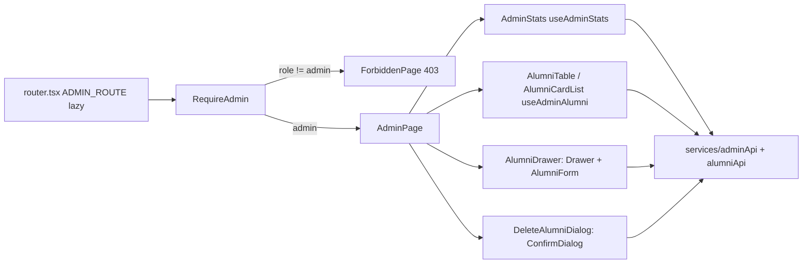
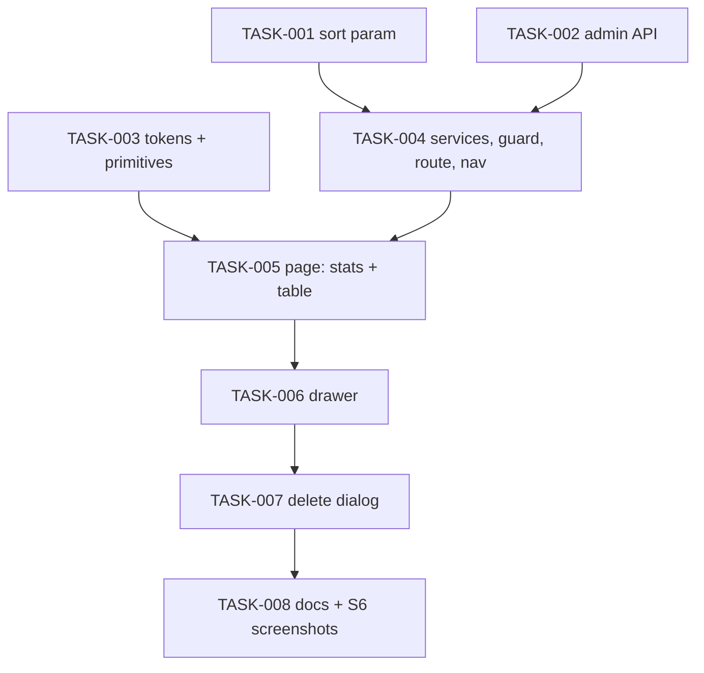

# Admin page at /admin — Architecture

| Field | Value |
|---|---|
| REQ | REQ-015 |
| Status | validated |
| Created | 2026-10-08 |
| Related ADRs | [[architecture/adr-01-ui-layer-headless-css-modules\|ADR-01]] · [[architecture/adr-02-server-state-tanstack-query\|ADR-02]] · [[architecture/adr-03-frontend-session-and-401-handling\|ADR-03]] · [[architecture/adr-04-forms-without-a-library\|ADR-04]] · [[architecture/adr-05-backend-tests-vitest-supertest\|ADR-05]] · [[architecture/adr-06-config-leaf-layer\|ADR-06]] · [[architecture/adr-08-route-code-splitting-and-url-list-state\|ADR-08]] |

## Summary

Adds an admin-only API namespace (`/api/admin/*`: stats, create, edit and delete an alumni account) plus an optional server-side sort on the existing `GET /api/alumni`, and a new lazy frontend feature `features/admin` at `/admin` that renders S6 on tokens: stat cards, a sortable/searchable/paged alumni table (cards on phones), an add/edit drawer and a delete dialog. Two new UI primitives (`Drawer`, `ConfirmDialog`) wrap Base UI's Dialog/AlertDialog (ADR-01 already names Base UI for dialogs). Two new colour tokens (`error-soft`, `scrim`) cover the S6 colours with no token today. A `RequireAdmin` guard shows a 403 page to non-admins, and admin-only links appear in the header nav, the tab bar and the avatar menu.

## Blast radius

| Path | Why touched | Risk |
|---|---|---|
| `packages/backend/src/api/app.ts` | mount `/api/admin` router | low |
| `packages/backend/src/api/routes/AdminRoutes.ts` (new) | `router.use(authMiddleware, requireRole("admin"))`; stats, POST/PUT/DELETE alumni | medium (auth) |
| `packages/backend/src/api/controllers/AdminController.ts` (new) | parse req, call `AdminManager`, `sendError` | low |
| `packages/backend/src/api/routes/AdminRoutes.test.ts` (new), `routeGuard.test.ts` | 401/403/status/identity tests; guard stays green (min route count may rise) | low |
| `packages/backend/src/businessLogic/src/AdminManager.ts` (+test, new), `index.ts` | validation, hashing, self-delete refusal, 404/409 mapping | medium |
| `packages/backend/src/businessLogic/src/validation.ts` (+test) | `parseAlumniSearch` gains `sort`/`order`; `validateAdminAlumniFields` | medium (shared by directory) |
| `packages/backend/src/businessLogic/src/AlumniManager.ts` (+test) | pass sort through | low |
| `packages/backend/src/businessLogic/src/TestManager.ts` | only if a renamed Manager method is referenced (G24) | low |
| `packages/backend/src/dal/query/AdminQuery.ts` (+test, new), `dal/index.ts`, `dal/dto/*` | counts; create (reuse `UserQuery.createAlumniUser`); edit and delete transactions | high (destructive delete) |
| `packages/backend/src/dal/query/AlumniQuery.ts` (+test) | whitelisted `ORDER BY` | medium |
| `packages/shared/src/types/alumni.types.ts`, `admin.types.ts` (new), `index.ts` | `AdminStats`, `AdminAlumniInput`, `AdminAlumniUpdate`, `AlumniSort` | low |
| `docs/design/design-system/tokens.json`, `packages/frontend/src/styles/tokens.css` (generated), `src/styles/contrast.test.ts` | `error-soft`, `scrim`; contrast pair `error` on `error-soft` | low |
| `packages/frontend/src/components/ui/Drawer/*`, `ConfirmDialog/*` (new) | Base UI Dialog / AlertDialog wrappers | medium (focus) |
| `packages/frontend/src/services/adminApi.ts` (+test, new), `alumniApi.ts` (+test) | admin endpoints; `sort`/`order` on `searchAlumni` | low |
| `packages/frontend/src/config/adminPath.ts` (new) | `ADMIN_PATH` | low |
| `packages/frontend/src/features/auth/guards.tsx` (+test), `index.ts` | `RequireAdmin` + `useIsAdmin` | medium (access) |
| `packages/frontend/src/features/admin/*` (new) | page, stats, table, cards, params, hooks, drawer form, delete flow, README | medium |
| `packages/frontend/src/app/router.tsx`, `app/lazyRoutes.test.ts`, `eslint.config.js`, `scripts/enforcement.test.ts` | `ADMIN_ROUTE` + `LAZY_FEATURES` entry (L-REQ-014-1: lists derive from it) | low |
| `packages/frontend/src/app/AppShell/navItems.tsx`, `MainNav.tsx`, `BottomTabs.tsx`, `NavIcons.tsx`, `HeaderAuth.tsx` (+ `AppShell.test.tsx`) | admin-only Admin link, shield icon, "Admin settings" menu item | low |
| `packages/frontend/README.md`, `src/*/README.md` (app, features, components/ui, services, config), root `CLAUDE.md` | document the feature, nav, primitives, endpoints (L-REQ-010-5) | low |

## Approach

### Backend

**Namespace.** A new `AdminRoutes.ts` mounted at `/api/admin` starts with `router.use(authMiddleware, requireRole("admin"))`, so every route added there later is admin-only by construction (same idea as REQ-003's router-level `authMiddleware`). Routes: `GET /stats`, `POST /alumni`, `PUT /alumni/:id`, `DELETE /alumni/:id` (`:id` is the **alumni** id, the id the table already has). Controllers stay exported functions calling `sendError`, matching every existing controller; the redesign's "controllers are classes / shared error middleware" convention is still unbuilt everywhere and is not started by this REQ (same choice as REQ-005…014).

**AdminManager** (new, `businessLogic`):
- `getStats()` → `{ alumni, students, posts, mentors }` from one `AdminQuery.countStats()` (one SQL round trip with four scalar sub-selects).
- `createAlumni(body)` → validates with existing helpers: `requiredText(name, NAME_MAX)`, `requiredEmail`, `validateNewPassword(password, "Temporary password")`, `optionalText(university, UNIVERSITY_MAX)`, `optionalYear(graduation_year)`, `optionalText(department / job_title / current_company)`; bcrypt-hashes (same `BCRYPT_ROUNDS` as `UserManager`; export the constant rather than copy it); calls `UserQuery.createAlumniUser` (already one transaction, role fixed to `'alumni'`); maps a unique violation to 409 "An account with this email already exists". Returns 201 with the new list row (`findAlumniById`).
- `updateAlumni(id, body)` → `requireId`; 404 "Alumni not found" if missing; validates name (required), university, graduation_year, department, job_title, current_company; `AdminQuery.updateAlumniAccount` updates `users.name, users.university` and only those four `alumni` columns in one transaction (REQ-011 fields, bio, LinkedIn, photo untouched — a deliberate **partial** update, unlike `PUT /api/me`'s full replace). Unknown keys are ignored; `email`, `role`, `password`, `user_id` in the body are ignored. Returns the list row.
- `deleteAlumni(requesterId, id)` → `requireId`; load the row (404); if `row.user_id === requesterId` → 403 "You can't delete your own account"; `AdminQuery.deleteAlumniAccount(userId)`; if it reports nothing deleted → 404.

**Delete transaction** (`AdminQuery.deleteAlumniAccount`, high risk, so spelled out):
```
BEGIN
  -- posts by OTHER users whose comment_count will drop
  SELECT DISTINCT c.post_id FROM comments c
   WHERE (c.user_id = $1 OR c.parent_id IN (SELECT id FROM comments WHERE user_id = $1))
     AND c.post_id NOT IN (SELECT id FROM posts WHERE user_id = $1)
  DELETE FROM users WHERE id = $1          -- FKs cascade: alumni, students, posts (+their comments), comments (+replies)
  UPDATE posts SET comment_count = (SELECT COUNT(*) FROM comments WHERE post_id = posts.id)
   WHERE id = ANY($2)                       -- only the affected posts
COMMIT  (ROLLBACK on any error; client released in finally)
```
It relies on `ON DELETE CASCADE` on all six foreign keys — verified on the live dev database (`pg_constraint.confdeltype = 'c'`, 2026-10-08) and in `db/backups/pre_bolt20_*.sql`. If a foreign key turns out not to cascade on some database, the `DELETE` raises 23503, the transaction rolls back, and the Manager maps it to 409 "This user still has posts or comments" — nothing half-deleted. The recount step is the part the existing `DELETE /api/users/:id` never needed (it refuses users with comments), and without it other people's posts would show stale comment counts in the feed.

**Sort on `GET /api/alumni`.** `parseAlumniSearch` gains two optional params validated like the rest (single value, empty = absent): `sort` ∈ {`name`, `graduationYear`} and `order` ∈ {`asc`, `desc`}; anything else → 400 "Invalid sort" / "Invalid order". `order` without `sort` applies to name. `AlumniQuery.searchAlumni` maps the pair through a **fixed whitelist object** to SQL text (no user text reaches SQL): `name` → `u.name <dir>, a.id <dir>`; `graduationYear` → `a.graduation_year <dir> NULLS LAST, u.name, a.id`. Absent sort keeps today's exact `ORDER BY u.name, a.id`, so the directory (which never sends `sort`) is unchanged.

**Shared types.** `admin.types.ts`: `AdminStats`, `AdminAlumniCreateInput`, `AdminAlumniUpdateInput`; `alumni.types.ts`: `AlumniSort = 'name' | 'graduationYear'`, `SortOrder = 'asc' | 'desc'`.

### Frontend



- **Route and guard.** `ADMIN_ROUTE` (`path: 'admin'`, `HydrateFallback`, `lazy: import('@/features/admin/AdminPage')`) sits under `RequireAuth` inside a new pathless `{ element: <RequireAdmin /> }` route. `RequireAdmin` (in `features/auth/guards.tsx`, next to `RequireAuth`) reads `useCurrentUser()`: pending → the same "Loading…" fallback as `HydrateFallback`; `role === 'admin'` → `<Outlet />`; otherwise `<ForbiddenPage />` (heading "You don't have access to this page", text, `ButtonLink` home), rendered inside the shell's `<main>`, so the admin chunk never loads and no admin request is sent. A failed `['me']` shows the existing error pattern with Retry, not a 403 (L-REQ-010-2: the guard must not hide real errors). `useIsAdmin()` (same file) is what nav and menu read. The server stays the judge; a stale role that gets a 403 from `/api/admin/*` shows the page's normal error state (never a logout — 403 is not 401, ADR-03).
- **Nav.** `NavItem` gains `adminOnly?: true`; `ADMIN_NAV_ITEM` (`/admin`, "Admin", new `ShieldIcon`) is appended to both `HEADER_NAV_ITEMS` and `TAB_NAV_ITEMS`; `MainNav` and `BottomTabs` filter `adminOnly` items through `useIsAdmin()`. `HeaderAuth`'s menu adds "Admin settings" (navigates to `ADMIN_PATH`) after Account settings, admins only. The phone tab bar goes from 3 to 4 tabs for admins (S6 draws 4).
- **List state (ADR-08).** `features/admin/params.ts` parses `q`, `sort`, `order`, `page` from the URL, dropping values the API would reject (limits imported from nowhere — copied with a comment naming `validation.ts`, as `directory/params.ts` does, L-REQ-006-3). Header click on Name / Grad. year: same column → flip order; other column → that column ascending; page resets to 1 and pushes history. Search uses the directory's `useDebouncedCallback` pattern (300 ms, replace) — copied into `features/admin` because lazy features can't import each other (L-REQ-008-6); it's 20 lines. `useAdminAlumni(params)` → `['admin', 'alumni', params]` calling `searchAlumni({ q, sort, order, page, pageSize: 10 })`, `placeholderData: keepPreviousData`.
- **Stats.** `useAdminStats()` → `['admin', 'stats']`. Cards format with a module-level `Intl.NumberFormat('en-US')` so the output is always `1,842` (S6) whatever the browser locale. Loading: `Skeleton` in each value; error: `Alert` + Retry in place of the card row; the table still renders.
- **Mutations** (`useCreateAlumni`, `useUpdateAlumni`, `useDeleteAlumni`): not optimistic — the admin wants the server's truth and the row set depends on server sort/paging. `onSuccess` invalidates `['admin']` (stats + every table page) and `['alumni']` (the directory cache, real key — L-REQ-010-1) and, for delete, `['posts']` (removed posts and recounted comment counts). After a delete empties the last page, the page index clamps to the new last page.
- **Drawer.** `AlumniDrawer` = `Drawer` primitive (title, close ×, body scroll area, footer) + `AlumniForm` (controlled state, `features/admin/validation.ts` with messages mirroring the backend, ADR-04, errors on blur and submit, focus first invalid). Mode `add` shows Email + Temporary password (`PasswordInput`); mode `edit` hides them and starts from the row. A dirty close (×, Cancel, backdrop, Escape) is intercepted by the `Drawer`'s `onOpenChange` and shows a small inline confirm inside the drawer footer ("Discard this new alumni?" / "Discard changes?" with Keep editing / Discard) — not a second stacked modal. Server errors map field-by-message with a pure `adminErrors.ts` (409 → Email; 404 on edit → toast "This alumni no longer exists", close, refetch).
- **Delete.** `DeleteAlumniDialog` = `ConfirmDialog` (AlertDialog: `role="alertdialog"`, initial focus on Cancel, Escape closes, backdrop click does **not** close). Text uses `BRAND_NAME` from `config/brand.ts` (so "…from Alma…", not S6's "Alumni Network"). The confirm button gets `loading`; errors show in an `Alert` inside the dialog. Focus returns to the row's Delete button on cancel, or to the "Alumni" table caption/heading after a successful delete (G35).
- **Primitives.** `components/ui/Drawer` (Base UI `Dialog`; right-anchored panel 420px from 48rem, full width below; slide-in with `--duration-fast`/`--easing-standard`, reduced-motion respected) and `components/ui/ConfirmDialog` (Base UI `AlertDialog`; 400px max, `tone="danger"` icon slot). Both take a required `title` (G25: the popup needs a name), use `scrim` for the backdrop and `surface-raised` for the panel. No `box-shadow` (Stylelint bans it); the drawer keeps S6's `border-left` hairline, the dialog a `border-subtle` hairline — the "soft borders instead of heavy shadows" rule from the design brief.
- **Responsive.** ≥ 48rem: `<table>` inside a card with `overflow-x: auto` on a wrapper (only the table scrolls at 200% zoom). < 48rem: the card list, the icon-only Add button and the 2×2 stat grid. Both are rendered from the same data; the switch is CSS (`hidden`-safe per G18: no `display` on an element using `hidden`).

### Design mapping (S6 hex → token; never a hex in code)

| S6 | Token |
|---|---|
| `#faf7f2` / `#1d1a17` page | `--surface-page` |
| `#ffffff` / `#272320` cards, table, drawer, dialog | `--surface-raised` |
| `#f0ebe3` / `#171412` search well | `--surface-sunken` (via `SearchField`) |
| `#e4dcd0` / `#3a352f` borders; `#efe9df` / `#312c27` row dividers | `--border-subtle` (no separate divider token; the 2-step difference is not worth a token) |
| `#2b2724` · `#6b6560` · `#948c84` text | `--ink-primary` · `--ink-secondary` · `--ink-muted` |
| `#ad6a4d` accent (S6 is pre-contrast-fix) | `--accent` (`#975c43`, L-REQ-004-2) |
| `#a3503f` danger button, icon | `--error` |
| `#f6e1dd` danger tint circle | **new `--error-soft`** (light `#f6e1dd`, dark a brick tint chosen to keep `--error` on it ≥ 3:1, added to `contrast.test.ts`) |
| `rgba(43,39,36,.35/.4)` backdrop | **new `--scrim`** (light/dark values with alpha) |
| `box-shadow` on drawer/dialog | dropped (Stylelint); hairline border instead |
| `#5c7950` / `#a3503f` stat accents | not used (stats are neutral; spec assumption) |
| 22/18px h1, 26/20px numbers, 12/11px labels | nearest `--text-*` styles (`heading-lg`/`heading-md`, `display`-free numbers on `heading-lg`, `caption`) |
| 14px / 12px radius | `--radius-lg` |
| 18px / 14px card padding, 16px gaps | `--space-4` (16px; S6's 18px has no token) |

### Deliberate differences from S6 (recorded in `features/admin/README.md`, L-REQ-012-2)

Stat labels (user's four, neutral colour) · Temporary password field · Role select removed · "Current role & company" split into two fields · brand text "Alma" via `BRAND_NAME` · no shadows · header keeps the built shell (no "My Profile" link, REQ-012) · phone tab "Account" not "Profile" · Prev/Next also on phones (S6 phone shows none) · drawer full width on phones (S6 has no phone drawer).

## Task DAG

### Tier 0
- `TASK-001` — Backend: optional `sort`/`order` on `GET /api/alumni`
- `TASK-002` — Backend: `/api/admin` namespace (stats, create, edit, delete with recount)
- `TASK-003` — Frontend: `error-soft` and `scrim` tokens; `Drawer` and `ConfirmDialog` primitives

### Tier 1
- `TASK-004` — Frontend: admin services, `RequireAdmin` + 403 page, lazy `ADMIN_ROUTE`, admin-only nav/tab/menu links — depends on TASK-001, TASK-002

### Tier 2
- `TASK-005` — Frontend: admin page — stats cards, table/cards, search/sort/paging in URL, states — depends on TASK-003, TASK-004

### Tier 3
- `TASK-006` — Frontend: add/edit drawer — depends on TASK-005

### Tier 4
- `TASK-007` — Frontend: delete dialog flow — depends on TASK-006 (both edit `AdminPage.tsx`; serial avoids conflicts)

### Tier 5
- `TASK-008` — Docs + side-by-side screenshot comparison with S6 (desktop/phone × light/dark, drawer, dialog) and fixes — depends on TASK-007



## Test strategy

- **Backend (ADR-05, three levels):**
  - `routes/AdminRoutes.test.ts` (supertest, managers mocked with real `AppError`): each of the 4 routes → 401 no token, 403 alumni token, 403 student token, success status (200/201/200/200), the manager receives `req.user.sub` for delete and the body for create/edit; `sendError` mapping for 400/404/409.
  - `routeGuard.test.ts` unchanged in logic; still green with the new router (update the minimum route count if it asserts one).
  - `AdminManager.test.ts`: create validation (missing name/email/password, bad email, short password, bad year, over-long text → 400 with field-first messages), hashing (stored password ≠ input), 409 on unique violation; edit 404, ignores email/role/password keys; delete 404, 403 self-delete, 409 on FK violation, 404 when nothing deleted; stats pass-through.
  - `AdminQuery.test.ts` (fake pool/client): stats SQL has four counts incl. `mentorship_available = true`; delete runs `BEGIN` → affected-post select → `DELETE FROM users` → recount `WHERE id = ANY` → `COMMIT`, `ROLLBACK` + `release` on error, recount skipped when no affected posts; edit updates only the six columns, never `email`/`password`/`role`/REQ-011 columns.
  - `validation.test.ts`: `sort`/`order` valid, invalid, repeated, nested, empty; `AlumniQuery.test.ts`: each whitelist branch's `ORDER BY`, default unchanged.
  - One manual run against the dev database (L-REQ-005-2): create, edit, delete a seeded alumnus with posts and comments; check other posts' `comment_count`.
- **Frontend (Vitest + RTL, HTTP through axios adapters):**
  - `Drawer.test.tsx`, `ConfirmDialog.test.tsx`: named dialog, focus trap/initial focus, Escape, return focus, alertdialog role, backdrop behaviour.
  - `guards.test.tsx`: `RequireAdmin` pending / admin / non-admin (403 page, no admin request) / `['me']` error.
  - `AppShell.test.tsx`: Admin link + tab + "Admin settings" for admin, absent for alumni and student.
  - `lazyRoutes.test.ts` + `enforcement.test.ts`: admin in `LAZY_FEATURES`; static import banned.
  - `features/admin`: `params.test.ts`, `validation.test.ts`, `adminErrors.test.ts`, `AdminPage.test.tsx` (stats states and formatting, table rows, sort header clicks → URL + `aria-sort`, debounced search, paging and disabled edges, empty/no-match/error states, phone card list present), `AlumniDrawer.test.tsx` (add: validation, focus first invalid, 409 on Email, success toast + refetch; edit: prefill, partial body, 404 path; dirty-close confirm), `DeleteAlumniDialog.test.tsx` (text with brand, loading, error stays open, success toast + refetch, focus return).
  - `adminApi.test.ts`, `alumniApi.test.ts` (sort/order query string).
- **Visual:** TASK-008 screenshots the running app at 1440px and 390px, light and dark, plus drawer and dialog, next to the S6 files rendered in the same browser.
- **Gates:** `npm test`, `typecheck`, `lint`, `format:check`, `tokens:check`, `build` (admin chunk present) in `packages/frontend`; `npm run test:backend`, `npm run typecheck:backend`; `tsc` in `businessLogic` so `dist/` is fresh (G32).

## Convention alignment

- Layers routes → controllers → Managers → Query classes; SQL only in `dal`; identity from the token; ownership/self rules in the Manager; 401 vs 403 vs 404 per conventions-api.
- Router-level `requireRole("admin")` for the whole namespace (stronger than per-route; documented in conventions-api at wrap-up).
- Paged list contract `{ items, total }` reused; new query params follow the REQ-005 rules (400 on bad, empty = absent, single value).
- Frontend: lazy route + `LAZY_FEATURES` (ADR-08, L-REQ-014-1); URL list state; TanStack Query for server data, no atoms needed; forms without a library (ADR-04, 8 fields — at the ADR's ~8-field revisit line but a flat form, so no library); Base UI for dialogs (ADR-01); tokens only; config leaf for `ADMIN_PATH` (ADR-06).
- **Deviations:** controllers stay functions with per-handler `sendError` (the redesign's class controllers + shared error middleware are not built anywhere yet; out of scope, as in every REQ since 003). Two new tokens are added to `tokens.json` (the documented workflow, not a hand edit).

## Risks

| Risk | Likelihood | Mitigation |
|---|---|---|
| Delete removes the wrong person or leaves partial data | low | alumni id → user id lookup in the Manager; single transaction; Query test pins statement order; manual dev-DB run; self-delete refused |
| A database without `ON DELETE CASCADE` | low | verified live; otherwise 23503 → rollback → 409, never partial |
| Stale `comment_count` on other posts after delete | med without step | explicit recount of affected posts in the same transaction, tested |
| Sort param breaks the directory | low | absent sort keeps the exact old `ORDER BY`; directory never sends it; test pins the default |
| Demoted admin keeps the page for ≤ 1 h (role in JWT) | low | server is the judge; known REQ-003 limitation |
| A deleted person's token still works for ≤ 1 h (ADV-003): they can read signed-in pages; their writes hit a foreign-key error (500) | low | **accepted** for this REQ (same JWT-without-revocation limit as REQ-003, ADR-05 consequences); follow-up filed: token revocation or a user-exists check in `authMiddleware` |
| Drawer focus/escape edge cases in Base UI 1.8 (G25) | med | primitives tested in isolation first (TASK-003) |
| `scrim` with alpha breaks the token generator or contrast test | med | TASK-003 checks generator output; contrast test only lists opaque pairs |
| S6 sizes with no token (18px padding, 26px numbers) | certain | nearest token, listed as deviations; screenshot check in TASK-008 |
| Temporary password shared out of band | n/a | non-goal; person changes it in Account settings |

## Open questions

- [ ] None blocking.

### Stress-test findings and handling (architecture-adversary.md)

| ID | Severity | Handling |
|---|---|---|
| ADV-001 | minor | fixed — create-transaction Query test added to TASK-002 |
| ADV-002 | minor | fixed — TASK-002 looks up the alumni row by user id for the 201 body |
| ADV-003 | minor | accepted + documented in Risks; follow-up for token revocation |
| ADV-004 | minor | fixed — double-submit, Escape/backdrop during save or confirm, focus after edit added to TASK-006 |
| ADV-005 | minor | fixed — `AlumniSearchDTO.ts` added to TASK-001 |

## Related

- Spec: REQ-015
- Concepts: [[concepts/route-layout]]
- Components: [[knowledge/components/backend]]
- Lessons checked: [[knowledge/lessons/LESSON-REQ-004-2-check-design-colours-against-token-pairs|L-REQ-004-2]] · [[knowledge/lessons/LESSON-REQ-005-1-paged-list-endpoints|L-REQ-005-1]] · [[knowledge/lessons/LESSON-REQ-005-2-mocked-sql-tests-need-one-real-run|L-REQ-005-2]] · [[knowledge/lessons/LESSON-REQ-006-1-url-mirrored-input-own-write|L-REQ-006-1]] · [[knowledge/lessons/LESSON-REQ-006-3-client-copies-of-api-limits|L-REQ-006-3]] · [[knowledge/lessons/LESSON-REQ-008-6-copying-between-lazy-features-needs-a-home|L-REQ-008-6]] · [[knowledge/lessons/LESSON-REQ-009-4-adding-a-lazy-feature-touches-six-lists|L-REQ-009-4]] · [[knowledge/lessons/LESSON-REQ-010-1-invalidate-other-features-cache-with-real-keys|L-REQ-010-1]] · [[knowledge/lessons/LESSON-REQ-010-2-guard-owning-a-query-hides-the-page-states|L-REQ-010-2]] · [[knowledge/lessons/LESSON-REQ-010-5-nav-and-menu-changes-touch-every-readme-list|L-REQ-010-5]] · [[knowledge/lessons/LESSON-REQ-012-2-record-design-deviations|L-REQ-012-2]] · [[knowledge/lessons/LESSON-REQ-014-1-derive-lazy-feature-lists-from-one-source|L-REQ-014-1]]
- Gotchas: G18, G24, G25, G31, G32, G35, G36, G38, G41
- ADRs: ADR-01, 02, 03, 04, 05, 06, 08
