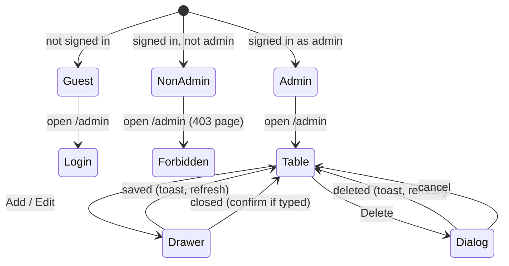

# Admin page at /admin: stats, alumni table, add, edit, delete

| Field | Value |
|---|---|
| REQ | REQ-015 |
| Status | validated |
| Phase | spec |
| Created | 2026-10-07 |
| Primary repo | alumni-system |
| Touched repos | alumni-system |
| Related | [[REQ-003]] · [[REQ-005]] · [[REQ-006]] · [[REQ-007]] · [[REQ-011]] · [[REQ-012]] |

## Problem

Admins have no screen. The only admin powers are three API routes (`GET`/`POST /api/users`, `DELETE /api/users/:id`) with no UI, so an admin can't see how big the network is, find an alumnus, fix a wrong profile, add someone, or remove someone without hand-written requests or SQL. Deleting a person who ever posted is refused outright (409). The design bundle has a full Admin screen (S6) that was never built.

## Goal

A signed-in admin opens `/admin` (from the avatar menu, the header nav or the phone tab bar) and sees the S6 screen built on design tokens: four stat cards with live counts, a searchable, sortable, paged alumni table (a card list on phones), and per-row Edit and Delete. "Add alumni" opens the S6 side drawer and creates a new alumni account; Edit reuses the drawer to change a profile; Delete asks with the S6 dialog and then removes the person and everything they wrote. Non-admins never see an Admin link and get a 403 page if they open `/admin` directly. Every new admin endpoint is admin-only on the server and covered by tests.

## Non-goals

- Managing students or admins from this page (the table and drawer handle alumni only).
- Bulk actions, CSV import/export, audit log, undo for delete.
- Password reset, invite emails, email verification, or a "pending verification" state.
- Changing a person's email, role or password from the Edit drawer.

## Acceptance criteria

### Access
- [ ] `/admin` is a lazy route under `RequireAuth` (its own chunk in `npm run build`, listed in `LAZY_FEATURES`). A guest who opens it goes to `/login` and returns to `/admin` after an admin logs in.
- [ ] A signed-in non-admin (alumni, student) who opens `/admin` sees a 403 page inside the app shell ("You don't have access to this page" with a link home). No admin API request is sent for them.
- [ ] Admins see "Admin settings" in the avatar menu, "Admin" in the desktop header nav (current-page underline on `/admin`) and an "Admin" tab in the phone tab bar (shield icon, per S6). Non-admins see none of the three.
- [ ] Every new backend admin route answers 401 without a token and 403 for a signed-in non-admin; `routeGuard.test.ts` stays green and a test proves the 403 for each new route.

### Stat cards
- [ ] Four cards, in S6's layout (one row of four on desktop, a 2×2 grid on phones): **Total alumni**, **Students**, **Posts**, **Mentors available**, each a real count from a new admin-only stats endpoint (alumni rows, student rows, posts, alumni with `mentorship_available = true`). Numbers use thousands separators (`1,842`).
- [ ] Loading shows skeletons in the cards; a failed stats request shows an inline error with Retry and does not hide the table.
- [ ] After an add or delete, the counts refresh without a page reload.

### Alumni table
- [ ] Desktop (≥ 48rem): a table with columns Name, Grad. year, Department, University, Mentor ("Yes"/"No") and a row-actions column with icon buttons named "Edit <name>" and "Delete <name>". Phones: S6's card list (name; "year · department"; the same two icon buttons).
- [ ] Rows come from the existing `GET /api/alumni` search (REQ-005); the search box ("Search alumni") filters by its `q` (name, company or job title), typed text debounced 300 ms.
- [ ] Clicking the Name or Grad. year header sorts by it; clicking again flips the direction. The active column shows the arrow from S6 (↓ / ↑) and `aria-sort`. Default: name ascending. Sorting is done by the server so it holds across pages, with a unique tie-break so pages never overlap. The new sort input is optional and validated like REQ-005's params (an unknown value is a 400; absent means today's order), so the directory is unaffected.
- [ ] Paging: Prev / Next buttons and "Showing <n> of <total>" (formatted), 10 rows per page. Prev is disabled on page 1, Next on the last page. Search text, sort and page live in the URL query string (ADR-08), so reload and Back keep them; a new search or sort returns to page 1.
- [ ] States: skeleton rows while loading; an error with Retry; "No alumni match “<q>”" with a Clear search button; "No alumni yet" when the network is empty.

### Add alumni drawer
- [ ] "Add alumni" (button with + icon on desktop; a 32px + icon button named "Add alumni" on phones) opens a drawer from the right, 420px wide on desktop and full width on phones, over a dimmed backdrop, titled "Add alumni", with a close (×) button.
- [ ] Fields: Full name, Email, University, Graduation year, Department, Current role, Company, Temporary password. Name, email and temporary password are required; password follows sign-up's rules; the rest follow the existing alumni field limits. Errors show per field when the field is left or Add is pressed, and focus moves to the first invalid field (ADR-04).
- [ ] "Add alumni" creates the user (role alumni) and their alumni row together; either both exist or neither. A taken email shows "An account with this email already exists" on the Email field. On success the drawer closes, a toast says "<name> added", and the table and counts refresh.
- [ ] Cancel, ×, the backdrop and Escape close the drawer; if anything was typed, closing asks "Discard this new alumni?" first. Focus is trapped while open and returns to the button that opened it.

### Edit
- [ ] The Edit button opens the same drawer titled "Edit alumni", filled from the row's full profile, without Email and Temporary password. Save ("Save changes") updates name, university, graduation year, department, current role and company through a new admin-only endpoint; fields REQ-011 added that the drawer doesn't show (headline, location, degree, start year, mentorship, bio, LinkedIn, photo) keep their stored values.
- [ ] On success the drawer closes, a toast says "Changes saved", and the row updates. A 404 (deleted meanwhile) shows "This alumni no longer exists" and refreshes the table.

### Delete
- [ ] The Delete button opens S6's dialog: trash icon in a danger-tinted circle, "Delete <name>?", the text "This permanently removes their profile, posts, and comments from <brand name>. This action can't be undone.", Cancel and a danger "Delete alumni" button. Escape and Cancel close it; focus starts on Cancel and returns to the row afterwards (or to the table heading if the row is gone).
- [ ] Confirming calls a new admin-only endpoint that deletes, in one transaction, the person's comments (and replies to them), their posts (with those posts' comments), their alumni row and their user account. Either all of it is gone or none of it. The button shows a loading state; on success the dialog closes, a toast says "<name> deleted", and the table and counts refresh; on failure the dialog stays open with the error message.
- [ ] An admin can't delete their own account from this page (the server refuses with 403 "You can't delete your own account"; the UI also hides Delete on the admin's own row if it ever appears).

### Design and quality
- [ ] Layout, spacing, type, radii and colours match S6 (Desktop/Phone × Light/Dark, AddDrawer, DeleteConfirm) using only design tokens; no hex, rgb or shadow literals from the design files (lint stays green). Deliberate differences from S6 are listed in the architecture and the feature README.
- [ ] Works from 360px wide and at 200% zoom with no horizontal page scroll (the desktop table may scroll inside its card).
- [ ] Before review sign-off, screenshots of the built page are compared side by side with S6 at desktop and phone widths, in light and dark, including the drawer and dialog, and differences are fixed or recorded.
- [ ] Tests: backend route tests (status codes, roles, identity), Manager tests (validation, self-delete refusal, 404s, 409 on taken email) and Query tests (SQL shape: counts, sort whitelist, transaction order for create and delete); frontend tests for the page states, sort/search/paging URL handling, drawer validation and submit, delete flow, the 403 page, and admin-only links. All existing suites, `typecheck`, `lint` and `format:check` pass.

## Flow (optional)

## Assumptions

- The stat labels follow the user's request (Total alumni, Students, Posts, Mentors available), not S6's (Active mentors, New this month, Pending verification). None of these is good or bad, so the cards use the plain text colour, not S6's green/red accents. (Decided by the user, 2026-10-07.)
- The drawer adds a Temporary password field that S6 doesn't have; the admin shares it and the person changes it in Account settings. (Decided by the user, 2026-10-07.)
- Delete removes everything the person wrote, as S6's dialog text says, replacing today's 409 for this path. `DELETE /api/users/:id` keeps its current 409 behaviour. (Decided by the user, 2026-10-07.)
- Admin links appear in the avatar menu, the desktop header nav and the phone tab bar, as S6 shows; the header and tab labels are "Admin", the menu item "Admin settings". (Decided by the user, 2026-10-07.)
- S6's single "Current role & company" field becomes two fields, Current role and Company, because the API stores them separately and splitting text on a comma would be fragile.
- S6's Role select (Alumni / Student / Admin) is left out: this page manages alumni only, and a student or admin created here would never show in the alumni table. (Confirmed by the user at the spec gate, 2026-10-07.)
- The header logo, brand name, avatar and the rest of the shell stay as built (Alma, REQ-004/007); only S6's page content is matched. S6's "My Profile" header link stays out (REQ-012).
- Seed or dev data includes at least one admin account to test with. — `STATUS: needs verification`
- An admin's own account has no alumni row, so their row normally never appears in the table.

## Open questions

- [x] Keep S6's Role select? Resolved 2026-10-07: dropped; the drawer creates alumni only.

## Out of scope (for now)

- Photo upload for alumni (no endpoint; same gap as REQ-010).
- Editing REQ-011 fields (headline, location, degree, start year, mentorship) from the admin drawer.
- Sorting by Department, University or Mentor; filters beyond search on this page.
- Managing students and admins in their own tables.
- Moving `DELETE /api/users/:id` to the cascade behaviour.

## Related

- Concepts: [[concepts/route-layout]]
- Components: —
- Lessons: [[knowledge/lessons/LESSON-REQ-005-1-paged-list-endpoints|L-REQ-005-1]] (reuse paging helpers) · [[knowledge/lessons/LESSON-REQ-006-1-url-mirrored-input-own-write|L-REQ-006-1]] · [[knowledge/lessons/LESSON-REQ-006-3-client-copies-of-api-limits|L-REQ-006-3]] · [[knowledge/lessons/LESSON-REQ-009-4-adding-a-lazy-feature-touches-six-lists|L-REQ-009-4]] · [[knowledge/lessons/LESSON-REQ-010-5-nav-and-menu-changes-touch-every-readme-list|L-REQ-010-5]] · [[knowledge/lessons/LESSON-REQ-012-2-record-design-deviations|L-REQ-012-2]] · [[knowledge/lessons/LESSON-REQ-014-1-derive-lazy-feature-lists-from-one-source|L-REQ-014-1]] · [[knowledge/lessons/LESSON-REQ-004-2-check-design-colours-against-token-pairs|L-REQ-004-2]]
- Gotchas: [[knowledge/gotchas#^g25|G25]] (Base UI popup focus/name) · [[knowledge/gotchas#^g31|G31]] (SQL traps) · [[knowledge/gotchas#^g32|G32]] (businessLogic dist) · [[knowledge/gotchas#^g35|G35]] (delete state, tap targets) · [[knowledge/gotchas#^g36|G36]] (toast) · [[knowledge/gotchas#^g38|G38]] (error text to fields) · [[knowledge/gotchas#^g41|G41]]
- ADRs: [[architecture/adr-01-ui-layer-headless-css-modules|ADR-01]] · [[architecture/adr-02-server-state-tanstack-query|ADR-02]] · [[architecture/adr-04-forms-without-a-library|ADR-04]] · [[architecture/adr-05-backend-tests-vitest-supertest|ADR-05]] · [[architecture/adr-08-route-code-splitting-and-url-list-state|ADR-08]]

## Backlinks

_(populated by /wrapup or manually)_
