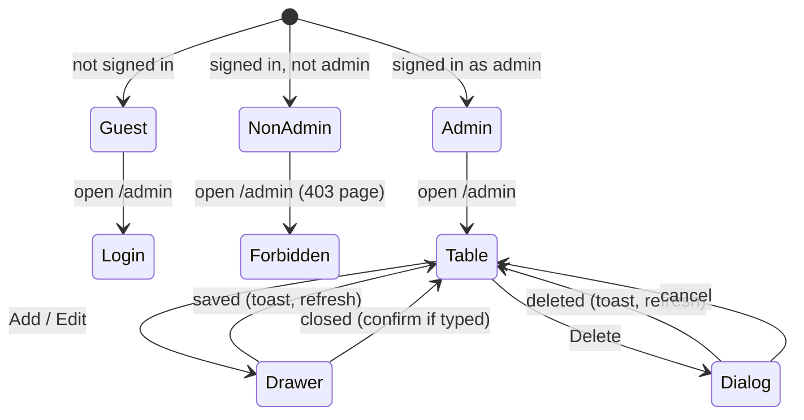
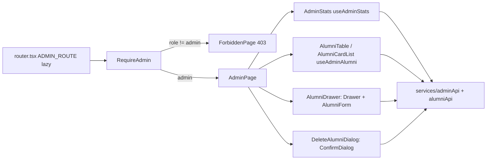
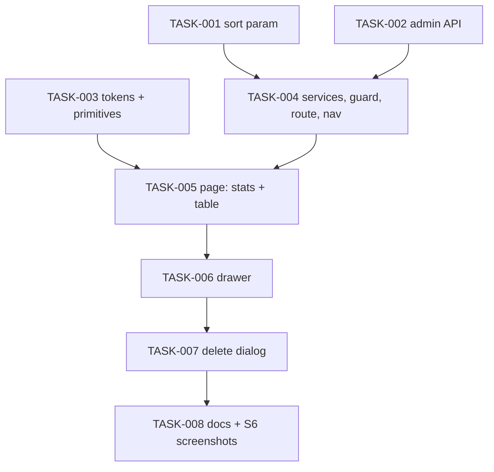

# REQ-015-admin-page — Review Packet

`Packet: 61KB · round 3 · 2 files in this round`

## Round 3 — what changed since round 2

| ID | Disposition | Fix |
|---|---|---|
| n2 (QUAL-007) | fixed | UserManager uses NAME_MAX/UNIVERSITY_MAX/DEPARTMENT_MAX/COMPANY_MAX/JOB_TITLE_MAX; EMAIL_TAKEN_MESSAGE constant (ARCH-006) |
| n3 (QUAL-008) | fixed | RegisterUserFields.university optional; cast removed in createAlumniAccount |

## Diff with full context (uncommitted, vs HEAD — includes the round-2 m5 change in UserManager.ts)

```diff
diff --git a/packages/backend/src/businessLogic/src/UserManager.ts b/packages/backend/src/businessLogic/src/UserManager.ts
index 8216330b..5a6b077a 100644
--- a/packages/backend/src/businessLogic/src/UserManager.ts
+++ b/packages/backend/src/businessLogic/src/UserManager.ts
@@ -1,249 +1,280 @@
 import bcrypt from "bcrypt";
 import { UserQuery } from "@alumni/dal";
-import type { MyProfileRow, PublicUserRow, UserDTO } from "@alumni/dal";
+import type { AlumniProfileFields, MyProfileRow, PublicUserRow, RegisterUserFields, UserDTO } from "@alumni/dal";
 import { AppError, isForeignKeyViolation, isUniqueViolation } from "./errors.js";
 import {
+  COMPANY_MAX,
+  DEPARTMENT_MAX,
+  JOB_TITLE_MAX,
+  NAME_MAX,
+  UNIVERSITY_MAX,
   optionalText,
   optionalWebUrl,
   optionalYear,
   requiredEmail,
   requiredText,
   requireId,
   validateAlumniFields,
   validateNewPassword,
   requiredExpectedYear,
   validateStudentFields,
   validateUserBasics,
 } from "./validation.js";
 
-export const BCRYPT_ROUNDS = 10;
+const BCRYPT_ROUNDS = 10;
+const EMAIL_TAKEN_MESSAGE = "An account with this email already exists";
 
 export const SIGNUP_ROLES = ["alumni", "student"] as const;
 export type SignupRole = (typeof SIGNUP_ROLES)[number];
 
 // Roles an admin may give an account through POST /api/users.
 export const ADMIN_CREATE_ROLES = ["admin", "alumni", "student"] as const;
 export type AdminCreateRole = (typeof ADMIN_CREATE_ROLES)[number];
 
 export interface NewUserInput {
   role: AdminCreateRole;
   name: string;
   email: string;
   password: string;
 }
 
+// A new alumni account's user columns. `password` is plain text here (hashed by createAlumniAccount);
+// university is optional (an admin may leave it out; sign-up requires it).
+export interface NewAlumniAccount {
+  name: string;
+  email: string;
+  password: string;
+  university?: string;
+}
+
 export interface RegistrationInput {
   role: SignupRole;
   name: string;
   email: string;
   password: string;
   university: string;
   department?: string; // required for students
   expected_graduation_year?: string; // students only, required
   graduation_year?: string;
   current_company?: string;
   job_title?: string;
   linkedin_url?: string;
 }
 
 export class UserManager {
   userQuery: UserQuery;
 
   constructor() {
     this.userQuery = new UserQuery();
   }
 
   // Validates an admin's POST /api/users body with the same rules as sign-up, plus admin as a role.
   public validateNewUser(body: Record<string, unknown>): NewUserInput {
     const role = body.role;
     if (!ADMIN_CREATE_ROLES.includes(role as AdminCreateRole)) {
       throw new AppError(400, 'Role must be "admin", "alumni" or "student"');
     }
     return {
       role: role as AdminCreateRole,
-      name: requiredText(body.name, "Name", 100),
+      name: requiredText(body.name, "Name", NAME_MAX),
       email: requiredEmail(body.email),
       password: validateNewPassword(body.password),
     };
   }
 
   // Hashes `input.password` (from validateNewUser) before storing it. Returns the public columns only.
   public async createUser(input: NewUserInput): Promise<PublicUserRow> {
     const passwordHash = await bcrypt.hash(input.password, BCRYPT_ROUNDS);
     try {
       return await this.userQuery.createUser({ ...input, password: passwordHash });
     } catch (error) {
       if (isUniqueViolation(error)) {
-        throw new AppError(409, "An account with this email already exists");
+        throw new AppError(409, EMAIL_TAKEN_MESSAGE);
+      }
+      throw error;
+    }
+  }
+
+  // Creates a user + alumni row in one transaction (POST /api/admin/alumni). Hashes `user.password`
+  // before storing it; a taken email is 409. Returns the public users columns only.
+  public async createAlumniAccount(user: NewAlumniAccount, profile: AlumniProfileFields): Promise<PublicUserRow> {
+    const passwordHash = await bcrypt.hash(user.password, BCRYPT_ROUNDS);
+    // pg stores an undefined university parameter as NULL.
+    const fields: RegisterUserFields = { ...user, password: passwordHash };
+    try {
+      return await this.userQuery.createAlumniUser(fields, profile);
+    } catch (error) {
+      if (isUniqueViolation(error)) {
+        throw new AppError(409, EMAIL_TAKEN_MESSAGE);
       }
       throw error;
     }
   }
 
   public async findUserByEmail(email: string) {
     const user = await this.userQuery.findUserByEmail(email);
     return user;
   }
 
   // POST /api/auth/login: the user (without the password hash) if email and password match, else null.
   public async verifyLogin(email: string, password: string): Promise<Omit<UserDTO, "password"> | null> {
     const user = await this.userQuery.findUserByEmail(email);
     if (!user) return null;
     if (!(await bcrypt.compare(password, user.password))) return null;
     const { password: _hash, ...rest } = user;
     return rest;
   }
 
   // GET /api/users/:id. A malformed or unknown id is 404.
   public async findUserById(id: unknown): Promise<PublicUserRow> {
     const user = await this.userQuery.findUserById(requireId(id, "User"));
     if (!user) throw new AppError(404, "User not found");
     return user;
   }
 
   public async getAllUsers(): Promise<PublicUserRow[]> {
     const allUsers = await this.userQuery.getAllUsers();
     return allUsers;
   }
 
   // DELETE /api/users/:id (admin). A malformed or unknown id is 404; a user other rows still point at is 409.
   public async deleteUser(id: unknown): Promise<void> {
     let deleted: boolean;
     try {
       deleted = await this.userQuery.deleteUser(requireId(id, "User"));
     } catch (error) {
       if (isForeignKeyViolation(error)) throw new AppError(409, "This user still has posts or comments");
       throw error;
     }
     if (!deleted) throw new AppError(404, "User not found");
   }
 
   // Validates a public sign-up body. `role` must be "student" or "alumni" (never admin).
   public validateRegistration(body: Record<string, unknown>): RegistrationInput {
     const role = body.role;
     if (!SIGNUP_ROLES.includes(role as SignupRole)) {
       throw new AppError(400, 'Role must be "student" or "alumni"');
     }
-    const name = requiredText(body.name, "Name", 100);
+    const name = requiredText(body.name, "Name", NAME_MAX);
     const email = requiredEmail(body.email);
     const password = validateNewPassword(body.password);
-    const university = requiredText(body.university, "University", 150);
+    const university = requiredText(body.university, "University", UNIVERSITY_MAX);
 
     if (role === "student") {
       return {
         role,
         name,
         email,
         password,
         university,
-        department: requiredText(body.department, "Department", 100),
+        department: requiredText(body.department, "Department", DEPARTMENT_MAX),
         expected_graduation_year: requiredExpectedYear(body.expected_graduation_year),
       };
     }
     return {
       role: "alumni",
       name,
       email,
       password,
       university,
-      department: optionalText(body.department, "Department", 100),
+      department: optionalText(body.department, "Department", DEPARTMENT_MAX),
       graduation_year: optionalYear(body.graduation_year, "Graduation year"),
-      current_company: optionalText(body.current_company, "Company", 100),
-      job_title: optionalText(body.job_title, "Job title", 100),
+      current_company: optionalText(body.current_company, "Company", COMPANY_MAX),
+      job_title: optionalText(body.job_title, "Job title", JOB_TITLE_MAX),
       linkedin_url: optionalWebUrl(body.linkedin_url, "LinkedIn URL"),
     };
   }
 
   // Creates a student (user + students row) or alumni (user + alumni row) account in one transaction.
   // Hashes `input.password` (from validateRegistration) before storing it.
   public async register(input: RegistrationInput): Promise<PublicUserRow> {
     const passwordHash = await bcrypt.hash(input.password, BCRYPT_ROUNDS);
     const user = { name: input.name, email: input.email, password: passwordHash, university: input.university };
     try {
       if (input.role === "student") {
         return await this.userQuery.createStudentUser(user, {
           department: input.department,
           expected_graduation_year: input.expected_graduation_year,
         });
       }
       return await this.userQuery.createAlumniUser(user, {
         department: input.department,
         graduation_year: input.graduation_year,
         current_company: input.current_company,
         job_title: input.job_title,
         linkedin_url: input.linkedin_url,
       });
     } catch (error) {
       // users_email_key unique violation
       if (isUniqueViolation(error)) {
-        throw new AppError(409, "An account with this email already exists");
+        throw new AppError(409, EMAIL_TAKEN_MESSAGE);
       }
       throw error;
     }
   }
 
   public async getMe(userId: number): Promise<MyProfileRow> {
     const profile = await this.userQuery.findMyProfile(userId);
     if (!profile) throw new AppError(404, "Account not found");
     return profile;
   }
 
   // Every role edits its own name/photo/university/email. Alumni fields only apply if the user has an
   // alumni row, student fields only if they have a students row (otherwise they are ignored and no row
   // is created). Changing the email requires `current_password`.
   // An omitted email keeps the current one. Password, role and ids are never read here.
   public async updateMe(userId: number, body: Record<string, unknown>): Promise<MyProfileRow> {
     const current = await this.userQuery.findMyProfile(userId);
     if (!current) throw new AppError(404, "Account not found");
     const basics = validateUserBasics(body);
     const alumni = current.has_alumni_profile ? validateAlumniFields(body) : undefined;
     const student = !alumni && current.has_student_profile ? validateStudentFields(body) : undefined;
 
     let email: string | undefined;
     if (body.email !== undefined && body.email !== null) {
       const requested = requiredEmail(body.email);
       if (requested !== current.email) {
         await this.checkCurrentPassword(userId, body.current_password);
         email = requested;
       }
     }
 
     try {
       const updated = await this.userQuery.updateMyProfile(userId, basics, alumni, email, student);
       if (!updated) throw new AppError(404, "Account not found");
       return updated;
     } catch (error) {
       if (isUniqueViolation(error)) throw new AppError(409, "Email already in use");
       throw error;
     }
   }
 
   // PUT /api/me/password: the caller changes their own password after confirming the current one.
   public async changeMyPassword(userId: number, body: Record<string, unknown>): Promise<void> {
     const newPassword = validateNewPassword(body.new_password, "New password");
     const currentPassword = await this.checkCurrentPassword(userId, body.current_password);
     if (newPassword === currentPassword) {
       throw new AppError(400, "New password must be different from the current one");
     }
     const changed = await this.userQuery.updatePassword(userId, await bcrypt.hash(newPassword, BCRYPT_ROUNDS));
     if (!changed) throw new AppError(404, "Account not found");
   }
 
   // 400 (not 401) on a wrong password, so the client doesn't treat it as an expired session.
   private async checkCurrentPassword(userId: number, value: unknown): Promise<string> {
     if (typeof value !== "string" || !value) throw new AppError(400, "Current password is required");
     const hash = await this.userQuery.findPasswordHash(userId);
     if (!hash) throw new AppError(404, "Account not found");
     if (!(await bcrypt.compare(value, hash))) throw new AppError(400, "Current password is incorrect");
     return value;
   }
 
   // PUT /api/users/:id: owner-only (admins included), name/photo/university only.
   public async updateOwnUser(requesterId: number, targetId: unknown, body: Record<string, unknown>): Promise<MyProfileRow> {
     const id = requireId(targetId, "User");
     if (id !== requesterId) throw new AppError(403, "You can only edit your own profile");
     const updated = await this.userQuery.updateMyProfile(id, validateUserBasics(body));
     if (!updated) throw new AppError(404, "User not found");
     return updated;
   }
 }
diff --git a/packages/backend/src/dal/dto/RegisterDTO.ts b/packages/backend/src/dal/dto/RegisterDTO.ts
index 2495d9e1..2d726022 100644
--- a/packages/backend/src/dal/dto/RegisterDTO.ts
+++ b/packages/backend/src/dal/dto/RegisterDTO.ts
@@ -1,101 +1,103 @@
 // Shapes for self-registration (POST /api/auth/register) and /api/me.
 
 export interface RegisterUserFields {
   name: string;
   email: string;
   password: string; // bcrypt hash, never plaintext
-  university: string;
+  // Required at sign-up (the validator enforces it); an admin-created alumni account may omit it.
+  // undefined is stored as NULL.
+  university?: string;
 }
 
 export interface AlumniProfileFields {
   department?: string;
   graduation_year?: string;
   current_company?: string;
   job_title?: string;
   linkedin_url?: string;
 }
 
 export interface StudentProfileFields {
   department?: string;
   expected_graduation_year?: string;
 }
 
 // users row without the password column.
 export interface PublicUserRow {
   id: number;
   name: string;
   email: string;
   role: string;
   photo_url?: string;
   university?: string;
   created_at: Date;
 }
 
 // The caller's account (users) plus their alumni or students row if they have one (GET/PUT /api/me).
 // Never contains the password.
 export interface MyProfileRow {
   user_id: number;
   name: string;
   email: string;
   photo_url?: string;
   role: string;
   university?: string;
   alumni_id: number | null;
   has_alumni_profile: boolean;
   student_id: number | null;
   has_student_profile: boolean;
   // department, company, job title, experience, bio and LinkedIn come from the alumni row,
   // or from the students row for students.
   department?: string;
   expected_graduation_year?: string;
   graduation_year?: string;
   current_company?: string;
   job_title?: string;
   experience?: string;
   bio?: string;
   linkedin_url?: string;
   // Alumni-only (null for students and accounts without an alumni row); mentorship_available is never null.
   headline?: string;
   location?: string;
   degree?: string;
   start_year?: string;
   mentorship_available?: boolean;
   created_at?: Date;
   login_at?: Date;
   updated_at?: Date; // latest change to the users or alumni row
 }
 
 // users fields any account may change on itself. Email and password are updated separately
 // (both need the current password); role is never editable.
 export interface UserBasicsFields {
   name: string;
   photo_url?: string;
   university?: string;
 }
 
 // alumni fields an owner may change. user_id and id are not here on purpose.
 export interface AlumniEditableFields {
   department?: string;
   graduation_year?: string;
   current_company?: string;
   job_title?: string;
   experience?: string;
   bio?: string;
   linkedin_url?: string;
   headline?: string;
   location?: string;
   degree?: string;
   start_year?: string; // text like graduation_year; INTEGER column
   // Always set by the validator: a full-replace save that omits it means false.
   mentorship_available: boolean;
 }
 
 // students fields an owner may change (the alumni-style details plus the student ones).
 // user_id and id are not here on purpose.
 export interface StudentEditableFields extends StudentProfileFields {
   current_company?: string;
   job_title?: string;
   experience?: string;
   bio?: string;
   linkedin_url?: string;
 }
```

## REQ spec

# Admin page at /admin: stats, alumni table, add, edit, delete

| Field | Value |
|---|---|
| REQ | REQ-015 |
| Status | validated |
| Phase | spec |
| Created | 2026-10-07 |
| Primary repo | alumni-system |
| Touched repos | alumni-system |
| Related | [[REQ-003]] · [[REQ-005]] · [[REQ-006]] · [[REQ-007]] · [[REQ-011]] · [[REQ-012]] |

## Problem

Admins have no screen. The only admin powers are three API routes (`GET`/`POST /api/users`, `DELETE /api/users/:id`) with no UI, so an admin can't see how big the network is, find an alumnus, fix a wrong profile, add someone, or remove someone without hand-written requests or SQL. Deleting a person who ever posted is refused outright (409). The design bundle has a full Admin screen (S6) that was never built.

## Goal

A signed-in admin opens `/admin` (from the avatar menu, the header nav or the phone tab bar) and sees the S6 screen built on design tokens: four stat cards with live counts, a searchable, sortable, paged alumni table (a card list on phones), and per-row Edit and Delete. "Add alumni" opens the S6 side drawer and creates a new alumni account; Edit reuses the drawer to change a profile; Delete asks with the S6 dialog and then removes the person and everything they wrote. Non-admins never see an Admin link and get a 403 page if they open `/admin` directly. Every new admin endpoint is admin-only on the server and covered by tests.

## Non-goals

- Managing students or admins from this page (the table and drawer handle alumni only).
- Bulk actions, CSV import/export, audit log, undo for delete.
- Password reset, invite emails, email verification, or a "pending verification" state.
- Changing a person's email, role or password from the Edit drawer.

## Acceptance criteria

### Access
- [ ] `/admin` is a lazy route under `RequireAuth` (its own chunk in `npm run build`, listed in `LAZY_FEATURES`). A guest who opens it goes to `/login` and returns to `/admin` after an admin logs in.
- [ ] A signed-in non-admin (alumni, student) who opens `/admin` sees a 403 page inside the app shell ("You don't have access to this page" with a link home). No admin API request is sent for them.
- [ ] Admins see "Admin settings" in the avatar menu, "Admin" in the desktop header nav (current-page underline on `/admin`) and an "Admin" tab in the phone tab bar (shield icon, per S6). Non-admins see none of the three.
- [ ] Every new backend admin route answers 401 without a token and 403 for a signed-in non-admin; `routeGuard.test.ts` stays green and a test proves the 403 for each new route.

### Stat cards
- [ ] Four cards, in S6's layout (one row of four on desktop, a 2×2 grid on phones): **Total alumni**, **Students**, **Posts**, **Mentors available**, each a real count from a new admin-only stats endpoint (alumni rows, student rows, posts, alumni with `mentorship_available = true`). Numbers use thousands separators (`1,842`).
- [ ] Loading shows skeletons in the cards; a failed stats request shows an inline error with Retry and does not hide the table.
- [ ] After an add or delete, the counts refresh without a page reload.

### Alumni table
- [ ] Desktop (≥ 48rem): a table with columns Name, Grad. year, Department, University, Mentor ("Yes"/"No") and a row-actions column with icon buttons named "Edit <name>" and "Delete <name>". Phones: S6's card list (name; "year · department"; the same two icon buttons).
- [ ] Rows come from the existing `GET /api/alumni` search (REQ-005); the search box ("Search alumni") filters by its `q` (name, company or job title), typed text debounced 300 ms.
- [ ] Clicking the Name or Grad. year header sorts by it; clicking again flips the direction. The active column shows the arrow from S6 (↓ / ↑) and `aria-sort`. Default: name ascending. Sorting is done by the server so it holds across pages, with a unique tie-break so pages never overlap. The new sort input is optional and validated like REQ-005's params (an unknown value is a 400; absent means today's order), so the directory is unaffected.
- [ ] Paging: Prev / Next buttons and "Showing <n> of <total>" (formatted), 10 rows per page. Prev is disabled on page 1, Next on the last page. Search text, sort and page live in the URL query string (ADR-08), so reload and Back keep them; a new search or sort returns to page 1.
- [ ] States: skeleton rows while loading; an error with Retry; "No alumni match “<q>”" with a Clear search button; "No alumni yet" when the network is empty.

### Add alumni drawer
- [ ] "Add alumni" (button with + icon on desktop; a 32px + icon button named "Add alumni" on phones) opens a drawer from the right, 420px wide on desktop and full width on phones, over a dimmed backdrop, titled "Add alumni", with a close (×) button.
- [ ] Fields: Full name, Email, University, Graduation year, Department, Current role, Company, Temporary password. Name, email and temporary password are required; password follows sign-up's rules; the rest follow the existing alumni field limits. Errors show per field when the field is left or Add is pressed, and focus moves to the first invalid field (ADR-04).
- [ ] "Add alumni" creates the user (role alumni) and their alumni row together; either both exist or neither. A taken email shows "An account with this email already exists" on the Email field. On success the drawer closes, a toast says "<name> added", and the table and counts refresh.
- [ ] Cancel, ×, the backdrop and Escape close the drawer; if anything was typed, closing asks "Discard this new alumni?" first. Focus is trapped while open and returns to the button that opened it.

### Edit
- [ ] The Edit button opens the same drawer titled "Edit alumni", filled from the row's full profile, without Email and Temporary password. Save ("Save changes") updates name, university, graduation year, department, current role and company through a new admin-only endpoint; fields REQ-011 added that the drawer doesn't show (headline, location, degree, start year, mentorship, bio, LinkedIn, photo) keep their stored values.
- [ ] On success the drawer closes, a toast says "Changes saved", and the row updates. A 404 (deleted meanwhile) shows "This alumni no longer exists" and refreshes the table.

### Delete
- [ ] The Delete button opens S6's dialog: trash icon in a danger-tinted circle, "Delete <name>?", the text "This permanently removes their profile, posts, and comments from <brand name>. This action can't be undone.", Cancel and a danger "Delete alumni" button. Escape and Cancel close it; focus starts on Cancel and returns to the row afterwards (or to the table heading if the row is gone).
- [ ] Confirming calls a new admin-only endpoint that deletes, in one transaction, the person's comments (and replies to them), their posts (with those posts' comments), their alumni row and their user account. Either all of it is gone or none of it. The button shows a loading state; on success the dialog closes, a toast says "<name> deleted", and the table and counts refresh; on failure the dialog stays open with the error message.
- [ ] An admin can't delete their own account from this page (the server refuses with 403 "You can't delete your own account"; the UI also hides Delete on the admin's own row if it ever appears).

### Design and quality
- [ ] Layout, spacing, type, radii and colours match S6 (Desktop/Phone × Light/Dark, AddDrawer, DeleteConfirm) using only design tokens; no hex, rgb or shadow literals from the design files (lint stays green). Deliberate differences from S6 are listed in the architecture and the feature README.
- [ ] Works from 360px wide and at 200% zoom with no horizontal page scroll (the desktop table may scroll inside its card).
- [ ] Before review sign-off, screenshots of the built page are compared side by side with S6 at desktop and phone widths, in light and dark, including the drawer and dialog, and differences are fixed or recorded.
- [ ] Tests: backend route tests (status codes, roles, identity), Manager tests (validation, self-delete refusal, 404s, 409 on taken email) and Query tests (SQL shape: counts, sort whitelist, transaction order for create and delete); frontend tests for the page states, sort/search/paging URL handling, drawer validation and submit, delete flow, the 403 page, and admin-only links. All existing suites, `typecheck`, `lint` and `format:check` pass.

## Flow (optional)



## Assumptions

- The stat labels follow the user's request (Total alumni, Students, Posts, Mentors available), not S6's (Active mentors, New this month, Pending verification). None of these is good or bad, so the cards use the plain text colour, not S6's green/red accents. (Decided by the user, 2026-10-07.)
- The drawer adds a Temporary password field that S6 doesn't have; the admin shares it and the person changes it in Account settings. (Decided by the user, 2026-10-07.)
- Delete removes everything the person wrote, as S6's dialog text says, replacing today's 409 for this path. `DELETE /api/users/:id` keeps its current 409 behaviour. (Decided by the user, 2026-10-07.)
- Admin links appear in the avatar menu, the desktop header nav and the phone tab bar, as S6 shows; the header and tab labels are "Admin", the menu item "Admin settings". (Decided by the user, 2026-10-07.)
- S6's single "Current role & company" field becomes two fields, Current role and Company, because the API stores them separately and splitting text on a comma would be fragile.
- S6's Role select (Alumni / Student / Admin) is left out: this page manages alumni only, and a student or admin created here would never show in the alumni table. (Confirmed by the user at the spec gate, 2026-10-07.)
- The header logo, brand name, avatar and the rest of the shell stay as built (Alma, REQ-004/007); only S6's page content is matched. S6's "My Profile" header link stays out (REQ-012).
- Seed or dev data includes at least one admin account to test with. — `STATUS: needs verification`
- An admin's own account has no alumni row, so their row normally never appears in the table.

## Open questions

- [x] Keep S6's Role select? Resolved 2026-10-07: dropped; the drawer creates alumni only.

## Out of scope (for now)

- Photo upload for alumni (no endpoint; same gap as REQ-010).
- Editing REQ-011 fields (headline, location, degree, start year, mentorship) from the admin drawer.
- Sorting by Department, University or Mentor; filters beyond search on this page.
- Managing students and admins in their own tables.
- Moving `DELETE /api/users/:id` to the cascade behaviour.

## Related

- Concepts: [[concepts/route-layout]]
- Components: —
- Lessons: [[knowledge/lessons/LESSON-REQ-005-1-paged-list-endpoints|L-REQ-005-1]] (reuse paging helpers) · [[knowledge/lessons/LESSON-REQ-006-1-url-mirrored-input-own-write|L-REQ-006-1]] · [[knowledge/lessons/LESSON-REQ-006-3-client-copies-of-api-limits|L-REQ-006-3]] · [[knowledge/lessons/LESSON-REQ-009-4-adding-a-lazy-feature-touches-six-lists|L-REQ-009-4]] · [[knowledge/lessons/LESSON-REQ-010-5-nav-and-menu-changes-touch-every-readme-list|L-REQ-010-5]] · [[knowledge/lessons/LESSON-REQ-012-2-record-design-deviations|L-REQ-012-2]] · [[knowledge/lessons/LESSON-REQ-014-1-derive-lazy-feature-lists-from-one-source|L-REQ-014-1]] · [[knowledge/lessons/LESSON-REQ-004-2-check-design-colours-against-token-pairs|L-REQ-004-2]]
- Gotchas: [[knowledge/gotchas#^g25|G25]] (Base UI popup focus/name) · [[knowledge/gotchas#^g31|G31]] (SQL traps) · [[knowledge/gotchas#^g32|G32]] (businessLogic dist) · [[knowledge/gotchas#^g35|G35]] (delete state, tap targets) · [[knowledge/gotchas#^g36|G36]] (toast) · [[knowledge/gotchas#^g38|G38]] (error text to fields) · [[knowledge/gotchas#^g41|G41]]
- ADRs: [[architecture/adr-01-ui-layer-headless-css-modules|ADR-01]] · [[architecture/adr-02-server-state-tanstack-query|ADR-02]] · [[architecture/adr-04-forms-without-a-library|ADR-04]] · [[architecture/adr-05-backend-tests-vitest-supertest|ADR-05]] · [[architecture/adr-08-route-code-splitting-and-url-list-state|ADR-08]]

## Backlinks

_(populated by /wrapup or manually)_


## REQ architecture

# Admin page at /admin — Architecture

| Field | Value |
|---|---|
| REQ | REQ-015 |
| Status | validated |
| Created | 2026-10-08 |
| Related ADRs | [[architecture/adr-01-ui-layer-headless-css-modules\|ADR-01]] · [[architecture/adr-02-server-state-tanstack-query\|ADR-02]] · [[architecture/adr-03-frontend-session-and-401-handling\|ADR-03]] · [[architecture/adr-04-forms-without-a-library\|ADR-04]] · [[architecture/adr-05-backend-tests-vitest-supertest\|ADR-05]] · [[architecture/adr-06-config-leaf-layer\|ADR-06]] · [[architecture/adr-08-route-code-splitting-and-url-list-state\|ADR-08]] |

## Summary

Adds an admin-only API namespace (`/api/admin/*`: stats, create, edit and delete an alumni account) plus an optional server-side sort on the existing `GET /api/alumni`, and a new lazy frontend feature `features/admin` at `/admin` that renders S6 on tokens: stat cards, a sortable/searchable/paged alumni table (cards on phones), an add/edit drawer and a delete dialog. Two new UI primitives (`Drawer`, `ConfirmDialog`) wrap Base UI's Dialog/AlertDialog (ADR-01 already names Base UI for dialogs). Two new colour tokens (`error-soft`, `scrim`) cover the S6 colours with no token today. A `RequireAdmin` guard shows a 403 page to non-admins, and admin-only links appear in the header nav, the tab bar and the avatar menu.

## Blast radius

| Path | Why touched | Risk |
|---|---|---|
| `packages/backend/src/api/app.ts` | mount `/api/admin` router | low |
| `packages/backend/src/api/routes/AdminRoutes.ts` (new) | `router.use(authMiddleware, requireRole("admin"))`; stats, POST/PUT/DELETE alumni | medium (auth) |
| `packages/backend/src/api/controllers/AdminController.ts` (new) | parse req, call `AdminManager`, `sendError` | low |
| `packages/backend/src/api/routes/AdminRoutes.test.ts` (new), `routeGuard.test.ts` | 401/403/status/identity tests; guard stays green (min route count may rise) | low |
| `packages/backend/src/businessLogic/src/AdminManager.ts` (+test, new), `index.ts` | validation, hashing, self-delete refusal, 404/409 mapping | medium |
| `packages/backend/src/businessLogic/src/validation.ts` (+test) | `parseAlumniSearch` gains `sort`/`order`; `validateAdminAlumniFields` | medium (shared by directory) |
| `packages/backend/src/businessLogic/src/AlumniManager.ts` (+test) | pass sort through | low |
| `packages/backend/src/businessLogic/src/TestManager.ts` | only if a renamed Manager method is referenced (G24) | low |
| `packages/backend/src/dal/query/AdminQuery.ts` (+test, new), `dal/index.ts`, `dal/dto/*` | counts; create (reuse `UserQuery.createAlumniUser`); edit and delete transactions | high (destructive delete) |
| `packages/backend/src/dal/query/AlumniQuery.ts` (+test) | whitelisted `ORDER BY` | medium |
| `packages/shared/src/types/alumni.types.ts`, `admin.types.ts` (new), `index.ts` | `AdminStats`, `AdminAlumniInput`, `AdminAlumniUpdate`, `AlumniSort` | low |
| `docs/design/design-system/tokens.json`, `packages/frontend/src/styles/tokens.css` (generated), `src/styles/contrast.test.ts` | `error-soft`, `scrim`; contrast pair `error` on `error-soft` | low |
| `packages/frontend/src/components/ui/Drawer/*`, `ConfirmDialog/*` (new) | Base UI Dialog / AlertDialog wrappers | medium (focus) |
| `packages/frontend/src/services/adminApi.ts` (+test, new), `alumniApi.ts` (+test) | admin endpoints; `sort`/`order` on `searchAlumni` | low |
| `packages/frontend/src/config/adminPath.ts` (new) | `ADMIN_PATH` | low |
| `packages/frontend/src/features/auth/guards.tsx` (+test), `index.ts` | `RequireAdmin` + `useIsAdmin` | medium (access) |
| `packages/frontend/src/features/admin/*` (new) | page, stats, table, cards, params, hooks, drawer form, delete flow, README | medium |
| `packages/frontend/src/app/router.tsx`, `app/lazyRoutes.test.ts`, `eslint.config.js`, `scripts/enforcement.test.ts` | `ADMIN_ROUTE` + `LAZY_FEATURES` entry (L-REQ-014-1: lists derive from it) | low |
| `packages/frontend/src/app/AppShell/navItems.tsx`, `MainNav.tsx`, `BottomTabs.tsx`, `NavIcons.tsx`, `HeaderAuth.tsx` (+ `AppShell.test.tsx`) | admin-only Admin link, shield icon, "Admin settings" menu item | low |
| `packages/frontend/README.md`, `src/*/README.md` (app, features, components/ui, services, config), root `CLAUDE.md` | document the feature, nav, primitives, endpoints (L-REQ-010-5) | low |

## Approach

### Backend

**Namespace.** A new `AdminRoutes.ts` mounted at `/api/admin` starts with `router.use(authMiddleware, requireRole("admin"))`, so every route added there later is admin-only by construction (same idea as REQ-003's router-level `authMiddleware`). Routes: `GET /stats`, `POST /alumni`, `PUT /alumni/:id`, `DELETE /alumni/:id` (`:id` is the **alumni** id, the id the table already has). Controllers stay exported functions calling `sendError`, matching every existing controller; the redesign's "controllers are classes / shared error middleware" convention is still unbuilt everywhere and is not started by this REQ (same choice as REQ-005…014).

**AdminManager** (new, `businessLogic`):
- `getStats()` → `{ alumni, students, posts, mentors }` from one `AdminQuery.countStats()` (one SQL round trip with four scalar sub-selects).
- `createAlumni(body)` → validates with existing helpers: `requiredText(name, NAME_MAX)`, `requiredEmail`, `validateNewPassword(password, "Temporary password")`, `optionalText(university, UNIVERSITY_MAX)`, `optionalYear(graduation_year)`, `optionalText(department / job_title / current_company)`; bcrypt-hashes (same `BCRYPT_ROUNDS` as `UserManager`; export the constant rather than copy it); calls `UserQuery.createAlumniUser` (already one transaction, role fixed to `'alumni'`); maps a unique violation to 409 "An account with this email already exists". Returns 201 with the new list row (`findAlumniById`).
- `updateAlumni(id, body)` → `requireId`; 404 "Alumni not found" if missing; validates name (required), university, graduation_year, department, job_title, current_company; `AdminQuery.updateAlumniAccount` updates `users.name, users.university` and only those four `alumni` columns in one transaction (REQ-011 fields, bio, LinkedIn, photo untouched — a deliberate **partial** update, unlike `PUT /api/me`'s full replace). Unknown keys are ignored; `email`, `role`, `password`, `user_id` in the body are ignored. Returns the list row.
- `deleteAlumni(requesterId, id)` → `requireId`; load the row (404); if `row.user_id === requesterId` → 403 "You can't delete your own account"; `AdminQuery.deleteAlumniAccount(userId)`; if it reports nothing deleted → 404.

**Delete transaction** (`AdminQuery.deleteAlumniAccount`, high risk, so spelled out):
```
BEGIN
  -- posts by OTHER users whose comment_count will drop
  SELECT DISTINCT c.post_id FROM comments c
   WHERE (c.user_id = $1 OR c.parent_id IN (SELECT id FROM comments WHERE user_id = $1))
     AND c.post_id NOT IN (SELECT id FROM posts WHERE user_id = $1)
  DELETE FROM users WHERE id = $1          -- FKs cascade: alumni, students, posts (+their comments), comments (+replies)
  UPDATE posts SET comment_count = (SELECT COUNT(*) FROM comments WHERE post_id = posts.id)
   WHERE id = ANY($2)                       -- only the affected posts
COMMIT  (ROLLBACK on any error; client released in finally)
```
It relies on `ON DELETE CASCADE` on all six foreign keys — verified on the live dev database (`pg_constraint.confdeltype = 'c'`, 2026-10-08) and in `db/backups/pre_bolt20_*.sql`. If a foreign key turns out not to cascade on some database, the `DELETE` raises 23503, the transaction rolls back, and the Manager maps it to 409 "This user still has posts or comments" — nothing half-deleted. The recount step is the part the existing `DELETE /api/users/:id` never needed (it refuses users with comments), and without it other people's posts would show stale comment counts in the feed.

**Sort on `GET /api/alumni`.** `parseAlumniSearch` gains two optional params validated like the rest (single value, empty = absent): `sort` ∈ {`name`, `graduationYear`} and `order` ∈ {`asc`, `desc`}; anything else → 400 "Invalid sort" / "Invalid order". `order` without `sort` applies to name. `AlumniQuery.searchAlumni` maps the pair through a **fixed whitelist object** to SQL text (no user text reaches SQL): `name` → `u.name <dir>, a.id <dir>`; `graduationYear` → `a.graduation_year <dir> NULLS LAST, u.name, a.id`. Absent sort keeps today's exact `ORDER BY u.name, a.id`, so the directory (which never sends `sort`) is unchanged.

**Shared types.** `admin.types.ts`: `AdminStats`, `AdminAlumniCreateInput`, `AdminAlumniUpdateInput`; `alumni.types.ts`: `AlumniSort = 'name' | 'graduationYear'`, `SortOrder = 'asc' | 'desc'`.

### Frontend



- **Route and guard.** `ADMIN_ROUTE` (`path: 'admin'`, `HydrateFallback`, `lazy: import('@/features/admin/AdminPage')`) sits under `RequireAuth` inside a new pathless `{ element: <RequireAdmin /> }` route. `RequireAdmin` (in `features/auth/guards.tsx`, next to `RequireAuth`) reads `useCurrentUser()`: pending → the same "Loading…" fallback as `HydrateFallback`; `role === 'admin'` → `<Outlet />`; otherwise `<ForbiddenPage />` (heading "You don't have access to this page", text, `ButtonLink` home), rendered inside the shell's `<main>`, so the admin chunk never loads and no admin request is sent. A failed `['me']` shows the existing error pattern with Retry, not a 403 (L-REQ-010-2: the guard must not hide real errors). `useIsAdmin()` (same file) is what nav and menu read. The server stays the judge; a stale role that gets a 403 from `/api/admin/*` shows the page's normal error state (never a logout — 403 is not 401, ADR-03).
- **Nav.** `NavItem` gains `adminOnly?: true`; `ADMIN_NAV_ITEM` (`/admin`, "Admin", new `ShieldIcon`) is appended to both `HEADER_NAV_ITEMS` and `TAB_NAV_ITEMS`; `MainNav` and `BottomTabs` filter `adminOnly` items through `useIsAdmin()`. `HeaderAuth`'s menu adds "Admin settings" (navigates to `ADMIN_PATH`) after Account settings, admins only. The phone tab bar goes from 3 to 4 tabs for admins (S6 draws 4).
- **List state (ADR-08).** `features/admin/params.ts` parses `q`, `sort`, `order`, `page` from the URL, dropping values the API would reject (limits imported from nowhere — copied with a comment naming `validation.ts`, as `directory/params.ts` does, L-REQ-006-3). Header click on Name / Grad. year: same column → flip order; other column → that column ascending; page resets to 1 and pushes history. Search uses the directory's `useDebouncedCallback` pattern (300 ms, replace) — copied into `features/admin` because lazy features can't import each other (L-REQ-008-6); it's 20 lines. `useAdminAlumni(params)` → `['admin', 'alumni', params]` calling `searchAlumni({ q, sort, order, page, pageSize: 10 })`, `placeholderData: keepPreviousData`.
- **Stats.** `useAdminStats()` → `['admin', 'stats']`. Cards format with a module-level `Intl.NumberFormat('en-US')` so the output is always `1,842` (S6) whatever the browser locale. Loading: `Skeleton` in each value; error: `Alert` + Retry in place of the card row; the table still renders.
- **Mutations** (`useCreateAlumni`, `useUpdateAlumni`, `useDeleteAlumni`): not optimistic — the admin wants the server's truth and the row set depends on server sort/paging. `onSuccess` invalidates `['admin']` (stats + every table page) and `['alumni']` (the directory cache, real key — L-REQ-010-1) and, for delete, `['posts']` (removed posts and recounted comment counts). After a delete empties the last page, the page index clamps to the new last page.
- **Drawer.** `AlumniDrawer` = `Drawer` primitive (title, close ×, body scroll area, footer) + `AlumniForm` (controlled state, `features/admin/validation.ts` with messages mirroring the backend, ADR-04, errors on blur and submit, focus first invalid). Mode `add` shows Email + Temporary password (`PasswordInput`); mode `edit` hides them and starts from the row. A dirty close (×, Cancel, backdrop, Escape) is intercepted by the `Drawer`'s `onOpenChange` and shows a small inline confirm inside the drawer footer ("Discard this new alumni?" / "Discard changes?" with Keep editing / Discard) — not a second stacked modal. Server errors map field-by-message with a pure `adminErrors.ts` (409 → Email; 404 on edit → toast "This alumni no longer exists", close, refetch).
- **Delete.** `DeleteAlumniDialog` = `ConfirmDialog` (AlertDialog: `role="alertdialog"`, initial focus on Cancel, Escape closes, backdrop click does **not** close). Text uses `BRAND_NAME` from `config/brand.ts` (so "…from Alma…", not S6's "Alumni Network"). The confirm button gets `loading`; errors show in an `Alert` inside the dialog. Focus returns to the row's Delete button on cancel, or to the "Alumni" table caption/heading after a successful delete (G35).
- **Primitives.** `components/ui/Drawer` (Base UI `Dialog`; right-anchored panel 420px from 48rem, full width below; slide-in with `--duration-fast`/`--easing-standard`, reduced-motion respected) and `components/ui/ConfirmDialog` (Base UI `AlertDialog`; 400px max, `tone="danger"` icon slot). Both take a required `title` (G25: the popup needs a name), use `scrim` for the backdrop and `surface-raised` for the panel. No `box-shadow` (Stylelint bans it); the drawer keeps S6's `border-left` hairline, the dialog a `border-subtle` hairline — the "soft borders instead of heavy shadows" rule from the design brief.
- **Responsive.** ≥ 48rem: `<table>` inside a card with `overflow-x: auto` on a wrapper (only the table scrolls at 200% zoom). < 48rem: the card list, the icon-only Add button and the 2×2 stat grid. Both are rendered from the same data; the switch is CSS (`hidden`-safe per G18: no `display` on an element using `hidden`).

### Design mapping (S6 hex → token; never a hex in code)

| S6 | Token |
|---|---|
| `#faf7f2` / `#1d1a17` page | `--surface-page` |
| `#ffffff` / `#272320` cards, table, drawer, dialog | `--surface-raised` |
| `#f0ebe3` / `#171412` search well | `--surface-sunken` (via `SearchField`) |
| `#e4dcd0` / `#3a352f` borders; `#efe9df` / `#312c27` row dividers | `--border-subtle` (no separate divider token; the 2-step difference is not worth a token) |
| `#2b2724` · `#6b6560` · `#948c84` text | `--ink-primary` · `--ink-secondary` · `--ink-muted` |
| `#ad6a4d` accent (S6 is pre-contrast-fix) | `--accent` (`#975c43`, L-REQ-004-2) |
| `#a3503f` danger button, icon | `--error` |
| `#f6e1dd` danger tint circle | **new `--error-soft`** (light `#f6e1dd`, dark a brick tint chosen to keep `--error` on it ≥ 3:1, added to `contrast.test.ts`) |
| `rgba(43,39,36,.35/.4)` backdrop | **new `--scrim`** (light/dark values with alpha) |
| `box-shadow` on drawer/dialog | dropped (Stylelint); hairline border instead |
| `#5c7950` / `#a3503f` stat accents | not used (stats are neutral; spec assumption) |
| 22/18px h1, 26/20px numbers, 12/11px labels | nearest `--text-*` styles (`heading-lg`/`heading-md`, `display`-free numbers on `heading-lg`, `caption`) |
| 14px / 12px radius | `--radius-lg` |
| 18px / 14px card padding, 16px gaps | `--space-4` (16px; S6's 18px has no token) |

### Deliberate differences from S6 (recorded in `features/admin/README.md`, L-REQ-012-2)

Stat labels (user's four, neutral colour) · Temporary password field · Role select removed · "Current role & company" split into two fields · brand text "Alma" via `BRAND_NAME` · no shadows · header keeps the built shell (no "My Profile" link, REQ-012) · phone tab "Account" not "Profile" · Prev/Next also on phones (S6 phone shows none) · drawer full width on phones (S6 has no phone drawer).

## Task DAG

### Tier 0
- `TASK-001` — Backend: optional `sort`/`order` on `GET /api/alumni`
- `TASK-002` — Backend: `/api/admin` namespace (stats, create, edit, delete with recount)
- `TASK-003` — Frontend: `error-soft` and `scrim` tokens; `Drawer` and `ConfirmDialog` primitives

### Tier 1
- `TASK-004` — Frontend: admin services, `RequireAdmin` + 403 page, lazy `ADMIN_ROUTE`, admin-only nav/tab/menu links — depends on TASK-001, TASK-002

### Tier 2
- `TASK-005` — Frontend: admin page — stats cards, table/cards, search/sort/paging in URL, states — depends on TASK-003, TASK-004

### Tier 3
- `TASK-006` — Frontend: add/edit drawer — depends on TASK-005

### Tier 4
- `TASK-007` — Frontend: delete dialog flow — depends on TASK-006 (both edit `AdminPage.tsx`; serial avoids conflicts)

### Tier 5
- `TASK-008` — Docs + side-by-side screenshot comparison with S6 (desktop/phone × light/dark, drawer, dialog) and fixes — depends on TASK-007



## Test strategy

- **Backend (ADR-05, three levels):**
  - `routes/AdminRoutes.test.ts` (supertest, managers mocked with real `AppError`): each of the 4 routes → 401 no token, 403 alumni token, 403 student token, success status (200/201/200/200), the manager receives `req.user.sub` for delete and the body for create/edit; `sendError` mapping for 400/404/409.
  - `routeGuard.test.ts` unchanged in logic; still green with the new router (update the minimum route count if it asserts one).
  - `AdminManager.test.ts`: create validation (missing name/email/password, bad email, short password, bad year, over-long text → 400 with field-first messages), hashing (stored password ≠ input), 409 on unique violation; edit 404, ignores email/role/password keys; delete 404, 403 self-delete, 409 on FK violation, 404 when nothing deleted; stats pass-through.
  - `AdminQuery.test.ts` (fake pool/client): stats SQL has four counts incl. `mentorship_available = true`; delete runs `BEGIN` → affected-post select → `DELETE FROM users` → recount `WHERE id = ANY` → `COMMIT`, `ROLLBACK` + `release` on error, recount skipped when no affected posts; edit updates only the six columns, never `email`/`password`/`role`/REQ-011 columns.
  - `validation.test.ts`: `sort`/`order` valid, invalid, repeated, nested, empty; `AlumniQuery.test.ts`: each whitelist branch's `ORDER BY`, default unchanged.
  - One manual run against the dev database (L-REQ-005-2): create, edit, delete a seeded alumnus with posts and comments; check other posts' `comment_count`.
- **Frontend (Vitest + RTL, HTTP through axios adapters):**
  - `Drawer.test.tsx`, `ConfirmDialog.test.tsx`: named dialog, focus trap/initial focus, Escape, return focus, alertdialog role, backdrop behaviour.
  - `guards.test.tsx`: `RequireAdmin` pending / admin / non-admin (403 page, no admin request) / `['me']` error.
  - `AppShell.test.tsx`: Admin link + tab + "Admin settings" for admin, absent for alumni and student.
  - `lazyRoutes.test.ts` + `enforcement.test.ts`: admin in `LAZY_FEATURES`; static import banned.
  - `features/admin`: `params.test.ts`, `validation.test.ts`, `adminErrors.test.ts`, `AdminPage.test.tsx` (stats states and formatting, table rows, sort header clicks → URL + `aria-sort`, debounced search, paging and disabled edges, empty/no-match/error states, phone card list present), `AlumniDrawer.test.tsx` (add: validation, focus first invalid, 409 on Email, success toast + refetch; edit: prefill, partial body, 404 path; dirty-close confirm), `DeleteAlumniDialog.test.tsx` (text with brand, loading, error stays open, success toast + refetch, focus return).
  - `adminApi.test.ts`, `alumniApi.test.ts` (sort/order query string).
- **Visual:** TASK-008 screenshots the running app at 1440px and 390px, light and dark, plus drawer and dialog, next to the S6 files rendered in the same browser.
- **Gates:** `npm test`, `typecheck`, `lint`, `format:check`, `tokens:check`, `build` (admin chunk present) in `packages/frontend`; `npm run test:backend`, `npm run typecheck:backend`; `tsc` in `businessLogic` so `dist/` is fresh (G32).

## Convention alignment

- Layers routes → controllers → Managers → Query classes; SQL only in `dal`; identity from the token; ownership/self rules in the Manager; 401 vs 403 vs 404 per conventions-api.
- Router-level `requireRole("admin")` for the whole namespace (stronger than per-route; documented in conventions-api at wrap-up).
- Paged list contract `{ items, total }` reused; new query params follow the REQ-005 rules (400 on bad, empty = absent, single value).
- Frontend: lazy route + `LAZY_FEATURES` (ADR-08, L-REQ-014-1); URL list state; TanStack Query for server data, no atoms needed; forms without a library (ADR-04, 8 fields — at the ADR's ~8-field revisit line but a flat form, so no library); Base UI for dialogs (ADR-01); tokens only; config leaf for `ADMIN_PATH` (ADR-06).
- **Deviations:** controllers stay functions with per-handler `sendError` (the redesign's class controllers + shared error middleware are not built anywhere yet; out of scope, as in every REQ since 003). Two new tokens are added to `tokens.json` (the documented workflow, not a hand edit).

## Risks

| Risk | Likelihood | Mitigation |
|---|---|---|
| Delete removes the wrong person or leaves partial data | low | alumni id → user id lookup in the Manager; single transaction; Query test pins statement order; manual dev-DB run; self-delete refused |
| A database without `ON DELETE CASCADE` | low | verified live; otherwise 23503 → rollback → 409, never partial |
| Stale `comment_count` on other posts after delete | med without step | explicit recount of affected posts in the same transaction, tested |
| Sort param breaks the directory | low | absent sort keeps the exact old `ORDER BY`; directory never sends it; test pins the default |
| Demoted admin keeps the page for ≤ 1 h (role in JWT) | low | server is the judge; known REQ-003 limitation |
| A deleted person's token still works for ≤ 1 h (ADV-003): they can read signed-in pages; their writes hit a foreign-key error (500) | low | **accepted** for this REQ (same JWT-without-revocation limit as REQ-003, ADR-05 consequences); follow-up filed: token revocation or a user-exists check in `authMiddleware` |
| Drawer focus/escape edge cases in Base UI 1.8 (G25) | med | primitives tested in isolation first (TASK-003) |
| `scrim` with alpha breaks the token generator or contrast test | med | TASK-003 checks generator output; contrast test only lists opaque pairs |
| S6 sizes with no token (18px padding, 26px numbers) | certain | nearest token, listed as deviations; screenshot check in TASK-008 |
| Temporary password shared out of band | n/a | non-goal; person changes it in Account settings |

## Open questions

- [ ] None blocking.

### Stress-test findings and handling (architecture-adversary.md)

| ID | Severity | Handling |
|---|---|---|
| ADV-001 | minor | fixed — create-transaction Query test added to TASK-002 |
| ADV-002 | minor | fixed — TASK-002 looks up the alumni row by user id for the 201 body |
| ADV-003 | minor | accepted + documented in Risks; follow-up for token revocation |
| ADV-004 | minor | fixed — double-submit, Escape/backdrop during save or confirm, focus after edit added to TASK-006 |
| ADV-005 | minor | fixed — `AlumniSearchDTO.ts` added to TASK-001 |

## Related

- Spec: REQ-015
- Concepts: [[concepts/route-layout]]
- Components: [[knowledge/components/backend]]
- Lessons checked: [[knowledge/lessons/LESSON-REQ-004-2-check-design-colours-against-token-pairs|L-REQ-004-2]] · [[knowledge/lessons/LESSON-REQ-005-1-paged-list-endpoints|L-REQ-005-1]] · [[knowledge/lessons/LESSON-REQ-005-2-mocked-sql-tests-need-one-real-run|L-REQ-005-2]] · [[knowledge/lessons/LESSON-REQ-006-1-url-mirrored-input-own-write|L-REQ-006-1]] · [[knowledge/lessons/LESSON-REQ-006-3-client-copies-of-api-limits|L-REQ-006-3]] · [[knowledge/lessons/LESSON-REQ-008-6-copying-between-lazy-features-needs-a-home|L-REQ-008-6]] · [[knowledge/lessons/LESSON-REQ-009-4-adding-a-lazy-feature-touches-six-lists|L-REQ-009-4]] · [[knowledge/lessons/LESSON-REQ-010-1-invalidate-other-features-cache-with-real-keys|L-REQ-010-1]] · [[knowledge/lessons/LESSON-REQ-010-2-guard-owning-a-query-hides-the-page-states|L-REQ-010-2]] · [[knowledge/lessons/LESSON-REQ-010-5-nav-and-menu-changes-touch-every-readme-list|L-REQ-010-5]] · [[knowledge/lessons/LESSON-REQ-012-2-record-design-deviations|L-REQ-012-2]] · [[knowledge/lessons/LESSON-REQ-014-1-derive-lazy-feature-lists-from-one-source|L-REQ-014-1]]
- Gotchas: G18, G24, G25, G31, G32, G35, G36, G38, G41
- ADRs: ADR-01, 02, 03, 04, 05, 06, 08


## Codebase exploration — blast radius + vault references

_(exploration.md has no sections with exactly those names; its "Implementation Checklist" and "Related Files & Patterns" sections follow. The full report goes to the reflector.)_

## Implementation Checklist & Considerations

### Backend

- [ ] **Admin stats endpoint:** `GET /api/admin/stats` (admin-only) returning:
  - Total alumni count (rows in `alumni` table).
  - Students count (rows in `students` table).
  - Posts count (rows in `posts` table).
  - Mentors available count (`alumni` rows where `mentorship_available = true`).
  - Endpoint should return `{ items: { totalAlumni, students, posts, mentorsAvailable } }` or similar.
  - Test: route guard test (401, 403 for non-admin), counts are correct.

- [ ] **Admin alumni search/sort endpoint:** New `sort` and `order` optional params on `GET /api/alumni`.
  - Whitelist allowed sort columns: `name`, `graduation_year` (no `department`, `university`, `mentor` per spec).
  - `order`: `asc` or `desc`.
  - Validation: unknown sort → 400; validation in `UserManager.parseAlumniSearch` or new helper.
  - Update `AlumniQuery.searchAlumni` to accept and apply sort/order.
  - Tie-break is always `a.id` (ensures stable paging).

- [ ] **Admin update alumni endpoint:** `PUT /api/admin/alumni/:id` (admin-only).
  - Takes subset of fields: name (from users), university, graduation_year, department, current_company, job_title.
  - Does NOT take email, role, password (per spec non-goals).
  - Does NOT take REQ-011 fields (headline, location, degree, start_year, mentorship_available).
  - Validates name/university/company/job fields via `validateUserBasics` + `validateAlumniFields`.
  - Returns updated alumni row with author fields (like the search endpoint).
  - Tests: 400 for bad data, 404 if alumni doesn't exist, 403 for non-admin, 200 for success.

- [ ] **Admin create alumni endpoint:** `POST /api/admin/alumni` (admin-only).
  - Takes: name (required), email (required), temporary password (required), university, graduation_year, department, current_company, job_title.
  - Creates user + alumni row in one transaction (model: `UserQuery.createAlumniUser`).
  - Password validation: `validateNewPassword` (8-72 chars).
  - Email must be unique: 409 "An account with this email already exists".
  - Returns the created user + alumni profile.
  - Tests: 400 for bad input, 409 for taken email, 201 on success.

- [ ] **Admin delete user endpoint:** `DELETE /api/admin/users/:id` (admin-only).
  - Deletes user + all related data (alumni, posts, comments cascade via FK).
  - Refuses 403 if the target is the requester ("You can't delete your own account").
  - Returns 404 if user doesn't exist.
  - Wraps deletion in a transaction for safety.
  - Tests: 400/404 for bad id, 403 for self-delete, 401/403 for non-admin, 200 on success, 404 if already deleted.

- [ ] **Update route guard test:** Ensure all three new endpoints are listed as `requireRole("admin")` and tested for 401 (no token) and 403 (non-admin).

### Frontend

- [ ] **New admin lazy route:** Add to `router.tsx`, `lazyRoutes.test.ts`, and `LAZY_FEATURES`.

- [ ] **Admin navigation links:** Update `navItems.tsx` (or merge into a single source) to add "Admin" to both `HEADER_NAV_ITEMS` and `TAB_NAV_ITEMS`. Add "/admin" item to avatar menu.

- [ ] **Forbidden page:** Build a 403 page inside AppShell for non-admins accessing `/admin`. Generic message: "You don't have access to this page" + link home.

- [ ] **Admin page structure:** `features/admin/AdminPage.tsx` with:
  - Stat cards (skeleton loading, error with Retry, live counts).
  - Alumni table (desktop) or card list (phone) with search, sort, paging, edit/delete per row.
  - "Add alumni" button.
  - Error states for all sections.

- [ ] **Stat cards:** `AdminStats.tsx` component, TanStack Query hook for `GET /api/admin/stats`.
  - On add/delete, refetch stats.
  - Format numbers with thousands separator: `count.toLocaleString()`.

- [ ] **Alumni table/list:** Reuse or adapt directory patterns.
  - Desktop: native `<table>` with sortable headers (click → toggle sort direction, show arrow icon).
  - Phone: cards (name, year · department, two icon buttons).
  - Search via `GET /api/alumni` with `q` param (existing).
  - Sort column + direction in URL query string (new params: `sort`, `order`).
  - Pagination: existing directory pattern.

- [ ] **Add alumni drawer:** 
  - Base UI Dialog (headless) + custom Drawer styled primitive (CSS Modules, `surface-raised` background, shadow).
  - 420px wide on desktop, full width on phone.
  - Fields: Full name, Email, Temporary password, University, Graduation year, Department, Current role (Company?), Company. (Spec says "Current role, Company" as two fields.)
  - Validation: error on blur/submit, focus to first invalid.
  - Close: × button, backdrop click, Escape (all ask for confirmation if text entered).
  - Focus trap during open, returns to trigger button after close.
  - On success: close drawer, toast "<name> added", refetch stats and table.
  - On error (409 taken email): show "An account with this email already exists" on Email field.

- [ ] **Edit drawer:** Same as Add, but:
  - No Email or Temporary password fields.
  - Prefill from the selected alumni row.
  - Title: "Edit alumni".
  - On save: send `PUT /api/admin/alumni/:id`, close drawer, toast "Changes saved".
  - On 404 (deleted meanwhile): toast/error "This alumni no longer exists", refresh table.

- [ ] **Delete dialog:**
  - S6 design: trash icon in danger-tinted circle, "Delete <name>?", descriptive text.
  - "This permanently removes their profile, posts, and comments from Alma. This action can't be undone."
  - Cancel button (default focus), danger "Delete alumni" button.
  - Escape and Cancel close it.
  - Focus moves to row's delete button (or table heading if row gone) after close.
  - Loading state on Delete button during request.
  - On success: close dialog, toast "<name> deleted", refetch stats and table.
  - On 403 (self-delete): show message in dialog, button disabled or closed.
  - On failure: show error message, dialog stays open.

- [ ] **Tests:**
  - Admin-only links visible for admins, hidden for non-admins.
  - 403 page shown to non-admins accessing `/admin`.
  - Lazy route test passes (no static imports of `admin` feature outside its folder).
  - Add drawer: validation, submit, error handling, close with confirmation.
  - Edit drawer: prefill, submit, error handling.
  - Delete dialog: confirm flow, loading state, error handling.
  - Sorting: clicking headers changes URL `sort` and `order` params, table reloads, arrow icons show.
  - Search: text input updates URL `q` param (debounce 300ms), returns to page 1.
  - Pagination: Prev/Next update page param, buttons disabled on edges, "Showing X of N" updates.
  - After add/delete, stats refresh without full page reload.
  - Stats loading/error states.
  - Phone layouts (drawer full width, card list, etc.).

### Design & Polish

- [ ] **Colors from S6:**
  - Map all hex values from design to tokens (or identify missing tokens).
  - Verify "danger tint" for delete dialog background (may need custom color or new token).
  - Error button: use `error` token or a custom tint based on design.

- [ ] **Responsive:** 360px–full width, 200% zoom no horizontal scroll. Desktop table may scroll internally; drawer full width on phone.

- [ ] **Comparison:** Before review, screenshot all pages (desktop/phone, light/dark) and compare with S6. Record any intentional deviations.

---

## Key Patterns & Gotchas
## Related Files & Patterns

- **Backend validation:** `packages/backend/src/businessLogic/src/validation.ts` (model for admin field validation).
- **Backend transactions:** `UserQuery.createAlumniUser` (model for admin create in a transaction).
- **Frontend params:** `packages/frontend/src/features/directory/params.ts` (model for URL-driven state).
- **Frontend forms:** `packages/frontend/src/features/me/ProfileForm.tsx`, `validation.ts` (model for form errors and validation).
- **Frontend mutations:** `packages/frontend/src/features/directory/useAlumniSearch.ts`, feed mutations (model for TanStack Query hooks).
- **Frontend delete:** `packages/frontend/src/features/feed/FeedPage.tsx` (inline confirm; admin delete is a separate dialog).
- **Seed data:** `db/seed/seed_demo_data.sql` (admin account exists for testing).

---

## Assumptions & Verification Status
