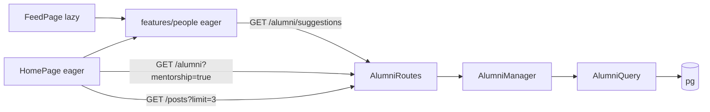
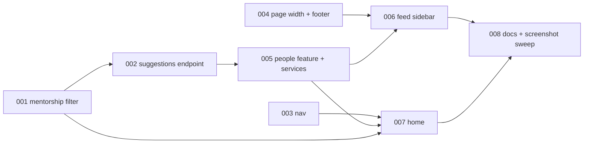

# Navigation, social Home and Feed "Suggested alumni" sidebar — Architecture

| Field | Value |
|---|---|
| REQ | REQ-016 |
| Status | drafting |
| Created | 2026-10-08 |
| Related ADRs | [[adr-01-ui-layer-headless-css-modules]], [[adr-02-server-state-tanstack-query]], [[adr-08-route-code-splitting-and-url-list-state]] (no new ADR) |

## Summary

Two small backend additions (a `mentorship` filter on `GET /api/alumni`, and `GET /api/alumni/suggestions`), a nav change (Home added, Profile tab replaces Account), a new eager frontend feature `features/people` holding the one "suggested alumni" component shared by Home and the lazy Feed, a Feed two-column layout, a rewritten Home, and one shared page-width rule so the footer lines up with the page.

## Blast radius

| Path | Why touched | Risk |
|---|---|---|
| `backend/src/businessLogic/src/validation.ts` (+test) | parse `mentorship` (only `true`; empty = absent; else 400) | low |
| `backend/src/dal/dto/AlumniSearchDTO.ts`, `dal/query/AlumniQuery.ts` (+test) | `mentorship` condition; `suggestAlumni(userId, limit)` ranked query | medium |
| `backend/src/businessLogic/src/AlumniManager.ts` (+test) | `suggestAlumni(userId)` | low |
| `backend/src/api/controllers/AlumniController.ts`, `routes/AlumniRoutes.ts` (+ route/guard tests) | `GET /suggestions`, registered **before** `/:id` | low |
| `shared/src/types/alumni.types.ts` | doc `mentorship` param; `SuggestedAlumni` = `AlumniListItem[]` | low |
| `frontend/src/app/AppShell/{navItems.tsx,NavIcons.tsx,MainNav.tsx,BottomTabs.tsx}` (+tests, README) | Home link (`end`), Profile tab, no Account tab | medium |
| `frontend/src/app/AppShell/{AppShell.module.css,SiteFooter.module.css}` | one shared `--page-max`; footer uses it | medium |
| `frontend/src/services/alumniApi.ts` (+test) | `mentorship` param, `getSuggestedAlumni()` | low |
| `frontend/src/config/queryKeys.ts` | `SUGGESTIONS` key lives under `ALUMNI_QUERY_ROOT`; no new root | low |
| `frontend/src/features/people/**` (new, eager) | `PersonRow`, `SuggestedAlumni` (list + states), `useSuggestedAlumni`, README | medium |
| `frontend/src/features/feed/{FeedPage.tsx,FeedPage.module.css,FeedPage.test.tsx}` | sidebar, gated by `useWideScreen()` | medium |
| `frontend/src/features/home/**` | rewrite: completeness, latest posts, mentors, suggestions | high |
| `frontend/src/features/{directory,profile}/*.module.css` | only if needed to align with `--page-max` | low |
| `frontend/**/README.md`, root `CLAUDE.md`, `.adlc/context/conventions-api.md` | nav lists, new endpoint, new folder (L-REQ-010-5) | low |

No migration. No new dependency.

## Approach

**Backend.** `mentorship=true` adds `a.mentorship_available = true` to the same condition builder as the other filters (bound constants, no request text in SQL). `GET /api/alumni/suggestions` (any signed-in role, userId from the token) runs one parameterized statement: a CTE reads the caller's department (alumni, else students) and university; the main select excludes the caller (`a.user_id <> $1`), orders by "same department" desc, "same university" desc, then `u.name, a.id`, `LIMIT 5`. Each "same" test is wrapped as `COALESCE(lower(a.department) = lower(me.department), false)` so a missing value is false, not NULL (Postgres sorts NULL first under DESC, which would put people with no department ahead of real department-mates; ADV-001). It returns a bare array of `AlumniListItem`. Cases are compared with `lower()` like the directory filters. Null department/university never match (a plain `=` on NULL is not true).

**Nav.** `NavItem` gains `end?: true` (Home, so `/` is not current everywhere) and `own?: true` (the Profile tab). `BottomTabs` resolves an `own` item to `/alumni/<alumni_id>` from `useCurrentUser()`, or `/me` when there is none (A1). `HEADER_NAV_ITEMS` = Home, Directory, Feed, Admin; `TAB_NAV_ITEMS` = Home, Directory, Feed, Profile, Admin. The avatar menu is unchanged.

**Shared people feature.** `features/people` is **not** in `LAZY_FEATURES`, so eager Home and lazy Feed both import it (L-REQ-008-6: it gets a decided shared home instead of a copy). `PersonRow` (avatar, name, "role, company", `Tag` Mentor, whole row a link via `profilePath`) is used by Suggested alumni and Mentors available. `SuggestedAlumni` owns its loading/empty/error(+Retry) states and the query (`useSuggestedAlumni`, key `[ALUMNI_QUERY_ROOT,'suggestions']`, so admin deletes and profile edits that invalidate the `alumni` root refresh it (ADV-004), no paging). It does not reuse `AlumniCard` (that is a directory card carrying directory router state and a different layout).

**Home.** Sections are independent components, each with its own query and states. Completeness is pure client logic (`profileCompleteness.ts`) over `['me']`, with an explicit field list per account type: **alumni** = photo, headline, job title, company, department, graduation year, bio; **student** (has a `students` row) = photo, job title, company, department, expected graduation year, bio (headline and mentorship are alumni-only, so students are never asked for them; `UpdateMyProfileInput` lets students edit the rest). No alumni or student row: no card (ADV-003). "Latest from the feed" uses its own small query `listPosts({limit:3})` under `[FEED_QUERY_ROOT,'latest']` with `refetchOnMount: 'always'` (feed writes use exact keys and would not refresh it; ADV-004) and a compact preview (avatar, name link, relative time, clamped caption). **Deviation from the spec wording "reuse the feed's post data and author line":** `PostCard`/`Byline` live in the lazy Feed, and importing them would pull the Feed chunk into the main bundle (ADR-08). The preview reuses `Avatar`, `relativeTime` and `profilePath` instead. Mentors uses `searchAlumni({mentorship:true, pageSize:5})`, drops the caller's own alumni id and shows up to 4.

**Feed.** `FeedPage` becomes a grid at 48rem+: feed column plus a 20rem sidebar; the sidebar is rendered only when `useWideScreen()` is true, so phones make no request.

**Width and footer.** AppShell defines `--page-max: 72rem` (the directory's existing cap). Home, Directory, Feed (grid) and the footer's inner box all use `min(100%, var(--page-max))`, centred, with the shell's own gutters. Profile (53.75rem, centred today) is widened to `--page-max` so its edges match the footer (the spec requires it; ADV-002) — the user confirms this at the gate; Account settings and About keep their caps and are not in the footer-alignment criterion. TASK-004 measures Home, Directory and Profile; Feed is measured in TASK-006 after its grid exists. Feed's post column becomes flexible within the grid instead of a fixed 40rem (S4's 640px column no longer applies once a sidebar exists).

## Task DAG

### Tier 0
- `TASK-001` mentorship filter (backend + shared + service param)
- `TASK-003` nav (Home, Profile tab)
- `TASK-004` shared page width + footer
### Tier 1
- `TASK-002` suggestions endpoint — depends on TASK-001 (same files)
### Tier 2
- `TASK-005` people feature, service, query key — depends on TASK-002
### Tier 3
- `TASK-006` feed sidebar — depends on TASK-004, TASK-005
- `TASK-007` home rewrite + copy fix — depends on TASK-001, TASK-003, TASK-005
### Tier 4
- `TASK-008` docs/READMEs, full checks, screenshots (home, feed, phone tab bar × desktop/phone × light/dark), difference list and fixes — depends on TASK-006, TASK-007

## Test strategy

- Backend: `validation.test.ts` (mentorship: empty, `true`, `false`, junk, repeated); `AlumniQuery.test.ts` (SQL text has the mentorship condition with a bound value; suggestion SQL excludes caller, orders dept > university > name,id, LIMIT 5, all values bound); `AlumniManager.test.ts`; `routes.test.ts` + `routeGuard` (401 without token, `/suggestions` not captured by `/:id`).
- Frontend: `navItems`/`AppShell.test.tsx` (order, Home current only on `/`, Profile → `/alumni/<id>`, → `/me` without a profile, no Account); `people/*.test.tsx` (row fields, Mentor tag, link, states, Retry); `FeedPage.test.tsx` (sidebar at wide, absent and no request on phone, feed unaffected); `Home*.test.tsx` per section (loading/empty/error/data, one section failing leaves the rest); `profileCompleteness.test.ts`; `alumniApi.test.ts`; `SiteFooter.test.tsx`; `lazyRoutes.test.ts` stays green.
- Runtime: screenshot matrix in TASK-008 (also the ui-reviewer at /review).

## Convention alignment

Layers kept (route → controller → Manager → Query); parameterized SQL only in `dal`; TanStack Query for server data (ADR-02); CSS Modules on tokens only (ADR-01); no new lazy feature, lazy boundaries intact (ADR-08); typed props from `@alumni/shared`; no API calls in `components/ui`. Deviation: Home's post preview is not `PostCard`/`Byline` (reason above).

## Risks

- `/suggestions` after `/:id` would be read as an id (400/404): route order test pins it.
- Raising Feed to `--page-max` changes S4's 640px column: checked in screenshots; main column capped at 40rem inside the grid if it looks too wide.
- Students have no `alumni` row: suggestions still work (caller excluded by `user_id`); their department comes from `students`.
- Mentors and Suggested alumni on Home may show the same person twice (independent queries, different orders); accepted for now. Mentors asks for 5 and drops the caller, so it always has 4 when 4 mentors exist.
- The copy fix is scoped to `packages/`, root docs and `.adlc/context`; the design bundle (`docs/design/*.dc.html`), archived review packets and this REQ's own text are left alone (ADV-005).
- Completeness on accounts with no alumni/student row: card hidden (nothing to fill in).

## Adversary pass (full)

Report: `architecture-adversary.md`. 6 findings survived; how each was handled:

| ID | Severity | Handling |
|---|---|---|
| ADV-001 | critical | Fixed: NULL-safe ordering, plus a DB-free test that asserts the `COALESCE` text and a manager test with null department rows |
| ADV-002 | major | Fixed in plan: Profile widened to `--page-max`; **needs your confirmation** (design change to a detail page) |
| ADV-003 | major | Fixed: per-role field table above, student test required |
| ADV-004 | major | Fixed: suggestions under the `alumni` root; latest posts `refetchOnMount: 'always'` under the `feed` root |
| ADV-005 | minor | Accepted: copy criterion scoped (spec wording clarified) |
| ADV-006 | minor | Accepted + Risks line corrected |

## Open questions

- None blocking. A1 (Profile tab → `/me` without a profile) and A2 (field list) are built as the spec states.
