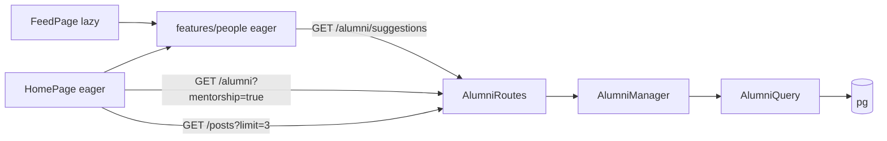
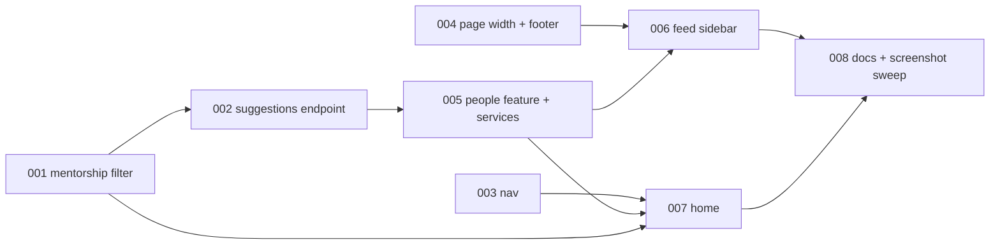

# REQ-016-nav-home-feed-sidebar — Review Packet

`Packet: 336KB · 57 files changed · excluded: .adlc/** records, lockfiles, all README.md and CLAUDE.md (docs; reflector reads them directly)`

This packet contains the diff with full file context, the REQ spec, and the REQ architecture. **Do not re-read these via Read — cite this packet.**

**Your own required reading is not a packet gap.** `context/conventions.md`, the vault (lessons, gotchas, ADRs, concepts), and any source file outside the diff that this change interacts with are your mandate. Read them freely; do not report them.

**`Packet-gap` means the packet's own contents fell short** — add `**Packet-gap:** <path> — <why>` only then.

Notes: base is the `redesign` branch. The user decided at the implement gate that the profile photo is NOT counted in the completeness card (no upload endpoint). Home's post preview deliberately does not reuse feed PostCard/Byline (ADR-08; confirmed at the architect gate), and Profile is widened to --page-max (confirmed). Known open items: Byline avatar underline (pre-existing, REQ-009).

## Diff with full context (vs redesign)

```diff
diff --git a/packages/backend/src/api/controllers/AlumniController.ts b/packages/backend/src/api/controllers/AlumniController.ts
index 645df220..6a65ef05 100644
--- a/packages/backend/src/api/controllers/AlumniController.ts
+++ b/packages/backend/src/api/controllers/AlumniController.ts
@@ -1,42 +1,51 @@
 import { Request, Response } from "express";
 import { AlumniManager } from "@alumni/businesslogic";
 import { sendError } from "./sendError";
 
 const alumniManager = new AlumniManager();
 
 // The profile always belongs to the signed-in user; a user_id in the body is ignored.
 export const createAlumni = async (req: Request, res: Response) => {
   try {
     const newAlumni = await alumniManager.createAlumni(Number(req.user.sub), req.body ?? {});
     res.status(201).json(newAlumni);
   } catch (error) {
     sendError(res, error);
   }
 };
 
 // Searched, filtered, paged directory list: 200 { items, total }. Bad query input is a 400.
 export const searchAlumni = async (req: Request, res: Response) => {
   try {
     res.status(200).json(await alumniManager.searchAlumni(req.query));
   } catch (error) {
     sendError(res, error);
   }
 };
 
+// Up to 5 other alumni for the signed-in user (any role): 200 with a bare array, [] when none.
+export const suggestAlumni = async (req: Request, res: Response) => {
+  try {
+    res.status(200).json(await alumniManager.suggestAlumni(Number(req.user.sub)));
+  } catch (error) {
+    sendError(res, error);
+  }
+};
+
 export const findAlumniById = async (req: Request, res: Response) => {
   try {
     res.status(200).json(await alumniManager.findAlumniById(req.params.id));
   } catch (error) {
     sendError(res, error);
   }
 };
 
 // Owner-only (requires authMiddleware): edits the caller's own alumni row.
 export const updateAlumni = async (req: Request, res: Response) => {
   try {
     const updated = await alumniManager.updateOwnAlumni(Number(req.user.sub), req.params.id, req.body ?? {});
     res.status(200).json(updated);
   } catch (error) {
     sendError(res, error);
   }
 };
diff --git a/packages/backend/src/api/routes/AlumniRoutes.ts b/packages/backend/src/api/routes/AlumniRoutes.ts
index 76bdcfb9..feb30840 100644
--- a/packages/backend/src/api/routes/AlumniRoutes.ts
+++ b/packages/backend/src/api/routes/AlumniRoutes.ts
@@ -1,20 +1,23 @@
 import { Router } from "express";
 import {
   createAlumni,
   searchAlumni,
+  suggestAlumni,
   findAlumniById,
   updateAlumni,
 } from "../controllers/AlumniController";
 import { authMiddleware } from "../Middleware/authMIddleware";
 import { requireRole } from "../Middleware/roleMiddleware";
 
 const router = Router();
 
 // Every route here needs a signed-in user. Only alumni may create (their own) profile.
 router.use(authMiddleware);
 router.post("/", requireRole("alumni"), createAlumni);
 router.get("/", searchAlumni);
+// Must stay above "/:id", or "suggestions" would be read as an alumni id.
+router.get("/suggestions", suggestAlumni);
 router.get("/:id", findAlumniById);
 router.put("/:id", updateAlumni);
 
 export default router;
diff --git a/packages/backend/src/api/routes/routeGuard.test.ts b/packages/backend/src/api/routes/routeGuard.test.ts
index 2285a7d6..0e14526d 100644
--- a/packages/backend/src/api/routes/routeGuard.test.ts
+++ b/packages/backend/src/api/routes/routeGuard.test.ts
@@ -1,37 +1,38 @@
 import request from 'supertest';
 import { describe, expect, it } from 'vitest';
 import app from '../app';
 import { guardedRoutes, listRoutes, PUBLIC_ROUTES, toRequest, topLevelStack } from '../test/routeList';
 
 // AC12: list every route registered on the Express app and prove that each one outside
 // the public allowlist rejects a request with no token. The walker lives in
 // ../test/routeList.ts; the count and known-route checks make an Express upgrade fail loudly.
 
 // Top-level middleware app.ts installs on purpose. Anything else at the top level
 // (a new app.use(handler), express.static, a sub-app) can't be probed, so it fails.
 const KNOWN_TOP_LEVEL_MIDDLEWARE = new Set(['query', 'expressInit', 'corsMiddleware', 'jsonParser']);
 
 const ALL_ROUTES = listRoutes(app);
 const GUARDED = guardedRoutes(app);
 
 describe('route guard', () => {
   it('finds every route (walker sanity check)', () => {
     expect(ALL_ROUTES.length).toBeGreaterThanOrEqual(23);
     expect(ALL_ROUTES).toContain('DELETE /api/comments/:id');
     expect(ALL_ROUTES).toContain('PUT /api/comments/:id');
+    expect(ALL_ROUTES).toContain('GET /api/alumni/suggestions');
     for (const route of PUBLIC_ROUTES) expect(ALL_ROUTES).toContain(route);
   });
 
   it('has only known middleware, routes and mounted routers at the top level', () => {
     const unknown = topLevelStack(app)
       .filter((l) => !l.route && l.name !== 'router' && !KNOWN_TOP_LEVEL_MIDDLEWARE.has(l.name))
       .map((l) => l.name);
     expect(unknown).toEqual([]);
   });
 
   it.each(GUARDED)('%s → 401 without a token', async (route) => {
     const { method, url } = toRequest(route);
     const res = await request(app)[method](url);
     expect(res.status).toBe(401);
   });
 });
diff --git a/packages/backend/src/api/routes/routes.test.ts b/packages/backend/src/api/routes/routes.test.ts
index 40185633..6cae0f78 100644
--- a/packages/backend/src/api/routes/routes.test.ts
+++ b/packages/backend/src/api/routes/routes.test.ts
@@ -1,732 +1,782 @@
 import type { NextFunction, Request, Response } from 'express';
 import request from 'supertest';
 import { beforeEach, describe, expect, it, vi } from 'vitest';
 import {
   AlumniManager,
   AppError,
   CommentManager,
   PostManager,
   UserManager,
 } from '@alumni/businesslogic';
 import app from '../app';
 import { requireRole } from '../Middleware/roleMiddleware';
 import { badSignatureToken, bearer, expiredToken, tokenFor } from '../test/authHelpers';
 import { guardedRoutes, toRequest, type RouteMethod } from '../test/routeList';
 
 // Managers become fakes: every async method is a vi.fn(), while the pure validate* methods
 // stay real so controllers that validate before calling the manager behave as in production.
 // AppError is the real class, so `instanceof AppError` in the controllers still works.
 vi.mock('@alumni/businesslogic', async (importOriginal) => {
   const actual = await importOriginal<typeof import('@alumni/businesslogic')>();
   function fake<T extends { prototype: object }>(Real: T): T {
     class Fake {}
     for (const name of Object.getOwnPropertyNames(Real.prototype)) {
       if (name === 'constructor') continue;
       const real = (Real.prototype as Record<string, unknown>)[name];
       (Fake.prototype as Record<string, unknown>)[name] = name.startsWith('validate')
         ? real
         : vi.fn();
     }
     return Fake as unknown as T;
   }
   return {
     ...actual,
     UserManager: fake(actual.UserManager),
     AlumniManager: fake(actual.AlumniManager),
     PostManager: fake(actual.PostManager),
     CommentManager: fake(actual.CommentManager),
   };
 });
 
 type Method = RouteMethod;
 interface Route {
   method: Method;
   path: string;
 }
 
 const STUDENT = { sub: 7, role: 'student' };
 const ALUMNI = { sub: 8, role: 'alumni' };
 const ADMIN = { sub: 1, role: 'admin' };
 
 // A user row shaped like UserQuery's PUBLIC_USER_COLUMNS (no password).
 const PUBLIC_USER = {
   id: 7,
   name: 'Sam Student',
   email: 'sam@example.com',
   role: 'student',
   photo_url: null,
   university: null,
   created_at: '2026-10-05T00:00:00.000Z',
 };
 
 // Every route outside the public allowlist, read from the app itself (../test/routeList.ts),
 // so a new route is covered here without editing a list. Path params are filled with 1.
 const PROTECTED: Route[] = guardedRoutes(app).map((r) => {
   const { method, url } = toRequest(r);
   return { method, path: url };
 });
 
 const REMOVED: Route[] = [
   { method: 'get', path: '/api/users/email/sam@example.com' },
   { method: 'put', path: '/api/users/1/login' },
   { method: 'put', path: '/api/users/1/logout' },
   { method: 'get', path: '/api/alumni/email/sam@example.com' },
 ];
 
 function call(route: Route, token?: string, body: object = {}) {
   const req = request(app)[route.method](route.path);
   if (token) req.set('Authorization', bearer(token));
   return route.method === 'get' || route.method === 'delete' ? req : req.send(body);
 }
 
 const label = (r: Route) => `${r.method.toUpperCase()} ${r.path}`;
 
 beforeEach(() => {
   // Every test starts with fresh fakes: no return values or calls left over from another test.
   vi.resetAllMocks();
 });
 
 // "No token → 401" for every route is routeGuard.test.ts's job; this block covers bad tokens.
 describe('AC2: every non-public route needs a valid token', () => {
   it('derives the protected routes from the app', () => {
     expect(PROTECTED.length).toBeGreaterThanOrEqual(20);
     expect(PROTECTED).toContainEqual({ method: 'put', path: '/api/me/password' });
     expect(PROTECTED).not.toContainEqual({ method: 'get', path: '/api/health' });
   });
 
   describe.each(PROTECTED.map((r) => [label(r), r] as const))('%s', (_name, route) => {
     it('expired token → 401', async () => {
       expect((await call(route, expiredToken())).status).toBe(401);
     });
 
     it('bad signature → 401', async () => {
       expect((await call(route, badSignatureToken())).status).toBe(401);
     });
 
     it('header without a token → 401', async () => {
       const res = await request(app)[route.method](route.path).set('Authorization', 'Bearer');
       expect(res.status).toBe(401);
     });
   });
 });
 
 describe('AC1: public routes work without a token', () => {
   it('GET /api/health → 200', async () => {
     expect((await request(app).get('/api/health')).status).toBe(200);
   });
 
   it('POST /api/auth/login → 200 with a token', async () => {
     vi.mocked(UserManager.prototype.verifyLogin).mockResolvedValue(PUBLIC_USER as never);
 
     const res = await request(app)
       .post('/api/auth/login')
       .send({ email: PUBLIC_USER.email, password: 'correct horse' });
 
     expect(res.status).toBe(200);
     expect(Object.keys(res.body)).toEqual(['token']);
     expect(typeof res.body.token).toBe('string');
   });
 
   it('POST /api/auth/login with a wrong email or password → 401 "Invalid"', async () => {
     vi.mocked(UserManager.prototype.verifyLogin).mockResolvedValue(null);
 
     const res = await request(app)
       .post('/api/auth/login')
       .send({ email: PUBLIC_USER.email, password: 'wrong horse' });
 
     expect(res.status).toBe(401);
     expect(res.body).toEqual({ message: 'Invalid' });
   });
 
   it('POST /api/auth/login when the database fails → 500 without the raw error text', async () => {
     vi.mocked(UserManager.prototype.verifyLogin).mockRejectedValue(
       new Error('pg: connection refused'),
     );
 
     const res = await request(app)
       .post('/api/auth/login')
       .send({ email: PUBLIC_USER.email, password: 'correct horse' });
 
     expect(res.status).toBe(500);
     expect(res.body).toEqual({ message: 'Something went wrong' });
     expect(res.text).not.toContain('pg');
   });
 
   it('POST /api/auth/register → 201', async () => {
     vi.mocked(UserManager.prototype.register).mockResolvedValue(PUBLIC_USER as never);
 
     const res = await request(app).post('/api/auth/register').send({
       name: 'Sam Student',
       email: 'sam@example.com',
       password: 'a-long-enough-password-1',
       role: 'alumni',
       university: 'Example University',
     });
 
     expect(res.status).toBe(201);
     expect(res.body.user).not.toHaveProperty('password');
   });
 });
 
 describe('AC3: admin-only routes', () => {
   const VALID_NEW_USER = {
     name: 'New Admin',
     email: 'new-admin@example.com',
     password: 'a-long-enough-password-1',
     role: 'admin',
   };
   const ADMIN_ONLY: Array<[string, Route, object]> = [
     ['GET /api/users', { method: 'get', path: '/api/users' }, {}],
     ['POST /api/users', { method: 'post', path: '/api/users' }, VALID_NEW_USER],
     ['DELETE /api/users/1', { method: 'delete', path: '/api/users/1' }, {}],
   ];
 
   beforeEach(() => {
     vi.mocked(UserManager.prototype.getAllUsers).mockResolvedValue([PUBLIC_USER] as never);
     vi.mocked(UserManager.prototype.createUser).mockResolvedValue(PUBLIC_USER as never);
     vi.mocked(UserManager.prototype.deleteUser).mockResolvedValue(undefined as never);
   });
 
   describe.each(ADMIN_ONLY)('%s', (_name, route, body) => {
     it('student → 403', async () => {
       expect((await call(route, tokenFor(STUDENT), body)).status).toBe(403);
     });
 
     it('alumni → 403', async () => {
       expect((await call(route, tokenFor(ALUMNI), body)).status).toBe(403);
     });
 
     it('admin → 2xx', async () => {
       const res = await call(route, tokenFor(ADMIN), body);
       expect(res.status).toBeGreaterThanOrEqual(200);
       expect(res.status).toBeLessThan(300);
     });
   });
 
   it('a 403 from requireRole never reaches the manager', async () => {
     await call({ method: 'delete', path: '/api/users/1' }, tokenFor(STUDENT));
     expect(UserManager.prototype.deleteUser).not.toHaveBeenCalled();
   });
 
   it('AC8b: POST /api/users with a bad role → 400 for an admin', async () => {
     const res = await call(
       { method: 'post', path: '/api/users' },
       tokenFor(ADMIN),
       { ...VALID_NEW_USER, role: 'superuser' },
     );
     expect(res.status).toBe(400);
     expect(UserManager.prototype.createUser).not.toHaveBeenCalled();
   });
 });
 
 describe('routes any signed-in user may call', () => {
   const ANY_USER: Route[] = [
     { method: 'get', path: '/api/users/1' },
     { method: 'get', path: '/api/alumni' },
+    { method: 'get', path: '/api/alumni/suggestions' },
     { method: 'get', path: '/api/alumni/1' },
     { method: 'get', path: '/api/posts' },
     { method: 'post', path: '/api/posts' },
     { method: 'get', path: '/api/posts/user/1' },
     { method: 'get', path: '/api/posts/1/comments' },
     { method: 'post', path: '/api/posts/1/comments' },
     { method: 'get', path: '/api/me' },
     { method: 'put', path: '/api/me' },
     { method: 'put', path: '/api/me/password' },
   ];
 
   beforeEach(() => {
     vi.mocked(UserManager.prototype.findUserById).mockResolvedValue(PUBLIC_USER as never);
     vi.mocked(AlumniManager.prototype.searchAlumni).mockResolvedValue({ items: [], total: 0 } as never);
     vi.mocked(AlumniManager.prototype.findAlumniById).mockResolvedValue({ id: 1 } as never);
+    vi.mocked(AlumniManager.prototype.suggestAlumni).mockResolvedValue([] as never);
     vi.mocked(PostManager.prototype.getAllPosts).mockResolvedValue([] as never);
     vi.mocked(PostManager.prototype.createNewPost).mockResolvedValue({ id: 1 } as never);
     vi.mocked(PostManager.prototype.getPostsByUserId).mockResolvedValue([] as never);
     vi.mocked(CommentManager.prototype.getCommentsForPost).mockResolvedValue([] as never);
     vi.mocked(CommentManager.prototype.addComment).mockResolvedValue({ id: 1 } as never);
     vi.mocked(UserManager.prototype.getMe).mockResolvedValue({ id: 7 } as never);
     vi.mocked(UserManager.prototype.updateMe).mockResolvedValue({ id: 7 } as never);
     vi.mocked(UserManager.prototype.changeMyPassword).mockResolvedValue(undefined);
   });
 
   it.each(ANY_USER.map((r) => [label(r), r] as const))('%s → 2xx for a student', async (_n, route) => {
     const res = await call(route, tokenFor(STUDENT));
     expect(res.status).toBeGreaterThanOrEqual(200);
     expect(res.status).toBeLessThan(300);
   });
 
   // Routes that act as the caller must pass the token's sub (7), never an id from the body.
   const BODY = { user_id: 999, id: 999, caption: 'hi', content: 'hi', name: 'Sam' };
   const IDENTITY: Array<[string, Route, () => ReturnType<typeof vi.fn>, unknown[]]> = [
     ['POST /api/posts', { method: 'post', path: '/api/posts' }, () => vi.mocked(PostManager.prototype.createNewPost), [STUDENT.sub, BODY]],
     ['POST /api/posts/1/comments', { method: 'post', path: '/api/posts/1/comments' }, () => vi.mocked(CommentManager.prototype.addComment), [STUDENT.sub, '1', BODY]],
+    ['GET /api/alumni/suggestions', { method: 'get', path: '/api/alumni/suggestions' }, () => vi.mocked(AlumniManager.prototype.suggestAlumni), [STUDENT.sub]],
     ['GET /api/me', { method: 'get', path: '/api/me' }, () => vi.mocked(UserManager.prototype.getMe), [STUDENT.sub]],
     ['PUT /api/me', { method: 'put', path: '/api/me' }, () => vi.mocked(UserManager.prototype.updateMe), [STUDENT.sub, BODY]],
     ['PUT /api/me/password', { method: 'put', path: '/api/me/password' }, () => vi.mocked(UserManager.prototype.changeMyPassword), [STUDENT.sub, BODY]],
   ];
 
   it.each(IDENTITY)('%s hands the manager the token’s user id', async (_n, route, manager, args) => {
     await call(route, tokenFor(STUDENT), BODY);
     expect(manager()).toHaveBeenCalledTimes(1);
     expect(manager()).toHaveBeenCalledWith(...args);
   });
 });
 
 describe('GET /api/alumni: search, filters and paging', () => {
   const route: Route = { method: 'get', path: '/api/alumni' };
 
   it('200 with the manager’s { items, total } as the body', async () => {
     const page = { items: [{ id: 1, name: 'Ana' }], total: 41 };
     vi.mocked(AlumniManager.prototype.searchAlumni).mockResolvedValue(page as never);
     const res = await call(route, tokenFor(STUDENT));
     expect(res.status).toBe(200);
     expect(res.body).toEqual(page);
   });
 
   it('hands the raw query string to the manager', async () => {
     vi.mocked(AlumniManager.prototype.searchAlumni).mockResolvedValue({ items: [], total: 0 } as never);
     await call({ method: 'get', path: '/api/alumni?q=Ana%20B&department=CSE&page=2&pageSize=10' }, tokenFor(STUDENT));
     expect(AlumniManager.prototype.searchAlumni).toHaveBeenCalledTimes(1);
     expect(AlumniManager.prototype.searchAlumni).toHaveBeenCalledWith({
       q: 'Ana B',
       department: 'CSE',
       page: '2',
       pageSize: '10',
     });
   });
 
   it('hands sort and order to the manager as they came', async () => {
     vi.mocked(AlumniManager.prototype.searchAlumni).mockResolvedValue({ items: [], total: 0 } as never);
     await call({ method: 'get', path: '/api/alumni?sort=graduationYear&order=desc' }, tokenFor(STUDENT));
     expect(AlumniManager.prototype.searchAlumni).toHaveBeenCalledWith({ sort: 'graduationYear', order: 'desc' });
   });
 
+  it('hands mentorship to the manager as it came (REQ-016)', async () => {
+    vi.mocked(AlumniManager.prototype.searchAlumni).mockResolvedValue({ items: [], total: 0 } as never);
+    await call({ method: 'get', path: '/api/alumni?mentorship=true&pageSize=5' }, tokenFor(STUDENT));
+    expect(AlumniManager.prototype.searchAlumni).toHaveBeenCalledWith({ mentorship: 'true', pageSize: '5' });
+  });
+
+  it('a bad mentorship value → 400 { message }', async () => {
+    vi.mocked(AlumniManager.prototype.searchAlumni).mockRejectedValue(new AppError(400, 'mentorship must be true'));
+    const res = await call({ method: 'get', path: '/api/alumni?mentorship=false' }, tokenFor(STUDENT));
+    expect(res.status).toBe(400);
+    expect(res.body).toEqual({ message: 'mentorship must be true' });
+  });
+
   it('an invalid sort → 400 { message: "Invalid sort" }', async () => {
     vi.mocked(AlumniManager.prototype.searchAlumni).mockRejectedValue(new AppError(400, 'Invalid sort'));
     const res = await call({ method: 'get', path: '/api/alumni?sort=email' }, tokenFor(STUDENT));
     expect(res.status).toBe(400);
     expect(res.body).toEqual({ message: 'Invalid sort' });
   });
 
   it('manager AppError(400) → 400 { message }', async () => {
     vi.mocked(AlumniManager.prototype.searchAlumni).mockRejectedValue(
       new AppError(400, 'pageSize must be a whole number from 1 to 100'),
     );
     const res = await call({ method: 'get', path: '/api/alumni?pageSize=500' }, tokenFor(STUDENT));
     expect(res.status).toBe(400);
     expect(res.body).toEqual({ message: 'pageSize must be a whole number from 1 to 100' });
   });
 
   it('no token → 401 without calling the manager', async () => {
     const res = await call(route);
     expect(res.status).toBe(401);
     expect(AlumniManager.prototype.searchAlumni).not.toHaveBeenCalled();
   });
 });
 
+describe('GET /api/alumni/suggestions (REQ-016)', () => {
+  const route: Route = { method: 'get', path: '/api/alumni/suggestions' };
+
+  it('200 with the manager’s array as the body, for any role', async () => {
+    const rows = [{ id: 2, name: 'Ana' }, { id: 1, name: 'Bo' }];
+    vi.mocked(AlumniManager.prototype.suggestAlumni).mockResolvedValue(rows as never);
+    for (const user of [STUDENT, ALUMNI, ADMIN]) {
+      const res = await call(route, tokenFor(user));
+      expect(res.status).toBe(200);
+      expect(res.body).toEqual(rows);
+    }
+  });
+
+  it('an empty result is 200 []', async () => {
+    vi.mocked(AlumniManager.prototype.suggestAlumni).mockResolvedValue([] as never);
+    const res = await call(route, tokenFor(STUDENT));
+    expect(res.status).toBe(200);
+    expect(res.body).toEqual([]);
+  });
+
+  it('is not read as an alumni id (registered before /:id)', async () => {
+    vi.mocked(AlumniManager.prototype.suggestAlumni).mockResolvedValue([] as never);
+    await call(route, tokenFor(STUDENT));
+    expect(AlumniManager.prototype.suggestAlumni).toHaveBeenCalledWith(STUDENT.sub);
+    expect(AlumniManager.prototype.findAlumniById).not.toHaveBeenCalled();
+  });
+
+  it('no token → 401 without calling the manager', async () => {
+    const res = await call(route);
+    expect(res.status).toBe(401);
+    expect(AlumniManager.prototype.suggestAlumni).not.toHaveBeenCalled();
+  });
+});
+
 describe('owner-or-admin routes pass the manager’s decision through', () => {
   const OWNER: Array<[string, Route, () => ReturnType<typeof vi.fn>]> = [
     ['PUT /api/users/1', { method: 'put', path: '/api/users/1' }, () => vi.mocked(UserManager.prototype.updateOwnUser)],
     ['PUT /api/alumni/1', { method: 'put', path: '/api/alumni/1' }, () => vi.mocked(AlumniManager.prototype.updateOwnAlumni)],
     ['PUT /api/posts/1', { method: 'put', path: '/api/posts/1' }, () => vi.mocked(PostManager.prototype.updatePost)],
     ['DELETE /api/posts/1', { method: 'delete', path: '/api/posts/1' }, () => vi.mocked(PostManager.prototype.deletePost)],
     ['PUT /api/comments/1', { method: 'put', path: '/api/comments/1' }, () => vi.mocked(CommentManager.prototype.updateComment)],
     ['DELETE /api/comments/1', { method: 'delete', path: '/api/comments/1' }, () => vi.mocked(CommentManager.prototype.deleteComment)],
   ];
 
   describe.each(OWNER)('%s', (_name, route, manager) => {
     it('manager allows → 200', async () => {
       manager().mockResolvedValue({ id: 1 });
       expect((await call(route, tokenFor(STUDENT))).status).toBe(200);
     });
 
     it('manager says not yours → 403 (never 401)', async () => {
       manager().mockRejectedValue(new AppError(403, 'Forbidden'));
       expect((await call(route, tokenFor(STUDENT))).status).toBe(403);
     });
 
     it('manager says missing → 404', async () => {
       manager().mockRejectedValue(new AppError(404, 'Not found'));
       expect((await call(route, tokenFor(STUDENT))).status).toBe(404);
     });
   });
 
   it('PUT /api/comments/:id hands the manager the token’s id and role, the raw id and the body', async () => {
     vi.mocked(CommentManager.prototype.updateComment).mockResolvedValue({ id: 5, content: 'x' } as never);
 
     const res = await call({ method: 'put', path: '/api/comments/5' }, tokenFor(ADMIN), { content: 'x', user_id: 99 });
 
     expect(res.status).toBe(200);
     expect(res.body).toEqual({ id: 5, content: 'x' });
     expect(CommentManager.prototype.updateComment).toHaveBeenCalledWith(
       { id: ADMIN.sub, role: 'admin' },
       '5',
       { content: 'x', user_id: 99 },
     );
   });
 
   it('AC7: PUT/DELETE /api/posts/:id hand the manager the token’s id and role', async () => {
     vi.mocked(PostManager.prototype.updatePost).mockResolvedValue({ id: 1 } as never);
     vi.mocked(PostManager.prototype.deletePost).mockResolvedValue(undefined as never);
 
     await call({ method: 'put', path: '/api/posts/5' }, tokenFor(ADMIN), { caption: 'x' });
     await call({ method: 'delete', path: '/api/posts/5' }, tokenFor(STUDENT));
 
     expect(PostManager.prototype.updatePost).toHaveBeenCalledWith(
       { id: ADMIN.sub, role: 'admin' },
       '5',
       { caption: 'x' },
     );
     expect(PostManager.prototype.deletePost).toHaveBeenCalledWith(
       { id: STUDENT.sub, role: 'student' },
       '5',
     );
   });
 });
 
 describe('AC6: POST /api/alumni is for alumni users, for themselves', () => {
   const route: Route = { method: 'post', path: '/api/alumni' };
 
   it('student → 403', async () => {
     expect((await call(route, tokenFor(STUDENT))).status).toBe(403);
   });
 
   it('admin → 403', async () => {
     expect((await call(route, tokenFor(ADMIN))).status).toBe(403);
   });
 
   it('alumni → 201', async () => {
     vi.mocked(AlumniManager.prototype.createAlumni).mockResolvedValue({ id: 3 } as never);
     expect((await call(route, tokenFor(ALUMNI))).status).toBe(201);
   });
 
   it('alumni who already has a profile → 409', async () => {
     vi.mocked(AlumniManager.prototype.createAlumni).mockRejectedValue(
       new AppError(409, 'Profile already exists'),
     );
     expect((await call(route, tokenFor(ALUMNI))).status).toBe(409);
   });
 });
 
 describe('AC5/AC6: a user_id in the body is ignored', () => {
   it('POST /api/posts creates the post as the token’s user', async () => {
     vi.mocked(PostManager.prototype.createNewPost).mockResolvedValue({ id: 1 } as never);
 
     await call({ method: 'post', path: '/api/posts' }, tokenFor(STUDENT), {
       user_id: 999,
       caption: 'hello',
     });
 
     expect(PostManager.prototype.createNewPost).toHaveBeenCalledTimes(1);
     expect(vi.mocked(PostManager.prototype.createNewPost).mock.calls[0][0]).toBe(STUDENT.sub);
   });
 
   it('POST /api/alumni creates the profile for the token’s user', async () => {
     vi.mocked(AlumniManager.prototype.createAlumni).mockResolvedValue({ id: 3 } as never);
 
     await call({ method: 'post', path: '/api/alumni' }, tokenFor(ALUMNI), { user_id: 999 });
 
     expect(AlumniManager.prototype.createAlumni).toHaveBeenCalledTimes(1);
     expect(vi.mocked(AlumniManager.prototype.createAlumni).mock.calls[0][0]).toBe(ALUMNI.sub);
   });
 });
 
 describe('AC4: removed routes', () => {
   describe.each(REMOVED.map((r) => [label(r), r] as const))('%s', (_name, route) => {
     it('signed in → 404', async () => {
       expect((await call(route, tokenFor(ADMIN))).status).toBe(404);
     });
 
     it('no token → 401 (auth runs before routing)', async () => {
       expect((await call(route)).status).toBe(401);
     });
   });
 });
 
 describe('AC8: no password in /api/users responses', () => {
   it('GET /api/users', async () => {
     vi.mocked(UserManager.prototype.getAllUsers).mockResolvedValue([PUBLIC_USER] as never);
     const res = await call({ method: 'get', path: '/api/users' }, tokenFor(ADMIN));
     expect(res.status).toBe(200);
     for (const user of res.body) expect(user).not.toHaveProperty('password');
   });
 
   it('GET /api/users/:id', async () => {
     vi.mocked(UserManager.prototype.findUserById).mockResolvedValue(PUBLIC_USER as never);
     const res = await call({ method: 'get', path: '/api/users/7' }, tokenFor(STUDENT));
     expect(res.status).toBe(200);
     expect(res.body).not.toHaveProperty('password');
   });
 
   it('POST /api/users does not echo the password or its hash', async () => {
     vi.mocked(UserManager.prototype.createUser).mockResolvedValue(PUBLIC_USER as never);
     const res = await call({ method: 'post', path: '/api/users' }, tokenFor(ADMIN), {
       name: 'Sam Student',
       email: 'sam@example.com',
       password: 'a-long-enough-password-1',
       role: 'student',
     });
     expect(res.status).toBe(201);
     expect(res.body).not.toHaveProperty('password');
     expect(JSON.stringify(res.body)).not.toContain('a-long-enough-password-1');
   });
 });
 
 describe('AC9: requireRole without a signed-in user', () => {
   function run(user: Request['user'] | undefined) {
     const res = { status: vi.fn(), json: vi.fn() };
     res.status.mockReturnValue(res);
     const next = vi.fn() as unknown as NextFunction;
     requireRole('admin')({ user } as Request, res as unknown as Response, next);
     return { res, next };
   }
 
   it('no req.user → 401, does not throw, does not call next', () => {
     const { res, next } = run(undefined);
     expect(res.status).toHaveBeenCalledWith(401);
     expect(next).not.toHaveBeenCalled();
   });
 
   it('wrong role → 403', () => {
     const { res, next } = run({ sub: 7, role: 'student' });
     expect(res.status).toHaveBeenCalledWith(403);
     expect(next).not.toHaveBeenCalled();
   });
 
   it('right role → next()', () => {
     const { res, next } = run({ sub: 1, role: 'admin' });
     expect(res.status).not.toHaveBeenCalled();
     expect(next).toHaveBeenCalledTimes(1);
   });
 });
 
 describe('error bodies use { message } and never leak raw error text', () => {
   it('GET /api/users/:id: manager 404 → 404 { message }', async () => {
     vi.mocked(UserManager.prototype.findUserById).mockRejectedValue(new AppError(404, 'User not found'));
     const res = await call({ method: 'get', path: '/api/users/999' }, tokenFor(STUDENT));
     expect(res.status).toBe(404);
     expect(res.body).toEqual({ message: 'User not found' });
   });
 
   it('DELETE /api/users/:id: manager 404 → 404 { message }', async () => {
     vi.mocked(UserManager.prototype.deleteUser).mockRejectedValue(new AppError(404, 'User not found'));
     const res = await call({ method: 'delete', path: '/api/users/999' }, tokenFor(ADMIN));
     expect(res.status).toBe(404);
     expect(res.body).toEqual({ message: 'User not found' });
   });
 
   it.each([
     ['GET /api/users', { method: 'get', path: '/api/users' } as Route, () => vi.mocked(UserManager.prototype.getAllUsers), ADMIN],
     ['GET /api/users/1', { method: 'get', path: '/api/users/1' } as Route, () => vi.mocked(UserManager.prototype.findUserById), STUDENT],
     ['GET /api/alumni', { method: 'get', path: '/api/alumni' } as Route, () => vi.mocked(AlumniManager.prototype.searchAlumni), STUDENT],
     ['GET /api/alumni/1', { method: 'get', path: '/api/alumni/1' } as Route, () => vi.mocked(AlumniManager.prototype.findAlumniById), STUDENT],
   ])('%s: DB failure → 500 with a generic message', async (_n, route, manager, user) => {
     manager().mockRejectedValue(new Error('connection terminated unexpectedly'));
     const res = await call(route, tokenFor(user));
     expect(res.status).toBe(500);
     expect(res.body).toEqual({ message: 'Something went wrong' });
   });
 });
 
 // REQ-011: the real managers (validation, owner check) run behind the routes; only their query
 // objects are stubbed, so these tests show what reaches the DAL and what comes back to the client.
 describe('REQ-011: headline, location, degree, start year and mentorship through the routes', () => {
   const FIELDS = {
     headline: 'Product designer',
     location: 'Oslo, Norway',
     degree: 'B.Sc. Product Design',
     start_year: 2013,
     mentorship_available: true,
   };
   const ALUMNI_ROW = { id: 5, user_id: ALUMNI.sub, name: 'Ana', department: 'CSE', graduation_year: 2017, ...FIELDS };
   const MY_ROW = {
     user_id: ALUMNI.sub, name: 'Ana', email: 'ana@example.com', role: 'alumni',
     alumni_id: 5, has_alumni_profile: true, student_id: null, has_student_profile: false,
     department: 'CSE', graduation_year: 2017, ...FIELDS,
   };
   const BODY = {
     name: 'Ana', department: 'CSE', graduation_year: '2017',
     headline: '  Product designer  ', location: 'Oslo, Norway', degree: 'B.Sc. Product Design',
     start_year: '2013', mentorship_available: true,
   };
   // What validateAlumniFields hands the query for BODY (trimmed text; years stay text).
   const STORED = {
     department: 'CSE', graduation_year: '2017', headline: 'Product designer', location: 'Oslo, Norway',
     degree: 'B.Sc. Product Design', start_year: '2013', mentorship_available: true,
   };
 
   let alumniQuery: InstanceType<typeof AlumniManager>['alumniQuery'];
   let userQuery: InstanceType<typeof UserManager>['userQuery'];
 
   beforeEach(async () => {
     const actual = await vi.importActual<typeof import('@alumni/businesslogic')>('@alumni/businesslogic');
     const alumni = new actual.AlumniManager();
     const users = new actual.UserManager();
     alumniQuery = alumni.alumniQuery;
     userQuery = users.userQuery;
     vi.spyOn(alumniQuery, 'findAlumniById').mockResolvedValue(ALUMNI_ROW as never);
     vi.spyOn(alumniQuery, 'findAlumniByUserId').mockResolvedValue(undefined);
     vi.spyOn(alumniQuery, 'createAlumni').mockResolvedValue(ALUMNI_ROW as never);
     vi.spyOn(alumniQuery, 'updateAlumni').mockResolvedValue(ALUMNI_ROW as never);
     vi.spyOn(alumniQuery, 'searchAlumni').mockResolvedValue({ items: [ALUMNI_ROW], total: 1 } as never);
     vi.spyOn(userQuery, 'findMyProfile').mockResolvedValue(MY_ROW as never);
     vi.spyOn(userQuery, 'updateMyProfile').mockResolvedValue(MY_ROW as never);
     // The controllers hold the fake managers; send each call on to the real one.
     for (const name of ['findAlumniById', 'searchAlumni', 'createAlumni', 'updateOwnAlumni'] as const) {
       vi.mocked(AlumniManager.prototype[name]).mockImplementation(
         ((...args: never[]) => (alumni[name] as (...a: never[]) => unknown)(...args)) as never,
       );
     }
     for (const name of ['getMe', 'updateMe'] as const) {
       vi.mocked(UserManager.prototype[name]).mockImplementation(
         ((...args: never[]) => (users[name] as (...a: never[]) => unknown)(...args)) as never,
       );
     }
   });
 
   describe('AC2: responses carry the five fields, mentorship as a boolean', () => {
     it.each([
       ['GET /api/alumni/5', '/api/alumni/5', (b: Record<string, unknown>) => b],
       ['GET /api/alumni items', '/api/alumni', (b: { items: Record<string, unknown>[] }) => b.items[0]],
       ['GET /api/me', '/api/me', (b: Record<string, unknown>) => b],
     ] as const)('%s', async (_n, path, pick) => {
       const res = await call({ method: 'get', path }, tokenFor(ALUMNI));
       expect(res.status).toBe(200);
       const body = (pick as (b: never) => Record<string, unknown>)(res.body as never);
       expect(body).toMatchObject(FIELDS);
       expect(typeof body.mentorship_available).toBe('boolean');
     });
   });
 
   describe('AC3: writes pass the validated fields to the query', () => {
     it('PUT /api/me (alumni) → 200 and the alumni update gets the five fields', async () => {
       const res = await call({ method: 'put', path: '/api/me' }, tokenFor(ALUMNI), BODY);
       expect(res.status).toBe(200);
       expect(res.body).toMatchObject(FIELDS);
       const [userId, , alumniFields, , student] = vi.mocked(userQuery.updateMyProfile).mock.calls[0];
       expect(userId).toBe(ALUMNI.sub);
       expect(alumniFields).toMatchObject(STORED);
       expect(student).toBeUndefined();
     });
 
     it('PUT /api/me omitting mentorship_available stores false (full replace)', async () => {
       const { mentorship_available: _m, ...rest } = BODY;
       expect((await call({ method: 'put', path: '/api/me' }, tokenFor(ALUMNI), rest)).status).toBe(200);
       expect(vi.mocked(userQuery.updateMyProfile).mock.calls[0][2]?.mentorship_available).toBe(false);
     });
 
     it('PUT /api/alumni/5 by the owner → 200 with the five fields stored', async () => {
       const res = await call({ method: 'put', path: '/api/alumni/5' }, tokenFor(ALUMNI), BODY);
       expect(res.status).toBe(200);
       expect(res.body).toMatchObject(FIELDS);
       expect(alumniQuery.updateAlumni).toHaveBeenCalledWith(5, expect.objectContaining(STORED));
     });
 
     it('POST /api/alumni → 201, with the years as numbers on the DTO', async () => {
       const res = await call({ method: 'post', path: '/api/alumni' }, tokenFor(ALUMNI), { ...BODY, user_id: 999 });
       expect(res.status).toBe(201);
       expect(alumniQuery.createAlumni).toHaveBeenCalledWith(
         expect.objectContaining({ ...STORED, user_id: ALUMNI.sub, graduation_year: 2017, start_year: 2013 }),
       );
     });
   });
 
   describe('AC3–AC5: bad values → 400 { message } and nothing is written', () => {
     const BAD: Array<[string, Record<string, unknown>, RegExp]> = [
       ['headline over 120', { headline: 'x'.repeat(121) }, /^Headline/],
       ['location over 100', { location: 'x'.repeat(101) }, /^Location/],
       ['degree over 100', { degree: 'x'.repeat(101) }, /^Degree/],
       ['headline not text', { headline: 42 }, /^Headline/],
       ['start year not 4 digits', { start_year: '13' }, /^Start year/],
       ['start after graduation', { start_year: '2018' }, /^Graduation year/],
       ['mentorship as a string', { mentorship_available: 'true' }, /^Mentorship/],
       ['mentorship as a number', { mentorship_available: 1 }, /^Mentorship/],
       ['mentorship null', { mentorship_available: null }, /^Mentorship/],
     ];
     const WRITES: Array<[string, Route, () => unknown]> = [
       ['PUT /api/me', { method: 'put', path: '/api/me' }, () => userQuery.updateMyProfile],
       ['PUT /api/alumni/5', { method: 'put', path: '/api/alumni/5' }, () => alumniQuery.updateAlumni],
       ['POST /api/alumni', { method: 'post', path: '/api/alumni' }, () => alumniQuery.createAlumni],
     ];
 
     describe.each(WRITES)('%s', (_w, route, write) => {
       it.each(BAD)('%s', async (_b, patch, message) => {
         const res = await call(route, tokenFor(ALUMNI), { ...BODY, ...patch });
         expect(res.status).toBe(400);
         expect(res.body.message).toMatch(message);
         expect(write()).not.toHaveBeenCalled();
       });
     });
   });
 
   describe('AC6: only the owner may change the fields on PUT /api/alumni/:id', () => {
     const route: Route = { method: 'put', path: '/api/alumni/5' };
 
     it.each([
       ['another alumni', { sub: 99, role: 'alumni' }],
       ['a student', STUDENT],
       ['an admin', ADMIN],
     ])('%s → 403, row unchanged', async (_n, user) => {
       const res = await call(route, tokenFor(user), BODY);
       expect(res.status).toBe(403);
       expect(alumniQuery.updateAlumni).not.toHaveBeenCalled();
     });
 
     it('a guest → 401, row unchanged', async () => {
       expect((await call(route, undefined, BODY)).status).toBe(401);
       expect(alumniQuery.findAlumniById).not.toHaveBeenCalled();
       expect(alumniQuery.updateAlumni).not.toHaveBeenCalled();
     });
   });
 
   it('PUT /api/me for a student ignores the alumni-only fields, even invalid ones', async () => {
     vi.mocked(userQuery.findMyProfile).mockResolvedValue({
       ...MY_ROW, user_id: STUDENT.sub, role: 'student', alumni_id: null, has_alumni_profile: false,
       student_id: 3, has_student_profile: true,
     } as never);
     const res = await call({ method: 'put', path: '/api/me' }, tokenFor(STUDENT), {
       name: 'Sam', department: 'CSE', expected_graduation_year: '2028',
       headline: 'x'.repeat(500), start_year: 'soon', mentorship_available: 'yes',
     });
     expect(res.status).toBe(200);
     const [, , alumniFields, , student] = vi.mocked(userQuery.updateMyProfile).mock.calls[0];
     expect(alumniFields).toBeUndefined();
     for (const key of Object.keys(FIELDS)) expect(student).not.toHaveProperty(key);
   });
 });
 
 describe('BUG-001: POST /api/posts refuses a post without a caption', () => {
   let postQuery: InstanceType<typeof PostManager>['postQuery'];
 
   beforeEach(async () => {
     const actual = await vi.importActual<typeof import('@alumni/businesslogic')>('@alumni/businesslogic');
     const posts = new actual.PostManager();
     postQuery = posts.postQuery;
     vi.spyOn(postQuery, 'createPost').mockResolvedValue({ id: 1 } as never);
     // The controller holds the fake manager; send the call on to the real one.
     vi.mocked(PostManager.prototype.createNewPost).mockImplementation(
       (...args) => posts.createNewPost(...args),
     );
   });
 
   it.each([{}, { caption: '   ' }, { caption: null, media_url: '' }, { media_url: 'https://x.test/a.png' }])('%j → 400 and nothing is stored', async (body) => {
     const res = await call({ method: 'post', path: '/api/posts' }, tokenFor(STUDENT), body);
     expect(res.status).toBe(400);
     expect(res.body).toEqual({ message: 'A post needs a caption' });
     expect(postQuery.createPost).not.toHaveBeenCalled();
   });
 
   it('a caption alone → 201', async () => {
     const res = await call({ method: 'post', path: '/api/posts' }, tokenFor(STUDENT), { caption: 'hi' });
     expect(res.status).toBe(201);
     expect(postQuery.createPost).toHaveBeenCalledTimes(1);
   });
 
   it('a caption with media → 201', async () => {
     const res = await call({ method: 'post', path: '/api/posts' }, tokenFor(STUDENT), {
       caption: 'hi',
       media_url: 'https://x.test/a.png',
     });
     expect(res.status).toBe(201);
     expect(postQuery.createPost).toHaveBeenCalledTimes(1);
   });
 });
diff --git a/packages/backend/src/businessLogic/src/AlumniManager.test.ts b/packages/backend/src/businessLogic/src/AlumniManager.test.ts
index f807305e..cf3d5c60 100644
--- a/packages/backend/src/businessLogic/src/AlumniManager.test.ts
+++ b/packages/backend/src/businessLogic/src/AlumniManager.test.ts
@@ -1,265 +1,306 @@
 import { beforeEach, describe, expect, it, vi } from 'vitest';
 import { AlumniDTO, AlumniQuery } from '@alumni/dal';
-import { AlumniManager } from './AlumniManager.js';
+import { AlumniManager, SUGGESTION_LIMIT } from './AlumniManager.js';
 import { expectAppError } from '../../test/expectAppError';
 
 vi.mock('@alumni/dal', async (importOriginal) => {
   const actual = await importOriginal<typeof import('@alumni/dal')>();
   // Keep the real AlumniDTO (a plain class); fake only the query.
   return { ...actual, AlumniQuery: vi.fn(function (this: Record<string, unknown>) {
     this.findAlumniByUserId = vi.fn();
     this.createAlumni = vi.fn();
     this.findAlumniById = vi.fn();
     this.updateAlumni = vi.fn();
     this.searchAlumni = vi.fn();
+    this.suggestAlumni = vi.fn();
   }) };
 });
 
 describe('AlumniManager.createAlumni (POST /api/alumni)', () => {
   let manager: AlumniManager;
   let query: { findAlumniByUserId: ReturnType<typeof vi.fn>; createAlumni: ReturnType<typeof vi.fn> };
 
   beforeEach(() => {
     manager = new AlumniManager();
     query = manager.alumniQuery as unknown as typeof query;
     query.findAlumniByUserId.mockResolvedValue(undefined);
     query.createAlumni.mockImplementation(async (row) => ({ id: 10, ...row }));
   });
 
   it('creates the profile for the given user id and ignores user_id in the body', async () => {
     await manager.createAlumni(42, { user_id: 99, department: 'CSE', graduation_year: '2020' });
 
     expect(query.findAlumniByUserId).toHaveBeenCalledWith(42);
     const row = query.createAlumni.mock.calls[0][0];
     expect(row).toBeInstanceOf(AlumniDTO);
     expect(row.user_id).toBe(42);
     expect(row.department).toBe('CSE');
     expect(row.graduation_year).toBe(2020);
   });
 
   it('passes the five REQ-011 fields, years as numbers', async () => {
     await manager.createAlumni(42, {
       headline: ' Designer ',
       location: 'Oslo',
       degree: 'B.Sc.',
       start_year: '2013',
       graduation_year: '2017',
       mentorship_available: true,
     });
 
     expect(query.createAlumni.mock.calls[0][0]).toMatchObject({
       user_id: 42,
       headline: 'Designer',
       location: 'Oslo',
       degree: 'B.Sc.',
       start_year: 2013,
       graduation_year: 2017,
       mentorship_available: true,
     });
   });
 
   it('omitted REQ-011 fields are empty and mentorship_available is false', async () => {
     await manager.createAlumni(42, {});
 
     const row = query.createAlumni.mock.calls[0][0];
     expect(row).toMatchObject({ headline: undefined, location: undefined, degree: undefined, start_year: undefined });
     expect(row.mentorship_available).toBe(false);
   });
 
   it('returns 409 when the user already has a profile, without inserting', async () => {
     query.findAlumniByUserId.mockResolvedValue({ id: 3, user_id: 42 });
 
     await expectAppError(manager.createAlumni(42, {}), 409);
     expect(query.createAlumni).not.toHaveBeenCalled();
   });
 
   it('returns 409 when a concurrent create hits the unique user_id', async () => {
     query.createAlumni.mockRejectedValue(Object.assign(new Error('dup'), { code: '23505' }));
 
     await expectAppError(manager.createAlumni(42, {}), 409);
   });
 
   it.each([
     ['bad graduation year', { graduation_year: '20x0' }],
     ['non-http LinkedIn URL', { linkedin_url: 'javascript:alert(1)' }],
     ['department too long', { department: 'x'.repeat(101) }],
     ['headline too long', { headline: 'x'.repeat(121) }],
     ['start year after graduation', { start_year: '2018', graduation_year: '2017' }],
     ['mentorship_available as text', { mentorship_available: 'true' }],
   ])('returns 400 on %s, without inserting', async (_label, body) => {
     await expectAppError(manager.createAlumni(42, body), 400);
     expect(query.createAlumni).not.toHaveBeenCalled();
   });
 
   it('lets other database errors through unchanged', async () => {
     const boom = new Error('connection lost');
     query.createAlumni.mockRejectedValue(boom);
 
     await expect(manager.createAlumni(42, {})).rejects.toBe(boom);
   });
 });
 
 describe('AlumniManager.findAlumniById (GET /api/alumni/:id)', () => {
   let manager: AlumniManager;
   let findAlumniById: ReturnType<typeof vi.fn>;
 
   beforeEach(() => {
     manager = new AlumniManager();
     findAlumniById = (manager.alumniQuery as unknown as { findAlumniById: ReturnType<typeof vi.fn> }).findAlumniById;
   });
 
   it('returns the row for a known id', async () => {
     findAlumniById.mockResolvedValue({ id: 3 });
     await expect(manager.findAlumniById('3')).resolves.toEqual({ id: 3 });
     expect(findAlumniById).toHaveBeenCalledWith(3);
   });
 
   it('unknown id → 404', async () => {
     findAlumniById.mockResolvedValue(undefined);
     await expectAppError(manager.findAlumniById('999'), 404);
   });
 
   it('malformed id → 404 without touching the DB', async () => {
     await expectAppError(manager.findAlumniById('abc'), 404);
     expect(findAlumniById).not.toHaveBeenCalled();
   });
 });
 
 describe('AlumniManager.updateOwnAlumni (PUT /api/alumni/:id): owner only', () => {
   type Fn = ReturnType<typeof vi.fn>;
   let manager: AlumniManager;
   let query: { findAlumniById: Fn; updateAlumni: Fn };
   const body = { user_id: 99, department: 'CSE', job_title: 'Engineer' };
 
   beforeEach(() => {
     manager = new AlumniManager();
     query = manager.alumniQuery as unknown as typeof query;
     query.findAlumniById.mockResolvedValue({ id: 3, user_id: 42 });
     query.updateAlumni.mockImplementation(async (id, fields) => ({ id, user_id: 42, ...fields }));
   });
 
   it('owner → updates the editable fields; user_id in the body is ignored', async () => {
     await expect(manager.updateOwnAlumni(42, '3', body)).resolves.toMatchObject({ id: 3, user_id: 42 });
     expect(query.findAlumniById).toHaveBeenCalledWith(3);
     const [id, fields] = query.updateAlumni.mock.calls[0];
     expect(id).toBe(3);
     expect(fields).toMatchObject({ department: 'CSE', job_title: 'Engineer' });
     expect(fields).not.toHaveProperty('user_id');
   });
 
   it('another user → 403 without updating', async () => {
     await expectAppError(manager.updateOwnAlumni(8, '3', body), 403);
     expect(query.updateAlumni).not.toHaveBeenCalled();
   });
 
   // The manager gets only the requester's id, not their role, so an admin is just another user here.
   it('an admin editing someone else → 403 too', async () => {
     await expectAppError(manager.updateOwnAlumni(1, '3', body), 403);
     expect(query.updateAlumni).not.toHaveBeenCalled();
   });
 
   it('unknown id → 404 without updating', async () => {
     query.findAlumniById.mockResolvedValue(undefined);
     await expectAppError(manager.updateOwnAlumni(42, '999', body), 404);
     expect(query.updateAlumni).not.toHaveBeenCalled();
   });
 
   it('malformed id → 404 without touching the DB', async () => {
     await expectAppError(manager.updateOwnAlumni(42, 'abc', body), 404);
     expect(query.findAlumniById).not.toHaveBeenCalled();
   });
 
   describe('the REQ-011 fields', () => {
     const newFields = {
       headline: 'Designer',
       location: 'Oslo',
       degree: 'B.Sc.',
       start_year: '2013',
       graduation_year: '2017',
       mentorship_available: true,
     };
 
     it('owner → passes all five to the query', async () => {
       await manager.updateOwnAlumni(42, '3', newFields);
       expect(query.updateAlumni).toHaveBeenCalledWith(3, expect.objectContaining(newFields));
     });
 
     it('owner omitting mentorship_available → false (full replace)', async () => {
       await manager.updateOwnAlumni(42, '3', { headline: 'Designer' });
       expect(query.updateAlumni.mock.calls[0][1].mentorship_available).toBe(false);
     });
 
     it.each([
       ['another user', 8],
       ['an admin', 1],
     ])('%s → 403, query not called', async (_label, requesterId) => {
       await expectAppError(manager.updateOwnAlumni(requesterId, '3', newFields), 403);
       expect(query.updateAlumni).not.toHaveBeenCalled();
     });
 
     it.each([
       ['location too long', { location: 'x'.repeat(101) }],
       ['bad start year', { start_year: '13' }],
       ['mentorship_available null', { mentorship_available: null }],
     ])('owner with %s → 400 without updating', async (_label, bad) => {
       await expectAppError(manager.updateOwnAlumni(42, '3', bad), 400);
       expect(query.updateAlumni).not.toHaveBeenCalled();
     });
   });
 
   it('owner with a bad field → 400 without updating', async () => {
     await expectAppError(manager.updateOwnAlumni(42, '3', { graduation_year: '20x0' }), 400);
     expect(query.updateAlumni).not.toHaveBeenCalled();
   });
 });
 
 describe('AlumniManager.searchAlumni (GET /api/alumni)', () => {
   let manager: AlumniManager;
   let searchAlumni: ReturnType<typeof vi.fn>;
 
   beforeEach(() => {
     manager = new AlumniManager();
     searchAlumni = (manager.alumniQuery as unknown as { searchAlumni: ReturnType<typeof vi.fn> }).searchAlumni;
   });
 
   it('returns the query page as it is', async () => {
     const page = { items: [{ id: 1 }], total: 1 };
     searchAlumni.mockResolvedValue(page);
     await expect(manager.searchAlumni({})).resolves.toBe(page);
   });
 
   it('no paging params → limit 20, offset 0', async () => {
     searchAlumni.mockResolvedValue({ items: [], total: 0 });
     await manager.searchAlumni({});
     expect(searchAlumni).toHaveBeenCalledWith({}, { limit: 20, offset: 0 });
   });
 
   it('page 3, pageSize 10 → offset 20; filters are passed validated', async () => {
     searchAlumni.mockResolvedValue({ items: [], total: 0 });
     await manager.searchAlumni({ q: ' Ana ', department: 'CSE', graduationYear: '2020', page: '3', pageSize: '10' });
     expect(searchAlumni).toHaveBeenCalledWith(
       { q: 'Ana', department: 'CSE', graduationYear: 2020 },
       { limit: 10, offset: 20 },
     );
   });
 
+  it('passes mentorship=true through as a boolean filter (REQ-016)', async () => {
+    searchAlumni.mockResolvedValue({ items: [], total: 0 });
+    await manager.searchAlumni({ mentorship: 'true', pageSize: '5' });
+    expect(searchAlumni).toHaveBeenCalledWith({ mentorship: true }, { limit: 5, offset: 0 });
+  });
+
   it('passes sort and order through in the filters', async () => {
     searchAlumni.mockResolvedValue({ items: [], total: 0 });
     await manager.searchAlumni({ sort: 'graduationYear', order: 'desc' });
     expect(searchAlumni).toHaveBeenCalledWith(
       { sort: 'graduationYear', order: 'desc' },
       { limit: 20, offset: 0 },
     );
   });
 
   it.each([
     ['pageSize over 100', { pageSize: '101' }],
     ['unknown sort', { sort: 'email' }],
     ['unknown order', { order: 'up' }],
     ['page not a number', { page: 'abc' }],
     ['q repeated', { q: ['a', 'b'] }],
+    ['mentorship false', { mentorship: 'false' }],
+    ['mentorship repeated', { mentorship: ['true', 'true'] }],
   ])('%s → 400 without calling the query', async (_label, query) => {
     await expectAppError(manager.searchAlumni(query), 400);
     expect(searchAlumni).not.toHaveBeenCalled();
   });
 });
+
+describe('AlumniManager.suggestAlumni (GET /api/alumni/suggestions)', () => {
+  let manager: AlumniManager;
+  let suggestAlumni: ReturnType<typeof vi.fn>;
+
+  beforeEach(() => {
+    manager = new AlumniManager();
+    suggestAlumni = (manager.alumniQuery as unknown as { suggestAlumni: ReturnType<typeof vi.fn> }).suggestAlumni;
+  });
+
+  it('asks the query for the caller\'s suggestions, capped at 5', async () => {
+    suggestAlumni.mockResolvedValue([]);
+    await manager.suggestAlumni(42);
+    expect(SUGGESTION_LIMIT).toBe(5);
+    expect(suggestAlumni).toHaveBeenCalledWith(42, 5);
+  });
+
+  it('passes the rows through in the query\'s order, rows with a null department untouched and last (ADV-001)', async () => {
+    const rows = [
+      { id: 3, user_id: 9, department: 'CSE', university: 'BUET', name: 'Ana' },
+      { id: 4, user_id: 10, department: 'EEE', university: 'BUET', name: 'Bo' },
+      { id: 5, user_id: 11, department: null, university: null, name: 'Cy' },
+    ];
+    suggestAlumni.mockResolvedValue(rows);
+    await expect(manager.suggestAlumni(42)).resolves.toEqual(rows);
+  });
+
+  it('an empty result is []', async () => {
+    suggestAlumni.mockResolvedValue([]);
+    await expect(manager.suggestAlumni(42)).resolves.toEqual([]);
+  });
+});
diff --git a/packages/backend/src/businessLogic/src/AlumniManager.ts b/packages/backend/src/businessLogic/src/AlumniManager.ts
index 271bd907..d8c5553f 100644
--- a/packages/backend/src/businessLogic/src/AlumniManager.ts
+++ b/packages/backend/src/businessLogic/src/AlumniManager.ts
@@ -1,56 +1,64 @@
 import { AlumniDTO, AlumniQuery } from "@alumni/dal";
 import { AppError, isUniqueViolation } from "./errors.js";
 import { parseAlumniSearch, requireId, validateAlumniFields } from "./validation.js";
 
+// How many people GET /api/alumni/suggestions returns at most.
+export const SUGGESTION_LIMIT = 5;
+
 export class AlumniManager {
   alumniQuery: AlumniQuery;
 
   constructor() {
     this.alumniQuery = new AlumniQuery();
   }
 
   // POST /api/alumni: creates the caller's own profile. `userId` comes from the token, never the body.
   public async createAlumni(userId: number, body: Record<string, unknown>) {
     const existing = await this.alumniQuery.findAlumniByUserId(userId);
     if (existing) throw new AppError(409, "You already have an alumni profile");
     const f = validateAlumniFields(body);
     // validateAlumniFields returns years as text; the columns are INTEGER, so pass numbers.
     const alumni = new AlumniDTO({
       ...f,
       user_id: userId,
       graduation_year: f.graduation_year === undefined ? undefined : Number(f.graduation_year),
       start_year: f.start_year === undefined ? undefined : Number(f.start_year),
     });
     try {
       return await this.alumniQuery.createAlumni(alumni);
     } catch (error) {
       // alumni.user_id is UNIQUE: a concurrent create for the same user lands here.
       if (isUniqueViolation(error)) {
         throw new AppError(409, "You already have an alumni profile");
       }
       throw error;
     }
   }
 
   // GET /api/alumni/:id. A malformed or unknown id is 404.
   public async findAlumniById(id: unknown) {
     const alumni = await this.alumniQuery.findAlumniById(requireId(id, "Alumni"));
     if (!alumni) throw new AppError(404, "Alumni not found");
     return alumni;
   }
 
   // PUT /api/alumni/:id: only the row's owner may edit it (admins included). user_id can't change.
   public async updateOwnAlumni(requesterId: number, alumniId: unknown, body: Record<string, unknown>) {
     const id = requireId(alumniId, "Alumni");
     const existing = await this.alumniQuery.findAlumniById(id);
     if (!existing) throw new AppError(404, "Alumni not found");
     if (existing.user_id !== requesterId) throw new AppError(403, "You can only edit your own profile");
     return this.alumniQuery.updateAlumni(id, validateAlumniFields(body));
   }
 
   // GET /api/alumni: validates the raw query string first (AppError 400), so bad input never reaches SQL.
   public async searchAlumni(query: Record<string, unknown>) {
     const { filters, page, pageSize } = parseAlumniSearch(query);
     return this.alumniQuery.searchAlumni(filters, { limit: pageSize, offset: (page - 1) * pageSize });
   }
+
+  // GET /api/alumni/suggestions: `userId` comes from the token. Rows come back in the query's order.
+  public async suggestAlumni(userId: number) {
+    return this.alumniQuery.suggestAlumni(userId, SUGGESTION_LIMIT);
+  }
 }
diff --git a/packages/backend/src/businessLogic/src/validation.test.ts b/packages/backend/src/businessLogic/src/validation.test.ts
index 2b5e8c6d..54d3bf63 100644
--- a/packages/backend/src/businessLogic/src/validation.test.ts
+++ b/packages/backend/src/businessLogic/src/validation.test.ts
@@ -1,345 +1,360 @@
 import { describe, expect, it } from 'vitest';
 import {
   DEFAULT_PAGE_SIZE,
   MAX_PAGE,
   MAX_PAGE_SIZE,
   optionalBoolean,
   optionalText,
   parseAlumniSearch,
   validateAlumniFields,
   validateStudentFields,
   validateUserBasics,
 } from './validation.js';
 import { expectAppError } from '../../test/expectAppError';
 
 describe('parseAlumniSearch (GET /api/alumni query)', () => {
   it('applies the defaults when nothing is given', () => {
     expect(parseAlumniSearch({})).toEqual({ filters: {}, page: 1, pageSize: DEFAULT_PAGE_SIZE });
     expect(DEFAULT_PAGE_SIZE).toBe(20);
   });
 
   it('returns every filter, trimmed, with graduationYear as a number', () => {
     expect(
       parseAlumniSearch({
         q: '  ada  ',
         department: ' Computer Science ',
         university: ' Dhaka University ',
         graduationYear: ' 2020 ',
         page: '3',
         pageSize: '10',
       }),
     ).toEqual({
       filters: { q: 'ada', department: 'Computer Science', university: 'Dhaka University', graduationYear: 2020 },
       page: 3,
       pageSize: 10,
     });
   });
 
   it.each(['', '   '])('ignores an empty q, department, university and graduationYear (%j)', (blank) => {
     expect(
       parseAlumniSearch({ q: blank, department: blank, university: blank, graduationYear: blank }).filters,
     ).toEqual({});
   });
 
   it('ignores unknown keys, including field', () => {
     expect(parseAlumniSearch({ field: 'password', orderBy: 'u.email', q: 'x' })).toEqual({
       filters: { q: 'x' },
       page: 1,
       pageSize: DEFAULT_PAGE_SIZE,
     });
   });
 
   describe('length limits', () => {
     it.each([
       ['q', 100],
       ['department', 100],
       ['university', 150],
     ])('accepts %s at %i characters and rejects one more', async (param, max) => {
       expect(parseAlumniSearch({ [param]: 'a'.repeat(max) }).filters).toEqual({ [param]: 'a'.repeat(max) });
       await expectAppError(() => parseAlumniSearch({ [param]: 'a'.repeat(max + 1) }), 400);
     });
 
     it('measures q after trimming', () => {
       expect(parseAlumniSearch({ q: `  ${'a'.repeat(100)}  ` }).filters.q).toHaveLength(100);
     });
   });
 
   describe('NUL characters', () => {
     // Postgres rejects \u0000 in text, which would surface as a 500 instead of a 400.
     it.each(['q', 'department', 'university'])('rejects a NUL character in %s', async (param) => {
       const error = await expectAppError(() => parseAlumniSearch({ [param]: 'a\u0000b' }), 400);
       expect(error.message).toBe(`${param} contains an invalid character`);
     });
 
     it('rejects a NUL character in graduationYear', async () => {
       await expectAppError(() => parseAlumniSearch({ graduationYear: '2020\u0000' }), 400);
     });
   });
 
   describe('graduationYear', () => {
     const maxYear = new Date().getFullYear() + 10;
 
     it.each(['1900', String(maxYear)])('accepts %s', (year) => {
       expect(parseAlumniSearch({ graduationYear: year }).filters.graduationYear).toBe(Number(year));
     });
 
     it.each(['1899', String(maxYear + 1), '20', '20201', '2020.0', '2o20', '-2020', 'abcd'])(
       'rejects %j',
       async (year) => {
         await expectAppError(() => parseAlumniSearch({ graduationYear: year }), 400);
       },
     );
   });
 
   describe('page and pageSize', () => {
     // `?page=` arrives as '' and `?pageSize=%20` as ' '.
     it.each(['', ' ', ' \t '])('treats an empty page/pageSize (%j) as absent', (blank) => {
       expect(parseAlumniSearch({ page: blank, pageSize: blank })).toEqual({
         filters: {},
         page: 1,
         pageSize: DEFAULT_PAGE_SIZE,
       });
     });
 
     it('accepts the bounds', () => {
       expect(parseAlumniSearch({ page: '1', pageSize: '1' })).toMatchObject({ page: 1, pageSize: 1 });
       expect(parseAlumniSearch({ page: String(MAX_PAGE), pageSize: String(MAX_PAGE_SIZE) })).toMatchObject({
         page: 10000,
         pageSize: 100,
       });
     });
 
     it.each(['0', '-1', '1.5', 'abc', '1e2', '0x10', '10001'])('rejects page %j', async (page) => {
       const error = await expectAppError(() => parseAlumniSearch({ page }), 400);
       expect(error.message).toBe('page must be a whole number from 1 to 10000');
     });
 
     it.each(['0', '-1', '1.5', 'abc', '101'])('rejects pageSize %j', async (pageSize) => {
       const error = await expectAppError(() => parseAlumniSearch({ pageSize }), 400);
       expect(error.message).toBe('pageSize must be a whole number from 1 to 100');
     });
   });
 
   describe('sort and order', () => {
     it('no sort and no order adds neither to the filters (the default order)', () => {
       expect(parseAlumniSearch({ q: 'x' }).filters).toEqual({ q: 'x' });
     });
 
     it.each([
       [{ sort: 'name' }, { sort: 'name', order: 'asc' }],
       [{ sort: 'name', order: 'desc' }, { sort: 'name', order: 'desc' }],
       [{ sort: 'graduationYear' }, { sort: 'graduationYear', order: 'asc' }],
       [{ sort: 'graduationYear', order: 'asc' }, { sort: 'graduationYear', order: 'asc' }],
       [{ sort: ' graduationYear ', order: ' desc ' }, { sort: 'graduationYear', order: 'desc' }],
       [{ order: 'desc' }, { sort: 'name', order: 'desc' }],
     ])('accepts %j', (query, expected) => {
       expect(parseAlumniSearch(query).filters).toEqual(expected);
     });
 
     it.each(['', '   '])('treats an empty sort and order (%j) as absent', (blank) => {
       expect(parseAlumniSearch({ sort: blank, order: blank }).filters).toEqual({});
       expect(parseAlumniSearch({ sort: blank, order: 'desc' }).filters).toEqual({ sort: 'name', order: 'desc' });
       expect(parseAlumniSearch({ sort: 'graduationYear', order: blank }).filters).toEqual({
         sort: 'graduationYear',
         order: 'asc',
       });
     });
 
     it.each(['email', 'Name', 'graduation_year', 'u.name', 'name; DROP TABLE users', 'name\u0000'])(
       'rejects sort %j',
       async (sort) => {
         const error = await expectAppError(() => parseAlumniSearch({ sort }), 400);
         expect(error.message).toBe('Invalid sort');
       },
     );
 
     it.each(['ASC', 'up', 'descending', '1'])('rejects order %j', async (order) => {
       const error = await expectAppError(() => parseAlumniSearch({ sort: 'name', order }), 400);
       expect(error.message).toBe('Invalid order');
     });
   });
 
+  describe('mentorship (REQ-016)', () => {
+    it.each(['true', ' true '])('%j turns the mentors-only filter on', (mentorship) => {
+      expect(parseAlumniSearch({ mentorship, q: 'x' }).filters).toEqual({ q: 'x', mentorship: true });
+    });
+
+    it.each(['', '   '])('treats an empty value (%j) as absent', (blank) => {
+      expect(parseAlumniSearch({ mentorship: blank }).filters).toEqual({});
+    });
+
+    it.each(['false', 'TRUE', '1', 'yes', 'true\u0000'])('rejects %j', async (mentorship) => {
+      const error = await expectAppError(() => parseAlumniSearch({ mentorship }), 400);
+      expect(error.message).toBe('mentorship must be true');
+    });
+  });
+
   describe('repeated or nested parameters', () => {
-    it.each(['q', 'department', 'university', 'graduationYear', 'sort', 'order', 'page', 'pageSize'])(
+    it.each(['q', 'department', 'university', 'graduationYear', 'mentorship', 'sort', 'order', 'page', 'pageSize'])(
       'rejects an array or object for %s',
       async (param) => {
         const asArray = await expectAppError(() => parseAlumniSearch({ [param]: ['a', 'b'] }), 400);
         expect(asArray.message).toBe(`${param} must be a single value`);
         const asObject = await expectAppError(() => parseAlumniSearch({ [param]: { x: '1' } }), 400);
         expect(asObject.message).toBe(`${param} must be a single value`);
       },
     );
 
     it('ignores an array in an unknown key', () => {
       expect(parseAlumniSearch({ field: ['a', 'b'] }).filters).toEqual({});
     });
   });
 });
 
 describe('optionalText', () => {
   it('rejects a NUL character anywhere, even one trimming would not remove', async () => {
     await expectAppError(() => optionalText('\u0000', 'Bio', 10), 400);
     const error = await expectAppError(() => optionalText('a\u0000b', 'Bio', 10), 400);
     expect(error.message).toBe('Bio contains an invalid character');
   });
 
   it('still trims and returns ordinary text', () => {
     expect(optionalText('  hi  ', 'Bio', 10)).toBe('hi');
   });
 
   it('protects the profile validators too', async () => {
     await expectAppError(() => validateAlumniFields({ bio: 'x\u0000' }), 400);
     await expectAppError(() => validateUserBasics({ name: 'Ada\u0000' }), 400);
   });
 });
 
 describe('optionalBoolean', () => {
   it('returns true and false as they are, and false when omitted', () => {
     expect(optionalBoolean(true, 'X')).toBe(true);
     expect(optionalBoolean(false, 'X')).toBe(false);
     expect(optionalBoolean(undefined, 'X')).toBe(false);
   });
 
   it.each([null, 'true', 'false', 1, 0, '', {}, []])('rejects %j with a message naming the field', async (value) => {
     const error = await expectAppError(() => optionalBoolean(value, 'Mentorship availability'), 400);
     expect(error.message).toBe('Mentorship availability must be true or false');
   });
 });
 
 describe('validateAlumniFields: headline, location, degree, start year, mentorship (REQ-011)', () => {
   const thisYear = new Date().getFullYear();
 
   it('returns the five fields, text trimmed', () => {
     expect(
       validateAlumniFields({
         headline: '  Product designer  ',
         location: ' Oslo ',
         degree: ' B.Sc. Product Design ',
         start_year: '2013',
         graduation_year: '2017',
         mentorship_available: true,
       }),
     ).toMatchObject({
       headline: 'Product designer',
       location: 'Oslo',
       degree: 'B.Sc. Product Design',
       start_year: '2013',
       graduation_year: '2017',
       mentorship_available: true,
     });
   });
 
   it('omitted fields are cleared and mentorship_available becomes false', () => {
     const fields = validateAlumniFields({});
     expect(fields).toMatchObject({ headline: undefined, location: undefined, degree: undefined, start_year: undefined });
     expect(fields.mentorship_available).toBe(false);
   });
 
   it.each(['', '   ', null])('empty or null text (%j) clears the field', (blank) => {
     expect(validateAlumniFields({ headline: blank, location: blank, degree: blank, start_year: blank })).toMatchObject({
       headline: undefined,
       location: undefined,
       degree: undefined,
       start_year: undefined,
     });
   });
 
   it.each([
     ['headline', 'Headline', 120],
     ['location', 'Location', 100],
     ['degree', 'Degree', 100],
   ])('%s: accepts %i characters, rejects one more, measured after trimming', async (key, label, max) => {
     expect(validateAlumniFields({ [key]: ` ${'a'.repeat(max)} ` })[key as 'headline']).toHaveLength(max);
     const error = await expectAppError(() => validateAlumniFields({ [key]: 'a'.repeat(max + 1) }), 400);
     expect(error.message).toBe(`${label} must be at most ${max} characters`);
   });
 
   it.each([
     ['headline', 'Headline'],
     ['location', 'Location'],
     ['degree', 'Degree'],
     ['start_year', 'Start year'],
   ])('%s: a NUL character is 400 naming the field', async (key, label) => {
     const error = await expectAppError(() => validateAlumniFields({ [key]: '20\u000013' }), 400);
     expect(error.message).toBe(`${label} contains an invalid character`);
   });
 
   it.each([
     ['headline', 'Headline'],
     ['location', 'Location'],
     ['degree', 'Degree'],
   ])('%s: non-text is 400 naming the field', async (key, label) => {
     const error = await expectAppError(() => validateAlumniFields({ [key]: 42 }), 400);
     expect(error.message).toBe(`${label} must be text`);
   });
 
   describe('start_year', () => {
     it.each(['1900', String(thisYear + 10)])('accepts %s', (year) => {
       expect(validateAlumniFields({ start_year: year }).start_year).toBe(year);
     });
 
     it('accepts a number and returns it as text', () => {
       expect(validateAlumniFields({ start_year: 2013 }).start_year).toBe('2013');
     });
 
     it.each(['1899', String(thisYear + 11), '13', '20130', '2o13', '-2013', '2013.0'])('rejects %j', async (year) => {
       const error = await expectAppError(() => validateAlumniFields({ start_year: year }), 400);
       expect(error.message).toBe('Start year is not valid');
     });
   });
 
   describe('start year before graduation year', () => {
     it('start after graduation → 400 on the Graduation year field', async () => {
       const error = await expectAppError(
         () => validateAlumniFields({ start_year: '2018', graduation_year: '2017' }),
         400,
       );
       expect(error.message).toBe("Graduation year can't be before the start year");
     });
 
     it.each([
       ['same year', { start_year: '2017', graduation_year: '2017' }],
       ['start only', { start_year: '2017' }],
       ['graduation only', { graduation_year: '2017' }],
     ])('%s is fine', (_label, body) => {
       expect(() => validateAlumniFields(body)).not.toThrow();
     });
   });
 
   it.each([null, 'true', 1])('mentorship_available %j → 400', async (value) => {
     await expectAppError(() => validateAlumniFields({ mentorship_available: value }), 400);
   });
 });
 
 describe('validateStudentFields ignores the alumni-only fields', () => {
   const student = { department: 'CSE', expected_graduation_year: String(new Date().getFullYear() + 1) };
 
   it('junk headline, start year and mentorship do not fail and are not returned', () => {
     const fields = validateStudentFields({
       ...student,
       job_title: 'Intern',
       headline: 'x'.repeat(500),
       location: 42,
       degree: 'a\u0000b',
       start_year: 'soon',
       graduation_year: '20x0',
       mentorship_available: 'yes',
     });
     expect(fields).toEqual({
       department: 'CSE',
       expected_graduation_year: student.expected_graduation_year,
       current_company: undefined,
       job_title: 'Intern',
       experience: undefined,
       bio: undefined,
       linkedin_url: undefined,
     });
     for (const key of ['headline', 'location', 'degree', 'start_year', 'graduation_year', 'mentorship_available']) {
       expect(fields).not.toHaveProperty(key);
     }
   });
 
   it('still validates the shared details', async () => {
     await expectAppError(() => validateStudentFields({ ...student, bio: 'x'.repeat(2001) }), 400);
   });
 });
diff --git a/packages/backend/src/businessLogic/src/validation.ts b/packages/backend/src/businessLogic/src/validation.ts
index 8d62cb54..e87e1ca1 100644
--- a/packages/backend/src/businessLogic/src/validation.ts
+++ b/packages/backend/src/businessLogic/src/validation.ts
@@ -1,232 +1,238 @@
 import type {
   AdminAlumniFields,
   AlumniEditableFields,
   AlumniSearchFilters,
   AlumniSort,
   SortOrder,
   StudentEditableFields,
   UserBasicsFields,
 } from "@alumni/dal";
 import { AppError } from "./errors.js";
 
 export const EMAIL_PATTERN = /^[^\s@]+@[^\s@]+\.[^\s@]+$/;
 
 // Length limits shared by the profile validators and the directory search.
 export const NAME_MAX = 100;
 export const DEPARTMENT_MAX = 100;
 export const UNIVERSITY_MAX = 150;
 export const HEADLINE_MAX = 120;
 export const LOCATION_MAX = 100;
 export const DEGREE_MAX = 100;
 export const JOB_TITLE_MAX = 100;
 export const COMPANY_MAX = 100;
 
 export function optionalText(value: unknown, field: string, max: number): string | undefined {
   if (value === undefined || value === null) return undefined;
   if (typeof value !== "string") throw new AppError(400, `${field} must be text`);
   // Postgres text can't hold a NUL byte; letting one through turns a bad request into a 500.
   if (value.includes("\u0000")) throw new AppError(400, `${field} contains an invalid character`);
   const trimmed = value.trim();
   if (trimmed.length > max) throw new AppError(400, `${field} must be at most ${max} characters`);
   return trimmed || undefined;
 }
 
 // true or false only; omitted means false (full-replace save). null, "true", 1 and the like are 400.
 export function optionalBoolean(value: unknown, field: string): boolean {
   if (value === undefined) return false;
   if (typeof value !== "boolean") throw new AppError(400, `${field} must be true or false`);
   return value;
 }
 
 export function requiredText(value: unknown, field: string, max: number): string {
   const text = optionalText(value, field, max);
   if (!text) throw new AppError(400, `${field} is required`);
   return text;
 }
 
 // 4-digit year between 1900 and ten years from now; numbers are accepted too.
 export function optionalYear(value: unknown, field: string): string | undefined {
   const year = optionalText(typeof value === "number" ? String(value) : value, field, 10);
   if (!year) return undefined;
   const n = Number(year);
   if (!/^\d{4}$/.test(year) || n < 1900 || n > new Date().getFullYear() + 10) {
     throw new AppError(400, `${field} is not valid`);
   }
   return year;
 }
 
 export function optionalWebUrl(value: unknown, field: string): string | undefined {
   const url = optionalText(value, field, 255);
   if (url && !/^https?:\/\/\S+$/i.test(url)) {
     throw new AppError(400, `${field} must start with http:// or https://`);
   }
   return url;
 }
 
 // 8–72 characters (bcrypt only uses the first 72 bytes).
 export function validateNewPassword(value: unknown, field = "Password"): string {
   if (typeof value !== "string" || value.length < 8) {
     throw new AppError(400, `${field} must be at least 8 characters`);
   }
   if (Buffer.byteLength(value, "utf8") > 72) throw new AppError(400, `${field} is too long`);
   return value;
 }
 
 export function requiredEmail(value: unknown): string {
   const email = requiredText(value, "Email", 100);
   if (!EMAIL_PATTERN.test(email)) throw new AppError(400, "Email is not valid");
   return email;
 }
 
 // Profile fields every account may edit on itself. Email and password have their own checks (UserManager); role is never accepted.
 export function validateUserBasics(body: Record<string, unknown>): UserBasicsFields {
   return {
     name: requiredText(body.name, "Name", NAME_MAX),
     photo_url: optionalWebUrl(body.photo_url, "Photo URL"),
     university: optionalText(body.university, "University", UNIVERSITY_MAX),
   };
 }
 
 // Expected graduation year for students: this year … this year + 8.
 export function requiredExpectedYear(value: unknown): string {
   const field = "Expected graduation year";
   const year = optionalText(typeof value === "number" ? String(value) : value, field, 10);
   if (!year) throw new AppError(400, `${field} is required`);
   const thisYear = new Date().getFullYear();
   const n = Number(year);
   if (!/^\d{4}$/.test(year) || n < thisYear || n > thisYear + 8) {
     throw new AppError(400, `${field} must be between ${thisYear} and ${thisYear + 8}`);
   }
   return year;
 }
 
 // Student details: department + expected year are required; the shared details are optional
 // (full replace: omitted ones are cleared). Alumni-only fields in the body are ignored, never validated
 // or returned. user_id/id are never accepted.
 export function validateStudentFields(body: Record<string, unknown>): StudentEditableFields {
   return {
     ...validateSharedDetails(body),
     department: requiredText(body.department, "Department", DEPARTMENT_MAX),
     expected_graduation_year: requiredExpectedYear(body.expected_graduation_year),
   };
 }
 
 type SharedDetails = Pick<AlumniEditableFields, "current_company" | "job_title" | "experience" | "bio" | "linkedin_url">;
 
 // Details alumni and students both have.
 function validateSharedDetails(body: Record<string, unknown>): SharedDetails {
   return {
     current_company: optionalText(body.current_company, "Company", COMPANY_MAX),
     job_title: optionalText(body.job_title, "Job title", JOB_TITLE_MAX),
     experience: optionalText(body.experience, "Experience", 5000),
     bio: optionalText(body.bio, "Bio", 2000),
     linkedin_url: optionalWebUrl(body.linkedin_url, "LinkedIn URL"),
   };
 }
 
 // Editable alumni fields (full replace: omitted fields are cleared, mentorship_available becomes false).
 // user_id/id are never accepted.
 export function validateAlumniFields(body: Record<string, unknown>): AlumniEditableFields {
   const department = optionalText(body.department, "Department", DEPARTMENT_MAX);
   const graduation_year = optionalYear(body.graduation_year, "Graduation year");
   const details = validateSharedDetails(body);
   const headline = optionalText(body.headline, "Headline", HEADLINE_MAX);
   const location = optionalText(body.location, "Location", LOCATION_MAX);
   const degree = optionalText(body.degree, "Degree", DEGREE_MAX);
   const start_year = optionalYear(body.start_year, "Start year");
   const mentorship_available = optionalBoolean(body.mentorship_available, "Mentorship availability");
   // Starts with "Graduation year" so the My Profile form shows it on that field, which every width shows.
   if (start_year && graduation_year && Number(start_year) > Number(graduation_year)) {
     throw new AppError(400, "Graduation year can't be before the start year");
   }
   return { department, graduation_year, ...details, headline, location, degree, start_year, mentorship_available };
 }
 
 // The six fields an admin sets on an alumni account (POST and PUT /api/admin/alumni). Name is required;
 // the rest are optional and an omitted one is cleared on edit. Same limits and messages as the profile
 // validators. Email, password, role, user_id and every other key in the body are ignored here.
 export function validateAdminAlumniFields(body: Record<string, unknown>): AdminAlumniFields {
   return {
     name: requiredText(body.name, "Name", NAME_MAX),
     university: optionalText(body.university, "University", UNIVERSITY_MAX),
     graduation_year: optionalYear(body.graduation_year, "Graduation year"),
     department: optionalText(body.department, "Department", DEPARTMENT_MAX),
     job_title: optionalText(body.job_title, "Job title", JOB_TITLE_MAX),
     current_company: optionalText(body.current_company, "Company", COMPANY_MAX),
   };
 }
 
 // Largest Postgres `integer` (int4); a bigger id can't match a row and would make the query error.
 export const MAX_DB_ID = 2147483647;
 
 export function requireId(value: unknown, what: string): number {
   const id = Number(value);
   if (!Number.isInteger(id) || id <= 0 || id > MAX_DB_ID) throw new AppError(404, `${what} not found`);
   return id;
 }
 
 // Alumni directory search (GET /api/alumni). Paging limits: pageSize default 20, max 100; page capped at 10000 to bound OFFSET.
 export const DEFAULT_PAGE_SIZE = 20;
 export const MAX_PAGE_SIZE = 100;
 export const MAX_PAGE = 10000;
 
 export interface AlumniSearch {
   filters: AlumniSearchFilters;
   page: number;
   pageSize: number;
 }
 
 // A query-string value must be one string; Express's qs parser turns `?a=1&a=2` into an array and `?a[x]=1` into an object.
 function singleQueryValue(value: unknown, param: string): string | undefined {
   if (value === undefined) return undefined;
   if (typeof value !== "string") throw new AppError(400, `${param} must be a single value`);
   return value;
 }
 
 // Whole number from 1 to max; empty or whitespace-only counts as absent, so the default applies.
 function pagingNumber(value: unknown, param: string, fallback: number, max: number): number {
   const text = singleQueryValue(value, param)?.trim();
   if (!text) return fallback;
   const n = Number(text);
   if (!/^\d+$/.test(text) || n < 1 || n > max) {
     throw new AppError(400, `${param} must be a whole number from 1 to ${max}`);
   }
   return n;
 }
 
 const ALUMNI_SORTS: readonly AlumniSort[] = ["name", "graduationYear"];
 const SORT_ORDERS: readonly SortOrder[] = ["asc", "desc"];
 
 // One of a fixed list of words (exact, case-sensitive); empty or whitespace-only counts as absent.
 function oneOf<T extends string>(value: unknown, param: string, allowed: readonly T[], label: string): T | undefined {
   const text = singleQueryValue(value, param)?.trim();
   if (!text) return undefined;
   if (!(allowed as readonly string[]).includes(text)) throw new AppError(400, `Invalid ${label}`);
   return text as T;
 }
 
 // Parses req.query for the alumni directory into typed filters + paging, or throws AppError(400). Unknown keys are ignored.
 // sort (name | graduationYear) and order (asc | desc) are optional; order without sort applies to name.
+// mentorship takes only "true" (mentors only); empty is absent, and there is no "false" filter (REQ-016).
 export function parseAlumniSearch(query: Record<string, unknown>): AlumniSearch {
   const filters: AlumniSearchFilters = {};
   // q is matched against name, company and job title, which all share the 100-character limit.
   const q = optionalText(singleQueryValue(query.q, "q"), "q", NAME_MAX);
   if (q) filters.q = q;
   const department = optionalText(singleQueryValue(query.department, "department"), "department", DEPARTMENT_MAX);
   if (department) filters.department = department;
   const university = optionalText(singleQueryValue(query.university, "university"), "university", UNIVERSITY_MAX);
   if (university) filters.university = university;
   const year = optionalYear(singleQueryValue(query.graduationYear, "graduationYear"), "graduationYear");
   if (year) filters.graduationYear = Number(year);
+  const mentorship = singleQueryValue(query.mentorship, "mentorship")?.trim();
+  if (mentorship) {
+    if (mentorship !== "true") throw new AppError(400, "mentorship must be true");
+    filters.mentorship = true;
+  }
   const sort = oneOf(query.sort, "sort", ALUMNI_SORTS, "sort");
   const order = oneOf(query.order, "order", SORT_ORDERS, "order");
   if (sort || order) {
     filters.sort = sort ?? "name";
     filters.order = order ?? "asc";
   }
   return {
     filters,
     page: pagingNumber(query.page, "page", 1, MAX_PAGE),
     pageSize: pagingNumber(query.pageSize, "pageSize", DEFAULT_PAGE_SIZE, MAX_PAGE_SIZE),
   };
 }
diff --git a/packages/backend/src/dal/dto/AlumniSearchDTO.ts b/packages/backend/src/dal/dto/AlumniSearchDTO.ts
index 17a9e76e..c30e732a 100644
--- a/packages/backend/src/dal/dto/AlumniSearchDTO.ts
+++ b/packages/backend/src/dal/dto/AlumniSearchDTO.ts
@@ -1,31 +1,33 @@
 // Shapes for the alumni directory search (GET /api/alumni).
 import type { AlumniDTO } from "./AlumniDTO";
 
 // Sort keys and directions GET /api/alumni accepts. Keep in sync with AlumniSort / SortOrder in @alumni/shared.
 export type AlumniSort = "name" | "graduationYear";
 export type SortOrder = "asc" | "desc";
 
 // Validated filters for the directory search. Every field is optional; absent means "no filter".
 // sort/order only change the ORDER BY, never the WHERE or the total; absent sort keeps the default order (name, id).
 export interface AlumniSearchFilters {
   q?: string;
   department?: string;
   university?: string;
   graduationYear?: number;
+  // Only alumni with mentorship_available = true. There is no "false" filter.
+  mentorship?: true;
   sort?: AlumniSort;
   order?: SortOrder;
 }
 
 export interface AlumniPaging {
   limit: number;
   offset: number;
 }
 
 // One list row: the profile plus public user columns, never email.
 export type AlumniListRow = Omit<AlumniDTO, "email">;
 
 // One page of results. Sent as-is; the API shape is AlumniListResponse in @alumni/shared, keep them in sync.
 export interface AlumniListPage {
   items: AlumniListRow[];
   total: number;
 }
diff --git a/packages/backend/src/dal/query/AlumniQuery.test.ts b/packages/backend/src/dal/query/AlumniQuery.test.ts
index abead10c..1ba3ba8d 100644
--- a/packages/backend/src/dal/query/AlumniQuery.test.ts
+++ b/packages/backend/src/dal/query/AlumniQuery.test.ts
@@ -1,326 +1,400 @@
 import { beforeEach, describe, expect, it, vi } from 'vitest';
 import pool from '../config/db.js';
 import { AlumniDTO } from '../dto/AlumniDTO.js';
 import { AlumniQuery, escapeLike } from './AlumniQuery';
 
 // The pool is replaced by src/test/setup.ts; we only record the SQL each method sends.
 const query = vi.mocked(pool.query);
 const sqlOfLastCall = () => String(query.mock.calls.at(-1)?.[0]);
 const paramsOfLastCall = () => (query.mock.calls.at(-1)?.[1] ?? []) as unknown[];
 
 describe('AlumniQuery.findAlumniByUserId (the 409 check on POST /api/alumni)', () => {
   const alumniQuery = new AlumniQuery();
 
   beforeEach(() => {
     query.mockResolvedValue({ rows: [] } as never);
   });
 
   it('selects from alumni by user_id, not by id, with the user id as the only parameter', async () => {
     await alumniQuery.findAlumniByUserId(42);
 
     expect(sqlOfLastCall()).toMatch(/FROM alumni\s+WHERE user_id = \$1/i);
     expect(sqlOfLastCall()).not.toMatch(/WHERE\s+(a\.)?id\s*=/i);
     expect(query.mock.calls.at(-1)?.[1]).toEqual([42]);
   });
 
   it('returns the first row when the user has a profile', async () => {
     const row = { id: 3, user_id: 42, department: 'CSE' };
     query.mockResolvedValue({ rows: [row] } as never);
 
     await expect(alumniQuery.findAlumniByUserId(42)).resolves.toBe(row);
   });
 
   it('returns undefined when the user has no profile', async () => {
     await expect(alumniQuery.findAlumniByUserId(42)).resolves.toBeUndefined();
   });
 });
 
 describe('escapeLike', () => {
   it('prefixes backslash, percent and underscore with a backslash and leaves other text alone', () => {
     expect(escapeLike('100%')).toBe('100\\%');
     expect(escapeLike('a_b')).toBe('a\\_b');
     expect(escapeLike('c:\\dir')).toBe('c:\\\\dir');
     expect(escapeLike("O'Brien")).toBe("O'Brien");
   });
 });
 
 describe('AlumniQuery.searchAlumni (GET /api/alumni)', () => {
   const alumniQuery = new AlumniQuery();
   const paging = { limit: 20, offset: 40 };
 
   // Find each call by its SQL, not its position, so reordering the two queries can't swap them.
   const call = (isCount: boolean) => {
     const c = query.mock.calls.findLast(([sql]) => /COUNT\(/.test(String(sql)) === isCount);
     return { sql: String(c?.[0]), params: (c?.[1] ?? []) as unknown[] };
   };
   const items = () => call(false);
   const count = () => call(true);
 
   beforeEach(() => {
     query.mockImplementation(((sql: string) =>
       Promise.resolve(
         /COUNT\(\*\)/.test(sql) ? { rows: [{ total: 0 }] } : { rows: [] },
       )) as never);
   });
 
   it('with no filters sends no WHERE, orders by name then id, and binds only limit and offset', async () => {
     await alumniQuery.searchAlumni({}, paging);
 
     expect(query).toHaveBeenCalledTimes(2);
     expect(items().sql).not.toMatch(/WHERE/i);
     expect(items().sql).toMatch(/FROM alumni a JOIN users u ON a\.user_id = u\.id/);
     expect(items().sql).toMatch(/ORDER BY u\.name, a\.id LIMIT \$1 OFFSET \$2$/);
     expect(items().params).toEqual([20, 40]);
     expect(count().sql).toMatch(/^SELECT COUNT\(\*\)::int AS total FROM alumni a JOIN users u ON a\.user_id = u\.id\s*$/);
     expect(count().params).toEqual([]);
   });
 
   it('keeps the public list columns (no email, no password)', async () => {
     await alumniQuery.searchAlumni({}, paging);
 
     expect(items().sql).toMatch(/^SELECT a\.\*, u\.name, u\.photo_url, u\.university FROM/);
     expect(items().sql).not.toMatch(/email|password/i);
   });
 
   it('q searches name, company and job title with one reused, wrapped parameter', async () => {
     await alumniQuery.searchAlumni({ q: 'ann' }, paging);
 
     expect(items().sql).toContain(
       'WHERE (u.name ILIKE $1 OR a.current_company ILIKE $1 OR a.job_title ILIKE $1)',
     );
     expect(items().params).toEqual(['%ann%', 20, 40]);
   });
 
   it('department matches case-insensitively on a.department', async () => {
     await alumniQuery.searchAlumni({ department: 'CSE' }, paging);
 
     expect(items().sql).toContain('WHERE lower(a.department) = lower($1)');
     expect(items().params).toEqual(['CSE', 20, 40]);
   });
 
   it('university matches case-insensitively on u.university', async () => {
     await alumniQuery.searchAlumni({ university: 'BUET' }, paging);
 
     expect(items().sql).toContain('WHERE lower(u.university) = lower($1)');
     expect(items().params).toEqual(['BUET', 20, 40]);
   });
 
   it('graduationYear matches exactly on a.graduation_year', async () => {
     await alumniQuery.searchAlumni({ graduationYear: 2020 }, paging);
 
     expect(items().sql).toContain('WHERE a.graduation_year = $1');
     expect(items().params).toEqual([2020, 20, 40]);
   });
 
+  it('mentorship adds a.mentorship_available with a bound true, to items and count alike (REQ-016)', async () => {
+    await alumniQuery.searchAlumni({ department: 'CSE', mentorship: true }, paging);
+
+    expect(items().sql).toContain('WHERE lower(a.department) = lower($1) AND a.mentorship_available = $2 ');
+    expect(items().params).toEqual(['CSE', true, 20, 40]);
+    expect(count().sql.trimEnd()).toMatch(/WHERE lower\(a\.department\) = lower\(\$1\) AND a\.mentorship_available = \$2$/);
+    expect(count().params).toEqual(['CSE', true]);
+  });
+
+  it('no mentorship filter adds no mentorship condition', async () => {
+    await alumniQuery.searchAlumni({ department: 'CSE' }, paging);
+
+    expect(items().sql).not.toContain('mentorship_available');
+    expect(count().sql).not.toContain('mentorship_available');
+  });
+
   it('all four filters join with AND and number their parameters in order, paging last', async () => {
     await alumniQuery.searchAlumni(
       { q: 'dev', department: 'CSE', university: 'BUET', graduationYear: 2019 },
       paging,
     );
 
     expect(items().sql).toContain(
       'WHERE (u.name ILIKE $1 OR a.current_company ILIKE $1 OR a.job_title ILIKE $1)' +
         ' AND lower(a.department) = lower($2)' +
         ' AND lower(u.university) = lower($3)' +
         ' AND a.graduation_year = $4 ',
     );
     expect(items().sql).toMatch(/LIMIT \$5 OFFSET \$6$/);
     expect(items().params).toEqual(['%dev%', 'CSE', 'BUET', 2019, 20, 40]);
   });
 
   it('the count query shares the WHERE and params, minus limit and offset', async () => {
     await alumniQuery.searchAlumni(
       { q: 'dev', department: 'CSE', university: 'BUET', graduationYear: 2019 },
       paging,
     );
 
     const where = /WHERE .*?(?= ORDER BY)/.exec(items().sql)?.[0];
     expect(where).toBeDefined();
     expect(count().sql.trimEnd().endsWith(String(where))).toBe(true);
     expect(count().sql).not.toMatch(/LIMIT|OFFSET|ORDER BY/);
     expect(count().params).toEqual(['%dev%', 'CSE', 'BUET', 2019]);
   });
 
   it('sends no ESCAPE clause and escapes %, _ and \\ in q with a backslash (ADV-001)', async () => {
     await alumniQuery.searchAlumni({ q: '50%_off\\now' }, paging);
 
     expect(items().sql).not.toMatch(/ESCAPE/i);
     expect(count().sql).not.toMatch(/ESCAPE/i);
     expect(items().params[0]).toBe('%50\\%\\_off\\\\now%');
     expect(count().params[0]).toBe('%50\\%\\_off\\\\now%');
   });
 
   it('never puts input text in the SQL string, only in params', async () => {
     const q = "x'); DROP TABLE users; --";
     await alumniQuery.searchAlumni(
       { q, department: q, university: q, graduationYear: 2020 },
       paging,
     );
 
     for (const c of [items(), count()]) {
       expect(c.sql).not.toContain('DROP TABLE');
       expect(c.sql).not.toContain("x')");
       expect(c.sql).not.toContain('--');
       expect(c.params).toContain(q);
     }
     expect(items().params[0]).toBe(`%${q}%`);
   });
 
   describe('sort and order (REQ-015)', () => {
     it.each([
       [{ sort: 'name', order: 'asc' }, 'u.name ASC, a.id ASC'],
       [{ sort: 'name', order: 'desc' }, 'u.name DESC, a.id DESC'],
       [{ sort: 'graduationYear', order: 'asc' }, 'a.graduation_year ASC NULLS LAST, u.name, a.id'],
       [{ sort: 'graduationYear', order: 'desc' }, 'a.graduation_year DESC NULLS LAST, u.name, a.id'],
       [{ sort: 'graduationYear' }, 'a.graduation_year ASC NULLS LAST, u.name, a.id'],
     ] as const)('%j orders by %s', async (sortBy, orderBy) => {
       await alumniQuery.searchAlumni({ ...sortBy }, paging);
 
       expect(items().sql.endsWith(`ORDER BY ${orderBy} LIMIT $1 OFFSET $2`)).toBe(true);
       expect(items().params).toEqual([20, 40]);
     });
 
     it('order alone does not change the default order', async () => {
       await alumniQuery.searchAlumni({ order: 'desc' }, paging);
 
       expect(items().sql).toMatch(/ORDER BY u\.name, a\.id LIMIT \$1 OFFSET \$2$/);
     });
 
     it('sorting leaves the WHERE, its params and the count query unchanged', async () => {
       const filters = { q: 'dev', department: 'CSE', university: 'BUET', graduationYear: 2019 };
       await alumniQuery.searchAlumni(filters, paging);
       const before = { items: items(), count: count() };
 
       await alumniQuery.searchAlumni({ ...filters, sort: 'graduationYear', order: 'desc' }, paging);
 
       expect(count()).toEqual(before.count);
       expect(items().params).toEqual(before.items.params);
       expect(items().sql.replace(/ORDER BY .* LIMIT/, 'LIMIT')).toBe(before.items.sql.replace(/ORDER BY .* LIMIT/, 'LIMIT'));
     });
   });
 
   it('returns the item rows and the total from the two results', async () => {
     const rows = [{ id: 1, name: 'Ann' }, { id: 2, name: 'Bo' }];
     query.mockImplementation(((sql: string) =>
       Promise.resolve(
         /COUNT\(\*\)/.test(sql) ? { rows: [{ total: 57 }] } : { rows },
       )) as never);
 
     await expect(alumniQuery.searchAlumni({}, paging)).resolves.toEqual({ items: rows, total: 57 });
   });
 
   it('keeps total on a page past the end, where there are no item rows (AC5)', async () => {
     query.mockImplementation(((sql: string) =>
       Promise.resolve(
         /COUNT\(\*\)/.test(sql) ? { rows: [{ total: 3 }] } : { rows: [] },
       )) as never);
 
     await expect(
       alumniQuery.searchAlumni({}, { limit: 20, offset: 200 }),
     ).resolves.toEqual({ items: [], total: 3 });
   });
 });
 
 // Pairs each column in the SQL with the parameter bound to it, so a column/parameter slip fails.
 const columnsOf = (sql: string, re: RegExp) =>
   (re.exec(sql)?.[1] ?? '').split(',').map((c) => c.trim()).filter(Boolean);
 
 describe('AlumniQuery.createAlumni (POST /api/alumni)', () => {
   const alumniQuery = new AlumniQuery();
 
   beforeEach(() => {
     query.mockResolvedValue({ rows: [{ id: 3 }] } as never);
   });
 
   it('inserts the five profile fields (REQ-011) with each column bound to its own value', async () => {
     const dto = new AlumniDTO({
       user_id: 42,
       department: 'CSE',
       graduation_year: 2017,
       headline: 'Designer',
       location: 'Oslo',
       degree: 'B.Sc.',
       start_year: 2013,
       mentorship_available: true,
     });
 
     await expect(alumniQuery.createAlumni(dto)).resolves.toEqual({ id: 3 });
 
     const sql = sqlOfLastCall();
     const columns = columnsOf(sql, /INSERT INTO alumni\s*\(([^)]*)\)/i);
     const params = paramsOfLastCall();
     expect(columnsOf(sql, /VALUES\s*\(([^)]*)\)/i)).toEqual(columns.map((_c, i) => `$${i + 1}`));
     expect(Object.fromEntries(columns.map((c, i) => [c, params[i]]))).toEqual({
       user_id: 42,
       department: 'CSE',
       graduation_year: 2017,
       current_company: undefined,
       job_title: undefined,
       experience: undefined,
       bio: undefined,
       linkedin_url: undefined,
       headline: 'Designer',
       location: 'Oslo',
       degree: 'B.Sc.',
       start_year: 2013,
       mentorship_available: true,
     });
     expect(sql).toMatch(/RETURNING \*$/);
   });
 
   it('binds null for missing text fields and false (never null) for a missing mentorship flag', async () => {
     await alumniQuery.createAlumni(new AlumniDTO({ user_id: 42 }));
 
     const params = paramsOfLastCall();
     expect(params.slice(8)).toEqual([null, null, null, null, false]);
   });
 });
 
 describe('AlumniQuery.updateAlumni (PUT /api/alumni/:id)', () => {
   const alumniQuery = new AlumniQuery();
 
   beforeEach(() => {
     query.mockResolvedValue({ rows: [{ id: 5 }] } as never);
   });
 
   it('sets the five profile fields (REQ-011), each column bound to its own value, id last', async () => {
     await alumniQuery.updateAlumni(5, {
       department: 'CSE',
       graduation_year: '2017',
       headline: 'Designer',
       location: 'Oslo',
       degree: 'B.Sc.',
       start_year: '2013',
       mentorship_available: true,
     });
 
     const sql = sqlOfLastCall();
     const params = paramsOfLastCall();
     const set = Object.fromEntries(
       [...sql.matchAll(/(\w+)=\$(\d+)/g)].map(([, column, n]) => [column, params[Number(n) - 1]]),
     );
     expect(set).toEqual({
       department: 'CSE',
       graduation_year: '2017',
       current_company: undefined,
       job_title: undefined,
       experience: undefined,
       bio: undefined,
       linkedin_url: undefined,
       headline: 'Designer',
       location: 'Oslo',
       degree: 'B.Sc.',
       start_year: '2013',
       mentorship_available: true,
       id: 5,
     });
     expect(sql).toMatch(/updated_at=NOW\(\) WHERE id=\$13 RETURNING \*$/);
   });
 
   it('clears omitted text fields to null and stores false when the flag is false', async () => {
     await alumniQuery.updateAlumni(5, { mentorship_available: false });
 
     const params = paramsOfLastCall();
     expect(params.slice(7)).toEqual([null, null, null, null, false, 5]);
   });
 });
+
+describe('AlumniQuery.suggestAlumni (GET /api/alumni/suggestions)', () => {
+  const alumniQuery = new AlumniQuery();
+  const flat = () => sqlOfLastCall().replace(/\s+/g, ' ');
+
+  beforeEach(() => {
+    query.mockResolvedValue({ rows: [] } as never);
+  });
+
+  it('sends one statement with the user id and limit as the only, bound, parameters', async () => {
+    await alumniQuery.suggestAlumni(42, 5);
+
+    expect(query).toHaveBeenCalledTimes(1);
+    expect(paramsOfLastCall()).toEqual([42, 5]);
+    expect(flat()).toMatch(/LIMIT \$2$/);
+    expect(flat()).not.toMatch(/\b42\b/);
+  });
+
+  it("reads the caller's department from alumni, else students, and university from users", async () => {
+    await alumniQuery.suggestAlumni(42, 5);
+
+    expect(flat()).toMatch(/COALESCE\(NULLIF\(ca\.department, ''\), NULLIF\(cs\.department, ''\)\) AS department/);
+    expect(flat()).toMatch(/NULLIF\(cu\.university, ''\) AS university/);
+    expect(flat()).toMatch(/LEFT JOIN alumni ca ON ca\.user_id = cu\.id/);
+    expect(flat()).toMatch(/LEFT JOIN students cs ON cs\.user_id = cu\.id/);
+    expect(flat()).toMatch(/WHERE cu\.id = \$1/);
+  });
+
+  it('excludes the caller by user id and keeps the caller-less rows (LEFT JOIN, not an inner join)', async () => {
+    await alumniQuery.suggestAlumni(42, 5);
+
+    expect(flat()).toMatch(/LEFT JOIN me ON true WHERE a\.user_id <> \$1/);
+  });
+
+  it('orders same department, then same university, each NULL-safe, then name and id (ADV-001)', async () => {
+    await alumniQuery.suggestAlumni(42, 5);
+
+    expect(flat()).toMatch(
+      /ORDER BY COALESCE\(lower\(a\.department\) = lower\(me\.department\), false\) DESC, COALESCE\(lower\(u\.university\) = lower\(me\.university\), false\) DESC, u\.name, a\.id LIMIT \$2$/,
+    );
+  });
+
+  it('selects the public list columns (no email, no password)', async () => {
+    await alumniQuery.suggestAlumni(42, 5);
+
+    expect(flat()).toMatch(/SELECT a\.\*, u\.name, u\.photo_url, u\.university FROM alumni a JOIN users u ON a\.user_id = u\.id/);
+    expect(flat()).not.toMatch(/email|password/i);
+  });
+
+  it('returns the rows in the order the database sent them, and [] when there are none', async () => {
+    const rows = [{ id: 2 }, { id: 1 }];
+    query.mockResolvedValue({ rows } as never);
+    await expect(alumniQuery.suggestAlumni(42, 5)).resolves.toBe(rows);
+
+    query.mockResolvedValue({ rows: [] } as never);
+    await expect(alumniQuery.suggestAlumni(42, 5)).resolves.toEqual([]);
+  });
+});
diff --git a/packages/backend/src/dal/query/AlumniQuery.ts b/packages/backend/src/dal/query/AlumniQuery.ts
index 29cac272..04b17a42 100644
--- a/packages/backend/src/dal/query/AlumniQuery.ts
+++ b/packages/backend/src/dal/query/AlumniQuery.ts
@@ -1,142 +1,173 @@
 import pool from "../config/db";
 import { AlumniDTO } from "../dto/AlumniDTO.js";
 import type { AlumniEditableFields } from "../dto/RegisterDTO.js";
 import type { AlumniListPage, AlumniPaging, AlumniSearchFilters, AlumniSort, SortOrder } from "../dto/AlumniSearchDTO.js";
 
 // Public user columns joined onto alumni rows. Email is only exposed on single-profile reads.
 const LIST_COLUMNS = "a.*, u.name, u.photo_url, u.university";
 const PROFILE_COLUMNS = "a.*, u.name, u.email, u.photo_url, u.university";
 const LIST_FROM = "FROM alumni a JOIN users u ON a.user_id = u.id";
 
 // The only ORDER BY texts the directory list can send: a fixed lookup, so no request text reaches the SQL.
 // Each ends in a.id, a unique tie-break, so offset pages never overlap. No sort keeps the original order.
 const DEFAULT_ORDER_BY = "u.name, a.id";
 const ORDER_BY: Record<AlumniSort, Record<SortOrder, string>> = {
   name: { asc: "u.name ASC, a.id ASC", desc: "u.name DESC, a.id DESC" },
   graduationYear: {
     asc: "a.graduation_year ASC NULLS LAST, u.name, a.id",
     desc: "a.graduation_year DESC NULLS LAST, u.name, a.id",
   },
 };
 
+// GET /api/alumni/suggestions. The CTE reads the caller's department (their alumni row, else their
+// students row) and university; blank counts as missing. Each "same" flag is COALESCE(..., false):
+// a NULL comparison would sort FIRST under DESC and rank people with no department above real
+// department-mates (ADV-001). $1 = caller's user id, $2 = limit.
+const SUGGEST_SQL = `WITH me AS (
+  SELECT COALESCE(NULLIF(ca.department, ''), NULLIF(cs.department, '')) AS department,
+         NULLIF(cu.university, '') AS university
+  FROM users cu
+  LEFT JOIN alumni ca ON ca.user_id = cu.id
+  LEFT JOIN students cs ON cs.user_id = cu.id
+  WHERE cu.id = $1
+  LIMIT 1
+)
+SELECT ${LIST_COLUMNS} ${LIST_FROM}
+LEFT JOIN me ON true
+WHERE a.user_id <> $1
+ORDER BY COALESCE(lower(a.department) = lower(me.department), false) DESC,
+  COALESCE(lower(u.university) = lower(me.university), false) DESC,
+  u.name, a.id
+LIMIT $2`;
+
 function orderByFor(sort: AlumniSort | undefined, order: SortOrder | undefined): string {
   if (sort === undefined) return DEFAULT_ORDER_BY;
   return ORDER_BY[sort][order ?? "asc"];
 }
 
 // Makes %, _ and \ match literally in a LIKE/ILIKE pattern. Backslash is Postgres's default
 // LIKE escape character, so the SQL carries no ESCAPE clause (ESCAPE '\' inside a JS template
 // literal would be sent as ESCAPE '', which Postgres rejects).
 export function escapeLike(text: string): string {
   return text.replace(/[\\%_]/g, (ch) => `\\${ch}`);
 }
 
 export class AlumniQuery {
   constructor() { }
 
   public async createAlumni(alumni: AlumniDTO): Promise<AlumniDTO> {
     const info = await pool.query(
       `INSERT INTO alumni (user_id, department, graduation_year, current_company, job_title, experience, bio, linkedin_url,
          headline, location, degree, start_year, mentorship_available)
        VALUES ($1,$2,$3,$4,$5,$6,$7,$8,$9,$10,$11,$12,$13) RETURNING *`,
       [
         alumni.user_id,
         alumni.department,
         alumni.graduation_year,
         alumni.current_company,
         alumni.job_title,
         alumni.experience,
         alumni.bio,
         alumni.linkedin_url,
         alumni.headline ?? null,
         alumni.location ?? null,
         alumni.degree ?? null,
         alumni.start_year ?? null,
         // The column is NOT NULL: a DTO without the flag stores false, never null.
         alumni.mentorship_available ?? false,
       ],
     );
     return info.rows[0];
   }
   // The caller's own alumni row, if any (one profile per user on create).
   public async findAlumniByUserId(userId: number): Promise<AlumniDTO | undefined> {
     const info = await pool.query("SELECT * FROM alumni WHERE user_id = $1 ORDER BY id LIMIT 1", [userId]);
     return info.rows[0];
   }
 
   public async findAlumniById(id: number): Promise<AlumniDTO> {
     const info = await pool.query(
       `SELECT ${PROFILE_COLUMNS} FROM alumni a JOIN users u ON a.user_id = u.id WHERE a.id = $1`,
       [id]
     );
     return info.rows[0];
   }
 
   public async updateAlumni(
     id: number,
     alumni: AlumniEditableFields,
   ): Promise<AlumniDTO> {
     const info = await pool.query(
       `UPDATE alumni SET department=$1, graduation_year=$2, current_company=$3, job_title=$4, experience=$5, bio=$6,
          linkedin_url=$7, headline=$8, location=$9, degree=$10, start_year=$11, mentorship_available=$12,
          updated_at=NOW() WHERE id=$13 RETURNING *`,
       [
         alumni.department,
         alumni.graduation_year,
         alumni.current_company,
         alumni.job_title,
         alumni.experience,
         alumni.bio,
         alumni.linkedin_url,
         alumni.headline ?? null,
         alumni.location ?? null,
         alumni.degree ?? null,
         alumni.start_year ?? null,
         alumni.mentorship_available,
         id
       ],
     );
     return info.rows[0];
   }
 
   // Searched, filtered, paged directory list. Fragments are constants; every input value is a
   // bound parameter, so no request text ever reaches the SQL string.
   public async searchAlumni(filters: AlumniSearchFilters, paging: AlumniPaging): Promise<AlumniListPage> {
     const conditions: string[] = [];
     const params: unknown[] = [];
     const next = (value: unknown): string => {
       params.push(value);
       return `$${params.length}`;
     };
 
     if (filters.q !== undefined) {
       const p = next(`%${escapeLike(filters.q)}%`);
       conditions.push(`(u.name ILIKE ${p} OR a.current_company ILIKE ${p} OR a.job_title ILIKE ${p})`);
     }
     if (filters.department !== undefined) {
       conditions.push(`lower(a.department) = lower(${next(filters.department)})`);
     }
     if (filters.university !== undefined) {
       conditions.push(`lower(u.university) = lower(${next(filters.university)})`);
     }
     if (filters.graduationYear !== undefined) {
       conditions.push(`a.graduation_year = ${next(filters.graduationYear)}`);
     }
+    if (filters.mentorship === true) {
+      conditions.push(`a.mentorship_available = ${next(true)}`);
+    }
 
     const where = conditions.length > 0 ? `WHERE ${conditions.join(" AND ")}` : "";
     const countParams = [...params];
     const limit = next(paging.limit);
     const offset = next(paging.offset);
     const orderBy = orderByFor(filters.sort, filters.order);
 
     const [itemsResult, countResult] = await Promise.all([
       pool.query(
         `SELECT ${LIST_COLUMNS} ${LIST_FROM} ${where} ORDER BY ${orderBy} LIMIT ${limit} OFFSET ${offset}`,
         params,
       ),
       pool.query(`SELECT COUNT(*)::int AS total ${LIST_FROM} ${where}`, countParams),
     ]);
 
     return { items: itemsResult.rows, total: countResult.rows[0]?.total ?? 0 };
   }
+
+  // Up to `limit` other alumni: same department first, then same university, then by name.
+  // The caller is never in the list (matched by user id, so it works for students too).
+  public async suggestAlumni(userId: number, limit: number): Promise<AlumniDTO[]> {
+    const info = await pool.query(SUGGEST_SQL, [userId, limit]);
+    return info.rows;
+  }
 }
diff --git a/packages/frontend/src/app/AppShell/AppShell.module.css b/packages/frontend/src/app/AppShell/AppShell.module.css
index 4229119e..234125bb 100644
--- a/packages/frontend/src/app/AppShell/AppShell.module.css
+++ b/packages/frontend/src/app/AppShell/AppShell.module.css
@@ -1,188 +1,193 @@
 /* App frame after docs/design/screens/app/S1-*. Phone: a top bar (logo, theme
    toggle, avatar) and a bottom tab bar (BottomTabs). From 48rem: a 4rem
    header, full width, with the nav beside the logo and the toggle and avatar
    menu on the right. Content sits in a full-width column with S1's gutters;
    each page caps its own width. Everything wraps rather than overflowing, down
    to 360px and at 200% zoom.
    Sizes with no token use a calc() of tokens: 14px = space-3 + space-1 / 2,
    20px = space-4 + space-1. */
 
 /* --tab-bar-height: how tall BottomTabs is on phones (0 from 48rem, where it
    is hidden), so a page's own fixed bottom bar can sit just above it (ADV-001,
    REQ-010). The sum mirrors BottomTabs.module.css: hairline, bar padding
    (space-1 top, space-2 + space-1 / 2 bottom), tab padding (space-2 twice),
    the 1.25rem icon, the space-1 gap and one caption line. BottomTabs uses it
-   as its min height, so the two never disagree by more than a wrapped label. */
+   as its min height, so the two never disagree by more than a wrapped label.
+   --page-max: the widest a page's content column gets (REQ-016). Home,
+   Directory, Profile, Feed and the footer's inner box all use
+   min(100%, var(--page-max)), centred inside the same gutters, so the footer
+   lines up with the page above it. */
 .shell {
+  --page-max: 72rem;
   --tab-bar-height: calc(
     1px + var(--space-1) + var(--space-2) * 2 + 1.25rem + var(--space-1) +
       var(--text-caption-line) + var(--space-2) + var(--space-1) / 2
   );
 
   display: flex;
   flex-direction: column;
   min-height: 100vh;
 }
 
 /* Off-screen until focused, then shown in the top-left corner. */
 .skipLink {
   position: absolute;
   top: 0;
   left: 0;
   z-index: 2;
   padding: var(--space-2) var(--space-4);
   background: var(--surface-raised);
   color: var(--accent);
   font: var(--text-label);
   border: 1px solid var(--border-subtle);
   border-radius: var(--radius-md);
   transform: translateY(-200%);
 }
 
 .skipLink:focus {
   transform: none;
 }
 
 .header {
   display: flex;
   flex-wrap: wrap;
   align-items: center;
   justify-content: space-between;
   gap: var(--space-3) var(--space-4);
   padding: calc(var(--space-3) + var(--space-1) / 2) var(--space-4);
   background: var(--surface-raised);
   border-bottom: 1px solid var(--border-subtle);
 }
 
 /* Brand + main nav. The nav stretches to the header's full height so its
    underline sits on the header's hairline. */
 .headerStart {
   display: flex;
   align-items: center;
   align-self: stretch;
   gap: var(--space-6);
 }
 
 /* Brand link home: the Logo with its wordmark, which gives the link its name.
    Phone sizes (26px mark, 14px wordmark) come from S1-Phone; the desktop ones
    (28px, 16px) are the Logo's own. */
 .brand {
   display: inline-flex;
   color: var(--ink-primary);
   text-decoration: none;
   border-radius: var(--radius-sm);
 }
 
 .brand svg {
   inline-size: 1.625rem;
   block-size: 1.625rem;
 }
 
 .brand span:last-child {
   font: var(--text-body-sm);
   font-weight: var(--text-heading-sm-weight);
 }
 
 /* Theme toggle + account area. */
 .headerActions,
 .authLinks {
   display: flex;
   align-items: center;
   gap: var(--space-3);
 }
 
 .headerActions {
   gap: var(--space-4);
   margin-inline-start: auto;
 }
 
 /* The account button: avatar and chevron, no box until hovered. The Menu
    primitive's trigger rules are overridden with a tag-qualified selector. */
 button.accountButton {
   gap: calc(var(--space-1) * 1.5);
   padding: var(--space-1);
   color: var(--ink-secondary);
 }
 
 /* Phone avatar 30px; from 48rem the Avatar's own xs size (32px). Qualified
    with the span and data-size so it outranks the Avatar's size rule. */
 span.avatar[data-size='xs'] {
   inline-size: 1.875rem;
   block-size: 1.875rem;
   font: var(--text-caption);
   font-weight: var(--text-heading-sm-weight);
 }
 
 /* S1-Phone shows the avatar alone. */
 .chevron {
   display: none;
   inline-size: 0.875rem;
   block-size: 0.875rem;
 }
 
 /* Who is signed in, inside the account menu: name, then email. */
 .menuName {
   display: block;
   color: var(--ink-primary);
   font: var(--text-label);
 }
 
 .menuEmail {
   display: block;
   overflow-wrap: anywhere;
 }
 
 .main {
   flex: 1;
   padding: calc(var(--space-4) + var(--space-1)) var(--space-4);
 }
 
 .main:focus {
   outline: none;
 }
 
 @media (width >= 48rem) {
   .shell {
     --tab-bar-height: 0px;
   }
 
   .header {
     flex-wrap: nowrap;
     gap: var(--space-5);
     min-height: calc(4rem + 1px);
     padding: 0 var(--space-6);
   }
 
   .headerStart {
     gap: var(--space-6);
   }
 
   .brand svg {
     inline-size: 1.75rem;
     block-size: 1.75rem;
   }
 
   /* S1-Desktop puts 10px between the mark and the name (phone: 8px). */
   .brand > span {
     gap: calc(var(--space-2) + var(--space-1) / 2);
   }
 
   .brand span:last-child {
     font: var(--text-heading-sm);
   }
 
   span.avatar[data-size='xs'] {
     inline-size: 2rem;
     block-size: 2rem;
     font: var(--text-label);
     font-weight: var(--text-heading-sm-weight);
   }
 
   .chevron {
     display: block;
   }
 
   .main {
     padding: var(--space-6);
   }
 }
diff --git a/packages/frontend/src/app/AppShell/AppShell.test.tsx b/packages/frontend/src/app/AppShell/AppShell.test.tsx
index 14f71ac6..b23436b7 100644
--- a/packages/frontend/src/app/AppShell/AppShell.test.tsx
+++ b/packages/frontend/src/app/AppShell/AppShell.test.tsx
@@ -1,1263 +1,1373 @@
 import type { Alumni, AlumniListItem, MyProfile } from '@alumni/shared';
 import { act, cleanup, render, screen, waitFor, within } from '@testing-library/react';
 import userEvent from '@testing-library/user-event';
 import {
   AxiosError,
   type AxiosAdapter,
   type AxiosResponse,
   type InternalAxiosRequestConfig,
 } from 'axios';
 import { createStore } from 'jotai';
 import { createMemoryRouter, type RouteObject } from 'react-router';
 // react-router/dom's RouterProvider wires flushSync, as App.tsx does; the
 // session redirects rely on it for a single navigation.
 import { RouterProvider } from 'react-router/dom';
 import { afterEach, beforeEach, describe, expect, it, vi } from 'vitest';
 import { RequireAdmin, RequireAuth, SESSION_EXPIRED_MESSAGE } from '@/features/auth';
 import { clearToken, getToken, setToken, TOKEN_STORAGE_KEY } from '@/services/authToken';
 import { httpClient, setUnauthorizedHandler } from '@/services/httpClient';
 import { setPrefersDark } from '@/test/setup';
 import { AppProviders } from '../providers';
 import { createQueryClient } from '../queryClient';
 import {
   ADMIN_ROUTE,
   createRoutes,
   DIRECTORY_ROUTE,
   FEED_ROUTE,
   ME_ROUTE,
   PROFILE_ROUTE,
   routes,
 } from '../router';
 
 // ---- tokens and a fake API at the axios adapter (the REQ-001 test policy) ----
 
 function base64url(value: object): string {
   return window
     .btoa(JSON.stringify(value))
     .replace(/=+$/, '')
     .replace(/\+/g, '-')
     .replace(/\//g, '_');
 }
 
 /** A JWT-shaped token expiring `seconds` from now (negative = already expired). */
 function makeToken(seconds = 3600): string {
   const exp = Math.floor(Date.now() / 1000) + seconds;
   return `${base64url({ alg: 'HS256' })}.${base64url({ sub: 1, exp })}.sig`;
 }
 
 const AMINA: MyProfile = {
   user_id: 1,
   name: 'Amina',
   email: 'amina@example.com',
   role: 'alumni',
   alumni_id: 1,
   has_alumni_profile: true,
   student_id: null,
   has_student_profile: false,
 };
 
 // Same name, so the avatar button reads the same; only the role changes.
 const AMINA_ADMIN: MyProfile = {
   ...AMINA,
   role: 'admin',
   alumni_id: null,
   has_alumni_profile: false,
 };
 
 const AMINA_STUDENT: MyProfile = {
   ...AMINA,
   role: 'student',
   alumni_id: null,
   has_alumni_profile: false,
   student_id: 7,
   has_student_profile: true,
 };
 
 type Responder = (config: InternalAxiosRequestConfig) => Promise<AxiosResponse>;
 
 function ok(data: unknown): Responder {
   return (config) => Promise.resolve({ data, status: 200, statusText: 'OK', headers: {}, config });
 }
 
 function fail(status: number): Responder {
   return (config) =>
     Promise.reject(
       new AxiosError('Request failed', AxiosError.ERR_BAD_REQUEST, config, null, {
         data: { message: 'nope' },
         status,
         statusText: String(status),
         headers: {},
         config,
       }),
     );
 }
 
 const originalAdapter = httpClient.defaults.adapter;
 const apiCalls: string[] = [];
 
 /** Routes requests by "METHOD /url"; an unmocked request fails loudly. */
 function mockApi(handlers: Record<string, Responder>): void {
   const adapter: AxiosAdapter = (config) => {
     const key = `${(config.method ?? 'get').toUpperCase()} ${config.url ?? ''}`;
     apiCalls.push(key);
     const handler = handlers[key];
     if (!handler) return Promise.reject(new Error(`Unmocked request: ${key}`));
     return handler(config);
   };
   httpClient.defaults.adapter = adapter;
 }
 
 function renderAt(path: string, routeTree: RouteObject[] = routes) {
   const router = createMemoryRouter(routeTree, { initialEntries: [path] });
 
   // Every location change after the first render, as a path.
   const visits: string[] = [];
   let lastKey = router.state.location.key;
   router.subscribe(({ location }) => {
     if (location.key === lastKey) return;
     lastKey = location.key;
     visits.push(location.pathname);
   });
 
   render(
     <AppProviders queryClient={createQueryClient()} store={createStore()}>
       <RouterProvider router={router} />
     </AppProviders>,
   );
   return { router, visits };
 }
 
 /** Seeds a live token and renders `/`, waiting for the signed-in home. */
 async function renderSignedIn() {
   setToken(makeToken());
   const rendered = renderAt('/');
   await screen.findByRole('heading', { name: 'Welcome back, Amina' });
   return rendered;
 }
 
 function Boom(): never {
   throw new Error('page failed');
 }
 
 function ShellBoom(): never {
   throw new Error('shell failed');
 }
 
 beforeEach(() => {
   apiCalls.length = 0;
   mockApi({ 'GET /me': ok(AMINA) });
 });
 
 afterEach(() => {
   httpClient.defaults.adapter = originalAdapter;
   setUnauthorizedHandler(null);
   vi.restoreAllMocks();
 });
 
 describe('AppShell', () => {
   // Was rendered at `/`; that is now behind RequireAuth, so a guest is shown
   // the shell at /login instead. Same header, toggle, main and skip link.
   it('renders the header, theme toggle, main area and skip link', () => {
     renderAt('/does-not-exist');
 
     expect(screen.getByRole('banner')).toHaveTextContent('Alma');
     expect(
       within(screen.getByRole('banner')).getByRole('radiogroup', { name: 'Theme' }),
     ).toBeInTheDocument();
     const main = screen.getByRole('main');
     expect(main).toHaveAttribute('id', 'main');
     expect(screen.getByRole('link', { name: 'Skip to content' })).toHaveAttribute('href', '#main');
   });
 
   it('applies and saves Dark when it is selected', async () => {
     const user = userEvent.setup();
     renderAt('/login');
 
     await user.click(screen.getByRole('radio', { name: 'Dark' }));
 
     expect(screen.getByRole('radio', { name: 'Dark' })).toHaveAttribute('aria-checked', 'true');
     expect(document.documentElement.dataset.theme).toBe('dark');
     expect(window.localStorage.getItem('alumni.theme')).toBe('"dark"');
   });
 
   it('starts in System mode and follows the OS setting', () => {
     renderAt('/login');
 
     expect(screen.getByRole('radio', { name: 'System' })).toHaveAttribute('aria-checked', 'true');
     expect(document.documentElement.dataset.theme).toBe('light');
 
     act(() => {
       setPrefersDark(true);
     });
     expect(document.documentElement.dataset.theme).toBe('dark');
   });
 
   it('still renders the empty shell at an unknown path', () => {
     renderAt('/does-not-exist');
 
     expect(screen.getByRole('banner')).toHaveTextContent('Alma');
     expect(screen.getByRole('main')).toBeEmptyDOMElement();
     expect(screen.queryByText('Something went wrong.')).not.toBeInTheDocument();
   });
 
   it('shows the route error inside the shell when a page throws', () => {
     vi.spyOn(console, 'error').mockImplementation(() => undefined);
     vi.spyOn(console, 'warn').mockImplementation(() => undefined);
     renderAt('/boom', createRoutes([{ path: 'boom', element: <Boom /> }]));
 
     expect(screen.getByRole('banner')).toHaveTextContent('Alma');
     const main = screen.getByRole('main');
     expect(
       within(main).getByRole('heading', { name: 'Something went wrong.' }),
     ).toBeInTheDocument();
     expect(within(main).getByRole('link', { name: 'Go to the home page' })).toHaveAttribute(
       'href',
       '/',
     );
   });
 
   // REQ-004 AC7 kept S1's nav links out until their pages exist. REQ-006 AC2
-  // adds Directory, REQ-009 Feed (REQ-012 keeps /me out of it): a guest's banner has only the
+  // adds Directory, REQ-009 Feed, REQ-016 Home (REQ-012 keeps /me out of it): a guest's banner has only the
   // "Account" nav from HeaderAuth; a signed-in user's has only the "Main" nav.
   it('shows the guest only the Account nav, and a signed-in user only the Main nav', async () => {
     renderAt('/does-not-exist');
 
     let banner = screen.getByRole('banner');
     expect(
       within(banner)
         .getAllByRole('navigation')
         .map((nav) => nav.ariaLabel),
     ).toEqual(['Account']);
     expect(
       within(banner)
         .getAllByRole('link')
         .map((link) => link.textContent),
     ).toEqual(['Alma', 'Log in', 'Sign up']);
     expect(within(banner).getByRole('link', { name: 'Alma' })).toHaveAttribute('href', '/');
     cleanup();
 
     await renderSignedIn();
 
     banner = screen.getByRole('banner');
     expect(
       within(banner)
         .getAllByRole('navigation')
         .map((nav) => nav.ariaLabel),
     ).toEqual(['Main']);
     expect(
       within(banner)
         .getAllByRole('link')
         .map((link) => link.textContent),
-    ).toEqual(['Alma', 'Directory', 'Feed']);
+    ).toEqual(['Alma', 'Home', 'Directory', 'Feed']);
   });
 
   it('shows the route error without the shell when the shell itself throws', () => {
     const errorSpy = vi.spyOn(console, 'error').mockImplementation(() => undefined);
     vi.spyOn(console, 'warn').mockImplementation(() => undefined);
     // Same route tree, with only the shell element swapped for one that throws,
     // so the outer errorElement on '/' is the one that must catch it.
     const [root, ...rest] = createRoutes();
     if (!root) throw new Error('createRoutes returned no routes');
     renderAt('/', [{ ...root, element: <ShellBoom /> }, ...rest]);
 
     expect(screen.getByRole('heading', { name: 'Something went wrong.' })).toBeInTheDocument();
     expect(screen.queryByRole('banner')).not.toBeInTheDocument();
     expect(screen.queryByRole('main')).not.toBeInTheDocument();
     expect(errorSpy).toHaveBeenCalledWith(expect.objectContaining({ message: 'shell failed' }));
   });
 });
 
 // These tests pass their own stand-in pages to createRoutes, so the nav is
 // checked without the real (lazy) directory page; that page is covered below.
+function HomeStub() {
+  return <h1>Home stub</h1>;
+}
+
 function DirectoryStub() {
   return <h1>Directory stub</h1>;
 }
 
 function FeedStub() {
   return <h1>Feed stub</h1>;
 }
 
 function MeStub() {
   return <h1>Me stub</h1>;
 }
 
 function ProfileStub() {
   return <h1>Profile stub</h1>;
 }
 
 function OtherStub() {
   return <h1>Other stub</h1>;
 }
 
 function AdminStub() {
   return <h1>Admin stub</h1>;
 }
 
 const NAV_TEST_ROUTES: RouteObject[] = [
+  { index: true, element: <HomeStub /> },
   { path: 'directory/*', element: <DirectoryStub /> },
   { path: 'feed', element: <FeedStub /> },
   { path: 'me', element: <MeStub /> },
   { path: 'alumni/:id', element: <ProfileStub /> },
   { path: 'other', element: <OtherStub /> },
   { path: 'admin', element: <AdminStub /> },
 ];
 
 function renderNavAt(path: string) {
   setToken(makeToken());
   return renderAt(path, createRoutes(NAV_TEST_ROUTES));
 }
 
 function mainNav() {
   return within(screen.getByRole('banner')).getByRole('navigation', { name: 'Main' });
 }
 
 describe('Header main nav', () => {
   it('is hidden from a guest', () => {
     // The stand-in pages are not behind RequireAuth, so a guest sees the shell.
     renderAt('/directory', createRoutes(NAV_TEST_ROUTES));
 
     const banner = screen.getByRole('banner');
     expect(within(banner).queryByRole('navigation', { name: 'Main' })).not.toBeInTheDocument();
     expect(within(banner).queryByRole('link', { name: 'Directory' })).not.toBeInTheDocument();
   });
 
   it('links to /directory', async () => {
     renderNavAt('/other');
     await screen.findByRole('heading', { name: 'Other stub' });
 
     expect(within(mainNav()).getByRole('link', { name: 'Directory' })).toHaveAttribute(
       'href',
       '/directory',
     );
   });
 
   it('is not marked current on another page', async () => {
     renderNavAt('/other');
     await screen.findByRole('heading', { name: 'Other stub' });
 
     expect(within(mainNav()).getByRole('link', { name: 'Directory' })).not.toHaveAttribute(
       'aria-current',
     );
   });
 
   it.each(['/directory', '/directory?q=ana&page=2', '/directory/42'])(
     'is marked current at %s',
     async (path) => {
       renderNavAt(path);
       await screen.findByRole('heading', { name: 'Directory stub' });
 
       expect(within(mainNav()).getByRole('link', { name: 'Directory' })).toHaveAttribute(
         'aria-current',
         'page',
       );
     },
   );
 
+  // REQ-016: Home leads the nav and, with `end`, is current on `/` only.
+  it('lists Home, Directory, Feed in order, with Home linking to / and current there only', async () => {
+    renderNavAt('/');
+    await screen.findByRole('heading', { name: 'Home stub' });
+
+    const links = within(mainNav()).getAllByRole('link');
+    expect(links.map((link) => link.textContent)).toEqual(['Home', 'Directory', 'Feed']);
+    const home = within(mainNav()).getByRole('link', { name: 'Home' });
+    expect(home).toHaveAttribute('href', '/');
+    expect(home).toHaveAttribute('aria-current', 'page');
+    for (const link of links.slice(1)) {
+      expect(link).not.toHaveAttribute('aria-current');
+    }
+  });
+
+  it.each([
+    ['/directory', 'Directory stub'],
+    ['/feed', 'Feed stub'],
+    ['/alumni/1', 'Profile stub'],
+    ['/me', 'Me stub'],
+    ['/other', 'Other stub'],
+  ])('does not mark Home current at %s', async (path, heading) => {
+    renderNavAt(path);
+    await screen.findByRole('heading', { name: heading });
+
+    expect(within(mainNav()).getByRole('link', { name: 'Home' })).not.toHaveAttribute(
+      'aria-current',
+    );
+  });
+
   it('links to /feed and marks only Feed current there', async () => {
     renderNavAt('/feed');
     await screen.findByRole('heading', { name: 'Feed stub' });
 
     const feed = within(mainNav()).getByRole('link', { name: 'Feed' });
     expect(feed).toHaveAttribute('href', '/feed');
     expect(feed).toHaveAttribute('aria-current', 'page');
     expect(within(mainNav()).getByRole('link', { name: 'Directory' })).not.toHaveAttribute(
       'aria-current',
     );
   });
 
   // REQ-012 AC1: Account settings is reached from the avatar menu, not the header nav.
   it('has no link to /me, and marks nothing current there', async () => {
     renderNavAt('/me');
     await screen.findByRole('heading', { name: 'Me stub' });
 
     const links = within(mainNav()).getAllByRole('link');
-    expect(links.map((link) => link.getAttribute('href'))).toEqual(['/directory', '/feed']);
+    expect(links.map((link) => link.getAttribute('href'))).toEqual(['/', '/directory', '/feed']);
     for (const link of links) {
       expect(link).not.toHaveAttribute('aria-current');
     }
   });
 
   // REQ-015: Admin shows to admins only, last, and is marked current on /admin.
   it('adds Admin for an admin, marked current at /admin', async () => {
     mockApi({ 'GET /me': ok(AMINA_ADMIN) });
     renderNavAt('/admin');
     await screen.findByRole('heading', { name: 'Admin stub' });
 
     const admin = await within(mainNav()).findByRole('link', { name: 'Admin' });
     expect(admin).toHaveAttribute('href', '/admin');
     expect(admin).toHaveAttribute('aria-current', 'page');
     expect(
       within(mainNav())
         .getAllByRole('link')
         .map((link) => link.textContent),
-    ).toEqual(['Directory', 'Feed', 'Admin']);
+    ).toEqual(['Home', 'Directory', 'Feed', 'Admin']);
   });
 
   it.each([
     ['an alumni user', AMINA],
     ['a student', AMINA_STUDENT],
   ])('has no Admin link for %s', async (_who, me) => {
     mockApi({ 'GET /me': ok(me) });
     renderNavAt('/other');
     await screen.findByRole('heading', { name: 'Other stub' });
     await within(screen.getByRole('banner')).findByRole('button', {
       name: 'Account menu for Amina',
     });
 
     expect(
       within(mainNav())
         .getAllByRole('link')
         .map((link) => link.textContent),
-    ).toEqual(['Directory', 'Feed']);
+    ).toEqual(['Home', 'Directory', 'Feed']);
   });
 
   it('goes to the directory on click and becomes current', async () => {
     const user = userEvent.setup();
     const { router } = renderNavAt('/other');
     await screen.findByRole('heading', { name: 'Other stub' });
 
     await user.click(within(mainNav()).getByRole('link', { name: 'Directory' }));
 
     expect(await screen.findByRole('heading', { name: 'Directory stub' })).toBeInTheDocument();
     expect(router.state.location.pathname).toBe('/directory');
     expect(within(mainNav()).getByRole('link', { name: 'Directory' })).toHaveAttribute(
       'aria-current',
       'page',
     );
   });
 
   it('is reachable by keyboard after the brand link', async () => {
     const user = userEvent.setup();
     renderNavAt('/other');
     await screen.findByRole('heading', { name: 'Other stub' });
 
     within(screen.getByRole('banner')).getByRole('link', { name: 'Alma' }).focus();
     await user.tab();
 
-    expect(within(mainNav()).getByRole('link', { name: 'Directory' })).toHaveFocus();
+    expect(within(mainNav()).getByRole('link', { name: 'Home' })).toHaveFocus();
   });
 
   it('disappears when the session ends', async () => {
     renderNavAt('/other');
     await screen.findByRole('heading', { name: 'Other stub' });
     expect(mainNav()).toBeInTheDocument();
 
     // /other is not behind RequireAuth, so the header stays and must drop the nav.
     act(() => {
       clearToken();
     });
 
     const banner = screen.getByRole('banner');
     expect(within(banner).queryByRole('navigation', { name: 'Main' })).not.toBeInTheDocument();
     expect(within(banner).getByRole('link', { name: 'Log in' })).toBeInTheDocument();
   });
 });
 
 describe('Bottom tab bar (phone)', () => {
   function tabs() {
     return screen.getByRole('navigation', { name: 'Main tabs' });
   }
 
+  /** Waits for ['me'], which the Profile tab's link depends on. */
+  async function waitForProfile() {
+    await within(screen.getByRole('banner')).findByRole('button', {
+      name: 'Account menu for Amina',
+    });
+  }
+
   it('is hidden from a guest', () => {
     renderAt('/directory', createRoutes(NAV_TEST_ROUTES));
 
     expect(screen.queryByRole('navigation', { name: 'Main tabs' })).not.toBeInTheDocument();
   });
 
-  it("lists the header nav's pages plus Account, and only pages that exist", async () => {
+  // REQ-016: Profile (the user's own public profile) replaced the Account tab.
+  it("lists the header nav's pages plus Profile, and no Account tab", async () => {
     renderNavAt('/other');
     await screen.findByRole('heading', { name: 'Other stub' });
+    await waitForProfile();
 
     const labels = within(tabs())
       .getAllByRole('link')
       .map((link) => link.textContent);
-    expect(labels).toEqual(['Directory', 'Feed', 'Account']);
+    expect(labels).toEqual(['Home', 'Directory', 'Feed', 'Profile']);
     expect(labels.slice(0, -1)).toEqual(
       within(mainNav())
         .getAllByRole('link')
         .map((link) => link.textContent),
     );
     expect(within(tabs()).getByRole('link', { name: 'Directory' })).toHaveAttribute(
       'href',
       '/directory',
     );
+    expect(within(tabs()).getByRole('link', { name: 'Home' })).toHaveAttribute('href', '/');
     expect(within(tabs()).getByRole('link', { name: 'Feed' })).toHaveAttribute('href', '/feed');
-    expect(within(tabs()).getByRole('link', { name: 'Account' })).toHaveAttribute('href', '/me');
+    expect(within(tabs()).getByRole('link', { name: 'Profile' })).toHaveAttribute(
+      'href',
+      '/alumni/1',
+    );
+    expect(within(tabs()).queryByRole('link', { name: 'Account' })).not.toBeInTheDocument();
+  });
+
+  it('gives every tab a decorative icon above its label', async () => {
+    renderNavAt('/other');
+    await screen.findByRole('heading', { name: 'Other stub' });
+
+    for (const link of within(tabs()).getAllByRole('link')) {
+      expect(link.querySelector('svg')).toHaveAttribute('aria-hidden', 'true');
+    }
+  });
+
+  it('marks Home current at / only', async () => {
+    renderNavAt('/');
+    await screen.findByRole('heading', { name: 'Home stub' });
+
+    expect(within(tabs()).getByRole('link', { name: 'Home' })).toHaveAttribute(
+      'aria-current',
+      'page',
+    );
+    cleanup();
+
+    renderNavAt('/feed');
+    await screen.findByRole('heading', { name: 'Feed stub' });
+    expect(within(tabs()).getByRole('link', { name: 'Home' })).not.toHaveAttribute('aria-current');
+  });
+
+  it("marks the Profile tab current on the user's own profile only", async () => {
+    mockApi({ 'GET /me': ok({ ...AMINA, alumni_id: 42 }) });
+    renderNavAt('/alumni/42');
+    await screen.findByRole('heading', { name: 'Profile stub' });
+
+    const profile = await within(tabs()).findByRole('link', { name: 'Profile' });
+    await waitFor(() => {
+      expect(profile).toHaveAttribute('href', '/alumni/42');
+    });
+    expect(profile).toHaveAttribute('aria-current', 'page');
+    cleanup();
+
+    renderNavAt('/alumni/7');
+    await screen.findByRole('heading', { name: 'Profile stub' });
+    await waitForProfile();
+    expect(within(tabs()).getByRole('link', { name: 'Profile' })).toHaveAttribute(
+      'href',
+      '/alumni/42',
+    );
+    expect(within(tabs()).getByRole('link', { name: 'Profile' })).not.toHaveAttribute(
+      'aria-current',
+    );
+  });
+
+  // REQ-016 A1: with no alumni profile there is no public page, so Profile opens /me.
+  it.each([
+    ['a student', AMINA_STUDENT],
+    ['an admin with no alumni profile', AMINA_ADMIN],
+  ])('sends the Profile tab to /me for %s, current there', async (_who, me) => {
+    mockApi({ 'GET /me': ok(me) });
+    renderNavAt('/me');
+    await screen.findByRole('heading', { name: 'Me stub' });
+    await waitForProfile();
+
+    const profile = within(tabs()).getByRole('link', { name: 'Profile' });
+    expect(profile).toHaveAttribute('href', '/me');
+    expect(profile).toHaveAttribute('aria-current', 'page');
   });
 
   it('sits outside the header, after the page', async () => {
     renderNavAt('/other');
     await screen.findByRole('heading', { name: 'Other stub' });
 
     expect(
       within(screen.getByRole('banner')).queryByRole('navigation', { name: 'Main tabs' }),
     ).toBeNull();
     expect(
       screen.getByRole('main').compareDocumentPosition(tabs()) & Node.DOCUMENT_POSITION_FOLLOWING,
     ).toBeTruthy();
   });
 
   it('marks the current page, with a decorative icon above the label', async () => {
     renderNavAt('/directory?page=2');
     await screen.findByRole('heading', { name: 'Directory stub' });
 
     const link = within(tabs()).getByRole('link', { name: 'Directory' });
     expect(link).toHaveAttribute('aria-current', 'page');
     expect(link.querySelector('svg')).toHaveAttribute('aria-hidden', 'true');
   });
 
   it('marks the Feed tab current at /feed, with its own decorative icon', async () => {
     renderNavAt('/feed');
     await screen.findByRole('heading', { name: 'Feed stub' });
 
     const link = within(tabs()).getByRole('link', { name: 'Feed' });
     expect(link).toHaveAttribute('aria-current', 'page');
     expect(link.querySelector('svg')).toHaveAttribute('aria-hidden', 'true');
     expect(within(tabs()).getByRole('link', { name: 'Directory' })).not.toHaveAttribute(
       'aria-current',
     );
   });
 
-  it('marks the Account tab current at /me, with its own decorative icon', async () => {
+  it('marks no tab current at /me for an alumni user (Profile is their public page)', async () => {
     renderNavAt('/me');
     await screen.findByRole('heading', { name: 'Me stub' });
+    await waitForProfile();
 
-    const link = within(tabs()).getByRole('link', { name: 'Account' });
-    expect(link).toHaveAttribute('aria-current', 'page');
-    expect(link.querySelector('svg')).toHaveAttribute('aria-hidden', 'true');
-    expect(within(tabs()).getByRole('link', { name: 'Feed' })).not.toHaveAttribute('aria-current');
+    for (const link of within(tabs()).getAllByRole('link')) {
+      expect(link).not.toHaveAttribute('aria-current');
+    }
   });
 
   it('adds an Admin tab last for an admin, current at /admin with its own icon', async () => {
     mockApi({ 'GET /me': ok(AMINA_ADMIN) });
     renderNavAt('/admin');
     await screen.findByRole('heading', { name: 'Admin stub' });
 
     const link = await within(tabs()).findByRole('link', { name: 'Admin' });
     expect(link).toHaveAttribute('href', '/admin');
     expect(link).toHaveAttribute('aria-current', 'page');
     expect(link.querySelector('svg')).toHaveAttribute('aria-hidden', 'true');
     expect(
       within(tabs())
         .getAllByRole('link')
         .map((tab) => tab.textContent),
-    ).toEqual(['Directory', 'Feed', 'Account', 'Admin']);
+    ).toEqual(['Home', 'Directory', 'Feed', 'Profile', 'Admin']);
   });
 
   it('has no Admin tab for a student', async () => {
     mockApi({ 'GET /me': ok(AMINA_STUDENT) });
     renderNavAt('/other');
     await screen.findByRole('heading', { name: 'Other stub' });
     await within(screen.getByRole('banner')).findByRole('button', {
       name: 'Account menu for Amina',
     });
 
     expect(
       within(tabs())
         .getAllByRole('link')
         .map((tab) => tab.textContent),
-    ).toEqual(['Directory', 'Feed', 'Account']);
+    ).toEqual(['Home', 'Directory', 'Feed', 'Profile']);
   });
 
   it('is not marked current on another page', async () => {
     renderNavAt('/other');
     await screen.findByRole('heading', { name: 'Other stub' });
 
     for (const link of within(tabs()).getAllByRole('link')) {
       expect(link).not.toHaveAttribute('aria-current');
     }
   });
 });
 
 describe('Header auth area', () => {
   it('shows Log in and Sign up links to a guest', () => {
     renderAt('/does-not-exist');
 
     const banner = screen.getByRole('banner');
     expect(within(banner).getByRole('link', { name: 'Log in' })).toHaveAttribute('href', '/login');
     expect(within(banner).getByRole('link', { name: 'Sign up' })).toHaveAttribute(
       'href',
       '/register',
     );
     expect(
       within(banner).queryByRole('button', { name: 'Account menu for Amina' }),
     ).not.toBeInTheDocument();
   });
 
   it('shows an avatar menu with the name and email to a signed-in user', async () => {
     const user = userEvent.setup();
     await renderSignedIn();
 
     const banner = screen.getByRole('banner');
     expect(within(banner).queryByRole('link', { name: 'Log in' })).not.toBeInTheDocument();
     const trigger = within(banner).getByRole('button', { name: 'Account menu for Amina' });
     expect(trigger).toHaveAttribute('aria-haspopup', 'menu');
 
     await user.click(trigger);
 
     const menu = await screen.findByRole('menu');
     expect(within(menu).getByText('Amina')).toBeInTheDocument();
     expect(within(menu).getByText('amina@example.com')).toBeInTheDocument();
     expect(within(menu).queryByText('Alumni')).not.toBeInTheDocument();
     expect(within(menu).getByRole('menuitem', { name: 'Log out' })).toBeInTheDocument();
   });
 
   it('opens the user menu from the keyboard', async () => {
     const user = userEvent.setup();
     await renderSignedIn();
 
     screen.getByRole('button', { name: 'Account menu for Amina' }).focus();
     await user.keyboard('{Enter}');
 
     // Base UI moves focus to the first item a tick after it appears, so wait for it.
     const first = await screen.findByRole('menuitem', { name: 'View profile' });
     await waitFor(() => {
       expect(first).toHaveFocus();
     });
   });
 
   it('shows initials in the avatar button, named for the user', async () => {
     await renderSignedIn();
 
     const trigger = within(screen.getByRole('banner')).getByRole('button', {
       name: 'Account menu for Amina',
     });
     expect(trigger).toHaveTextContent('A');
     expect(trigger.querySelector('svg')).toHaveAttribute('aria-hidden', 'true');
   });
 
   it('offers View profile, Account settings and Log out to an alumni user (no Admin settings)', async () => {
     const user = userEvent.setup();
     await renderSignedIn();
 
     await user.click(screen.getByRole('button', { name: 'Account menu for Amina' }));
 
     const items = within(await screen.findByRole('menu')).getAllByRole('menuitem');
     expect(items.map((item) => item.textContent)).toEqual([
       'View profile',
       'Account settings',
       'Log out',
     ]);
   });
 
   it('hides View profile from a user without an alumni profile', async () => {
     mockApi({
       'GET /me': ok({
         ...AMINA,
         role: 'student',
         alumni_id: null,
         has_alumni_profile: false,
         student_id: 7,
         has_student_profile: true,
       }),
     });
     const user = userEvent.setup();
     await renderSignedIn();
 
     await user.click(screen.getByRole('button', { name: 'Account menu for Amina' }));
 
     const items = within(await screen.findByRole('menu')).getAllByRole('menuitem');
     expect(items.map((item) => item.textContent)).toEqual(['Account settings', 'Log out']);
   });
 
   it('offers Admin settings after Account settings to an admin, which opens /admin', async () => {
     mockApi({ 'GET /me': ok(AMINA_ADMIN) });
     const user = userEvent.setup();
     const { router } = await renderSignedIn();
 
     await user.click(screen.getByRole('button', { name: 'Account menu for Amina' }));
 
     const menu = await screen.findByRole('menu');
     expect(
       within(menu)
         .getAllByRole('menuitem')
         .map((item) => item.textContent),
     ).toEqual(['Account settings', 'Admin settings', 'Log out']);
     await user.click(within(menu).getByRole('menuitem', { name: 'Admin settings' }));
 
     await waitFor(() => {
       expect(router.state.location.pathname).toBe('/admin');
     });
   });
 
   it('View profile opens the public profile for the alumni id', async () => {
     mockApi({ 'GET /me': ok({ ...AMINA, alumni_id: 42 }) });
     const user = userEvent.setup();
     const { router } = renderNavAt('/other');
 
     await user.click(await screen.findByRole('button', { name: 'Account menu for Amina' }));
     await user.click(await screen.findByRole('menuitem', { name: 'View profile' }));
 
     expect(await screen.findByRole('heading', { name: 'Profile stub' })).toBeInTheDocument();
     expect(router.state.location.pathname).toBe('/alumni/42');
     expect(getToken()).not.toBeNull();
   });
 
-  it('Account settings opens /me and marks the Account tab current', async () => {
+  it('Account settings opens /me, which no nav item marks current for an alumni user', async () => {
     const user = userEvent.setup();
     const { router } = renderNavAt('/other');
 
     await user.click(await screen.findByRole('button', { name: 'Account menu for Amina' }));
     await user.click(await screen.findByRole('menuitem', { name: 'Account settings' }));
 
     expect(await screen.findByRole('heading', { name: 'Me stub' })).toBeInTheDocument();
     expect(router.state.location.pathname).toBe('/me');
-    expect(
-      within(screen.getByRole('navigation', { name: 'Main tabs' })).getByRole('link', {
-        name: 'Account',
-      }),
-    ).toHaveAttribute('aria-current', 'page');
-    for (const link of within(mainNav()).getAllByRole('link')) {
+    const tabLinks = within(screen.getByRole('navigation', { name: 'Main tabs' })).getAllByRole(
+      'link',
+    );
+    for (const link of [...tabLinks, ...within(mainNav()).getAllByRole('link')]) {
       expect(link).not.toHaveAttribute('aria-current');
     }
   });
 
   it('closes the avatar menu on Escape and returns focus to the button', async () => {
     const user = userEvent.setup();
     await renderSignedIn();
     const trigger = screen.getByRole('button', { name: 'Account menu for Amina' });
 
     await user.click(trigger);
     await screen.findByRole('menu');
     await user.keyboard('{Escape}');
 
     await waitFor(() => {
       expect(screen.queryByRole('menu')).not.toBeInTheDocument();
     });
     expect(trigger).toHaveFocus();
   });
 
   it('closes the avatar menu on an outside click', async () => {
     const user = userEvent.setup();
     await renderSignedIn();
 
     await user.click(screen.getByRole('button', { name: 'Account menu for Amina' }));
     await screen.findByRole('menu');
     await user.click(screen.getByRole('heading', { name: 'Welcome back, Amina' }));
 
     await waitFor(() => {
       expect(screen.queryByRole('menu')).not.toBeInTheDocument();
     });
     expect(getToken()).not.toBeNull();
   });
 
   it('Log out clears the token and goes to /login', async () => {
     const user = userEvent.setup();
     const { router, visits } = await renderSignedIn();
 
     await user.click(screen.getByRole('button', { name: 'Account menu for Amina' }));
     await user.click(await screen.findByRole('menuitem', { name: 'Log out' }));
 
     expect(await screen.findByRole('button', { name: 'Log in' })).toBeInTheDocument();
     expect(router.state.location.pathname).toBe('/login');
     expect(visits).toEqual(['/login']);
     expect(getToken()).toBeNull();
     expect(screen.queryByText(SESSION_EXPIRED_MESSAGE)).not.toBeInTheDocument();
     // Log out lands on the login page, which has no app header.
     expect(screen.queryByRole('banner')).not.toBeInTheDocument();
   });
 
   it('reads "Account menu" and still offers Account settings and Log out while /me has failed', async () => {
     mockApi({ 'GET /me': fail(404) });
     setToken(makeToken());
     const user = userEvent.setup();
     const { router } = renderAt('/');
 
     await screen.findByRole('alert');
     // Never an empty circle while the profile is missing.
     expect(
       within(screen.getByRole('banner')).getByRole('button', { name: 'Account menu' }),
     ).toHaveTextContent('?');
     await user.click(
       within(screen.getByRole('banner')).getByRole('button', { name: 'Account menu' }),
     );
     const items = within(await screen.findByRole('menu')).getAllByRole('menuitem');
     expect(items.map((item) => item.textContent)).toEqual(['Account settings', 'Log out']);
     await user.click(await screen.findByRole('menuitem', { name: 'Log out' }));
 
     await waitFor(() => {
       expect(router.state.location.pathname).toBe('/login');
     });
     expect(getToken()).toBeNull();
   });
 });
 
 describe('App routes', () => {
   it('guest at / → /login → logs in → back at / with the welcome', async () => {
     const token = makeToken();
     mockApi({ 'POST /auth/login': ok({ token }), 'GET /me': ok(AMINA) });
     const user = userEvent.setup();
     const { router } = renderAt('/');
 
     expect(await screen.findByRole('textbox', { name: 'Email' })).toBeInTheDocument();
     expect(router.state.location.pathname).toBe('/login');
 
     await user.type(screen.getByRole('textbox', { name: 'Email' }), 'amina@example.com');
     await user.type(screen.getByLabelText('Password'), 'correct-horse');
     await user.click(screen.getByRole('button', { name: 'Log in' }));
 
     expect(await screen.findByRole('heading', { name: 'Welcome back, Amina' })).toBeInTheDocument();
     expect(router.state.location.pathname).toBe('/');
     expect(screen.getByText("Here's what's happening in your alumni network.")).toBeInTheDocument();
     expect(getToken()).toBe(token);
     expect(screen.getByRole('button', { name: 'Account menu for Amina' })).toBeInTheDocument();
   });
 
   it('sends a signed-in user from /login to /', async () => {
     setToken(makeToken());
     const { router } = renderAt('/login');
 
     expect(await screen.findByRole('heading', { name: 'Welcome back, Amina' })).toBeInTheDocument();
     expect(router.state.location.pathname).toBe('/');
   });
 
   it('sends a signed-in user from /register to /', async () => {
     setToken(makeToken());
     const { router } = renderAt('/register');
 
     expect(await screen.findByRole('heading', { name: 'Welcome back, Amina' })).toBeInTheDocument();
     expect(router.state.location.pathname).toBe('/');
   });
 
   it('treats an expired token at load as a guest: /login, token dropped, no /me call', async () => {
     window.localStorage.setItem(TOKEN_STORAGE_KEY, makeToken(-60));
     const { router } = renderAt('/');
 
     expect(await screen.findByRole('textbox', { name: 'Email' })).toBeInTheDocument();
     expect(router.state.location.pathname).toBe('/login');
     await waitFor(() => {
       expect(getToken()).toBeNull();
     });
     expect(apiCalls).not.toContain('GET /me');
     expect(screen.queryByText(SESSION_EXPIRED_MESSAGE)).not.toBeInTheDocument();
   });
 
   it('two simultaneous 401s end the session with one navigation and the notice', async () => {
     const { router, visits } = await renderSignedIn();
     mockApi({ 'GET /me': ok(AMINA), 'GET /posts': fail(401) });
 
     await act(async () => {
       await Promise.all([
         httpClient.get('/posts').catch(() => undefined),
         httpClient.get('/posts').catch(() => undefined),
       ]);
     });
 
     expect(await screen.findByText(SESSION_EXPIRED_MESSAGE)).toBeInTheDocument();
     expect(router.state.location.pathname).toBe('/login');
     expect(visits).toEqual(['/login']);
     expect(getToken()).toBeNull();
   });
 });
 
 // ---- the lazy /directory route (ADR-08) ----
 
 const ARVID: AlumniListItem = {
   id: 7,
   user_id: 7,
   name: 'Arvid Lund',
   graduation_year: 2015,
   department: 'Physics',
 };
 
 /** A route tree whose directory route is `DIRECTORY_ROUTE` with another `lazy`. */
 function directoryRoutesWith(lazy: RouteObject['lazy']): RouteObject[] {
   return createRoutes([{ element: <RequireAuth />, children: [{ ...DIRECTORY_ROUTE, lazy }] }]);
 }
 
 /** A promise plus the function that resolves it. */
 function gate() {
   let open: () => void = () => undefined;
   const opened = new Promise<void>((resolve) => {
     open = resolve;
   });
   return { opened, open };
 }
 
 describe('Directory route', () => {
   beforeEach(() => {
     mockApi({ 'GET /me': ok(AMINA), 'GET /alumni': ok({ items: [ARVID], total: 1 }) });
   });
 
   it('renders the directory page for a signed-in visit, with Directory current', async () => {
     setToken(makeToken());
     renderAt('/directory');
 
     expect(await screen.findByRole('heading', { name: 'Alumni Directory' })).toBeInTheDocument();
     expect(await screen.findByRole('link', { name: /Arvid Lund/ })).toBeInTheDocument();
     expect(within(mainNav()).getByRole('link', { name: 'Directory' })).toHaveAttribute(
       'aria-current',
       'page',
     );
   });
 
   it('sends a guest to /login, then back to /directory after logging in', async () => {
     const token = makeToken();
     mockApi({
       'POST /auth/login': ok({ token }),
       'GET /me': ok(AMINA),
       'GET /alumni': ok({ items: [ARVID], total: 1 }),
     });
     const user = userEvent.setup();
     const { router } = renderAt('/directory');
 
     expect(await screen.findByRole('textbox', { name: 'Email' })).toBeInTheDocument();
     expect(router.state.location.pathname).toBe('/login');
     expect(apiCalls).not.toContain('GET /alumni');
 
     await user.type(screen.getByRole('textbox', { name: 'Email' }), 'amina@example.com');
     await user.type(screen.getByLabelText('Password'), 'correct-horse');
     await user.click(screen.getByRole('button', { name: 'Log in' }));
 
     expect(await screen.findByRole('heading', { name: 'Alumni Directory' })).toBeInTheDocument();
     expect(router.state.location.pathname).toBe('/directory');
   });
 
   // ADV-003: the fallback sits on the directory route itself, so the header
   // stays and "Loading…" shows inside <main> until the chunk arrives.
   it('keeps the shell and shows Loading… in main while the page code loads', async () => {
     const chunk = gate();
     setToken(makeToken());
     renderAt(
       '/directory',
       directoryRoutesWith(async () => {
         await chunk.opened;
         return { Component: () => <h1>Directory loaded</h1> };
       }),
     );
 
     // Wait out RequireAuth's own "Loading…" (the ['me'] query) first.
     const banner = screen.getByRole('banner');
     expect(
       await within(banner).findByRole('button', { name: 'Account menu for Amina' }),
     ).toBeInTheDocument();
     const main = screen.getByRole('main');
     expect(within(main).getByRole('status')).toHaveTextContent('Loading…');
     expect(within(banner).getByRole('link', { name: 'Alma' })).toBeInTheDocument();
 
     await act(async () => {
       chunk.open();
       await chunk.opened;
     });
 
     expect(await screen.findByRole('heading', { name: 'Directory loaded' })).toBeInTheDocument();
     expect(within(main).queryByRole('status')).not.toBeInTheDocument();
   });
 
   it('shows the route error inside the shell when the page code fails to load', async () => {
     const errorSpy = vi.spyOn(console, 'error').mockImplementation(() => undefined);
     vi.spyOn(console, 'warn').mockImplementation(() => undefined);
     setToken(makeToken());
     renderAt(
       '/directory',
       directoryRoutesWith(() => Promise.reject(new Error('chunk failed'))),
     );
 
     const main = screen.getByRole('main');
     expect(
       await within(main).findByRole('heading', { name: 'Something went wrong.' }),
     ).toBeInTheDocument();
     expect(screen.getByRole('banner')).toHaveTextContent('Alma');
     expect(errorSpy).toHaveBeenCalledWith(expect.objectContaining({ message: 'chunk failed' }));
   });
 });
 
 // ---- the lazy /alumni/:id route (ADR-08, REQ-008) ----
 
 const LINNEA: Alumni = { id: 3, user_id: 30, name: 'Linnea Berg', graduation_year: 2019 };
 
 /** A route tree whose profile route is `PROFILE_ROUTE` with another `lazy`. */
 function profileRoutesWith(lazy: RouteObject['lazy']): RouteObject[] {
   return createRoutes([{ element: <RequireAuth />, children: [{ ...PROFILE_ROUTE, lazy }] }]);
 }
 
 describe('Profile route', () => {
   beforeEach(() => {
     mockApi({
       'GET /me': ok(AMINA),
       'GET /alumni/3': ok(LINNEA),
       'GET /posts/user/30': ok([]),
     });
   });
 
   it('renders the profile page inside the shell for a signed-in visit', async () => {
     setToken(makeToken());
     renderAt('/alumni/3');
 
     const main = screen.getByRole('main');
     expect(
       await within(main).findByRole('heading', { level: 1, name: 'Linnea Berg' }),
     ).toBeInTheDocument();
     // The shell's header (the page's own <header> also counts as a banner here).
     expect(screen.getByRole('button', { name: 'Account menu for Amina' })).toBeInTheDocument();
   });
 
   it('sends a guest to /login, then back to /alumni/3 after logging in', async () => {
     const token = makeToken();
     mockApi({
       'POST /auth/login': ok({ token }),
       'GET /me': ok(AMINA),
       'GET /alumni/3': ok(LINNEA),
       'GET /posts/user/30': ok([]),
     });
     const user = userEvent.setup();
     const { router } = renderAt('/alumni/3');
 
     expect(await screen.findByRole('textbox', { name: 'Email' })).toBeInTheDocument();
     expect(router.state.location.pathname).toBe('/login');
     expect(apiCalls).not.toContain('GET /alumni/3');
 
     await user.type(screen.getByRole('textbox', { name: 'Email' }), 'amina@example.com');
     await user.type(screen.getByLabelText('Password'), 'correct-horse');
     await user.click(screen.getByRole('button', { name: 'Log in' }));
 
     expect(
       await screen.findByRole('heading', { level: 1, name: 'Linnea Berg' }),
     ).toBeInTheDocument();
     expect(router.state.location.pathname).toBe('/alumni/3');
   });
 
   it('keeps the shell and shows Loading… in main while the page code loads', async () => {
     const chunk = gate();
     setToken(makeToken());
     renderAt(
       '/alumni/3',
       profileRoutesWith(async () => {
         await chunk.opened;
         return { Component: () => <h1>Profile loaded</h1> };
       }),
     );
 
     const banner = screen.getByRole('banner');
     expect(
       await within(banner).findByRole('button', { name: 'Account menu for Amina' }),
     ).toBeInTheDocument();
     const main = screen.getByRole('main');
     expect(within(main).getByRole('status')).toHaveTextContent('Loading…');
 
     await act(async () => {
       chunk.open();
       await chunk.opened;
     });
 
     expect(await screen.findByRole('heading', { name: 'Profile loaded' })).toBeInTheDocument();
   });
 
   it('shows the route error inside the shell when the page code fails to load', async () => {
     const errorSpy = vi.spyOn(console, 'error').mockImplementation(() => undefined);
     vi.spyOn(console, 'warn').mockImplementation(() => undefined);
     setToken(makeToken());
     renderAt(
       '/alumni/3',
       profileRoutesWith(() => Promise.reject(new Error('chunk failed'))),
     );
 
     const main = screen.getByRole('main');
     expect(
       await within(main).findByRole('heading', { name: 'Something went wrong.' }),
     ).toBeInTheDocument();
     expect(screen.getByRole('banner')).toHaveTextContent('Alma');
     expect(errorSpy).toHaveBeenCalledWith(expect.objectContaining({ message: 'chunk failed' }));
   });
 });
 
 // ---- the lazy /feed route (ADR-08, REQ-009) ----
 
 /** A route tree whose feed route is `FEED_ROUTE` with another `lazy`. */
 function feedRoutesWith(lazy: RouteObject['lazy']): RouteObject[] {
   return createRoutes([{ element: <RequireAuth />, children: [{ ...FEED_ROUTE, lazy }] }]);
 }
 
 describe('Feed route', () => {
   beforeEach(() => {
     mockApi({ 'GET /me': ok(AMINA), 'GET /posts': ok([]) });
   });
 
   it('renders the feed page for a signed-in visit, with Feed current', async () => {
     setToken(makeToken());
     renderAt('/feed');
 
     const main = screen.getByRole('main');
     expect(
       await within(main).findByRole('heading', { level: 1, name: 'Feed' }),
     ).toBeInTheDocument();
     expect(within(mainNav()).getByRole('link', { name: 'Feed' })).toHaveAttribute(
       'aria-current',
       'page',
     );
   });
 
   it('sends a guest to /login without loading posts', async () => {
     const { router } = renderAt('/feed');
 
     expect(await screen.findByRole('textbox', { name: 'Email' })).toBeInTheDocument();
     expect(router.state.location.pathname).toBe('/login');
     expect(apiCalls).not.toContain('GET /posts');
   });
 
   it('keeps the shell and shows Loading… in main while the page code loads', async () => {
     const chunk = gate();
     setToken(makeToken());
     renderAt(
       '/feed',
       feedRoutesWith(async () => {
         await chunk.opened;
         return { Component: () => <h1>Feed loaded</h1> };
       }),
     );
 
     const banner = screen.getByRole('banner');
     expect(
       await within(banner).findByRole('button', { name: 'Account menu for Amina' }),
     ).toBeInTheDocument();
     const main = screen.getByRole('main');
     expect(within(main).getByRole('status')).toHaveTextContent('Loading…');
 
     await act(async () => {
       chunk.open();
       await chunk.opened;
     });
 
     expect(await screen.findByRole('heading', { name: 'Feed loaded' })).toBeInTheDocument();
   });
 });
 
 // ---- the lazy /me route (ADR-08, REQ-010) ----
 
 /** A route tree whose /me route is `ME_ROUTE` with another `lazy`. */
 function meRoutesWith(lazy: RouteObject['lazy']): RouteObject[] {
   return createRoutes([{ element: <RequireAuth />, children: [{ ...ME_ROUTE, lazy }] }]);
 }
 
 describe('Account settings route', () => {
   beforeEach(() => {
     mockApi({ 'GET /me': ok(AMINA) });
   });
 
   it('renders the Account settings page for a signed-in visit', async () => {
     setToken(makeToken());
     renderAt('/me');
 
     const main = screen.getByRole('main');
     expect(
       await within(main).findByRole('heading', { level: 1, name: 'Account settings' }),
     ).toBeInTheDocument();
   });
 
   it('sends a guest to /login without loading the profile', async () => {
     const { router } = renderAt('/me');
 
     expect(await screen.findByRole('textbox', { name: 'Email' })).toBeInTheDocument();
     expect(router.state.location.pathname).toBe('/login');
     expect(apiCalls).not.toContain('GET /me');
   });
 
   it('keeps the shell and shows Loading… in main while the page code loads', async () => {
     const chunk = gate();
     setToken(makeToken());
     renderAt(
       '/me',
       meRoutesWith(async () => {
         await chunk.opened;
         return { Component: () => <h1>Account settings loaded</h1> };
       }),
     );
 
     const banner = screen.getByRole('banner');
     expect(
       await within(banner).findByRole('button', { name: 'Account menu for Amina' }),
     ).toBeInTheDocument();
     const main = screen.getByRole('main');
     expect(within(main).getByRole('status')).toHaveTextContent('Loading…');
 
     await act(async () => {
       chunk.open();
       await chunk.opened;
     });
 
     expect(
       await screen.findByRole('heading', { name: 'Account settings loaded' }),
     ).toBeInTheDocument();
   });
 });
 
 function adminRoutesWith(lazy: RouteObject['lazy']): RouteObject[] {
   return createRoutes([
     {
       element: <RequireAuth />,
       children: [{ element: <RequireAdmin />, children: [{ ...ADMIN_ROUTE, lazy }] }],
     },
   ]);
 }
 
 describe('Admin route', () => {
   it('renders the admin page for an admin, with Admin current', async () => {
     mockApi({ 'GET /me': ok(AMINA_ADMIN) });
     setToken(makeToken());
     renderAt('/admin');
 
     const main = screen.getByRole('main');
     expect(
       await within(main).findByRole('heading', { level: 1, name: 'Admin' }),
     ).toBeInTheDocument();
     expect(within(mainNav()).getByRole('link', { name: 'Admin' })).toHaveAttribute(
       'aria-current',
       'page',
     );
   });
 
   it.each([
     ['an alumni user', AMINA],
     ['a student', AMINA_STUDENT],
   ])('shows %s the 403 page inside the shell, with no admin request', async (_who, me) => {
     mockApi({ 'GET /me': ok(me) });
     setToken(makeToken());
     renderAt('/admin');
 
     const main = screen.getByRole('main');
     expect(
       await within(main).findByRole('heading', {
         level: 1,
         name: "You don't have access to this page",
       }),
     ).toBeInTheDocument();
     expect(screen.getByRole('banner')).toHaveTextContent('Alma');
     expect(apiCalls.filter((call) => call.includes(' /admin'))).toEqual([]);
     expect(getToken()).not.toBeNull();
   });
 
   it('sends a guest to /login without any request', async () => {
     const { router } = renderAt('/admin');
 
     expect(await screen.findByRole('textbox', { name: 'Email' })).toBeInTheDocument();
     expect(router.state.location.pathname).toBe('/login');
     expect(apiCalls).toEqual([]);
   });
 
   it('keeps the shell and shows Loading… in main while the page code loads', async () => {
     mockApi({ 'GET /me': ok(AMINA_ADMIN) });
     const chunk = gate();
     setToken(makeToken());
     renderAt(
       '/admin',
       adminRoutesWith(async () => {
         await chunk.opened;
         return { Component: () => <h1>Admin loaded</h1> };
       }),
     );
 
     const banner = screen.getByRole('banner');
     expect(
       await within(banner).findByRole('button', { name: 'Account menu for Amina' }),
     ).toBeInTheDocument();
     const main = screen.getByRole('main');
     expect(within(main).getByRole('status')).toHaveTextContent('Loading…');
 
     await act(async () => {
       chunk.open();
       await chunk.opened;
     });
 
     expect(await screen.findByRole('heading', { name: 'Admin loaded' })).toBeInTheDocument();
   });
 });
diff --git a/packages/frontend/src/app/AppShell/BottomTabs.tsx b/packages/frontend/src/app/AppShell/BottomTabs.tsx
index fa555881..bee96220 100644
--- a/packages/frontend/src/app/AppShell/BottomTabs.tsx
+++ b/packages/frontend/src/app/AppShell/BottomTabs.tsx
@@ -1,31 +1,35 @@
 import { NavLink } from 'react-router';
 import { cx } from '@/components/ui/cx';
-import { useHasSession, useIsAdmin } from '@/features/auth';
+import { useCurrentUser, useHasSession, useIsAdmin } from '@/features/auth';
 import styles from './BottomTabs.module.css';
-import { TAB_NAV_ITEMS, visibleNavItems } from './navItems';
+import { navItemPath, TAB_NAV_ITEMS, visibleNavItems } from './navItems';
 
 /**
  * The phone's bottom tab bar (docs/design/screens/app/S1-Phone-*): MainNav's
- * pages plus Account (/me), and Admin for admins, each with an icon above its
- * label, the current one in the accent colour. Signed-in users only; hidden by CSS from 48rem up.
+ * pages plus Profile (the user's own `/alumni/<id>`, or /me without an alumni
+ * profile), and Admin for admins, each with an icon above its label, the
+ * current one in the accent colour. Home is current only on `/`. Signed-in
+ * users only; hidden by CSS from 48rem up.
  */
 export function BottomTabs() {
   const hasSession = useHasSession();
   const isAdmin = useIsAdmin();
+  const alumniId = useCurrentUser().data?.alumni_id;
   if (!hasSession) return null;
 
   return (
     <nav aria-label="Main tabs" className={styles.tabs}>
       {visibleNavItems(TAB_NAV_ITEMS, isAdmin).map((item) => (
         <NavLink
-          key={item.to}
-          to={item.to}
+          key={item.label}
+          to={navItemPath(item, alumniId)}
+          end={item.end === true}
           className={({ isActive }) => cx(styles.tab, isActive && styles.active)}
         >
           {item.icon}
           {item.label}
         </NavLink>
       ))}
     </nav>
   );
 }
diff --git a/packages/frontend/src/app/AppShell/HeaderAuth.tsx b/packages/frontend/src/app/AppShell/HeaderAuth.tsx
index b112b4ad..67129afd 100644
--- a/packages/frontend/src/app/AppShell/HeaderAuth.tsx
+++ b/packages/frontend/src/app/AppShell/HeaderAuth.tsx
@@ -1,95 +1,95 @@
 import { useNavigate } from 'react-router';
 import { ButtonLink } from '@/components/ui/Button';
 import { Avatar } from '@/components/ui/Avatar';
 import { Menu, MenuItem, MenuLabel, MenuSeparator } from '@/components/ui/Menu';
 import { ADMIN_PATH } from '@/config/adminPath';
 import { profilePath } from '@/config/directoryReturn';
 import { ME_PATH } from '@/config/mePath';
 import { useCurrentUser, useHasSession, useIsAdmin, useLogout } from '@/features/auth';
 import styles from './AppShell.module.css';
 
 /**
  * The header's auth area. Guests get Log in and Sign up links. A signed-in
  * user gets an avatar menu (initials, chevron): their name and email, View
  * profile (their public /alumni/:id page, only with an alumni row, so never
  * for a student), Account settings (/me), Admin settings (/admin, admins only),
  * then Log out. While ['me'] is loading or has failed the button reads
- * "Account menu" and still offers Account settings and Log out (ADV-006). On desktop this menu and the Home card are the only
- * ways to /me (the header nav leaves it out, REQ-012).
+ * "Account menu" and still offers Account settings and Log out (ADV-006). On desktop this menu is the only
+ * way to /me (the header nav leaves it out, REQ-012; the phone has no Account tab since REQ-016).
  */
 export function HeaderAuth() {
   const hasSession = useHasSession();
 
   if (!hasSession) {
     return (
       <nav aria-label="Account" className={styles.authLinks}>
         <ButtonLink to="/login" variant="ghost">
           Log in
         </ButtonLink>
         <ButtonLink to="/register" variant="primary">
           Sign up
         </ButtonLink>
       </nav>
     );
   }
   return <UserMenu />;
 }
 
 function UserMenu() {
   const { data: user } = useCurrentUser();
   const isAdmin = useIsAdmin();
   const logout = useLogout();
   const navigate = useNavigate();
   const alumniId = user?.alumni_id ?? null;
   const trimmed = user?.name.trim() ?? '';
   const avatarName = trimmed.length > 0 ? trimmed : '?';
 
   return (
     <Menu
       label={user?.name ? `Account menu for ${user.name}` : 'Account menu'}
       trigger={
         <>
           {/* "?" until the profile loads, so the button is never an empty circle. */}
           <Avatar name={avatarName} size="xs" className={styles.avatar} />
           <ChevronIcon />
         </>
       }
       align="end"
       className={styles.accountButton}
     >
       {user && (
         <>
           <MenuLabel>
             <span className={styles.menuName}>{user.name}</span>
             <span className={styles.menuEmail}>{user.email}</span>
           </MenuLabel>
           {alumniId !== null && (
             <MenuItem onSelect={() => void navigate(profilePath(alumniId))}>View profile</MenuItem>
           )}
         </>
       )}
       <MenuItem onSelect={() => void navigate(ME_PATH)}>Account settings</MenuItem>
       {isAdmin && <MenuItem onSelect={() => void navigate(ADMIN_PATH)}>Admin settings</MenuItem>}
       <MenuSeparator />
       <MenuItem onSelect={logout}>Log out</MenuItem>
     </Menu>
   );
 }
 
 function ChevronIcon() {
   return (
     <svg
       className={styles.chevron}
       viewBox="0 0 24 24"
       fill="none"
       stroke="currentColor"
       strokeWidth={2}
       strokeLinecap="round"
       strokeLinejoin="round"
       aria-hidden="true"
       focusable="false"
     >
       <polyline points="6 9 12 15 18 9" />
     </svg>
   );
 }
diff --git a/packages/frontend/src/app/AppShell/MainNav.tsx b/packages/frontend/src/app/AppShell/MainNav.tsx
index 39f544fe..c79d80bc 100644
--- a/packages/frontend/src/app/AppShell/MainNav.tsx
+++ b/packages/frontend/src/app/AppShell/MainNav.tsx
@@ -1,32 +1,34 @@
 import { NavLink } from 'react-router';
 import { cx } from '@/components/ui/cx';
-import { useHasSession, useIsAdmin } from '@/features/auth';
+import { useCurrentUser, useHasSession, useIsAdmin } from '@/features/auth';
 import styles from './MainNav.module.css';
-import { HEADER_NAV_ITEMS, visibleNavItems } from './navItems';
+import { HEADER_NAV_ITEMS, navItemPath, visibleNavItems } from './navItems';
 
 /**
  * The header's main nav (docs/design/screens/app/S1-Desktop-*), shown only to
  * a signed-in user because every section is behind sign-in. NavLink marks the
- * link `aria-current="page"` on its path and below (e.g. /directory?page=2).
- * Admin shows to admins only. Hidden by CSS below 48rem, where BottomTabs
- * takes over.
+ * link `aria-current="page"` on its path and below (e.g. /directory?page=2);
+ * Home (`end`) only on `/` itself. Admin shows to admins only. Hidden by CSS
+ * below 48rem, where BottomTabs takes over.
  */
 export function MainNav() {
   const hasSession = useHasSession();
   const isAdmin = useIsAdmin();
+  const alumniId = useCurrentUser().data?.alumni_id;
   if (!hasSession) return null;
 
   return (
     <nav aria-label="Main" className={styles.nav}>
       {visibleNavItems(HEADER_NAV_ITEMS, isAdmin).map((item) => (
         <NavLink
-          key={item.to}
-          to={item.to}
+          key={item.label}
+          to={navItemPath(item, alumniId)}
+          end={item.end === true}
           className={({ isActive }) => cx(styles.link, isActive && styles.active)}
         >
           {item.label}
         </NavLink>
       ))}
     </nav>
   );
 }
diff --git a/packages/frontend/src/app/AppShell/NavIcons.tsx b/packages/frontend/src/app/AppShell/NavIcons.tsx
index ce740e28..090eb38c 100644
--- a/packages/frontend/src/app/AppShell/NavIcons.tsx
+++ b/packages/frontend/src/app/AppShell/NavIcons.tsx
@@ -1,47 +1,57 @@
 // Line icons from docs/design/screens/app/S1-Phone-*, S4-Phone-* and S6-Phone-*; stroke follows the text colour.
 const ICON_PROPS = {
   viewBox: '0 0 24 24',
   fill: 'none',
   stroke: 'currentColor',
   strokeWidth: 2,
   strokeLinecap: 'round',
   strokeLinejoin: 'round',
   'aria-hidden': true,
   focusable: false,
 } as const;
 
 export function GridIcon() {
   return (
     <svg {...ICON_PROPS}>
       <rect x="3" y="3" width="7" height="7" rx="1" />
       <rect x="14" y="3" width="7" height="7" rx="1" />
       <rect x="3" y="14" width="7" height="7" rx="1" />
       <rect x="14" y="14" width="7" height="7" rx="1" />
     </svg>
   );
 }
 
 export function ChatBubbleIcon() {
   return (
     <svg {...ICON_PROPS}>
       <path d="M21 15a2 2 0 0 1-2 2H7l-4 4V5a2 2 0 0 1 2-2h14a2 2 0 0 1 2 2z" />
     </svg>
   );
 }
 
 export function PersonIcon() {
   return (
     <svg {...ICON_PROPS}>
       <circle cx="12" cy="8" r="4" />
       <path d="M4 21c0-4 3.5-7 8-7s8 3 8 7" />
     </svg>
   );
 }
 
 export function ShieldIcon() {
   return (
     <svg {...ICON_PROPS}>
       <path d="M12 3l7 3v6c0 4.5-3 7.5-7 9-4-1.5-7-4.5-7-9V6z" />
     </svg>
   );
 }
+
+// Not drawn in the design bundle (S1 has no Home tab); a house in the same line style (REQ-016).
+export function HomeIcon() {
+  return (
+    <svg {...ICON_PROPS}>
+      <path d="M3 10.5 12 3l9 7.5" />
+      <path d="M5 9v11a1 1 0 0 0 1 1h4v-6h4v6h4a1 1 0 0 0 1-1V9" />
+    </svg>
+  );
+}
diff --git a/packages/frontend/src/app/AppShell/SiteFooter.module.css b/packages/frontend/src/app/AppShell/SiteFooter.module.css
index 6e80ff26..fb7b6ae1 100644
--- a/packages/frontend/src/app/AppShell/SiteFooter.module.css
+++ b/packages/frontend/src/app/AppShell/SiteFooter.module.css
@@ -1,65 +1,67 @@
-/* Footer after docs/design/screens/app/S7-*: a hairline, then © and the links
-   in a column up to 900px (56.25rem). Phones stack and centre them. The ©
+/* Footer after docs/design/screens/app/S7-*: a hairline, then © and the links.
+   The inner box is as wide as the page column (--page-max from AppShell,
+   REQ-016; S7 drew 900px) and the footer's side padding equals .main's, so
+   its edges line up with the page content. Phones stack and centre them. The ©
    uses ink-secondary rather than S7's muted grey: ink-muted on the page
    background is under 4.5:1 (G33). */
 
 .footer {
   border-top: 1px solid var(--border-subtle);
   padding: var(--space-4) var(--space-4) var(--space-5);
 }
 
 .inner {
   display: flex;
   flex-direction: column;
   align-items: center;
   gap: calc(var(--space-2) + var(--space-1) / 2);
-  max-width: 56.25rem;
+  width: min(100%, var(--page-max));
   margin-inline: auto;
 }
 
 .copyright {
   font-size: var(--text-caption-size);
   line-height: var(--text-caption-line);
   font-weight: var(--text-body-weight);
   color: var(--ink-secondary);
 }
 
 .links {
   display: flex;
   gap: var(--space-4);
 }
 
 .link {
   font-size: var(--text-caption-size);
   line-height: var(--text-caption-line);
   font-weight: var(--text-body-weight);
   color: var(--ink-secondary);
   text-decoration: none;
   border-radius: var(--radius-sm);
 }
 
 .link:hover {
   color: var(--ink-primary);
   text-decoration: underline;
 }
 
 @media (width >= 48rem) {
   .footer {
     padding: calc(var(--space-5) + var(--space-1)) var(--space-6);
   }
 
   .inner {
     flex-direction: row;
     justify-content: space-between;
   }
 
   .copyright,
   .link {
     font-size: var(--text-label-size);
     line-height: var(--text-label-line);
   }
 
   .links {
     gap: calc(var(--space-4) + var(--space-1));
   }
 }
diff --git a/packages/frontend/src/app/AppShell/SiteFooter.test.tsx b/packages/frontend/src/app/AppShell/SiteFooter.test.tsx
index bf6d5832..ed73439b 100644
--- a/packages/frontend/src/app/AppShell/SiteFooter.test.tsx
+++ b/packages/frontend/src/app/AppShell/SiteFooter.test.tsx
@@ -1,41 +1,55 @@
 import { render, screen, within } from '@testing-library/react';
 import { MemoryRouter } from 'react-router';
 import { describe, expect, it } from 'vitest';
 import { ABOUT_PATH } from '@/config/aboutPath';
 import { BRAND_NAME, SUPPORT_EMAIL } from '@/config/brand';
 import { SiteFooter } from './SiteFooter';
 
 function renderFooter() {
   render(
     <MemoryRouter>
       <SiteFooter />
     </MemoryRouter>,
   );
 }
 
 describe('SiteFooter', () => {
   it('is the page footer with the copyright and the brand name', () => {
     renderFooter();
 
     expect(screen.getByRole('contentinfo')).toHaveTextContent(
       `© ${String(new Date().getFullYear())} ${BRAND_NAME}`,
     );
   });
 
   it('links About to the About page and Contact to a support email', () => {
     renderFooter();
 
     const nav = screen.getByRole('navigation', { name: 'Footer' });
 
     expect(within(nav).getByRole('link', { name: 'About' })).toHaveAttribute('href', ABOUT_PATH);
     expect(within(nav).getByRole('link', { name: 'Contact' }).getAttribute('href')).toMatch(
       new RegExp(`^mailto:${SUPPORT_EMAIL}\\?subject=`),
     );
   });
 
+  it('keeps the © and the links in one inner box, the page-width column', () => {
+    renderFooter();
+
+    // jsdom has no layout: this pins the structure the --page-max rule in
+    // SiteFooter.module.css relies on; the edges are measured in a browser.
+    const footer = screen.getByRole('contentinfo');
+    const inner = footer.firstElementChild;
+
+    expect(footer.children).toHaveLength(1);
+    expect(inner).toHaveClass('inner');
+    expect(inner).toContainElement(screen.getByText(new RegExp(`^© .*${BRAND_NAME}$`)));
+    expect(inner).toContainElement(screen.getByRole('navigation', { name: 'Footer' }));
+  });
+
   it('does not link Privacy or Terms pages that do not exist', () => {
     renderFooter();
 
     expect(screen.queryByRole('link', { name: /privacy|terms/i })).not.toBeInTheDocument();
   });
 });
diff --git a/packages/frontend/src/app/AppShell/navItems.test.ts b/packages/frontend/src/app/AppShell/navItems.test.ts
new file mode 100644
index 00000000..cfe8feda
--- /dev/null
+++ b/packages/frontend/src/app/AppShell/navItems.test.ts
@@ -0,0 +1,45 @@
+import { describe, expect, it } from 'vitest';
+import { HEADER_NAV_ITEMS, navItemPath, TAB_NAV_ITEMS, visibleNavItems } from './navItems';
+
+function labels(items: readonly { label: string }[]): string[] {
+  return items.map((item) => item.label);
+}
+
+function item(label: string) {
+  const found = TAB_NAV_ITEMS.find((candidate) => candidate.label === label);
+  if (!found) throw new Error(`No tab named ${label}`);
+  return found;
+}
+
+describe('nav items (REQ-016)', () => {
+  it('lists Home, Directory, Feed, Admin in the header and adds Profile before Admin in the tabs', () => {
+    expect(labels(HEADER_NAV_ITEMS)).toEqual(['Home', 'Directory', 'Feed', 'Admin']);
+    expect(labels(TAB_NAV_ITEMS)).toEqual(['Home', 'Directory', 'Feed', 'Profile', 'Admin']);
+  });
+
+  it('drops Admin for a non-admin only', () => {
+    expect(labels(visibleNavItems(TAB_NAV_ITEMS, false))).toEqual([
+      'Home',
+      'Directory',
+      'Feed',
+      'Profile',
+    ]);
+    expect(labels(visibleNavItems(TAB_NAV_ITEMS, true))).toEqual(labels(TAB_NAV_ITEMS));
+  });
+
+  it('marks only Home as `end`', () => {
+    expect(TAB_NAV_ITEMS.filter((navItem) => navItem.end === true).map((n) => n.to)).toEqual(['/']);
+  });
+
+  it("sends Profile to the user's own profile, or /me without an alumni id", () => {
+    expect(navItemPath(item('Profile'), 42)).toBe('/alumni/42');
+    expect(navItemPath(item('Profile'), null)).toBe('/me');
+    expect(navItemPath(item('Profile'), undefined)).toBe('/me');
+  });
+
+  it('leaves every other item at its own path', () => {
+    expect(navItemPath(item('Home'), 42)).toBe('/');
+    expect(navItemPath(item('Directory'), 42)).toBe('/directory');
+    expect(navItemPath(item('Admin'), 42)).toBe('/admin');
+  });
+});
diff --git a/packages/frontend/src/app/AppShell/navItems.tsx b/packages/frontend/src/app/AppShell/navItems.tsx
index 2188b74c..2fc6f4c1 100644
--- a/packages/frontend/src/app/AppShell/navItems.tsx
+++ b/packages/frontend/src/app/AppShell/navItems.tsx
@@ -1,52 +1,74 @@
 import type { ReactNode } from 'react';
 import { ADMIN_PATH } from '@/config/adminPath';
-import { DIRECTORY_PATH } from '@/config/directoryReturn';
+import { DIRECTORY_PATH, profilePath } from '@/config/directoryReturn';
 import { FEED_PATH } from '@/config/feedPath';
+import { HOME_PATH } from '@/config/homePath';
 import { ME_PATH } from '@/config/mePath';
-import { ChatBubbleIcon, GridIcon, PersonIcon, ShieldIcon } from './NavIcons';
+import { ChatBubbleIcon, GridIcon, HomeIcon, PersonIcon, ShieldIcon } from './NavIcons';
 
 export interface NavItem {
+  /** Where the link goes; for an `own` item, only the fallback (see `navItemPath`). */
   to: string;
   label: string;
   /** Tab-bar icon (decorative; the label names the link). */
   icon: ReactNode;
   /** Shown to admins only. A nav filter, not access control: RequireAdmin and the API decide. */
   adminOnly?: true;
+  /** Current only on exactly `to` (NavLink `end`): Home at `/` must not be current everywhere. */
+  end?: true;
+  /** The signed-in user's own public profile, resolved per user by `navItemPath`. */
+  own?: true;
 }
 
+/** Home (REQ-016), first in both lists. */
+const HOME_NAV_ITEM: NavItem = { to: HOME_PATH, label: 'Home', icon: <HomeIcon />, end: true };
+
 /** The admin page (REQ-015), last in both lists as S6 draws it. */
 const ADMIN_NAV_ITEM: NavItem = {
   to: ADMIN_PATH,
   label: 'Admin',
   icon: <ShieldIcon />,
   adminOnly: true,
 };
 
 /**
- * The header nav (desktop), in S1's order. Only pages that exist are listed;
- * Admin shows to admins only. Account settings (/me) is deliberately left out:
- * on desktop it is reached from the avatar menu and the Home card (REQ-012, a
- * deviation from S1, which draws it here).
+ * The header nav (desktop): Home, Directory, Feed, then Admin for admins only.
+ * Account settings (/me) is deliberately left out: on desktop it is reached
+ * from the avatar menu (REQ-012, a deviation from S1, which draws it here).
  */
 export const HEADER_NAV_ITEMS: readonly NavItem[] = [
+  HOME_NAV_ITEM,
   { to: DIRECTORY_PATH, label: 'Directory', icon: <GridIcon /> },
   { to: FEED_PATH, label: 'Feed', icon: <ChatBubbleIcon /> },
   ADMIN_NAV_ITEM,
 ];
 
 /**
- * The bottom tab bar (phone): the header's pages plus Account (/me), since a
- * phone has no other one-tap way there, with Admin (admins only) last, as S6
- * draws it. "Account settings" is too long for a tab, so the tab reads
- * "Account" (S1's phone bar draws "Profile").
+ * The bottom tab bar (phone): the header's pages plus Profile, the user's own
+ * public profile as S1's phone bar draws it (REQ-016; it replaced the
+ * "Account" tab), with Admin (admins only) last, as S6 draws it. A user with
+ * no alumni profile has no public page, so their Profile tab opens Account
+ * settings (/me) instead (REQ-016 A1).
  */
 export const TAB_NAV_ITEMS: readonly NavItem[] = [
   ...HEADER_NAV_ITEMS.filter((item) => item !== ADMIN_NAV_ITEM),
-  { to: ME_PATH, label: 'Account', icon: <PersonIcon /> },
+  { to: ME_PATH, label: 'Profile', icon: <PersonIcon />, own: true },
   ADMIN_NAV_ITEM,
 ];
 
 /** The items a user may see: `adminOnly` ones only for an admin. */
 export function visibleNavItems(items: readonly NavItem[], isAdmin: boolean): readonly NavItem[] {
   return isAdmin ? items : items.filter((item) => item.adminOnly !== true);
 }
+
+/**
+ * Where an item links for this user: an `own` item goes to `/alumni/<alumniId>`
+ * when the user has an alumni profile, else (no profile, or `['me']` not loaded
+ * yet) to its `to`; every other item to its `to`.
+ */
+export function navItemPath(item: NavItem, alumniId: number | null | undefined): string {
+  if (item.own === true && alumniId !== null && alumniId !== undefined) {
+    return profilePath(alumniId);
+  }
+  return item.to;
+}
diff --git a/packages/frontend/src/config/homePath.ts b/packages/frontend/src/config/homePath.ts
new file mode 100644
index 00000000..b42f3d28
--- /dev/null
+++ b/packages/frontend/src/config/homePath.ts
@@ -0,0 +1,2 @@
+/** Path of the signed-in Home page, for the header nav and the phone tab bar. */
+export const HOME_PATH = '/';
diff --git a/packages/frontend/src/config/queryKeys.ts b/packages/frontend/src/config/queryKeys.ts
index 39458dd9..8b9de850 100644
--- a/packages/frontend/src/config/queryKeys.ts
+++ b/packages/frontend/src/config/queryKeys.ts
@@ -1,12 +1,17 @@
 /**
  * Query-key roots that more than one feature needs. The owning feature starts
  * its keys with the root; the admin page invalidates by root after a write
  * (lazy features never import each other, ADR-08), so a renamed root changes
  * both sides at once instead of leaving admin writes refreshing nothing.
  */
-/** Directory searches and `/alumni/:id` profiles: `['alumni', 'search' | 'profile', …]`. */
+/**
+ * Directory searches, `/alumni/:id` profiles and the suggested-alumni list
+ * (`features/people`): `['alumni', 'search' | 'profile' | 'suggestions', …]`.
+ * Suggestions sit under this root so a write that invalidates it (an admin
+ * edit or delete) refreshes them too.
+ */
 export const ALUMNI_QUERY_ROOT = 'alumni';
 /** One person's recent posts on `/alumni/:id`: `['posts', 'user', userId]`. */
 export const POSTS_QUERY_ROOT = 'posts';
 /** The feed's posts and comment threads: `['feed', 'posts' | 'comments', …]`. */
 export const FEED_QUERY_ROOT = 'feed';
diff --git a/packages/frontend/src/features/directory/DirectoryPage.module.css b/packages/frontend/src/features/directory/DirectoryPage.module.css
index 90c2db9b..c4c52c04 100644
--- a/packages/frontend/src/features/directory/DirectoryPage.module.css
+++ b/packages/frontend/src/features/directory/DirectoryPage.module.css
@@ -1,65 +1,66 @@
 /* Design: docs/design/screens/app/S2-Desktop-Light and S2-Phone-Light.
    Nearest tokens: heading text-heading-sm on phone (design 18px) and
    text-heading-md from 48rem (design 22px); count caption size on phone
    (12px) and label size from 48rem (13px), regular weight, ink-secondary;
    column gap space-4 on phone (16px) and space-5 from 48rem (design 20px).
    The count spans swap by CSS class, not the hidden attribute (G18). */
 
 .page {
-  /* The shell no longer caps page width (REQ-007), so the page does. */
-  width: min(100%, 72rem);
+  /* The shell no longer caps page width (REQ-007), so the page does, with the
+     shared --page-max from AppShell (REQ-016). */
+  width: min(100%, var(--page-max));
   margin-inline: auto;
   display: flex;
   flex-direction: column;
   gap: var(--space-4);
   min-width: 0;
 }
 
 .headingRow {
   display: flex;
   flex-wrap: wrap;
   align-items: baseline;
   justify-content: space-between;
   gap: var(--space-2);
 }
 
 .title {
   margin: 0;
   color: var(--ink-primary);
   font: var(--text-heading-sm);
 }
 
 .count {
   margin: 0;
   color: var(--ink-secondary);
   font-size: var(--text-caption-size);
   font-weight: var(--text-body-weight);
   line-height: var(--text-caption-line);
 }
 
 .countLong {
   display: none;
 }
 
 @media (width >= 48rem) {
   .page {
     gap: var(--space-5);
   }
 
   .title {
     font: var(--text-heading-md);
   }
 
   .count {
     font-size: var(--text-label-size);
     line-height: var(--text-label-line);
   }
 
   .countLong {
     display: inline;
   }
 
   .countShort {
     display: none;
   }
 }
diff --git a/packages/frontend/src/features/feed/FeedPage.module.css b/packages/frontend/src/features/feed/FeedPage.module.css
index 88867d1b..c843f9e1 100644
--- a/packages/frontend/src/features/feed/FeedPage.module.css
+++ b/packages/frontend/src/features/feed/FeedPage.module.css
@@ -1,38 +1,68 @@
-/* Design: S4 page column, max 640px (40rem, a layout size), centred. Title
-   18px phone / 22px desktop: text-heading-sm / text-heading-md (as the
-   directory). Gaps 16px / 20px: space-4 / space-5 (nearest). Posts 16px apart.
-   The shell gives the page padding (REQ-007). */
+/* Design: S4 page column, centred. Since REQ-016 the page takes the shared
+   --page-max (from AppShell) so its edges line up with the footer, and from
+   48rem it is a grid: the post column (flexible; S4's fixed 640px column no
+   longer applies once a sidebar exists) and a "Suggested alumni" sidebar
+   (no design screen): 16rem from 48rem, so the posts keep about 27rem at a
+   48rem window, and 20rem from 64rem; sticky so it stays in view while the posts
+   scroll. Title 18px phone / 22px desktop: text-heading-sm / text-heading-md
+   (as the directory). Gaps 16px / 20px: space-4 / space-5 (nearest). Posts
+   16px apart. The shell gives the page padding (REQ-007). */
 
 .page {
-  width: min(100%, 40rem);
+  width: min(100%, var(--page-max));
   margin-inline: auto;
+  min-width: 0;
+}
+
+.main {
   display: flex;
   flex-direction: column;
   gap: var(--space-4);
   min-width: 0;
 }
 
 .title {
   margin: 0;
   color: var(--ink-primary);
   font: var(--text-heading-sm);
 }
 
 .list {
   display: flex;
   flex-direction: column;
   gap: var(--space-4);
   margin: 0;
   padding: 0;
   list-style: none;
 }
 
 @media (width >= 48rem) {
   .page {
+    display: grid;
+    grid-template-columns: minmax(0, 1fr) 16rem;
+    gap: var(--space-5);
+    align-items: start;
+  }
+
+  .main {
     gap: var(--space-5);
   }
 
   .title {
     font: var(--text-heading-md);
   }
+
+  /* The header does not stick, so the sidebar sticks just below the top. */
+  .aside {
+    position: sticky;
+    top: var(--space-5);
+    min-width: 0;
+  }
+}
+
+@media (width >= 64rem) {
+  .page {
+    grid-template-columns: minmax(0, 1fr) 20rem;
+    gap: var(--space-6);
+  }
 }
diff --git a/packages/frontend/src/features/feed/FeedPage.test.tsx b/packages/frontend/src/features/feed/FeedPage.test.tsx
index ffd3fbea..affe9811 100644
--- a/packages/frontend/src/features/feed/FeedPage.test.tsx
+++ b/packages/frontend/src/features/feed/FeedPage.test.tsx
@@ -1,245 +1,310 @@
+import type { AlumniListItem } from '@alumni/shared';
 import { screen, waitFor, within } from '@testing-library/react';
 import userEvent from '@testing-library/user-event';
-import { afterEach, beforeEach, describe, expect, it } from 'vitest';
+import { afterEach, beforeEach, describe, expect, it, vi } from 'vitest';
 import { clearToken } from '@/services/authToken';
 import { httpClient } from '@/services/httpClient';
 import { FEED_PAGE_SIZE } from './constants';
 import { FeedPage } from './FeedPage';
 import { EMPTY_HEADING } from './FeedStates';
 import { fakeApi, makePost, ME, originalAdapter, renderWith, signIn, testClient } from './testKit';
 
 let api: ReturnType<typeof fakeApi>;
 
 beforeEach(() => {
   signIn();
   api = fakeApi();
 });
 
 afterEach(() => {
   httpClient.defaults.adapter = originalAdapter;
   clearToken();
+  vi.restoreAllMocks();
 });
 
+/** The setup stub answers every width query false (a phone); this makes 48rem+ match. */
+function wideScreen() {
+  const original = window.matchMedia.bind(window);
+  vi.spyOn(window, 'matchMedia').mockImplementation((query: string) => {
+    const list = original(query);
+    if (query !== '(width >= 48rem)') return list;
+    return Object.defineProperty(Object.create(list) as MediaQueryList, 'matches', {
+      value: true,
+    });
+  });
+}
+
+const SUGGESTION: AlumniListItem = {
+  id: 21,
+  user_id: 210,
+  name: 'Lena Novak',
+  job_title: 'Product designer',
+  current_company: 'Northwind',
+  mentorship_available: true,
+};
+
 function renderPage() {
   const client = testClient();
   renderWith(<FeedPage />, client);
   return client;
 }
 
 describe('FeedPage', () => {
   it('shows a status line and skeletons while loading, then the posts', async () => {
     api.hold('get /posts');
     renderPage();
     expect(screen.getByRole('heading', { level: 1, name: 'Feed' })).toBeInTheDocument();
     const status = screen.getByRole('status');
     expect(status).toHaveTextContent('Loading posts…');
     expect(status.closest('[aria-busy="true"]')).toBeNull();
 
     await waitFor(() => {
       expect(api.held('get /posts')).toBeDefined();
     });
     api.held('get /posts')?.ok([makePost(2, { caption: 'Hiring a designer' }), makePost(1)]);
     expect(await screen.findByText('Hiring a designer')).toBeInTheDocument();
     expect(screen.getAllByRole('article')).toHaveLength(2);
   });
 
   // BUG-001: one null-caption post used to replace the whole feed with the error page.
   it('renders the feed when one post among others has a null caption', async () => {
     api.on('get /posts', {
       ok: [
         makePost(3, { caption: 'Newest' }),
         makePost(2, { caption: null }),
         makePost(1, { caption: 'Oldest' }),
       ],
     });
     renderPage();
     expect(await screen.findByText('Newest')).toBeInTheDocument();
     expect(screen.getByText('Oldest')).toBeInTheDocument();
     expect(screen.getAllByRole('article')).toHaveLength(3);
   });
 
   it('shows the empty state when there are no posts', async () => {
     api.on('get /posts', { ok: [] });
     renderPage();
     expect(await screen.findByRole('heading', { name: EMPTY_HEADING })).toBeInTheDocument();
     expect(screen.getByText(/Be the first to post something/)).toBeInTheDocument();
   });
 
   it('shows an error with Retry, and Retry loads the feed', async () => {
     api.on('get /posts', { fail: 400 }, { ok: [makePost(1, { caption: 'Back again' })] });
     renderPage();
     expect(await screen.findByText("The feed didn't load")).toBeInTheDocument();
     await userEvent.click(screen.getByRole('button', { name: 'Retry' }));
     expect(await screen.findByText('Back again')).toBeInTheDocument();
   });
 
   it('loads more until a short page comes back', async () => {
     const first = Array.from({ length: FEED_PAGE_SIZE }, (_, i) => makePost(100 - i));
     api.on('get /posts', { ok: first }, { ok: [makePost(50, { caption: 'Older post' })] });
     renderPage();
     await userEvent.click(await screen.findByRole('button', { name: 'Load more' }));
     expect(await screen.findByText('Older post')).toBeInTheDocument();
     const last = api.calls.filter((c) => c.url === '/posts').at(-1);
     expect(last?.params).toEqual({ limit: FEED_PAGE_SIZE, offset: FEED_PAGE_SIZE });
     expect(screen.queryByRole('button', { name: 'Load more' })).not.toBeInTheDocument();
   });
 
   it('shows a new post before the server answers', async () => {
     api.on('get /posts', { ok: [makePost(1)] });
     api.hold('post /posts');
     renderPage();
     await screen.findByText('Post 1');
 
     await userEvent.type(screen.getByLabelText('Write a post'), 'Hello alumni');
     await userEvent.click(screen.getByRole('button', { name: 'Post' }));
 
     const article = (await screen.findByText('Hello alumni')).closest('article');
     expect(article).not.toBeNull();
     if (!article) return;
     expect(within(article).getByText(ME.name)).toBeInTheDocument();
     // Pending: no menu, toggle disabled.
     expect(within(article).queryByRole('button', { name: 'Post actions' })).toBeNull();
     expect(within(article).getByRole('button', { name: 'Comment' })).toBeDisabled();
     expect(screen.getByLabelText('Write a post')).toHaveValue('');
   });
 
   it('takes a refused post back, puts the text back and shows the API message', async () => {
     api.on('get /posts', { ok: [makePost(1)] });
     api.hold('post /posts');
     renderPage();
     await screen.findByText('Post 1');
 
     await userEvent.type(screen.getByLabelText('Write a post'), 'Hello alumni');
     await userEvent.click(screen.getByRole('button', { name: 'Post' }));
     await screen.findByText('Hello alumni');
     await waitFor(() => {
       expect(api.held('post /posts')).toBeDefined();
     });
     api.held('post /posts')?.fail(400, 'Caption is required');
 
     expect(await screen.findByText('Caption is required')).toBeInTheDocument();
     expect(screen.queryByText('Hello alumni', { selector: 'p' })).toBeNull();
     expect(screen.getAllByRole('article')).toHaveLength(1);
     expect(screen.getByLabelText('Write a post')).toHaveValue('Hello alumni');
   });
 
   it('deletes a post without comments at once and moves focus to the heading', async () => {
     // The refetch after the delete no longer has it.
     api.on(
       'get /posts',
       { ok: [makePost(1, { user_id: ME.user_id, author_name: ME.name })] },
       { ok: [] },
     );
     api.on('delete /posts/1', { ok: { message: 'Post deleted' } });
     renderPage();
     await screen.findByText('Post 1');
 
     await userEvent.click(screen.getByRole('button', { name: 'Post actions' }));
     await userEvent.click(await screen.findByRole('menuitem', { name: 'Delete post' }));
 
     await waitFor(() => {
       expect(screen.queryByText('Post 1')).not.toBeInTheDocument();
     });
     expect(api.count('delete /posts/1')).toBe(1);
     await waitFor(() => {
       expect(screen.getByRole('heading', { level: 1, name: 'Feed' })).toHaveFocus();
     });
   });
 
   it('asks before deleting a post with comments; Cancel keeps it', async () => {
     api.on('get /posts', {
       ok: [makePost(1, { user_id: ME.user_id, comment_count: 3 })],
     });
     api.on('delete /posts/1', { ok: {} });
     renderPage();
     await screen.findByText('Post 1');
 
     await userEvent.click(screen.getByRole('button', { name: 'Post actions' }));
     await userEvent.click(await screen.findByRole('menuitem', { name: 'Delete post' }));
 
     const group = await screen.findByRole('group', {
       name: 'Delete this post and its 3 comments?',
     });
     await waitFor(() => {
       expect(within(group).getByRole('button', { name: 'Cancel' })).toHaveFocus();
     });
     await userEvent.click(within(group).getByRole('button', { name: 'Cancel' }));
     expect(screen.queryByRole('group')).not.toBeInTheDocument();
     expect(screen.getByText('Post 1')).toBeInTheDocument();
     expect(api.count('delete /posts/1')).toBe(0);
     await waitFor(() => {
       expect(screen.getByRole('button', { name: 'Post actions' })).toHaveFocus();
     });
   });
 
   it('deletes a post with comments after the inline confirm', async () => {
     api.on(
       'get /posts',
       { ok: [makePost(1, { user_id: ME.user_id, comment_count: 1 })] },
       { ok: [] },
     );
     api.on('delete /posts/1', { ok: {} });
     renderPage();
     await screen.findByText('Post 1');
 
     await userEvent.click(screen.getByRole('button', { name: 'Post actions' }));
     await userEvent.click(await screen.findByRole('menuitem', { name: 'Delete post' }));
     const group = await screen.findByRole('group', {
       name: 'Delete this post and its 1 comment?',
     });
     await userEvent.click(within(group).getByRole('button', { name: 'Delete' }));
 
     await waitFor(() => {
       expect(screen.queryByText('Post 1')).not.toBeInTheDocument();
     });
     expect(api.count('delete /posts/1')).toBe(1);
   });
 
   it('puts a post back with the API message when the delete is refused (403)', async () => {
     api.on('get /posts', { ok: [makePost(1, { user_id: ME.user_id })] });
     api.hold('delete /posts/1');
     renderPage();
     await screen.findByText('Post 1');
 
     await userEvent.click(screen.getByRole('button', { name: 'Post actions' }));
     await userEvent.click(await screen.findByRole('menuitem', { name: 'Delete post' }));
     await waitFor(() => {
       expect(screen.queryByText('Post 1')).not.toBeInTheDocument();
     });
     await waitFor(() => {
       expect(api.held('delete /posts/1')).toBeDefined();
     });
     api.held('delete /posts/1')?.fail(403, 'You can only change your own posts');
 
     expect(await screen.findByText('You can only change your own posts')).toBeInTheDocument();
     expect(screen.getByText("The post wasn't deleted")).toBeInTheDocument();
     expect(await screen.findByText('Post 1')).toBeInTheDocument();
   });
 
   it('a thread that answers 404 refetches the feed, which drops the post', async () => {
     api.on('get /posts', { ok: [makePost(1, { comment_count: 2 })] }, { ok: [] });
     api.on('get /posts/1/comments', { fail: 404, message: 'Post not found' });
     renderPage();
     await userEvent.click(await screen.findByRole('button', { name: '2 comments' }));
     // The notice itself is covered in CommentThread.test; here the card goes.
     expect(await screen.findByRole('heading', { name: EMPTY_HEADING })).toBeInTheDocument();
     expect(api.count('get /posts/1/comments')).toBe(1);
     expect(api.count('get /posts')).toBe(2);
   });
 
   it('a new comment bumps the count on the card at once', async () => {
     api.on('get /posts', { ok: [makePost(1, { comment_count: 1 })] });
     api.on('get /posts/1/comments', { ok: [] });
     api.hold('post /posts/1/comments');
     renderPage();
     const toggle = await screen.findByRole('button', { name: '1 comment' });
     await userEvent.click(toggle);
     await userEvent.type(
       await screen.findByRole('textbox', { name: 'Write a comment' }),
       'Congrats{Enter}',
     );
     expect(await screen.findByText('Congrats')).toBeInTheDocument();
     await userEvent.click(toggle);
     expect(toggle).toHaveTextContent('2 comments');
   });
+
+  describe('Suggested alumni sidebar (REQ-016)', () => {
+    it('shows the sidebar with its people from 48rem', async () => {
+      wideScreen();
+      api.on('get /posts', { ok: [makePost(1)] });
+      api.on('get /alumni/suggestions', { ok: [SUGGESTION] });
+      renderPage();
+      const aside = screen.getByRole('region', { name: 'Suggested alumni' });
+      const link = await within(aside).findByRole('link', { name: /Lena Novak/ });
+      expect(link).toHaveAttribute('href', '/alumni/21');
+      expect(within(aside).getByText('Mentor')).toBeInTheDocument();
+      expect(await screen.findByText('Post 1')).toBeInTheDocument();
+      expect(api.count('get /alumni/suggestions')).toBe(1);
+    });
+
+    it('renders no sidebar and sends no request on a phone', async () => {
+      api.on('get /posts', { ok: [makePost(1)] });
+      api.on('get /alumni/suggestions', { ok: [SUGGESTION] });
+      renderPage();
+      expect(await screen.findByText('Post 1')).toBeInTheDocument();
+      expect(screen.queryByRole('region', { name: 'Suggested alumni' })).not.toBeInTheDocument();
+      expect(screen.queryByText('Suggested alumni')).not.toBeInTheDocument();
+      expect(api.count('get /alumni/suggestions')).toBe(0);
+    });
+
+    it('a failed sidebar shows its own error and leaves the feed working', async () => {
+      wideScreen();
+      api.on('get /posts', { ok: [makePost(1)] });
+      api.on('get /alumni/suggestions', { fail: 500 });
+      api.hold('post /posts');
+      renderPage();
+      const aside = screen.getByRole('region', { name: 'Suggested alumni' });
+      expect(await within(aside).findByText("Suggestions didn't load")).toBeInTheDocument();
+      expect(within(aside).getByRole('button', { name: 'Retry' })).toBeInTheDocument();
+      expect(await screen.findByText('Post 1')).toBeInTheDocument();
+
+      await userEvent.type(screen.getByLabelText('Write a post'), 'Still posting');
+      await userEvent.click(screen.getByRole('button', { name: 'Post' }));
+      expect(await screen.findByText('Still posting')).toBeInTheDocument();
+      expect(screen.getAllByRole('article')).toHaveLength(2);
+    });
+  });
 });
diff --git a/packages/frontend/src/features/feed/FeedPage.tsx b/packages/frontend/src/features/feed/FeedPage.tsx
index 10881cda..a01e5d55 100644
--- a/packages/frontend/src/features/feed/FeedPage.tsx
+++ b/packages/frontend/src/features/feed/FeedPage.tsx
@@ -1,103 +1,118 @@
 import { useRef, useState, type ReactNode } from 'react';
 import { Alert } from '@/components/ui/Alert';
 import { BRAND_NAME } from '@/config/brand';
 import { useCurrentUser } from '@/features/auth';
+import { SuggestedAlumni } from '@/features/people';
 import type { FeedPost } from './cacheEdits';
 import { Composer } from './Composer';
 import { itemKey } from './feedFormat';
 import { EmptyFeed, FeedLoadError, FeedSkeleton, LoadMore } from './FeedStates';
 import { PostCard } from './PostCard';
 import { useDeletePost } from './useFeedMutations';
 import { usePosts } from './usePosts';
+import { useWideScreen } from './useWideScreen';
 import styles from './FeedPage.module.css';
 
 /**
  * The feed at `/feed` (S4): title, composer, then the posts newest first with
  * Load more, or one state (skeletons, error with Retry, "No posts yet").
  * Delete state lives here, not in the card, because a deleted card unmounts
  * before a failure puts it back: a post with comments asks first, inline in
  * its card ("Delete this post and its N comments?"); one without is removed at
  * once. After a delete, focus moves to the page heading (the card is gone).
+ * From 48rem a "Suggested alumni" sidebar sits to the right (REQ-016). It is
+ * rendered only on a wide screen, so a phone never requests it, and it owns
+ * its states, so its failure never touches the feed.
  */
 export function FeedPage() {
   const headingRef = useRef<HTMLHeadingElement>(null);
   const { data: me } = useCurrentUser();
   const posts = usePosts();
   const remove = useDeletePost();
   const [confirmId, setConfirmId] = useState<number | null>(null);
+  const wide = useWideScreen();
 
   function deleteNow(post: FeedPost) {
     setConfirmId(null);
     remove.mutate({ id: post.id });
     requestAnimationFrame(() => {
       headingRef.current?.focus();
     });
   }
 
   function requestDelete(post: FeedPost) {
     if ((post.comment_count ?? 0) > 0) setConfirmId(post.id);
     else deleteNow(post);
   }
 
   let body: ReactNode;
   if (posts.isPending) {
     body = <FeedSkeleton />;
   } else if (posts.isError && posts.data === undefined) {
     body = (
       <FeedLoadError
         retrying={posts.isFetching}
         onRetry={() => {
           void posts.refetch();
         }}
       />
     );
   } else if (posts.data.length === 0) {
     body = <EmptyFeed />;
   } else {
     body = (
       <>
         <ul className={styles.list}>
           {posts.data.map((post) => (
             <li key={itemKey(post)}>
               <PostCard
                 post={post}
                 me={me}
                 onDelete={requestDelete}
                 confirmingDelete={confirmId === post.id}
                 onConfirmDelete={deleteNow}
                 onCancelDelete={() => {
                   setConfirmId(null);
                 }}
               />
             </li>
           ))}
         </ul>
         {posts.hasNextPage && (
           <LoadMore
             loading={posts.isFetchingNextPage}
             failed={posts.isFetchNextPageError}
             onLoadMore={() => {
               void posts.fetchNextPage();
             }}
           />
         )}
       </>
     );
   }
 
   return (
     <div className={styles.page}>
       <title>{`Feed · ${BRAND_NAME}`}</title>
-      <h1 ref={headingRef} className={styles.title} tabIndex={-1}>
-        Feed
-      </h1>
-      <Composer me={me} />
-      {remove.errorMessage !== null && (
-        <Alert tone="error" title="The post wasn't deleted">
-          {remove.errorMessage}
-        </Alert>
+      <div className={styles.main}>
+        <h1 ref={headingRef} className={styles.title} tabIndex={-1}>
+          Feed
+        </h1>
+        <Composer me={me} />
+        {remove.errorMessage !== null && (
+          <Alert tone="error" title="The post wasn't deleted">
+            {remove.errorMessage}
+          </Alert>
+        )}
+        {body}
+      </div>
+      {wide && (
+        // A plain div, not a named <aside>: the card is already a region named
+        // "Suggested alumni", so a second landmark would read the name twice.
+        <div className={styles.aside}>
+          <SuggestedAlumni headingLevel={2} />
+        </div>
       )}
-      {body}
     </div>
   );
 }
diff --git a/packages/frontend/src/features/home/HomePage.module.css b/packages/frontend/src/features/home/HomePage.module.css
index e7e22909..b1bf9756 100644
--- a/packages/frontend/src/features/home/HomePage.module.css
+++ b/packages/frontend/src/features/home/HomePage.module.css
@@ -1,117 +1,74 @@
-/* Signed-in home, after docs/design/screens/app/S1-*: a greeting and a grid of
-   quick-link cards in a column up to 1040px (65rem), left-aligned. Phone sizes
-   come first, desktop from 48rem.
+/* Signed-in home (REQ-016): the greeting from docs/design/screens/app/S1-*,
+   then the sections, in the shared page column (--page-max, centred) so the
+   footer lines up. Phone sizes come first: one column in the order
+   completeness, latest posts, mentors, suggested alumni. From 48rem the posts
+   take a flexible column beside a 20rem side column. Unlike the Feed it
+   stays 20rem at 48-64rem: the left column only holds short previews, and a
+   narrower side column cuts the mentors' names (REQ-016 screenshot pass).
    Nearest tokens where the design's size has none: heading-md (20px) on
    phone and heading-lg (28px, design 24px) on desktop for the title; the
-   subtitle is label size (13px) on phone and body-sm (14px) on desktop; card
-   title body-sm weight 600 (14px) on phone and heading-sm (16px, design 15px)
-   on desktop; card text caption size (12px) on phone and label size (13px) on
-   desktop. Sums of tokens give the rest: 6px = space-1 + space-1 / 2, 20px =
-   space-4 + space-1. */
+   subtitle is label size (13px) on phone and body-sm (14px) on desktop.
+   6px = space-1 + space-1 / 2. */
 
 .home {
   display: flex;
   flex-direction: column;
   gap: var(--space-4);
-  max-width: 65rem;
+  width: min(100%, var(--page-max));
+  margin-inline: auto;
+  min-width: 0;
 }
 
 .intro {
   display: flex;
   flex-direction: column;
   gap: calc(var(--space-1) + var(--space-1) / 2);
 }
 
 .title {
+  margin: 0;
   font: var(--text-heading-md);
   color: var(--ink-primary);
 }
 
 .subtitle {
+  margin: 0;
   font-size: var(--text-label-size);
   line-height: var(--text-label-line);
   font-weight: var(--text-body-weight);
   color: var(--ink-secondary);
 }
 
-.cards {
-  display: grid;
-  grid-template-columns: 1fr;
-  gap: var(--space-4);
-  margin: 0;
-  padding: 0;
-  list-style: none;
-}
-
-.item {
-  display: flex;
-}
-
-.card {
+.columns,
+.side {
   display: flex;
-  flex: 1;
   flex-direction: column;
-  gap: var(--space-1);
-  padding: var(--space-4);
-  background: var(--surface-raised);
-  border: 1px solid var(--border-subtle);
-  border-radius: var(--radius-lg);
-  color: var(--ink-primary);
-  text-decoration: none;
-  transition: border-color var(--duration-fast) var(--easing-standard);
-}
-
-.card:hover {
-  border-color: var(--border-strong);
-}
-
-.cardTitle {
-  font: var(--text-body-sm);
-  font-weight: var(--text-heading-sm-weight);
-}
-
-.cardText {
-  font-size: var(--text-caption-size);
-  line-height: var(--text-caption-line);
-  font-weight: var(--text-body-weight);
-  color: var(--ink-secondary);
+  gap: var(--space-4);
+  min-width: 0;
 }
 
 @media (width >= 48rem) {
   .home {
     gap: var(--space-5);
     padding-block: var(--space-2);
   }
 
   .title {
     font: var(--text-heading-lg);
   }
 
   .subtitle {
     font: var(--text-body-sm);
   }
 
-  .cards {
-    grid-template-columns: repeat(auto-fill, minmax(16.25rem, 1fr));
-  }
-
-  .card {
-    gap: calc(var(--space-1) + var(--space-1) / 2);
-    padding: calc(var(--space-4) + var(--space-1));
+  .columns {
+    display: grid;
+    grid-template-columns: minmax(0, 1fr) 20rem;
+    gap: var(--space-6);
+    align-items: start;
   }
 
-  .cardTitle {
-    font: var(--text-heading-sm);
-  }
-
-  .cardText {
-    font-size: var(--text-label-size);
-    line-height: var(--text-label-line);
-  }
-}
-
-@media (prefers-reduced-motion: reduce) {
-  .card {
-    transition: none;
+  .side {
+    gap: var(--space-5);
   }
 }
diff --git a/packages/frontend/src/features/home/HomePage.test.tsx b/packages/frontend/src/features/home/HomePage.test.tsx
index e9eb9d50..ec60fcdf 100644
--- a/packages/frontend/src/features/home/HomePage.test.tsx
+++ b/packages/frontend/src/features/home/HomePage.test.tsx
@@ -1,88 +1,114 @@
-import type { MyProfile } from '@alumni/shared';
-import { render, screen } from '@testing-library/react';
-import { createStore } from 'jotai';
-import { MemoryRouter } from 'react-router';
-import { describe, expect, it } from 'vitest';
-import { AppProviders } from '@/app/providers';
-import { createQueryClient } from '@/app/queryClient';
-import { CURRENT_USER_QUERY_KEY } from '@/features/auth';
+import type { AlumniListResponse, Post, SuggestedAlumni } from '@alumni/shared';
+import { screen, within } from '@testing-library/react';
+import { afterEach, describe, expect, it } from 'vitest';
 import { HomePage } from './HomePage';
+import { fail, mockApi, ok, profile, renderHome, resetApi } from './homeTestKit';
 
-function profile(name: string, role: MyProfile['role']): MyProfile {
-  return {
-    user_id: 1,
-    name,
-    email: `${name.toLowerCase()}@example.com`,
-    role,
-    alumni_id: role === 'alumni' ? 1 : null,
-    has_alumni_profile: role === 'alumni',
-    student_id: role === 'student' ? 1 : null,
-    has_student_profile: role === 'student',
-  };
-}
-
-/** HomePage sits under RequireAuth, which has already loaded ['me']. */
-function renderWith(user: MyProfile | undefined) {
-  const queryClient = createQueryClient();
-  if (user) queryClient.setQueryData(CURRENT_USER_QUERY_KEY, user);
-  return render(
-    <AppProviders queryClient={queryClient} store={createStore()}>
-      <MemoryRouter>
-        <HomePage />
-      </MemoryRouter>
-    </AppProviders>,
-  );
-}
+afterEach(resetApi);
+
+const posts: Post[] = [{ id: 1, user_id: 10, caption: 'Hello all', author_name: 'Ada' }];
+const mentors: AlumniListResponse = {
+  items: [{ id: 2, user_id: 20, name: 'Grace Mentor', mentorship_available: true }],
+  total: 1,
+};
+const suggestions: SuggestedAlumni = [{ id: 3, user_id: 30, name: 'Linus Suggested' }];
+
+const all = { '/posts': ok(posts), '/alumni': ok(mentors), '/alumni/suggestions': ok(suggestions) };
+
+const section = (name: string) => screen.getByRole('region', { name });
 
 describe('HomePage', () => {
   it('greets the user by first name with the subtitle', () => {
-    renderWith(profile('Amina Rao', 'alumni'));
+    mockApi({});
+    renderHome(<HomePage />, profile('alumni', { name: 'Amina Rao' }));
 
     expect(
       screen.getByRole('heading', { level: 1, name: 'Welcome back, Amina' }),
     ).toBeInTheDocument();
     expect(screen.getByText("Here's what's happening in your alumni network.")).toBeInTheDocument();
   });
 
   it('uses a one-word name as it is', () => {
-    renderWith(profile('Jonas', 'student'));
-
+    mockApi({});
+    renderHome(<HomePage />, profile('student', { name: 'Jonas' }));
     expect(screen.getByRole('heading', { name: 'Welcome back, Jonas' })).toBeInTheDocument();
   });
 
   it('greets without a name when the name is blank', () => {
-    renderWith(profile('  ', 'alumni'));
-
+    mockApi({});
+    renderHome(<HomePage />, profile('alumni', { name: '  ' }));
     expect(screen.getByRole('heading', { level: 1, name: 'Welcome back' })).toBeInTheDocument();
   });
 
-  it('shows only the cards for pages that exist: the directory, the feed and Account settings', () => {
-    renderWith(profile('Amina', 'alumni'));
-
-    const links = screen.getAllByRole('link');
-    expect(links).toHaveLength(3);
-    expect(links[0]).toHaveAttribute('href', '/directory');
-    expect(links[0]).toHaveTextContent('Browse the directory');
-    expect(links[0]).toHaveTextContent('Find classmates by year, department or field');
-    expect(links[1]).toHaveAttribute('href', '/feed');
-    expect(links[1]).toHaveTextContent('Catch up on the feed');
-    expect(links[1]).toHaveTextContent('See what alumni and students are sharing');
-    expect(links[2]).toHaveAttribute('href', '/me');
-    expect(links[2]).toHaveTextContent('Account settings');
-    expect(links[2]).toHaveTextContent('Keep your details current so classmates can find you');
-    expect(screen.queryByText('Update your profile')).not.toBeInTheDocument();
+  it('shows the completeness card, latest posts, mentors and suggested alumni', async () => {
+    mockApi(all);
+    renderHome(<HomePage />, profile('alumni'));
+
+    expect(section('Complete your profile')).toBeInTheDocument();
+    expect(
+      await within(section('Latest from the feed')).findByText('Hello all'),
+    ).toBeInTheDocument();
+    expect(
+      await within(section('Mentors available')).findByText('Grace Mentor'),
+    ).toBeInTheDocument();
+    expect(
+      await within(section('Suggested alumni')).findByText('Linus Suggested'),
+    ).toBeInTheDocument();
+    const headings = screen.getAllByRole('heading', { level: 2 }).map((h) => h.textContent);
+    expect(headings).toEqual([
+      'Complete your profile',
+      'Latest from the feed',
+      'Mentors available',
+      'Suggested alumni',
+    ]);
   });
 
-  it('drops the old role line and coming-soon note', () => {
-    renderWith(profile('Amina', 'alumni'));
+  it('has no quick-link cards, stats or counts', () => {
+    mockApi({});
+    renderHome(<HomePage />, profile('alumni'));
 
-    expect(screen.queryByText(/signed in as/)).not.toBeInTheDocument();
-    expect(screen.queryByText(/coming soon/)).not.toBeInTheDocument();
+    expect(screen.queryByText('Browse the directory')).not.toBeInTheDocument();
+    expect(screen.queryByText('Catch up on the feed')).not.toBeInTheDocument();
+    expect(screen.queryByText(/Total alumni|Students|Posts$/)).not.toBeInTheDocument();
   });
 
-  it('renders nothing without a loaded profile', () => {
-    const { container } = renderWith(undefined);
+  it('keeps every other section when one fails', async () => {
+    mockApi({ ...all, '/posts': fail() });
+    renderHome(<HomePage />, profile('alumni'));
 
+    expect(await within(section('Latest from the feed')).findByRole('alert')).toHaveTextContent(
+      "Posts didn't load",
+    );
+    expect(
+      await within(section('Mentors available')).findByText('Grace Mentor'),
+    ).toBeInTheDocument();
+    expect(
+      await within(section('Suggested alumni')).findByText('Linus Suggested'),
+    ).toBeInTheDocument();
+    expect(screen.getAllByRole('alert')).toHaveLength(1);
+  });
+
+  it('keeps the posts when mentors and suggestions both fail', async () => {
+    mockApi({ '/posts': ok(posts), '/alumni': fail(), '/alumni/suggestions': fail() });
+    renderHome(<HomePage />, profile('alumni'));
+
+    expect(
+      await within(section('Latest from the feed')).findByText('Hello all'),
+    ).toBeInTheDocument();
+    expect(await within(section('Mentors available')).findByRole('alert')).toBeInTheDocument();
+    expect(await within(section('Suggested alumni')).findByRole('alert')).toBeInTheDocument();
+  });
+
+  it('shows no completeness card for an account without a profile row', () => {
+    mockApi({});
+    renderHome(<HomePage />, profile('none'));
+    expect(screen.queryByRole('region', { name: 'Complete your profile' })).not.toBeInTheDocument();
+    expect(section('Latest from the feed')).toBeInTheDocument();
+  });
+
+  it('renders nothing without a loaded profile', () => {
+    mockApi({});
+    const { container } = renderHome(<HomePage />);
     expect(container).toBeEmptyDOMElement();
   });
 });
diff --git a/packages/frontend/src/features/home/HomePage.tsx b/packages/frontend/src/features/home/HomePage.tsx
index 6ff5f95d..9a94acfd 100644
--- a/packages/frontend/src/features/home/HomePage.tsx
+++ b/packages/frontend/src/features/home/HomePage.tsx
@@ -1,71 +1,44 @@
-import { Link } from 'react-router';
-import { DIRECTORY_PATH } from '@/config/directoryReturn';
-import { FEED_PATH } from '@/config/feedPath';
-import { ME_PATH } from '@/config/mePath';
 import { useCurrentUser } from '@/features/auth';
+import { SuggestedAlumni } from '@/features/people';
+import { LatestPosts } from './LatestPosts';
+import { MentorsAvailable } from './MentorsAvailable';
+import { ProfileCompletenessCard } from './ProfileCompletenessCard';
 import styles from './HomePage.module.css';
 
-interface QuickLink {
-  to: string;
-  title: string;
-  description: string;
-}
-
-/**
- * The cards under the greeting (docs/design/screens/app/S1-*). Only pages
- * every signed-in user may open are listed; admins reach /admin from the nav,
- * the tab bar and the avatar menu (REQ-015).
- */
-const QUICK_LINKS: readonly QuickLink[] = [
-  {
-    to: DIRECTORY_PATH,
-    title: 'Browse the directory',
-    description: 'Find classmates by year, department or field',
-  },
-  {
-    to: FEED_PATH,
-    title: 'Catch up on the feed',
-    description: 'See what alumni and students are sharing',
-  },
-  {
-    to: ME_PATH,
-    title: 'Account settings',
-    description: 'Keep your details current so classmates can find you',
-  },
-];
-
 /** "Amina Rao" -> "Amina". A blank name gives "" (the greeting then has no name). */
 function firstNameOf(name: string): string {
   return name.trim().split(/\s+/)[0] ?? '';
 }
 
 /**
- * The signed-in home. Rendered under RequireAuth, which waits for ['me'], so
- * the profile is already in the cache here.
+ * The signed-in home (REQ-016): the greeting, the profile-completeness card
+ * while the profile is incomplete, then "Latest from the feed" beside
+ * "Mentors available" and "Suggested alumni" (one column on phones). Each
+ * section has its own query and states, so one failing never hides the
+ * others. No stats or counts. Rendered under RequireAuth, which waits for
+ * ['me'], so the profile is already in the cache here.
  */
 export function HomePage() {
   const { data: user } = useCurrentUser();
   if (!user) return null;
   const firstName = firstNameOf(user.name);
 
   return (
-    <section className={styles.home} aria-labelledby="home-title">
+    <div className={styles.home}>
       <div className={styles.intro}>
-        <h1 id="home-title" className={styles.title}>
+        <h1 className={styles.title}>
           {firstName ? `Welcome back, ${firstName}` : 'Welcome back'}
         </h1>
         <p className={styles.subtitle}>Here&apos;s what&apos;s happening in your alumni network.</p>
       </div>
-      <ul className={styles.cards}>
-        {QUICK_LINKS.map((link) => (
-          <li key={link.to} className={styles.item}>
-            <Link to={link.to} className={styles.card}>
-              <span className={styles.cardTitle}>{link.title}</span>
-              <span className={styles.cardText}>{link.description}</span>
-            </Link>
-          </li>
-        ))}
-      </ul>
-    </section>
+      <ProfileCompletenessCard profile={user} />
+      <div className={styles.columns}>
+        <LatestPosts />
+        <div className={styles.side}>
+          <MentorsAvailable ownAlumniId={user.alumni_id} />
+          <SuggestedAlumni />
+        </div>
+      </div>
+    </div>
   );
 }
diff --git a/packages/frontend/src/features/home/HomeSection.module.css b/packages/frontend/src/features/home/HomeSection.module.css
new file mode 100644
index 00000000..cbfa47a3
--- /dev/null
+++ b/packages/frontend/src/features/home/HomeSection.module.css
@@ -0,0 +1,53 @@
+/* A Home section card (REQ-016, no design screen): Card's surface, border,
+   radius and padding; the title in heading-sm with the "See all" style link
+   on the right in the accent label (as the log-in page's links). The error
+   state follows the profile's Recent posts: the alert spans the card and
+   Retry sits under it, start-aligned. */
+
+.section {
+  min-width: 0;
+}
+
+.header {
+  display: flex;
+  align-items: baseline;
+  justify-content: space-between;
+  gap: var(--space-3);
+}
+
+.heading {
+  margin: 0;
+  color: var(--ink-primary);
+  font: var(--text-heading-sm);
+}
+
+.action {
+  flex: none;
+  color: var(--accent);
+  font: var(--text-label);
+  text-decoration: none;
+  border-radius: var(--radius-sm);
+}
+
+.action:hover {
+  text-decoration: underline;
+}
+
+.empty {
+  margin: 0;
+  color: var(--ink-secondary);
+  font: var(--text-body-sm);
+}
+
+.error {
+  display: flex;
+  flex-direction: column;
+  align-items: stretch;
+  gap: var(--space-3);
+  min-width: 0;
+}
+
+.retry {
+  align-self: flex-start;
+  padding: var(--space-2) var(--space-4);
+}
diff --git a/packages/frontend/src/features/home/HomeSection.tsx b/packages/frontend/src/features/home/HomeSection.tsx
new file mode 100644
index 00000000..1385017e
--- /dev/null
+++ b/packages/frontend/src/features/home/HomeSection.tsx
@@ -0,0 +1,83 @@
+import { useId, type ReactNode } from 'react';
+import { Link } from 'react-router';
+import { Alert } from '@/components/ui/Alert';
+import { Button } from '@/components/ui/Button';
+import { Card } from '@/components/ui/Card';
+import { VisuallyHidden } from '@/components/ui/VisuallyHidden';
+import { cx } from '@/components/ui/cx';
+import styles from './HomeSection.module.css';
+
+export interface HomeSectionAction {
+  to: string;
+  /** The visible link text ("See all"). */
+  label: string;
+  /** A fuller accessible name when the label alone is vague; must start with the label (WCAG 2.5.3). */
+  name?: string;
+}
+
+export interface HomeSectionProps {
+  title: string;
+  /** A link beside the title (to the full page). */
+  action?: HomeSectionAction;
+  className?: string;
+  children: ReactNode;
+}
+
+/**
+ * One Home section: a card (`<section>`, named by its h2 title) with an
+ * optional link to the full page beside the title. The section's own
+ * loading, empty and error content goes in as children.
+ */
+export function HomeSection({ title, action, className, children }: HomeSectionProps) {
+  const headingId = useId();
+  return (
+    <Card as="section" aria-labelledby={headingId} className={cx(styles.section, className)}>
+      <div className={styles.header}>
+        <h2 id={headingId} className={styles.heading}>
+          {title}
+        </h2>
+        {action !== undefined && (
+          <Link to={action.to} className={styles.action} aria-label={action.name}>
+            {action.label}
+          </Link>
+        )}
+      </div>
+      {children}
+    </Card>
+  );
+}
+
+/** A loading status line for screen readers; it sits outside the aria-busy skeletons so it is announced. */
+export function SectionLoadingStatus({ children }: { children: string }) {
+  return (
+    <VisuallyHidden as="p" role="status">
+      {children}
+    </VisuallyHidden>
+  );
+}
+
+export interface SectionErrorProps {
+  title: string;
+  /** True while a retry is in flight (the button shows its spinner). */
+  retrying: boolean;
+  onRetry: () => void;
+}
+
+/** A section's own error: an inline alert with Retry under it, so the rest of Home stays. */
+export function SectionError({ title, retrying, onRetry }: SectionErrorProps) {
+  return (
+    <div className={styles.error}>
+      <Alert tone="error" title={title}>
+        Something went wrong on our side or with the connection. Try again in a moment.
+      </Alert>
+      <Button className={styles.retry} loading={retrying} onClick={onRetry}>
+        Retry
+      </Button>
+    </div>
+  );
+}
+
+/** The one-line note a section shows when it has nothing to list. */
+export function SectionEmpty({ children }: { children: ReactNode }) {
+  return <p className={styles.empty}>{children}</p>;
+}
diff --git a/packages/frontend/src/features/home/LatestPosts.module.css b/packages/frontend/src/features/home/LatestPosts.module.css
new file mode 100644
index 00000000..57b73d2a
--- /dev/null
+++ b/packages/frontend/src/features/home/LatestPosts.module.css
@@ -0,0 +1,75 @@
+/* Home's post previews (REQ-016, no design screen): a compact take on the
+   feed's byline (S4): sm avatar, the author's name in label weight 600, the
+   relative time in ink-secondary caption (ink-muted is under 4.5:1 for
+   text, G33), then the caption in body-sm clamped to three lines. Rows sit apart by a hairline, not cards in a card. */
+
+.list {
+  display: flex;
+  flex-direction: column;
+  gap: var(--space-3);
+  margin: 0;
+  padding: 0;
+  list-style: none;
+}
+
+.list > * + * {
+  padding-top: var(--space-3);
+  border-top: 1px solid var(--border-subtle);
+}
+
+.post {
+  display: flex;
+  align-items: flex-start;
+  gap: var(--space-3);
+  min-width: 0;
+}
+
+.body {
+  display: flex;
+  flex: 1;
+  flex-direction: column;
+  gap: var(--space-1);
+  min-width: 0;
+}
+
+.byline {
+  margin: 0;
+  color: var(--ink-secondary);
+  font: var(--text-caption);
+  font-weight: var(--text-body-weight);
+}
+
+.author {
+  color: var(--ink-primary);
+  font: var(--text-label);
+  font-weight: var(--text-heading-sm-weight);
+  text-decoration: none;
+  border-radius: var(--radius-sm);
+}
+
+a.author:hover {
+  text-decoration: underline;
+}
+
+.caption {
+  display: -webkit-box;
+  margin: 0;
+  overflow: hidden;
+  color: var(--ink-primary);
+  font: var(--text-body-sm);
+  overflow-wrap: anywhere;
+  white-space: pre-line;
+  -webkit-box-orient: vertical;
+  -webkit-line-clamp: 3;
+  line-clamp: 3;
+}
+
+.skeletonAvatar {
+  inline-size: 2.5rem;
+  block-size: 2.5rem;
+}
+
+.skeletonByline {
+  inline-size: 40%;
+  block-size: var(--text-caption-line);
+}
diff --git a/packages/frontend/src/features/home/LatestPosts.test.tsx b/packages/frontend/src/features/home/LatestPosts.test.tsx
new file mode 100644
index 00000000..98f7c982
--- /dev/null
+++ b/packages/frontend/src/features/home/LatestPosts.test.tsx
@@ -0,0 +1,97 @@
+import type { Post } from '@alumni/shared';
+import { screen, waitFor, within } from '@testing-library/react';
+import userEvent from '@testing-library/user-event';
+import { afterEach, describe, expect, it } from 'vitest';
+import { fail, mockApi, never, ok, renderHome, requests, resetApi } from './homeTestKit';
+import { LatestPosts } from './LatestPosts';
+
+afterEach(resetApi);
+
+const posts: Post[] = [
+  {
+    id: 3,
+    user_id: 30,
+    caption: 'Hiring two engineers',
+    created_at: new Date(Date.now() - 2 * 60 * 60_000),
+    author_name: 'Ada Lovelace',
+    author_alumni_id: 12,
+  },
+  { id: 2, user_id: 20, caption: null, author_name: 'Sam Student', author_alumni_id: null },
+  { id: 1, user_id: 10, caption: 'Hello', author_alumni_id: 5 },
+];
+
+const region = () => screen.getByRole('region', { name: 'Latest from the feed' });
+
+describe('LatestPosts', () => {
+  it('asks for the 3 newest posts and shows each with its author and time', async () => {
+    mockApi({ '/posts': ok(posts) });
+    renderHome(<LatestPosts />);
+
+    const [first, second, third] = await within(region()).findAllByRole('article');
+    if (!first || !second || !third) throw new Error('expected three posts');
+    expect(requests).toEqual([{ url: '/posts', params: { limit: 3, offset: 0 } }]);
+
+    expect(within(first).getByRole('link', { name: 'Ada Lovelace' })).toHaveAttribute(
+      'href',
+      '/alumni/12',
+    );
+    expect(within(first).getByText('2 hours ago')).toBeInTheDocument();
+    expect(within(first).getByText('Hiring two engineers')).toBeInTheDocument();
+    // No alumni profile: the name is plain text. A null caption shows nothing (BUG-001).
+    expect(within(second).queryByRole('link')).not.toBeInTheDocument();
+    expect(within(second).getByText('Sam Student')).toBeInTheDocument();
+    // A row without its joined name still reads as someone.
+    expect(within(third).getByRole('link', { name: 'Unknown member' })).toBeInTheDocument();
+  });
+
+  it('links "See all" to the feed', () => {
+    mockApi({ '/posts': never });
+    renderHome(<LatestPosts />);
+    expect(within(region()).getByRole('link', { name: 'See all posts' })).toHaveAttribute(
+      'href',
+      '/feed',
+    );
+  });
+
+  it('caches under the feed root and refetches each time it mounts', async () => {
+    mockApi({ '/posts': ok(posts) });
+    const { queryClient, rerender } = renderHome(<LatestPosts />);
+    await within(region()).findAllByRole('article');
+    expect(queryClient.getQueryData(['feed', 'latest'])).toEqual(posts);
+
+    // Feed writes edit only their exact keys, so Home refetches on every visit (ADV-004).
+    rerender(<p>Away</p>);
+    rerender(<LatestPosts />);
+    await waitFor(() => {
+      expect(requests).toHaveLength(2);
+    });
+  });
+
+  it('shows skeletons and an announced loading status while it loads', () => {
+    mockApi({ '/posts': never });
+    renderHome(<LatestPosts />);
+    expect(within(region()).getByRole('status')).toHaveTextContent('Loading posts…');
+    const busy = region().querySelector('[aria-busy="true"]');
+    expect(busy?.querySelectorAll('[data-skeleton]')).toHaveLength(3);
+    expect(busy?.contains(within(region()).getByRole('status'))).toBe(false);
+  });
+
+  it('shows a note when there are no posts', async () => {
+    mockApi({ '/posts': ok([]) });
+    renderHome(<LatestPosts />);
+    expect(await within(region()).findByText(/No posts yet/)).toBeInTheDocument();
+    expect(within(region()).queryByRole('list')).not.toBeInTheDocument();
+  });
+
+  it('shows its own error with Retry, and Retry loads the posts', async () => {
+    mockApi({ '/posts': [fail(), ok(posts)] });
+    const user = userEvent.setup();
+    renderHome(<LatestPosts />);
+
+    expect(await within(region()).findByRole('alert')).toHaveTextContent("Posts didn't load");
+    await user.click(within(region()).getByRole('button', { name: 'Retry' }));
+
+    expect(await within(region()).findAllByRole('article')).toHaveLength(3);
+    expect(within(region()).queryByRole('alert')).not.toBeInTheDocument();
+  });
+});
diff --git a/packages/frontend/src/features/home/LatestPosts.tsx b/packages/frontend/src/features/home/LatestPosts.tsx
new file mode 100644
index 00000000..ea0217d7
--- /dev/null
+++ b/packages/frontend/src/features/home/LatestPosts.tsx
@@ -0,0 +1,145 @@
+import type { Post } from '@alumni/shared';
+import { useQuery } from '@tanstack/react-query';
+import type { ReactNode } from 'react';
+import { Link } from 'react-router';
+import { Avatar } from '@/components/ui/Avatar';
+import { Skeleton } from '@/components/ui/Skeleton';
+import { profilePath } from '@/config/directoryReturn';
+import { FEED_PATH } from '@/config/feedPath';
+import { FEED_QUERY_ROOT } from '@/config/queryKeys';
+import { relativeTime } from '@/config/relativeTime';
+import { present } from '@/config/text';
+import { listPosts } from '@/services/postsApi';
+import { HomeSection, SectionEmpty, SectionError, SectionLoadingStatus } from './HomeSection';
+import styles from './LatestPosts.module.css';
+
+/** How many posts Home previews. */
+export const LATEST_POSTS_LIMIT = 3;
+/**
+ * Home's own key under the feed root. The feed's optimistic writes touch only
+ * their exact keys, so this entry refetches every time Home mounts instead
+ * (ADV-004); an admin write's invalidation of `['feed']` reaches it too.
+ */
+const LATEST_POSTS_KEY = [FEED_QUERY_ROOT, 'latest'] as const;
+const UNKNOWN_AUTHOR = 'Unknown member';
+
+function useLatestPosts() {
+  return useQuery({
+    queryKey: LATEST_POSTS_KEY,
+    queryFn: () => listPosts({ limit: LATEST_POSTS_LIMIT, offset: 0 }),
+    refetchOnMount: 'always',
+  });
+}
+
+/** An ISO timestamp for `<time dateTime>`, or undefined for a missing or invalid date. */
+function isoDate(value: Date | string | undefined): string | undefined {
+  if (value === undefined) return undefined;
+  const date = new Date(value);
+  return Number.isNaN(date.getTime()) ? undefined : date.toISOString();
+}
+
+/**
+ * One compact post: avatar, author name (a link to `/alumni/<author_alumni_id>`
+ * only when that is set, L-REQ-009-1), relative time and the caption clamped
+ * to three lines. Not the feed's PostCard: that lives in the lazy Feed, and
+ * importing it would pull the Feed chunk into the main bundle (ADR-08).
+ */
+function PostPreview({ post }: { post: Post }) {
+  const name = present(post.author_name) ?? UNKNOWN_AUTHOR;
+  const caption = present(post.caption);
+  const dateTime = isoDate(post.created_at);
+  const when = dateTime === undefined ? '' : relativeTime(dateTime);
+  const alumniId = post.author_alumni_id;
+
+  return (
+    <article className={styles.post}>
+      <Avatar name={name} photoUrl={present(post.author_photo)} size="sm" />
+      <div className={styles.body}>
+        <p className={styles.byline}>
+          {alumniId === null || alumniId === undefined ? (
+            <span className={styles.author}>{name}</span>
+          ) : (
+            <Link to={profilePath(alumniId)} className={styles.author}>
+              {name}
+            </Link>
+          )}
+          {when !== '' && dateTime !== undefined && (
+            <>
+              <span aria-hidden="true"> · </span>
+              <time dateTime={dateTime}>{when}</time>
+            </>
+          )}
+        </p>
+        {caption !== undefined && <p className={styles.caption}>{caption}</p>}
+      </div>
+    </article>
+  );
+}
+
+/** A placeholder in the preview's shape. Decorative. */
+function PostPreviewSkeleton() {
+  return (
+    <div aria-hidden="true" className={styles.post} data-skeleton="">
+      <Skeleton shape="circle" className={styles.skeletonAvatar} />
+      <div className={styles.body}>
+        <Skeleton className={styles.skeletonByline} />
+        <Skeleton />
+      </div>
+    </div>
+  );
+}
+
+/**
+ * "Latest from the feed": the 3 newest posts from `GET /api/posts?limit=3`,
+ * with "See all" to `/feed`. Owns its loading, empty and error states, so a
+ * failure never hides the rest of Home; a failed background refetch keeps the
+ * posts already shown.
+ */
+export function LatestPosts() {
+  const posts = useLatestPosts();
+
+  let body: ReactNode;
+  if (posts.isPending) {
+    body = (
+      <>
+        <SectionLoadingStatus>Loading posts…</SectionLoadingStatus>
+        <div className={styles.list} aria-busy="true">
+          {Array.from({ length: LATEST_POSTS_LIMIT }, (_, index) => (
+            <PostPreviewSkeleton key={index} />
+          ))}
+        </div>
+      </>
+    );
+  } else if (posts.isError && posts.data === undefined) {
+    body = (
+      <SectionError
+        title="Posts didn't load"
+        retrying={posts.isFetching}
+        onRetry={() => {
+          void posts.refetch();
+        }}
+      />
+    );
+  } else if (posts.data.length === 0) {
+    body = <SectionEmpty>No posts yet. Be the first to share something on the feed.</SectionEmpty>;
+  } else {
+    body = (
+      <ul className={styles.list}>
+        {posts.data.slice(0, LATEST_POSTS_LIMIT).map((post) => (
+          <li key={post.id}>
+            <PostPreview post={post} />
+          </li>
+        ))}
+      </ul>
+    );
+  }
+
+  return (
+    <HomeSection
+      title="Latest from the feed"
+      action={{ to: FEED_PATH, label: 'See all', name: 'See all posts' }}
+    >
+      {body}
+    </HomeSection>
+  );
+}
diff --git a/packages/frontend/src/features/home/MentorsAvailable.module.css b/packages/frontend/src/features/home/MentorsAvailable.module.css
new file mode 100644
index 00000000..56e9d129
--- /dev/null
+++ b/packages/frontend/src/features/home/MentorsAvailable.module.css
@@ -0,0 +1,12 @@
+/* The mentors list, as features/people's Suggested alumni: the rows bring
+   their own space-2 padding, so the list pulls them out by that much to line
+   the avatars up with the heading. */
+
+.list {
+  display: flex;
+  flex-direction: column;
+  gap: var(--space-1);
+  margin: 0 calc(-1 * var(--space-2));
+  padding: 0;
+  list-style: none;
+}
diff --git a/packages/frontend/src/features/home/MentorsAvailable.test.tsx b/packages/frontend/src/features/home/MentorsAvailable.test.tsx
new file mode 100644
index 00000000..b9e56364
--- /dev/null
+++ b/packages/frontend/src/features/home/MentorsAvailable.test.tsx
@@ -0,0 +1,93 @@
+import type { AlumniListItem, AlumniListResponse } from '@alumni/shared';
+import { screen, within } from '@testing-library/react';
+import userEvent from '@testing-library/user-event';
+import { afterEach, describe, expect, it } from 'vitest';
+import { fail, mockApi, never, ok, renderHome, requests, resetApi } from './homeTestKit';
+import { MentorsAvailable } from './MentorsAvailable';
+
+afterEach(resetApi);
+
+function mentor(id: number, name: string): AlumniListItem {
+  return { id, user_id: id * 10, name, job_title: 'Engineer', mentorship_available: true };
+}
+
+function page(items: AlumniListItem[]): AlumniListResponse {
+  return { items, total: items.length };
+}
+
+const five = page([
+  mentor(1, 'Ada'),
+  mentor(7, 'Me Myself'),
+  mentor(2, 'Grace'),
+  mentor(3, 'Linus'),
+  mentor(4, 'Barbara'),
+]);
+
+const region = () => screen.getByRole('region', { name: 'Mentors available' });
+
+describe('MentorsAvailable', () => {
+  it('asks for mentors only and lists up to 4, never the signed-in user', async () => {
+    mockApi({ '/alumni': ok(five) });
+    renderHome(<MentorsAvailable ownAlumniId={7} />);
+
+    const links = await within(region()).findAllByRole('link', { name: /Engineer/ });
+    expect(links.map((link) => link.getAttribute('href'))).toEqual([
+      '/alumni/1',
+      '/alumni/2',
+      '/alumni/3',
+      '/alumni/4',
+    ]);
+    expect(links[0]).toHaveAccessibleName('Ada Engineer Mentor');
+    expect(requests).toEqual([
+      { url: '/alumni', params: { mentorship: 'true', page: 1, pageSize: 5 } },
+    ]);
+  });
+
+  it('shows 4 when the user is not among them', async () => {
+    mockApi({ '/alumni': ok(five) });
+    renderHome(<MentorsAvailable ownAlumniId={null} />);
+    expect(await within(region()).findAllByRole('link', { name: /Engineer/ })).toHaveLength(4);
+  });
+
+  it('links "Browse directory" to the directory', () => {
+    mockApi({ '/alumni': never });
+    renderHome(<MentorsAvailable ownAlumniId={null} />);
+    expect(within(region()).getByRole('link', { name: 'Browse directory' })).toHaveAttribute(
+      'href',
+      '/directory',
+    );
+  });
+
+  it('caches under the alumni root', async () => {
+    mockApi({ '/alumni': ok(five) });
+    const { queryClient } = renderHome(<MentorsAvailable ownAlumniId={null} />);
+    await within(region()).findAllByRole('link', { name: /Engineer/ });
+    expect(queryClient.getQueryData(['alumni', 'mentors'])).toEqual(five);
+  });
+
+  it('shows skeleton rows and an announced loading status while it loads', () => {
+    mockApi({ '/alumni': never });
+    renderHome(<MentorsAvailable ownAlumniId={null} />);
+    expect(within(region()).getByRole('status')).toHaveTextContent('Loading mentors…');
+    const busy = region().querySelector('[aria-busy="true"]');
+    expect(busy?.querySelectorAll('[data-skeleton]')).toHaveLength(3);
+  });
+
+  it('shows a note when the only mentor is the user', async () => {
+    mockApi({ '/alumni': ok(page([mentor(7, 'Me Myself')])) });
+    renderHome(<MentorsAvailable ownAlumniId={7} />);
+    expect(await within(region()).findByText(/No mentors available yet/)).toBeInTheDocument();
+  });
+
+  it('shows its own error with Retry, and Retry loads the mentors', async () => {
+    mockApi({ '/alumni': [fail(), ok(five)] });
+    const user = userEvent.setup();
+    renderHome(<MentorsAvailable ownAlumniId={null} />);
+
+    expect(await within(region()).findByRole('alert')).toHaveTextContent("Mentors didn't load");
+    await user.click(within(region()).getByRole('button', { name: 'Retry' }));
+
+    expect(await within(region()).findByText('Ada')).toBeInTheDocument();
+    expect(within(region()).queryByRole('alert')).not.toBeInTheDocument();
+  });
+});
diff --git a/packages/frontend/src/features/home/MentorsAvailable.tsx b/packages/frontend/src/features/home/MentorsAvailable.tsx
new file mode 100644
index 00000000..f159f525
--- /dev/null
+++ b/packages/frontend/src/features/home/MentorsAvailable.tsx
@@ -0,0 +1,88 @@
+import { useQuery } from '@tanstack/react-query';
+import type { ReactNode } from 'react';
+import { DIRECTORY_PATH } from '@/config/directoryReturn';
+import { ALUMNI_QUERY_ROOT } from '@/config/queryKeys';
+import { PersonRow, PersonRowSkeleton } from '@/features/people';
+import { searchAlumni } from '@/services/alumniApi';
+import { HomeSection, SectionEmpty, SectionError, SectionLoadingStatus } from './HomeSection';
+import styles from './MentorsAvailable.module.css';
+
+/** How many mentors Home shows. */
+export const MENTORS_SHOWN = 4;
+/** One more than shown, so dropping the signed-in user still leaves 4 when 4 others exist. */
+const MENTORS_FETCHED = MENTORS_SHOWN + 1;
+/** Under the alumni root, so an admin write's invalidation of `['alumni']` refreshes it. */
+const MENTORS_KEY = [ALUMNI_QUERY_ROOT, 'mentors'] as const;
+const SKELETON_COUNT = 3;
+
+function useMentors() {
+  return useQuery({
+    queryKey: MENTORS_KEY,
+    queryFn: () => searchAlumni({ mentorship: true, page: 1, pageSize: MENTORS_FETCHED }),
+  });
+}
+
+export interface MentorsAvailableProps {
+  /** The signed-in user's own alumni id, left out of the list; null without an alumni profile. */
+  ownAlumniId: number | null;
+}
+
+/**
+ * "Mentors available": up to 4 alumni with mentorship on, from
+ * `GET /api/alumni?mentorship=true`, as `PersonRow`s (each has the Mentor
+ * tag), never the signed-in user, with "Browse directory" to `/directory`.
+ * Owns its loading, empty and error states, so a failure never hides the rest
+ * of Home.
+ */
+export function MentorsAvailable({ ownAlumniId }: MentorsAvailableProps) {
+  const mentors = useMentors();
+
+  let body: ReactNode;
+  if (mentors.isPending) {
+    body = (
+      <>
+        <SectionLoadingStatus>Loading mentors…</SectionLoadingStatus>
+        <div className={styles.list} aria-busy="true">
+          {Array.from({ length: SKELETON_COUNT }, (_, index) => (
+            <PersonRowSkeleton key={index} />
+          ))}
+        </div>
+      </>
+    );
+  } else if (mentors.isError && mentors.data === undefined) {
+    body = (
+      <SectionError
+        title="Mentors didn't load"
+        retrying={mentors.isFetching}
+        onRetry={() => {
+          void mentors.refetch();
+        }}
+      />
+    );
+  } else {
+    const people = mentors.data.items
+      .filter((person) => person.id !== ownAlumniId)
+      .slice(0, MENTORS_SHOWN);
+    body =
+      people.length === 0 ? (
+        <SectionEmpty>No mentors available yet. Check back soon.</SectionEmpty>
+      ) : (
+        <ul className={styles.list}>
+          {people.map((person) => (
+            <li key={person.id}>
+              <PersonRow person={person} />
+            </li>
+          ))}
+        </ul>
+      );
+  }
+
+  return (
+    <HomeSection
+      title="Mentors available"
+      action={{ to: DIRECTORY_PATH, label: 'Browse directory' }}
+    >
+      {body}
+    </HomeSection>
+  );
+}
diff --git a/packages/frontend/src/features/home/ProfileCompletenessCard.module.css b/packages/frontend/src/features/home/ProfileCompletenessCard.module.css
new file mode 100644
index 00000000..4b41317f
--- /dev/null
+++ b/packages/frontend/src/features/home/ProfileCompletenessCard.module.css
@@ -0,0 +1,58 @@
+/* The completeness card (REQ-016, no design screen): title, a one-line
+   summary, a thin accent bar on a sunken track, and the next step as a
+   secondary button-link, start-aligned. The bar is a native <progress>
+   (role progressbar with its value for free); appearance: none plus the
+   engine pseudo-elements draw it with tokens in every browser. The summary
+   text carries the same number, so the bar is never the only cue. */
+
+.card {
+  min-width: 0;
+}
+
+.text {
+  display: flex;
+  flex-direction: column;
+  gap: var(--space-1);
+}
+
+.heading {
+  margin: 0;
+  color: var(--ink-primary);
+  font: var(--text-heading-sm);
+}
+
+.summary {
+  margin: 0;
+  color: var(--ink-secondary);
+  font: var(--text-body-sm);
+}
+
+.bar {
+  appearance: none;
+  display: block;
+  inline-size: 100%;
+  block-size: var(--space-2);
+  border: 0;
+  border-radius: var(--radius-pill);
+  background: var(--surface-sunken);
+  overflow: hidden;
+}
+
+.bar::-webkit-progress-bar {
+  border-radius: var(--radius-pill);
+  background: var(--surface-sunken);
+}
+
+.bar::-webkit-progress-value {
+  border-radius: var(--radius-pill);
+  background: var(--accent);
+}
+
+.bar::-moz-progress-bar {
+  border-radius: var(--radius-pill);
+  background: var(--accent);
+}
+
+.step {
+  align-self: flex-start;
+}
diff --git a/packages/frontend/src/features/home/ProfileCompletenessCard.test.tsx b/packages/frontend/src/features/home/ProfileCompletenessCard.test.tsx
new file mode 100644
index 00000000..488d07a6
--- /dev/null
+++ b/packages/frontend/src/features/home/ProfileCompletenessCard.test.tsx
@@ -0,0 +1,62 @@
+import { screen } from '@testing-library/react';
+import { afterEach, describe, expect, it } from 'vitest';
+import { profile, renderHome, resetApi } from './homeTestKit';
+import { ProfileCompletenessCard } from './ProfileCompletenessCard';
+
+afterEach(resetApi);
+
+const card = () => screen.queryByRole('region', { name: 'Complete your profile' });
+
+describe('ProfileCompletenessCard', () => {
+  it('shows the progress and one next step linking to Account settings', () => {
+    renderHome(
+      <ProfileCompletenessCard
+        profile={profile('alumni', { job_title: 'Engineer', department: 'CS' })}
+      />,
+    );
+
+    expect(card()).toBeInTheDocument();
+    const bar = screen.getByRole('progressbar', { name: 'Profile completeness' });
+    expect(bar).toHaveAttribute('value', '33');
+    expect(bar).toHaveAttribute('max', '100');
+    expect(screen.getByText(/Your profile is 33% complete/)).toBeInTheDocument();
+    const links = screen.getAllByRole('link');
+    expect(links).toHaveLength(1);
+    expect(links[0]).toHaveAccessibleName('Add a headline');
+    expect(links[0]).toHaveAttribute('href', '/me');
+  });
+
+  it('starts at 0% with the headline as the next step', () => {
+    renderHome(<ProfileCompletenessCard profile={profile('alumni')} />);
+    expect(screen.getByRole('progressbar')).toHaveAttribute('value', '0');
+    expect(screen.getByRole('link', { name: 'Add a headline' })).toBeInTheDocument();
+  });
+
+  it('shows no card for a complete profile', () => {
+    renderHome(
+      <ProfileCompletenessCard
+        profile={profile('alumni', {
+          photo_url: 'p',
+          headline: 'h',
+          job_title: 'j',
+          current_company: 'c',
+          department: 'd',
+          graduation_year: '2017',
+          bio: 'b',
+        })}
+      />,
+    );
+    expect(card()).not.toBeInTheDocument();
+  });
+
+  it('never asks a student for a headline', () => {
+    renderHome(<ProfileCompletenessCard profile={profile('student', {})} />);
+    expect(screen.getByRole('link', { name: 'Add your current role' })).toBeInTheDocument();
+    expect(screen.queryByText(/headline/i)).not.toBeInTheDocument();
+  });
+
+  it('shows no card for an account without an alumni or student row', () => {
+    renderHome(<ProfileCompletenessCard profile={profile('none')} />);
+    expect(card()).not.toBeInTheDocument();
+  });
+});
diff --git a/packages/frontend/src/features/home/ProfileCompletenessCard.tsx b/packages/frontend/src/features/home/ProfileCompletenessCard.tsx
new file mode 100644
index 00000000..36624b31
--- /dev/null
+++ b/packages/frontend/src/features/home/ProfileCompletenessCard.tsx
@@ -0,0 +1,49 @@
+import type { MyProfile } from '@alumni/shared';
+import { useId } from 'react';
+import { ButtonLink } from '@/components/ui/Button';
+import { Card } from '@/components/ui/Card';
+import { ME_PATH } from '@/config/mePath';
+import { NEXT_STEP_TEXT, profileCompleteness } from './profileCompleteness';
+import styles from './ProfileCompletenessCard.module.css';
+
+export interface ProfileCompletenessCardProps {
+  /** The signed-in user's own record (`['me']`, already loaded under RequireAuth). */
+  profile: MyProfile;
+}
+
+/**
+ * "Complete your profile": shown only while the profile is incomplete, and
+ * never for an account with neither an alumni nor a student row (REQ-016 A2).
+ * A native `<progress>` (role progressbar, value in percent) and one next
+ * step, the first missing field, linking to Account settings. Pure client
+ * logic over `['me']`, so it has no loading or error state of its own.
+ */
+export function ProfileCompletenessCard({ profile }: ProfileCompletenessCardProps) {
+  const headingId = useId();
+  const result = profileCompleteness(profile);
+  if (result?.nextStep === undefined) return null;
+
+  return (
+    <Card as="section" aria-labelledby={headingId} className={styles.card}>
+      <div className={styles.text}>
+        <h2 id={headingId} className={styles.heading}>
+          Complete your profile
+        </h2>
+        <p className={styles.summary}>
+          Your profile is {result.percent}% complete. A full profile helps classmates find you.
+        </p>
+      </div>
+      <progress
+        className={styles.bar}
+        max={100}
+        value={result.percent}
+        aria-label="Profile completeness"
+      >
+        {result.percent}%
+      </progress>
+      <ButtonLink to={ME_PATH} variant="secondary" className={styles.step}>
+        {NEXT_STEP_TEXT[result.nextStep]}
+      </ButtonLink>
+    </Card>
+  );
+}
diff --git a/packages/frontend/src/features/home/homeTestKit.tsx b/packages/frontend/src/features/home/homeTestKit.tsx
new file mode 100644
index 00000000..65359c2f
--- /dev/null
+++ b/packages/frontend/src/features/home/homeTestKit.tsx
@@ -0,0 +1,119 @@
+/*
+ * Test-only helpers for the Home tests (imported by *.test.tsx here, never by
+ * app code): a fake API at the axios adapter (the REQ-001 test policy), a
+ * profile builder and a render helper. One copy for the Home tests (G26; the
+ * app-wide src/test/ helper is the open follow-up QUAL-002). No app/ import:
+ * this is not a test file to the lint rules, so it builds its own client.
+ */
+import type { MyProfile } from '@alumni/shared';
+import { QueryClient, QueryClientProvider } from '@tanstack/react-query';
+import { render } from '@testing-library/react';
+import {
+  AxiosError,
+  type AxiosAdapter,
+  type AxiosResponse,
+  type InternalAxiosRequestConfig,
+} from 'axios';
+import type { ReactNode } from 'react';
+import { MemoryRouter } from 'react-router';
+import { CURRENT_USER_QUERY_KEY } from '@/features/auth';
+import { httpClient } from '@/services/httpClient';
+
+export type Responder = (config: InternalAxiosRequestConfig) => Promise<AxiosResponse>;
+
+export const ok =
+  (data: unknown): Responder =>
+  (config) =>
+    Promise.resolve({ data, status: 200, statusText: 'OK', headers: {}, config });
+
+// A custom adapter must reject non-2xx itself (G26). Tests use a 4xx so the
+// app's retry policy (5xx only) never delays the error state.
+export const fail =
+  (status = 400): Responder =>
+  (config) =>
+    Promise.reject(
+      new AxiosError('Request failed', AxiosError.ERR_BAD_RESPONSE, config, null, {
+        data: { message: 'nope' },
+        status,
+        statusText: String(status),
+        headers: {},
+        config,
+      }),
+    );
+
+/** Never answers: the query stays pending. */
+export const never: Responder = () => new Promise<AxiosResponse>(() => undefined);
+
+export interface SeenRequest {
+  url: string;
+  params: unknown;
+}
+
+/** Every request the fake API received, in order. */
+export const requests: SeenRequest[] = [];
+const originalAdapter = httpClient.defaults.adapter;
+
+/**
+ * Routes each request by URL. A URL takes its responders in turn and the last
+ * one repeats; an unlisted URL never answers (so a section under test is not
+ * disturbed by the others).
+ */
+export function mockApi(routes: Readonly<Record<string, Responder | readonly Responder[]>>): void {
+  const calls = new Map<string, number>();
+  const adapter: AxiosAdapter = (config) => {
+    const url = config.url ?? '';
+    requests.push({ url, params: config.params });
+    const route = routes[url];
+    if (route === undefined) return never(config);
+    const list = typeof route === 'function' ? [route] : route;
+    const count = (calls.get(url) ?? 0) + 1;
+    calls.set(url, count);
+    const responder = list[Math.min(count, list.length) - 1];
+    return responder === undefined ? never(config) : responder(config);
+  };
+  httpClient.defaults.adapter = adapter;
+}
+
+export function resetApi(): void {
+  requests.length = 0;
+  httpClient.defaults.adapter = originalAdapter;
+}
+
+/** An alumni or student account (or one with neither row) for `['me']`. */
+export function profile(
+  kind: 'alumni' | 'student' | 'none',
+  fields: Partial<MyProfile> = {},
+): MyProfile {
+  return {
+    user_id: 1,
+    name: 'Amina Rao',
+    email: 'amina@example.com',
+    role: kind === 'none' ? 'admin' : kind,
+    alumni_id: kind === 'alumni' ? 7 : null,
+    has_alumni_profile: kind === 'alumni',
+    student_id: kind === 'student' ? 9 : null,
+    has_student_profile: kind === 'student',
+    ...fields,
+  };
+}
+
+/**
+ * Renders `ui` with a query client, a router and (when given) `['me']` already
+ * loaded. Errors end at once (no retry); the app's retry policy is tested in
+ * app/queryClient.test.ts.
+ */
+export function renderHome(ui: ReactNode, user?: MyProfile) {
+  const queryClient = new QueryClient({
+    defaultOptions: { queries: { retry: false, staleTime: 30_000, refetchOnWindowFocus: false } },
+  });
+  if (user) queryClient.setQueryData(CURRENT_USER_QUERY_KEY, user);
+  // A wrapper, not a parent element, so `rerender` keeps the providers.
+  const result = render(ui, {
+    wrapper: ({ children }) => (
+      <QueryClientProvider client={queryClient}>
+        <MemoryRouter>{children}</MemoryRouter>
+      </QueryClientProvider>
+    ),
+  });
+  return { ...result, queryClient };
+}
diff --git a/packages/frontend/src/features/home/profileCompleteness.test.ts b/packages/frontend/src/features/home/profileCompleteness.test.ts
new file mode 100644
index 00000000..bec5fe08
--- /dev/null
+++ b/packages/frontend/src/features/home/profileCompleteness.test.ts
@@ -0,0 +1,121 @@
+import type { MyProfile } from '@alumni/shared';
+import { describe, expect, it } from 'vitest';
+import { NEXT_STEP_TEXT, profileCompleteness } from './profileCompleteness';
+
+const base: MyProfile = {
+  user_id: 1,
+  name: 'Amina Rao',
+  email: 'amina@example.com',
+  role: 'alumni',
+  alumni_id: 7,
+  has_alumni_profile: true,
+  student_id: null,
+  has_student_profile: false,
+};
+
+const fullAlumni: MyProfile = {
+  ...base,
+  photo_url: 'https://example.com/a.png',
+  headline: 'Data engineer',
+  job_title: 'Engineer',
+  current_company: 'Acme',
+  department: 'CS',
+  graduation_year: '2017',
+  bio: 'Hello',
+};
+
+const student: MyProfile = {
+  ...base,
+  role: 'student',
+  alumni_id: null,
+  has_alumni_profile: false,
+  student_id: 9,
+  has_student_profile: true,
+};
+
+describe('profileCompleteness', () => {
+  it('counts no fields filled as 0% and asks for the headline first', () => {
+    expect(profileCompleteness(base)).toEqual({
+      filled: 0,
+      total: 6,
+      percent: 0,
+      nextStep: 'headline',
+    });
+  });
+
+  it('counts a partial alumni profile and names the first missing field', () => {
+    const result = profileCompleteness({
+      ...base,
+      job_title: 'Engineer',
+      department: 'CS',
+    });
+    expect(result).toEqual({ filled: 2, total: 6, percent: 33, nextStep: 'headline' });
+  });
+
+  it('reads a complete alumni profile as 100% with no next step', () => {
+    expect(profileCompleteness(fullAlumni)).toEqual({
+      filled: 6,
+      total: 6,
+      percent: 100,
+      nextStep: undefined,
+    });
+  });
+
+  it('treats blank text and null as missing', () => {
+    const result = profileCompleteness({ ...fullAlumni, headline: '   ', bio: null as never });
+    expect(result?.filled).toBe(4);
+    expect(result?.nextStep).toBe('headline');
+  });
+
+  it('accepts a year sent as a number (G40)', () => {
+    const result = profileCompleteness({
+      ...fullAlumni,
+      graduation_year: 2017 as unknown as string,
+    });
+    expect(result?.percent).toBe(100);
+  });
+
+  it('never asks a student for a headline, and a student can reach 100%', () => {
+    const partial = profileCompleteness({ ...student, headline: null });
+    expect(partial).toEqual({ filled: 0, total: 5, percent: 0, nextStep: 'job_title' });
+
+    const full = profileCompleteness({
+      ...student,
+      job_title: 'Intern',
+      current_company: 'Acme',
+      department: 'CS',
+      expected_graduation_year: '2028',
+      bio: 'Hi',
+    });
+    expect(full).toEqual({ filled: 5, total: 5, percent: 100, nextStep: undefined });
+  });
+
+  it('does not count the photo: no upload exists, so it must not cap a profile below 100%', () => {
+    expect(profileCompleteness({ ...fullAlumni, photo_url: undefined })?.percent).toBe(100);
+    expect(profileCompleteness({ ...base, photo_url: 'https://example.com/a.png' })?.percent).toBe(
+      0,
+    );
+  });
+
+  it('asks a student for the expected graduation year, not the graduation year', () => {
+    const result = profileCompleteness({
+      ...student,
+      job_title: 'Intern',
+      current_company: 'Acme',
+      department: 'CS',
+      graduation_year: '2020',
+      bio: 'Hi',
+    });
+    expect(result?.nextStep).toBe('expected_graduation_year');
+  });
+
+  it('gives null for an account with neither an alumni nor a student row', () => {
+    expect(
+      profileCompleteness({ ...base, role: 'admin', alumni_id: null, has_alumni_profile: false }),
+    ).toBeNull();
+  });
+
+  it('has next-step text for every field', () => {
+    for (const text of Object.values(NEXT_STEP_TEXT)) expect(text.trim()).not.toBe('');
+  });
+});
diff --git a/packages/frontend/src/features/home/profileCompleteness.ts b/packages/frontend/src/features/home/profileCompleteness.ts
new file mode 100644
index 00000000..e0ebf841
--- /dev/null
+++ b/packages/frontend/src/features/home/profileCompleteness.ts
@@ -0,0 +1,106 @@
+import type { MyProfile } from '@alumni/shared';
+
+/** A profile field Home's completeness card counts. */
+export type CompletenessField =
+  | 'headline'
+  | 'job_title'
+  | 'company'
+  | 'department'
+  | 'graduation_year'
+  | 'expected_graduation_year'
+  | 'bio';
+
+/**
+ * The fields counted per account kind (REQ-016 A2, ADV-003), in the order the
+ * next step is picked. Headline is alumni-only (`PUT /api/me` ignores it for
+ * students), so students are never asked for it and can reach 100%. The
+ * photo is not counted: nothing in the app can add one yet (no upload
+ * endpoint), so it would cap every profile below 100% (decided at the REQ-016
+ * implement gate). Add it back here when photo upload ships.
+ */
+const ALUMNI_FIELDS: readonly CompletenessField[] = [
+  'headline',
+  'job_title',
+  'company',
+  'department',
+  'graduation_year',
+  'bio',
+];
+const STUDENT_FIELDS: readonly CompletenessField[] = [
+  'job_title',
+  'company',
+  'department',
+  'expected_graduation_year',
+  'bio',
+];
+
+/** The next-step link text for each field, worded after the Account settings labels. */
+export const NEXT_STEP_TEXT: Readonly<Record<CompletenessField, string>> = {
+  headline: 'Add a headline',
+  job_title: 'Add your current role',
+  company: 'Add your company',
+  department: 'Add your department',
+  graduation_year: 'Add your graduation year',
+  expected_graduation_year: 'Add your expected graduation year',
+  bio: 'Write a few lines about yourself',
+};
+
+export interface ProfileCompleteness {
+  filled: number;
+  total: number;
+  /** Rounded to a whole number, 0 to 100. */
+  percent: number;
+  /** The first missing field in list order; undefined when the profile is complete. */
+  nextStep: CompletenessField | undefined;
+}
+
+/**
+ * True when a value counts as filled: non-blank text, or any number. `/api/me`
+ * sends year columns as numbers although `MyProfile` types them as strings (G40).
+ */
+function isFilled(value: unknown): boolean {
+  if (typeof value === 'number') return Number.isFinite(value);
+  if (typeof value === 'string') return value.trim() !== '';
+  return false;
+}
+
+function valueOf(profile: MyProfile, field: CompletenessField): unknown {
+  switch (field) {
+    case 'headline':
+      return profile.headline;
+    case 'job_title':
+      return profile.job_title;
+    case 'company':
+      return profile.current_company;
+    case 'department':
+      return profile.department;
+    case 'graduation_year':
+      return profile.graduation_year;
+    case 'expected_graduation_year':
+      return profile.expected_graduation_year;
+    case 'bio':
+      return profile.bio;
+  }
+}
+
+/**
+ * How complete the signed-in user's own profile is. Alumni rows are measured
+ * against the alumni fields, students rows against the student fields; an
+ * account with neither (an admin without a profile) has nothing to fill in
+ * and gets null, so Home shows no card.
+ */
+export function profileCompleteness(profile: MyProfile): ProfileCompleteness | null {
+  let fields: readonly CompletenessField[];
+  if (profile.has_alumni_profile) fields = ALUMNI_FIELDS;
+  else if (profile.has_student_profile) fields = STUDENT_FIELDS;
+  else return null;
+
+  const missing = fields.filter((field) => !isFilled(valueOf(profile, field)));
+  const filled = fields.length - missing.length;
+  return {
+    filled,
+    total: fields.length,
+    percent: Math.round((filled / fields.length) * 100),
+    nextStep: missing[0],
+  };
+}
diff --git a/packages/frontend/src/features/me/useLeaveGuard.ts b/packages/frontend/src/features/me/useLeaveGuard.ts
index cefd56a9..d686add6 100644
--- a/packages/frontend/src/features/me/useLeaveGuard.ts
+++ b/packages/frontend/src/features/me/useLeaveGuard.ts
@@ -1,55 +1,55 @@
 import { useCallback, useEffect, useLayoutEffect, useRef } from 'react';
 import { useBlocker, type Blocker, type BlockerFunction } from 'react-router';
 import { getLiveToken } from '@/services/authToken';
 
 /** Where SessionBridge and logout send a user whose session ended. */
 const LOGIN_PATH = '/login';
 
 /**
  * Warns before leaving a page with unsaved work while `active` is true (the
  * form is dirty, or a save is still in flight: ADV-008).
  *
  * - In-app links and Back: React Router's `useBlocker`. The caller shows a
  *   prompt while `blocker.state === 'blocked'` and calls `proceed()` or
  *   `reset()`.
  * - Reload and tab close: a `beforeunload` listener, registered only while
  *   active, so a clean page never asks.
  *
  * Never blocks when the session is gone or the target is /login (ADV-002): a
  * 401 logout clears the token and then navigates, so `shouldBlock` reads the
  * token synchronously at navigation time, and `active` from a ref so the one
  * stable blocker function always sees the latest value. A navigation that
- * stays on the same path (e.g. the phone tab bar's own "Account" tab, or the
- * avatar menu's "Account settings") is not blocked either: it does not leave
+ * stays on the same path (e.g. the avatar menu's "Account
+ * settings" while on /me) is not blocked either: it does not leave
  * the form.
  */
 export function useLeaveGuard(active: boolean): Blocker {
   const activeRef = useRef(active);
   useLayoutEffect(() => {
     activeRef.current = active;
   });
 
   const shouldBlock = useCallback<BlockerFunction>(
     ({ currentLocation, nextLocation }) =>
       activeRef.current &&
       getLiveToken() !== null &&
       nextLocation.pathname !== LOGIN_PATH &&
       nextLocation.pathname !== currentLocation.pathname,
     [],
   );
   const blocker = useBlocker(shouldBlock);
 
   useEffect(() => {
     if (!active) return;
     const warn = (event: BeforeUnloadEvent) => {
       // preventDefault is what asks for the browser's own "Leave site?" prompt.
       event.preventDefault();
     };
     window.addEventListener('beforeunload', warn);
     return () => {
       window.removeEventListener('beforeunload', warn);
     };
   }, [active]);
 
   return blocker;
 }
diff --git a/packages/frontend/src/features/people/PersonRow.module.css b/packages/frontend/src/features/people/PersonRow.module.css
new file mode 100644
index 00000000..89828a55
--- /dev/null
+++ b/packages/frontend/src/features/people/PersonRow.module.css
@@ -0,0 +1,72 @@
+/* No design screen for this row (REQ-016); it follows the directory card
+   (S2): avatar, name in heading-sm, "job title, company" in ink-secondary,
+   the accent Mentor tag. A compact row for a narrow column: the sm avatar
+   (2.5rem), a sunken hover like a menu item. The name is one line with an
+   ellipsis; "role, company" wraps to at most two lines so a narrow sidebar
+   still shows the company (REQ-016 screenshot pass). Neither widens it. */
+
+.row {
+  display: flex;
+  align-items: center;
+  gap: var(--space-3);
+  min-width: 0;
+  padding: var(--space-2);
+  border-radius: var(--radius-md);
+  color: var(--ink-primary);
+  text-decoration: none;
+  transition: background-color var(--duration-fast) var(--easing-standard);
+}
+
+a.row:hover {
+  background: var(--surface-sunken);
+}
+
+.identity {
+  display: flex;
+  flex: 1;
+  flex-direction: column;
+  min-width: 0;
+}
+
+.name,
+.role {
+  margin: 0;
+  overflow: hidden;
+}
+
+.name {
+  text-overflow: ellipsis;
+  white-space: nowrap;
+  font: var(--text-label);
+  font-weight: var(--text-heading-sm-weight);
+}
+
+.role {
+  color: var(--ink-secondary);
+  font: var(--text-caption);
+  font-weight: var(--text-body-weight);
+  display: -webkit-box;
+  overflow-wrap: anywhere;
+  -webkit-box-orient: vertical;
+  -webkit-line-clamp: 2;
+  line-clamp: 2;
+}
+
+.tag {
+  display: flex;
+  flex: none;
+}
+
+.skeletonAvatar {
+  inline-size: 2.5rem;
+  block-size: 2.5rem;
+}
+
+.skeletonName {
+  inline-size: 55%;
+}
+
+.skeletonRole {
+  inline-size: 75%;
+  block-size: var(--text-caption-line);
+}
diff --git a/packages/frontend/src/features/people/PersonRow.test.tsx b/packages/frontend/src/features/people/PersonRow.test.tsx
new file mode 100644
index 00000000..da6e05f6
--- /dev/null
+++ b/packages/frontend/src/features/people/PersonRow.test.tsx
@@ -0,0 +1,98 @@
+import type { AlumniListItem } from '@alumni/shared';
+import { render, screen } from '@testing-library/react';
+import userEvent from '@testing-library/user-event';
+import { MemoryRouter, Route, Routes, useLocation } from 'react-router';
+import { describe, expect, it } from 'vitest';
+import { PersonRow, PersonRowSkeleton } from './PersonRow';
+
+const amira: AlumniListItem = {
+  id: 7,
+  user_id: 70,
+  name: 'Amira Mendes',
+  job_title: 'Design Lead',
+  current_company: 'Terra Climate',
+  mentorship_available: true,
+};
+
+function renderRow(person: AlumniListItem) {
+  return render(
+    <MemoryRouter>
+      <PersonRow person={person} />
+    </MemoryRouter>,
+  );
+}
+
+describe('PersonRow', () => {
+  it('is one link to /alumni/<id>, named by its text with spaces between lines', () => {
+    renderRow(amira);
+    const links = screen.getAllByRole('link');
+    expect(links).toHaveLength(1);
+    expect(links[0]).toHaveAttribute('href', '/alumni/7');
+    expect(links[0]).toHaveAccessibleName('Amira Mendes Design Lead, Terra Climate Mentor');
+  });
+
+  it('shows the initials avatar when there is no photo, and the photo when there is', () => {
+    const { container, rerender } = renderRow(amira);
+    expect(container.querySelector('[aria-hidden="true"]')).toHaveTextContent('AM');
+
+    rerender(
+      <MemoryRouter>
+        <PersonRow person={{ ...amira, photo_url: 'https://example.com/a.png' }} />
+      </MemoryRouter>,
+    );
+    expect(container.querySelector('img')).toHaveAttribute('src', 'https://example.com/a.png');
+  });
+
+  it.each([
+    ['only the job title', { current_company: '  ' }, 'Design Lead'],
+    ['only the company', { job_title: undefined }, 'Terra Climate'],
+  ])('shows %s with no stray comma', (_label, overrides, line) => {
+    renderRow({ ...amira, ...overrides });
+    expect(screen.getByText(line)).toBeInTheDocument();
+    expect(screen.queryByText(/,/)).not.toBeInTheDocument();
+  });
+
+  it('leaves the role line out when both parts are missing', () => {
+    renderRow({ ...amira, job_title: '', current_company: undefined });
+    expect(screen.getByRole('link')).toHaveAccessibleName('Amira Mendes Mentor');
+  });
+
+  it.each([
+    ['false', false],
+    ['missing', undefined],
+  ])('has no Mentor tag when mentorship_available is %s', (_label, flag) => {
+    renderRow({ ...amira, mentorship_available: flag });
+    expect(screen.queryByText('Mentor')).not.toBeInTheDocument();
+  });
+
+  it('opens the profile with no directory router state', async () => {
+    let seenState: unknown = 'unset';
+    function Profile() {
+      const location = useLocation();
+      seenState = location.state as unknown;
+      return <p>Profile page</p>;
+    }
+    const user = userEvent.setup();
+    render(
+      <MemoryRouter initialEntries={['/?q=ada']}>
+        <Routes>
+          <Route path="/" element={<PersonRow person={amira} />} />
+          <Route path="/alumni/:id" element={<Profile />} />
+        </Routes>
+      </MemoryRouter>,
+    );
+
+    await user.click(screen.getByRole('link'));
+
+    expect(await screen.findByText('Profile page')).toBeInTheDocument();
+    expect(seenState).toBeNull();
+  });
+});
+
+describe('PersonRowSkeleton', () => {
+  it('is hidden from assistive tech and is not a link', () => {
+    const { container } = render(<PersonRowSkeleton />);
+    expect(container.firstElementChild).toHaveAttribute('aria-hidden', 'true');
+    expect(screen.queryByRole('link')).not.toBeInTheDocument();
+  });
+});
diff --git a/packages/frontend/src/features/people/PersonRow.tsx b/packages/frontend/src/features/people/PersonRow.tsx
new file mode 100644
index 00000000..b68db8a1
--- /dev/null
+++ b/packages/frontend/src/features/people/PersonRow.tsx
@@ -0,0 +1,60 @@
+import type { AlumniListItem } from '@alumni/shared';
+import { Link } from 'react-router';
+import { Avatar } from '@/components/ui/Avatar';
+import { Skeleton } from '@/components/ui/Skeleton';
+import { Tag } from '@/components/ui/Tag';
+import { profilePath } from '@/config/directoryReturn';
+import { present } from '@/config/text';
+import styles from './PersonRow.module.css';
+
+export interface PersonRowProps {
+  person: AlumniListItem;
+}
+
+/** "Job title, Company", leaving out whichever part is missing (no stray comma). */
+function roleLine(person: AlumniListItem): string | undefined {
+  const parts = [present(person.job_title), present(person.current_company)].filter(
+    (part): part is string => part !== undefined,
+  );
+  return parts.length > 0 ? parts.join(', ') : undefined;
+}
+
+/**
+ * One person in a short list (Suggested alumni, Mentors available): avatar,
+ * name, "job title, company" and a "Mentor" tag when `mentorship_available`
+ * is true. The whole row is one link to the profile. It carries no directory
+ * router state, so the profile's back link goes to the plain directory. Each
+ * line is its own block element so the link's name reads with spaces (G27).
+ */
+export function PersonRow({ person }: PersonRowProps) {
+  const name = present(person.name) ?? '';
+  const role = roleLine(person);
+
+  return (
+    <Link to={profilePath(person.id)} className={styles.row}>
+      <Avatar name={name} photoUrl={present(person.photo_url)} size="sm" />
+      <div className={styles.identity}>
+        <p className={styles.name}>{name}</p>
+        {role !== undefined && <p className={styles.role}>{role}</p>}
+      </div>
+      {person.mentorship_available === true && (
+        <div className={styles.tag}>
+          <Tag tone="accent">Mentor</Tag>
+        </div>
+      )}
+    </Link>
+  );
+}
+
+/** A placeholder in the row's shape, shown while the list loads. Decorative. */
+export function PersonRowSkeleton() {
+  return (
+    <div aria-hidden="true" className={styles.row} data-skeleton="">
+      <Skeleton shape="circle" className={styles.skeletonAvatar} />
+      <div className={styles.identity}>
+        <Skeleton className={styles.skeletonName} />
+        <Skeleton className={styles.skeletonRole} />
+      </div>
+    </div>
+  );
+}
diff --git a/packages/frontend/src/features/people/SuggestedAlumni.module.css b/packages/frontend/src/features/people/SuggestedAlumni.module.css
new file mode 100644
index 00000000..4e9992f4
--- /dev/null
+++ b/packages/frontend/src/features/people/SuggestedAlumni.module.css
@@ -0,0 +1,42 @@
+/* No design screen for this card (REQ-016). Card supplies the surface,
+   border, radius and padding; the rows bring their own space-2 padding, so
+   the list pulls them out by that much to line the avatars up with the
+   heading. The error state follows the profile's Recent posts: the alert
+   spans the card and Retry sits under it, start-aligned. */
+
+.card {
+  min-width: 0;
+}
+
+.heading {
+  margin: 0;
+  font: var(--text-heading-sm);
+}
+
+.list {
+  display: flex;
+  flex-direction: column;
+  gap: var(--space-1);
+  margin: 0 calc(-1 * var(--space-2));
+  padding: 0;
+  list-style: none;
+}
+
+.empty {
+  margin: 0;
+  color: var(--ink-secondary);
+  font: var(--text-body-sm);
+}
+
+.error {
+  display: flex;
+  flex-direction: column;
+  align-items: stretch;
+  gap: var(--space-3);
+  min-width: 0;
+}
+
+.retry {
+  align-self: flex-start;
+  padding: var(--space-2) var(--space-4);
+}
diff --git a/packages/frontend/src/features/people/SuggestedAlumni.test.tsx b/packages/frontend/src/features/people/SuggestedAlumni.test.tsx
new file mode 100644
index 00000000..24f30766
--- /dev/null
+++ b/packages/frontend/src/features/people/SuggestedAlumni.test.tsx
@@ -0,0 +1,181 @@
+import type { SuggestedAlumni as SuggestedAlumniList } from '@alumni/shared';
+import { QueryClientProvider } from '@tanstack/react-query';
+import { act, render, screen, within } from '@testing-library/react';
+import userEvent from '@testing-library/user-event';
+import {
+  AxiosError,
+  type AxiosAdapter,
+  type AxiosResponse,
+  type InternalAxiosRequestConfig,
+} from 'axios';
+import { MemoryRouter } from 'react-router';
+import { afterEach, beforeEach, describe, expect, it } from 'vitest';
+import { createQueryClient } from '@/app/queryClient';
+import { httpClient } from '@/services/httpClient';
+import { SuggestedAlumni, type SuggestedAlumniProps } from './SuggestedAlumni';
+
+// ---- a fake API at the axios adapter (the REQ-001 test policy) ----
+
+type Responder = (config: InternalAxiosRequestConfig) => Promise<AxiosResponse>;
+
+const ok =
+  (data: unknown): Responder =>
+  (config) =>
+    Promise.resolve({ data, status: 200, statusText: 'OK', headers: {}, config });
+
+// A custom adapter must reject non-2xx itself (G26).
+const fail =
+  (status: number): Responder =>
+  (config) =>
+    Promise.reject(
+      new AxiosError('Request failed', AxiosError.ERR_BAD_RESPONSE, config, null, {
+        data: { message: 'nope' },
+        status,
+        statusText: String(status),
+        headers: {},
+        config,
+      }),
+    );
+
+/** Never answers: the query stays pending. */
+const never: Responder = () => new Promise<AxiosResponse>(() => undefined);
+
+const originalAdapter = httpClient.defaults.adapter;
+const requests: string[] = [];
+
+/** Each GET /alumni/suggestions takes the next responder; the last one repeats. */
+function mockSuggestions(...responders: Responder[]): void {
+  const adapter: AxiosAdapter = (config) => {
+    const url = config.url ?? '';
+    if (url !== '/alumni/suggestions') return Promise.reject(new Error(`Unmocked: ${url}`));
+    requests.push(url);
+    const responder = responders[Math.min(requests.length, responders.length) - 1];
+    if (responder === undefined) return Promise.reject(new Error('no responder'));
+    return responder(config);
+  };
+  httpClient.defaults.adapter = adapter;
+}
+
+const people: SuggestedAlumniList = [
+  {
+    id: 3,
+    user_id: 30,
+    name: 'Ada Lovelace',
+    job_title: 'Engineer',
+    current_company: 'Analytical',
+    mentorship_available: true,
+  },
+  { id: 4, user_id: 40, name: 'Grace Hopper', mentorship_available: false },
+];
+
+function renderSuggestions(props: SuggestedAlumniProps = {}) {
+  const client = createQueryClient();
+  // Errors end at once here; the app's retry policy is tested in queryClient.test.ts.
+  client.setDefaultOptions({
+    queries: { ...client.getDefaultOptions().queries, retry: false },
+  });
+  render(
+    <QueryClientProvider client={client}>
+      <MemoryRouter>
+        <p>Parent content</p>
+        <SuggestedAlumni {...props} />
+      </MemoryRouter>
+    </QueryClientProvider>,
+  );
+  return client;
+}
+
+const region = () => screen.getByRole('region', { name: 'Suggested alumni' });
+
+beforeEach(() => {
+  requests.length = 0;
+});
+
+afterEach(() => {
+  httpClient.defaults.adapter = originalAdapter;
+});
+
+describe('SuggestedAlumni', () => {
+  it('lists each suggested person as a link to their profile', async () => {
+    mockSuggestions(ok(people));
+    renderSuggestions();
+
+    const links = await within(region()).findAllByRole('link');
+    expect(links.map((link) => link.getAttribute('href'))).toEqual(['/alumni/3', '/alumni/4']);
+    expect(links[0]).toHaveAccessibleName('Ada Lovelace Engineer, Analytical Mentor');
+    expect(links[1]).toHaveAccessibleName('Grace Hopper');
+    expect(requests).toEqual(['/alumni/suggestions']);
+  });
+
+  it("caches under the alumni root, so the admin page's invalidation reaches it", async () => {
+    mockSuggestions(ok(people));
+    const client = renderSuggestions();
+    await within(region()).findAllByRole('link');
+    expect(client.getQueryData(['alumni', 'suggestions'])).toEqual(people);
+  });
+
+  it('titles the card with a level-2 heading by default', () => {
+    mockSuggestions(never);
+    renderSuggestions();
+    expect(screen.getByRole('heading', { level: 2, name: 'Suggested alumni' })).toBeInTheDocument();
+  });
+
+  it('takes the heading level from the parent', () => {
+    mockSuggestions(never);
+    renderSuggestions({ headingLevel: 3 });
+    expect(screen.getByRole('heading', { level: 3, name: 'Suggested alumni' })).toBeInTheDocument();
+    expect(screen.queryByRole('heading', { level: 2 })).not.toBeInTheDocument();
+  });
+
+  it('shows skeleton rows and an announced loading status while it loads', () => {
+    mockSuggestions(never);
+    renderSuggestions();
+    expect(within(region()).getByRole('status')).toHaveTextContent('Loading suggestions…');
+    const busy = region().querySelector('[aria-busy="true"]');
+    expect(busy).not.toBeNull();
+    expect(busy?.querySelectorAll('[data-skeleton]')).toHaveLength(3);
+    // A live region inside a busy subtree may not be announced (REFL-004).
+    expect(busy?.contains(within(region()).getByRole('status'))).toBe(false);
+    expect(within(region()).queryByRole('link')).not.toBeInTheDocument();
+  });
+
+  it('shows a short note when there is nobody to suggest', async () => {
+    mockSuggestions(ok([]));
+    renderSuggestions();
+    expect(await within(region()).findByText(/No suggestions yet/)).toBeInTheDocument();
+    expect(within(region()).queryByRole('list')).not.toBeInTheDocument();
+  });
+
+  it('shows an inline error with Retry, and Retry loads the people', async () => {
+    mockSuggestions(fail(400), ok(people));
+    const user = userEvent.setup();
+    renderSuggestions();
+
+    const alert = await within(region()).findByRole('alert');
+    expect(alert).toHaveTextContent("Suggestions didn't load");
+    await user.click(within(region()).getByRole('button', { name: 'Retry' }));
+
+    expect(await within(region()).findByText('Ada Lovelace')).toBeInTheDocument();
+    expect(within(region()).queryByRole('alert')).not.toBeInTheDocument();
+    expect(requests).toHaveLength(2);
+  });
+
+  it('keeps its failure to itself: the parent content stays', async () => {
+    mockSuggestions(fail(400));
+    renderSuggestions();
+    await within(region()).findByRole('alert');
+    expect(screen.getByText('Parent content')).toBeInTheDocument();
+  });
+
+  it('keeps the people shown when a background refetch fails', async () => {
+    mockSuggestions(ok(people), fail(400));
+    const client = renderSuggestions();
+    await within(region()).findByText('Ada Lovelace');
+
+    await act(() => client.refetchQueries({ queryKey: ['alumni', 'suggestions'] }));
+
+    expect(client.getQueryState(['alumni', 'suggestions'])?.status).toBe('error');
+    expect(await within(region()).findByText('Ada Lovelace')).toBeInTheDocument();
+    expect(within(region()).queryByRole('alert')).not.toBeInTheDocument();
+  });
+});
diff --git a/packages/frontend/src/features/people/SuggestedAlumni.tsx b/packages/frontend/src/features/people/SuggestedAlumni.tsx
new file mode 100644
index 00000000..cb5d9892
--- /dev/null
+++ b/packages/frontend/src/features/people/SuggestedAlumni.tsx
@@ -0,0 +1,89 @@
+import { useId, type ReactNode } from 'react';
+import { Alert } from '@/components/ui/Alert';
+import { Button } from '@/components/ui/Button';
+import { Card } from '@/components/ui/Card';
+import { VisuallyHidden } from '@/components/ui/VisuallyHidden';
+import { cx } from '@/components/ui/cx';
+import { PersonRow, PersonRowSkeleton } from './PersonRow';
+import styles from './SuggestedAlumni.module.css';
+import { useSuggestedAlumni } from './useSuggestedAlumni';
+
+const SKELETON_COUNT = 3;
+
+const HEADINGS = { 2: 'h2', 3: 'h3', 4: 'h4' } as const;
+
+export interface SuggestedAlumniProps {
+  /** The title's heading level, so it fits the parent page's outline. Default 2. */
+  headingLevel?: keyof typeof HEADINGS;
+  /** Placement from the parent (grid area, margins). */
+  className?: string;
+}
+
+/**
+ * "Suggested alumni": a card listing the people `GET /api/alumni/suggestions`
+ * returns, each a `PersonRow`. Used by Home and the Feed sidebar (REQ-016).
+ * It owns its states, so its failure never reaches the parent: skeleton rows
+ * while loading, an inline message with Retry on error, a short note when
+ * there is nobody to suggest. A failed background refetch keeps the people
+ * already shown. The loading status sits outside the aria-busy skeletons so
+ * it is announced (as in the profile's Recent posts).
+ */
+export function SuggestedAlumni({ headingLevel = 2, className }: SuggestedAlumniProps) {
+  const headingId = useId();
+  const suggestions = useSuggestedAlumni();
+  const Heading = HEADINGS[headingLevel];
+
+  let body: ReactNode;
+  if (suggestions.isPending) {
+    body = (
+      <>
+        <VisuallyHidden as="p" role="status">
+          Loading suggestions…
+        </VisuallyHidden>
+        <div className={styles.list} aria-busy="true">
+          {Array.from({ length: SKELETON_COUNT }, (_, index) => (
+            <PersonRowSkeleton key={index} />
+          ))}
+        </div>
+      </>
+    );
+  } else if (suggestions.isError && suggestions.data === undefined) {
+    body = (
+      <div className={styles.error}>
+        <Alert tone="error" title="Suggestions didn't load">
+          Something went wrong on our side or with the connection. Try again in a moment.
+        </Alert>
+        <Button
+          className={styles.retry}
+          loading={suggestions.isFetching}
+          onClick={() => {
+            void suggestions.refetch();
+          }}
+        >
+          Retry
+        </Button>
+      </div>
+    );
+  } else if (suggestions.data.length === 0) {
+    body = <p className={styles.empty}>No suggestions yet. Check back as more alumni join.</p>;
+  } else {
+    body = (
+      <ul className={styles.list}>
+        {suggestions.data.map((person) => (
+          <li key={person.id}>
+            <PersonRow person={person} />
+          </li>
+        ))}
+      </ul>
+    );
+  }
+
+  return (
+    <Card as="section" aria-labelledby={headingId} className={cx(styles.card, className)}>
+      <Heading id={headingId} className={styles.heading}>
+        Suggested alumni
+      </Heading>
+      {body}
+    </Card>
+  );
+}
diff --git a/packages/frontend/src/features/people/index.ts b/packages/frontend/src/features/people/index.ts
new file mode 100644
index 00000000..8d770814
--- /dev/null
+++ b/packages/frontend/src/features/people/index.ts
@@ -0,0 +1,5 @@
+export { PersonRow, PersonRowSkeleton } from './PersonRow';
+export type { PersonRowProps } from './PersonRow';
+export { SuggestedAlumni } from './SuggestedAlumni';
+export type { SuggestedAlumniProps } from './SuggestedAlumni';
+export { useSuggestedAlumni, SUGGESTED_ALUMNI_KEY } from './useSuggestedAlumni';
diff --git a/packages/frontend/src/features/people/useSuggestedAlumni.ts b/packages/frontend/src/features/people/useSuggestedAlumni.ts
new file mode 100644
index 00000000..21425317
--- /dev/null
+++ b/packages/frontend/src/features/people/useSuggestedAlumni.ts
@@ -0,0 +1,24 @@
+import { useQuery } from '@tanstack/react-query';
+import { ALUMNI_QUERY_ROOT } from '@/config/queryKeys';
+import { getSuggestedAlumni } from '@/services/alumniApi';
+
+/** The suggestions query key. Under the `alumni` root, so admin writes that invalidate it refresh it too. */
+export const SUGGESTED_ALUMNI_KEY = [ALUMNI_QUERY_ROOT, 'suggestions'] as const;
+
+/** Suggestions change slowly (they depend on other people's profiles), so they stay fresh longer than the 30 s default. */
+const SUGGESTIONS_STALE_MS = 5 * 60_000;
+
+/**
+ * Up to 5 suggested alumni from `GET /api/alumni/suggestions`, shared by Home
+ * and the Feed sidebar (one cache entry, one request for both). The client's
+ * retry policy applies (no retry on 4xx); a 401 reaches the session handler
+ * like any other request (ADR-03). Errors stay in the query result, never
+ * thrown into the render tree.
+ */
+export function useSuggestedAlumni() {
+  return useQuery({
+    queryKey: SUGGESTED_ALUMNI_KEY,
+    queryFn: getSuggestedAlumni,
+    staleTime: SUGGESTIONS_STALE_MS,
+  });
+}
diff --git a/packages/frontend/src/features/profile/ProfilePage.module.css b/packages/frontend/src/features/profile/ProfilePage.module.css
index 08ef48b9..894c9608 100644
--- a/packages/frontend/src/features/profile/ProfilePage.module.css
+++ b/packages/frontend/src/features/profile/ProfilePage.module.css
@@ -1,19 +1,20 @@
-/* Design: docs/design/screens/app/S3-Desktop-Light and S3-Phone-Light. The
-   page caps at 860px (53.75rem, so it scales with zoom); the shell's <main>
+/* Design: docs/design/screens/app/S3-Desktop-Light and S3-Phone-Light. S3
+   caps the page at 860px; since REQ-016 it uses the shared --page-max (72rem)
+   so its edges match the footer (user-approved at the architect gate). <main>
    already gives S3's outer padding. Gaps between blocks: 24px on phone
    (space-5), 28px from 48rem (space-5 + space-1, off the scale). */
 
 .page {
-  width: min(100%, 53.75rem);
+  width: min(100%, var(--page-max));
   margin-inline: auto;
   display: flex;
   flex-direction: column;
   gap: var(--space-5);
   min-width: 0;
 }
 
 @media (width >= 48rem) {
   .page {
     gap: calc(var(--space-5) + var(--space-1));
   }
 }
diff --git a/packages/frontend/src/services/alumniApi.test.ts b/packages/frontend/src/services/alumniApi.test.ts
index 4d4f8e81..7ffdebe9 100644
--- a/packages/frontend/src/services/alumniApi.test.ts
+++ b/packages/frontend/src/services/alumniApi.test.ts
@@ -1,199 +1,242 @@
-import type { Alumni, AlumniListResponse, Post } from '@alumni/shared';
+import type { Alumni, AlumniListResponse, Post, SuggestedAlumni } from '@alumni/shared';
 import { AxiosError, type AxiosAdapter, type InternalAxiosRequestConfig } from 'axios';
 import { afterEach, describe, expect, it } from 'vitest';
-import { getAlumniProfile, getPostsByUser, searchAlumni } from './alumniApi';
+import { getAlumniProfile, getPostsByUser, getSuggestedAlumni, searchAlumni } from './alumniApi';
 import { httpClient } from './httpClient';
 
 const originalAdapter = httpClient.defaults.adapter;
 
 const reply: AlumniListResponse = {
   items: [{ id: 1, user_id: 7, name: 'Ada Lovelace', department: 'CSE', graduation_year: 2020 }],
   total: 41,
 };
 
 // searchAlumni takes no config, so the mock goes on the client's default
 // adapter for one test (restored in afterEach).
 function respondWith(data: unknown): () => InternalAxiosRequestConfig {
   let captured: InternalAxiosRequestConfig | undefined;
   const adapter: AxiosAdapter = (config) => {
     captured = config;
     return Promise.resolve({ data, status: 200, statusText: 'OK', headers: {}, config });
   };
   httpClient.defaults.adapter = adapter;
   return () => {
     if (!captured) throw new Error('adapter was not called');
     return captured;
   };
 }
 
 // A custom adapter must reject non-2xx itself (axios's status check lives inside
 // its built-in adapters), the way httpClient.test.ts does.
 function failWith(status: number, data: unknown): void {
   httpClient.defaults.adapter = (config) =>
     Promise.reject(
       new AxiosError('Request failed', AxiosError.ERR_BAD_REQUEST, config, null, {
         data,
         status,
         statusText: String(status),
         headers: {},
         config,
       }),
     );
 }
 
 // The query string axios actually sends, so the test checks the wire format.
 function queryOf(config: InternalAxiosRequestConfig): URLSearchParams {
   const uri = httpClient.getUri(config);
   return new URL(uri, 'http://localhost').searchParams;
 }
 
 describe('searchAlumni', () => {
   afterEach(() => {
     httpClient.defaults.adapter = originalAdapter;
   });
 
   it('gets /alumni with every param in the query string and returns { items, total }', async () => {
     const sent = respondWith(reply);
 
     await expect(
       searchAlumni({
         q: 'ada',
         department: 'CSE',
         university: 'NSU',
         graduationYear: 2020,
         page: 2,
         pageSize: 20,
       }),
     ).resolves.toEqual(reply);
 
     const config = sent();
     expect(config.method).toBe('get');
     expect(config.url).toBe('/alumni');
     expect(Object.fromEntries(queryOf(config))).toEqual({
       q: 'ada',
       department: 'CSE',
       university: 'NSU',
       graduationYear: '2020',
       page: '2',
       pageSize: '20',
     });
   });
 
   it('leaves out empty and blank text and undefined filters', async () => {
     const sent = respondWith(reply);
 
     await searchAlumni({ q: '', department: '   ', university: undefined, page: 1, pageSize: 20 });
 
     const query = queryOf(sent());
     expect([...query.keys()].sort()).toEqual(['page', 'pageSize']);
   });
 
   it('always sends page and pageSize, even with no filters', async () => {
     const sent = respondWith(reply);
 
     await searchAlumni({ page: 1, pageSize: 50 });
 
     expect(Object.fromEntries(queryOf(sent()))).toEqual({ page: '1', pageSize: '50' });
   });
 
   it('sends sort and order when set', async () => {
     const sent = respondWith(reply);
 
     await searchAlumni({ sort: 'graduationYear', order: 'desc', page: 1, pageSize: 10 });
 
     expect(Object.fromEntries(queryOf(sent()))).toEqual({
       sort: 'graduationYear',
       order: 'desc',
       page: '1',
       pageSize: '10',
     });
   });
 
+  it('sends mentorship=true only when set', async () => {
+    const sent = respondWith(reply);
+
+    await searchAlumni({ mentorship: true, page: 1, pageSize: 5 });
+    expect(Object.fromEntries(queryOf(sent()))).toEqual({
+      mentorship: 'true',
+      page: '1',
+      pageSize: '5',
+    });
+
+    await searchAlumni({ page: 1, pageSize: 5 });
+    expect(queryOf(sent()).has('mentorship')).toBe(false);
+  });
+
   it('sends either half of the sort on its own', async () => {
     const sent = respondWith(reply);
 
     await searchAlumni({ order: 'desc', page: 1, pageSize: 10 });
     expect([...queryOf(sent()).keys()].sort()).toEqual(['order', 'page', 'pageSize']);
 
     await searchAlumni({ sort: 'name', page: 1, pageSize: 10 });
     expect([...queryOf(sent()).keys()].sort()).toEqual(['page', 'pageSize', 'sort']);
   });
 
   it('encodes text with spaces and symbols', async () => {
     const sent = respondWith(reply);
 
     await searchAlumni({ q: 'R&D lead', page: 1, pageSize: 20 });
 
     expect(queryOf(sent()).get('q')).toBe('R&D lead');
   });
 
   it('rejects with the axios error on a non-2xx answer', async () => {
     failWith(400, { message: 'graduationYear must be a 4-digit year' });
 
     const error: unknown = await searchAlumni({ page: 1, pageSize: 20 }).catch((e: unknown) => e);
 
     expect(error).toBeInstanceOf(AxiosError);
     expect((error as AxiosError).response?.status).toBe(400);
   });
 });
 
 describe('getAlumniProfile', () => {
   afterEach(() => {
     httpClient.defaults.adapter = originalAdapter;
   });
 
   const profile: Alumni = { id: 3, user_id: 7, name: 'Ada Lovelace', email: 'ada@example.com' };
 
   it('gets /alumni/:id and returns the profile', async () => {
     const sent = respondWith(profile);
 
     await expect(getAlumniProfile('3')).resolves.toEqual(profile);
 
     const config = sent();
     expect(config.method).toBe('get');
     expect(config.url).toBe('/alumni/3');
   });
 
   it('encodes an id with odd characters so it stays one path segment', async () => {
     const sent = respondWith(profile);
 
     await getAlumniProfile('1/../users?x=1#y z');
 
     expect(sent().url).toBe('/alumni/1%2F..%2Fusers%3Fx%3D1%23y%20z');
   });
 
   it('rejects with the axios error on a 404', async () => {
     failWith(404, { message: 'Alumni not found' });
 
     const error: unknown = await getAlumniProfile('999').catch((e: unknown) => e);
 
     expect(error).toBeInstanceOf(AxiosError);
     expect((error as AxiosError).response?.status).toBe(404);
   });
 });
 
 describe('getPostsByUser', () => {
   afterEach(() => {
     httpClient.defaults.adapter = originalAdapter;
   });
 
   it('gets /posts/user/:userId and returns the list', async () => {
     const posts: Post[] = [{ id: 11, user_id: 7, caption: 'Hello' }];
     const sent = respondWith(posts);
 
     await expect(getPostsByUser(7)).resolves.toEqual(posts);
 
     const config = sent();
     expect(config.method).toBe('get');
     expect(config.url).toBe('/posts/user/7');
   });
 
   it('rejects with the axios error on a non-2xx answer', async () => {
     failWith(500, { message: 'Something went wrong' });
 
     const error: unknown = await getPostsByUser(7).catch((e: unknown) => e);
 
     expect(error).toBeInstanceOf(AxiosError);
     expect((error as AxiosError).response?.status).toBe(500);
   });
 });
+
+describe('getSuggestedAlumni', () => {
+  afterEach(() => {
+    httpClient.defaults.adapter = originalAdapter;
+  });
+
+  it('gets /alumni/suggestions with no query string and returns the array', async () => {
+    const people: SuggestedAlumni = [
+      { id: 2, user_id: 8, name: 'Grace Hopper', mentorship_available: true },
+    ];
+    const sent = respondWith(people);
+
+    await expect(getSuggestedAlumni()).resolves.toEqual(people);
+
+    const config = sent();
+    expect(config.method).toBe('get');
+    expect(config.url).toBe('/alumni/suggestions');
+    expect([...queryOf(config).keys()]).toEqual([]);
+  });
+
+  it('rejects with the axios error on a non-2xx answer', async () => {
+    failWith(401, { message: 'Unauthorized' });
+
+    const error: unknown = await getSuggestedAlumni().catch((e: unknown) => e);
+
+    expect(error).toBeInstanceOf(AxiosError);
+    expect((error as AxiosError).response?.status).toBe(401);
+  });
+});
diff --git a/packages/frontend/src/services/alumniApi.ts b/packages/frontend/src/services/alumniApi.ts
index d289824e..6a95f932 100644
--- a/packages/frontend/src/services/alumniApi.ts
+++ b/packages/frontend/src/services/alumniApi.ts
@@ -1,57 +1,74 @@
-import type { Alumni, AlumniListResponse, AlumniSort, Post, SortOrder } from '@alumni/shared';
+import type {
+  Alumni,
+  AlumniListResponse,
+  AlumniSort,
+  Post,
+  SortOrder,
+  SuggestedAlumni,
+} from '@alumni/shared';
 import { httpClient } from './httpClient';
 
 // Search params for GET /api/alumni. The page size is the caller's choice; its
 // default lives in the directory feature, not here.
 export interface AlumniSearchParams {
   q?: string;
   department?: string;
   university?: string;
   graduationYear?: number;
+  /** Only alumni available for mentorship. The API has no "false" filter. */
+  mentorship?: true;
   /** Server-side sort; left out, the API sorts by name (the directory's order). */
   sort?: AlumniSort;
   order?: SortOrder;
   page: number;
   pageSize: number;
 }
 
 type QueryParams = Record<string, string | number>;
 
 // Blank text and missing filters are left out of the query string, so the URL
 // only carries what the user actually searched for (the API treats them as
-// absent anyway). sort and order go only when set. page and pageSize are
+// absent anyway). mentorship, sort and order go only when set. page and pageSize are
 // always sent.
 function toQueryParams(params: AlumniSearchParams): QueryParams {
   const out: QueryParams = {};
   const text = { q: params.q, department: params.department, university: params.university };
   for (const [key, value] of Object.entries(text)) {
     if (value !== undefined && value.trim() !== '') out[key] = value;
   }
   if (params.graduationYear !== undefined) out.graduationYear = params.graduationYear;
+  if (params.mentorship === true) out.mentorship = 'true';
   if (params.sort !== undefined) out.sort = params.sort;
   if (params.order !== undefined) out.order = params.order;
   out.page = params.page;
   out.pageSize = params.pageSize;
   return out;
 }
 
 export async function searchAlumni(params: AlumniSearchParams): Promise<AlumniListResponse> {
   const res = await httpClient.get<AlumniListResponse>('/alumni', {
     params: toQueryParams(params),
   });
   return res.data;
 }
 
+// GET /api/alumni/suggestions: up to 5 other alumni for the signed-in user
+// (ranked by the API; a bare array, [] when there is nobody else).
+export async function getSuggestedAlumni(): Promise<SuggestedAlumni> {
+  const res = await httpClient.get<SuggestedAlumni>('/alumni/suggestions');
+  return res.data;
+}
+
 // GET /api/alumni/:id. The id comes from the URL, so it is encoded: a stray "/"
 // or "?" must reach the API as part of the id (and get its 400 or 404), never
 // change which endpoint is called.
 export async function getAlumniProfile(id: string): Promise<Alumni> {
   const res = await httpClient.get<Alumni>(`/alumni/${encodeURIComponent(id)}`);
   return res.data;
 }
 
 // GET /api/posts/user/:userId, newest first as the API returns them.
 export async function getPostsByUser(userId: number): Promise<Post[]> {
   const res = await httpClient.get<Post[]>(`/posts/user/${String(userId)}`);
   return res.data;
 }
diff --git a/packages/shared/src/types/alumni.types.ts b/packages/shared/src/types/alumni.types.ts
index 3046e11b..6e3b4ace 100644
--- a/packages/shared/src/types/alumni.types.ts
+++ b/packages/shared/src/types/alumni.types.ts
@@ -1,109 +1,115 @@
 import type { User } from "./user.types";
 
 export interface Alumni {
   id: number;
   user_id: number;
   graduation_year?: number | null; // INTEGER column; null when not set
   department?: string;
   current_company?: string;
   job_title?: string;
   experience?: string;
   bio?: string;
   linkedin_url?: string;
   headline?: string | null;
   location?: string | null;
   degree?: string | null;
   start_year?: number | null; // INTEGER column; null when not set
   // The API always sends a boolean (column is NOT NULL DEFAULT false); optional so older fixtures compile.
   mentorship_available?: boolean;
   created_at?: Date;
   updated_at?: Date;
   // Joined from users. `email` is only returned by GET /api/alumni/:id.
   name?: string;
   email?: string;
   photo_url?: string;
   university?: string;
 }
 
 // One row of GET /api/alumni: the profile plus the joined public user columns (never email).
 export type AlumniListItem = Omit<Alumni, "email">;
 
 // Optional server-side sort on GET /api/alumni. No sort = name, then id (the directory's order).
 // order without sort applies to name; graduationYear puts alumni with no year last in both directions.
 export type AlumniSort = "name" | "graduationYear";
 export type SortOrder = "asc" | "desc";
 
-// GET /api/alumni?q=&department=&university=&graduationYear=&sort=&order=&page=&pageSize=
+// GET /api/alumni?q=&department=&university=&graduationYear=&mentorship=&sort=&order=&page=&pageSize=
+// mentorship=true returns only alumni with mentorship_available; it takes no other value (REQ-016).
 // page defaults to 1 (max 10000), pageSize to 20 (max 100). total counts every match, not just this page.
 export interface AlumniListResponse {
   items: AlumniListItem[];
   total: number;
 }
 
+// GET /api/alumni/suggestions (any signed-in role; REQ-016): a bare array of up to 5 other alumni,
+// never the caller. Order: same department as the caller (their alumni row, else students row) first,
+// then same university, then name and id; missing values never count as a match. [] when nobody else.
+export type SuggestedAlumni = AlumniListItem[];
+
 // GET/PUT /api/me: the caller's account plus their alumni or students row, if they have one.
 // Every role gets a profile; alumni fields are empty when has_alumni_profile is false,
 // student fields when has_student_profile is false.
 export interface MyProfile {
   user_id: number;
   name: string;
   email: string;
   photo_url?: string;
   role: User["role"];
   university?: string;
   alumni_id: number | null;
   has_alumni_profile: boolean;
   student_id: number | null;
   has_student_profile: boolean;
   // department, company, job title, experience, bio and LinkedIn: from the alumni or the student profile.
   department?: string;
   expected_graduation_year?: string; // students only
   graduation_year?: string;
   current_company?: string;
   job_title?: string;
   experience?: string;
   bio?: string;
   linkedin_url?: string;
   // Alumni only: null for students and accounts without an alumni row.
   headline?: string | null;
   location?: string | null;
   degree?: string | null;
   start_year?: string; // text like graduation_year
   // Always a boolean from the API (false without an alumni row); optional in the type, read missing as false.
   mentorship_available?: boolean;
   created_at?: Date;
   login_at?: Date;
   updated_at?: Date; // latest change to the account or alumni profile
 }
 
 // PUT /api/me replaces all of these; omitted optional fields are cleared (an omitted email is kept).
 // Everyone can change name, email, photo_url and university. Alumni and students (with a profile row)
 // also edit company, job title, LinkedIn, bio and experience. Alumni edit department + graduation_year,
 // plus headline, location, degree, start_year (not after graduation_year) and mentorship_available
 // (omitted = false); students must send department + expected_graduation_year and never these five.
 // Changing the email requires current_password. Role cannot be changed; password has its own endpoint.
 export interface UpdateMyProfileInput {
   name: string;
   email?: string;
   current_password?: string;
   photo_url?: string;
   university?: string;
   department?: string;
   expected_graduation_year?: string;
   graduation_year?: string;
   current_company?: string;
   job_title?: string;
   experience?: string;
   bio?: string;
   linkedin_url?: string;
   headline?: string;
   location?: string;
   degree?: string;
   start_year?: string;
   mentorship_available?: boolean;
 }
 
 // PUT /api/me/password (204 on success). new_password: 8–72 characters, different from the current one.
 export interface ChangePasswordInput {
   current_password: string;
   new_password: string;
 }
```

## REQ spec

# Navigation, social Home and Feed "Suggested alumni" sidebar

| Field | Value |
|---|---|
| REQ | REQ-016 |
| Status | validated |
| Phase | spec |
| Created | 2026-10-08 |
| Primary repo | alumni-system |
| Touched repos | alumni-system |
| Related | [[adr-01-ui-layer-headless-css-modules]], [[adr-02-server-state-tanstack-query]], [[adr-08-route-code-splitting-and-url-list-state]], [[adr-09-optimistic-updates-by-cache-edit]]; REQ-005 (alumni search API), REQ-007 (app shell), REQ-009 (feed), REQ-011 (mentorship), REQ-012 (Account settings), REQ-015 (admin) |

## Problem

The navigation, the Home page and the Feed don't read as a social network yet.
- The header nav lists Directory and Feed only, with no Home link.
- The phone tab bar's last tab is "Account", which opens settings, not the person's own profile.
- Home is three large quick-link cards: no people, no content, nothing to act on.
- The Feed is a single column with nothing that helps a member find and meet other people.
- The footer's content is narrower than the page above it, so the two edges don't line up.
- The Home card text says "year, department or field", but the Directory filters by year, department and **university**.

## Goal

A signed-in member lands on a Home that shows people and content (a profile-completeness prompt when needed, recent posts, available mentors, suggested alumni). The header and phone tab bar carry the right destinations. On desktop the Feed has a "Suggested alumni" sidebar. The footer lines up with the page content and the copy matches the real filters.

## Non-goals

- No charts, statistics or counts on Home (the admin page keeps its own stat cards).
- No connect, follow or message actions on suggestions; each one only links to a profile.
- No change to the Directory, Profile, Account settings or Admin pages except the copy fix.
- No new design-system primitives unless an existing one cannot be reused.
- No photo upload (still not built, see REQ-010).

## Acceptance criteria

### Navigation
- [ ] Desktop header nav (from 48rem) lists exactly, in order: Home, Directory, Feed, then Admin for admins only. No other item (including Account) appears. Each link is marked current on its own path with the existing accent underline; Home is current only on `/`, not on every path.
- [ ] Phone bottom tab bar (below 48rem) lists, in order: Home, Directory, Feed, Profile, each with an icon and a text label. Admins also get Admin last (existing behaviour, kept). No "Account" tab remains.
- [ ] The Profile tab links to `/alumni/<id>` where `<id>` is the signed-in user's own alumni id, and is marked current on that path.
- [ ] A signed-in user with no alumni profile (for example a student): see Assumption A1.
- [ ] The avatar menu lists, in order: name and email, View profile (only with an alumni profile), Account settings, Admin settings (admins only), Log out. Nothing is removed or added.

### Suggested alumni (API)
- [ ] An authenticated endpoint returns 3–5 suggested alumni for the signed-in user. Guests get 401.
- [ ] The result never contains the signed-in user, and each item has the fields the card needs: alumni id, name, photo, job title, company, headline, department, university, `mentorship_available`.
- [ ] Ranking prefers people who share the user's department, then people who share their university, then anyone else, with a stable tie-break. A user with neither falls back to the general ranking.
- [ ] All SQL is parameterized; no request text reaches the SQL string.
- [ ] Backend tests cover: 401 without a token, the user is excluded, department and university ordering, the count cap, and an empty result.

### Mentors available (API)
- [ ] `GET /api/alumni` gains an optional mentorship filter (REQ-005 contract extended, not replaced). With it, only alumni with `mentorship_available = true` are returned, still as `{ items, total }`. A bad value answers 400, an empty value means absent, and existing callers see no change. Tests cover all three.
- [ ] The signed-in user is not shown in their own Mentors list.

### Feed sidebar
- [ ] From tablet width (48rem) the Feed shows a right sidebar titled "Suggested alumni" with 3–5 people. Each row has an avatar, name, "role + company", a mentorship badge when `mentorship_available` is true, and a link to that person's profile.
- [ ] Below 48rem the sidebar is not rendered at all (not merely hidden), so it makes no request on phones.
- [ ] The sidebar has loading, empty (hidden or a short note) and error (with Retry) states, and its failure never breaks the feed.
- [ ] The Feed's main column, composer, comments and optimistic writes behave as before.

### Home
- [ ] Welcome back, `<first name>` with the subtitle "Here's what's happening in your alumni network." stays at the top.
- [ ] A profile-completeness card shows only when the profile is incomplete. It has a progress bar (with an accessible value) and one next step linking to Account settings. A complete profile shows no card.
- [ ] "Latest from the feed" shows the 3 most recent posts (reusing the feed's post data and author line) with a "See all" link to `/feed`.
- [ ] "Mentors available" shows 3–4 alumni with the mentorship badge and a "Browse directory" link to `/directory`.
- [ ] "Suggested alumni" reuses the same component and endpoint as the Feed sidebar.
- [ ] Every section has a loading state and an empty state, and a failed section shows its own error with Retry without hiding the others.
- [ ] The three large quick-link cards are gone. Home shows no charts, statistics or counts.

### Fixes
- [ ] The footer's content column lines up with the page content width on Home, Directory, Feed and Profile at desktop and tablet widths.
- [ ] The copy "year, department or field" no longer appears in `packages/`, the root and package docs, or `.adlc/context`. Where the sentence is kept, it reads "year, department or university". (The design bundle `docs/design/*.dc.html`, archived review packets and this REQ's own text are left unchanged.)

### Quality
- [ ] Reuses existing components and the REQ-005 search API where possible. New data goes through TanStack Query; colours, spacing and type come from tokens only (no hex values from design files).
- [ ] New page parts are lazy-loaded where they are not needed on first paint, within the existing ADR-08 rules (`LAZY_FEATURES`, `lazyRoutes.test`).
- [ ] Frontend and backend tests are updated or added and pass; `typecheck`, `lint`, `format:check`, `tokens:check` and `build` pass.
- [ ] Before the REQ is finished, screenshots of Home, Feed and the phone tab bar are taken at desktop and phone width in light and dark. Every difference from this spec is listed in the review and fixed or explicitly accepted by the user.

## Assumptions

- A1. A user with no alumni profile (a student, or an admin with none) gets a Profile tab that opens Account settings (`/me`), because there is no public profile to open. `STATUS: needs verification`
- A2. "Incomplete profile" means at least one of these is empty on the user's own record: headline, job title, company, department, graduation year, bio (alumni; students use expected graduation year and have no headline). The photo is not counted because no upload exists yet (decided at the implement step, 2026-10-08). The progress bar is filled fields over total fields; the next step names the first missing one. Students are measured against the fields their account has.
- A3. "Tablet width" is the existing 48rem breakpoint.
- A4. Suggestions are computed per request with no caching on the server. They exclude nobody else (no "already seen" memory).
- A5. Home's posts come from `GET /api/posts?limit=3`; no new posts endpoint is needed.
- A6. No database migration is needed; every field already exists.

## Open questions

- [ ] None that block the gate. A1 and A2 are decisions to confirm.

## Out of scope (for now)

- Connections, follow or message actions on suggestions.
- Dismissing or refreshing a suggestion.
- Server-side caching or a dedicated recommendation score beyond department/university.
- A Privacy/Terms footer.

## Related

- Concepts: none
- Components: `features/directory/AlumniCard`, `features/feed/PostCard`, `features/feed/Byline`, `components/ui/Avatar`, `components/ui/Tag`, `app/AppShell/{MainNav,BottomTabs,navItems,SiteFooter}`
- Lessons: [[LESSON-REQ-008-6-copying-between-lazy-features-needs-a-home]] (a component shared by Home and the lazy Feed needs a shared home), [[LESSON-REQ-008-3-cross-feature-handover-through-config]], [[LESSON-REQ-009-1-profile-links-need-the-alumni-id]]
- ADRs: [[adr-01-ui-layer-headless-css-modules]], [[adr-02-server-state-tanstack-query]], [[adr-08-route-code-splitting-and-url-list-state]]

## Backlinks

_(populated by /wrapup or manually)_

## REQ architecture

# Navigation, social Home and Feed "Suggested alumni" sidebar — Architecture

| Field | Value |
|---|---|
| REQ | REQ-016 |
| Status | drafting |
| Created | 2026-10-08 |
| Related ADRs | [[adr-01-ui-layer-headless-css-modules]], [[adr-02-server-state-tanstack-query]], [[adr-08-route-code-splitting-and-url-list-state]] (no new ADR) |

## Summary

Two small backend additions (a `mentorship` filter on `GET /api/alumni`, and `GET /api/alumni/suggestions`), a nav change (Home added, Profile tab replaces Account), a new eager frontend feature `features/people` holding the one "suggested alumni" component shared by Home and the lazy Feed, a Feed two-column layout, a rewritten Home, and one shared page-width rule so the footer lines up with the page.

## Blast radius

| Path | Why touched | Risk |
|---|---|---|
| `backend/src/businessLogic/src/validation.ts` (+test) | parse `mentorship` (only `true`; empty = absent; else 400) | low |
| `backend/src/dal/dto/AlumniSearchDTO.ts`, `dal/query/AlumniQuery.ts` (+test) | `mentorship` condition; `suggestAlumni(userId, limit)` ranked query | medium |
| `backend/src/businessLogic/src/AlumniManager.ts` (+test) | `suggestAlumni(userId)` | low |
| `backend/src/api/controllers/AlumniController.ts`, `routes/AlumniRoutes.ts` (+ route/guard tests) | `GET /suggestions`, registered **before** `/:id` | low |
| `shared/src/types/alumni.types.ts` | doc `mentorship` param; `SuggestedAlumni` = `AlumniListItem[]` | low |
| `frontend/src/app/AppShell/{navItems.tsx,NavIcons.tsx,MainNav.tsx,BottomTabs.tsx}` (+tests, README) | Home link (`end`), Profile tab, no Account tab | medium |
| `frontend/src/app/AppShell/{AppShell.module.css,SiteFooter.module.css}` | one shared `--page-max`; footer uses it | medium |
| `frontend/src/services/alumniApi.ts` (+test) | `mentorship` param, `getSuggestedAlumni()` | low |
| `frontend/src/config/queryKeys.ts` | `SUGGESTIONS` key lives under `ALUMNI_QUERY_ROOT`; no new root | low |
| `frontend/src/features/people/**` (new, eager) | `PersonRow`, `SuggestedAlumni` (list + states), `useSuggestedAlumni`, README | medium |
| `frontend/src/features/feed/{FeedPage.tsx,FeedPage.module.css,FeedPage.test.tsx}` | sidebar, gated by `useWideScreen()` | medium |
| `frontend/src/features/home/**` | rewrite: completeness, latest posts, mentors, suggestions | high |
| `frontend/src/features/{directory,profile}/*.module.css` | only if needed to align with `--page-max` | low |
| `frontend/**/README.md`, root `CLAUDE.md`, `.adlc/context/conventions-api.md` | nav lists, new endpoint, new folder (L-REQ-010-5) | low |

No migration. No new dependency.

## Approach

**Backend.** `mentorship=true` adds `a.mentorship_available = true` to the same condition builder as the other filters (bound constants, no request text in SQL). `GET /api/alumni/suggestions` (any signed-in role, userId from the token) runs one parameterized statement: a CTE reads the caller's department (alumni, else students) and university; the main select excludes the caller (`a.user_id <> $1`), orders by "same department" desc, "same university" desc, then `u.name, a.id`, `LIMIT 5`. Each "same" test is wrapped as `COALESCE(lower(a.department) = lower(me.department), false)` so a missing value is false, not NULL (Postgres sorts NULL first under DESC, which would put people with no department ahead of real department-mates; ADV-001). It returns a bare array of `AlumniListItem`. Cases are compared with `lower()` like the directory filters. Null department/university never match (a plain `=` on NULL is not true).

**Nav.** `NavItem` gains `end?: true` (Home, so `/` is not current everywhere) and `own?: true` (the Profile tab). `BottomTabs` resolves an `own` item to `/alumni/<alumni_id>` from `useCurrentUser()`, or `/me` when there is none (A1). `HEADER_NAV_ITEMS` = Home, Directory, Feed, Admin; `TAB_NAV_ITEMS` = Home, Directory, Feed, Profile, Admin. The avatar menu is unchanged.

**Shared people feature.** `features/people` is **not** in `LAZY_FEATURES`, so eager Home and lazy Feed both import it (L-REQ-008-6: it gets a decided shared home instead of a copy). `PersonRow` (avatar, name, "role, company", `Tag` Mentor, whole row a link via `profilePath`) is used by Suggested alumni and Mentors available. `SuggestedAlumni` owns its loading/empty/error(+Retry) states and the query (`useSuggestedAlumni`, key `[ALUMNI_QUERY_ROOT,'suggestions']`, so admin deletes and profile edits that invalidate the `alumni` root refresh it (ADV-004), no paging). It does not reuse `AlumniCard` (that is a directory card carrying directory router state and a different layout).

**Home.** Sections are independent components, each with its own query and states. Completeness is pure client logic (`profileCompleteness.ts`) over `['me']`, with an explicit field list per account type: **alumni** = photo, headline, job title, company, department, graduation year, bio; **student** (has a `students` row) = photo, job title, company, department, expected graduation year, bio (headline and mentorship are alumni-only, so students are never asked for them; `UpdateMyProfileInput` lets students edit the rest). No alumni or student row: no card (ADV-003). "Latest from the feed" uses its own small query `listPosts({limit:3})` under `[FEED_QUERY_ROOT,'latest']` with `refetchOnMount: 'always'` (feed writes use exact keys and would not refresh it; ADV-004) and a compact preview (avatar, name link, relative time, clamped caption). **Deviation from the spec wording "reuse the feed's post data and author line":** `PostCard`/`Byline` live in the lazy Feed, and importing them would pull the Feed chunk into the main bundle (ADR-08). The preview reuses `Avatar`, `relativeTime` and `profilePath` instead. Mentors uses `searchAlumni({mentorship:true, pageSize:5})`, drops the caller's own alumni id and shows up to 4.

**Feed.** `FeedPage` becomes a grid at 48rem+: feed column plus a 20rem sidebar; the sidebar is rendered only when `useWideScreen()` is true, so phones make no request.

**Width and footer.** AppShell defines `--page-max: 72rem` (the directory's existing cap). Home, Directory, Feed (grid) and the footer's inner box all use `min(100%, var(--page-max))`, centred, with the shell's own gutters. Profile (53.75rem, centred today) is widened to `--page-max` so its edges match the footer (the spec requires it; ADV-002) — the user confirms this at the gate; Account settings and About keep their caps and are not in the footer-alignment criterion. TASK-004 measures Home, Directory and Profile; Feed is measured in TASK-006 after its grid exists. Feed's post column becomes flexible within the grid instead of a fixed 40rem (S4's 640px column no longer applies once a sidebar exists).



## Task DAG



### Tier 0
- `TASK-001` mentorship filter (backend + shared + service param)
- `TASK-003` nav (Home, Profile tab)
- `TASK-004` shared page width + footer
### Tier 1
- `TASK-002` suggestions endpoint — depends on TASK-001 (same files)
### Tier 2
- `TASK-005` people feature, service, query key — depends on TASK-002
### Tier 3
- `TASK-006` feed sidebar — depends on TASK-004, TASK-005
- `TASK-007` home rewrite + copy fix — depends on TASK-001, TASK-003, TASK-005
### Tier 4
- `TASK-008` docs/READMEs, full checks, screenshots (home, feed, phone tab bar × desktop/phone × light/dark), difference list and fixes — depends on TASK-006, TASK-007

## Test strategy

- Backend: `validation.test.ts` (mentorship: empty, `true`, `false`, junk, repeated); `AlumniQuery.test.ts` (SQL text has the mentorship condition with a bound value; suggestion SQL excludes caller, orders dept > university > name,id, LIMIT 5, all values bound); `AlumniManager.test.ts`; `routes.test.ts` + `routeGuard` (401 without token, `/suggestions` not captured by `/:id`).
- Frontend: `navItems`/`AppShell.test.tsx` (order, Home current only on `/`, Profile → `/alumni/<id>`, → `/me` without a profile, no Account); `people/*.test.tsx` (row fields, Mentor tag, link, states, Retry); `FeedPage.test.tsx` (sidebar at wide, absent and no request on phone, feed unaffected); `Home*.test.tsx` per section (loading/empty/error/data, one section failing leaves the rest); `profileCompleteness.test.ts`; `alumniApi.test.ts`; `SiteFooter.test.tsx`; `lazyRoutes.test.ts` stays green.
- Runtime: screenshot matrix in TASK-008 (also the ui-reviewer at /review).

## Convention alignment

Layers kept (route → controller → Manager → Query); parameterized SQL only in `dal`; TanStack Query for server data (ADR-02); CSS Modules on tokens only (ADR-01); no new lazy feature, lazy boundaries intact (ADR-08); typed props from `@alumni/shared`; no API calls in `components/ui`. Deviation: Home's post preview is not `PostCard`/`Byline` (reason above).

## Risks

- `/suggestions` after `/:id` would be read as an id (400/404): route order test pins it.
- Raising Feed to `--page-max` changes S4's 640px column: checked in screenshots; main column capped at 40rem inside the grid if it looks too wide.
- Students have no `alumni` row: suggestions still work (caller excluded by `user_id`); their department comes from `students`.
- Mentors and Suggested alumni on Home may show the same person twice (independent queries, different orders); accepted for now. Mentors asks for 5 and drops the caller, so it always has 4 when 4 mentors exist.
- The copy fix is scoped to `packages/`, root docs and `.adlc/context`; the design bundle (`docs/design/*.dc.html`), archived review packets and this REQ's own text are left alone (ADV-005).
- Completeness on accounts with no alumni/student row: card hidden (nothing to fill in).

## Adversary pass (full)

Report: `architecture-adversary.md`. 6 findings survived; how each was handled:

| ID | Severity | Handling |
|---|---|---|
| ADV-001 | critical | Fixed: NULL-safe ordering, plus a DB-free test that asserts the `COALESCE` text and a manager test with null department rows |
| ADV-002 | major | Fixed in plan: Profile widened to `--page-max`; **needs your confirmation** (design change to a detail page) |
| ADV-003 | major | Fixed: per-role field table above, student test required |
| ADV-004 | major | Fixed: suggestions under the `alumni` root; latest posts `refetchOnMount: 'always'` under the `feed` root |
| ADV-005 | minor | Accepted: copy criterion scoped (spec wording clarified) |
| ADV-006 | minor | Accepted + Risks line corrected |

## Open questions

- None blocking. A1 (Profile tab → `/me` without a profile) and A2 (field list) are built as the spec states.

## Codebase exploration — blast radius + vault references

## 2. Blast radius

| Path | Why touched | Risk |
|---|---|---|
| `packages/frontend/src/app/AppShell/navItems.tsx` | Add Home to both HEADER_NAV_ITEMS and TAB_NAV_ITEMS; add Profile (alumni id link) to TAB_NAV_ITEMS | **medium** — changes nav item order and adds new item; MainNav and BottomTabs both iterate this |
| `packages/frontend/src/app/AppShell/MainNav.tsx` | Now renders Home, Directory, Feed, Admin (no change in rendering logic) | **low** — only the data source changes |
| `packages/frontend/src/app/AppShell/BottomTabs.tsx` | Now renders Home, Directory, Feed, Profile, Admin (no change in rendering logic) | **low** — only the data source changes |
| `packages/frontend/src/app/AppShell/AppShell.test.tsx` | Nav item order tests must be updated; new Profile tab must be tested | **medium** — several test assertions on nav text and order |
| `packages/frontend/src/app/AppShell/HeaderAuth.tsx` | Avatar menu: "Account settings" no longer needs to be a fallback for Profile tab; "View profile" is already there. No code change needed (already conditional on `alumniId !== null`) | **low** — existing logic already handles this |
| `packages/frontend/src/features/home/HomePage.tsx` | Replace the three large quick-link cards with new sections (profile-completeness card, "Latest from feed", "Mentors available", "Suggested alumni") | **high** — complete redesign of page layout and content; still renders welcome greeting and uses `useCurrentUser` |
| `packages/frontend/src/features/home/HomePage.test.tsx` | All test fixtures and assertions must be rewritten for the new Home sections | **high** — new sections with different states (loading, empty, error per section) |
| `packages/frontend/src/features/feed/FeedPage.tsx` | Add sidebar wrapper and pass suggested alumni data to a sidebar component (only rendered when `useWideScreen()` is true) | **medium** — layout wraps feed in flex row; main feed column logic unchanged |
| `packages/frontend/src/features/feed/FeedPage.module.css` | Change layout from centred single column to desktop two-column with sidebar from 48rem; mobile unchanged | **medium** — responsive layout change |
| `packages/backend/src/api/routes/AlumniRoutes.ts` | Add a new endpoint `GET /api/alumni/suggested` (authenticated) for suggested alumni | **low** — purely additive; existing routes unchanged |
| `packages/backend/src/api/controllers/AlumniController.ts` | Add handler for suggested alumni endpoint | **low** — new handler added; existing handlers untouched |
| `packages/backend/src/businessLogic/src/AlumniManager.ts` | Add `getSuggestedAlumni(userId)` method | **low** — new method; existing methods unchanged |
| `packages/backend/src/dal/query/AlumniQuery.ts` | Add methods for suggested alumni query (with department/university ranking) and mentors filter | **medium** — new query methods; existing `searchAlumni` needs optional mentorship filter |
| `packages/backend/src/businessLogic/src/validation.ts` | Extend `AlumniSearchFilters` to include optional `mentorship` boolean; add validation for that param (empty or true/false only, bad values → 400) | **medium** — extends existing type; new validation rule |
| `packages/frontend/src/features/directory/params.ts` | Add optional `mentorship` param parsing (same pattern: empty means absent, bad value ignored) | **low** — parallel to existing filters; no removal of existing logic |
| `packages/frontend/src/services/alumniApi.ts` | Add `getSuggestedAlumni()` function (authenticated, no params) and extend `AlumniSearchParams` with optional `mentorship` field | **low** — additive |
| `packages/frontend/src/config/queryKeys.ts` | Add suggested alumni query key root (e.g. `'suggestedAlumni'`) | **low** — purely additive |
| `packages/frontend/src/app/AppShell/SiteFooter.module.css` | Adjust footer max-width and/or margins to align with page content (Home, Directory, Profile, Feed) at desktop and tablet width | **low** — CSS-only layout adjustment |
| `packages/backend/src/api/routes/routes.test.ts` | Add test for 401 on unauthenticated `/api/alumni/suggested` request | **low** — new test case; existing coverage unchanged |
| `packages/backend/src/businessLogic/src/AlumniManager.test.ts` or new file | Test suggested alumni ranking (department > university > general), user exclusion, count cap, empty result | **low** — new tests only |
| `packages/frontend/src/features/feed/FeedPage.test.tsx` | Test sidebar loading, error, and empty states; test sidebar does not render below 48rem; test main feed column still works | **medium** — new sidebar test cases added |
| `packages/frontend/src/features/home/HomePage.test.tsx` | Rewrite all tests for new sections and their states | **high** — complete rewrite |

## 3. Integration points

### Navigation & Routing
- **Entry point (frontend):** `packages/frontend/src/app/AppShell/navItems.tsx` — HEADER_NAV_ITEMS and TAB_NAV_ITEMS are the single source of truth for nav. Both MainNav and BottomTabs filter by admin role via `visibleNavItems()`. L-REQ-010-5 warns that nav changes touch every README that lists nav items.
- **Profile tab link target:** The Profile tab must compute the link at render time using the signed-in user's `alumni_id` from `useCurrentUser()`. A1 in the spec says users with no alumni profile (students) should see the Profile tab link to Account settings (`/me`). This requires logic in either `navItems.tsx` or `BottomTabs.tsx` to build the dynamic path.

### API & HTTP
- **Suggested alumni endpoint:** New authenticated route `GET /api/alumni/suggested` in AlumniRoutes, which calls `AlumniManager.getSuggestedAlumni(userId)` (the token's `sub`).
- **Mentorship filter:** Extend existing `GET /api/alumni` (searchAlumni) with optional `mentorship` query param. REQ-005 contract is extended, not replaced; callers see no change if they omit the param.
- **Query keys:** Home and Feed sidebar both use suggested alumni; Home fails independently, Feed sidebar fails independently (spec AC6). Need a dedicated query key like `['suggestedAlumni']`.

### State & Data
- **useCurrentUser() shape:** Already carries `alumni_id` (number | null) and `has_alumni_profile` (boolean). No schema change needed; all data exists in MyProfile type. For the Profile tab, read `alumni_id` to build the link.
- **TanStack Query:** Home's latest posts reuse `['feed', 'posts', ...]` (spec AC5 says "reuse the feed's post data"). Suggested alumni is a new, independent query key. Each Home section (profile-completeness, posts, mentors, suggestions) is its own independent query with its own loading/error state (spec AC6).

### Layout & Styling
- **Responsive breakpoint:** Home and Feed use the existing 48rem breakpoint already defined in `useWideScreen.ts` (Feed layout) and CSS media queries (HomePage, Directory, etc.). The Feed sidebar is built the same way: render at 48rem+ via `useWideScreen()`.
- **Page width alignment:** Footer currently has `max-width: 56.25rem` (900px), but Home, Directory, Profile, Feed cap at 40rem (640px). The spec says "lines up with the page content width" — this likely means the footer container's edge, not the text width, should align with the page container's edge at all widths. CSS fix needed in SiteFooter.module.css to use `min(100%, 40rem)` or similar to match page caps, or remove the max-width so padding alone determines the edge.

### Shared Components & Utilities
- **AlumniCard:** Can be reused for sidebar cards; the current component already has all fields needed (alumni_id, name, photo_url, job title, company, mentorship_available). No avatar URL field in AlumniListItem yet — check if profile_url or photo_url is joined (lines 7–8 of AlumniQuery show `u.photo_url` is joined). Yes, reusable.
- **Avatar, Tag, components/ui primitives:** Already used by AlumniCard; no new UI primitives needed per the non-goals.

### Lazy-route rules
- **Home is eager** (line 3 of router.tsx imports HomePage directly), not in LAZY_FEATURES, so it's safe for Home to import feed components (PostCard, Byline) if we share them. **However**, L-REQ-008-6 warns that components shared between Home (eager) and Feed (lazy) need a "decided shared home". Currently PostCard and Byline live only in `features/feed/`. A new shared Home section that reuses feed posts could import them, but that violates the lazy boundary. Options: (1) move PostCard/Byline to `components/ui/` or a new shared folder; (2) duplicate the post-rendering logic in Home; (3) Home reuses only the data (via TanStack Query) and renders its own minimal post preview. **The spec calls for reusing "the feed's post data and author line"** — this likely means TanStack Query cache reuse (same query key), not component reuse. A separate component or duplicated rendering is safer.
- **Feed is lazy.** Its sidebar is only rendered on desktop (`useWideScreen() && <Sidebar />`), so the condition is at render time, not build time. No lazy-boundary issue.

### Known gotchas relevant to REQ-016
- **G05 (Base UI Radio tooltip):** Not directly relevant unless Profile tab icon gets a tooltip.
- **G08 (RouterProvider import):** Already correct in App.tsx.
- **G22 (BaseDTO casing):** Not touched.
- **G25 (Base UI Popover):** Not touched; no new popovers.
- **G37 (My Profile sticky bar):** Not touched; no changes to My Profile or sticky bars.
- **G40 (Switch nativeButton):** Not touched; no new switches.
- **L-REQ-005-1 (paged list endpoints):** Suggested alumni endpoint should follow this pattern (`{ items, total }`), not take `page`/`pageSize`, just return 3–5 items. New pattern, not paged.
- **L-REQ-008-3 (config contract for router state):** Profile tab doesn't hand state to /alumni/:id (the profile doesn't need a back link to nav), so no new config contract needed.
- **L-REQ-008-6 (shared helpers between lazy features):** PostCard is only in feed. If Home renders posts inline, it must duplicate or move the component; either way, needs a decision.

## Vault references

Pages from the knowledge vault relevant to this REQ:

- [[knowledge/lessons/LESSON-REQ-008-6-copying-between-lazy-features-needs-a-home|L-REQ-008-6]] — Home (eager) rendering feed posts needs a shared component home, not duplication or cross-feature import.
- [[knowledge/lessons/LESSON-REQ-010-5-nav-and-menu-changes-touch-every-readme-list|L-REQ-010-5]] — Nav changes mean grepping every folder README for the old nav entry list, not just lazyRoutes.test.ts.
- [[knowledge/lessons/LESSON-REQ-008-3-cross-feature-handover-through-config|L-REQ-008-3]] — Profile doesn't need router state (no back link), but the config/directoryReturn pattern is a model for lazy-feature data hand-off.
- [[knowledge/lessons/LESSON-REQ-008-4-one-lazy-ban-per-feature|L-REQ-008-4]] — Feed's lazy-route import ban will need a near-miss fixture for "suggested" (e.g. "@/features/suggestedAlumni", "../suggestedAlumniHelpers") if a new shared component lives in a new folder.
- [[knowledge/lessons/LESSON-REQ-005-1-paged-list-endpoints|L-REQ-005-1]] — Suggested alumni endpoint differs: no paging, fixed 3–5 items, ranking rules only (no q, filters). New pattern, not an extension of directory search.
- [[knowledge/gotchas#^g10|G10]] — Lint traps on form handlers and nullish coalescing; if Profile tab logic uses `alumni_id ?? null` or conditional routes, ensure correct spelling.
- [[knowledge/gotchas#^g27|G27]] — CSS override specificity: Footer width change (if `.inner` uses a min() calc or margin-based width) must test at all widths where pages are narrower.

